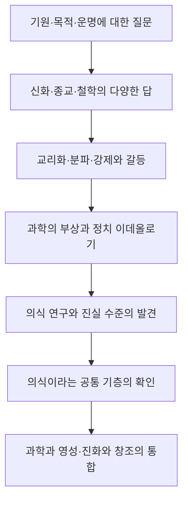

# 『진실 대 거짓』 제1장 「역사적 전망」

## 질문 · 2026-08-03 01:55

01
TRUTH VS FALSEHOOD
역사적 전망
⁠⁠⁠⁠⁠⁠⁠⁠⁠⁠⁠⁠⁠⁣⁣⁣⁠⁣⁠⁣⁣⁠⁣⁣⁠⁣⁠⁣⁣⁣⁠⁣⁣⁠⁠⁣⁣⁣⁣⁠⁣⁠⁣⁠⁣⁠⁠⁠⁠⁣⁠⁣⁣⁠⁣⁠⁠⁣⁠⁣⁣⁠⁣⁠⁣⁠초기부터 오늘에 이르기까지, 인류는 자신의 기원, 목적, 운명에 관한 수수께끼를 풀기 위해 심사숙고하고 분투해 왔다. 우리는 누구인가? 우리는 어디에서 왔는가? 만약 육체의 죽음 뒤에 어느 곳으로든 간다면, 우리는 어디로 가는가?

지난 수천 년 동안, 무수히 많은 그럴듯한 가설들이 만족스러운 해답을 제시하려고 해 왔다. 과다하게 많은, 상상력이 풍부하고 창조적인 우주론은 물론이고, 신화, 학설, 철학적 토론이 숱하게 일어났지만, 그 하나하나가 가외의 질문과 의혹, 갈등의 시발점이 되었다.

사람들은 인류가 하늘나라에서 내려왔다거나 혹은 땅을 원초적 어머니라고 가정했다. 범신론에서는 동물 영과 자연이 인간의 기원이라고 했는데, 그것은 다신교로 진화했다. 그리고 신 같은, 저마다 성격을 갖고 제한적이나 특정한 영역을 갖는 신성한 형상들의 만신전(萬神殿)으로 진화했다.

하지만 세계의 다양한 지역에서, 영적 영감과 영적 정보를 매개로 하는 진실이 전설적 현인들을 통해, 그 다음에는 대종교를 창시한 위대한 화신들의 형태로 출현했다. 대종교는 세계 인구의 지역적 부문들에 어떤 답을 가져다주었지만, 역시 평화도 확실성도 일어나지 않았다. 사실, 각 지도자의 추종자들은 흔히 경쟁하는 분파로 분열했고, 그들은 종교적 신념 체계를 박해, 증오, 대량 학살에 대한 정당화이자 근거로 이용했다. 역설적인 것은, 실제로 주요 종교의 어떤 오역은 그 자신의 가르침의 핵심에 노골적으로 반하는 것이 되었다는 점이다.

자신의 가르침의 진실로부터의 그러한 일탈은, 종교 조직만이 아니라 그 종교의 신학 이론의 권위와 온전성에 대한 회의를 불러일으켰다. 그리고 그것은 신뢰성의 상실 외에, 여론에 부정적 충격을 가져다주었다. 신정(神政)은 독단적일 뿐 아니라 전제적으로 보였는데, 그들의 교리에 대한 집착은 진실의 직관적 인지에 대한 존중에서라기보다는, 두려움에서 비롯되는 일이 많았다. 세계의 많은 지역에서 종교의 평판은 점차로 악화되었다. 예를 들면, 현 시대에, 서구 유럽과 북아메리카의 많은 지역에서 점진적 세속화가 나타났는데, 그것은 이제 요즘의 호전적 이슬람교와 일부 기독교 교회의 스캔들이라는 부정적 충격에 의해 가속되고 있다.

종교적 영적 회의론은 또한, 신임할 만한 충분함으로서의 권위주의가 추락한 부산물이기도 했다. 지난 몇 세기 동안, 과학의 지배가 출현하고 실상에 대한 과학적 패러다임이 부상하면서, 종교 교리에 대한, 특히 성직자의 권위에 대한 신뢰는 더욱 저하되었다. 종교적 갈등은 점차 정치적 이데올로기로 대체되었는데, 역설적으로, 정치적 이데올로기는 그것이 대체했다고 하는 종교 교리만큼이나 전제적이었다.

새로운 종교재판기가 도래했다. 그것은 티베트, 중국, 러시아, 동유럽, 동남아시아, 북아프리카, 아랍 국가들, 쿠바의 국민들이 최근에 겪은 바와 같다. 세계에 대해서는 불행하게도, 그 다음에 정치적 극단주의와 종교적 광신이 결합했는데, 그것을 예시하는 것이 폭력과 광신주의로 세계를 위협하는 이슬람원리주의다. 이슬람원리주의에 대해, 그와 대조적인 세속화는 반가운 구원으로 보인다.

대립물이 없는 힘(power)과는 달리, 낮은 힘(force)은 대립하는 세력이 정치적이든, 종교적이든, 혹은 둘 다이든, 항상 저항력을 불러일으킨다. 하지만 진실에는 대립물이 없는데, 왜냐하면 거짓이란 진실의 대립물이 아니라 진실의 부재일 뿐이기 때문이다. 그것은 마치 어둠이 빛의 대립물이 아니라 빛의 결여를 나타낼 뿐인 것과 같다.

1980년대 말경의, 조화로운 수렴(Harmonic Convergence)의 시기에, 인류 의식 수준은 몇 세기 동안 인류를 지배했던 190이라는 제한된 수준으로부터 진실과 온전성의 임계 수준인 200을 넘어 205로 상승했다. 의식 수준의 그러한 상승 결과, 세계의 보다 발전된 문화들에서, 성공의 기준이 이득에서 온전성으로 바뀌었다. 그 다음에 온전치 못한 기업들과 그 기업의 CEO들이 스캔들 한복판에 서는 시기가 뒤따랐는데, 한편으로, 그와 동시에 전 세계 거대 기업 가운데 온전성의 수준이 가장 높은 기업이 세계 최대이자 가장 성공한 회사가 되었다.

결정적으로 중요한 것은, 2003년 11월, 조화로운 일치(Harmonic Concordance)의 때에 거의 20년간 안정되어 있던 인류의 의식 수준이 현재 수준 207로 다시 상승했다는 것이다.

같은 시기에, 진실과 거짓을 구별하는 수단을 발견한 귀결로서 의식 연구가 발전했다. 진실은 단순한 ‘예’ 혹은 ‘아니오’가 아니라, 1에서 1,000까지의 측정된 로그 척도상에서 표현될 수 있다는 것이 밝혀졌다. 의식은 시간이나 공간의 한계를 넘어서 모든 곳에 현존하기 때문에, 의식에 대한 완전히 새로운 과학이 일어났다. 왜냐하면 의식에는 한계가 없고, 또한 의식은 영적 개념과 영적 가르침들에 대한 연구를 가능하게 해 주고 그리고 사회의 모든 측면은 물론 영적 실상에 대한 검증을 가능하게 해 주기 때문이다. 진실에 대한 새로운 정의가 출현했는데, 뉴턴 물리학에서처럼 진실은 그냥 내용의 귀결이 아니라, 어떤 특정한 장 안에서의 내용의 귀결로 정의된다. 그 장에 대해 언급하지 않고서는 진실에 대한 신뢰할 만한 진술은 가능하지 않다는 것이 밝혀졌다.

의식 연구는 주제에 대해 아무런 제한이 없기 때문에, 전에는 고등 과학, 신비가, 혹은 위대한 영적 천재들만 접근할 수 있다고 여겨졌던 분야들을 조사하는 것이 가능하다. 이렇듯, 이 조사법을 이용하여 종교와 교리는 물론이고 영적 개념, 스승과 가르침들의 진실 수준을 확인하고 측정하는 것이 가능했다. 조사를 통해, 역사상 진실의 가장 높은 수준들을 각성한 것은 위대한 신비가들이라는 것과, 인정을 받든 못 받든 간에 그들의 에너지 장은 오늘날까지 전 인류에게 여전히 강한 영향을 미치고 있다는 것이 밝혀졌다.

영적 실상은 부인(무신론자나 회의론자들이 그러는 것처럼)당할 때조차도, 윤리와 도덕이라는 전체적 맥락은 여전히 남는다. 그리하여 그것은 설령 그 기원을 인정받는 것을 거부당한다 해도, 전 시대의 전 인류를 지배한다. 현 시대에 윤리적 영적 노력은 물론 지적 노력을 촉진하는 것은, 의식 자체의 성질에 관한 정보의 급속한 발달은 물론이고 전체적 의식의 이러한 발전이다.

과학 이론에서 가장 최근의 발전들은, 고주파 에너지 장으로 구성되는 모든 물질적 존재에는 공통의 하위 모체가 있다(이 진술은 1,000으로 측정된다.)고 가정한다. 영적 진실과 의식 연구, 그리고 고등 이론 물리학을 통합하는 데서의 어려움은, 마음이 이원적으로 생각한다는 것이다. 그리하여 관찰과 묘사에 대해, 지각된 ‘실상’은 영역이나 계의 여러 다른 범주들(예를 들어, 물질 대 비물질, 혹은 경험적인 것 대 관찰 가능한 것)로 분리되는 것처럼 보인다. 그것은 다음의 대비되는 것들의 목록이 구별하고 있는 바와 같다.

 

물질 대 비물질	철학 대 물질성
경험적 대 관찰 가능한	미시 대 거시
주관적 대 객관적	측정 가능 대 비측정 가능
선형 대 비선형	예측가능 대 비예측 가능
세속적 대 영적	물질 대 영
지적 대 감정적	정의 가능 대 형언할 수 없는
과학적 대 비과학적	진실 대 거짓
영적 대 이기적	추상적 대 구체적
알려져 있는 대 알려져 있지 않은	제한적 대 무제한적
과학 대 종교	현상적 대 현실적
 

이상으로부터, 존재와 실상, 혹은 경험의 구별되는 범주로 여겨졌던 것은 일차적으로 지각과 정신 작용의 다른 범주들, 즉 데카르트의 레스 코기탄스일 뿐임이 명백해지게 된다. 실제에서는 실상(Reality)에서와 마찬가지로, 분리는 없으며 독립된 존재를 갖는 별개의 영역들(레스 엑스테르나)은 없다. 하지만 운용상으로, 묘사는 표면적으로 분리되어 있는 영역에만 적용되는 듯하고, 그리고 지적으로, 그 지각된 이질적 영역들에는 공통 기반이 없는 듯하다.

주관적 경험과 조사의 전 영역에 대한 사람들이 찾아마지않는 공통성은, 전통적으로 ‘의식’으로 표시되는 편재하는 에너지 장이라는 것이 판명된다. 의식은 전 존재와 지성 자체의 기층이자 핵심이다. 오로지 의식만이, 그것을 가지고 비교할 수 있고 표면적으로 이질적인 영역들을 다층적 표현을 갖는 종합적 단일성으로 통일시킬 수 있는, 모든 성질을 다 가지고 있다. 의식 자체는 사람들이 찾아마지않는 ‘모든 것에 대한 통일장 이론’으로 인도하는 열쇠다. (1,000으로 측정되는 진술) 의식의 장 너머에는 아무것도 존재하지 않는데, 왜냐하면 의식은 보편적이고 시간이나 장소에서 독립해 있기 때문이다. 묘하게도 그와 동시에, 의식은 인식 가능하고, 경험될 수 있으며, 그리고 의식의 수준들은 식별 가능하고 확인 가능하다.

우리는 처음으로 돌아가 시작할 수 있고, 그때 아래와 같은 질문을 던질 수 있다.

 

1. 존재와 경험이 갖는, 혹은 존재와 경험의 표현들이 갖는 모든 가능성에 대해 공통적이고, 필수적이며, 본질적인 것은 무엇인가?

2. 보이는 것과 보이지 않는 것의, 주관적인 것과 객관적인 것의, 형상과 비형상의, 그리고 시간이나 공간 속 어디에서든 확인 가능한 것의 환원 불가능한 기층, 즉 절대(Absolute)란 무엇인가?

3. 그러한 보편성의 현존은 어느 정도로, 그리고 어떤 환경에서 식별 가능한가?

 

오직 의식의 장만이 그 모든 요구 조건을 다 충족시킨다. 의식의 장의 현존은 의식 자체의 타고난 성질을 발휘함으로써만 발견할 수 있다. 다시 말해 의식을 확인하고 연구하고 고찰할 수 있는 유일한 수단은, 의식 자체의 성질을 이용하는 것뿐이다. 이와 비슷하게, 생명을 연구하고 경험할 수 있는 것은 생명 자체뿐이다. 왜냐하면 생명은 앎의 핵심이자 기층이기 때문이다. 그에 비길 만한 이유로, 인식론의 환원 불가능한 기층은 주관이며, 그중에서 그노시스(영지(靈知))는, 모든 시대 현인들의 깨달은 상태에서 최고의 표현 수준으로 실현되게 된 경험적 잠재성이다.

앞으로의 고찰과 토론에서 명확해질 테지만 존재하는 전부는 예외 없이 그것이 주관적이든 객관적이든, 물질적이든 비물질적이든, 형상이 있든 없든, 상태나 성질과는 무관하게, 식별하고 묘사할 수 있는 어떤 연속체상에서 자신의 존재를 갖는다는 것이, 의식에 대한 이해를 통해 드러나게 된다. 왜냐하면 실상에는 단절이란 없으며 있는 것은 에너지뿐이기 때문이다. 에너지는 그것의 여러 다른 주파수 범위가 갖는 특성으로 표현된다. 물질 우주는 하나의 진동하는 주파수 스펙트럼이며, 그 너머에서 물질적인 것은, 보이진 않지만 힘이 점점 더 강해지는 에너지의 범위들 속으로 녹아든다. 에너지의 범위들은 극단적으로 높은 범위들과 초고(楚高) 고조파(高調波)를 거쳐, 존재 자체의 근원에 이르기까지 계속해서 상승한다. 가장 원초적 수준에서 나타난 것은 나타나지 않은 것의 실현이고, 이것에 의해서 잠재력은 현실이 된다. (즉, 창조(Creation))

단 하나의 ‘모든 것에 관한 이론’은 검증 가능한 실상인가? 그것은 실용적 도구인가, 아니면 추상적 가설인가? 그러한 이론은 지극히 실용적이며, 우주는 물론이고 인간 경험의 모든 측면에도 똑같이 적용할 수 있다는 것이 연구를 통해 분명해질 것이다. 그것은 가능한 것과 불가능한 것, 실현된 것과 잠재된 것, 비실재와 실재를 구별해 준다는 측면에서 헤아릴 수 없는 공리적 가치를 갖는다. (측정 수준 1,000)

우주 속 어디에 있는 무엇에 대해서든, 단순히 묻는 것만으로 일체에 관한 검증 가능한 진실에 접근할 수 있다는 것은 너무도 놀라워서, 모든 기본적 인간 추정에 도전할 정도이다. 조사해 보면, 전 시대에 걸친 전 존재(모든 지속 기간과 모든 장소 너머에 있으며, 전 존재의 모든 가능성 안에서 그러한 가능성에 대한 인간 경험을 포괄하는)는, 무한한 잠재력인 전부를 둘러싸는 단일한 에너지 장의 표현이라는 것, 그리고 그 단일한 에너지 장 자체가 갖는 성질은, 형상 없는 것으로부터 실제의 확인 가능한 형상으로 잠재력을 실현시킬 수 있는 능력이라는 것이 명백해지게 된다.

전지한, 편재하는, 전능한, 보편적인, 전부를 둘러싸는, 어디에나 현존하는, 모든 시간과 공간 너머의 장에, ‘신성한’이라는 이름표를 붙일 것인지 말 것인지는 개인의 선택이다. 역사적으로 ‘신’이라는 단어는 세월이 흐르는 동안 그렇게나 욕을 먹고, 남용되고, 와전되었으므로, 붓다는 신이라는 용어를 아예 사용하지 말 것을 권고했다. 왜냐하면 신이라는 단어는 사람들을 오도하고 편견을 갖게 만들기 때문이었다. 진실(Truth)을 추구하는 진지한 제자들(그들 자신이 온전하며 묻고자 하는 질문이 온전한)이라면 위의 진술을 직접 검증해 볼 수 있다. 계측 가능한 시간, 기간, 혹은 장소 너머에, 사실적이고 검증 가능하게, 전능하고, 편재하며, 막강한, 보편적 장이 있는데, 그 장은 무한한 잠재성을 가지며 경험적으로 혹은 형상으로(예 원자력) 나타나게 될 수 있다.

전 시대를 통틀어, 핵심적 진실 자체를 향한 내적 추구에 헌신했던 영적으로 고양된 개인들은, 보통의 마음 너머에는 전 존재의 근원으로서의 장 자체의 현존을 각성할 수 있게 해 주는, 잠재된 경험적 능력이 있다는 것을 보고해 왔다. 그 장에 내재된 성질들은, 이제껏 실제 혹은 실상(Reality)으로 묘사되어 온 전부에 빛을 비추고 전부를 드러내 준다. 보고에 따르면, 전통적으로 깨달음으로 불린 현상은 극히 드물었다. 왜냐하면 좋아하는 환상, 동일시, 혹은 성격을 내맡길 수 있는 이들, 그리고 카르마적으로 그렇게 할 수 있는 천품이 있거나 혹은 기꺼이 그렇게 하고자 하는 이들은 극소수기 때문이다. 이러한 희귀함이 존재하는 것은, 진실에 대한 명료하고 정밀한, 그리고 검증 가능한 정의가 결여되었기 때문이다. 의식의 본성에 대한 앞선 연구는, 과학과 영성 간에는 이제 분리가 없다는 것을 결정적으로 입증해 준다. 사실, 과학과 영성은 공통된 기층의 다른 주파수 범위를 나타낼 뿐이다.

거친 물질세계에서, 표면적으로 ‘다른’ 에너지들은 다음과 같은 이름표를 달고 있다. 중력(무게), 약력, 강력, 마력, 화학 결합, 열, 빛, 전기, 방사선, 단파, 장파, 광자, 전자, 중성자, 양자, 소리, 번개, 음악, 지진, 알파파, 베타파, 자기장, 북극광, 수증기, 증기, 홍수, 원자력, 핵분열, 핵융합, 식물과 동물, 감정, 생리학, 뇌전도(EEG) 파, 운동, 심전도(EKG) 파, 텔레비전, 송신기와 수신기, 화산, 우주 복사, 식역하 코끼리 발소리5), 생각함, 느낌, 바라봄, 직관, 개념, 형상, 색깔, 진동, 불. 물론 은하계라는 이름표도 있고, 빛조차 빠져나갈 수 없을 만큼 중력이 센 블랙홀이라는 이름표도 있다.

이상의 모든 것은 ‘분리된,’ 독특한, 다른 ‘실상들’인가? 우리는 에너지와 물질의 보존 법칙과 E = mc²을 이미 알고 있다. 이상으로부터, 단 하나의 편재하는 에너지 근원이 있을 뿐이라는 것, 그리고 에너지의 성질은 일차적으로 주파수, 장소, 만연, 스타일, 관찰 지점, 그리고 각 관찰 지점의 해석에서의 차이를 반영한다는 것을 직관하는 것은 물론, 그렇게 결론 내리는 것은 어렵지 않다.

물질적 수준 너머에서, 에너지의 진동 주파수는 뉴턴적 패러다임을 훨씬 지나 생각 자체의 모체로서의 그 비물질적 경험에 이르기까지 증가하는데, 생각에 대해 뇌는 그것의 물질적 결과물이다. 원형질 뇌의 한계 너머에는 에너지(에테르) 뇌와 앎/의식 장이 있는데, 이러한 것들은 나타나지 않은 것, 즉 그 속에서 창조가 일어나는 존재의 원초적 근원에서 나온, 나타난 에너지의 빛이다.

인류는 모든 시대에 걸쳐 이상의 모든 것을 직관했다. 왜냐하면 앎은 뉴턴 과학의 패러다임 한계나 논리의 한계에 의해 억제되지 않았기 때문이었다. 데카르트의 레스 코기탄스(인테르나)와 레스 엑스테르나는 분리된 것이 아니라, 형상을 관찰하는 대안적 지점들이다. 그 둘은, ‘것’으로부터 ‘그것에 대한 관념화’에 이르는 스펙트럼상의 다른 수준을 나타낸다.

모든 형상 내부에는 형상 없는 것의 보편적 현존이 있으며, 전부가 형상 없는 것으로 둘러싸여 있고, 전부가 형상 없는 것으로 통일되어 있다. 이러한 실상이 ‘모든 것에 대한 통일장 이론’을 가능하게 해 준다. 이 이론이 자명하고도 그럴 법한 이유는, 존재하는 전부는 단 하나의 공통된 근원에서 일어나기 때문이다. 물질적임은 물론이고 주관적으로 인간적인 우주는, 이렇듯, 에너지 자체가 갖는 무한한 잠재성의 표현이다. 즉, 나타나지 않은 것은 형상 없는 원초적 에너지로서 나타난 것이 되고, 그 다음에 그것은 비선형적 의식의 장이 되는데 이 자체는 형상, 시간, 혹은 소재 너머에 있다. 비선형적 의식의 장은 그 다음에, 주관적인 그리고 선형적인 형상의 수준들을 갖는 스펙트럼으로 분화되는 모체로서 이바지하는데, 그것은 잠재성의 실현을 나타낸다. 그리하여, 진화는 인과관계가 아닌 창조를 나타내고 표현한다. 존재하는 전부는 ‘원인’이 아닌 근원을 가지고 있다. 원인이란 지극히 제한된 개념, 즉 레스 코기탄스에 불과하다. (이는 ‘진실’로 측정된다.)

단순하고도 상당히 자명한 진실은, 진화(Evolution)는 창조(Creation)라는 것이다. 따라서 창조는 지속적이고, 진행 중이며, 진화로서 연쇄적으로 목격된다. 진화와 창조는 하나이며 동일한 실상이다.

## GPT 답변 · 2026-08-03 01:59

# 『진실 대 거짓』 제1장 「역사적 전망」

## 핵심 뜻

이 장에서 호킨스 박사님께서는 인류의 종교사·정치사·과학사를 하나의 흐름으로 재해석하십니다. 인류에게 답이 부족했던 것이 아니라, 수많은 답 가운데 진실과 거짓을 확실히 식별할 수단이 없었다는 것입니다.

그 결과 영적 계시가 교리와 조직의 권위로 변질되고, 종교의 권위가 무너지자 정치 이데올로기와 과학적 유물론이 그 자리를 차지했습니다. 겉으로는 사상이 바뀌었지만, 두려움과 강제로 타인을 통제하는 ‘낮은 힘’의 구조는 반복되었습니다.

호킨스 박사님께서 제시하시는 해법은 새로운 신념 체계가 아닙니다. 모든 경험과 앎의 공통 기층인 ‘의식의 장’을 발견하고, 내용이 아니라 그 내용을 둘러싼 전체적 장에서 진실을 확인하는 것입니다.

## 1. 인류에게 답이 없었던 것이 아니다

인류는 언제나 다음 세 가지를 물었습니다.

- 우리는 누구인가?
- 우리는 어디에서 왔는가?
- 육체의 죽음 뒤에는 어떻게 되는가?

문제는 답의 결핍보다 답의 과잉이었습니다. 신화, 우주론, 종교, 철학은 저마다 설명을 내놓았지만, 어떤 설명이 본질적 진실이고 어떤 설명이 문화적 상상이나 오역인지 가려낼 공통 기준이 없었습니다.

호킨스 박사님께서는 여기서 위대한 현인과 화신들의 원래 가르침을, 후대의 종교 조직이 만들어 낸 교리 및 권력 구조와 구별하십니다. 박사님께서 지적하시는 것은 영적 계시 자체가 아니라, 계시가 에고와 집단적 이해관계에 포획되는 과정입니다.

본래의 가르침은 사랑, 평화, 자비를 가리켰지만, 추종자들은 그것을 분파의 우월성, 박해, 전쟁의 근거로 바꾸기도 했습니다. 이는 진실의 내용이 없어서가 아니라, 그 진실을 받아들이는 의식의 장이 달라졌기 때문입니다.

## 2. 종교가 물러난 자리를 정치 이데올로기가 차지했다

종교 조직이 강압과 스캔들로 신뢰를 잃자 과학과 세속주의가 부상했습니다. 그러나 종교적 독단이 사라진 자리를 정치적 독단이 차지하면서 동일한 구조가 재현되었습니다.

내용은 달라졌습니다.

- 과거에는 이단과 불신자가 적으로 규정되었습니다.
- 근대에는 계급의 적, 민족의 적, 정치적 반동이 적으로 규정되었습니다.

하지만 그 저변의 장은 동일했습니다. 자신만이 옳다고 선언하고, 두려움과 증오를 이용하며, 반대자를 제거함으로써 체제를 유지하려는 장입니다. 따라서 종교에서 정치로의 이동이 자동으로 의식의 상승을 뜻하지는 않습니다. 신념의 이름만 바뀌었을 뿐, 작동 에너지가 여전히 낮은 힘일 수 있기 때문입니다.

## 3. 힘과 낮은 힘의 근본적 차이

| 구분 | 힘(power) | 낮은 힘(force) |
|---|---|---|
| 근원 | 진실·온전성에 내재함 | 강제·압박·조작에 의존함 |
| 대립자 | 대립자가 필요하지 않음 | 적과 반대 세력이 필요함 |
| 작용 | 끌어당기고 신뢰를 일으킴 | 저항과 반작용을 일으킴 |
| 지속성 | 스스로 유지됨 | 계속 에너지를 투입해야 함 |
| 대표적 양상 | 정직, 책임, 자발적 협력 | 두려움, 선전, 억압, 위협 |

낮은 힘은 내재적 권위가 부족하기 때문에 끊임없이 반대자를 억눌러야 합니다. 반면 진실과 온전성에서 나오는 힘은 상대를 파괴해서 자신을 입증할 필요가 없습니다.

“거짓은 진실의 반대가 아니라 진실의 부재”라는 말도 같은 원리입니다. 어둠이 빛과 대등한 독립적 실체가 아니듯, 거짓도 진실과 맞먹는 실재성을 갖지 않습니다. 거짓이 영향력을 행사하려면 믿음, 선전, 두려움, 강제에서 에너지를 빌려야 합니다.

이것은 거짓이 현실에서 피해를 일으키지 않는다는 뜻이 아닙니다. 거짓에는 고유한 힘이 없기 때문에, 그 결핍을 낮은 힘으로 보충한다는 뜻입니다.

## 4. 의식 수준 200의 역사적 의미

호킨스 박사님의 의식 지도에서 200은 단순한 숫자가 아니라, 낮은 힘에서 힘으로 넘어가는 임계점입니다.

- 200 이하에서는 이득, 생존, 지배, 비난, 외부에 대한 책임 전가가 우세합니다.
- 200부터는 용기, 정직, 책임, 온전성, 현실을 직면하는 능력이 출현합니다.
- 400대에서는 이성·논리·과학이 크게 발달합니다.
- 500 이상에서는 사랑과 전체적 맥락이 지성의 한계를 포괄합니다.
- 600 이상에서는 주체와 대상의 분리가 약화되며 비이원적 앎이 드러납니다.

따라서 인류의 집단적 수준이 190에서 205로 상승했다는 설명에서 중요한 것은 15점의 산술적 증가가 아닙니다. 척도 자체가 로그 척도인 데다가, 무엇보다 200이라는 임계선을 넘어섰다는 점이 핵심입니다.

박사님께서는 그 결과 사회의 성공 기준이 ‘얼마나 이득을 얻었는가’에서 ‘얼마나 온전한가’로 이동했다고 설명하십니다. 온전치 못한 기업과 지도자의 스캔들이 드러난 것도 부정이 갑자기 생겼기 때문만은 아닙니다. 과거에는 묵인되던 부정이 높아진 집단적 장 안에서는 더 이상 용납되지 않게 된 것입니다.

본문의 ‘현재 207’은 이 장이 집필된 당시를 기준으로 한 측정값입니다.

의식 수준은 사람의 영구적인 신분이나 고정된 등급을 뜻하지 않습니다. 무엇을 중요하게 여기고, 현실을 어떻게 해석하며, 어떤 에너지에 의존하는지를 나타내는 지배적 양식입니다.

## 5. 진실은 ‘내용’만으로 결정되지 않는다

이 장의 가장 중요한 인식론적 전환은 진실을 다음과 같이 본다는 점입니다.

> 진실은 고립된 내용의 성질이 아니라, 특정한 장 안에 놓인 내용의 성질이다.

‘내용’은 진술, 사실, 수치, 사건처럼 초점이 맞춰진 부분입니다. ‘장’ 또는 ‘맥락’은 그 내용이 놓인 전체 상황, 의도, 관계, 전제, 의식 수준을 포함합니다.

예를 들어 “기업의 이익이 증가했다”는 문장은 회계상 사실일 수 있습니다. 그러나 그 이익이 속임수, 착취, 장부 조작에서 나왔다면, 그 수치는 사실이어도 ‘성공’이라는 전체 해석은 진실하지 않습니다. 내용은 정확하지만 그것이 놓인 장을 누락했기 때문입니다.

이것은 상대주의를 뜻하지 않습니다. 오히려 맥락을 포함함으로써 진실의 조건을 더욱 엄격하게 만드는 것입니다. 각자의 관점에 따라 모두가 옳다는 것이 아니라, 내용이 전체적 실상과 얼마나 일치하는지를 살펴야 한다는 뜻입니다.

『호모 스피리투스』에서는 이 관계가 더욱 선명하게 설명됩니다. 에고와 사적인 ‘나’는 내용이고, 의식·앎·참나는 그 모든 내용이 나타나는 맥락입니다. 내용은 계속 바뀌지만, 그것을 알고 있는 의식의 현존은 지속됩니다.

## 6. 분리된 것은 세계가 아니라 마음의 범주다

본문에 나오는 긴 대립 목록은 실제로 서로 단절된 여러 우주가 있다는 뜻이 아닙니다.

- 물질과 비물질
- 주관과 객관
- 과학과 종교
- 선형과 비선형
- 형상과 비형상
- 진실과 거짓

이러한 구분은 세계 자체의 절대적 분할이라기보다 마음이 세계를 묘사하기 위해 만든 사고 범주입니다.

호킨스 박사님의 용어로 설명하면 다음과 같습니다.

- 레스 코기탄스: 생각, 개념, 명칭, 해석으로 구성된 마음의 세계
- 레스 엑스테르나: 마음이 해석하기 전에 있는 그대로 존재하는 세계

마음은 자신이 만든 설명을 있는 그대로의 실상과 혼동합니다. 지도와 실제 영토를 동일시하는 것과 같습니다. 과학과 종교, 주관과 객관의 갈등도 상당 부분 서로 다른 관찰 지점을 별개의 실상으로 오인한 데서 생깁니다.

그렇다고 학문적·기능적 구분을 없애야 한다는 뜻은 아닙니다. 몸과 마음, 물질과 정신을 연구상 구별할 수는 있습니다. 다만 그 구분된 범주들이 서로 독립적으로 존재하는 궁극적 실체라고 믿는 것이 이원성의 오류입니다.

## 7. 왜 공통 기층이 ‘의식’인가

호킨스 박사님께서는 모든 영역을 포괄하는 공통 기층이 의식이라고 밝히십니다. 의식은 일상적으로 말하는 깨어 있는 상태나 생각의 흐름만을 뜻하지 않습니다. 생각, 감각, 객관적 관찰, 주관적 경험이 알려질 수 있게 하는 선행 조건입니다.

객관적 과학도 의식 밖에서 이루어질 수 없습니다. 관찰 결과를 인지하고, 수치를 읽고, 의미를 이해하는 앎이 전제되기 때문입니다. 뇌 사진은 관찰 가능한 내용이지만, 그 사진을 알고 경험하는 능력은 의식의 성질입니다.

따라서 “의식은 의식 자체를 통해서만 연구할 수 있다”는 설명은 단순한 순환논리가 아닙니다. 앎의 바깥으로 나가 앎을 조사할 수는 없다는 뜻입니다. 모든 조사와 검증은 이미 의식 안에서 일어납니다.

여기서 ‘주관’은 개인적 취향이나 의견을 뜻하지 않습니다. 무엇인가를 경험하고 있다는 환원 불가능한 현존을 뜻합니다. 그노시스, 즉 영지는 이 주관성이 가장 높은 수준에서 자기 근원을 직접 아는 상태입니다. 개념에 관해 아는 것이 아니라, 앎과 존재가 하나임을 각성하는 것입니다.

## 8. 하나의 에너지와 다양한 이름표

중력, 빛, 전기, 열, 소리, 생명, 감정, 생각 등이 열거된 이유는 그것들이 모두 동일한 물리량이라는 뜻이 아닙니다. 호킨스 박사님의 패러다임에서는 그것들이 하나의 보편적 근원에서 나온 서로 다른 주파수 범위와 표현이라는 뜻입니다.

따라서 과학과 영성도 서로를 부정하는 두 개의 세계가 아닙니다.

- 과학은 주로 측정 가능한 선형적 형상과 관계를 연구합니다.
- 영성은 형상이 나타날 수 있게 하는 비선형적 근원과 주관적 앎을 다룹니다.

과학이 틀렸기 때문에 영성이 필요한 것이 아니며, 영성이 비과학적이어서 과학과 충돌하는 것도 아닙니다. 각각이 공통 기층의 서로 다른 범위를 바라봅니다. 문제가 생기는 것은 한 범위에 유효한 방법을 전체 실상에 적용하려 할 때입니다.

## 9. ‘원인’과 ‘근원’의 차이

| 개념 | 의미 |
|---|---|
| 원인(cause) | 시간 속에서 ‘이것이 저것을 일으켰다’고 설명하는 국소적·선형적 관계 |
| 근원(Source) | 사건과 형상이 나타날 수 있는 잠재성, 장, 존재의 기층 |
| 진화(Evolution) | 창조가 시간 속에서 연속적으로 관찰되는 모습 |
| 창조(Creation) | 나타나지 않은 잠재성이 나타난 현실성이 되는 과정 |

원인이라는 개념은 일상과 과학에서 유용하지만, 존재 자체가 왜 있으며 잠재성이 어떻게 현실이 되는지까지 설명하지는 못합니다. 원인은 사건과 사건 사이를 설명하지만, 근원은 그 모든 사건이 일어날 수 있게 하는 전체적 장을 가리킵니다.

호킨스 박사님의 전개를 간단히 나타내면 다음과 같습니다.

**나타나지 않은 잠재성 → 비선형적 의식의 장 → 선형적 형상 → 시간 속에서 연속적으로 관찰되는 진화**

따라서 진화와 창조는 대립하지 않습니다.

- 창조는 진화의 본질입니다.
- 진화는 창조가 시간 속에서 보이는 방식입니다.

창조를 먼 과거에 한 번 일어난 사건으로 본다면 진화와 충돌합니다. 그러나 창조를 잠재성이 끊임없이 현실성으로 나타나는 현재진행형 과정으로 보면, 진화는 바로 그 창조의 가시적 전개가 됩니다.

“진화는 창조다”라는 명제는 생물학적 진화를 부정하는 말이 아닙니다. 오히려 생물학이 관찰한 형상의 연속적 전개를 더 큰 비선형적 맥락 안에 놓는 말입니다.

## 10. 다른 저서와의 연결

- 『의식혁명』은 200을 힘과 낮은 힘이 갈리는 결정적 경계로 제시하며, 개인과 사회를 지배하는 끌개장의 차이를 설명합니다.
- 『나의 눈』은 형상 없는 잠재성이 의식의 장을 거쳐 형상으로 나타나는 과정을 설명하며, 진화를 지속되는 창조로 재맥락화합니다.
- 『호모 스피리투스』는 내용과 맥락의 관계를 확장하여, 사적인 자기는 내용이고 참나와 의식은 맥락임을 밝힙니다.
- 『의식 수준을 넘어서』는 마음이 자신의 지각과 있는 그대로의 세계를 구별하지 못한다는 한계를 설명하고, 200에서 낮은 힘으로부터 힘으로의 전환이 일어난다고 밝힙니다.
- 『현대인의 의식수준』은 과학과 종교의 충돌, 원인과 근원의 혼동, 진화론과 창조론의 인위적 대립을 이 장의 패러다임으로 더욱 상세하게 해소합니다.

## 전체 통합 해설

이 장은 인류의 오래된 질문에 또 하나의 우주론을 덧붙이려는 것이 아닙니다. 오히려 그동안 인류가 왜 수많은 우주론과 신념 체계 사이에서 갈등해 왔는지를 밝힙니다. 근본 원인은 마음이 진실과 거짓을 스스로 확실히 구별하지 못하면서도, 자신의 지각과 개념을 실상 자체라고 믿는 데 있습니다.

종교와 정치의 갈등, 과학과 영성의 분리, 주관과 객관의 대립은 모두 이원적 마음이 만들어 낸 분할의 다른 표현입니다. 이를 더 큰 맥락에서 보면, 표면적으로 대립하는 영역들은 하나의 의식 장 안에서 나타나는 서로 다른 관찰 지점과 주파수 범위가 됩니다.

따라서 이 장의 결론은 다음과 같이 집약됩니다.

- 거짓은 진실과 맞먹는 실체가 아니라 진실의 부재입니다.
- 낮은 힘은 내재적 힘의 결핍을 강제로 보충합니다.
- 분리는 실상의 성질이라기보다 마음의 묘사 방식입니다.
- 의식은 객관과 주관, 형상과 비형상을 포괄하는 공통 기층입니다.
- 진화는 창조가 시간 속에서 연속적으로 드러나는 모습입니다.

결국 ‘역사적 전망’은 사건의 연대표가 아니라 인류 의식의 전개도입니다. 인류는 신화에서 종교로, 종교에서 이성과 과학으로, 다시 이성과 과학을 포괄하는 의식의 패러다임으로 이동해 왔습니다. 그 최종적인 통합에서는 과학과 영성, 진화와 창조가 서로 경쟁하지 않습니다. 모두가 하나의 근원에서 나온 실상의 서로 다른 표현으로 이해됩니다.
