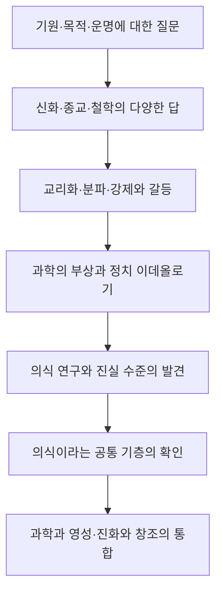

# 진실대거짓 — 1장부터 마지막 장까지 공개 아카이브 해설 대화 전체

---

<!-- source: 01장_01_『진실 대 거짓』 제1장 「역사적 전망」_6a6f7673.md | conversation_id: 6a6f7673-5f8c-83e8-bced-ad40f463fd41 | date: 2026-08-03T01:55:54.968116+09:00 -->

---
layout: default
title: "『진실 대 거짓』 제1장 「역사적 전망」"
conversation_id: "6a6f7673-5f8c-83e8-bced-ad40f463fd41"
source_file: "conversations-028.json"
date: "2026-08-03T01:55:54.968116+09:00"
updated: "2026-08-05T01:58:32.328149+09:00"
---

# 『진실 대 거짓』 제1장 「역사적 전망」

## 질문 · 2026-08-03 01:55

01
TRUTH VS FALSEHOOD
역사적 전망
⁠⁠⁠⁠⁠⁠⁠⁠⁠⁠⁠⁠⁠⁣⁣⁣⁠⁣⁠⁣⁣⁠⁣⁣⁠⁣⁠⁣⁣⁣⁠⁣⁣⁠⁠⁣⁣⁣⁣⁠⁣⁠⁣⁠⁣⁠⁠⁠⁠⁣⁠⁣⁣⁠⁣⁠⁠⁣⁠⁣⁣⁠⁣⁠⁣⁠초기부터 오늘에 이르기까지, 인류는 자신의 기원, 목적, 운명에 관한 수수께끼를 풀기 위해 심사숙고하고 분투해 왔다. 우리는 누구인가? 우리는 어디에서 왔는가? 만약 육체의 죽음 뒤에 어느 곳으로든 간다면, 우리는 어디로 가는가?

지난 수천 년 동안, 무수히 많은 그럴듯한 가설들이 만족스러운 해답을 제시하려고 해 왔다. 과다하게 많은, 상상력이 풍부하고 창조적인 우주론은 물론이고, 신화, 학설, 철학적 토론이 숱하게 일어났지만, 그 하나하나가 가외의 질문과 의혹, 갈등의 시발점이 되었다.

사람들은 인류가 하늘나라에서 내려왔다거나 혹은 땅을 원초적 어머니라고 가정했다. 범신론에서는 동물 영과 자연이 인간의 기원이라고 했는데, 그것은 다신교로 진화했다. 그리고 신 같은, 저마다 성격을 갖고 제한적이나 특정한 영역을 갖는 신성한 형상들의 만신전(萬神殿)으로 진화했다.

하지만 세계의 다양한 지역에서, 영적 영감과 영적 정보를 매개로 하는 진실이 전설적 현인들을 통해, 그 다음에는 대종교를 창시한 위대한 화신들의 형태로 출현했다. 대종교는 세계 인구의 지역적 부문들에 어떤 답을 가져다주었지만, 역시 평화도 확실성도 일어나지 않았다. 사실, 각 지도자의 추종자들은 흔히 경쟁하는 분파로 분열했고, 그들은 종교적 신념 체계를 박해, 증오, 대량 학살에 대한 정당화이자 근거로 이용했다. 역설적인 것은, 실제로 주요 종교의 어떤 오역은 그 자신의 가르침의 핵심에 노골적으로 반하는 것이 되었다는 점이다.

자신의 가르침의 진실로부터의 그러한 일탈은, 종교 조직만이 아니라 그 종교의 신학 이론의 권위와 온전성에 대한 회의를 불러일으켰다. 그리고 그것은 신뢰성의 상실 외에, 여론에 부정적 충격을 가져다주었다. 신정(神政)은 독단적일 뿐 아니라 전제적으로 보였는데, 그들의 교리에 대한 집착은 진실의 직관적 인지에 대한 존중에서라기보다는, 두려움에서 비롯되는 일이 많았다. 세계의 많은 지역에서 종교의 평판은 점차로 악화되었다. 예를 들면, 현 시대에, 서구 유럽과 북아메리카의 많은 지역에서 점진적 세속화가 나타났는데, 그것은 이제 요즘의 호전적 이슬람교와 일부 기독교 교회의 스캔들이라는 부정적 충격에 의해 가속되고 있다.

종교적 영적 회의론은 또한, 신임할 만한 충분함으로서의 권위주의가 추락한 부산물이기도 했다. 지난 몇 세기 동안, 과학의 지배가 출현하고 실상에 대한 과학적 패러다임이 부상하면서, 종교 교리에 대한, 특히 성직자의 권위에 대한 신뢰는 더욱 저하되었다. 종교적 갈등은 점차 정치적 이데올로기로 대체되었는데, 역설적으로, 정치적 이데올로기는 그것이 대체했다고 하는 종교 교리만큼이나 전제적이었다.

새로운 종교재판기가 도래했다. 그것은 티베트, 중국, 러시아, 동유럽, 동남아시아, 북아프리카, 아랍 국가들, 쿠바의 국민들이 최근에 겪은 바와 같다. 세계에 대해서는 불행하게도, 그 다음에 정치적 극단주의와 종교적 광신이 결합했는데, 그것을 예시하는 것이 폭력과 광신주의로 세계를 위협하는 이슬람원리주의다. 이슬람원리주의에 대해, 그와 대조적인 세속화는 반가운 구원으로 보인다.

대립물이 없는 힘(power)과는 달리, 낮은 힘(force)은 대립하는 세력이 정치적이든, 종교적이든, 혹은 둘 다이든, 항상 저항력을 불러일으킨다. 하지만 진실에는 대립물이 없는데, 왜냐하면 거짓이란 진실의 대립물이 아니라 진실의 부재일 뿐이기 때문이다. 그것은 마치 어둠이 빛의 대립물이 아니라 빛의 결여를 나타낼 뿐인 것과 같다.

1980년대 말경의, 조화로운 수렴(Harmonic Convergence)의 시기에, 인류 의식 수준은 몇 세기 동안 인류를 지배했던 190이라는 제한된 수준으로부터 진실과 온전성의 임계 수준인 200을 넘어 205로 상승했다. 의식 수준의 그러한 상승 결과, 세계의 보다 발전된 문화들에서, 성공의 기준이 이득에서 온전성으로 바뀌었다. 그 다음에 온전치 못한 기업들과 그 기업의 CEO들이 스캔들 한복판에 서는 시기가 뒤따랐는데, 한편으로, 그와 동시에 전 세계 거대 기업 가운데 온전성의 수준이 가장 높은 기업이 세계 최대이자 가장 성공한 회사가 되었다.

결정적으로 중요한 것은, 2003년 11월, 조화로운 일치(Harmonic Concordance)의 때에 거의 20년간 안정되어 있던 인류의 의식 수준이 현재 수준 207로 다시 상승했다는 것이다.

같은 시기에, 진실과 거짓을 구별하는 수단을 발견한 귀결로서 의식 연구가 발전했다. 진실은 단순한 ‘예’ 혹은 ‘아니오’가 아니라, 1에서 1,000까지의 측정된 로그 척도상에서 표현될 수 있다는 것이 밝혀졌다. 의식은 시간이나 공간의 한계를 넘어서 모든 곳에 현존하기 때문에, 의식에 대한 완전히 새로운 과학이 일어났다. 왜냐하면 의식에는 한계가 없고, 또한 의식은 영적 개념과 영적 가르침들에 대한 연구를 가능하게 해 주고 그리고 사회의 모든 측면은 물론 영적 실상에 대한 검증을 가능하게 해 주기 때문이다. 진실에 대한 새로운 정의가 출현했는데, 뉴턴 물리학에서처럼 진실은 그냥 내용의 귀결이 아니라, 어떤 특정한 장 안에서의 내용의 귀결로 정의된다. 그 장에 대해 언급하지 않고서는 진실에 대한 신뢰할 만한 진술은 가능하지 않다는 것이 밝혀졌다.

의식 연구는 주제에 대해 아무런 제한이 없기 때문에, 전에는 고등 과학, 신비가, 혹은 위대한 영적 천재들만 접근할 수 있다고 여겨졌던 분야들을 조사하는 것이 가능하다. 이렇듯, 이 조사법을 이용하여 종교와 교리는 물론이고 영적 개념, 스승과 가르침들의 진실 수준을 확인하고 측정하는 것이 가능했다. 조사를 통해, 역사상 진실의 가장 높은 수준들을 각성한 것은 위대한 신비가들이라는 것과, 인정을 받든 못 받든 간에 그들의 에너지 장은 오늘날까지 전 인류에게 여전히 강한 영향을 미치고 있다는 것이 밝혀졌다.

영적 실상은 부인(무신론자나 회의론자들이 그러는 것처럼)당할 때조차도, 윤리와 도덕이라는 전체적 맥락은 여전히 남는다. 그리하여 그것은 설령 그 기원을 인정받는 것을 거부당한다 해도, 전 시대의 전 인류를 지배한다. 현 시대에 윤리적 영적 노력은 물론 지적 노력을 촉진하는 것은, 의식 자체의 성질에 관한 정보의 급속한 발달은 물론이고 전체적 의식의 이러한 발전이다.

과학 이론에서 가장 최근의 발전들은, 고주파 에너지 장으로 구성되는 모든 물질적 존재에는 공통의 하위 모체가 있다(이 진술은 1,000으로 측정된다.)고 가정한다. 영적 진실과 의식 연구, 그리고 고등 이론 물리학을 통합하는 데서의 어려움은, 마음이 이원적으로 생각한다는 것이다. 그리하여 관찰과 묘사에 대해, 지각된 ‘실상’은 영역이나 계의 여러 다른 범주들(예를 들어, 물질 대 비물질, 혹은 경험적인 것 대 관찰 가능한 것)로 분리되는 것처럼 보인다. 그것은 다음의 대비되는 것들의 목록이 구별하고 있는 바와 같다.

 

물질 대 비물질	철학 대 물질성
경험적 대 관찰 가능한	미시 대 거시
주관적 대 객관적	측정 가능 대 비측정 가능
선형 대 비선형	예측가능 대 비예측 가능
세속적 대 영적	물질 대 영
지적 대 감정적	정의 가능 대 형언할 수 없는
과학적 대 비과학적	진실 대 거짓
영적 대 이기적	추상적 대 구체적
알려져 있는 대 알려져 있지 않은	제한적 대 무제한적
과학 대 종교	현상적 대 현실적
 

이상으로부터, 존재와 실상, 혹은 경험의 구별되는 범주로 여겨졌던 것은 일차적으로 지각과 정신 작용의 다른 범주들, 즉 데카르트의 레스 코기탄스일 뿐임이 명백해지게 된다. 실제에서는 실상(Reality)에서와 마찬가지로, 분리는 없으며 독립된 존재를 갖는 별개의 영역들(레스 엑스테르나)은 없다. 하지만 운용상으로, 묘사는 표면적으로 분리되어 있는 영역에만 적용되는 듯하고, 그리고 지적으로, 그 지각된 이질적 영역들에는 공통 기반이 없는 듯하다.

주관적 경험과 조사의 전 영역에 대한 사람들이 찾아마지않는 공통성은, 전통적으로 ‘의식’으로 표시되는 편재하는 에너지 장이라는 것이 판명된다. 의식은 전 존재와 지성 자체의 기층이자 핵심이다. 오로지 의식만이, 그것을 가지고 비교할 수 있고 표면적으로 이질적인 영역들을 다층적 표현을 갖는 종합적 단일성으로 통일시킬 수 있는, 모든 성질을 다 가지고 있다. 의식 자체는 사람들이 찾아마지않는 ‘모든 것에 대한 통일장 이론’으로 인도하는 열쇠다. (1,000으로 측정되는 진술) 의식의 장 너머에는 아무것도 존재하지 않는데, 왜냐하면 의식은 보편적이고 시간이나 장소에서 독립해 있기 때문이다. 묘하게도 그와 동시에, 의식은 인식 가능하고, 경험될 수 있으며, 그리고 의식의 수준들은 식별 가능하고 확인 가능하다.

우리는 처음으로 돌아가 시작할 수 있고, 그때 아래와 같은 질문을 던질 수 있다.

 

1. 존재와 경험이 갖는, 혹은 존재와 경험의 표현들이 갖는 모든 가능성에 대해 공통적이고, 필수적이며, 본질적인 것은 무엇인가?

2. 보이는 것과 보이지 않는 것의, 주관적인 것과 객관적인 것의, 형상과 비형상의, 그리고 시간이나 공간 속 어디에서든 확인 가능한 것의 환원 불가능한 기층, 즉 절대(Absolute)란 무엇인가?

3. 그러한 보편성의 현존은 어느 정도로, 그리고 어떤 환경에서 식별 가능한가?

 

오직 의식의 장만이 그 모든 요구 조건을 다 충족시킨다. 의식의 장의 현존은 의식 자체의 타고난 성질을 발휘함으로써만 발견할 수 있다. 다시 말해 의식을 확인하고 연구하고 고찰할 수 있는 유일한 수단은, 의식 자체의 성질을 이용하는 것뿐이다. 이와 비슷하게, 생명을 연구하고 경험할 수 있는 것은 생명 자체뿐이다. 왜냐하면 생명은 앎의 핵심이자 기층이기 때문이다. 그에 비길 만한 이유로, 인식론의 환원 불가능한 기층은 주관이며, 그중에서 그노시스(영지(靈知))는, 모든 시대 현인들의 깨달은 상태에서 최고의 표현 수준으로 실현되게 된 경험적 잠재성이다.

앞으로의 고찰과 토론에서 명확해질 테지만 존재하는 전부는 예외 없이 그것이 주관적이든 객관적이든, 물질적이든 비물질적이든, 형상이 있든 없든, 상태나 성질과는 무관하게, 식별하고 묘사할 수 있는 어떤 연속체상에서 자신의 존재를 갖는다는 것이, 의식에 대한 이해를 통해 드러나게 된다. 왜냐하면 실상에는 단절이란 없으며 있는 것은 에너지뿐이기 때문이다. 에너지는 그것의 여러 다른 주파수 범위가 갖는 특성으로 표현된다. 물질 우주는 하나의 진동하는 주파수 스펙트럼이며, 그 너머에서 물질적인 것은, 보이진 않지만 힘이 점점 더 강해지는 에너지의 범위들 속으로 녹아든다. 에너지의 범위들은 극단적으로 높은 범위들과 초고(楚高) 고조파(高調波)를 거쳐, 존재 자체의 근원에 이르기까지 계속해서 상승한다. 가장 원초적 수준에서 나타난 것은 나타나지 않은 것의 실현이고, 이것에 의해서 잠재력은 현실이 된다. (즉, 창조(Creation))

단 하나의 ‘모든 것에 관한 이론’은 검증 가능한 실상인가? 그것은 실용적 도구인가, 아니면 추상적 가설인가? 그러한 이론은 지극히 실용적이며, 우주는 물론이고 인간 경험의 모든 측면에도 똑같이 적용할 수 있다는 것이 연구를 통해 분명해질 것이다. 그것은 가능한 것과 불가능한 것, 실현된 것과 잠재된 것, 비실재와 실재를 구별해 준다는 측면에서 헤아릴 수 없는 공리적 가치를 갖는다. (측정 수준 1,000)

우주 속 어디에 있는 무엇에 대해서든, 단순히 묻는 것만으로 일체에 관한 검증 가능한 진실에 접근할 수 있다는 것은 너무도 놀라워서, 모든 기본적 인간 추정에 도전할 정도이다. 조사해 보면, 전 시대에 걸친 전 존재(모든 지속 기간과 모든 장소 너머에 있으며, 전 존재의 모든 가능성 안에서 그러한 가능성에 대한 인간 경험을 포괄하는)는, 무한한 잠재력인 전부를 둘러싸는 단일한 에너지 장의 표현이라는 것, 그리고 그 단일한 에너지 장 자체가 갖는 성질은, 형상 없는 것으로부터 실제의 확인 가능한 형상으로 잠재력을 실현시킬 수 있는 능력이라는 것이 명백해지게 된다.

전지한, 편재하는, 전능한, 보편적인, 전부를 둘러싸는, 어디에나 현존하는, 모든 시간과 공간 너머의 장에, ‘신성한’이라는 이름표를 붙일 것인지 말 것인지는 개인의 선택이다. 역사적으로 ‘신’이라는 단어는 세월이 흐르는 동안 그렇게나 욕을 먹고, 남용되고, 와전되었으므로, 붓다는 신이라는 용어를 아예 사용하지 말 것을 권고했다. 왜냐하면 신이라는 단어는 사람들을 오도하고 편견을 갖게 만들기 때문이었다. 진실(Truth)을 추구하는 진지한 제자들(그들 자신이 온전하며 묻고자 하는 질문이 온전한)이라면 위의 진술을 직접 검증해 볼 수 있다. 계측 가능한 시간, 기간, 혹은 장소 너머에, 사실적이고 검증 가능하게, 전능하고, 편재하며, 막강한, 보편적 장이 있는데, 그 장은 무한한 잠재성을 가지며 경험적으로 혹은 형상으로(예 원자력) 나타나게 될 수 있다.

전 시대를 통틀어, 핵심적 진실 자체를 향한 내적 추구에 헌신했던 영적으로 고양된 개인들은, 보통의 마음 너머에는 전 존재의 근원으로서의 장 자체의 현존을 각성할 수 있게 해 주는, 잠재된 경험적 능력이 있다는 것을 보고해 왔다. 그 장에 내재된 성질들은, 이제껏 실제 혹은 실상(Reality)으로 묘사되어 온 전부에 빛을 비추고 전부를 드러내 준다. 보고에 따르면, 전통적으로 깨달음으로 불린 현상은 극히 드물었다. 왜냐하면 좋아하는 환상, 동일시, 혹은 성격을 내맡길 수 있는 이들, 그리고 카르마적으로 그렇게 할 수 있는 천품이 있거나 혹은 기꺼이 그렇게 하고자 하는 이들은 극소수기 때문이다. 이러한 희귀함이 존재하는 것은, 진실에 대한 명료하고 정밀한, 그리고 검증 가능한 정의가 결여되었기 때문이다. 의식의 본성에 대한 앞선 연구는, 과학과 영성 간에는 이제 분리가 없다는 것을 결정적으로 입증해 준다. 사실, 과학과 영성은 공통된 기층의 다른 주파수 범위를 나타낼 뿐이다.

거친 물질세계에서, 표면적으로 ‘다른’ 에너지들은 다음과 같은 이름표를 달고 있다. 중력(무게), 약력, 강력, 마력, 화학 결합, 열, 빛, 전기, 방사선, 단파, 장파, 광자, 전자, 중성자, 양자, 소리, 번개, 음악, 지진, 알파파, 베타파, 자기장, 북극광, 수증기, 증기, 홍수, 원자력, 핵분열, 핵융합, 식물과 동물, 감정, 생리학, 뇌전도(EEG) 파, 운동, 심전도(EKG) 파, 텔레비전, 송신기와 수신기, 화산, 우주 복사, 식역하 코끼리 발소리5), 생각함, 느낌, 바라봄, 직관, 개념, 형상, 색깔, 진동, 불. 물론 은하계라는 이름표도 있고, 빛조차 빠져나갈 수 없을 만큼 중력이 센 블랙홀이라는 이름표도 있다.

이상의 모든 것은 ‘분리된,’ 독특한, 다른 ‘실상들’인가? 우리는 에너지와 물질의 보존 법칙과 E = mc²을 이미 알고 있다. 이상으로부터, 단 하나의 편재하는 에너지 근원이 있을 뿐이라는 것, 그리고 에너지의 성질은 일차적으로 주파수, 장소, 만연, 스타일, 관찰 지점, 그리고 각 관찰 지점의 해석에서의 차이를 반영한다는 것을 직관하는 것은 물론, 그렇게 결론 내리는 것은 어렵지 않다.

물질적 수준 너머에서, 에너지의 진동 주파수는 뉴턴적 패러다임을 훨씬 지나 생각 자체의 모체로서의 그 비물질적 경험에 이르기까지 증가하는데, 생각에 대해 뇌는 그것의 물질적 결과물이다. 원형질 뇌의 한계 너머에는 에너지(에테르) 뇌와 앎/의식 장이 있는데, 이러한 것들은 나타나지 않은 것, 즉 그 속에서 창조가 일어나는 존재의 원초적 근원에서 나온, 나타난 에너지의 빛이다.

인류는 모든 시대에 걸쳐 이상의 모든 것을 직관했다. 왜냐하면 앎은 뉴턴 과학의 패러다임 한계나 논리의 한계에 의해 억제되지 않았기 때문이었다. 데카르트의 레스 코기탄스(인테르나)와 레스 엑스테르나는 분리된 것이 아니라, 형상을 관찰하는 대안적 지점들이다. 그 둘은, ‘것’으로부터 ‘그것에 대한 관념화’에 이르는 스펙트럼상의 다른 수준을 나타낸다.

모든 형상 내부에는 형상 없는 것의 보편적 현존이 있으며, 전부가 형상 없는 것으로 둘러싸여 있고, 전부가 형상 없는 것으로 통일되어 있다. 이러한 실상이 ‘모든 것에 대한 통일장 이론’을 가능하게 해 준다. 이 이론이 자명하고도 그럴 법한 이유는, 존재하는 전부는 단 하나의 공통된 근원에서 일어나기 때문이다. 물질적임은 물론이고 주관적으로 인간적인 우주는, 이렇듯, 에너지 자체가 갖는 무한한 잠재성의 표현이다. 즉, 나타나지 않은 것은 형상 없는 원초적 에너지로서 나타난 것이 되고, 그 다음에 그것은 비선형적 의식의 장이 되는데 이 자체는 형상, 시간, 혹은 소재 너머에 있다. 비선형적 의식의 장은 그 다음에, 주관적인 그리고 선형적인 형상의 수준들을 갖는 스펙트럼으로 분화되는 모체로서 이바지하는데, 그것은 잠재성의 실현을 나타낸다. 그리하여, 진화는 인과관계가 아닌 창조를 나타내고 표현한다. 존재하는 전부는 ‘원인’이 아닌 근원을 가지고 있다. 원인이란 지극히 제한된 개념, 즉 레스 코기탄스에 불과하다. (이는 ‘진실’로 측정된다.)

단순하고도 상당히 자명한 진실은, 진화(Evolution)는 창조(Creation)라는 것이다. 따라서 창조는 지속적이고, 진행 중이며, 진화로서 연쇄적으로 목격된다. 진화와 창조는 하나이며 동일한 실상이다.

## GPT 답변 · 2026-08-03 01:59

# 『진실 대 거짓』 제1장 「역사적 전망」

## 핵심 뜻

이 장에서 호킨스 박사님께서는 인류의 종교사·정치사·과학사를 하나의 흐름으로 재해석하십니다. 인류에게 답이 부족했던 것이 아니라, 수많은 답 가운데 진실과 거짓을 확실히 식별할 수단이 없었다는 것입니다.

그 결과 영적 계시가 교리와 조직의 권위로 변질되고, 종교의 권위가 무너지자 정치 이데올로기와 과학적 유물론이 그 자리를 차지했습니다. 겉으로는 사상이 바뀌었지만, 두려움과 강제로 타인을 통제하는 ‘낮은 힘’의 구조는 반복되었습니다.

호킨스 박사님께서 제시하시는 해법은 새로운 신념 체계가 아닙니다. 모든 경험과 앎의 공통 기층인 ‘의식의 장’을 발견하고, 내용이 아니라 그 내용을 둘러싼 전체적 장에서 진실을 확인하는 것입니다.

## 1. 인류에게 답이 없었던 것이 아니다

인류는 언제나 다음 세 가지를 물었습니다.

- 우리는 누구인가?
- 우리는 어디에서 왔는가?
- 육체의 죽음 뒤에는 어떻게 되는가?

문제는 답의 결핍보다 답의 과잉이었습니다. 신화, 우주론, 종교, 철학은 저마다 설명을 내놓았지만, 어떤 설명이 본질적 진실이고 어떤 설명이 문화적 상상이나 오역인지 가려낼 공통 기준이 없었습니다.

호킨스 박사님께서는 여기서 위대한 현인과 화신들의 원래 가르침을, 후대의 종교 조직이 만들어 낸 교리 및 권력 구조와 구별하십니다. 박사님께서 지적하시는 것은 영적 계시 자체가 아니라, 계시가 에고와 집단적 이해관계에 포획되는 과정입니다.

본래의 가르침은 사랑, 평화, 자비를 가리켰지만, 추종자들은 그것을 분파의 우월성, 박해, 전쟁의 근거로 바꾸기도 했습니다. 이는 진실의 내용이 없어서가 아니라, 그 진실을 받아들이는 의식의 장이 달라졌기 때문입니다.

## 2. 종교가 물러난 자리를 정치 이데올로기가 차지했다

종교 조직이 강압과 스캔들로 신뢰를 잃자 과학과 세속주의가 부상했습니다. 그러나 종교적 독단이 사라진 자리를 정치적 독단이 차지하면서 동일한 구조가 재현되었습니다.

내용은 달라졌습니다.

- 과거에는 이단과 불신자가 적으로 규정되었습니다.
- 근대에는 계급의 적, 민족의 적, 정치적 반동이 적으로 규정되었습니다.

하지만 그 저변의 장은 동일했습니다. 자신만이 옳다고 선언하고, 두려움과 증오를 이용하며, 반대자를 제거함으로써 체제를 유지하려는 장입니다. 따라서 종교에서 정치로의 이동이 자동으로 의식의 상승을 뜻하지는 않습니다. 신념의 이름만 바뀌었을 뿐, 작동 에너지가 여전히 낮은 힘일 수 있기 때문입니다.

## 3. 힘과 낮은 힘의 근본적 차이

| 구분 | 힘(power) | 낮은 힘(force) |
|---|---|---|
| 근원 | 진실·온전성에 내재함 | 강제·압박·조작에 의존함 |
| 대립자 | 대립자가 필요하지 않음 | 적과 반대 세력이 필요함 |
| 작용 | 끌어당기고 신뢰를 일으킴 | 저항과 반작용을 일으킴 |
| 지속성 | 스스로 유지됨 | 계속 에너지를 투입해야 함 |
| 대표적 양상 | 정직, 책임, 자발적 협력 | 두려움, 선전, 억압, 위협 |

낮은 힘은 내재적 권위가 부족하기 때문에 끊임없이 반대자를 억눌러야 합니다. 반면 진실과 온전성에서 나오는 힘은 상대를 파괴해서 자신을 입증할 필요가 없습니다.

“거짓은 진실의 반대가 아니라 진실의 부재”라는 말도 같은 원리입니다. 어둠이 빛과 대등한 독립적 실체가 아니듯, 거짓도 진실과 맞먹는 실재성을 갖지 않습니다. 거짓이 영향력을 행사하려면 믿음, 선전, 두려움, 강제에서 에너지를 빌려야 합니다.

이것은 거짓이 현실에서 피해를 일으키지 않는다는 뜻이 아닙니다. 거짓에는 고유한 힘이 없기 때문에, 그 결핍을 낮은 힘으로 보충한다는 뜻입니다.

## 4. 의식 수준 200의 역사적 의미

호킨스 박사님의 의식 지도에서 200은 단순한 숫자가 아니라, 낮은 힘에서 힘으로 넘어가는 임계점입니다.

- 200 이하에서는 이득, 생존, 지배, 비난, 외부에 대한 책임 전가가 우세합니다.
- 200부터는 용기, 정직, 책임, 온전성, 현실을 직면하는 능력이 출현합니다.
- 400대에서는 이성·논리·과학이 크게 발달합니다.
- 500 이상에서는 사랑과 전체적 맥락이 지성의 한계를 포괄합니다.
- 600 이상에서는 주체와 대상의 분리가 약화되며 비이원적 앎이 드러납니다.

따라서 인류의 집단적 수준이 190에서 205로 상승했다는 설명에서 중요한 것은 15점의 산술적 증가가 아닙니다. 척도 자체가 로그 척도인 데다가, 무엇보다 200이라는 임계선을 넘어섰다는 점이 핵심입니다.

박사님께서는 그 결과 사회의 성공 기준이 ‘얼마나 이득을 얻었는가’에서 ‘얼마나 온전한가’로 이동했다고 설명하십니다. 온전치 못한 기업과 지도자의 스캔들이 드러난 것도 부정이 갑자기 생겼기 때문만은 아닙니다. 과거에는 묵인되던 부정이 높아진 집단적 장 안에서는 더 이상 용납되지 않게 된 것입니다.

본문의 ‘현재 207’은 이 장이 집필된 당시를 기준으로 한 측정값입니다.

의식 수준은 사람의 영구적인 신분이나 고정된 등급을 뜻하지 않습니다. 무엇을 중요하게 여기고, 현실을 어떻게 해석하며, 어떤 에너지에 의존하는지를 나타내는 지배적 양식입니다.

## 5. 진실은 ‘내용’만으로 결정되지 않는다

이 장의 가장 중요한 인식론적 전환은 진실을 다음과 같이 본다는 점입니다.

> 진실은 고립된 내용의 성질이 아니라, 특정한 장 안에 놓인 내용의 성질이다.

‘내용’은 진술, 사실, 수치, 사건처럼 초점이 맞춰진 부분입니다. ‘장’ 또는 ‘맥락’은 그 내용이 놓인 전체 상황, 의도, 관계, 전제, 의식 수준을 포함합니다.

예를 들어 “기업의 이익이 증가했다”는 문장은 회계상 사실일 수 있습니다. 그러나 그 이익이 속임수, 착취, 장부 조작에서 나왔다면, 그 수치는 사실이어도 ‘성공’이라는 전체 해석은 진실하지 않습니다. 내용은 정확하지만 그것이 놓인 장을 누락했기 때문입니다.

이것은 상대주의를 뜻하지 않습니다. 오히려 맥락을 포함함으로써 진실의 조건을 더욱 엄격하게 만드는 것입니다. 각자의 관점에 따라 모두가 옳다는 것이 아니라, 내용이 전체적 실상과 얼마나 일치하는지를 살펴야 한다는 뜻입니다.

『호모 스피리투스』에서는 이 관계가 더욱 선명하게 설명됩니다. 에고와 사적인 ‘나’는 내용이고, 의식·앎·참나는 그 모든 내용이 나타나는 맥락입니다. 내용은 계속 바뀌지만, 그것을 알고 있는 의식의 현존은 지속됩니다.

## 6. 분리된 것은 세계가 아니라 마음의 범주다

본문에 나오는 긴 대립 목록은 실제로 서로 단절된 여러 우주가 있다는 뜻이 아닙니다.

- 물질과 비물질
- 주관과 객관
- 과학과 종교
- 선형과 비선형
- 형상과 비형상
- 진실과 거짓

이러한 구분은 세계 자체의 절대적 분할이라기보다 마음이 세계를 묘사하기 위해 만든 사고 범주입니다.

호킨스 박사님의 용어로 설명하면 다음과 같습니다.

- 레스 코기탄스: 생각, 개념, 명칭, 해석으로 구성된 마음의 세계
- 레스 엑스테르나: 마음이 해석하기 전에 있는 그대로 존재하는 세계

마음은 자신이 만든 설명을 있는 그대로의 실상과 혼동합니다. 지도와 실제 영토를 동일시하는 것과 같습니다. 과학과 종교, 주관과 객관의 갈등도 상당 부분 서로 다른 관찰 지점을 별개의 실상으로 오인한 데서 생깁니다.

그렇다고 학문적·기능적 구분을 없애야 한다는 뜻은 아닙니다. 몸과 마음, 물질과 정신을 연구상 구별할 수는 있습니다. 다만 그 구분된 범주들이 서로 독립적으로 존재하는 궁극적 실체라고 믿는 것이 이원성의 오류입니다.

## 7. 왜 공통 기층이 ‘의식’인가

호킨스 박사님께서는 모든 영역을 포괄하는 공통 기층이 의식이라고 밝히십니다. 의식은 일상적으로 말하는 깨어 있는 상태나 생각의 흐름만을 뜻하지 않습니다. 생각, 감각, 객관적 관찰, 주관적 경험이 알려질 수 있게 하는 선행 조건입니다.

객관적 과학도 의식 밖에서 이루어질 수 없습니다. 관찰 결과를 인지하고, 수치를 읽고, 의미를 이해하는 앎이 전제되기 때문입니다. 뇌 사진은 관찰 가능한 내용이지만, 그 사진을 알고 경험하는 능력은 의식의 성질입니다.

따라서 “의식은 의식 자체를 통해서만 연구할 수 있다”는 설명은 단순한 순환논리가 아닙니다. 앎의 바깥으로 나가 앎을 조사할 수는 없다는 뜻입니다. 모든 조사와 검증은 이미 의식 안에서 일어납니다.

여기서 ‘주관’은 개인적 취향이나 의견을 뜻하지 않습니다. 무엇인가를 경험하고 있다는 환원 불가능한 현존을 뜻합니다. 그노시스, 즉 영지는 이 주관성이 가장 높은 수준에서 자기 근원을 직접 아는 상태입니다. 개념에 관해 아는 것이 아니라, 앎과 존재가 하나임을 각성하는 것입니다.

## 8. 하나의 에너지와 다양한 이름표

중력, 빛, 전기, 열, 소리, 생명, 감정, 생각 등이 열거된 이유는 그것들이 모두 동일한 물리량이라는 뜻이 아닙니다. 호킨스 박사님의 패러다임에서는 그것들이 하나의 보편적 근원에서 나온 서로 다른 주파수 범위와 표현이라는 뜻입니다.

따라서 과학과 영성도 서로를 부정하는 두 개의 세계가 아닙니다.

- 과학은 주로 측정 가능한 선형적 형상과 관계를 연구합니다.
- 영성은 형상이 나타날 수 있게 하는 비선형적 근원과 주관적 앎을 다룹니다.

과학이 틀렸기 때문에 영성이 필요한 것이 아니며, 영성이 비과학적이어서 과학과 충돌하는 것도 아닙니다. 각각이 공통 기층의 서로 다른 범위를 바라봅니다. 문제가 생기는 것은 한 범위에 유효한 방법을 전체 실상에 적용하려 할 때입니다.

## 9. ‘원인’과 ‘근원’의 차이

| 개념 | 의미 |
|---|---|
| 원인(cause) | 시간 속에서 ‘이것이 저것을 일으켰다’고 설명하는 국소적·선형적 관계 |
| 근원(Source) | 사건과 형상이 나타날 수 있는 잠재성, 장, 존재의 기층 |
| 진화(Evolution) | 창조가 시간 속에서 연속적으로 관찰되는 모습 |
| 창조(Creation) | 나타나지 않은 잠재성이 나타난 현실성이 되는 과정 |

원인이라는 개념은 일상과 과학에서 유용하지만, 존재 자체가 왜 있으며 잠재성이 어떻게 현실이 되는지까지 설명하지는 못합니다. 원인은 사건과 사건 사이를 설명하지만, 근원은 그 모든 사건이 일어날 수 있게 하는 전체적 장을 가리킵니다.

호킨스 박사님의 전개를 간단히 나타내면 다음과 같습니다.

**나타나지 않은 잠재성 → 비선형적 의식의 장 → 선형적 형상 → 시간 속에서 연속적으로 관찰되는 진화**

따라서 진화와 창조는 대립하지 않습니다.

- 창조는 진화의 본질입니다.
- 진화는 창조가 시간 속에서 보이는 방식입니다.

창조를 먼 과거에 한 번 일어난 사건으로 본다면 진화와 충돌합니다. 그러나 창조를 잠재성이 끊임없이 현실성으로 나타나는 현재진행형 과정으로 보면, 진화는 바로 그 창조의 가시적 전개가 됩니다.

“진화는 창조다”라는 명제는 생물학적 진화를 부정하는 말이 아닙니다. 오히려 생물학이 관찰한 형상의 연속적 전개를 더 큰 비선형적 맥락 안에 놓는 말입니다.

## 10. 다른 저서와의 연결

- 『의식혁명』은 200을 힘과 낮은 힘이 갈리는 결정적 경계로 제시하며, 개인과 사회를 지배하는 끌개장의 차이를 설명합니다.
- 『나의 눈』은 형상 없는 잠재성이 의식의 장을 거쳐 형상으로 나타나는 과정을 설명하며, 진화를 지속되는 창조로 재맥락화합니다.
- 『호모 스피리투스』는 내용과 맥락의 관계를 확장하여, 사적인 자기는 내용이고 참나와 의식은 맥락임을 밝힙니다.
- 『의식 수준을 넘어서』는 마음이 자신의 지각과 있는 그대로의 세계를 구별하지 못한다는 한계를 설명하고, 200에서 낮은 힘으로부터 힘으로의 전환이 일어난다고 밝힙니다.
- 『현대인의 의식수준』은 과학과 종교의 충돌, 원인과 근원의 혼동, 진화론과 창조론의 인위적 대립을 이 장의 패러다임으로 더욱 상세하게 해소합니다.

## 전체 통합 해설

이 장은 인류의 오래된 질문에 또 하나의 우주론을 덧붙이려는 것이 아닙니다. 오히려 그동안 인류가 왜 수많은 우주론과 신념 체계 사이에서 갈등해 왔는지를 밝힙니다. 근본 원인은 마음이 진실과 거짓을 스스로 확실히 구별하지 못하면서도, 자신의 지각과 개념을 실상 자체라고 믿는 데 있습니다.

종교와 정치의 갈등, 과학과 영성의 분리, 주관과 객관의 대립은 모두 이원적 마음이 만들어 낸 분할의 다른 표현입니다. 이를 더 큰 맥락에서 보면, 표면적으로 대립하는 영역들은 하나의 의식 장 안에서 나타나는 서로 다른 관찰 지점과 주파수 범위가 됩니다.

따라서 이 장의 결론은 다음과 같이 집약됩니다.

- 거짓은 진실과 맞먹는 실체가 아니라 진실의 부재입니다.
- 낮은 힘은 내재적 힘의 결핍을 강제로 보충합니다.
- 분리는 실상의 성질이라기보다 마음의 묘사 방식입니다.
- 의식은 객관과 주관, 형상과 비형상을 포괄하는 공통 기층입니다.
- 진화는 창조가 시간 속에서 연속적으로 드러나는 모습입니다.

결국 ‘역사적 전망’은 사건의 연대표가 아니라 인류 의식의 전개도입니다. 인류는 신화에서 종교로, 종교에서 이성과 과학으로, 다시 이성과 과학을 포괄하는 의식의 패러다임으로 이동해 왔습니다. 그 최종적인 통합에서는 과학과 영성, 진화와 창조가 서로 경쟁하지 않습니다. 모두가 하나의 근원에서 나온 실상의 서로 다른 표현으로 이해됩니다.

---

<!-- source: 05장_01_『진실 대 거짓』 제5장 「진실의 본질적 구조」_6a731412.md | conversation_id: 6a731412-80c0-83ee-abc4-3d12409b5e05 | date: 2026-08-05T19:44:37.914906+09:00 -->

---
layout: default
title: "『진실 대 거짓』 제5장 「진실의 본질적 구조」"
conversation_id: "6a731412-80c0-83ee-abc4-3d12409b5e05"
source_file: "conversations-029.json"
date: "2026-08-05T19:44:37.914906+09:00"
updated: "2026-08-06T07:46:21.783666+09:00"
---

# 『진실 대 거짓』 제5장 「진실의 본질적 구조」

## 질문 · 2026-08-05 19:44

05
TRUTH VS FALSEHOOD
진실의 본질적 구조
⁠⁠⁠⁠⁠⁠⁠⁠⁠⁠⁠⁠⁠⁣⁣⁣⁠⁣⁠⁣⁣⁠⁣⁣⁠⁣⁠⁣⁣⁣⁠⁣⁣⁠⁠⁣⁣⁣⁣⁠⁣⁠⁣⁠⁣⁠⁠⁠⁠⁣⁠⁣⁣⁠⁣⁠⁠⁣⁠⁣⁣⁠⁣⁠⁣⁠인간의 마음은 몇 가지 중대한 이유로 해서 진실이라는 수수께끼를 풀 수가 없었는데, 그 이유는 다음과 같다.

 

1. 의식 진화와 의식의 수준들에 대한 지식 결핍

2. 에고의 본성과 구조 및 그것의 기원에 대한 이해 결핍

3. 에고의 고유한 결함과 한계

4. 맥락과 내용 간의 관계가 갖는 중요성을 깨닫지 못한 것

5. 맥락화의 귀결로서의 패러다임 전환이 갖는 의의를 깨닫지 못한 것

 

뉴턴적이고 선형적인 패러다임의 지각된, 추정상으로 불연속적인12) 영역에서는, 진술(‘사실’)이 장이나 맥락과는 독립적으로 존재한다고 여겨진다. 따라서 생각을 포함하는 ‘것’들은, ‘객관적’이고, 독립적이고, 자립적이며, 확인 가능하다고 소문난, 어떤 ‘실상’ 안에 존재한다고 추정된다. 그러므로 객관적 데이터는, 이른바 사실이라는 것에 대해 아는 자와는 독립적으로 존재한다고 추론된다. 왜냐하면 그 고립된 사실들은 사실이란 무엇인가에 대한 그 자체의 정의(定議)를 만족시키고, 따라서 증명 가능하다고 간주되기 때문인데, 증명의 요건에 관한 가설들은 합리적이며 만족시킬 수 있는 것으로 보인다. 하지만 살펴보면, 증명이란 일차적으로 정의의 우회적 구체화이고, 그에 의해 의도는 수용 가능한 데이터의 선정 과정을 통해 이미 그 결과를 결정한다. 그것은 다시 말하면, 범주 맹목13)이다.

하지만 정교해지고 성숙해지면서, 진실의 기준은 변화하거나 혹은 전체적 장 안에서 일어난 어떤 변화에 의해 완전히 상쇄되기까지 한다는 것이 점차로 명백해진다. 어떤 진술은 특정한 맥락 안에서 진실일 뿐이며, 같은 진술이 다른 맥락에서는 새빨간 거짓말이 될 수 있다. (상황 윤리, 책임능력 상실, 경감 사유, 다른 시기나 환경, 다른 문화나 역사적 시기 등) 이런 정황은 지각된 진실과 책임을 바꿔 놓는다. 진실에 대한 믿을 만한 이해는, 내용뿐 아니라 맥락 및 전체적 장과 관찰자의 의도에 대한, 정의와 묘사를 요구한다는 것이 분명해지게 된다.

검증 가능한 진실은 이렇듯 (1)내용, (2)관찰 지점, 더하기 (3)의도의 영향력, (4)맥락의 산물인데, 이러한 것들은 다시 (5)패러다임(의미)을 반영한다. 학문적 과학은, 과학의 진화 그 자체가 의식의 산물이고 따라서 과학은 실상에 대한 선형적이고 뉴턴적/수학적인 모델의 한계로부터 비선형 동역학과 양자역학으로 이동했다는 각성과 싸움을 벌이고 있다. 그중에서 하이젠베르크 원리는, 객관적이라고 소문난 어떤 실상으로부터, 자족적인 뉴턴적 패러다임 자체 내에서는 그 어떤 것에 대한 인식도 가능하지 않다는 보다 앞선 이해로의 이행을 표시한다. 관찰자 의식에 의거하지 않고서는 그 어떤 것도 묘사하거나 이해할 수 없다. 앎의 이러한 발전 너머에는 의식 수준 측정을 통한 보다 최근의 발견이 있다. 낮은 힘(force)과 힘(power)의 성질들이 결정적으로 구별되는 것은 물론이고, 가능성의 따라서 현실성의 여러 다른 영역들이 있는 듯하다.

내용은 항상, 어떤 관찰 장 안에서 존재하는 것은 물론 맥락 안에서 존재한다. 하지만 뉴턴적 패러다임의 일차적 결함은, 오직 제한적이고 실용적으로만 적용되는 인과율(450으로 측정)이라는 지적 구조물에 대한 매달림이다. 간단한 도표 하나로 상황이 분명해질 수 있다.

내용, 장, 맥락

사건: 지각된, 선형적, 내용

상황: 시간, 장소, 환경, 영향력, 기여 요인, 알려진 것과 알려지지 않은 것. 선형적인 것과 비선형적인 것. 가까운 장.

무한한 맥락: 비선형적, 무한한, 편재하는, 무시간(無時間). 일체의 사건과 환경을 영구적으로 기록한다.

내용, 장, 맥락

내용	가까운 장	맥락
에고	영적 에고	의식
선형적	반(半)선형적	비선형적
제한적	반(半)제한적	무제한적
정의 가능	묘사 가능	경험적
예측 가능	무작위적	스스로 존재하는
뉴턴적	비선형 동역학	영적
계측 가능	확인 가능	관찰 가능
객관적	우세한 조건들	주관적
계측 가능	묘사 가능	인식 가능
경계선을 갖는	확산되어 있는	전반적
낮은 힘	영향력	힘의 부여(힘)
시간	계산 가능	무시간
특정한 위치	전반적인/서로 뒤엉켜 있는	비국소적
증명 가능	추산되는	인식 가능
선정된	가변적	절대적
 

위의 도표에서 내용은 묘사 가능한 모든 대상, 진술, 사실, 생각, 혹은 스스로 존재한다고 추측되는 ‘것’(즉, 형상)이다. ‘장’은 시간, 장소, 그리고 지배적 환경이다. 장의 구성 요소들은 인식 가능하기 때문에 장은 가까운 것, 혹은 내용에 영향을 미치는 것으로 비춰질 수 있다. 그래서 장은 날씨나 위치와 같고 따라서 변할 수 있으며, 또한 여론, 영향력 있는 이전의 사건들, 혹은 의식적 무의식적 신념 체계와 같은 무형의 요인들을 포함할 수 있다.

하지만 내용인 형상, 가까운 장, 혹은 조건들 너머에는, 절대적이고 전체적이며 형상 없는 맥락이 있다. 그 맥락은 시간이나 차원에 의해서조차 제한되지 않지만, 그러나 그 안에서 인간 의식은 어떤 준거 틀로서 작용 및 기능하며, 사람은 그로부터 관찰점들을 고를 수 있다. 전체적 맥락은 의식 자체인 무한한 장이다. 그것은 무제한적이며, 형상 너머에 있지만, 스쳐 가는 생각처럼 미소한 형상도 등록할 수 있다. 의식이라는 기초가 없다면, 마음은 알 수 있는 능력이 없고, 그 결과 어떠한 종류의 진술도 할 수 없다. 따라서 진실에 대한 모든 정의는, 내용과 인식 가능한 장, 그리고 궁극적 맥락에 대한 어떤 앎을 포함해야만 한다.

사람이 내용에서 장과 맥락으로 이동할 때, 이해가 발전하고 진실을 인식할 수 있는 재능 혹은 능력이 발전한다. 인식 능력은 나아가 관찰자의 뇌 생리, 의도, 성숙함, 측정된 의식 수준에 의존한다. (7장에서 설명)

살펴보면, 진실의 식별은 상대적으로 복잡한 과정임이 판명되는데, 이 과정은 운용상으로, 익숙해지면서 상대적으로 단순하고 자명해진다. 진실의 본성에 대한 이해 역시 직관적으로 일어나며, 심사숙고하지 않아도 용이하게 파악된다.

일상적 실천에서, 맥락은 진술되지 않지만 내용은 물론 항상 진술된다. 가장 자주 나타나는 중요한 결함은 가까운 장의 본성을 진술하지 않거나, 혹은 그릇되게 암시하는 것이다. 예를 들면, 요즘 흔한 오류는, 어떤 특정한 사회적 행동을 끄집어내서 그것을 다른 시간 틀 속에 투사시킨 다음, 그에 관해 시시비비를 따지는 것이다.

우리가 인과관계 개념(450으로 측정됨.)을 살펴본다면, ‘원인’이란 실상 속에 현실적 존재를 갖지 않는 개념이라는 것이 밝혀질 것이다. 원인이란 설명하기 위해 합리화를 덧댄 것이고, 또한 추측이다. 예를 들어, 방 안에 떠 있는 먼지 한 톨의 소재에 대해 설명하려면 기후, 공기의 움직임, 습기, 온도, 기압, 장소, 집, 부지, 동네, 나라, 행성의 효과를 포함시키고 계속해서 은하계와 우주 자체의 진화를 포함시킬 것이 요구된다. 이렇듯, 살펴보면, 기여하는 관찰 가능한 ‘원인적’ 요인의 수는 모든 경우에 있어 무한하다.

이른바 ‘사건’에 관해 설명하는 것은 훨씬 더 복잡하다. 왜냐하면 그와 같은 현실의 사건들은 없고, 있는 것은 오직 어떤 사건이 추정상으로 ‘언제’ 시작되어 추정상으로 ‘언제’ 끝나는지에 대한, 임의적 선정뿐이기 때문이다. 이렇게 해서, 사람은 ‘사건’이나 ‘사태’와 같은 것은 사실상 없다는 것, 그리고 그런 것은 어떤 외적 실상 안에서가 아니라 관찰자의 마음속에 존재하는, 편의를 위한 관찰 결과의 임의적 선정이라는 것을 발견한다. 비슷한 동어반복을 나타내는 것이 ‘관계’라는 용어다. 관계란 엄밀히 말해 임의적 정신 작용이고, 임의로 선정된 관찰점들에 투사된 개념(레스 인테르나)인데, 그러한 관찰점은 준거장(reference field) 내에 포함되어 있다고도 없다고도 할 수 있다.

볼 수 있는 바와 같이, 내용이 갖는 의미는 가까운 장과 맥락을 둘 다 포함할 것을 요구한다. 따라서 진실은 세 가지 모두14)에 대한 관찰 결과의 산물이자, 그에 더해 관찰자의 능력과 성질에 대한 앎이다.

관찰되지 않은 ‘사건’에는 의미가 결여되어 있는데, 의미란 덧붙여진 정신 작용이다. 따라서 관찰자의 의식이 변수가 된다. 왜냐하면 관찰자의 의식은 의식의 측정 가능한 매 수준이 갖는 한계에 종속되기 때문이다. 지각은 편집된 관찰 결과지만, 이와 대조적으로 ‘통찰’, ‘각성’, ‘앎’이라는 용어들은 의미와 이해를 가리키며, 따라서 장뿐 아니라 맥락을 포함하는 훨씬 폭넓은 관찰을 가리킨다. 맥락은 배타적이기보다는 포괄적이며, ‘가까운 장’은 관찰되고 추정된 사건이나 선형적 지시를 시간 틀 속에 위치시킨다. (일례로 양자역학의 시간 독립형, 시간 의존형 슈뢰딩거 방정식이 있다.) 결국, ‘사건’이나 ‘것’으로 여겨지는 것들은 어떠한 독립적 존재도 갖지 않는, 일시적이고 진화적인 관찰의 부수 현상으로 나타난다.

함축된 의도성(즉, 목적론적 추론)과 같은, 진술되지 않은 추정이나 조건들을 포함하는 진술이 이루어지는 일이 종종 있다. 모든 기여 요인을 다 진술하는 것은 운용상으로 불가능하기 때문에(덧붙일 수 있는 것이 항상 더 있다.), 마음은 선형적인 것을 초월하고, 실용적으로 본질을 추출해 낸다. 그리하여 효율적 의사소통은 온전성과 의식 수준에 대한 앎을 포함하며, 청자의 주관성은 물론 관찰자의 주관성(아리스토텔레스의 로고스, 에토스, 파토스)에 대한 앎을 포함한다. 모든 표면적 지식은 따라서 기껏해야 임시적이고, 증명 가능하다기보다는 운용상으로 실용적이거나 그럴 듯하다. 의식 수준이 발전함에 따라 관찰자의 앎은, 가까운 장은 물론 본질과 의도를 신속히 규명해 내고, 동시에 그러한 것을 전체적 맥락 속에 위치시킨다.

우리 사회의 의식 수준은 점차로 향상되고 있다. 그에 대한 증거는 관찰자의 편향 가능성에 대한 앎을 가리키는 용어, ‘지각된’이 최근 들어 빈번히 사용되는 현상이다. 그래서 뉴스에서는 ‘지각된 공격자’가 누구였다거나, 혹은 ‘지각된 사건’은 목격자에게 이러저러하게 보였다고 보도한다. (법정 소송에서, 목격자가 피의자를 오인하고 사건을 잘못 해석하는 경우는 49퍼센트나 된다. 그런 많은 오류들이 DNA 감식을 통해 드러났다.)

진실은 내용과 맥락의 산물일 뿐 아니라, 어떤 의식 수준에서 진실인 것이 다른 의식 수준에서는 진실 아닌 것으로 보이는 정도로 특정한 의식 수준과 결정적으로 관련된다. 이는 사회적 관행, 국제 외교, 종교 분쟁, 논란이 분분한 정치적 위치성과의 관계에서 대단히 명백하다.

내용 그 자체는 이미 무한한 변수들의 산물이고, 가까운 장 역시 그러하여 수많은 요인의 산물이다. 어떤 ‘사건’에 대한 보고가 이루어지려면 관찰자는 이미 편집하고 선정했어야 하는데, 듣는 이에게 일정한 영향을 미치려는 진술되지 않은 의도를 포함한다는 점에서, 선정은 의도성 및 진술되지 않은 위치성의 결과다. 관찰자가 명료성이나 의도의 순수성을 가질 수 있는 경우는 극히 드문데, 하물며 진실에 봉헌하는 이는 더욱 드물다. 의도는 흔히 발표하는 어조와 타이밍에서 직관해 낼 수 있다. 발표할 때 메신저의 격정은 메시지를 완전히 압도하거나 심지어 그것을 뒤집기까지 한다. 그래서 가까운 분위기는 물론 관찰자의 감정성을 세심히 고려할 것이 요구된다. 따내고 설득하기 위해 으레 사실과 진실을 왜곡하는 공인들에게, 의도의 순수성이나 진실에 대한 헌신을 기대할 수는 없다. 하지만 진실을 구하는 이에게 위치성에 대한 집착을 내맡기는 것은 필수 조건이고 따라서 일차적 도전 과제이다.

의식의 진보는 에고의 진화적 본성 및 에고 구조에 대한 앎에 의해 촉진된다. 개인과 사회의 발달을 가로막는 가장 흔한 오류는 에고를 악마로 모는 위치성을 창조하는 것이고, 그런 다음 죄책감, 수치심, 부정적 자기 심판으로 에고를 공격하여 그것을 녹이려고 시도함으로써 그 오류를 가중시키는 것이다. 에고는 이미 끈질기며, 도덕주의적으로 에고를 공격하는 것은 에고에 더 많은 에너지를 보탤 뿐이다. 보다 중요한 것으로, 장구한 세월에 걸친 에고의 진화를 이해함으로써, 에고는 비교적 내재적으로 무구하며 동물 생존의 필요성을 바탕으로 하여 그 상태에 있도록 프로그램되었을 뿐이라는 것을 알 수 있다.

또한 인간 심령은, 그 어떤 소프트웨어라도 무구하게 수용하여 그것으로 스스로를 프로그램하는 컴퓨터의 하드웨어와 같다는 것을 기억하는 것이 좋다. 이에 대해 소크라테스는, “인간에게 모든 그릇된 행동은 본의 아닌 것인데, 왜냐하면 인간은 항상 자신에게 좋다고 믿는 것을 선택하기 때문이다.”라고 진술했다. 사람은 정말이지 좋음과 행복의 근원인 것을 착각할 뿐이고, 그래서 진실(Truth) 대신에 외적인 것(환상)을 잘못 선택한다. 에고를 비방하면서 죄책감, 수치심, 자기혐오에 탐닉하는 대신 에고를 그것인 것으로 수용하고, 에고의 역사적 가치를 평가하여 순진한 애완동물을 입양하듯 에고를 입양하는 것이 훨씬 더 생산적이다.

우리는, 에고는 ‘당연히’ 이득, 유리함, 욕심 등을 쫓는다는 것을 받아들일 수 있다. 에고는 있는 그대로일 거라고 단순히 기대함으로써, 에고의 본성은 수용되고 그 다음에 초월될 수 있다. 에고는 장구한 세월 동안 훈련받아 온 대로 할 뿐이며, 자신의 생존은 자신의 프로그램을 고수하고 실행하는 데 달려 있다고 여전히 생각한다. 하지만 진화로 인해, 에고의 프로그램은 이제 오늘날의 윤리적 인간이나 진지한 영적 구도자의 의도에 대해 안티테제(Antithese)가 되었다.

에고에 접근하는 데 있어, 에고는 자신이 달라붙어 있는(중독되어 있는) 고통, 괴로움, 증오, 죄책감의 부정성이 갖는 에너지를 먹고살고, 그러한 부정성의 에너지에 유혹당한다는 것을 기억하는 것이 좋다. 에고는 순교자 혹은 피해자라는 데서 얻는 ‘단물’을 은밀히 키우며, 증오, ‘정당함’, 복수를 사랑한다. 에고의 그러한 의식 수준의 밑바탕에는 낮은 힘의 성질(그것이 감정적인 것이든, 지적인 것이든, 혹은 물질적인 것이든 간에)에 대한 이용이 있다. 에고의 해소는 결과적으로, 도덕주의적이거나 감정적인 반발력의 이용을 통해서가 아니라, 진실 자체가 갖는 힘의 사용을 통해 이루어진다.

낮은 힘은 그것의 본성상 저항력을 유발하며, 그래서 모든 에고 위치는 대립물을 갖는다. 그리하여, 기꺼이 용서하는 것과 같은 단 하나의 영적 개념만 가지고도, 오래된 이기적 위치조차 해소할 수 있다. 우리는 2차 대전 교전 당사국의 퇴역 군인들이 자신이 목격한 숱한 죽음과 광범위한 파괴에도 불구하고, 오래전에 과거의 적을 용서한 일에서 그 사례를 본다. 그것은 가장 심한 상황과 경험까지도 치유될 수 있다는 것을 입증한다. 그러한 치유가 일어나도록 해 주는 메커니즘은, 평화를 위해 시비 분별을, 그리고 사랑을 위해 증오를 기꺼이 내맡기는 것이다.

마음은 자신의 생존이 에고 덕분이라고 은밀히 믿고 있지만, 그와 반대로, 사람의 생존은 에고가 중요한 임무를 수행하도록 에너지를 불어넣는 영으로 인한 것이다. 하위 자기(自己)나 에고가 비타민을 섭취할 것을 기억하는 것조차 영의 의도로 인한 것이다. 진실을 말하자면, 우리가 존재하고 생존하는 것은 에고 때문이 아니라 에고에도 불구하고 이다.

의식 연구는 마음의 평화에 기여할 수 있는 다른 결정적 요인들을 드러내 준다. 사람이 태어날 때 측정 가능한 의식 수준은 이미 존재하고, 바로 그 탄생의 순간에 육체가 죽는 정확한 때가 이미 설정되어 있다. 육체가 죽는 때는 날 때부터 이미 정해져 있긴 하지만, 죽음의 방식이 사전에 결정되는 것은 아니다. (이는 강연 중, 근육 테스트를 통해 반복적으로 진실임이 측정되었다.) 다른 희소식은, 내용과 맥락의 관계로 인해 사람이 자신의 육체적 죽음을 경험하는 것은 불가능하다는 것인데, 그것은 경험하는 그 수단이 곧장 육체를 떠나기 때문이다. 육체는 더 이상 ‘내’가 아닌 ‘그것’으로 비춰질 뿐이다. (이는 ‘진실’로 측정된다.) 이러한 현실은, 영과 ‘나’ 감각 혹은 자신의 정체감이 육체성을 떠나는 유체 이탈이나 임사 체험을 해 본 이들의 경험을 통해 확증된다. 자기동일성의 감각이나 ‘나’ 감각은, 육체성과 일시성을 초월하고 모든 조건을 다 초월한다. 진짜 ‘나’는 맥락이지 내용이 아니기 때문이다. 최면 퇴행을 통해 과거 생에 관해 조사한 사람들은, 그들이 그 속에서 어떤 사연을 발견하든 간에, 모든 조건을 지배하는 것은 항상 똑같은 ‘나’ 감각이라고 보고한다.

영적 진화에서, 마음이든 육체든 그러한 것을 더 이상 자신의 정체로 동일시하지 않는, 의식 수준 600을 초월한 이들은 과거 생을 명료히 회상한다. 다시 말하지만 당시에 어떤 종류의 육체나 상황이 지배했던 간에, 지금과 마찬가지로 동일한 ‘나’ 감각 혹은 ‘내’가 현존했다. 과거 생을 회상할 때마다, 어떤 의미심장한 영적 교훈이라는 목적이 있는 듯이 보인다. 다른 조건들은 그 학습 목표에 가장 적합한 역할을 특정할 뿐이다. 이 발견은, 의식은 장구한 세월에 걸쳐 진화하고, 진화는 의식 자체가 타고난 성질이라는 전제와 일치할 것이다.

## GPT 답변 · 2026-08-05 19:44

# 『진실 대 거짓』 제5장 「진실의 본질적 구조」

## 1. 이 장의 중심 명제

호킨스 박사님께서 이 장에서 밝히시는 핵심은 다음과 같습니다.

> **진실은 고립된 사실이나 문장의 속성이 아니라, 내용·가까운 장·전체적 맥락·관찰자의 의도·의식수준이 함께 만들어 내는 의미의 구조이다.**

일반적인 사고방식은 어떤 진술을 떼어 놓고 “이 말이 사실인가, 아닌가?”를 묻습니다. 그러나 박사님의 관점에서는 그 질문만으로는 부족합니다. 동일한 문장도 누가, 어떤 상황에서, 어떤 목적으로, 어느 범위의 현실을 보면서 말했는가에 따라 전혀 다른 의미를 가질 수 있기 때문입니다.

따라서 진실을 알아보려면 단순히 **무엇이 말해졌는가**만 볼 것이 아니라 다음을 함께 보아야 합니다.

- 어떤 조건에서 말해졌는가
- 무엇을 의도하고 말했는가
- 어떤 관찰 지점에서 현실을 보았는가
- 얼마나 포괄적인 맥락 안에 놓여 있는가
- 관찰자의 의식이 어느 정도의 현실을 인식할 수 있는가

진실의 식별은 정보량의 문제가 아니라, **맥락을 포괄할 수 있는 의식의 역량**에 관한 문제입니다.

---

## 2. 인간의 마음이 진실을 풀지 못한 다섯 가지 이유

박사님께서는 인간의 마음이 진실이라는 수수께끼를 해결하지 못한 이유를 다섯 가지로 제시하십니다. 이 다섯 항목은 서로 분리되어 있지 않고 하나의 연쇄를 이룹니다.

### ① 의식 진화와 의식수준에 대한 지식 결핍

인간은 모든 사람이 동일한 현실을 보고 있다고 생각하기 쉽습니다. 그러나 박사님의 가르침에서 의식수준은 단순한 지식량이나 지능의 차이가 아닙니다. 그것은 **현실을 선택하고, 조직하고, 의미화하는 방식의 차이**입니다.

같은 사건을 보아도 어떤 의식에서는 위협과 적대가 먼저 보이고, 다른 의식에서는 책임과 해결 가능성이 보이며, 더 포괄적인 의식에서는 사건 전체가 진화의 한 과정으로 보입니다.

따라서 어떤 수준에서 자명한 진실이 다른 수준에서는 이해되지 않거나 오히려 거짓처럼 보일 수 있습니다. 이것은 사람에게 고정된 등급표를 붙인다는 뜻이 아니라, **현재 작동하는 지각의 틀이 무엇인가**를 밝히는 것입니다.

### ② 에고의 본성과 구조에 대한 이해 결핍

에고는 현실을 있는 그대로 받아들이는 투명한 관찰자가 아닙니다. 에고는 생존, 이득, 안전, 우월성, 정당화에 유리하도록 정보를 선택하고 편집합니다.

그러므로 마음속에서 나타나는 생각이라고 해서 모두 중립적인 관찰 결과인 것은 아닙니다. 많은 생각은 이미 에고의 선호와 위치성에 맞도록 구성되어 있습니다.

### ③ 에고 자체의 고유한 한계

에고는 본질적으로 선형적으로 사고합니다. 원인과 결과, 나와 타인, 옳음과 그름, 승리와 패배처럼 대립적인 구조를 통해 현실을 정리합니다.

이 방식은 일상적 기능에는 유용하지만 전체적 현실을 이해하기에는 부족합니다. 전체적 현실에서는 무수한 요인이 동시에 작용하며, 하나의 결과를 단일한 원인에 귀속시키기 어렵기 때문입니다.

### ④ 맥락과 내용의 관계를 보지 못함

마음은 눈앞에 나타난 내용에 집중합니다. 그러나 내용은 맥락을 떠나서는 완전한 의미를 갖지 못합니다.

예를 들어 “그가 도망쳤다”라는 진술만으로는 그 행동의 의미를 결정할 수 없습니다. 비겁함으로 도망친 것인지, 사람들을 보호하기 위해 위험 지역에서 철수한 것인지, 명령에 따른 것인지에 따라 전혀 다른 의미가 됩니다.

내용은 같아도 장과 의도가 다르면 의미가 달라집니다.

### ⑤ 패러다임 전환의 의의를 알지 못함

패러다임은 개별 사실들을 해석하는 전체적 준거 틀입니다. 패러다임이 달라지면 사실 자체보다 **사실의 의미**가 달라집니다.

뉴턴적 패러다임에서는 세계를 서로 분리된 물체들의 인과적 상호작용으로 봅니다. 비선형적 패러다임에서는 모든 현상이 더 큰 장 안에서 상호 연결된 결과로 이해됩니다. 영적 패러다임에서는 의식 자체가 모든 경험과 앎의 근원적 맥락으로 인식됩니다.

따라서 패러다임 전환은 기존 정보에 새로운 정보를 하나 더 보태는 일이 아니라, **정보 전체가 놓이는 의미의 공간을 바꾸는 것**입니다.

---

## 3. 진실을 구성하는 다섯 요소

박사님께서는 검증 가능한 진실을 다음 다섯 요소의 산물로 설명하십니다.

> **내용 + 관찰 지점 + 의도 + 맥락 = 패러다임 안에서 드러나는 의미**

### 내용

실제로 말해진 문장, 관찰된 행동, 수치, 대상, 사건처럼 눈에 보이거나 언어로 정의할 수 있는 부분입니다.

내용은 형상에 해당합니다. 그러나 내용만으로 진실이 완성되지는 않습니다.

### 관찰 지점

누가 어느 위치에서 보았는가입니다. 물리적 위치뿐 아니라 심리적·사회적·지적 위치도 포함됩니다.

피해자, 가해자, 목격자, 판사, 역사가, 영적 관찰자는 같은 장면을 서로 다르게 볼 수 있습니다.

### 의도

그 정보를 왜 선택하고 전달하는가입니다. 알리기 위한 것인지, 설득하기 위한 것인지, 공격하기 위한 것인지, 자신의 정당성을 확보하기 위한 것인지에 따라 동일한 사실의 배열이 달라집니다.

거짓은 반드시 사실을 조작함으로써만 만들어지는 것이 아닙니다. 사실 가운데 일부만 선택하고 나머지를 제거하는 방식으로도 만들어질 수 있습니다.

### 맥락

내용이 놓여 있는 시간, 장소, 역사, 문화, 선행 사건, 지배적 조건, 알려지지 않은 영향 전체입니다.

맥락은 단순한 배경 설명이 아니라, 내용이 무엇을 의미하는지를 결정하는 장입니다.

### 패러다임

내용·관찰·의도·맥락을 하나의 의미 구조로 묶는 전체적 틀입니다.

패러다임은 우리가 무엇을 사실로 인정하고, 무엇을 중요하게 여기며, 어떤 설명을 합리적이라고 받아들이는지를 결정합니다.

---

## 4. 내용·가까운 장·무한한 맥락

이 장의 가장 중요한 구조는 세 층으로 나뉩니다.

| 구분 | 무엇을 가리키는가 | 인식 방식 |
|---|---|---|
| 내용 | 대상, 말, 생각, 사건, 형상 | 정의하고 측정함 |
| 가까운 장 | 시간, 장소, 환경, 분위기, 신념, 영향 요인 | 묘사하고 추산함 |
| 무한한 맥락 | 모든 형상과 장을 포함하는 의식 자체 | 인식하고 경험함 |

### 내용: 잘라 낸 형상

내용은 마음이 현실에서 선택해 낸 특정 부분입니다. 하나의 사건, 문장, 행동, 물체를 독립된 것으로 간주합니다.

이 수준은 선형적이며 경계를 설정합니다. 무엇이 시작이고 끝인지, 무엇이 원인이고 결과인지, 무엇이 대상이고 배경인지를 구분합니다.

그러나 이 경계는 현실 자체에 절대적으로 새겨진 것이 아니라, 관찰을 편리하게 하기 위해 마음이 설정한 경우가 많습니다.

### 가까운 장: 내용을 둘러싼 조건

가까운 장은 내용에 영향을 미치는 직접적이고 간접적인 환경입니다.

날씨나 장소처럼 물리적인 조건뿐 아니라 사회 분위기, 집단적 신념, 과거의 사건, 정서적 긴장, 말하는 사람과 듣는 사람의 관계도 포함됩니다.

가까운 장을 생략하면 내용은 쉽게 왜곡됩니다. 한 시대의 행동을 현재의 기준만으로 판단하거나, 어떤 발언을 앞뒤 상황에서 분리해 평가하는 것이 대표적인 예입니다.

### 무한한 맥락: 의식 자체

무한한 맥락은 모든 형상과 모든 장이 나타나는 근원적 의식의 장입니다. 이것은 또 하나의 대상이 아니라, 대상이 알려질 수 있게 하는 **앎의 기반**입니다.

마음은 의식이 있기 때문에 생각할 수 있으며, 사건은 의식 안에서 인식될 때 의미를 갖습니다. 그러므로 의식은 내용 가운데 하나가 아니라 모든 내용을 포괄하는 맥락입니다.

박사님의 표현에 따르면 진짜 ‘나’는 몸이나 생각이라는 내용이 아니라, 그 모든 내용을 알아차리는 맥락에 더 가깝습니다.

---

## 5. 범주 맹목과 순환적인 증명

박사님께서 말씀하시는 ‘범주 맹목’은 자신이 무엇을 증명하고 있는지보다, **어떤 기준으로 자료를 선택했는지를 보지 못하는 상태**입니다.

사람은 먼저 사실의 기준을 정의하고, 그 정의를 만족시키는 자료만을 선택한 다음, 선택된 자료가 자신의 정의를 증명한다고 주장할 수 있습니다. 겉으로는 논리적으로 보이지만 실제로는 처음 설정한 전제가 결론을 미리 결정한 것입니다.

예를 들어 물질적으로 측정되는 것만을 실재라고 정의하면, 측정되지 않는 의식이나 의미는 처음부터 실재의 범주에서 제외됩니다. 이후 “의식은 객관적으로 존재하지 않는다”고 결론 내린다면, 그것은 의식을 조사해서 얻은 결론이라기보다 애초의 정의를 되풀이한 것입니다.

따라서 박사님께서 문제 삼으시는 것은 논리 자체가 아니라, **논리가 작동하는 맥락과 전제를 자각하지 못하는 것**입니다.

---

## 6. 인과율이 450으로 측정되는 이유

박사님께서는 인과율을 의식수준 450으로 측정되는 지적 구조물로 설명하십니다. 이는 인과적 사고가 거짓이라는 의미가 아닙니다.

인과율은 제한된 범위에서 매우 유용합니다. 기계를 수리하거나 물리적 과정을 계산하고, 반복 가능한 조건을 조사할 때 효과적입니다. 다만 그것을 현실 전체를 설명하는 궁극적 원리로 확대하면 한계가 생깁니다.

먼지 한 톨의 위치만 설명하려 해도 공기의 흐름, 습도, 온도, 건물 구조, 지역 기후, 지구 환경 등 무수한 요인이 필요합니다. 따라서 실제 현상은 단일 원인으로 만들어진다기보다 **전체 장의 조건이 허용함으로써 출현한다**고 보는 편이 더 포괄적입니다.

선형적 사고는 “A가 B를 일으켰다”고 말합니다. 비선형적 이해는 “수많은 조건이 충족되었을 때 B가 나타날 가능성이 현실화되었다”고 봅니다.

이것이 낮은 힘과 힘의 차이와도 연결됩니다. 낮은 힘은 어떤 대상을 밀거나 강제하는 선형적 작용입니다. 힘은 전체 장의 성질을 변화시켜 결과가 자연스럽게 나타나게 하는 비선형적 영향입니다.

---

## 7. ‘사건’은 마음이 잘라 낸 구간이다

박사님께서는 독립적으로 존재하는 ‘사건’이라는 것이 실제로는 관찰자의 임의적 선정이라고 설명하십니다.

어떤 사건이 언제 시작되었는지 묻는 순간 문제가 나타납니다. 전쟁은 첫 총성이 울린 때 시작된 것인지, 선전포고가 이루어진 때인지, 갈등의 원인이 형성된 수십 년 전부터인지 명확히 정할 수 없습니다.

사건의 끝도 마찬가지입니다. 공식적인 종료와 실제 영향의 종료는 일치하지 않을 수 있습니다.

따라서 사건은 현실 속에서 완전히 분리된 덩어리가 아니라, 연속적인 전체 과정 가운데 마음이 특정 부분을 잘라 이름 붙인 것입니다.

이것은 사건이 존재하지 않는다는 단순한 부정이 아닙니다. **사건의 경계가 절대적인 것이 아니라 관찰 목적에 따라 선정된다는 뜻**입니다.

‘관계’도 같은 방식으로 이해할 수 있습니다. 두 대상 사이의 관계는 독립된 물체처럼 존재하는 것이 아니라, 관찰자가 선정한 두 지점 사이에 부여한 의미입니다.

---

## 8. 지각과 통찰의 차이

박사님께서는 지각을 ‘편집된 관찰 결과’로 보십니다. 사람은 현실 전체를 받아들이지 않고 자신의 신경계, 신념, 감정, 기억, 의도에 맞는 일부만 선택합니다.

반면 통찰·각성·앎은 개별 내용만이 아니라 장과 맥락까지 포함하는 더 넓은 인식입니다.

- **지각**은 “무엇이 보이는가”에 머뭅니다.
- **통찰**은 “그것이 어떤 조건에서 나타났는가”를 봅니다.
- **각성**은 “그것이 전체 안에서 무엇을 의미하는가”를 알아봅니다.
- **앎**은 분석 이전에 본질을 직접 인식하는 상태를 가리킵니다.

의식이 확장되면 분석해야 할 정보가 무한히 늘어나는 것이 아니라, 본질과 주변 조건이 더욱 빠르고 자명하게 구별됩니다. 그래서 박사님께서는 진실의 식별이 처음에는 복잡해 보이지만 익숙해지면 직관적으로 명백해진다고 설명하십니다.

---

## 9. 관찰자의 의도와 위치성

내용을 선택하는 순간 이미 의도가 개입합니다. 어떤 사실을 먼저 말할지, 무엇을 생략할지, 어떤 어조로 전달할지, 어느 시점에 발표할지는 모두 듣는 사람에게 일정한 영향을 줍니다.

그러므로 사실을 정확히 말했더라도 진실 전체를 전달하지 않을 수 있습니다. 사실은 맞지만 맥락을 제거하여 거짓된 인상을 형성할 수 있기 때문입니다.

박사님께서 강조하시는 ‘위치성’은 마음이 특정 결론이나 정체성에 달라붙어 그것을 방어하려는 태도입니다. 위치성이 강하면 관찰은 진실을 발견하기 위한 것이 아니라 이미 선택한 결론을 정당화하기 위한 자료 수집으로 변합니다.

진실에 대한 헌신은 자신의 견해가 반드시 옳아야 한다는 요구보다 진실 그 자체를 우선하는 태도입니다. 이것은 생각을 갖지 말라는 뜻이 아니라, 생각을 자신의 존재나 가치와 동일시하지 않는다는 뜻입니다.

---

## 10. 에고를 공격하면 오히려 에고가 강화되는 이유

이 장의 후반부에서 박사님께서는 진실의 구조를 에고의 구조와 연결하십니다.

에고를 악으로 규정하고 죄책감, 수치심, 자기혐오로 공격하면 에고는 사라지지 않습니다. 오히려 공격받는 자아, 죄인인 자아, 자신을 처벌하는 자아라는 새로운 위치성이 생깁니다.

에고는 부정적인 감정에서도 에너지를 얻습니다. 피해자라는 정체성, 정당한 분노, 복수의 욕망, 순교자 의식은 고통스럽지만 동시에 에고에게 강한 정체감과 의미를 제공합니다.

따라서 에고의 해소는 에고와 싸워 이기는 방식으로 이루어지지 않습니다. 에고가 생존을 위해 오래전에 형성된 프로그램이라는 사실을 이해하고, 그것이 작동하는 모습을 비난 없이 알아차릴 때 그것에 공급되던 에너지가 줄어듭니다.

에고를 수용한다는 것은 에고가 원하는 대로 행동한다는 뜻이 아닙니다. 그것은 에고의 존재를 부정하거나 미워하지 않으면서, 더 높은 원리에 의해 방향을 바꾸는 것입니다.

---

## 11. 낮은 힘과 힘의 차이

에고의 위치성을 낮은 힘으로 억누르면 반드시 저항이 생깁니다. 강요는 반대 세력을 만들고, 비난은 방어를 만들며, 공격은 반격을 불러옵니다.

반면 용서, 사랑, 진실, 이해와 같은 힘은 대립물을 공격하지 않고 그 위치성을 지탱하던 에너지를 사라지게 합니다.

용서는 잘못을 사실이 아니라고 만드는 것이 아닙니다. 또한 책임을 없애는 것도 아닙니다. 용서는 과거의 사건을 현재의 정체성과 계속 결합시키는 에고의 집착을 내려놓는 것입니다.

박사님께서 전쟁 퇴역 군인의 사례를 드신 이유도 여기에 있습니다. 사건의 내용은 바뀌지 않았지만, 사건을 붙들고 있던 증오와 시비 분별이 사라지면서 그 사건이 현재 의식에 행사하던 지배력이 소멸합니다.

이때 치유는 과거를 고치는 것이 아니라, **과거와 현재를 묶고 있던 에너지 구조가 풀리는 것**입니다.

---

## 12. “에고 덕분이 아니라 에고에도 불구하고”

마음은 자신이 끊임없이 걱정하고 통제하기 때문에 생존한다고 믿습니다. 그래서 통제와 불안을 내려놓으면 무책임해지거나 위험해질 것처럼 느낍니다.

그러나 박사님께서는 생명의 유지와 지혜로운 행동의 근원이 에고가 아니라 영이라고 설명하십니다. 에고는 생명 에너지의 근원이 아니라, 그 에너지를 자신의 목적에 맞게 사용하려는 프로그램입니다.

비타민을 챙겨 먹는 것과 같은 평범한 자기 관리도 에고의 공포만으로 이루어지는 것이 아니라, 생명을 보존하고 돌보려는 더 깊은 의도에서 비롯될 수 있습니다.

따라서 “에고에도 불구하고 생존한다”는 표현은 기능적 마음이 불필요하다는 뜻이 아닙니다. 마음의 기능을 가능하게 하는 근원적 생명성과 의식이 에고보다 선행한다는 뜻입니다.

---

## 13. 진짜 ‘나’는 내용이 아니라 맥락이다

이 장의 마지막 부분은 앞서 설명한 진실의 구조를 자기동일성의 문제로 확장합니다.

육체, 감정, 생각, 기억, 역할은 모두 변화하는 내용입니다. 그러나 그러한 변화들을 “내가 경험했다”고 아는 ‘나’의 감각은 계속해서 동일하게 느껴집니다.

박사님의 관점에서 진짜 ‘나’는 관찰되는 육체나 마음이 아니라, 모든 경험이 나타나고 사라지는 것을 아는 의식의 맥락입니다.

이것은 몸을 무시하거나 현실을 부정한다는 뜻이 아닙니다. 몸은 경험의 수단이고 마음은 기능적 도구이지만, 그것들이 정체성의 궁극적 근원은 아니라는 구분입니다.

박사님께서 임사 체험, 유체 이탈 경험, 과거 생의 회상 등을 언급하시는 목적은 육체와 환경이 달라져도 ‘나임’의 핵심 감각은 지속된다는 점을 설명하기 위해서입니다. 이 부분은 박사님의 의식 연구 체계 안에서 이해해야 합니다.

의식수준 600을 넘어서면 마음과 육체에 대한 동일시가 약화되고, 형상으로서의 자아보다 그것을 알아차리는 무형의 현존이 정체성의 중심으로 드러납니다.

---

## 14. 이 장의 전체적인 의미 흐름

이 장의 논리는 다음과 같이 전개됩니다.

먼저 인간이 진실을 찾지 못하는 이유를 밝힙니다. 그다음 진실은 독립된 사실이 아니라 내용·장·맥락·의도·관찰자의 산물임을 설명합니다. 이어서 원인, 사건, 관계처럼 객관적으로 존재한다고 여겨지는 개념조차 마음이 현실을 편리하게 구분한 결과임을 보여 줍니다.

그 뒤에는 관찰자의 의식수준과 위치성이 진실의 인식에 결정적으로 작용한다는 설명이 이어집니다. 마지막으로 이 구조를 자기 자신에게 적용하여, 에고와 몸과 마음은 내용이고 진짜 ‘나’는 그것들을 인식하는 맥락이라는 결론에 도달합니다.

따라서 이 장은 단순히 “사실을 판단하는 방법”을 설명하는 장이 아닙니다. 궁극적으로는 다음의 전환을 가리킵니다.

> **나는 현실을 판단하는 분리된 마음이라는 동일시에서, 마음과 현실이 함께 나타나는 의식의 장이라는 인식으로 이동한다.**

내용에만 사로잡히면 마음은 끊임없이 옳고 그름, 원인과 책임, 승리와 패배를 다투게 됩니다. 가까운 장을 보면 이해가 넓어지고, 무한한 맥락을 인식하면 모든 형상은 의식 안에서 나타나는 일시적 표현으로 보입니다.

이때 진실은 주장으로 소유하는 것이 아니라, 위치성이 잦아들 때 스스로 드러나는 현실의 본질이 됩니다.

---

<!-- source: 06장_01_『진실 대 거짓』 제6장 「나타남 대 인과관계_ 창조 대 진화」_6a73d85b.md | conversation_id: 6a73d85b-f524-83ee-978a-0d82ea0ae68f | date: 2026-08-06T09:42:15.012113+09:00 -->

---
layout: default
title: "『진실 대 거짓』 제6장 「나타남 대 인과관계: 창조 대 진화」"
conversation_id: "6a73d85b-f524-83ee-978a-0d82ea0ae68f"
source_file: "conversations-029.json"
date: "2026-08-06T09:42:15.012113+09:00"
updated: "2026-08-06T19:33:52.059447+09:00"
---

# 『진실 대 거짓』 제6장 「나타남 대 인과관계: 창조 대 진화」

## 질문 · 2026-08-06 09:42

진수대거지 육장.

## GPT 답변 · 2026-08-06 09:42

# 『진실 대 거짓』 제6장 「나타남 대 인과관계: 창조 대 진화」

다음 분석을 시작하겠습니다. 이 장은 제1부 「진실이란 무엇인가」의 여섯 번째 장이며, 프로젝트 파일 기준으로 **의식 수준 965**로 측정되어 있습니다. 이는 책 전체에서도 가장 높은 수준에 속하는 장입니다. fileciteturn0file7L1-L18

이 장의 핵심 주제는 다음과 같습니다.

- **창조(Creation)와 진화(Evolution)는 서로 모순되는 개념이 아니라, 서로 다른 차원을 설명하는 개념이다.**
- **원인과 결과라는 선형적 사고는 의식의 제한된 관점에서 나온다.**
- **실상에서는 의식이 먼저이며, 마음과 물질은 그 표현이다.**
- **생명의 진화는 우연한 물질 변화가 아니라 의식이 드러나는 과정으로 이해해야 한다.**
- **육체는 변하지만, 참된 '나'인 의식은 동일하게 이어진다. 과거 생의 회상 역시 이러한 관점에서 설명된다.** fileciteturn0file0L1-L13

프로젝트 형식에 따라 이 장도 앞선 장들과 동일하게 **문단별로 차례대로 해설**을 진행하겠습니다.

## 질문 · 2026-08-06 09:42

진행

## GPT 답변 · 2026-08-06 09:43

# 『진실 대 거짓』 제6장 「나타남 대 인과관계: 창조 대 진화」

## 1. 이 장이 다루는 근본 문제

제6장은 우리가 일상적으로 사용하는 **“무엇이 무엇을 일으켰다”**라는 인과관계의 틀을 넘어, 모든 현상이 실제로는 어떻게 출현하는지를 해설합니다.

보통 마음은 세계를 다음과 같이 이해합니다.

> 원인 → 작용 → 결과

그러나 호킨스 박사님께서는 이 구조가 실상 자체의 구조라기보다, **이원적 마음이 관찰한 현상을 설명하기 위해 만들어 낸 정신적 모형**이라고 말씀하십니다.

이 장에서 제시되는 더 넓은 관점은 다음과 같습니다.

> 무한한 의식의 장 안에서 조건이 성숙하면, 잠재성이 현실로 나타난다.

따라서 핵심 대비는 단순히 ‘인과관계가 맞는가, 틀리는가’가 아닙니다.

- 인과관계는 **선형적 영역에서 유용한 설명 방식**입니다.
- 나타남은 **비선형적 실상에서 현상이 출현하는 방식**입니다.
- 진화는 나타난 형상들이 시간의 흐름 속에서 펼쳐지는 모습입니다.
- 창조는 나타나지 않은 잠재성이 끊임없이 존재로 드러나는 과정입니다.

호킨스 박사님의 관점에서는 창조와 진화가 서로 대립하지 않습니다. **하나의 동일한 과정이 서로 다른 관점에서 보이는 것**입니다.

---

## 2. 의식 수준 400대에서 500대로의 전환

호킨스 박사님께서는 먼저 이 장의 주제가 단순한 지적 논의가 아니라, **의식 수준의 전환과 관계된 문제**임을 밝히십니다.

400대는 이성, 논리, 과학, 기술, 의학, 철학적 이해가 크게 발달하는 영역입니다. 이 수준에서 마음은 정보를 분류하고, 법칙을 발견하며, 현상들 사이의 관계를 설명합니다.

그러나 400대의 마음은 여전히 기본적으로 이원적입니다.

- 관찰자와 관찰 대상
- 원인과 결과
- 행위자와 행위
- 주체와 객체
- 내부와 외부

이런 구분을 통해 세계를 이해합니다.

이 구분은 물질적 세계를 다루는 데 매우 유용하지만, 실상의 하나임을 인식하려 할 때에는 한계가 됩니다. 마음은 모든 것을 나누고 연결함으로써 이해하는 반면, 500대에서 시작되는 인식은 **분리된 요소들의 분석보다 전체 맥락을 직관적으로 알아보는 능력**에 가깝기 때문입니다.

따라서 500으로의 이동은 지식이 더 많아지는 것이 아니라, **지식과 경험을 바라보는 맥락 자체가 바뀌는 것**입니다.

### 무엇을 뜻하지 않는가

이 설명은 이성과 과학이 잘못되었다는 뜻이 아닙니다. 호킨스 박사님께서는 400대의 지성이 인류에게 막대한 혜택을 준다는 점을 인정하십니다.

다만 이성은 자신이 다루는 범위 안에서는 강력하지만, **비선형적 실상 전체를 포괄할 수는 없다**는 것입니다. 이성의 한계는 이성이 부족해서가 아니라, 이성 자체가 선형적 구조를 갖고 있기 때문에 생깁니다.

---

## 3. 인과관계는 마음이 만든 설명 틀이다

이원적 마음은 어떤 현상을 보면 그 원인을 찾습니다.

비가 오면 구름이 원인이라고 하고, 어떤 사람이 행동하면 그 사람의 의지가 원인이라고 하며, 한 사건 뒤에 다른 사건이 일어나면 앞의 사건이 뒤의 사건을 일으켰다고 생각합니다.

호킨스 박사님께서는 여기서 중요한 구분을 제시하십니다.

> 사건들이 일정한 순서로 관찰된다는 사실과, 앞선 사건이 뒤의 사건을 만들어 냈다는 주장은 동일하지 않다.

마음은 시간적으로 연속해서 나타난 현상들을 하나의 사슬로 묶습니다.

> 이것이 먼저 일어났다.  
> 그다음 저것이 일어났다.  
> 그러므로 이것이 저것의 원인이다.

그러나 ‘먼저’와 ‘나중’이라는 배열은 관찰자가 현상을 시간 속에서 정리한 결과입니다. 호킨스 박사님의 표현을 따르면, **연쇄는 관찰자의 속성이지 관찰된 실상의 본질적 속성이 아닙니다.**

즉, 마음은 전체 장에서 일어난 복합적인 출현 가운데 일부를 선택한 다음, 그 선택된 부분들을 선형적으로 이어 붙입니다. 그리고 그 연결을 ‘인과관계’라고 부릅니다.

### 언어가 강화하는 인과관계

우리의 문장 구조도 이러한 인식을 강화합니다.

> 내가 그것을 했다.  
> 그가 문제를 일으켰다.  
> 이것이 저것을 변화시켰다.

주어가 동사를 통해 목적어에 작용하는 언어 구조는, 자연스럽게 독립된 행위자가 어떤 결과를 만들어 낸다는 인상을 줍니다.

그 결과 마음은 사람 내부에 다음과 같은 실체가 있다고 추정합니다.

- 행동하는 ‘행위자’
- 생각하는 ‘생각하는 자’
- 결정하는 ‘결정자’
- 선택하는 ‘선택자’

호킨스 박사님께서는 이러한 존재들이 직접 발견되는 실체라기보다, **행동과 생각이 일어난 뒤 마음이 가정하는 개념적 중심점**이라고 설명하십니다.

---

## 4. ‘행위하는 나’라는 감각과 에고의 위치성

자기를 모든 행동의 일차적 원인으로 보면, 에고는 자연스럽게 성공을 자기 공로로 소유하려고 합니다.

> 내가 해냈다.  
> 내가 옳았다.  
> 내가 성공을 만들어 냈다.

하지만 같은 구조는 실패했을 때 반대 방향으로 작동합니다.

> 내가 망쳤다.  
> 저 사람이 나를 실패하게 했다.  
> 누군가 책임져야 한다.

따라서 행위자라는 위치성은 다음과 같은 감정들을 함께 낳습니다.

- 성공에 대한 자부심과 우월감
- 실패에 대한 죄책감과 자기 비난
- 타인의 성공에 대한 질투
- 불리한 결과에 대한 분노와 복수심
- 미래 결과를 통제하지 못한다는 두려움

에고는 자신이 결과를 만들어 내는 독립된 원인이라고 믿기 때문에, 끊임없이 결과를 통제하려고 합니다. 그러나 현실의 전 조건을 통제할 수 없으므로, 그 밑바탕에는 지속적인 불안이 생깁니다.

호킨스 박사님께서 말씀하시는 ‘실존적 불안’은 단순히 특정 사건을 걱정하는 감정이 아닙니다. 그것은 **분리된 개인적 자기가 홀로 생존과 결과를 책임져야 한다는 근본적 전제**에서 생기는 긴장입니다.

### 더 깊은 의미

여기서 행위자 감각이 환상이라는 말은 책임을 부정한다는 뜻이 아닙니다. 사회적·윤리적 차원에서는 선택과 책임이 계속 기능합니다.

다만 더 깊은 차원에서는 개인의 행동도 고립된 자아 하나가 단독으로 생산한 것이 아니라 다음 전체의 출현이라는 뜻입니다.

- 타고난 성향
- 성장 환경
- 기억과 학습
- 현재의 의식 수준
- 집단적 분위기
- 주변 조건
- 의도
- 전체 의식장의 영향

개인적 행위는 전체 장으로부터 분리되어 있지 않습니다.

---

## 5. 인과관계를 대신하는 ‘장 효과’

그렇다면 사건은 어떻게 일어나는가가 이 장의 중심 질문입니다.

호킨스 박사님께서는 사건이 단일한 원인의 결과라기보다, **전체 장의 조건이 성숙할 때 잠재성이 현실로 나타나는 장 효과**라고 설명하십니다.

씨앗을 예로 들 수 있습니다.

씨앗이 꽃이 되려면 여러 조건이 필요합니다.

- 씨앗 속의 잠재적 형상
- 물
- 빛
- 온도
- 토양
- 시간
- 생명력

마음은 이 가운데 하나를 골라 꽃의 원인이라고 말할 수 있습니다. 그러나 물만으로 꽃이 생기는 것도 아니고, 햇빛만으로 생기는 것도 아닙니다. 씨앗조차도 그 자체로 꽃을 강제하지 않습니다.

조건들이 유리해지면 씨앗에 내재한 잠재성이 꽃이라는 현실로 나타납니다.

이때 물, 햇빛, 토양은 원인이라기보다 **잠재성의 출현을 허용하는 가까운 조건**입니다. 나타남의 근원적 힘은 개별 조건이 아니라, 생명과 존재가 가능하게 되는 무한한 의식의 장에 있습니다.

### 장은 배경이 아니다

여기서 ‘장’은 사물들이 놓여 있는 빈 공간을 뜻하지 않습니다. 장은 모든 형상과 현상을 가능하게 하고, 조직하며, 정렬시키는 **보이지 않는 전체 맥락**입니다.

호킨스 박사님께서는 이를 거대한 전자기장과 그 안의 쇳가루에 비유하십니다. 쇳가루들은 각자 독립적으로 전체 배열을 설계하지 않습니다. 장이 현존하면 쇳가루 전체가 그 장의 패턴에 따라 정렬됩니다.

마찬가지로 개별 현상들은 서로를 단순하게 밀고 당기는 고립된 물체들이 아니라, 더 큰 맥락의 내용으로서 움직입니다.

---

## 6. 조건과 원인의 정확한 구분

장 효과를 이해할 때 가장 중요한 구분은 **조건이 원인은 아니라는 것**입니다.

어떤 사건이 일어나기 직전에 관찰되는 조건들은 그 사건과 긴밀히 관계되어 있습니다. 그러나 그중 하나를 떼어 절대적 원인이라고 부르면 전체 맥락이 사라집니다.

구름을 예로 들면, 구름은 다음 조건들이 일정한 임계점에 도달할 때 나타납니다.

- 대기의 습도
- 온도
- 기압
- 공기의 흐름
- 고도와 지형

어느 하나가 혼자 구름을 ‘만드는’ 것이 아닙니다. 구름은 대기장 전체의 상태가 가시적인 형상으로 응축된 것입니다.

따라서 구름은 외부의 어떤 행위자가 제작한 물체라기보다, **장 전체의 상태가 잠시 형상으로 드러난 것**입니다.

사람이나 사회에서 일어나는 사건도 같은 구조로 볼 수 있습니다. 표면에서는 특정 행동이나 결정이 사건을 일으킨 것처럼 보이지만, 실제로는 그것이 출현할 수 있도록 만든 더 광범위한 문화, 가치관, 정책, 분위기, 정보 구조가 이미 형성되어 있습니다.

호킨스 박사님께서 NASA 사고나 정보기관의 실패를 언급하시는 이유도 여기에 있습니다. 한 사람이나 한 부품만을 원인으로 지목하면, 사건을 가능하게 한 전체 조직의 분위기와 누적된 조건을 보지 못하게 됩니다.

---

## 7. ‘사건’은 전체에서 잘라 낸 관찰 단위다

우리는 사건이 객관적으로 완성된 하나의 덩어리라고 생각하기 쉽습니다. 그러나 호킨스 박사님께서는 사건 자체가 이미 **전체 흐름 가운데 관찰자가 선택하여 구획한 부분**이라고 설명하십니다.

사건을 규정하려면 다음을 결정해야 합니다.

- 어디서 시작했다고 볼 것인가
- 어디서 끝났다고 볼 것인가
- 어떤 인물을 포함할 것인가
- 어떤 배경은 제외할 것인가
- 어느 시간 범위를 볼 것인가
- 무엇을 중요한 사실로 선택할 것인가

이 선택에 따라 같은 현실도 전혀 다른 사건으로 보일 수 있습니다.

예를 들어 한 회사의 실패를 하루의 결정으로 볼 수도 있고, 수년간 형성된 조직문화의 결과로 볼 수도 있습니다. 더 넓게 보면 업계 구조, 경제 환경, 사회적 가치관까지 포함될 수 있습니다.

따라서 표면적 사건은 전체와 분리된 독립 실체가 아닙니다. 그것은 **끝없이 이어지는 전체적 과정이 특정 시점에 관찰 가능한 모습으로 나타난 것**입니다.

---

## 8. 생각도 자연 발생적으로 나타난다

장 효과는 외부 사건에만 적용되지 않습니다. 호킨스 박사님께서는 마음을 직접 관찰하면 생각 또한 저절로 나타난다는 사실을 발견할 수 있다고 말씀하십니다.

사람은 흔히 이렇게 믿습니다.

> 내가 생각을 만들었다.  
> 내가 다음 생각을 선택했다.  
> 내가 의도를 일으켰다.

그러나 생각이 일어나기 직전을 관찰하면, 생각을 만들어 내는 별도의 ‘생각하는 자’를 찾기 어렵습니다. 생각은 침묵하던 마음의 장에서 갑자기 나타납니다.

어떤 생각을 의도적으로 하겠다는 결심도 하나의 생각입니다. 따라서 그 결심을 만들어 낸 또 다른 결정자를 가정하면, 그 결정자를 움직인 또 다른 결정자가 필요해지는 무한한 후퇴가 생깁니다.

호킨스 박사님의 설명에서 욕구, 감정, 충동, 의도 역시 마음의 장에서 출현합니다. 에고는 그것들이 나타난 뒤에 소유권을 주장합니다.

> 이것은 내 생각이다.  
> 내가 이것을 의도했다.  
> 내가 결정했다.

즉, 에고는 생각의 창조자라기보다 **이미 나타난 정신 현상을 자기 것이라고 주장하는 동일시의 작용**에 가깝습니다.

### 마음의 1퍼센트와 침묵의 99퍼센트

호킨스 박사님께서는 마음의 대부분은 침묵하고 있으며, 극히 일부만이 이미지와 생각을 처리한다고 설명하십니다.

그런데 사람은 활동적인 일부에만 주의를 빼앗기고, 그것을 자기 자신과 동일시합니다. 끊임없이 움직이는 생각이 워낙 눈에 띄기 때문에, 생각이 출현하는 침묵의 장은 알아차리지 못합니다.

그러나 생각을 알아차리는 능력은 생각 자체가 아닙니다. 생각은 변하지만, 그것이 나타나고 사라지는 것을 아는 의식은 계속 현존합니다.

이 구분은 이후 참나에 대한 해설로 이어지는 중요한 토대입니다.

---

## 9. 진화는 물질 안에서 보이지만 물질만의 과정은 아니다

호킨스 박사님께서는 진화 자체를 부정하지 않으십니다. 다윈의 진화론을 의식 수준 450으로 제시하시며, 진화가 관찰 가능한 현상들을 설명하는 높은 수준의 지적 체계임을 인정하십니다.

그러나 박사님께서는 진화를 오직 물질적 우연과 기계적 변이의 결과로만 보는 관점을 넘어섭니다.

진화의 가시적인 흔적은 물질적 세계에 나타납니다.

- 생명체의 형상
- 종의 출현
- 신체 구조
- 행동 양식
- 생물학적 적응

하지만 그러한 형상을 조직하는 패턴은 비가시적인 의식의 장에 존재한다는 것입니다.

따라서 물질은 진화가 시작되는 궁극적 근원이 아니라, **의식 안에서 이루어진 패턴화가 표현되는 영역**입니다.

호킨스 박사님의 관점에서 새로운 생명 형상은 불완전한 중간 상태가 조금씩 조립되어 만들어지는 것만이 아니라, 의식장 안의 패턴이 일정한 단계에 도달하여 완성된 가지로 출현하는 양상을 보입니다.

이 부분에서 박사님께서는 종들 사이의 ‘잃어버린 고리’ 문제와 셸드레이크의 형태발생 장을 연결하십니다. 핵심은 개별 생명체의 형상 배후에, **그 종의 형상과 행동을 조직하는 비물질적 정보 패턴**이 있다는 설명입니다.

---

## 10. 끌개장과 생명체의 집단적 정보

호킨스 박사님의 의식 연구에서 ‘끌개장’은 겉으로 흩어져 보이는 현상들을 일정한 방향으로 조직하는 비선형적 에너지 패턴입니다.

생명체의 각 종에는 다음과 같은 집단적 패턴이 나타납니다.

- 본능적 행동
- 생존 방식
- 짝짓기와 양육
- 이동과 집단생활
- 환경에 대한 반응
- 종 특유의 무언의 이해

개체 하나가 모든 것을 처음부터 논리적으로 배우는 것은 아닙니다. 새는 공기역학을 계산하지 않고 날며, 물고기는 유체역학을 공부하지 않고 물의 흐름을 이용합니다. 어떤 생명체는 전기를 생산하고, 어떤 생명체는 위장·항법·집단 협동의 정교한 방식을 보여 줍니다.

호킨스 박사님께서는 이러한 질서가 무지성 물질의 우연한 배열만으로 설명되기보다, 생명과 종의 배후에 있는 **집단적 의식 패턴과 내재적 지성**을 드러낸다고 보십니다.

여기서 지성은 인간처럼 언어로 사고하는 능력만을 뜻하지 않습니다. 형상을 조직하고, 환경에 적응하며, 생명을 보존하고, 질서와 아름다움을 표현하는 능력까지 포함합니다.

---

## 11. 창조와 진화는 하나의 과정이다

이 장의 제목에 담긴 핵심 결론은 여기서 분명해집니다.

보통 논쟁에서는 창조와 진화를 서로 배타적인 주장으로 봅니다.

- 창조: 신성에 의해 생명이 만들어졌다.
- 진화: 생명이 시간에 따라 변화하고 발달했다.

그러나 호킨스 박사님께서는 두 개념을 서로 다른 차원에 배치하십니다.

### 진화

진화는 관찰자의 지각 안에서 형상들이 시간에 따라 펼쳐지는 모습입니다. 즉, 이미 나타난 세계 안에서 보이는 순차적 전개입니다.

### 창조

창조는 나타나지 않은 잠재성이 나타난 현실로 계속 출현하는 무시간적 과정입니다. 창조는 과거 어느 한순간에 끝난 사건이 아니라, 지금도 계속되는 존재의 나타남입니다.

따라서 진화는 창조와 별개의 과정이 아닙니다.

> 창조를 시간 속에서 관찰하면 진화로 보입니다.  
> 진화의 근원을 비선형적으로 인식하면 지속적인 창조로 드러납니다.

형상은 끊임없이 변화하고 펼쳐지지만, 그 변화 전체를 가능하게 하는 근원은 동일한 무한한 의식의 장입니다.

---

## 12. ‘나타나지 않은 것’과 ‘나타난 것’

호킨스 박사님께서는 창조를 **나타나지 않은 잠재성이 나타난 존재가 되는 과정**으로 설명하십니다.

나타나지 않은 것은 단순한 무가 아닙니다. 아직 형상으로 표현되지 않았지만, 출현 가능성을 포함하는 무한한 잠재성입니다.

나타난 것은 그 잠재성이 다음과 같은 형상으로 드러난 것입니다.

- 물질
- 생명
- 생각
- 감정
- 사건
- 인간
- 우주

이 변형을 가능하게 하는 힘을 호킨스 박사님께서는 신성, 실상, 의식, 근원이라는 용어로 가리키십니다.

이 용어들은 서로 완전히 다른 네 개의 대상을 뜻하지 않습니다. 각각 강조점이 다릅니다.

- **의식**: 알고 경험할 수 있게 하는 무한한 장
- **실상**: 실제로 존재하는 궁극적 조건
- **신성**: 존재와 창조의 거룩한 근원
- **근원**: 모든 나타남이 비롯되는 무한한 기층

의식 수준 965로 측정되는 이 장은 바로 이러한 최상위 맥락에서 창조와 진화를 재맥락화합니다.

---

## 13. 존재하는 것과 존재를 아는 것

어떤 것이 나타났다고 말하려면, 그것이 존재한다는 사실이 알려져야 합니다. 그래서 호킨스 박사님께서는 존재와 앎의 관계를 다루십니다.

여기에는 미묘한 구분이 있습니다.

> 존재하는 것  
> 자신이 존재함을 아는 것

돌이나 물질도 존재한다고 말할 수 있지만, 인간에게는 “내가 있다”는 주관적 앎이 있습니다. 이 앎은 단순한 정보가 아닙니다.

“나는 존재한다”는 사실을 알기 위해 외부 증명은 필요하지 않습니다. 자기 존재는 추론을 거쳐 도달하는 결론이 아니라, 직접적이고 즉각적인 주관적 확실성입니다.

호킨스 박사님의 가르침에서 이 ‘앎’은 개인적 마음이 생산한 것이 아니라, 의식 자체의 성질입니다. 마음은 대상에 대해 알지만, 의식은 앎이 가능하게 되는 기층입니다.

따라서 “내가 있다”는 근원적 앎은 개인적 에고보다 앞섭니다.

- 이름을 몰라도 존재합니다.
- 기억이 변해도 존재합니다.
- 생각이 멈춰도 존재합니다.
- 역할과 신분이 달라져도 존재합니다.

변하는 내용 이전에, 존재를 아는 현존이 있습니다.

---

## 14. 인간은 근원에서 분리된 결과물이 아니다

일반적인 인과관계에서는 원인과 결과가 분리됩니다.

> 원인이 먼저 존재한다.  
> 그 원인이 결과를 만들어 낸다.  
> 결과는 원인과 별개의 것이 된다.

그러나 인간이 신성의 단순한 외적 결과물이라면, 인간은 자신의 근원을 직접 알 수 없게 됩니다. 원인이 인간 외부에 있고 인간과 분리되어 있기 때문입니다.

호킨스 박사님께서는 인간을 근원에서 분리된 산물로 보지 않으십니다. 인간은 근원의 힘이 잠재성에서 현실로 나타난 표현입니다.

따라서 근원은 외부의 먼 장소에만 있는 것이 아니라, 인간 존재의 가장 깊은 본질로 현존합니다.

여기서 중요한 구분이 나옵니다.

### 근원에 대해 아는 것

경전, 철학, 신학, 개념을 통해 근원을 설명하는 것입니다. 이는 마음의 지식입니다.

### 근원을 직접 아는 것

참나로서 근원과 분리되어 있지 않음을 인식하는 것입니다. 이는 존재의 정체에 관한 각성입니다.

호킨스 박사님께서 말씀하시는 참나의 각성은 개인적 자아가 신성을 소유하는 일이 아닙니다. 오히려 분리된 개인이라는 위치성이 사라지면서, **근원·의식·현존이 본래 하나였음이 드러나는 것**입니다.

---

## 15. 시작과 끝은 마음의 시간적 구분이다

이원적 마음은 모든 것에 시작과 끝이 있다고 생각합니다.

- 태어남과 죽음
- 창조의 시작
- 우주의 시작
- 사건의 발단과 결말

그러나 시작과 끝을 말하려면 먼저 시간이라는 틀이 필요합니다. 시간 안에서 한 지점을 선택한 뒤, 그 이전과 이후를 나누어야 하기 때문입니다.

호킨스 박사님께서는 시간과 공간 역시 궁극적 실상이 아니라, 유한한 마음이 현상을 정리하는 개념적 조건이라고 설명하십니다.

무한한 근원은 존재하는 것들 가운데 가장 오래된 하나의 존재가 아닙니다. 근원은 모든 존재를 포함하며, 시간과 공간 자체가 나타날 수 있도록 하는 기층입니다.

그러므로 근원에 “언제 시작되었는가?”라고 묻는 것은 시간 밖의 실상에 시간 안의 질문을 적용하는 것입니다.

‘영원’이라는 말도 무한히 긴 시간을 뜻하기보다, **시간이 적용되지 않는 무시간적 현존**을 가리킵니다.

---

## 16. 창조주와 창조는 하나다

제6장의 마지막은 가장 높은 비이원적 진술로 나아갑니다.

일반적인 종교적 상상에서는 창조주와 창조가 분리됩니다.

- 창조주는 밖에 있습니다.
- 창조물은 만들어진 뒤 따로 존재합니다.
- 신과 세계는 서로 다른 두 실체가 됩니다.

그러나 호킨스 박사님의 비이원적 관점에서 창조는 창조주로부터 떨어져 나온 별도의 대상이 아닙니다. 창조는 무한한 근원의 힘이 형상으로 나타난 것입니다.

바다와 파도의 관계로 이해할 수 있습니다.

파도는 바다에 의해 만들어진 뒤 바다와 분리되어 존재하는 물체가 아닙니다. 파도는 바다가 특정한 형상으로 나타난 것입니다. 파도의 모습은 계속 변하지만, 그 본질은 언제나 바다입니다.

마찬가지로 창조는 신성에서 분리된 산물이 아니라, **신성이 형상과 존재로 나타나는 영원한 과정**입니다.

따라서 궁극적으로는 다음 구분이 사라집니다.

- 창조주와 창조
- 근원과 표현
- 장과 내용
- 아는 자와 알려지는 것
- 자기와 참나

이 구분들이 사라진다는 것은 형상의 차이가 없어진다는 뜻이 아닙니다. 개별 형상들은 계속 다양하게 나타납니다. 다만 그 모든 형상이 하나의 동일한 근원에서 분리되어 있지 않다는 사실이 드러납니다.

---

## 17. 이 장의 의식 수준 965가 뜻하는 것

이 장이 965로 측정된다는 것은 그 내용이 단순히 고도의 철학이나 형이상학을 설명하는 데 그치지 않는다는 뜻입니다.

400대의 철학은 실상에 관해 정교하게 사고합니다. 반면 900대의 가르침은 실상을 개념적으로 추론하기보다, **깨달음의 주관적 인식에서 보고된 구조를 언어로 전달**합니다.

따라서 이 장은 다음과 같이 읽어야 그 의미가 분명해집니다.

인과관계를 대체할 새로운 지적 이론을 제시하는 것이 아닙니다. 인과관계, 시간, 행위자, 창조와 진화라는 개념들이 모두 의식 안에서 어떻게 나타나는지를 더 큰 맥락에서 밝히는 것입니다.

의식 수준 965의 관점에서는 세계가 분리된 물체들이 서로 작용하는 기계가 아닙니다. 세계는 무한한 의식의 장 안에서 잠재성이 끊임없이 현실로 출현하는 **살아 있는 창조의 펼쳐짐**입니다.

---

## 18. 제6장 전체의 의미

이 장의 전개는 하나의 방향으로 모입니다.

마음은 현실을 원인과 결과로 나눕니다.  
그 과정에서 독립된 행위자를 가정합니다.  
행위자라는 위치성은 자부심, 죄책감, 비난과 불안을 낳습니다.  
그러나 더 넓게 보면 사건은 전체 장의 조건이 성숙하여 나타난 것입니다.  
생각도, 행동도, 생명도, 종의 진화도 이 나타남의 일부입니다.  
진화는 창조가 시간 속에서 펼쳐져 보이는 모습입니다.  
창조는 나타나지 않은 잠재성이 존재로 드러나는 영원한 과정입니다.  
그 근원은 인간에게 외적인 원인이 아니라, 존재와 앎의 가장 깊은 본질로 현존합니다.  
마침내 창조주와 창조, 근원과 현상은 분리된 둘이 아니라 하나의 실상으로 드러납니다.

따라서 제6장의 중심 명제는 다음과 같이 정리할 수 있습니다.

> 존재는 고립된 원인들이 결과를 생산하는 기계적 연쇄가 아니라, 무한한 의식의 장 안에서 잠재성이 끊임없이 현실로 나타나는 창조적 펼쳐짐입니다. 창조와 진화는 서로 경쟁하는 설명이 아니라, 동일한 실상을 무시간적 근원과 시간적 전개라는 두 관점에서 바라본 것입니다.

---

<!-- source: 07장_01_『진실 대 거짓』 제7장 「진실의 생리학」_6a73e036.md | conversation_id: 6a73e036-fe34-83ee-a28c-5ce511c0d66b | date: 2026-08-06T10:15:42.167023+09:00 -->

---
layout: default
title: "『진실 대 거짓』 제7장 「진실의 생리학」"
conversation_id: "6a73e036-fe34-83ee-a28c-5ce511c0d66b"
source_file: "conversations-029.json"
date: "2026-08-06T10:15:42.167023+09:00"
updated: "2026-08-06T19:39:00.514184+09:00"
---

# 『진실 대 거짓』 제7장 「진실의 생리학」

## 질문 · 2026-08-06 10:15

진실의 거짓 칠장.

## GPT 답변 · 2026-08-06 10:16

# 『진실 대 거짓』 제7장 「진실의 생리학」

제7장은 **「진실의 생리학」**입니다. fileciteturn0file19

이 장에서 호킨스 박사님은 **진실을 인지하는 능력이 단순한 지적 판단만이 아니라, 의식수준에 따른 정보 처리 방식과 신체 생리의 차이로 나타난다**고 설명하십니다. 핵심적인 분기점은 **의식수준 200**입니다.

- **200 이하**: 생존과 자기보호를 우선하는 감정적 반응, 투쟁·도주 반응, 스트레스와 에고 중심의 해석
- **200 이상**: 지성과 맥락이 감정 반응을 조절하며, 책임·정직·용서·배려·영적 가치가 점차 우세해짐
- **200의 초월**: 사적인 이득과 에고의 명령보다 진실이나 사랑 같은 높은 원리를 선택하는 전환
- **더 높은 수준**: 선형적 인과관계를 넘어, 전체적인 의식의 장에서 사건의 나타남을 이해하게 됨

부록의 장별 측정표에서는 제7장 「진실의 생리학」이 **750**으로 제시되어 있습니다. 원문 표에는 장 번호가 빠지고 “장 진실의 생리학 750”으로 기록되어 있으나, 문맥상 제7장을 가리킵니다.

## 질문 · 2026-08-06 10:17

쇄설을 진행해라.

## GPT 답변 · 2026-08-06 10:18

# 『진실 대 거짓』 제7장 「진실의 생리학」

## 핵심 해설

제7장에서 호킨스 박사님께서는 **진실을 알아보는 능력이 단순한 지적 능력이 아니라, 의식수준에 따라 달라지는 지각·감정·기억·신체 반응의 전체적 양식**이라고 설명하십니다.

이 장의 전개는 다음과 같습니다.

**의식의 에너지 장 → 뇌의 정보 처리 방식 → 감정과 신체 생리 → 세계를 지각하는 방식 → 진실을 인지하는 능력**

따라서 제목의 “진실의 생리학”은 진실이 뇌 안에서 만들어진다는 뜻이 아닙니다. 호킨스 박사님의 설명에서 진실은 의식의 비선형적 장에 속하며, 뇌와 신체는 그 장에 대한 개인의 동조 상태를 **표현하고 등록하는 장치**에 가깝습니다.

이 장에서 결정적인 분기점은 **의식수준 200**입니다. 200은 사람의 가치를 매기는 고정된 등급이 아니라, 정보가 에고의 생존 목적에 종속되는 방식에서 벗어나 **온전성·책임·진실과 정렬되기 시작하는 임계점**입니다. fileciteturn1file11

---

## 1. 의식수준 200 이하: 감정이 먼저 현실을 규정한다

호킨스 박사님께서는 200 이하에서 들어온 정보가 먼저 감정·본능 중추로 빠르게 전달되고, 전전두피질의 지적 검토는 뒤늦게 도착한다고 설명하십니다.

이 구조에서는 다음과 같은 순서가 일어납니다.

**사건 발생 → 본능적 감정 반응 → 생존 중심의 의미 부여 → 뒤늦은 지적 설명**

중요한 점은 지성이 작동하지 않는다는 것이 아닙니다. 오히려 지성이 이미 일어난 감정적 반응과 에고의 목적을 **정당화하는 도구**가 되기 쉽다는 것입니다.

예를 들어 어떤 사람이 자신에게 동의하지 않을 때, 사실을 먼저 검토하기보다 즉각적으로 위협·모욕·배신으로 받아들일 수 있습니다. 그 뒤 마음은 왜 상대가 잘못되었는지에 대한 논리를 만들어 냅니다. 겉으로는 이성적 논쟁처럼 보여도, 실제 정보 처리의 중심에는 이미 두려움이나 분노가 자리 잡고 있는 것입니다.

이것이 호킨스 박사님께서 말씀하시는 **지각의 맥락화**입니다. 사람은 사건 자체만 경험하는 것이 아니라, 자신의 우세한 의식 장이 부여한 의미를 경험합니다.

### 기억도 중립적으로 저장되지 않는다

200 이하에서는 사건의 기억도 단순한 사실 기록이 아니라 에고의 생존 목적에 따라 맥락화됩니다.

같은 사건이라도 기억 속에서는 다음과 같이 저장될 수 있습니다.

- 나에게 어떤 손해를 주었는가
- 누가 나를 위협했는가
- 내가 어떻게 이겼거나 졌는가
- 무엇을 다시 경계해야 하는가
- 누구에게 보복하거나 인정받아야 하는가

따라서 회상은 과거 사건을 객관적으로 재생하는 것이 아니라, 두려움·분노·후회·욕망으로 이미 물든 해석을 다시 활성화할 수 있습니다.

이 구조에서는 과거가 현재를 끊임없이 지배합니다. 현재 상황을 있는 그대로 보는 대신, 과거에 형성된 생존 프로그램이 현재에 투사되기 때문입니다.

---

## 2. 스트레스 생리는 에고의 세계관을 신체에 반영한다

호킨스 박사님께서는 200 이하의 정보 처리와 투쟁·도주 반응을 연결하십니다.

위협으로 해석된 정보는 아드레날린과 코르티손 등의 스트레스 반응을 일으키며, 그 결과 신체는 방어와 생존을 우선하도록 조직됩니다. 이 반응이 반복되면 경보, 저항, 피로와 생리적 손상의 순서로 진행될 수 있다고 설명하십니다.

여기에서 중요한 것은 외부 사건 자체가 사람을 약하게 만든다는 뜻이 아닙니다. 외부 사건을 **어떤 맥락에서 받아들이느냐**가 생리적 반응을 결정한다는 뜻입니다.

에고는 세계를 다음과 같은 관계로 해석합니다.

- 나와 적
- 이익과 손실
- 지배와 복종
- 승리와 패배
- 안전과 위협

이 이원적 구도가 우세하면 신체 역시 끊임없이 전투를 준비합니다. 그래서 의식수준은 추상적인 철학적 관념이 아니라, 일상적인 신체 긴장과 감정 반응에도 드러난다는 것이 이 장의 설명입니다.

---

## 3. 의식수준 200 이상: 지성이 감정을 억누르는 것이 아니라 맥락을 바꾼다

200 이상에서는 정보가 전전두피질에서 먼저 처리되고, 그 전체적 의미가 파악된 뒤 감정 중추로 전달된다고 설명됩니다.

이것은 감정을 없애거나 억압한다는 뜻이 아닙니다. 감정이 더 넓은 이해 속에서 **수정되고 재맥락화된다**는 뜻입니다.

예를 들어 상대의 공격적인 말을 들었을 때 즉시 적대적으로 반응하는 대신, 다음과 같은 더 넓은 맥락을 볼 수 있습니다.

- 상대가 두려움 속에서 말하고 있을 수 있다.
- 지금 즉각 반응할 필요는 없다.
- 사실과 개인적 모욕은 구별할 수 있다.
- 자신의 책임과 상대의 책임을 따로 볼 수 있다.
- 보복하지 않더라도 자신을 보호할 수 있다.

이때 지성은 에고의 변호인이 아니라, 감정적 반응을 보다 온건하고 현실적인 방향으로 이끄는 기능을 합니다.

호킨스 박사님께서는 이 상태를 엔도르핀, 옥시토신, 바소프레신, 면역 기능, 경락의 균형과 연결하십니다. 즉, 평온·애정·사회적 유대·이타성에 부합하는 정보 처리는 신체에도 보다 동화적이고 회복적인 양식으로 나타난다고 설명하십니다. fileciteturn1file19

---

## 4. 좌뇌와 우뇌는 단순한 선악 구분이 아니다

이 장을 읽을 때 가장 쉽게 생기는 오해는 “좌뇌는 나쁘고 우뇌는 좋다”는 식으로 받아들이는 것입니다.

호킨스 박사님께서 말씀하시는 핵심은 뇌 반구 자체의 도덕적 우열이 아닙니다. 핵심은 **어떤 정보 처리 양식이 우세한가**입니다.

### 200 이하의 우세 양식

- 선형적이고 순차적입니다.
- 부분과 세부에 집중합니다.
- 생존과 자기 이익을 우선합니다.
- 감정적 반응이 전체 의미를 지배합니다.
- 지성이 에고의 목표를 지원하기 쉽습니다.

### 200 이상의 우세 양식

- 전체적 맥락을 파악합니다.
- 부분을 전체와의 관계 안에서 봅니다.
- 타인의 고유 가치가 인식됩니다.
- 감정이 지성과 양심에 의해 조절됩니다.
- 영적 가치와 진실이 의사결정에 참여합니다.

선형적 사고 자체가 잘못된 것은 아닙니다. 계산·기술·일상적 문제 해결에는 필수적입니다. 문제는 선형적 마음이 자신이 파악한 부분을 **실상 전체라고 간주할 때** 발생합니다.

---

## 5. 의식수준 200은 ‘온전성’이 출현하는 지점이다

호킨스 박사님의 설명에서 200을 넘어서는 변화는 단순히 기분이 좋아지는 변화가 아닙니다. 자기 이익보다 높은 원리를 선택할 수 있는 능력이 출현하는 변화입니다.

그 원리에는 다음과 같은 것들이 포함됩니다.

- 거짓보다 진실을 선택함
- 부정보다 책임을 받아들임
- 증오보다 용서를 선택함
- 자부심보다 겸손을 선택함
- 사적 이득보다 봉사를 선택함
- 에고의 의지보다 신성과 사랑을 우선함

이때 자유로운 선택은 단지 여러 욕망 가운데 하나를 고르는 능력이 아닙니다. 에고의 자동적인 생존 프로그램을 따르지 않고, 그것보다 높은 원리와 정렬할 수 있는 능력입니다.

이것이 200에서 나타나는 **용기와 온전성의 실질적 의미**입니다. 두려움이 없어지는 것이 아니라, 두려움이 결정권자가 되지 못하게 되는 것입니다.

---

## 6. 위기는 의식을 자동으로 높이는 것이 아니라 선택의 순간을 드러낸다

호킨스 박사님께서는 전쟁, 질병, 재난, 가족 해체, 중독, 생명의 위험 같은 극단적 상황이 중대한 영적 전환의 계기가 될 수 있다고 설명하십니다.

그러나 고통이나 위기 자체가 사람을 자동으로 변화시키는 것은 아닙니다. 같은 위기 속에서도 사람은 에고의 습관적 명령을 따를 수도 있고, 더 높은 원리를 선택할 수도 있습니다.

위기가 하는 일은 평소에는 숨겨져 있던 선택을 선명하게 드러내는 것입니다.

- 계속 부정할 것인가, 책임을 인정할 것인가
- 자부심을 지킬 것인가, 도움을 받아들일 것인가
- 보복할 것인가, 용서할 것인가
- 자기보호만을 택할 것인가, 타인을 도울 것인가
- 자신의 통제력을 고집할 것인가, 신성에 내맡길 것인가

에고에게 위기는 재앙으로 보이지만, 참나의 관점에서는 오래된 동일시를 초월할 가능성이 열리는 순간이 될 수 있습니다.

---

## 7. ‘바닥을 치는 경험’과 내맡김

이 장에서는 중독 회복 과정이 200의 전환을 이해하는 중요한 사례로 제시됩니다.

에고는 스스로 모든 것을 통제할 수 있다는 자부심을 쉽게 포기하지 않습니다. 그래서 상황이 극단에 이를 때까지 부정하고 저항할 수 있습니다. 더 이상 기존의 방식으로 살아갈 수 없다는 사실이 분명해질 때, 비로소 다음과 같은 전환이 가능해집니다.

**“내 힘만으로는 해결할 수 없다.”  
“내가 틀릴 수도 있다.”  
“도움을 받아들여야 한다.”  
“더 높은 원리에 맡겨야 한다.”**

여기에서 내맡김은 패배나 무기력이 아닙니다. 거짓된 자기충족성과 통제의 환상을 내려놓고 진실을 받아들이는 것입니다.

따라서 내맡김은 의지의 소멸이 아니라 **의지의 방향 전환**입니다. 에고의 사적 목표에 사용되던 의지가 진실·사랑·신성과 정렬되는 것입니다.

호킨스 박사님께서는 이러한 전환이 갑작스럽게 일어날 수도 있고, 오랜 기간 점진적으로 진행될 수도 있다고 설명하십니다. 극적인 체험의 유무보다 중요한 것은 이후 세계와 자신을 바라보는 맥락이 실제로 달라졌는가입니다.

---

## 8. 에테르 뇌: 물질적 기관이 아니라 영적 정보의 비물질적 운반체

제7장의 중심 개념 가운데 하나는 **에테르 뇌**입니다.

호킨스 박사님께서 사용하시는 에테르 뇌는 해부학적으로 발견되는 또 하나의 물질적 뇌를 뜻하지 않습니다. 그것은 물질적 신경계가 직접 등록하지 못하는 높은 에너지 주파수와 영적 정보를 등록하는 **비물질적 에너지 구조**를 가리킵니다.

이 장에서 에테르 뇌는 다음 기능과 연결됩니다.

- 영적 앎을 등록함
- 개인의 의식수준에 부합하는 진동 패턴을 지님
- 개별적인 카르마 내용을 운반함
- 물질적 육체의 죽음 이후에도 존속함
- 의식의 진화 과정에서 점차 분화하고 발달함

호킨스 박사님의 설명에 따르면 200 이하에서는 개인이 주로 집단적 끌개장의 지배를 받습니다. 여기서 집단적 장은 사람들이 모두 똑같다는 뜻이 아니라, 생존·지배·보복·탐욕 같은 동물적 프로그램의 힘이 개인의 선택보다 우세하다는 뜻입니다.

200 이상에서는 개인이 그 집단적 반응 양식으로부터 벗어나, 진실과 영적 원리에 따라 선택할 수 있는 개별적 능력을 갖추기 시작합니다. 에테르 뇌는 바로 이 개별화된 영적 진화의 운반체로 설명됩니다. fileciteturn1file17

---

## 9. 카르마는 처벌 목록이 아니라 의식의 축적된 패턴이다

이 장에서 카르마는 외부의 심판자가 부과하는 처벌이라는 의미로 설명되지 않습니다.

카르마는 의도·선택·동일시·행동을 통해 축적되는 **의식의 성향과 패턴**에 가깝습니다. 무엇을 반복적으로 선택하고 무엇과 자신을 동일시했는지가 에너지적 유산으로 남는다는 것입니다.

따라서 육체의 유전적 구조와 에테르 뇌의 카르마적 유산은 서로 다른 차원에 속합니다.

- 유전자와 DNA는 육체의 형태와 기능을 전달합니다.
- 에테르 뇌는 의식의 진화적 패턴을 전달합니다.

호킨스 박사님의 관점에서 사람은 육체의 탄생과 함께 완전히 새로 만들어지는 백지가 아니라, 이미 특정한 의식수준과 성향을 지닌 채 태어납니다. 이 진술은 이 장의 영적·비선형적 설명에 속하며, 일반적인 물질적 유전론만으로 환원되지 않습니다. fileciteturn1file4

---

## 10. 쿤달리니는 영적 에너지의 출현을 가리킨다

호킨스 박사님께서는 200의 임계점을 넘어설 때 출현하는 독특한 영적 생명 에너지를 전통적인 용어인 **쿤달리니**와 연결하십니다.

이 에너지는 단지 척추에서 느껴지는 신체 감각을 뜻하지 않습니다. 이 장에서는 다음과 같은 더 넓은 기능을 가집니다.

- 뇌 생리의 변화를 촉진함
- 에테르 뇌의 발달을 가능하게 함
- 지각과 자기감의 변형을 일으킴
- 아름다움과 생명에 대한 감수성을 높임
- 영적 앎이 점차 자명해지도록 함
- 높은 수준에서는 치유와 특수 현상에 힘을 제공함

의식이 진보하면 “나는 이제 모든 것을 다르게 본다”는 변화가 나타납니다. 외부 세계가 실제로 교체된 것이 아니라, 세계를 조직하고 해석하던 맥락이 달라진 것입니다.

자기중심적 세계에서는 모든 것이 자신에게 미치는 이득과 손실을 중심으로 보입니다. 영적 에너지가 우세해지면 생명의 아름다움, 타인의 고유 가치, 사건 사이의 전체적 연관성이 더 분명하게 인식됩니다.

---

## 11. 500대 후반의 영적 에너지와 싯디

호킨스 박사님께서는 의식수준이 500대, 특히 그 후반으로 진보할 때 영적 에너지가 주관적으로 뚜렷하게 느껴질 수 있다고 설명하십니다.

이와 함께 다음과 같은 현상이 나타날 수 있다고 기록하십니다.

- 치유 현상
- 물건에 남은 정보를 감지하는 능력
- 천리안·투시·투청
- 텔레파시
- 아스트럴 투사
- 동시에 두 장소에서 목격되는 현상
- 필요한 정보가 완성된 형태로 저절로 드러나는 앎

그러나 이 장에서 가장 중요한 조건은 이러한 현상들이 **사적인 의도로 만들어지거나 통제되는 것이 아니라는 점**입니다.

싯디는 에고가 획득하여 과시하는 능력이 아닙니다. 전체적 에너지 장의 귀결로 자연스럽게 나타나는 부수 현상입니다. 따라서 특수 현상을 추구하는 태도는 오히려 에고의 이득 추구로 되돌아갈 수 있습니다.

호킨스 박사님의 전체 가르침에서 영적 진보의 기준은 기이한 경험의 수가 아니라, 에고의 위치성이 얼마나 해소되고 사랑·겸손·진실이 얼마나 우세해졌는가입니다.

---

## 12. 인과관계에서 ‘나타남’으로의 전환

영적 에너지가 우세해지면 삶의 사건은 더 이상 단순한 선형적 인과관계만으로 보이지 않는다고 설명됩니다.

선형적 마음은 다음과 같이 이해합니다.

**A가 B를 일으키고, B가 C를 일으킨다.**

그러나 비선형적 인식에서는 수많은 조건과 잠재성이 하나의 전체적 장 안에서 상호 맞물려 있으며, 적절한 조건이 갖추어질 때 특정 가능성이 현실로 나타난다고 봅니다.

이때 어떤 개별적 사건이나 사람이 모든 결과의 독립된 원인이라고 보지 않습니다. 사건은 전체적 장과 맥락 속에서 출현합니다.

이것은 제6장 「나타남 대 인과관계: 창조 대 진화」에서 제시된 원리가 개인의 지각과 생리 안에서 어떻게 경험되는지를 보여 줍니다. 제6장이 비선형적 실상의 구조를 설명한다면, 제7장은 그 구조를 인지할 수 있도록 의식과 신체가 어떻게 변화하는지를 설명합니다.

---

## 13. ‘행위자’라는 자기감의 변화

더 높은 의식 상태에서는 육체와 마음이 모든 일을 독립적으로 결정하는 중심 행위자라는 감각이 약해집니다.

평범한 에고의 경험은 다음과 같습니다.

- 내가 생각한다.
- 내가 결정한다.
- 내가 몸을 움직인다.
- 내가 결과를 만들어 낸다.

그러나 의식이 깊어질수록 생각과 행동이 전체적 장 안에서 저절로 출현하는 것으로 경험됩니다. 육체는 기능하지만, 그 중심에 별도의 ‘하는 자’가 있다는 동일시는 약해집니다.

이것은 무기력하거나 행동하지 않는다는 뜻이 아닙니다. 오히려 기능은 계속되지만, 그것을 개인적 자아가 독점적으로 소유한다는 환상이 감소하는 것입니다.

호킨스 박사님의 용어로 보면, **내용을 처리하고 통제한다고 믿는 에고의 위치에서, 나타남을 목격하는 의식의 맥락으로 중심이 이동하는 것**입니다.

---

## 14. 영적 현상의 공통성과 높은 에너지의 지속성

호킨스 박사님께서는 서로 교류하지 않았던 여러 문화에서 유사한 영적 현상이 반복해서 보고되었다는 점을 강조하십니다.

또한 깨달은 존재들의 유골이나 사리가 오랜 시간이 지나도 높은 수준으로 측정된다고 설명하시면서, 높은 영적 에너지는 육체가 분해된 뒤에도 물질에 지속적인 영향을 남길 수 있다고 말씀하십니다.

이 부분의 핵심은 유골 자체를 숭배하라는 데 있지 않습니다. 의식의 에너지 장이 단지 순간적인 심리 상태가 아니라, **지속성과 영향력을 지닌 비선형적 실상**이라는 점을 보여 주려는 것입니다.

높은 의식의 현존은 말과 행동이 끝난 뒤에도 영향력을 계속 방사할 수 있습니다. 이것은 호킨스 박사님께서 다른 곳에서 설명하시는 영적 스승의 오라, 무언의 가르침, 의식 장의 방사와 연결됩니다.

---

## 15. 근육 테스트가 200 이상으로 제한되는 이유

제7장의 마지막 부분은 근육 테스트를 이용한 의식 연구가 왜 아무에게나 동일하게 적용되지 않는지를 설명합니다.

진실을 묻는 과정에서 사적인 이익, 두려움, 욕망, 자부심이 우세하면 질문 자체가 왜곡됩니다. 질문자는 진실을 알고 싶은 것이 아니라 자신이 원하는 답을 확인하려 할 수 있습니다.

따라서 근육 테스트의 핵심 조건은 기술적 숙련보다 **온전한 의도**입니다.

- 개인적 이득을 얻으려 하지 않아야 합니다.
- 특정 결과를 강요하지 않아야 합니다.
- 자신의 신념이 틀릴 가능성을 받아들여야 합니다.
- 진실 자체를 사적 목적보다 우선해야 합니다.

즉, 진실을 알아내려는 사람은 먼저 자신의 에고적 목적을 진실에 내맡겨야 합니다. 그래서 의식 연구는 단순한 정보 획득 기술이 아니라, 질문자의 의식 상태와 윤리적 온전성을 요구하는 영적 과정이 됩니다.

---

## 핵심 개념 구분

### 뇌와 의식

뇌는 의식을 생산하는 궁극적 근원이 아니라, 의식의 수준에 따라 정보를 처리하고 표현하는 물질적 장치입니다. 의식은 뇌보다 더 근본적인 비선형적 장으로 설명됩니다.

### 지성과 진실 인식

지성이 높다고 반드시 진실을 인식하는 것은 아닙니다. 지성은 에고의 목적을 정당화하는 데도 사용될 수 있습니다. 진실 인식에는 지성뿐 아니라 온전성, 겸손, 의도, 맥락의 확장이 필요합니다.

### 감정 조절과 감정 억압

200 이상의 변화는 감정을 억눌러 없애는 것이 아닙니다. 감정이 전체적 의미와 책임의 맥락 안에서 재해석되어, 자동적으로 행동을 지배하지 못하게 되는 것입니다.

### 내맡김과 수동성

내맡김은 현실을 포기하는 것이 아니라, 에고의 통제 환상과 사적인 의지를 더 높은 원리에 맡기는 것입니다. 그 결과 책임감이 사라지는 것이 아니라 오히려 더 분명해집니다.

### 싯디와 깨달음

특수 현상이 나타난다고 해서 그것이 곧 깨달음을 뜻하지는 않습니다. 싯디는 높은 에너지 장에서 나타날 수 있는 부수 현상이며, 영적 진보의 본질은 에고의 해소와 진실·사랑과의 정렬입니다.

---

## 오해하기 쉬운 부분

첫째, 의식수준 200 이하는 사람 전체에 붙이는 영구적인 낙인이 아닙니다. 특정 상황에서 누구나 두려움·분노·욕망의 낮은 반응으로 내려갈 수 있고, 반대로 책임과 용서를 선택할 수도 있습니다.

둘째, 200 이상이라고 모든 판단이 자동으로 옳아지는 것은 아닙니다. 이는 진실과 온전성에 정렬할 능력이 출현했다는 뜻이지, 오류가 완전히 사라졌다는 뜻은 아닙니다.

셋째, 위기와 고통이 그 자체로 영적 진보를 보장하지 않습니다. 결정적인 것은 위기 속에서 에고의 명령을 따르는지, 높은 원리를 선택하는지입니다.

넷째, 에테르 뇌는 물질적 해부학에서 발견되는 기관을 뜻하지 않습니다. 호킨스 박사님의 비선형적 의식 모델 안에서 사용되는 영적 에너지 구조입니다.

다섯째, 쿤달리니와 싯디를 의도적으로 획득하는 것이 이 장의 목적이 아닙니다. 사적 의도로 영적 에너지를 통제하려는 태도 자체가 에고의 이득 추구가 될 수 있습니다.

---

## 더 깊은 의미

제7장은 『진실 대 거짓』 제1부에서 매우 중요한 연결 지점입니다.

앞선 장들에서는 진실, 의식의 장, 맥락과 내용, 선형성과 비선형성, 인과관계와 나타남을 설명했습니다. 제7장에서는 이러한 원리들이 추상적인 형이상학에 머무르지 않고 **뇌·감정·기억·신체·의사결정에 어떻게 반영되는지**를 보여 줍니다.

따라서 이 장의 궁극적인 메시지는 단순히 “긍정적으로 생각하면 건강해진다”는 것이 아닙니다.

**사람이 진실과 정렬하면 세계를 받아들이는 전체 맥락이 달라지고, 그 맥락의 변화가 정보 처리, 감정, 기억, 생리, 행동을 함께 변화시킨다**는 것입니다.

진실은 마음이 만들어 내는 좋은 생각이 아닙니다. 진실은 의식의 장에 이미 현존하며, 영적 진화란 에고의 왜곡과 위치성이 내려놓아짐에 따라 그 진실을 점차 더 정확히 등록할 수 있게 되는 과정입니다.

그런 의미에서 “진실의 생리학”은 **진실이 몸에 들어오는 과정**이 아니라, 의식이 진실에 정렬될수록 몸과 마음이 진실을 가리는 방식을 멈추어 가는 과정이라고 이해할 수 있습니다.

부록에서 제7장 「진실의 생리학」 자체의 진실 수준은 **750**으로 제시됩니다. fileciteturn1file15

---

<!-- source: 08장_01_『진실 대 거짓』 제8장 「사실 대 허구_ 실상과 환상」_6a742a5c.md | conversation_id: 6a742a5c-d834-83ee-9668-fccce96dfd50 | date: 2026-08-06T15:32:17.790343+09:00 -->

---
layout: default
title: "『진실 대 거짓』 제8장 「사실 대 허구: 실상과 환상」"
conversation_id: "6a742a5c-d834-83ee-9668-fccce96dfd50"
source_file: "conversations-029.json"
date: "2026-08-06T15:32:17.790343+09:00"
updated: "2026-08-06T19:25:53.629614+09:00"
---

# 『진실 대 거짓』 제8장 「사실 대 허구: 실상과 환상」

## 질문 · 2026-08-06 15:32

8장

## GPT 답변 · 2026-08-06 15:32

# 『진실 대 거짓』 제8장 「사실 대 허구: 실상과 환상」

## 핵심 해설

제8장에서 호킨스 박사님께서는 **인간의 불안은 단순히 정보가 부족해서 생기는 것이 아니라, 무엇을 참으로 신뢰할 수 있는지 알지 못하기 때문에 생긴다**고 설명하십니다.

과학은 물질세계의 사실을 밝히고 기술적 문제를 해결하는 데 탁월합니다. 그러나 과학적 사실을 아무리 많이 확보하더라도 삶의 의미, 내면의 평화, 존재의 확실성까지 자동으로 얻어지는 것은 아닙니다. 현대인은 외적으로는 점점 더 안전하고 편리한 세계를 만들면서도, 내적으로는 여전히 불안과 의심 속에 살아갑니다.

따라서 이 장에서 말하는 **‘사실 대 허구’**는 단순히 정확한 정보와 거짓 정보의 구별만을 뜻하지 않습니다. 더 근본적으로는 다음을 묻습니다.

> 마음이 실재처럼 받아들이는 것이 정말 실상인가, 아니면 지각과 동일시가 만들어 낸 환상인가?

호킨스 박사님께서는 이 문제의 최종적인 해결이 더 많은 생각이나 논증에 있지 않고, **진실·겸손함·믿음·참나의 각성**에 있다고 밝히십니다. fileciteturn1file0

---

## 1. 과학은 사실을 제공하지만 존재의 의미까지 제공하지는 않는다

호킨스 박사님께서는 뉴턴적 과학의 세계를 현대인이 의지하는 안전한 피난처로 묘사하십니다. 과학적 세계는 측정 가능하고, 반복 가능하며, 비교적 예측할 수 있습니다. 질병을 치료하고 기술을 발전시키며 물질적 생활을 개선하는 데 실제적인 성과를 냅니다.

그러나 과학기술이 다루는 것은 주로 **사물과 행동이라는 구체적인 내용**입니다. 그것은 사물이 어떻게 작동하는지는 알려 주지만, 그 사물이 인간에게 무엇을 의미하는지까지 결정하지는 못합니다.

예를 들어 의학은 심장의 작동을 설명할 수 있지만 사랑의 의미를 설명하지는 못합니다. 신경과학은 불안할 때 뇌에서 어떤 변화가 일어나는지를 기술할 수 있지만, 존재 자체에 대한 불안을 근본적으로 해소하지는 못합니다.

따라서 호킨스 박사님께서 과학의 한계를 지적하시는 것은 과학을 부정한다는 뜻이 아닙니다. **과학이 유효한 영역과 과학만으로는 접근할 수 없는 영역을 구분하시는 것**입니다.

과학은 사실을 다루는 훌륭한 수단이지만, 사실의 축적만으로 실상에 대한 각성이 일어나지는 않습니다.

---

## 2. 외적인 안전과 내적인 평화는 서로 다르다

이 장에서 중요한 구분은 **안전과 평화의 차이**입니다.

안전은 주로 외적인 조건입니다. 육체가 위험에 노출되어 있는가, 사회제도가 안정되어 있는가, 경제적 자원이 확보되어 있는가와 관련됩니다.

반면 평화는 내적인 상태입니다. 외적으로 안전한 사람도 심한 불안에 시달릴 수 있으며, 반대로 죽음이 가까운 사람도 내적으로 침착할 수 있습니다.

그러므로 인간이 진정으로 찾는 것은 단순히 위험이 제거된 환경만이 아닙니다. 인간은 다음과 같은 근원적 확신을 찾습니다.

- 무엇을 믿을 수 있는가.
- 자신의 존재는 무엇에 근거하는가.
- 삶과 죽음을 초월하여 변하지 않는 것이 있는가.

사회적 제도와 권위가 신뢰를 잃으면 사람들은 더 많은 규칙과 통제에서 안전을 찾으려 합니다. 그러나 호킨스 박사님께서는 **검증 가능한 진실이 없다면 외부의 신뢰도 결국 불안정하다**고 보십니다.

평화는 외부 환경이 완벽하게 정리되었을 때 생기는 것이 아니라, 진실과 정렬된 내적 상태에서 옵니다.

---

## 3. 환상의 위험은 거짓처럼 보이는 것이 아니라 실재처럼 보이는 데 있다

호킨스 박사님께서는 소크라테스의 통찰을 따라, 환상의 가장 큰 문제는 그것이 명백한 허위로 보이지 않는다는 점이라고 설명하십니다.

환상은 당사자에게 **실재처럼 경험됩니다.**

사람은 자신이 강하게 확신한다는 이유로 그 생각이 진실이라고 판단합니다. 그러나 확신은 주관적인 느낌이지, 진실의 객관적인 보증이 아닙니다. 두 사람이 서로 정반대의 주장을 하면서도 똑같이 확신할 수 있다는 사실이 이를 보여 줍니다.

호킨스 박사님의 용어에서 **지각**은 실상을 있는 그대로 보여 주는 투명한 창이 아닙니다. 지각은 이미 다음 요소들의 영향을 받은 해석입니다.

- 과거의 경험
- 감정
- 욕망과 두려움
- 신념 체계
- 개인적·집단적 위치성
- 자신과 세계에 대한 정의

따라서 “나는 분명히 그렇게 보았다”는 말은 그 사람이 그렇게 경험했다는 사실은 보여 주지만, 경험된 내용이 실상과 일치한다는 것까지 보장하지는 않습니다.

**주관적 경험이 거짓이라는 뜻이 아니라, 주관적으로 확실하게 느껴지는 것과 실상이 같지는 않다는 뜻입니다.**

---

## 4. 의심과 회의주의는 다르다

호킨스 박사님께서는 불확실성을 무조건 부정적으로 보지 않으십니다. 오히려 성숙한 마음은 아직 답이 없는 상태를 견딜 수 있습니다.

### 의심

의심은 “아직 알지 못한다”는 것을 인정하면서 탐구를 계속하게 합니다. 열린 상태이므로 발견과 성장이 가능합니다.

### 회의주의

이 장에서 회의주의는 처음부터 가능성을 차단하는 닫힌 위치성에 가깝습니다. “알 수 없다”를 넘어 “그럴 리 없다”라고 미리 결론 내립니다. 그래서 새로운 사실을 만나도 검토하기보다 기존 신념을 지키는 데 사용합니다.

### 닫힌 마음

닫힌 마음은 편안해 보일 수 있습니다. 이미 결론이 정해져 있기 때문입니다. 그러나 그 편안함은 진실에서 오는 평화라기보다, 더 이상의 변화가 일어나지 않는 정체에서 오는 안정감일 수 있습니다.

성숙함은 모든 것을 확실히 안다는 상태가 아닙니다. **불확실성을 견디면서도 진실을 향한 탐구를 계속할 수 있는 상태**입니다.

---

## 5. 사회적 갈등이 개인의 정체성 안으로 들어오는 과정

이 장에서는 사회의 논쟁이 어떻게 개인의 내면을 장악하는지도 설명됩니다.

사람은 어떤 사회적 문제나 집단적 주장과 동일시하면서 그것을 자신의 정체성 일부로 받아들일 수 있습니다. 그러면 그 문제에 대한 반대가 단순히 다른 의견으로 느껴지지 않고, 자신의 존재에 대한 공격처럼 느껴집니다.

이때 외부의 사회적 사건이 개인의 감정적 균형을 좌우하게 됩니다.

어떤 사람이 자신을 특정 명분, 정치적 입장, 집단의 피해자 지위와 강하게 동일시하면, 그 명분을 방어하는 일이 자신의 존재를 방어하는 일처럼 변합니다. 그 결과 사실을 확인하는 것보다 자신의 위치성을 유지하는 것이 더 중요해질 수 있습니다.

호킨스 박사님께서 말씀하시는 **위치성**은 단순한 의견이 아닙니다. 에고가 자신의 생존과 정당함을 걸고 붙드는 고정된 관점입니다.

위치성이 강화되면 사람은 다음과 같이 반응합니다.

- 반대되는 정보를 적대적으로 해석합니다.
- 자신의 감정을 외부 사건의 탓으로 돌립니다.
- 상대방을 악한 존재로 규정합니다.
- 자신의 공격성을 숭고한 명분으로 정당화합니다.
- 사실보다 집단의 이야기와 감정에 충성합니다.

그래서 오늘의 숭고한 명분이 내일의 재앙이 될 수 있습니다. 중요한 것은 명분의 이름이 아니라, 그 밑에서 작동하는 의도와 의식의 맥락입니다.

---

## 6. 혁명과 진화의 차이

호킨스 박사님께서는 혁명과 진화의 차이를 단순히 보수와 진보 같은 이원적 대립으로 설명하지 않으십니다. 두 방식의 차이는 **지혜와 작동 원리의 차이**입니다.

혁명적 방식은 흔히 현재의 상태를 악으로 규정하고 강한 반발력으로 제거하려 합니다. 그러나 강한 위치성이 만들어 내는 압력은 반대편의 저항을 불러일으키고, 예상하지 못한 결과를 낳을 수 있습니다.

진화는 현재의 한계를 인정하면서 더 높은 맥락으로 재맥락화하는 과정입니다. 기존 상태를 단순히 파괴하는 것이 아니라, 그 상태를 가능하게 했던 제한된 이해 자체를 넘어섭니다.

외형적 변화만으로는 저변의 의식이 바뀌지 않을 수 있습니다. 권력자만 교체되고 동일한 에고의 구조가 반복될 수도 있습니다.

따라서 참된 변화는 적을 제거하는 데서 오는 것이 아니라, **갈등을 만들어 내던 맥락 자체가 초월될 때** 일어납니다.

---

## 7. 겸손함이 진실로 들어가는 문인 이유

제8장의 중심 개념은 겸손함입니다.

여기서 겸손함은 자신을 낮게 평가하거나 무능하다고 여기는 태도가 아닙니다. 또한 겉으로 공손한 척하거나 자신의 겸손을 자랑하는 자세도 아닙니다.

호킨스 박사님의 의미에서 겸손함은 다음과 같은 인식입니다.

> 마음은 어떤 대상에 ‘관해’ 알 수는 있지만, 그것의 본질 자체를 완전히 알지는 못한다.

마음은 자료를 수집하고, 분류하고, 비교하고, 추론할 수 있습니다. 그러나 마음이 만든 개념과 실상 자체는 동일하지 않습니다. 지도는 지역을 설명하지만 지역 그 자체는 아닙니다.

겸손함은 이 한계를 인정하는 태도입니다. 그래서 겸손한 사람은 “나는 이미 안다”는 위치에서 내려와 진실의 학생이 됩니다.

이것이 약함이 아닌 이유는, 겸손함이 에고의 자기방어를 불필요하게 만들기 때문입니다. 자신이 언제나 옳아야 한다는 요구가 없으므로 새로운 사실을 두려워할 필요도 없습니다.

겸손함은 다음과 다릅니다.

| 겸손함 | 거짓 겸손 |
|---|---|
| 자신의 한계를 인정함 | 자신을 가치 없는 존재로 낮춤 |
| 진실을 배우려는 열린 태도 | 타인의 인정을 얻으려는 자세 |
| 틀릴 가능성을 받아들임 | 겉으로만 자신을 낮춤 |
| 위치성을 내려놓음 | ‘나는 겸손하다’는 새로운 자부심을 만듦 |

겸손함은 진실 앞에서 자신을 축소하는 것이 아니라, **진실보다 에고를 앞세우지 않는 것**입니다.

---

## 8. 모든 의심의 밑에는 존재에 대한 불확실성이 있다

호킨스 박사님께서는 인간의 수많은 두려움과 의심을 더 깊이 추적하면, 결국 존재 자체에 대한 불확실성에 이른다고 설명하십니다.

- 나는 누구인가.
- 내가 의지하는 모든 것이 사라지면 무엇이 남는가.
- 육체가 죽으면 나도 사라지는가.
- 나의 존재는 외부 조건에 달려 있는가.

에고의 자기감은 육체, 기억, 역할, 소유물, 관계, 신념 등에 의존합니다. 그런데 이 모든 것은 변합니다. 변하는 것에 자신을 동일시하면 존재감 자체가 불안정해질 수밖에 없습니다.

따라서 에고는 확실성을 얻기 위해 신념, 관계, 사회적 지위, 이념, 종교적 형상에 매달립니다. 그러나 이러한 대상들은 모두 시간 속에 있으므로 궁극적인 확실성을 제공하지 못합니다.

호킨스 박사님께서는 **실상으로서의 참나를 각성하는 것만이 존재에 대한 의심을 최종적으로 해소한다**고 말씀하십니다.

여기서 참나는 개인적 성격을 더 강하게 만든 이상적 자아가 아닙니다. 참나는 모든 경험이 나타나고 사라지는 가운데서도 변하지 않는, 의식과 앎의 근원입니다.

생각은 변하지만 생각을 아는 의식은 현존합니다.  
감정은 변하지만 감정을 목격하는 앎은 현존합니다.  
육체의 상태는 변하지만 그 변화를 알아차리는 현존은 계속됩니다.

참나의 각성은 하나의 더 좋은 생각을 믿는 것이 아니라, **존재와 의식의 근원이 개인적 에고보다 선행한다는 직접적 인식**입니다.

---

## 9. 믿음은 목적지가 아니라 여정이다

호킨스 박사님께서는 믿음의 가치를 인정하면서도, 믿음 자체를 최종 상태로 보지는 않으십니다.

믿음은 아직 직접적으로 각성되지 않은 진실을 향해 나아가도록 돕는 다리입니다. 구도자는 모든 것을 처음부터 직접 알 수 없으므로 검증 가능한 가르침, 스승, 축적된 영적 지혜를 신뢰하며 길을 걷습니다.

등산가가 지도와 안내자의 경험을 활용하는 것처럼, 구도자도 먼저 길을 걸어간 현인들의 가르침에 의존합니다.

그러나 지도는 정상 자체가 아니며, 믿음도 각성 자체는 아닙니다.

믿음이 지향하는 것은 언젠가 미래에 얻을 대상처럼 보이지만, 호킨스 박사님께서는 진실과 실상은 언제나 현재에 현존한다고 설명하십니다. 영적 여정은 미래에 존재하지 않던 것을 획득하는 과정이라기보다, 지금 현존하는 실상을 가리고 있는 장애물을 내려놓는 과정입니다.

따라서 영적 노력은 **불확실성의 근원을 점차 포기하는 과정**입니다.

---

## 10. 참된 스승의 권위는 지식이 아니라 각성에서 나온다

이 장에서 스승은 단순히 많은 정보를 가진 사람이 아닙니다.

참된 스승의 가르침이 신뢰할 만한 이유는 개념을 많이 알고 있기 때문이 아니라, 가르침의 근원이 직접적인 각성에 있기 때문입니다. 스승은 실상에 관한 이론을 전달하는 데 그치지 않고, 자신이 각성한 실상에서 가르칩니다.

따라서 호킨스 박사님께서 말하는 영적 권위는 다음에서 나오지 않습니다.

- 직함
- 조직의 규모
- 추종자의 수
- 지적 박식함
- 전통의 오래됨
- 언변이나 카리스마

그 권위는 가르침이 **진실과 얼마나 정렬되어 있으며, 실제 각성에서 비롯되는가**에 달려 있습니다.

이는 맹목적인 권위 복종을 뜻하지 않습니다. 오히려 스승에게는 검증 가능한 진실을 가르쳐야 할 책임이 있다는 뜻입니다.

---

## 11. 에고는 마음을 자신의 엄폐물로 이용한다

호킨스 박사님께서는 에고와 마음을 완전히 같은 것으로 단순화하지 않으십니다.

마음은 사고하고 분석하며 개념을 형성하는 기능입니다. 이 기능 자체는 유용합니다. 그러나 에고가 마음을 자기보존을 위해 사용할 때, 지성은 진실 탐구의 도구가 아니라 위치성을 방어하는 도구가 됩니다.

에고는 먼저 자신이 옳다는 결론을 정한 뒤, 마음에게 그 결론을 변호할 논리를 만들게 합니다. 지성은 객관적인 것처럼 보이지만 실제로는 이미 정해진 욕망과 감정을 합리화하는 데 사용될 수 있습니다.

이때 에고는 마음의 복잡한 논리 속에 숨어 버립니다.

그래서 매우 지적인 사람도 자신의 위치성을 인식하지 못할 수 있습니다. 논리적 정교함이 진실을 보증하지는 않습니다. 오히려 고도로 발달한 지성이 에고에게 이용되면 더 정교한 자기기만이 만들어질 수 있습니다.

호킨스 박사님께서 말씀하시는 **참된 지성**은 단순한 사고 능력보다 더 근원적입니다. 그것은 의식과 앎의 비선형적 성질이며, 진실에 의해 위협받지 않습니다.

에고는 진실을 자신의 생존에 대한 위협으로 보지만, 참된 지성은 진실을 두려워할 이유가 없습니다.

---

## 12. 사실과 진실은 같은 차원에 있지 않다

이 장에서 가장 중요한 개념 구분 가운데 하나입니다.

### 사실

사실은 선형적인 세계에서 관찰하고 측정하고 증명할 수 있는 내용입니다.

- 어떤 일이 언제 일어났는가.
- 물체의 무게가 얼마인가.
- 어떤 화학반응이 어떻게 일어나는가.
- 특정 조건에서 결과가 반복되는가.

### 진실

호킨스 박사님의 용어에서 진실은 단순히 정확한 사실들의 집합이 아닙니다. 진실은 사실과 내용이 나타나는 전체 맥락과 실상에 관련됩니다.

사실은 증명할 수 있지만, 진실은 그 사실을 포함하는 더 큰 맥락 속에서 인식됩니다.

초콜릿의 화학 성분을 완벽하게 분석하는 것과 초콜릿을 직접 맛보는 것은 다른 차원입니다. 성분표는 초콜릿에 관한 정확한 사실을 제공하지만, 맛의 직접적인 경험을 대신하지는 못합니다.

마찬가지로 의식에 관한 이론을 아무리 많이 알아도 의식의 본성을 직접 각성하는 것과는 다릅니다.

그래서 호킨스 박사님께서는 경험적인 영역은 묘사할 수는 있어도, 선형적인 의미에서 완전히 증명하거나 설명할 수는 없다고 하십니다.

---

## 13. 지성의 한계와 더 큰 맥락으로의 이동

제8장에서는 과학·신학·인식론·의식 연구와 관련된 여러 측정치가 제시됩니다.

- 앨버커키에서 열린 관련 회의: 410
- 애리조나 대학교의 관련 회의: 440
- 관련 학술 간행물들: 415·420·440
- 지적 접근의 범위: 400대 중반
- 아인슈타인의 연구: 499
- 더 포괄적인 패러다임의 시작: 500
- 무구한 어린이의 근육 반응: 600 이상

이 수치들은 사람의 가치를 매기는 등급이 아닙니다. 이 장에서는 각각의 **접근법·연구·표현이 작동하는 의식의 맥락**을 나타냅니다.

400대의 이성은 분석, 논리, 과학, 철학적 이해에서 매우 강력합니다. 그러나 이성은 주체와 객체를 나누고, 관찰 가능한 대상을 분석하는 구조를 갖습니다. 따라서 주관성 자체와 비이원적 실상을 완전히 파악하려 할 때는 자신의 패러다임 한계에 부딪힙니다.

호킨스 박사님께서는 이 문제를 더 복잡한 지적 논증으로 해결하는 것이 아니라, **문제 자체를 포함할 수 있는 더 큰 맥락으로 이동해야 한다**고 설명하십니다.

500에서 시작되는 더 포괄적인 패러다임은 이성을 폐기하지 않습니다. 이성을 사랑·직관·주관적 인식·전체적 맥락 안에 포함시킵니다.

낮은 단계가 틀렸다는 뜻이 아니라, 더 큰 맥락 안에서 그 적용 범위가 분명해진다는 뜻입니다.

---

## 14. 하이젠베르크 원리가 갖는 의미

호킨스 박사님께서는 하이젠베르크의 불확정성 원리를 단순한 물리학적 난제로만 보지 않으십니다. 이 원리가 관찰자와 관찰 대상이 완전히 분리되어 있다는 뉴턴적 전제에 균열을 냈다고 해석하십니다.

관찰 방식과 관찰자의 의도가 결과와 무관하지 않다면, 세계는 완전히 독립된 객체들의 집합만으로 설명될 수 없습니다. 관찰자도 사건의 전체 맥락 안에 포함됩니다.

이것은 호킨스 박사님의 가르침에서 중요한 **관찰자와 관찰 대상의 작동적 단일성**으로 이어집니다.

다만 마음은 이 발견마저 다시 개념과 논쟁의 대상으로 만들 수 있습니다. 그러면 의식의 본성을 직접 살펴보는 대신, 의식에 관한 끝없는 이론만 생산하게 됩니다.

문제를 만들어 낸 패러다임 안에서 그 문제를 계속 분석하면, 해답은 나오지 않고 논쟁만 정교해질 수 있습니다.

---

## 15. 어린이의 팔이 상징하는 겸손함의 시험

장의 마지막에서 호킨스 박사님께서는 무구한 어린이의 근육 반응을 예로 드십니다. 이 장의 설명에 따르면 진실이 현존할 때 근육은 강해지고, 진실이 부재할 때 약해집니다.

이 사례의 핵심은 어린이가 지적으로 뛰어나다는 것이 아닙니다. 오히려 진실에 대한 반응이 학식, 논리, 개인적 신념과 독립적으로 나타난다는 점입니다.

수천 년 동안 철학자들이 논쟁했던 문제를 아무것도 모르는 어린이의 팔을 통해 조사할 수 있다는 주장은 에고에게 강한 도전이 됩니다. 마음은 진실이 복잡하고 어려운 지적 과정을 거쳐야만 발견될 수 있다고 믿기 때문입니다.

호킨스 박사님의 관점에서 이것은 **합리성을 버리라는 요구가 아니라, 합리성을 절대적 권위의 자리에서 내려놓으라는 요구**입니다.

진실의 발견에서 가장 큰 장애는 지식 부족만이 아니라, 자신이 이미 알고 있다는 마음의 자부심입니다.

---

## 핵심 개념 구분

| 개념 | 제8장에서의 의미 |
|---|---|
| 사실 | 관찰·측정·증명이 가능한 선형적 내용 |
| 진실 | 사실과 경험을 포함하는 더 큰 맥락 및 실상과의 일치 |
| 확실성 | 주관적으로 틀림없다고 느끼는 상태 |
| 실상 | 느낌이나 신념과 무관하게 있는 그대로인 것 |
| 의심 | 답을 열어 둔 탐구의 출발점 |
| 회의주의 | 가능성을 미리 닫아 버리는 위치성 |
| 안전 | 외부 조건과 육체적 보호에 관계된 상태 |
| 평화 | 진실과 정렬된 내적 상태 |
| 겸손함 | 마음의 한계를 인정하고 진실에 열려 있는 태도 |
| 믿음 | 아직 직접 각성하지 못한 진실로 나아가는 다리 |
| 각성 | 믿었던 진실이 직접적인 앎으로 드러나는 것 |
| 지성 | 분석하고 사고하는 마음의 능력 |
| 참된 지성 | 의식과 앎에 내재된 비선형적 인식 능력 |
| 에고 | 위치성과 동일시를 통해 분리된 자기감을 유지하는 구조 |
| 참나 | 모든 경험의 저변에 항상 현존하는 의식과 실상의 근원 |

---

## 오해하기 쉬운 부분

### 과학이 거짓이라는 뜻이 아닙니다

과학은 자신의 적용 범위에서 매우 유효합니다. 문제는 과학적 방법이 물질세계에서 성공적이었다는 이유로, 모든 실상을 동일한 방식으로 설명할 수 있다고 가정하는 데 있습니다.

### 불확실성을 받아들이라는 말은 아무것도 판단하지 말라는 뜻이 아닙니다

불확실성의 수용은 판단 능력을 포기하는 것이 아니라, 충분히 알기 전에 결론을 고정하지 않는 태도입니다.

### 겸손함은 자존감을 낮추는 것이 아닙니다

겸손함은 “나는 아무것도 아니다”라는 자기비하가 아니라, “내 마음이 실상 전체를 독점적으로 안다고 주장할 수는 없다”는 정직함입니다.

### 믿음은 맹목적인 신념과 같지 않습니다

믿음은 진실을 향한 여정에서 필요한 신뢰입니다. 그러나 최종적으로는 직접적인 각성과 앎으로 완성되어야 합니다.

### 500 이상은 지성을 버리는 상태가 아닙니다

더 높은 맥락은 이성을 배척하지 않고 포함합니다. 이성의 능력과 한계를 모두 알기 때문에 이성을 더 적절하게 사용할 수 있습니다.

### 의식수준 수치는 사람 전체에 대한 고정된 낙인이 아닙니다

이 장에 제시된 수치들은 특정 연구, 주장, 접근법 또는 패러다임의 작동 범위를 나타냅니다. 부록 A에서 제8장 전체의 진실 수준은 **760**으로 제시되는데, 이것 역시 독자나 등장인물의 인간적 가치를 평가하는 수치가 아니라 이 장이 전달하는 가르침의 진실 수준에 관한 측정입니다. fileciteturn1file0

---

## 더 깊은 의미

제8장은 『진실 대 거짓』 제1부의 마지막 장입니다. 앞선 장들이 의식의 본성, 진실의 구조, 인과관계와 나타남, 뇌와 진실 인지의 관계를 설명했다면, 제8장은 그 모든 논의를 인간의 근원적 불안과 영적 여정에 연결합니다.

이 장의 전개는 다음과 같습니다.

**과학적 사실의 한계  
→ 사회적 신뢰의 위기  
→ 주관적 확실성의 허구  
→ 불확실성을 견디는 성숙함  
→ 위치성과 동일시의 해체  
→ 마음의 한계를 인정하는 겸손함  
→ 참나와 실상의 각성**

따라서 제목의 ‘허구’와 ‘환상’은 단순한 거짓말을 뜻하지 않습니다. **에고와 마음이 자신이 만든 해석을 실상 자체로 오인하는 모든 과정**을 가리킵니다.

그리고 ‘진실’은 올바른 문장을 소유하는 것만을 뜻하지 않습니다. 진실은 위치성이 사라질수록 드러나는 실상이며, 최종적으로는 참나의 현존으로 직접 인식됩니다.

제8장의 결론은 다음과 같이 압축할 수 있습니다.

> 사실은 마음이 확인하지만, 진실은 겸손함을 통해 드러나며, 실상은 참나로서 각성됩니다.

---

<!-- source: 08장_02_『진실 대 거짓』 제8장 「사실 대 허구_ 실상과 환상」_6a74cfbe.md | conversation_id: 6a74cfbe-d5f8-83ee-b632-1abf597a4407 | date: 2026-08-07T03:18:23.285532+09:00 -->

---
layout: default
title: "『진실 대 거짓』 제8장 「사실 대 허구: 실상과 환상」"
conversation_id: "6a74cfbe-d5f8-83ee-b632-1abf597a4407"
source_file: "conversations-029.json"
date: "2026-08-07T03:18:23.285532+09:00"
updated: "2026-08-07T03:25:13.110382+09:00"
---

# 『진실 대 거짓』 제8장 「사실 대 허구: 실상과 환상」

## 질문 · 2026-08-07 03:18

진실대거짓 8장

## GPT 답변 · 2026-08-07 03:18

# 『진실 대 거짓』 제8장 「사실 대 허구: 실상과 환상」

## 핵심 해설

제8장은 『진실 대 거짓』 제1부의 결론에 해당합니다. 앞 장들에서 호킨스 박사님께서는 마음의 구조, 맥락과 내용, 의식의 비선형적 장, 진실을 인지하는 생리적 능력을 설명하셨습니다. 이 장에서는 그 논의를 인간이 실제로 겪는 **불안, 의심, 신뢰의 상실, 사회적 갈등**에 연결하십니다.

이 장의 핵심은 다음과 같습니다.

**인간이 진정으로 원하는 것은 단순한 정보나 물리적 안전이 아니라, 무엇을 믿고 의지할 수 있는가에 대한 궁극적 확실성입니다. 그러나 마음이 만들어 내는 확실성은 환상일 수 있으므로, 최종적인 안전은 생각이나 신념이 아니라 실상 자체를 직접 각성하는 데서만 옵니다.** fileciteturn1file0

---

## 1. 과학은 안전한 피난처이지만 궁극적 해답은 아니다

현대인은 과학과 기술의 세계를 비교적 안전하게 느낍니다. 과학은 측정할 수 있고, 반복할 수 있으며, 실제적인 결과를 제공합니다. 질병을 치료하고 환경을 통제하며 생활을 편리하게 만드는 성취는 분명합니다.

호킨스 박사님께서는 이러한 과학의 가치를 부정하지 않으십니다. 문제는 과학 기술이 주로 사물의 **형태와 기능**, 즉 선형적인 내용의 영역을 다룬다는 데 있습니다. 그것은 “어떻게 작동하는가”에는 대답할 수 있지만, 다음과 같은 물음까지 해결하지는 못합니다.

- 무엇을 진정으로 신뢰할 수 있는가
- 삶은 왜 의미가 있는가
- 무엇이 실제이고 무엇이 환상인가
- 죽음 앞에서도 사라지지 않는 안전은 무엇인가

따라서 물질적 문제가 많이 해결되어도 인간의 근본적 불안은 없어지지 않습니다. 하나의 갈등이 해결되면 다른 갈등이 그 자리를 대신합니다. 이것은 갈등의 중심 원인이 외부 조건만이 아니라, **진실을 식별하지 못하는 마음의 구조**에 있기 때문입니다. fileciteturn1file0

---

## 2. 모든 불안의 밑바탕에는 ‘신뢰의 수수께끼’가 있다

사람들은 겉으로는 정치, 경제, 종교, 사회제도, 인간관계를 두고 다투지만, 그 밑에는 하나의 공통된 물음이 있습니다.

> “누구를, 무엇을, 어느 정도까지 믿을 수 있는가?”

과거에는 정부, 종교, 교육기관, 학계, 언론과 같은 사회제도가 신뢰의 기반 역할을 했습니다. 그러나 이러한 기관들이 스캔들, 정치적 이해관계, 오류와 부패에 연루되면서 사람들은 외부의 어떤 것도 조건 없이 신뢰하기 어렵다는 사실을 경험하게 됩니다.

호킨스 박사님께서는 **검증 가능한 진실이 없으면 신뢰도 안전하지 않다**고 설명하십니다. 진실에 근거하지 않은 신뢰는 기대가 무너지는 순간 환멸과 위험으로 변할 수 있습니다.

이러한 관점에서 평화는 단지 외부의 충돌이 없는 상태가 아닙니다. 외적인 안전은 사회적 조건이지만, 내적인 평화는 진실과의 정렬에서 나옵니다. 육체적으로 안전하면서도 극심한 불안에 시달릴 수 있고, 반대로 죽음이 가까워도 내적으로 평온할 수 있는 까닭이 여기에 있습니다. fileciteturn1file0

---

## 3. 환상은 ‘거짓처럼 보이는 것’이 아니라 ‘실재처럼 보이는 것’이다

이 장에서 가장 중요한 구분 가운데 하나는 환상의 성질입니다.

환상이 문제가 되는 이유는 단순히 그것이 틀렸기 때문이 아닙니다. **환상이 실제처럼 느껴지고 보이기 때문**입니다. 마음은 자신이 강하게 확신하는 것을 실상이라고 간주하지만, 확신의 강도는 진실성을 보장하지 않습니다.

따라서 확실성 자체도 하나의 환상이 될 수 있습니다. 두려움과 불확실성을 피하려는 마음은 어떤 교리, 정치적 위치, 집단적 신념, 설명 체계를 붙잡고 그것을 절대적인 것으로 만듭니다. 이때 마음이 찾는 것은 진실이라기보다 심리적 안도감일 수 있습니다.

여기서 **주관성**은 단순한 개인 의견이나 감정적 취향을 의미하지 않습니다. 호킨스 박사님의 용례에서 주관성은 경험이 실제로 알려지고 인식되는 의식의 내적 차원을 가리킵니다. 다만 개인적 마음이 만들어 낸 주관적 확신과, 의식에서 직접 드러나는 실상은 구분되어야 합니다. fileciteturn1file0

---

## 4. 성숙함은 불확실성을 없애는 것이 아니라 견딜 수 있게 되는 것이다

닫힌 마음은 겉으로 보기에 확고하고 편안합니다. 그러나 호킨스 박사님께서는 그것이 흔히 성숙의 완성이 아니라 **성숙이 멈춘 상태**라고 설명하십니다.

닫힌 마음은 이미 가진 답을 보호하기 때문에 새로운 사실을 받아들일 수 없습니다. 그 밑에는 자신이 틀릴지도 모른다는 두려움과 취약한 전제가 놓여 있습니다.

이에 비해 성숙한 마음은 아직 알지 못하는 것이 있다는 사실을 견딜 수 있습니다. 불확실성을 실패로 여기지 않고 발견과 성장의 조건으로 받아들입니다.

호킨스 박사님께서는 여기서 **의심과 회의주의**를 구분하십니다.

- 의심은 조사와 발견으로 이어질 수 있습니다.
- 회의주의는 어떤 해답도 가능하지 않다고 미리 단정하여 탐구를 무력하게 만들 수 있습니다.

따라서 영적·지적 성숙은 모든 답을 가진 상태가 아니라, 아직 답이 없는 상태에서도 진실을 향한 태도를 잃지 않는 능력입니다. fileciteturn1file0

---

## 5. 외부의 사회적 갈등이 개인의 정체성으로 들어오는 과정

사람은 사회에서 일어나는 사건을 단순히 관찰하는 데 그치지 않고, 그것을 자기 정체성에 포함시키는 경향이 있습니다. 특정 정치적 입장, 사회적 원인, 피해자 위치, 집단적 분노가 “내가 누구인가”의 일부가 됩니다.

이것은 **동일시**의 작동입니다. 외부의 사건이 사적인 자기감에 결합하면서, 실제로 자신에게 직접 일어난 일이 아닌데도 감정적 균형을 잃을 수 있습니다. 심한 경우에는 극단적인 행동이나 자기 파괴로 이어질 수도 있습니다.

호킨스 박사님께서 “‘원칙에 대한 열정’”을 경계하시는 이유도 여기에 있습니다. 원칙이나 대의명분 자체가 문제라는 뜻이 아닙니다. 에고가 대의명분을 이용하여 자신의 분노, 자부심, 공격성, 피해자 위치를 정당화할 수 있다는 뜻입니다.

겉으로 숭고한 이름을 붙인 운동도 그 밑바탕의 의도와 의식의 맥락이 온전하지 않으면 예상하지 못한 파괴적 결과를 낳을 수 있습니다. 그러므로 혁명과 진화의 차이는 단순히 변화의 속도나 강도의 차이가 아니라, **그 변화를 지배하는 지혜와 맥락의 차이**입니다. fileciteturn1file0

---

## 6. 겸손함은 자신을 낮추는 감정이 아니라 진실을 받아들이는 위치이다

제8장에서 진실을 여는 핵심적인 성질은 **겸손함**입니다.

호킨스 박사님께서 말씀하시는 겸손함은 자신을 무가치하게 여기거나 자신감을 잃는 태도가 아닙니다. 그것은 다음 사실을 인정하는 지적·영적 정직성입니다.

> 마음은 사물에 ‘관해서’ 알 수 있지만, 그 사물의 본질 자체를 저절로 인식하지는 못한다.

마음은 자료를 수집하고 비교하고 추론할 수 있습니다. 그러나 외관과 본질, 지각과 실상, 사실과 진실을 완전하게 구분하지는 못합니다. 마음은 언제나 자신의 프로그램, 기억, 감정, 욕망, 위치성을 통해 정보를 처리하기 때문입니다.

겸손함은 이러한 한계를 인정하면서도 탐구를 포기하지 않는 태도입니다. 그것은 “나는 아무것도 모른다”는 무기력이 아니라, “내가 현재 알고 있다고 생각하는 것이 전부가 아닐 수 있다”는 열린 위치입니다.

따라서 겸손한 사람은 진실의 소유자가 아니라 진실의 제자가 됩니다. 자신의 위치를 높게 세우지 않기 때문에, 견해가 수정되어도 정체성이 무너지지 않습니다. 반면 거짓 겸손은 자신의 겸손함을 자랑하는 또 하나의 에고 위치가 될 수 있습니다. fileciteturn1file0

---

## 7. 에고는 마음과 지성을 자신의 방어막으로 사용한다

호킨스 박사님께서는 에고가 진실을 반기지 않는 이유를 설명하십니다. 진실은 에고가 유지하는 자기 이미지와 신념 체계를 해체할 수 있기 때문입니다.

에고는 단순히 감정적이거나 원시적인 욕망으로만 나타나지 않습니다. 오히려 지식, 논리, 도덕, 종교, 정치적 명분과 같은 정교한 마음의 구조 속에 숨어 있을 수 있습니다.

여기서 **지성 자체와 에고가 이용하는 지성**을 구분해야 합니다.

참된 지성은 의식과 앎의 성질로서 진실을 향해 열려 있습니다. 그러나 지성이 에고의 생존을 위해 사용되면, 이미 정해 놓은 결론을 방어하고 반대 견해를 공격하는 수단이 됩니다. 이때 사람은 진실을 발견하기 위해 생각하는 것이 아니라, 자신이 옳다는 것을 증명하기 위해 생각합니다.

제8장에서 언급되는 의식 수준 180에서 190 사이의 사회·정치적 표현은 사람 전체의 고정된 가치가 아니라, 논쟁적이고 공격적인 **위치성과 표현 양식**을 가리키는 문맥으로 읽어야 합니다. fileciteturn1file0

---

## 8. 믿음은 최종 목적지가 아니라 각성으로 가는 과정이다

믿음은 영적 여정에서 필요합니다. 아직 직접 알지 못하는 동안에는 검증 가능하게 신뢰할 수 있는 가르침, 스승, 전통, 축적된 지혜가 길을 안내합니다.

그러나 믿음은 아직 완전히 확인되지 않은 전제를 포함합니다. 그러므로 호킨스 박사님께서는 믿음을 목적지가 아니라 **여로**라고 부르십니다.

최종적으로 믿음과 신념은 직접적인 각성으로 대치됩니다.

- 믿음은 “실상이 존재한다”고 신뢰하는 것입니다.
- 각성은 실상이 언제나 현존해 왔음을 직접 아는 것입니다.

믿음은 미래를 향하지만, 실상은 오직 현재에 있습니다. 궁극적 해결은 시간이 지나 언젠가 얻는 하나의 대상이 아니라, 지금도 변함없이 현존하는 진실을 가리고 있는 장애가 사라지는 데 있습니다.

따라서 영적 노력은 새로운 믿음을 계속 더하는 것이라기보다, 불확실성과 두려움을 만들어 내는 에고의 동일시와 위치성을 점차 내려놓는 과정입니다. fileciteturn1file0

---

## 9. 사실과 진실은 서로 다른 패러다임에 속한다

호킨스 박사님께서는 “오직 사실만이 증명 가능하다”고 말씀하십니다. 여기서 사실은 선형적이고 객관적으로 관찰 가능한 내용입니다.

예를 들어 초콜릿의 화학적 성분은 분석하고 증명할 수 있습니다. 그러나 초콜릿을 먹는 직접적인 경험은 화학식으로 대체할 수 없습니다. 설명과 경험은 서로 다른 차원에 속합니다.

마찬가지로 진실은 단순한 사실들의 총합이 아닙니다.

- 사실은 특정 조건과 맥락 안에서 확인되는 내용입니다.
- 진실은 그 내용의 의미와 본질을 드러내는 더 큰 맥락입니다.
- 실상은 진실이 직접적으로 알려지는 존재의 조건입니다.

따라서 사실이 많아진다고 자동으로 진실에 이르는 것은 아닙니다. 자료를 어떤 의도와 맥락에서 보고 있는지가 자료의 의미를 결정합니다.

이는 객관적 사실을 무시하라는 뜻이 아닙니다. **사실의 유효 범위와 진실의 차원을 혼동하지 말라**는 뜻입니다. fileciteturn1file0

---

## 10. 지성의 최고점과 그 너머의 패러다임

제8장은 과학과 지성의 한계를 하이젠베르크의 불확정성 원리를 통해 설명합니다. 관찰자와 관찰 대상이 완전히 분리되어 있다는 뉴턴적 전제가 흔들리면서, 주관과 의식 자체를 연구에 포함해야 할 필요성이 드러났다는 것입니다.

과학과 의식을 다루는 회의와 간행물들은 이 장에서 410에서 440 사이로 측정됩니다. 아인슈타인의 연구는 499로 제시되어 지성이 도달할 수 있는 최고점에 가까운 것으로 설명됩니다.

그러나 이러한 수치는 사람의 가치를 평가하는 등급이 아닙니다. 각각의 학문적 접근, 연구 성과, 간행물 또는 표현이 작동하는 **패러다임의 범위**를 나타냅니다.

호킨스 박사님께서는 400대의 이성적 패러다임이 매우 강력하지만, 그 자체의 전제만으로는 의식과 실상의 본질을 완전히 해결할 수 없다고 설명하십니다. 이 문제를 해결하려면 500에서 시작되는 더욱 포괄적인 맥락으로 이동해야 합니다.

이는 이성을 폐기한다는 뜻이 아닙니다. 이성을 충분히 사용하되, 이성이 모든 실상을 포괄할 수 있다는 주장까지 내려놓는 것입니다. 지성은 더 높은 맥락에 봉사할 때 강력하지만, 자신을 궁극적 권위로 만들면 스스로의 한계 안에 갇힙니다. fileciteturn1file0

---

## 개념 구분

### 사실과 진실

**사실**은 관찰·측정·증명이 가능한 선형적 내용입니다.  
**진실**은 사실들이 놓인 전체 맥락과 본질적 의미입니다.

사실이 진실과 반대되는 것은 아닙니다. 다만 고립된 사실은 맥락에 따라 전혀 다른 의미를 가질 수 있습니다.

### 확신과 각성

**확신**은 마음이 어떤 설명을 옳다고 느끼는 상태입니다.  
**각성**은 실상이 의식을 통해 직접 알려지는 상태입니다.

확신은 틀릴 수 있지만, 각성은 신념의 강도가 아니라 주체와 대상의 분리가 사라지는 직접적 앎을 뜻합니다.

### 겸손함과 자기비하

**겸손함**은 마음의 한계를 인정하면서 진실에 열려 있는 태도입니다.  
**자기비하**는 개인적 자기를 부정적으로 평가하는 에고의 또 다른 위치성입니다.

### 주관성과 개인적 의견

**주관성**은 경험과 앎이 현존하는 의식의 차원입니다.  
**개인적 의견**은 기억, 욕망, 감정, 신념 체계가 구성한 마음의 내용입니다.

호킨스 박사님께서 주관성을 강조하시는 것은 객관적 사실을 개인 취향으로 바꾸려는 것이 아니라, 객관성을 인식하는 근원인 의식 자체를 포함하려는 것입니다.

---

## 오해하기 쉬운 부분

이 장은 과학과 이성을 거부하라는 설명이 아닙니다. 호킨스 박사님께서는 과학의 실제적 성취와 지성의 위대한 능력을 인정하십니다. 다만 과학이 다루는 선형적 사실만으로 삶의 의미, 존재의 확실성, 진실의 근원을 모두 설명할 수는 없다고 밝히십니다.

또한 불확실성을 받아들이라는 말은 아무것도 판단하지 말라는 뜻이 아닙니다. 성숙한 불확실성은 판단을 포기하는 상태가 아니라, 현재의 판단을 절대화하지 않으면서 탐구를 계속하는 상태입니다.

겸손함 역시 외부 권위에 맹목적으로 의존하는 태도가 아닙니다. 참된 스승과 가르침의 역할은 의존성을 강화하는 것이 아니라, 구도자가 실상을 직접 인식하는 데 필요한 검증 가능한 지침을 제공하는 것입니다.

---

## 더 깊은 의미

제8장은 결국 “무엇이 진짜인가?”라는 문제를 정보의 문제가 아니라 **정체성과 존재의 문제**로 전환합니다.

사람이 불안한 까닭은 단지 정보가 부족해서가 아닙니다. 자신을 육체, 마음, 사회적 위치, 신념, 집단적 갈등과 동일시하기 때문에 그것들이 위협받을 때 존재 자체가 위협받는 것처럼 느끼기 때문입니다.

그러므로 의심의 최종 해결은 더 강한 논증이나 더 확고한 신념을 얻는 데 있지 않습니다. 호킨스 박사님의 설명에서는 존재 자체가 솟아나는 실상으로서의 **참나**를 각성할 때, 존재에 관한 근본적인 불확실성이 사라집니다.

이 장이 말하는 최종적인 피난처는 외부의 제도도, 마음이 만든 확실성도 아닙니다. 그것은 언제나 현존하는 진실과 실상이며, 겸손함은 마음의 닫힌 구조를 열어 그 실상이 스스로 드러날 수 있게 하는 핵심적인 태도입니다.

---

<!-- source: 16장_01_진실 대 거짓 16장_6a7831d5.md | conversation_id: 6a7831d5-af7c-83e8-8fe4-4258bf3cfb83 | date: 2026-08-09T16:53:18.509572+09:00 -->

---
layout: default
title: "진실 대 거짓 16장"
conversation_id: "6a7831d5-af7c-83e8-8fe4-4258bf3cfb83"
source_file: "conversations-030.json"
date: "2026-08-09T16:53:18.509572+09:00"
updated: "2026-08-09T16:56:14.440940+09:00"
---

# 진실 대 거짓 16장

## 질문 · 2026-08-09 16:53

진실대거짓 16장

## GPT 답변 · 2026-08-09 16:55

# 『진실 대 거짓』 제16장 「종교와 진실」

제16장은 제4부 「높은 의식과 진실」의 첫 장입니다. 호킨스 박사님께서는 여기서 종교들을 단순히 비교하는 것이 아니라, **종교 안에 담긴 영적 진실과 인간 에고가 만들어 낸 제도적·교리적 왜곡을 구별**하십니다.

## 핵심 해설

이 장의 중심 명제는 다음과 같습니다.

> 종교는 신성으로 향하는 수단이지만, 종교 자체가 신성이나 궁극적 실상은 아닙니다.

위대한 종교는 높은 의식 수준의 창시자와 신비가들의 가르침에서 시작됩니다. 그러나 가르침이 역사 속에서 경전·교리·성직제도·민족적 관습·정치권력의 형태로 굳어지면서, 처음의 영적 진실이 약화되거나 왜곡될 수 있습니다.

따라서 호킨스 박사님께서는 다음을 각각 다른 측정 대상으로 구분하십니다.

- 종교의 창시자
- 창시자의 본래 가르침
- 경전과 경전 해석
- 종파와 교단
- 성직과 성직자
- 특정한 교리적 위치
- 개별 신자의 동기와 헌신

예수 그리스도나 붓다와 같은 창시자의 수준이 매우 높다고 해서, 그 이름을 사용하는 모든 제도·교리·행동까지 자동으로 높은 것은 아닙니다.

## 장 전체의 전개

### 1. 종교는 진실의 독점자가 아닙니다

어떤 종교도 하늘나라나 진실에 대한 배타적 소유권을 갖지 않습니다. 각각의 종교는 특정한 문화와 시대 안에서 신성으로 향하는 하나의 통로가 될 수 있습니다.

그러므로 측정치의 차이는 “어느 종교인이 더 우월한가”를 판정하는 것이 아닙니다. 그것은 특정 가르침이나 종교적 표현이 **어느 정도의 진실을 전달하며 어떤 의식의 장과 정렬되어 있는가**를 나타냅니다. 실제적인 영적 유익은 신자의 동기와 진실성에 달려 있습니다.

### 2. 종교의 그늘은 에고가 종교를 이용할 때 생깁니다

종교의 본래 목적은 에고를 넘어 신성으로 향하게 하는 것입니다. 그러나 에고는 오히려 종교를 이용하여 다음을 추구할 수 있습니다.

- 특별한 사람이라는 자부심
- 배타적 구원 의식
- 권력과 통제
- 사회적 지위와 명성
- 타인에 대한 정죄
- 집단적 우월감
- 부와 제도적 이익

이때 사람은 신을 섬긴다고 생각하면서 실제로는 자신의 종교적 위치성을 숭배하게 됩니다. 호킨스 박사님께서 말씀하시는 ‘종교의 그늘’은 바로 이러한 **영적 에고의 개입**입니다.

### 3. 신비주의와 종교제도는 같은 것이 아닙니다

본문에서 여러 종교의 신비적 전통은 제도화된 종교보다 대체로 높게 측정됩니다. 예를 들어 이슬람의 수피교, 유대교의 하시디즘, 힌두교의 비이원적 가르침 등이 이에 해당합니다.

신비가는 신성에 대한 직접적 주관성을 지향하지만, 종교제도는 교리·조직·행정·권위·사회적 생존을 유지해야 합니다. 제도는 필요한 기능을 수행하지만, 선형적 형식에 사로잡히면 본래 가르침의 비선형적 진실을 가릴 수 있습니다.

### 4. 종교의 가치는 에고를 낮추고 신성한 힘을 향하게 하는 데 있습니다

이 장의 실질적인 중심은 「의지(The Will)(측정 수준 850)」입니다. 마음과 지성은 무엇이 옳은지 이해할 수 있지만, 그 이해만으로 에고의 오랜 습관을 바꾸지는 못합니다.

호킨스 박사님께서 말씀하시는 의지는 단순한 정신적 결심이 아닙니다. 그것은 영의 기능이며, 개인을 신성한 힘과 연결시키는 내적 동의입니다.

그 구조는 다음과 같습니다.

- 마음은 선택지를 생각합니다.
- 개인적 의지는 방향을 선택합니다.
- 진실한 동의가 신성한 힘에 문을 엽니다.
- 은총은 개인적 능력을 넘어서는 변형을 가능하게 합니다.

따라서 종교의 본질적 기능은 새로운 관념을 믿게 하는 데 그치지 않고, 인간의 의지를 신성·진실·사랑과 정렬시키는 데 있습니다.

### 5. 성스러운 장소는 헌신과 의도의 장을 반영합니다

장 후반의 「영적으로 흥미로운 장소들」은 건축물이나 자연환경의 물질적 아름다움만을 다루지 않습니다. 오랜 세월 동안 축적된 기도·헌신·축성·영적 의도가 장소의 전체적 장에 영향을 준다고 설명합니다.

갠지스강의 물질적 오염 상태와 높은 측정치가 함께 제시되는 이유도 여기에 있습니다. 호킨스 박사님의 관점에서 측정되는 것은 물의 화학적 청결도가 아니라, 수백만 명의 헌신과 축성으로 형성된 비선형적 장입니다.

## 핵심 개념 구분

| 구분 | 의미 |
|---|---|
| 신성 | 종교적 형식 너머에 있는 궁극적 근원과 실상 |
| 종교 | 신성으로 향하게 하는 가르침·지도·수단 |
| 종교제도 | 가르침을 역사 속에서 보존하고 운영하는 선형적 조직 |
| 신비주의 | 신성의 직접적 주관성과 합일을 지향하는 길 |
| 신앙 | 진실을 향해 의지를 정렬시키는 내적 신뢰 |
| 맹신 | 두려움·특별함·집단적 위치성에 근거한 무분별한 믿음 |
| 성상과 상징 | 신성을 가리키는 중간 표지 |
| 우상화 | 표지를 궁극적 목적 자체로 오인하는 것 |
| 의지 | 마음을 넘어 신성한 힘에 문을 여는 영의 기능 |

## 오해하기 쉬운 부분

이 장은 “모든 종교가 동일하다”고 말하지 않습니다. 각 가르침과 종교적 표현에는 진실 수준의 차이가 있다고 봅니다. 그러나 그 차이를 사람의 가치나 신분을 평가하는 서열로 사용해서도 안 됩니다.

또한 높은 종교적 측정치가 모든 신자의 높은 의식 수준을 보증하지 않습니다. 반대로 어떤 종교제도의 측정치가 낮아졌다고 해서 그 안에 있는 진실한 신비가와 헌신자까지 같은 수준이라고 단정할 수도 없습니다.

가장 중요한 판단 기준은 종교의 명칭이 아니라, 그것이 실제로 사람을 **사랑·자비·정직·겸손·책임·신성에 대한 헌신**으로 이끄는가에 있습니다.

## 원문 소제목에 따른 분석 순서

제16장은 다음 순서로 상세 해설할 수 있습니다.

1. **16.1 「서론」**
2. **16.2 「역사」**
3. **16.3 「종교의 그늘」**
4. **16.4 「하늘나라」**
5. **16.5 「기독교」**
6. **16.6 「로마 가톨릭교 (현재의 위치의 측정치)」**
7. **16.7 「불교」**
8. **16.8 「힌두교」**
9. **16.9 「기타」**
10. **16.10 「이슬람」**
11. **16.11 「유대교」**
12. **16.12 「기타 종교」**
13. **16.13 「도교」**
14. **16.14 「바하이교」**
15. **16.15 「아메리카 원주민」**
16. **16.16 「종교와 전통 미국」**
17. **16.17 「무신론」**
18. **16.18 「의지(The Will)(측정 수준 850)」**
19. **16.19 「주변적인 영적/종교적 신념 체계(이데올로기)」**
20. **16.20 「영적으로 흥미로운 장소들」**

제16장의 전체 결론은 분명합니다. **진정한 종교는 에고가 신을 소유하게 만드는 체계가 아니라, 에고의 위치성을 넘어 신성으로 향하게 하는 통로입니다.**
