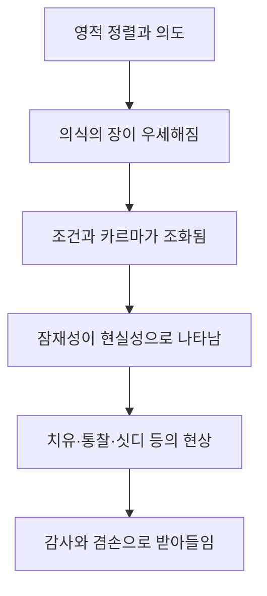

# 『현대인의 의식수준』 제10장 「경험적 요소 대 개념적 요소」||「경험적 확인」·「저항」·「영적 발전」

## 질문 · 2026-07-31 17:01

경험적 확인

영적 정렬과 의도에 헌신까지 더해지면 삶은 본질적으로 탈바꿈되며 삶에서의 경험은 질적인 측면에서 점진적 변화를 일으킨다. 이는 장 효과(field effect)의 산물로 자동적으로 발생하는 것이지, 개인의 의지가 원인이 되어 일어난 것이 아니다. 영적 가치의 결합은 어떤 상상의 이득이나 통제를 바라는 것이 아니라 그 자체만을 위해서 이루어져야 한다. 그런 이득이나 통제는 역설적으로 주요한 의도를 거스르고 방해한다.

참다운 영적 노력에는 미묘한 내적 쾌락이 따라온다. 평화와 성취라는 내면의 자질은 미묘한 내적 앎을 동반한다. 그것은 자아의 세상에서 참나의 확대된 인식으로 가는 변화를 거치며 마침내 인간은 ‘본향으로 향하게 되어 있음’을 아는 앎이다. 이를 통해 영적 태만에 수반되는 죄책감과 에고의 요구와 이득을 챙기려는 욕망에 허우적대면서 발생하는 내면의 영적 죄책감에서도 벗어난다.

저항

에고 자체의 핵심인 나르시시즘적 성향은 영적 노력에 저항하는 근본 원인이다. 에고는 암암리에 자기 존재의 통치권, 모든 것을 자기가 만들어 냈다는 저자권(authorship), 결정권, 반응, 활동 등을 주장한다. 그러므로 아무리 최선의 노력을 하더라도 이익이나 통제를 취하려는 에고의 의지와 욕망은 계속 분출한다. 에고는 본래 자만심이 강하고, 탐욕스럽고, 증오에 차 있으며, 오만하고, 쉽게 분개하고, 시기하는 등의 성질을 타고났다는 사실을 단순히 받아들이기만 해도 이런 패턴은 점차 희미해지고 사라질 수 있다. 에고의 이런 성질은 수백 억년의 시간을 거치며 진화적 발달을 이루면서 스스로 학습한 부가적 대가라고 할 수 있다. 따라서 이런 원시적 감정은 자아의 이익에서 참나의 이익으로 넘어가는 변화 과정을 거치며 그만 멈추고 버려야 할 것이기 때문에, 영적 노력의 와중에 불쑥 나오더라도 전혀 죄책감을 느낄 필요가 없다.

영적 발전

영적 진실의 참된 입증은 주관적이며 경험적이며 진보적이다. 그것은 대개 자발적 발견, 미묘한 계시, 더욱 새롭고 확대된 인식이 나타나는 형태를 취한다. 영적 진실은 내용의 인식에서 맥락의 인식으로 이동하면서 발생하는 결과라고 할 수 있다. 미묘한 충족은 내면의 성장과 함께 온다. 내면의 성장은 온전히 신에게 내맡김으로써 발생한 앎으로 단언되는 것이다. 신에게 순복하고 의탁하는 것은 신의 축복(Divine Grace)을 초대하는 일이다. 이 모두는 후천적 습득이나 개인적 노력의 결과라기보다 천부적 재능/선물로 인식된다. 말하자면 이익은 취하는 것이 아니라 허락받아야 하는 것이라는 사실을 경험으로 알게 되는 것이다. 이에 따라 영향력을 주장하는 영적 자만이나 영적 에고의 허영심 대신에 감사하는 마음이 자리 잡는다.

영적 발전은 예측할 수 없으며 카르마의 경향을 비롯한 미지의 여러 요인들에 영향을 받는다. ‘영적 에고’는, 그것을 추구하는 사람이 소위 싯디 현상을 경험하기 시작할 때에 밖으로 나오려고 꿈틀거린다. 싯디 현상은 특성상 의식 수준 540으로 측정되는 에너지 장에서 나타나며 570 이상일 경우에는 더욱 확실해진다.(이 수준에 대해서는 앞서 자세하게 기술하였다.) 그런 현상 자체를 뒤쫓아서도 안 되며 그것을 자기 덕분이라고 생각해서도 안 된다. 그것은 영적/쿤달리니 에너지 자체가 나타나면서 자동적으로 발생한 것이기 때문이다. 따라서 그 현상은 감사한 마음으로 받아들여야 하는 영의 선물이다. 그 현상은 통제되지도 않지만 단순하게 목격되지도 않는다.

싯디 현상이 나타나 계속 지속될 수 있다면, 싯디의 기적적인 성질은 분명 매우 놀랍고도 대단한 것이다. 겸손은 에고처럼 자기가 그런 현상을 만들어 냈다고 주장하지 않은 채, 그것이 발생하는 모습을 목격하도록 허락해 준다. 에고가 몰두하는 주인의식, 저자권은 미리 경고를 받지 못한 학생들에게 일종의 함정이자 착오가 될 수 있다.

진실하지 못하면서 이기적인 단체들은 이익을 얻으려고 진짜 싯디를 모방한 형태를 마구 뿌리곤 한다. 싯디의 가짜 모방 형태를 만드는 일은 여러 문화권에서 고질적으로 일어난다. 인도의 ‘성스러운 인간(holy men)’이 좋은 사례다. 그리고 ‘기적을 행한다는’ 주장은 광신적 종교집단의 지도자들 사이에서 흔히 일어나며, 이를 통해 그들은 자기권력 강화를 꾀한다. 하지만 자연발생적 치료책도 있다. 그 치료책은 극적 연출과 암시를 통해 연극 치료적 치유자가 유도하는 최면적 암시의 결과라고 할 수 있다.

앞서 기술했듯이 싯디라는 기적의 현상은 몇 년간 지속될 수 있으며 자연스럽게 일어났다가 사라진다. 위에서 말했듯이 그것은 분명히 개인의 자유의지와 무관하게 발생하기 때문에 더욱 놀랍고 인상적이다. 또한 싯디는 매우 실제적이며, 확증할 수 있으며, 매우 정확한 것이 될 수도 있다. 그런 기적 현상은 ‘자연 치유’의 원인을 잘 설명해 준다. 자연 치유는 거의 모든 질병에게 가능하다고 알려져 있으며 관련된 기록도 많다.

기적 현상은 잠재성이 현실성으로 활성화되면서 일어난다. 물론 진보된 영적 에너지 장의 힘 등 여러 조건이 적절하게 맞을 때에 가능하다. 전통적으로 이런 영향을 끼치는 에너지를 가리켜 ‘쿤달리니(kundalini)’라고 불렀다. 이는 내면의 에너지 체계를 따라 흐르다가, 마침내 더 높은 영적, 에테르적 에너지 몸체의 열기를 북돋우고 빛을 밝히는 영적 에너지를 가리키는 이름이다.

이 영적 에너지는 의식 수준 200에서 모습을 드러내기 시작한다. 영적 에너지가 가장 먼저 주는 혜택은, 그 에너지가 뇌 우세성(brain dominance)과 신경전달물질을 바꾼다는 점이다. 또한 엔도르핀 방출을 촉발시키면서 뇌의 정보 처리과정이 변형되며, 삶 전체를 변모시킬 수 있는 지각 변화를 일으킨다.(Newberg 2006) 따라서 더 높은 영적 의식 수준에서는 기적적인 치유가 발생한다. 유명한 영적 진로과정이 ‘기적수업’으로 불리는 이유가 바로 여기에 있다. 의식의 장이라는 힘에 의해서 잠재성이 현실성으로 활성화된다는 사실은 임상적으로 확인된다.

영적 노력은 눈에 보이거나 보이지 않는 많은 혜택을 가져온다. 사회적 능력이 향상되고 건강도 좋아지며, 더 나아가 한 가계에 영속적으로 축적될 수 있는 좋은 행동 양식이 늘어난다는 연구도 많이 나와 있다. 게다가 전반적인 행복 수준도 현행 의식 수준과 직접 관련이 있는데, 여기서 그것을 확인하기 위해 『의식 수준을 넘어서』에서 아래 도표를 가져왔다.

의식 수준과 행복 정도의 상관관계

수준	수치	비율
깨달음	700-1000	100
평화	600	100
기쁨	570	99
무조건적인 사랑	540	96
사랑	500	89
이성	400	79
수용	350	71
자발성	310	68
중용	250	60
용기	200	55
오만	175	22
분노	150	12
욕망	125	10
공포	100	10
비탄	75	9
무관심, 증오	50	5
죄책감	30	4
수치심	20	1
낮은 에너지 장이 거친 사나움과 범죄를 비롯해 부정성과 연관된 것을 끌어당기듯, 높은 에너지 장은 삶을 지탱하는 긍정적인 것을 끌어당긴다. 영적 노력의 긍정적 혜택은 심오하거나 본질적이며 심지어 기적일 수도 있지만, 그것도 싯디와 마찬가지로 이득을 얻기 위해 추구해선 안 되며 그 대신 감사하는 마음으로 겸손하게 받아들여야 한다. 겸손은 신을 섬기거나 깨달음에 도달하려는 의도와 욕망에서 발생한다. 그 의도와 욕망은 공히 매우 강력한 촉매제가 된다.

요약하자면, 주관적 경험에 기초한 세상은 외부의 사건과 무관하게 그 안에서 발생하는 측정된 의식 수준의 결과라는 점을 알 수 있다. 따라서 세상의 참된 실재를 있는 그대로 정확하게 확인하는 일은 불가능하다. 왜냐하면 사람은 자신이 지각한 대로 세상을 경험할 뿐이기 때문이다. 가장 높은 차원에서 바라보면 세상은 있는 그대로 완벽하다. 그 세상이 곧 영적 진화에 필요한 최대한의 기회를 제공하기 때문이다.

## GPT 답변 · 2026-07-31 17:04

# 『현대인의 의식수준』 제10장 「경험적 요소 대 개념적 요소」||「경험적 확인」·「저항」·「영적 발전」

## 핵심 뜻

호킨스 박사님께서 말씀하시는 영적 진실의 가장 깊은 확인은 특별한 현상을 보거나 교리를 논리적으로 입증하는 데 있지 않습니다. **자신과 세상을 경험하는 방식이 실제로 달라지는 것**이 경험적 확인입니다.

그 변화가 깊어질수록 다음과 같은 방향성이 나타납니다.

| 변화의 축 | 이전 | 이후 |
|---|---|---|
| 정체성 | 분리된 개인적 자아 | 확대된 참나의 인식 |
| 행위 감각 | “내가 만들었다” | 장과 은총을 통해 일어났다 |
| 동기 | 이득·통제·특별함 | 진실 자체·신에 대한 헌신 |
| 내면 상태 | 부족감·죄책감·갈등 | 평화·충족·감사 |
| 인식 방식 | 개별 내용에 매임 | 전체 맥락을 알아봄 |
| 영적 결과 | 개인적 성취로 소유 | 선물로 받아들임 |

따라서 이 대목 전체를 관통하는 기준은 다음과 같습니다.

> **참된 영적 발전의 표지는 ‘내가 무엇을 얻었는가’가 아니라, ‘나라는 저자와 소유자의 주장이 얼마나 약해졌는가’입니다.**

---

## 1. ‘경험적 확인’은 무엇을 뜻하는가

여기서 ‘경험적’이라는 말은 단지 눈으로 보고 감각으로 확인한다는 뜻이 아닙니다. 제10장 전체의 구분에 따르면 앎에는 세 단계가 있습니다.

1. 어떤 진리에 **관하여 아는 것**
2. 그 진리가 자신의 경험 속에서 **사실임을 직접 확인하는 것**
3. 그 진리와 하나가 되어 그것을 **삶으로 존재하는 것**

예를 들어 사랑에 관한 책을 많이 읽는 것은 사랑에 ‘관하여’ 아는 것입니다. 그러나 판단하려는 충동이 줄어들고, 타인의 존재 자체를 귀하게 느끼며, 사랑이 외부에서 얻는 감정이 아니라 내면에서 방사되는 상태가 되면 그 앎은 경험적 앎으로 바뀝니다.

그러므로 ‘주관적 입증’은 개인이 원하는 대로 믿는 주관적 견해와 다릅니다. 호킨스 박사님의 용어에서 주관성이란 **의식 안에서 직접 알려지는 확실성**입니다. 그것은 논증으로 만들어 낸 결론보다 앞서 있으며, 삶의 경험 전체가 달라짐으로써 스스로 확인됩니다.

---

## 2. 장 효과와 개인적 의지의 관계

박사님께서는 삶의 질적 변화가 개인적 의지의 직접적인 산물이 아니라 **장 효과**로 자동적으로 일어난다고 설명하십니다. 그렇다고 개인의 의도와 노력이 아무 의미가 없다는 뜻은 아닙니다.

이 관계는 창문과 햇빛에 비유할 수 있습니다.

- 창문을 여는 행위가 햇빛을 만들어 내지는 않습니다.
- 그러나 창문이 닫혀 있으면 햇빛이 방 안으로 들어오기 어렵습니다.
- 영적 정렬과 헌신은 창문을 여는 것과 같습니다.
- 실제로 빛을 밝히는 힘은 개인적 자아가 아니라 장과 신의 은총에 속합니다.

따라서 두 종류의 의지가 구별됩니다.

| 의지의 형태 | 작동 방식 |
|---|---|
| 에고적 의지 | 결과를 만들고, 통제하고, 소유하려 함 |
| 영적 의지 | 진실에 동의하고 자신을 열어 결과를 신에게 맡김 |

개인은 방향을 선택하고 저항을 내려놓을 수 있지만, 변화의 구체적인 시기·형태·결과까지 지배할 수는 없습니다. 이것이 “노력은 필요하지만 저자권은 개인에게 있지 않다”는 의미입니다.

---

## 3. 왜 이득을 바라면 오히려 방해가 되는가

영적 가치가 건강, 성공, 능력, 평안 같은 이득을 얻기 위한 수단이 되면 중심에는 여전히 에고가 남아 있습니다. 외형상으로는 영적인 것을 추구하더라도 내면의 구조는 다음과 같이 유지됩니다.

> “내가 영적인 방법을 이용하여 내가 원하는 결과를 얻겠다.”

이때 신과 진실은 목적이 아니라 에고의 도구가 됩니다. 영적 방향성이 에고의 지배력을 강화하는 방향으로 뒤집히는 것입니다.

반면 진실을 그 자체로 사랑하면, 그 결과로 평화·건강·사회적 능력·행복 같은 혜택이 따라올 수 있습니다. 그러나 그것들은 목표물이 아니라 **정렬된 장의 부수적인 열매**입니다. 얻으려고 움켜쥐면 멀어지고, 소유권을 주장하지 않을 때 허락되는 역설이 여기에 있습니다.

마지막 문단에서 말하는 “깨달음에 도달하려는 의도와 욕망”도 에고적 욕망과는 다릅니다.

- 에고적 욕망은 무엇인가를 **나의 소유물로 만들려는 갈망**입니다.
- 영적 열망은 진실을 위해 **통제권과 특별함까지 내놓으려는 방향성**입니다.

같은 ‘욕망’이라는 단어를 사용하더라도 그 내적 방향은 정반대입니다.

---

## 4. 미묘한 내적 쾌락과 ‘본향’

참다운 영적 노력에 따른 내적 쾌락은 흥분, 황홀감, 감각적 즐거움과 다릅니다. 그것은 조용한 충족감에 가깝습니다.

- 이유 없이 편안해지는 평화
- 무엇인가 부족하다는 압박의 감소
- 삶의 방향이 옳다는 말 없는 앎
- 자신이 근원에서 완전히 분리된 존재가 아니라는 친숙함

“본향으로 향하게 되어 있음을 안다”는 말도 특정 장소로 이동한다는 뜻보다는 **정체성의 귀환**을 가리킵니다. 개인적 자아가 참나를 새로 만들어 내는 것이 아니라, 원래의 근원과 본성을 점차 다시 알아보는 것입니다.

이 앎이 깊어지면 내면의 분열도 줄어듭니다. 한편으로는 영적 진실을 알면서도 다른 한편으로는 에고의 이득만 좇을 때 생기는 불일치가 완화되기 때문입니다. 죄책감이 사라지는 것은 도덕적 감각이 없어져서가 아니라, 진실과 반대되는 방향으로 자신을 끌고 가는 내적 갈등이 줄어들기 때문입니다.

---

## 5. 저항의 근본: 에고의 나르시시즘

여기서 나르시시즘은 흔히 말하는 외모에 대한 허영이나 자기 자랑만을 뜻하지 않습니다. 더 근본적으로는 다음과 같은 에고의 중심 주장입니다.

> “내가 독립적으로 존재하며, 내가 생각하고, 결정하고, 행동하고, 결과를 만들어 낸다.”

박사님께서는 이것을 통치권·저자권·주인의식이라고 부르십니다.

| 에고의 주장 | 구체적 의미 |
|---|---|
| 통치권 | 삶을 내가 지배해야 한다 |
| 저자권 | 결과를 내가 만들어 냈다 |
| 결정권 | 모든 선택의 독립적 근원은 나다 |
| 주인의식 | 능력과 성과와 경험은 내 소유다 |

여기서 ‘저자권’은 문학 작품의 저작권이 아니라, **자신을 모든 생각과 행동의 궁극적인 행위자로 여기는 감각**입니다.

영적 방향성은 이 개인적 행위자 감각을 약화시키므로 에고에는 생존 위협처럼 느껴집니다. 에고가 이득, 통제, 인정, 특별함을 끊임없이 요구하는 까닭도 자기 존재를 재확인하기 위해서입니다.

---

## 6. 에고의 어두운 성질을 인정하면 왜 약해지는가

자만, 탐욕, 증오, 분개, 질투 같은 성향을 인정한다는 것은 그것을 자신의 본질로 받아들이거나 정당화한다는 뜻이 아닙니다. 오히려 다음과 같이 보는 것입니다.

> “이것은 생명의 오랜 진화 과정에서 형성된 생존 프로그램이며, 참나 그 자체는 아니다.”

이렇게 바라보면 두 가지 변화가 생깁니다.

첫째, 감정과 정체성 사이에 공간이 생깁니다. 분노가 일어났다는 사실과 “나는 분노 그 자체다”라는 동일시는 서로 다른 것이 됩니다.

둘째, 죄책감으로 감정을 더욱 단단하게 붙잡지 않게 됩니다. 에고의 성질이 나타난 것을 두고 자신을 악한 존재로 규정하면, 오히려 에고가 자기 비난이라는 새로운 형태로 계속 중심에 남습니다.

죄책감을 느낄 필요가 없다는 말은 책임도 없다는 뜻이 아닙니다. 원시적인 충동이 나타나는 것 자체는 오랜 조건화의 결과이지만, 그것에 동의하고 행동으로 옮길 것인지는 또 다른 문제입니다. 박사님께서 강조하시는 것은 **자기 비난보다 정직한 인식이 에고의 패턴을 더 효과적으로 약화시킨다**는 점입니다.

‘자아의 이익에서 참나의 이익으로 넘어간다’는 것도 참나가 개인적 이득을 챙긴다는 뜻이 아닙니다. 여기서 참나의 이익은 진실, 사랑, 생명, 전체성에 부합하는 방향을 의미합니다.

---

## 7. 내용에서 맥락으로 이동한다는 뜻

영적 발전은 새로운 정보를 많이 축적하는 것보다 **동일한 사건을 바라보는 전체적 위치가 달라지는 것**입니다.

| 내용의 인식 | 맥락의 인식 |
|---|---|
| 무슨 일이 일어났는가 | 어떤 의식의 장에서 경험되는가 |
| 누가 옳고 그른가 | 어떤 두려움·욕망·위치성이 작동하는가 |
| 내가 무엇을 얻었는가 | 이 경험이 의식의 성장에 어떤 의미가 있는가 |
| 개별 사건에 몰입 | 사건을 포함하는 전체 조건을 인식 |
| 원인과 비난을 찾음 | 패턴과 잠재성의 펼쳐짐을 알아봄 |

가령 비난을 들었을 때 내용에만 매이면 “저 사람이 나를 공격했다”는 사건이 세계 전체가 됩니다. 맥락이 넓어지면 상대방의 두려움, 자신의 자존심, 반응을 선택할 여지, 용서의 가능성까지 함께 보입니다. 사건이 없어지는 것이 아니라 사건을 포함하는 의식의 공간이 넓어지는 것입니다.

이처럼 영적 진실은 새로운 개념을 덧붙여서 생기는 것이 아니라, **개념이 나타나는 장 자체를 알아보면서 확인**됩니다.

---

## 8. 신의 은총은 ‘획득’이 아니라 ‘허락됨’이다

“이익은 취하는 것이 아니라 허락받아야 한다”는 문장은 영적 발전의 비개인성을 압축합니다.

에고는 진보를 소유 가능한 성취로 해석합니다.

- 내가 노력했다.
- 내가 높은 상태에 도달했다.
- 내가 특별한 능력을 얻었다.
- 그러므로 내가 다른 사람보다 앞선다.

반면 내맡김과 의탁이 깊어지면 모든 변화가 자신의 공적이라기보다 선물로 인식됩니다. 이때 자연스럽게 감사가 생깁니다. 감사는 단순한 예의가 아니라, **개인적 저자권이 약해졌다는 표시**입니다.

영적 발전이 예측 불가능한 것도 같은 이유입니다. 의도는 중요한 조건이지만 카르마적 경향, 준비 정도, 알 수 없는 전체 조건이 함께 작용합니다. 그러므로 누구의 변화 속도가 빠르거나 느리다는 이유만으로 영적 가치를 비교할 수 없습니다. 의식 수준도 사람에게 영구적으로 붙어 있는 등급이 아니라, 현재 우세한 현실 인식의 장을 나타냅니다.

---

## 9. 싯디의 의미와 영적 에고의 함정

싯디는 영적 발전의 목표가 아니라 높은 에너지 장에서 나타날 수 있는 **자연발생적 부수 현상**입니다. 박사님의 설명을 정리하면 다음과 같습니다.

- 약 540부터 나타날 수 있습니다.
- 570 이상에서 더욱 현저해집니다.
- 개인이 의도하거나 일정에 맞춰 일으킬 수 없습니다.
- 몇 주·몇 달·몇 년간 나타나다가 사라질 수 있습니다.
- 치유, 예지, 투시, 텔레파시 같은 형태를 취할 수 있습니다.
- 현상을 일으키는 ‘개인’이 있는 것이 아니라 장의 힘이 작동합니다.

그래서 싯디가 나타났을 때 가장 위험한 해석은 “내가 이 능력을 만들었다”는 주장입니다. 현상 자체보다 그것을 소유하려는 에고의 반응이 더 중요한 시험이 됩니다.

| 참다운 싯디에 대한 태도 | 영적 에고의 반응 |
|---|---|
| 자연발생적 현상으로 봄 | 개인 능력으로 주장함 |
| 통제할 수 없음을 인정 | 반복적으로 재현하려 함 |
| 감사하며 목격함 | 특별한 지위의 증거로 이용 |
| 이득을 구하지 않음 | 돈·명성·권력에 연결 |
| 나타나고 사라짐을 허용 | 현상을 붙잡고 과시함 |

따라서 기적의 크기가 영적 진실성을 결정하는 것이 아닙니다. **현상 앞에서 저자권을 주장하지 않는 겸손**이 더 본질적인 표시입니다.

본문의 “그 현상은 통제되지도 않지만 단순하게 목격되지도 않는다”는 문장은 앞뒤 맥락과 박사님의 다른 설명을 종합하면, **“통제되는 것이 아니라 그저 목격된다”**로 읽는 것이 자연스럽습니다. 다른 대목에서도 싯디는 자율적으로 발생하며 개인은 그것을 목격한다고 일관되게 설명됩니다.

---

## 10. 진짜 현상과 모방을 가르는 기준

진실하지 못한 단체가 기적을 모방하는 이유는 현상의 극적인 성질이 사람의 호기심과 특별함에 대한 욕망을 자극하기 때문입니다. 최면적 암시나 연극적 연출에서도 실제로 일시적인 신체·정서 반응이 나타날 수 있으므로, 겉으로 보이는 결과만으로는 영적 근원을 판단할 수 없습니다.

박사님께서 제시하시는 구분 기준은 현상의 화려함이 아니라 **전체 맥락과 의도**입니다.

- 현상을 개인의 권력으로 선전하는가
- 추종자와 금전적 이익을 얻으려 하는가
- 지도자의 특별함을 강화하는가
- 타인을 통제하거나 의존하게 만드는가
- 아니면 개인적 소유권 없이 자연스럽게 나타나는가

진실한 것은 자신을 광고할 필요가 없습니다. 반대로 끊임없이 자신의 능력을 입증하려는 행위는 이미 내면에 개인적 저자권이 개입했음을 드러냅니다.

---

## 11. 잠재성이 현실성으로 활성화된다는 것

박사님의 비선형적 설명에서는 기적을 개인이 원인이 되어 만들어 낸 사건으로 보지 않습니다.

> 적절한 조건이 갖추어지면 이미 존재하던 잠재성이 현실로 나타납니다.

씨앗이 꽃을 피우는 것과 비슷합니다. 사람이 꽃을 직접 제작하는 것이 아니라 햇빛·수분·토양·계절이라는 조건이 갖추어지면 씨앗에 내재된 잠재성이 저절로 펼쳐집니다.

싯디나 자연 치유도 같은 구조로 설명됩니다.

여기서 영적 에너지 또는 쿤달리니는 잠재성을 현실로 촉진하는 장의 에너지적 표현입니다. 개인이 소유하거나 마음대로 조작하는 도구가 아닙니다.

---

## 12. 의식 수준 200과 뇌의 변화

본문에서는 영적 에너지가 200에서 모습을 드러내기 시작하며, 뇌 우세성과 신경전달물질 및 정보 처리방식에 변화를 일으킨다고 설명합니다.

200은 박사님의 의식 지도에서 매우 중요한 문턱입니다.

- 200 이하에서는 두려움, 욕망, 분노, 오만 같은 반응이 지각을 지배합니다.
- 200에서는 진실성, 책임감, 용기, 건설적인 선택 능력이 출현합니다.
- 뇌는 외부 자극에 수동적으로 반응하는 방식에서 벗어나 더 넓은 선택 가능성을 처리하기 시작합니다.

뇌의 변화는 영적 실재를 단순한 신경화학 반응으로 축소한다는 뜻이 아닙니다. 박사님의 설명에서는 의식의 장이 우선하며, 뇌와 신경계의 변화는 그것이 선형적 육체 수준에 반영된 결과입니다.

기적적 치유의 가능성도 개인이 의지로 질병을 억지로 없앨 수 있다는 뜻이 아닙니다. 치유의 잠재성이 현실화될 수 있음을 뜻하며, 그 시기와 형태는 개인이 명령하거나 보장할 수 없는 전체 조건에 달려 있습니다.

---

## 13. 행복 도표가 보여 주는 가장 중요한 변화

행복 비율은 200을 경계로 급격히 높아집니다.

| 의식 범위 | 행복 비율 | 경험 세계의 중심 |
|---|---:|---|
| 20~175 | 1~22% | 결핍·위협·반응·대립 |
| 200 | 55% | 용기·정직·책임 |
| 250~400 | 60~79% | 유연성·수용·이해 |
| 500~570 | 89~99% | 사랑·충족·기쁨 |
| 600 이상 | 100% | 평화·비이원적 완전성 |

175의 오만에서 행복 비율은 22%지만, 200의 용기에서는 55%로 크게 뛰어오릅니다. 이 변화는 외부 재산이나 지위가 갑자기 늘어나서가 아닙니다. 삶을 적대적인 것으로 지각하던 방식에서, 책임지고 대응할 수 있는 기회의 장으로 인식하는 방식으로 전환되기 때문입니다.

500 이상에서는 행복의 근원이 더욱 내면화됩니다.

- 사랑은 외부에서 받아야 하는 보상이 아니라 존재의 방식이 됩니다.
- 기쁨은 특정 사건에 대한 흥분이 아니라 생명 자체에 대한 감사가 됩니다.
- 평화는 문제가 전혀 없는 조건이 아니라 내면의 대립이 사라진 상태입니다.

따라서 높은 의식 수준이 긍정적인 것을 끌어당긴다는 말은 단순히 원하는 것을 상상하면 얻는다는 뜻이 아닙니다. 존재 방식이 달라지면서 지각, 선택, 인간관계, 행동 양식, 장의 영향이 함께 달라지고, 그와 조화를 이루는 삶의 패턴이 우세해진다는 뜻입니다.

---

## 14. “사람은 지각한 대로 세상을 경험한다”

마지막 결론은 이 장 전체를 다시 처음으로 연결합니다. 사람은 세상 자체를 아무런 매개 없이 경험하는 것이 아니라, 자신의 의식 수준에 따라 선택되고 해석된 세상을 경험합니다.

같은 사건도 의식의 장에 따라 전혀 다르게 나타납니다.

- 공포에는 위협으로 보입니다.
- 분노에는 공격해야 할 대상으로 보입니다.
- 오만에는 자기 우월성을 확인하는 자료가 됩니다.
- 용기에는 해결 가능한 과제로 보입니다.
- 수용에는 성장의 조건으로 보입니다.
- 사랑에는 이해와 용서의 기회로 보입니다.
- 평화에는 전체성 안에서 일어나는 완전한 펼쳐짐으로 보입니다.

“외부 사건과 무관하다”는 표현은 물리적 사건이 중요하지 않다는 뜻이 아닙니다. **주관적 경험의 질을 결정하는 궁극적 근원이 외부 사건 자체가 아니라 그것을 받아들이는 의식의 장**이라는 뜻입니다.

---

## 15. 세상이 ‘있는 그대로 완벽하다’는 말의 깊은 의미

가장 높은 차원에서 세상이 완벽하다는 것은 세상의 모든 행동이 선하거나 모든 고통이 바람직하다는 뜻이 아닙니다. 내용 수준에서는 여전히 진실과 거짓, 유익함과 해로움, 사랑과 잔혹함을 분별해야 합니다.

여기서 완벽함은 **맥락적 완전성**을 뜻합니다.

- 모든 사람은 자신의 현재 의식 수준에 맞는 세상을 경험합니다.
- 각각의 경험은 다음 단계로 나아갈 가능성을 품고 있습니다.
- 세상은 에고의 한계를 드러내는 동시에 그것을 넘어설 기회를 제공합니다.
- 아무리 고통스러운 경험도 더 높은 이해와 신에 대한 의탁으로 전환될 잠재성을 지닙니다.

그러므로 세상의 완벽함은 세상이 언제나 즐겁다는 말이 아니라, **영적 진화에 필요한 가능성이 빠짐없이 제공되는 장이라는 뜻**입니다.

## 전체 통합 정리

「경험적 확인」에서는 영적 진실이 삶의 질적 변화로 직접 알려진다고 설명합니다. 「저항」에서는 그 변화를 가로막는 핵심이 “내가 행위자이며 결과의 저자”라고 주장하는 에고임을 밝힙니다. 「영적 발전」에서는 개인적 저자권이 약해질수록 변화가 성취물이 아니라 신의 은총과 장의 선물로 인식되고, 그 결과 감사와 겸손이 자리 잡는다고 설명합니다.

싯디는 이 원리를 극단적으로 보여 주는 사례입니다. 아무리 놀라운 현상도 개인이 소유할 수 없으며, 그것을 자신의 능력으로 주장하는 순간 영적 에고가 개입합니다. 따라서 싯디보다 더 신뢰할 만한 변화는 평화, 내적 충족, 판단의 감소, 감사, 저자권의 약화입니다.

결국 박사님께서 제시하시는 경험적 확인은 다음과 같이 압축됩니다.

> **영적 진실은 에고가 획득하여 증명하는 대상이 아니라, 에고의 통제와 소유 주장이 약해질 때 삶 전체를 통해 스스로 드러나는 실재입니다.**
