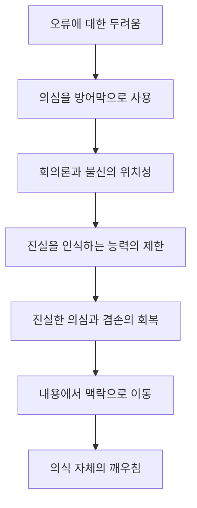

# 『현대인의 의식수준』 제13장 「의심, 회의론 그리고 불신」―「무신론, 불가지론, 무신앙」

## 질문 · 2026-07-28 10:48

무신론, 불가지론, 무신앙

진정한 지적 의심은 진실한 것이다. 적어도 그런 태도는 개인의 결정과 신념을 중요하고 유의미한 것으로 간주하기 때문이다. 이성은 유추나 가설을 지적으로 처리하는 역할을 한다. 이 과정에서 논리가 들어간 정보는 정신적 처리를 통해서 진실에 도달할 수 있다. 또한 이성은 성숙이라는 선형적 경험과 지혜가 등장하면서 발생하는 이분법과 양면성을 참아낼 수 있게 해 준다. 그리하여 지성만으로는 가설로 내세운 모든 질문에 대답할 수 없다는 사실을 알게 된다. 따라서 믿음은 모든 수준의 진화에 수반하여 나타나는 것이다. 믿음은 정신의 상수(常數)다. 따라서 그것은 인간의 믿음을 어디에 위치시켜야 하는가에 대한 문제일 뿐이다.

에고의 핵심인 나르시시즘적 성향은 ‘올바른/선한’ 것과 일치한다. 단, 이때 ‘올바른’ 것은 지혜와 일치한 상태일 수도 있고, 그 지혜를 타당하지 않은 것으로 판단해 거부하는 상태일 수도 있다. 아무리 교육을 받았더라도 인간의 정신만으로 진실을 확인하고 입증할 방법에 관한 딜레마를 해결할 수는 없다. 겸손함을 갖추고 진실을 탐색하는 사람이라면 결국 이 사실을 알게 된다. 진실은 객관적이고 입증 가능한 기준뿐만 아니라 주관적 경험을 통한 확인도 반드시 필요하기 때문이다.

믿음을 통해 권위에 의지하는 것이 영적 실재와 진실을 찾는 대다수 진실한 구도자들에게는 충분한 것이지만, 그럼에도 정신은 자꾸만 미련을 두면서 의심할 것이다. 하지만 그 상태는 내면의 영적 진화라는 주관적 경험을 통해서 해결할 수 있다. 영적 진화를 이루려면 의식 수준을 초월하고, 더불어 의식 측정 방법론을 통해 오늘날 세상 속의 영적 실재를 확인해야 한다. 이 두 가지 조합과 더불어 신을 향하는 하나의 경로로서 진실에 헌신한다면 결국 전형적인 ‘의심의 장벽(doubt block)’을 극복하게 된다. 동시에 그 장벽 반대편에서 깨달음과 계시가 등장한다. 온갖 의심은 자아로부터 나오기 때문에 참나의 압도적 실재 안에서 녹아 없어진다. 이로써 인간은 마침내 확실성의 산물인 평화와 더불어 제자리를 찾는다.

정신이 어떤 명제를 입증할 수 없다고 해서 반드시 그 명제가 거짓이라는 뜻은 아니다. 이는 무신론자의 함정이다. 정신은 진실을 알 수 없기 때문이다. 동시에 똑같은 이치로 정신은 진실을 반박할 수 없다. 그렇게 되면 결국 반대를 입증해야 하는 역설에 빠지게 되기 때문이다. 에고의 핵심인 나르시시즘적인 성향은 무의식적으로 자신의 전능함을 순진하게 가정한다. 그 결과, 에고에게는 더 높은 진실에 닿기 위해 필요한 겸손함이 없다. 흥미로운 점은, 무신론자는 의식 측정 기술을 사용할 수가 없다는 사실이다. 신을 부정하는 것은 진실을 부정하는 것이기 때문이다.

무신론은 의식 수준 190, 불가지론은 이보다 조금 높은 200으로 측정된다. 따라서 불가지론이 무신론보다 조금 더 정교하며 실재와 조금 더 정렬한다. 그리고 무엇보다 불가지론에서는 지적 능력이 본질적으로 신의 실체적 존재라는 문제를 해결할 수 없다는 점을 인정한다. 불가지론은 진실에 대해 부정적 적대감을 포함하지 않기 때문에 회의론보다 더 높은 수준으로 측정된다. 불가지론은 그저 지성은 만족할 만한 대답에 도달할 수 없다고 겸손하게 진술한다. 허나 불가지론의 한계는 이 사실을 잘 알고 있으면서도 지적 능력으로 도저히 해결할 수 없는 문제의 해답을 찾기 위해서 바로 그 지적 능력에게 의존하고 있다는 점이다.

또한 불가지론과 무신론은 역연령(chronological age, 曆年齡)이 일치할 수 있으며, 지혜의 경로를 통해 정서적으로 성숙해지면 점차 약해지는 경향을 보인다.34) 그렇게 되면 내용이라는 선형적 차원이 아니라 맥락이라는 비선형적 범위 안에서 진실을 추구하게 된다. 맥락은 진리를 이해하는 능력을 확장시킨다. 삶의 여러 영역에서, 사변적 추측이 물러나고 확신이 자리 잡으며 더 높은 차원을 인식하는 데 필요한 능력을 확장한다. 더 높은 차원은 선형적인 지적 처리과정이 아니라 계시라는 기제를 통하여 스스로 드러난다.

의심과 불신은 흔히 의식이 크게 도약할 때 나타나는 전조다. 의식의 도약은 좌절이나 재앙, 또는 성숙을 통한 지혜가 나타나면서 일어날 수 있다. 이에 대해서는 기적과 같은 중대한 전환과 개종을 겪었던 사람들과 하물며 성인들까지 이미 언급한 것이다. 간혹 매우 험난한 환경 때문에 어린 시절 종교적 믿음을 상실했다가 이후 오랜 세월 확증 가능한 진실을 찾아나서는 예외적 경로를 밟는 사람도 있다. 그와 같은 내면의 탐색은 연관된 믿음 체계 없이 명상 수련만으로도 속도를 높일 수 있다. 그런 측면에서 불교는 신앙이 없는 사람들에게 실용적이고 매력적인 종교가 될 수 있다. 붓다는 ‘신’에 대한 믿음 없이 깨달음에 도달할 수 있는 길인 팔정도(八正道)를 가르쳐 주었기 때문이다.

신앙이 없는 사람들에게 잘 맞는 또 하나의 길은 고대 『베다』와 『우파니샤드』에서 찾을 수 있다. 『베다』와 『우파니샤드』는 양자역학의 여러 발견을 예상한 경전으로서, 절대 원리의 궁극적 실재를 언급하고 개념과 정신 작용의 환상을 넘어선 선험적 실재로서 의식의 무한한 장을 이야기한다. 모든 신념 체계를 배제한 채 절대 진리를 진실하게 탐색해 가는 아드바이타(Advaita)(현상계는 무지에 기초한 환상이라고 주장하는 베단타 학파에서 말하는 비이원성)의 경로는 오염되지 않은 길이다. 이 내용도 이미 앞서 저작들에서 자세히 기술하였다. 당연히 비이원성은 깨달음으로 이어지지만, 『베단타』 연구를 하다가 자칫 인도의 다양한 철학 학파에 과도하게 연루되는 상황으로 이어질 수 있다. 그리 되면 그 철학은 산만한 신념 체계가 될 수도 있으니 늘 경계해야 한다.

회의론자/무신앙자들에게 의식 자체의 본질을 탐색하는 물음은 가장 오염되지 않은 길이자 방법이다. 그 길은 모든 신념 체계를 우회하면서 오직 진실한 호기심과 성실함만을 요구하기 때문이다.

영적/종교적 진실에 대한 모든 정신적(선형적) 묘사는 논쟁과 논란이 되어 틀렸다고 반박을 받거나 무효화되기 마련이다. 반대로 (비선형적) 의식 자체는 언어적 규정이나 묘사를 넘어서며, 그 결과 회의론이나 의심, 또는 불신에 아무런 영향을 받지 않는다.

의식의 본질에 대한 조사는 곧바로 빛비춤(Illumination)의 근원으로 이어진다. 절대 의식의 빛은 깨달음의 조건이기 때문이다. 그 빛으로 절대 인식 주체(Knower)와 절대 인식 대상(Known)은 신의 편재라는 참나의 깨우침(Realization) 안에서 통합된다.

## GPT 답변 · 2026-07-28 10:53

# 『현대인의 의식수준』 제13장 6/6  
## 「무신론, 불가지론, 무신앙」

이 소주제는 제13장의 결론입니다. 호킨스 박사님께서는 무신론자를 종교적 논증으로 설득하려 하지 않으십니다. 오히려 진실한 의심을 끝까지 밀고 나가면 이성의 고유한 한계가 드러나고, 그 지점에서 신념 체계를 거치지 않고도 ‘의식 자체’를 탐구하는 길이 열린다고 설명하십니다.

따라서 무신앙은 반드시 영적 탐구의 종착점이 아닙니다. 적대감과 독선이 빠진 정직한 무신앙은 오히려 가장 직접적인 비이원적 탐구의 출발점이 될 수 있습니다.

## 1. 핵심 명제

- 진정한 지적 의심은 진실을 가볍게 여기지 않기 때문에 온전한 태도입니다.
- 인간은 아무것도 믿지 않고 살 수 없습니다. 문제는 믿음의 유무가 아니라 믿음을 정신·물질·권위·진실 가운데 어디에 두느냐입니다.
- 무신론은 정신이 입증하지 못하는 것을 곧바로 거짓이라고 단정하는 데서 한계를 드러냅니다.
- 불가지론은 “지성만으로는 알 수 없다”고 인정하므로 무신론보다 겸손하지만, 여전히 지성의 해답을 기다린다는 한계가 있습니다.
- 무신앙자에게 가장 오염되지 않은 길은 종교적 명제를 논하는 것이 아니라, 모든 경험을 알고 있는 ‘의식 자체가 무엇인가’를 탐구하는 것입니다.
- 이 탐구의 끝에서는 개념적 해답이 아니라 아는 자와 알려진 것이 하나라는 참나의 깨우침이 나타납니다.

쉽게 말하면, 박사님께서는 “신이 존재한다는 주장을 먼저 믿으라”고 하시는 것이 아닙니다. “믿거나 부정하기 전에, 그 믿음과 부정을 알아차리는 의식은 대체 무엇인가?”라는 더 근원적인 물음으로 안내하십니다.

## 2. 전개 지도

| 단계 | 전개 | 핵심 의미 |
|---|---|---|
| 1 | 진정한 의심 | 진실을 진지하게 대하기 때문에 쉽게 믿지 않음 |
| 2 | 이성의 성숙 | 논리와 가설을 다루면서 양면성과 불확실성을 견딤 |
| 3 | 이성의 한계 발견 | 정신만으로 모든 궁극적 질문에 답할 수 없음을 인정함 |
| 4 | 믿음의 위치 확인 | 믿음은 없어지는 것이 아니라 다른 대상에 놓임 |
| 5 | 무신론과 불가지론의 분기 | 부정의 단정과 정직한 ‘모름’이 갈라짐 |
| 6 | 내용에서 맥락으로 이동 | 신에 관한 명제보다 앎이 발생하는 전체 장을 탐구함 |
| 7 | 비신앙적 경로 발견 | 불교·우파니샤드·아드바이타를 통해 교리를 우회함 |
| 8 | 의식 자체의 깨우침 | 아는 자와 알려진 것이 참나 안에서 하나로 드러남 |

---

## 3. 진정한 지적 의심과 ‘믿음은 정신의 상수’

### 핵심 뜻

진정한 의심은 단순한 부정이나 냉소가 아닙니다. 그것은 자신의 선택과 신념을 중요하게 여기기 때문에 충분히 확인하려는 태도입니다. 그러므로 진정한 의심에는 진실에 대한 존중이 들어 있습니다.

이성은 자료를 비교하고, 유추하고, 가설을 세우며, 논리적 모순을 찾아내는 데 적합합니다. 성숙한 이성은 어느 한쪽을 즉시 제거하지 않고 모순처럼 보이는 두 가능성을 함께 품을 수도 있습니다. 그러나 이성이 더욱 성숙하면 마침내 자기 한계까지 발견합니다.

> “나는 생각할 수 있지만, 생각만으로 존재의 궁극적 근거까지 확정할 수는 없다.”

이 한계의 인정이 이성의 실패가 아니라 지혜의 시작입니다.

### 믿음이 정신의 상수라는 뜻

이 말은 모든 사람이 반드시 종교 교리를 믿는다는 뜻이 아닙니다. 인간의 정신은 언제나 어떤 전제에 의존하여 작동한다는 뜻입니다.

가령 종교를 믿지 않는 사람도 다음과 같은 것을 신뢰할 수 있습니다.

- 감각이 실재를 정확히 전달한다는 전제
- 논리가 모든 중요한 질문에 적용될 수 있다는 전제
- 물질적으로 관찰되는 것만 실제라는 전제
- 자신의 지성이 진실과 거짓을 판정할 수 있다는 전제

따라서 무신앙은 믿음의 완전한 소멸이 아니라 믿음의 대상이 종교적 권위에서 이성·감각·과학적 패러다임 등으로 옮겨간 상태일 수 있습니다. 박사님께서 제기하시는 핵심 질문은 “믿는가, 믿지 않는가?”가 아니라 “궁극적으로 무엇을 신뢰하고 있는가?”입니다.

---

## 4. 에고의 ‘올바름’과 진실을 향한 겸손

에고의 나르시시즘적 핵심은 자신을 ‘올바른 편’과 동일시합니다. 문제는 에고가 진실과 일치하여 올바를 수도 있지만, 진실을 거부하면서도 자신이 올바르다고 느낄 수도 있다는 점입니다.

그러므로 주관적으로 느끼는 확신만으로는 진실이 보장되지 않습니다. 높은 교육과 뛰어난 논리력도 이 딜레마를 자동으로 해결하지 못합니다. 지성은 자신의 전제 안에서 매우 정교하게 작동할 수 있지만, 그 전제 자체가 타당한지는 지성만으로 확인하기 어렵기 때문입니다.

박사님께서 말씀하시는 겸손은 지성을 포기하는 태도가 아닙니다. 지성이 적용될 수 있는 범위와 적용될 수 없는 범위를 정확히 인정하는 태도입니다.

이 점에서 진실의 확인에는 두 차원이 함께 필요합니다.

| 확인 방식 | 기능 |
|---|---|
| 객관적으로 입증 가능한 기준 | 개인의 희망·감정·선입견과 진실을 구분함 |
| 주관적·경험적 확인 | 진실이 삶과 의식 안에서 실제적 앎으로 드러남 |

여기서 주관적 확인은 순간적인 감정이나 상상을 진실로 간주한다는 뜻이 아닙니다. 의식의 변화와 더불어 진실이 내적으로 자명해지고, 그에 따른 평화와 확실성이 안정적으로 나타나는 것을 뜻합니다.

---

## 5. ‘의심의 장벽’은 어떻게 사라지는가

권위와 경전에 대한 믿음만으로 충분한 사람도 있지만, 탐구적 정신은 계속해서 “정말 그런가?”라고 묻습니다. 이 의문은 억누른다고 없어지지 않습니다. 반대 논리를 더 많이 수집해도 완전히 해결되지 않습니다.

박사님께서는 다음 세 요소의 결합을 말씀하십니다.

1. 의식의 내적 진화  
2. 의식 측정을 통한 객관적 확인  
3. 신을 향하는 길로서 진실 자체에 대한 헌신  

이 조합을 통해 의심은 논쟁에서 패배하여 사라지는 것이 아니라, 더 큰 실재가 드러남으로써 효력을 잃습니다. 자아는 언제나 어떤 대상을 바라보며 “이것이 참인가?”라고 묻지만, 참나의 실재가 드러나면 진실은 더 이상 외부에서 입증받아야 할 명제가 아닙니다.

『나의 눈』에서 박사님께서는 정신이 어떤 대상에 ‘관하여’ 알 수 있을 뿐, 그 대상 자체가 될 수는 없다고 설명하십니다. 참된 앎은 대상에 관한 정보가 아니라 그것과의 동일성에서 나타납니다. 따라서 의심의 장벽 반대편에 있는 것은 더 완벽한 논증이 아니라 직접적인 앎입니다.

---

## 6. 무신론 190과 불가지론 200

### 무신론 190

이 관점의 핵심적인 한계는 다음 추론에 있습니다.

> “정신이 입증하지 못했다. 그러므로 존재하지 않는다.”

박사님의 관점에서 이것은 정신이 자신의 적용 범위를 넘어선 결론을 내리는 것입니다. 정신이 궁극적 진실을 완전히 알 수 없다면, 같은 정신은 그 진실이 존재하지 않는다고 최종적으로 반박할 수도 없습니다.

무신론 190은 상당한 지적 능력과 자부심을 포함할 수 있지만, 진실과 거짓을 가르는 200 바로 아래에서 부정적 결론에 닫혀 있는 관점을 나타냅니다.

### 불가지론 200

불가지론은 다음과 같이 말합니다.

> “지성만으로는 신의 존재 여부를 해결할 수 없다.”

여기에는 무신론의 단정보다 더 큰 겸손과 개방성이 있습니다. 신이나 진실을 적대적으로 부정하지 않고, 자기 인식 능력의 한계를 인정하기 때문입니다. 이 ‘모름’의 인정이 의식 수준 200, 즉 온전성의 문턱과 연결됩니다.

그러나 불가지론의 한계도 분명합니다. 지성으로 해결할 수 없다고 인정하면서도 여전히 지성이 언젠가 만족스러운 해답을 내놓기를 기다립니다. 도구의 한계를 알면서도 계속 같은 도구만 사용하는 셈입니다.

### 『진실 대 거짓』과의 연결

『진실 대 거짓』에서 박사님께서는 무신론에도 넓은 범위가 있다고 설명하십니다. 정직하게 자신을 의심하고 진실을 묻는 무신론적 태도는 200으로 측정될 수 있지만, 신에 대한 분노와 적대감이 강해질수록 훨씬 낮아질 수 있습니다.

따라서 여기서 제시된 190은 모든 무신론자를 하나의 고정된 등급으로 규정한 것이 아닙니다. ‘신은 존재하지 않는다’고 닫아 버리는 일반적인 무신론적 위치성의 측정값입니다. 측정되는 것은 사람 전체가 아니라 그 순간 지배적인 관점과 진실에 대한 태도입니다.

| 관점 | 측정 수준 | 진실과의 관계 |
|---|---:|---|
| 적대적 회의론 | 160 | 부정적 전제를 먼저 세우고 비선형적 실재를 배제함 |
| 일반적 무신론 | 190 | 정신이 입증하지 못한 것을 존재하지 않는다고 단정함 |
| 정직하게 자기를 의심하는 무신론 | 200 | 결론보다 진실을 우선하며 열려 있음 |
| 불가지론 | 200 | 지성의 한계를 인정하지만 그 너머로는 아직 이동하지 않음 |
| 이성·지성 | 400대 | 선형적 영역을 정교하게 이해하지만 궁극적 실재를 직접 알지는 못함 |
| 비이원적 깨우침 | 600 이상 | 아는 자와 알려진 것의 분리가 사라짐 |

---

## 7. 역연령·정서적 성숙과 내용에서 맥락으로의 이동

무신론과 불가지론이 역연령과 일치할 수 있다는 말은, 이러한 관점이 특정한 지적·정서적 발달 국면과 맞물릴 수 있다는 뜻입니다. 어린 시절 받아들인 종교적 이미지가 지성의 성장과 함께 무너지면, 무신론이나 불가지론이 한동안 더 정직한 위치로 느껴질 수 있습니다.

그러나 삶을 통해 지혜가 깊어지면 단순한 찬반 판단보다 더 넓은 맥락을 보게 됩니다. 이것이 곧 내용에서 맥락으로의 이동입니다.

| 내용 중심 | 맥락 중심 |
|---|---|
| “이 종교 명제는 논리적으로 증명되는가?” | “논리와 경험과 앎은 어떤 의식의 장 안에서 나타나는가?” |
| 신에 관한 묘사를 검토함 | 모든 묘사를 가능하게 하는 의식을 탐구함 |
| 진실을 하나의 결론으로 찾음 | 진실이 스스로 드러날 조건을 알아봄 |
| 아는 자와 대상이 분리됨 | 아는 자와 대상의 공통 근원을 발견함 |

맥락은 내용을 무시하는 것이 아닙니다. 내용을 포함하면서 그 내용이 발생하고 의미를 갖는 더 큰 장을 보는 것입니다.

---

## 8. 의심은 의식 도약의 전조가 될 수 있다

박사님께서는 모든 의심을 영적 퇴보로 보지 않으십니다. 기존의 믿음 체계가 무너지는 과정은 때때로 더 깊은 진실을 향한 전환의 전조가 됩니다.

좌절·재앙·상실·성숙은 기존 세계관이 더 이상 삶 전체를 설명하지 못한다는 사실을 드러낼 수 있습니다. 이때 의심이 냉소로 굳어지면 불신에 머물지만, 진실을 향한 탐색으로 이어지면 의식의 큰 도약을 준비하는 공백이 됩니다.

이 대목은 호킨스 박사님의 생애와도 직접 연결됩니다. 『파워 대 포스』와 『신의 현존의 발견』에서 박사님께서는 전통적 종교의 언어가 의미를 잃으면서 불가지론과 무신론의 시기를 거치셨다고 밝히십니다. 그럼에도 진실 자체를 향한 탐구는 사라지지 않았습니다. ‘신’이라는 표현을 전면에 내세우지 않는 불교가 매력적으로 다가왔고, 결국 의식과 존재의 근원을 향한 내면의 탐구가 계속되었습니다.

따라서 이 소주제는 단순한 이론이 아니라 박사님께서 직접 통과하신 경로를 일반 원리로 설명한 부분이기도 합니다.

---

## 9. 무신앙자에게 열려 있는 세 가지 경로

### ① 불교와 팔정도

불교는 인격적 신에 대한 믿음을 선행 조건으로 요구하지 않습니다. 붓다의 팔정도는 신의 존재에 대한 형이상학적 결론보다 무지와 집착을 벗어나 깨달음에 이르는 길을 제시합니다.

그러므로 종교적 신 개념에 거부감이 있는 사람도 깨달음이라는 목표와 의식의 변형을 탐구할 수 있습니다.

### ② 『베다』와 『우파니샤드』

이 경전들은 궁극적 실재를 공간 어딘가에 있는 초인격적 존재로만 묘사하지 않습니다. 개념과 정신 작용을 초월하며 모든 현상의 바탕이 되는 무한한 의식의 장으로 설명합니다.

따라서 ‘신’이라는 명칭을 받아들이기 어려운 사람도 절대 원리·궁극적 실재·무한한 의식이라는 표현을 통해 동일한 방향에 접근할 수 있습니다.

### ③ 아드바이타와 의식 탐구

아드바이타는 신념을 더하는 길이라기보다 주체와 객체가 분리되어 있다는 근본 가정을 조사하는 길입니다.

다만 박사님께서는 베단타의 여러 학파와 철학적 논의에 지나치게 얽히면, 비이원성이 또 하나의 복잡한 신념 체계로 변할 수 있다고 경고하십니다. 문제는 베단타 자체가 아니라, 정신이 비이원성에 관한 개념을 축적하면서 자신이 이미 비이원성을 안다고 착각하는 데 있습니다.

그러므로 가장 순수한 핵심은 특정 인도 철학을 많이 아는 것이 아니라, 의식 자체의 본질을 탐구하는 것입니다.

---

## 10. 왜 의식 자체의 탐구가 가장 직접적인가

영적·종교적 진실을 언어로 묘사하는 순간 그것은 선형적 명제가 됩니다. 선형적 명제는 정의·해석·번역·역사적 사실을 놓고 반박될 수 있습니다.

그러나 의식은 모든 찬성과 반대가 나타나기 이전부터 현존합니다.

- 신을 믿는 생각도 의식 안에 나타납니다.
- 신을 부정하는 생각도 의식 안에 나타납니다.
- 의심과 확신도 의식에 의해 알려집니다.
- 논리와 감각과 기억도 의식이 있어야 경험됩니다.

따라서 의식의 존재 자체는 무신론이나 유신론 어느 쪽의 주장에도 의존하지 않습니다. 의식은 논쟁의 한쪽 당사자가 아니라 논쟁 전체가 나타나는 근원적 장입니다.

『나의 눈』에서는 의식의 본질을 이해하는 것이 모든 인간적 문제의 밑바탕으로 곧장 들어가는 길이라고 설명됩니다. 『신의 현존의 발견』에서도 비이원성의 길은 아드바이타·자나 요가·선불교와 연결되며, 궁극적 안내자는 외적 신념보다 내면의 참나라고 밝히십니다.

---

## 11. 빛비춤과 아는 자·알려진 것의 통합

‘빛비춤’은 지적으로 좋은 생각이 떠오르는 정도를 뜻하지 않습니다. 더 큰 맥락이 드러나면서 의식의 장 전체가 참나의 빛으로 밝혀지는 상태를 뜻합니다.

보통의 정신에는 다음과 같은 이원성이 있습니다.

> 나라는 인식 주체 → 바깥에 있는 인식 대상

이 구조가 유지되는 한, 정신은 대상에 관하여 알 뿐입니다. 그러나 깨우침에서는 아는 자와 알려진 것이 서로 분리된 두 실체가 아니었음이 드러납니다. 둘은 신의 편재라는 하나의 참나 안에서 나타난 동일한 실재입니다.

이때 확실성은 “나는 논리적으로 결론을 내렸다”는 확신이 아닙니다. 존재 자체로서 아는 앎입니다. 『진실 대 거짓』의 표현을 빌리면, 찾는 자와 찾는 대상이 하나가 되면서 의심이 소거됩니다.

그러므로 이 소주제의 최종 이동은 다음과 같습니다.

| 출발 | 중간 | 도착 |
|---|---|---|
| 신을 믿는가, 부정하는가 | 그 판단을 내리는 정신은 진실을 알 수 있는가 | 정신과 판단을 알아차리는 의식은 무엇인가 |
| 개념적 신 | 궁극적 실재 | 무한한 의식과 참나 |
| 믿음과 불신 | 진실한 탐구 | 직접적인 깨우침 |
| 아는 자와 대상의 분리 | 의식의 근원 조사 | 아는 자와 알려진 것의 하나됨 |

---

# 제13장 전체 통합 정리  
## 「의심, 회의론 그리고 불신」

제13장 전체의 핵심은 ‘의심 자체가 나쁜가’가 아닙니다. 의심이 진실을 향한 질문으로 작동하는지, 아니면 에고를 보호하는 방어막으로 굳어지는지를 구분하는 데 있습니다.

| 소주제 | 장 전체에서의 역할 |
|---|---|
| 들어가며 | 에고가 오류로 인한 상처를 피하려고 의심을 보호막으로 사용함 |
| 회의론자들 | 정서적 반항에서 나온 회의론과 진실한 지적 검토를 구분함 |
| 진실을 깨닫지 못하는 것 | 낮은 정신과 높은 정신이 현실을 처리하는 방식의 차이를 설명함 |
| 진실에 대한 반박 | 에고에 대한 충성이 진실에 대한 거부와 역전으로 발전하는 과정을 보여 줌 |
| 사회적 생존 | 높은 의식의 힘이 집단의 낮은 경향을 상쇄하며 문명을 지탱함 |
| 무신론·불가지론·무신앙 | 진실한 의심을 의식 자체의 탐구로 전환하는 출구를 제시함 |

제13장은 다음과 같은 하나의 큰 흐름을 이룹니다.

박사님께서 최종적으로 구분하시는 것은 신자와 비신자가 아닙니다. 진실보다 자신의 입장을 지키려는 태도와, 자신의 입장까지 내려놓고 진실을 찾으려는 태도입니다.

의심이 자아의 방패가 되면 회의론과 불신에 머뭅니다. 그러나 의심이 진실에 대한 헌신과 결합하면, 이성은 스스로의 한계를 인정하고 내용에서 맥락으로 이동합니다. 그 끝에서 발견되는 것은 더 강력한 종교적 주장이 아니라, 모든 믿음과 불신을 알아차리는 의식의 실재입니다.

따라서 제13장의 최종 결론은 다음과 같습니다.

> 진정한 의심은 진실을 거부하지 않습니다. 오히려 의심하는 자까지 탐구함으로써, 마침내 자아의 의심을 넘어 참나의 확실성에 도달합니다.
