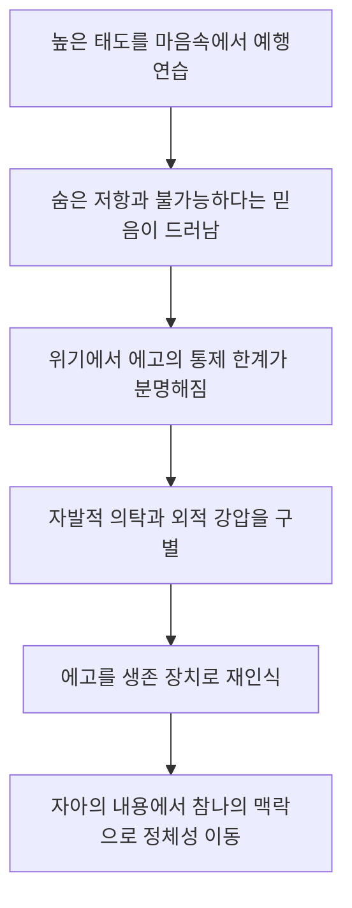

# 『현대인의 의식수준』 제14장 「영적 경로」||「마음으로 그려 보기」·「위기와 재앙」·「강압」·「내려놓음과 생존」

## 질문 · 2026-08-01 14:11

마음으로 그려 보기

학습 기술 중에 자신이 바라는 행동, 특성, 그리고 태도를 마음으로 그려 보고 예행연습해 보는 소위 ‘진짜처럼 해 보기’가 있다. 그 과정 중에도 ‘난 할 수 없어.’와 같은 저항이나 부정적 태도가 등장한다. 마음으로 그려 보기와 예행연습은 여러 분야에서 수행성과와 자신감을 높이고 진행 과정을 향상시키는 것으로 이미 판명되었다.(Petras 2006) 마음속에 품은 것은 밖으로 드러나기 마련이다. 그래서 그 기술은 스포츠와 비즈니스까지 다양한 분야에서 활용된다. 의식 수준이 높을수록 마음속에 품은 것이 실현될 가능성은 높아질 것이다. 따라서 ‘가장 높은 목표를 수행하는’ 해법을 미리 마음에 그려 보는 일은, 단순히 이기적 욕망을 달성하고 이득을 취하는 장면을 투사하는 것보다 훨씬 더 강력한 것이다.

위기와 재앙

앞서 언급했듯이, 엄청난 재앙에서 살아남은 사람들은 거의 보편적으로(99퍼센트) 재앙 한가운데에서도 성실하고 열렬하게 기도했다고 한다. 역설적으로 일부 생존자들, 특히 토네이도에서 살아남은 사람들은 최악의 위기 상황에서 오히려 매우 심원한 평화의 상태(600)로 들어갔다고 진술했다. 이렇듯 거대한 심원에 의탁하면 두려움이 사라진다.

이런 현상에서 몇몇 유형은 당시 상황을 그대로 받아들이고 체념함으로써 겉보기에 불가항력적인 것을 수용한 결과다. 이렇듯 ‘머리 위에 총이 겨누어진’ 이미지를 마음에 그려 보는 기법을 활용해 모든 저항을 내려놓고 온전히 신에게 의탁하는 태도를 학습할 수도 있다. 이미지 기법은 “누군가가 당신 머리 위에 총을 겨누고 있다면, 당신의 이러저러한 욕망을 기꺼이 버리겠습니까?”라고 질문한다. 이런 식으로 이미지 그리기 기법은 그 질문에 ‘그렇게 할 수 있다.’는 인식을 계속 일깨운다. 그 결과, 이제 당면한 문제는 과연 학습한 상황에 직면했을 때 실제로 ‘기꺼이 그렇게 할 것인지’의 여부가 된다.

강압

앞에 나온 사례와 아주 비슷하게, 강압과 극도의 위협은 실제로 개종이나 전향을 야기할 수도 있다. 지난 수 세기 동안 이 방법은 개종자를 얻기 위한 수단으로 활용되었다. 권위(자)는 강압과 관련된 세뇌 기술과 협박이나 주입식 프로그램을 공식화된 위협 장치로 남용하곤 한다.

내려놓음과 생존

몇 가지 중요한 정보를 다시 설명하고 넘어가자. 첫째, 에고의 핵심은 동물로서의 생명이 출현하는 바로 그 시점에 형성되었다. 동물은 본질적으로 내부 에너지원이 결핍된 상태다. 반면 식물계는 햇빛을 엽록소 에너지로 전환시켜 화학적 에너지로 만드는 기제로써 이 결핍을 해결했다. 하지만 박테리아와 원생동물 등 원시 동물은 주변 환경으로부터 필수 성분을 습득해야만 했다. 이를 위해서는 탐지하고 처리하는 체계를 새로 만들어 내고 (생명을 지탱하는) ‘좋은’ 물질과 (독성이 있는) ‘나쁜’ 물질을 분간하는 능력이 필요했다. 이 모든 탐색은 이후에 동물의 기본 본능으로 진화했다. 그 본능은 전부 생존에 직결된 것으로서 에고가 선천적으로 갖고 있는 기능이다.

그와 같은 에고의 타고난 메커니즘은 복잡한 체계를 조직하고 통합하는 지적 능력의 설계와 기능을 구성한다. 호모 사피엔스에게 전뇌(前腦)가 출현하면서 대단히 복잡한 상태에 맞는 신경학적 기층이 나타났지만, 동물적 생존과 직결되는 지배적 패턴을 품은 기층도 여전히 남아 있었다. 이 정교한 진화적 메커니즘의 총체성은 에고/정신/감정을 구성한다. 그리고 에고/정신/감정은 생명(‘나’)의 내부적, 독립적, 자율적 원천이 되었다.

이를 통해서, 에고가 모든 것을 내려놓는 일이 어째서 그렇게 엄청난 대가를 치를 정도로 힘겨운 것인지, 그리고 막대한 저항에 부딪히는지 확실하게 알 수 있다. 에고 내부의 원초적 믿음은 에고가 곧 생명의 근원이며 기층이며 핵심이라는 것이다. 에고의 존재는 신성(Divinity)의 내부적 등가물로 간주되었다. 그러므로 에고의 나르시시즘적 핵심에게는 통제권을 내주고 양도한다는 것이 죽음과도 같은 일이다. 이에 에고는 자율통제권이자 생존이라고 믿는 것을 붙잡기 위해 힘겨운 투쟁을 한다. 사실 에고/자아는 참나의 비선형적 잠재성이 자기만의 카르마 성향과 고유성을 갖고 있는 개별 인간 안에서 생명/삶으로 작동하는, 하나의 메커니즘일 뿐이다. 따라서 한계가 있는 선형적 자아는 무한한 비선형적 참나가 빚어 내는 일종의 표현 형태다. 참나는 자아의 실질적 근원이다. 에고/자아는 제한적 내용이지만 참나는 무한한 맥락이다.

에고가 핵심 통제권을 참나에게 양도하는 것은 자아가 참나에 녹아 없어지면서 참나의 기층 실재를 점차 발견하게 되는 과정이다. 이 과정은 인간의 의도는 물론 믿음과 신념을 통해서 이루어질 수 있다. 저항과 진화적 요인들로 인해 일반인의 의식 수준은 한 생애를 사는 동안에 평균 5점 가량 등락하지만 영적으로 헌신하는 사람들은 수백 점씩 크게 상승하는 경험을 하게 된다.

## GPT 답변 · 2026-08-01 14:15

# 『현대인의 의식수준』 제14장 「영적 경로」||「마음으로 그려 보기」·「위기와 재앙」·「강압」·「내려놓음과 생존」

## 핵심 뜻

이 네 소제목은 단순한 상상법에서 시작하여 에고의 가장 깊은 생존 본능까지 내려갑니다.

마음으로 높은 태도를 미리 그려 보는 것은 원하는 결과를 끌어오는 요령이라기보다, 위기 속에서도 진실·평화·신에 대한 의탁을 선택할 수 있도록 내면에 새로운 반응 양식을 형성하는 방법입니다. 이 과정이 깊어지면 결국 다음과 같은 근본적인 오인이 드러납니다.

> “내가 통제하고 있기 때문에 살아 있다. 그러므로 내가 내 생명의 근원이다.”

호킨스 박사님께서는 이것이 에고의 가장 오래되고 강력한 믿음이라고 설명하십니다. 영적 경로의 핵심은 에고의 기능을 파괴하는 것이 아니라, 에고가 생명의 근원이라는 잘못된 동일시를 내려놓고 참나가 삶의 실제 근원임을 발견하는 데 있습니다.

## 전개 지도

## 1. 마음으로 그려 보기

### ‘진짜처럼 해 보기’의 의미

여기서 ‘진짜처럼 해 보기’는 자신을 속이거나 감정을 가장하라는 뜻이 아닙니다. 아직 자연스럽게 나타나지 않는 높은 태도에 미리 형태를 부여하는 학습 방식입니다.

예를 들어 평정, 용서, 품위, 용기와 같은 성품이 충분히 자리 잡지 않았더라도, 그러한 태도로 대응하는 모습을 마음속에서 반복적으로 그려 볼 수 있습니다. 그러면 정신은 높은 반응 양식을 낯선 것으로만 여기지 않고, 실제로 선택할 수 있는 가능성으로 받아들이기 시작합니다.

이 대목이 바로 앞의 「겸손, 학습능력」과 연결되는 이유도 여기에 있습니다. 겸손한 정신은 자신이 이미 완성되었다고 주장하지 않고, 더 높은 본보기를 받아들여 동화할 수 있습니다.

### 저항이 나타나는 이유

높은 모습을 그리는 순간 “나는 그렇게 할 수 없다”는 생각이 나타날 수 있습니다. 이것은 이미지 기법이 실패했다는 뜻이 아닙니다. 오히려 평소에는 숨어 있던 제한적 신념이 의식 위로 드러난 것입니다.

마음속 예행연습은 두 가지 기능을 동시에 수행합니다.

- 높은 반응의 내적 모형을 형성합니다.
- 그 반응을 가로막던 부정적 프로그램을 드러냅니다.

그러므로 저항은 방해물인 동시에 무엇이 아직 에고에 붙들려 있는지를 보여 주는 표지입니다.

### “마음에 품은 것은 밖으로 드러난다”

호킨스 박사님의 맥락에서 이 말은 단순한 소원 성취론이 아닙니다. 마음속에 지속적으로 품은 것은 주의, 지각, 판단, 행동, 신체 반응을 조직하는 에너지 패턴이 됩니다. 사람은 자신이 마음에 품은 세계관에 따라 상황을 해석하고, 그 해석에 맞는 선택을 하게 됩니다.

의식 수준이 높을수록 마음속 이미지가 강력해지는 까닭은 욕망이 강해져서가 아닙니다. 내적 분열과 모순이 줄어들고 의도·가치·행동이 진실한 방향으로 일치하기 때문입니다.

따라서 두 종류의 이미지가 구별됩니다.

| 이미지의 방향 | 중심 동기 | 결과 |
|---|---|---|
| 이기적 획득 장면 | 결핍, 경쟁, 통제 | 에고의 위치성을 강화 |
| 가장 높은 해법 | 진실, 선의, 전체의 유익 | 높은 에너지 장과 정렬 |

높은 목표란 반드시 거창한 외적 성취를 뜻하지 않습니다. 어떤 상황에서든 가장 진실하고 사랑이 많으며 품위 있는 대응이 무엇인지를 내면에 새기는 것을 뜻합니다.

## 2. 위기와 재앙

### 통제가 무너질 때 드러나는 평화

평상시 에고는 계획하고 대비하고 통제함으로써 안전을 확보한다고 믿습니다. 그러나 재앙처럼 인간의 힘으로 어찌할 수 없는 상황에서는 이 믿음이 더 이상 유지되지 않습니다.

호킨스 박사님께서는 극한의 위기에서 일부 생존자가 오히려 의식 수준 600의 심원한 평화를 경험했다고 설명하십니다. 위험이 사라졌기 때문에 평화로워진 것이 아닙니다. 위험을 통제하려는 내적 투쟁이 완전히 멈추면서, 외부 조건과 무관한 평화의 장이 드러난 것입니다.

기도는 이때 의식의 중심을 이동시킵니다.

- 에고의 관점: “내가 상황을 통제해야만 살아남는다.”
- 의탁의 관점: “결과와 생명을 더 큰 신성에 맡긴다.”

따라서 기도는 생존을 보장받기 위한 거래라기보다, 생명의 통치권이 개인적 자아에게 있다는 믿음을 내려놓는 행위입니다.

### 본문의 ‘체념’은 절망이 아닙니다

여기서 말하는 체념은 의식 지도의 낮은 수준에 해당하는 무기력이나 냉담과 다릅니다. 그것은 이미 일어난 사실과 싸우는 저항을 중단하고, 바꿀 수 없는 현실을 그대로 수용하는 태도입니다.

상황에 대한 대응 능력을 포기하는 것이 아니라, 현실이 달라야 한다는 에고의 요구를 놓는 것입니다. 외부 활동은 계속될 수 있지만 그 활동을 지배하던 공포와 집착이 줄어듭니다.

### ‘머리 위의 총’ 이미지가 뜻하는 것

이 이미지는 실제 위험을 재현하라는 권유가 아니라, 애착의 상대적 성질을 극명하게 드러내는 내적 비유입니다. 평소에는 절대로 버릴 수 없다고 생각했던 욕망도 생명과 맞바꾸어야 한다면 내려놓을 수 있다는 사실을 보여 줍니다.

이 기법은 다음과 같은 인식의 전환을 일으킵니다.

> “나는 이것을 절대로 내려놓을 수 없다”  
> → “필요하다면 내려놓을 능력은 있다”  
> → “이제 남은 것은 기꺼이 그렇게 할 의향이다.”

문제가 능력의 부재에서 자발성의 문제로 바뀌는 것입니다. 에고가 주장하던 ‘불가능’이 사실은 ‘원하지 않음’이었음이 드러납니다.

## 3. 강압

「강압」은 앞의 의탁을 외부 권력에 굴복하는 행위로 오해하지 않도록 경계를 세우는 소제목입니다. 겉으로 보면 두 경우 모두 무언가를 포기하는 것처럼 보이지만, 내적 본질은 정반대입니다.

| 구분 | 자발적 의탁 | 강압 |
|---|---|---|
| 출발점 | 내면의 자유로운 의지 | 외부의 위협과 공포 |
| 향하는 곳 | 신성, 진실, 참나 | 권력자나 조직의 요구 |
| 변화 | 에고의 집착이 약해짐 | 기존 믿음이 강제로 교체됨 |
| 내적 결과 | 자유, 평화, 확장 | 복종, 의존, 통제 |
| 작동 원리 | 힘과 진실 | 위력과 협박 |

극도의 위협은 인간의 생존 본능을 자극하여 행동, 소속, 교리적 입장을 바꿀 수 있습니다. 그러나 외적 전향이 곧 내적 영적 변화인 것은 아닙니다. 생존하기 위해 강요된 믿음을 표방하는 것과, 스스로 진실을 알아보고 신에게 의탁하는 것은 전혀 다른 과정입니다.

이 구분은 앞에서 다룬 참다운 권위와 가짜 권위의 차이에도 이어집니다. 참다운 권위는 진실을 가리키며 사람의 분별력과 자유를 성장시킵니다. 가짜 권위는 공포를 이용하여 자신에게 복종시키려 합니다.

## 4. 내려놓음과 생존

### 에고는 어떻게 생겨났는가

호킨스 박사님께서는 에고를 먼저 도덕적 결함이 아니라 진화 과정에서 형성된 생존 메커니즘으로 설명하십니다.

식물은 햇빛을 에너지로 바꿀 수 있지만 동물은 외부 환경에서 먹이와 자원을 찾아야 합니다. 그러려면 다음과 같은 기능이 필요해집니다.

1. 외부 환경을 탐지합니다.
2. 생명에 이로운 것과 해로운 것을 분별합니다.
3. 이로운 것에는 접근하고 해로운 것은 피합니다.
4. 자원을 얻고 영역을 보호하며 상황을 통제합니다.
5. 경험을 기억하고 다음 행동을 예측합니다.

이 탐지·분별·접근·회피·획득·통제의 총체가 원초적 에고의 기초가 됩니다. 인간에게 전뇌가 발달하면서 이 체계는 언어, 추론, 계획, 기억, 사회적 전략까지 갖춘 복잡한 에고/정신/감정 체계로 발전했습니다.

### 생존 장치가 생명의 근원으로 오인되다

생존을 위해 에고가 꼭 필요했기 때문에 에고는 다음과 같이 추론하게 됩니다.

> “내가 찾고, 판단하고, 통제했기 때문에 살아남았다.  
> 그러므로 내가 생명을 유지하며, 내가 곧 생명의 근원이다.”

본문에서 에고/정신/감정이 생명의 “내부적이고 독립적이며 자율적인 원천”이 되었다는 표현은, 에고가 실제로 생명을 창조했다는 뜻이 아닙니다. 인간이 에고를 생명의 원천이라고 동일시하게 되었다는 뜻입니다.

전구가 빛을 표현한다고 해서 전기의 원천인 것은 아닌 것과 같습니다. 개인적 자아는 생명이 표현되는 하나의 기구이지만 생명 자체의 궁극적 근원은 아닙니다.

### 에고의 나르시시즘적 핵심

여기서 나르시시즘은 단순히 잘난 체하거나 자신을 좋아하는 성격만을 뜻하지 않습니다. 더 근원적으로 다음과 같은 소유권 주장입니다.

- 내가 생각의 저자다.
- 내가 행동의 원인이다.
- 내가 삶을 통제한다.
- 내가 나의 존재를 지속시킨다.
- 그러므로 통제권을 잃으면 나는 소멸한다.

에고는 자신의 통제력을 신성의 속성과 동일시합니다. 자신을 삶의 작인, 통치자, 원천으로 간주하는 것입니다. 그래서 통제권을 내주는 일이 에고에게는 단순한 양보가 아니라 죽음처럼 느껴집니다.

이 때문에 깊은 영적 변화 앞에서 막대한 저항이 일어나는 것은 자연스럽습니다. 건드려진 것이 하나의 의견이나 습관이 아니라 “내가 나를 살아 있게 한다”는 원초적 믿음이기 때문입니다.

## 5. 자아와 참나의 관계

| 구분 | 에고/자아 | 참나 |
|---|---|---|
| 차원 | 선형적 | 비선형적 |
| 성격 | 제한된 내용 | 무한한 맥락 |
| 구성 | 생각, 기억, 감정, 욕망, 역할 | 의식, 존재, 생명, 신성의 현존 |
| 기본 주장 | “내가 행하고 통제한다” | 모든 생명과 행동이 나타나는 근원 |
| 기능 | 삶을 처리하는 도구 | 삶이 가능하게 되는 기층 |
| 변화의 의미 | 독립적 통치권이라는 주장이 녹음 | 언제나 현존했던 근원으로 인식됨 |

에고와 참나는 서로 대등하게 싸우는 두 실체가 아닙니다. 자아는 참나 안에서 나타나는 제한된 표현 형태입니다. 파도가 바다와 별개의 물질이 아니듯, 자아도 참나와 분리된 독립적 생명의 원천이 아닙니다.

따라서 자아가 참나에 녹는다는 것은 일상적 기능이나 개성이 없어지는 것을 뜻하지 않습니다. 사고, 계획, 판단, 신체 관리와 같은 기능은 계속됩니다. 다만 그것을 수행하는 독립적 ‘나’가 모든 것의 저자라는 소유권 주장이 약해집니다. 에고는 통치자에서 도구로 재맥락화됩니다.

## 6. 의식수준의 의미

본문에 나오는 수치는 사람의 고정된 등급을 뜻하지 않습니다. 현실을 경험하고 해석하는 지배적 맥락을 나타냅니다.

- 의식 수준 600의 평화는 기분이 잠시 편안해지는 상태가 아니라, 저항과 분리감이 크게 사라지면서 외부 조건에 좌우되지 않는 심원한 평화가 드러나는 장입니다.
- 일반인의 생애 변화가 약 5점이라는 것은 에고의 기본 세계관이 매우 안정적이고 쉽게 바뀌지 않는다는 뜻입니다.
- 영적으로 헌신하는 사람에게 수백 점의 변화가 가능하다는 것은 행동 몇 가지가 더해진다는 의미가 아니라, 정체성의 중심이 자아의 내용에서 참나의 맥락으로 크게 이동할 수 있다는 뜻입니다.

호킨스 박사님의 의식 척도는 로그 척도이므로 작은 수치 변화도 단순한 산술적 차이보다 훨씬 큰 의미를 가집니다. 그러나 그 수치는 우열 경쟁을 위한 점수가 아니라, 에고에 대한 충성과 진실에 대한 충성 중 어느 쪽이 의식을 지배하는지를 보여 주는 지표입니다.

## 전체 통합 해설

이 대목은 제14장의 중요한 전환점입니다. 앞부분의 미덕과 겸손은 높은 성품을 배우는 단계였습니다. 「마음으로 그려 보기」부터는 배운 가치를 위기에서도 선택할 수 있도록 내면화하는 과정으로 들어갑니다.

마음속 예행연습은 높은 반응의 가능성을 열고, 위기는 에고의 통제력이 절대적이지 않음을 드러냅니다. 자발적 의탁은 두려움을 녹이지만, 외부 강압은 생존 본능을 악용하므로 둘을 정확히 구별해야 합니다. 그다음 에고의 진화적 기원을 이해하면, 통제에 대한 집착이 악해서 생긴 것이 아니라 오랫동안 생존을 담당했던 장치의 원초적 믿음에서 비롯되었음을 알게 됩니다.

마침내 발견되는 것은 다음과 같습니다.

> 에고는 생명을 운영하는 제한적 메커니즘이지 생명을 창조하는 근원이 아닙니다.  
> 에고가 통치권이라는 환상을 내려놓을 때 소멸하는 것은 생명이 아니라, 생명과 분리되어 있다는 오인입니다.

그래서 이 부분의 역설은 명확합니다. 에고는 살아남기 위해 통제를 움켜쥐지만, 자신이 생명의 근원이 아님을 받아들일 때 비로소 참나라는 실제 생명의 근원이 드러납니다.
