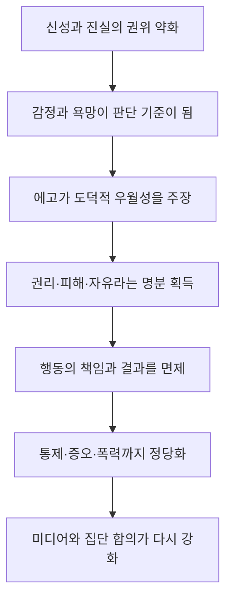

# 『현대인의 의식수준』 제18장 「나르시시즘: 에고 숭배」||「도덕적 권위: 크나큰 갈등」

## 질문 · 2026-08-01 23:50

18
Reality, Spirituality and Modern Man
나르시시즘: 에고 숭배
⁠⁠⁠⁠⁠⁠⁠⁠⁠⁠⁠⁠⁠⁣⁣⁣⁠⁣⁠⁣⁣⁠⁣⁣⁠⁣⁠⁣⁣⁣⁠⁣⁣⁠⁠⁣⁣⁣⁣⁠⁣⁠⁣⁠⁣⁠⁠⁠⁠⁣⁠⁣⁣⁠⁣⁠⁠⁣⁠⁣⁣⁠⁣⁠⁣⁠도덕적 권위: 크나큰 갈등

오늘날 세상의 특징은 ‘도덕적 권위’를 붙잡기 위해 격렬한 경쟁이 벌어진다는 점이다. 타고난 허영심과 타자에게 휘두를 수 있는 인지된 지배력과 통제가 그런 경쟁에 뛰어들게 만드는 요인이다. 이 경쟁은 전 세계 국가들, 정치 시스템과 철학 체계, 그리고 세계의 모든 문화에 다 적용된다. 이들은 전부 도덕적 우월성, 즉 모든 행위의 정당화를 주장한다. 교묘하게 피해자인 척하는 논리는 언제라도 빠져 나갈 수 있는 교활한 뒷문과도 같다. 이로써 ‘타자를 부당하게 모욕하는 것’은 도덕적 협박을 담은 조작이 된다.

미디어가 주도하는 오늘날 사회에서 가장 잔인하고 망상에 찌든 선언과 매우 극단적 행위까지도 진실과 동급의 지위를 얻고 있다. 이런 기제를 내세움으로써 ‘옳은’ 것과 ‘탁월한’ 것이라는 부가 가치를 얻은 일련의 뜬소문 같은 권리와 주장이 따라 나온다. 이로써 무엇이 되었건 모든 것을 정당화하거나 변명할 수 있으며, 최소한 동정심을 살 만한 대중 여론을 만들 수도 있다. 현재 세상은 신성이 아니라 에고를 숭배한다. 그 결과, 세상은 나르시시즘적 과대망상형 수사와 거의 정신병 수준의 노골적 허위에 영합하고 있다.(‘언론표현의 자유’라는 독실한 사자굴) 오늘날 사회는 강화된 도덕적 ‘권리들’이 경쟁을 펼치는 장이 되었다. 실제로 그 권리들이란 이익을 추구하는 이기적 자기중심성에 불과하다.

정직, 진실, 혹은 청렴성을 가장 사악하게 변형시킨 내용까지 기꺼이 받아들이는 것은, 결국 역사상 항상 그랬듯이 에고의 나르시시즘적 핵심이 전 세계 문화를 쇠퇴시키고 ‘종교’로 위장한 채 무고한 사람들을 죽음으로 몰고 가는 은둔의 장본인이라는 사실을 확인시켜 준다. 사실 이 점은 의식 연구의 기본 전제였다.

이런 작금의 동향은 앞서 기술한 현대 기독교의 ‘자유화’로 표면화된다.(Allen 2006) 기실 기독교의 자유화는 신자 수가 50퍼센트까지 떨어진 사태에 대한 대응책이었다. 심지어 자유화는 예수가 그리스도의 신성한 화신임을 부인하고, 삼위일체나 영성체의 성화를 무효화하면서 대신 그 자리에 성차별주의 정치 이데올로기를 가져다 놓을 정도로 확대되었다.(냉소적 코미디언이자 사회 비평가인 레니 브루스는 “사람들이 떼를 지어 우르르 교회를 떠나 신에게 돌아가고 있다.”고 말하기도 했다.)

이를 테면 사회적 ‘감수성(sensitivity)’에 부응함으로써 ‘대자연의 어머니(Mother Nature)’가 ‘대자연의 부모(Mother-Father Nature)’가 되어야 한다고 누군가는 상정할 수 있다. 문법적으로, 신을 가리키는 대명사 ‘He’는 포괄적 총칭이지 남성을 언급하는 게 아니다. 이와 비슷하게, 사람을 가리키는 명사 ‘Man’도 포괄적으로 인류를 지칭하는 것이지 그 자체로 남성을 말하는 게 아니다.

의식 수준 1000으로 측정되는 역사상 가장 위대한 영적 스승들은 신성을 조롱하고 하느님의 신성을 부인하는 것을 신성모독이라고 단단히 경고했다. 신성모독은 의식 수준 20에 불과하다. 그런 진지한 원칙을 일부러 위반하고, 그 대신 무신론자인 허버트 마르쿠제나 마르크스 변증법(135)의 산물인 정치 이데올로기를 마음껏 발휘하는 것은 극단적으로 과장되고 어리석은 모습일 것이다. 개신교 목사들, 가톨릭 주교들, 심지어 대주교들조차 그들의 종교적 진실이 갖고 있는 전제들을 어기려고 하는 것 같다. 이에 관련되는 지적 작용(intellectualization)(190)의 의식 수준은 에고 특유의 한계를 반증하며, 빛비춤이 빠져 있는 상태를 나타낸다. 기독교 교리에서 예수 그리스도는 천국에서 인간을 대변하는 존재다. 성부의 아들로서 인간을 대신하여 십자가에 못 박히고 인간을 구원하였다. 따라서 예수 그리스도를 공개적으로 부인하면 근본 교리 자체가 성립되지 않는 것이다.

도덕적 권위라는 허영을 갈구하는 에고의 극단적 욕망은 결국 진실한 이성과 종교적 믿음을 거부하고, 그 자리에 열등한 개념들을 대신 갖다 놓는다. 또한 이런 진실의 역전은 신의 이름(‘자비’의 알라)으로 무고한 사람들을 살육하는 방종을 도덕적으로 우월한 것으로 바라보고 정당화하고 합리화하는 데 이용된다. 『쿠란』에는 의식 수준 90으로 측정되는 구절들이 있는데, 이를테면 “그들을 참수하라.”(의식 수준 10)나 “이단자는 발견하는 대로 죽여 없애라.” 등은 전반적으로 『쿠란』의 높은 가르침을 완전히 무효화하는 것이다.(‘야만’, Schuer 2007)

진실이 허위로 역전되면서 지상의 삶은 끝없는 공포, 위험, 그리고 위협에 매달리는 곳으로 변했다. 미국 내 많은 이슬람 사원에서 테러리스트 이데올로기를 훈련시키고 있다는 점은 매우 의미심장하다.(King 2007)

그런 세상에서는 도덕적 우월성을 내세워 프로이트의 ‘이드’라는 원시적 심연을 신의 이름이라고 선언하기에 이르렀다. 추정된 도덕적 권위의 산물로서 모든 형태의 타락과 부패가 승인을 받고, 더 나아가 미국 사법부의 ‘도덕적 권위’가 공표했듯이 ‘행위가 상징적 발언’(190)이라는 논리로써 ‘어떠한’ 행동, 아니 심지어 모든 행위가 합법적이며 용인될 수 있다는 합리화를 내세워 법적 옹호까지 이끌어 내고 있는 실정이다.

환경론자들은 ‘도덕적 권위’를 내세워 방화를 저지르고 주택과 건물을 폭발한다. 그리고 ‘자유’ 정치 활동 조직을 거느린 무장단체 창설자들은 전 인류를 상대로 전쟁을 선포한다. 반역자가 영웅이 되고, 폭동을 선동하는 일은 고귀한 이상주의에서 나온 찬사받을 만한 표현으로 공표된다. 기실 이런 이상주의가 어떠한 행동이라도 합리화하는 근거로 이용되는 것이다. 조국을 맹렬히 비난하는 일도 이제는 초애국적인 일이 되었다.

사법부에서 행위는 상징적 발언이고 표현은 자유로워야 한다고 공표한 점을 감안한다면, 확실히 무정부상태가 이 땅의 새로운 법률이 되었다. 따라서 촘스키의 저작(180), 마르쿠제의 저작(150), 푸코의 저작(90)과 기타 저서들이 위대한 화신(1000)들을 대체한다. 만약 상대주의의 주장대로 온전한 정신과 정신이상이 모두 타고난 실재 없이 단순히 억압을 언어적으로 구성한 형태일 뿐이라면, 1965년 왓츠 폭동과 2005년 허리케인 카트리나 사후 재난, 그리고 바그다그 거리와 축구 경기장 난동으로 표출된 무정부의적 혼란도 사회정치적 이상이 된다.

도덕적 상대주의가 우월하다고 ‘새로운 도덕’인 것처럼 이상화하는 행위는 그것이 그저 합리화된 비도덕성이라는 사실을 알게 되면서 산산조각 난다. 역설적으로, 조지 오웰의 『1984』에 나오는 정치선전용 기만전술인 ‘새로운 언어(newspeak)’와 ‘새로운 생각(newthink)’에 따라 정당화된 전체주의적 수단은 자유에 대한 새롭고, 확장된, 현대화된 관점들(상대주의)을 강요한다. 이런 예측은 현재 대학 캠퍼스 내 ‘사상 경찰’, ‘건강 경찰’, ‘비만 아동의 부모 경찰’, 그리고 ‘사회적 감수성’이라는 『언어 경찰』(Ravitch 2003) 등으로 사실상 구현되었다. 그 결과, 이른바 포스트모던적 ‘도덕성’의 자유는 캠퍼스 안에서 학생들이 대학 합창단까지 공격하는 현실이 증명하듯이 자기 부정을 통해 스스로가 틀렸음을 입증하고 말았다.(Dierker 2006, 『관용의 폭정』 참고) 정치적으로 편향된 관점 때문에 극좌파의 소위 ‘진보주의(liberalism)’는 전체주의적 통제와 강압으로 변한다.(오늘의 진보적 해방자는 내일의 독재자다.)

믿음과 이성을 부인하면 결국 자유해방이 아니라 부패와 타락으로 이어진다는 사실은 미국 내 감옥과 교도소가 항상 꽉 차 있고 이 땅에 정신병자와 노숙자 집단이 끊이지 않는 것을 보면 알 수 있다. 또한 도덕적 우월성은 모든 전쟁을 상대주의적 입장에서 바라본다. 전쟁은 이상주의적 정당화를 먹고 자라는 괴물이다. 그리하여 ‘자유’는 주변의 동정과 지지를 통한 나르시시즘적 자기 미화를 위장하고, 도덕을 빙자하여 호전적이고 변질된 타락을 교묘히 가리기 위해 가져다 쓰는 속임수가 된다.

샌디에이고 대학에서 수행한 24년간의 연구는 해당 대학생 세대의 나르시시즘이 시간이 지남에 따라 점진적으로 증가했음을 확인시켜 준다. 「더 뷰(The View)」같은 텔레비전 프로그램은 표현의 자유라는 깃발 아래, 의식 수준 60으로 측정되는 명시적 증오를 지지하는 자기도취적 남성폭력을 노골적으로 보여 주면서 승승장구한다. 그러한 표현을 옹호하고 방어하는 사람들은 그처럼 ‘대단한’ (수익이 나는) 깜짝 쇼의 광기를 보고 독실한 척 위선을 떨면서 대단히 즐거워하고 있는 것이다.

대중 매체의 주목을 바라는 욕심은 사실상 일종의 중독 현상이다. 이런 중독은 심할 경우 허위 고백, 범죄 모방, (테이저건 사용을 부르는) 의도적 도발, (돌을 던져 죽이는 등) 경찰 행위에 대한 의도적 조작, 그리고 ‘피해자’ 설정 시나리오 등 극단적인 행위가 상습적으로 이어진다. 가령, 미국 정부는 불법 이민자들이 벌이는 기발한 속임수 때문에 그들을 자녀들이나 가족들과 분리하고 있는데, 외부에서는 미국 정부가 매우 냉담하게 일을 처리하는 것으로 보일 수밖에 없다. 또 노골적인 성적 행위를 과시하거나 심지어 범죄 행위를 ‘카메라에 잡히게’ 하는 것도 그들이 자주 쓰는 방법이다. 이슬람 과격파들도 여성 선교사를 서서히 참수하거나 아이들이 탄 버스를 폭발시키면서 광기 어린 놀이를 한다. 빈 라덴이 미디어의 관심을 철저히 활용하듯이 이슬람 무장단체도 마찬가지다.

(현재 미국에서 의식 수준 190으로 측정되지만) 과도한 찬사를 받는 언론표현의 자유가 내세운 도덕적 ‘우월성’은, 그것을 의도적으로 활용하는 양상 때문에 사회적 자살을 야기하는 양날의 칼이 되었다. 이로써 학계와 사회의 구조는 점차 붕괴된다. 그것은 지각이나 개념화를 자기 입맛대로 채색함으로써 본질을 흐릴 작정으로 모든 것을 정치적 논란거리로 만든 결과다.(Krauthammer 2007) 역설적이지만 이 와중에도 사회의 기본 구조는 경제, 산업, 비즈니스, 기업의 역할(350-380)이라는 실용주의를 유지하고 있으며, 더 나아가 의무, 법적 구조, 합리성, 책임 등으로 강화되고 있다. 가령, 현재 허리케인 카트리나 이후 정부 행정부서가 정치 관료들의 싸움으로 갈팡질팡하는 동안, 기업 주체 월마트는 실제로 생존 필수품을 재난 지역에 공급하였다.36)

## GPT 답변 · 2026-08-01 23:53

# 『현대인의 의식수준』 제18장 「나르시시즘: 에고 숭배」||「도덕적 권위: 크나큰 갈등」

※ 이 절에서 ‘오늘날’과 ‘현재’는 주로 집필 당시인 2007~2008년 전후의 미국 사회를 가리킵니다. 다만 호킨스 박사님께서 설명하시는 심리적·영적 기제는 특정 시대에만 한정되지 않습니다.

## 핵심 뜻

이 절의 중심 명제는 다음과 같습니다.

> 도덕적 권위가 진실·청렴성·책임에서 분리되면, 에고는 자신을 ‘선한 편’이라고 선언하는 것만으로 욕망과 증오, 통제와 폭력까지 정당화한다.

여기서 ‘에고 숭배’란 단순히 자신을 좋아하거나 자존감이 높은 상태가 아닙니다. 자신의 감정·욕망·이념을 선악을 판정하는 최고의 기준으로 삼는 상태입니다. 신성이나 진실보다 ‘내가 옳다고 느끼는 것’이 우선하므로, 에고가 사실상 신의 자리를 차지합니다.

따라서 이 절의 나르시시즘은 개인적인 허영을 넘어섭니다. 종교·정치·언론·법률·학계 같은 사회제도 전체가 자기중심적인 욕망에 도덕적 명칭을 붙여 주는 집단적 현상을 가리킵니다.

---

## 제17장에서 제18장으로 이어지는 흐름

제17장에서는 이성과 믿음이 서로를 밝혀 주어야 한다는 성 토마스 아퀴나스의 관점을 다루었습니다. 그런데 이성과 믿음이 모두 밀려나면 그 빈자리가 저절로 비어 있지는 않습니다. 그 자리에 감정과 나르시시즘이 들어옵니다.

그 흐름은 다음과 같습니다.

제18장은 이 가운데 ‘에고가 어떻게 도덕적 권위를 빼앗아 자신의 욕망을 성스러운 것으로 포장하는가’를 사회적 차원에서 확대하여 설명합니다.

---

## 1. 참다운 도덕적 권위와 도덕적 우월성의 차이

호킨스 박사님께서는 두 가지를 엄격히 구분하십니다.

| 구분 | 참다운 도덕적 권위 | 나르시시즘적 도덕 우월성 |
|---|---|---|
| 근원 | 진실, 본질, 청렴성 | 감정, 욕망, 집단적 인정 |
| 태도 | 겸손, 책임, 자기 절제 | 특별함, 독선, 자기 확대 |
| 행동과의 관계 | 수단과 결과 모두 온전해야 함 | 명분이 좋으면 어떤 수단도 허용 |
| 책임 | 자신의 선택과 결과를 감당함 | 피해자·이념·권리를 내세워 회피 |
| 타자와의 관계 | 배려하되 진실을 훼손하지 않음 | 동의와 복종을 요구함 |
| 외부 인정 | 선전할 필요가 없음 | 언론·군중·도덕적 찬사가 필요함 |
| 힘의 성질 | 존재 자체에서 나오는 힘 | 압박·협박·강압에 의존하는 위력 |

참다운 도덕적 권위는 “내가 옳다”고 크게 선언해서 생기지 않습니다. 정직, 책임, 자비, 의무와 같은 성품이 오랜 시간 일관되게 나타날 때 자연스럽게 드러납니다.

반면 도덕적 우월성은 자신이 ‘선한 편’에 속했다는 느낌을 보상으로 얻습니다. 이때 중요한 것은 실제로 무엇을 했느냐가 아니라, 자신이 어떤 명분을 대표한다고 주장하느냐입니다.

---

## 2. 왜 에고는 도덕적 권위를 그토록 원하나

에고에게 도덕적 권위는 단순한 명예가 아니라 매우 강력한 면책 장치입니다.

평범한 욕망은 “나는 이것을 원한다”고 말해야 합니다. 그러면 그 욕망의 정당성과 결과에 대해 질문받을 수 있습니다. 그러나 욕망을 ‘정의’나 ‘권리’로 바꾸면 상황이 달라집니다.

- 욕망은 검토의 대상이지만, 권리는 침해해서는 안 되는 것으로 여겨집니다.
- 공격은 비난받지만, 정의를 위한 투쟁은 칭송받을 수 있습니다.
- 통제는 거부감을 일으키지만, 보호나 감수성이라는 명칭을 붙이면 선한 행위처럼 보입니다.
- 증오는 부정적으로 보이지만, 악에 대한 의분이라고 부르면 도덕적 가치가 덧붙습니다.

그러므로 에고는 자신의 욕망을 직접 드러내기보다 도덕적 언어로 재명명합니다. ‘내가 원한다’가 ‘이것은 마땅히 보장되어야 한다’로, ‘나는 저들을 싫어한다’가 ‘저들은 정의에 어긋난다’로 바뀝니다.

이것이 호킨스 박사님께서 말씀하시는 ‘도덕적 권위를 붙잡기 위한 경쟁’입니다.

---

## 3. 피해자 위치와 도덕적 협박

발췌문에서 말하는 ‘피해자인 척하는 논리’는 실제 피해자의 고통을 부정한다는 뜻이 아닙니다. 책임을 피하고 상대방을 통제하기 위해 피해자의 지위를 의도적으로 이용하는 기제를 뜻합니다.

그 구조는 다음과 같습니다.

1. 자신의 불만이나 요구를 피해로 규정합니다.
2. 상대방을 가해자나 억압자로 지정합니다.
3. 자신의 감정을 객관적 진실처럼 제시합니다.
4. 반대 의견을 또 다른 가해 행위로 규정합니다.
5. 결국 자신의 주장에 대한 검토 자체를 봉쇄합니다.

이때 “나에게 모욕감을 주었다”는 선언은 단순한 감정 표현이 아니라 상대방을 침묵시키는 도덕적 명령으로 변합니다. 상대방이 사실관계를 설명하거나 책임을 묻더라도, 그 행위마저 ‘피해자를 다시 공격하는 것’으로 재해석할 수 있습니다.

따라서 피해자 위치는 언제든 책임에서 빠져나갈 수 있는 ‘뒷문’이 됩니다. 자신의 행동은 피해의 결과라고 설명되고, 상대방의 반응은 억압의 증거로 이용됩니다.

---

## 4. 권리가 욕망의 면허로 변하는 과정

호킨스 박사님께서 문제 삼으시는 것은 권리 자체가 아닙니다. 권리가 의무·책임·현실적 한계에서 분리되는 현상입니다.

진실한 권리는 다른 사람에게도 동일한 권리를 인정합니다. 또한 권리의 행사에는 결과에 대한 책임과 공동체의 생존 조건이 포함됩니다. 그러나 나르시시즘적 권리 주장은 다음과 같이 작동합니다.

> “내 욕망을 제한하지 않는 것이 정의이며, 그 욕망 때문에 생긴 결과는 사회가 책임져야 한다.”

이렇게 되면 권리는 자유의 보호 장치가 아니라 자기중심성을 확대하는 수단이 됩니다. 개인의 감정이 공동체의 안전·질서·사실보다 우선하며, 제한을 가하는 행위는 곧 억압으로 간주됩니다.

결국 권리의 언어는 유지되지만, 그 안에서 권리와 짝을 이루는 책임은 사라집니다. 호킨스 박사님께서는 이것을 자유가 아니라 방종으로 보십니다.

---

## 5. 미디어가 거짓과 진실을 동급으로 만드는 방식

미디어는 진실을 창조하지는 않지만, 어떤 주장에 가시성과 사회적 지위를 부여할 수 있습니다. 극단적인 발언도 반복적으로 노출되면 하나의 정당한 ‘관점’으로 인정받습니다.

여기서 중요한 전환은 사실 여부보다 주목도가 가치의 기준이 된다는 점입니다.

- 진실한가보다 충격적인가가 중요해집니다.
- 책임 있는가보다 화제가 되는가가 중요해집니다.
- 실제 결과보다 어떤 이미지로 보이는가가 중요해집니다.
- 조용한 봉사보다 공개적인 분노가 더 큰 관심을 받습니다.

이런 환경에서는 과장, 도발, 허위 고백, 의도적으로 연출된 충돌이 보상을 받습니다. 주목을 받을수록 자기중요감이 커지고, 그 자기중요감은 더 큰 도발을 요구합니다.

> 도발 → 미디어의 관심 → 자기중요감의 상승 → 더 강한 도발

호킨스 박사님께서 미디어의 주목을 ‘중독’이라고 부르시는 이유가 여기에 있습니다. 추구되는 것은 정보 전달이 아니라, 수많은 사람이 자신을 바라보고 있다는 나르시시즘적 쾌감이기 때문입니다.

---

## 6. “세상은 신성이 아니라 에고를 숭배한다”는 의미

신성을 숭배한다는 것은 자신보다 높은 진실과 질서가 존재한다는 사실을 인정하는 것입니다. 여기에는 겸손과 자기 제한이 따라옵니다.

반면 에고 숭배는 다음과 같이 말합니다.

- 내 감정은 침해할 수 없는 최종 기준이다.
- 내가 선택한 집단은 도덕적으로 우월하다.
- 내가 선한 목적을 가졌으므로 수단도 정당하다.
- 나를 반대하는 것은 진실에 대한 반대다.
- 내가 받은 관심의 크기가 내 주장의 중요성을 증명한다.

이 상태에서는 인간이 신성에 자신을 맞추는 것이 아니라, 신성·도덕·종교를 자신의 욕망에 맞추어 재정의합니다. 신의 이름이 에고의 욕망을 승인하는 도장으로 이용되는 것입니다.

따라서 에고 숭배는 종교가 없는 상태만을 뜻하지 않습니다. 종교적 언어를 열렬히 사용하면서도 실제로는 에고를 섬길 수 있습니다. 오히려 신성한 이름이 세속적 권력욕에 이용될 때 그 위장은 더욱 강력해집니다.

---

## 7. 종교의 ‘자유화’가 의미하는 것

이 부분에서 호킨스 박사님께서 겨냥하시는 것은 단순한 예배 형식의 변화나 시대에 맞춘 표현의 조정이 아닙니다. 종교가 자신의 근본 전제를 부정하면서도 종교적 권위를 계속 유지하려는 모순입니다.

기독교의 권위는 예수 그리스도의 신성, 성부와 성자, 구원이라는 근본 교리에 기초합니다. 그런데 그 전제를 부정하고 정치 이데올로기를 중심에 놓으면 외형은 교회로 남아 있어도 권위의 근원은 달라집니다.

다시 말해 다음과 같은 교체가 일어납니다.

| 본래의 중심 | 교체된 중심 |
|---|---|
| 계시 | 정치적 유행 |
| 신성 | 사회적 승인 |
| 교리의 통합성 | 대중적 호감 |
| 영적 변형 | 집단 정체성 |
| 영원한 진실 | 시대의 감수성 |

호킨스 박사님의 관점에서 이것은 종교를 넓힌 것이 아니라 종교의 근원을 제거하고 그 자리에 세속 이념을 넣은 것입니다. 신자 수를 유지하기 위해 근본 교리를 약화하면, 사람들이 그 종교에 머물러야 할 이유도 함께 약화됩니다.

---

## 8. 언어 변경과 본질·외관의 혼동

‘Mother Nature’, ‘He’, ‘Man’에 관한 예시는 단순한 문법 논의가 아닙니다. 언어적 외관을 변경하는 일이 실제 본질을 바꾸는 것처럼 여겨지는 현상을 보여줍니다.

호킨스 박사님의 설명에서 포괄적 총칭은 생물학적 성별을 주장하는 표현이 아닙니다. 그런데 단어의 표면적 형태만을 문제 삼으면, 말이 가리키는 전체 맥락보다 단어 자체에 투사된 감정이 우선합니다.

이때 에고는 자신이 불편해한다는 사실을 곧 언어가 부당하다는 증거로 사용합니다. 그러므로 논의의 기준이 의미와 의도에서 감정적 반응으로 이동합니다.

이것이 앞 장의 「실재를 대체한 감정」과 연결됩니다. 외부의 단어가 실제로 무엇을 뜻하는가보다, 그 단어를 접한 내가 어떻게 느끼는가가 진실을 결정하게 됩니다.

---

## 9. 지적 작용이 이성을 대신하는 경우

본문에서 ‘지적 작용’은 단순히 지성을 사용하는 것을 뜻하지 않습니다. 이미 감정과 욕망으로 결정된 결론에 지적인 설명을 붙이는 방어기제를 뜻합니다.

참다운 이성은 전제에서 결론까지 일관되게 나아가며, 자신의 결론도 검증 대상으로 삼습니다. 반면 지적 작용은 결론이 먼저 정해져 있습니다.

> 욕망 또는 이념 → 원하는 결론 → 그럴듯한 용어와 이론으로 포장

그래서 겉으로는 매우 복잡하고 학문적으로 보일 수 있지만, 실제 기능은 자기정당화입니다. 호킨스 박사님께서 이를 의식 수준 190으로 측정하시는 이유도 여기에 있습니다. 190은 200의 바로 아래에 있어 지적 세련미와 설득력을 보일 수 있지만, 진실보다 이익과 위치성을 섬깁니다.

즉 지식이 부족해서 생기는 오류가 아니라, 많은 지식을 에고의 방어에 동원하는 오류입니다.

---

## 10. 종교적 폭력에서 일어나는 진실의 역전

호킨스 박사님께서는 기독교와 이슬람을 비롯한 종교의 높은 가르침 자체와, 종교의 권위를 강탈하여 폭력을 정당화하는 낮은 요소를 구분하십니다.

핵심은 다음과 같습니다.

- 신성은 자비와 사랑의 근원입니다.
- 폭력적 에고는 신성의 권위를 필요로 합니다.
- 따라서 자신의 공격성을 ‘신의 뜻’으로 재명명합니다.
- 그러면 살육과 증오가 죄가 아니라 의무처럼 보이게 됩니다.

이것이 가장 극단적인 진실의 역전입니다. 인간의 원시적 충동이 신의 이름을 사용하고, 무고한 사람을 해치는 행위가 도덕적으로 우월한 것으로 선전됩니다.

본문에서 『쿠란』의 높은 가르침과 낮은 구절들을 구분하는 것도 같은 맥락입니다. 높은 가르침이 존재하더라도, 낮은 구절이나 해석이 실제 행동을 지배하면 그 종교의 사회적 표현은 낮은 요소에 의해 훼손됩니다. 종교의 명칭이 그 안에서 이루어지는 모든 행위를 자동으로 성스럽게 만들지는 않습니다.

---

## 11. ‘행위가 상징적 발언’이라는 논리

호킨스 박사님께서는 표현의 자유 자체를 부정하시는 것이 아닙니다. 표현의 자유가 진실·책임·타인의 권리와 분리되어 절대화되는 상태를 지적하십니다.

행동을 모두 표현으로 간주하고, 표현은 제한할 수 없다고 선언하면 다음과 같은 논리가 만들어집니다.

> 모든 행동은 표현이다 → 표현은 자유롭다 → 모든 행동은 허용되어야 한다.

이 논리에서는 행동의 구체적 피해와 결과가 사라집니다. 방화·폭동·파괴도 어떤 이념을 표현하는 상징으로 재해석될 수 있습니다. 행동의 실제 성질보다 그 행동에 붙인 정치적 의미가 우선하는 것입니다.

그러나 호킨스 박사님의 체계에서 자유는 책임과 분리될 수 없습니다. 결과를 감당하지 않는 자유는 성숙한 자유가 아니라 충동의 무제한적 표출입니다.

---

## 12. 이상주의가 폭력을 합리화하는 방식

호킨스 박사님께서는 이상 자체를 부정하시는 것이 아니라, 아직 검증되지 않은 이상을 현실보다 우위에 놓는 태도를 경계하십니다.

이상주의가 나르시시즘과 결합하면 세 단계의 변화가 일어납니다.

1. 자신이 선택한 이상을 절대적으로 선하다고 규정합니다.
2. 그 이상에 반대하는 사람을 악으로 규정합니다.
3. 악을 제거한다는 명분으로 어떤 수단도 허용합니다.

그 결과 수단의 악함이 목적의 선함에 의해 씻겨 나간다고 믿게 됩니다. 그러나 실제로 드러나는 것은 그 사람이 내세운 이상이 아니라 선택한 행동입니다.

“전쟁은 이상주의적 정당화를 먹고 자라는 괴물”이라는 표현은 이를 압축합니다. 전쟁과 폭력은 자신을 노골적인 탐욕으로 제시하기보다 자유·민족·정의·평등·신의 뜻과 같은 높은 명칭으로 포장해야 대중을 동원할 수 있습니다.

---

## 13. 도덕적 상대주의의 자기모순

도덕적 상대주의는 절대적인 진실이나 도덕적 기준이 존재하지 않는다고 주장합니다. 그러나 동시에 상대주의가 기존 도덕보다 더 올바르고 우월하다고 주장하면 모순이 생깁니다.

- 모든 진리가 상대적이라면 ‘모든 진리가 상대적’이라는 주장도 상대적입니다.
- 보편적 도덕이 없다면 상대주의를 받아들여야 할 보편적 의무도 없습니다.
- 어떤 견해도 억압해서는 안 된다면 상대주의에 반대하는 견해 역시 억압할 수 없습니다.
- 그런데 상대주의를 강제로 적용하면, 상대주의가 부정한 절대적 권위를 자신이 행사하게 됩니다.

이 때문에 해방을 약속한 이념이 ‘사상 경찰’과 ‘언어 경찰’을 낳습니다. 처음에는 모든 사람을 억압에서 풀어 주겠다고 하지만, 나중에는 어떤 표현과 생각이 허용되는지를 세밀하게 통제합니다.

“오늘의 진보적 해방자는 내일의 독재자”라는 문장은 자유가 진실과 겸손에서 분리될 때 통제로 뒤집히는 과정을 뜻합니다.

---

## 14. 나르시시즘에는 관객이 필요하다

참다운 도덕성은 누가 보지 않아도 유지됩니다. 반면 나르시시즘적 도덕성은 자신의 우월성을 확인해 줄 관객이 필요합니다.

이 때문에 미디어와 나르시시즘은 서로를 강화합니다.

- 미디어는 충격적인 장면을 필요로 합니다.
- 나르시시즘은 주목과 찬사를 필요로 합니다.
- 과격한 행위는 더 많은 보도를 얻습니다.
- 보도는 행위자에게 중요성과 권력을 부여합니다.
- 다른 사람들은 그 장면을 모방하여 다시 관심을 얻으려 합니다.

테러리즘이 미디어를 이용하는 것도 같은 원리입니다. 물리적 파괴만이 목적이라면 공개적인 촬영이나 선전이 반드시 필요하지는 않습니다. 그러나 공포와 과대망상적 중요성을 전 세계에 투사하려면 관객이 필요합니다.

따라서 미디어의 관심은 단순한 보도가 아니라 행위가 노리는 심리적 보상의 일부가 될 수 있습니다.

---

## 15. 왜 마지막에 월마트 사례가 나오는가

이 절의 마지막에서 호킨스 박사님께서는 정치 관료들이 논쟁하는 동안 월마트가 재난 지역에 생필품을 공급했다는 사례를 드십니다. 이는 기업이 언제나 도덕적으로 우월하다는 뜻이 아닙니다.

비교되는 것은 수사와 기능입니다.

- 정치화된 관료 체계는 책임 소재와 이미지에 매달립니다.
- 기능적인 조직은 필요한 물품, 운송 경로, 시간, 결과를 다룹니다.
- 전자는 도덕적 명분을 주장하지만 실제 필요를 해결하지 못합니다.
- 후자는 거창한 명분을 내세우지 않아도 생존에 필요한 결과를 만들어 냅니다.

경제·산업·비즈니스의 역할이 350~380으로 제시되는 이유는 현실 수용, 합리성, 의무, 계약, 책임, 결과 확인이라는 특성이 작동하기 때문입니다.

즉 실제 위기에서는 “누가 더 선한 편인가”라는 선언보다 “누가 책임을 맡아 필요한 일을 이루었는가”가 진실을 드러냅니다.

---

## 의식 수준으로 읽는 이 절

의식 수준은 사람의 고정된 신분이나 인간적 가치를 뜻하지 않습니다. 특정한 진술·이념·동기·현실 인식 방식이 어떤 에너지장과 조화를 이루는지를 나타냅니다.

| 의식 수준 | 본문에서의 사례 | 해설 |
|---:|---|---|
| 10~20 | 극단적 폭력 명령, 신성모독 | 신성과 생명의 가치를 거의 완전히 부정하는 상태 |
| 60 | 명시적 증오 | 적대감에서 자기도취적 쾌감을 얻는 상태 |
| 90~180 | 극단적 이념, 상대주의적 저작과 주장 | 감정·욕망·위치성이 진실보다 앞서는 영역 |
| 180~190 | 수사, 지적 작용, 과장된 표현의 자유 | 논리적 외관을 갖지만 책임과 진실성이 빠진 상태 |
| 200 | 온전성의 임계점 | 자신의 선택과 결과에 책임지기 시작하는 전환점 |
| 350~380 | 합리적 조직, 의무, 기능적 책임 | 현실을 받아들이고 실제 문제를 해결하는 영역 |
| 400대 | 이성과 논리 | 사실·정의·일관성을 중시하는 영역 |
| 1000 | 위대한 화신 | 신성과 진실이 완전히 드러나는 최고 기준 |

특히 190이 중요합니다. 이 수준의 주장은 터무니없이 보이기보다 세련되고 지적으로 보일 수 있습니다. 그러나 논리와 언어가 진실을 발견하기 위해 사용되는 것이 아니라, 이미 정해진 욕망과 이념을 정당화하기 위해 사용됩니다.

---

## 참다운 도덕성은 왜 조용한가

이 발췌문 바로 다음 소주제인 「참다운 도덕성」에서 호킨스 박사님께서는 도덕성의 본래 모습을 분명히 제시하십니다.

참다운 도덕성은 타인을 배려하고, 정직하며, 책임을 감당하고, 친절하고, 정중하며, 도움을 주는 성품으로 나타납니다. 그러나 이러한 태도는 자신의 우월성을 선전하지 않습니다.

도덕성은 도덕적이라는 이미지를 얻기 위한 수단이 아닙니다. 그 자체가 목적입니다. 그래서 참다운 도덕성은 다음과 같은 내적 방향을 가집니다.

- 자신이 얼마나 선해 보이는가보다 실제로 무엇을 했는가를 중시합니다.
- 타인의 잘못을 공개적으로 규탄하는 데서 쾌감을 얻지 않습니다.
- 높은 명분으로 자신의 이기심을 가리지 않습니다.
- 자유와 권리만이 아니라 의무와 결과도 함께 받아들입니다.
- 자신이 틀릴 수 있다는 겸손을 잃지 않습니다.
- 수단이 목적을 배반하지 않도록 합니다.

따라서 참다운 도덕성의 반대는 단순한 부도덕이 아닙니다. 도덕의 언어를 사용하면서 에고의 상승을 추구하는 위선적 도덕주의입니다.

---

## 전체 의미

이 절에서 호킨스 박사님께서 드러내시는 가장 깊은 문제는 인간에게 도덕이 사라졌다는 것이 아닙니다. 오히려 도덕의 명칭이 지나치게 많이 사용되면서, 그 명칭이 에고의 이익을 위한 무기가 되었다는 것입니다.

나르시시즘적 에고는 노골적으로 “나는 권력과 관심을 원한다”고 말하지 않습니다. 대신 다음과 같이 말합니다.

- 나는 정의를 대표한다.
- 나는 피해자를 대변한다.
- 나는 자유를 수호한다.
- 나는 억압에 저항한다.
- 나는 신의 뜻을 행한다.

그러나 그 주장의 진실성은 명칭이 아니라 동기·수단·결과에서 드러납니다. 그 결과가 증오, 강압, 책임 회피, 폭력, 분열이라면 높은 명분은 본질을 바꾸지 못합니다.

결국 제18장의 중심 대비는 다음과 같습니다.

> 나르시시즘적 도덕성은 자신을 높이기 위해 선을 이용하지만, 참다운 도덕성은 자신을 내세우지 않은 채 선을 구현합니다.

신성을 기준으로 삼는 사람은 자신을 진실에 맞추려 합니다. 에고를 기준으로 삼는 사람은 진실·도덕·종교·법률을 자신에게 맞추려 합니다. 바로 이 기준의 역전이 호킨스 박사님께서 말씀하시는 ‘나르시시즘: 에고 숭배’의 본질입니다.
