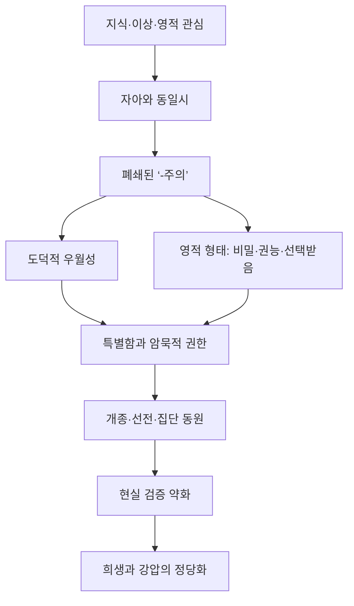

# 『현대인의 의식수준』 제18장 「나르시시즘: 에고 숭배」||「‘-주의’의 힘」·「도덕적 우월성으로서의 이상주의」

## 질문 · 2026-08-02 00:47

‘-주의’의 힘

의식 연구를 통해 두 가지 사실을 발견했다. 첫째, 접미사 ‘-주의(-ism)’는 의식 수준 190으로 측정된다. 둘째, 그것이 사회적으로 만연하고, 정치적으로 논란이 되고, 감정적으로 취급되는 신념 체계가 될 때 지식의 몸체나 일련의 기본 전제들이 쇠퇴하는 조짐을 보인다. 그리고 그 시스템의 지지자들은 도덕적 우월성을 무기로 으스대며 흥분한다. 따라서 형용사로서 ‘근본적(fundamental)’이라는 말과 추상명사 ‘근본주의(fundamentalism)’는 별개이며, 전혀 다른 뉘앙스와 함축적 의미를 갖게 된다. 심지어 과학도, 일단 ‘과학만능주의(scientism)’가 되어 버리면 진실성이 줄어든다. 과학만능주의의 대표적 사례는 환경결정론이나 물질주의적 환원론이다. 일단 신념 체계가 일종의 ‘-주의’가 되어 버리면, 사람들을 개종하려 하고 개종자들을 찾아내려 애쓴다. 중요한 점은, 도덕적 우월성이 에고의 나르시시즘적 핵심에 ‘특별함’이라는 부가적 지위, 그리고 그 지위가 부여하는 과장되고 묵시적인 권능을 안겨 주었다는 것이다.

영적 에고는 특별한 ‘힘’을 얻는 일에 매료된다. 대개 그런 특별한 ‘힘’은 소위 ‘이익을 얻으려고 유포된’ 수련(200)이라는 유혹의 미끼를 달고, 의식의 변형 상태를 유도함으로써 이른바 싯다의 미화된 면을 얻으려는 것이다. 또한 주술적으로 비술(秘術)에 끌리는 것을 미화하고, 애매모호한 가르침을 ‘비밀’ ‘UFO’ ‘불가사의’ ‘고대의 것’이라고 지정하는 행태도 있다. 이런 것을 극도로 미화시켜 하물며 ‘은밀한 가르침’(의식 수준 160)으로 부르기도 한다.

높은 의식 수준을 보이는 진실한 영적 가르침은 누구나 자유롭게 쓸 수 있으며 투명하다. 반면 ‘은밀한 가르침과 비술’은 상당히비싸고, 변형된 의식 상태나 특별한 ‘축복’은 수천 달러나 수만 달러 이상 값을 부른다.

은밀한 주술 의식, 화신, 의식 등은 어린 아이의 순진한 상상력에 어필한다. 이 점은 해리 포터 시리즈의 인기로 증명된다. 해리 포터 시리즈는 신비, 마술, 마술적 권능을 보기 좋게 그려낸 책이다. 이와 똑같은 특별함은 영적 세계와 교신하는 사람들, 심령 연구가, 투시력을 가진 사람, ‘다른 차원’에서 온 방문자와 UFO, ‘미래에서 온 전령’ ‘12사도들의 화신’ 등과 부합한다.

도덕적 우월성으로서의 이상주의

‘이상주의적’이란 말은 이름 자체는 매력적이지만 실은 아직 가설에 불과하다는 뜻이다. 역사상 인류의 모든 파괴 행위는 일부 부풀려진 이데올로기적 ‘이상’이 부채질한 것이었다.(가령, “세계에서 으뜸가는 독일.” “노동자들이여 단합하라. 그대들이 잃어버릴 것은 의자 빼고 아무것도 없다.” “자유해방 전선에 합류하라.” “인민의 정부를 지지하라.” “인민의 법정을.” 등이 대표적 구호다.)

가령, 사회주의와 공산주의를 비롯한 정치적 표출에서 ‘-주의’는 희생을 당연시하고 심지어 영웅으로 선전하는 등 순전히 반복에 의해 일종의 종교처럼 변해 버리는 슬로건 또는 밈이라고 부를 만한 유인책이다. 자살 폭탄 테러리스트들, 카미카제 비행사들, 그리고 자유 투사들을 미화하는 사례를 보라. 그와 같은 과시적 자만심과 허영심은 균형을 잃은 극단주의의 전형적인 특징이다. 그래서 심지어 자신과 다른 이들, 아이들, 그리고 영적 통합성까지 희생한 그런 모습을 텔레비전 프로그램으로 만들어 대대적으로 보여 주고 선전한다.

그러한 ‘-주의’의 배후에는 지도자들, 그리고 대규모 시위와 연극적 선전선동에 최면에 걸린 듯 나르시시즘적으로 빠져드는 추종자들의 자기중심주의가 깔려 있다. 다시 강조하지만, 그와 같은 모든 움직임을 조종하는 공통된 욕구는 도덕적 우월성을 주장하려는 충동이다.(레닌, 스탈린, 히틀러, 마오쩌둥, 폴 포트, 아라파트, 빈 라덴, 카스트로, 그리고 북한과 남미와 중동, 특히 이란의 지도자들이 모두 여기에 해당한다.)

## GPT 답변 · 2026-08-02 00:51

# 『현대인의 의식수준』 제18장 「나르시시즘: 에고 숭배」||「‘-주의’의 힘」·「도덕적 우월성으로서의 이상주의」

## 핵심 뜻

호킨스 박사님께서 말씀하시는 ‘-주의’는 단순한 접미사가 아닙니다. 어떤 지식·가설·이상이 자아의 정체성과 결합하여, 감정적으로 방어되고 정치적으로 확산되며 타인을 개종시키려는 폐쇄적 신념 체계로 변한 상태를 가리킵니다.

따라서 이 대목의 중심은 다음과 같습니다.

> 지식이나 이상이 나쁜 것이 아니라, 에고가 그것을 이용해 “나는 옳고 특별하며, 남을 심판하고 통제할 자격이 있다”는 지위를 얻는 순간 문제가 시작됩니다.

‘-주의의 힘’이라는 제목도 호킨스 박사님의 용어로 보면 역설적입니다. 이것은 진실 자체에서 나오는 힘(power)이라기보다 반복, 감정적 압박, 집단 동조와 선전에서 나오는 위력(force)에 가깝습니다.

## 1. 지식이 ‘-주의’로 변한다는 것

호킨스 박사님께서는 지식의 내용과 그 지식을 대하는 에고의 위치를 구분하십니다.

‘근본적’이라는 형용사는 어떤 사안의 기초나 핵심을 가리킬 뿐입니다. 그러나 ‘근본주의’가 되면 그 기초가 집단 정체성, 배타적 교리, 도덕적 판정 기준으로 바뀝니다. 마찬가지로 과학은 관찰과 검증, 수정 가능성을 중시하는 방법이지만, 과학만능주의는 과학적 방법이 다룰 수 없는 실재까지 부정하는 폐쇄적 세계관이 됩니다.

차이는 다음과 같습니다.

| 원래의 영역 | 본래 기능 | ‘-주의’로 굳어졌을 때 | 에고가 얻는 보상 |
|---|---|---|---|
| 과학 | 관찰·검증·수정 | 과학만능주의, 물질주의적 환원 | “우리는 유일하게 이성적인 사람들이다.” |
| 이상 | 더 나은 방향을 제시 | 현실과 결과를 무시하는 이상주의 | “우리만 정의로운 편이다.” |
| 종교·영성 | 신성과 진실을 향함 | 비밀 교리, 선택받은 집단, 권능 숭배 | “우리는 특별한 지식을 가진 사람들이다.” |
| 정치철학 | 사회 질서를 설명 | 이데올로기·선전·개종 운동 | “반대자는 악하거나 무지하다.” |

그러므로 모든 ‘-주의’라는 단어를 기계적으로 똑같이 취급하라는 뜻은 아닙니다. 이 문맥에서 ‘-주의’는 살아 있는 지식이 감정적으로 무장된 집단 신념으로 변하는 기능적 상태를 뜻합니다.

## 2. 의식 수준 190의 의미

190은 의식 수준 200의 경계 바로 아래에 있습니다. 이 수준은 반드시 무지하거나 조잡한 모습으로 나타나지 않습니다. 오히려 지식, 논리, 통계, 도덕적 언어를 능숙하게 사용할 수 있기 때문에 상당히 설득력 있어 보입니다.

그러나 인식 구조에는 다음과 같은 한계가 있습니다.

- 사실을 전체 맥락보다 자신의 입장에 맞춰 선택합니다.
- 신념의 오류를 인정하기보다 반대자를 공격합니다.
- 감정적 확신을 진실의 증거로 받아들입니다.
- 결과가 나빠도 기본 전제를 수정하지 않고 방해자나 배신자를 찾습니다.
- 집단의 규모와 열광을 진실성의 증거로 착각합니다.

190의 위험성은 거짓이 노골적인 거짓말로 나타나지 않는다는 데 있습니다. 진실의 일부를 사용하면서도 전체 맥락을 왜곡하기 때문에, 이성처럼 보이는 수사와 도덕처럼 보이는 나르시시즘이 결합합니다.

이 수치는 사람 전체의 고정된 등급이 아니라, 그 순간 작동하는 신념 체계와 현실 인식 방식의 성격을 나타냅니다.

## 3. 도덕적 우월성이 주는 ‘특별함’

도덕적 우월성은 실제로 더 도덕적인 사람이 되는 것과 다릅니다. 그것은 자신을 비교 우위에 놓음으로써 얻는 주관적 지위입니다.

에고는 여기서 세 가지 보상을 얻습니다.

첫째, 정체성입니다.  
“나는 정의로운 편에 속한다”는 믿음이 개인의 불안정한 자아를 강한 집단 정체성으로 대체합니다.

둘째, 특별함입니다.  
평범한 개인이 갑자기 인류, 민중, 정의, 신, 지구를 대표하는 사람처럼 느낍니다. 이것이 호킨스 박사님께서 말씀하시는 나르시시즘적 팽창입니다.

셋째, 암묵적 권한입니다.  
도덕적으로 우월하다고 느끼면 타인을 심판하고, 침묵시키고, 교육하고, 개종시키며, 경우에 따라 강제할 자격까지 있다고 생각합니다. 아무도 공식적으로 부여하지 않은 권한을 에고가 스스로 만들어 내는 것입니다.

그래서 의견 차이는 단순한 판단의 차이로 끝나지 않습니다. 반대자는 무지한 사람, 비도덕적인 사람, 인민의 적, 신앙의 적처럼 규정됩니다. 신념이 도덕적 신분증이 되었기 때문입니다.

## 4. 왜 ‘-주의’는 개종자를 필요로 하는가

진실은 그 자체로 완전하기 때문에 모든 사람을 설득하여 자신의 편으로 만들 필요가 없습니다. 그러나 자아와 결합한 신념은 외부의 동의를 통해 계속 확인받아야 합니다.

동조자가 늘어나면 “많은 사람이 믿으므로 우리가 옳다”는 느낌을 얻습니다. 반대로 이탈자나 반대자는 신념 체계뿐 아니라 자신의 정체성을 위협하는 존재처럼 보입니다. 이 때문에 종교적 개종만이 아니라 정치적 선동, 온라인 진영 싸움, 사상 교육, 끊임없는 회원 모집도 같은 구조를 갖습니다.

개종 욕구의 내면에는 다음과 같은 공식이 숨어 있습니다.

> 상대방이 내 신념을 받아들이면, 내 신념뿐 아니라 나의 가치와 특별함도 확인된다.

따라서 개종은 상대방을 위한 행위처럼 포장되지만, 실제 동력은 자신의 확실성과 우월성을 유지하려는 욕구일 수 있습니다.

## 5. 영적 에고와 ‘특별한 힘’

정치적 에고가 도덕적 고지를 원한다면, 영적 에고는 특별한 지식과 권능을 원합니다. 표면은 다르지만 구조는 같습니다.

- 정치적 에고: “나는 정의로운 사람이다.”
- 지적 에고: “나는 진실을 독점적으로 안다.”
- 영적 에고: “나는 선택받았고 특별한 능력이 있다.”

비밀, 고대의 가르침, 다른 차원, UFO, 화신, 투시, 특별한 축복이라는 표현은 내용이 명확하지 않을수록 오히려 상상력을 자극합니다. 모호함이 결함이 아니라 신비로움의 증거처럼 포장되는 것입니다.

‘비밀’은 동시에 인위적 희소성을 만듭니다.

1. 일반인은 모르는 지식이 있다고 주장합니다.
2. 선택받은 내부 집단만 접근할 수 있다고 합니다.
3. 입문비나 특별 비용을 요구합니다.
4. 비용을 많이 낼수록 더 높은 단계와 권능을 얻는다고 암시합니다.
5. 의심하는 태도는 영적으로 준비되지 않았다는 증거로 돌립니다.

이렇게 되면 검증 불가능성이 오히려 가르침을 보호하는 장치가 됩니다.

## 6. 진정한 싯디와 권능 추구의 차이

프로젝트의 다른 저작들과 통합하면 이 구분이 더욱 선명해집니다. 본문의 ‘싯다’는 문맥상 초상적 현상을 뜻하는 산스크리트어 ‘싯디(siddhi)’를 가리키는 것으로 보입니다.

호킨스 박사님께서는 『의식 수준을 넘어서』와 『신의 현존의 발견』에서 진정한 싯디를 다음과 같이 설명하십니다.

- 대략 의식 수준 540부터 자연발생적으로 나타납니다.
- 570 부근에서 더욱 뚜렷해질 수 있습니다.
- 개인의 의지로 일으키거나 통제할 수 없습니다.
- 그것은 개인의 소유물이 아니라 의식의 장에서 일어나는 현상입니다.
- 자신의 공로라고 주장하면 영적 에고가 팽창합니다.
- 선전하거나 판매할 수 있는 기술이 아닙니다.

따라서 참된 싯디와 상업적으로 유포되는 권능 훈련의 결정적 차이는 ‘현상의 기이함’이 아니라 소유·통제·과시·이득을 바라는 의도입니다.

| 의식 수준 | 이 대목에서의 의미 |
|---:|---|
| 160 | ‘은밀한 가르침’: 모호함·비밀주의·특별함을 이용하는 신념 |
| 180 | 수사학: 이기적 목적을 위해 논리와 원칙을 왜곡하는 언어 |
| 190 | 정치화되고 감정화된 ‘-주의’: 도덕적 우월성을 동반하는 폐쇄 체계 |
| 200 | 이득을 위해 유포되는 훈련: 일부 기능은 있을 수 있으나 영적 깨달음과 같지 않음 |
| 540~570 | 진정한 싯디: 자연발생적이고 비개인적이며 소유하거나 판매할 수 없음 |

## 7. 투명한 가르침과 고가의 비술

호킨스 박사님께서 “진실한 영적 가르침은 자유롭게 쓸 수 있으며 투명하다”고 하신 것은, 모든 책과 강의가 물질적으로 반드시 무료여야 한다는 단순한 뜻이 아닙니다.

핵심은 다음과 같습니다.

- 가르침의 본질이 비밀 독점 구조에 갇혀 있지 않습니다.
- 검토와 확인을 두려워하지 않습니다.
- 특별한 칭호나 내부자 신분을 판매하지 않습니다.
- 추종자 수를 늘려야만 유지되는 구조가 아닙니다.
- 돈을 내면 초상적 권능이나 독점적 축복을 준다고 약속하지 않습니다.

합리적인 교육비와 자료 제작비는 특별한 영적 권능을 판매하는 것과 다릅니다. 문제는 비용 자체보다 비밀, 선택받음, 의존성, 과장된 약속을 결합하여 에고의 특별함을 상품화하는 데 있습니다.

해리 포터의 사례도 작품이나 독자를 영적으로 규정하려는 것이 아닙니다. 마술·신비·숨은 세계·선택받은 인물이 인간의 상상력에 얼마나 강하게 호소하는지를 보여 주는 비유입니다. 허구에서 즐기는 상상력이 현실의 영적 권위 주장과 결합할 때, 순진한 호기심이 이용될 수 있다는 뜻입니다.

## 8. 이상과 이상주의의 차이

이상은 방향을 제시합니다. 그러나 이상주의는 아직 검증되지 않은 이상을 이미 확정된 현실처럼 취급합니다.

호킨스 박사님께서 ‘이상주의적’이라는 말을 “가설에 불과하다”고 하신 이유는, 선한 의도만으로 실제 결과가 보장되지 않기 때문입니다. 어떤 이상이 아무리 아름다워도 다음 사항을 통과해야 합니다.

- 인간 본성을 정확히 이해하는가
- 현실에서 실행 가능한가
- 수단이 목표와 조화를 이루는가
- 예상하지 못한 결과를 감당할 수 있는가
- 인간 생명과 자유를 추상적 이상보다 존중하는가

이상주의가 극단화되면 이상은 현실을 비추는 기준이 아니라 현실을 처벌하는 기준이 됩니다. 실제 사람들이 이상에 맞지 않으면, 이상을 수정하는 대신 사람을 교정하거나 제거하려 듭니다.

이때 숭고한 목적이 모든 수단을 성스럽게 만든다는 전도가 일어납니다. 자유를 위해 자유를 억압하고, 평화를 위해 폭력을 사용하며, 인민을 위해 실제 인민을 희생하는 모순이 생깁니다.

## 9. 슬로건·밈·집단 최면

슬로건은 복잡한 현실을 짧은 문구 하나로 압축합니다. 그 문구가 반복되면 사람들은 그것이 입증되었기 때문이 아니라 익숙해졌기 때문에 진실처럼 느끼기 시작합니다.

그 과정은 다음과 같습니다.

1. 복잡한 현실이 선과 악의 단순 구도로 축소됩니다.
2. 짧고 감정적인 구호가 반복됩니다.
3. 군중의 감정과 행동이 동기화됩니다.
4. 지도자가 집단의 이상을 구현하는 인물로 미화됩니다.
5. 개인의 독립적 판단이 집단 정체성 안으로 흡수됩니다.
6. 희생과 폭력이 충성심의 증거로 바뀝니다.

본문의 “최면에 걸린 듯”이라는 표현은 반드시 임상적 최면 상태만을 뜻하지 않습니다. 반복, 군중의 열광, 상징, 음악, 구호, 연극적 선전으로 현실 검증이 약해지고 암시 감응성이 커지는 집단적 트랜스를 가리킵니다.

지도자와 추종자 사이에는 상호 보상도 발생합니다. 지도자는 군중을 통해 자신의 위대함과 통제력을 확인하고, 추종자는 지도자와 동일시하여 빌려온 위대함과 도덕적 결백을 얻습니다. 양쪽이 서로의 나르시시즘을 강화하는 구조입니다.

## 10. 희생이 영웅주의로 바뀌는 이유

‘-주의’ 안에서 죽음과 희생은 신념 체계의 실패를 나타내지 않습니다. 오히려 그 신념이 얼마나 위대한지를 증명하는 사건으로 재해석됩니다.

사람이 죽을 정도로 강하게 믿었다는 사실이 그 믿음의 진실성을 보장하는 것처럼 선전됩니다. 그러나 호킨스 박사님의 관점에서 강렬한 확신이나 자기희생은 진실의 증거가 아닙니다. 에고는 자신뿐 아니라 타인과 아이들의 생명까지 추상적 이상에 바칠 수 있기 때문입니다.

더욱이 희생이 영상과 이야기로 반복 전시되면 새로운 추종자에게 강한 암시를 줍니다. 순교자나 영웅이라는 지위가 죽음 자체에 특별함을 부여하면서, 파괴가 숭고함으로 재포장됩니다.

## 11. 거짓 도덕성과 참다운 도덕성

바로 다음 소제목에서 호킨스 박사님께서는 이러한 도덕적 우월성을 참다운 도덕성과 대조하십니다.

도덕적 우월성은 요란합니다. 깃발, 적, 관중, 찬사와 공개적인 확인을 필요로 합니다. 자신이 얼마나 옳은지를 보여 주어야 하며, 타인이 낮아져야 자신이 높아집니다.

참다운 도덕성은 비교를 필요로 하지 않습니다. 친절, 정직, 책임감, 의무, 배려와 겸손으로 조용히 드러납니다. 어떤 명분을 크게 외치지 않아도 실제 사람에게 도움이 되며, 결과에 대한 책임을 회피하지 않습니다.

결정적 차이는 이것입니다.

> 거짓 도덕성은 ‘도덕적인 나’를 높이지만, 참다운 도덕성은 타인의 삶을 실제로 이롭게 합니다.

## 전체 통합 해설

이 두 소제목은 제18장의 제목인 ‘에고 숭배’가 사회·정치·영적 영역에서 어떻게 작동하는지를 보여 줍니다. 에고는 단순히 돈이나 권력만 탐하지 않습니다. 선함, 정의, 진리, 영성까지 자신의 팽창에 이용할 수 있습니다.

그래서 정치적 이데올로기와 고가의 비술은 겉모습은 정반대이지만 동일한 구조를 가집니다.

- 하나는 “우리가 도덕적으로 선택받았다”고 말합니다.
- 다른 하나는 “우리가 영적으로 선택받았다”고 말합니다.
- 두 체계 모두 특별한 내부 집단을 만듭니다.
- 반대자와 외부인을 낮게 규정합니다.
- 지도자와 교리를 미화합니다.
- 계속되는 동조·비용·희생을 요구합니다.
- 실제 결과보다 신념에 대한 충성을 우선합니다.

결국 ‘-주의’를 움직이는 가장 깊은 동력은 그 신념의 표면적 내용이 아니라, 그 신념을 가짐으로써 에고가 얻는 주관적 보상입니다. 슬로건은 바뀌고 지도자와 명분도 바뀌지만, “나는 특별하며 옳고, 타인을 지배할 자격이 있다”는 보상이 남아 있는 한 같은 구조가 되풀이됩니다.

반대로 진실한 영적 성숙은 특별한 사람이 되는 과정이 아닙니다. 특별함, 과시, 통제, 비밀스러운 지위를 내려놓으면서 더 겸손하고 투명하며 책임감 있고 자비로운 존재로 변화하는 과정입니다.

덧붙이면, 인용된 구호의 “잃어버릴 것은 의자뿐”은 문맥상 유명한 문구인 “잃을 것은 쇠사슬뿐”이 잘못 옮겨진 것으로 보입니다.
