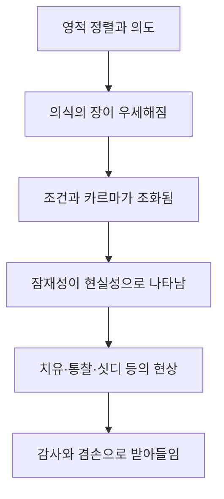
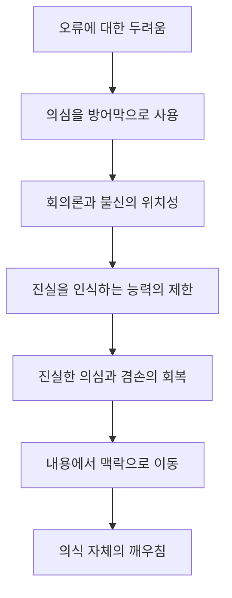
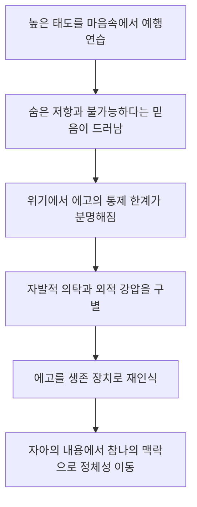
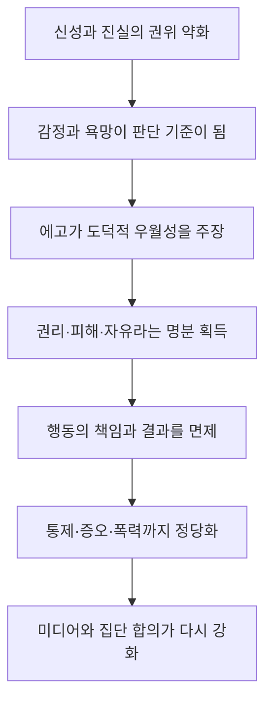
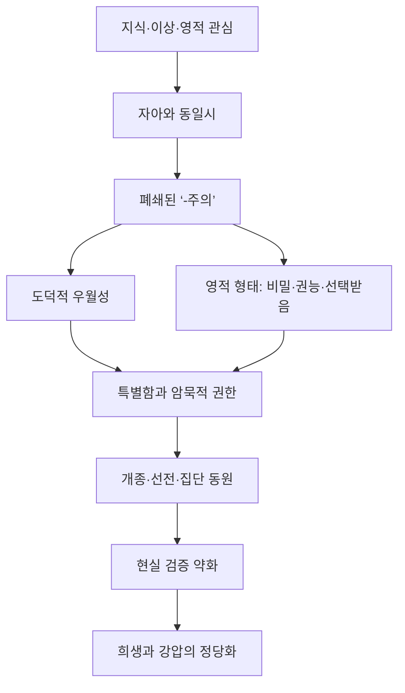

# 현대인의의식수준 — 1장부터 마지막 장까지 공개 아카이브 해설 대화 전체

---

<!-- source: 01장_01_『현대인의 의식수준』 제1장 「해결책」_6a636e99.md | conversation_id: 6a636e99-24d8-83e8-a0d0-72fa0eded36f | date: 2026-07-24T22:54:41.867937+09:00 -->

---
layout: default
title: "『현대인의 의식수준』 제1장 「해결책」"
conversation_id: "6a636e99-24d8-83e8-a0d0-72fa0eded36f"
source_file: "conversations-026.json"
date: "2026-07-24T22:54:41.867937+09:00"
updated: "2026-07-25T00:39:56.055072+09:00"
---

# 『현대인의 의식수준』 제1장 「해결책」

## 질문 · 2026-07-24 22:54

해결책
위에서 설명한, 인류 계급 사이의 차이를 받아들인다는 것은 어떤 의미인가. 그 사실을 거부하지 않는 것도 감안하고, 또한 사회정치적 단순한 언행 이데올로기는 물론, 상대를 바꾸려는 이상적인 희망사항까지 버리게 됨을 고려한다는 뜻이다. 그러나 지금까지 이 양자 대안 중에서 어느 것도 해결책을 도출하지 못했다. 겨우 인간 역사상 일시적 소강상태를 가져올 뿐이었다. 기실 그 소강상태 동안 양측은 더 크게 맞붙을 다음번 대결에서 우세를 선점하기 위해 스스로 긴축활동을 펴곤 한다. ‘다정하게 대하기’는 200 이상 측정된 사람들에게는 정상적인 듯 보이지만, 200 이하 사람들은 그것을 모욕과 경멸할 만한 나약함으로 여기기 때문에, 효과적인 소통이 되지 못한다. 이와 똑같은 내부 충돌은 세속의 하위문화에서는 물론, 종교 내부에서도 발생한다.
이해는 지혜와 수용, 연민을 통해서만 이루어질 수 있다. 그 이해를 통해 관대함이 발생하고 본질적으로 매우 다른 세계관과 가치를 현실적으로 용인할 수 있게 된다. 비난과 모욕은 갈등에 뿌리를 둔 이 지배적인 세계관, 사고방식, 현실에 대한 몰이해로부터 나온다.
전쟁, 협박, 재교육, 합법화, 이상적인 개종, 세뇌, 선전, 혹은 ‘재프로그래밍’을 통한 ‘용인’ 등의 방식으로 자기 시각에 맞추어 상대의 시각을 바꾸려는 기대치, 이것이 바로 효과적 소통의 장애물이다. 그런 사고가 안고 있는 결점은, 그것이 더 낮은 의식 수준의 결과로 발생한 이해의 중대한 한계를 제대로 인식하지 못한다는 점이다. 비록 어렵긴 하지만, 불가능하지만 않다면, 교육적으로나 지적으로 한계가 있는 사람들에게 고급 양자역학 이론 물리학을 가르치려는 경우가 이런 사례에 해당한다. ‘문화적 변화’로 이상적인 목표를 향해 사회를 증진시킨다는 과제는 이러한 어려움에 직면한다. 바로 무엇이 ‘실재’인가, 또는 가장 중요하거나 가치 있는 것이 무엇인가에 대해 각 의식 수준이 서로 다른 견해를 갖고 있다는 점이다. 따라서 이 문화에서는 평화와 합의를 바람직한 목표로 보는 반면, 저 문화에서는 나약함의 표시로 받아들인다.
이제 의식 연구를 통해서, 정치와 종교, 정부의 구조뿐 아니라 특정 소집단, 문화, 개인, 국가가 나타내는 의식 수준을 빠르게 확인할 수 있다. 이 때문에 비로소 외교학이 효과적인 대화에 필요한 유의미한 기초를 제공할 수 있게 되었다.(『진실 대 거짓』 14장 ‘외교학’ 부분을 참고하라.) 이 사실은 에고 자체의 본성을 감안한 것이다. 본래 에고의 주된 특성은 오로지 이득을 얻기 위한 욕망이다. 각 의식 수준은 자기만의 가치를 갖고 있다. 그 가치 안에는 무엇이 바람직한지, 얻을 만한 가치가 있는지, 따라서 협상할 만한 사안인지를 고려하는 것까지 포함된다. ‘평화’는 대중적으로 쓰이는 정치 구호다. 하지만 사회경제학적/정치적 현실에서 설득력을 갖는 것은, 가령 “돈은 평화를 조작한다.”(의식수준 365, Bush 2007)에서 보듯 오일 머니를 말할 때뿐이다.
에고는 모든 의도, 목표, 행동의 주된 동기로서 자신이 얻는 이득에 매달린다. 이런 양상은 영적으로 진화하면서 마지못해 포기되곤 했으나, 그것도 더 높은 선을 지각하고 그것을 위한 경우에만 이루어진다. 하물며 강렬한 의도를 갖고서 헌신한다 해도, 인류의 진보는 느리고 어렵기만 하다. 이렇듯 인간의 영적 진화 속도는 요동치고 변화가 심하기 때문에, 서로 공감하고 이해하기 위해서는 무엇보다 인내심이 꼭 필요하다.(가령, 최근 몇 년 사이에 인류의 의식 수준은 207에서 204로 하락했다.)
가령, 카인과 아벨에서 알 수 있듯 인간 조건에는 선천적으로 갈등과 차이가 있다는 것을 받아들이면, 역설적으로 죄의식에서 벗어나 내면의 안도감이 발생한다. 인간의 삶은 영적 진화에 필요한 최대한의 기회를 제공한다. 그러나 인간의 지각은 개인적 갈등은 물론 사회적/정치적/관념적 갈등을 평화와 행복을 방해하는 장애물로 바라본다. 이와 반대로 영적 참나는 똑같은 세상 속에서도 그 상태를 완벽함으로 바라본다.
삶이 놀랍건, 실망스럽건, 흥미진진하건, 도전적이건 어느 쪽이더라도, 그것은 인간의 영적 진화에 중요한 영향을 끼치는 일련의 선택들이다. 그중에서 ‘가장 적극적인 행동 방식을 선택하는 것’은 영적 참나가 에고/자아에게로 보내는 일종의 초대장이다. 하지만 내부에서 발생하건 외부에서 발생하건 인간적 갈등도 인간이 어떤 식으로 진화할 것인가의 문제에 똑같이 영향을 끼치는 요인이다. 가령, 참나의 시각에서 보듯 모든 게 완벽하여 지각된 ‘적들’이 존재하지 않는다면, 대체 누가 누구를 용서하고 이해하는 일이 생기겠는가?
에고와 에고의 약속에 대한 믿음은 결국 실망과 환멸을 안겨 준다. 하지만 그다음, 그것은 역설적으로 동기를 심화시킴으로써 영적 진화를 보조한다. 잘 살펴보면, 지상에서 인간의 삶은 의식의 발전과 영적 실재를 발견하는 데 필요한 최적의 환경이라는 사실을 알 수 있을 것이다. 의식과 영적 실재를 통해, 모든 생명은 존재 자체의 타고난 완벽함(의식 수준 1000)을 드러내기 위해 변화한다. 인내하고 끈질기게 견디면, 모든 창조의 본질(Essence of All Creation)인 신성함은 빛을 내고 에고의 오해와 투사된 가치를 대체한다.
앞서 언급한 말 중에 일부는 원래부터 애매모호한 듯 보이겠지만, 다음에 이어질 장을 통해 완전한 의미를 선명하게 설명하고 확실하게 전달할 것이다. 그것이 다음 장의 목적이다. 이해는 맥락의 결과다. 의식 자체는 궁극적 맥락을 제공하며, 그 궁극적 맥락을 통해 겉으로 희미해 보이는 것들이 점차 자명해진다.
거짓과 에고의 본능은 위력과 ‘인과관계’의 가설에 의존하지만, 이와 대조적으로 진실은 극히 자연스러운 힘을 반영한다. 진실은 거짓을 극복하지 않고, 그저 거짓의 자리에 맥락화로 얻은 깨달음을 대신 가져다 놓는다. 그 맥락화를 통해 ‘의미’는 패러다임을 확장함으로써 더 큰 차원을 얻는다. 그러므로 사실상 갈등은 없다. 더 작은 것이 더 큰 것으로 대체되고 용해되기 때문이다. 이는 빛이 어둠에 맞서지 않고 그 자리를 대신하는 것과 같은 이치다. 에고/자아는 더 큰 참나에 흡수된다. 그 결과, 둘은 외견상 더 이상 대적하지 않으며, 갈등의 원천인 표면상의 차이도 존재하지 않게 된다.

## GPT 답변 · 2026-07-24 23:03

# 『현대인의 의식수준』 제1장 「해결책」 분석

이 분석은 제시된 발췌를 중심으로 삼고, 업로드된 호킨스 박사님의 저서와 강연 가운데 직접 맞물리는 설명만 연결한 것입니다. 의식 수준 수치는 호킨스 박사님의 연구 체계 안에서 해석하며, 207에서 204로의 변화는 이 책이 기록된 당시의 측정값입니다.

## 1. 이 발췌가 말하는 핵심

- **핵심 명제:** 인류 갈등의 해법은 서로 다른 의식 수준의 사람들을 같은 가치관으로 바꾸는 데 있지 않고, 그 차이와 이해의 한계를 정확히 인정하여 상대가 실제로 가치 있게 여기는 바에 맞추어 소통하며, 궁극적으로 더 큰 의식의 맥락 안에서 ‘적과 나’의 분리 자체를 녹이는 데 있습니다.

- **쉽게 말하면:** 사람들은 같은 말을 들어도 같은 뜻으로 받아들이지 않습니다. 어떤 사람에게 평화와 친절은 선한 가치이지만, 다른 사람에게는 패배와 나약함으로 보일 수 있습니다. 따라서 해결책은 무조건 다정하게 대하거나 억지로 상대를 변화시키는 것이 아니라, 상대가 세상을 어떻게 보고 무엇을 중요하게 여기는지를 먼저 정확히 이해하는 것입니다.

가장 간단히 표현하면 다음과 같습니다.

> **수용은 행동을 포기하는 것이 아니라 오판을 포기하는 것입니다.**

---

## 2. 전체 전개 지도

1. **의식 수준의 차이를 부정하거나 상대를 바꾸려 했던 기존 방식의 실패**
2. **다정함조차 서로 다른 의미로 해석되는 소통의 비대칭성**
3. **지혜·수용·연민을 통한 현실적 이해**
4. **강제적 개조 대신 상대의 실제 가치에 맞춘 외교와 협상**
5. **에고의 이득 추구와 느린 인간 진화를 고려한 인내**
6. **갈등이 인간 조건에 내재한다는 수용과 죄의식의 해소**
7. **갈등과 환멸을 영적 선택과 진화의 기회로 재해석**
8. **더 큰 맥락에서 거짓·갈등·에고가 참나 안으로 용해됨**

---

## 3. 먼저 분명히 해야 할 핵심 구분

| 발췌의 표현 | 호킨스 박사님의 뜻 | 뜻하지 않는 것 |
|---|---|---|
| 인류 계급의 차이 | 의식 수준에 따른 지각·가치·이해 능력의 발달적 차이 | 경제적 계층이나 인간 존엄성의 차이 |
| 차이의 수용 | 현재의 상태를 사실대로 보고 그에 맞게 대응함 | 잘못된 행동의 승인이나 방치 |
| 관대함과 용인 | 서로 다른 세계관의 존재를 현실적으로 인정함 | 모든 견해가 똑같이 진실하다는 상대주의 |
| 세상의 완벽함 | 인간에게 최대한의 선택과 영적 진화의 기회를 제공하는 완벽함 | 모든 인간 행동이 도덕적으로 옳다는 뜻 |
| 위력(force) | 강압·압박·전쟁·통제처럼 반작용을 부르는 낮은 힘 | 지속적인 참된 힘 |
| 힘(power) | 진실·온전성·사랑처럼 그 자체로 영향력을 발하는 힘 | 상대를 강제로 굴복시키는 능력 |

특히 ‘인류 계급’은 인간의 본질적 가치를 나누는 말이 아닙니다. 호킨스 박사님의 체계에서는 모든 생명의 본질은 신성하지만, 그 신성이 인간의 지각과 행동으로 표현되는 정도에는 큰 차이가 있습니다.

---

# 4. 소주제별 상세 분석

## 1/8. 해결의 출발점은 ‘인간은 모두 같은 방식으로 생각한다’는 가정을 버리는 것입니다

**핵심 명제:** 갈등을 해결하려면 먼저 인류가 동일한 가치관과 이해 능력을 공유하지 않는다는 사실을 인정해야 합니다.

**용어 해석:** 여기서 ‘차이를 받아들인다’는 것은 그 차이가 없다고 부정하지도 않고, 교육이나 정치적 구호만으로 곧바로 제거할 수 있다고 기대하지도 않는다는 뜻입니다.

**세부 의미:** 발췌가 지적하는 실패한 두 방식은 다음과 같습니다.

1. 차이를 부정하고 “사람은 본래 모두 똑같은 가치를 원한다”고 가정하는 방식
2. 상대가 자신의 가치관을 받아들이도록 압박하고 개조하려는 방식

첫째 방식은 실제 차이를 보지 못하고, 둘째 방식은 그 차이를 강제로 없애려 합니다. 두 방식 모두 상대가 현재 무엇을 실재라고 여기고 무엇에서 이득을 느끼는지를 보지 못한다는 공통점이 있습니다.

앞선 「의식 수준: 인간 갈등의 원천」에서 호킨스 박사님께서는 이 차이가 단순한 의견 차이가 아니라, 끌개장·뇌 기능·신경전달물질·진화 단계와 관련된다고 설명하셨습니다. 따라서 논리적 설명을 더 많이 제공한다고 해서 곧바로 동일한 이해에 도달하는 것은 아닙니다.

**다른 저서와의 연결:** 『의식수준을 넘어서』의 「패러다임의 문제」에서는 사람마다 자신의 우세한 의식 수준에 맞게 세상을 경험하고 해석하며, 그 지각을 곧 ‘실재’라고 믿는다고 설명합니다. 다른 관점을 틀렸다고 보는 것은 이러한 ‘패러다임 충성’의 결과입니다.

**의식 수준과의 관계:** 200은 호킨스 박사님의 체계에서 위력에서 힘으로, 거짓에서 온전성으로 방향이 전환되는 임계점입니다. 다만 개인은 삶의 모든 영역에서 단 하나의 수준만을 표현하는 것이 아니라, 영역에 따라 여러 수준의 성향을 섞어 나타낼 수 있습니다. 발췌의 ‘200 이상과 이하’는 그 사람이나 집단을 지배하는 전반적 방향을 가리킵니다.

**구조적 역할:** 앞부분이 갈등의 원인을 진단했다면, 이 대목은 “그 차이를 없애려 하기 전에 먼저 정확히 보라”는 첫 번째 해결 원리를 제시합니다.

---

## 2/8. 다정함은 보편적 언어가 아니며, 이해에는 지혜·수용·연민이 필요합니다

**핵심 명제:** 선한 의도로 한 행동도 상대의 의식 수준에 따라 정반대의 의미로 해석될 수 있습니다.

**용어 해석:** ‘다정하게 대하기’는 친절 자체가 잘못이라는 뜻이 아닙니다. 친절이 모든 상대에게 자동으로 선의와 화해의 뜻으로 전달된다고 가정하는 것이 잘못이라는 뜻입니다.

200 이상에서는 친절·자제·타협이 자연스러운 힘으로 보일 수 있습니다. 그러나 200 이하에서는 다음과 같이 번역될 수 있습니다.

- 친절 → 두려움
- 양보 → 패배
- 자제 → 대응 능력의 부재
- 평화 제안 → 더 압박해도 된다는 신호

따라서 선의만으로는 충분하지 않습니다. 상대가 그 선의를 어떤 의미로 읽을지를 함께 알아야 합니다.

**지혜·수용·연민의 기능은 각각 다릅니다.**

- **지혜**는 서로 다른 의식 수준이 같은 현실을 공유하지 않는다는 것을 압니다.
- **수용**은 현실이 자신의 이상과 다르다고 해서 부정하지 않습니다.
- **연민**은 그 한계를 개인적 악의만으로 보지 않고, 물려받은 에고의 무지와 발달 단계라는 더 큰 맥락에서 봅니다.

연민은 순진함이나 무방비 상태가 아닙니다. 오히려 비난에 사로잡히지 않으면서도 상대의 실제 동기와 위험성을 정확하게 식별하는 더 넓은 이해입니다.

**다른 저서와의 연결:** 『파워 대 포스』에서는 무지가 공격에 의해 무너지지 않고 진실의 빛 속에서 흩어진다고 설명합니다. 『치유와 회복』에서도 무조건적 사랑의 장은 판단하지 않는 용서, 이해, 연민을 포함한다고 밝힙니다.

**의식 수준과의 관계:** 이 문단은 대체로 수용 350, 이해를 특징으로 하는 이성 400대, 사랑과 연민의 500대 이상을 하나의 상승 흐름으로 보여 줍니다. 수용은 현실을 인정하고, 이성은 구조를 이해하며, 사랑은 인간의 한계를 정죄하지 않고 포괄합니다.

**구조적 역할:** 첫 문단이 “차이를 인정하라”고 했다면, 이 문단은 그 차이를 대하는 내적 태도를 규정합니다.

---

## 3/8. 상대를 바꾸려는 기대가 오히려 소통을 막습니다

**핵심 명제:** 강제·선전·재교육·개종 등으로 타인의 세계관을 바꾸려는 시도는 상대의 이해 범위와 가치 구조를 무시하기 때문에 실패합니다.

**세부 의미:** 전쟁, 협박, 법률, 선전 등은 외적 행동을 일시적으로 억제하거나 변경할 수 있습니다. 그러나 그것이 곧 내면의 가치관 변화인 것은 아닙니다. 외부에서는 동의하는 것처럼 보여도, 내부에서는 다음 충돌을 준비할 수 있습니다. 그래서 발췌는 역사적 소강상태를 진정한 해결이 아니라 ‘다음 대결을 위한 재정비 기간’으로 봅니다.

양자역학의 비유가 말하는 것도 이것입니다. 이해에 필요한 능력이 아직 활성화되지 않은 상태에서는 정보량을 늘리는 것만으로 해결되지 않습니다. 여기서 말하는 이해의 한계는 단순한 지능지수의 문제가 아닙니다. 지적으로 영리하더라도 의식 수준이 낮으면 진실, 책임, 연민, 생명의 가치에 관한 이해는 제한될 수 있습니다.

**『Letting Go』와의 연결:** 호킨스 박사님께서는 타인에게 압력을 가할수록 상대가 자동으로 저항하며, 두려움 때문에 겉으로 요구를 따르더라도 내적 동의가 형성되지 않는다고 설명하십니다. 타인이 달라져야 한다는 기대 자체가 관계를 압박하는 힘으로 작용합니다.

**『의식수준을 넘어서』와의 연결:** 영적 의미를 이해하는 능력은 200에 이르러야 출현하며, 이는 정보처리 회로와 뇌 생리의 전환에 해당한다고 설명합니다. 그러므로 모든 사람이 같은 추상적 원리와 도덕적 언어에 즉시 반응하리라고 기대하는 것은 현실적이지 않습니다.

**의식 수준과의 관계:** 낮은 수준에서는 생존·이득·통제처럼 구체적인 가치가 우선하며, 높은 수준에서야 원칙·공동선·연민처럼 더 넓은 가치를 의미 있게 받아들일 수 있습니다.

**구조적 역할:** 이 문단은 왜 이상주의적 문화 개조가 실패하는지 밝히고, 다음에 나올 ‘실제 가치에 맞춘 외교’의 필요성을 준비합니다.

---

## 4/8. 효과적인 외교는 상대가 실제로 가치 있게 여기는 것을 기준으로 삼습니다

**핵심 명제:** 협상은 상대에게 무엇이 좋은지를 가르치는 일이 아니라, 상대가 현재 무엇을 이득으로 지각하는지를 정확히 파악하는 일에서 시작합니다.

호킨스 박사님께서 『진실 대 거짓』 14장에서 제시하신 외교학의 핵심도 이것입니다. 국가를 하나의 단일 인격처럼 보지 말고 다음을 구분해야 합니다.

- 주민의 의식 수준
- 정부 운영의 의식 수준
- 통치자의 의식 수준
- 외교 대표자의 의식 수준

한 국가 안에서도 이들 사이에 큰 격차가 있을 수 있기 때문입니다.

『진실 대 거짓』의 설명을 압축하면 다음과 같습니다.

| 우세한 범위 | 중요하게 여기는 것 | 소통의 현실적 기반 |
|---|---|---|
| 100대 | 생존, 물, 식량, 무기, 운송, 안전 | 구체적인 생존 조건과 안보 |
| 300대 | 기능, 번영, 교육, 상업, 기술, 보건 | 상호 이익과 발전 가능성 |
| 400대 | 이성, 법, 윤리, 책임 | 논리·증거·법적 원칙 |

따라서 평화 자체를 고귀한 가치로 보지 않는 집단에게 “평화는 좋은 것”이라고 반복하는 것은 효과가 없습니다. 평화가 생존·안보·경제적 이득·권력 유지에 도움이 된다는 형태로 번역되어야 비로소 협상 가능한 가치가 됩니다.

**“돈은 평화를 조작한다”의 의미:** 이 문장이 365로 측정된다는 것은, 평화가 아직 무조건적 사랑의 결과라기보다 300대의 현실적·기능적 이득으로 성립할 수 있다는 뜻입니다. 경제적 이득은 에고를 없애지는 않지만, 에고의 이득 추구를 전쟁보다 평화 쪽으로 돌릴 수 있습니다.

즉, 이것은 영적 개종이 아니라 동기의 재배치입니다.

**의식 수준과의 관계:** 에고의 기본 구조는 획득과 이득을 향합니다. 높은 선을 아직 직접 인식하지 못하더라도, 평화가 더 큰 현실적 이득을 준다는 사실을 인식하면 행동 방향은 달라질 수 있습니다.

**구조적 역할:** 여기서 발췌는 추상적인 수용과 연민을 구체적인 외교 원리로 전환합니다. 상대를 자신처럼 만들려 하지 않고, 상대의 현재 가치 체계 안에서 협상 가능한 접점을 찾는 것입니다.

---

## 5/8. 에고의 이득 추구와 느린 진화를 이해해야 인내가 생깁니다

**핵심 명제:** 인간은 더 높은 선을 지각하기 전까지는 익숙한 이득을 쉽게 포기하지 않으므로, 개인과 인류의 진화에는 긴 시간이 필요합니다.

에고는 다음을 이득으로 여깁니다.

- 물질적 획득
- 통제와 지배
- 자신이 옳다는 만족
- 적에게 대가를 치르게 했다는 쾌감
- 피해자라는 도덕적 우월감
- 집단적 명예와 승리

『호모 스피리투스』에서는 원한·복수·앙갚음이 주는 만족감이 중독성을 지니며, 이것이 국가와 지역의 끝없는 갈등을 유지한다고 설명합니다. 에고가 평화를 거부하는 이유는 평화를 싫어해서만이 아니라, 갈등이 제공하는 이득을 잃고 싶지 않기 때문입니다.

영적 진화가 일어나면 이러한 이득은 더 높은 선과 비교되어 점차 가치가 떨어집니다. 그러나 에고가 그것을 포기하는 것은 ‘이득이 전혀 없어졌기 때문’이 아니라, 사랑·평화·온전성이 더 큰 이득임을 인식했기 때문입니다.

**인류의 207→204 하락:** 이것은 호킨스 박사님께서 이 책을 기록하시던 당시의 집단 의식 측정 사례입니다. 전체 진화가 언제나 직선적으로 상승하는 것이 아니라, 집단적 선택과 정렬에 따라 오르내릴 수 있음을 보여 줍니다.

**인내의 의미:** 인내는 아무것도 하지 않는 태도가 아닙니다. 현실의 진화 속도를 인정하면서 조급한 강제를 피하는 것입니다. 강제는 다시 저항과 반작용을 낳지만, 인내는 상대의 현재 가능성 안에서 가장 높은 선택이 나타날 공간을 허용합니다.

**다른 저서와의 연결:** 『의식수준을 넘어서』에서는 긍정적 선택 하나가 다음 긍정적 선택의 가능성을 높이고, 사람을 더 높은 끌개장 가까이 이동시킨다고 설명합니다. 진화는 한 번의 설득이 아니라 선택의 누적입니다.

**구조적 역할:** 사회적 외교의 문제를 인간 에고와 의식 진화의 시간표라는 더 큰 맥락으로 확대합니다.

---

## 6/8. 갈등의 내재성을 인정하면 죄의식은 줄고 책임 있는 선택은 가능해집니다

**핵심 명제:** 인간 조건에 갈등이 내재한다는 사실을 인정하면, 세상이 이상과 다르다는 이유로 자신과 인류를 정죄하는 태도에서 벗어날 수 있습니다.

카인과 아벨은 인간의 이원성, 경쟁, 질투, 형제 간 갈등이 문명 이전부터 인간 조건에 포함되어 있음을 보여 주는 상징입니다. 이를 받아들이면 “인류가 선하다면 갈등이 없어야 한다”는 비현실적인 기대가 풀립니다.

여기서 중요한 것은 죄의식과 책임의 구분입니다.

- 갈등이 인간 조건에 내재한다는 수용은 책임을 없애지 않습니다.
- 다만 인간의 무지와 진화적 한계를 곧바로 악의적 유죄성으로 단정하지 않게 합니다.
- 비난 대신 더 높은 선택을 할 책임이 남습니다.

의식 지도로 보면 죄의식은 30 수준의 자기 처벌적 장입니다. 반면 용기 200은 사실을 인정하고 책임을 받아들이며, 수용 350은 현실과 인간의 한계를 용서의 관점에서 바라봅니다.

### 에고와 참나가 바라보는 같은 세상

| 에고/자아의 지각 | 영적 참나의 앎 |
|---|---|
| 갈등은 행복을 파괴하는 장애물이다 | 갈등은 선택과 진화가 가능한 조건이다 |
| 적은 제거하거나 변화시켜야 한다 | 적으로 지각된 존재는 용서와 이해가 드러날 기회다 |
| 세상은 잘못되어 있다 | 세상은 최대한의 영적 선택을 제공한다 |
| 불완전한 현상만 본다 | 전개되는 과정 전체의 완벽함을 본다 |

2006년 강연 「Transcending the Levels of Consciousness: A Review of the Work」에서 호킨스 박사님께서는 세상이 완벽한 이유를 “최대한의 카르마적 선택 가능성을 제공하기 때문”이라고 설명하십니다.

따라서 ‘세상은 완벽하다’는 말은 전쟁과 잔인성을 선하다고 부르는 것이 아닙니다. 전쟁과 평화, 증오와 용서 가운데 선택할 수 있는 장으로서 인간 세계가 영적 진화에 정확히 적합하다는 뜻입니다.

**구조적 역할:** 갈등을 제거해야 할 외부 문제에서 영적 선택을 가능하게 하는 조건으로 재맥락화합니다.

---

## 7/8. 갈등과 에고의 실패는 참나가 보내는 초대가 됩니다

**핵심 명제:** 인간이 마주치는 갈등과 에고의 환멸은 더 높은 선택을 향하도록 동기를 깊게 만드는 계기가 될 수 있습니다.

**‘가장 적극적인 행동 방식’의 의미:** 문맥상 이것은 가장 공격적이거나 활동량이 많은 행동을 뜻하지 않습니다. 이용 가능한 선택 가운데 생명을 가장 지지하고, 진실과 온전성에 가장 가까운 방향을 고르는 것을 뜻합니다.

그러한 선택은 다음과 같은 이동을 나타냅니다.

- 분노에서 용기로
- 보복에서 책임으로
- 비난에서 이해로
- 적대에서 용서로
- 자기 이득에서 더 높은 선으로

**‘참나가 에고에게 보내는 초대장’의 의미:** 참나는 외부에서 에고에게 명령하는 별도의 인격이 아닙니다. 에고보다 더 큰 의식의 장이며, 인간 안에 이미 잠재한 더 높은 방향입니다. 긍정적인 선택을 할 때 에고는 잠시 자기 이득의 폐쇄된 회로에서 벗어나 이 더 큰 장과 정렬합니다.

### “적이 없다면 누가 누구를 용서하겠는가?”의 전개

1. 에고는 다른 사람을 적으로 지각합니다.
2. 용서는 적의 행동을 무지와 한계라는 큰 맥락에서 다시 봅니다.
3. 참나의 시각에서는 처음부터 분리된 ‘적’이 존재하지 않았음이 드러납니다.

따라서 호킨스 박사님께서 갈등을 필요하다고 말씀하시는 것은 갈등을 만들어야 한다는 뜻이 아닙니다. 인간 세계에서 이미 일어나는 갈등이 내면의 위치성을 드러내고, 용서와 이해를 선택할 기회를 제공한다는 뜻입니다.

**에고의 환멸:** 에고는 획득·승리·통제·옳음을 통해 행복해질 것이라고 약속합니다. 그러나 그 약속은 반복적으로 실망을 가져옵니다. 이 환멸은 처음에는 고통이지만, 결국 외부 이득만으로는 충족될 수 없다는 사실을 드러내어 영적 동기를 깊게 합니다.

**다른 저서와의 연결:** 『호모 스피리투스』에서는 누군가를 여전히 ‘나쁜 사람’으로 지각하는 동안에는 억지로 사랑하거나 용서할 수 없다고 설명합니다. 먼저 그 사람이 수많은 프로그램과 신념체계에 지배되어 현재 모습으로 나타난다는 더 큰 이해가 필요합니다.

**존재의 완벽함 1000:** 여기서 1000은 모든 개인의 현재 의식 수준이 1000이라는 뜻이 아닙니다. 생명과 존재 자체의 신성한 본질이 1000이라는 뜻입니다. 진화는 없던 완벽함을 새로 만드는 것이 아니라, 이미 내재한 완벽함을 점차 드러냅니다.

『치유와 회복』의 반쯤 핀 장미 비유처럼, 에고는 덜 핀 장미를 불완전하다고 판단하지만 높은 시각은 그것을 완벽하게 전개되는 생명의 과정으로 봅니다.

**구조적 역할:** 외적 갈등과 내적 환멸을 모두 영적 진화를 돕는 재료로 통합합니다.

---

## 8/8. 궁극적 해결은 더 큰 맥락이 작은 갈등을 녹이는 것입니다

**핵심 명제:** 진실은 거짓과 싸워 이기는 것이 아니라, 거짓이 성립했던 좁은 맥락을 더 큰 이해로 대체합니다.

**‘이해는 맥락의 결과’의 의미:** 개별 사건이나 주장만 보는 것이 ‘내용’이라면, 그것이 어떤 의식 수준·동기·진화 단계·세계관 안에서 발생했는지를 함께 보는 것이 ‘맥락’입니다.

발췌의 맥락은 단계적으로 확대됩니다.

1. 정치적 내용: 누가 옳고 누가 틀렸는가
2. 심리적 맥락: 각자가 무엇에서 이득을 얻는가
3. 의식의 맥락: 어떤 수준이 지각과 이해를 제한하는가
4. 진화적 맥락: 갈등이 어떤 선택 가능성을 제공하는가
5. 궁극적 맥락: 모든 것이 의식 안에서 일어나며 본질적으로 하나임

맥락이 커질수록 이전의 사실이 부정되는 것이 아니라, 그 의미가 달라집니다. ‘적의 악행’만 보던 시각이 에고의 무지, 집단적 프로그래밍, 진화 단계, 자신의 투사까지 함께 보게 됩니다.

### 위력과 힘의 차이

- **위력(force)**은 거짓을 외부의 적으로 보고 압박·강제·전쟁으로 제거하려 합니다. 그러면 반대편에서도 반작용이 생깁니다.
- **힘(power)**은 진실 그 자체의 현존입니다. 상대를 강제로 누를 필요 없이, 더 큰 이해가 나타나면 작은 오류가 설 자리를 잃습니다.

에고가 믿는 선형적 인과관계는 “저 사람이 이 문제의 원인이므로 저 사람을 제거하면 해결된다”고 말합니다. 그러나 호킨스 박사님의 비선형적 관점에서는 사건이 수많은 조건과 전체 의식 장의 결과로 출현합니다. 단 하나의 적이나 원인을 붙잡는 것은 전체를 잘라 낸 에고의 설명입니다.

『파워 대 포스』에서는 사회가 근본 조건 대신 표면적 결과를 고치려 하기 때문에 전쟁·법·규제 같은 위력에 반복적으로 의존한다고 설명합니다. 반대로 맥락이 확대되면 겉으로 충돌하던 것들은 더 큰 전체 안에서 자리를 얻습니다.

### 빛과 어둠의 비유

어둠은 빛과 대등하게 싸우는 독립된 실체가 아닙니다. 빛이 없을 때 어둠이라고 부를 뿐입니다. 마찬가지로 거짓은 독립적인 실재라기보다 진실의 부재입니다.

따라서 진실은 거짓과 전쟁하지 않습니다.

- 빛이 나타나면 어둠이 사라지고
- 이해가 나타나면 무지가 물러나며
- 참나가 드러나면 에고의 분리된 주권이 사라집니다.

**에고가 참나에 흡수된다는 의미:** 에고의 기능 전체가 파괴된다는 뜻이 아닙니다. 세상에서 생활하는 기능은 남을 수 있지만, 에고가 자신을 생명과 행동의 절대적 주인으로 여기는 오인이 사라집니다. 에고는 전체를 지배하는 주인이 아니라 참나 안에서 제한된 기능을 맡는 도구로 재맥락화됩니다.

**구조적 역할:** 이 문단은 제1장의 결론이면서 다음 장 「인간의 딜레마」를 여는 문입니다. 앞에서 사회·정치적 갈등으로 시작한 문제를 마지막에는 에고와 참나, 거짓과 진실, 내용과 맥락의 관계로 끌어올립니다.

---

# 5. 해결책의 세 층위

| 층위 | 갈등을 일으키는 오류 | 해결 원리 | 결과 |
|---|---|---|---|
| 사회·외교 | 모든 집단이 같은 가치와 동기를 갖는다는 가정 | 상대가 실제로 가치 있게 여기는 것에 맞춘 소통 | 현실적인 협상 가능성 |
| 심리·윤리 | 비난, 이상주의, 상대 개조 욕구 | 지혜·수용·연민·인내 | 관대함과 내적 안도 |
| 영적 | 적과 나, 선과 악을 독립된 대립물로 보는 에고 | 의식이라는 더 큰 맥락과 참나의 드러남 | 표면적 갈등의 용해 |

이 세 층위는 서로 대립하지 않습니다. 외적으로는 상대의 수준을 정확히 식별하여 적절히 대응하고, 내적으로는 비난과 증오에 빠지지 않으며, 궁극적으로는 모든 분리가 의식 안에서 나타난 지각임을 알아가는 하나의 연속된 과정입니다.

# 6. 전체 통합 정리

이 발췌에서 말하는 ‘해결책’은 인류를 하나의 이상적인 모습으로 통일하는 계획이 아닙니다. 오히려 사람들이 서로 다른 의식 수준에서 서로 다른 현실과 가치를 경험한다는 사실을 인정하는 데서 시작합니다.

그 인정은 냉소나 방치가 아닙니다. 상대가 평화·친절·정직을 어떤 의미로 해석하는지 정확히 식별함으로써, 무익한 도덕적 호소와 순진한 기대를 넘어서는 지혜입니다. 외교에서는 실제 이득과 가치에 맞춘 협상으로 나타나고, 내면에서는 수용·연민·인내로 나타납니다.

더 깊은 차원에서 인간의 갈등은 영적 진화를 방해하는 단순한 오류가 아니라, 용서·이해·온전성을 선택할 수 있게 하는 조건입니다. 에고의 약속이 실패하고 환멸을 줄 때조차, 그것은 외부 이득을 넘어선 진실을 찾도록 동기를 깊게 할 수 있습니다.

마지막에 이 모든 논의는 ‘맥락’으로 수렴합니다. 좁은 맥락에서는 나와 적, 진실과 거짓, 선과 악이 서로 싸우는 것처럼 보입니다. 그러나 의식이라는 궁극적 맥락에서는 더 작은 지각이 더 큰 이해에 포함됩니다. 진실은 거짓을 공격하지 않고, 참나는 에고와 싸우지 않습니다. 빛이 어둠을 대신하듯, 더 큰 것이 드러나면 작은 것은 그 안에서 자연스럽게 용해됩니다.

> **따라서 이 발췌의 해결책은 상대를 강제로 바꾸는 위력이 아니라, 차이를 정확히 보고 실제 가치를 이해하며, 더 큰 맥락에서 갈등의 전제 자체를 녹이는 진실의 힘입니다.**

**진행: 「해결책」 1/1 완료**

---

<!-- source: 01장_02_『현대인의 의식수준』 제1장 「개관」_「해결책」_6a685538.md | conversation_id: 6a685538-5b18-83e8-ab41-c329b132290f | date: 2026-07-28T16:07:43.335035+09:00 -->

---
layout: default
title: "『현대인의 의식수준』 제1장 「개관」|「해결책」"
conversation_id: "6a685538-5b18-83e8-ab41-c329b132290f"
source_file: "conversations-027.json"
date: "2026-07-28T16:07:43.335035+09:00"
updated: "2026-07-28T16:46:37.781937+09:00"
---

# 『현대인의 의식수준』 제1장 「개관」|「해결책」

## 질문 · 2026-07-28 16:07

해결책

위에서 설명한, 인류 계급 사이의 차이를 받아들인다는 것은 어떤 의미인가. 그 사실을 거부하지 않는 것도 감안하고, 또한 사회정치적 단순한 언행 이데올로기는 물론, 상대를 바꾸려는 이상적인 희망사항까지 버리게 됨을 고려한다는 뜻이다. 그러나 지금까지 이 양자 대안 중에서 어느 것도 해결책을 도출하지 못했다. 겨우 인간 역사상 일시적 소강상태를 가져올 뿐이었다. 기실 그 소강상태 동안 양측은 더 크게 맞붙을 다음번 대결에서 우세를 선점하기 위해 스스로 긴축활동을 펴곤 한다. ‘다정하게 대하기’는 200 이상 측정된 사람들에게는 정상적인 듯 보이지만, 200 이하 사람들은 그것을 모욕과 경멸할 만한 나약함으로 여기기 때문에, 효과적인 소통이 되지 못한다. 이와 똑같은 내부 충돌은 세속의 하위문화에서는 물론, 종교 내부에서도 발생한다.

이해는 지혜와 수용, 연민을 통해서만 이루어질 수 있다. 그 이해를 통해 관대함이 발생하고 본질적으로 매우 다른 세계관과 가치를 현실적으로 용인할 수 있게 된다. 비난과 모욕은 갈등에 뿌리를 둔 이 지배적인 세계관, 사고방식, 현실에 대한 몰이해로부터 나온다.

전쟁, 협박, 재교육, 합법화, 이상적인 개종, 세뇌, 선전, 혹은 ‘재프로그래밍’을 통한 ‘용인’ 등의 방식으로 자기 시각에 맞추어 상대의 시각을 바꾸려는 기대치, 이것이 바로 효과적 소통의 장애물이다. 그런 사고가 안고 있는 결점은, 그것이 더 낮은 의식 수준의 결과로 발생한 이해의 중대한 한계를 제대로 인식하지 못한다는 점이다. 비록 어렵긴 하지만, 불가능하지만 않다면, 교육적으로나 지적으로 한계가 있는 사람들에게 고급 양자역학 이론 물리학을 가르치려는 경우가 이런 사례에 해당한다. ‘문화적 변화’로 이상적인 목표를 향해 사회를 증진시킨다는 과제는 이러한 어려움에 직면한다. 바로 무엇이 ‘실재’인가, 또는 가장 중요하거나 가치 있는 것이 무엇인가에 대해 각 의식 수준이 서로 다른 견해를 갖고 있다는 점이다. 따라서 이 문화에서는 평화와 합의를 바람직한 목표로 보는 반면, 저 문화에서는 나약함의 표시로 받아들인다.

이제 의식 연구를 통해서, 정치와 종교, 정부의 구조뿐 아니라 특정 소집단, 문화, 개인, 국가가 나타내는 의식 수준을 빠르게 확인할 수 있다. 이 때문에 비로소 외교학이 효과적인 대화에 필요한 유의미한 기초를 제공할 수 있게 되었다.(『진실 대 거짓』 14장 ‘외교학’ 부분을 참고하라.) 이 사실은 에고 자체의 본성을 감안한 것이다. 본래 에고의 주된 특성은 오로지 이득을 얻기 위한 욕망이다. 각 의식 수준은 자기만의 가치를 갖고 있다. 그 가치 안에는 무엇이 바람직한지, 얻을 만한 가치가 있는지, 따라서 협상할 만한 사안인지를 고려하는 것까지 포함된다. ‘평화’는 대중적으로 쓰이는 정치 구호다. 하지만 사회경제학적/정치적 현실에서 설득력을 갖는 것은, 가령 “돈은 평화를 조작한다.”(의식수준 365, Bush 2007)에서 보듯 오일 머니를 말할 때뿐이다.

에고는 모든 의도, 목표, 행동의 주된 동기로서 자신이 얻는 이득에 매달린다. 이런 양상은 영적으로 진화하면서 마지못해 포기되곤 했으나, 그것도 더 높은 선을 지각하고 그것을 위한 경우에만 이루어진다. 하물며 강렬한 의도를 갖고서 헌신한다 해도, 인류의 진보는 느리고 어렵기만 하다. 이렇듯 인간의 영적 진화 속도는 요동치고 변화가 심하기 때문에, 서로 공감하고 이해하기 위해서는 무엇보다 인내심이 꼭 필요하다.(가령, 최근 몇 년 사이에 인류의 의식 수준은 207에서 204로 하락했다.)

가령, 카인과 아벨에서 알 수 있듯 인간 조건에는 선천적으로 갈등과 차이가 있다는 것을 받아들이면, 역설적으로 죄의식에서 벗어나 내면의 안도감이 발생한다. 인간의 삶은 영적 진화에 필요한 최대한의 기회를 제공한다. 그러나 인간의 지각은 개인적 갈등은 물론 사회적/정치적/관념적 갈등을 평화와 행복을 방해하는 장애물로 바라본다. 이와 반대로 영적 참나는 똑같은 세상 속에서도 그 상태를 완벽함으로 바라본다.

삶이 놀랍건, 실망스럽건, 흥미진진하건, 도전적이건 어느 쪽이더라도, 그것은 인간의 영적 진화에 중요한 영향을 끼치는 일련의 선택들이다. 그중에서 ‘가장 적극적인 행동 방식을 선택하는 것’은 영적 참나가 에고/자아에게로 보내는 일종의 초대장이다. 하지만 내부에서 발생하건 외부에서 발생하건 인간적 갈등도 인간이 어떤 식으로 진화할 것인가의 문제에 똑같이 영향을 끼치는 요인이다. 가령, 참나의 시각에서 보듯 모든 게 완벽하여 지각된 ‘적들’이 존재하지 않는다면, 대체 누가 누구를 용서하고 이해하는 일이 생기겠는가?

에고와 에고의 약속에 대한 믿음은 결국 실망과 환멸을 안겨 준다. 하지만 그다음, 그것은 역설적으로 동기를 심화시킴으로써 영적 진화를 보조한다. 잘 살펴보면, 지상에서 인간의 삶은 의식의 발전과 영적 실재를 발견하는 데 필요한 최적의 환경이라는 사실을 알 수 있을 것이다. 의식과 영적 실재를 통해, 모든 생명은 존재 자체의 타고난 완벽함(의식 수준 1000)을 드러내기 위해 변화한다. 인내하고 끈질기게 견디면, 모든 창조의 본질(Essence of All Creation)인 신성함은 빛을 내고 에고의 오해와 투사된 가치를 대체한다.

앞서 언급한 말 중에 일부는 원래부터 애매모호한 듯 보이겠지만, 다음에 이어질 장을 통해 완전한 의미를 선명하게 설명하고 확실하게 전달할 것이다. 그것이 다음 장의 목적이다. 이해는 맥락의 결과다. 의식 자체는 궁극적 맥락을 제공하며, 그 궁극적 맥락을 통해 겉으로 희미해 보이는 것들이 점차 자명해진다.

거짓과 에고의 본능은 위력과 ‘인과관계’의 가설에 의존하지만, 이와 대조적으로 진실은 극히 자연스러운 힘을 반영한다. 진실은 거짓을 극복하지 않고, 그저 거짓의 자리에 맥락화로 얻은 깨달음을 대신 가져다 놓는다. 그 맥락화를 통해 ‘의미’는 패러다임을 확장함으로써 더 큰 차원을 얻는다. 그러므로 사실상 갈등은 없다. 더 작은 것이 더 큰 것으로 대체되고 용해되기 때문이다. 이는 빛이 어둠에 맞서지 않고 그 자리를 대신하는 것과 같은 이치다. 에고/자아는 더 큰 참나에 흡수된다. 그 결과, 둘은 외견상 더 이상 대적하지 않으며, 갈등의 원천인 표면상의 차이도 존재하지 않게 된다.

## GPT 답변 · 2026-07-28 16:08

# 『현대인의 의식수준』 제1장  
## 「해결책」 상세 해설 — 1/1

## 1. 핵심 명제

호킨스 박사님께서 이 대목에서 제시하시는 해결은 **서로 다른 의식수준의 사람들이 동일한 현실을 보고 있다고 가정하지 않는 것**입니다.

갈등하는 양측은 단지 의견이나 정보가 다른 것이 아닙니다. 무엇이 실제이고, 무엇이 가치 있으며, 무엇이 강함이고 약함인지에 대한 **현실 해석의 기본 구조**가 다릅니다. 따라서 한쪽이 당연하다고 여기는 평화·정직·배려·합의가 다른 쪽에는 나약함·패배·이용 가능한 취약성으로 받아들여질 수 있습니다.

그러므로 해결은 다음 두 방향을 함께 포함합니다.

- 사회적 차원에서는 상대가 실제로 이해할 수 있는 가치와 동기에 맞추어 소통해야 합니다.
- 영적 차원에서는 갈등을 제거되어야 할 우주의 결함이 아니라, 의식이 성장하는 조건으로 재맥락화해야 합니다.

이것은 상대의 행동을 모두 인정하거나 방치하라는 뜻이 아닙니다. **상대가 어떤 현실 속에서 움직이고 있는지를 먼저 정확히 이해한 다음, 그에 맞는 대응을 선택하라는 뜻**입니다.

---

## 2. 전체 전개 지도

발췌문의 논리는 다음과 같이 진행됩니다.

1. 인류 내부에는 근본적으로 다른 현실 인식 구조가 존재한다.  
2. 단순한 선의나 이념적 설득은 이 차이를 해소하지 못한다.  
3. 서로 다른 의식수준에서는 동일한 말과 행동의 의미도 달라진다.  
4. 상대를 강제로 바꾸려는 시도는 오히려 소통을 방해한다.  
5. 효과적인 외교와 협상은 상대가 실제로 추구하는 이득을 알아야 가능하다.  
6. 인간의 변화는 느리므로 수용·연민·인내가 필요하다.  
7. 갈등은 영적 진화를 방해하기만 하는 것이 아니라 선택의 기회를 제공한다.  
8. 더 큰 맥락이 드러나면 갈등은 승패로 끝나는 것이 아니라 의미가 확장되면서 용해된다.

---

# 3. 인류의 차이를 “받아들인다”는 의미

호킨스 박사님께서 말씀하시는 수용은 “모든 사람이 본래 같은 방식으로 생각하며, 충분히 대화하면 결국 같은 결론에 도달한다”는 가정을 내려놓는 것입니다.

사람들은 동일한 사건을 보아도 지배적인 의식수준에 따라 전혀 다른 세계를 경험합니다.

예를 들어 평화를 두고도 다음과 같은 차이가 생깁니다.

- 한쪽에서는 평화를 생명 존중과 상호 번영의 조건으로 봅니다.
- 다른 쪽에서는 평화를 힘이 부족한 쪽이 내세우는 정치적 수사로 봅니다.
- 또 다른 쪽에서는 평화 협상을 시간을 벌고 힘을 축적하는 수단으로 이용할 수 있습니다.

따라서 “모두 평화를 원한다”는 말은 단어만 같을 뿐, 실제 의미는 같지 않을 수 있습니다.

여기서 의식수준은 사람의 영구적 신분이나 인간적 가치의 등급을 뜻하지 않습니다. **현실을 인식하고 해석하는 현재의 지배적 방식**을 가리킵니다. 한 사람 안에서도 상황과 영역에 따라 서로 다른 수준의 태도가 나타날 수 있습니다.

### 받아들임이 뜻하지 않는 것

이 대목의 수용은 다음을 의미하지 않습니다.

- 해로운 행동을 정당하다고 인정하는 것
- 위험을 무시하고 무방비 상태가 되는 것
- 모든 가치판단을 포기하는 것
- 거짓과 진실을 똑같다고 보는 것
- 부당한 요구에 순응하는 것

오히려 정반대입니다. 수용은 현실을 미화하지 않고 **있는 그대로 분별하는 출발점**입니다. 현실을 정확히 보아야 적절한 거리, 보호, 협상, 제한, 설득 방식을 선택할 수 있습니다.

---

# 4. 왜 “다정하게 대하기”만으로는 해결되지 않는가

호킨스 박사님께서는 다정함 자체를 부정하시는 것이 아닙니다. 다정함을 **모든 사람에게 동일하게 작동하는 보편적 소통 기술로 간주하는 순진성**을 지적하십니다.

200 이상에서는 대체로 다음과 같은 해석이 나타납니다.

- 친절은 선의의 표현이다.
- 양보는 관계를 보존하기 위한 성숙함이다.
- 대화는 공동 해결책을 찾는 과정이다.
- 정직은 신뢰를 형성한다.
- 약자를 보호하는 것은 힘의 올바른 사용이다.

그러나 200 이하의 지각에서는 동일한 행동이 다르게 번역될 수 있습니다.

- 친절은 두려움 때문에 보이는 약한 태도다.
- 양보는 더 요구해도 된다는 신호다.
- 대화는 상대를 속이거나 시간을 버는 기회다.
- 정직은 세상 물정을 모르는 어리석음이다.
- 약자를 배려하는 사람은 이용하기 쉬운 대상이다.

따라서 문제는 말투가 충분히 부드럽지 않아서가 아닙니다. **그 말과 행동이 들어가는 의미 체계가 서로 다르기 때문**입니다.

이것이 『진실 대 거짓』 14장의 외교학과 직접 연결됩니다. 그곳에서 호킨스 박사님께서는 외교가 실패하는 중요한 이유를, 모든 국가와 지도자가 유사한 가치·동기·도덕적 기준을 갖고 있다고 추정하는 데서 찾으십니다.

상대가 협력 관계를 추구하는지, 우위를 추구하는지, 체면을 추구하는지, 경제적 이익을 추구하는지, 시간을 벌려는지를 구분하지 못하면 선의는 효과적인 대화가 아니라 오판이 됩니다.

---

# 5. 상대를 바꾸려는 기대가 왜 장애물이 되는가

전쟁, 협박, 재교육, 선전, 세뇌, 강제 개종 등은 표현은 서로 달라도 공통된 전제를 갖습니다.

> “상대는 본래 나와 같은 현실을 보고 있으며, 잘못된 정보나 사상 때문에 다르게 행동할 뿐이다.”

이 전제에 따르면 충분한 압박이나 교육을 제공하면 상대가 자신의 세계관을 버리고 우리가 옳다고 보는 관점으로 이동할 것이라고 기대하게 됩니다.

그러나 호킨스 박사님의 설명에서는 의식수준이 단순한 지식량의 차이가 아닙니다. 그것은 다음을 함께 규정합니다.

- 무엇을 실제라고 느끼는가
- 어떤 설명을 이해할 수 있는가
- 무엇을 가치 있게 여기는가
- 어떤 동기를 설득력 있게 받아들이는가
- 타인을 협력자로 보는가 경쟁자로 보는가
- 힘과 약함을 어떻게 구분하는가

따라서 더 많은 정보만 주면 자동으로 더 높은 이해가 생기는 것은 아닙니다.

호킨스 박사님께서 고급 양자역학을 비유로 드신 이유도 여기에 있습니다. 기초 개념을 아직 다룰 수 없는 사람에게 고급 이론의 결론만 전달한다고 해서 그 이론이 이해되지는 않습니다. 마찬가지로 평화·자유·관용·보편적 인권과 같은 가치도 그것을 받아들일 수 있는 맥락이 아직 형성되지 않았다면 공허한 언어로 남거나 다른 목적으로 이용될 수 있습니다.

### 중요한 구분

이것은 변화가 영원히 불가능하다는 뜻이 아닙니다. 변화는 가능하지만, **말만 바꾸거나 외부 제도만 이식한다고 내면의 지각 구조가 즉시 달라지는 것은 아니라는 뜻**입니다.

---

# 6. 외교학의 핵심: 상대가 실제로 중요하게 여기는 것은 무엇인가

발췌문은 여기서 사회철학에서 외교학으로 이동합니다.

에고의 기본 성향은 이득을 추구하는 것입니다. 그러나 무엇을 이득으로 보는지는 의식수준에 따라 달라집니다.

어떤 사람이나 집단은 다음을 이득으로 봅니다.

- 안전과 생존
- 물질적 자원
- 권력과 지배
- 명예와 체면
- 소속 집단의 우월성
- 경제적 성장
- 법적 안정성
- 지식과 합리적 해결
- 공동선
- 사랑과 봉사
- 영적 진실

따라서 협상이 성립하려면 상대가 실제로 가치 있다고 여기는 것이 무엇인지를 먼저 알아야 합니다.

상대에게 평화가 본래적 가치가 아니라면 “평화를 위해 평화에 동의하라”는 말은 설득력이 없습니다. 그 경우에는 평화가 제공하는 안전, 경제적 이익, 권력 유지, 자원 확보, 체면 보존과 같은 동기를 통해서만 협상 가능성이 생길 수 있습니다.

“돈은 평화를 조작한다”는 인용은 이 점을 압축합니다. 여기서 ‘조작한다’는 표현은 평화의 신성함을 돈으로 대체한다는 뜻이라기보다, **평화 자체에 가치를 두지 않는 행위자에게도 경제적 이해관계는 행동을 변화시키는 동기가 될 수 있다**는 의미입니다.

### 의식수준별 소통의 대략적인 방향

| 지배적 인식 방식 | 중요하게 여기는 것 | 효과를 가질 가능성이 있는 접근 |
|---|---|---|
| 생존·두려움 중심 | 안전, 식량, 보호 | 즉각적 안전과 생존 보장 |
| 욕망·이득 중심 | 자원, 보상, 소유 | 구체적 이익과 손실 |
| 분노·자부심 중심 | 체면, 힘, 승리 | 경계의 명확성, 체면을 보존하는 출구 |
| 용기·중립성 중심 | 공정한 기회, 책임 | 상호성, 약속, 현실적 해결 |
| 자발성·수용 중심 | 성장, 협력, 공동 성과 | 장기적 발전과 합의 |
| 이성 중심 | 논리, 증거, 체계 | 데이터와 원칙에 근거한 설명 |
| 사랑 중심 | 생명, 화해, 전체의 선 | 연민, 용서, 포괄적 맥락 |

이 표는 사람을 고정적으로 분류하기 위한 것이 아니라, 특정 상황에서 나타나는 현실 인식 방식에 맞게 소통을 조정하기 위한 것입니다.

---

# 7. 수용·지혜·연민의 관계

호킨스 박사님께서는 진정한 이해가 지혜와 수용과 연민을 통해서만 가능하다고 말씀하십니다.

여기서 세 요소는 각각 다른 역할을 합니다.

### 지혜

지혜는 모든 사람이 동일한 능력과 동기와 세계관을 갖고 있지 않음을 알아봅니다. 선의만으로 현실이 움직이지 않는다는 것도 인정합니다.

지혜는 상대를 과소평가하지도 않고 과대평가하지도 않습니다. “내가 옳게 설명하면 상대도 당연히 이해할 것”이라는 나르시시즘적 기대에서도 벗어납니다.

### 수용

수용은 이미 존재하는 차이를 부정하지 않는 것입니다. 상대의 현재 위치를 인정하지 않으면 실제로 가능한 대응도 찾을 수 없습니다.

이는 의사의 진단과 비슷합니다. 상태를 있는 그대로 확인하는 것은 그 상태를 좋아하거나 찬성한다는 뜻이 아닙니다. 정확한 진단은 오히려 적절한 대응의 전제입니다.

### 연민

연민은 낮은 수준의 지각이 단순히 의도적인 악의만으로 생겨난다고 단정하지 않습니다. 그것이 진화적 조건, 두려움, 집단적 장, 성장 과정, 정서적 상처, 제한된 이해 능력과 연결되어 있음을 봅니다.

그러므로 연민은 해로운 행동을 허용하는 감상주의가 아닙니다. **행동에는 필요한 경계를 세우되, 존재 자체를 증오하지 않는 능력**입니다.

---

# 8. 인류의 진보가 느린 이유와 인내의 의미

에고는 자신에게 돌아오는 이득을 쉽게 포기하지 않습니다. 더 높은 가치를 선택하는 경우에도, 그 선택이 자신에게 더 큰 이익을 제공한다고 지각할 때에야 움직이기 쉽습니다.

예를 들어 다음과 같은 변화가 있을 수 있습니다.

- 당장의 복수보다 장기적 안전이 더 유익하다고 본다.
- 개인적 이익보다 협력이 더 큰 성과를 가져온다고 본다.
- 권력보다 책임이 더 지속적인 존경을 가져온다고 본다.
- 소유보다 사랑과 봉사가 더 깊은 충족을 준다고 발견한다.
- 에고의 승리보다 진실과 신성에 대한 정렬이 더 높은 선임을 깨닫는다.

즉, 낮은 이득을 포기하는 것은 단순한 자기억압이 아니라 **더 높은 이득의 발견**을 통해 가능해집니다.

인류의 의식수준이 역사적으로 상승과 하락을 반복한다는 언급은 진화를 직선적 발전으로 보지 말라는 뜻입니다. 한 시대의 기술과 지식이 발전했다고 해서 그 시대의 정서적·도덕적·영적 성숙도 자동으로 함께 상승하는 것은 아닙니다.

따라서 인내는 무기력하게 기다리는 태도가 아닙니다. 인간 변화의 속도와 한계를 이해하면서도 더 높은 선택을 지속하는 안정성입니다.

---

# 9. 카인과 아벨: 갈등은 인간 조건에 내재한다

카인과 아벨의 이야기는 인간 역사에서 갈등이 예외적 사고가 아니라 매우 오래된 인간 조건임을 상징합니다.

에고는 삶이 완벽하다면 갈등이 없어야 한다고 생각합니다. 그래서 갈등이 발생하면 다음과 같이 판단합니다.

- 무엇인가 잘못되었다.
- 누군가 반드시 제거되어야 한다.
- 내가 실패했다.
- 세상은 본래 결함이 있다.
- 평화를 잃었으므로 영적 길에서도 멀어졌다.

그러나 호킨스 박사님의 관점에서는 갈등이 있다는 사실 자체가 창조의 결함을 뜻하지 않습니다. 갈등은 인간에게 선택의 장을 제공합니다.

갈등이 없다면 다음과 같은 선택도 드러나지 않습니다.

- 분노와 용서 중 무엇을 선택할 것인가
- 복수와 이해 중 무엇을 선택할 것인가
- 두려움과 용기 중 무엇을 선택할 것인가
- 이기적 이득과 공동선 중 무엇을 선택할 것인가
- 에고의 정당성과 진실에 대한 헌신 중 무엇을 선택할 것인가

따라서 인간적 지각은 갈등을 행복을 방해하는 장애물로 보지만, 참나의 관점에서는 갈등조차 의식의 방향이 드러나는 조건이 됩니다.

---

# 10. “세상이 완벽하다”는 말의 정확한 뜻

이 문장은 오해하기 쉽습니다.

호킨스 박사님께서 세상의 모든 사건이 인간적·도덕적 관점에서 바람직하다고 말씀하시는 것은 아닙니다. 폭력과 거짓과 잔인성이 선하다는 뜻도 아닙니다.

여기서 완벽함은 **전체 과정이 의식의 진화에 필요한 선택과 결과를 빠짐없이 제공한다**는 의미입니다.

인간적 관점에서는 어떤 사건이 실패·손실·불행으로 보일 수 있습니다. 그러나 더 큰 맥락에서는 그것을 통해 다음이 드러납니다.

- 에고의 기대가 얼마나 불확실한가
- 자신이 무엇에 집착하고 있었는가
- 어떤 가치에 충성하고 있는가
- 어디에서 두려움과 자부심이 작동하는가
- 무엇이 참된 평화의 근원인가

그러므로 완벽함은 사건의 외형에 붙이는 도덕적 칭찬이 아니라, **존재 전체가 의식의 각성과 진화를 향해 기능한다는 의미**입니다.

---

# 11. “가장 적극적인 행동 방식”의 의미

이 문장에서 ‘적극적’은 가장 공격적이거나 가장 강제적인 대응을 뜻하지 않습니다. 현재의 조건에서 가능한 **가장 높은 의식수준의 선택**을 의미합니다.

상황에 따라 그것은 다음처럼 서로 다르게 나타날 수 있습니다.

- 분노 대신 명확하고 단호하게 경계를 세우는 것
- 감상적 동조 대신 사실을 직시하는 것
- 복수 대신 법과 책임의 절차를 선택하는 것
- 비난 대신 원인을 이해하는 것
- 무방비한 친절 대신 지혜로운 거리 두기를 선택하는 것
- 에고의 체면보다 진실을 우선하는 것
- 상대를 굴복시키기보다 갈등이 유지되는 구조를 변화시키는 것

따라서 참나의 초대는 반드시 부드러운 행동만을 뜻하지 않습니다. 때로는 거절, 제한, 보호, 단호함이 더 높은 선택일 수 있습니다. 결정적인 기준은 외형이 아니라 **그 행동의 의도와 그것이 생명을 지지하는가**에 있습니다.

---

# 12. 에고의 약속이 실망으로 끝나는 이유

에고는 끊임없이 다음과 같은 약속을 제시합니다.

- 상대를 이기면 평화로워질 것이다.
- 충분한 권력을 얻으면 안전해질 것이다.
- 모두가 나를 인정하면 만족할 것이다.
- 세상을 내 생각대로 바꾸면 행복해질 것이다.
- 적을 제거하면 갈등도 사라질 것이다.

그러나 목표가 달성되어도 에고는 새로운 적, 새로운 위협, 새로운 결핍을 만들어 냅니다. 에고는 분리된 자아감을 유지하기 위해 끊임없이 비교와 대립을 필요로 하기 때문입니다.

이 때문에 에고의 약속은 환멸로 끝납니다. 그러나 그 환멸은 단순한 실패가 아닙니다. 에고가 제공하는 만족이 본질적으로 불완전하다는 사실을 깨닫게 하여 더 깊은 진실을 찾도록 동기를 강화합니다.

따라서 인간의 좌절은 두 방향으로 갈 수 있습니다.

- 원망과 비난을 강화하여 에고의 구조를 더 굳게 만들 수 있습니다.
- 에고의 약속 자체를 의심하고 더 깊은 근원을 향하게 할 수 있습니다.

호킨스 박사님께서는 후자의 가능성을 영적 진화의 보조 조건으로 설명하십니다.

---

# 13. 진실은 거짓과 싸우지 않는다

발췌문의 마지막 부분은 사회적 해결에서 비이원적 이해로 이동합니다.

위력은 대상을 밀어내고 억압하고 변화시키려 합니다. 위력은 언제나 대립 구조를 전제로 합니다.

- 나 대 상대
- 진실 대 거짓
- 선 대 악
- 승자 대 패자
- 지배자 대 피지배자

반면 진실의 힘은 상대를 공격하여 제거하지 않습니다. 더 큰 맥락을 드러냄으로써 이전의 제한된 이해를 대체합니다.

빛과 어둠의 비유가 이를 정확히 보여 줍니다. 빛은 어둠과 싸우지 않습니다. 빛이 나타나면 어둠은 독립된 실체가 아니라 빛의 부재였음이 드러납니다.

마찬가지로 거짓은 진실과 동등한 힘을 가진 반대 실체가 아닙니다. 제한된 정보, 왜곡된 지각, 축소된 맥락 때문에 나타난 진실의 부재입니다.

### 맥락화의 예

제한된 맥락에서는 다음처럼 보일 수 있습니다.

> “상대는 나를 모욕했으므로 악한 사람이다.”

맥락이 확장되면 다음과 같이 이해할 수 있습니다.

> “상대는 모욕을 통해 우위를 확보하려는 인식 구조에서 반응하고 있다.”

더 확장되면 다음과 같이 볼 수 있습니다.

> “이 사건은 나에게 분노, 자부심, 두려움과 동일시하지 않고 더 높은 선택을 할 기회를 제공한다.”

사건의 사실이 사라진 것은 아닙니다. 그러나 의미의 차원이 확대되면서 사건이 자신의 내면을 지배하던 힘이 약해집니다.

---

# 14. 에고/자아가 참나에 흡수된다는 의미

에고를 억압하거나 파괴하는 것은 여전히 에고가 만들어 낸 대립입니다. “나는 에고를 없애야 한다”는 생각도 에고가 자신을 대상으로 삼아 벌이는 또 다른 투쟁이 될 수 있습니다.

에고가 참나에 흡수된다는 것은 다음과 같습니다.

- 개인적 의지가 더 큰 선에 정렬됩니다.
- 분리된 자아감이 의식 전체의 일부로 재인식됩니다.
- 자신의 생각과 감정이 절대적 진실이 아님을 알게 됩니다.
- 방어와 정당화의 필요가 줄어듭니다.
- 상대를 적으로 만드는 투사가 약해집니다.
- 갈등의 외형은 남아 있어도 내면의 대립은 사라집니다.

작은 맥락이 더 큰 맥락 안에 포함되는 것이지, 작은 것을 폭력적으로 없애는 것이 아닙니다.

이것은 『파워 대 포스』에서 사랑이 부정성을 공격하지 않고 재맥락화하여 녹여 낸다는 설명과 연결됩니다. 힘은 대상을 누르지 않습니다. 더 높은 장이 나타나 낮은 패턴의 지배력을 자연스럽게 대체합니다.

---

# 15. 의식수준에 따른 발췌문의 층위

## 200 이하: 위력과 이득의 세계

현실은 경쟁과 생존, 우위 확보의 장으로 보입니다. 타인은 동료이기보다 잠재적 경쟁자나 위협으로 인식됩니다. 친절과 양보는 약함으로 해석되기 쉽습니다.

## 200대: 책임과 상호성의 출현

타인의 권리와 생명의 가치가 의미를 갖기 시작합니다. 약속, 정직, 협력이 기능적인 힘을 얻습니다. 갈등은 파괴해야 할 적이 아니라 다룰 수 있는 과제가 됩니다.

## 300대: 합리적 이익과 협상

성취, 효율, 성장, 상호 이익이 중요해집니다. 이 수준에서는 평화가 경제적 번영과 안정, 발전을 제공한다는 설명이 설득력을 가질 수 있습니다.

## 400대: 외교학과 체계적 이해

상대의 동기, 문화, 정부 구조, 지도자, 주민을 구분하여 분석합니다. 단순한 도덕적 수사가 아니라 데이터와 맥락을 바탕으로 효과적인 소통 구조를 설계합니다.

## 500대: 수용과 연민

상대의 한계를 이해하면서도 생명을 지지하는 방향을 유지합니다. 사람과 행동을 구분하고, 필요한 경계를 세우면서도 증오에 빠지지 않습니다.

## 600 이상: 갈등의 비이원적 해소

갈등이 독립된 절대적 실재가 아니라 제한된 지각에서 발생한 것으로 드러납니다. 진실은 거짓을 공격하지 않고, 더 큰 맥락으로 그것을 대체합니다.

---

# 16. 다른 저서와의 연결

## 『진실 대 거짓』

이 발췌문의 사회적 적용을 가장 직접적으로 확장합니다. 특히 외교에서는 국민, 정부 구조, 지도자, 외교 대표의 의식수준이 서로 다를 수 있으므로 하나의 국가를 단일한 인격처럼 다루어서는 안 된다고 설명합니다.

핵심 연결은 다음과 같습니다.

> 효과적인 대화는 상대도 우리와 같은 가치와 동기를 갖고 있다는 가정이 아니라, 상대의 실제 동기와 현실 인식에 대한 진단에서 출발합니다.

## 『파워 대 포스』

위력과 힘의 차이를 통해 마지막 문단을 해명합니다.

- 위력은 대립하고 압박하며 반작용을 낳습니다.
- 힘은 생명을 지지하며 더 높은 장을 통해 낮은 패턴을 재맥락화합니다.
- 사랑은 부정성을 공격하지 않고 더 큰 의미 안에서 녹여 냅니다.

## 『의식수준을 넘어서』

200은 사람의 사회적 서열이 아니라 현실 해석 방식이 바뀌는 임계점입니다. 200 이하에서는 자기 이익과 생존이 우세하고, 200 이상에서는 책임, 정직, 타인의 권리에 대한 고려가 출현합니다.

또한 죄의식은 과거를 공격함으로써 해소되는 것이 아니라, 학습과 성장의 과정으로 재맥락화될 때 초월된다는 설명이 카인과 아벨 부분과 연결됩니다.

## 『신의 현존의 발견』

궁극적 해결은 에고가 세상을 통제하는 데 있지 않고, 개인적 의지가 신성의 더 큰 맥락에 정렬되는 데 있습니다. 이해가 깊어질수록 삶의 사건은 신성과 분리된 장애물이 아니라 신성을 발견할 수 있는 조건으로 인식됩니다.

---

# 17. 최종 통합 해설

이 절에서 말하는 해결책은 세상을 하나의 이념으로 통일하는 방법이 아닙니다. 또한 모든 갈등을 친절한 언어로 완화하자는 감상적 제안도 아닙니다.

첫 번째 해결은 **현실적인 분별**입니다.

사람과 집단은 서로 다른 의식수준에서 서로 다른 세계를 경험합니다. 따라서 상대가 중요하게 여기는 가치, 이해할 수 있는 설명, 반응하는 동기를 알아야 합니다. 평화·정직·관용이 모든 사람에게 동일한 의미를 지닌다고 가정해서는 안 됩니다.

두 번째 해결은 **연민이 포함된 수용**입니다.

상대의 제한을 이해하되 해로운 행동을 허용하지 않습니다. 사람을 증오하지 않으면서 행동에는 책임을 묻고, 감상적 양보 대신 지혜로운 경계를 세웁니다.

세 번째 해결은 **갈등의 재맥락화**입니다.

갈등은 인간 삶이 잘못되었다는 증거만이 아닙니다. 갈등은 자신이 분노, 두려움, 자부심, 복수에 따를 것인지, 아니면 용기, 이해, 용서, 진실을 선택할 것인지를 드러내는 장입니다.

마지막 해결은 **더 큰 맥락의 출현**입니다.

진실은 거짓과 전쟁을 벌이지 않습니다. 더 넓은 이해가 나타나면 이전의 제한된 지각은 스스로 자리를 잃습니다. 빛이 어둠을 공격하지 않듯, 참나는 에고와 싸우지 않고 에고를 더 큰 의식 안에 포함시킵니다.

따라서 이 절의 가장 깊은 뜻은 다음과 같이 정리할 수 있습니다.

> 갈등의 참된 해결은 상대를 자신의 세계관 속으로 강제로 끌어오는 데 있지 않습니다. 서로 다른 현실 인식 구조를 정확히 이해하고, 그 차이에 맞게 지혜롭게 대응하며, 궁극적으로는 갈등 전체를 의식의 진화를 위한 더 큰 맥락 안에서 바라보는 데 있습니다.

---

<!-- source: 02장_01_『현대인의 의식수준』 제2장 「이미지의 최면 효과」_6a6389ea.md | conversation_id: 6a6389ea-9f80-83e8-86ca-70553115cfa8 | date: 2026-07-25T00:51:10.898024+09:00 -->

---
layout: default
title: "『현대인의 의식수준』 제2장 「이미지의 최면 효과」"
conversation_id: "6a6389ea-9f80-83e8-86ca-70553115cfa8"
source_file: "conversations-026.json"
date: "2026-07-25T00:51:10.898024+09:00"
updated: "2026-07-25T01:07:15.780507+09:00"
---

# 『현대인의 의식수준』 제2장 「이미지의 최면 효과」

## 질문 · 2026-07-25 00:51

이미지의 최면 효과

현재 전 세계 독재자들과 불량 국가 지도자들은 대략 의식 수준 80에서 180 정도로 측정된다. 사회에 해를 끼치고, 문화적으로 손상을 입히고 퇴행하는 모든 양상은 200 수준 이하로 측정된다. 그와 같은 경향은 윤색된 이미지로부터 추동력을 얻으며, 이때 그 이미지는 연예계 유명 인사를 거쳐 대중화되어 더욱 빨리 퍼진다. 그러한 유명 인사들은 아첨을 떨며 독재자를 껴안으면서 멍청하게 사진을 찍곤 한다.

의식 측정이 없다면, 문화와 경제, 정치와 법을 비롯한 모든 영역에서 벌어지는 자유와 단순한 유혹에 빠지는 부도덕함을 서로 분간하기가 어렵다. 제아무리 지독하고 크다 할지라도, 감각적 쾌락에 빠지는 모든 탐닉 행위는 대중화나 사법상의 변덕에 의해 얼마든지 합리화될 수 있다.(Flynn 2004) 가령, 2007년 6월 콜로라도 대학 볼더 캠퍼스에서 “마약을 하고 콘돔 없이 섹스하라.”고 주장했던 콜로라도 학생 강연(의식 수준 180)이 그 좋은 사례다.

인간 정신은 외부의 도움을 받지 않고서는 진실과 거짓을 분간할 수 없다. 왜냐하면 매끈한 이미지와 발표로 눈부신 매력을 발산하는, 양의 탈을 쓴 잘 세공된 위선자들에게 쉽게 속아 넘어가기 때문이다.(흥미롭게도 ‘양의 탈을 쓴 늑대’는 불길한 의식 수준인 120으로 측정된다.) 지도자들은 기저에 깔린 실재(본질)에 대한 인식을 모호하게 하는 대중 이미지(지각)와 평판을 만들어 낸다. 게다가 많은 공적 인물들이 처음에는 진실한 척하다가 나중에는 대중의 인기와 과대망상증에 굴복하는 점이 현실적으로 상황을 더욱 복잡하게 만든다. 대중들이 제대로 인식하지 못하는 사이에 그런 인물들의 의식 수준이 하락하면서 이런 일이 일어나는 것이다.

‘권력은 부패한다.’라는 명제는 누구나 다 아는 흔한 이야기이며, 얼마든지 증명할 수 있다. 겉으로 대단해 보이는 전 세계 저명인사들 중에 매우 심각하게 타락하는 경우도 허다하다. 나폴레옹부터 히틀러를 거쳐 현재 독재자들, 그리고 과거 ‘노예 해방자’로 간주되는 지도자들뿐만 아니라 현재 ‘해방자’이며 그렇다고 소문난 지도자들까지 죄다 그 반대편으로 변해 갔다. 역사적으로 볼 때, 오늘의 해방자는 곧 내일의 독재자다. 그들 중의 다수는 초기에 최고 400 수준까지 측정되었지만, 나중에 200 이하까지 내려가곤 했다. 이와 똑같은 현상은 끊임없는 대중 스캔들로 타락하는 최근의 문화뿐 아니라 고대 문화에서도 발생했다.

전체 문화 내에서, 영적 지식과 진보에 대한 가짜 모방이 이루어졌다. 이 모방은 그 차이를 탐지해 내기 위해서 의식 측정 기술의 전문 지식이 필요할 정도까지 완벽하게 이루어졌다. 인터넷상에서도 소문난 영적 프로그램들을 보여 주면서 끊임없이 사람들을 모으려고 한다. 그런 프로그램들은 대개 즉각적인 깨달음을 가능하게 해 준다고 터무니 없는 약속을 떠벌린다. 이런 것들은 모두 상당한 돈을 주고 이루어진다. 특별한 ‘축복’이나 ‘힘’을 준다며 5천 달러, 혹은 그 이상에 판매되곤 한다. 확실히 그런 모집 권유나 유혹은 영적 에고의 나르시시즘에 영합하는 것이 분명하다. 그런데 그렇게 함으로써 문제를 해결하기는커녕 오히려 더 문제를 키우는 형국이 된다.

외부의 영향을 쉽게 받는 순진한 에고에게, 특정한 사람이나 어떤 생각의 길이 두드러지거나 각광을 받거나 뉴스가 된다는 단순한 사실은, 신뢰도라는 신화적이며 마법적이며 미화된 아우라를 부여하기 마련이다. 이 아우라는 어쩌면 중요하게 들리는 직위나 이름, 제목 때문에 더욱 강화될 것이다.

## GPT 답변 · 2026-07-25 00:56

# 『현대인의 의식수준』 제2장  
## 「이미지의 최면 효과」 분석

## 1. 이 발췌가 말하는 핵심

- **핵심 명제:** 낮은 의식의 인물·사상·행위는 세련된 연출, 유명세, 권위 있는 호칭, 유명인의 동조를 빌려 높은 가치의 외관을 만들며, 인간 정신은 자신이 그 외관에 투사한 매혹을 진실성으로 오인한다.

- **쉽게 말하면:** 사람은 어떤 인물이 실제로 무엇을 의도하고 어떤 결과를 내는지보다, 어떻게 보이고 누구에게 인정받는지에 더 빨리 반응합니다. 그렇게 만들어진 이미지는 대중을 현혹할 뿐 아니라, 그 이미지의 주인까지 자기 유명세를 믿게 하여 의식 수준의 하락을 촉진할 수 있습니다.

---

## 2. 전체 전개 지도

1. **200 이하의 인물과 경향은 그 자체의 힘이 아니라 윤색된 이미지로 영향력을 확대한다.**
2. **유명인·언론·사진은 낮은 대상에게 빌려온 신뢰성과 친근한 아우라를 제공한다.**
3. **‘자유’ 같은 고귀한 말도 쾌락과 무책임을 합리화하는 포장으로 이용될 수 있다.**
4. **인간 정신은 세련된 외관과 본질을 스스로 분간하지 못하여 ‘양의 탈’을 진짜 선함으로 오인한다.**
5. **권력자 자신도 인기와 찬사에 취해 자기 이미지를 믿기 시작하면서 과대망상과 의식 수준의 하락을 겪는다.**
6. **동일한 구조가 영성 분야에서 ‘즉각적인 깨달음’, 값비싼 축복, 특별한 힘의 판매로 재현된다.**
7. **마지막에는 유명세·뉴스 가치·직함 자체가 신뢰의 증거처럼 느껴지는 이미지 최면의 핵심 원리가 드러난다.**

---

# 3. 소주제별 상세 분석

## 3-1. 윤색된 이미지는 낮은 의식의 영향력을 증폭한다 — 1/6

### 핵심 명제

낮은 의식의 인물이나 경향이 대중적 영향력을 얻는 것은 그것이 본질적으로 강해서가 아니라, 높은 가치처럼 보이도록 만든 이미지와 반복적인 노출이 그 약점을 가려 주기 때문입니다.

### 용어 해석

- **이미지:** 단순한 사진만이 아니라 대중에게 제시되는 성격, 말투, 의상, 평판, 직함, 서사, 홍보 방식 전체입니다.
- **윤색:** 실제보다 고상하고 매력적이며 정당하게 보이도록 꾸미는 일입니다.
- **최면 효과:** 의학적 최면에만 한정되는 말이 아니라, 감정적 인상이 이성과 분별을 앞질러 판단을 자동화하는 상태를 뜻합니다.
- **글래머(glamour):** 대상 자체에 있는 가치가 아니라, 정신이 그 대상에 투사한 마법적 매력과 특별함입니다.

### 세부 의미

독재자와 유명인이 함께 웃거나 포옹한 사진은 “이 지도자는 믿을 만하다”라는 문장을 직접 말하지 않습니다. 그러나 사진 속 친근함과 유명인의 위신이 지도자에게 옮겨 붙으면서 사실상 그와 같은 메시지를 전달합니다.

이미지는 복잡한 현실을 한 장면으로 압축합니다. 그 장면에는 미소와 친밀감은 보이지만, 지도자의 실제 의도와 피해, 국민의 삶, 정책의 결과는 보이지 않습니다. 따라서 사진이 사실이라 하더라도, 사진이 만들어 내는 전체 의미는 본질을 흐릴 수 있습니다. 바로 앞 절의 ‘맥락 결핍’이 시각적 형태로 나타난 것입니다.

여기서 유명인은 일종의 **신뢰성 전달 매체**가 됩니다. 유명인이 가진 친숙함·성공·매력의 아우라가 대상에게 이전되고, 대중은 그 연상 작용을 검증된 정보처럼 받아들입니다.

### 다른 저서·강연과의 연결

- 『호모 스피리투스』에서는 대중매체가 이미지를 이용해 이성과 지성을 우회하고, 이미지 뒤에 실제 본질이 없어도 대중의 마음을 프로그램할 수 있다고 설명합니다.
- 『의식혁명』에서는 소비자·유권자·투자자·진실 탐구자가 모두 “표피적 스타일과 매끈한 외양”을 높은 끌개장의 모방자로 오인할 수 있다고 밝힙니다.
- 강연에서 호킨스 박사님께서는 글래머가 대상 자체에 있는 것이 아니라 정신이 대상에 투사하는 에너지라고 거듭 설명하십니다.

### 의식 수준

본문에서 독재자와 불량 국가 지도자는 대체로 **80~180**으로 측정됩니다. 중요한 것은 이미지가 이 수준을 높여 주는 것이 아니라, 실제 수준을 가려 영향력만 확대한다는 점입니다.

### 구조적 관계

앞 절이 “거짓 정보가 반복과 선정성을 통해 어떻게 퍼지는가”를 설명했다면, 이 대목은 “그 거짓이 어떻게 믿을 만한 모습까지 얻는가”를 설명합니다. 내용의 확산에 이미지의 매혹이 결합되는 단계입니다.

---

## 3-2. ‘자유’라는 고귀한 말이 방종의 이미지가 될 때 — 2/6

### 핵심 명제

자유는 책임과 온전성에서 분리될 때, 욕망을 정당화하는 매력적인 이름표로 변할 수 있습니다.

### 용어 해석

- **자유:** 호킨스 박사님의 체계에서는 선택과 함께 결과에 대한 책임을 받아들이는 상태와 연결됩니다.
- **무책임한 허용:** 욕망과 쾌락은 유지하면서 그 귀결과 책임은 외면하는 태도입니다.
- **합리화:** 먼저 원하는 결론을 정한 뒤, 그것을 정당하게 보이게 할 이유를 만들어 내는 에고의 작용입니다.

### 세부 의미

이 대목에서 이미지는 사람의 얼굴이나 사진에만 한정되지 않습니다. ‘자유’, ‘해방’, ‘진보’, ‘권리’ 같은 말도 정신 속에 고귀한 이미지를 만듭니다. 그 결과 어떤 행동에 ‘자유’라는 이름을 붙이면, 행동의 실제 의도와 결과를 살펴보기도 전에 도덕적 정당성이 부여될 수 있습니다.

본문의 대학 강연 사례가 **180**으로 제시되는 이유도 여기에 있습니다. 대중적이거나 대학에서 발표되었다는 사실, 혹은 법적으로 허용될 가능성이 있다는 사실이 그 내용의 의식 수준을 바꾸지는 않습니다. 제도적 승인과 대중적 인기 역시 외관에 속합니다.

호킨스 박사님께서 말씀하시는 핵심 구분은 다음과 같습니다.

- 자유는 선택의 폭을 넓히면서도 책임을 받아들입니다.
- 무책임한 허용은 욕망의 충족을 자유라고 부르면서 결과를 부정합니다.
- 따라서 자유의 본질은 “무엇이든 할 수 있음”이 아니라, 선택과 귀결을 함께 받아들이는 의식의 성숙도에 있습니다.

### 다른 저서와의 연결

『의식혁명』에서 **200**은 비난과 책임 전가를 멈추고 자신의 행동·감정·신념에 대한 책임을 받아들이기 시작하는 임계점으로 설명됩니다. 그러므로 자유와 무책임한 허용을 가르는 기준도 단순한 법률이나 유행이 아니라, 책임성과 온전성의 유무입니다.

### 의식 수준

- **180:** 그럴듯한 논리와 사회적 승인으로 욕망을 합리화할 수 있으나 아직 온전성의 경계 아래입니다.
- **200:** 책임, 정직, 현실 검증이 시작되는 결정적 분기점입니다.

### 구조적 관계

첫 문단이 ‘사람의 이미지’를 다뤘다면, 이 문단은 ‘개념의 이미지’를 다룹니다. 사람뿐 아니라 고귀한 단어 역시 낮은 의도를 가리는 외피가 될 수 있다는 확장입니다.

---

## 3-3. ‘양의 탈을 쓴 늑대’: 외관이 본질을 대체하는 구조 — 3/6

### 핵심 명제

가장 위험한 거짓은 노골적으로 추악한 모습이 아니라, 선함·평화·자비·해방의 외관을 정교하게 모방한 모습으로 나타납니다.

### 용어 해석

- **양의 탈:** 선량함과 무해함을 나타내는 외관입니다.
- **늑대:** 그 외관 아래 숨은 착취적·통제적 의도입니다.
- **지각:** 대중에게 보이도록 구성된 인물상입니다.
- **본질:** 실제 의도, 의식 수준, 정렬된 원리와 그로부터 발생하는 결과입니다.
- **모방자:** 높은 의식의 말과 모습을 복제하지만 그 바탕의 에너지와 의도는 갖지 못한 것입니다.

### 세부 의미

정교한 위선자는 거짓말만 잘하는 사람이 아닙니다. 높은 가치의 외형을 이해하고 그것을 정확히 재현하는 사람입니다. 평화, 사랑, 정의, 민중, 구원 같은 말을 사용하면서 실제로는 통제와 자기 이익을 추구할 수 있습니다.

이 경우 외관과 본질은 다음처럼 갈라집니다.

| 외관에 나타나는 것 | 본질에서 확인되는 것 |
|---|---|
| 따뜻한 표정과 세련된 발표 | 실제 의도와 동기 |
| 해방자·개혁자·영적 스승이라는 호칭 | 현재의 의식 수준 |
| 유명인·언론의 인정 | 실제 결과와 피해 |
| 고상한 도덕 언어 | 책임성·정직성·자기 교정 능력 |
| 많은 추종자와 대중적 성공 | 진실과의 정렬 여부 |

인간 정신은 외관이 일관되고 세련되면 그 배후에도 동일한 본질이 있을 것이라고 추정합니다. 그러나 호킨스 박사님께서는 바로 그 추정이 정신의 선천적 결함이라고 설명하십니다.

‘양의 탈을 쓴 늑대’가 **120**으로 측정된다는 것은, 이 표현이 주로 욕망과 포식성의 영역을 상징한다는 뜻입니다. 겉으로는 온순하지만 속으로는 획득과 이용을 추구하는 구조입니다.

### 다른 저서·강연과의 연결

- 『진실 대 거짓』의 중심 명제는 “외관은 본질과 일치하지 않으며, 마음은 순진하고 쉽게 속는다”는 것입니다.
- 『호모 스피리투스』에서는 대중매체가 평화·정직·돌봄·사랑을 실제 가치가 아니라 조종에 필요한 이미지로 사용할 수 있다고 설명합니다.
- 『의식혁명』에서는 높은 끌개장과 그것을 닮은 모방자를 분별하지 못할 때 사회 전체가 취약해진다고 밝힙니다.

### 의식 수준

- **120:** 선량한 외관 아래 포식적 의도가 숨어 있는 상징적 구조.
- **200 이하:** 진실보다 이득, 통제, 감정적 보상을 우선하는 영역.
- **200 이상:** 정직성과 책임을 통해 외관과 본질의 일치가 시작되는 영역.

### 구조적 관계

이 대목은 발췌 전체의 중심축입니다. 앞에서는 이미지가 어떻게 신뢰를 얻는지 설명했고, 여기서는 왜 인간 정신이 그 이미지를 본질로 오인하는지를 설명합니다.

---

## 3-4. 대중과 지도자가 함께 빠지는 ‘이중 최면’ — 4/6

### 핵심 명제

대중은 지도자의 이미지에 현혹되고, 지도자는 대중이 되돌려 주는 찬사와 유명세에 현혹됨으로써 서로의 환상을 강화합니다.

### 세부 의미

처음에는 지도자가 대중을 대상으로 이미지를 만들지만, 시간이 지나면 그 지도자 자신도 그 이미지를 믿기 시작합니다.

그 과정은 다음과 같습니다.

1. 초기의 능력과 선의가 대중적 성공을 가져옵니다.
2. 성공이 명성·직함·찬사·추종자를 끌어옵니다.
3. 지도자는 성취의 근원을 진실이나 더 큰 장이 아니라 개인적 ‘나’에게 돌립니다.
4. 자신이 특별하고 예외적인 존재라는 믿음이 강해집니다.
5. 비판과 제한은 부당한 방해로 느껴집니다.
6. 봉사는 지배로, 지도력은 자기 신격화로 변질됩니다.
7. 의식 수준은 내려가지만 과거에 만들어진 평판은 계속 남아 하락을 가립니다.

따라서 “오늘의 해방자는 내일의 독재자”라는 문장은 단순한 정치적 역설이 아닙니다. **과거의 이미지가 현재의 본질을 대신하는 시간차**를 설명합니다. 대중은 아직도 초기의 공적을 기억하지만, 인물의 내적 정렬은 이미 달라졌을 수 있습니다.

여기서 ‘권력은 부패한다’의 권력은 호킨스 박사님께서 말씀하시는 **Power**, 즉 진실과 온전성에서 나오는 힘과 구분해야 합니다.

- 참된 힘은 타인을 고양시키며 강압을 필요로 하지 않습니다.
- 부패를 일으키는 것은 지위·통제권·찬사를 자기 존재의 힘으로 착각하는 에고입니다.
- 즉 참된 힘이 부패하는 것이 아니라, 에고가 세속적 권위를 자기 것으로 소유하려 할 때 위력과 통제로 추락하는 것입니다.

### 다른 저서·강연과의 연결

- 『의식 수준을 넘어서』에서는 400대의 온전하고 이상주의적인 정치 지도자가 과대망상에 빠져 매우 낮은 수준으로 내려간 사례를 설명합니다.
- 같은 책은 부·권력·명성을 대표적인 유혹으로 제시하며, 힘의 근원을 신성이 아닌 개인적 ‘나’에게 돌리는 것을 추락의 핵심 오류로 설명합니다.
- 『호모 스피리투스』에서는 처음에는 500대로 측정되던 유명 영적 지도자조차 추종자들의 아첨으로 영적 에고가 비대해지면서 200 아래로 내려간 사례를 제시합니다.
- 강연에서 호킨스 박사님께서는 영적 에고가 아첨, 흠모, 인기, 많은 추종자, 화려한 의상과 건물을 탐닉한다고 설명하십니다.

### 의식 수준

- **최고 400대:** 이성·능력·이상주의가 나타날 수 있지만, 그 자체가 영구적인 보호막은 아닙니다.
- **200 이하로 하락:** 원칙보다 자기 이익, 지배, 과대성, 합리화가 우세해졌음을 뜻합니다.
- 의식 수준은 고정된 명예계급이 아니라 현재 무엇에 정렬하고 무엇을 선택하는지를 반영합니다.

### 구조적 관계

이 대목에서 이미지의 효과는 대중 조작을 넘어 **자기기만**으로 확대됩니다. 가장 심각한 단계는 지도자가 거짓 이미지를 의도적으로 만드는 경우만이 아니라, 자신이 만든 인물상을 스스로 진실이라고 믿게 되는 경우입니다.

---

## 3-5. 영적 모방과 ‘즉각적인 깨달음’의 판매 — 5/6

### 핵심 명제

거짓 영성은 참된 영적 가르침의 외형을 정교하게 복제하지만, 구도자의 에고를 약화시키는 대신 특별함·권능·우월감에 대한 욕망을 강화합니다.

### 용어 해석

- **영적 모방:** 깨달음, 축복, 전수, 스승, 비밀 지식 같은 형상은 갖추었지만 그 본질적 의식 장은 없는 경우입니다.
- **영적 에고:** 영적 지식·체험·호칭을 이용해 자신을 특별하고 앞선 존재로 느끼려는 에고입니다.
- **즉각적인 깨달음:** 오랜 내적 성숙을 건너뛰고 특별한 상품이나 전수를 통해 단번에 높은 상태를 소유할 수 있다는 약속입니다.

### 세부 의미

영적 모방이 강력한 이유는 노골적인 세속 욕망보다 훨씬 고상하게 보이기 때문입니다. 돈·명성·힘을 직접 원한다고 말하는 대신 다음과 같이 포장할 수 있습니다.

- 돈을 내면 특별한 축복을 받는다.
- 비밀 전수를 받으면 남보다 빠르게 깨닫는다.
- 특정 스승과 연결되면 특별한 힘을 소유한다.
- 높은 가격은 그 가르침의 희귀성과 위력을 증명한다.
- 선택된 소수라는 지위가 영적 진보를 나타낸다.

그러나 이 모든 약속은 “나는 특별한 존재가 되고 싶다”는 에고의 욕망에 호소합니다. 깨달음이 에고의 중심성을 넘어서는 것이라면, 특별한 자아를 더욱 팽창시키는 방식은 처음부터 반대 방향으로 작용합니다. 본문에서 “문제를 해결하기는커녕 키운다”고 한 이유가 바로 이것입니다.

『의식 수준을 넘어서』의 체계로 보면 여기에는 주로 다음 두 장이 작용합니다.

- **욕망 125:** 특별한 상태·축복·힘을 획득하려는 마음
- **자부심 175:** 선택받은 사람, 높은 제자, 남보다 앞선 존재라는 만족

이는 해당 프로그램들의 정확한 측정치를 새로 정한다는 뜻이 아니라, 발췌에서 묘사된 유혹이 어떤 의식 장을 이용하는지 보여 주는 것입니다.

### 다른 저서·강연과의 연결

- 『Letting Go』의 「Glamour」에서는 대상 자체와 그 대상에 덧붙인 마법적 아우라를 구분합니다. 사람은 실제 상품보다 “그것을 얻으면 특별한 존재가 되리라”는 환상을 구매합니다.
- 『신의 현존의 발견』에서는 진정한 영적 핵심이 흔하고 평범해 보이는 반면, 순진한 구도자는 신비로운 의식·장식·특이 현상에 매료되기 쉽다고 설명합니다.
- 『호모 스피리투스』에서는 진실에는 장식이 없으며, 가짜 스승은 연극적인 자기 연출과 특별함의 만족에 빠진다고 밝힙니다.
- 강연에서 호킨스 박사님께서는 영적 진리가 유혹적인 포장과 무관하며, 글래머를 이용한 연출은 구도자가 투사한 욕망을 이용하는 것이라고 설명하십니다.

### 구조적 관계

이 문단은 정치·문화에서 드러난 이미지 조작이 영성에도 그대로 적용된다는 것을 보여 줍니다. ‘해방자’의 정치적 이미지가 ‘깨달은 스승’의 영적 이미지로 바뀌었을 뿐, 특별함과 복종을 생산하는 구조는 같습니다.

---

## 3-6. 유명세·직함·뉴스 가치가 만드는 마법적 권위 — 6/6

### 핵심 명제

순진한 에고는 “널리 알려졌다”는 사실을 “진실하다”는 증거로, “중요한 직함을 가졌다”는 사실을 “그 본질을 구현했다”는 증거로 바꾸어 받아들입니다.

### 세부 의미

마지막 문단은 이미지 최면의 가장 압축된 공식을 제시합니다.

| 외적 표지 | 에고가 자동으로 덧붙이는 의미 | 실제로 증명되는 것 |
|---|---|---|
| 뉴스에 자주 등장함 | 중요하고 신뢰할 만함 | 관심과 노출이 많다는 사실 |
| 많은 추종자 | 가르침이 참됨 | 대중적 흡인력이 있다는 사실 |
| 유명인의 지지 | 인물이 온전함 | 유명인이 그와 연결되었다는 사실 |
| 거창한 직함 | 높은 앎이나 권위를 지님 | 특정 호칭을 사용한다는 사실 |
| 비싼 가격·희소성 | 영적 가치와 힘이 큼 | 접근이 제한되고 비용이 높다는 사실 |
| 과거의 공적 | 현재도 동일하게 온전함 | 과거 어느 시기의 성취 |
| 세련된 발표 | 내용과 의도가 진실함 | 표현 기술이 뛰어나다는 사실 |

이것을 호킨스 박사님의 용어로 말하면, 정신은 **표지에서 본질로 검증되지 않은 도약**을 합니다. 그 빈자리를 채우는 것이 신화적이고 마법적인 아우라입니다.

### 진짜 카리스마와 제조된 글래머

| 진짜 카리스마 | 제조된 글래머 |
|---|---|
| 존재의 질과 사랑에서 자연스럽게 나옴 | 연출·반복·호칭·연상을 통해 만들어짐 |
| 사람을 고양시키고 더 자유롭게 함 | 사람을 매료시켜 의존과 추종을 강화함 |
| 직함이나 과시를 필요로 하지 않음 | 외적 표지와 지속적인 관심이 필요함 |
| 봉사와 온전성의 부산물 | 인정·통제·특별함을 얻기 위한 수단 |
| 박사님의 체계에서 500대의 사랑과 연결 | 200 이하에서도 얼마든지 나타날 수 있음 |

『Letting Go』에서는 사회적 직함이나 소유가 아니라 존재의 질 때문에 사람들이 함께하고 싶어 하는 상태를 참된 카리스마로 설명합니다. 이와 달리 글래머는 대상이 실제로 지닌 성질이 아니라 관찰자가 투사한 특별함입니다.

### 구조적 관계

마지막 문단은 앞의 모든 사례를 하나의 원리로 묶습니다.

> **가시성은 진실성이 아니고, 명성은 온전성이 아니며, 호칭은 본질이 아닙니다.**

이 결론은 곧바로 다음 소주제 「보호장치」로 이어집니다. 보호의 출발점은 모든 것을 의심하는 냉소가 아니라, 인간 정신이 외관만으로는 진실과 거짓을 분간하지 못한다는 사실을 겸손하게 인정하는 데 있습니다.

---

# 4. 의식 수준별 통합 해석

아래 수치는 본문과 호킨스 박사님의 의식지도 체계에 따른 것입니다.

| 의식 수준 | 이 발췌에서의 의미 |
|---:|---|
| **80~180** | 독재적·강압적 지도자들이 위치하는 범위. 윤색된 이미지가 낮은 본질을 가림 |
| **120** | ‘양의 탈을 쓴 늑대’: 선량한 외관 아래 숨은 포식성과 욕망 |
| **125** | 특별한 축복·힘·지위를 획득하려는 욕망의 장 |
| **175** | 유명세·우월감·선택받았다는 느낌에 취하는 자부심의 장 |
| **180** | 그럴듯한 언어와 사회적 승인으로 무책임을 합리화할 수 있는 수준 |
| **200** | 진실과 거짓, 힘과 위력, 책임과 합리화를 가르는 임계점 |
| **400대** | 이성·능력·이상주의가 나타나지만 명성·권력·과대성의 유혹을 완전히 넘어선 상태는 아님 |
| **500대** | 사랑과 존재의 질에서 카리스마가 자연스럽게 발산되는 영역 |

여기서 가장 중요한 것은 **높은 출발점이 영구적인 신분을 보장하지 않는다는 점**입니다. 현재의 정렬이 달라지면 의식 수준도 내려갈 수 있으며, 과거의 명성과 평판은 그 변화를 뒤늦게 따라갑니다.

---

# 5. 전체 구조의 통합

이 발췌가 보여 주는 이미지 최면의 전체 구조는 다음과 같습니다.

**낮은 의도와 의식 수준**  
→ **자유·해방·평화·깨달음 같은 높은 상징을 차용함**  
→ **유명인·언론·직함·가격·반복 노출이 외관을 증폭함**  
→ **대중이 특별함과 신뢰성을 투사함**  
→ **외관이 본질을 대신함**  
→ **행위가 합리화되고 정상화됨**  
→ **지도자나 스승도 자기 이미지를 믿기 시작함**  
→ **에고 팽창과 의식 수준의 하락이 일어남**

따라서 호킨스 박사님께서 말씀하시는 ‘이미지의 최면 효과’는 단순히 광고에 잘 속는다는 뜻이 아닙니다. 그것은 인간 정신이 **외관을 본질로, 주목을 신뢰로, 호칭을 실재로, 특별함을 영적 진보로 바꾸어 받아들이는 근본적 오류**를 뜻합니다.

또한 박사님께서 문제 삼으시는 것은 이미지 자체가 아닙니다. 높은 예술과 진실한 인물의 이미지는 사람을 고양시킬 수도 있습니다. 핵심 문제는 **이미지가 본질을 드러내는 창이 아니라, 본질을 대신하는 가면이 되는 경우**입니다.

이 절은 결국 정치가·유명인·영적 스승이라는 서로 다른 사례를 통해 하나의 사실을 밝힙니다.

> **거짓의 가장 강력한 형태는 진실과 싸우는 거짓이 아니라, 진실의 얼굴과 언어를 빌려 진실인 것처럼 보이는 거짓입니다.**

**진행: 6/6 완료**

---

<!-- source: 02장_02_『현대인의 의식수준』 제2장 「보호장치」·「해결책」_6a638ebd.md | conversation_id: 6a638ebd-3ae4-83ee-8ff4-ad20fe97518a | date: 2026-07-25T01:11:45.818647+09:00 -->

---
layout: default
title: "『현대인의 의식수준』 제2장 「보호장치」·「해결책」"
conversation_id: "6a638ebd-3ae4-83ee-8ff4-ad20fe97518a"
source_file: "conversations-026.json"
date: "2026-07-25T01:11:45.818647+09:00"
updated: "2026-07-25T01:19:05.809122+09:00"
---

# 『현대인의 의식수준』 제2장 「보호장치」·「해결책」

## 질문 · 2026-07-25 01:11

보호장치

진실을 찾는 사람은 내면의 겸손과 지혜를 통해, 인간 정신 자체의 타고난 한계를 진지하게 알아차린다. 그래서 그들은 진실의 중재자로서 더 이상 개인의 민감한 에고에 의존하지 않는다. 이런 태도가 확증 가능한 실재에 근거한다는 점은, 앞에서도 언급했듯이 전 세계 인구의 약 85퍼센트가 의식 수준 200 이하로 측정된다는 인식을 통해 증명된다. 이를 총괄하면 인간이 직면한 전체 문제의 92퍼센트나 된다. 미국에서 200 이하 사람들의 분포는 55퍼센트이며, 이들은 사회 전체의 부정적 결과 중 55퍼센트만큼을 가져온다.

총괄하자면, 특정 소집단은 사회 내에서 계층화되는 경향이 있다. 그리고 의식 수준 200 이하로 측정되는 특정 소집단은 ‘손상된 실재’(Marzeles 2007)의 ‘대체 현실’(Pitts 2004) 속에서 살아간다.

심지어 진실한 기관 안에도 전혀 진실하지 않은 개인과 하자 있는 기능 영역이 들어 있을 수도 있다. 하지만 진짜로 책임 있고 진실한 기관은 시간이 지나면서 스스로 바로잡아 나간다. 따라서 항상 완벽해질 필요는 없지만 늘 관심을 갖고 즉각적으로 대응해 나가야 한다. 정직은 실수와 오류를 인정하면서 그것을 고쳐 나가는 일에 책임을 질 줄 아는 미덕이다. 모든 인간과 인간이 만든 기관은 일종의 학습곡선 위에 서 있다. 그리하여 인간의 실수에 대해서는 맹렬한 비난이 아니라 넉넉한 관용이 더 적합하다.(기독교 신학체계에서도 기술적으로 보자면 ‘죄’는 사실상 실수나 오류에 해당한다.)

해결책

자기기만의 씨앗은 인간 정신의 구석진 곳에 숨겨져 있으며, 구원의 씨앗 역시 마찬가지다. 사실 구원의 씨앗은 의식 영역 자체의 천성적인 부분이다. 의식 연구라는 방법론을 활용함으로써, 이제 정신의 타고난 한계를 뛰어넘어 본질과 외관을 분간할 수 있다. 이것은 인간 정신의 불가사의를 해결하는 수단이다. 그 불가사의란, 소크라테스와 데카르트가 매우 정확하고 규범적으로 진술했으며, 스콥스 재판에서 분명히 드러났던 바로 그것이다. 정보 시대는 분명 허위정보를 퍼뜨리는 성향이 있긴 하다. 하지만 놀랍게도 진실(본질)과 거짓(외관)을 분간할 수 있는 수단도 제공했다. 이 점은 개인의 행복을 비롯해 인간 생활의 모든 면에 있어서 잠재적 혜택을 안겨 주는 분명하고도 심오한 함의가 있다.

여러 시대를 거치면서 인간 지식은 수많은 진보를 이루어 냄으로써 철학이 태동하던 시기의 회의론의 진상을 밝혀내고 심지어 조롱하기까지 했다. 따라서 인간의 정신은 그 어떤 새로운 발견에 대해서도 언제나 애매모호한 입장을 취한다. 새로운 발견 앞에서는 관점의 전환이 필요하고 오랫동안 품어 왔던 견해에 반하는 도전을 스스로 해야 하기 때문이다.

## GPT 답변 · 2026-07-25 01:16

# 『현대인의 의식수준』 제2장 「보호장치」·「해결책」 분석

## 1. 이 발췌가 말하는 핵심

- **핵심 명제:** 인간 정신은 자신을 진실의 최종 판정자로 삼을 수 없으므로, 진실을 지키는 보호장치는 정신의 한계를 인정하는 겸손, 검증 가능한 기준, 오류를 즉시 인정하고 바로잡는 책임성, 그리고 인간의 무지를 이해하는 관용이다.

- **쉽게 말하면:** 진실한 사람이나 기관은 처음부터 아무 잘못도 하지 않는 존재가 아닙니다. 자기 확신과 체면에 매달리지 않고 사실을 확인하며, 잘못이 드러났을 때 숨기지 않고 바로잡는 사람과 기관이 진실합니다. 호킨스 박사님께서는 의식 연구가 개인적 판단을 넘어 본질과 외관을 구분하게 해 주는 객관적 참조점이라고 설명하십니다.

---

## 2. 전체 전개 지도

1. **인간 정신의 한계 인정**  
   정신은 외관·명성·이미지를 본질로 오인하기 쉬우므로, 자기 판단을 절대시해서는 안 됩니다.

2. **겸손을 첫 번째 보호장치로 제시**  
   “내 판단도 틀릴 수 있다”는 인정이 있어야 개인적 에고 대신 확증 가능한 실재를 기준으로 삼을 수 있습니다.

3. **개인의 오류가 집단적 대체 현실로 확대됨**  
   200 이하의 의식장은 비슷한 지각과 감정을 가진 사람들을 결집시키고, 집단 내부에서 왜곡된 세계관을 강화합니다.

4. **진실한 기관의 기준을 ‘무오류’에서 ‘자기교정성’으로 전환**  
   기관 안에 결함이 있더라도, 오류를 발견하고 인정하며 고치는 능력이 살아 있다면 전체 방향은 진실할 수 있습니다.

5. **책임과 관용을 결합**  
   오류를 방치해서는 안 되지만, 인간의 무지와 학습곡선을 고려하면 맹렬한 비난보다는 책임 있는 수정과 관용이 적합합니다.

6. **자기기만과 구원의 가능성이 모두 의식 안에 있음을 밝힘**  
   마음은 순진하기 때문에 거짓에 프로그램되지만, 바로 그 의식 안에는 오류를 알아차리고 진실과 다시 정렬할 가능성도 있습니다.

7. **의식 연구를 본질과 외관의 식별 수단으로 제시**  
   다만 이 발견을 받아들이려면 기존 견해와 ‘나는 안다’는 에고의 지배권을 내려놓아야 하므로 저항이 뒤따릅니다.

---

# 3. 소주제별 상세 분석

## 1/7. 겸손은 왜 ‘보호장치’인가

### 핵심 명제

겸손은 자신을 낮게 평가하는 태도가 아니라, 인간 정신의 능력과 한계를 정확히 아는 인식상의 정직성입니다.

### 용어 해석

- **진실의 중재자:** 무엇이 참이고 거짓인지 최종적으로 판정하는 권위입니다.
- **민감한 에고:** 자신의 견해가 부정되면 그것을 단순한 정보 수정이 아니라 정체성·체면·우월성에 대한 공격으로 받아들이는 자아입니다.
- **내면의 겸손:** “내가 보고 믿는 것이 실재 자체와 다를 수 있다”는 사실을 받아들이는 태도입니다.

### 세부 의미

인간 정신은 정보를 있는 그대로 받아들이지 않습니다. 기존의 욕망, 두려움, 자부심, 소속감, 기억을 통과시켜 해석합니다. 따라서 개인적 확신이 강하다는 사실은 진실의 증거가 아닙니다. 오히려 에고가 강하게 개입할수록 확신은 커지면서 정확성은 낮아질 수 있습니다.

겸손은 이 오류의 고리를 끊습니다.

> “내가 확신한다”에서 “확인해 보아야 한다”로 기준이 바뀌는 것입니다.

호킨스 박사님께서는 『호모 스피리투스』에서 참된 겸손을 “한계와 매개 변수들에 대한 정확하고 현실적인 평가”로 설명하십니다. 『나의 눈』에서도 평상적 의식의 한계를 깨닫는 능력이 영적 탐구자에게 가장 유용한 자질이라고 밝히십니다.

### 다른 저서와의 연결

- **『의식 혁명』:** 마음은 본래 순진하고 쉽게 믿으며, 마음을 지키는 것은 분별력 있는 앎이라고 설명합니다.
- **『호모 스피리투스』:** 겸손은 마음이 진실과 거짓을 구분하지 못한다는 사실을 인정하는 것입니다.
- **『나의 눈』:** 겸손한 탐구자는 자신의 판단보다 사전 검증을 우선합니다.

### 의식 수준과의 관계

- **200 이하:** 자신의 옳음을 지키기 위해 부정·투사·합리화가 작동하기 쉽습니다.
- **200:** 진실과 온전성을 받아들일 수 있는 임계점입니다.
- **310 자발성:** 배우고 수정하려는 개방성이 생기며 자기교정성이 나타납니다.
- **350 수용:** 자신의 선택과 결과에 대한 책임을 받아들입니다.

### 구조상 역할

겸손은 뒤에 나오는 검증, 책임, 자기교정이 가능해지는 첫 번째 조건입니다. 겸손이 없으면 의식 연구조차 자신의 선입견을 정당화하는 도구로 변질될 수 있습니다.

---

## 2/7. ‘손상된 실재’와 ‘대체 현실’

### 핵심 명제

200 이하의 의식장에서 생기는 오류는 개인적 오해에 머물지 않고, 비슷한 지각을 가진 집단 안에서 서로 강화되어 하나의 폐쇄된 세계관을 형성합니다.

### 용어 해석

- **사회적 계층화:** 비슷한 의식 수준·감정·신념을 가진 사람들이 서로 모여 하나의 문화적 층을 만드는 현상입니다.
- **손상된 실재:** 실제 세계가 아니라 욕망, 두려움, 피해의식, 이념을 통해 변형된 세계 해석입니다.
- **대체 현실:** 집단 내부에서는 사실처럼 통하지만, 외부의 객관적 검증과는 맞지 않는 독자적 현실 체계입니다.

### 세부 의미

대체 현실은 단순히 사실 하나를 잘못 아는 상태가 아닙니다. 다음 요소들이 서로 연결된 전체 구조입니다.

- 감정이 먼저 결론을 정합니다.
- 그 결론에 맞는 정보만 선택합니다.
- 집단 구성원이 같은 정보를 반복합니다.
- 반복과 동의가 진실의 증거처럼 느껴집니다.
- 반대 정보는 적대 행위나 음모로 해석됩니다.
- 결국 외부의 수정 정보가 내부로 들어오지 못합니다.

이 때문에 사람 수나 사회적 인기가 진실성을 보장하지 않습니다. 집단적 합의는 특정 의식장의 지배력을 보여 줄 수는 있어도 본질의 진실성을 보장하지는 않습니다.

### 다른 저서와의 연결

『호모 스피리투스』에서는 마음에 진실과 거짓을 식별하는 타고난 장치가 없기 때문에 선전과 수사에 쉽게 끌려간다고 설명합니다. 『의식 혁명』에서는 의식이 설치된 프로그램을 그대로 작동시키는 하드웨어와 같다고 비유합니다.

『치유와 회복』은 그 근원을 의식의 **순진무구함**에서 찾습니다. 마음이 악해서 속는 것이 아니라, 들은 것을 믿어 버리는 순진함 때문에 잘못된 프로그램을 받아들인다는 설명입니다.

### 의식 수준과의 관계

호킨스 박사님의 체계에서 200 이하는 대체로 다음과 연결됩니다.

- 진실의 부정
- 피해자와 가해자의 뒤바뀜
- 자기책임의 회피
- 집단적 투사
- 감정에 의한 사실의 재구성
- 다른 집단에 대한 증오와 악마화

200을 넘어서면 사실을 사실로 인정하고, 기존 세계관과 충돌하더라도 수정할 가능성이 생깁니다.

### 구조상 역할

이 부분은 왜 개인의 선의나 지능만으로 부족한지를 설명합니다. 마음의 오류가 집단적으로 증폭될 수 있으므로, 개인적 확신이나 집단 합의 밖에 있는 검증 기준이 필요해집니다.

---

## 3/7. 진실한 기관은 완벽한 기관이 아니라 자기교정적인 기관이다

### 핵심 명제

기관의 진실성은 오류가 전혀 없느냐가 아니라, 오류를 발견했을 때 인정하고 고칠 수 있느냐로 판단됩니다.

### 용어 해석

- **진실한 기관:** 모든 구성원이 완전한 기관이 아니라, 전체적인 방향과 운영 원리가 진실·책임·수정 가능성에 정렬된 기관입니다.
- **하자 있는 기능 영역:** 기관 전체의 지향과 다르게 움직이는 개인, 부서, 절차, 관행입니다.
- **즉각적 대응:** 오류가 체면과 권력의 방어 구조로 굳어지기 전에 바로 수정하는 태도입니다.

### 세부 의미

호킨스 박사님께서는 기관 전체와 기관 안의 개별 오류를 구분하십니다. 진실한 기관에도 낮은 의식 수준의 개인이나 잘못된 절차가 들어 있을 수 있습니다. 그러나 기관의 지배 원리가 진실하다면 다음과 같은 움직임이 나타납니다.

1. 문제를 은폐하지 않습니다.
2. 누가 지적했는지보다 지적된 내용이 사실인지 확인합니다.
3. 오류를 인정합니다.
4. 발생한 결과에 책임을 집니다.
5. 제도와 절차를 수정합니다.
6. 같은 오류의 반복을 줄입니다.

반대로 전체 기관이 자신의 이미지 보존을 진실보다 우선하면, 작은 결함도 은폐·보복·책임 전가를 통해 구조적 부패로 커집니다.

### 다른 저서와의 연결

- **『나의 눈』:** 인류 의식이 200을 넘으면 스스로 교정하기 시작한다고 설명합니다.
- **『호모 스피리투스』:** ‘아는 마음’은 특정 위치에 이해관계가 없으므로 “내가 그 점에서는 틀렸던 것 같다”고 편안하게 말할 수 있습니다.
- **강연 자료:** 잘못을 즉시 인정하는 것이 장기적으로 가장 안전하며, 책임성이 곧 보호장치라고 설명하십니다.
- **『Book of Slides』:** 310의 자발성은 경험에서 배우는 자기교정성과, 350의 수용은 자기책임과 연결됩니다.

### 의식 수준과의 관계

| 의식 수준 | 기관에서 나타나는 기능 |
|---|---|
| 200 이하 | 은폐, 변명, 책임 전가, 비판자 공격 |
| 200 | 사실 인정, 온전성 회복의 시작 |
| 310 | 배우려는 개방성, 절차 수정, 자기교정 |
| 350 | 결과에 대한 책임 수용 |
| 400대 | 자료·논리·검증 절차를 통한 체계적 개선 |

### 구조상 역할

이 부분은 ‘보호장치’를 개인의 내면에서 사회적 제도로 확장합니다. 개인에게 겸손이 필요하듯, 기관에는 오류를 발견하고 수정하는 구조가 필요합니다.

---

## 4/7. 책임과 관용은 서로 반대가 아니다

### 핵심 명제

오류를 바로잡으려면 책임은 분명해야 하지만, 사람 자체를 악으로 규정하고 맹렬히 공격하는 태도는 오히려 에고의 방어와 오류의 은폐를 강화합니다.

### 용어 해석

- **정직:** 자신이 틀렸다는 사실을 인정하고 그 결과를 고치는 데 책임을 지는 미덕입니다.
- **관용:** 피해나 오류를 부정하는 것이 아니라, 인간의 한계와 무지를 이해하면서 증오를 보태지 않는 태도입니다.
- **죄를 실수나 오류로 봄:** 사람의 본질을 악으로 단정하기보다, 무지로 인해 진실에서 빗나간 선택과 그 결과에 초점을 맞추는 관점입니다.

### 세부 의미

비난과 책임은 다릅니다.

- **비난**은 “너는 나쁜 존재다”라고 정체성을 공격합니다.
- **책임**은 “이 선택은 이런 결과를 낳았으므로 인정하고 바로잡아야 한다”고 말합니다.

정체성을 공격받은 에고는 자신의 생존을 위해 거짓말, 변명, 책임 전가, 반격을 동원합니다. 반면 인간의 한계를 이해하면서도 결과를 분명히 다루면 오류를 인정할 여지가 열립니다.

따라서 관용은 책임 면제가 아닙니다. 오히려 책임을 죄책감·수치심·증오로 변질시키지 않게 하는 보호장치입니다.

### 다른 저서와의 연결

『호모 스피리투스』에서는 과거 오류를 **책임감과 연민을 함께 가지고** 바라보아야 한다고 설명합니다. 강연 자료에서도 호킨스 박사님께서는 책임성과 용서가 함께 간다고 밝히십니다.

『진실 대 거짓』에서는 에고를 도덕주의적으로 공격하면 오히려 에고에 에너지를 더 보탠다고 설명합니다. 『치유와 회복』은 인간 내면의 순진무구함을 이해할 때 자신과 타인을 용서할 수 있다고 밝힙니다.

이 대목은 프로젝트에서 앞서 다룬 **가학적 양심과 도덕 자경단**의 반대 원리를 보여 줍니다. 오류는 분명히 고치되, 오류를 명분으로 인간을 증오하거나 공격하는 쾌락에 빠지지 않는 것입니다.

### 의식 수준과의 관계

- **30 죄책감:** 존재 자체를 나쁘다고 느끼는 자기공격
- **150 분노:** 잘못을 외부의 적에게 투사
- **175 자부심:** 자신이 도덕적으로 우월하다고 주장
- **200 용기:** 사실과 결과를 인정
- **350 수용:** 자기 선택에 책임을 짐
- **500 이상:** 용서·연민·사랑 안에서 오류를 바로잡음

### 구조상 역할

이 부분은 자기교정이 가혹한 처벌 체계로 변질되는 것을 막습니다. 책임만 있고 관용이 없으면 도덕적 공격이 되고, 관용만 있고 책임이 없으면 방임이 됩니다. 두 가지가 결합되어야 진실한 수정이 가능합니다.

---

## 5/7. 자기기만의 씨앗과 구원의 씨앗

### 핵심 명제

마음이 거짓에 속는 근원과 거짓에서 벗어나는 가능성은 모두 인간 의식 안에 함께 존재합니다.

### 용어 해석

- **자기기만의 씨앗:** 마음이 받아들인 프로그램을 진실이라고 믿고, 에고가 감정적 이득을 위해 그것을 보호하는 잠재적 성향입니다.
- **구원의 씨앗:** 오류를 알아차리고 진실과 다시 정렬할 수 있는 의식의 타고난 가능성입니다.
- **의식 영역:** 생각과 감정이라는 내용만이 아니라, 그것들을 알아차리는 앎의 전체 장입니다.

### 세부 의미

자기기만은 두 단계로 형성됩니다.

1. 순진한 마음이 잘못된 정보를 받아들입니다.
2. 에고가 그 정보에서 자부심·분노·피해자 지위·특별함 같은 보상을 얻으며 신념을 방어합니다.

그러나 의식은 단순히 프로그램된 마음과 동일하지 않습니다. 의식에는 생각을 바라보고, 모순을 알아차리고, 진실을 선택할 가능성이 내재합니다. 따라서 해결책은 ‘나쁜 마음’과 전쟁을 벌이는 것이 아니라, 마음의 내용을 절대적 진실로 믿지 않고 더 큰 의식의 맥락에서 바라보는 것입니다.

### 다른 저서와의 연결

- **『치유와 회복』:** 프로그램되는 것은 의식의 순진무구함이며, 자기보살핌은 마음이 받아들인 오해를 풀고 그 결과에 책임을 지는 것입니다.
- **『의식 혁명』:** 마음은 설치된 프로그램을 작동시키는 하드웨어와 같으며, 분별력 있는 앎이 그 보호자입니다.
- **『호모 스피리투스』:** 에고는 자기기만과 위장을 사용하지만, 동일한 오류를 알아차릴 수 있는 의식도 항상 현존합니다.

### 의식 수준과의 관계

200 이하는 자신의 프로그램을 자신과 동일시하며 방어하는 경향이 강합니다. 200에서는 부정했던 사실을 바라볼 힘이 생기고, 310에서는 새로운 정보를 받아들이는 개방성이 커지며, 350에서는 자신의 선택과 프로그램을 외부 탓으로 돌리지 않게 됩니다.

### 구조상 역할

이 문장은 진단에서 해결책으로 넘어가는 전환점입니다. 인간 정신에 결함이 있다는 사실이 절망의 근거가 아니라, 정신보다 더 큰 의식 안에 수정 가능성이 있다는 설명으로 바뀝니다.

---

## 6/7. 의식 연구는 본질과 외관을 어떻게 구분하는가

### 핵심 명제

의식 연구는 개인적 정신을 진실의 최종 판정자 자리에서 내려놓고, 외관 뒤에 있는 본질을 확인할 수 있는 비개인적 참조점을 제공합니다.

### 용어 해석

- **외관:** 이미지, 평판, 직함, 말솜씨, 대중성처럼 정신에 나타나는 모습입니다.
- **본질:** 외적 포장과 무관하게 존재하는 대상의 실제 성질과 진실 수준입니다.
- **확증 가능한 실재:** 개인의 기분이나 의견에 따라 달라지지 않고 반복적으로 확인할 수 있는 실재입니다.
- **관점의 확장:** 어느 한쪽 주장에 승리를 안겨 주는 것이 아니라, 양쪽을 포함하는 더 큰 맥락으로 올라가는 것입니다.

### 철학적 연결

- **소크라테스:** 인간은 자신에게 좋아 보이는 것을 선택하지만, ‘좋아 보이는 것’과 ‘실제로 선한 것’을 구분하지 못할 수 있습니다.
- **데카르트:** 정신 안에 나타난 주관적 모습과, 정신 밖에 있는 대상의 실재 사이에는 간극이 있습니다.
- **스콥스 재판:** 과학과 종교가 서로 다른 수준과 맥락을 다루면서도 동일한 평면에서 충돌한 사례입니다.

호킨스 박사님께서 제시하시는 해법은 어느 한쪽의 승리가 아니라, 선형적인 과학·이성과 비선형적인 맥락·영적 실재를 함께 포함하는 더 넓은 패러다임입니다.

### 다른 저서와의 연결

- **『의식 혁명』:** 진실과 거짓에 대한 비개인적 생리 반응을 발견함으로써 객관적 식별의 가능성을 제시합니다.
- **『나의 눈』:** 의식 연구는 스스로 오류를 바로잡으며 진행되는 연구 경로라고 설명합니다.
- **『진실 대 거짓』:** 의식 연구는 선형적 내용과 비선형적 맥락의 접점으로 제시됩니다.

『현대인의 의식수준』의 측정표에서는 다음과 같이 제시됩니다.

- 의식 연구의 임상 방법론: **605**
- 본질과 외관의 구분: **600**
- “지각이 곧 실재다”라는 위치성: **190**

여기서 600은 모든 이용자의 개인 의식 수준을 뜻하는 것이 아니라, **해당 구분 원리와 방법론의 진실 수준**을 나타냅니다.

### 의식 수준과의 관계

| 범위 | 기능 |
|---|---|
| 200 이하 | 지각·감정·집단 합의를 실재로 오인 |
| 400대 | 사실, 논리, 선형적 검증 |
| 500대 이상 | 의미, 맥락, 영적 실재의 포괄 |
| 600 | 선형과 비선형의 접점, 본질과 외관의 식별 |

### 구조상 역할

이 부분은 앞에서 제시한 겸손과 자기교정에 구체적인 참조점을 제공합니다. 겸손은 보호장치의 내적 조건이고, 의식 연구는 그 조건을 객관적 식별로 확장하는 방법론적 해법입니다.

---

## 7/7. 새로운 발견에 왜 저항하는가

### 핵심 명제

새로운 발견이 거부되는 주된 이유는 자료가 부족해서만이 아니라, 그것이 “내가 옳다”는 에고의 지배권과 오래된 정체성을 흔들기 때문입니다.

### 용어 해석

- **애매모호한 입장:** 새로운 가능성에 끌리면서도 기존 신념을 잃는 것이 두려운 양가적 상태입니다.
- **관점의 전환:** 기존 주장에 새 정보 하나를 보태는 것이 아니라, 현실을 해석하는 전체 틀을 바꾸는 일입니다.
- **오랫동안 품어 온 견해:** 단순한 생각이 아니라 자존감, 집단 소속, 명예, 직업적 권위와 결합된 위치성입니다.

### 세부 의미

새로운 발견은 다음과 같은 연쇄를 일으킵니다.

> 새로운 정보 → 기존 세계관과 충돌 → 자아 정체성의 위협 → 방어와 부정 → 발견 자체에 대한 공격

따라서 자료를 더 많이 제시하는 것만으로는 저항이 해소되지 않을 수 있습니다. 에고가 자신의 생존을 특정 견해와 결합시켰다면, 생각을 수정하는 일이 자신을 잃는 것처럼 느껴지기 때문입니다.

『진실 대 거짓』에서도 호킨스 박사님께서는 모든 새로운 발견이 기존 신념 체계를 뒤흔들 수 있으며, 의식 연구는 에고의 자기애적 핵심이 차지하던 지배권에 정면으로 도전하기 때문에 저항을 불러온다고 설명하십니다.

반면 『호모 스피리투스』의 ‘아는 마음’은 특정 견해에서 얻을 개인적 이득이 없으므로 편안하게 자신의 오류를 인정하고 방향을 바꿉니다.

### 의식 수준과의 관계

- **175 자부심:** 자신의 견해와 정체성을 동일시합니다.
- **200 용기:** 불편한 사실을 직면할 수 있습니다.
- **310 자발성:** 새로운 자료를 배우고 수정할 수 있습니다.
- **350 수용:** 자기 세계관이 경험을 구성한다는 책임을 받아들입니다.
- **400대 이성:** 검증된 자료에 따라 이론을 수정합니다.

### 구조상 역할

마지막 문단은 처음의 ‘겸손’으로 되돌아갑니다. 의식 연구라는 해결책을 받아들이기 위해서도 먼저 인간 정신의 한계를 인정해야 하기 때문입니다. 그러므로 이 발췌의 논증은 원형 구조를 이룹니다.

> **겸손으로 시작하여 검증으로 나아가고, 새로운 진실 앞에서 다시 겸손으로 돌아옵니다.**

---

# 4. 「보호장치」와 「해결책」의 관계

두 소제목은 서로 분리된 내용이 아니라 하나의 연속 구조입니다.

| 차원 | 보호장치 | 해결책 |
|---|---|---|
| 내면 | 정신의 한계를 인정하는 겸손 | 에고를 진실의 최종 판정자 자리에서 내려놓음 |
| 인식 | 개인적 확신을 경계함 | 본질과 외관을 검증 가능한 방식으로 구분 |
| 윤리 | 오류를 인정하는 정직 | 결과에 책임을 지고 수정 |
| 정서 | 인간의 무지를 이해하는 관용 | 죄책감·증오 대신 연민과 용서 |
| 기관 | 완벽한 이미지를 포기함 | 문제를 발견하고 스스로 바로잡는 구조 |
| 사회 | 집단적 대체 현실을 경계함 | 집단 합의보다 확증 가능한 실재를 우선 |

즉, **보호장치가 진실을 받아들일 수 있는 태도라면, 해결책은 그 태도를 검증과 자기교정의 체계로 확장한 것**입니다.

---

# 5. 전체 통합 정리

이 발췌에서 호킨스 박사님께서 제시하시는 가장 중요한 전환은 다음과 같습니다.

> **진실성의 기준을 ‘한 번도 틀리지 않는 것’에서 ‘진실에 의해 계속 수정될 수 있는 것’으로 바꾸는 것입니다.**

인간 정신은 본래 순진하고 외관에 쉽게 속으며, 자신이 옳다는 느낌을 진실로 오인합니다. 이 한계가 집단적으로 증폭되면 손상된 실재와 대체 현실이 만들어집니다. 그러나 정신의 한계를 정확히 인정하는 겸손이 생기면, 개인은 자신의 확신보다 검증 가능한 실재를 우선할 수 있습니다.

개인과 기관의 진실성도 여기서 드러납니다. 오류가 전혀 없는가가 아니라, 오류를 인정하고 결과에 책임을 지며 스스로 바로잡는가가 기준입니다. 이때 관용과 용서는 책임을 없애는 것이 아니라, 책임이 죄책감·증오·가학적 비난으로 변질되지 않도록 지켜 줍니다.

따라서 발췌 전체를 한 문장으로 다시 압축하면 다음과 같습니다.

> **진실의 가장 확실한 보호장치는 “내가 옳다”는 에고의 확신이 아니라, “진실이 나를 계속 바로잡게 하겠다”는 겸손하고 책임 있는 정렬입니다.**

---

<!-- source: 02장_03_『현대인의 의식수준』 제2장 「인간의 딜레마」_ 「들어가며」·「진화로 인한 스트레스」_6a685f07.md | conversation_id: 6a685f07-c7e0-83ee-b7e7-af23e618d767 | date: 2026-07-28T16:49:30.773083+09:00 -->

---
layout: default
title: "『현대인의 의식수준』 제2장 「인간의 딜레마」| 「들어가며」·「진화로 인한 스트레스」"
conversation_id: "6a685f07-c7e0-83ee-b7e7-af23e618d767"
source_file: "conversations-027.json"
date: "2026-07-28T16:49:30.773083+09:00"
updated: "2026-07-28T16:56:35.601946+09:00"
---

# 『현대인의 의식수준』 제2장 「인간의 딜레마」| 「들어가며」·「진화로 인한 스트레스」

## 질문 · 2026-07-28 16:49

02
Reality, Spirituality and Modern Man
인간의 딜레마
⁠⁠⁠⁠⁠⁠⁠⁠⁠⁠⁠⁠⁠⁣⁣⁣⁠⁣⁠⁣⁣⁠⁣⁣⁠⁣⁠⁣⁣⁣⁠⁣⁣⁠⁠⁣⁣⁣⁣⁠⁣⁠⁣⁠⁣⁠⁠⁠⁠⁣⁠⁣⁣⁠⁣⁠⁠⁣⁠⁣⁣⁠⁣⁠⁣⁠들어가며

인간이 노력하는 거의 모든 분야에서 끊임없이 새로운 발견이 빠른 속도로 이루어지고 있다는 점에서, 흔히 지금을 정보 시대라고 부른다. 과학과 기술은 실용적 응용 분야에서 급속한 발전을 이루는 촉매 역할을 한다. 즉 일련의 끝없는 확장이 새롭게 등장하도록 촉진시키는 매개자인 것이다. 이런 확장을 하려면 새로운 개념의 계획과 지적 구성물(사고)이 개발되어야 한다. 이런 촉진 활동을 통해 좀 더 심화된 연구개발을 뒷받침하는 새롭고도 상호 관련성을 지닌 중요한 저서와 연구논문 등이 나왔다. 그리고 그런 저서와 논문은 다시 또 다른 발견의 순환으로 이어진다.

진화로 인한 스트레스

인간 지성(intelligence)의 진화는 잠재성의 출현을 지속적으로 표현하는 것이다. 그 잠재성이란, 또 다른 수준의 향상된 역량이 나타날 수 있도록 촉진하는 것이다. 지성의 내재된 기능은 의식 자체의 내면의 빛이 빚은 결과다. 점진적으로 진화하는 이런 능력은 호모 사피엔스 종에게만 나타난다. 호모 사피엔스 이외의 다른 생명체는 생물학적 운명과 잠재성을 비유동적으로 표출할 뿐이다.

끊임없이 진전되는 진화의 결과로 인류는 많은 재능을 부여받았지만, 동시에 지속적인 변화와 사회적 격변 때문에 스트레스를 받게 된다. 따라서 부조화, 불협화음, 갈등은 인간 종에게 고유하게 나타난다. 이는 인류 역사의 93퍼센트 동안 전쟁 중이었다는 기록으로 증명된다.

진화로 인한 변화 때문에 인간 세상의 어디에서나 ‘실존주의적 불안’과 ‘불확실성’이라는 인간의 특성이 나타난다. 이 특성은 유전상 중대한 결함 때문이다. 다시 말해, 인간의 정신이 외부의 도움을 받지 않고 내적으로 진실과 거짓을 분간할 수 없으므로 그러한 특성이 나타난다는 것이다. 이 한계는 너무나 크기 때문에 집단적인 인류의 정신은 심지어 방 안에 놓인 코끼리를 의식하지 못할 정도가 된다.(이 점은 『진실 대 거짓』에서 좀 더 깊이 탐색했다.) 이 한계는 에고의 핵심인 나르시시즘적 성향이 지닌 허영 때문이며, 천성적으로 순진무구한 ‘무지’ 때문이기도 하다. 에고는 필사적으로 의미의 확실성에 도달하기 위해서, 그리고 합리적 의사결정과 행동에 필요한 기초를 얻기 위해 여러 신념 체계에 매달린다.

현자들은 인간의 모든 지식은 기껏해야 잠정적이고 추측에 불과하며, 나중에 교정될 수밖에 없음을 이미 깨달았다. 심지어 소위 ‘사실’조차도 잠정적 언술에 불과하다. 데이터 분석은 맥락에 의존하고, 따라서 나중에 재해석할 수밖에 없기 때문이다. 새로운 데이터가 끊임없이 덧붙여지면서 그 영향이 미치는 근접 분야까지 바꾼다. 그 결과, 줄기찬 변화가 요구되며 의미와 중요성도 재평가된다. 결국 생존이 곧 과학이자 기술이 되었다.

## GPT 답변 · 2026-07-28 16:50

# 『현대인의 의식수준』 제2장 「인간의 딜레마」
## 「들어가며」·「진화로 인한 스트레스」 상세 해설

### 진행 위치

**제2장 「인간의 딜레마」의 문제 제시 부분**입니다.  
이 대목은 뒤에서 다룰 인간 정신의 오류, 패러다임의 한계, 진실 판별 문제를 이해하기 위한 토대를 세웁니다.

---

## 1. 핵심 명제

> **인간의 지성은 빠르게 발전하지만, 지성이 생산한 정보의 진실성과 의미를 판별하는 능력은 자동으로 함께 발전하지 않는다.**

인간은 과학과 기술을 발전시키고 엄청난 양의 지식을 축적해 왔습니다. 그러나 정보가 늘어난다고 해서 인간이 반드시 더 현명해지거나 안정되는 것은 아닙니다.

오히려 새로운 발견은 기존의 지식 체계를 흔들고, 더 많은 선택과 더 복잡한 판단을 요구합니다. 인간 정신은 그 복잡성을 처리해야 하지만, 호킨스 박사님께서 지적하시는 인간 정신의 근본적 한계, 곧 **외부의 도움 없이 진실과 거짓을 확실히 구별하지 못하는 한계**는 그대로 남아 있습니다.

따라서 인간의 딜레마는 단순히 “아는 것이 부족하다”는 데 있지 않습니다.

> **많은 것을 알면서도, 자신이 아는 것 가운데 무엇이 참인지 확실히 알 수 없다는 데 인간의 근본적인 어려움이 있습니다.**

---

# 2. 전체 전개 지도

이 발췌의 논리는 다음과 같이 이어집니다.

### ① 지식은 자기 증식한다
새로운 발견은 새로운 개념과 연구를 낳고, 그 연구가 다시 또 다른 발견을 촉진합니다.

### ② 지성은 의식의 잠재성이 드러나는 통로다
지성의 발전은 단순한 정보 축적이 아니라, 인간 의식에 내재되어 있던 가능성이 점차 현실로 나타나는 과정입니다.

### ③ 발전은 동시에 불안정성을 만든다
새로운 가능성이 등장할수록 기존의 생활 방식, 가치관, 제도와 지식은 계속 수정되어야 합니다.

### ④ 정신은 변화 속에서 확실성을 원한다
인간은 판단하고 행동하려면 무엇인가를 참이라고 믿어야 하므로, 신념 체계에 의지하게 됩니다.

### ⑤ 그러나 정신은 진실과 거짓을 스스로 판별하지 못한다
따라서 인간은 거짓된 신념을 진실이라고 믿으면서도 그것을 알아차리지 못할 수 있습니다.

### ⑥ 모든 지식은 맥락에 따라 다시 해석된다
오늘의 사실도 새로운 자료와 더 넓은 맥락이 나타나면 수정될 수 있습니다.

### ⑦ 생존 자체가 복잡한 지식 활동이 된다
현대인은 단순히 살아가는 것이 아니라, 계속 변화하는 정보를 해석하고 선택하며 적응해야 살아갈 수 있습니다.

---

# 3. 정보 시대의 핵심은 ‘정보의 양’이 아니라 ‘끝없는 확장’이다

호킨스 박사님께서는 현대를 정보 시대라고 부르는 이유를 단순히 책이나 데이터가 많아졌기 때문이라고 설명하지 않으십니다.

핵심은 지식이 **순환적으로 증식한다는 점**입니다.

새로운 과학적 발견이 이루어지면 그것을 설명하기 위한 새로운 개념이 필요합니다. 새로운 개념이 생기면 기존 자료를 다른 방식으로 해석할 수 있고, 그 해석은 다시 새로운 연구를 낳습니다.

이를 단순화하면 다음과 같습니다.

> 발견 → 새로운 개념 → 연구와 응용 → 추가 발견 → 기존 지식의 수정

따라서 현대의 지식은 완성된 백과사전처럼 고정되어 있지 않습니다. 하나의 살아 움직이는 체계와 같습니다.

예를 들어 어떤 질병의 원인이 하나라고 생각되던 시기에는 치료법도 그 원인 하나에 맞추어집니다. 그러나 유전, 환경, 면역 체계, 생활 조건 같은 새로운 요소가 발견되면 질병에 대한 정의와 치료의 기준도 함께 달라집니다.

여기서 중요한 것은 이전의 지식이 반드시 전부 거짓이었다는 뜻이 아닙니다. 이전 지식은 **당시 이용할 수 있었던 자료와 맥락 안에서 제한적으로 유효했던 설명**일 수 있습니다.

---

# 4. 지성은 의식 자체의 ‘내면의 빛’이 표현된 결과다

호킨스 박사님께서는 지성을 단순한 두뇌 기능이나 계산 능력으로만 보지 않으십니다.

발췌문에서는 지성의 내재적 기능을 다음과 같이 설명합니다.

> 지성은 의식 자체의 내면의 빛이 빚은 결과다.

이 말은 인간이 외부에서 정보를 기계적으로 받아들이기만 하는 존재가 아니라는 뜻입니다. 인간 의식에는 새로운 관계를 발견하고, 의미를 조직하며, 이전에는 보이지 않던 가능성을 현실화하는 잠재성이 있습니다.

그러므로 인간 지성의 진화는 단순히 기억 용량이 늘어나는 일이 아닙니다.

- 서로 다른 사실의 관계를 알아봅니다.
- 더 넓은 규칙을 발견합니다.
- 기존의 조건을 넘어서는 가능성을 상상합니다.
- 아직 존재하지 않는 것을 개념화합니다.
- 개념을 기술과 제도로 구현합니다.

호킨스 박사님께서 말씀하시는 ‘잠재성의 출현’은 본래 가능성으로만 존재하던 것이 실제 능력과 형태로 나타나는 것을 뜻합니다.

그러나 여기에는 중요한 구분이 있습니다.

> **지성이 발달한다는 것과 진실을 알아보는 능력이 완전해진다는 것은 같은 일이 아닙니다.**

지성은 매우 정교한 논리 체계도 만들 수 있지만, 출발점에 잘못된 전제가 들어가면 잘못된 결론을 더욱 정교하게 구성할 수도 있습니다. 지성은 도구로서는 탁월하지만, 그 도구가 봉사하는 전제의 진실성까지 자동으로 보장하지는 않습니다.

---

# 5. 인간만이 진화의 변화 때문에 지속적인 스트레스를 받는 이유

호킨스 박사님께서는 다른 생명체가 생물학적 잠재성을 비교적 고정된 방식으로 표현하는 반면, 인간은 끊임없이 새로운 생활 조건을 만들어 낸다고 설명하십니다.

동물의 행동은 대체로 종의 본능적 프로그램과 환경에 의해 제한됩니다. 그러나 인간은 언어, 기술, 문화, 제도, 경제, 종교, 철학을 만들어 자신의 환경 자체를 변경합니다.

이 능력은 인간에게 막대한 이점을 주지만 동시에 고유한 부담을 발생시킵니다.

인간은 자신이 만든 변화에 다시 적응해야 하기 때문입니다.

- 기술의 발전은 편리함을 주지만 새로운 의존성을 만듭니다.
- 정보의 확장은 선택의 폭을 넓히지만 판단 부담을 증가시킵니다.
- 사회의 발전은 자유를 확대하지만 기존 역할과 가치의 안정성을 약화할 수 있습니다.
- 새로운 지식은 이해를 넓히지만 이전의 확신을 무너뜨립니다.

따라서 진화는 언제나 편안한 상승 운동이 아닙니다. 새로운 능력이 출현하는 과정에는 기존 구조의 해체와 재조정이 뒤따릅니다.

호킨스 박사님께서 말씀하시는 **진화로 인한 스트레스**는 발전이 나쁘다는 의미가 아닙니다. 발전 속도와 인간의 적응 능력 사이에 긴장이 발생한다는 뜻입니다.

---

# 6. 부조화와 갈등은 인간 진화의 부산물이다

인간 사회에는 서로 다른 발전 단계, 가치관, 이해 능력, 욕망과 신념 체계가 동시에 존재합니다.

어떤 사람이나 집단에게 진보로 보이는 변화가 다른 집단에는 위협이나 붕괴로 보일 수 있습니다. 동일한 사건도 지배적인 의식의 관점에 따라 전혀 다른 의미를 갖습니다.

따라서 갈등은 단순히 정보가 부족해서 생기는 것이 아닙니다.

사람들이 서로 다른 정보를 가지고 있을 뿐 아니라, 정보를 해석하는 **맥락 자체가 서로 다르기 때문**입니다.

예를 들어 새로운 사회 제도가 등장할 때,

- 한 관점에서는 자유의 확대가 될 수 있고,
- 다른 관점에서는 질서의 붕괴가 될 수 있으며,
- 또 다른 관점에서는 경제적 기회로 해석될 수 있습니다.

각 집단은 자신이 보고 있는 현실이 객관적 사실이라고 생각하기 쉽습니다. 그러나 호킨스 박사님의 관점에서 그것은 실재 전체가 아니라, 특정 의식의 끌개장이 선택하고 편집한 지각입니다.

전쟁이 반복되는 근본 원인도 단순한 자원 부족만으로 설명되지 않습니다. 인간 정신은 자신의 제한된 관점을 절대적 진실로 여기고, 다른 관점을 거짓이나 위협으로 간주하는 경향이 있습니다.

---

# 7. ‘실존주의적 불안’의 근본 원인

발췌문에서 실존주의적 불안은 단순한 심리적 기분을 뜻하지 않습니다.

그것은 다음 질문들에 대한 확실한 답을 얻지 못하는 인간 조건을 가리킵니다.

- 무엇이 진실인가?
- 무엇을 믿어야 하는가?
- 어떤 선택이 옳은가?
- 삶의 의미는 무엇인가?
- 지금의 판단을 신뢰할 수 있는가?

인간은 행동하려면 어느 정도 확신이 필요합니다. 그러나 정신은 자신이 의지하는 믿음의 진실성을 완전히 보증할 수 없습니다.

이로 인해 인간은 이중의 압박을 받습니다.

> **결정해야 하지만 확실히 알 수 없고, 알 수 없지만 결정하지 않을 수도 없습니다.**

이것이 인간의 딜레마입니다.

불확실성은 단순히 정보가 없어서 생기지 않습니다. 정보가 많아질수록 서로 충돌하는 주장도 많아집니다. 따라서 정보 증가는 불확실성을 제거하기도 하지만, 동시에 새로운 차원의 불확실성을 만들기도 합니다.

---

# 8. 인간 정신의 중대한 결함: 진실과 거짓을 스스로 구별하지 못함

이 발췌의 가장 중요한 문장은 인간 정신이 외부의 도움 없이 진실과 거짓을 내적으로 판별할 수 없다는 설명입니다.

이는 인간이 항상 거짓말을 한다는 뜻이 아닙니다. 또한 인간의 이성이 무가치하다는 뜻도 아닙니다.

여기서 말하는 한계는 더 구조적입니다.

인간 정신은 자신이 가진 다음 요소들을 통해 현실을 해석합니다.

- 기억
- 교육
- 언어
- 문화
- 감정
- 욕망
- 두려움
- 기존 신념
- 집단적 합의

따라서 정신은 현실을 있는 그대로 직접 보는 것이 아니라, 이미 형성된 프로그램을 거쳐 해석합니다.

문제는 정신이 그 해석 결과를 단순한 해석으로 보지 않고, **현실 그 자체**라고 믿는다는 데 있습니다.

거짓된 정보가 기존 신념과 잘 맞으면 쉽게 참으로 받아들여질 수 있습니다. 반대로 진실한 정보라도 기존 정체성과 충돌하면 위협이나 거짓으로 느껴질 수 있습니다.

그러므로 이 한계는 지능이 낮은 사람에게만 해당하지 않습니다. 고도의 지적 능력도 잘못된 전제를 정교하게 합리화하는 데 사용될 수 있습니다.

---

# 9. ‘방 안의 코끼리’를 보지 못한다는 의미

‘방 안의 코끼리’는 너무 크고 명백해서 누구나 알아차려야 하지만, 집단적으로 외면되거나 인식되지 않는 사실을 뜻합니다.

호킨스 박사님께서 이 비유를 사용하신 이유는 인간의 무지가 단순한 정보 부족만이 아니기 때문입니다.

어떤 사실은 자료가 없어서 보이지 않는 것이 아닙니다. 이미 드러나 있지만 그것을 인정할 경우 기존 신념, 정체성, 권력 관계 또는 집단적 합의가 흔들리기 때문에 의식에서 제외됩니다.

이 작동 방식은 다음과 같습니다.

> 사실이 존재함 → 기존 신념과 충돌함 → 심리적 불편이 발생함 → 사실을 축소하거나 재해석함 → 기존 세계관을 유지함

이렇게 되면 집단 전체가 명백한 문제를 보면서도 그것을 문제로 인정하지 않을 수 있습니다.

중요한 점은 이러한 현상이 반드시 의도적인 기만만으로 발생하지 않는다는 것입니다. 사람들은 자신이 사실을 왜곡하고 있다는 사실조차 모를 수 있습니다.

---

# 10. 나르시시즘적 성향과 순진무구한 무지

호킨스 박사님께서 말씀하시는 나르시시즘은 일상적으로 말하는 자기애나 허영심보다 넓은 개념입니다.

그 핵심은 다음과 같습니다.

> **정신이 자신의 생각, 지각, 판단에 특별한 권위가 있다고 전제하는 성향**

에고는 “내가 그렇게 보았으므로 사실이다”, “내가 확신하므로 옳다”, “우리 집단이 동의하므로 진실이다”라고 추정합니다.

이것이 나르시시즘적 허영입니다. 정신은 자신이 현실을 해석하는 하나의 제한된 기제임을 인정하기보다, 자신이 현실을 정확히 알고 있다고 가정합니다.

반면 ‘순진무구한 무지’는 도덕적 비난이 아닙니다. 인간이 본래 자신의 한계를 모르는 상태로 태어난다는 뜻입니다.

인간은 잘못 알고 있으면서도 자신이 잘못 알고 있다는 사실을 모를 수 있습니다. 이것은 단순한 무지보다 더 깊은 상태입니다.

- 무지: 알지 못함
- 순진한 무지: 알지 못하면서도 안다고 생각함
- 나르시시즘적 허영: 자신의 앎에 과도한 권위를 부여함

이 세 요소가 결합하면 잘못된 신념이 매우 강한 확신의 형태로 유지됩니다.

---

# 11. 에고가 신념 체계에 매달리는 이유

에고는 불확실성을 오래 견디기 어렵습니다. 행동하고 선택하려면 안정된 의미 체계가 필요하기 때문입니다.

그래서 에고는 종교, 정치 이념, 과학 이론, 철학, 집단 정체성, 사회적 통념 등 여러 신념 체계에 의존합니다.

신념 체계는 세상을 설명하는 지도와 같습니다. 지도는 필요합니다. 문제는 지도를 영토 자체와 동일시할 때 발생합니다.

신념 체계의 본래 기능은 현실을 이해하도록 돕는 것입니다. 그러나 에고는 그것을 자신의 안전과 정체성을 지켜 주는 절대적 기반으로 만들 수 있습니다.

그 결과 신념이 흔들리면 단순히 하나의 의견이 수정되는 것이 아니라, 자기 존재 자체가 공격받는 것처럼 느껴집니다.

이때 사람은 사실을 검토하기보다 신념을 방어하기 시작합니다.

> 진실을 찾기 위해 신념을 사용하는 것이 아니라, 신념을 보호하기 위해 정보를 선택하게 되는 것입니다.

---

# 12. 모든 인간 지식은 잠정적이다

호킨스 박사님께서는 현자들이 인간의 지식이 기껏해야 잠정적이고 추측적인 성격을 가진다는 사실을 알고 있었다고 말씀하십니다.

‘잠정적’이라는 말은 모든 지식이 무의미하거나 아무것도 알 수 없다는 뜻이 아닙니다.

현재의 지식은 현재 확보된 자료와 맥락 안에서 가장 타당한 설명일 수 있습니다. 그러나 새로운 자료나 더 넓은 맥락이 나타나면 수정될 수 있습니다.

따라서 성숙한 지성은 다음 두 태도를 함께 유지합니다.

1. 현재 확인된 지식을 합리적으로 활용합니다.
2. 그 지식이 최종적이고 절대적인 설명이라고 고집하지 않습니다.

이는 막연한 상대주의와 다릅니다. 상대주의는 모든 주장이 똑같이 타당하다고 말할 수 있지만, 호킨스 박사님께서는 진실에는 수준과 위계가 있다고 설명하십니다.

현재의 설명이 제한적이라는 사실과 모든 설명이 동등하다는 주장은 전혀 다릅니다.

---

# 13. 데이터는 맥락에 의존한다

같은 데이터도 어떤 맥락에서 보느냐에 따라 의미가 달라집니다.

숫자 하나만으로는 그것이 증가인지 감소인지, 정상인지 비정상인지, 중요한지 사소한지 판단할 수 없습니다. 비교 기준, 시간 범위, 측정 방식, 목적을 알아야 합니다.

따라서 데이터와 의미는 동일하지 않습니다.

> 데이터는 내용이고, 의미는 맥락에서 발생합니다.

새로운 데이터가 추가되면 기존 데이터 자체가 사라지지 않더라도 그 의미는 바뀔 수 있습니다.

예를 들어 어떤 약물이 특정 증상을 줄인다는 자료가 있다고 해도, 나중에 장기적 부작용이 발견되면 그 약물에 대한 전체 평가는 달라집니다. 초기 자료가 반드시 거짓이었던 것은 아니지만, 전체 맥락이 불완전했던 것입니다.

호킨스 박사님의 가르침에서 맥락은 단순한 배경 정보가 아닙니다. **내용이 무엇을 의미하는지 결정하는 더 넓은 장**입니다.

---

# 14. “생존이 곧 과학이자 기술이 되었다”는 말의 의미

과거의 생존은 비교적 직접적이었습니다. 음식, 거처, 안전을 확보하는 것이 중심이었습니다.

그러나 현대 사회에서는 생존 자체가 복잡한 정보 처리에 의존합니다.

- 의료 정보를 판단해야 합니다.
- 경제와 금융 제도를 이해해야 합니다.
- 기술을 사용할 수 있어야 합니다.
- 위험과 확률을 비교해야 합니다.
- 서로 모순되는 정보를 선별해야 합니다.
- 빠르게 바뀌는 제도에 적응해야 합니다.

따라서 현대인은 단순히 육체적으로 살아남는 것이 아니라, 거대한 지식 체계 안에서 끊임없이 판단해야 합니다.

그러나 이 과정에서 인간은 다시 원래의 딜레마와 마주합니다.

> 생존을 위해 정보가 필요하지만, 그 정보의 진실성과 장기적 의미를 정신만으로 완전히 판별할 수는 없습니다.

기술이 발전할수록 인간은 더 많은 문제를 해결하지만, 동시에 기술을 이해하고 통제하며 올바른 방향으로 사용할 수 있는 의식의 성숙도 요구받게 됩니다.

---

# 15. 의식 수준에 따른 이 발췌의 의미

의식 수준은 사람에게 붙는 고정 등급이 아니라, 현실을 인식하고 해석하는 방식의 차이로 보아야 합니다.

### 200 이하의 관점

불확실성이 두려움, 적대감, 비난, 경직된 신념으로 처리되기 쉽습니다. 신념은 현실을 이해하는 도구라기보다 정체성을 방어하는 수단이 됩니다.

다른 정보는 검토 대상이 아니라 위협으로 받아들여질 수 있습니다.

### 200 이상에서 400 미만의 관점

현실에 대한 책임감과 학습 능력이 증가합니다. 오류를 개인적 모욕으로만 보지 않고 수정과 성장의 계기로 받아들일 수 있습니다.

신념보다 검증, 경험, 결과를 더 중요하게 보기 시작합니다.

### 400대 이성의 관점

과학, 논리, 이론, 체계화 능력이 크게 발달합니다. 현대 정보 시대의 확장은 주로 이 수준의 힘을 반영합니다.

그러나 이성은 내용을 정교하게 분석하면서도, 자신이 전제한 맥락의 한계를 보지 못할 수 있습니다. 따라서 지식은 계속 증가하지만 근본적인 실재의 문제는 해결되지 않을 수 있습니다.

### 500 이상에서의 관점

정보의 양보다 의미와 전체 맥락이 중요해집니다. 지식은 지배나 자기 과시의 도구가 아니라 생명과 공동선을 위한 수단으로 재배치됩니다.

불확실성도 반드시 위협으로 경험되지 않습니다. 정신의 한계를 인정하는 겸손이 나타나며, 지성은 더 넓은 의식의 맥락 안에서 기능하게 됩니다.

---

# 16. 다른 저서와의 연결

## 『진실 대 거짓』

이 발췌에서 말하는 인간 정신의 근본적 결함을 가장 직접적으로 확장한 저서입니다.

핵심 연결은 다음과 같습니다.

> 인간 정신은 진실과 거짓을 판별하는 신뢰할 만한 내부 장치를 가지고 있지 않다.

따라서 집단적 합의, 권위, 논리적 정교함, 대중성은 그 자체로 진실의 보증이 되지 못합니다.

## 『파워 대 포스』

인간의 불화와 갈등이 진실과 거짓을 구별하지 못하는 데서 생긴다는 기본 명제가 제시됩니다.

또한 데이터 자체만으로는 이해가 생기지 않으며, 데이터가 어떤 맥락 안에 놓여 있는지를 알아야 의미가 나타난다는 설명과 연결됩니다.

## 『의식 수준을 넘어서』

각 의식 수준은 같은 정보와 사건을 서로 다르게 지각하고 해석합니다.

따라서 갈등은 사람들이 단순히 서로 다른 의견을 가졌기 때문만이 아니라, 각자가 현실을 구성하는 끌개장과 맥락이 다르기 때문에 발생합니다.

## 『호모 스피리투스』

인간 정신의 선형적 사고와 영적 실재의 비선형적 본질 사이의 차이를 더 깊게 다룹니다.

지성의 발전은 중요하지만, 지성이 다룰 수 있는 범위를 절대화할 때 그것은 실재 전체를 설명하지 못하는 제한된 패러다임이 됩니다.

---

# 17. 이 발췌에서 구분해야 할 핵심 개념

| 개념 | 뜻하는 것 | 뜻하지 않는 것 |
|---|---|---|
| 지성의 진화 | 의식에 내재된 가능성이 사고·개념·기술로 나타나는 과정 | 지성이 자동으로 진실을 보증한다는 뜻 |
| 진화로 인한 스트레스 | 변화 속도와 인간의 적응 능력 사이에서 생기는 긴장 | 발전 자체가 잘못되었다는 뜻 |
| 실존주의적 불안 | 확실한 의미와 진실의 근거를 얻지 못하는 인간 조건 | 단순한 걱정이나 일시적 불안감 |
| 정신의 결함 | 지각과 사고만으로 진실과 거짓을 확실히 구분하지 못하는 구조적 한계 | 인간에게 지성이나 판단 능력이 없다는 뜻 |
| 나르시시즘적 성향 | 자기 지각과 판단에 과도한 권위를 부여하는 에고의 성향 | 외모에 대한 자기애만을 뜻하지 않음 |
| 순진무구한 무지 | 자신의 한계를 모르는 비의도적 무지 | 고의적인 거짓말이나 악의 |
| 잠정적 지식 | 현재 자료와 맥락 안에서 유효하지만 수정될 수 있는 설명 | 모든 지식이 무가치하거나 동일하다는 뜻 |
| 맥락 | 데이터와 사건의 의미를 결정하는 더 넓은 장 | 단순한 주변 설명이나 부가 정보 |

---

# 18. 더 깊은 의미

이 발췌는 과학이나 지성을 낮게 평가하는 내용이 아닙니다. 오히려 지성은 의식의 빛이 표현되는 중요한 진화적 능력으로 설명됩니다.

다만 호킨스 박사님께서는 지성이 자신의 한계를 인식하지 못하고 스스로를 진실의 최종 심판자로 여길 때 발생하는 문제를 밝히십니다.

인간의 딜레마는 지성이 없어서 생기는 것이 아니라, **지성의 힘은 커졌지만 그 지성을 인도할 진실 판별과 맥락의 성숙이 충분히 뒤따르지 못했기 때문에** 발생합니다.

따라서 현대 문명의 위기는 정보 부족의 위기라기보다 다음과 같은 위기입니다.

> 정보는 넘치지만 무엇이 중요한지 모르고,  
> 지식은 확대되지만 어떤 맥락에서 사용해야 하는지 모르며,  
> 확신은 강하지만 그 확신이 참인지 판별하지 못하는 위기입니다.

이것이 제2장의 제목인 **‘인간의 딜레마’**가 가리키는 핵심입니다.

---

## 최종 통합

이 부분에서 호킨스 박사님께서는 인간 문명의 발전과 인간 내면의 불안이 서로 모순되지 않는다고 설명하십니다.

지성의 진화는 과학과 기술을 발전시키지만, 동시에 더 많은 변화와 더 복잡한 선택을 만들어 냅니다. 인간은 그 변화 속에서 확실한 판단 근거를 원하지만, 정신은 자신의 힘만으로 진실과 거짓을 완전히 구별할 수 없습니다.

그 결과 에고는 신념 체계에 의존하고, 자신의 지각을 현실 자체로 여기며, 기존의 확신을 보호하기 위해 새로운 정보를 왜곡할 수도 있습니다.

그러므로 인간의 근본 문제는 지식의 부족이 아니라 다음 세 가지의 불균형입니다.

> **정보의 증가, 지성의 확대, 진실 판별 능력의 한계**

이 세 요소의 불균형이 현대인의 불확실성, 갈등, 신념의 경직성, 사회적 격변을 만들어 냅니다. 제2장의 이후 내용은 바로 이 근본적인 딜레마가 인간의 사고, 사회, 과학과 현실 인식에서 어떻게 구체적으로 나타나는지를 설명하는 방향으로 전개됩니다.

---

<!-- source: 02장_04_『현대인의 의식수준』 제2장 「인간의 딜레마」_「맥락의 과학」_6a686186.md | conversation_id: 6a686186-c4e4-83e8-84f1-3006c19b39ec | date: 2026-07-28T17:00:23.427174+09:00 -->

---
layout: default
title: "『현대인의 의식수준』 제2장 「인간의 딜레마」|「맥락의 과학」"
conversation_id: "6a686186-c4e4-83e8-84f1-3006c19b39ec"
source_file: "conversations-027.json"
date: "2026-07-28T17:00:23.427174+09:00"
updated: "2026-07-28T17:36:09.605825+09:00"
---

# 『현대인의 의식수준』 제2장 「인간의 딜레마」|「맥락의 과학」

## 질문 · 2026-07-28 17:00

맥락의 과학

앞으로 더 설명하면서 분명히 알게 되겠지만, 과학과 이성, 사회적 담론은 주로 내용이라는 선형적인 수준에서 작동한다. 반면 맥락에 따른 의미는 추상적이므로 비선형적 이해를 요구한다. 의식 자체는 타고난 것이지만 맥락은 일반적으로 진술되지 않으며, 파악되거나 규정되지 않는다. 예전에는 진실 자체에 대한 실질적 과학이 존재하지 않았으며, 하물며 그것을 입증하거나 확인할 방법은 아예 없었다. 따라서 인류는 불가피하게 허우적대고 버둥거리며 계속해서 끝없는 재앙에 빠질 수밖에 없었던 것이다.(가령, 다른 결과를 바라면서 정작 똑같은 실수를 반복하는 양상을 보인다.)

다음 장에서 좀 더 설명하겠지만, 맥락이 확장되면 갈등의 해결이 촉진된다. 예를 들면, 물리적 세계는 흔히 산, 바다, 화산, 숲, 또는 모래사막으로 덮인 건조한 곳으로 서술된다. 적도는 덥고 극지방은 얼음으로 덮여 있다. 그런데 오히려 이러한 용어는 차이들 때문에 서로 다른, 혹은 개별 세상을 잘 설명해 내지 못한다. 그것은 눈으로 관찰한 지역과 공간을 표시하는 묘사 중심의 용어에 불과하기 때문이다. 가령, 위성처럼 고도가 훨씬 더 높은 곳에서 보면, 지구 표면의 온갖 특성들을 동시에 관측할 수 있다. 우리는 그 특성을 따로 분리시키지 않는다. 그런 특성이 일종의 ‘갈등’을 나타낸다고 주장하지도 않는다. 따라서 우리는 묘사 중심의 서술적 용어가 제한된 지역과 시점을 언급할 뿐이며, 전체를 말하지 않는다는 사실을 알 수 있다.

마찬가지로 제한된 위치에서 포괄적 전체로 맥락을 확장하면 자동적으로 애매모호성이 해결된다. 지금 보면 말도 안 되지만 과거에는 지구가 둥글다, 편평하다, 또는 태양이 지구를 돈다, 지구가 태양을 돈다 등을 둘러싼 열띤 논쟁이 있었다. 이와 똑같은 유형의 사이비 딜레마가 지금도 과학/이성 대 종교/영적 진실과 믿음에서 반복된다. 하지만 맥락을 확장하면, 갈등은 사실상 가능하지 않다는 사실을 쉽게 알아챌 것이다. 그리고 겉으로 보이는 갈등은 자의적이고 제한된 시각과 관찰로 생긴 정신 작용의 인위적 결과(인공 산물)에 불과하다는 점도 밝혀질 것이다. 따라서 패러다임의 한계는 곧 에고의 핵심인 나르시시즘적 성향이 지배적으로 나타나면서 생겨난다. 에고는 그 자체의 승리를 위해 진실과 통합성을 희생시킨다.(과학은 의식 수준 400에 한정되어 있다. 반면 비선형적 맥락이나 영적 실재는 500, 혹은 그 이상으로 측정된다.) 그렇게 비전이 제한되면 인간의 평화와 진보는 손상되고, 그뿐 아니라 지혜와 행복에도 걸림돌이 된다.

게다가 에고는 이기려는 욕망 때문에 진실성 혹은 통합성을 내팽개친다. 이는 억지로 짜 맞추어 진행된 스콥스 재판에서 확인할 수 있다. 그 재판 중에 클래런스 대로는 논의되어야 할 핵심 문제는 언급하지 않은 채, 상대 윌리엄 제닝스 브라이언에 대한 인신공격에 빠져 있었다.(Sears & Osten 2005) 알다시피, 실제로 진화와 창조는 하나의 동일한 사안(의식 수준 1000)이다. 다만 진화론과 창조론을 서술하는 관점이 서로 다를 뿐이다. 그 서술 자체가 패러다임의 한계에 불과한 것이다.

진실로부터 계속 일탈하면 재앙에 버금가는 결과를 낳는다. 그러니 그런 일탈을 단순히 지적 호기심으로 여기고 가볍게 넘기면 안 된다. 역사를 통틀어 전 인류에게 고통을 안겨 준 바로 그 요소가 스콥스 재판의 갈등에 내재되어 있다. 대규모 전쟁, 살상, 파괴도 선전 선동된 거짓으로 말미암아 발생한다. 따라서 전 세계에 핵전쟁이 터질지도 모르는 이 시점에서 패러다임과 맥락을 이해하는 일은 인류에게 필수불가결한 것이다.

에고의 핵심인 나르시시즘적 성향이 지닌 허영은 무한하고 경계가 없다. 심지어 대규모 인종살상이나 자살의 시점으로까지 이끌 수도 있다. 그와 대조적으로 에고의 환상이 있다. 허나 이 환상에도 불구하고, 고통의 근원은 에고 자체의 나르시시즘적인 눈먼 성향 안에서 비롯된다. 이것이 바로 주기적으로 폭발하여 전 세계적으로 인구를 대량 살상하곤 하는 시한폭탄의 뇌관이다. 만약 예수 그리스도와 붓다와 그 외 여러 현자들이 설명하듯이 ‘무지’가 죄와 고통의 근원이라면, 진실을 파악하고 확인하는 능력이 인간의 구원은 물론 진실을 향한 필수적인 도전에 있어 핵심 열쇠라고 할 수 있다.

인간의 정신은 나르시시즘이라는 에고의 핵심에 의존함으로써 손상된다. 이 사실은 거부되고, 억압되고, 매우 점잖게 인식 바깥으로 밀려난다. 하지만 나르시시즘에 의한 정신의 손상이라는 결함은, 흔히 ‘메시아를 자처하는 나르시시즘적 과대망상증’이라고 일컫는 조건에서 지독하게 드러나고 명백하게 나타난다. 이 과대망상증은 의식 수준 30으로 측정된다.(『진실 대 거짓』 15장 참고)

## GPT 답변 · 2026-07-28 17:00

# 『현대인의 의식수준』 제2장 「인간의 딜레마」
## 「맥락의 과학」 상세 해설

## 1. 핵심 명제

이 대목의 중심 명제는 다음과 같습니다.

> **인간의 갈등은 서로 다른 사실이 충돌해서 생기기보다, 제한된 관점에서 선택한 ‘내용’을 전체 실재라고 오인함으로써 생긴다. 맥락이 확장되면 대립하던 내용들은 더 큰 전체 안에서 서로 다른 측면으로 이해된다.**

호킨스 박사님께서 말씀하시는 ‘맥락의 과학’은 단순히 사건의 배경을 조사하는 학문이 아닙니다. 그것은 다음을 밝히는 의식 연구입니다.

- 한 진술이 어떤 조건에서 의미를 갖는가
- 관찰자의 위치와 의도가 판단에 어떤 영향을 주는가
- 부분적 사실이 어떻게 전체적 거짓으로 이용될 수 있는가
- 서로 충돌하는 두 관점이 어떤 더 큰 장 안에서 함께 이해될 수 있는가
- 진실과 거짓을 단순한 논리 이상의 차원에서 어떻게 식별할 수 있는가

『진실 대 거짓』에서 박사님께서는 검증 가능한 진실이 단순한 내용만이 아니라 **내용·관찰 지점·의도·맥락·패러다임**의 결합으로 성립한다고 설명하십니다. fileciteturn0file13

---

# 2. 쉬운 설명

## 내용은 ‘보이는 것’이고, 맥락은 ‘그것이 뜻하는 바’입니다

예를 들어 어떤 사람이 큰 목소리로 말하고 있다는 것은 ‘내용’입니다.

그러나 그 사람이

- 위험을 알리려는 것인지,
- 상대를 위협하려는 것인지,
- 연극 무대에서 대사를 하는 것인지,
- 소음 속에서 들리게 하려는 것인지

에 따라 그 행동의 의미는 전혀 달라집니다.

‘큰 목소리’라는 내용은 동일하지만, 그것이 놓인 전체 상황과 의도, 관계, 목적이 달라지면 의미가 달라집니다. 이 의미의 장이 맥락입니다.

따라서 맥락은 내용 옆에 덧붙이는 부가 정보가 아닙니다. **내용이 무엇인지를 결정해 주는 더 큰 장**입니다.

---

## 산과 바다는 갈등하지 않습니다

박사님께서는 지구를 예로 드십니다.

지상에 서 있는 사람은 눈앞에 보이는 지역만 봅니다.

- 사막에서는 “세상은 건조하다”고 말할 수 있습니다.
- 극지방에서는 “세상은 얼음으로 덮여 있다”고 말할 수 있습니다.
- 열대우림에서는 “세상은 습하고 식물이 무성하다”고 말할 수 있습니다.

각 진술은 그 위치에서는 사실입니다. 그러나 어느 하나도 지구 전체를 말하지는 않습니다.

위성의 높이에서 보면 사막·극지방·열대우림·바다가 하나의 지구 안에 동시에 존재합니다. 높은 관점에서는 그것들이 서로를 부정하지 않습니다. 각기 다른 지역적 표현일 뿐입니다.

이 비유의 핵심은 다음과 같습니다.

> **부분적 관찰은 차이를 대립으로 만들지만, 확장된 관찰은 차이를 전체의 구성 요소로 이해합니다.**

맥락의 확장은 어느 한쪽을 없애는 것이 아닙니다. 서로 달라 보이는 현상들이 어떤 전체 안에서 함께 존재하는지를 보는 것입니다.

---

# 3. 전체 전개 지도

이 발췌문의 논리는 여덟 단계로 이어집니다.

### 1단계. 인간의 보통 정신은 내용에 집중합니다

과학, 이성, 정치 논쟁, 사회적 담론은 주로 관찰 가능한 사실, 원인, 결과, 개념, 주장에 집중합니다.

### 2단계. 내용은 언제나 제한된 관찰 위치에서 선택됩니다

정신은 전체 가운데 일부를 선택하여 바라봅니다. 선택된 것이 내용이 되고, 나머지는 배경인 맥락으로 밀려납니다.

### 3단계. 정신은 자신이 선택한 내용을 전체라고 오인합니다

내용이 실제로는 부분적 묘사인데도 정신은 그것을 실재 전체로 받아들입니다.

### 4단계. 서로 다른 부분적 관점이 충돌합니다

각 관점은 자기 위치에서 얻은 사실을 절대화합니다. 그 결과 “내가 옳으려면 상대는 틀려야 한다”는 구조가 만들어집니다.

### 5단계. 에고의 나르시시즘이 논쟁에 결합합니다

문제는 더 이상 진실을 밝히는 데 있지 않고, 자신의 정체성·권위·집단·신념을 지키는 데 있게 됩니다.

### 6단계. 승리가 진실보다 중요해집니다

논쟁은 사실 확인에서 인신공격, 선전, 왜곡, 상대 제거로 옮겨갑니다.

### 7단계. 거짓이 집단적 규모로 증폭됩니다

제한된 관점과 선동된 거짓이 정치·종교·민족·국가의 정체성과 결합하면 전쟁과 대량 살상까지 이어질 수 있습니다.

### 8단계. 맥락이 확장되면 대립 자체가 재해석됩니다

더 큰 패러다임에서는 충돌하던 두 주장이 하나의 전체를 서로 다른 차원에서 서술하고 있었음이 드러납니다.

---

# 4. 내용과 맥락의 정확한 구분

## 4.1 내용

내용은 정신이 주의를 기울여 선택한 구체적 대상입니다.

- 사물
- 사건
- 수치
- 행동
- 말
- 원인과 결과
- 역사적 사실
- 이론
- 교리
- 찬성과 반대의 주장

내용은 대체로 시간과 공간 안에서 관찰되고, 비교되고, 측정되고, 설명됩니다. 따라서 선형적입니다.

선형적이라는 말은 단순히 일직선이라는 뜻이 아닙니다. 여기서는 주로 다음과 같은 구조를 가리킵니다.

> A가 B를 일으켰다 → B가 C를 만들었다 → C라는 결과가 나타났다.

과학적 분석과 이성은 이러한 관계를 밝히는 데 매우 강력합니다.

---

## 4.2 맥락

맥락은 내용을 둘러싼 전체적 조건과 의미의 장입니다.

- 관찰자의 위치
- 사건이 일어난 시대
- 관계와 상황
- 행위자의 의도
- 문화적 조건
- 지배적인 의식수준
- 전체 과정에서 차지하는 역할
- 그 내용을 가능하게 한 보이지 않는 조건
- 그것이 궁극적으로 지향하는 의미

맥락은 하나의 사물처럼 눈앞에 놓여 있지 않습니다. 여러 내용의 관계와 전체적 의미를 동시에 파악해야 하므로 비선형적 이해가 필요합니다.

박사님의 강의에서는 에고가 구체적 내용과 동일시하는 반면, 영적인 인식은 맥락을 향한다고 설명됩니다. 내용은 독립적으로 의미를 갖는 것이 아니라 맥락 안에서만 이해될 수 있습니다. fileciteturn0file10

---

## 4.3 내용과 맥락은 고정된 두 종류의 세계가 아닙니다

『호모 스피리투스』에서는 내용과 맥락이 관찰자의 주의가 어디에 놓이느냐에 따라 바뀔 수 있다고 설명됩니다.

지구를 선택하여 바라보면 지구가 내용이고 우주가 맥락입니다. 화성을 선택하면 화성이 내용이 되고 지구는 우주라는 맥락의 일부가 됩니다. fileciteturn0file11

따라서 내용과 맥락은 서로 완전히 분리된 실체라기보다 **주의의 범위와 관찰 위치에 따른 구분**입니다.

그러나 전체성 자체에는 실제적인 분리가 없습니다. 정신이 이해를 위해 일시적으로 경계를 나누는 것입니다.

---

# 5. 맥락의 확장이 갈등을 해결하는 방식

## 5.1 맥락의 확장은 타협이 아닙니다

두 주장이 충돌할 때 흔히 절반씩 양보하면 문제가 해결된다고 생각합니다. 하지만 박사님께서 말씀하시는 맥락의 확장은 절충과 다릅니다.

- A의 절반과 B의 절반을 섞는 것이 아닙니다.
- 누가 더 강한지를 정하는 것도 아닙니다.
- 모든 의견이 똑같이 옳다고 선언하는 것도 아닙니다.

맥락의 확장은 **A와 B가 왜 대립해 보였는지를 더 높은 차원에서 밝히는 것**입니다.

지구가 둥근지 평평한지를 둘러싼 과거의 논쟁에서, 제한된 지상 경험만 보면 땅은 평평해 보입니다. 더 넓은 관찰 수단이 생기면 지구의 구형성과 지표면의 국소적 평탄함은 더 이상 모순되지 않습니다.

“땅은 평평해 보인다”는 국소적 관찰과 “지구는 구형이다”라는 전체적 설명은 서로 다른 관찰 규모에 속합니다.

---

## 5.2 애매모호성은 정보 부족보다 맥락 부족에서 생깁니다

사람들은 논쟁을 해결하려면 세부 정보를 더 많이 모아야 한다고 생각하기 쉽습니다. 그러나 같은 패러다임 안에서 정보만 늘어나면 논쟁이 더 복잡해질 수도 있습니다.

왜냐하면 정보가 아무리 많아도 다음이 정해지지 않으면 의미가 확정되지 않기 때문입니다.

- 무엇을 전체로 볼 것인가
- 어느 위치에서 관찰할 것인가
- 어떤 목적을 기준으로 평가할 것인가
- 외형과 본질 중 무엇을 볼 것인가
- 단기 결과와 장기 결과 중 어느 범위를 포함할 것인가

따라서 맥락의 확장은 단순한 지식의 증가가 아니라 **인식의 틀 자체가 넓어지는 것**입니다.

---

# 6. 과학과 영적 진실의 관계

## 6.1 과학은 잘못된 것이 아니라 자기 영역에서 유효합니다

박사님께서는 과학을 부정하지 않으십니다. 과학은 선형적 실재를 밝히는 매우 강력한 도구입니다.

과학은 다음을 다룹니다.

- 측정 가능한 현상
- 반복 가능한 결과
- 관찰 가능한 인과관계
- 수학적으로 표현할 수 있는 구조
- 객관적으로 공유할 수 있는 데이터

이 영역은 주로 의식수준 400대의 이성과 관련됩니다.

『현대인의 의식수준』의 뒤이어 나오는 설명에서도 과학은 그 자체의 선형적 패러다임 안에서 타당하지만, 그 패러다임을 모든 실재의 최종 기준으로 확대하면 한계가 생긴다고 밝힙니다. fileciteturn0file5

---

## 6.2 한계는 과학이 아니라 과학주의에서 나타납니다

과학주의는 과학적 방법으로 확인할 수 없는 것은 존재하지 않는다고 가정하는 태도입니다.

여기서 오류는 다음과 같습니다.

> 특정 도구로 측정되지 않는다는 사실을, 그것이 존재하지 않는다는 증거로 바꾸어 버립니다.

예를 들어 저울이 온도를 측정하지 못한다고 해서 온도가 존재하지 않는 것은 아닙니다. 도구가 다루는 범위가 다를 뿐입니다.

마찬가지로 물질과 물리적 인과관계를 다루도록 설계된 방법론이 의미·가치·의식·신성의 비선형적 차원을 직접 포착하지 못한다고 해서, 그 차원이 비실재라는 결론은 나오지 않습니다.

---

## 6.3 이성은 문 앞까지 가지만 문을 통과하지는 못합니다

호킨스 박사님의 강의에서는 과학과 고등 이론물리학이 이성을 그 한계까지 이끌어 갈 수 있지만, 영적 실재 자체는 의식수준 500 이상에서 경험적으로 분명해진다고 설명됩니다. fileciteturn0file15

이것은 이성이 쓸모없다는 뜻이 아닙니다.

이성은

- 오류를 줄이고,
- 개념을 정리하며,
- 모순을 발견하고,
- 미신과 혼란을 정리하고,
- 정신이 더 높은 이해를 받아들일 수 있도록 준비합니다.

그러나 이성은 실재를 설명할 수는 있어도 실재 자체가 되지는 못합니다. 사랑에 관한 완전한 심리학적 설명이 사랑의 직접적인 현존과 동일하지 않은 것과 같습니다.

---

# 7. 진화와 창조는 왜 동일한 사안인가

스콥스 재판으로 상징되는 진화론과 창조론의 대립은 이 발췌문의 중심 사례입니다.

## 진화는 과정의 관점입니다

진화론은 생명 형태가 시간 속에서 어떻게 변화하고 전개되는지를 설명합니다.

- 변이
- 적응
- 선택
- 생존
- 형태의 변화
- 종의 분화

이는 창조가 시간 안에서 펼쳐지는 과정을 설명하는 선형적 관점입니다.

## 창조는 근원과 전체의 관점입니다

창조는 존재 자체가 어디에서 비롯되며, 생명과 우주가 어떤 궁극적 근원과 의미 안에 있는지를 가리킵니다.

이는 개별 변화의 연속보다 그 모든 변화가 나타나는 전체적 장을 바라봅니다.

## 하나의 사건을 두 차원에서 서술합니다

따라서 박사님의 설명에서 진화와 창조는 서로 경쟁하는 두 사건이 아닙니다.

- 창조는 전체적 출현입니다.
- 진화는 그 창조가 시간 안에서 전개되는 모습입니다.

씨앗이 나무로 자라는 과정과 나무의 생명은 서로 대립하지 않습니다. 성장 과정은 생명의 표현입니다.

의식수준 1000에서 진화와 창조가 동일한 사안으로 측정된다는 말은, 궁극적 관점에서는 **창조자·창조 행위·창조된 세계·그 세계의 전개가 분리되지 않는다**는 뜻입니다.

---

# 8. 스콥스 재판이 보여 주는 에고의 개입

이 발췌문에서 박사님께서는 클래런스 대로가 핵심 문제를 다루기보다 윌리엄 제닝스 브라이언을 공격하는 방향으로 나아갔다고 지적하십니다.

여기서 중요한 것은 역사적 재판의 세부 사항보다, 논쟁이 변질되는 구조입니다.

처음에는 다음과 같은 질문이 있었을 것입니다.

- 생명의 변화는 어떻게 설명되는가
- 종교적 창조 서술은 무엇을 가리키는가
- 과학과 신앙은 각각 어느 영역을 다루는가

그러나 에고가 개입하면 질문이 바뀝니다.

- 누가 이길 것인가
- 누가 지적으로 우월한가
- 어느 집단이 권위를 차지할 것인가
- 상대를 어떻게 무너뜨릴 것인가

이때 진실 탐구는 정체성 경쟁으로 바뀝니다.

## 인신공격은 맥락을 잃었다는 징후입니다

상대의 논리를 검토하지 않고 인격·동기·배경을 공격한다는 것은, 이미 목적이 진실의 확인에서 승리로 바뀌었다는 뜻입니다.

따라서 인신공격은 단순한 예의 문제가 아닙니다. 그것은 **논쟁의 맥락이 진실에서 에고의 자기보호로 이동했다는 표지**입니다.

---

# 9. 나르시시즘은 여기서 무엇을 뜻하는가

이 대목에서 나르시시즘은 단순히 자신을 좋아하거나 외모에 관심이 많은 태도를 뜻하지 않습니다.

호킨스 박사님의 용어에서 에고의 나르시시즘은 다음 구조를 가리킵니다.

> **자신의 관점·생각·신념·정체성에 특별한 실재성과 우월성을 부여하여, 그것을 진실 자체와 동일시하는 성향**

이 구조에서는 “내 생각이 틀릴 수 있다”는 가능성이 단순한 지적 수정으로 받아들여지지 않습니다. 자기 존재 전체가 위협받는 것처럼 느껴집니다.

그래서 에고는 다음과 같이 움직입니다.

1. 어떤 관점을 소유합니다.
2. 그 관점과 자신을 동일시합니다.
3. 관점에 대한 의문을 자신에 대한 공격으로 해석합니다.
4. 상대를 위험하거나 악한 존재로 규정합니다.
5. 진실보다 자기 정당화를 우선합니다.
6. 필요하면 왜곡과 폭력까지 정당화합니다.

박사님께서 “에고는 자신의 승리를 위해 진실과 통합성을 희생한다”고 하신 이유가 여기에 있습니다.

---

# 10. 나르시시즘적 허영이 집단적 재앙으로 확대되는 과정

개인의 자기고집이 어떻게 전쟁과 대량 살상으로 이어지는지를 이해하려면 다음 연결을 보아야 합니다.

## 개인적 단계

“내 관점이 옳다.”

## 집단적 단계

“우리 집단의 관점만이 옳다.”

## 도덕적 절대화

“우리에게 반대하는 사람은 틀린 정도가 아니라 악하다.”

## 비인간화

“악한 자는 존중받을 가치가 없다.”

## 제거의 정당화

“그들을 억압하거나 제거하는 것은 선한 일이다.”

## 집단적 파괴

전쟁·숙청·인종살상·자살적 국가정책까지 정당화됩니다.

따라서 대규모 폭력은 갑자기 생기는 것이 아닙니다. 그 뿌리에는 **부분적 관점을 절대화하고, 자기 정체성과 진실을 동일시하는 에고의 구조**가 있습니다.

『현대인의 의식수준』은 이와 같은 진실로부터의 이탈이 선전과 집단적 거짓을 통해 전쟁·살상·파괴로 확대될 수 있다고 설명합니다. fileciteturn0file1

---

# 11. “거짓은 사실을 포함할 수 있다”는 더 깊은 의미

맥락의 과학에서 특히 중요한 점은, 거짓이 언제나 사실과 반대되는 허구의 형태로만 나타나는 것은 아니라는 사실입니다.

거짓은 다음처럼 만들어질 수 있습니다.

- 사실 일부만 선택합니다.
- 불리한 사실은 제외합니다.
- 원래의 조건을 숨깁니다.
- 행위자의 의도를 감춥니다.
- 단기 결과만 제시합니다.
- 사건의 전후 관계를 바꿉니다.
- 제한된 사례를 전체에 적용합니다.

이렇게 하면 개별 문장은 사실일 수 있지만, 전체 메시지는 거짓이 됩니다.

예를 들어 “그 사람이 상대를 밀었다”는 말은 사실일 수 있습니다. 그러나 상대가 먼저 아이를 차량 앞으로 밀어 넣으려 했고, 그 사람은 아이를 구하기 위해 상대를 밀었다는 맥락을 제거하면 의미는 뒤집힙니다.

따라서 맥락을 제거한 사실은 진실이 아니라 **조작 가능한 내용 조각**이 됩니다.

박사님의 강의에서도 선형적 내용만 보면 평화적 목적을 주장하지만, 전체 맥락에서는 위협과 파괴 의도가 드러나는 사례를 들어 내용과 맥락의 불일치를 설명하십니다. fileciteturn0file8

---

# 12. “무지가 죄와 고통의 근원”이라는 말

이 발췌문에서 무지는 단순히 교육을 받지 못했거나 정보를 모른다는 뜻이 아닙니다.

여기서 무지는 다음을 포함합니다.

- 자신의 지각이 제한되어 있음을 모르는 것
- 자신이 선택한 내용을 전체라고 믿는 것
- 에고의 투사를 외부 현실로 오인하는 것
- 감정에 물든 의견을 객관적 사실로 믿는 것
- 자기 의도가 판단에 미치는 영향을 보지 못하는 것
- 더 큰 맥락을 인식하지 못하는 것
- 진실보다 자기 정당화를 선택하면서도 그것을 알지 못하는 것

따라서 무지는 정보의 부재보다 **의식의 맹점**에 가깝습니다.

아는 것이 많아도 자신이 어느 패러다임 안에 갇혀 있는지 보지 못한다면, 지적 수준과 별개로 근본적인 무지는 남아 있을 수 있습니다.

---

# 13. 메시아적 과대망상과 의식수준 30

발췌문의 마지막에 나오는 ‘메시아를 자처하는 나르시시즘적 과대망상’은 에고의 자기절대화가 극단으로 진행된 형태입니다.

이 상태에서는 개인이 자신을 단순한 지도자나 전문가가 아니라 다음과 같은 존재로 느낄 수 있습니다.

- 역사를 구할 유일한 인물
- 절대적 사명을 받은 존재
- 일반적인 도덕 기준을 초월한 존재
- 자신의 결정이 곧 진실인 존재
- 자신에게 반대하는 자를 악으로 규정할 권리가 있는 존재

여기서 ‘메시아적’이라는 말은 참된 영적 스승을 가리키는 것이 아니라, 에고가 신성한 권위를 자기 자신에게 부여하는 왜곡을 뜻합니다.

의식수준 30은 사람의 영원한 가치나 고정된 등급을 말하는 것이 아닙니다. 이 경우에는 죄책감·자기혐오·파괴성·왜곡된 과대성이 서로 얽힌 극도로 낮은 인식의 장을 나타냅니다.

겉으로는 자신을 위대한 존재로 내세우지만, 내면의 에너지장은 매우 낮을 수 있습니다. 과대성은 참된 힘이 아니라 심각한 내적 결핍을 가리는 보상 구조이기 때문입니다.

---

# 14. 의식수준에 따른 해석

## 의식수준 400대 — 이성

400대의 강점은 분별·논리·과학·개념화·증명입니다.

이 수준은 다음을 가능하게 합니다.

- 사실과 오류를 논리적으로 구별
- 복잡한 체계의 분석
- 원인과 결과의 탐구
- 기술과 문명의 발전
- 교리와 철학의 정교화

그러나 이 수준이 자신을 실재 전체로 여기면 한계가 나타납니다.

- 측정되지 않는 것을 비실재로 간주
- 설명을 경험 자체와 혼동
- 부분적 인과관계를 궁극적 원인으로 간주
- 지성을 진실의 최종 권위로 절대화

『의식수준을 넘어서』에서도 이성은 선형적 사실을 식별하는 데 효율적이지만, 영적 실재를 동일한 선형적 기준으로 확인하려 할 때 패러다임의 한계에 부딪힌다고 설명합니다. fileciteturn0file7

---

## 의식수준 500 이상 — 맥락과 의미

500 이상에서는 현실을 분리된 대상들의 집합으로만 보지 않고, 관계·의미·전체성의 장에서 이해하기 시작합니다.

- 무엇이 옳은가뿐 아니라 무엇이 생명을 돕는가를 봅니다.
- 사실뿐 아니라 의도와 결과를 함께 봅니다.
- 차이를 곧 적대로 해석하지 않습니다.
- 설명보다 존재의 의미를 인식합니다.
- 전체가 부분을 포함한다는 것을 이해합니다.

이 수준에서 맥락은 단순한 지적 개념이 아니라, 현실을 경험하는 방식의 변화가 됩니다.

---

## 의식수준 1000 — 분리 이전의 전체성

1000은 진화와 창조, 주체와 객체, 원인과 결과가 궁극적으로 분리되지 않는 완전한 비이원적 실재를 가리킵니다.

여기서는 두 관점의 화해가 아니라, 애초에 둘을 대립시킨 분리가 정신의 구성물이었음이 드러납니다.

---

# 15. 타 저서와의 연결

## 『신의 현존의 발견』

이 책에서는 영적 진화를 **선형적 마음의 내용과의 동일시에서 비선형적 맥락과의 동일시로 이동하는 것**으로 설명합니다. 맥락은 단순히 더 많은 정보를 아는 것이 아니라, 생각과 개념 이전의 전체적 현존을 인식하는 차원입니다. fileciteturn0file4

## 『진실 대 거짓』

진실은 독립된 문장 하나만으로 확정되지 않습니다. 내용, 관찰 위치, 의도, 맥락, 패러다임이 함께 고려되어야 합니다. 따라서 맥락의 과학은 진실을 상대화하는 것이 아니라, 부분적 사실을 넘어 더욱 정확하게 규정하는 방법입니다. fileciteturn0file13

## 『호모 스피리투스』

내용과 맥락은 실제로 분리된 두 세계가 아니라, 주의가 전체 가운데 무엇을 선택하느냐에 따라 달라지는 관점상의 구분입니다. 전체 창조에는 실제적인 분리가 없으며, 분리는 관찰을 위해 정신이 설정한 것입니다. fileciteturn0file11

## 『의식수준을 넘어서』

이성은 개념과 논리의 세계에서는 강력하지만, 본질과 전체적 장을 직접 인식하는 데에는 한계가 있습니다. 400대의 이성에서 500 이상의 영적 실재로 이동할 때는 단순한 정보 증가가 아니라 패러다임 변화가 요구됩니다. fileciteturn0file7

---

# 16. 오해하기 쉬운 부분

## “맥락이 중요하다”는 말은 모든 판단이 상대적이라는 뜻이 아닙니다

맥락은 어떤 주장도 정당화하기 위한 핑계가 아닙니다. 오히려 숨겨진 조건과 의도를 포함하여 더 정확하게 진실을 식별하기 위한 것입니다.

## “과학은 400대다”라는 말은 과학이 낮거나 무가치하다는 뜻이 아닙니다

400대는 인간 문명의 위대한 성취를 가능하게 한 높은 의식 영역입니다. 다만 선형적 방법론에는 그 방법론이 다룰 수 있는 범위가 있습니다.

## “갈등은 인공 산물이다”라는 말은 현실의 차이를 무시하라는 뜻이 아닙니다

현실에는 차이가 존재합니다. 그러나 차이를 적대와 상호 배제로 바꾸는 것은 정신의 이원적 해석입니다.

## “진화와 창조는 하나다”라는 말은 두 이론을 억지로 섞는다는 뜻이 아닙니다

진화는 전개의 과정이고 창조는 그 과정 전체의 근원과 존재성을 가리킵니다. 서로 다른 설명 차원을 하나의 전체 안에서 보는 것입니다.

## “맥락을 본다”는 것은 생각을 더 복잡하게 만드는 일이 아닙니다

맥락이 충분히 확장되면 오히려 복잡성이 줄어듭니다. 서로 충돌한다고 여겼던 수많은 사실이 하나의 구조 안에서 정돈되기 때문입니다.

---

# 17. 이 발췌문의 더 깊은 의미

「맥락의 과학」은 단순한 인식론 설명이 아닙니다. 이 대목은 인간 고통과 문명적 재앙의 뿌리를 밝히고 있습니다.

그 뿌리는 외부 세계의 다양성 자체가 아닙니다.

근본적인 문제는 다음과 같습니다.

> **정신이 부분을 선택하고, 그 부분을 전체라고 믿고, 그 믿음과 자신을 동일시한 다음, 다른 부분을 적으로 만드는 것**

에고는 진실을 모르는 것에 그치지 않습니다. 자신이 모른다는 사실을 알지 못하며, 오히려 자기 관점을 절대적 진실로 확신합니다.

그러므로 박사님께서 말씀하시는 인간의 구원은 단순히 더 많은 정보를 얻는 데 있지 않습니다. 그것은 다음의 변화에 있습니다.

- 내용에서 맥락으로
- 부분에서 전체로
- 대립에서 포괄로
- 자기 정당화에서 진실성으로
- 정신의 주장에 대한 동일시에서 의식 자체의 자각으로

---

# 18. 전체 통합 정리

「맥락의 과학」은 인간 정신이 실재를 이해하는 기본 방식의 한계를 설명합니다.

정신은 전체 가운데 일부를 선택하여 ‘내용’으로 만들고, 그 내용을 언어·개념·논리·인과관계로 분석합니다. 이 기능은 과학과 문명을 발전시키는 강력한 능력이지만, 선택한 내용을 전체 실재라고 절대화하면 패러다임의 맹점이 생깁니다.

서로 다른 위치에서 선택된 내용들은 겉으로 충돌합니다. 그러나 관점이 충분히 확장되면, 그 대립은 전체의 서로 다른 측면을 부분적으로 묘사한 결과였음이 드러납니다. 산과 바다가 충돌하지 않듯이 과학적 진화와 신성한 창조도 궁극적 맥락에서는 동일한 창조의 전개를 서로 다른 차원에서 설명합니다.

갈등을 지속시키는 핵심은 정보 부족만이 아니라 에고의 나르시시즘입니다. 에고는 자신의 관점과 정체성을 동일시하며, 진실을 밝히기보다 승리하려 합니다. 그 결과 부분적 사실은 선전과 왜곡의 도구가 되고, 개인적 자기기만은 집단적 적대와 전쟁으로 확대됩니다.

따라서 맥락의 과학은 단순한 지적 이론이 아닙니다. 그것은 **부분을 전체로 오인하는 정신의 오류를 밝히고, 진실을 내용·의도·관찰 위치·패러다임·전체적 장 안에서 식별함으로써 인간의 반복적인 갈등과 고통을 넘어서는 의식의 과학**입니다.

---

<!-- source: 02장_05_『현대인의 의식수준』 제2장 「인간의 딜레마」_「이미지의 최면 효과」_6a686b04.md | conversation_id: 6a686b04-13bc-83ee-a18e-174c3f8a1eb9 | date: 2026-07-28T17:40:41.380351+09:00 -->

---
layout: default
title: "『현대인의 의식수준』 제2장 「인간의 딜레마」|「이미지의 최면 효과」"
conversation_id: "6a686b04-13bc-83ee-a18e-174c3f8a1eb9"
source_file: "conversations-027.json"
date: "2026-07-28T17:40:41.380351+09:00"
updated: "2026-07-28T18:11:59.412060+09:00"
---

# 『현대인의 의식수준』 제2장 「인간의 딜레마」|「이미지의 최면 효과」

## 질문 · 2026-07-28 17:40

이미지의 최면 효과

현재 전 세계 독재자들과 불량 국가 지도자들은 대략 의식 수준 80에서 180 정도로 측정된다. 사회에 해를 끼치고, 문화적으로 손상을 입히고 퇴행하는 모든 양상은 200 수준 이하로 측정된다. 그와 같은 경향은 윤색된 이미지로부터 추동력을 얻으며, 이때 그 이미지는 연예계 유명 인사를 거쳐 대중화되어 더욱 빨리 퍼진다. 그러한 유명 인사들은 아첨을 떨며 독재자를 껴안으면서 멍청하게 사진을 찍곤 한다.

의식 측정이 없다면, 문화와 경제, 정치와 법을 비롯한 모든 영역에서 벌어지는 자유와 단순한 유혹에 빠지는 부도덕함을 서로 분간하기가 어렵다. 제아무리 지독하고 크다 할지라도, 감각적 쾌락에 빠지는 모든 탐닉 행위는 대중화나 사법상의 변덕에 의해 얼마든지 합리화될 수 있다.(Flynn 2004) 가령, 2007년 6월 콜로라도 대학 볼더 캠퍼스에서 “마약을 하고 콘돔 없이 섹스하라.”고 주장했던 콜로라도 학생 강연(의식 수준 180)이 그 좋은 사례다.

인간 정신은 외부의 도움을 받지 않고서는 진실과 거짓을 분간할 수 없다. 왜냐하면 매끈한 이미지와 발표로 눈부신 매력을 발산하는, 양의 탈을 쓴 잘 세공된 위선자들에게 쉽게 속아 넘어가기 때문이다.(흥미롭게도 ‘양의 탈을 쓴 늑대’는 불길한 의식 수준인 120으로 측정된다.) 지도자들은 기저에 깔린 실재(본질)에 대한 인식을 모호하게 하는 대중 이미지(지각)와 평판을 만들어 낸다. 게다가 많은 공적 인물들이 처음에는 진실한 척하다가 나중에는 대중의 인기와 과대망상증에 굴복하는 점이 현실적으로 상황을 더욱 복잡하게 만든다. 대중들이 제대로 인식하지 못하는 사이에 그런 인물들의 의식 수준이 하락하면서 이런 일이 일어나는 것이다.

‘권력은 부패한다.’라는 명제는 누구나 다 아는 흔한 이야기이며, 얼마든지 증명할 수 있다. 겉으로 대단해 보이는 전 세계 저명인사들 중에 매우 심각하게 타락하는 경우도 허다하다. 나폴레옹부터 히틀러를 거쳐 현재 독재자들, 그리고 과거 ‘노예 해방자’로 간주되는 지도자들뿐만 아니라 현재 ‘해방자’이며 그렇다고 소문난 지도자들까지 죄다 그 반대편으로 변해 갔다. 역사적으로 볼 때, 오늘의 해방자는 곧 내일의 독재자다. 그들 중의 다수는 초기에 최고 400 수준까지 측정되었지만, 나중에 200 이하까지 내려가곤 했다. 이와 똑같은 현상은 끊임없는 대중 스캔들로 타락하는 최근의 문화뿐 아니라 고대 문화에서도 발생했다.

전체 문화 내에서, 영적 지식과 진보에 대한 가짜 모방이 이루어졌다. 이 모방은 그 차이를 탐지해 내기 위해서 의식 측정 기술의 전문 지식이 필요할 정도까지 완벽하게 이루어졌다. 인터넷상에서도 소문난 영적 프로그램들을 보여 주면서 끊임없이 사람들을 모으려고 한다. 그런 프로그램들은 대개 즉각적인 깨달음을 가능하게 해 준다고 터무니 없는 약속을 떠벌린다. 이런 것들은 모두 상당한 돈을 주고 이루어진다. 특별한 ‘축복’이나 ‘힘’을 준다며 5천 달러, 혹은 그 이상에 판매되곤 한다. 확실히 그런 모집 권유나 유혹은 영적 에고의 나르시시즘에 영합하는 것이 분명하다. 그런데 그렇게 함으로써 문제를 해결하기는커녕 오히려 더 문제를 키우는 형국이 된다.

외부의 영향을 쉽게 받는 순진한 에고에게, 특정한 사람이나 어떤 생각의 길이 두드러지거나 각광을 받거나 뉴스가 된다는 단순한 사실은, 신뢰도라는 신화적이며 마법적이며 미화된 아우라를 부여하기 마련이다. 이 아우라는 어쩌면 중요하게 들리는 직위나 이름, 제목 때문에 더욱 강화될 것이다.

## GPT 답변 · 2026-07-28 17:41

# 『현대인의 의식수준』 제2장 「인간의 딜레마」
## 「이미지의 최면 효과」 상세 해설

## 1. 핵심 명제

이 소주제의 중심은 다음과 같습니다.

> **인간은 대상의 실제 본질보다, 그 대상을 둘러싼 이미지·평판·명성·직함·대중적 관심에 먼저 반응합니다.**

호킨스 박사님께서 말씀하시는 ‘이미지의 최면 효과’는 단순히 사진을 보고 정신을 잃는다는 뜻이 아닙니다. 이미지가 감정과 욕망을 자극하여 이성적 검토를 우회하고, 그 대상에게 실제보다 훨씬 높은 신뢰도와 가치를 부여하게 만드는 현상을 뜻합니다.

따라서 여기서 ‘이미지’는 사진만을 가리키지 않습니다.

- 매력적인 외모와 말투
- 권위 있어 보이는 직함
- 유명인의 지지
- 언론의 반복 보도
- 대규모 청중과 추종자
- 화려한 무대와 광고
- 비싼 가격과 희소성
- ‘혁명적’, ‘새로운’, ‘비밀의’ 같은 표현
- 도덕적·영적으로 고상해 보이는 명칭

이 모든 것이 실제 본질을 가리는 **지각의 외피**가 될 수 있습니다.

---

## 2. 전체 전개 지도

이 발췌문의 논리는 다음 순서로 진행됩니다.

1. **200 이하의 파괴적 경향도 윤색된 이미지를 얻을 수 있다.**
2. **유명인과 대중매체가 그 이미지에 사회적 신뢰를 덧붙인다.**
3. **그 결과 자유와 탐닉, 해방과 무책임이 혼동된다.**
4. **대중은 본질보다 외관과 평판을 믿는다.**
5. **지도자 자신도 인기와 권력에 취해 의식 수준이 하락할 수 있다.**
6. **같은 기제가 정치뿐 아니라 영적 분야에서도 나타난다.**
7. **‘즉각적인 깨달음’과 비싼 축복 상품이 영적 에고를 자극한다.**
8. **결국 유명세와 직함 자체가 신뢰의 가짜 아우라를 형성한다.**

곧 이 소주제는 정치 비판이나 미디어 비판에만 머물지 않습니다. **인간 정신이 외관을 본질로 오인하는 보편적 구조**를 설명합니다.

---

# 3. 이미지가 왜 ‘최면’처럼 작용하는가

## 3.1 이미지는 생각보다 먼저 감정을 움직입니다

논리적 판단에는 시간이 필요합니다. 사실을 확인하고, 앞뒤 맥락을 살피고, 말과 행동이 일치하는지 검토해야 합니다.

그러나 이미지는 즉각적으로 작용합니다.

화려한 무대, 자신감 넘치는 목소리, 유명인과의 사진, 열광하는 군중을 보면 정신은 순식간에 다음과 같은 결론을 내릴 수 있습니다.

- “저 사람은 중요한 인물일 것이다.”
- “저렇게 많은 사람이 지지하니 뭔가 있을 것이다.”
- “유명인도 인정했으니 믿을 만할 것이다.”
- “저렇게 확신에 차 있으니 사실일 것이다.”

그러나 이 결론들은 사실 확인의 결과가 아닙니다. **이미지가 유발한 느낌을 사실 판단으로 오인한 것**입니다.

『호모 스피리투스』에서 호킨스 박사님께서는 대중매체의 이미지가 이성과 지성을 우회하여 순진한 마음을 직접 프로그램할 수 있다고 설명하십니다. 이미지 뒤에 실제 내용이 없어도, 이미지 자체가 반복되면 신뢰와 친숙함이 형성됩니다. fileciteturn2file1

---

## 3.2 최면의 핵심은 ‘비판 능력의 일시적 정지’입니다

여기서 최면은 강제로 의식을 빼앗는 상태라기보다, 다음과 같은 심리적 전환을 뜻합니다.

> “나는 이것이 진실인지 검토하고 있다”에서  
> “나는 이미 이것이 진실이라고 느낀다”로 넘어가는 것

이미지에 사로잡힌 사람은 판단을 중지했다고 생각하지 않습니다. 오히려 자신이 직접 보고 판단했다고 확신합니다.

하지만 실제로는 다음의 연쇄가 일어납니다.

**인상 → 감정적 매력 → 신뢰감 → 사실이라고 추정 → 반대 정보 배척**

첫 단계는 단순한 인상이지만, 마지막에는 신념이 됩니다. 이 때문에 이미지는 단순한 장식물이 아니라, 특정 세계관으로 들어가는 입구가 됩니다.

---

# 4. 이미지와 본질의 차이

호킨스 박사님의 용어로 보면 이 소주제는 **지각과 실재**, 또는 **외관과 본질**의 구분을 다룹니다.

| 구분 | 이미지·지각 | 본질·실재 |
|---|---|---|
| 판단 근거 | 외모, 말투, 평판, 인기 | 동기, 의도, 실제 결과 |
| 작동 방식 | 즉각적이고 감정적 | 맥락적이고 지속적인 검토 |
| 관심 대상 | 어떻게 보이는가 | 실제로 무엇인가 |
| 권위의 근거 | 직함, 유명세, 추종자 | 진실성, 책임, 일관성 |
| 에고의 반응 | 매혹, 동일시, 흥분 | 겸손, 분별, 이해 |
| 주요 위험 | 외관을 본질로 오인 | 외관의 한계를 인식 |

‘양의 탈을 쓴 늑대’라는 표현은 이 차이를 압축합니다.

- 양의 가죽은 **대중에게 보이는 이미지**입니다.
- 그 아래의 늑대는 **실제 동기와 의식의 방향**입니다.

문제는 양의 가죽이 거짓이라는 데만 있지 않습니다. 그 가죽이 너무 정교해서, 보는 사람이 스스로를 분별력 있다고 여기면서도 속을 수 있다는 데 있습니다.

호킨스 박사님의 강의에서는 외양과 핵심을 직접 구별하는 능력이 매우 높은 의식 상태에 속한다고 설명됩니다. 따라서 평범한 정신이 외관을 곧바로 본질로 착각하기 쉬운 것은 단순한 지식 부족이 아니라 인간 지각 구조의 한계입니다. fileciteturn0file14

---

# 5. 자유와 탐닉은 어떻게 혼동되는가

발췌문에서 중요한 구분은 **자유와 감각적 탐닉의 차이**입니다.

자유는 단순히 “하고 싶은 일을 마음대로 하는 것”이 아닙니다. 호킨스 박사님의 체계에서 참다운 자유는 책임성과 자기 통제, 타인의 생명과 권리에 대한 존중을 포함합니다.

반면 탐닉은 욕망이 명령하는 대로 움직이는 상태입니다.

겉으로는 둘 다 외부 통제를 거부하므로 비슷해 보일 수 있습니다.

- 자유: “외부의 강요에 휘둘리지 않겠다.”
- 탐닉: “나의 충동을 제한하는 것은 무엇이든 억압이다.”

그러나 두 문장은 전혀 다른 방향을 가리킵니다.

자유는 의식이 욕망을 다룰 수 있는 상태이지만, 탐닉은 욕망이 의식을 지배하는 상태입니다. 그러므로 모든 제한의 철폐가 자동으로 자유가 되지는 않습니다. 때로는 욕망의 지배를 ‘해방’이라고 미화할 수도 있습니다.

호킨스 박사님께서는 200 이하의 정서적 에고가 감각적 보상과 쾌락 때문에 스스로 강화된다고 설명하십니다. 이 수준에서는 쾌락과 실제 행복의 차이도 분명하게 인식되지 않을 수 있습니다. fileciteturn0file6turn0file12

---

# 6. 의식 수준 200의 의미

이 대목에서 200은 단순한 숫자가 아니라 **방향이 바뀌는 임계점**입니다.

## 200 이하

의식의 중심이 다음과 같은 방향으로 기울기 쉽습니다.

- 자기 이익
- 욕망 충족
- 지배와 통제
- 감정적 흥분
- 책임 회피
- 합리화
- 외부의 비난
- 결과보다 즉각적 보상

## 200 이상

다음과 같은 능력이 본격적으로 출현합니다.

- 자기 정직성
- 책임감
- 타인의 권리 인정
- 충동의 지연
- 사실과 희망의 구분
- 행동 결과에 대한 고려
- 진실을 위해 개인적 이익을 제한하는 능력

따라서 의식 수준은 사람에게 붙는 고정된 신분표가 아닙니다. **현실을 바라보고 선택하는 지배적 방식**을 나타냅니다.

한 사람도 상황에 따라 자부심, 분노, 욕망의 관점으로 내려가거나 책임성과 이성의 관점으로 올라갈 수 있습니다. 발췌문에서 지도자의 의식 수준이 하락할 수 있다고 설명하는 것도 바로 이 변동 가능성과 관련됩니다.

---

# 7. 유명인의 지지가 왜 강력한가

유명인이 어떤 인물이나 사상과 함께 사진을 찍는 순간, 유명인의 명성이 그 대상에게 옮겨 붙습니다.

이것은 논리적 증명이 아니라 **연상에 의한 신뢰의 이전**입니다.

예를 들어 유명한 배우가 어떤 정치 지도자와 친밀하게 웃는 모습이 반복되면, 대중은 무의식적으로 다음을 연결할 수 있습니다.

> 친숙한 유명인  
> → 좋은 감정  
> → 유명인이 가까이하는 지도자  
> → 그 지도자도 친근하고 정상적일 것이라는 느낌

그러나 유명인의 연기 능력, 인지도, 외모는 정치적·도덕적 분별력과 동일하지 않습니다. 서로 무관한 영역의 권위가 이미지 속에서 하나로 합쳐진 것입니다.

『진실 대 거짓』에서도 파괴적인 집단이 명사들을 끌어들여 전시물처럼 활용한다고 설명됩니다. 명사의 존재는 가르침이나 지도자의 진실성을 입증하지 않지만, 대중에게는 강한 사회적 증거처럼 작용합니다. fileciteturn2file2

---

# 8. 권력은 왜 의식 수준을 떨어뜨릴 수 있는가

## 8.1 권력 자체보다 권력이 제공하는 에고의 보상이 문제입니다

“권력은 부패한다”는 말은 권한을 가진 모든 사람이 자동으로 타락한다는 뜻으로만 읽어서는 안 됩니다.

호킨스 박사님의 설명에서 핵심은 권력이 제공하는 **내적 보상**입니다.

- 사람들이 복종합니다.
- 끊임없이 칭찬을 듣습니다.
- 반대 의견이 차단됩니다.
- 자신이 특별하다는 느낌을 얻습니다.
- 자신의 판단을 절대적인 것으로 믿게 됩니다.
- 자신을 국가·대의·진실과 동일시합니다.

이때 지도자는 단순히 “내가 권력을 행사한다”고 생각하지 않고, “나의 뜻이 곧 공동체의 뜻이며 진실”이라고 느끼기 시작할 수 있습니다.

그 순간부터 비판은 정보가 아니라 모욕으로, 반대자는 다른 견해를 가진 사람이 아니라 악인이나 배신자로 보입니다.

---

## 8.2 외부의 찬양이 자기 인식을 왜곡합니다

초기에는 비교적 진실한 동기에서 출발한 사람이라도 성공과 인기가 계속되면 자신의 이미지와 동일시할 수 있습니다.

처음에는 사람들이 그 사람의 가치 있는 행동을 칭찬합니다. 그러나 점차 그 사람은 다음과 같이 받아들일 수 있습니다.

> “내가 한 행동이 옳았다”  
> → “나는 옳은 사람이다”  
> → “나는 특별한 사람이다”  
> → “내 판단은 틀릴 수 없다”  
> → “나를 반대하는 사람은 진실을 반대한다”

행위에 대한 평가가 인격 전체의 신격화로 넘어가는 것입니다.

발췌문에서 일부 지도자가 초기에는 400 수준까지 측정되었으나 뒤에 200 이하로 내려갔다고 설명하는 이유도 여기에 있습니다. 지성과 능력이 높더라도 자부심과 과대성이 중심이 되면, 그 지성은 진실을 밝히는 도구가 아니라 자기 정당화의 도구로 바뀔 수 있습니다. fileciteturn2file8

---

## 8.3 ‘해방자’가 ‘독재자’로 바뀌는 구조

‘해방자’라는 이미지는 매우 강력합니다. 억압에 맞서 싸우는 인물은 정의, 용기, 희생이라는 상징을 얻게 됩니다.

그러나 과거의 공로가 현재의 온전함을 보증하지는 않습니다.

해방 운동이 성공한 뒤에도 지도자가 계속 자신의 권력을 정당화하기 위해 과거의 영웅적 이미지를 사용할 수 있습니다.

그때 다음과 같은 역전이 일어납니다.

1. 억압에 저항합니다.
2. 대중의 지지를 얻습니다.
3. 승리와 함께 권력을 획득합니다.
4. 자신을 공동체의 구원자로 동일시합니다.
5. 반대자를 과거의 억압자와 같은 존재로 규정합니다.
6. 반대 억압을 정당화합니다.
7. 해방의 언어로 새로운 지배를 시행합니다.

그래서 호킨스 박사님께서는 “오늘의 해방자는 내일의 독재자가 된다”고 설명하십니다. 이는 해방이라는 가치가 거짓이라는 뜻이 아니라, **해방자의 이미지가 현재의 행동을 검증하지 못하게 만들 수 있다**는 뜻입니다.

---

# 9. 영적 분야에서 일어나는 가짜 모방

이 소주제는 정치적 지도자에서 영적 프로그램으로 곧바로 이동합니다. 두 분야의 기제가 동일하기 때문입니다.

정치적 에고는 자신을 구원자·혁명가·해방자로 꾸밉니다. 영적 에고는 자신을 특별한 스승·선택된 전달자·독점적 축복의 소유자로 꾸밉니다.

두 경우 모두 다음 구조를 사용합니다.

- 특별한 지위를 주장함
- 보통 사람은 알 수 없는 비밀을 내세움
- 지도자를 통해서만 얻을 수 있다고 주장함
- 추종자 수와 유명세를 진실의 증거로 삼음
- 높은 가격으로 희소성과 권위를 강화함
- 의심을 영적 미성숙이나 배신으로 규정함

---

## 9.1 ‘즉각적인 깨달음’이라는 약속

진정한 영적 진보는 에고가 무엇을 소유하는 과정이 아닙니다. 그런데 즉각적인 깨달음을 판매하는 프로그램은 깨달음을 하나의 획득 가능한 상품으로 바꿉니다.

그 유혹은 대략 다음과 같습니다.

> “당신은 평범한 사람이 아닙니다.”  
> “이 비밀을 받으면 즉시 특별한 수준에 도달합니다.”  
> “다른 사람은 알지 못하는 힘을 얻게 됩니다.”

이것이 매력적인 이유는 깨달음을 향한 진실한 열망 때문만이 아닙니다. 에고가 다음의 보상을 기대하기 때문입니다.

- 특별한 사람이 된다는 느낌
- 남보다 앞섰다는 느낌
- 선택받았다는 느낌
- 영적 권위를 얻는다는 느낌
- 긴 과정 없이 결과를 소유한다는 느낌

그러므로 프로그램이 영성을 말한다고 해서 자동으로 영적이지는 않습니다. **말의 내용은 영적이지만, 그것을 끌어가는 에너지는 자부심과 욕망일 수 있습니다.**

---

## 9.2 높은 가격이 영적 가치의 증거가 되는 착각

발췌문에서 5천 달러 이상의 ‘축복’이나 ‘힘’을 언급하는 이유는 단순히 돈을 받는 행위 전체를 문제 삼기 위해서가 아닙니다.

핵심은 가격이 신비성과 권위의 일부로 사용되는 경우입니다.

사람은 비싼 것을 다음과 연결하기 쉽습니다.

- 희귀하다.
- 특별하다.
- 높은 수준이다.
- 아무나 얻을 수 없다.
- 내가 이것을 얻으면 특별해진다.

그래서 가격은 경제적 교환을 넘어 영적 계급의 상징이 됩니다. 구매자는 가르침을 이해하기보다 “나는 이것을 받을 자격이 있는 사람”이라는 정체성을 얻을 수 있습니다.

호킨스 박사님께서는 순수한 영성에는 특별함, 의존성, 과도한 모집과 통제가 없으며, 온전한 가르침은 스스로 충족되어 과장된 선전을 필요로 하지 않는다고 설명하십니다. fileciteturn0file5turn0file19

---

# 10. 영적 에고의 작동 방식

영적 에고는 세속적 에고와 다른 존재가 아닙니다. 같은 에고가 영적 언어와 상징을 사용하는 것입니다.

세속적 에고는 말합니다.

> “나는 돈이 많다.”  
> “나는 영향력이 크다.”  
> “나는 다른 사람보다 성공했다.”

영적 에고는 말합니다.

> “나는 더 높은 사람이다.”  
> “나는 특별한 체험을 했다.”  
> “나는 선택받았다.”  
> “나는 다른 사람보다 빨리 깨달았다.”

표현은 달라졌지만 중심에는 여전히 **개인적 특별함을 얻으려는 욕망**이 있습니다.

참다운 영적 변화는 개인적 자아를 확대하는 것이 아니라, 개인적 공로 주장과 특별함이 점차 약해지는 방향입니다. 『현대인의 의식수준』의 다른 부분에서도 영적 현상은 개인이 만들어 낸 성취가 아니라 영적 에너지와 은총의 선물로 이해되어야 하며, 그것을 자기 덕분이라고 주장하면 영적 자만이 나타난다고 설명됩니다. fileciteturn0file4

---

# 11. 유명세가 ‘신뢰의 아우라’를 만드는 방식

발췌문의 마지막 문장은 이 소주제 전체를 압축합니다.

어떤 사람이 자주 뉴스에 나오고, 유명한 직함을 가지고 있으며, 책 제목이 거창하고, 수많은 추종자를 거느리면 그 사람 주변에 특별한 아우라가 형성됩니다.

여기서 중요한 것은 **유명하기 때문에 신뢰하는 것이 아니라, 유명세가 이미 신뢰처럼 느껴진다**는 점입니다.

이를 구분하면 다음과 같습니다.

| 실제 사실 | 정신이 덧붙이는 의미 |
|---|---|
| 뉴스에 자주 나온다 | 중요한 사람일 것이다 |
| 추종자가 많다 | 진실한 가르침일 것이다 |
| 유명인이 지지한다 | 검증된 사람일 것이다 |
| 직함이 길고 화려하다 | 깊은 지식이 있을 것이다 |
| 가격이 높다 | 높은 가치가 있을 것이다 |
| 표현이 확신에 차 있다 | 사실을 정확히 알 것이다 |
| 논란이 많다 | 시대를 앞선 인물일 것이다 |

오른쪽의 판단은 왼쪽 사실에서 논리적으로 나오지 않습니다. 그러나 이미지의 최면 효과 아래에서는 그 둘이 거의 자동으로 연결됩니다.

---

# 12. 이 발췌문에서 말하는 ‘순진한 에고’

호킨스 박사님께서 인간 정신을 순진하다고 하시는 것은 인간을 모욕하기 위해서가 아닙니다.

의식 자체는 본래 열려 있고 수용적입니다. 무엇인가를 믿고 신뢰할 수 있기 때문에 배움과 관계가 가능합니다. 문제는 이 순수한 수용성이 거짓된 프로그램에도 동일하게 열려 있다는 것입니다.

따라서 순진함에는 두 방향이 있습니다.

- 진실과 사랑을 받아들이는 열린 성질
- 반복되는 이미지와 거짓을 받아들이는 취약성

『치유와 회복』에서도 인간 내면의 순진한 의식은 다양한 믿음 체계를 받아들이지만, 그 본래의 순수성 자체는 사라지지 않는다고 설명됩니다. 냉소주의조차 “아무도 믿어서는 안 된다”는 프로그램을 순진하게 받아들인 결과일 수 있습니다. fileciteturn2file17

그러므로 해결은 모든 것을 불신하는 냉소주의가 아닙니다. 냉소주의도 하나의 이미지와 프로그램에 사로잡힌 상태가 될 수 있습니다.

핵심은 **신뢰를 없애는 것이 아니라, 신뢰의 근거를 외관에서 진실성으로 옮기는 것**입니다.

---

# 13. 무엇을 뜻하지 않는가

## 13.1 모든 유명인은 거짓이라는 뜻이 아닙니다

유명세는 진실의 증거도 아니지만, 거짓의 증거도 아닙니다. 문제는 유명세 자체를 진실 판정의 근거로 사용하는 데 있습니다.

## 13.2 모든 권력자는 반드시 타락한다는 뜻이 아닙니다

권력은 책임과 봉사를 위해 사용될 수도 있습니다. 다만 권력이 자부심, 특권, 찬양이라는 강한 보상을 제공하므로 자기 정직성이 약해지기 쉽다는 뜻입니다.

## 13.3 모든 유료 영적 교육이 거짓이라는 뜻이 아닙니다

비용 자체가 기준은 아닙니다. 비용, 비밀성, 특별함, 즉각적 결과가 영적 우월감을 판매하는 수단으로 사용되는지가 중요합니다.

## 13.4 아름다운 표현과 이미지가 모두 나쁘다는 뜻이 아닙니다

이미지는 진실을 전달하는 수단이 될 수도 있습니다. 문제는 이미지가 본질을 드러내는 것이 아니라 본질을 대신할 때입니다.

## 13.5 지성을 버리라는 뜻이 아닙니다

오히려 지성의 한계를 알고, 지성이 이미지와 감정의 변호인으로 전락하지 않도록 하라는 뜻입니다. 지성은 진실을 밝힐 수도 있지만, 욕망이 먼저 결론을 내린 뒤 그것을 합리화하는 데 사용될 수도 있습니다.

---

# 14. 핵심 개념의 구조적 관계

이 소주제를 하나의 작동 체계로 정리하면 다음과 같습니다.

### ① 외관의 제작
대상은 친근함, 정의, 영성, 해방, 권위의 이미지를 구성합니다.

### ② 감정의 자극
사람은 희망, 흥분, 소속감, 특별함을 느낍니다.

### ③ 신뢰의 전이
좋은 느낌이 대상의 진실성에 대한 믿음으로 바뀝니다.

### ④ 사회적 증폭
유명인, 뉴스, 추종자, 직함이 그 믿음을 강화합니다.

### ⑤ 동일시
대상을 지지하는 일이 자신의 정체성과 도덕적 가치를 나타내게 됩니다.

### ⑥ 합리화
불리한 사실이 나타나도 정신은 이미 형성된 이미지를 보호합니다.

### ⑦ 본질의 은폐
실제 동기, 결과, 행동의 일관성은 중요하지 않게 됩니다.

### ⑧ 집단적 현실 형성
반복된 이미지가 문화적으로 정상적이고 진실한 것으로 받아들여집니다.

이 단계에 이르면 이미지는 현실을 설명하는 것이 아니라, **사람들이 어떤 현실을 보게 될지를 결정합니다.**

---

# 15. 다른 저서와의 연결

## 『호모 스피리투스』

대중매체가 이미지로 이성을 우회하고, 실제 내용 없이도 마음을 프로그램할 수 있다는 설명과 직접 연결됩니다. 평화·정직·사랑 같은 가치조차 온전하지 않은 지도자에게는 사람을 조종하기 위한 이미지로 이용될 수 있습니다. fileciteturn2file1

## 『진실 대 거짓』

사교 집단이 유명인을 전시물로 이용하고, 반복되는 노선과 집단적 신념으로 구성원의 개별 판단을 약화시키는 구조와 연결됩니다. fileciteturn2file2

## 『의식 수준을 넘어서』

200 이하에서는 감정에 물든 지각과 실제 세계를 구분하기 어려우며, 에고가 자신의 투사를 외적 현실로 믿는다는 설명과 연결됩니다. fileciteturn2file3

## 『신의 현존의 발견』

에고가 대상에 특별함과 매력을 투사하여 쾌락이라는 내적 보상을 얻는다는 설명과 연결됩니다. 대상 자체보다 그 대상에 투사한 가치가 집착을 만들어 냅니다. fileciteturn2file5

---

# 16. 더 깊은 의미

이 소주제의 가장 깊은 의미는 “나쁜 지도자를 조심하라”는 수준을 넘어섭니다.

호킨스 박사님께서는 인간이 외부 이미지만 보는 것이 아니라, **에고가 보고 싶어 하는 이미지를 선택한다**는 점을 밝히십니다.

사람은 단순히 속는 피해자만은 아닙니다. 이미지가 제공하는 내적 보상 때문에 그것을 믿고 싶어 할 수도 있습니다.

- 강한 지도자를 믿으면 보호받는 느낌을 얻습니다.
- 혁명가를 믿으면 정의로운 편에 섰다는 느낌을 얻습니다.
- 유명한 스승을 따르면 특별한 집단에 속한 느낌을 얻습니다.
- 비싼 프로그램을 구입하면 높은 단계에 진입한 느낌을 얻습니다.
- 대중적 인물을 지지하면 시대의 흐름에 참여한다는 느낌을 얻습니다.

따라서 이미지의 힘은 이미지 제작자에게서만 나오지 않습니다. **이미지와 에고의 욕망이 서로 맞물릴 때 최면 효과가 완성됩니다.**

---

# 17. 전체 통합 정리

「이미지의 최면 효과」는 인간 정신이 **보이는 것, 유명한 것, 반복되는 것, 권위 있어 보이는 것**에 실제보다 높은 가치를 부여하는 구조를 설명합니다.

윤색된 이미지는 감정을 자극하고, 감정은 신뢰감을 만들며, 신뢰감은 사실 판단으로 오인됩니다. 유명인, 언론, 직함, 추종자, 높은 가격은 이 인상을 사회적으로 증폭시킵니다.

정치 영역에서는 해방자가 독재자로 변한 뒤에도 과거의 영웅적 이미지가 현재의 본질을 가릴 수 있습니다. 영적 영역에서는 깨달음과 축복이 특별함을 판매하는 상품으로 변하며, 영적 에고의 나르시시즘을 강화할 수 있습니다.

이 모든 현상의 공통점은 하나입니다.

> **이미지가 본질을 보여 주는 수단이 아니라, 본질을 보지 못하게 하는 대체물이 되는 것입니다.**

호킨스 박사님께서 강조하시는 방향은 외모나 명성에 대한 무조건적인 불신이 아닙니다. 인간 정신의 타고난 한계를 겸손하게 인정하고, **인상과 사실, 유명세와 진실성, 자유와 탐닉, 카리스마와 온전함, 영적 표현과 영적 본질을 구분하는 것**입니다.

이 소주제 다음의 「보호장치」가 곧바로 인간 정신의 한계를 인정하는 겸손을 다루는 이유도 여기에 있습니다. 이미지의 최면에서 벗어나는 첫 출발은 “나는 속지 않는다”는 자부심이 아니라, **“내 정신도 외관에 속을 수 있다”는 정직한 인식**입니다. fileciteturn2file12

---

<!-- source: 02장_06_『현대인의 의식수준』 제2장 「인간의 딜레마」_「보호장치」_6a686b19.md | conversation_id: 6a686b19-ce90-83ee-8633-21835c7608bc | date: 2026-07-28T17:41:02.580763+09:00 -->

---
layout: default
title: "『현대인의 의식수준』 제2장 「인간의 딜레마」|「보호장치」"
conversation_id: "6a686b19-ce90-83ee-8633-21835c7608bc"
source_file: "conversations-027.json"
date: "2026-07-28T17:41:02.580763+09:00"
updated: "2026-07-28T18:12:36.813263+09:00"
---

# 『현대인의 의식수준』 제2장 「인간의 딜레마」|「보호장치」

## 질문 · 2026-07-28 17:41

보호장치

진실을 찾는 사람은 내면의 겸손과 지혜를 통해, 인간 정신 자체의 타고난 한계를 진지하게 알아차린다. 그래서 그들은 진실의 중재자로서 더 이상 개인의 민감한 에고에 의존하지 않는다. 이런 태도가 확증 가능한 실재에 근거한다는 점은, 앞에서도 언급했듯이 전 세계 인구의 약 85퍼센트가 의식 수준 200 이하로 측정된다는 인식을 통해 증명된다. 이를 총괄하면 인간이 직면한 전체 문제의 92퍼센트나 된다. 미국에서 200 이하 사람들의 분포는 55퍼센트이며, 이들은 사회 전체의 부정적 결과 중 55퍼센트만큼을 가져온다.

총괄하자면, 특정 소집단은 사회 내에서 계층화되는 경향이 있다. 그리고 의식 수준 200 이하로 측정되는 특정 소집단은 ‘손상된 실재’(Marzeles 2007)의 ‘대체 현실’(Pitts 2004) 속에서 살아간다.

심지어 진실한 기관 안에도 전혀 진실하지 않은 개인과 하자 있는 기능 영역이 들어 있을 수도 있다. 하지만 진짜로 책임 있고 진실한 기관은 시간이 지나면서 스스로 바로잡아 나간다. 따라서 항상 완벽해질 필요는 없지만 늘 관심을 갖고 즉각적으로 대응해 나가야 한다. 정직은 실수와 오류를 인정하면서 그것을 고쳐 나가는 일에 책임을 질 줄 아는 미덕이다. 모든 인간과 인간이 만든 기관은 일종의 학습곡선 위에 서 있다. 그리하여 인간의 실수에 대해서는 맹렬한 비난이 아니라 넉넉한 관용이 더 적합하다.(기독교 신학체계에서도 기술적으로 보자면 ‘죄’는 사실상 실수나 오류에 해당한다.)

해결책

자기기만의 씨앗은 인간 정신의 구석진 곳에 숨겨져 있으며, 구원의 씨앗 역시 마찬가지다. 사실 구원의 씨앗은 의식 영역 자체의 천성적인 부분이다. 의식 연구라는 방법론을 활용함으로써, 이제 정신의 타고난 한계를 뛰어넘어 본질과 외관을 분간할 수 있다. 이것은 인간 정신의 불가사의를 해결하는 수단이다. 그 불가사의란, 소크라테스와 데카르트가 매우 정확하고 규범적으로 진술했으며, 스콥스 재판에서 분명히 드러났던 바로 그것이다. 정보 시대는 분명 허위정보를 퍼뜨리는 성향이 있긴 하다. 하지만 놀랍게도 진실(본질)과 거짓(외관)을 분간할 수 있는 수단도 제공했다. 이 점은 개인의 행복을 비롯해 인간 생활의 모든 면에 있어서 잠재적 혜택을 안겨 주는 분명하고도 심오한 함의가 있다.

여러 시대를 거치면서 인간 지식은 수많은 진보를 이루어 냄으로써 철학이 태동하던 시기의 회의론의 진상을 밝혀내고 심지어 조롱하기까지 했다. 따라서 인간의 정신은 그 어떤 새로운 발견에 대해서도 언제나 애매모호한 입장을 취한다. 새로운 발견 앞에서는 관점의 전환이 필요하고 오랫동안 품어 왔던 견해에 반하는 도전을 스스로 해야 하기 때문이다.

## GPT 답변 · 2026-07-28 17:41

# 『현대인의 의식수준』 제2장 「인간의 딜레마」
## 「보호장치」·「해결책」 해설

## 1. 이 대목의 위치

「보호장치」와 「해결책」은 제2장 전체의 결론에 해당합니다. 앞부분에서 호킨스 박사님은 인간 정신이 다음과 같은 이유로 쉽게 속는다고 설명하셨습니다.

- 정신은 지각한 것을 곧바로 실재라고 믿습니다.
- 에고는 진실보다 자신이 옳다는 느낌을 선호합니다.
- 반복, 이미지, 명성, 직함, 집단적 동의는 내용의 진실성과 무관하게 신뢰감을 만들어 냅니다.
- 인간은 자기 생각이 왜곡되었다는 사실을 그 왜곡된 생각 자체로는 알아차리기 어렵습니다.

따라서 여기서 말하는 **‘보호장치’는 더 많은 지식이나 더 강한 논쟁 능력이 아닙니다.** 자신의 정신이 진실의 최종 판정자가 될 수 없다는 사실을 받아들이는 겸손, 객관적으로 확인할 수 있는 기준, 그리고 오류를 발견하면 바로잡는 정직성이 보호장치입니다.

이 결론을 마친 뒤 책은 제3장 「실재의 패러다임」으로 넘어갑니다. 곧 제2장이 “인간 정신은 왜 실재를 오인하는가”를 설명한다면, 제3장은 “그렇다면 실재를 바라보는 패러다임은 어떻게 확장되어야 하는가”를 다룹니다. fileciteturn2file17

---

## 2. 핵심 명제

> **인간 정신의 오류를 막는 가장 중요한 보호장치는 자신의 정신을 절대적으로 신뢰하지 않는 겸손이며, 진실성은 완벽함이 아니라 오류를 인정하고 스스로 수정하는 능력으로 드러납니다.**

여기에는 두 가지 방향이 함께 들어 있습니다.

첫째는 **개인 내부의 보호장치**입니다.  
자신의 감정, 확신, 기억, 의견을 곧바로 진실이라고 간주하지 않는 것입니다.

둘째는 **기관과 사회의 보호장치**입니다.  
오류가 생기지 않는 체계를 만드는 것이 아니라, 오류가 드러났을 때 숨기거나 정당화하지 않고 수정하는 체계를 갖추는 것입니다.

---

# 3. 전체 전개 지도

이 대목의 논리는 다음과 같이 이어집니다.

### ① 인간 정신에는 진실 판별의 구조적 한계가 있습니다
정신은 외부 세계를 있는 그대로 받아들이지 않고, 기억·욕망·감정·신념을 통해 여과합니다.

### ② 그러므로 개인적 확신은 진실의 충분한 증거가 아닙니다
강하게 느낀다고 해서 더 진실한 것은 아닙니다. 오히려 에고는 자신이 취약할수록 더 강한 확신과 방어를 만들어 낼 수 있습니다.

### ③ 이러한 한계를 인정하는 겸손이 첫 번째 보호장치입니다
겸손은 “나는 가치가 없다”는 자기비하가 아니라 “내가 보고 이해한 것이 전부라고 단정할 수 없다”는 인식론적 정직성입니다.

### ④ 낮은 의식의 장에서는 집단적 ‘대체 현실’이 형성될 수 있습니다
한 개인의 왜곡이 비슷한 성향의 사람들과 결합하면, 거짓된 전제가 집단 안에서는 정상적인 현실처럼 작동합니다.

### ⑤ 진실한 개인이나 기관도 오류를 범할 수 있습니다
진실성은 오류가 전혀 없다는 뜻이 아닙니다. 오류를 감추지 않고 발견·인정·수정하는 방향성을 뜻합니다.

### ⑥ 정신 안에는 자기기만뿐 아니라 그것을 넘어설 가능성도 있습니다
에고의 구조에는 왜곡 가능성이 있지만, 의식 자체에는 진실을 향하려는 성향과 더 높은 앎에 반응할 가능성도 내재합니다.

### ⑦ 새로운 진실은 기존 관점의 수정이 필요하므로 저항을 불러옵니다
새로운 발견에 대한 저항은 단순한 정보 부족만이 아니라, 기존 정체성과 세계관을 유지하려는 에고의 방어에서 나옵니다.

---

# 4. 「보호장치」 해설

## 4-1. 겸손은 진실을 모른다는 선언이 아니라, 정신의 한계를 아는 지혜입니다

호킨스 박사님이 말씀하시는 겸손은 사회적 태도나 예의만을 뜻하지 않습니다. 핵심은 **정신이 작동하는 방식에 대한 앎**입니다.

정신은 대상을 있는 그대로 인식하기보다 다음 요소를 거쳐 해석합니다.

- 과거 경험
- 감정적 기억
- 기대와 두려움
- 선호와 혐오
- 소속 집단의 신념
- 자아상과 이해관계

그러므로 사람은 대상을 보는 동시에, 자신이 그 대상에 투사한 의미를 보고 있습니다. 『나의 눈』에서도 겸손은 마음과 현상이 지닌 한계를 알아차리고, 삶이 지각을 통해 여과된다는 사실을 점차 자각하는 태도로 설명됩니다. fileciteturn0file2L1-L1

이때 겸손은 다음과 같은 의미입니다.

> “내가 보는 것은 전부가 아닐 수 있으며, 내가 확신하는 것도 에고의 여과를 거친 결과일 수 있다.”

이는 판단 능력을 포기하는 것이 아닙니다. 오히려 **판단에 들어 있는 주관적 왜곡을 고려함으로써 분별력을 정교하게 만드는 것**입니다.

### 무엇을 뜻하지 않는가

겸손은 다음과 같은 것이 아닙니다.

- 아무 의견도 갖지 않는 것
- 모든 주장을 똑같이 옳다고 보는 것
- 자신을 무능하거나 열등하다고 여기는 것
- 분명한 오류를 보고도 말하지 않는 것

진정한 겸손은 진실을 포기하는 태도가 아니라, **개인적 에고가 진실을 독점한다는 주장을 내려놓는 태도**입니다.

---

## 4-2. “개인의 민감한 에고를 진실의 중재자로 삼지 않는다”는 뜻

에고는 단순히 사고하는 기능만이 아닙니다. 에고에는 자신의 정체성, 체면, 소속, 의견을 지키려는 성향이 포함됩니다.

따라서 어떤 정보가 자신의 기존 신념에 맞으면 쉽게 받아들이고, 맞지 않으면 정보의 내용보다 먼저 위협으로 느낍니다. 이 때문에 논쟁은 진실 확인에서 벗어나 다음과 같은 방향으로 바뀌기 쉽습니다.

- 누가 이겼는가
- 누가 더 똑똑한가
- 어느 집단이 우월한가
- 내 체면이 유지되는가
- 기존의 신념을 계속 지킬 수 있는가

바로 이 지점에서 에고는 ‘중재자’ 자격을 잃습니다. 이미 판정해야 할 문제에 자신의 이익과 정체성이 걸려 있기 때문입니다.

호킨스 박사님의 강의에서도 감정은 실재를 알려 주는 최종 안내자가 아니라 생리적·조건반사적 반응일 수 있으며, 사람은 무해한 것을 두려워하거나 위험한 것을 안전하다고 오판할 수 있다고 설명됩니다. fileciteturn0file10L1-L1

그러므로 감정과 의견은 관찰할 자료는 될 수 있지만, 그 자체가 진실의 증명은 아닙니다.

---

## 4-3. 85퍼센트·92퍼센트·55퍼센트의 의미

호킨스 박사님의 의식 연구 체계에서 당시 세계 인구의 약 85퍼센트는 의식 수준 200 이하로 측정되며, 이 집단의 부정성이 인류가 직면하는 문제의 약 92퍼센트와 관련된다고 제시됩니다. 미국의 경우 200 이하 인구가 55퍼센트이고, 사회적 부정적 결과에서도 이에 상응하는 비중을 차지한다고 설명됩니다. fileciteturn0file0L1-L1

이 수치의 요점은 사람을 고정된 등급으로 나누는 데 있지 않습니다. 핵심은 **의식 수준에 따라 현실을 해석하고 선택하는 방식이 크게 달라진다**는 데 있습니다.

### 200 이하의 작동 방식

200 이하에서는 다음과 같은 성향이 지배하기 쉽습니다.

- 책임을 외부로 돌림
- 욕망이나 두려움을 사실보다 우선함
- 장기적 결과보다 당장의 이득을 선택함
- 거짓을 통해 얻는 이익을 정당화함
- 자신의 오류를 인정하기보다 공격이나 부정을 선택함

### 200 이상의 작동 방식

200을 넘으면서 현실을 대하는 방식이 달라집니다.

- 사실을 사실대로 보려는 의지
- 결과에 대한 책임
- 오류 수정 능력
- 정직과 신뢰성
- 충동보다 원칙을 우선하는 태도

따라서 200은 단순히 ‘착한 사람과 나쁜 사람’을 나누는 선이 아닙니다. **현실을 왜곡하여 이용하려는 힘의 방향에서, 현실과 조화를 이루려는 파워의 방향으로 전환되는 임계점**입니다.

---

## 4-4. ‘손상된 실재’와 ‘대체 현실’

이 표현은 이 대목에서 매우 중요합니다.

### 손상된 실재

‘손상된 실재’는 객관적 실재 자체가 손상되었다는 뜻이 아닙니다. 객관적 세계를 받아들이는 사람의 인식 체계가 왜곡되었다는 뜻입니다.

예를 들어 어떤 사람에게는 비판이 단순한 정보가 아니라 공격으로 느껴질 수 있습니다. 다른 사람의 성공은 그 사람의 성취가 아니라 자신의 열등함을 증명하는 사건으로 해석될 수도 있습니다.

사건은 하나지만, 에고가 부여한 의미 때문에 전혀 다른 세계가 만들어집니다.

### 대체 현실

‘대체 현실’은 이러한 왜곡이 개인적 수준을 넘어 집단적으로 공유되는 경우입니다.

어떤 집단이 동일한 전제를 반복해서 받아들이면, 그 집단 내부에서는 다음과 같은 현상이 일어납니다.

1. 특정 주장이 사실처럼 반복됩니다.
2. 집단 구성원은 반복을 증거로 오인합니다.
3. 반대 정보는 적대적 선전으로 취급됩니다.
4. 내부의 동의가 객관적 검증을 대신합니다.
5. 결국 집단 안에서는 거짓된 전제가 ‘현실’처럼 기능합니다.

호킨스 박사님의 2007년 강의에서도 모든 사람이 자신의 주관적 현실 안에 산다고 느끼지만, 주관적 추정이 객관적으로 확인할 수 있는 실재를 대체할 수는 없다고 설명됩니다. fileciteturn2file7L1-L1

### 무엇을 뜻하지 않는가

‘대체 현실’은 단순히 취향이나 관점이 다르다는 뜻이 아닙니다.

- 음악 취향이 다름
- 정치적 우선순위가 다름
- 동일한 사건을 서로 다른 각도에서 봄

이런 차이는 그 자체로 대체 현실이 아닙니다. 대체 현실은 **확인 가능한 사실을 감정·집단 충성·이익을 위해 지속적으로 부정하고, 그 부정을 독립된 현실 체계로 만드는 상태**를 가리킵니다.

---

## 4-5. 진실한 기관도 불완전할 수 있습니다

이 부분에서 호킨스 박사님은 매우 중요한 구분을 제시하십니다.

> 진실한 기관이란 오류가 전혀 없는 기관이 아니라, 오류를 발견하면 스스로 바로잡는 기관입니다.

개인과 기관은 모두 시간 속에서 정보를 배우고 판단하며 성장합니다. 따라서 다음과 같은 일은 생길 수 있습니다.

- 불완전한 정보로 잘못 판단함
- 일부 구성원이 권한을 남용함
- 규정에 예상하지 못한 결함이 발견됨
- 운영 과정에서 비효율이나 부정확성이 생김

이러한 결함이 존재한다고 해서 기관 전체가 반드시 거짓된 것은 아닙니다. 기관의 진실성은 결함의 존재보다 **결함에 어떻게 대응하는가**를 통해 드러납니다.

### 진실한 기관의 반응

- 사실을 조사합니다.
- 오류를 인정합니다.
- 피해나 결과에 책임을 집니다.
- 규정과 구조를 수정합니다.
- 같은 오류가 반복되지 않도록 배웁니다.

### 진실하지 않은 기관의 반응

- 문제를 숨깁니다.
- 책임자를 찾기보다 고발자를 공격합니다.
- 실수를 인정하면 권위가 무너진다고 생각합니다.
- 사실보다 체면과 조직의 이미지를 우선합니다.
- 같은 오류를 반복하면서도 정당화합니다.

따라서 **완벽함은 진실성의 기준이 아니며, 자기수정성이 진실성의 기준**입니다. 원문도 정직을 실수와 오류를 인정하고 그것을 고치는 데 책임지는 미덕으로 설명합니다. fileciteturn0file1L1-L1

---

## 4-6. 정직은 ‘나는 틀리지 않는다’가 아니라 ‘틀렸을 때 고친다’입니다

에고는 자신의 오류를 단순한 정보 수정으로 받아들이지 않습니다. 오류를 인정하는 것을 자기 가치의 손상으로 해석합니다.

그래서 다음과 같은 방어가 생깁니다.

- 변명
- 책임 전가
- 논점 변경
- 상대방의 결함 공격
- 증거를 선택적으로 수용
- 과거 발언을 슬그머니 바꿈
- 잘못을 인정하지 않기 위해 더 큰 거짓을 덧붙임

반면 정직성은 자아상을 지키는 것보다 진실과의 정렬을 더 중요하게 여깁니다.

> “그때의 정보와 이해로는 그렇게 판단했지만, 지금 확인된 사실에 따르면 수정해야 합니다.”

이런 태도는 약함이 아니라 힘입니다. 자신의 존재 가치를 특정 의견과 동일시하지 않기 때문에 의견을 수정할 수 있기 때문입니다.

의식 수준으로 보면, 이는 200의 용기와 정직성에서 시작해 300대의 책임감, 400대의 합리적 검토 능력으로 확장되는 흐름이라고 볼 수 있습니다.

---

## 4-7. 왜 비난보다 관용이 적합한가

호킨스 박사님은 인간과 기관이 모두 ‘학습곡선’ 위에 있다고 설명하십니다. 이는 오류가 곧 악의적 의도를 의미하지는 않는다는 뜻입니다.

오류에는 여러 종류가 있습니다.

- 정보를 몰라서 생긴 오류
- 판단 능력이 미숙해서 생긴 오류
- 감정에 휩쓸려 생긴 오류
- 당시에는 알 수 없었던 조건 때문에 생긴 오류
- 고의적 기만과 조작

앞의 네 가지를 모두 마지막 경우와 동일하게 다루면, 사람은 배우기보다 방어하게 됩니다. 맹렬한 비난은 오류를 바로잡기보다 숨기도록 압박할 수 있습니다.

호킨스 박사님의 강의에서도 인간 의식이 순진하며 진실과 거짓을 스스로 구분하기 어렵다는 사실을 이해할수록, 사람에 대한 연민이 자연스럽게 생긴다고 설명됩니다. fileciteturn0file11L1-L1

### 관용이 뜻하지 않는 것

관용은 다음과 같지 않습니다.

- 거짓을 진실로 인정하는 것
- 피해를 방치하는 것
- 책임을 묻지 않는 것
- 반복되는 고의적 기만을 허용하는 것

관용은 사람의 존재와 오류를 구분하는 태도입니다.

> 오류는 수정하되, 오류를 범한 인간 전체를 증오의 대상으로 만들지 않는 것입니다.

이것이 낮은 의식의 비난과 높은 의식의 분별 사이의 차이입니다.

---

# 5. 「해결책」 해설

## 5-1. 자기기만의 씨앗과 구원의 씨앗이 모두 정신 안에 있습니다

이 문장은 인간 조건의 역설을 압축합니다.

### 자기기만의 씨앗

에고에는 다음과 같은 성향이 내재합니다.

- 자신이 보고 싶은 것만 봄
- 자신의 믿음에 맞는 정보만 선택함
- 불편한 사실을 외면함
- 자신의 욕망을 정당한 필요로 바꿈
- 감정을 객관적 사실로 오인함
- 자신이 옳다는 느낌에서 만족을 얻음

따라서 자기기만은 단순히 일부 악의적인 사람에게만 있는 결함이 아닙니다. 인간 정신의 일반적인 구조에서 생겨날 수 있습니다.

### 구원의 씨앗

그러나 의식에는 동시에 다음과 같은 가능성도 있습니다.

- 진실을 알고 싶어 하는 지향
- 오류를 인정할 수 있는 양심
- 더 높은 가르침에 반응하는 능력
- 자기중심성을 넘어서는 사랑
- 겸손과 감사
- 본질을 알아보는 직관적 인식

『나의 눈』에서는 의식이 합당한 정보를 받아들이고 그 정보가 의도에 의해 활성화되면, 영감·겸손·헌신의 성향이 점차 강화된다고 설명됩니다. fileciteturn0file15L1-L1

그러므로 인간은 자기기만의 가능성만 가진 존재가 아닙니다. **자신의 한계를 알아차리고 그 한계를 넘어설 수 있는 잠재성 역시 의식 안에 품고 있습니다.**

---

## 5-2. 해결책은 정신을 더 강하게 만드는 것이 아니라 정신보다 큰 맥락을 받아들이는 것입니다

에고의 오류를 에고의 사고만으로 완전히 해결하려 하면 순환에 빠집니다.

예를 들어 안경의 렌즈가 왜곡되어 있는데, 그 안경을 쓴 채 렌즈의 왜곡 여부를 판단하는 것과 같습니다. 정신은 자신이 만든 해석을 다시 증거로 사용합니다.

따라서 해결에는 정신의 내용보다 더 넓은 맥락이 필요합니다.

- 개인적 의견보다 확인 가능한 진실
- 감정적 확신보다 객관적 검증
- 단편적 내용보다 전체 맥락
- 개인적 이익보다 진실성
- 선형적 원인 설명보다 의식의 장과 패러다임

『신의 현존의 발견』에서도 에고는 내용과 동일시하지만, 더 높은 영적 인식은 내용보다 맥락을 중심으로 이해하며, 그 결과 본질과 현상을 구분하는 능력이 발달한다고 설명됩니다. fileciteturn2file4L1-L1

이것이 제3장 「실재의 패러다임」으로 이어지는 직접적인 연결점입니다.

---

## 5-3. 본질과 외관의 구분

호킨스 박사님의 저작 전체에서 반복되는 가장 중요한 구분입니다.

| 외관 | 본질 |
|---|---|
| 눈에 보이는 모습 | 그것을 가능하게 하는 근원적 성질 |
| 주장과 이미지 | 실제 진실성 |
| 명성과 직함 | 그 사람이나 기관의 실제 온전함 |
| 감정적 설득력 | 확인 가능한 내용 |
| 단기적 결과 | 전체 맥락에서의 결과 |
| 사회적 인기 | 진실의 수준 |
| 말로 내세운 목적 | 실제 동기와 작동 방향 |

예컨대 어떤 기관이 ‘정의’, ‘평화’, ‘과학’, ‘인권’을 내세울 수 있습니다. 그러나 명칭이나 구호가 그 기관의 본질을 자동으로 보증하지 않습니다.

본질을 알려면 다음을 보아야 합니다.

- 실제 결과가 무엇인가
- 오류를 인정하는가
- 말과 행동이 일치하는가
- 책임을 지는가
- 인간의 삶을 고양하는가
- 진실보다 권력과 이익을 우선하지 않는가

외관은 정신을 설득하지만, 본질은 존재의 실제 방향과 결과에서 드러납니다.

---

## 5-4. 정보 시대의 역설

정보 시대는 두 가지 반대 가능성을 동시에 확대합니다.

### 허위정보의 확대

- 거짓 정보가 빠르게 복제됩니다.
- 이미지와 감정적 문구가 판단을 대신합니다.
- 반복 노출이 친숙함을 만들고, 친숙함이 진실처럼 느껴집니다.
- 비슷한 생각을 가진 집단끼리 폐쇄된 현실을 형성합니다.
- 정보량이 많아질수록 핵심을 분별하기 어려워집니다.

### 진실 확인 가능성의 확대

동시에 정보 시대는 다음도 가능하게 합니다.

- 원자료 확인
- 여러 출처의 비교
- 역사적 기록 검토
- 주장과 결과의 대조
- 오류의 공개와 수정
- 인간 정신의 한계에 대한 광범위한 교육

따라서 문제는 정보가 많으냐 적으냐가 아닙니다. **정보를 판단하는 의식의 질과 맥락이 무엇인가**가 문제입니다.

낮은 의식에서는 많은 정보가 더 많은 혼란과 합리화를 공급할 수 있습니다. 높은 의식에서는 같은 정보가 더 정교한 분별과 이해를 가능하게 합니다.

---

## 5-5. 새로운 발견이 저항을 부르는 이유

새로운 발견은 단순히 지식 하나를 추가하는 데서 끝나지 않습니다. 때로는 기존 세계관 전체의 재배치를 요구합니다.

새로운 발견을 받아들이면 다음을 인정해야 할 수도 있습니다.

- 오랫동안 믿어 온 견해가 불완전했다.
- 존경해 온 권위가 일부 잘못되었다.
- 자신이 비판했던 상대에게도 진실이 있었다.
- 자신의 정체성과 결합한 신념을 수정해야 한다.
- 자신이 알지 못했다는 사실을 인정해야 한다.

에고에게 이것은 정보 수정이 아니라 정체성의 위협처럼 느껴집니다. 그래서 정신은 새로운 발견을 원하면서도 동시에 거부합니다.

『신의 현존의 발견』의 서문에서도 새로운 발견은 일부에게는 흥분과 기쁨을 주지만, 다른 일부에게는 논쟁과 저항을 일으키며, 마음은 결함이 있더라도 익숙한 것에 매달리려 한다고 설명됩니다. fileciteturn2file2L1-L1

### 지적 겸손의 역할

지적 겸손은 이렇게 말할 수 있는 능력입니다.

> “현재의 설명은 지금까지의 자료에 비추어 가장 타당하지만, 더 넓은 맥락이 나타나면 수정될 수 있습니다.”

이 태도는 지성을 약화시키지 않습니다. 오히려 지성이 자신의 한계를 넘어 더 높은 이해로 이동할 수 있게 합니다. 『의식 수준을 넘어서』에서도 이성은 선형적 사실과 논리를 다루는 데 탁월하지만, 더 높은 의식 수준을 이해하려면 묘사적 지식에서 주관적·경험적 맥락으로의 패러다임 전환이 필요하다고 설명됩니다. fileciteturn2file5L1-L1

---

# 6. 주요 개념 구분

## 6-1. 겸손과 자기비하

**겸손**

- 정신의 한계를 압니다.
- 배울 수 있습니다.
- 오류를 수정합니다.
- 진실을 자신보다 우선합니다.

**자기비하**

- 자신을 가치 없다고 여깁니다.
- 판단할 자격이 없다고 생각합니다.
- 타인의 권위에 맹목적으로 의존합니다.
- 수치심과 열등감에 머뭅니다.

겸손은 의식의 확장이고, 자기비하는 에고가 만든 또 다른 자기중심적 이미지입니다.

---

## 6-2. 진실성과 완벽함

**완벽함을 요구하는 에고**

- 실수를 실패와 동일시합니다.
- 오류를 숨깁니다.
- 비판을 공격으로 느낍니다.
- 체면을 지키려 합니다.

**진실성**

- 오류 가능성을 인정합니다.
- 사실을 확인합니다.
- 책임을 집니다.
- 수정과 성장을 받아들입니다.

따라서 진실성은 “한 번도 틀리지 않았다”가 아니라 “틀린 상태에 계속 머물기를 거부한다”는 방향성입니다.

---

## 6-3. 관용과 방임

**관용**

- 인간의 한계를 이해합니다.
- 실수와 고의적 기만을 구분합니다.
- 오류를 바로잡되 증오하지 않습니다.
- 배움과 수정을 가능하게 합니다.

**방임**

- 오류를 알면서도 그대로 둡니다.
- 피해를 외면합니다.
- 거짓을 사실상 허용합니다.
- 책임을 회피합니다.

관용은 진실과 사랑이 결합한 태도이며, 방임은 분별의 결여입니다.

---

## 6-4. 열린 마음과 무분별한 수용

열린 마음은 모든 것을 믿는 것이 아닙니다.

- 새로운 정보를 검토하되
- 기존 신념에만 매이지 않고
- 증거와 맥락을 살펴보며
- 진실한 것은 받아들이고
- 거짓된 것은 분명히 구분하는 것입니다.

무분별한 수용은 에고의 순진함이고, 열린 마음은 겸손과 분별이 결합한 상태입니다.

---

# 7. 의식 수준에 따른 해석

## 200 이하: 방어와 왜곡

이 영역에서는 오류 인정이 자기 패배처럼 느껴질 수 있습니다. 사실보다 체면, 소속, 이익이 중요해집니다. 외부의 비판은 정보가 아니라 공격으로 해석됩니다.

그 결과 ‘대체 현실’이 지속됩니다.

## 200: 정직성과 책임의 전환점

200에서는 진실을 받아들일 용기가 생깁니다.

- “내가 틀릴 수 있다.”
- “결과에 책임을 져야 한다.”
- “불편하더라도 사실을 보아야 한다.”

이 태도가 모든 보호장치의 기초입니다.

## 300대: 배우고 수정하는 능력

오류를 실패가 아니라 발전 과정의 일부로 받아들입니다. 기관의 자기수정성과 학습곡선이라는 개념이 이 수준에서 안정적으로 작동합니다.

## 400대: 검증과 패러다임

논리, 자료, 검증, 구조적 사고가 발달합니다. 다만 지성 자체를 절대화하면 지적 나르시시즘이나 패러다임 맹목성에 빠질 수 있으므로 겸손이 계속 필요합니다.

## 500대: 관용과 연민

인간 정신의 순진함과 한계를 이해하면서 비난이 줄어듭니다. 오류는 수정하지만, 오류를 범한 존재를 증오하지 않습니다.

따라서 이 대목의 완성은 단순한 사실 검증이 아니라 **진실성과 연민의 결합**입니다.

---

# 8. 다른 저서와의 연결

## 『나의 눈』 — 겸손과 지각의 여과

『나의 눈』에서는 겸손을 마음과 현상의 한계를 아는 태도로 설명하며, 삶이 개인의 지각을 통해 여과된다는 자각을 강조합니다. 이는 「보호장치」에서 말하는 “개인적 에고를 진실의 중재자로 삼지 않는다”는 명제의 내면적 토대입니다. fileciteturn0file3L1-L1

## 『신의 현존의 발견』 — 내용에서 맥락으로

이 저서에서는 에고가 내용과 동일시하는 반면, 영적 인식은 맥락과 동일시한다고 설명합니다. 본질과 외관을 구분하려면 개별 주장만 보지 말고 그것이 속한 전체 장과 동기를 보아야 합니다. fileciteturn2file3L1-L1

## 『의식 수준을 넘어서』 — 이성의 한계

이성은 논리와 사실을 다루는 데 강력하지만, 자신의 패러다임 밖에 있는 진실을 판단하는 데에는 한계가 있습니다. 따라서 400대의 지성에도 지적 겸손이 필요합니다. fileciteturn2file5L1-L1

## 호킨스 박사님의 강의 — 인간의 순진함과 연민

인간이 본질적으로 진실과 거짓을 스스로 구분하기 어렵고, 자신이 입력받은 프로그램의 영향을 받는다는 사실을 이해하면 비난보다 연민이 생깁니다. 이는 「보호장치」의 관용과 학습곡선 개념을 더욱 깊게 밝혀 줍니다. fileciteturn0file11L1-L1

---

# 9. 이 대목의 더 깊은 의미

## 9-1. 진실을 찾는다는 것은 자기 의견을 강화하는 일이 아닙니다

에고는 흔히 진실 탐구를 자기 생각을 입증하는 일로 바꿉니다. 그러나 호킨스 박사님께서 말씀하시는 진실 탐구는 반대 방향입니다.

> 진실을 위해 필요하다면 자기 생각과 정체성까지 수정할 수 있는 상태입니다.

따라서 진실을 사랑한다는 것은 많은 정보를 소유하는 것이 아니라, **진실이 드러났을 때 그것을 방해하지 않는 자발성**입니다.

---

## 9-2. 가장 위험한 오류는 자신이 오류를 범할 수 없다고 믿는 것입니다

오류 자체는 학습곡선의 일부일 수 있습니다. 그러나 오류 가능성을 부정하면 수정의 문이 닫힙니다.

- 개인은 독선에 빠집니다.
- 기관은 부패합니다.
- 집단은 대체 현실을 만듭니다.
- 사회는 거짓을 반복하면서도 자신을 정의롭다고 믿습니다.

그러므로 보호장치의 핵심은 특정한 정보 목록이 아니라 **항상 수정 가능한 구조를 유지하는 것**입니다.

---

## 9-3. 진실성과 사랑은 서로 분리되지 않습니다

진실만을 내세우면서 인간을 증오하면 진실은 공격 도구로 변질될 수 있습니다. 반대로 사랑만을 내세우면서 오류를 구분하지 않으면 방임이 됩니다.

호킨스 박사님의 가르침에서 높은 의식은 두 가지를 함께 품습니다.

- 무엇이 진실인지 분명히 구분합니다.
- 인간의 한계를 이해하며 넉넉하게 바라봅니다.

따라서 이 대목이 제시하는 최종 보호장치는 **겸손한 분별력, 책임지는 정직성, 오류를 넘어 인간을 바라보는 관용**의 결합입니다.

---

# 10. 통합 정리

「보호장치」에서 호킨스 박사님은 인간 정신을 무조건 신뢰해서는 안 된다고 말씀하십니다. 정신은 감정, 기억, 욕망, 집단적 신념을 통해 실재를 왜곡할 수 있기 때문입니다. 이러한 한계를 인정하는 겸손은 진실 탐구의 출발점입니다.

의식 수준 200 이하에서는 자신의 지각과 욕망을 실재보다 우선하는 경향이 강해지고, 이것이 집단화되면 ‘손상된 실재’와 ‘대체 현실’이 형성될 수 있습니다. 그러나 진실한 개인과 기관도 오류에서 완전히 자유로운 것은 아닙니다. 진실성은 무오류성이 아니라, 오류를 인정하고 책임 있게 수정하는 자기수정성으로 나타납니다.

「해결책」에서는 인간 정신 안에 자기기만의 가능성과 그것을 넘어설 가능성이 함께 존재한다고 밝힙니다. 해결은 에고의 논리를 더 강하게 만드는 데 있지 않고, 개인의 의견보다 진실을 우선하며 내용보다 맥락을 보고, 외관보다 본질을 분별하는 데 있습니다.

정보 시대는 거짓을 빠르게 확산시키지만 동시에 거짓을 확인하고 본질을 밝힐 수 있는 수단도 제공합니다. 다만 새로운 발견을 받아들이려면 오랫동안 지켜 온 견해와 정체성을 수정해야 하므로, 에고는 이를 거부하기 쉽습니다. 그러므로 최종적인 보호장치는 지식의 양이 아니라 다음의 내적 방향입니다.

> **나는 틀릴 수 있다는 겸손, 진실이 드러나면 수정하는 정직성, 인간의 한계를 이해하는 관용, 그리고 개인적 에고보다 본질을 우선하는 의지입니다.**

이로써 제2장 「인간의 딜레마」는 인간 정신의 오류 구조와 그 보호장치를 모두 제시하고, 다음 제3장 「실재의 패러다임」에서 내용과 맥락, 선형성과 비선형성, 외관과 본질의 차이를 본격적으로 밝힐 토대를 마련합니다.

---

<!-- source: 03장_01_『현대인의 의식수준』 제3장 「실재의 패러다임」 「패러다임 맹목」_6a68ebb5.md | conversation_id: 6a68ebb5-631c-83ee-8ee5-ea3b3e111e55 | date: 2026-07-29T02:49:44.771574+09:00 -->

---
layout: default
title: "『현대인의 의식수준』 제3장 「실재의 패러다임」 「패러다임 맹목」"
conversation_id: "6a68ebb5-631c-83ee-8ee5-ea3b3e111e55"
source_file: "conversations-027.json"
date: "2026-07-29T02:49:44.771574+09:00"
updated: "2026-07-29T23:50:50.739915+09:00"
---

# 『현대인의 의식수준』 제3장 「실재의 패러다임」 「패러다임 맹목」

## 질문 · 2026-07-29 02:49

03
Reality, Spirituality and Modern Man
실재의 패러다임
⁠⁠⁠⁠⁠⁠⁠⁠⁠⁠⁠⁠⁠⁣⁣⁣⁠⁣⁠⁣⁣⁠⁣⁣⁠⁣⁠⁣⁣⁣⁠⁣⁣⁠⁠⁣⁣⁣⁣⁠⁣⁠⁣⁠⁣⁠⁠⁠⁠⁣⁠⁣⁣⁠⁣⁠⁠⁣⁠⁣⁣⁠⁣⁠⁣⁠맥락이 확장되면 표면상 이질적인 관점 사이의 갈등에 해결점이 생겨난다. 이것은 이성/과학 대 믿음/종교에도 마찬가지로 적용된다. ‘패러다임’이란 용어는 영역, 지역, 구역, 영토, 공간, 또는 범위를 함축한다. 이는 일상생활에서 추상적 개념을 활용하는 일과 관련되거나 그것을 일컫는 말이다. 가령, 분류 용어 ‘종속과목강문계’가 함축하는 것처럼 존재의 수준을 고전적 방식으로 계층화할 때에도 패러다임이라고 부를 수 있다. 그러므로 패러다임은 이해, 참고, 기준, 관점의 전체 영역이나 범위를 뜻한다.

패러다임 맹목

개인은 저마다 이미 자리 잡은 지배적 의식 수준에 의거해 세상과 세상에서 벌어지는 일들을 지각하고, 경험하고, 해석한다. 이 과정은 인간이 정신 작용과 인지된 데이터를 합리화된 해석에 따라 설명하고자 하는 성향 때문에 더욱 강화된다. 따라서 각 수준은 구체화라는 회로망을 통해서 자기 강화를 하는 경향이 있다. 이 과정의 결과는 ‘패러다임 충성’(Hawkins 2006)이라는 말로 가장 잘 설명된다. 또 하나, 이 과정은 개인에게 인지된/경험된 각 세계가 ‘실재’를 나타낸다는 가설로 이어진다.(이는 플라톤이 지적했듯이 프로타고라스의 오류다.)

정신은 타고난 구조 때문에 지각과 본질, 혹은 데카르트가 말한 것처럼 내부 사유 실체(생각)와 외부 연장 실체(사물)를 분간할 수 없다. 그렇기 때문에 정신은 경험하고 그 경험으로 ‘실재를 안다’거나 그렇기에 다른 관점은 분명히 ‘틀렸다’고 순진한 가설을 설정한다. 이 현상은 환상을 구성한다. 환상은 에고가 벌이는 정신적 구성의 한계 때문에 자동적으로 발생한 것이다. 에고는 그 과정에서 견해를 진실과 실체적 실재로 오인한다.(가령, 유아론이 대표적인 사례다.)

안락함과 정신적 강화가 필요하기 때문에 사람들은 합의를 찾는다. 그래서 똑같은 패러다임이나 세계관을 공유하는 타자들과 함께 모이는 경향을 보인다.(블로그 사이트도 그중 하나다.) 또한 패러다임은 ‘차원’, 좀 더 구별하자면 ‘맥락’이나 ‘전반적 영역’으로 언급된다. 형이상학은 문제를 철학적으로 해결한다. 이때 형이상학은 말 그대로 ‘물리적 세상 너머에’ 있다는 뜻이다. 형이상학을 통해서 정신은 추상화 수준과 범주와 의미를 끌어오고, 또는 활성 상태 대 비활성 상태, 유기물 대 무기물과 같은 기본 특성까지 유추한다.

맥락은 함축된 요건이나 한계, 이미 진술된 요건이나 한계로써, 또한 추상화 수준을 파악하는 요건과 세부사항으로써 매개변수를 결정한다. 결과적으로, 맥락은 의미(해석학)를 변형하거나 심지어 결정한다. 이때 그 의미는 가치나 중요성의 평가와 일치한다.

인터넷 검색엔진이 과거에 검색한 키워드나 어구에 맞추어 검색 결과를 미리 선별하는 원리와 같이, 패러다임은 개인의 성향, 기대, 의도에 맞추어 비례적으로 조정된다. 따라서 패러다임은 현실에서 가능한 경험이나 발견을 미리 결정하며, 평범한 의식 수준은 인식하지 못하는 하나의 요인이다. 패러다임을 직접적으로 규정하는 경우는 흔하지 않으며, 대개는 사람들이 그것을 그냥 무시하거나 순진하게도 당연한 것으로 추정한다.

과학이 인지한 실재는 개별적이고, 규정할 수 있으며, 입증 가능하고, 사실에 기초한, 선형적인 것일 뿐 아니라, 시간, 공간, 장소(측정) 차원에 한정된다. 그 기제는 뉴턴식의 인과율 개념과 원인과 결과의 추측(위력(force))을 통해 작동한다는 것을 가설로 한다.

이와 반대로 사랑, 믿음, 영감, 그리고 기본적으로 눈에 보이지 않는 추상적 진실, 영성, 종교의 전제는 비선형적이며 힘(잠재력(power))의 원리를 통해 작동한다. 이 힘의 원리는, 의식 에너지 장의 영향을 입은 우월 지배층의 연속된 수준의 작용으로 이루어진다. 이는 ‘주의 자세(attentional set)’(Medina 2006)에 의해 조직되며 심지어 결정되기도 하는데, 결국 의도, 선택, 결심의 결과다.3)

과학은 내용(사실)을 다루지만 추상적이고 영적인 실재는 맥락(진실)을 언급한다. 과학적 실재의 패러다임은 영적 실재의 패러다임과 매우 다르다. 사실은 선형적이며 관찰 가능하고 입증할 수 있다. 하지만 진실은 비선형적이면서 확인 가능하다. 사실은 한계를 다루지만 진실은 의미, 중요성, 가치를 포함한다.

## GPT 답변 · 2026-07-29 02:50

# 『현대인의 의식수준』 제3장 「실재의 패러다임」
## 「패러다임 맹목」

## 1. 핵심 명제

이 발췌의 핵심은 다음과 같습니다.

> 사람은 실재 전체를 직접 보는 것이 아니라, 자신의 지배적 의식 수준과 이미 형성된 패러다임을 통해 선별된 세계를 봅니다.

따라서 인간의 갈등은 단순히 서로 다른 정보를 가졌기 때문에 생기는 것이 아닙니다. **무엇을 사실로 인정할 것인지, 어떤 설명을 타당하다고 볼 것인지, 무엇에 의미와 가치를 부여할 것인지 결정하는 전체 틀이 다르기 때문에** 생깁니다.

호킨스 박사님께서 제시하시는 해결은 한쪽 패러다임이 다른 쪽을 제거하는 것이 아닙니다. 양쪽을 포함할 수 있도록 **맥락을 확장하는 것**입니다. 과학과 영성, 이성과 믿음은 동일한 차원에서 경쟁하는 두 이론이 아니라, 실재의 서로 다른 차원을 다루는 인식 방식이라는 뜻입니다.

---

## 2. 쉬운 해설

과학은 어떤 일이 **언제, 어디서, 어떻게 일어났는가**를 정밀하게 밝힙니다. 반면 영적 이해는 그 일이 **무엇을 의미하며, 어떤 가치와 방향성을 갖는가**를 다룹니다.

예를 들어 누군가 다른 사람에게 음식을 건넸다고 하겠습니다.

과학적·선형적 관찰은 음식의 양, 전달 시간, 신체적 효과, 행동의 원인 등을 확인할 수 있습니다. 그러나 그것이 사랑에서 나온 것인지, 의무감에서 나온 것인지, 계산된 환심에서 나온 것인지는 행동의 외형만으로 완전히 설명되지 않습니다.

동일한 행동이라도 그것을 둘러싼 **의도와 관계와 의미의 장**에 따라 전혀 다른 것이 됩니다. 이때 행동은 ‘내용’이고, 행동의 의미를 결정하는 전체 조건은 ‘맥락’입니다.

호킨스 박사님께서는 과학을 부정하시는 것이 아니라, 과학이 다루는 내용의 영역을 **더 큰 맥락 안에 올바르게 배치**하십니다.

---

## 3. 전개 지도

본문은 다음 순서로 논리를 전개합니다.

1. 패러다임은 단순한 의견이 아니라 인식이 작동하는 전체 범위입니다.
2. 사람은 자신의 의식 수준에 맞추어 현실을 지각하고 해석합니다.
3. 정신은 자신의 해석과 실재 자체를 구분하지 못하는 경향이 있습니다.
4. 해석은 반복과 사회적 합의를 통해 더욱 굳어집니다.
5. 패러다임은 무엇을 발견하고 무엇을 보지 못할지 미리 결정합니다.
6. 과학은 선형적 내용과 사실을, 영성은 비선형적 맥락과 진실을 주로 다룹니다.
7. 양쪽의 갈등은 어느 한쪽의 제거가 아니라 더 큰 패러다임에서 해소됩니다.

---

# 4. 패러다임은 ‘생각 하나’가 아니라 인식의 전체 영역입니다

일반적으로 패러다임은 하나의 이론이나 관점 정도로 이해됩니다. 그러나 이 발췌에서 패러다임은 훨씬 넓은 의미를 갖습니다.

패러다임은 다음을 결정하는 전체 인식 체계입니다.

- 무엇이 존재한다고 인정되는가
- 무엇이 증거로 받아들여지는가
- 어떤 질문을 물을 수 있는가
- 어떤 답이 합리적이라고 여겨지는가
- 무엇을 중요하거나 무의미하다고 평가하는가

따라서 패러다임 안에서는 특정한 답만 나오는 것이 아니라, **질문 자체가 이미 특정한 방식으로 구성**됩니다.

선형적 패러다임에서는 “이 사건의 원인이 무엇인가?”라고 묻습니다. 그러나 비선형적 맥락에서는 “어떤 전체 조건과 에너지 장 안에서 이 사건이 현실화되었는가?”라고 봅니다.

첫 번째 질문은 개별 원인을 찾고, 두 번째 관점은 사건을 가능하게 한 전체 장을 봅니다.

---

# 5. 패러다임 맹목의 본질

## 5.1 보지 못한다는 사실조차 보지 못하는 상태

패러다임 맹목은 단순히 지식이 부족하다는 뜻이 아닙니다. 자신이 사용하는 인식 틀의 한계를 **인식하지 못하는 상태**입니다.

사람은 흔히 다음과 같이 생각합니다.

> “나는 세상을 있는 그대로 보고 있다.”

그러나 호킨스 박사님의 설명에 따르면, 사람은 이미 형성된 의식의 장을 통해 현실을 선택적으로 경험합니다. 무엇을 주목하고, 무엇을 무시하며, 무엇을 위험하게 여기고, 무엇을 가치 있게 보는지가 사전에 조직되어 있습니다.

패러다임은 눈앞에 있는 사물을 가리는 장막이라기보다, **어떤 것이 눈앞에 나타날 수 있는지를 결정하는 렌즈**에 가깝습니다.

---

## 5.2 패러다임 맹목은 지능 부족과 같지 않습니다

높은 지적 능력을 가진 사람도 자신이 속한 패러다임의 한계를 보지 못할 수 있습니다. 오히려 지성이 발달할수록 기존 관점을 더 정교하게 논증하고 방어할 수도 있습니다.

이성은 주어진 전제에서 결론을 도출하는 능력입니다. 그러나 전제 자체가 제한되어 있다면, 논리가 아무리 정교해도 그 패러다임 바깥으로 나가지는 못합니다.

즉 오류는 추론 과정에만 있는 것이 아니라, 추론을 시작하기 전에 이미 설정된 다음 요소에 있을 수 있습니다.

- 무엇을 실재라고 규정했는가
- 무엇을 증거에서 제외했는가
- 어떤 질문은 애초에 무의미하다고 간주했는가
- 주관적 경험을 어떤 지위에 놓았는가

호킨스 박사님께서는 『의식혁명』에서도 인간 사고의 주요 결함 가운데 하나로 **용어와 기본 설계 안에 숨어 있는 맥락의 한계를 무시하는 것**을 밝히십니다.

---

# 6. 패러다임 충성의 자기 강화 구조

## 6.1 의식 수준이 지각을 조직합니다

각 의식 수준은 단순한 기분이나 일시적 감정이 아니라, 현실을 인식하고 해석하는 방식과 연결됩니다.

예를 들어 두려움이 지배적인 인식에서는 세상이 위험과 위협의 장소로 보이기 쉽습니다. 욕망이 지배적인 인식에서는 세상이 얻어야 할 대상들로 구성됩니다. 분노가 지배적이면 세상은 적과 부당함으로 가득해 보입니다. 이성의 영역에서는 세상이 분석하고 분류하며 설명할 수 있는 체계로 나타납니다. 사랑의 영역에서는 분리된 대상들보다 관계와 조화, 생명의 본질이 더욱 분명하게 인식됩니다.

이는 사람이 하나의 고정된 등급으로 규정된다는 뜻이 아닙니다. **어떤 의식의 장이 지배적이냐에 따라 동일한 현실을 받아들이는 방식이 달라진다**는 뜻입니다.

---

## 6.2 해석이 다시 패러다임을 강화합니다

본문의 작동 구조를 간단히 나타내면 다음과 같습니다.

**지배적 의식 수준  
→ 특정 대상에 주의가 집중됨  
→ 선택된 정보만 중요하게 인식됨  
→ 기존 관점에 맞추어 해석됨  
→ 해석이 사실처럼 느껴짐  
→ 기존 패러다임이 더욱 강화됨**

예컨대 세상은 근본적으로 적대적이라고 믿는 사람은 친절한 행동을 보더라도 숨은 목적이나 약점을 찾을 수 있습니다. 그렇게 해석된 결과는 다시 “역시 사람은 믿을 수 없다”는 기존 관점을 강화합니다.

여기서 중요한 것은, 그 사람이 일부러 거짓말을 하고 있는 것이 아니라는 점입니다. 자신의 패러다임 안에서는 실제로 그렇게 보이고 경험됩니다.

---

## 6.3 견해가 실재로 굳어지는 과정

정신은 자신이 구성한 해석을 단순한 해석으로 유지하지 않습니다. 반복되면 다음과 같이 변합니다.

**관점 → 해석 → 확신 → 정체성 → 세계관**

처음에는 “나는 이렇게 생각한다”였던 것이 점차 “세상은 본래 이렇다”로 바뀝니다. 그 뒤에는 세계관에 대한 의문이 단순한 의견 차이가 아니라, 자신의 정체성과 안전을 위협하는 일처럼 느껴집니다.

이 때문에 패러다임을 둘러싼 갈등은 정보만 추가한다고 쉽게 해결되지 않습니다. 상대가 다른 정보를 모르는 것이 아니라, 그 정보를 해석할 수 있는 **맥락 자체가 다르기 때문**입니다.

---

# 7. 정신은 지각과 본질을 혼동합니다

## 7.1 경험했다는 사실과 본질을 안다는 것은 다릅니다

본문에서 정신은 “경험했으므로 실재를 안다”고 추정한다고 설명됩니다.

그러나 경험은 언제나 다음 요소를 거쳐 구성됩니다.

- 감각기관이 받아들인 제한된 정보
- 과거의 기억
- 기대와 두려움
- 언어와 문화
- 개인적 신념
- 현재의 감정 상태
- 지배적 의식 수준

따라서 경험은 거짓이라는 뜻이 아니라, **경험에 대한 해석이 본질 전체와 동일하지 않다**는 뜻입니다.

비가 내린다는 사실은 동일하지만, 농부에게는 생명의 공급으로, 야외 행사를 준비한 사람에게는 방해로, 가뭄 지역에서는 축복으로 경험될 수 있습니다. 비 자체와 비에 부여된 의미는 서로 구별됩니다.

---

## 7.2 에고가 만드는 환상

호킨스 박사님의 용어에서 환상은 아무것도 없는 것을 보는 단순한 착각만을 뜻하지 않습니다. **정신이 만든 표상과 개념을 실재 자체라고 믿는 것**도 환상에 포함됩니다.

정신은 현실에 이름을 붙이고, 분류하고, 비교하고, 판단합니다. 이러한 기능은 일상생활에 필수적입니다. 문제는 이름과 분류가 편의를 위한 지도라는 사실을 잊고, 그 지도를 실제 영역과 동일시할 때 생깁니다.

‘성공’, ‘실패’, ‘친구’, ‘적’, ‘정상’, ‘비정상’ 같은 명칭도 객관적 사물처럼 보이지만, 실제로는 특정 맥락 안에서 정신이 설정한 분류입니다.

따라서 환상을 벗어난다는 것은 생각을 전부 없애는 것이 아니라, **생각이 실재를 표시하는 기호이지 실재 그 자체는 아님을 분명히 아는 것**입니다.

---

# 8. 사회적 합의와 집단 패러다임

사람이 자신과 비슷한 세계관을 가진 사람들을 찾는 이유는 단순한 취향 때문만이 아닙니다. 합의는 개인의 패러다임에 안정감과 현실감을 부여합니다.

많은 사람이 같은 견해를 반복하면 다음과 같은 감각이 형성됩니다.

> “이렇게 많은 사람이 동의하므로 이것이 현실일 것이다.”

그러나 합의는 믿음의 사회적 강도를 높일 수는 있어도, 그 믿음의 진실성을 자동으로 보장하지는 않습니다.

본문에서 블로그 사이트가 언급되는 이유도 여기에 있습니다. 동일한 견해를 가진 사람들이 모이면 각자의 해석이 서로에게 증거로 기능합니다. 다른 정보는 무지하거나 악의적인 것으로 처리되고, 집단의 믿음과 일치하는 정보는 과도하게 강조됩니다.

이는 오늘날 검색 알고리즘이나 추천 체계와도 같은 구조입니다. 이미 관심을 보인 정보가 더 많이 제시되고, 그 결과 사용자는 세상 전체가 자신의 관심과 판단에 부합하는 것처럼 느끼기 쉽습니다.

---

# 9. 맥락은 단순한 ‘배경 정보’가 아닙니다

## 9.1 맥락은 의미를 결정하는 총체적 장입니다

일반적으로 맥락은 문장 앞뒤의 설명이나 사건의 배경 정도로 이해됩니다. 그러나 호킨스 박사님의 가르침에서 맥락은 내용을 포괄하고 조직하는 **전체 장**입니다.

맥락은 다음을 결정합니다.

- 어떤 내용이 중요한가
- 그 내용이 무엇을 의미하는가
- 요소들이 서로 어떤 관계를 맺는가
- 어떤 가능성이 현실화되기 쉬운가
- 동일한 행동이 건설적인가 파괴적인가

칼은 수술실에서는 생명을 살리는 도구가 되고, 범죄 현장에서는 해치는 도구가 됩니다. 칼이라는 물질적 내용만으로는 그 사건의 진실을 알 수 없습니다. 의도, 관계, 목적, 상황이라는 맥락이 의미를 결정합니다.

---

## 9.2 맥락은 내용보다 넓습니다

맥락과 내용의 관계는 다음과 같이 정리할 수 있습니다.

| 구분 | 내용 | 맥락 |
|---|---|---|
| 초점 | 개별 요소와 사건 | 요소를 포함하는 전체 장 |
| 질문 | 무엇이 일어났는가 | 그것은 무엇을 의미하는가 |
| 형식 | 측정·분류·묘사 | 관계·의도·가치·중요성 |
| 성질 | 선형적 | 비선형적 |
| 범위 | 한정된 사실 | 사실을 조직하는 진실 |
| 작동 | 직접적인 원인과 결과 | 가능성과 의미를 지배하는 영향력 |

내용은 맥락과 대립하는 것이 아닙니다. **맥락 안에 포함됩니다.** 따라서 더 큰 맥락은 사실을 폐기하지 않고, 사실이 차지하는 올바른 위치와 의미를 밝혀 줍니다.

---

# 10. 검색엔진 비유의 의미

본문은 패러다임을 검색엔진의 사전 선별 기능에 비유합니다.

검색엔진에 같은 단어를 입력하더라도 과거의 검색 기록, 관심사, 위치, 사용 성향에 따라 다른 결과가 나타날 수 있습니다. 사용자는 검색된 결과가 전체 자료 가운데 이미 선택된 일부라는 사실을 잊기 쉽습니다.

인간의 정신도 비슷하게 작동합니다.

1. 기존 신념이 주의 대상을 결정합니다.
2. 주의가 특정 정보만 선별합니다.
3. 선별된 정보가 기존 믿음을 뒷받침합니다.
4. 일치하지 않는 정보는 무시되거나 재해석됩니다.
5. 개인은 자신의 세계관이 객관적으로 증명되었다고 느낍니다.

따라서 패러다임은 경험을 사후에 해석하기만 하는 것이 아니라, **어떤 경험이 의식에 들어올 수 있는지를 사전에 결정**합니다.

이것이 ‘주의 자세’의 역할입니다. 주의 자세는 단순히 집중력을 뜻하지 않습니다. 의도와 선택, 결심에 따라 의식이 무엇을 중요하게 포착하도록 조직되어 있는지를 뜻합니다.

---

# 11. 선형적 과학 패러다임

과학은 다음과 같은 요소를 중심으로 작동합니다.

- 개별적으로 구분 가능한 대상
- 시간과 공간 안에서의 위치
- 수량화와 측정
- 반복 가능한 관찰
- 원인과 결과
- 가설과 검증
- 외부에서 확인 가능한 증거

이는 물질세계와 기술, 의학, 공학을 이해하는 데 필수적인 패러다임입니다. 호킨스 박사님께서 말씀하시는 한계는 과학이 잘못되었다는 의미가 아닙니다. **과학적 방법이 적용되는 범위를 실재 전체와 동일시할 때** 패러다임 맹목이 발생한다는 뜻입니다.

자와 저울로 측정할 수 없는 것은 길이나 무게가 없다는 뜻이지, 존재하지 않는다는 뜻은 아닙니다. 같은 방식으로 물리적 장비로 사랑이나 의미를 직접 측정하기 어렵다고 해서 사랑과 의미가 비실재가 되는 것은 아닙니다.

과학의 정확성은 자신의 영역 안에서 나옵니다. 그러나 그 정확성을 근거로 자신의 방법으로 다룰 수 없는 영역까지 없다고 선언하면, 방법론적 한계가 존재론적 결론으로 바뀝니다.

---

# 12. 비선형적 영적 패러다임

비선형적이라는 말은 비논리적이거나 무질서하다는 뜻이 아닙니다. 사건이 단순한 연쇄적 인과관계만으로 설명되지 않고, 전체 장의 영향력과 잠재성에 의해 조직된다는 뜻입니다.

비선형적 영역에는 다음과 같은 요소가 속합니다.

- 사랑
- 의미
- 가치
- 영감
- 믿음
- 의도
- 아름다움
- 생명의 본질
- 신성의 현존

사랑은 물질적 대상처럼 한 장소에 고정되어 있지 않습니다. 그러나 사랑이 존재할 때 행동, 판단, 관계, 신체 상태, 삶의 방향이 모두 달라질 수 있습니다.

이처럼 비선형적 힘은 물체를 직접 밀어 움직이는 위력과 달리, **전체 조건을 변화시켜 내용이 다른 방식으로 전개되게 합니다.**

---

# 13. 위력과 힘의 구별

이 발췌는 『의식혁명』의 중심 구분인 위력과 힘을 패러다임의 차원으로 확장합니다.

## 위력

위력은 외부에서 압력을 가하여 결과를 일으킵니다.

- 강제
- 통제
- 압박
- 대립
- 소모
- 원인과 결과의 직접적 연결

위력은 결과를 얻기 위해 계속 에너지를 투입해야 합니다. 압력이 사라지면 결과도 유지되기 어렵습니다.

## 힘

힘은 존재의 정렬과 진실성에서 나오는 영향력입니다.

- 자발적 끌림
- 신뢰
- 영감
- 조화
- 의미
- 잠재성의 현실화

힘은 대상을 밀어붙이는 것이 아니라, 전체 장을 변화시킵니다. 진실한 지도자나 영적 스승이 사람들을 물리적으로 강제하지 않아도 오랜 세월 영향을 미치는 이유가 여기에 있습니다.

따라서 본문의 과학과 영성 구분은 단순히 학문과 종교의 분류가 아닙니다. **실재가 작동하는 두 양상**, 즉 직접적 인과의 위력과 장의 잠재력인 힘을 구별하는 것입니다.

---

# 14. 사실과 진실

## 14.1 사실은 거짓의 반대이고, 진실은 더 큰 맥락입니다

본문에서 사실과 진실은 같은 뜻으로 사용되지 않습니다.

사실은 관찰되고 확인된 개별 내용입니다. 진실은 그 사실들이 전체 안에서 갖는 의미와 가치, 중요성을 포함합니다.

예를 들어 어떤 사람이 일정 금액을 기부했다는 것은 사실입니다. 그러나 그것이 연민에서 비롯되었는지, 명성을 얻기 위한 계산인지, 압력 때문에 이루어진 것인지는 맥락의 문제입니다.

기부 사실만으로는 행위 전체의 진실을 알 수 없습니다.

---

## 14.2 진실은 사실을 무시하지 않습니다

진실이 비선형적이라고 해서 사실과 무관하거나, 사실을 원하는 대로 해석할 수 있다는 뜻은 아닙니다.

오히려 진실은 사실을 더 넓은 전체 속에 정확하게 배치합니다. 사실과 어긋나는 영적 주장은 온전한 맥락이라고 할 수 없습니다. 반대로 사실만 모아 놓고 그 의미와 의도를 제외하면 전체 진실이 드러나지 않습니다.

따라서 관계는 다음과 같습니다.

> 사실 없는 진실 주장은 공허해질 수 있고, 맥락 없는 사실은 의미를 잃거나 오용될 수 있습니다.

호킨스 박사님께서 지향하시는 것은 사실과 진실 중 하나를 선택하는 것이 아니라, **선형적 내용과 비선형적 맥락의 통합**입니다.

---

# 15. 과학과 믿음의 갈등은 왜 생기는가

과학과 영성의 충돌은 양쪽이 동일한 대상을 동일한 방식으로 설명하려 해서 생기는 것이 아닙니다. 서로 다른 패러다임의 언어를 상대에게 그대로 적용할 때 발생합니다.

과학은 영적 실재에 대해 다음을 요구할 수 있습니다.

- 물리적 위치는 어디인가
- 어떤 장비로 측정할 수 있는가
- 직접 원인은 무엇인가
- 반복 실험으로 재현되는가

그러나 사랑과 의미, 신성의 현존은 물질적 대상처럼 시간과 공간 안에 분리되어 존재하지 않습니다.

반대로 종교적 언어를 물질 현상의 세부 설명에 그대로 적용하는 것도 영역 혼동이 됩니다. 영적 의미는 생명의 목적과 가치를 밝힐 수 있지만, 그것이 물리학이나 생물학의 구체적 설명을 대신하는 것은 아닙니다.

그러므로 갈등의 해소는 양쪽을 섞어 모호하게 만드는 것이 아니라, **각 패러다임이 다루는 추상화 수준을 정확하게 구별한 뒤 더 큰 전체 안에서 연결하는 것**입니다.

---

# 16. 의식 수준과 패러다임의 관계

이 발췌에서는 과학과 이성이 주로 의식 수준 400대의 영역에, 사랑과 영성이 500대 이상의 영역에 대응합니다.

이 구분은 사람을 고정된 계급으로 나누는 방식이 아닙니다. 각 수준에서 실재가 어떻게 다르게 드러나는지를 나타냅니다.

## 400대의 인식

- 분류하고 규정합니다.
- 논리적 일관성을 중시합니다.
- 원인과 결과를 탐구합니다.
- 객관성과 입증 가능성을 추구합니다.
- 개별 요소의 구조를 정확히 밝힙니다.

## 500대 이상의 인식

- 관계와 전체성을 인식합니다.
- 의미와 가치를 직접적으로 이해합니다.
- 사랑과 조화를 현실의 근본적 요소로 봅니다.
- 분리된 내용보다 그것을 포함하는 장을 봅니다.
- 앎이 개념적 설명에서 경험적 확증으로 깊어집니다.

400대는 잘못된 수준이 아니라 인간 이성의 위대한 성취입니다. 다만 이성이 자신의 범위를 실재 전체와 동일시할 때 한계가 생깁니다. 500대의 맥락은 이성을 폐기하지 않고, 이성을 더 넓은 의미와 지혜의 장 안에 포함합니다.

---

# 17. 다른 저서와의 연결

## 『의식혁명』

이 발췌의 위력과 힘 구분은 『의식혁명』의 중심 구조를 그대로 계승합니다. 『의식혁명』에서는 끌개장이 인간 행동의 내용과 의미와 가치를 조직한다고 설명합니다.

제3장에서는 이를 인식론의 문제로 확장하여, **의식의 장이 행동뿐 아니라 무엇을 실재로 보게 되는지까지 지배한다**고 설명합니다.

## 『진실 대 거짓』

『진실 대 거짓』에서는 인간 정신이 자신의 구조만으로 진실과 거짓을 안정적으로 식별하지 못한다고 밝힙니다. 정신은 입력된 프로그램을 작동시키는 장치와 같아서, 잘못된 정보도 내부적으로 일관되게 처리할 수 있습니다.

제3장의 패러다임 충성은 그 구조가 개인과 집단의 세계관으로 굳어지는 과정을 설명합니다.

## 『호모 스피리투스』

『호모 스피리투스』는 선형적 정신이 영적 진실의 비선형적 실재를 이해하기 어려운 이유를 집중적으로 다룹니다. 언어는 시간, 인과관계, 위치와 분리를 전제로 하지만, 비선형적 실재는 이러한 구분 이전의 전체성이기 때문입니다.

제3장은 두 영역 사이에 개념적 다리를 놓기 위한 준비 단계라고 볼 수 있습니다.

## 『의식 수준을 넘어서』

『의식 수준을 넘어서』에서는 의식을 비선형적이고 보편적인 에너지 장으로 설명하며, 선형적 세계가 그 장 안에서 지각된다고 밝힙니다.

따라서 비선형적 맥락은 선형적 내용 옆에 별도로 존재하는 두 번째 세계가 아닙니다. **선형적 내용이 나타나고 인식될 수 있게 하는 더 근본적인 장**입니다.

## 『신의 현존의 발견』

『신의 현존의 발견』에서는 깨달음을 선형적 에고의 장애가 걷히면서 내재한 신성의 광휘가 드러나는 것으로 설명합니다. 이는 제3장의 “내용에서 맥락으로의 이동”이 궁극적으로 어디를 향하는지를 보여 줍니다.

정신은 개별 생각과 사건에 붙잡히지만, 의식이 깊어질수록 사건을 포함하는 현존과 앎 자체가 중심으로 드러납니다.

---

# 18. 오해하기 쉬운 부분

## “모든 관점이 각자에게는 진실이다”라는 뜻이 아닙니다

본문은 각자가 자신의 패러다임에 따라 다른 세계를 경험한다고 말하지만, 모든 관점의 진실성이 동일하다고 말하지는 않습니다.

사람이 어떤 견해를 실제라고 강하게 경험하는 것과, 그 견해가 본질적으로 진실한 것은 구별됩니다. 패러다임 맹목은 바로 이 둘을 혼동하는 데서 생깁니다.

## “과학은 낮고 영성은 높으므로 과학이 필요 없다”는 뜻이 아닙니다

과학은 선형적 영역에서 대체할 수 없는 정확성과 가치를 갖습니다. 더 큰 맥락은 과학을 부정하지 않고, 과학이 인간과 생명을 위해 어떤 방향으로 사용되어야 하는지를 밝혀 줍니다.

## “비선형적이면 논리와 무관해도 된다”는 뜻이 아닙니다

비선형적 실재가 논리로 환원되지 않는다는 것과, 비합리적 주장이 정당하다는 것은 다릅니다. 온전한 영적 진실은 이성과 충돌하는 것이 아니라, 이성이 다룰 수 있는 범위를 초월하면서도 그 안의 진실을 포함합니다.

## “맥락은 개인이 마음대로 만드는 의미다”라는 뜻이 아닙니다

맥락은 주관적 취향만을 의미하지 않습니다. 의도, 의식 수준, 관계, 가치, 전체 조건처럼 실제로 내용의 의미와 결과에 영향을 주는 장을 뜻합니다.

---

# 19. 더 깊은 의미

이 발췌의 더 깊은 주제는 과학과 종교의 화해 자체가 아닙니다. **인간이 자신의 정신을 실재의 최종 판정자로 삼는 구조에서 벗어나는 것**입니다.

정신은 내용을 다루는 데 매우 뛰어나지만, 자신이 놓여 있는 전체 맥락을 동시에 대상으로 삼기는 어렵습니다. 눈이 모든 대상을 보면서도 직접 자신을 보지 못하는 것과 비슷합니다.

패러다임을 알아차린다는 것은 새로운 의견 하나를 채택하는 일이 아닙니다. 자신이 현실이라고 믿었던 것이 특정한 관점에서 구성된 해석임을 이해하는 것입니다.

그 이해가 깊어질수록 다음과 같은 변화가 일어납니다.

- 견해와 진실을 구별하게 됩니다.
- 정보량보다 정보가 놓인 맥락을 보게 됩니다.
- 상대의 말뿐 아니라 그 말을 가능하게 한 의식의 장을 이해하게 됩니다.
- 갈등을 어느 한쪽의 승패가 아니라 더 넓은 관점의 부족으로 보게 됩니다.
- 이성은 독립된 최종 권위가 아니라 지혜를 돕는 정밀한 도구가 됩니다.

---

# 20. 전체 통합 정리

「패러다임 맹목」은 인간이 왜 동일한 현실을 보면서도 전혀 다른 세계에 사는 것처럼 갈등하는지를 설명합니다.

사람은 먼저 사실을 보고 나서 세계관을 만드는 것이 아닙니다. 이미 형성된 의식의 장과 패러다임이 무엇을 사실로 볼 것인지부터 선별합니다. 정신은 그렇게 선택되고 해석된 경험을 실재 자체로 오인하고, 비슷한 세계관을 가진 집단과의 합의를 통해 그 확신을 강화합니다.

과학은 시간과 공간 안에서 분리된 내용, 측정 가능한 사실, 직접적 원인과 결과를 정밀하게 다룹니다. 영적 인식은 내용들을 포괄하는 맥락, 의미, 가치, 의도와 생명의 본질을 다룹니다. 이 둘은 서로를 제거해야 하는 경쟁자가 아니라, 서로 다른 추상화 수준에서 작동하는 인식 양식입니다.

따라서 갈등의 해결은 과학을 종교로 설명하거나 영성을 물리학으로 증명하는 데 있지 않습니다. **선형적 사실과 비선형적 진실을 모두 포함하는 확장된 패러다임으로 이동하는 데** 있습니다.

이 발췌에서 호킨스 박사님께서 밝히시는 결론은 분명합니다.

> 인간은 자신이 보고 있는 세계가 실재 전체라고 믿지만, 실제로는 자신의 의식 수준과 패러다임이 허용하는 범위만을 보고 있습니다. 지혜는 하나의 관점을 더욱 강하게 방어하는 데서가 아니라, 그 관점을 포함하고도 넘어서는 더 큰 맥락을 인식하는 데서 시작됩니다.

---

<!-- source: 03장_02_『현대인의 의식수준』 제3장 「실재의 패러다임」_「양자 실재_ 의식 연구」_6a68f051.md | conversation_id: 6a68f051-6958-83ee-866c-b42a4211d363 | date: 2026-07-29T03:09:25.201188+09:00 -->

---
layout: default
title: "『현대인의 의식수준』 제3장 「실재의 패러다임」|「양자 실재: 의식 연구」"
conversation_id: "6a68f051-6958-83ee-866c-b42a4211d363"
source_file: "conversations-027.json"
date: "2026-07-29T03:09:25.201188+09:00"
updated: "2026-07-29T23:50:16.818424+09:00"
---

# 『현대인의 의식수준』 제3장 「실재의 패러다임」|「양자 실재: 의식 연구」

## 질문 · 2026-07-29 03:09

양자 실재: 의식 연구

앞서 다른 데서도 설명했듯이, 뉴턴의 차원을 넘어서 의식의 무한한 장이 존재한다. 그 안에서는 ‘여기’와 ‘저기’, ‘그때’와 ‘지금’ 등의 대비가 없으며 선형적으로 이어지는 사건의 연속도 없다. 그 장은 전지적이며, 지금까지 존재해 왔던 전부를 포함한다. 질문이 제기되는 순간, 대답도 동시에 나온다. 사실상 존재한 것만이 질문의 대상이 되겠지만, 기실 질문이 제기될 때에야 비로소 그것은 존재하는 것이다.

하이젠베르크 불확실성의 원리처럼 수학에서도 진실한 질문이 지닌 에너지는 가능성(possibility)이 현실성(actuallity)으로 모습을 갖추어가는 변화를 촉진한다. 이는 기온이 내려가 ‘이슬점’을 지나면 이슬이 내리는 것과 유사하다.(이 과정은 습도에 좌우된다.)

질문자/관찰자의 의식 수준이 높아질수록, ‘파동함수의 붕괴’(가능성)가 현실성으로 이어질 가능성은 더욱 커진다. 이는 의식 측정 방법론의 기본 기제다. 여기에서 정확성은 질문자의 의식 수준과 정비례하여 증가한다.(Jeffrey & Colyer 2007)

## GPT 답변 · 2026-07-29 03:09

# 『현대인의 의식수준』 제3장  
## 「양자 실재: 의식 연구」 해설

## 1. 핵심 명제

이 대목에서 호킨스 박사님께서 말씀하시는 핵심은 다음과 같습니다.

> **진실은 질문자가 만들어 내는 정보가 아니라, 이미 의식의 무한한 장 안에 존재하는 실재이며, 올바른 질문과 순수한 의도는 그 진실이 관찰 가능한 반응으로 나타나게 한다.**

따라서 의식 연구는 미지의 답을 논리적으로 추측하는 과정이 아닙니다. 무한한 의식의 장에 이미 포함된 진실이 특정 질문을 통해 **가능성에서 현실성으로 드러나는 과정**입니다.

이때 질문자는 단순한 외부 관찰자가 아닙니다. 질문자의 의도, 의식 수준, 선입견, 정서적 이해관계가 모두 측정 과정의 맥락에 들어갑니다. 그래서 질문자의 의식 수준이 높고 개인적 위치성이 적을수록 결과도 정확해집니다.

---

## 2. 전개 구조

이 발췌문의 논리는 다음 순서로 이어집니다.

**무한한 의식의 장**  
→ 모든 진실과 정보가 시간·공간을 초월하여 포함됨  
→ 질문이 특정한 잠재성을 선택함  
→ 질문자의 의도가 가능성에 방향을 부여함  
→ 파동함수의 붕괴에 비유되는 전환이 일어남  
→ 잠재적 정보가 생리적 반응이라는 현실성으로 나타남  
→ 질문자의 의식 수준에 따라 정확도가 달라짐

여기서 가장 중요한 연결고리는 **질문은 단순한 문장이 아니라 의도가 작용하는 선택 행위**라는 점입니다.

---

# 3. 뉴턴의 차원을 넘어선 의식의 장

호킨스 박사님께서 말씀하시는 ‘뉴턴의 차원’은 사물과 사건이 시간과 공간 안에서 순서대로 연결되는 선형적 세계입니다.

이 세계에서는 보통 다음과 같이 생각합니다.

- 원인이 먼저 있고 결과가 나중에 생긴다.
- 정보는 특정한 장소에 보관된다.
- 과거는 사라졌고 미래는 아직 존재하지 않는다.
- 관찰자는 대상과 분리되어 있다.

그러나 의식의 비선형적 장에서는 이러한 구분이 절대적인 것이 아닙니다. ‘여기’와 ‘저기’, ‘과거’와 ‘현재’는 인간 정신이 경험을 정리하기 위해 사용하는 지각적 구분입니다. 의식의 장 자체는 그러한 구분보다 더 포괄적입니다.

따라서 그 장이 ‘전지적’이라는 말은 어떤 거대한 정신이 모든 사실을 하나씩 기억하고 있다는 뜻이 아닙니다. **존재했던 모든 것이 의식 안에 그 존재의 흔적과 본질을 보존하고 있다**는 뜻입니다.

정보가 의식 밖의 저장소에 따로 놓여 있는 것이 아니라, 존재 자체가 이미 의식의 장 안에 있다는 것입니다.

---

# 4. “질문과 대답이 동시에 나온다”는 뜻

시간이 없는 장에서는 질문이 먼저 발생하고 몇 초 뒤에 답이 전달되는 식의 순차적 과정이 없습니다. 질문과 답은 하나의 전체적 관계 안에서 동시에 존재합니다.

다만 인간의 정신은 그것을 다음과 같은 순서로 경험합니다.

1. 질문을 구성합니다.
2. 반응을 기다립니다.
3. 답을 확인합니다.
4. 의미를 해석합니다.

그러나 이것은 인간이 경험하는 절차입니다. 의식의 장에서 답이 그 순간 새로 만들어졌다는 뜻은 아닙니다.

예를 들어 어떤 역사적 사건이 실제로 일어났다면, 그 사건의 실재성은 이미 의식의 장에 포함되어 있습니다. 질문은 그 실재성을 만들어 내는 것이 아니라, **그 실재성이 특정한 형식으로 드러날 통로를 형성합니다.**

따라서 ‘질문이 제기되는 순간 대답도 동시에 나온다’는 문장은 다음과 같이 이해할 수 있습니다.

> 질문은 답을 생산하는 것이 아니라, 이미 존재하는 답과 접촉할 수 있는 형식을 마련한다.

---

# 5. “질문이 제기될 때 비로소 존재한다”는 역설

호킨스 박사님께서는 한편으로는 “존재한 것만이 질문의 대상이 된다”고 말씀하시고, 다른 한편으로는 “질문이 제기될 때 비로소 그것이 존재한다”고 말씀하십니다.

두 문장은 서로 다른 차원을 가리킵니다.

### 존재론적 차원

진실이나 사건의 본질은 질문 이전에도 의식의 장 안에 존재합니다. 질문자가 물어보지 않았다고 해서 과거의 사건이 없어지는 것은 아닙니다.

### 현시적 차원

그러나 그 진실이 **특정한 질문에 대한 답**, **근육 반응**, **측정값**, **인식 가능한 정보**로 나타나는 것은 질문이 제기된 순간입니다.

즉, 질문 이전에는 답이 잠재적으로 존재하고, 질문 이후에는 관찰 가능한 현실성으로 존재합니다.

이를 간단히 표현하면 다음과 같습니다.

> 진실은 질문 이전에도 실재하지만, ‘이 질문에 대한 이 답’이라는 형식은 질문과 함께 나타난다.

---

# 6. 진실한 질문이란 무엇인가

여기서 ‘진실한 질문’은 문법적으로 정확한 질문이나 지적으로 영리한 질문을 뜻하지 않습니다.

호킨스 박사님의 가르침에서 진실한 질문은 다음 조건을 가집니다.

- 질문의 목적이 원하는 답을 얻는 데 있지 않습니다.
- 이미 가진 견해를 확인하려는 의도가 약합니다.
- 결과에 대한 정서적 이해관계가 적습니다.
- 답이 무엇이든 받아들일 수 있는 개방성이 있습니다.
- 개인적 이익보다 진실 자체를 우선합니다.
- 질문이 명확하고 한 가지 의미로 규정됩니다.

그러므로 질문의 힘은 말의 강도에서 나오지 않습니다. **실재와 일치하려는 의도의 순수성**에서 나옵니다.

겉으로는 같은 문장을 말하더라도 한 사람은 진실을 알고자 질문하고, 다른 사람은 자신의 견해를 입증하려고 질문할 수 있습니다. 문장의 내용은 같아도 질문이 놓인 맥락은 전혀 다릅니다.

---

# 7. 가능성에서 현실성으로

호킨스 박사님께서 사용하시는 세 개념은 구분해서 볼 필요가 있습니다.

### 잠재성·가능성

아직 특정한 현상으로 드러나지 않았지만 나타날 수 있는 상태입니다. 답은 의식의 장에 포함되어 있지만 아직 생리적 반응이나 측정값으로 표현되지 않았습니다.

### 개연성

특정 조건들이 갖추어지면서 그 잠재성이 나타날 가능성이 커진 상태입니다. 질문이 명확하고, 의도가 정직하며, 질문자의 의식 수준이 높을수록 개연성이 높아집니다.

### 현실성

잠재적 정보가 실제 반응으로 나타난 상태입니다. 의식 측정에서는 근육이 강해지거나 강해지지 않는 반응, 또는 특정 수치로 확인되는 단계에 해당합니다.

중요한 점은 의도가 아무것이나 현실로 만들어 내는 것이 아니라는 사실입니다. **실재의 근거를 가진 것만 현실성으로 드러날 수 있습니다.**

---

# 8. 이슬점 비유

이슬점 비유는 이 대목을 매우 정확하게 설명합니다.

공기 중에는 눈에 보이지 않는 수증기가 이미 존재합니다. 그러나 온도와 습도가 일정 조건에 도달하기 전까지는 물방울로 보이지 않습니다.

- 공기 중의 수증기: 잠재적 진실
- 습도와 주변 조건: 전체 맥락
- 온도가 이슬점을 통과함: 질문과 의도의 작용
- 나타난 이슬: 관찰 가능한 답

질문이 답을 무에서 창조하는 것이 아닙니다. 이슬이 생기기 전에도 수분은 이미 공기 중에 존재했습니다. 다만 조건이 임계점에 도달하면서 보이지 않던 수분이 물방울로 나타난 것입니다.

마찬가지로 의식 측정에서 질문은 존재하지 않던 진실을 만들어 내는 것이 아니라, 잠재해 있던 진실이 관찰 가능한 형식으로 드러나는 **임계조건**이 됩니다.

박사님께서 괄호 안에서 “이 과정은 습도에 좌우된다”고 덧붙이신 것도 중요합니다. 온도 하나만으로 이슬이 결정되지 않듯, 질문 문장 하나만으로 정확한 반응이 보장되지 않습니다. 질문자의 의도, 의식 수준, 피험자의 상태, 질문의 명료성, 개인적 위치성이라는 전체 맥락이 함께 작용합니다.

---

# 9. 파동함수의 붕괴가 뜻하는 것

호킨스 박사님께서는 양자역학의 용어를 의식 연구의 작동 원리를 설명하는 데 사용하십니다.

여기서 파동함수는 아직 하나의 결과로 확정되지 않은 가능성의 상태를 나타냅니다. ‘붕괴’란 그 가능성이 하나의 관찰 가능한 결과로 나타나는 전환입니다.

의식 측정에 대응시키면 다음과 같습니다.

- 질문 이전: 답이 의식의 장 안에 잠재함
- 질문과 의도: 잠재성 가운데 특정 진술을 선택함
- 관찰: 질문자와 대상이 하나의 기능적 관계를 형성함
- 파동함수의 붕괴: 잠재적 진실이 생리적 반응으로 나타남
- 결과: ‘그렇다’ 또는 ‘그렇지 않다’가 확인됨

호킨스 박사님의 설명에서 거짓은 진실과 대등한 반대 실체가 아닙니다. 진실은 실재의 기층을 갖지만, 거짓은 그에 대응하는 실재가 없습니다.

따라서 거짓이 어떤 부정적 힘을 발산하여 근육을 약하게 만드는 것이 아니라, **근육을 강하게 할 실재의 힘이 존재하지 않는 것**입니다.

그래서 박사님께서는 반응을 엄밀히 ‘예/아니요’보다 **‘그렇다/그렇지 않다’**, 곧 ‘Yes/Not Yes’로 설명하십니다.

---

# 10. 관찰자는 왜 결과에 포함되는가

뉴턴적 사고에서는 관찰자가 대상과 분리되어 있다고 가정합니다. 그러나 이 발췌문에서 관찰자는 측정 장치 바깥에 서 있는 사람이 아닙니다.

질문자는 다음 요소를 측정 과정 안으로 가져옵니다.

- 의도
- 기대
- 두려움
- 욕망
- 선입견
- 지적 결론
- 결과에 대한 이해관계
- 진실에 대한 헌신도

따라서 질문과 답 사이에는 단순히 ‘정보를 입력하고 결과를 출력하는’ 기계적 관계만 있는 것이 아닙니다. 질문자의 의식이 측정이 일어나는 전체 장의 일부가 됩니다.

이것이 바로 앞 소주제인 「내용과 맥락」과 연결되는 지점입니다.

- 질문 문장은 **내용**입니다.
- 질문자의 의도와 의식 수준은 **맥락**입니다.
- 결과는 내용만이 아니라 맥락 전체의 영향을 받습니다.

같은 질문도 맥락이 달라지면 정확성이 달라질 수 있습니다.

---

# 11. 의식 수준이 높을수록 정확도가 증가하는 이유

의식 수준은 사람의 고정된 신분이나 인간적 가치의 서열이 아니라, 현실을 인식하고 해석하는 방식의 차이를 나타냅니다.

낮은 의식 상태에서는 정신이 자신의 견해와 욕망을 진실보다 우선하기 쉽습니다. 질문을 하는 것처럼 보여도 실제로는 이미 정한 결론을 확인하려는 경우가 많습니다.

의식 수준이 높아지면 다음과 같은 변화가 생깁니다.

- 개인적 선호와 진실을 구분하기 쉬워집니다.
- 결과를 통제하려는 욕구가 줄어듭니다.
- 모른다는 상태를 견딜 수 있습니다.
- 모순된 정보도 즉시 배척하지 않고 살펴볼 수 있습니다.
- 특정 답에서 얻을 이익이나 손실에 덜 매입니다.
- 내용보다 전체 맥락을 파악하는 능력이 커집니다.

따라서 높은 의식 수준이 정확성을 높인다는 말은 초자연적 능력이 커진다는 뜻이 아닙니다. **진실의 신호를 왜곡하는 에고의 잡음이 줄어든다**는 뜻에 가깝습니다.

---

# 12. 의식 수준 200의 의미

호킨스 박사님의 체계에서 200은 온전성과 비온전성을 나누는 결정적인 문턱입니다.

200 아래에서는 질문이 개인적 욕망, 두려움, 적대감, 우월감, 인정 욕구 등에 의해 쉽게 오염됩니다. 진실을 찾는 것보다 자신이 옳다는 것을 증명하는 일이 더 중요해질 수 있습니다.

200을 넘어서면 비로소 진실을 자신의 위치성보다 우선할 수 있는 기본적인 정렬이 가능해집니다. 그러나 200을 넘었다고 해서 항상 정확한 것은 아닙니다. 개인적 선입견과 무의식적 기대가 여전히 남아 있을 수 있기 때문입니다.

박사님께서는 이 책의 뒤쪽에서 200 수준에서도 오류 가능성이 상당하며, 400대 이상의 사람이 더욱 신뢰도 높은 결과를 얻는다고 설명하십니다. 이는 단순히 지식이 많아서가 아니라, 이성적 명료성과 비개인적 관찰 능력이 강화되기 때문입니다.

---

# 13. 지능과 의식 수준은 같은 것이 아니다

정확성은 지능지수나 학력과 정비례하는 것이 아닙니다.

지적으로 뛰어난 사람도 자신의 명성, 이론, 정치적 견해, 종교적 입장에 강하게 매여 있다면 질문의 결과를 왜곡할 수 있습니다. 반대로 전문지식이 많지 않더라도 정직하고 결과에 대한 이해관계가 적다면 더욱 맑은 반응을 얻을 수 있습니다.

지능은 정보를 복잡하게 처리하는 능력입니다. 의식 수준은 그 정보를 어떤 맥락에서 바라보며 무엇을 우선하는가와 관계됩니다.

따라서 의식 측정에서 핵심은 많이 아는 것이 아니라, **알고 싶은 답보다 진실한 답을 우선할 수 있는가**입니다.

---

# 14. 무엇을 뜻하지 않는가

이 발췌문은 ‘생각하면 무엇이든 생긴다’는 뜻이 아닙니다. 개인적 욕망이 우주의 실재를 마음대로 창조한다는 설명도 아닙니다.

또한 질문자가 진실을 발명한다는 뜻도 아닙니다. 질문자는 이미 존재하는 실재가 드러날 조건에 참여할 뿐입니다.

관찰자의 영향 역시 원하는 결과를 강제로 만들어 낸다는 의미가 아닙니다. 오히려 개인적 의지가 강하게 개입할수록 측정은 왜곡될 수 있습니다. 여기서 중요한 것은 의지력의 강도가 아니라 **진실과 일치하려는 의도의 순수성**입니다.

마지막으로, 높은 의식 수준이 특정 개인의 모든 판단을 자동으로 무오류로 만든다는 뜻도 아닙니다. 질문이 불명확하거나, 허락되지 않은 영역을 묻거나, 개인적 위치성이 개입하면 오류가 생길 수 있습니다.

---

# 15. 다른 저서와의 연결

## 『의식 혁명』

지각은 외부 현실을 그대로 복사하는 것이 아니라, 관찰자의 의식 수준에 의해 선택되고 구성된다고 설명합니다. 사람은 자신이 보고 싶어 하는 것만 본다기보다, 자신의 의식장이 허용하는 범위 안에서만 의미를 인식합니다.

## 『나의 눈』

관찰자와 관찰되는 세계의 분리는 정신이 만들어 낸 이원적 구조로 설명됩니다. 더 깊은 수준에서는 경험자, 경험 대상, 경험 과정이 하나의 의식 안에서 나타납니다.

## 『신의 현존의 발견』

잠재성이 조건에 따라 현실성으로 자연스럽게 펼쳐진다는 설명이 반복됩니다. 여기서는 개인적 행위자가 모든 것을 만들어 낸다는 믿음보다, 의식의 장 안에서 창조가 스스로 펼쳐진다는 관점이 강조됩니다.

## 『진실 대 거짓』

진실은 실재의 힘을 가지고 있지만 거짓은 독립적인 실재성을 갖지 않는다는 원리가 확장됩니다. 거짓은 힘이 있는 반대 실체라기보다, 진실의 부재와 왜곡에 가깝습니다.

---

# 16. 더 깊은 의미

이 발췌문은 단순히 근육 반응의 원리를 설명하는 데 그치지 않습니다. 인간이 ‘안다’는 것이 무엇인지에 대한 관점을 바꿉니다.

일반적인 정신은 앎을 정보의 획득으로 생각합니다. 모르는 사람이 외부에서 정보를 받아 자기 정신 속에 저장한다고 봅니다.

그러나 호킨스 박사님의 관점에서는 더 깊은 앎은 획득이 아니라 **인식과 발견**입니다. 진실은 이미 의식의 장 안에 있으며, 정신은 조건이 갖추어질 때 그것을 알아봅니다.

따라서 질문은 무지에서 정보를 만들어 내는 행위가 아니라, 의식 안에 이미 존재하는 진실과 정렬되는 방식입니다.

이 관점에서 의식 연구의 본질은 다음과 같습니다.

> 인간의 정신이 진실을 판단하는 것이 아니라, 진실 자체가 의식과 신체를 통해 자신의 존재를 드러낸다.

---

## 17. 전체 통합

「양자 실재: 의식 연구」는 앞의 「내용과 맥락」을 의식 측정 방법론에 직접 연결하는 결론부입니다.

질문은 내용이지만, 결과를 결정하는 것은 질문자의 의도와 의식 수준을 포함한 전체 맥락입니다. 무한한 의식의 장에는 이미 모든 실재가 잠재적으로 포함되어 있으며, 진실한 질문은 그 잠재성이 생리적 반응이라는 현실성으로 나타날 조건을 형성합니다.

파동함수의 붕괴는 바로 이 전환을 설명합니다. 존재하지만 아직 드러나지 않은 진실이 질문과 관찰을 통해 특정한 답으로 현시됩니다. 이때 관찰자는 과정 밖에 있지 않으며, 자신의 의식 수준과 위치성을 통해 측정 장에 참여합니다.

그러므로 정확성을 높이는 가장 중요한 요소는 질문 기술 자체보다 **진실을 개인적 견해보다 우선하는 의식의 정렬**입니다. 높은 의식 수준이 정확성을 높이는 이유는 더 강한 개인적 의지가 작용하기 때문이 아니라, 진실의 출현을 방해하는 에고의 간섭이 줄어들기 때문입니다.

---

<!-- source: 04장_01_『현대인의 의식수준』 제4장 실재는 주관적인가, 객관적인가_ - 「인간 정신의 구성」·「뇌 기능과 생리학」·「실재의 감각」_6a64ac8c.md | conversation_id: 6a64ac8c-3ec8-83ee-8118-860e15063c78 | date: 2026-07-25T21:31:14.308297+09:00 -->

---
layout: default
title: "『현대인의 의식수준』 제4장 실재는 주관적인가, 객관적인가? - 「인간 정신의 구성」·「뇌 기능과 생리학」·「실재의 감각」"
conversation_id: "6a64ac8c-3ec8-83ee-8118-860e15063c78"
source_file: "conversations-026.json"
date: "2026-07-25T21:31:14.308297+09:00"
updated: "2026-07-25T22:17:11.847609+09:00"
---

# 『현대인의 의식수준』 제4장 실재는 주관적인가, 객관적인가? - 「인간 정신의 구성」·「뇌 기능과 생리학」·「실재의 감각」

## 질문 · 2026-07-25 21:31

인간 정신의 구성

앞선 저작과 연구(Hawkins 1995-2006)에서 인간 정신의 구조를 컴퓨터에 비유한 적이 있다. 정신의 기본 구조가 컴퓨터 하드웨어와 비슷하고, 그 내용은 소프트웨어와 유사하다는 점 때문이었다. 정신은 프로그래밍 내용에 대해서 제한된 통제력을 갖고 있다. 즉 인간(의 정신)은 설명할 수 있고 책임을 지긴 하지만 구조적으로 무지하다.

최근 정보 시대에 정신의 프로그래밍은 끊임없고 지속적이지만, 방어 기제는 부족하다. 그런 탓에, 정신은 제아무리 말도 안 되고 터무니없을지라도 단순 반복하기만 하면 무엇이든 다 믿어 버릴 수가 있다. 히틀러가 권력을 장악한 제3제국의 선전부 장관이었던 요제프 괴벨스가 좋은 사례다. 그와 같은 프로그래밍은 인식 바깥에 있는 주입식 세뇌와 유사하다. 인간 정신은 사실상 부지불식간에 지속적 세뇌에 종속되고 만다.(Horowitz 2007 참고)

물론 위의 사실은 현재 누구나 아는 일이다. 간수/죄수 실험 연구(Milgram 1974, Zimbardo 2007)에 따르면, 심지어 보통의 정상적인 사람들까지도 잔인하게 속이고 희생을 일삼는 주체로 변할 수 있다. 또한 윌리엄 골딩의 유명한 소설이자 영화 「파리 대왕」도 그 사실을 잘 보여 준다.

이러저러한 적합한 조건이 만들어지면, 프로이트의 ‘이드(Id)’ 깊숙한 곳에서 일어나는 원시주의가 활성화되고 표면으로 드러나(‘격분하여’), 파괴적인 활동을 통해 표출될 수 있다. 2007년 4월, 버지니아 공대생 조승희(의식 수준 5!)가 서른 두 명의 무고한 사람을 살해한 사건이 대표적이다. 이와 동일한 원시주의는 학교나 직장의 연쇄 살인 사건이나 허리케인 카트리나 재난 이후, 말 그대로 무정부상태에서 만연해지는 범죄 등으로 여실히 증명되었다.(사람들은 사회적 이론으로서의 철학적 선포와는 완전히 딴판인 실제 무정부상태라는 대재앙을 겪으면서, 무정부주의자로 알려진 사람들이 과연 온전한 정신 상태인지 의아하게 생각했다.)

요약해 보자. 정신은 생물학적 진화를 통해 일제히 구조화되어 있다. 그렇기 때문에 작동하는 실재를 환상과 감정적 오해와 분간할 수 있는 정신의 능력은 손상되고 심지어 크게 제한된다. 이 한계는 200 이하 측정 수준에서 가장 잘 드러난다. 그래서 개인적 폭력과 정치화된 폭력의 의식 기층은 최저 10에서 20으로 측정될 수 있다.(테러리스트 세뇌도 여기에 해당한다.)

뇌의 생리학 자체는 의식 수준을 반영한다. 이는 다음에 나오는 뇌 생리학의 매우 중요한 도식에서 잘 나타난다.

뇌 기능과 생리학

200 이하 낮은 정신

200 이상 높은 정신

200 이하	200 이상
좌뇌 우위	우뇌 우위
선형적	비선형적
스트레스 - 아드레날린	평화 - 엔도르핀
투쟁 혹은 도피	긍정적 감정
경고 - 저항 - 소진
(셀리에 - 캐논: 투쟁/도피)	흉선 지원
킬러세포와 면역 저하
흉선 스트레스
경락의 교란
질병
부정적 근육 반응
신경전달물질 - 세로토닌 저하	킬러세포 증가
면역 증가
치유경락의 균형
긍정적 근육 반응
감정 경로가 전두엽 피질을 통해나가는 것보다 두 배 빠르다	감정 경로가 전두엽 피질과 에테르 피질에서나가는 것보다 더욱 느리다
동공 확장	동공 축소
의의

영적 노력과 의도는 뇌 기능과 인체 생리를 변화시키고, 우뇌 대뇌피질과 그것과 일치하는 에테르 뇌 안에 영적 정보가 들어갈 특정 구역을 만든다.

 

실재를 인식하는 개인의 능력은 의식 수준과 그에 일치하는 뇌 생리학적 능력의 결과다. 주목할 만한 점은, 영적 의도가 개입되면 정신적 능력과 뇌 기능이 커져 본질을 분간할 수 있는 정신의 능력도 더욱 커진다. 따라서 “삶의 목적, 혹은 세상의 목적은 무엇일까?”라는 질문의 답은, 애초에 그 질문에 대해 심사숙고하는 개인의 의식 수준과 연관된 뇌 생리학에 주로 좌우된다. 전반적으로, 의식 수준이 높아질수록(더 높은 정신) 진실, 본질, 실재를 환상, 감정이 개입된 오해(더 낮은 정신)와 보다 잘 구별할 수 있다.

실재의 감각

정신은 계속해서 자신이 실재를 인식한다고 자동적으로 추정한다. 그런데 실재라고 간주한 것이 사실은 정신이 내부적 처리 기능에 의해 추정한 것일 뿐이라는 사실을 인식하지 못한다. 그러한 내부적 처리 기능을 가리켜 바로 ‘경험’이라고 한다.(Hawkins 2000-2006) 그러므로 데이터는 이미 1만분의 1초 안에 에고 메커니즘을 통해 자동적으로 처리되고 편집된다. 그 메커니즘이 가치, 의미, 중요성은 물론 의의, 감정적 어조, 기억의 미묘한 차이를 더하거나 생략하곤 한다. 평범한 정신이 ‘진실’이라고 추정하는 것은, 사실 정도가 조금씩 다른 수천 개의 변수를 처리한 합성물이다. 정도가 달라지는 것은 편집, 선별, 왜곡, 감정이 개입되고 중첩되어 어느 한쪽을 우선시하는 평가를 하기 때문이다. 이런 편집은 1만분의 1초 안에서 무의식적으로 이루어지며, 사람이 깨달음(의식 수준 600 이상)에 도달해야만 그것을 없애거나 우회할 수 있다.

## GPT 답변 · 2026-07-25 21:31

# 『현대인의 의식수준』 제4장  
## 「인간 정신의 구성」·「뇌 기능과 생리학」·「실재의 감각」

## 1. 이 발췌가 말하는 핵심

**핵심 명제:**  
인간 정신은 외부 세계를 있는 그대로 인식하는 독립적 관찰자가 아니라, 생물학적 구조와 축적된 프로그램과 의식 수준에 따라 입력 자료를 자동으로 선별·편집하는 처리 장치이며, 영적 의도와 의식의 상승은 그 처리 방식과 뇌 생리까지 변화시켜 본질을 식별하는 능력을 확장합니다.

**쉽게 말하면:**  
사람은 눈앞의 현실을 그대로 본다고 생각하지만, 실제로는 이미 자신의 두려움·욕망·기억·신념이 섞인 결과를 경험합니다. 정신은 외부 자극을 거의 즉시 해석하여 “이것이 현실이다”라고 제시하기 때문에, 자신이 보고 있는 것이 편집된 결과라는 사실조차 알아차리지 못합니다. 호킨스 박사님께서는 이 편집 정도가 의식 수준과 연결되며, 영적 의도가 깊어지면 정신과 뇌의 작동이 보다 조화로운 방향으로 바뀐다고 설명하십니다. fileciteturn1file1

---

# 2. 전체 전개 지도

이 발췌는 다음과 같은 일곱 단계로 진행됩니다.

### 1단계. 정신을 컴퓨터 구조로 설명
정신의 생물학적 기본 구조는 하드웨어에, 기억·신념·문화·감정적 조건화는 소프트웨어에 비유됩니다.

### 2단계. 인간 정신의 구조적 취약성 제시
정신은 자신에게 무엇이 입력되고 있는지 충분히 통제하지 못하며, 반복되는 정보와 집단적 선전에 쉽게 프로그램됩니다.

### 3단계. 환경이 잠재된 원시성을 활성화
평범한 사람도 특정 권위·집단·상황의 압력 아래에서는 잔혹하거나 파괴적인 행동을 할 수 있습니다.

### 4단계. 폭력의 기층을 의식 수준으로 설명
파괴적 행동은 단순히 지식 부족에서 나오는 것이 아니라, 낮은 의식 장에 잠재된 동물적 생존 본능이 지성을 장악한 결과입니다.

### 5단계. 의식 수준과 뇌 생리의 대응
200 이하에서는 투쟁·도피·스트레스·면역 저하가 우세하고, 200 이상에서는 평화·긍정적 감정·면역과 치유의 증진이 우세해집니다.

### 6단계. 영적 의도가 뇌 기능을 변화시킴
의도·헌신·영적 정렬은 단순한 생각에 머물지 않고 뇌의 정보처리 경로와 생리적 반응을 바꿉니다.

### 7단계. ‘경험’ 자체가 편집된 결과임을 밝힘
정신이 현실이라고 믿는 것은 외부 실재 자체가 아니라, 약 1만분의 1초 동안 에고가 자동으로 처리한 합성물입니다.

---

# 3. 소주제별 분석

## 3-1. 정신의 하드웨어와 소프트웨어

### 핵심 명제

인간 정신은 생물학적으로 물려받은 기본 구조와, 이후 입력된 프로그램이라는 두 층으로 이루어져 있습니다.

### 용어 구조

| 컴퓨터 비유 | 인간 정신 |
|---|---|
| 하드웨어 | 뇌, 신경계, 생존 본능, 감정 반응 구조 |
| 운영체제 | 에고의 기본 생존 프로그램 |
| 소프트웨어 | 언어, 문화, 교육, 기억, 신념, 이념 |
| 입력 자료 | 감각 정보, 미디어, 부모와 사회의 말 |
| 출력 | 판단, 감정, 행동, 세계관 |
| 악성 프로그램 | 거짓 신념, 선전, 증오 이념, 세뇌 |

하드웨어는 인간 개개인이 선택하기 이전에 생물학적 진화를 통해 주어집니다. 배고픔·두려움·경쟁·소유·공격·도피 같은 기본 반응이 그 안에 포함됩니다.

소프트웨어는 성장 과정에서 입력됩니다.

- 부모와 가족의 가치관
- 문화와 종교
- 학교 교육
- 또래 집단
- 정치적 이념
- 미디어와 광고
- 반복되는 이미지와 문구
- 개인적 상처와 기억

따라서 사람은 자기 정신의 내용에 대해 어느 정도 책임을 지지만, 그것이 어떻게 형성되었고 어떻게 자동으로 작동하는지는 대부분 알지 못합니다. 이것이 발췌에서 말하는 **“설명할 수 있고 책임을 지긴 하지만 구조적으로 무지하다”**는 뜻입니다.

### 중요한 구별

호킨스 박사님께서는 인간의 본질이 악하기 때문에 잘못된다는 식으로 설명하지 않으십니다. 문제는 인간 정신이 본래 **순진하고 프로그램 가능하며, 스스로 진실과 거짓을 확실하게 식별하지 못한다는 것**입니다.

즉 인간의 오류는 대개 다음 구조에서 나옵니다.

> 입력된 것을 진실이라고 믿음  
> → 그 믿음으로 현실을 해석함  
> → 해석된 현실에 감정적으로 반응함  
> → 그 반응을 자신의 자유로운 판단이라고 믿음

이 때문에 정신은 자신이 프로그램되어 있다는 사실조차 프로그램의 관점으로 판단하게 됩니다.

---

## 3-2. 반복은 거짓을 ‘익숙한 현실’로 만든다

### 핵심 명제

정신은 진실이기 때문에 믿는 것만이 아니라, 반복되어 익숙해졌기 때문에 믿기도 합니다.

괴벨스의 선전 사례는 단순히 정치적 거짓말의 사례가 아닙니다. 그것은 정신의 구조적 취약성을 보여 줍니다.

반복되는 메시지는 다음 순서로 작용합니다.

1. 처음에는 낯설거나 과장된 주장으로 들립니다.
2. 계속 노출되면 친숙해집니다.
3. 친숙함이 경계심을 낮춥니다.
4. 주변 사람들도 믿는 것처럼 보이면 사회적 사실로 인식됩니다.
5. 감정적 이미지와 결합하면 논리적 검토보다 먼저 반응합니다.
6. 마침내 그 믿음을 자신의 독립적인 판단이라고 생각합니다.

여기서 세뇌는 반드시 감금이나 고문을 필요로 하지 않습니다. 일상적인 정보 환경도 끊임없는 반복, 감정 자극, 집단 동조를 통해 정신을 조건화할 수 있습니다.

이것은 앞 장의 「이미지의 최면 효과」 및 「에고가 실수로 향하는 성향」과 직접 연결됩니다. 맥락과 사실성은 사라지고, 강렬한 이미지·구호·반복이 정신을 지배하는 것입니다.

### 의식 수준의 관점

200 이하에서는 진실성보다 다음 요소가 더 강하게 작용합니다.

- 자신의 감정에 맞는가
- 소속 집단이 받아들이는가
- 적을 제공하는가
- 분노와 우월감을 정당화하는가
- 자신의 욕망과 피해의식을 강화하는가

이때 감정은 사실을 평가하는 자료가 아니라, 사실 여부를 결정하는 기준처럼 사용됩니다. 호킨스 박사님께서는 200 이하에서 감정이 행위를 합리화하는 근거로 기능하기 쉽다고 설명하십니다. fileciteturn1file16

---

## 3-3. 보통 사람이 잔혹해질 수 있는 이유

### 핵심 명제

평범한 성격과 사회적 예절은 인간 내부의 원시적 층이 사라졌다는 뜻이 아니라, 정상적인 사회 구조가 그것을 억제하고 있다는 뜻입니다.

발췌에서 간수·죄수 실험, 권위에 대한 복종 연구, 『파리 대왕』을 언급하는 이유는 같습니다.

> 인간의 겉모습만으로는 그 사람이 특정 조건에서 어떻게 변할지 알기 어렵습니다.

사회적 질서가 유지될 때에는 다음의 장치가 원시성을 억제합니다.

- 법과 제도
- 역할과 책임
- 타인의 시선
- 처벌 가능성
- 도덕적 교육
- 일상적 관계
- 자신의 평판
- 권위의 제한

그러나 새로운 상황이 만들어지면 반대 방향으로 작동할 수도 있습니다.

- 권위가 잔혹성을 명령합니다.
- 집단이 책임을 분산합니다.
- 피해자를 열등한 존재로 규정합니다.
- 행동이 역할 수행으로 합리화됩니다.
- 처벌이 없거나 오히려 보상이 주어집니다.
- 주변 사람들이 동일한 행동을 합니다.

그러면 개인은 “내가 선택했다”기보다 “명령을 따랐다”, “역할을 수행했다”, “모두 그렇게 했다”는 방식으로 책임감을 차단합니다.

이것은 프로그램이 바뀌면 출력도 달라진다는 컴퓨터 비유의 구체적 사례입니다.

---

## 3-4. ‘이드의 원시주의’와 에고의 동물적 기층

### 핵심 명제

파괴성은 갑자기 외부에서 들어오는 것이 아니라, 생존을 위해 형성된 동물적 기제가 특정 조건에서 전면으로 나오는 것입니다.

발췌는 이를 프로이트의 ‘이드’라는 용어로 표현하지만, 호킨스 박사님의 체계에서는 더 넓게 **동물적 에고의 생존 프로그램**으로 해석할 수 있습니다.

그 기본 내용은 다음과 같습니다.

- 자원을 빼앗아야 산다.
- 먼저 공격해야 안전하다.
- 타자는 잠재적 경쟁자다.
- 원하는 것을 방해하는 존재는 제거 대상이다.
- 힘이 곧 옳음이다.
- 집단 밖의 존재는 가치가 낮다.
- 자신의 감정은 행동의 충분한 이유다.

이 원시성은 지성이 발달한다고 자동으로 사라지지 않습니다. 오히려 낮은 의식 수준에서 지성은 동물적 목표를 더 효과적으로 달성하는 도구가 될 수 있습니다.

따라서 지성이 높다는 것과 의식이 높다는 것은 다릅니다.

### 지성이 높고 의식이 낮을 때

- 더 정교한 거짓말
- 체계적 선전
- 고도화된 무기
- 대규모 감시와 통제
- 폭력의 관료화
- 파괴적 이념의 논리적 포장

### 지성과 의식이 함께 높아질 때

- 장기적 결과를 고려함
- 타인의 생명과 권리를 인식함
- 충동을 검토함
- 책임을 받아들임
- 내용보다 맥락을 봄
- 사실과 감정을 구분함

200 이하에서 전두엽과 지성은 원시적 본능에 봉사할 수 있으며, 이 때문에 인간은 단순한 포식동물보다 훨씬 위험해질 수 있다고 호킨스 박사님께서는 강연에서도 설명하십니다. fileciteturn1file18

---

## 3-5. 개인적 폭력과 정치적 폭력의 공통 기층

### 핵심 명제

개인적 살인, 집단폭력, 테러, 독재, 무정부적 약탈은 외형은 다르지만 동일한 낮은 의식 장에서 나올 수 있습니다.

발췌는 폭력을 개인의 심리 문제에만 한정하지 않습니다. 폭력은 다음 세 층이 결합할 때 확대됩니다.

### 첫째, 개인의 원시적 충동

- 분노
- 증오
- 공포
- 수치심
- 복수심
- 자기혐오
- 소외감

### 둘째, 정당화하는 프로그램

- “저들은 인간이 아니다.”
- “폭력만이 해결책이다.”
- “우리는 피해자이므로 무엇이든 허용된다.”
- “목적이 수단을 정당화한다.”
- “죽음으로써 위대해질 수 있다.”

### 셋째, 강화하는 집단의 장

- 반복적 선전
- 동료의 승인
- 도덕적 면책
- 지도자의 명령
- 영웅화와 순교 서사
- 반대 정보의 차단

개인의 폭력은 집단 이념을 만나 정치화되고, 정치적 폭력은 개인의 원시적 감정을 동력으로 사용합니다.

따라서 테러리스트 세뇌는 새로운 본능을 만드는 것이 아니라, 기존의 두려움·분노·소속 욕구를 파괴적인 맥락으로 배열하는 것입니다.

---

# 4. 200 이하와 200 이상 뇌 기능의 차이

## 4-1. 이 표의 중심 의미

이 표는 단순히 좌뇌와 우뇌의 기능을 비교하려는 것이 아닙니다. 핵심은 **의식의 지배적 장이 뇌와 신체 전체를 서로 다른 작동 상태로 이끈다**는 것입니다.

| 영역 | 200 이하의 낮은 정신 | 200 이상의 높은 정신 |
|---|---|---|
| 기본 방향 | 생존·방어·경쟁 | 조화·협력·생명 지지 |
| 정보처리 | 선형적·분절적 | 맥락적·통합적 |
| 우세 반응 | 투쟁 또는 도피 | 평화와 긍정적 정서 |
| 주요 생리 | 아드레날린·스트레스 | 엔도르핀·안정 |
| 면역 | 억제·저하 | 지원·증가 |
| 에너지계 | 경락 교란 | 경락 균형 |
| 근육 반응 | 약화 | 강화 |
| 지각 | 위협과 결핍 중심 | 의미와 전체성 중심 |
| 행동 | 반응적 | 숙고적·책임적 |

---

## 4-2. 좌뇌와 우뇌의 의미

여기서 좌뇌는 단순히 언어 능력이나 계산 능력을 뜻하지 않습니다. 발췌에서의 좌뇌 우위는 다음과 같은 정신 상태를 가리킵니다.

- 사물을 조각내어 봄
- 원인과 결과를 단선적으로 연결함
- 이것 아니면 저것으로 판단함
- 자신과 타인을 분리함
- 한정된 정보로 전체를 단정함
- 생존에 유리한 정보만 선택함

반대로 우뇌 우위는 다음과 연관됩니다.

- 전체적 맥락
- 관계와 패턴
- 직관적 이해
- 비선형적 의미
- 상호연결성
- 아름다움과 조화
- 공감과 포용

중요한 것은 높은 정신이 좌뇌를 제거한다는 뜻이 아니라는 점입니다. 더 높은 맥락이 선형적 지성을 포함하고 적절히 사용하게 됩니다.

즉 200 이상에서는 지성이 생존 본능의 하인이 아니라, 온전성과 진실을 표현하는 도구가 됩니다.

---

## 4-3. 감정의 빠른 경로와 전두엽의 중재

200 이하의 상태에서는 감정적 자극이 숙고보다 먼저 행동을 장악합니다.

> 자극  
> → 위협으로 판단  
> → 분노·공포  
> → 공격·도피  
> → 나중에 합리화

이 구조에서는 이성이 행동을 결정하기보다 이미 일어난 반응을 변호합니다.

200 이상에서는 전두엽의 맥락화 기능이 개입합니다.

> 자극  
> → 전체 상황 파악  
> → 감정과 사실 구별  
> → 결과와 책임 고려  
> → 적절한 응답

따라서 높은 정신의 특징은 감정이 없다는 것이 아니라, 감정이 전체 의식을 점령하지 못한다는 것입니다.

---

## 4-4. 스트레스 생리와 질병

200 이하의 지속적 정렬은 세계를 위험한 장소로 경험하게 합니다.

- 끊임없는 경계
- 만성적 긴장
- 타인에 대한 의심
- 미래에 대한 불안
- 손실 가능성에 대한 집착
- 공격받고 있다는 느낌

그러면 신체도 실제 위협이 계속되는 것처럼 반응합니다.

아드레날린과 투쟁·도피 반응이 반복되고, 흉선과 면역계가 스트레스를 받으며, 신체의 회복 능력이 약화됩니다.

반대로 평화·사랑·감사·신뢰의 장에서는 신체가 방어에 소비하던 에너지를 유지와 회복에 사용할 수 있습니다. 호킨스 박사님께서는 영적 의도와 정렬이 감정뿐 아니라 뇌의 정보처리, 신경호르몬, 신경전달물질의 변화로 이어진다고 설명하십니다. fileciteturn2file2

---

# 5. 영적 의도가 뇌를 변화시킨다는 의미

## 5-1. 의도는 생각 하나가 아니다

여기서 영적 의도란 잠시 긍정적으로 생각하는 것이 아닙니다.

그것은 삶을 바라보는 지배 방향입니다.

- 진실을 우선하려는 방향
- 자신의 반응에 책임지려는 태도
- 생명을 가치 있게 여기는 관점
- 외관보다 본질을 찾으려는 관심
- 에고의 옳음보다 더 큰 진실을 받아들이려는 겸손
- 사랑·용서·감사와 정렬하려는 선택

의도는 정신의 소프트웨어 중 일부를 바꾸는 데 그치지 않고, 어떤 프로그램이 우선 실행되는지를 결정하는 상위 맥락이 됩니다.

## 5-2. 맥락이 내용을 재조직한다

같은 사건도 의식의 맥락에 따라 전혀 다르게 경험됩니다.

### 낮은 정신

> “나를 무시했다.”  
> “공격받았다.”  
> “반격해야 한다.”

### 높은 정신

> “상대가 감정적으로 반응하고 있다.”  
> “사실과 해석을 분리할 수 있다.”  
> “필요한 경계는 세우되 증오할 필요는 없다.”

외부 사건은 같지만, 정보의 처리 경로와 의미 부여가 다릅니다.

호킨스 박사님께서는 영적 의도와 정렬이 지각의 맥락을 바꾸고, 그 맥락 안에서 감정과 뇌의 처리 과정까지 달라진다고 설명하십니다. fileciteturn2file11

## 5-3. ‘에테르 뇌’의 의미

발췌에서 에테르 뇌는 물질적 뇌와 별도로 고립된 기관이라기보다, 영적 정보와 비선형적 앎이 전달되는 미세한 정보처리 차원을 가리킵니다.

구조적으로 보면 다음과 같습니다.

> 의식의 장  
> → 영적 의도와 정렬  
> → 에테르적 정보처리  
> → 우뇌·대뇌피질 기능의 변화  
> → 감정·지각·행동·생리의 변화

따라서 영적 발전은 단지 새로운 교리를 기억하는 것이 아닙니다. 정보를 받아들이는 사람 자체의 수용 능력이 달라지는 과정입니다.

---

# 6. 실재를 인식하는 능력은 왜 의식 수준에 좌우되는가

## 6-1. 질문의 답은 질문자의 수준을 반영한다

“삶의 목적은 무엇인가?”라는 질문에 하나의 답만 기계적으로 입력되는 것이 아닙니다.

### 두려움의 수준

> 삶은 위험을 피하고 살아남는 과정이다.

### 욕망의 수준

> 삶은 원하는 것을 획득하는 과정이다.

### 분노의 수준

> 삶은 부당한 세상과 싸우는 과정이다.

### 자부심의 수준

> 삶은 자신의 가치와 우월성을 증명하는 과정이다.

### 용기의 수준

> 삶은 성장하고 책임지는 기회다.

### 수용의 수준

> 삶은 선택의 결과를 이해하고 조화시키는 과정이다.

### 사랑의 수준

> 삶은 사랑을 표현하고 생명을 축복하는 기회다.

질문은 같지만, 답이 나오는 뇌의 맥락과 의식 장이 다릅니다.

그러므로 낮은 수준의 답을 높은 수준의 사람에게 강제로 설득하거나, 높은 수준의 답을 낮은 수준에서 단순히 암기한다고 해서 실제 이해가 생기지는 않습니다.

---

## 6-2. 높은 정신은 더 많은 사실을 아는 정신이 아니다

높은 정신은 정보량보다 **식별 능력**으로 구별됩니다.

- 감정과 사실을 구별합니다.
- 외관과 본질을 구별합니다.
- 내용과 맥락을 구별합니다.
- 자극과 자신의 반응을 구별합니다.
- 행동과 존재의 본질을 구별합니다.
- 지적 설명과 실제 앎을 구별합니다.

따라서 의식의 상승은 머릿속 지식의 축적만이 아니라, 정신이 정보를 왜곡하지 않고 수용할 수 있는 능력의 확장입니다.

---

# 7. ‘실재의 감각’은 어떻게 만들어지는가

## 7-1. 정신은 자신이 현실을 보고 있다고 믿는다

정신의 가장 근본적인 착오는 다음과 같습니다.

> “내가 경험하는 것이 곧 외부 현실이다.”

그러나 실제 구조는 다음과 같습니다.

> 외부 또는 내부의 자극  
> → 감각기관과 신경계  
> → 기억과 비교  
> → 감정적 색채 부여  
> → 중요성 평가  
> → 선택과 생략  
> → 의미 부여  
> → ‘나의 경험’으로 제시

따라서 경험은 원본이 아니라 처리 결과입니다.

호킨스 박사님께서는 마음을 내·외부 데이터를 동시에 선별하고 평가하는 복잡한 처리 장치로 설명하시며, 이 처리 장치가 현상과 경험 사이에 약 1만분의 1초의 지연을 만든다고 설명하십니다. fileciteturn1file0

---

## 7-2. 1만분의 1초 동안 무엇이 추가되는가

정신은 그 짧은 시간에 다음을 더하거나 뺍니다.

- 좋다 / 나쁘다
- 안전하다 / 위험하다
- 나에게 유리하다 / 불리하다
- 중요한 일이다 / 중요하지 않다
- 익숙하다 / 낯설다
- 사랑스럽다 / 혐오스럽다
- 옳다 / 틀리다
- 기억할 가치가 있다 / 무시해도 된다

또한 과거 기억과 감정이 현재 자극 위에 중첩됩니다.

예를 들어 누군가의 무표정한 얼굴을 보았을 때 실제 입력은 단지 얼굴의 형태일 수 있습니다. 그러나 정신은 즉시 다음처럼 편집할 수 있습니다.

> “나를 싫어한다.”  
> “화가 났다.”  
> “무시하고 있다.”  
> “무언가 숨기고 있다.”

이 해석은 너무 빨리 일어나므로 사람은 그것을 해석이라고 느끼지 않고 직접적인 관찰이라고 믿습니다.

---

## 7-3. 경험자는 원본이 아니라 재생된 자료를 본다

『신의 현존의 발견』에서 호킨스 박사님께서는 이 과정을 카세트 녹음기에 비유하십니다.

녹음과 재생 사이에는 미세한 처리 과정이 있습니다. 마찬가지로 실제 현상과 사람이 경험하는 것 사이에는 마음의 편집이 끼어듭니다.

> 현상 자체  
> ≠  
> 현상에 대한 경험

사적인 자기는 원본을 직접 보는 것이 아니라, 자신의 프로그램이 편집한 출력을 받아 봅니다. 이후 그 출력에 다시 반응하면서 “외부 세계가 나에게 이런 감정을 만들었다”고 생각합니다.

실제로는 다음의 순환이 일어납니다.

> 프로그램된 해석  
> → 감정 반응  
> → 그 감정을 근거로 해석을 확신  
> → 해석과 같은 정보만 선택  
> → 프로그램 강화

---

## 7-4. ‘경험’은 에고의 자기 유지 장치다

에고는 단순히 정보를 처리하는 데서 멈추지 않습니다. 모든 정보에 ‘나와의 관계’를 붙입니다.

- 나에게 일어난 일
- 나를 위한 것
- 나를 방해한 것
- 나를 존중한 사람
- 나를 무시한 사람
- 내가 성공한 것
- 내가 잃은 것

이렇게 중립적 현상은 사적인 이야기로 재구성됩니다.

그 결과 ‘경험자’라는 중심이 생깁니다.

> 내가 보고 있다.  
> 내가 판단한다.  
> 내가 느낀다.  
> 내가 행동한다.  
> 세상이 나에게 영향을 준다.

호킨스 박사님의 더 깊은 설명에서는 이 경험자가 실재를 전달하는 중립적 관찰자가 아니라, 원본에 가치·의미·감정·개인적 중요성을 덧붙이는 필터입니다.

---

# 8. 왜 깨달음에서 편집 기능이 우회되는가

발췌는 이러한 편집이 의식 수준 600 이상의 깨달음에서 제거되거나 우회된다고 설명합니다.

이는 감각기관이 없어지거나 일상 기능이 불가능해진다는 뜻이 아닙니다. 핵심은 **사적인 해석자가 실재의 중심이라는 동일시가 사라진다**는 것입니다.

평범한 지각은 다음과 같습니다.

> 현상  
> → 해석  
> → 개인적 의미  
> → 감정적 반응

편집 장치가 사라지면 다음과 같이 됩니다.

> 현상이 그 자체로 드러남

『신의 현존의 발견』에서는 이 필터가 사라질 때 사물들이 해석되는 대신 편집되지 않은 채 스스로를 드러내며, 존재의 살아 있음과 광휘가 직접적으로 알려진다고 설명합니다. fileciteturn1file3

여기서 중요한 것은 깨달음이 더욱 정교한 생각을 만들어 내는 상태가 아니라는 점입니다.

> 생각이 실재를 더 정확히 설명하는 것이 아니라,  
> 실재와 경험 사이를 가로막던 해석의 장벽이 사라지는 것입니다.

---

# 9. 발췌의 세 핵심 축

## 축 1. 인간 정신은 자율적 주권자가 아니라 조건화된 처리 장치다

정신은 자신이 자유롭고 독립적으로 판단한다고 믿지만, 실제 판단의 상당 부분은 생물학적 본능과 이전 프로그램에 의해 자동으로 이루어집니다.

## 축 2. 의식 수준은 생각의 내용보다 처리 방식 전체를 결정한다

200 이하와 200 이상의 차이는 단순히 나쁜 생각과 좋은 생각의 차이가 아닙니다.

- 무엇을 선택해서 보는가
- 어떤 의미를 부여하는가
- 감정이 얼마나 빨리 반응하는가
- 지성이 무엇을 위해 사용되는가
- 신체가 방어 상태에 있는가
- 타인의 생명을 어떻게 평가하는가

이 전체 체계가 달라집니다.

## 축 3. 인간이 현실이라고 부르는 것은 이미 편집된 경험이다

정신은 자신의 해석을 보면서 외부 실재를 보고 있다고 생각합니다. 그러므로 정신 자체만으로 정신의 오류를 완전히 판별하려는 시도에는 구조적 한계가 있습니다.

---

# 10. 앞뒤 소주제와의 관계

## 앞 소주제와의 연결

앞부분의 「에고/자아의 진화」는 사적인 자기가 어떻게 생물학적 생존의 중심으로 형성되었는지를 설명합니다.

이번 「인간 정신의 구성」에서는 그 생존적 자기가 실제로 어떻게 작동하는지를 보여 줍니다.

> 에고의 진화적 기원  
> → 정신의 하드웨어와 프로그램  
> → 낮은 장에서 원시성의 활성화  
> → 뇌 생리의 차이  
> → 편집된 경험의 형성

## 다음 소주제와의 연결

마지막의 「실재의 감각」은 다음에 이어질 믿음·과학·객관성과 주관성의 논의에 필요한 기초입니다.

정신이 이미 정보를 편집한다면 다음 질문이 생깁니다.

- 객관적 사실이라고 부르는 것은 얼마나 객관적인가?
- 과학자 역시 정신의 편집에서 완전히 자유로운가?
- 관찰자와 관찰 대상은 실제로 분리되어 있는가?
- 진실과 개인적 경험을 어떻게 구별할 수 있는가?

따라서 이 발췌는 단순한 뇌 기능 설명이 아니라, 이후의 인식론 전체를 여는 전제입니다.

---

# 11. 의식 수준을 반영한 통합 해석

## 200 이하

정신은 생존 본능과 감정적 프로그램에 지배됩니다.

- 세상은 위협으로 보입니다.
- 타자는 경쟁자나 적으로 보입니다.
- 감정이 진실의 증거가 됩니다.
- 지성은 욕망과 공격성을 합리화합니다.
- 반복되는 거짓에 쉽게 동조합니다.
- 신체는 만성적 방어 상태에 놓입니다.
- 자신이 투사한 세계를 객관적 현실이라고 믿습니다.

## 200

책임과 온전성이 시작되는 전환점입니다.

- 자신의 감정과 행동을 구별하기 시작합니다.
- 충동을 따르지 않을 선택 가능성이 열립니다.
- 사실과 주관적 해석을 검토할 수 있습니다.
- 타인의 생명과 권리를 인정합니다.
- 오류를 인정하는 것이 파멸이 아니라 교정의 시작이 됩니다.

## 300대

이성과 책임, 수용 능력이 안정됩니다.

- 사건의 여러 원인을 봅니다.
- 과거의 프로그램을 절대화하지 않습니다.
- 자신의 경험에 참여하고 있음을 인정합니다.
- 피해자 위치에서 선택과 해결의 위치로 이동합니다.

## 400대

정신의 구조와 오류를 분석할 능력이 크게 발달합니다.

그러나 지성은 여전히 자신의 분석을 실재 자체로 오인할 수 있습니다. 따라서 높은 지성만으로는 경험자와 편집 장치를 완전히 초월하지 못합니다.

## 500대

사랑과 영적 의도가 지각의 지배 맥락이 됩니다.

- 타인을 분리된 적으로만 보지 않습니다.
- 생명의 본질적 가치를 인식합니다.
- 감정과 기억의 편집이 약해집니다.
- 외관 뒤의 본질을 알아보는 능력이 커집니다.
- 뇌와 신체도 평화와 조화의 방향으로 반응합니다.

## 600 이상

주체와 객체를 나누고 개인적 의미를 덧붙이던 경험자의 필터가 사라지기 시작합니다.

실재는 정신이 해석한 대상으로 경험되는 것이 아니라, 스스로 드러나는 현존으로 알려집니다.

---

# 12. 최종 통합 정리

이 발췌에서 호킨스 박사님께서는 인간의 폭력성과 세뇌 가능성, 뇌 생리, 영적 의도, 지각의 오류를 별개의 주제로 다루시는 것이 아닙니다. 이들은 모두 **하나의 정신 작동 구조**를 서로 다른 차원에서 설명합니다.

그 구조는 다음과 같습니다.

> 생물학적 에고의 하드웨어  
> +  
> 문화·기억·감정·이념의 프로그램  
> +  
> 현재 정렬된 의식 장  
> ↓  
> 정보의 선별과 편집  
> ↓  
> 감정과 신체 반응  
> ↓  
> 행동과 세계관  
> ↓  
> 그것을 객관적 현실이라고 믿음

200 이하에서는 이 체계가 생존·두려움·욕망·공격성을 중심으로 폐쇄적으로 작동합니다. 그래서 반복 선전이나 집단적 압력이 들어오면 평범한 사람도 파괴적 역할에 동원될 수 있습니다.

200 이상에서는 책임·온전성·생명 존중이 정신의 방향을 바꾸기 시작합니다. 영적 의도와 정렬이 깊어지면 정보처리 경로, 감정 반응, 신경화학과 신체 상태까지 더 조화로운 방향으로 이동합니다.

그리고 마지막 「실재의 감각」은 이 모든 논의를 가장 근본적인 지점으로 가져갑니다.

> 인간의 문제는 현실을 잘못 해석한다는 데만 있는 것이 아니라,  
> 자신이 해석하고 있다는 사실을 모른 채 해석 결과를 현실 자체라고 믿는 데 있습니다.

따라서 이 발췌의 궁극적 방향은 정신을 더 강하게 믿는 것이 아닙니다. 정신의 구조적 한계를 알아보고, 에고가 가공한 경험과 그 이전의 실재를 구별할 수 있는 의식으로 나아가는 것입니다.

---

<!-- source: 04장_02_『현대인의 의식수준』 제4장 실재는 주관적인가, 객관적인가_ 「주관성의 지배」_6a64b846.md | conversation_id: 6a64b846-ce0c-83e8-a238-51943f2292f5 | date: 2026-07-25T22:21:14.832203+09:00 -->

---
layout: default
title: "『현대인의 의식수준』 제4장 실재는 주관적인가, 객관적인가? 「주관성의 지배」"
conversation_id: "6a64b846-ce0c-83e8-a238-51943f2292f5"
source_file: "conversations-026.json"
date: "2026-07-25T22:21:14.832203+09:00"
updated: "2026-07-25T22:48:16.198967+09:00"
---

# 『현대인의 의식수준』 제4장 실재는 주관적인가, 객관적인가? 「주관성의 지배」

## 질문 · 2026-07-25 22:21

주관성의 지배

‘진짜’라는 감각은 주관적 처리의 결과이며, 이른바 모든 ‘객관성’은 그 자체로 순전히 주관적 추정과 그에 따르는 결론이다. 따라서 본질적으로 주관성은 모든 정신 작용의 선험적 전제 조건이며, 정신은 그 주관성을 지배적 전제조건으로 운용한다. 정확하고 구체적으로 다시 말하자면, ‘객관성’ 자체는 순전히 주관적 추정에 불과하다.

하지만 ‘진짜’라는 감각은 변형된 의식 상태에서 나타나기도 한다. 변형된 의식 상태로는 꿈, 최면, 꿈같은 상태, 환각, 망상, 유도된 연상 등이 있다. UFO에 의한 납치(의식 수준 170), 다른 차원에서의 영적 무아지경 같은 유체 이탈 경험과 ‘비전’ 등도 이에 해당한다.

이와 대조적으로 일시적으로 짧게, 혹은 여러 시간이나 여러 날, 또는 더 오래 지속되는 기억 상실도 있다. 장기적으로 지속되는 상태는 이중인격 장애에서 확인된다. ‘지킬과 하이드’는 실제로 존재하며 두 개의 인격은 사실상 의식 수준이 서로 꽤 다르게 측정된다. 이런 사례들 중에는 매우 심각한 보안 파기 행위에 결정적 역할을 한 경우도 있다. 가령, 핵에너지 프로젝트에서, 로버트 한손, 클라우스 푸크스, 로젠베르크 등 고위급 이중 요원의 변절은 현재 전 세계를 원자핵 위험에 빠뜨렸다.

전혀 의심받지 않는 이중인격자들은 현재 지속적으로 미국 내 안보에 중대한 위기를 불러오고 있다. 그런 사람들을 탐지할 수 있는 것이 바로 의식 측정 기술이다. 그 기술을 통해 그들의 상태와 신분은 빠르고 쉽게 확인된다. 오늘날이 핵전쟁으로 수많은 무고한 생명을 희생시킬 수도 있는 세상이라는 점을 감안한다면 이 사실은 중요해 보인다.

## GPT 답변 · 2026-07-25 22:21

# 『현대인의 의식수준』 제4장  
## 「주관성의 지배」 분석

## 1. 이 발췌가 말하는 핵심

**핵심 명제:**  
인간이 어떤 것을 ‘진짜’라고 확신하는 감각은 진실 자체가 아니라 의식과 정신이 만들어 낸 주관적 결과이므로, 확신·생생함·사회적 신분만으로는 진실과 정체성을 판별할 수 없으며 의식 수준에 대한 별도의 확인이 필요합니다.

**쉽게 말하면:**  
꿈속에서도 꿈은 완전히 현실처럼 느껴지고, 환각이나 망상도 당사자에게는 의심할 수 없는 사실처럼 보입니다. 따라서 “내가 분명히 보았다”, “나는 확실히 안다”, “이 사람은 겉보기에 정상적이다”라는 판단은 그 자체로 진실의 증거가 아닙니다. 호킨스 박사님께서는 바로 이 한계를 보완하는 수단으로 의식 측정을 제시하십니다. fileciteturn3file3

---

# 2. 전체 전개 지도

이 발췌는 다음의 여섯 단계로 진행됩니다.

### 1단계. 객관성의 근거를 주관성 안으로 되돌림
사람이 ‘객관적 사실’이라고 부르는 것조차 감각·뇌·정신의 처리와 해석을 거쳐 의식 안에서 결론 내려집니다.

### 2단계. ‘진짜라는 감각’과 진실을 분리함
어떤 것이 생생하고 확실하게 느껴진다고 해서 그것이 실제로 진실이라는 보장은 없습니다.

### 3단계. 변형된 의식 상태를 증거로 제시함
꿈, 최면, 환각, 망상, 유도된 연상, 유체 이탈 경험과 비전에서도 완전한 현실감이 생깁니다.

### 4단계. 기억과 인격의 연속성까지 의문에 붙임
기억 상실과 이중인격 사례는 한 육체 안에서도 서로 다른 정신 체계와 의식 수준이 출현할 수 있음을 보여 줍니다.

### 5단계. 개인의 내적 분열을 사회적 위험으로 확장함
겉으로 정상적이고 높은 지위에 있는 사람도 숨겨진 다른 인격 상태를 통해 배신과 파괴적 행동을 할 수 있습니다.

### 6단계. 의식 측정을 보호장치로 제시함
외관·평판·자기보고만으로 알 수 없는 내적 상태를 식별하려면 정신 자체를 넘어서는 확인 기준이 필요하다는 결론에 도달합니다.

---

# 3. 첫 문단: ‘객관성’도 의식 안에서 성립한다

> “‘진짜’라는 감각은 주관적 처리의 결과이며, 이른바 모든 ‘객관성’은 그 자체로 순전히 주관적 추정과 그에 따르는 결론이다.”

이 문장은 단순히 “사람마다 생각이 다르다”는 뜻이 아닙니다. 인간이 객관성이라고 부르는 것이 어떤 과정을 거쳐 성립하는지를 지적하는 것입니다.

그 과정을 풀어 쓰면 다음과 같습니다.

> 외부 자극  
> → 감각기관의 선택적 수용  
> → 뇌의 신경학적 처리  
> → 기억·언어·신념과의 비교  
> → 정신의 해석  
> → ‘이것이 현실이다’라는 결론

인간은 외부의 사물을 그 자체로 직접 경험하지 않습니다. 외부에서 들어온 신호가 신경계와 정신에 의해 처리된 **내적 표상**을 경험합니다.

예를 들어 눈앞에 나무가 있을 때 사람이 경험하는 것은 나무 자체가 아니라 다음 요소가 결합된 결과입니다.

- 빛이 망막에 만들어 낸 신호
- 뇌가 구성한 형태와 색채
- ‘나무’라는 언어적 분류
- 과거 경험과 기억
- 현재의 관심과 감정
- 나무가 무엇이라는 기존 지식

따라서 객관성을 주장하는 정신도 결국 자기 내부에서 이루어진 처리 결과를 토대로 말하고 있습니다.

## 여기서 말하는 ‘선험적 전제 조건’

주관성이 ‘선험적 전제 조건’이라는 것은, 사람이 무엇을 알거나 의심하거나 관찰하기 전에 이미 **경험하는 의식이 먼저 있어야 한다**는 뜻입니다.

객관적 세계를 주장하려 해도 먼저 다음이 있어야 합니다.

- 보고 있는 의식
- 생각하고 있는 의식
- 비교하고 판단하는 의식
- 결론이 타당하다고 느끼는 의식

즉 객관성을 주장하는 행위 자체가 주관적 의식 안에서 일어납니다.

호킨스 박사님의 강연에서도 모든 진실은 궁극적으로 주관적으로 알려지며, 외부에 독립적으로 놓인 ‘객관적 진실’을 정신이 직접 움켜쥐는 방식은 존재하지 않는다고 설명됩니다. 근본적 주관성은 내용을 떠난 순수한 알아차림, 즉 “알아차리고 있음을 알아차리는 것”과 연결됩니다. fileciteturn3file4turn3file10

---

# 4. 이것은 상대주의를 말하는 것이 아니다

이 발췌를 “모든 것이 주관적이므로 무엇이든 각자에게 진실이다”라는 뜻으로 읽어서는 안 됩니다.

호킨스 박사님의 구조는 오히려 그 반대입니다.

## 일반적인 주관성

일반적 주관성은 다음의 영향을 받습니다.

- 감정
- 기억
- 욕망
- 두려움
- 신념
- 문화적 프로그램
- 집단적 암시
- 뇌의 상태
- 의식 수준

이 주관성은 쉽게 왜곡되며, 거짓을 진실처럼 경험할 수 있습니다.

## 근본적 주관성

근본적 주관성은 정신의 내용보다 앞선 **순수한 의식과 알아차림의 기층**을 가리킵니다.

그것은 다음과 다릅니다.

- 개인적 견해가 아닙니다.
- 감정적 확신이 아닙니다.
- 상상이나 환상이 아닙니다.
- “내가 옳다”는 에고의 위치가 아닙니다.
- 경험 내용을 믿는 행위가 아닙니다.

『신의 현존의 발견』에서 호킨스 박사님께서는 궁극적 진실이 근본적으로 주관적이면서도 의식 연구를 통해 확인 가능하다고 설명하십니다. 따라서 박사님의 결론은 **주관성 대 객관성 중 하나를 택하는 것**이 아니라, 경험적 주관성과 확인 가능성을 함께 포괄하는 것입니다. fileciteturn0file0

이를 간단히 표현하면 다음과 같습니다.

> 개인적 주관성은 오류를 낳을 수 있지만,  
> 순수한 의식의 근본적 주관성은 모든 앎의 기층이며,  
> 진실 수준은 의식 연구를 통해 확인될 수 있다.

---

# 5. ‘진짜라는 감각’은 진실 판별 기능이 아니다

이 발췌에서 가장 중요한 표현은 **‘진짜라는 감각’**입니다.

사람은 보통 다음을 동일한 것으로 여깁니다.

> 확실하게 느껴진다  
> = 실제로 일어났다  
> = 사실이다  
> = 진실이다

그러나 호킨스 박사님께서는 이 연결을 끊으십니다.

## 정확한 구별

- **현실감:** 경험이 생생하고 진짜처럼 느껴지는 정도
- **확신:** 정신이 자기 해석을 의심하지 않는 정도
- **사실성:** 어떤 사건이 실제로 발생했는가
- **진실성:** 그 사건에 대한 진술과 맥락이 실재에 부합하는가

이 네 가지는 서로 같지 않습니다.

꿈속에서 도망칠 때 공포는 실제로 느껴집니다. 심장은 뛰고 몸은 긴장하며 사건은 완전히 현실처럼 보입니다. 그러나 잠에서 깨어나면 그 사건이 물리적 세계에서 일어난 것은 아니라는 사실을 알게 됩니다.

따라서 현실감은 **경험 상태의 성질**이지, 진실에 대한 보증서가 아닙니다.

---

# 6. 변형된 의식 상태가 보여 주는 것

호킨스 박사님께서는 다음 상태들을 열거하십니다.

- 꿈
- 최면
- 꿈같은 상태
- 환각
- 망상
- 유도된 연상
- UFO 납치 체험
- 유체 이탈 경험
- 비전

이 사례들이 한데 묶인 이유는 내용이 같아서가 아닙니다. 모두 **평상시와 다른 의식 조건에서 강력한 현실감이 발생한다**는 공통점 때문입니다. fileciteturn3file3

## 핵심은 경험의 생생함이 아닙니다

변형된 의식 상태에서는 다음이 일어날 수 있습니다.

1. 비판적 판단 능력이 약해집니다.
2. 상징과 외부 사실의 구별이 흐려집니다.
3. 내면의 이미지가 외부에서 온 것처럼 보입니다.
4. 감정적 강도가 진실성으로 오인됩니다.
5. 기억이 사후적으로 재구성됩니다.
6. 암시가 개인적 체험처럼 받아들여질 수 있습니다.

그래서 “너무 생생했기 때문에 사실이다”라는 결론은 성립하지 않습니다.

호킨스 박사님께서는 다른 부분에서도 불가사의한 변형 의식 상태와 참다운 영적 상태가 흔히 혼동된다고 경고하십니다. 비전이나 특이한 체험의 존재보다 중요한 것은 그 상태의 **진실 수준과 의식적 맥락**입니다. fileciteturn3file12turn3file14

---

# 7. UFO 납치 경험이 170으로 제시된 의미

발췌에서는 UFO에 의한 납치 경험이 의식 수준 170으로 제시됩니다. fileciteturn3file3

170은 의식 지도상 자부심 175에 가까우며, 진실과 온전성을 가르는 200보다 아래에 있습니다.

이 수준대에서는 다음 특성이 결합될 수 있습니다.

- 특별한 존재라는 감각
- 남들이 모르는 것을 안다는 확신
- 기묘함과 신비성에 대한 매혹
- 자기 경험의 독특성에 대한 강조
- 비판적 검토에 대한 저항
- 경험을 정체성의 일부로 만드는 경향

여기서 중요한 것은 체험자가 의도적으로 거짓말한다는 뜻이 아닙니다.

오히려 당사자는 자신의 체험을 진심으로 믿을 수 있습니다. 그러나 **진심으로 믿는 것과 진실인 것은 서로 다릅니다.**

호킨스 박사님의 체계에서 인간 정신의 순진함은 바로 여기에 있습니다.

> 정신은 거짓을 거짓이라고 느끼지 않습니다.  
> 거짓도 ‘진짜’라는 감각을 동반할 수 있습니다.

---

# 8. 기억 상실: ‘나’의 연속성이 절대적이지 않다는 증거

다음 문단에서는 변형된 경험에서 기억 상실로 초점이 이동합니다.

기억 상실은 짧은 순간부터 수시간·수일, 더 장기간까지 이어질 수 있습니다. 이 현상이 중요한 이유는 인간이 자신의 정체성을 주로 기억의 연속성에 의존하기 때문입니다.

사람은 대체로 다음처럼 생각합니다.

> 어제의 일을 기억하는 내가 오늘도 존재하므로  
> 나는 동일한 한 사람이다.

그러나 기억이 끊기면 이 연결은 흔들립니다.

## 기억이 정체성에서 하는 역할

기억은 다음을 하나의 이야기로 엮습니다.

- 나는 누구인가
- 무엇을 좋아하고 싫어하는가
- 누구와 어떤 관계인가
- 과거에 무엇을 했는가
- 무엇을 중요하게 여기는가
- 앞으로 무엇을 할 것인가

기억의 연속성이 사라지면 평소에 하나라고 여겼던 ‘나’가 실제로는 여러 심리적 요소가 결합된 **구성물**이라는 점이 드러납니다.

따라서 기억 상실은 단지 정보를 잊는 문제가 아니라, 개인적 자아가 고정된 실체가 아니라는 사실을 보여 줍니다.

---

# 9. 이중인격: 성격은 참나가 아니라 상태 의존적 프로그램이다

호킨스 박사님께서는 “‘지킬과 하이드’는 실제로 존재한다”고 표현하시며, 두 인격이 서로 상당히 다른 의식 수준으로 측정될 수 있다고 말씀하십니다. fileciteturn3file3

강연 자료에는 이 점을 더 구체적으로 보여 주는 사례가 나옵니다.

한 공무원 또는 첩보 관련 인물의 한 측면은 460으로, 다른 측면은 90으로 측정되었다고 설명하십니다. fileciteturn3file0turn3file7

## 460과 90의 차이

### 460의 측면

460은 이성과 지성의 영역에 속합니다.

- 논리적 사고
- 전문적 능력
- 복잡한 정보 처리
- 사회적 기능
- 계획과 분석
- 설득력 있는 자기표현

### 90의 측면

90은 두려움 100에 가까운 영역입니다.

- 위협과 불안
- 생존 중심성
- 은폐
- 방어
- 적대적 세계관
- 외부 세력에 대한 종속 가능성

한 인격 상태에서는 지적이고 신뢰할 만한 공직자로 기능하면서, 다른 상태에서는 전혀 다른 동기와 충성 체계에 의해 움직일 수 있다는 것입니다.

## 이 사례가 드러내는 핵심

> 높은 지능은 높은 의식 수준과 동일하지 않습니다.

또한 다음도 동일하지 않습니다.

- 사회적 기능과 온전성
- 학력과 진실성
- 전문 능력과 도덕성
- 공적 인격과 내적 동기
- 말의 설득력과 실제 의도

이중인격 사례는 이러한 차이를 극단적으로 가시화합니다.

---

# 10. 한 몸 안에 서로 다른 ‘끌개장’이 작동한다

호킨스 박사님의 용어로 보면 각 인격 상태는 단순한 성격 변화가 아니라 서로 다른 **끌개장**과 정렬된 상태로 이해할 수 있습니다.

끌개장은 개인의 다음 요소를 함께 조직합니다.

- 지각
- 감정
- 생각
- 기억 접근
- 판단
- 동기
- 행동
- 세계관
- 도덕적 기준

각 의식 수준은 인간의 결정·행동·지각·문화·종교·이해 능력까지 지배하는 에너지 장으로 설명됩니다. fileciteturn1file13

따라서 인격 A에서 인격 B로 전환된다는 것은 단순히 기분이 바뀌는 것이 아니라 다음 전체가 바뀌는 것입니다.

> 무엇을 현실이라고 보는가  
> → 무엇을 중요하다고 보는가  
> → 누구를 적이나 동료로 보는가  
> → 어떤 행동을 허용하는가  
> → 무엇에 죄책감을 느끼는가

이 때문에 동일한 사람이 한 상태에서는 하지 않을 행동을 다른 상태에서는 자연스럽고 정당하다고 느낄 수 있습니다.

---

# 11. 개인적 현상이 국가 안보 문제로 확대되는 이유

발췌는 철학적 논의에서 끝나지 않고 이중 요원과 핵 안보 사례로 갑자기 이동합니다.

이는 주제가 바뀐 것이 아니라, 앞의 원리가 사회적 규모에서 어떤 결과를 낳는지를 보여 주기 위한 전개입니다.

## 개인 수준

- 인격 상태가 분리됩니다.
- 기억과 의도가 서로 공유되지 않을 수 있습니다.
- 한 상태의 가치관이 다른 상태와 충돌합니다.
- 외관상 일관된 사람처럼 보일 수 있습니다.

## 조직 수준

- 보안 심사를 통과합니다.
- 전문 능력과 높은 직책을 획득합니다.
- 신뢰할 만한 공적 페르소나를 유지합니다.
- 조직 내부의 핵심 정보에 접근합니다.

## 국가적 수준

- 다른 인격 상태 또는 숨겨진 충성 체계가 작동합니다.
- 기밀이 외부로 유출됩니다.
- 개인의 내적 분열이 수많은 생명에 영향을 미칩니다.
- 겉으로는 사소한 심리적 문제가 국제적 위험으로 확대됩니다.

호킨스 박사님께서는 로버트 한손, 클라우스 푸크스, 로젠베르크 사례를 이러한 맥락 안에 배치하십니다. 이들은 발췌에서 **외관상 신뢰성과 내적 온전성이 일치하지 않을 수 있음**을 보여 주는 예로 제시됩니다. fileciteturn1file0

---

# 12. 의식 측정이 필요한 이유

정신은 자기 자신을 평가할 때에도 동일한 주관성 안에서 움직입니다.

즉 다음과 같은 구조적 문제가 있습니다.

> 정신이 오류를 일으킴  
> → 같은 정신이 자기 오류를 검사함  
> → 자기 기준으로 자신이 옳다고 결론 내림

망상 상태에 있는 사람도 자신의 판단이 비정상적이라고 느끼지 않을 수 있습니다. 이중인격 상태의 한 인격도 다른 인격의 존재를 모를 수 있습니다.

따라서 자기보고만으로는 충분하지 않습니다.

- “저는 충성스럽습니다.”
- “저는 정상입니다.”
- “제 기억은 정확합니다.”
- “제가 본 것은 분명한 사실입니다.”
- “저는 결코 그런 행동을 하지 않습니다.”

이런 진술은 진심일 수 있지만, 진실성까지 자동으로 보장하지는 않습니다.

호킨스 박사님께서 의식 측정을 강조하시는 이유는 정신의 견해를 또 다른 정신적 견해로 판단하려는 것이 아니라, **개인적 마음의 인식 범위를 넘어서는 의식 장의 반응을 통해 확인하려는 것**입니다.

강연에서는 외양에서 핵심을 직접 식별하는 능력이 매우 높은 의식 수준에서 나타나지만, 의식 측정은 그와 같은 식별을 확인 가능한 형태로 제공한다고 설명됩니다. 의식 측정의 과학 자체는 605로 제시됩니다. fileciteturn1file11turn1file15

---

# 13. 앞선 소주제들과의 연결

이 발췌는 제4장의 앞부분에서 설명한 내용들을 결론으로 모으는 역할을 합니다.

## ① 「인간 정신의 구성」과의 연결

앞선 부분에서 정신은 컴퓨터의 하드웨어와 소프트웨어에 비유됩니다.

- 뇌와 신경계는 하드웨어에 가깝습니다.
- 기억·언어·신념·교육·문화는 소프트웨어에 가깝습니다.
- 정신은 입력된 프로그램을 자기 자신이라고 믿습니다.
- 정신은 반복과 암시에 쉽게 영향을 받습니다.

「주관성의 지배」는 이 설명을 인식론적으로 확장합니다.

> 프로그램된 정신이 만들어 낸 결과를  
> 정신은 ‘객관적 현실’이라고 부른다.

---

## ② 「뇌 기능과 생리학」과의 연결

뇌의 상태가 달라지면 다음이 함께 바뀝니다.

- 지각
- 시간감각
- 기억
- 자기감각
- 현실감
- 감정적 확신

따라서 현실감은 외부 세계의 고정된 속성이 아니라 뇌와 의식 상태에 따라 달라질 수 있습니다.

꿈·최면·환각·망상이 모두 현실처럼 느껴지는 이유도 여기에 있습니다.

---

## ③ 「실재의 감각」과의 연결

‘실재의 감각’은 실재 자체가 아니라 정신이 경험에 부여하는 **확실성의 표지**입니다.

정신은 어떤 경험에 다음과 같은 내부 표지를 붙입니다.

> 중요하다.  
> 위험하다.  
> 사실이다.  
> 나에게 일어났다.  
> 반드시 기억해야 한다.

이 표지가 강하면 사람은 그 내용을 더 진실하다고 느끼지만, 강도는 진실 수준과 반드시 일치하지 않습니다.

---

## ④ 「믿음과 과학」과의 연결

과학은 객관성을 지향하지만 데이터의 선택, 중요성, 의미, 연구 의도, 해석은 의식 안에서 결정됩니다.

호킨스 박사님께서는 모든 사고와 지적 작용 자체가 1인칭 주관적 정신 작용이라고 지적하십니다. 과학이 주관성을 제거했다고 주장해도, 그 주장을 구성하고 평가하는 주체 역시 의식입니다. fileciteturn1file4turn1file8

따라서 과학의 장점은 주관성을 완전히 제거하는 데 있지 않고, 여러 관찰자가 반복·검증하여 개인적 왜곡을 줄이는 데 있습니다.

그러나 그것만으로 정신 자체의 근본적 한계를 완전히 넘어서는 것은 아닙니다.

---

# 14. 변형된 의식 상태와 참다운 영적 상태의 구별

이 발췌는 영적인 맥락에서도 중요합니다.

특이한 체험은 흔히 높은 영적 상태로 오인됩니다.

- 빛을 보았습니다.
- 몸 밖으로 나온 것 같았습니다.
- 다른 존재의 음성을 들었습니다.
- 미래에 관한 비전을 보았습니다.
- 우주적 존재와 접촉했다고 느꼈습니다.
- 강렬한 황홀감이 생겼습니다.

그러나 호킨스 박사님의 기준에서는 **현상의 특이성보다 의식 수준이 중요합니다.**

## 변형된 의식 상태

- 일시적일 수 있습니다.
- 특정 기법이나 물질로 유도될 수 있습니다.
- 감각과 이미지가 강렬합니다.
- 에고가 특별한 정체성을 얻을 수 있습니다.
- 경험 내용에 대한 집착이 커질 수 있습니다.
- 진실성은 별도로 확인되어야 합니다.

## 참다운 영적 상태

- 성격의 과시보다 겸손과 사랑이 증가합니다.
- 자기중심성이 약해집니다.
- 생명에 대한 존중이 깊어집니다.
- 평화와 자애가 자연스럽게 나타납니다.
- 특별한 존재가 되었다는 주장보다 참나의 비개인성이 드러납니다.
- 현상 자체보다 의식의 질이 중심이 됩니다.

호킨스 박사님께서는 알파파 훈련, 호흡법, 바이오피드백 등으로 만들어진 상태가 유익할 수는 있어도 그 자체가 신성한 상태는 아니며, 변형 의식 상태와 영적 상태를 혼동해서는 안 된다고 설명하십니다. fileciteturn1file7

---

# 15. 의식 수준에 따른 해석

## 170: 강한 현실감이 있지만 200 이하인 상태

UFO 납치 경험에 제시된 170은 자부심 수준에 가깝습니다.

이 수준에서는 경험의 특이함과 자기 확신이 결합할 수 있지만, 자기검증과 겸손은 아직 충분히 안정되지 않습니다.

핵심 위험은 다음과 같습니다.

> “내가 강렬하게 경험했으므로 반드시 진실이다.”

---

## 200: 자기 확신을 검토할 수 있는 전환점

용기 200부터 사람은 자신의 지각이 틀릴 수 있음을 받아들일 수 있습니다.

- 새로운 정보를 검토합니다.
- 오류를 인정할 수 있습니다.
- 감정과 사실을 구별하기 시작합니다.
- 확신보다 진실을 우선합니다.
- 자기 경험을 절대화하지 않습니다.

따라서 200은 단지 도덕적 선악의 선이 아니라 **자기교정 가능성이 열리는 임계점**입니다.

---

## 400대: 객관적 지식을 구성하지만 주관성 자체는 초월하지 못함

이성의 400대에서는 과학·논리·분석·증명이 발달합니다.

그러나 400대의 정신도 여전히 다음을 전제로 합니다.

- 관찰자
- 관찰 대상
- 개념
- 언어
- 원인과 결과
- 주체와 객체

따라서 매우 정교한 객관성을 구성할 수는 있어도, 모든 지식이 출현하는 의식 자체를 완전히 대상화할 수는 없습니다.

---

## 500대 이상: 지식에서 존재의 질로 이동

사랑 500 이상에서는 진실이 단순한 정보가 아니라 존재 방식과 연결됩니다.

- 타인의 생명을 존중합니다.
- 이익보다 온전성을 우선합니다.
- 외관보다 본질에 관심을 둡니다.
- 분리보다 관계와 하나임을 봅니다.
- 지성이 사랑의 맥락 안에 놓입니다.

---

## 600 이상: 근본적 주관성이 전면에 드러남

600 이상의 영역에서는 관찰자와 관찰 대상의 분리가 약화되고, 의식 자체가 모든 경험의 기층이라는 사실이 직접 알려집니다.

이때 주관성은 개인의 의견이라는 뜻이 아니라 **실재가 알려지는 비개인적 앎의 장**을 뜻합니다.

---

# 16. 핵심 용어 정리

| 용어 | 발췌에서의 의미 |
|---|---|
| 주관성 | 모든 경험·판단·지식이 의식 안에서 성립한다는 조건 |
| 객관성 | 정신이 자기 해석을 외부 실재와 일치한다고 추정한 결론 |
| ‘진짜’라는 감각 | 경험에 현실성과 확실성을 부여하는 내부적 감각 |
| 변형된 의식 상태 | 평상시와 다른 지각·기억·자기감각·현실감이 나타나는 상태 |
| 기억 상실 | 개인적 자아의 시간적 연속성이 끊기는 현상 |
| 이중인격 | 한 육체 안에서 서로 다른 기억·동기·가치·의식 수준을 지닌 인격 상태가 출현하는 현상 |
| 페르소나 | 사회적으로 드러나는 외적 인격과 역할 |
| 끌개장 | 지각·감정·사고·행동을 일정한 방향으로 조직하는 의식 에너지 장 |
| 의식 측정 | 주관적 확신이나 외관과 별개로 진실 수준과 의식 상태를 확인하는 방법 |
| 근본적 주관성 | 정신의 내용 이전에 존재하는 순수한 의식과 알아차림의 기층 |

---

# 17. 발췌의 구조적 관계

이 발췌의 논리를 한 줄로 연결하면 다음과 같습니다.

> 모든 판단은 주관적 의식 안에서 이루어진다  
> → 정신은 자기 처리 결과에 ‘진짜’라는 감각을 붙인다  
> → 변형된 상태에서도 동일한 현실감이 생긴다  
> → 현실감은 진실을 보장하지 않는다  
> → 기억과 인격조차 의식 상태에 따라 분열될 수 있다  
> → 외적 페르소나만으로 사람의 전체 상태를 알 수 없다  
> → 개인의 숨은 상태가 사회 전체에 파괴적 결과를 낳을 수 있다  
> → 그러므로 정신의 자기보고를 넘어서는 의식 수준 확인이 필요하다

---

# 18. 제4장 전체에서 이 소주제가 차지하는 위치

제4장의 제목은 **「실재는 주관적인가, 객관적인가?」**입니다.

이 장의 결론은 단순히 어느 한쪽을 선택하는 것이 아닙니다.

## 정신이 말하는 객관성

정신이 말하는 객관성은 감각 자료와 개념을 처리한 주관적 결론입니다.

## 개인적 주관성

개인적 주관성은 프로그램·감정·기억·의식 수준에 따라 왜곡될 수 있습니다.

## 근본적 주관성

모든 경험이 출현하는 의식 자체는 객관적 대상 이전에 존재하는 선험적 조건입니다.

## 확인 가능한 진실

의식 연구는 개인적 의견과 순수한 주관적 앎 사이를 구별하고, 진실 수준을 확인하는 연결 장치로 제시됩니다.

따라서 제4장의 실제 답은 다음과 같습니다.

> 외관상 ‘객관적 세계’는 언제나 의식의 주관적 처리를 통해 알려집니다.  
> 그러나 이것이 모든 진실이 상대적이라는 뜻은 아닙니다.  
> 궁극적 실재는 근본적 주관성에서 알려지며, 그 진실성은 의식 연구를 통해 확인될 수 있습니다.

---

# 19. 전체 통합 정리

「주관성의 지배」는 인간 정신의 가장 깊은 인식론적 한계를 드러냅니다.

정신은 외부 세계를 직접 접한다고 믿지만, 실제로는 감각·뇌·기억·언어·신념이 처리한 결과를 경험합니다. 그리고 그 처리 결과에 ‘진짜’라는 감각이 더해지면, 정신은 자기 경험을 객관적 사실로 선언합니다.

그러나 꿈과 최면, 환각과 망상, 유도된 연상과 비전은 **현실감이 진실성의 증거가 아님**을 보여 줍니다. 기억 상실과 이중인격은 한 걸음 더 나아가, 정신이 고정된 하나의 주체라고 믿는 개인적 ‘나’마저 상태 의존적인 구성물일 수 있음을 드러냅니다.

특히 서로 다른 인격 상태가 크게 다른 의식 수준을 나타낼 수 있다는 설명은, 인간의 지능·사회적 지위·전문성·공적 평판이 내적 온전성과 반드시 일치하지 않는다는 사실을 강조합니다. 한 상태에서는 고도로 합리적이고 유능하게 기능하면서, 다른 상태에서는 두려움·은폐·배신의 장에 지배될 수 있습니다.

이 때문에 발췌는 개인 심리의 문제를 국가 안보와 핵 위험으로 확장합니다. 외관과 자기보고에만 의존한다면 숨겨진 의식 상태를 식별하기 어렵고, 개인의 내적 분열이 문명 전체에 막대한 결과를 가져올 수 있기 때문입니다.

그러므로 이 소주제의 최종 메시지는 다음과 같습니다.

> **확신은 진실이 아니고, 현실감은 실재가 아니며, 외적 인격은 존재의 전체가 아닙니다. 진실을 알려면 정신이 스스로 만들어 낸 ‘진짜라는 감각’을 넘어, 그 경험과 사람을 지배하는 의식의 장과 진실 수준을 식별해야 합니다.**

---

<!-- source: 04장_03_『현대인의 의식수준』 제4장 「실재는 주관적인가, 객관적인가_」 들어가며 ― 개인 정체성_ ‘자아’_6a68f0dc.md | conversation_id: 6a68f0dc-e21c-83ee-aa92-5bef9e45c785 | date: 2026-07-29T03:11:43.154707+09:00 -->

---
layout: default
title: "『현대인의 의식수준』 제4장 「실재는 주관적인가, 객관적인가?」 들어가며 ― 개인 정체성: ‘자아’"
conversation_id: "6a68f0dc-e21c-83ee-aa92-5bef9e45c785"
source_file: "conversations-027.json"
date: "2026-07-29T03:11:43.154707+09:00"
updated: "2026-07-30T02:35:48.912030+09:00"
---

# 『현대인의 의식수준』 제4장 「실재는 주관적인가, 객관적인가?」 들어가며 ― 개인 정체성: ‘자아’

## 질문 · 2026-07-29 03:11

04
Reality, Spirituality and Modern Man
실재는 주관적인가, 객관적인가?
⁠⁠⁠⁠⁠⁠⁠⁠⁠⁠⁠⁠⁠⁣⁣⁣⁠⁣⁠⁣⁣⁠⁣⁣⁠⁣⁠⁣⁣⁣⁠⁣⁣⁠⁠⁣⁣⁣⁣⁠⁣⁠⁣⁠⁣⁠⁠⁠⁠⁣⁠⁣⁣⁠⁣⁠⁠⁣⁠⁣⁣⁠⁣⁠⁣⁠들어가며 - 개인 정체성: ‘자아’

정신이 ‘내가 나’라는 사실을 알고 있는 조건에서만 정신은 확실하다. 그러나 ‘나’는 무엇을 가리키는가? 자아는 명시적으로 고유한 개별적 존재이며 관심의 초점이지만, 아마도 타인의 ‘자아’와 비슷할 것이다. 사람들은, 자신과 타인의 주된 차이가 물리적이거나 상황에 따라 생긴 것이라고 짐작할 것이다. 그것은 개인의 호불호, 여기에 추정이나 심지어 데카르트의 ‘나는 생각한다. 고로 나는 존재한다.’ 혹은 거꾸로 ‘나는 존재한다. 고로 나는 생각한다.’와 같은 이원론에서 발생하는 듯하다.(Sturme 2007)

자아 내·외부의 사건과 경험은 두뇌의 기억 장치 안에 순차적으로 데이터를 축적한다. 그리하여 ‘나임(I-ness)’이라는 의미에는 연속된 내부의 사건은 물론, 시공간 궤도를 따라 발생하는 외부 사건까지 모두 포함된다. 이때 시공간 궤도 역시 ‘나’와 ‘나의 정신’으로 소유되는 것이다. 그 결과, 정신은 점진적으로 다양한 수준의 의미와 중요성을 지닌 수많은 근원에서 나온 엄청난 양의 데이터를 소유하게 된다. 점차 성숙해 가면서, 자유로운 행동이 가능해지고 아울러 책임의식과 의무감도 생겨난다. 이런 모든 요인들을 통해서 주어진 선택사항에 맞게 실행할 때, 자유의지를 가진 의도적 수행자이자 경험이라는 궤적의 중심으로서 주관적 자아 이미지가 만들어진다. 그런 다음, 자아는 결정자이자 선택자가 되고, 곧 의지를 가진 존재가 된다.

또한 내면의 자아로부터 본능적 요구, 의도, 혐오감, 매력이 나타나는데, 이 내면 자아의 주된 초점은 ‘경험하기’로 불리는 현상 안에 있다. 그다음, 연속된 데이터 처리가 복합적으로 진행됨에 따라 자아의 의미도 점진적으로 변화한다. 그리하여 마침내 정신은 과거와 현재, 내부와 외부는 물론 예상되는 미래에 일어날 모든 사건을 경험하는 주체, 경험자라고 스스로를 규정하게 된다. 말하자면 정신은 자신이 태고의, 인과적인, 고유한, 개별적인, 그리고 비슷할지도 모르지만 타인과 별개인 존재라고 판단 내리게 된다.

이런 복합성을 통해서 개인적 자아와 사회적 자아 이미지(가령, ‘개성’)가 생기고, 개인의 정체성뿐 아니라 인간 존재 자체의 본질에 관한 추정도 일어난다. ‘나’라는 자아의 이러한 통합된 특이성은 일종의 역사와 이름을 갖고 있으며, 그럼으로써 하나의 개성, 개인적 특질이 된다. 이 개성은 개별로서의 몸과 본능적인 수많은 기능들과 연결된다. 또한 주된 인과관계적 수행자로서 자아와 더불어 자율성이라는 타고난 감각도 갖고 있다.

경험하기의 총체성은 ‘삶’이라는 추상적 단어로 표현된다. 존재의 모체는 확실히 생물학적, 일시적, 도덕적이다. 그리고 바로 여기에서 “나는 어디에서 생겨났을까? 그걸 내가 어떻게 알지? 내가 알고 있다는 걸, 난 어떻게 알지?” 등의 실존적 물음이 발생한다. 따라서 개인은 항상 의식 자체와 그 의식의 보다 추상적인 현시인 ‘영(spirit)’의 문제에 직면하기 마련이다.

## GPT 답변 · 2026-07-29 03:12

# 『현대인의 의식수준』 제4장  
## 「실재는 주관적인가, 객관적인가?」  
### 들어가며 ― 개인 정체성: ‘자아’

## 1. 핵심 명제

이 대목의 핵심은 다음과 같습니다.

> **우리가 당연하게 ‘나’라고 부르는 자아는 처음부터 완성된 독립 실체로 발견되는 것이 아니라, 기억·소유·선택·행동·신체·사회적 관계가 하나의 중심에 결합되면서 점차 구성된 정체성이다.**

정신은 생각, 감정, 신체 감각, 기억, 외부 사건을 모두 하나의 연속된 이야기로 묶고 그 이야기의 소유자를 ‘나’라고 부릅니다. 이어서 그 ‘나’를 경험자이자 결정자이며 행동의 원인이라고 간주합니다.

호킨스 박사님께서는 여기서 자아가 전혀 존재하지 않는다고 곧바로 선언하시는 것이 아닙니다. 우선 우리가 일상적으로 자아라고 믿는 것이 **어떤 요소들로 만들어지는지**를 세밀하게 보여 주십니다. 이후 자아가 과연 의식의 궁극적인 주체인지, 아니면 의식 안에 나타난 하나의 구성물인지 묻기 위한 준비입니다.

---

# 2. 전개 구조

이 발췌문은 자아가 형성되는 과정을 다음과 같이 전개합니다.

1. 정신은 ‘내가 나라는 사실’에서 출발합니다.
2. 내부 경험과 외부 사건이 기억 속에 순차적으로 축적됩니다.
3. 축적된 모든 것이 ‘나의 경험’과 ‘나의 삶’으로 소유됩니다.
4. 정신은 자신을 선택자·결정자·행동자로 규정합니다.
5. 자아는 모든 경험의 중심이자 경험자라고 여겨집니다.
6. 이름·역사·몸·성격이 결합하여 개인적이고 사회적인 정체성이 형성됩니다.
7. 자아는 자신이 삶의 원인이며 자율적인 존재라고 느낍니다.
8. 마침내 “나는 어디에서 왔는가?”, “앎은 어떻게 가능한가?”라는 질문이 발생합니다.
9. 이 질문은 정신의 내용만으로 해결되지 않으므로 의식과 영의 문제로 확장됩니다.

따라서 이 부분은 단순한 자아 설명이 아닙니다. **심리학적 자아에서 존재론적 질문으로 넘어가는 교량**입니다.

---

# 3. “내가 나라는 사실”은 무엇을 뜻하는가

첫 문장에서 정신이 확실하게 붙잡을 수 있는 것은 ‘내가 나라는 사실’이라고 제시됩니다. 그런데 곧바로 “그렇다면 그 ‘나’는 무엇인가?”라는 질문이 뒤따릅니다.

일상적으로는 다음과 같은 것들을 ‘나’라고 생각합니다.

- 이 몸
- 이 이름
- 과거의 기억
- 현재의 생각과 감정
- 나만의 취향과 성격
- 내가 선택한 행동
- 다른 사람과 구별되는 개인적 역사

그러나 이 가운데 어느 하나도 항상 동일하지 않습니다. 몸은 변하고, 생각과 감정은 계속 바뀌며, 취향과 성격도 달라집니다. 기억은 잊히거나 재해석되고, 사회적 역할 역시 상황에 따라 바뀝니다.

그런데도 사람은 “나는 계속 같은 나다”라고 느낍니다. 호킨스 박사님께서는 바로 이 **지속되는 동일성의 감각**이 어떻게 형성되는지를 설명하십니다.

여기서 중요한 점은 ‘나라는 감각’과 ‘나에 관한 정보’가 같지 않다는 것입니다.

- **나에 관한 정보**: 이름, 직업, 나이, 기억, 성격, 몸의 상태
- **나라는 감각**: 이 모든 정보를 ‘나의 것’이라고 아는 중심적 느낌

정신은 이 둘을 자연스럽게 결합하여 하나의 자아를 만듭니다.

---

# 4. 기억이 만드는 자아의 연속성

자아 형성의 첫 번째 핵심 장치는 **기억의 순차적 축적**입니다.

사건은 순간마다 생겨났다가 사라지지만, 정신은 사건을 기억에 저장합니다. 어제의 경험, 오늘의 감정, 과거의 선택이 하나의 시간적 궤적으로 연결됩니다.

예를 들어 다음과 같은 사건들은 본래 서로 다른 순간에 일어납니다.

- 어린 시절 칭찬받은 경험
- 학교에서 실패한 경험
- 누군가에게 거절당한 경험
- 직업을 선택한 일
- 오늘 느끼는 기쁨이나 불안

정신은 이것들을 단순한 사건으로 두지 않습니다. 다음과 같이 하나의 이야기로 엮습니다.

> “나는 원래 이런 사람이었고, 이런 일을 겪었기 때문에 지금 이런 성격이 되었으며, 앞으로도 이런 방식으로 살아갈 것이다.”

이렇게 만들어진 것이 **서사적 자아**, 즉 이야기로 구성된 자아입니다.

기억은 단순한 저장 장치에 그치지 않습니다. 기억은 현재의 정체성을 설명하고 미래를 예상하는 재료가 됩니다. 따라서 정신이 자신을 ‘시간을 통과하며 지속되는 동일한 존재’라고 느끼는 것은 기억의 연속성과 깊이 연결되어 있습니다.

그러나 기억의 연속성이 곧 영원불변한 독립 자아의 증명은 아닙니다. 그것은 우선 정신이 자아를 구성하는 방식입니다.

---

# 5. ‘소유’가 자아의 중심을 만든다

발췌문에서 특히 중요한 표현은 내부와 외부의 사건이 모두 ‘나’와 ‘나의 정신’에 의해 **소유된다**는 점입니다.

정신은 다음과 같이 경험을 개인화합니다.

- 생각 → 나의 생각
- 감정 → 나의 감정
- 몸 → 나의 몸
- 과거 → 나의 과거
- 관계 → 나의 관계
- 성공과 실패 → 나의 성공과 실패
- 정신 → 나의 정신
- 삶 → 나의 삶

단순히 생각이 나타난다는 것과 “내가 이 생각을 했다”는 것은 다릅니다. 감정이 발생한 것과 “이 감정은 나의 것이며 나를 나타낸다”는 것도 다릅니다.

자아는 경험 자체만으로 형성되는 것이 아니라, 경험에 붙는 **‘나의 것’이라는 소유권 주장**을 통해 강화됩니다.

이 과정이 누적되면 자아는 자신을 수많은 경험 가운데 하나로 여기지 않고, 모든 경험이 귀속되는 중심이라고 생각합니다. 세상은 단순히 존재하는 것이 아니라 ‘나와 관련된 세상’이 됩니다.

- 나에게 유리한가
- 나에게 불리한가
- 내가 좋아하는가
- 내가 싫어하는가
- 나를 인정하는가
- 나를 위협하는가

이렇게 자아는 실재 전체를 자신과의 관계에 따라 조직합니다. 객관적으로 보이는 세상도 실제 경험 안에서는 이미 자아의 의미 부여를 통과한 세상이 됩니다.

---

# 6. 경험자라는 정체성의 탄생

정신은 생각과 감정과 사건이 연속적으로 발생하는 것을 관찰합니다. 그러면서 그 모든 경험의 배후에 동일한 경험자가 있다고 추정합니다.

> “어제도 내가 경험했고, 오늘도 내가 경험하며, 내일도 내가 경험할 것이다.”

이로써 자아는 단순한 기억의 집합을 넘어 **경험의 주체**가 됩니다.

그러나 여기에는 중요한 개념적 도약이 있습니다.

1. 경험이 발생합니다.
2. 경험이 알려집니다.
3. 정신은 경험을 ‘나의 경험’이라고 명명합니다.
4. 이어서 별도의 경험자인 ‘나’가 경험을 만들어 내거나 소유한다고 판단합니다.

호킨스 박사님의 가르침에서 이후 밝혀지는 핵심은, **경험이 알려지는 것과 개인적 경험자가 독립된 원인으로 존재한다는 것은 같은 말이 아니라는 점**입니다.

일상적 의식에서는 경험자가 당연해 보입니다. 그러나 더 깊이 살펴보면 생각, 느낌, 감각, 선택이 모두 의식 안에서 나타납니다. 그렇다면 개인적 자아가 그것들을 만들고 있는지, 아니면 자아라는 생각 또한 의식 안에 나타나는 하나의 내용인지가 새로운 질문이 됩니다.

이 발췌문은 아직 그 질문에 최종 답을 제시하지 않습니다. 우선 정신이 어떻게 자신을 경험자로 규정하게 되는지를 보여 줍니다.

---

# 7. 결정자·선택자·행동자로서의 자아

자아의 또 다른 핵심 특성은 자신을 행동의 원인이라고 생각하는 것입니다.

사람은 성장하면서 여러 선택을 하고 그 결과를 경험합니다. 이에 따라 다음과 같은 감각이 형성됩니다.

> “내가 판단했고, 내가 선택했으며, 내가 행동했고, 내가 결과를 만들었다.”

이것이 **행위자성**입니다.

행위자성은 사회생활과 도덕적 책임에 필요한 기능입니다. 선택과 결과의 연관을 배우지 못한다면 책임감이나 의무감도 발달하기 어렵습니다. 따라서 호킨스 박사님께서는 자아의 형성을 단순한 잘못으로 취급하지 않으십니다. 자아는 생물학적·심리학적·사회적 진화 과정에서 필요한 구조입니다.

다만 정신은 행위자라는 기능을 넘어, 자신이 삶의 **궁극적 원인**이라고 결론 내립니다.

- 생각은 내가 만든다.
- 몸은 내가 움직인다.
- 결정은 전적으로 나에게서 나온다.
- 삶의 진행은 내가 통제한다.
- 나는 다른 모든 것과 분리된 독립적 원인이다.

여기에서 기능적 자율성이 존재론적 독립성으로 확대됩니다.

자동차의 운전자가 방향을 선택할 수 있다고 해서 도로, 연료, 차량, 법칙, 환경까지 만든 것은 아닙니다. 마찬가지로 개인은 선택에 참여하지만, 선택 능력 자체와 의식, 생명, 정신의 구조까지 개인적 자아가 창조한 것은 아닙니다.

자아는 선택의 참여자라는 사실로부터 자신이 존재와 의식의 창조자라는 결론까지 나아갑니다. 이후 장의 해설은 이 추정을 검토하게 됩니다.

---

# 8. 본능적 자아와 경험의 중심

발췌문은 자아가 단지 논리적 사고의 산물만은 아니라고 밝힙니다. 자아 내부에서는 다음과 같은 본능적 움직임이 발생합니다.

- 욕구
- 의도
- 혐오
- 매력
- 회피
- 접근

이것들은 생존과 관련된 기본적인 생물학적 방향성입니다. 유기체는 유익하다고 느끼는 것을 향하고, 해롭다고 느끼는 것을 피합니다.

자아는 이 생물학적 방향성에 개인적인 의미를 부여합니다.

- “내가 원한다.”
- “내가 싫어한다.”
- “내가 선택했다.”
- “나에게 필요하다.”
- “이것이 나를 위협한다.”

그 결과, 생명체의 자연스러운 반응은 개인적 의지의 증거로 해석됩니다.

여기서 호킨스 박사님께서 말씀하시는 에고는 단순히 허영심이나 이기심만을 뜻하지 않습니다. 에고는 **생존·감정·사고·기억을 ‘나’라는 중심에 조직하는 전체적인 작동 구조**입니다.

따라서 에고를 이해한다는 것은 나쁜 성격을 고치는 차원의 문제가 아닙니다. 경험이 개인화되고 소유되며 해석되는 근본 방식을 이해하는 것입니다.

---

# 9. 개인적 자아와 사회적 자아

자아는 내면에서만 형성되지 않습니다. 다른 사람들과의 관계를 통해 사회적 자아 이미지도 만들어집니다.

개인은 자신을 다음과 같은 범주로 설명합니다.

- 나는 친절한 사람이다.
- 나는 능력 있는 사람이다.
- 나는 실패한 사람이다.
- 나는 특별하다.
- 나는 피해를 입은 사람이다.
- 나는 책임감 있는 사람이다.
- 나는 다른 사람과 잘 어울리지 못한다.

이러한 정체성은 개인의 행동뿐 아니라 타인의 반응을 통해 강화됩니다. 이름, 가족 관계, 직업, 평판, 역할, 성취가 자아 이미지에 포함됩니다.

이렇게 형성된 사회적 자아가 발췌문에서 말하는 **개성 또는 개인적 특질**입니다.

개성은 사회적 교류를 가능하게 하는 유용한 도구입니다. 문제는 개성이 존재한다는 것이 아니라, 개성을 자신의 존재 전체라고 간주하는 데서 생깁니다.

호킨스 박사님의 가르침에서 인성은 참나의 적이 아니라, 세상에서 기능하기 위한 도구에 가깝습니다. 이름과 성격과 역할은 필요하지만, 그것들이 의식의 근원은 아닙니다.

---

# 10. 몸과 자아의 결합

개인적 자아는 자연스럽게 몸과 연결됩니다.

몸에는 다음과 같은 기능이 있습니다.

- 감각
- 운동
- 욕구
- 통증
- 쾌감
- 생존 반응
- 피로
- 질병
- 노화

이 모든 경험이 매우 직접적이기 때문에 자아는 “나는 이 몸이다”라고 느끼게 됩니다.

그러나 자세히 말하면 경험되는 것은 몸 자체라기보다 몸에 관한 감각과 지각입니다.

- 통증이 알려집니다.
- 손의 움직임이 보입니다.
- 호흡이 느껴집니다.
- 신체 이미지가 정신에 나타납니다.

따라서 몸 역시 의식에 알려지는 대상입니다. 몸이 의식의 도구인지, 의식이 몸의 산물인지가 이후 ‘주관적인가, 객관적인가’라는 물음의 중요한 부분이 됩니다.

이 발췌문에서는 아직 몸과 자아의 동일시를 직접 부정하지 않습니다. 다만 개인적 정체성이 몸, 본능, 기억, 사회적 이미지가 결합된 복합물임을 밝힙니다.

---

# 11. 자율성이라는 타고난 감각

사람은 자신을 다른 사람과 구분된 존재로 느끼며, 자신의 몸과 정신을 어느 정도 조절할 수 있다고 경험합니다. 이것이 자율성의 감각입니다.

이 감각은 일상생활에서는 타당합니다. 한 사람이 다른 사람의 선택을 대신할 수 없으며, 각자는 자신의 결정에 책임을 져야 합니다.

그러나 영적 관점에서 자율성은 두 수준으로 구분할 필요가 있습니다.

### 기능적 자율성

개인이 주어진 조건 안에서 선택하고 책임지는 능력입니다. 이는 인간의 성숙에 필요합니다.

### 절대적 독립성

자아가 생명·의식·정신·몸의 원천이며, 다른 모든 것과 분리되어 스스로 존재한다는 믿음입니다.

호킨스 박사님께서 검토하시는 것은 기능적 자율성이 아니라 **절대적 독립성에 대한 자아의 주장**입니다.

자아는 선택할 수 있다는 사실을 근거로 자신이 선택 능력의 근원이라고 생각합니다. 생각이 알려진다는 사실을 근거로 자신이 생각과 앎을 창조한다고 여깁니다. 그러나 ‘자아가 선택한다’는 생각 자체도 의식 안에서 알려집니다.

---

# 12. 데카르트의 명제와 그 역전

발췌문에서는 두 명제가 함께 제시됩니다.

> “나는 생각한다. 고로 나는 존재한다.”

> “나는 존재한다. 고로 나는 생각한다.”

첫 번째 명제는 생각하는 활동을 존재의 확실한 증거로 봅니다. 그러나 호킨스 박사님의 가르침에서는 두 번째 방향이 더 근원적인 의미를 지닙니다.

생각이 일어나려면 먼저 다음 조건이 필요합니다.

- 생명이 있어야 합니다.
- 의식이 있어야 합니다.
- 생각이 알려질 수 있는 장이 있어야 합니다.

생각이 멈춘 순간에도 존재감이 완전히 사라지는 것은 아닙니다. 깊은 고요, 명상적 상태, 생각 사이의 간격에서도 ‘있음’은 남아 있을 수 있습니다.

그러므로 생각은 존재의 원인이 아니라 존재 안에서 발생하는 하나의 현상으로 볼 수 있습니다.

다만 이 발췌문은 두 명제를 모두 이원론의 범위에서 언급합니다. “나”라는 주체와 “생각”이라는 활동을 분리된 두 요소로 설정하기 때문입니다.

더 깊은 단계에서는 다음 질문이 등장합니다.

> 생각하는 ‘나’는 실제로 별도의 실체인가, 아니면 생각과 함께 의식 안에 나타나는 또 하나의 생각인가?

이 질문을 통해 철학적 자아론이 의식에 대한 탐구로 전환됩니다.

---

# 13. ‘나임’의 두 가지 의미

호킨스 박사님의 여러 저서에서는 ‘나임’이라는 표현이 서로 다른 깊이에서 사용되므로 구분이 필요합니다.

## 개인적 나임

이 발췌문에서 우선 설명되는 것은 기억, 몸, 선택, 경험, 이름이 결합된 개인적인 ‘나’입니다.

- 나는 이 사람이다.
- 나는 이 몸이다.
- 나는 이 역사를 가지고 있다.
- 나는 다른 사람과 분리되어 있다.
- 내가 생각하고 행동한다.

이 나임은 시간과 개인적 역사에 의존합니다.

## 순수한 나임

『나의 눈』과 『의식 혁명』 등에서 더 깊이 설명되는 나임은 개인의 역사와 무관한 순수한 존재감입니다.

- 이름 이전의 있음
- 생각 이전의 앎
- 경험 내용과 무관한 현존
- 개인적 소유자가 없는 의식
- 형상에 제한되지 않는 주관성

따라서 동일한 ‘나임’이라는 표현도 어느 문맥에 놓이는가에 따라 뜻이 달라집니다.

이 발췌문은 개인적 나임의 형성에서 시작합니다. 이후 개인적 나임이 비개인적인 의식의 장에서 발생한다는 방향으로 전개될 것입니다.

---

# 14. “삶은 생물학적·일시적·도덕적이다”의 의미

이 문장은 자아의 세계가 세 가지 축으로 구성된다는 뜻으로 이해할 수 있습니다.

## ① 생물학적 축

몸, 본능, 욕구, 생존, 감각이 자아의 토대가 됩니다.

## ② 시간적 축

과거의 기억, 현재의 경험, 미래의 예상이 하나의 연속된 인생으로 구성됩니다.

## ③ 도덕적 축

선택, 책임, 의무, 결과에 대한 판단이 개인의 삶에 의미를 부여합니다.

개인은 몸을 가지고 시간 속에서 선택하며 살아갑니다. 이 세 가지가 결합한 경험의 총체를 ‘삶’이라고 부릅니다.

그러나 이 설명은 인간 존재가 오직 생물학과 시간과 도덕에 한정된다는 뜻이 아닙니다. 오히려 그러한 한계 안에서 살아가는 자아가 어느 순간 자신의 근원을 묻게 된다는 것이 중요합니다.

---

# 15. 실존적 질문은 왜 발생하는가

자아가 충분히 발달하면 단순히 생존하고 욕구를 충족하는 것만으로는 만족하지 못합니다. 자신을 대상으로 삼아 질문하기 시작합니다.

- 나는 어디에서 생겨났는가?
- 나는 어떻게 알고 있는가?
- 내가 안다는 사실을 어떻게 아는가?
- 생각을 알고 있는 것은 무엇인가?
- 몸이 변해도 나라는 감각이 지속되는 이유는 무엇인가?
- 죽음은 나의 완전한 소멸인가?
- 의식은 어디에서 오는가?

이 질문들은 외부 세계에 관한 정보만으로는 해결되지 않습니다. 더 많은 사물과 사건을 조사한다고 해서 ‘앎 자체’의 근원이 자동으로 밝혀지는 것은 아니기 때문입니다.

정신은 대상을 분석하는 데 능숙합니다. 그러나 의식은 대상을 아는 능력 자체입니다. 정신이 의식을 대상으로 만들려고 하면, 그 의식을 알고 있는 더 근원적인 앎이 다시 전제됩니다.

그래서 “내가 알고 있다는 것을 어떻게 아는가?”라는 질문은 끝없이 뒤로 물러가는 문제가 됩니다.

호킨스 박사님께서는 이 지점에서 인간이 필연적으로 의식과 영의 문제에 직면한다고 설명하십니다. 이는 단순히 종교적 교리를 받아들이는 문제가 아니라, **앎 자체의 근원을 묻는 순간 자연스럽게 발생하는 문제**입니다.

---

# 16. 여기서 말하는 ‘영’의 의미

이 문맥의 ‘영’은 유령이나 육체와 분리된 어떤 형상을 우선 뜻하지 않습니다. 의식이 개인적인 생각과 감정을 넘어 더 근원적인 차원에서 나타나는 것을 가리킵니다.

정신의 내용은 끊임없이 변합니다.

- 생각이 나타났다가 사라집니다.
- 감정이 변합니다.
- 기억이 떠올랐다가 희미해집니다.
- 몸의 상태가 달라집니다.

하지만 이러한 변화를 알고 있는 능력은 변화하는 내용과 구별됩니다. 호킨스 박사님의 용어로 보면, 정신은 **내용**을 처리하고 의식은 그 내용이 나타나는 **장**입니다.

영은 이 의식의 장이 단순히 개인적 두뇌의 내용으로 환원되지 않는다는 사실을 가리키는 보다 추상적인 표현입니다.

---

# 17. 주관성과 객관성 문제의 출발점

이 장의 제목은 “실재는 주관적인가, 객관적인가?”입니다. 그러나 도입부는 곧바로 외부 세계의 존재 여부를 논하지 않습니다. 먼저 ‘주관적 자아’가 어떻게 만들어지는지를 설명합니다.

그 이유는 객관성을 주장하는 사람도 결국 자신의 의식을 통해 세상을 알기 때문입니다.

객관적 사건이 있다고 하더라도 개인에게 알려지는 과정에서는 다음 요소들이 개입합니다.

- 감각기관
- 두뇌의 처리
- 기억
- 언어
- 기존 신념
- 주의의 방향
- 감정적 의미
- 개인의 의식 수준

따라서 사람은 외부 사물을 직접 있는 그대로 경험한다고 생각하지만, 실제로는 의식 안에서 구성된 지각과 의미를 경험합니다.

그렇다고 해서 외부 세계가 전혀 없다는 뜻도 아닙니다. 핵심은 다음과 같습니다.

> 외부 실재의 존재와 별개로, 인간이 ‘안다’고 말하는 모든 것은 의식 안에서 경험된다.

이 때문에 주관성과 객관성은 단순히 둘 중 하나를 선택하는 문제가 아닙니다. 객관적 내용은 언제나 주관적 앎의 장 안에서 나타납니다.

---

# 18. 의식 수준에 따른 자아 이해의 변화

의식 수준은 사람에게 붙는 고정 등급이 아니라, 자아와 세계를 해석하는 지배적 방식의 차이로 보아야 합니다.

## 200 이하

자아는 주로 생존, 욕구, 위협, 소유, 지위에 의해 규정됩니다. 외부 사건을 자신에 대한 공격이나 이익으로 해석하기 쉽고, 반응을 자신과 동일시합니다.

> “나는 화난 사람이다.”  
> “세상이 나를 이렇게 만들었다.”

## 200 이상

책임감과 자율성이 발달합니다. 개인은 충동과 행동을 구분하고 자신의 선택에 책임을 질 수 있게 됩니다.

> “감정은 있지만, 어떻게 대응할지는 선택할 수 있다.”

이 단계에서 행위자 자아는 인간적 성숙을 돕습니다.

## 300대

의도, 성취, 성장, 의미가 중요해집니다. 자아는 과거에 고정되기보다 미래의 가능성을 향해 움직입니다.

## 400대

정신은 자신의 사고 과정을 성찰하기 시작합니다.

> “내 판단은 어떻게 형성되었는가?”  
> “내가 사실이라고 믿는 것이 정말 사실인가?”

철학, 과학, 인식론적 질문이 본격화됩니다. 하지만 여전히 사고하는 정신을 궁극적 주체로 보는 경향이 있습니다.

## 500대

정체성이 개인적 이익을 넘어 사랑, 관계, 포용으로 확장됩니다. 분리된 자아의 경계가 느슨해지고 다른 존재와의 근본적 연결성이 중요해집니다.

## 600 이상

주체와 객체, 경험자와 경험 대상의 분리가 궁극적 실재가 아니라는 사실이 드러납니다. 의식은 개인의 소유물이 아니라 모든 경험이 나타나는 비개인적 장으로 알려집니다.

이때 개인적 자아가 파괴된다기보다, 자아가 전체 정체성이 아니라 제한된 기능임이 분명해집니다.

---

# 19. 다른 저서와의 연결

## 『의식 혁명』

호킨스 박사님께서는 “나는 생각한다. 고로 나는 존재한다”보다 “나는 존재한다. 고로 나는 생각한다”가 더 근원적임을 설명하십니다. 생각은 의식 안에서 발생하는 형상이며, 의식은 형상이 나타나는 모체입니다.

이 발췌문은 바로 그 논의를 자아의 발달 과정에서 다시 시작하고 있습니다.

## 『나의 눈』

『나의 눈』에서는 개인적 자아가 생각과 행동의 저작권을 주장한다고 설명됩니다. 생각이 발생한 뒤 정신이 “내가 생각했다”라고 소유권을 붙인다는 것입니다.

현재 발췌문의 기억·소유·행위자 구조가 더욱 깊어지면, 『나의 눈』에서 말하는 **개인적 행위자의 비실체성**으로 연결됩니다.

## 『호모 스피리투스』

『호모 스피리투스』에서는 관찰자와 관찰 대상 사이의 분리가 해소될 때, 정신 집중을 수행하는 별도의 ‘나’가 없다는 사실이 드러난다고 설명됩니다.

현재 대목은 그 반대편 출발점, 즉 정신이 어떻게 자신을 모든 경험의 관찰자이자 행동자로 설정하는지를 보여 줍니다.

## 『의식 수준을 넘어서』

자아의 정체성은 의식 수준에 따라 달라집니다. 낮은 수준에서는 몸, 감정, 욕망, 사회적 위치와의 동일시가 강합니다. 의식 수준이 올라가면 정체성은 이성, 사랑, 의식, 현존으로 점차 확장됩니다.

따라서 자아의 변화는 단순한 생각의 교정이 아니라, 현실을 인식하는 전체 맥락의 변화입니다.

## 『신의 현존의 발견』

이 책에서는 개인적 자아의 노력으로 참나를 만들어 내는 것이 아니라, 개인적 자아가 의식의 근원이 아니라는 사실이 밝혀질 때 현존이 저절로 명백해진다고 설명됩니다.

현재 발췌문에서 제기된 “내가 알고 있다는 것을 어떻게 아는가?”라는 질문은 결국 앎의 근원이 개인적 정신이 아니라 현존 자체라는 방향으로 이어집니다.

---

# 20. 이 대목에서 오해하기 쉬운 부분

## 자아가 구성되었다고 해서 쓸모없다는 뜻은 아닙니다

자아는 인간이 세상에서 의사소통하고 선택하며 책임을 지는 데 필요한 기능입니다. 다만 기능적 자아를 존재의 궁극적 근원으로 오인하지 말아야 한다는 뜻입니다.

## 개인성이 사라져야 한다는 뜻도 아닙니다

개성은 의식이 세상에서 표현되는 독특한 양식입니다. 문제는 개성을 참나 전체로 동일시하는 것입니다.

## 주관성이 단순한 개인적 의견을 뜻하지 않습니다

호킨스 박사님의 높은 의미에서 순수한 주관성은 변덕스러운 감정이나 취향이 아닙니다. 모든 경험을 가능하게 하는 의식 자체를 가리킵니다.

## 객관적 세계가 존재하지 않는다는 주장도 아닙니다

이 장의 질문은 외부 사물을 부정하려는 것이 아니라, 외부 사물에 관한 모든 앎이 의식 안에서 발생한다는 사실을 밝히는 데 있습니다.

## 행위자 감각이 있다고 해서 절대적 원인이라는 뜻은 아닙니다

자아는 선택 과정에 참여하지만, 생명과 의식과 정신의 모든 조건을 창조한 독립적 원인은 아닙니다.

---

# 21. 더 깊은 의미

이 대목의 가장 깊은 의미는 자아가 하나의 대상처럼 직접 발견되지 않는다는 점입니다.

관찰되는 것은 다음과 같습니다.

- 생각
- 감정
- 몸의 감각
- 기억
- 욕망
- 선택
- 행동
- 자아 이미지

그러나 이것들을 소유하고 있다는 ‘나’는 어디에서 발견되는가 하는 문제가 남습니다.

‘나’를 찾으려 할 때 또 다른 생각이나 감각, 이미지가 나타날 뿐입니다. 그러면 그것을 알고 있는 것은 무엇인가라는 질문이 다시 생깁니다.

이로써 관심의 초점이 다음과 같이 이동합니다.

> “나는 어떤 사람인가?”  
> → “자아는 어떻게 구성되는가?”  
> → “자아를 알고 있는 것은 무엇인가?”  
> → “앎 자체의 근원은 무엇인가?”

이 이동이 바로 심리적 자기 이해에서 영적 인식으로 넘어가는 전환입니다.

---

# 22. 이 소주제가 제4장 전체에서 맡는 역할

이 도입부는 장 전체의 출발점을 마련합니다.

먼저 일상적인 자아가 어떻게 형성되는지를 설명한 다음, 이어지는 내용에서 다음 구분이 전개됩니다.

- 정신의 내용과 의식의 장
- 사고와 앎
- 개인적 주관성과 순수한 주관성
- 지각된 외관과 본질
- 자아 이미지와 참나
- 경험과 경험자
- 선형적 정신과 비선형적 의식

따라서 이 소주제의 기능은 자아를 즉시 부정하는 데 있지 않습니다. 우리가 가장 확실하다고 여겼던 ‘나’를 구성 요소별로 펼쳐 보여 주고, 그것이 궁극적인 앎의 주체인지 다시 묻게 하는 데 있습니다.

# 최종 핵심

개인적 자아는 기억과 몸, 감정과 생각, 선택과 사회적 역할을 하나의 중심에 묶어 만든 정체성입니다. 자아는 모든 것을 ‘나의 것’으로 소유하고 자신을 경험자·결정자·행동의 원인으로 규정합니다.

이 구조는 인간의 생존과 책임 있는 사회생활에 필요하지만, 그것이 곧 의식의 궁극적 근원이라는 뜻은 아닙니다. 오히려 자아가 충분히 성숙하여 자기 자신을 성찰하기 시작하면, “생각과 경험을 알고 있는 것은 무엇인가?”라는 질문에 도달합니다.

바로 이 질문에서 자아에 관한 심리학적 설명이 의식과 영에 관한 영적 해설로 전환됩니다. 개인적 자아는 질문을 제기할 수 있지만, 그 질문의 최종 답은 자아에 관한 더 많은 정보가 아니라 **자아를 알고 있는 의식의 본질**에서 발견됩니다.

---

<!-- source: 04장_04_『현대인의 의식수준』 제4장 「실재는 주관적인가, 객관적인가_」―「믿음과 과학」2_6a69b1b9.md | conversation_id: 6a69b1b9-86f8-83ee-afeb-77a34cf27991 | date: 2026-07-29T16:55:55.544437+09:00 -->

---
layout: default
title: "『현대인의 의식수준』 제4장 「실재는 주관적인가, 객관적인가?」―「믿음과 과학」2"
conversation_id: "6a69b1b9-86f8-83ee-afeb-77a34cf27991"
source_file: "conversations-027.json"
date: "2026-07-29T16:55:55.544437+09:00"
updated: "2026-07-30T16:25:54.699041+09:00"
---

# 『현대인의 의식수준』 제4장 「실재는 주관적인가, 객관적인가?」―「믿음과 과학」2

## 질문 · 2026-07-29 16:55

믿음과 과학

‘과학’이라는 말은 이성, 합리성, 논리를 통해 데이터에 대한 공평한 관찰과 사심 없는 객관성을 유추한다는 뜻이다. 데이터 처리는 ‘객관적’이라고 간주되지만 동시에 그 데이터의 가치와 중요성과 의미는 모두 주관적 경향성이나 입장에서 비롯된 것이다. 의식 지도에서 보면 과학의 추상적 범위는 400대 수준 안에 있지만, 개별 과학 실험은 대개 200보다 훨씬 아래에 위치한다. 사실상 200은 진실이 되기 위해 필수적인 수준이다. 실제로 한 사람의 과학자가 살아가면서 각 시기마다 행하는 연구 실험의 측정 수준은 최고 460에서 최저 170까지 매우 다르게 분포한다. 이는 다름 아닌 의도의 개입 때문이다.

최근에 이를 잘 보여 주는 사례가 있었다. 2006년 4월 《미국 심장학 저널》에 치유를 증진시키는 기도의 효험에 대한 연구가 실렸는데, 그 결과는 부정적이었다. 물론 이 결과는 지난 수십 년간 기도가 치유를 돕는 효과가 있다는 사실을 확증하는 수많은 문헌과 신앙/기도 자기계발 단체에서 발생한 수백만 건의 회복 사례와 전적으로 대치한다. 수 년간 수백만 달러를 들인 그 연구 설계의 의식 수준은 고작 170으로 측정된다.(참 이상하지만 그 연구는 템플턴 재단의 재정 지원을 받았으며 템플턴 재단 자체는 500으로 측정된다.)

DNA 이중 나선 구조를 발견한 프랜시스 크릭의 연구도 비슷한 사례다. 그 연구는 440으로 측정되었지만, 정작 크릭의 마지막 연구 프로젝트는 겨우 170으로 측정되었다. 그 프로젝트는 의식이 오로지 뉴런 활동의 결과일 뿐임을 증명하기 위해 설계된 것이었다.(그는 무신론자였다.)

과학이 정당하게 입증된 진실에서 벗어나는 일은 만연된 현상이다. 정치적으로 의도된 입장과 이미 선전된 명분을 내세우는 등 지원 자금의 출처가 편파적이기 때문이다. 그 결과, 과학에 대한 믿음은 과학을 지지하는 신념과 눈먼 열정을 더한 ‘과학만능주의’가 된다. 그런 까닭에 ‘환경결정론’은 지구 온난화를 둘러싸고 패닉 현상을 빚고 있다. 확인되지 않았지만, 지구 온난화는 온실가스 등 인간이 저지른 원인 때문이라고 한다. 그런데 이 점은 의식 수준 190으로 측정되므로 거짓이다. 심해 북극 시추와 기타 데이터에 의하면, 지구 온난화 주기는 태양표면의 자기장 활동에 따른 결과다.(Lehr & Bennet 2003, Mehlman 1997) 이 연구는 의식 수준 455로 측정되는데, 이는 과학적으로 타당하다는 수치다. 실제로 북극 빙하는 계속 얇아졌지만, 남극의 빙하는 손실된 북극의 빙하를 훨씬 웃도는 수준으로 두께가 증가해 왔다.

2005년 6월 《미국의학협회 저널》에 따르면, 연구 보고서의 3분의 1이 나중에 오류로 판명된다고 한다. 간접흡연의 위험성에 대한 집단 연구는 의식 수준 190으로 측정된다. 이 연구는 연방 법정으로부터 타당성이 없다는 선고를 받았다.(Meier 1998) 심지어 비만과 중·장년 질병을 연관시키는 여러 연구들마저 200퍼센트까지 과장되었음이 밝혀졌다.

판단을 호도하는 과학적 연구 보고서가 만들어지는 또 하나의 경우는, 통계적 상관관계를 인과관계로 잘못 해석하는 것이다.(예를 들면, 결핵이 발병하는 사람들의 90퍼센트가 갈색 신발을 신는다는 사실이, 곧 갈색 신발이 결핵을 유발한다는 뜻은 아니다.) 그 통계적 상관성이 인과관계가 아니라는 사실은, 2007년 2월 《이코노미스트》에 P.오스틴이 보고했다. 그런데 역설적으로, 보고 기관의 권위가 높을수록 잘못된 보고를 할 가능성은 더 커진다.

이는 확실히, 유명 인사를 후원자로 잡으려는 미디어의 행태 때문이다. 역사적으로 볼 때, 인류를 이롭게 했던 거의 모든 위대한 발견의 시작은 매우 미미했음을 기억하라.(가령, 페니실린을 개발한 플레밍의 발견도 시작은 변변치 않았다.)

인간 정신은 내재된 결함과 예측불허의 변화가 있기 때문에, 진실된 의도를 표출한 경우에라도 의식 측정 없이는 그 진실 수준을 실제로 확인할 수 없다. 즉 편견이 있을 가능성을 의심하거나 직감한다 할지라도, 그것은 결론적으로 의식 연구를 통해서만 탐색되고 입증될 수 있다. 따라서 거의 모든 인간의 노력에서 심대한 허위성이 드러날 수 있다는 사실을 알게 될 것이다. 하지만 대부분의 사람들은 (가령, 과거에 ‘지구는 편평하다.’ 혹은 ‘태양이 지구 주위를 돈다.’ 등) 사회적인 통념이나 유명한 책인 『특별한 대중적 망상과 군중의 광기』에 적힌 신념 등에 영향을 받는다.(Mackay [1841] 2003)

## GPT 답변 · 2026-07-29 17:00

# 『현대인의 의식수준』 제4장  
## 「실재는 주관적인가, 객관적인가?」―「믿음과 과학」 해설 1/1

### 핵심 명제

> 과학은 본래 400대의 이성적 진실 탐구이지만, 개별 연구의 진실성은 과학이라는 이름만으로 보장되지 않습니다. 연구자의 의도·전제·자금·선별 기준·해석이 개입하면서 동일한 과학자와 방법론도 200 이상에서 200 이하까지 달라질 수 있습니다.

따라서 이 절에서 호킨스 박사님이 문제 삼으시는 것은 과학 자체가 아닙니다. 과학적 권위를 이용하여 미리 정한 결론을 입증하려는 에고의 위치성입니다. 과학이 열린 탐구의 방법으로 남아 있을 때는 400대이지만, 측정 가능한 것만을 유일한 실재로 선언하고 다른 패러다임을 배제하면 ‘과학만능주의’라는 190의 신념 체계로 내려갑니다.

---

## 1. 이 절이 제4장 안에서 맡는 역할

앞의 「실재의 감각」에서 박사님은 사람이 경험하는 ‘진짜 같다’는 느낌이 외부 세계의 직접 복사본이 아니라고 설명하셨습니다. 감각 자료는 에고의 편집 과정을 거치면서 가치·의미·중요성·감정적 어조를 부여받습니다.

「믿음과 과학」은 이 원리를 가장 객관적이라고 여겨지는 과학에 적용합니다.

1. 정신이 일반 경험을 주관적으로 편집한다.
2. 과학자도 같은 인간 정신을 사용한다.
3. 그러므로 과학적 데이터의 선택과 해석에도 위치성이 들어간다.
4. 과학이라는 명칭과 기관의 권위가 그 위치성을 제거해 주지는 않는다.
5. 결국 과학적 보고서도 그 연구 설계와 의도를 개별적으로 보아야 한다.
6. 과학을 절대화하면 과학이 탐구 방법에서 신념 체계로 바뀐다.
7. 인간 정신 자체가 자기 편향을 완전히 판별할 수 없으므로 의식 연구가 필요해진다.
8. 이 논리는 다음 제5장 「과학과 종교: 진실 수준」으로 이어진다.

즉, 이 절은 “객관성으로 알려진 과학도 주관성의 장 안에서 이루어진다”는 제4장의 결론부입니다.

---

## 2. ‘과학은 400대인데 개별 실험은 200 이하’라는 말의 의미

여기서는 반드시 **추상적 원리와 구체적 사건**을 구별해야 합니다.

| 구분 | 측정 대상 | 의미 |
|---|---|---|
| 과학이라는 추상적 분야 | 이성·논리·검증·정확한 관찰 | 400대 |
| 개별 과학자 | 한 인간의 전반적인 의식 상태 | 사람마다 다름 |
| 개별 연구 설계 | 특정 가설·질문·표본·분석·의도 | 170~460 등으로 변동 |
| 연구 결과에 관한 진술 | 데이터로부터 도출한 특정 결론 | 진술마다 별도 측정 |
| 과학만능주의 | 과학만이 모든 실재를 판정할 수 있다는 신념 | 190 |

과학이라는 능력은 높은 수준이라고 해서, 그 능력을 사용하는 모든 행위가 자동으로 높은 수준이 되는 것은 아닙니다. 수술 도구가 사람을 살리는 데 사용될 수도 있고 해치는 데 사용될 수도 있듯이, 이성과 통계도 발견을 위해 사용될 수도 있고 미리 정한 주장을 방어하는 데 사용될 수도 있습니다.

템플턴 재단이 500으로 측정되지만 그 재단이 지원한 기도 연구 설계가 170으로 측정된다는 사례는 이를 더욱 분명하게 보여 줍니다. 후원 기관의 높은 수준이나 명성이 개별 연구에 자동으로 이전되는 것은 아닙니다. 의식 측정의 대상은 언제나 **정확히 규정된 그 기관·사람·행위·연구·진술**입니다.

---

## 3. 데이터의 객관성과 의미의 주관성

박사님은 데이터가 전혀 쓸모없다거나 모든 사실이 개인 취향에 불과하다고 말씀하시는 것이 아닙니다. 구분은 다음과 같습니다.

\[
\text{관측 자료}
+\text{선택 기준}
+\text{연구자의 전제}
+\text{의미 부여}
+\text{의도}
=\text{보고된 결론}
\]

측정값 자체는 비교적 객관적으로 얻을 수 있습니다. 그러나 그 전후에는 이미 수많은 선택이 들어갑니다.

- 무엇을 연구할 것인가
- 어떤 현상을 원인 후보로 삼을 것인가
- 어떤 집단을 표본으로 고를 것인가
- 어떤 변수를 포함하거나 제외할 것인가
- 어느 정도 차이를 유의미하다고 할 것인가
- 불리한 결과를 어떻게 처리할 것인가
- 결과를 ‘위험’, ‘효과 없음’, ‘획기적 발견’ 가운데 무엇으로 표현할 것인가

따라서 데이터가 정확하더라도 전체 결론은 왜곡될 수 있습니다. 내용인 숫자는 맞지만, 그 숫자를 둘러싼 맥락이 잘못될 수 있기 때문입니다.

『의식 수준을 넘어서』에서 박사님은 400대 이성의 한계를 “나무는 보지만 숲을 보지 못하는 경향”이라고 설명하십니다. 이성은 주어진 자료를 정교하게 처리하지만, 무엇이 중요한 자료인지, 출발 전제가 참인지, 연구 전체가 어떤 맥락에 속하는지를 스스로 보장하지는 못합니다.

---

## 4. 의도는 어떻게 연구 결과에 개입하는가

이 절에서 말하는 의도의 개입에는 두 층위가 있습니다.

### 보이는 층위: 연구 설계와 해석

“무엇이 사실인가?”라고 묻는 연구와 “내 주장이 옳다는 것을 어떻게 증명할 것인가?”라고 묻는 연구는 외형적으로 같은 장비와 통계를 사용하더라도 성격이 다릅니다.

미리 결론을 정하면 의도는 다음 과정에 스며듭니다.

- 가설을 한쪽 방향으로만 세움
- 반대되는 자료를 부차적인 것으로 취급함
- 유리한 표본이나 통계 모형을 선택함
- 상관성을 원인으로 확대함
- 결과의 범위를 실제보다 크게 표현함
- 연구 결과를 정치적·도덕적 명분과 결합함

### 더 깊은 층위: 맥락의 장

박사님의 비선형적 설명에서 의도는 단순한 심리적 편견보다 넓습니다. 의도는 연구 전체가 어느 끌개장과 정렬되는지를 결정합니다. 앞 장의 「내용과 맥락」에서 설명했듯이, 기대와 위치성은 무엇을 보고 무엇을 지나치는지뿐 아니라 가능성이 현실성으로 나타나는 과정에도 영향을 줍니다.

그래서 200의 분기점은 단순히 지적 능력의 기준이 아닙니다. 자신이 원하는 결론보다 진실을 우선할 수 있는 **온전성의 분기점**입니다.

---

## 5. 주요 사례의 기능

### 5.1 기도 연구: 패러다임이 현상과 맞지 않는 문제

기도의 효력을 기계적인 선형 인과관계로 설정하면 구조는 다음과 같습니다.

\[
A\text{의 기도} \rightarrow B\text{의 회복}
\]

그러나 『진실 대 거짓』에서 박사님은 기도를 이런 원격 작용으로 설명하지 않으십니다. 기도하는 사람과 대상자가 모두 신성의 공통된 장 \(C\)와 연결된 것으로 설명하십니다.

\[
C\rightarrow A,\qquad C\rightarrow B
\]

따라서 비선형적 장의 현상을 제한된 선형적 개입으로 규정하면, 연구는 애초부터 실제 기제가 아닌 다른 것을 검사하게 됩니다. 이 관점에서 부정적 결과는 기도의 부재를 증명하기보다 **연구 설계가 대상으로 삼은 패러다임의 한계**를 드러냅니다.

### 5.2 프랜시스 크릭: 한 과학자의 두 연구

| 연구 | 이 절의 측정치 | 연구 방향 |
|---|---:|---|
| DNA 이중 나선 구조 발견 | 440 | 자료가 드러내는 구조를 발견함 |
| 의식은 뉴런 활동의 결과일 뿐이라는 연구 | 170 | 환원론적 결론을 입증하도록 설계함 |

핵심은 크릭이라는 사람 전체를 하나의 수치로 고정하는 데 있지 않습니다. 동일한 과학자도 어느 시기의 어떤 질문을 어떤 의도로 다루느냐에 따라 전혀 다르게 정렬될 수 있다는 점입니다.

첫 번째 연구는 발견을 향해 열려 있었지만, 두 번째 연구는 “의식은 뉴런의 산물일 뿐”이라는 결론을 출발점에 놓았습니다. 이때 연구는 미지의 진실을 찾는 탐구라기보다 기존의 형이상학적 입장을 과학으로 확증하려는 과정이 됩니다.

관련 저작에는 이 수치가 조금씩 다르게 나옵니다.

- 본 절: 440과 170
- 『진실 대 거짓』: 460과 140 또는 135
- 『호모 스피리투스』: 440과 135

『진실 대 거짓』의 「불일치」 설명에 따르면 측정 시점, 질문의 정확한 문구, 무엇을 대상으로 떠올렸는지, 맥락의 규정에 따라 수치가 달라질 수 있습니다. 따라서 현재 발췌문의 해설에서는 이 절에 제시된 440과 170을 기준으로 삼는 것이 맞습니다.

### 5.3 환경·의학 연구: 선한 명분과 진실의 구별

환경, 흡연, 비만 사례에서 박사님이 강조하시는 공통 원리는 다음과 같습니다.

> 사회적으로 이로운 결과를 원한다는 사실이, 그 결론이나 연구 과정의 진실성을 자동으로 보장하지는 않는다.

연구자가 “사람들을 보호하기 위해서”라고 생각하면 과장이나 데이터 선별도 선한 목적을 위한 것으로 합리화될 수 있습니다. 그러나 박사님의 체계에서 겉으로 선해 보이는 의도와 실제 온전성은 별개입니다.

이 사례들은 2007년 무렵 저작에서 제시된 당시의 논증 자료입니다. 이 절에서 중요한 것은 개별 과학 쟁점의 최신 상태가 아니라, **정치적 명분과 도덕적 확신이 연구의 질문·선별·해석을 미리 결정할 수 있다**는 구조입니다.

### 5.4 상관관계와 인과관계

박사님이 든 갈색 신발의 사례는 과학적 오류의 구조를 간단히 보여 줍니다.

| 관계 | 뜻 |
|---|---|
| \(A\)와 \(B\)가 함께 나타남 | 상관관계 |
| \(A\)가 \(B\)를 발생시킴 | 인과관계 |
| \(C\)가 \(A\)와 \(B\) 모두에 작용함 | 공통 맥락 또는 제3의 원인 |

결핵 환자 중 갈색 신발을 신은 사람이 많더라도 갈색 신발이 결핵을 일으킨다는 뜻은 아닙니다. 지역·계층·직업처럼 관찰하지 않은 제3의 조건이 두 현상에 함께 작용했을 수 있습니다.

상관관계가 무가치하다는 뜻이 아닙니다. 상관관계는 조사할 관계를 보여 주지만, 그 자체로 원인의 방향까지 확정하지는 못한다는 뜻입니다.

---

## 6. 과학과 과학만능주의의 차이

| 과학 | 과학만능주의 |
|---|---|
| 현재 자료에 맞는 가장 타당한 설명을 찾음 | 과학이 모든 실재를 최종 판정한다고 믿음 |
| 새로운 증거에 따라 결론을 수정함 | 기존 입장과 다른 자료를 위협으로 받아들임 |
| 방법론의 한계를 인정함 | 선형적 방법으로 비선형적 영역까지 부정함 |
| 질문이 결과에 열려 있음 | 결론이 먼저 있고 자료가 뒤따름 |
| 이성과 논리의 400대 | 이념화된 신념 체계인 190 |

과학은 본래 하나의 방법입니다. 관찰하고, 비교하고, 오류를 수정하며, 더 나은 설명으로 이동합니다. 반면 과학만능주의는 과학을 궁극적 권위로 만듭니다.

박사님의 강의에서는 이를 더욱 직접적으로 설명하십니다. 과학만능주의란 과학을 궁극적 진실로 믿는 또 하나의 신앙 형태입니다. 과학적 태도는 잠정적이고 개방적이지만, 과학만능주의는 “측정되지 않는 것은 존재하지 않는다”는 형이상학적 주장을 과학적 사실처럼 내세웁니다.

그 주장은 실험으로 얻어진 결과가 아니라, 무엇만을 실재로 인정할 것인가에 관한 주관적 선택입니다. 따라서 객관성만을 주장하면서 그 객관성의 토대가 된 주관적 전제를 보지 못하는 역설이 생깁니다.

---

## 7. 왜 제목이 ‘믿음과 과학’인가

과학도 다음 사항에 대한 기본적 신뢰 없이는 출발할 수 없습니다.

- 감각과 측정기구가 유효하다는 신뢰
- 같은 조건에서 비슷한 결과가 나온다는 신뢰
- 논리와 수학이 자연을 기술할 수 있다는 신뢰
- 다른 관찰자도 결과를 확인할 수 있다는 신뢰
- 과학 공동체가 자료를 정직하게 보고한다는 신뢰

이러한 신뢰 자체가 잘못된 것은 아닙니다. 선형적 세계를 다루기 위해 필요한 토대입니다. 문제는 그 신뢰가 절대적 믿음으로 변하여 과학의 적용 범위를 넘어설 때입니다.

박사님의 강의에서 ‘증명’은 여러 관찰자가 같은 측정 결과에 합의하는 것으로 설명됩니다. 그러나 여러 사람이 같은 결과에 동의한다는 것은 선형적 측정의 재현성을 확립할 뿐, 그것이 궁극적 실재 전체를 포괄한다는 뜻은 아닙니다.

따라서 이 절의 제목은 “믿음은 종교에만 있고 과학에는 없다”는 통념을 뒤집습니다. 차이는 믿음의 유무가 아니라, **무엇을 궁극적 권위로 믿으며 그 믿음이 진실에 열려 있는가**에 있습니다.

---

## 8. 의식 수준별 의미

| 수준 | 이 절에서 나타나는 인식 방식 |
|---:|---|
| 170 | 결론을 미리 정하고 그것을 입증하려는 연구 설계 |
| 190 | 과학의 이념화, 공포와 도덕적 우월성이 결합된 과학만능주의 |
| 200 | 개인적 선호보다 진실을 우선하기 시작하는 온전성의 분기점 |
| 400대 | 논리·수학·분석·과학·선형적 검증의 영역 |
| 440 | 이 절에서 제시된 DNA 이중 나선 발견 연구 |
| 455 | 이 절에서 과학적으로 타당하다고 제시된 연구 수준 |
| 460 | 한 과학자의 개별 연구가 도달할 수 있는 높은 사례 |
| 500 | 템플턴 재단의 측정치로, 기관과 개별 연구가 별도임을 보여 줌 |
| 605 | 앞 장에서 제시된 의식 연구로, 선형과 비선형을 연결하는 패러다임 |

이 수치들은 사람을 영구적으로 분류하는 등급이 아닙니다. 질문과 의도, 연구 설계와 특정 진술이 현실을 어떤 방식으로 인식하고 해석하는지를 나타냅니다. 크릭의 두 연구가 서로 다른 수치로 측정된다는 사실 자체가 이를 잘 보여 줍니다.

---

## 9. 다른 저작과의 연결

| 저작 | 연결되는 설명 |
|---|---|
| 『의식 혁명』 | 400대 이성은 막대한 정보를 처리하지만, 그 자체로 진실을 판별하는 최종 기준은 되지 못함 |
| 『의식 수준을 넘어서』 | 이성은 상징과 실제 대상, 객관적 세계와 주관적 세계를 혼동할 수 있으며 나무에 몰두하다 숲을 놓칠 수 있음 |
| 『진실 대 거짓』 | 크릭의 연구 설계, 공통 장 \(C\), 연구 자금과 정치적 맥락, 상관성과 인과성의 혼동을 상세히 다룸 |
| 『신의 현존의 발견』 | 궁극적 진실은 주관적으로 각성되지만 의식 연구를 통해 객관적으로 확인될 수 있다고 설명함 |
| 박사님의 강의 | 객관적 세계도 의식 안에서 주관적으로 경험되며, 과학을 궁극적 진실로 만들 때 과학만능주의가 하나의 신앙이 된다고 설명함 |
| 같은 책 제5장 | 과학은 선형적 영역에서 타당하고, 신앙은 비선형적 의미와 가치를 다루며, 지혜는 양자의 결합에서 나온다고 이어짐 |

---

## 오해하기 쉬운 부분

- **과학을 부정하는 말이 아닙니다.** 과학은 400대에 속하며 인류에게 막대한 유익을 제공하는 높은 성취입니다.
- **모든 주관적 견해가 동등하다는 말도 아닙니다.** 개인적 견해를 넘어 진실 수준을 판별하기 위해 의식 연구가 제시됩니다.
- **과학자의 지적 능력과 연구의 진실성은 동일하지 않습니다.** 뛰어난 지성도 위치성을 방어하는 데 사용될 수 있습니다.
- **진실한 동기와 진실한 결론도 동일하지 않습니다.** 사람은 진심으로 믿으면서도 잘못 판단할 수 있습니다.
- **권위 있는 기관이 무가치하다는 뜻이 아닙니다.** 기관의 명성은 개별 보고서의 진실성을 대신할 수 없다는 뜻입니다.
- **통계가 거짓이라는 뜻이 아닙니다.** 통계가 어떤 전제와 맥락 안에서 해석되었는지를 함께 보아야 한다는 뜻입니다.

---

## 전체 통합 정리

이 절의 숨은 주제는 과학이 아니라 **에고가 과학의 권위를 어떻게 이용하는가**입니다.

진실을 찾는 이성은 400대의 힘을 나타냅니다. 그러나 에고가 결론을 미리 정하고 과학을 그 결론의 권위 있는 장식으로 이용하면, 같은 논리·통계·연구 기관도 200 이하의 강제적 위치성으로 바뀔 수 있습니다. 이때 연구는 발견이 아니라 자기확인이 되고, 과학은 방법이 아니라 신념 체계가 됩니다.

그러므로 참된 구분은 ‘신앙인가 과학인가’가 아닙니다.

> 개인적 입장을 진실보다 앞세우는가, 아니면 예상과 다른 결과까지 받아들일 만큼 진실을 우선하는가가 결정적입니다.

과학은 선형적 내용을 정교하게 밝히고, 신앙과 영성은 의미·가치·목적이라는 비선형적 맥락을 제공합니다. 호킨스 박사님의 결론에서 지혜는 어느 한쪽을 없애는 데서 나오지 않고, 양쪽이 각자의 정당한 영역에서 진실과 정렬될 때 나타납니다.

---

<!-- source: 04장_05_『현대인의 의식수준』 제4장 「실재는 주관적인가, 객관적인가_」―「믿음과 과학」1_6a69b20c.md | conversation_id: 6a69b20c-1248-83ee-a1f7-2eff727fa675 | date: 2026-07-29T16:55:57.712801+09:00 -->

---
layout: default
title: "『현대인의 의식수준』 제4장 「실재는 주관적인가, 객관적인가?」―「믿음과 과학」1"
conversation_id: "6a69b20c-1248-83ee-a1f7-2eff727fa675"
source_file: "conversations-027.json"
date: "2026-07-29T16:55:57.712801+09:00"
updated: "2026-07-30T16:25:13.897045+09:00"
---

# 『현대인의 의식수준』 제4장 「실재는 주관적인가, 객관적인가?」―「믿음과 과학」1

## 질문 · 2026-07-29 16:55

믿음과 과학

‘과학’이라는 말은 이성, 합리성, 논리를 통해 데이터에 대한 공평한 관찰과 사심 없는 객관성을 유추한다는 뜻이다. 데이터 처리는 ‘객관적’이라고 간주되지만 동시에 그 데이터의 가치와 중요성과 의미는 모두 주관적 경향성이나 입장에서 비롯된 것이다. 의식 지도에서 보면 과학의 추상적 범위는 400대 수준 안에 있지만, 개별 과학 실험은 대개 200보다 훨씬 아래에 위치한다. 사실상 200은 진실이 되기 위해 필수적인 수준이다. 실제로 한 사람의 과학자가 살아가면서 각 시기마다 행하는 연구 실험의 측정 수준은 최고 460에서 최저 170까지 매우 다르게 분포한다. 이는 다름 아닌 의도의 개입 때문이다.

최근에 이를 잘 보여 주는 사례가 있었다. 2006년 4월 《미국 심장학 저널》에 치유를 증진시키는 기도의 효험에 대한 연구가 실렸는데, 그 결과는 부정적이었다. 물론 이 결과는 지난 수십 년간 기도가 치유를 돕는 효과가 있다는 사실을 확증하는 수많은 문헌과 신앙/기도 자기계발 단체에서 발생한 수백만 건의 회복 사례와 전적으로 대치한다. 수 년간 수백만 달러를 들인 그 연구 설계의 의식 수준은 고작 170으로 측정된다.(참 이상하지만 그 연구는 템플턴 재단의 재정 지원을 받았으며 템플턴 재단 자체는 500으로 측정된다.)

DNA 이중 나선 구조를 발견한 프랜시스 크릭의 연구도 비슷한 사례다. 그 연구는 440으로 측정되었지만, 정작 크릭의 마지막 연구 프로젝트는 겨우 170으로 측정되었다. 그 프로젝트는 의식이 오로지 뉴런 활동의 결과일 뿐임을 증명하기 위해 설계된 것이었다.(그는 무신론자였다.)

과학이 정당하게 입증된 진실에서 벗어나는 일은 만연된 현상이다. 정치적으로 의도된 입장과 이미 선전된 명분을 내세우는 등 지원 자금의 출처가 편파적이기 때문이다. 그 결과, 과학에 대한 믿음은 과학을 지지하는 신념과 눈먼 열정을 더한 ‘과학만능주의’가 된다. 그런 까닭에 ‘환경결정론’은 지구 온난화를 둘러싸고 패닉 현상을 빚고 있다. 확인되지 않았지만, 지구 온난화는 온실가스 등 인간이 저지른 원인 때문이라고 한다. 그런데 이 점은 의식 수준 190으로 측정되므로 거짓이다. 심해 북극 시추와 기타 데이터에 의하면, 지구 온난화 주기는 태양표면의 자기장 활동에 따른 결과다.(Lehr & Bennet 2003, Mehlman 1997) 이 연구는 의식 수준 455로 측정되는데, 이는 과학적으로 타당하다는 수치다. 실제로 북극 빙하는 계속 얇아졌지만, 남극의 빙하는 손실된 북극의 빙하를 훨씬 웃도는 수준으로 두께가 증가해 왔다.

2005년 6월 《미국의학협회 저널》에 따르면, 연구 보고서의 3분의 1이 나중에 오류로 판명된다고 한다. 간접흡연의 위험성에 대한 집단 연구는 의식 수준 190으로 측정된다. 이 연구는 연방 법정으로부터 타당성이 없다는 선고를 받았다.(Meier 1998) 심지어 비만과 중·장년 질병을 연관시키는 여러 연구들마저 200퍼센트까지 과장되었음이 밝혀졌다.

판단을 호도하는 과학적 연구 보고서가 만들어지는 또 하나의 경우는, 통계적 상관관계를 인과관계로 잘못 해석하는 것이다.(예를 들면, 결핵이 발병하는 사람들의 90퍼센트가 갈색 신발을 신는다는 사실이, 곧 갈색 신발이 결핵을 유발한다는 뜻은 아니다.) 그 통계적 상관성이 인과관계가 아니라는 사실은, 2007년 2월 《이코노미스트》에 P.오스틴이 보고했다. 그런데 역설적으로, 보고 기관의 권위가 높을수록 잘못된 보고를 할 가능성은 더 커진다.

이는 확실히, 유명 인사를 후원자로 잡으려는 미디어의 행태 때문이다. 역사적으로 볼 때, 인류를 이롭게 했던 거의 모든 위대한 발견의 시작은 매우 미미했음을 기억하라.(가령, 페니실린을 개발한 플레밍의 발견도 시작은 변변치 않았다.)

인간 정신은 내재된 결함과 예측불허의 변화가 있기 때문에, 진실된 의도를 표출한 경우에라도 의식 측정 없이는 그 진실 수준을 실제로 확인할 수 없다. 즉 편견이 있을 가능성을 의심하거나 직감한다 할지라도, 그것은 결론적으로 의식 연구를 통해서만 탐색되고 입증될 수 있다. 따라서 거의 모든 인간의 노력에서 심대한 허위성이 드러날 수 있다는 사실을 알게 될 것이다. 하지만 대부분의 사람들은 (가령, 과거에 ‘지구는 편평하다.’ 혹은 ‘태양이 지구 주위를 돈다.’ 등) 사회적인 통념이나 유명한 책인 『특별한 대중적 망상과 군중의 광기』에 적힌 신념 등에 영향을 받는다.(Mackay [1841] 2003)

## GPT 답변 · 2026-07-29 16:59

# 『현대인의 의식수준』 제4장  
## 「믿음과 과학」 전체 해설

### 핵심 뜻

호킨스 박사님께서 이 절에서 밝히시는 핵심은 다음과 같습니다.

> 과학은 본래 이성과 객관성을 지향하는 400대의 지식 체계이지만, 개별 연구가 자동으로 그 수준을 갖는 것은 아니다. 실제 연구의 진실 수준은 연구자가 무엇을 발견하려 하는지, 아니면 무엇을 미리 입증하려 하는지에 따라 크게 달라진다.

따라서 과학 연구의 신뢰성을 결정하는 것은 단순히 데이터의 양, 통계 기법, 연구자의 명성, 기관의 권위가 아닙니다. 그보다 앞선 연구의 의도·전제·설계·맥락이 결정적입니다.

---

## 1. 전체 논리의 전개

이 절의 논리는 일곱 단계로 이어집니다.

1. 과학은 공평한 관찰과 객관성을 지향한다.
2. 그러나 데이터의 중요성·가치·의미는 정신이 부여한다.
3. 그러므로 과학이라는 분야의 수준과 개별 연구의 수준은 다를 수 있다.
4. 그 차이를 만드는 핵심 변수가 연구의 의도다.
5. 미리 정해진 결론을 입증하려는 연구는 외형이 정교해도 200 아래로 내려갈 수 있다.
6. 자금·정치·언론·권위가 결합하면 연구 결과는 하나의 집단적 신념으로 굳어진다.
7. 의식 연구는 데이터 이전의 연구 설계와 의도까지 확인하는 상위 맥락의 도구가 된다.

이것은 과학을 부정하는 논지가 아닙니다. 오히려 과학이 본래의 온전성을 유지하려면 무엇이 필요한지를 밝히는 설명입니다.

---

## 2. ‘과학의 수준’과 ‘과학 연구의 수준’은 다르다

| 구분 | 제시된 수준 | 뜻 |
|---|---:|---|
| 과학의 추상적 영역 | 400대 | 이성·논리·분석·개념화의 영역 |
| 진실의 최소 분기점 | 200 | 정직성·책임·진실을 우선하는 방향 |
| 편향된 연구 설계 | 170~190 | 결론을 미리 정하고 데이터를 그 위치성에 맞추는 상태 |
| DNA 이중 나선 연구 | 440 | 과학적으로 생산적인 발견을 향한 연구 |
| 타당한 과학 연구의 예 | 455 | 고도로 정교한 이성적 탐구 |
| 템플턴 재단 | 500 | 선의·사랑·인류에 대한 기여를 지향하는 장 |

가장 중요한 것은 이 수치들이 사람의 고정된 등급을 뜻하지 않는다는 점입니다.

같은 과학자라도 어느 연구에서는 440이 나타나고, 다른 연구에서는 170이 나타날 수 있습니다. 연구자, 연구 설계, 개별 명제, 후원 기관은 각각 별도로 보아야 합니다. 높은 수준의 기관이 지원했다고 해서 그 수준이 개별 연구 설계로 자동 이전되는 것도 아닙니다.

템플턴 재단이 500인데 기도 연구 설계가 170이라는 사례는 바로 이러한 ‘수준의 비상속성’을 보여 줍니다. 후원자의 선의와 연구 설계의 타당성은 서로 다른 차원의 문제입니다.

---

## 3. 객관적 데이터에 어떻게 주관성이 개입하는가

앞 절인 「실재의 감각」에서 호킨스 박사님께서는 정신이 감각 자료를 받아들인 뒤 가치·의미·중요성·감정적 어조를 거의 즉각적으로 덧붙인다고 설명하셨습니다.

과학자도 인간 정신을 사용하므로 이 구조에서 벗어나지 않습니다. 관측값 자체가 정확하더라도 다음과 같은 것들은 이미 선택된 것입니다.

| 연구 단계 | 주관적 위치성이 들어갈 수 있는 지점 |
|---|---|
| 연구 주제 선정 | 무엇을 중요하고 연구할 가치가 있다고 보는가 |
| 가설 설정 | 열린 질문인가, 입증하려는 결론인가 |
| 개념 정의 | ‘치유’, ‘의식’, ‘위험’ 등을 무엇으로 규정하는가 |
| 표본과 변수 | 무엇을 포함하고 무엇을 제외하는가 |
| 통계 처리 | 어떤 기준과 모형을 적용하는가 |
| 결과 해석 | 관찰된 관계에 어떤 의미를 부여하는가 |
| 사회적 전달 | 제한된 결과를 어디까지 확대하여 발표하는가 |

따라서 데이터와 의미는 같지 않습니다.

어떤 두 현상이 함께 나타났다는 데이터는 비교적 객관적으로 기록할 수 있습니다. 그러나 한 현상이 다른 현상을 일으켰다는 결론은 정신이 추가한 해석입니다. 갈색 신발과 결핵의 예는 바로 이 차이를 과장하여 보여 줍니다.

> 상관관계는 데이터의 내용이지만, 인과관계는 그 데이터에 부여된 설명입니다.

과학적 오류는 반드시 데이터를 날조해야만 생기는 것이 아닙니다. 참된 데이터를 잘못 맥락화해도 전체 결론은 거짓이 될 수 있습니다.

---

## 4. ‘의도’는 연구 결과 이전에 작용한다

여기서 말하는 의도는 단순히 연구자가 의식적으로 거짓말하려 한다는 뜻이 아닙니다. 자신도 알아차리지 못하는 위치성까지 포함합니다.

두 연구 태도의 차이를 비교하면 분명해집니다.

- “실제로 무엇이 참인지 알아보겠다.”
- “내가 옳다고 믿는 결론을 증명하겠다.”

첫 번째는 결과가 어느 쪽으로 나오든 받아들일 준비가 된 열린 탐구입니다. 두 번째는 연구가 시작되기 전에 결론이 이미 정해져 있습니다. 이 경우 연구자는 자신도 모르게 정의·표본·통계·해석을 예정된 결론에 유리하게 구성할 수 있습니다.

호킨스 박사님의 체계에서 200은 단순한 지능 수준이 아니라, 진실을 자기 입장보다 우선시하는 온전성의 분기점입니다. 그러므로 뛰어난 지성과 고도의 통계 능력이 있어도 의도가 200 아래라면, 그 지성은 진실 탐구가 아니라 위치성을 정교하게 방어하는 데 사용될 수 있습니다.

요컨대 400대의 지적 능력이 170의 의도에 종속될 수 있다는 뜻입니다.

---

## 5. 기도 연구가 보여 주는 ‘내용과 맥락’의 문제

기도 연구 사례는 단순히 “기도에 효과가 있는데 연구가 틀렸다”는 주장에 그치지 않습니다. 앞 장에서 설명한 선형성과 비선형성의 차이가 여기서 다시 적용됩니다.

기도는 호킨스 박사님의 체계에서 다음 요소들과 관련됩니다.

- 기도하는 사람의 의식 수준
- 기도의 진실한 의도
- 신앙과 신뢰
- 치유받는 사람의 수용성
- 기도가 이루어지는 전체 영적 장
- 결과를 통제하지 않고 최고선에 맡기는 방향

그런데 통상적인 연구는 기도를 정해진 시간에 시행되는 하나의 외부 행위로 바꾸고, 그것을 약물 투여와 비슷한 선형적 변수로 취급합니다. 이때 연구가 측정하는 것은 ‘기도의 본질’이라기보다 연구자가 조작적으로 정의한 제한된 절차일 수 있습니다.

즉 다음과 같은 차이가 생깁니다.

- 내용: 누가 몇 분 동안 어떤 문장을 말했는가
- 맥락: 어떤 의식의 장과 의도에서 기도가 이루어졌는가

비선형적인 맥락을 제거한 뒤 남은 선형적 절차만 측정하면, 연구 대상 자체가 이미 축소됩니다. 그러므로 이 사례의 깊은 의미는 부정적 결과가 나왔다는 데 있지 않고, 연구 설계가 자신이 측정하려는 현상의 본질을 담고 있었는가에 있습니다.

---

## 6. 프랜시스 크릭 사례의 핵심

호킨스 박사님께서는 프랜시스 크릭이라는 한 사람을 두고 서로 다른 연구 설계를 비교하십니다.

- DNA 이중 나선 구조 발견으로 이어진 연구: 440
- 의식이 오직 뉴런 활동의 산물임을 입증하려는 연구: 170

첫 번째 연구는 자연에 존재하는 구조를 발견하려는 방향입니다. 두 번째 연구는 의식의 본질에 관해 이미 물질주의적 결론을 내린 뒤 그것을 입증하려는 방향입니다.

여기에는 두 가지 개념 혼동이 들어 있습니다.

### ① 상관관계와 근원의 혼동

의식 상태와 뇌 활동이 함께 변한다는 사실은 둘 사이의 연관성을 보여 줄 수 있습니다. 그러나 그것만으로 뇌가 의식을 만들어 낸다는 존재론적 결론까지 입증되지는 않습니다.

라디오의 회로와 소리가 밀접하게 연관되어 있다고 해서 회로가 방송 내용의 궁극적 근원이라는 뜻은 아닌 것과 같습니다. 호킨스 박사님의 설명에서 뇌는 의식을 생산하는 근원이라기보다 의식을 표현하고 처리하는 도구에 가깝습니다.

### ② 내용과 맥락의 혼동

- 뉴런 활동은 관찰 가능한 선형적 내용입니다.
- 의식은 그 활동을 알게 하고 경험하게 하는 비선형적 맥락입니다.

내용만 연구하면서 맥락 전체의 근원을 설명했다고 결론 내리면, 연구 범위를 넘어선 주장이 됩니다. 이 때문에 동일한 과학자의 연구라도 의도와 전제에 따라 전혀 다른 수준으로 측정될 수 있습니다.

---

## 7. 과학과 과학만능주의의 구분

이 절에서 반드시 구분해야 하는 것이 ‘과학’과 ‘과학만능주의’입니다.

| 과학 | 과학만능주의 |
|---|---|
| 열린 질문에서 출발한다 | 결론이 이미 정해져 있다 |
| 결과를 잠정적으로 받아들인다 | 자신의 체계를 최종 진리로 여긴다 |
| 방법론의 한계를 인정한다 | 측정할 수 없는 것은 존재하지 않는다고 본다 |
| 새로운 발견에 따라 수정된다 | 반대 자료를 위협으로 받아들인다 |
| 진실 발견이 목적이다 | 기존 세계관의 유지가 목적이 된다 |
| 이성의 유용성을 활용한다 | 이성을 실재 전체의 유일한 심판자로 만든다 |

과학은 400대의 이성적 탐구입니다. 그러나 과학만능주의가 되면 과학은 하나의 도구가 아니라 폐쇄적인 신념 체계가 됩니다. 본서 후반의 「‘주의’의 힘」에서는 지식 체계가 ‘주의’로 변할 때 도덕적 우월감·정치적 열정·집단적 동일시가 결합하면서 190으로 낮아진다고 설명합니다.

따라서 과학만능주의는 과학이 지나치게 발달한 상태가 아닙니다. 오히려 과학이 지녀야 할 개방성·겸손·정직성을 잃고 에고의 위치성으로 변한 상태입니다.

---

## 8. 제목이 왜 ‘믿음과 과학’인가

보통 사람들은 과학과 믿음을 서로 반대되는 것으로 생각합니다.

- 종교는 믿음에 의존한다.
- 과학은 객관적 사실에 의존한다.

그러나 호킨스 박사님께서는 과학도 여러 암묵적 신념에서 출발한다고 밝히십니다.

예를 들면 다음과 같습니다.

- 측정할 수 있는 것이 가장 실재적이라는 믿음
- 물질이 의식보다 선행한다는 믿음
- 모든 사건에는 선형적 원인이 있다는 믿음
- 통계적으로 반복되는 결과만 의미가 있다는 믿음
- 공인된 기관과 전문가가 더 정확하다는 믿음

이러한 전제들은 데이터에서 자동으로 나온 결론이 아닙니다. 무엇을 데이터로 인정할 것인가를 미리 결정하는 패러다임입니다.

따라서 진정한 구분은 ‘믿음이 있는가 없는가’가 아닙니다.

> 자신의 믿음을 잠정적인 전제로 알아차리는가, 아니면 그것을 실재 자체와 동일시하는가의 차이입니다.

과학은 자신의 전제와 한계를 인정할 때 열린 탐구로 남습니다. 반대로 자신의 형이상학적 전제를 절대적 사실로 간주하면 과학만능주의가 됩니다.

---

## 9. 연구 오류의 세 층위

발췌문에 등장하는 여러 사례는 세 종류로 묶을 수 있습니다.

### ① 존재론적 축소

기도와 의식을 선형적 물질 현상으로만 규정합니다. 연구 대상의 비선형적 맥락이 설계 단계에서 제외됩니다.

### ② 방법론적 오해

상관관계를 인과관계로 확대하거나, 일부 데이터에서 전체에 관한 결론을 끌어냅니다. 데이터 자체보다 해석 과정에서 오류가 생깁니다.

### ③ 제도적 증폭

자금 제공자, 정치적 명분, 유명 학자, 언론, 권위 있는 기관이 특정 결론에 사회적 힘을 더합니다. 여기서 권위는 진실을 만들어 내지 않지만, 어떤 결론이 진실처럼 받아들여지게 할 수는 있습니다.

이 세 층이 결합하면 연구 보고서는 정교한 외형을 갖추면서도 전체적으로는 200 아래로 측정될 수 있습니다.

---

## 10. 권위와 진실은 서로 다른 차원이다

호킨스 박사님께서 플레밍과 페니실린을 언급하신 이유도 여기에 있습니다.

위대한 발견은 처음부터 권위를 가지고 등장하지 않습니다. 오히려 기존 이론으로는 중요하지 않아 보였던 예외·우연·작은 관찰에서 시작되는 경우가 많습니다. 플레밍의 경우에서 중요한 것은 우연 자체보다, 예상과 다른 현상을 버리지 않고 바라본 개방성입니다.

반대로 유명 기관이나 권위자가 발표했다고 해서 명제가 자동으로 참이 되지는 않습니다. 권위가 커질수록 다음 현상이 나타날 수 있습니다.

- 사람들이 내용을 직접 검토하지 않는다.
- 명성이 진실성의 대용물이 된다.
- 반대 자료가 무지나 일탈로 취급된다.
- 언론이 제한된 연구 결과를 사회 전체의 결론으로 확대한다.
- 오류가 발생해도 기존 권위 때문에 수정이 어려워진다.

그러므로 진실은 발언자의 지위나 사회적 동의의 크기로 결정되지 않습니다. 권위는 전달력을 높이지만 진실 수준을 높이지는 못합니다.

---

## 11. 의식 연구가 맡는 역할

호킨스 박사님께서 제시하시는 의식 연구는 통상적인 과학 실험을 없애는 대체물이 아닙니다. 연구가 시작되기 전에 그 연구의 전제와 전체 설계를 확인하는 상위 맥락의 도구입니다.

강의에서도 박사님께서는 연구 제안서와 설계 자체의 수준을 먼저 측정하면, 수백만 달러와 수년의 시간을 투입하기 전에 그 연구가 진실한 결과로 이어질 가능성을 식별할 수 있다고 설명하셨습니다.

따라서 역할이 서로 다릅니다.

- 통상적 과학: 현상을 측정하고 관계를 기술한다.
- 의식 연구: 그 연구의 전제·의도·설계·결론이 어느 진실 수준에 정렬되어 있는지 확인한다.

과학이 내용의 정밀성을 담당한다면, 의식 연구는 그 내용을 둘러싼 맥락의 온전성을 확인합니다. 박사님께서는 이를 통해 주관성과 객관성을 하나의 연구 체계 안에서 통합하려 하십니다.

---

## 12. 다른 저서와의 연결

### 『의식 혁명』

400대 이성은 복잡한 데이터를 처리하고 과학과 의학을 발전시키지만, 상징과 그것이 가리키는 실재를 혼동하고 나무는 보면서 숲을 놓칠 수 있다고 설명합니다. 이성은 뛰어난 처리 장치이지만 그 자체가 진실의 최종 판별자는 아닙니다.

### 『호모 스피리투스』

프랜시스 크릭의 두 연구가 다시 등장합니다. 그곳에서는 참된 탐구의 조건으로 지적 허영이 없는 열린 마음과 정직성이 제시됩니다. 연구의 진실성을 결정하는 것은 학위나 명성이 아니라 진실을 자기 견해보다 우선하는 태도입니다.

### 『의식 수준을 넘어서』

이성은 사실과 세부사항을 정교하게 다루지만, 의미와 본질은 더 넓은 맥락에서 드러난다고 설명합니다. 낮은 정신이 ‘내용’만 본다면 높은 정신은 ‘내용과 장’을 함께 봅니다.

### 『치유와 회복』

치유 결과는 치료 기법만으로 결정되지 않으며, 치료자·환자·믿음·의식의 장 전체가 영향을 미친다는 설명과 연결됩니다. 동일한 치료법이 사람에 따라 다른 결과를 보이는 이유도 내용 외의 맥락이 다르기 때문입니다.

### 본서 후반부 「‘주의’의 힘」

과학이 과학만능주의로 변하면 진실성이 낮아진다는 설명이 보다 직접적으로 전개됩니다. 지식 체계가 집단적 정체성과 도덕적 우월감의 수단이 되는 순간, 탐구는 신념 방어로 바뀝니다.

---

## 13. 오해하지 말아야 할 점

이 절은 다음과 같은 뜻이 아닙니다.

- 모든 과학 연구가 거짓이라는 뜻이 아닙니다.
- 이성과 논리가 불필요하다는 뜻이 아닙니다.
- 주관적 느낌이 객관적 데이터보다 언제나 옳다는 뜻도 아닙니다.
- 높은 수준의 사람이 하는 모든 연구가 자동으로 높아진다는 뜻이 아닙니다.
- 영적 주장은 아무런 확인 없이 받아들여야 한다는 뜻도 아닙니다.
- 400대 과학이 낮거나 해롭다는 뜻이 아닙니다.

박사님께서 지적하시는 것은 이성의 가치가 아니라 이성의 한계입니다. 이성은 데이터 처리에는 탁월하지만, 그 데이터를 어떤 목적으로 처리하는지 스스로 보증하지 못합니다.

---

## 14. 장 전체에서의 위치

이 절은 제4장의 중심 연결부입니다.

- 앞의 「실재의 감각」에서는 정신이 데이터를 자동으로 편집한다고 설명합니다.
- 「믿음과 과학」에서는 과학자와 연구기관도 그 정신 구조에서 벗어나지 않는다고 보여 줍니다.
- 다음 「주관성의 지배」에서는 모든 객관성이 결국 주관적 의식 안에서 알려진다는 명제로 확장됩니다.
- 이어지는 제5장에서는 과학과 종교의 갈등을 서로 다른 패러다임과 진실 수준의 문제로 다룹니다.

따라서 이 절은 개인의 지각 문제에서 과학과 사회 전체의 지식 체계로 논의를 확장하는 다리 역할을 합니다.

---

## 최종 통합

호킨스 박사님의 결론을 압축하면 다음과 같습니다.

> 과학적 방법은 400대의 정교한 도구이지만, 그 도구를 사용하는 의도가 200 아래라면 연구는 진실 발견이 아니라 기존 위치성을 정당화하는 수단이 될 수 있다.

데이터가 아무리 정확해도 무엇을 측정할지, 무엇을 제외할지, 어떤 인과관계를 부여할지, 결과를 어디까지 확대할지는 의식의 맥락에 달려 있습니다. 그래서 진정한 객관성은 기계적인 무감정 상태가 아니라, 자신의 견해보다 진실을 우선하는 정직성과 겸손함에서 성립합니다.

이 절에서 과학의 반대편에 놓이는 것은 믿음이 아닙니다. 과학의 본래 성격을 손상시키는 것은 이미 정해진 결론에 대한 집착입니다. 반대로 진실한 믿음과 진실한 과학은 모두 자기 위치성을 넘어 진실을 향한다는 점에서 같은 방향을 가집니다.

---

<!-- source: 05장_01_『현대인의 의식수준』 제5장 「과학과 종교_ 진실 수준」―「기적」_6a64c085.md | conversation_id: 6a64c085-b2ec-83ee-98a0-40864f0094c4 | date: 2026-07-25T22:56:24.876673+09:00 -->

---
layout: default
title: "『현대인의 의식수준』 제5장 「과학과 종교: 진실 수준」―「기적」"
conversation_id: "6a64c085-b2ec-83ee-98a0-40864f0094c4"
source_file: "conversations-026.json"
date: "2026-07-25T22:56:24.876673+09:00"
updated: "2026-07-25T23:26:44.456108+09:00"
---

# 『현대인의 의식수준』 제5장 「과학과 종교: 진실 수준」―「기적」

## 질문 · 2026-07-25 22:56

기적

평범한 사람들은 기적적인 일을 묘사한 것을 보면 크게 감동한다.(아니면 오히려 의심스러워한다.) 왜냐하면 그 현상들은 의식 수준 570 이하에서는 좀처럼 인식되지 않기 때문이다. 570은 전 세계 인구 중에 0.1퍼센트 미만의 극소수만이 도달하는 수준이다. 기적적인 사건의 대다수는 평범한 개념적 경험의 범위 바깥에 놓이기 때문에, 대개는 인식되지 못하며 심지어 인지될 경우에도 단순히 ‘운이 좋은’ ‘우연한’ 것이라고 간과되기 일쑤다. 이와 반대로 진짜 과학적으로 입증된 기적은, 철저한 조사를 거친 후 문서상으로 입증된 루르드에서의 여러 기적과 종교적 성흔이나 죽은 성자들의 시신이 오랫동안 부패되지 않는 현상 등 기타 믿음에 기초한 기적적인 현상처럼 나타난다.

평범한 사람들은 때때로 기적적인 사건을 경험하더라도 실질적인 그 사건의 실재를 이해할 수 있는 적합한 내부 맥락을 갖고 있지 않다. 가능성 있는 합리적 설명을 하나 들자면, 유명한 정신의학자 카를 융 박사는 ‘동시 발생성(synchronicity)’이라는 개념을 제시한 바 있다. 하지만 기적적인 사건의 보고는 중대한 재난 중에 생존한 사람들 사이에서 심심찮게 나오며, TV 날씨 채널의 「태풍 이야기」 같은 다큐멘터리에서 1인칭 시점으로 보도되곤 한다. 여기에 나오는 거의 모든 생존자들은 절실하게 기도를 했거나 토네이도에 떠밀려서도 무한한 평화와 고요(의식 수준 600)의 상태로 올라갔다고 말한다. 그러므로 깊은 믿음과 순종은 기적의 출현을 호의적으로 받아들이는 경향이 있다고 말할 수 있다.

그 기적을 이해하는 데 필요한 맥락을 제공하기 위해, 편의상 『의식 수준을 넘어서』 6장에서 덧붙여 설명한 내용을 아래에 다시 가져왔다.

영적 현상과 영적인 힘, 싯디

의식 수준 540부터 그 이상에서는 이성, 관습적 논리의 개념화, 또는 인과관계로는 설명할 수 없는 현상이 자연스럽게 발생한다. 그런 현상은 영적 에너지(쿤달리니)가 진보적으로 지배하는 상황에서 동반되며, 자유의지가 아니라 맥락이라는 장의 결과로서 일어난다. 또한 그런 현상은 목격되고, 자체적으로 발생하는 것으로 보인다. 이를 가리켜 고전 산스크리트어로 싯디(siddhis, 悉地)라고 하며, 논리적으로 설명할 수 없긴 하지만 외견상 ‘초자연적’이거나 ‘기적적/신비로운’ 힘을 뜻한다.

싯디는 대략 의식 수준 540에서 나타나기 시작해 570이 되면 현저해진다. 싯디의 출현 초기 단계에서는 의식의 진전처럼 산발적으로 나타나지만, 곧 빈번해지고 때로는 계속된다. 싯디는 자율적이며 의도되지 않은 것으로 의지와 무관하게 자발적으로 발생한다. 이런 현상은 천리안, 예지, 신통력, 투청력, 초감각적 지각, 사이코메트리(어떤 물건에 닿거나 다가감으로써 그 소유자에 관한 사정을 꿰뚫어 보는 능력), 동시에 두 지점에 존재하는 능력 등을 비롯해 즉각적 치료와 변형, 기대나 설명을 넘어서는 독특한 심리 조장 등 진짜 기적적인 사건까지 포함한다.

그 능력이나 현상은 개인의 통제 안에 있지 않다. ‘인과관계’의 결과도 아니다. 그런 현상이 발생하면, 학생들에게 그것은 당사자의 ‘나’ 혹은 ‘자아’와 무관하게 발생한 부분이므로 개인적인 것이라고 주장하지 말라고 주의를 주곤 한다. 따라서 앞서 말했듯이 어떤 ‘개인’이 기적을 행하는 것은 아니다. 기적은 오로지 영(Spirit)의 결과이기 때문이다. 정직과 겸손을 갖추고 이익을 쫓아가려는 유혹을 거부하면 영적 에고가 과장되거나 부풀려지는 것을 막을 수 있다.

개인적 경험에서 볼 때, 그 현상은 오랜 기간에 걸쳐 나타나고 더욱 강렬해지는 경향을 보인다. 그런 다음에, 어떤 현상은 사라지는 듯 산발적으로 나타나고 두드러지지 않지만 나머지 현상은 영구적으로 계속된다.

영적인 쿤달리니 에너지 흐름은 그 자체가 특별하다. 주관적으로 볼 때, 그 감각은 등을 타고 뇌 안으로 흐르기 때문에 매우 미묘하다고 기술할 수 있다. 이런 점에서 매우 특별하다는 것이다. 그런 다음에는 심장의 차크라를 통해 나타나고, 그러고는 세상 속으로 나가 버릴 수도 있다. 그 세상 속에서 쿤달리니의 존재는 진짜로 경이로운 것들이 눈앞에 펼쳐지도록 촉진한다. 그런 현상은 의도가 없는 하나의 해프닝으로 목격되곤 한다. 그것은 마치 신성의 자질이, 세속의 물리적 세상을 초월한 더 높은 영역을 통해 현시되어 나타나는 것과 같다.

이전 연구에서, 그 유명한 예수 그리스도의 32년간의 기적도 확실히 실제 현상이었으며 그 기적을 타자들이 관찰했었다는 사실이 입증되었다. 그 기적은 “신 안에서는 모든 일이 가능하다.”는 점을 실증하는 사건이며, 예수 그리스도(의식 수준 1000)의 신성한 화신을 입증하고 확인하는 교리 수단으로 쓰인 역사적 사례다. 최상급의 영적 신앙인은 수많은 기적이 펼쳐지는 상황을 자주 목격한다. 물론 이때 드러나는 기적은 그 수만큼 극적인 면모는 덜한 편이다. 그와 같은 일은 더욱 더 많아지고 횟수도 더 잦아지면서, 다른 목격자들의 눈에까지 띄어 확인된다.

그 ‘기적적인 현상’은 맥락의 힘에 영향을 받아서 잠재력의 출현이 물리적 현실성으로 나타난다.(물론 위치적 조건도 호의적일 때에 가능하다.) 기적적인 사건은 의도를 비롯한 비선형적 힘의 영향을 받았다는 현시라고 할 수 있다. 사실 인간의 의도는 선형적 잠재력을 활성화시킨다.(그 예로 하이젠베르크 불확실성의 원리가 있다.) 이렇게 눈에 보이지 않는 ‘높은 힘(Higher Power)’(비선형적 맥락의 장)이 바로 믿음에 바탕을 둔 익명의 알코올 중독자 협회와 ‘기적수업’ 같은 치유 그룹에 속한 수백만 명의 회복을 촉진시킨 주인공이다. 더불어 성자에 근접한 매우 진화된 신앙인, 루르드 성지와 영적 스승들에게 발생하는 치유 능력의 진원지이기도 하다. 이 기적적 치유는 역사를 통틀어 줄곧 보고되었으며 여러 사람들이 목격하였을 뿐 아니라 그만큼 많은 문서로 기록되어 있다. 의식 측정 연구를 통해 그 기적은 하나의 실재로 확인 가능하다. 그러한 현상은 역사적으로 인간의 경험에 심대한 영향을 끼쳤다. 이는 수많은 임사 체험(의식 수준 625) 보고에서 알 수 있다. 임사 체험은 종종 극적으로 삶을 바꾸고 탈바꿈시켰다.(Siegel 1986)

역사가 입증하듯, 벌어진 기적은 심대한 결과를 낳았고 수천만 명의 삶을 바꾸었다. 그뿐만 아니라 훗날 성 바오로가 되는 타르수스의 사울처럼 개종한 속세의 지도자에게 기적이 발생하면서 세계 역사를 바꾸기도 했다.

고대 로마는 전통적으로 이교도의 로마 신을 경배했다. 그러던 중 312년 콘스탄티누스 황제가 공중에서 그리스도 신의 표징을 담은 기적의 환상을 보았다. 콘스탄티누스의 의식 수준은 200에서 350으로 상승했다. 황제는 로마 군인의 방패에 빛나는 십자가 표징을 새겼고, 이후 그들은 항상 승리하였다. 그다음, 기독교를 로마 제국의 종교로 공표하였으니, 이에 기독교는 마침내 전 유럽의 종교가 되었다.

역사적 관점에서 서구 문명의 기저가 되는 전체 맥락과 기본 구조는 예수 그리스도, 성 바오로, 콘스탄티누스 황제를 통해 출현한 기적과 그로 인한 결과였다고 볼 수 있다. 이 중요한 사건들이 지금의 시대와 너무 동떨어져 보일 수 있으나, 그 유명한 익명의 알코올 중독자 협회의 창설자인 빌 윌슨의 사례는 보다 최근의 일이다. 빌 윌슨의 기적 체험은 12단계의 회복 프로그램을 낳았다. 이 프로그램을 통해 수백만 명이 알코올 중독에서 벗어났으며, 그 외에 치료하기 어렵고 심각한 여러 조건에서 회복되었다. 여기에 활용된 모든 자기계발 프로그램은 빌 윌슨의 계시에서 나왔다. 이 계시의 의식 수준은 성자급인 575로 측정된다.

기적이 출현하기에 앞서 에고의 지배권이 소멸하는 현상이 먼저 일어난다. 위기와 절망(‘바닥’ ‘최저점’)이 닥치면 신을 향한 강렬한 기도와 순종이 나온다. 한편 신에 대한 열광적 기도와 순종은 진실한 의도와 헌신의 결과일 수도 있다. 1980년대에 등장한 ‘기적수업’은 평화롭고 질서정연한 훈련을 진행한다. 이는 통찰을 통해, 그리고 12단계 회복 프로그램을 준수하면서 에고가 소멸되는 결과로 이어진다.(이 수업의 워크북은 의식 수준 600, 교재는 550으로 측정된다.) 이를 통해 많은 삶이 탈바꿈할 수 있었으며 심각한 질병에서 회복되기도 했다. 그리하여 1년 과정의 ‘기적수업’이 이름값에 맞게 그 타당성을 입증하게 되었다.

결국, 외견상 ‘특별하게’ 보이는 것이 하나의 새로운 실재가 된다. 누가 봐도 불가능한 일이 마치 잘 조직된 것처럼 쉽게 나타나는, 이전과 전혀 다른 차원에서 살고 있는 듯하다. 장(field)의 힘은 조화롭게 전개되면서 카르마적 잠재력의 출현을 촉진시켜 명시적인 현실성으로 만든다. 그 역학관계는 비선형적이며, 따라서 지적 능력으로는 이해할 수가 없다. 지적 능력은 인과론이라는 뉴턴식의 선형적 모형이 지닌 한계를 추정할 수 있지만 잠재력의 출현, 신적 질서 혹은 조화까지는 개념화할 수 없다.

이성과 논리는 강력한 수단이지만 자체적인 한계 역시 갖고 있다. 이에 반해 자연은 여전히 설명할 수 없는 수많은 불가사의를 품고 있다. 가령, 번개에 맞을 확률은 대략 백만 분의 일이다. 하지만 어느 삼림 근로자는 다섯 번이나 번개에 맞았다.(다행히 그는 아직 건재하다.) 또 하나, 2007년 7월에 《폭스 뉴스》에 보도된 어느 요양원의 고양이 기사는 도발적이기까지 하다. 그 고양이는 ‘오스카’(의식 수준 250)라는 이름으로 유명하다. 오스카는 요양원에 있으면서 노인들이 세상을 떠날 즈음을 알아차리고 그 옆에 가서 껴안아 주곤 했다. 그렇게 오스카가 곁을 지키고 네 시간이 안 되어 노인들은 운명했다. 이런 경우가 정확하게 스물여섯 번이나 연속으로 이어졌다. 이렇게 보면 누구나 다 아는 금언이 새삼 떠오른다. “진실은 소설보다 더 낯설다.”

## GPT 답변 · 2026-07-25 22:56

# 『현대인의 의식수준』 제5장  
## 「과학과 종교: 진실 수준」―「기적」

---

## 1. 이 발췌가 말하는 핵심

### 핵심 명제

**기적은 한 개인이 초자연적 능력으로 만들어 내는 사건이 아니라, 에고의 통제가 약화되고 높은 의식의 장과 정렬될 때 잠재성이 예상 밖의 현실로 출현하는 비개인적 현상입니다.**

### 쉽게 말하면

기적은 자연법칙이 갑자기 깨지는 일이 아니라, 평범한 이성과 인과관계만으로는 볼 수 없었던 더 넓은 질서가 드러나는 일입니다. 사람은 그것을 만들어 내는 행위자가 아니라, 적합한 조건에서 저절로 나타나는 현상을 목격하는 위치에 있습니다.

따라서 호킨스 박사님께서 강조하시는 핵심은 **기적 자체를 추구하는 것이 아니라, 기적을 가능하게 하는 의식의 맥락—믿음, 헌신, 겸손, 내맡김, 사랑—에 정렬되는 것**입니다.

---

# 2. 전체 전개 지도

이 발췌는 다음 순서로 전개됩니다.

### 1단계. 기적은 대다수 사람의 지각 범위를 넘어선다

의식 수준 570 이하에서는 기적적 현상이 좀처럼 인식되지 않으므로, 실제로 일어나도 우연이나 행운으로 해석됩니다.

### 2단계. 위기 상황에서는 높은 의식 상태가 갑자기 열릴 수 있다

재난과 죽음의 위협 속에서 에고의 통제가 무너지고, 절실한 기도와 깊은 순종을 통해 평화와 고요의 장이 출현합니다.

### 3단계. 기적적 현상을 ‘싯디’라는 맥락으로 설명한다

의식 수준 540부터 이성과 통상적 인과론으로 설명할 수 없는 현상이 자연스럽게 나타나기 시작하며, 570에서는 현저해집니다.

### 4단계. 싯디는 개인의 능력이 아니라 비개인적인 장의 현상이다

싯디는 의도하거나 조종할 수 없고, ‘내가 했다’고 소유할 수도 없습니다. 기적의 근원은 개인적 자아가 아니라 영입니다.

### 5단계. 기적은 잠재성이 현실성으로 출현하는 과정이다

비선형적 맥락의 장이 전체 조건을 조직하면, 불가능해 보였던 잠재성이 물리적 사건으로 나타납니다.

### 6단계. 기적은 개인의 체험을 넘어 집단과 역사에 영향을 준다

예수 그리스도, 성 바오로, 콘스탄티누스 황제, 빌 윌슨의 사례처럼 하나의 기적적 사건이 종교·문명·회복 운동의 방향을 바꿉니다.

### 7단계. 기적에 앞서 에고의 지배권 약화가 일어난다

절망의 최저점이나 진실한 헌신을 통해 개인적 통제와 자기중심성이 물러나면 더 높은 힘이 작용할 여지가 열립니다.

### 8단계. 마침내 기적은 ‘특별한 사건’이 아니라 새로운 실재의 일부가 된다

의식의 맥락이 달라지면 이전에는 불가능해 보이던 일들이 조화롭고 자연스럽게 전개되며, ‘기적적’이라는 구분 자체가 약해집니다.

---

# 3. 첫 번째 소주제  
## 기적이 보이지 않는 이유: 사건의 부재가 아니라 맥락의 부재

### 핵심 명제

**기적은 반드시 드물어서 보이지 않는 것이 아니라, 그것을 인식할 수 있는 내부 맥락이 부족하기 때문에 보이지 않습니다.**

호킨스 박사님께서는 의식 수준 570 이하에서는 기적적인 현상이 좀처럼 인식되지 않는다고 설명하십니다. 여기서 ‘인식되지 않는다’는 말은 눈앞의 사건을 물리적으로 보지 못한다는 뜻만이 아닙니다.

사건은 보지만 그 사건의 **의미와 근원**을 알아보지 못한다는 뜻입니다.

예를 들어 같은 사건을 두고도 다음과 같이 해석이 갈립니다.

- “운이 좋았다.”
- “우연히 조건이 맞았다.”
- “통계적으로 드문 일이 발생했다.”
- “설명할 수 없는 동시성이 있었다.”
- “더 높은 맥락의 장이 잠재성을 현실화했다.”

사건의 외관은 같을 수 있지만, 그 사건을 담아내는 의식의 맥락은 서로 다릅니다.

『현대인의 의식수준』 전체에서 호킨스 박사님께서는 정신이 내용을 보기는 하지만, 그것을 포괄하는 맥락을 놓치는 경향이 있다고 반복해서 설명하십니다. 기적 역시 내용만 보면 기이한 우연이지만, 맥락에서 보면 **잠재성의 조화로운 출현**입니다. fileciteturn2file0

---

## ‘운’과 ‘기적’의 차이

평범한 해석에서 ‘운’은 원인을 모르는 사건에 붙이는 이름입니다.

> “왜 그런 일이 일어났는지는 모르겠지만 좋은 결과가 나왔다.”

그러나 호킨스 박사님의 체계에서 기적은 단순한 무작위가 아닙니다.

> 더 높은 에너지 장 안에서 수많은 조건이 조화롭게 배열되어, 잠재되어 있던 가능성이 명시적인 사건으로 나타난 것입니다.

따라서 ‘운’이라는 말은 현상의 표면을 가리키고, ‘기적’이라는 말은 그 현상을 가능하게 한 비선형적 맥락을 가리킵니다.

---

# 4. 두 번째 소주제  
## 재난 속 기도와 의식 수준 600의 평화

### 핵심 명제

**위기 상황은 에고의 통제 환상을 급격히 무너뜨리며, 절실한 기도와 내맡김을 통해 더 높은 의식의 장이 열릴 수 있습니다.**

발췌에서 토네이도나 중대한 재난을 겪은 생존자들은 두 가지 공통된 체험을 보고합니다.

1. 절실하게 기도했습니다.
2. 죽음의 위험 속에서도 무한한 평화와 고요를 체험했습니다.

호킨스 박사님께서는 이 평화와 고요를 의식 수준 600과 연결하십니다.

이것은 평범한 심리적 안정과 다릅니다. 상황은 여전히 위험하지만, 상황을 통제하고 저항하던 개인적 자아의 활동이 순간적으로 멈춥니다. 그 결과 외부 조건을 넘어서는 침묵과 평화가 드러납니다.

### 구조

> 극심한 위험  
> → 개인적 통제로는 해결할 수 없음  
> → 에고의 지배권 약화  
> → 절실한 기도와 순종  
> → 더 높은 장에 대한 개방  
> → 평화와 고요  
> → 예상 밖의 보호 또는 생존

여기서 기도가 물리적 거래처럼 기적을 ‘구매’하는 것은 아닙니다.

기도의 중요한 기능은 에고의 위치를 바꾸는 데 있습니다.

- “내가 통제해야 한다.”
- “내가 해결해야 한다.”
- “내 판단만이 옳다.”

라는 위치에서 벗어나,

- “제한된 개인적 능력을 넘어서는 힘에 맡깁니다.”
- “결과를 신께 맡깁니다.”

라는 상태로 이동합니다.

---

# 5. 세 번째 소주제  
## 싯디: 의식의 장에서 자연적으로 발생하는 영적 현상

### 핵심 명제

**싯디는 영적인 성취자가 자유의지로 사용하는 기술이 아니라, 높은 의식의 장에서 자율적으로 나타나는 현상입니다.**

호킨스 박사님께서는 『의식 수준을 넘어서』에서 의식 수준 540부터 500대 후반으로 상승함에 따라 통상적 논리와 인과관계로 설명할 수 없는 현상이 저절로 일어난다고 설명하십니다. 이를 고전적으로 ‘싯디’라고 부릅니다. fileciteturn1file13

### 의식 수준별 출현

| 의식 수준 | 의미 |
|---|---|
| **540** | 무조건적 사랑의 장. 싯디가 나타나기 시작함 |
| **570** | 성자적 수준. 싯디가 현저하고 빈번해짐 |
| **600** | 평화·침묵·멎어 있음. 개인적 행위자 감각이 크게 약화됨 |
| **625** | 발췌에서 제시된 임사 체험의 측정 수준 |
| **575** | 빌 윌슨의 계시가 측정된 수준 |
| **1000** | 예수 그리스도와 같은 위대한 화신의 수준 |

싯디는 초기에는 산발적으로 나타날 수 있지만, 의식의 진전과 함께 더 빈번해지거나 지속적으로 나타날 수 있습니다. 『의식 수준을 넘어서』에서도 싯디는 의식 장의 내재적 힘에서 자연 발생하며, 의도가 개입되지 않는다고 설명됩니다. fileciteturn1file8

---

## 발췌에 제시된 싯디의 유형

호킨스 박사님께서 열거하신 현상들은 다음과 같이 묶을 수 있습니다.

### 1. 시간과 공간을 넘어선 지각

- 천리안
- 예지
- 원격 투시
- 투청
- 초감각적 지각

### 2. 대상과 접촉하여 정보를 아는 현상

- 사이코메트리

### 3. 국소성의 한계를 넘어서는 현상

- 동시에 두 지점에 존재하는 현상

### 4. 생명과 신체에 나타나는 현상

- 즉각적 치유
- 신체적 변형
- 예상하기 어려운 회복

### 5. 정신과 환경에 나타나는 현상

- 설명할 수 없는 심리적 촉진
- 갈등의 갑작스러운 해소
- 사건들의 비범한 동시성

이 현상들을 하나로 묶는 공통점은 다음과 같습니다.

> **개별적 자아가 계획하고 작동시킨 결과가 아니라는 점입니다.**

---

# 6. 네 번째 소주제  
## “어떤 개인도 기적을 행하지 않는다”

### 핵심 명제

**기적을 개인의 소유물로 주장하는 순간, 비개인적인 영의 현상이 개인적 에고의 능력으로 왜곡됩니다.**

발췌에서 가장 중요한 경고 중 하나는 다음과 같습니다.

> 어떤 ‘개인’이 기적을 행하는 것이 아니다. 기적은 영의 결과이다.

이 문장은 기적에 관한 행위자 구조를 완전히 바꿉니다.

### 에고의 구조

> 내가 의도했다.  
> 내가 능력을 사용했다.  
> 내가 치유했다.  
> 내가 기적을 일으켰다.

### 호킨스 박사님의 구조

> 조건이 적합해졌다.  
> 높은 장의 힘이 작용했다.  
> 잠재성이 현실성으로 나타났다.  
> 개인은 그 현상의 목격자였다.

강연에서도 호킨스 박사님께서는 모든 일이 저절로 일어나지만 개인적 에고는 그것에 저작권을 주장하려 한다고 설명하십니다. fileciteturn2file2

---

## 왜 정직과 겸손이 필요한가

싯디가 나타나기 시작하면 에고는 그것을 새로운 정체성으로 삼을 수 있습니다.

- “나는 선택된 사람이다.”
- “나는 특별한 힘을 가졌다.”
- “내가 남을 치유한다.”
- “사람들은 나를 따라야 한다.”
- “이 능력으로 이익을 얻을 수 있다.”

이때 영적 현상은 영적 에고를 강화하는 재료가 됩니다.

따라서 호킨스 박사님께서는 다음 세 가지를 강조하십니다.

1. 현상을 개인의 능력으로 주장하지 않습니다.
2. 금전이나 명성을 얻으려는 유혹을 거부합니다.
3. 현상의 근원을 영에 돌립니다.

진정한 싯디는 욕망과 훈련으로 획득하는 특별 기술이 아니며, 싯디 자체에 대한 매혹은 오히려 주의를 분산시키는 요소라고 설명됩니다. fileciteturn1file0

---

# 7. 다섯 번째 소주제  
## 쿤달리니: 개인이 조종하는 힘이 아니라 영적 장의 주관적 현시

### 핵심 명제

**쿤달리니는 기적을 생산하는 개인적 도구라기보다, 높은 영적 에너지가 신경계와 의식을 통해 나타날 때 주관적으로 감지되는 흐름입니다.**

발췌에서 호킨스 박사님께서는 쿤달리니 에너지가 등을 따라 뇌로 흐르고, 심장의 차크라를 통해 세상으로 나아가는 것처럼 느껴진다고 설명하십니다.

이 서술에는 세 층이 있습니다.

### 1. 신체적·주관적 층

척추를 따라 뇌로 흐르는 미묘한 감각으로 체험됩니다.

### 2. 심장 중심의 층

에너지는 심장의 차크라와 연결되며 사랑, 연민, 치유의 방사로 나타납니다.

### 3. 환경적 층

그 에너지 장에 의해 주변의 잠재성이 촉진되고, 조화로운 사건이 저절로 전개됩니다.

『현대인의 의식수준』에서는 쿤달리니를 잠재성을 현실성으로 활성화하는 진보된 영적 에너지와 연결하며, 높은 영적 의식 수준에서 기적적 치유가 발생할 수 있다고 설명합니다. fileciteturn1file12

중요한 점은 쿤달리니가 에고가 조작하는 마술적 에너지가 아니라는 것입니다.

> 쿤달리니의 흐름도 결과이며,  
> 더 근원적인 것은 의식의 장과 신성의 현존입니다.

---

# 8. 여섯 번째 소주제  
## 인과관계가 아니라 잠재성의 출현

### 핵심 명제

**기적은 A가 B를 기계적으로 발생시킨 사건이 아니라, 더 큰 장 안에서 잠재되어 있던 가능성이 현실로 펼쳐진 사건입니다.**

평범한 인과론은 다음과 같이 이해합니다.

> 원인 A가 결과 B를 만든다.

그러나 호킨스 박사님의 비선형적 설명은 다음과 같습니다.

> 수많은 잠재성이 존재한다.  
> 전체 맥락의 장이 어떤 잠재성의 출현을 촉진한다.  
> 조건이 적합해지면 그것이 현실적인 사건으로 나타난다.

강연에서 호킨스 박사님께서는 고치가 나비의 ‘원인’이 아니라, 나비라는 잠재성이 출현하는 과정의 조건이라고 설명하셨습니다. 앞에 일어난 사건이 뒤의 사건에 선행한다고 해서 반드시 원인인 것은 아니라는 뜻입니다. fileciteturn2file2

---

## 기적의 구조

발췌의 설명을 구조화하면 다음과 같습니다.

> **무한한 잠재성**  
> ↓  
> **비선형적 맥락의 장**  
> ↓  
> **의도·믿음·헌신·카르마적 조건**  
> ↓  
> **위치적·물리적 조건의 조화**  
> ↓  
> **잠재성의 활성화**  
> ↓  
> **명시적인 현실 사건**  
> ↓  
> **선형적 정신은 이를 우연·행운·기적으로 명명**

따라서 기적은 질서가 없는 사건이 아니라, 선형적 정신이 파악하지 못하는 더 큰 질서의 표현입니다.

---

# 9. 일곱 번째 소주제  
## 의도와 개인적 의지의 차이

발췌에는 표면적으로 모순처럼 보이는 두 진술이 나옵니다.

1. 싯디는 의도되지 않고 자유의지와 무관하게 발생합니다.
2. 기적적인 사건은 의도를 비롯한 비선형적 힘의 영향을 받습니다.

이 둘은 ‘의도’의 층을 구별하면 이해됩니다.

### 개인적 의지

- 특정 결과를 얻으려 함
- 현상을 통제하려 함
- 원하는 시간에 능력을 사용하려 함
- 개인적 이익을 추구함

이것은 싯디의 직접적인 작동 원리가 아닙니다.

### 근원적 의도

- 진실에 대한 헌신
- 신에 대한 신뢰
- 결과를 내맡기는 태도
- 사랑과 치유에 대한 정렬
- 에고의 통제권을 내려놓으려는 방향성

이 의도는 높은 장에 접근할 수 있는 맥락을 형성합니다.

강연에서 호킨스 박사님께서는 의도가 더 큰 힘의 장에 대한 접근을 촉발하고, 의식 안의 잠재성이 세상에서 현실성으로 나타나게 한다고 설명하셨습니다. fileciteturn2file2

따라서 다음과 같이 구별할 수 있습니다.

> **기적의 구체적 형태는 개인이 지시하지 않습니다.**  
> 그러나 진실·신성·사랑을 향한 근본 의도는 기적이 출현할 수 있는 장과의 정렬을 촉진합니다.

---

# 10. 여덟 번째 소주제  
## 익명의 알코올 중독자 협회: 기적의 집단적 형태

### 핵심 명제

**기적은 한 번의 초자연적 사건에 그치지 않고, 높은 의식의 장이 수많은 사람의 회복을 지속적으로 촉진하는 집단적 구조로 나타날 수 있습니다.**

빌 윌슨의 체험은 이 발췌에서 매우 중요한 사례입니다.

### 전개

1. 빌 윌슨은 알코올 중독과 절망의 최저점에 있었습니다.
2. 개인적 노력과 의지로는 해결이 불가능했습니다.
3. 신을 향해 절실하게 기도했습니다.
4. 빛과 계시의 체험이 나타났습니다.
5. 그 체험에서 12단계 회복 프로그램이 나왔습니다.
6. 이 프로그램이 수많은 회복 공동체로 확장되었습니다.
7. 개인의 기적이 집단적 치유의 장으로 지속되었습니다.

호킨스 박사님의 강연 자료에서도 빌 윌슨의 방에 빛이 나타난 사건과, 그 체험이 12단계 운동 및 수많은 회복 집단으로 이어졌다고 설명됩니다. fileciteturn1file11

---

## 익명성이 중요한 이유

익명의 알코올 중독자 협회에서 ‘익명성’은 단순한 개인정보 보호가 아닙니다.

호킨스 박사님의 맥락에서는 다음 기능을 가집니다.

- 개인적 명성과 영웅화를 억제합니다.
- 치유의 공로를 특정 지도자가 독점하지 못하게 합니다.
- 개인보다 원리와 장의 힘을 앞세웁니다.
- 겸손과 공동체적 동일성을 유지합니다.

즉 익명성은 “내가 사람들을 구했다”는 영적 에고의 출현을 막는 구조입니다.

---

# 11. 아홉 번째 소주제  
## 『기적수업』: 위기가 아닌 질서정연한 에고 해체의 길

### 핵심 명제

**에고의 지배권 약화는 재난과 절망을 통해서만 일어나는 것이 아니라, 지속적인 영적 교육과 통찰을 통해 평화롭게 진행될 수도 있습니다.**

발췌는 두 경로를 제시합니다.

### 위기 경로

> 절망의 최저점  
> → 통제 불가능성  
> → 절실한 기도  
> → 에고의 지배권 약화  
> → 기적적 전환

### 교육적 경로

> 영적 가르침  
> → 지각의 오류 발견  
> → 판단과 두려움의 해소  
> → 에고의 지배권 약화  
> → 평화와 치유

호킨스 박사님께서는 『기적수업』 워크북을 600, 교재를 550으로 제시하시며, 이 과정이 에고를 평화롭고 질서정연하게 약화시키는 교육 체계라고 설명하십니다.

『의식 수준을 넘어서』에서도 기본적인 영적 원리들이 자리를 잡는 일이 표면상 기적적으로 보이는 사건에 앞선다고 설명됩니다. fileciteturn1file0

---

# 12. 열 번째 소주제  
## 예수 그리스도: 기적과 화신의 신성

### 핵심 명제

**예수 그리스도의 기적은 개인적 마술 능력의 과시가 아니라, 의식 수준 1000의 신성한 현존이 물리적 세계에 나타난 역사적 현시입니다.**

발췌에서 예수 그리스도의 기적은 두 기능을 가집니다.

### 1. 신성의 힘에 대한 현시

> “신 안에서는 모든 일이 가능하다.”

라는 진실이 가시적 사건으로 표현됩니다.

### 2. 가르침의 확증

기적은 예수 그리스도의 신성한 화신성과 가르침을 사람들이 알아볼 수 있도록 하는 교리적 표징이 됩니다.

그러나 여기서도 행위자는 인간적 성격이 아닙니다.

예수 그리스도의 기적은 개인적 에고가 힘을 행사한 것이 아니라, 신성의 현존이 장애 없이 방사된 결과입니다.

따라서 기적의 강도는 개인의 의지력보다 **신성에 대한 투명성과 의식 장의 힘**에 연결됩니다.

---

# 13. 열한 번째 소주제  
## 기적이 세계 역사를 바꾸는 방식

발췌는 기적을 단순한 개인적 구원 사건에 한정하지 않습니다.

기적은 다음과 같은 확장 구조를 가집니다.

> 개인의 의식 전환  
> → 행동과 방향의 변화  
> → 집단과 조직의 변화  
> → 문화와 종교의 변화  
> → 역사적 맥락의 변화

---

## 성 바오로

타르수스의 사울에게 일어난 기적적 체험은 개인의 개종에 그치지 않았습니다.

- 박해자가 사도가 되었습니다.
- 기독교 신학과 선교의 핵심 인물이 되었습니다.
- 한 사람의 의식 전환이 종교사의 방향을 바꾸었습니다.

---

## 콘스탄티누스 황제

발췌에서 콘스탄티누스 황제는 공중에서 그리스도 신의 표징을 담은 환상을 본 뒤 의식 수준이 200에서 350으로 상승한 것으로 제시됩니다.

이 변화는 다음으로 이어집니다.

1. 십자가 표징을 군대에 채택합니다.
2. 군사적 승리가 이어집니다.
3. 기독교를 로마 제국의 종교로 공표합니다.
4. 기독교가 유럽 문명의 중심적 종교가 됩니다.

이 사례에서 기적은 단순한 환상이 아니라, 한 지도자의 의식과 선택을 바꾸어 문명의 전체 맥락을 재구성한 사건입니다.

---

## 빌 윌슨

빌 윌슨의 체험 역시 같은 구조입니다.

> 개인의 절망  
> → 기적적 계시  
> → 12단계 원리  
> → 회복 공동체  
> → 수많은 생명의 변화  
> → 현대 회복 문화와 집단치료에 영향

따라서 호킨스 박사님의 관점에서 기적의 진정한 중요성은 현상의 기이함보다 **그 뒤에 이어지는 의식적 파급력**에 있습니다.

---

# 14. 열두 번째 소주제  
## 기적에 앞서 에고의 지배권이 약화되는 이유

### 핵심 명제

**에고는 자신이 삶의 원인과 통제자라고 믿기 때문에, 그 지배가 유지되는 동안 더 높은 힘의 작용을 자기 방식으로 제한합니다.**

에고의 기본 입장은 다음과 같습니다.

- 내가 상황을 통제해야 합니다.
- 결과는 내 계획에 맞아야 합니다.
- 나는 무엇이 최선인지 압니다.
- 내 의지가 현실을 만들어 냅니다.
- 도움을 받는 것은 약함입니다.

기적의 출현에 앞서 이 구조가 약화됩니다.

### 절망의 최저점

모든 개인적 해결책이 실패하면서 통제자의 환상이 무너집니다.

### 절실한 기도

자신보다 더 높은 힘을 인정합니다.

### 순종과 내맡김

구체적인 결과를 요구하기보다 결과의 지배권을 신께 돌립니다.

### 에고의 공백

개인적 의지가 점유하던 자리에 더 큰 장의 힘이 작용할 여지가 생깁니다.

『의식 수준을 넘어서』의 머리말에서도 인간 의지는 신성한 중재를 향한 초대라고 설명됩니다. 인간의 역할은 기적을 생산하는 것이 아니라, 더 높은 힘을 받아들일 수 있는 방향으로 의지를 정렬하는 것입니다. fileciteturn2file1

---

# 15. 열세 번째 소주제  
## ‘특별한 것’이 일상적 실재가 되는 변화

### 핵심 명제

**의식의 맥락이 높아지면 기적이 더 자주 일어나는 것뿐 아니라, 현실을 경험하는 방식 자체가 달라집니다.**

발췌의 후반부에서는 다음과 같은 상태가 묘사됩니다.

- 불가능해 보이던 일이 쉽게 이루어집니다.
- 필요한 조건이 정확한 시점에 나타납니다.
- 사건들이 잘 조직된 것처럼 조화롭게 전개됩니다.
- 의미 있는 동시성이 빈번해집니다.
- 이전에는 ‘기적’이라 불렀던 일이 새로운 일상의 일부가 됩니다.

이는 단순히 행운이 많아지는 상태가 아닙니다.

의식의 위치가 다음과 같이 바뀌는 것입니다.

### 이전의 실재

> 세계는 분리된 사물들의 집합이다.  
> 각 개인이 자기 의지로 경쟁한다.  
> 결과는 기계적 원인과 우연의 혼합이다.

### 새로운 실재

> 세계는 하나의 전체 장 안에서 상호 관련되어 있다.  
> 잠재성은 맥락에 맞추어 조화롭게 출현한다.  
> 개인은 전체 과정의 독립된 원인이 아니라 참여자이자 목격자이다.

『의식 수준을 넘어서』에서는 높은 의식 수준에서 싯디가 어떤 사람의 주관적인 환상이 아니라 다른 사람들도 목격할 수 있는 현상으로 나타난다고 설명합니다. fileciteturn1file0

---

# 16. 오스카 고양이 사례의 의미

발췌 마지막의 오스카 고양이는 단순한 흥미로운 동물 이야기가 아닙니다.

오스카는 요양원의 노인들이 죽음을 앞둔 시점을 감지하고, 곁에 머무는 행동을 반복한 것으로 제시됩니다. 이 사례는 다음을 보여 줍니다.

### 1. 지성적 사고만이 앎의 유일한 통로는 아니다

동물은 인간처럼 죽음의 징후를 개념적으로 분석하지 않지만, 인간이 인식하지 못하는 미묘한 변화를 감지할 수 있습니다.

### 2. 의식은 인간의 이성보다 넓다

의식의 장은 생명 전체에 걸쳐 있으며, 동물은 특정 영역에서 인간보다 장의 정보에 더 직접적으로 반응할 수 있습니다.

### 3. 설명되지 않는다고 비실재는 아니다

통상적 과학이 아직 메커니즘을 설명하지 못해도, 반복성과 관찰 가능성은 현상의 실재성을 가리킬 수 있습니다.

### 4. 연민이 앎과 결합되어 나타난다

오스카는 죽음을 예측하는 데 그치지 않고, 죽어 가는 사람 곁에 머물렀습니다. 그 현상은 단순한 감지 능력뿐 아니라 생명에 대한 돌봄의 형태로 표현됩니다.

---

# 17. 이 발췌에서 말하는 ‘기적’의 네 가지 층

## 1층. 사건으로서의 기적

- 예상하지 못한 생존
- 즉각적인 치유
- 환상이나 계시
- 설명하기 어려운 지각
- 비범한 동시성

## 2층. 의식 전환으로서의 기적

- 두려움에서 평화로 이동
- 절망에서 믿음으로 이동
- 자기중심성에서 헌신으로 이동
- 통제에서 내맡김으로 이동

## 3층. 장으로서의 기적

- 회복 공동체의 형성
- 치유를 촉진하는 장소와 집단
- 높은 의식의 존재가 주변에 미치는 영향
- 잠재성의 조화로운 활성화

## 4층. 역사적 결과로서의 기적

- 종교의 출현과 확장
- 문명의 방향 변화
- 집단 회복 체계의 탄생
- 수많은 사람의 삶의 전환

발췌가 궁극적으로 강조하는 기적은 첫 번째 층에만 있지 않습니다.

가장 깊은 기적은 **의식이 변하고, 그 변화가 개인·집단·역사의 맥락을 바꾸는 것**입니다.

---

# 18. 핵심 용어 정리

## 기적

평범한 선형적 인과관계로는 설명되지 않지만, 높은 의식의 장 안에서 잠재성이 명시적 현실로 나타나는 현상입니다.

## 싯디

의식 수준 540 이상에서 자연적으로 나타나기 시작하는 비범한 영적 현상입니다. 개인의 자유의지로 조작되지 않습니다.

## 쿤달리니

높은 영적 에너지가 의식과 신경계를 통해 흐를 때 체험되는 미묘한 에너지의 표현입니다.

## 맥락의 장

개별 사건들을 포괄하고, 어떤 잠재성이 현실로 나타날지를 좌우하는 전체적 조건과 에너지 환경입니다.

## 잠재성

아직 물리적 사건으로 드러나지 않았지만 출현 가능성이 내재되어 있는 상태입니다.

## 현실성

잠재되어 있던 가능성이 구체적 사건과 경험으로 드러난 상태입니다.

## 동시 발생성

통상적인 인과관계로 연결되지 않으면서도 의미상 깊게 관련된 사건들이 함께 나타나는 현상입니다.

## 순종

개인적 통제권과 결과에 대한 집착을 내려놓고 더 높은 신성한 질서에 자신을 맡기는 태도입니다.

---

# 19. 의식 수준에 따른 기적의 해석

| 의식 수준 | 기적을 바라보는 방식 |
|---|---|
| **두려움 100** | 통제할 수 없는 위험하거나 불길한 현상 |
| **욕망 125** | 원하는 것을 얻기 위한 초자연적 수단 |
| **분노 150** | 속임수이거나 자신을 배제한 불공정한 사건 |
| **자부심 175** | 미신·무지·비과학으로 일축하거나 자신의 특별함을 과시하는 수단 |
| **용기 200** | 기존 설명을 넘어서는 가능성을 검토함 |
| **중용 250** | 현상을 억지로 부정하거나 과장하지 않고 관찰함 |
| **자발성 310** | 의미 있는 가능성에 개방됨 |
| **수용 350** | 사건을 더 큰 맥락과 질서 속에서 이해함 |
| **이성 400대** | 현상의 증거·반복성·구조를 분석함 |
| **사랑 500** | 기적을 사랑과 치유의 장에서 나타나는 현시로 이해함 |
| **기쁨 540** | 싯디가 자연 발생적으로 나타나기 시작함 |
| **성자적 수준 570** | 기적적 현상이 현저하고 빈번해짐 |
| **평화 600** | 행위자와 사건의 분리가 약해지고 모든 것이 저절로 펼쳐짐 |
| **깨달음의 높은 수준** | 기적과 비기적의 구분 자체가 약화되고 모든 존재가 신성의 현시로 인식됨 |

---

# 20. 다른 저서와의 연결

## 『의식 수준을 넘어서』

이 발췌의 싯디 설명은 사실상 『의식 수준을 넘어서』의 내용을 다시 가져온 것입니다.

핵심 연결은 다음과 같습니다.

- 싯디는 540에서 출현하기 시작합니다.
- 500대 후반에서 더 현저해집니다.
- 의지보다 맥락의 장에서 발생합니다.
- 현상은 자율적이고 비개인적입니다.
- 싯디를 욕망하는 것은 주의를 분산시킵니다.
- 참된 관심은 신과 진실을 향해야 합니다. fileciteturn1file8

---

## 『의식혁명』

『의식혁명』의 서문에서 호킨스 박사님께서는 깨달음 이후 삶의 모든 일이 공시적으로 일어나고 기적적인 일이 일상사가 되었다고 설명하십니다.

거기서도 기적은 사적인 자아가 아니라 현존에서 비롯됩니다. 개인에게 남은 것은 그 현상을 목격하는 위치뿐입니다. 이는 이번 발췌의 “어떤 개인도 기적을 행하지 않는다”는 설명과 정확히 연결됩니다.

---

## 『나의 눈』

『나의 눈』에서 현존의 상태는 다음과 같이 묘사됩니다.

- 개인적 행위자가 없습니다.
- 사건은 저절로 일어납니다.
- 모든 것은 하나의 현존 안에서 조화를 이룹니다.
- 시간·원인·분리의 감각이 약화됩니다.
- 모든 존재의 본질적 신성이 드러납니다.

따라서 이번 발췌의 기적은 『나의 눈』에서 묘사된 비개인적 현존이 사건의 차원에서 나타나는 양상이라고 볼 수 있습니다.

---

## 『신의 현존의 발견』

『신의 현존의 발견』은 깨달음이 사적인 자아가 획득하는 상태가 아니라, 그것을 가리던 장애가 사라질 때 드러나는 참나의 광휘라고 설명합니다.

같은 원리가 기적에도 적용됩니다.

> 개인이 기적의 힘을 획득하는 것이 아니라,  
> 개인적 통제와 위치성이 약화될 때 신성의 힘이 덜 방해받고 나타납니다.

---

## 『치유와 회복』

『치유와 회복』에서는 치료를 선형적 의학의 내용과 비선형적 의식의 맥락이 함께 작용하는 과정으로 설명합니다.

- 의학적 처치는 선형적 조건을 제공합니다.
- 믿음과 영적 의도는 비선형적 맥락을 제공합니다.
- 치유는 잠재된 생물학적 가능성이 현실화되는 과정입니다.
- 높은 의식의 장은 회복 가능성을 촉진합니다.

따라서 이번 발췌의 기적적 치유는 의학을 부정하는 개념이 아니라, 의학이 다루는 선형적 조건을 더 큰 영적 맥락 안에 포함하는 설명입니다.

---

# 21. 이 발췌의 가장 깊은 구조

이 발췌의 중심은 겉으로 보이는 기이한 사건 자체가 아닙니다.

전개를 가장 깊게 압축하면 다음과 같습니다.

> **에고는 자신이 원인이라고 믿습니다.**  
> ↓  
> **위기나 헌신을 통해 에고의 통제가 약화됩니다.**  
> ↓  
> **더 높은 의식의 장이 방해 없이 작용합니다.**  
> ↓  
> **잠재성이 조화롭게 현실로 나타납니다.**  
> ↓  
> **정신은 그것을 기적이라 부릅니다.**  
> ↓  
> **겸손한 의식은 그 공로를 개인이 아니라 영에 돌립니다.**

그러므로 기적의 핵심은 “어떻게 초자연적 현상을 만들어 낼 것인가”가 아닙니다.

핵심은 다음과 같습니다.

> **무엇이 신성의 자연스러운 작용을 방해하고 있는가?**

호킨스 박사님의 답은 개인적 에고의 통제, 소유권 주장, 이익 추구, 자만심, 결과에 대한 집착입니다.

---

# 22. 전체 통합 정리

이 발췌에서 기적은 자연 질서를 위반하는 예외가 아닙니다. 그것은 선형적 정신이 아직 이해하지 못하는 **더 넓은 신적 질서의 가시적 표현**입니다.

평범한 의식은 사건을 분리하고, 원인과 결과를 직선적으로 연결하며, 개인을 행위자로 봅니다. 반면 높은 의식에서는 사건들이 전체 장 안에서 상호 연결되고, 잠재성이 적합한 조건 아래 자연스럽게 출현하며, 개인은 그 과정의 원인이 아니라 목격자가 됩니다.

싯디는 이 전환이 현상 세계에 나타나는 모습입니다. 그러나 싯디 자체는 영적 목적이 아닙니다. 그것을 추구하거나 소유하려는 순간 에고가 다시 중심을 차지합니다. 따라서 호킨스 박사님께서는 기적보다 정직, 겸손, 헌신, 사랑, 신에 대한 내맡김을 우선하십니다.

예수 그리스도, 성 바오로, 콘스탄티누스 황제, 빌 윌슨의 사례는 기적의 진정한 힘이 순간적인 경이로움에 있지 않음을 보여 줍니다. 기적은 의식을 바꾸고, 바뀐 의식은 행동을 바꾸며, 행동은 집단과 역사의 방향까지 바꿉니다.

결국 이 발췌가 말하는 가장 큰 기적은 다음과 같습니다.

> **개인적 자아의 지배가 물러나고, 신성의 힘이 삶을 통해 방해받지 않은 채 드러나는 것 자체가 기적입니다.**

---

<!-- source: 05장_02_『현대인의 의식수준』 제5장 「과학과 종교_ 진실 수준」―「기적」_6a69b3c4.md | conversation_id: 6a69b3c4-f8ec-83ee-8d91-e6d17905acd4 | date: 2026-07-29T17:03:20.635168+09:00 -->

---
layout: default
title: "『현대인의 의식수준』 제5장 「과학과 종교: 진실 수준」―「기적」"
conversation_id: "6a69b3c4-f8ec-83ee-8d91-e6d17905acd4"
source_file: "conversations-027.json"
date: "2026-07-29T17:03:20.635168+09:00"
updated: "2026-07-30T21:18:35.983132+09:00"
---

# 『현대인의 의식수준』 제5장 「과학과 종교: 진실 수준」―「기적」

## 질문 · 2026-07-29 17:03

기적  
  
평범한 사람들은 기적적인 일을 묘사한 것을 보면 크게 감동한다.(아니면 오히려 의심스러워한다.) 왜냐하면 그 현상들은 의식 수준 570 이하에서는 좀처럼 인식되지 않기 때문이다. 570은 전 세계 인구 중에 0.1퍼센트 미만의 극소수만이 도달하는 수준이다. 기적적인 사건의 대다수는 평범한 개념적 경험의 범위 바깥에 놓이기 때문에, 대개는 인식되지 못하며 심지어 인지될 경우에도 단순히 ‘운이 좋은’ ‘우연한’ 것이라고 간과되기 일쑤다. 이와 반대로 진짜 과학적으로 입증된 기적은, 철저한 조사를 거친 후 문서상으로 입증된 루르드에서의 여러 기적과 종교적 성흔이나 죽은 성자들의 시신이 오랫동안 부패되지 않는 현상 등 기타 믿음에 기초한 기적적인 현상처럼 나타난다.  
  
평범한 사람들은 때때로 기적적인 사건을 경험하더라도 실질적인 그 사건의 실재를 이해할 수 있는 적합한 내부 맥락을 갖고 있지 않다. 가능성 있는 합리적 설명을 하나 들자면, 유명한 정신의학자 카를 융 박사는 ‘동시 발생성(synchronicity)’이라는 개념을 제시한 바 있다. 하지만 기적적인 사건의 보고는 중대한 재난 중에 생존한 사람들 사이에서 심심찮게 나오며, TV 날씨 채널의 「태풍 이야기」 같은 다큐멘터리에서 1인칭 시점으로 보도되곤 한다. 여기에 나오는 거의 모든 생존자들은 절실하게 기도를 했거나 토네이도에 떠밀려서도 무한한 평화와 고요(의식 수준 600)의 상태로 올라갔다고 말한다. 그러므로 깊은 믿음과 순종은 기적의 출현을 호의적으로 받아들이는 경향이 있다고 말할 수 있다.  
  
그 기적을 이해하는 데 필요한 맥락을 제공하기 위해, 편의상 『의식 수준을 넘어서』 6장에서 덧붙여 설명한 내용을 아래에 다시 가져왔다.  
  
영적 현상과 영적인 힘, 싯디  
  
의식 수준 540부터 그 이상에서는 이성, 관습적 논리의 개념화, 또는 인과관계로는 설명할 수 없는 현상이 자연스럽게 발생한다. 그런 현상은 영적 에너지(쿤달리니)가 진보적으로 지배하는 상황에서 동반되며, 자유의지가 아니라 맥락이라는 장의 결과로서 일어난다. 또한 그런 현상은 목격되고, 자체적으로 발생하는 것으로 보인다. 이를 가리켜 고전 산스크리트어로 싯디(siddhis, 悉地)라고 하며, 논리적으로 설명할 수 없긴 하지만 외견상 ‘초자연적’이거나 ‘기적적/신비로운’ 힘을 뜻한다.  
  
싯디는 대략 의식 수준 540에서 나타나기 시작해 570이 되면 현저해진다. 싯디의 출현 초기 단계에서는 의식의 진전처럼 산발적으로 나타나지만, 곧 빈번해지고 때로는 계속된다. 싯디는 자율적이며 의도되지 않은 것으로 의지와 무관하게 자발적으로 발생한다. 이런 현상은 천리안, 예지, 신통력, 투청력, 초감각적 지각, 사이코메트리(어떤 물건에 닿거나 다가감으로써 그 소유자에 관한 사정을 꿰뚫어 보는 능력), 동시에 두 지점에 존재하는 능력 등을 비롯해 즉각적 치료와 변형, 기대나 설명을 넘어서는 독특한 심리 조장 등 진짜 기적적인 사건까지 포함한다.  
  
그 능력이나 현상은 개인의 통제 안에 있지 않다. ‘인과관계’의 결과도 아니다. 그런 현상이 발생하면, 학생들에게 그것은 당사자의 ‘나’ 혹은 ‘자아’와 무관하게 발생한 부분이므로 개인적인 것이라고 주장하지 말라고 주의를 주곤 한다. 따라서 앞서 말했듯이 어떤 ‘개인’이 기적을 행하는 것은 아니다. 기적은 오로지 영(Spirit)의 결과이기 때문이다. 정직과 겸손을 갖추고 이익을 쫓아가려는 유혹을 거부하면 영적 에고가 과장되거나 부풀려지는 것을 막을 수 있다.  
  
개인적 경험에서 볼 때, 그 현상은 오랜 기간에 걸쳐 나타나고 더욱 강렬해지는 경향을 보인다. 그런 다음에, 어떤 현상은 사라지는 듯 산발적으로 나타나고 두드러지지 않지만 나머지 현상은 영구적으로 계속된다.  
  
영적인 쿤달리니 에너지 흐름은 그 자체가 특별하다. 주관적으로 볼 때, 그 감각은 등을 타고 뇌 안으로 흐르기 때문에 매우 미묘하다고 기술할 수 있다. 이런 점에서 매우 특별하다는 것이다. 그런 다음에는 심장의 차크라를 통해 나타나고, 그러고는 세상 속으로 나가 버릴 수도 있다. 그 세상 속에서 쿤달리니의 존재는 진짜로 경이로운 것들이 눈앞에 펼쳐지도록 촉진한다. 그런 현상은 의도가 없는 하나의 해프닝으로 목격되곤 한다. 그것은 마치 신성의 자질이, 세속의 물리적 세상을 초월한 더 높은 영역을 통해 현시되어 나타나는 것과 같다.  
  
이전 연구에서, 그 유명한 예수 그리스도의 32년간의 기적도 확실히 실제 현상이었으며 그 기적을 타자들이 관찰했었다는 사실이 입증되었다. 그 기적은 “신 안에서는 모든 일이 가능하다.”는 점을 실증하는 사건이며, 예수 그리스도(의식 수준 1000)의 신성한 화신을 입증하고 확인하는 교리 수단으로 쓰인 역사적 사례다. 최상급의 영적 신앙인은 수많은 기적이 펼쳐지는 상황을 자주 목격한다. 물론 이때 드러나는 기적은 그 수만큼 극적인 면모는 덜한 편이다. 그와 같은 일은 더욱 더 많아지고 횟수도 더 잦아지면서, 다른 목격자들의 눈에까지 띄어 확인된다.  
  
그 ‘기적적인 현상’은 맥락의 힘에 영향을 받아서 잠재력의 출현이 물리적 현실성으로 나타난다.(물론 위치적 조건도 호의적일 때에 가능하다.) 기적적인 사건은 의도를 비롯한 비선형적 힘의 영향을 받았다는 현시라고 할 수 있다. 사실 인간의 의도는 선형적 잠재력을 활성화시킨다.(그 예로 하이젠베르크 불확실성의 원리가 있다.) 이렇게 눈에 보이지 않는 ‘높은 힘(Higher Power)’(비선형적 맥락의 장)이 바로 믿음에 바탕을 둔 익명의 알코올 중독자 협회와 ‘기적수업’ 같은 치유 그룹에 속한 수백만 명의 회복을 촉진시킨 주인공이다. 더불어 성자에 근접한 매우 진화된 신앙인, 루르드 성지와 영적 스승들에게 발생하는 치유 능력의 진원지이기도 하다. 이 기적적 치유는 역사를 통틀어 줄곧 보고되었으며 여러 사람들이 목격하였을 뿐 아니라 그만큼 많은 문서로 기록되어 있다. 의식 측정 연구를 통해 그 기적은 하나의 실재로 확인 가능하다. 그러한 현상은 역사적으로 인간의 경험에 심대한 영향을 끼쳤다. 이는 수많은 임사 체험(의식 수준 625) 보고에서 알 수 있다. 임사 체험은 종종 극적으로 삶을 바꾸고 탈바꿈시켰다.(Siegel 1986)  
  
역사가 입증하듯, 벌어진 기적은 심대한 결과를 낳았고 수천만 명의 삶을 바꾸었다. 그뿐만 아니라 훗날 성 바오로가 되는 타르수스의 사울처럼 개종한 속세의 지도자에게 기적이 발생하면서 세계 역사를 바꾸기도 했다.  
  
고대 로마는 전통적으로 이교도의 로마 신을 경배했다. 그러던 중 312년 콘스탄티누스 황제가 공중에서 그리스도 신의 표징을 담은 기적의 환상을 보았다. 콘스탄티누스의 의식 수준은 200에서 350으로 상승했다. 황제는 로마 군인의 방패에 빛나는 십자가 표징을 새겼고, 이후 그들은 항상 승리하였다. 그다음, 기독교를 로마 제국의 종교로 공표하였으니, 이에 기독교는 마침내 전 유럽의 종교가 되었다.  
  
역사적 관점에서 서구 문명의 기저가 되는 전체 맥락과 기본 구조는 예수 그리스도, 성 바오로, 콘스탄티누스 황제를 통해 출현한 기적과 그로 인한 결과였다고 볼 수 있다. 이 중요한 사건들이 지금의 시대와 너무 동떨어져 보일 수 있으나, 그 유명한 익명의 알코올 중독자 협회의 창설자인 빌 윌슨의 사례는 보다 최근의 일이다. 빌 윌슨의 기적 체험은 12단계의 회복 프로그램을 낳았다. 이 프로그램을 통해 수백만 명이 알코올 중독에서 벗어났으며, 그 외에 치료하기 어렵고 심각한 여러 조건에서 회복되었다. 여기에 활용된 모든 자기계발 프로그램은 빌 윌슨의 계시에서 나왔다. 이 계시의 의식 수준은 성자급인 575로 측정된다.  
  
기적이 출현하기에 앞서 에고의 지배권이 소멸하는 현상이 먼저 일어난다. 위기와 절망(‘바닥’ ‘최저점’)이 닥치면 신을 향한 강렬한 기도와 순종이 나온다. 한편 신에 대한 열광적 기도와 순종은 진실한 의도와 헌신의 결과일 수도 있다. 1980년대에 등장한 ‘기적수업’은 평화롭고 질서정연한 훈련을 진행한다. 이는 통찰을 통해, 그리고 12단계 회복 프로그램을 준수하면서 에고가 소멸되는 결과로 이어진다.(이 수업의 워크북은 의식 수준 600, 교재는 550으로 측정된다.) 이를 통해 많은 삶이 탈바꿈할 수 있었으며 심각한 질병에서 회복되기도 했다. 그리하여 1년 과정의 ‘기적수업’이 이름값에 맞게 그 타당성을 입증하게 되었다.  
  
결국, 외견상 ‘특별하게’ 보이는 것이 하나의 새로운 실재가 된다. 누가 봐도 불가능한 일이 마치 잘 조직된 것처럼 쉽게 나타나는, 이전과 전혀 다른 차원에서 살고 있는 듯하다. 장(field)의 힘은 조화롭게 전개되면서 카르마적 잠재력의 출현을 촉진시켜 명시적인 현실성으로 만든다. 그 역학관계는 비선형적이며, 따라서 지적 능력으로는 이해할 수가 없다. 지적 능력은 인과론이라는 뉴턴식의 선형적 모형이 지닌 한계를 추정할 수 있지만 잠재력의 출현, 신적 질서 혹은 조화까지는 개념화할 수 없다.  
  
이성과 논리는 강력한 수단이지만 자체적인 한계 역시 갖고 있다. 이에 반해 자연은 여전히 설명할 수 없는 수많은 불가사의를 품고 있다. 가령, 번개에 맞을 확률은 대략 백만 분의 일이다. 하지만 어느 삼림 근로자는 다섯 번이나 번개에 맞았다.(다행히 그는 아직 건재하다.) 또 하나, 2007년 7월에 《폭스 뉴스》에 보도된 어느 요양원의 고양이 기사는 도발적이기까지 하다. 그 고양이는 ‘오스카’(의식 수준 250)라는 이름으로 유명하다. 오스카는 요양원에 있으면서 노인들이 세상을 떠날 즈음을 알아차리고 그 옆에 가서 껴안아 주곤 했다. 그렇게 오스카가 곁을 지키고 네 시간이 안 되어 노인들은 운명했다. 이런 경우가 정확하게 스물여섯 번이나 연속으로 이어졌다. 이렇게 보면 누구나 다 아는 금언이 새삼 떠오른다. “진실은 소설보다 더 낯설다.”

## GPT 답변 · 2026-07-29 17:49

# 『현대인의 의식수준』 제4장  
## 「기적」 해설

## 1. 발췌 전체의 핵심 명제

이 글에서 호킨스 박사님께서 말씀하시는 **기적**은 자연법칙이 갑자기 파괴되는 사건이 아닙니다. 그것은 평소에는 잠재성으로 머물던 가능성이, 높은 의식의 장과 적합한 조건이 갖추어졌을 때 **현실로 출현하는 사건**입니다.

따라서 기적의 핵심은 다음과 같습니다.

> 기적은 개인이 초능력으로 만들어 내는 결과가 아니라, 에고의 통제력이 물러난 자리에서 비선형적인 영적 장의 힘이 잠재성을 현실성으로 드러내는 현상이다.

호킨스 박사님의 체계에서 세계는 선형적 인과관계만으로 움직이지 않습니다. 눈에 보이는 물질적 사건의 배후에는 그것을 포괄하는 **맥락의 장**, 카르마적 잠재성, 의도, 의식 수준, 위치적 조건이 함께 작용합니다. 기적은 이 보이지 않는 전체 질서가 물질적 현실 안에 두드러지게 나타난 경우입니다. 『의식수준을 넘어서』에서도 싯디는 의식 수준 약 540부터 의식의 장 자체가 가진 내재적 힘의 결과로 자연 발생한다고 설명됩니다. fileciteturn0file0

---

## 2. 전체 전개 지도

이 발췌는 다음과 같은 흐름으로 전개됩니다.

1. 기적은 드물어서가 아니라 보통의 인식 틀로는 알아보기 어려운 경우가 많다.
2. 평범한 정신은 기적을 우연·행운·확률적 예외로 재해석한다.
3. 동시 발생성은 기적을 이해하기 위한 지적 가교가 될 수 있다.
4. 높은 믿음과 절박한 기도는 에고의 지배력을 약화시킨다.
5. 의식 수준 540 이상에서는 싯디가 자연 발생적으로 나타날 수 있다.
6. 싯디는 개인적 능력이 아니라 맥락의 장에서 일어나는 비개인적 현상이다.
7. 기적에 대한 개인적 소유권을 주장하면 영적 에고가 형성된다.
8. 기적은 개인의 치유를 넘어 집단과 역사 전체의 맥락을 바꾸기도 한다.
9. 기적의 선행 조건은 새로운 힘의 획득이 아니라 에고의 통제권 소멸이다.
10. 의식의 맥락이 바뀌면 이전에 특별해 보이던 일이 새로운 일상적 실재가 된다.

---

# 3. 왜 기적은 잘 인식되지 않는가

## 3.1 기적이 없는 것이 아니라 그것을 해석할 맥락이 부족하다

보통 사람은 사건을 다음과 같이 이해합니다.

- 원인이 먼저 있다.
- 원인이 결과를 만든다.
- 원인을 찾을 수 없으면 우연이다.
- 반복해서 재현할 수 없으면 객관적인 현상이 아니다.

이것이 뉴턴식 선형 인과관계의 기본 틀입니다. 이 틀은 물질적 현상을 다루는 데 매우 유용하지만, 비선형적 장이 작용하는 방식까지 포괄하지는 못합니다.

그래서 기적적인 사건을 직접 목격해도 정신은 그것을 기존 설명 안으로 축소합니다.

- “운이 좋았다.”
- “절묘한 우연이다.”
- “착각이었을 것이다.”
- “아직 원인을 발견하지 못했을 뿐이다.”

이것은 단순히 의심이 많아서가 아닙니다. 그 사건을 포괄할 수 있는 **내부 맥락 자체가 아직 형성되지 않았기 때문**입니다.

호킨스 박사님께서 570 이하에서는 기적이 좀처럼 인식되지 않는다고 하신 뜻도, 570 이하의 사람이 아무런 특별한 사건도 겪지 않는다는 의미가 아닙니다. 사건이 일어나더라도 그것을 비선형적 장의 현시로 알아볼 인식 구조가 충분히 열려 있지 않다는 뜻입니다.

---

## 3.2 의식 수준은 사람의 고정된 서열이 아니다

여기서 540·570·600이라는 수치는 사람의 영구적인 신분이나 인간적 가치를 표시하지 않습니다. 그것은 현실을 경험하고 해석하는 **지배적인 의식의 장과 관점**을 나타냅니다.

- **540 부근**에서는 사랑이 기쁨과 감사, 신성에 대한 경탄으로 심화됩니다.
- **570 부근**에서는 비선형적 질서가 실제 경험의 일부로 현저해지기 시작합니다.
- **600**에서는 고요와 평화가 개인 감정이 아니라 현실 전체의 근본적 성질처럼 드러납니다.

따라서 570 이상에서 기적이 더 잘 인식된다는 것은 지적 지식이 많아진다는 뜻이 아닙니다. 존재를 별개의 사물들이 충돌하는 세계로 보기보다, 하나의 장 안에서 조화롭게 출현하는 전체로 경험한다는 뜻입니다.

---

# 4. 동시 발생성은 기적을 이해하는 중간 다리다

카를 융 박사님의 ‘동시 발생성’은 원인과 결과로 직접 연결되지 않으면서도, 의미상 깊은 관련을 가진 사건들이 함께 일어나는 현상을 가리킵니다.

예를 들면 어떤 사람을 강하게 떠올린 순간 그 사람에게 연락이 오는 일은 선형적 원인으로는 설명하기 어렵습니다. 생각이 전화기를 작동시킨 것은 아니지만, 두 사건 사이에는 당사자에게 분명한 의미적 연결이 있습니다.

호킨스 박사님의 관점에서 동시 발생성은 유용한 개념이지만 최종 설명은 아닙니다. 융의 개념은 “인과관계가 전부는 아니다”라는 데까지 나아갑니다. 호킨스 박사님께서는 여기에서 한 단계 더 들어가, 그 의미 있는 일치를 가능하게 하는 바탕을 **비선형적 의식의 장**으로 설명하십니다.

즉,

> 동시 발생성은 사건들의 의미 있는 일치를 묘사하고, 맥락의 장은 그 일치가 출현하는 근원적 조건을 설명한다.

---

# 5. 재난 속 기도와 의식 수준 600의 평화

발췌에서 재난 생존자들이 절실히 기도한 뒤 무한한 평화와 고요를 경험했다는 사례는 중요한 구조를 보여 줍니다.

## 5.1 위기가 에고의 통제 환상을 무너뜨린다

평상시 에고는 다음과 같이 믿습니다.

- 내가 상황을 관리한다.
- 내가 나를 보호한다.
- 내가 올바른 판단을 내리면 생존할 수 있다.
- 노력과 계산으로 미래를 확보할 수 있다.

그러나 토네이도, 추락, 익사 위험, 중병과 같은 극한 상황에서는 이런 통제감이 완전히 무너집니다. 자신이 할 수 있는 일이 없다는 사실이 분명해집니다.

이때 두 가지 반응이 가능해집니다.

하나는 공포와 저항이 극도로 강화되는 것이고, 다른 하나는 개인적 통제를 완전히 내려놓고 신에게 자신을 맡기는 것입니다.

후자의 경우 에고가 유지하던 분리감이 순간적으로 약해지며, 그 배후에 있던 평화의 장이 드러날 수 있습니다.

## 5.2 평화는 위험이 사라진 뒤 생기는 안도감이 아니다

발췌에서 말하는 의식 수준 600의 평화는 “이제 살아남았으니 다행이다”라는 감정이 아닙니다. 위험이 계속되고 있음에도 죽음에 대한 저항과 개인적 통제가 사라지면서 나타나는, 조건과 무관한 고요입니다.

즉, 상황이 평화로워진 것이 아니라 **의식의 맥락이 공포에서 현존으로 이동한 것**입니다.

그래서 외부에서는 재난이 계속되는데 내부에서는 완전한 고요가 나타날 수 있습니다. 기적은 그 고요 자체일 수도 있고, 그 상태에서 예상하지 못한 생존 가능성이 현실로 출현하는 형태일 수도 있습니다.

---

# 6. 싯디란 무엇인가

## 6.1 싯디는 ‘내가 가진 초능력’이 아니다

싯디는 산스크리트어로 영적 능력이나 완성에서 비롯되는 특별한 현상을 뜻합니다. 호킨스 박사님께서는 이를 다음과 같은 현상으로 설명하십니다.

- 천리안과 투시
- 예지
- 투청
- 초감각적 지각
- 물건을 통해 관련 정보를 인식하는 사이코메트리
- 동시에 두 장소에 존재하는 현상
- 즉각적 치유와 변형
- 설명하기 어려운 사건의 촉진

그러나 이 목록보다 더 중요한 것은 그 발생 방식입니다.

> 싯디는 의도적으로 작동시키는 기술이 아니라, 적합한 의식의 장에서 저절로 나타나는 현상이다.

『의식수준을 넘어서』에서도 싯디는 의지 작용보다 맥락의 장의 결과로 나타나며, 처음에는 산발적이다가 의식의 발전과 함께 빈번해지기도 한다고 설명됩니다. fileciteturn0file11

---

## 6.2 싯디는 무엇을 뜻하지 않는가

싯디는 다음을 뜻하지 않습니다.

- 특별한 사람이 자기 능력으로 자연을 지배한다는 뜻
- 원하는 결과를 마음대로 만들어 낸다는 뜻
- 자신의 영적 우월성을 증명하는 표시
- 돈이나 명예를 얻기 위한 수단
- 높은 의식 수준에 도달했음을 과시하는 자격증
- 모든 생각이 곧바로 현실이 된다는 뜻

진정한 싯디는 개인 의지와 무관하기 때문에, 당사자도 언제 어떤 방식으로 나타날지 결정하지 못합니다. 원하는 순간에 반복할 수 있다면 오히려 본문이 말하는 자율적 싯디와는 성격이 달라집니다.

호킨스 박사님께서는 싯디가 흥미롭고 즐거울 수는 있으나 그 자체를 욕망해서는 안 되며, 싯디에 대한 매혹이 오히려 주의를 분산시킬 수 있다고 설명하십니다. fileciteturn0file0

---

# 7. “어떤 개인도 기적을 행하지 않는다”는 뜻

이 발췌에서 가장 중요한 문장 중 하나입니다.

겉으로 보면 특정 성자, 치유자, 영적 스승이 기적을 일으킨 것처럼 보입니다. 그러나 호킨스 박사님의 설명에서는 그 인물이 기적의 원인이 아닙니다. 그분은 높은 장이 드러날 수 있는 **통로 또는 위치적 조건**입니다.

구조를 구분하면 다음과 같습니다.

- **에고의 관점:** 내가 기적을 일으켰다.
- **영적 에고의 관점:** 신이 나에게 특별한 능력을 주셨다.
- **비개인적 관점:** 적합한 조건에서 영의 힘이 스스로 현시되었다.

개인이 원인이 아니라는 말은 그 사람이 아무런 역할도 하지 않는다는 뜻은 아닙니다. 정직, 겸손, 헌신, 사랑, 신을 향한 정렬이 장의 출현을 방해하지 않는 조건이 됩니다. 다만 개인이 그 힘을 소유하거나 제조하는 것은 아닙니다.

『신의 현존의 발견』에서도 에고/마음이 침묵할 때 삶은 자율적으로 계속되며, 모든 것은 조건이 허락할 때 잠재성이 현실로 출현하는 결과로 생겨난다고 설명됩니다. fileciteturn0file6

---

# 8. 영적 에고가 생기는 지점

기적적 현상이 나타났을 때 가장 큰 위험은 현상 자체가 아니라, 에고가 그 현상을 자기 정체성에 편입하는 것입니다.

에고는 다음과 같이 말하기 시작할 수 있습니다.

- “나는 특별하다.”
- “나는 선택받았다.”
- “내게는 다른 사람에게 없는 능력이 있다.”
- “내가 사람들을 치유한다.”
- “내 말을 따라야 한다.”
- “이 능력에는 대가가 필요하다.”

이 순간 비개인적 현상이 개인적 소유물로 변형됩니다. 본래의 현상은 장의 자발적 표현이었는데, 에고가 그것을 자신의 권력과 정체성을 강화하는 증거로 이용하는 것입니다.

그래서 호킨스 박사님께서는 정직과 겸손, 금전적 이득에 대한 유혹의 거부를 강조하십니다. 이것은 도덕적 장식이 아니라, 현상을 왜곡하지 않기 위한 필수 조건입니다.

**겸손**은 “나는 아무 가치가 없다”는 자기비하가 아닙니다.

겸손은 다음과 같은 정확한 인식입니다.

> 이 현상은 나에게 일어났지만, 내가 만든 것은 아니다.

---

# 9. 쿤달리니의 의미

## 9.1 쿤달리니는 개인적 생명력의 증폭만을 뜻하지 않는다

본문에서 쿤달리니는 단순히 몸 안에서 움직이는 신비한 에너지로만 설명되지 않습니다. 그것은 신성의 비선형적 힘이 인간의 에너지 체계를 통해 표현되는 과정입니다.

호킨스 박사님께서는 쿤달리니의 흐름을 등을 따라 뇌로 올라가고, 심장 차크라를 거쳐 세계로 흘러나가는 매우 미묘한 감각으로 묘사하십니다. 그 현존은 주변에서 경이로운 사건들이 자연스럽게 펼쳐지도록 촉진합니다. fileciteturn0file13

여기서 중요한 방향은 다음과 같습니다.

- 에너지가 개인 안에 축적되어 개인을 강하게 만드는 것이 아니다.
- 신성의 힘이 개인을 통하여 세계로 표현된다.
- 개인은 에너지를 움켜쥐는 소유자가 아니라 통과를 방해하지 않는 통로가 된다.

## 9.2 심장 차크라를 통한 표현

쿤달리니가 심장 차크라를 거쳐 세계로 향한다는 설명은, 영적 에너지의 완성이 개인적 능력의 확대가 아니라 **사랑·자비·치유·축복의 방사**임을 뜻합니다.

따라서 진정한 영적 힘은 타인을 압도하거나 지배하는 모습으로 나타나지 않습니다. 주변의 삶이 조화롭게 정돈되고, 치유가 촉진되며, 필요한 만남과 조건이 자연스럽게 출현하는 모습으로 드러납니다.

---

# 10. 기적과 맥락의 장

## 10.1 내용과 맥락의 구분

기적을 이해하려면 ‘내용’과 ‘맥락’을 구분해야 합니다.

### 내용

눈에 보이는 개별 사건입니다.

- 병이 회복되었다.
- 재난에서 살아남았다.
- 필요한 사람이 우연히 나타났다.
- 예상하지 못한 보호를 받았다.
- 역사적 지도자의 인식이 갑자기 변했다.

### 맥락

그 사건의 출현을 가능하게 한 전체 조건입니다.

- 의식 수준
- 믿음과 헌신
- 에고의 통제력 감소
- 진실한 의도
- 카르마적 잠재성
- 영적 장의 힘
- 시간과 장소라는 위치적 조건

선형적 정신은 내용만 보면서 “무엇이 이것을 일으켰는가?”라고 묻습니다. 비선형적 이해는 “어떤 전체 장에서 이 잠재성이 출현했는가?”를 봅니다.

---

## 10.2 기적은 인과관계의 파괴가 아니라 더 큰 질서의 출현이다

예를 들어 씨앗이 싹트려면 씨앗 자체뿐 아니라 흙, 수분, 온도, 햇빛, 시간 등 전체 조건이 맞아야 합니다. 어느 한 요소만을 단일 원인이라고 할 수 없습니다.

기적도 이와 유사하지만 훨씬 더 넓은 차원에서 일어납니다.

잠재성은 이미 존재하지만, 평소에는 현실로 출현할 조건이 갖추어지지 않습니다. 높은 의식의 장이 지배적이 되고 위치적 조건이 맞으면, 낮은 확률로 보이던 가능성이 명백한 현실로 나타납니다.

따라서 호킨스 박사님의 관점에서 기적은 자연에 대한 위반이 아니라, **선형적 정신이 미처 알지 못했던 더 포괄적인 자연의 질서**입니다.

---

# 11. 의도와 개인 의지의 차이

본문에는 기적이 의지와 무관하다고 하면서도, 동시에 의도가 비선형적 힘으로 작용한다고 설명하는 부분이 있습니다. 두 표현은 모순이 아닙니다.

## 개인 의지

- 특정 결과를 얻으려 한다.
- 미래를 통제하려 한다.
- 자신의 욕망대로 현실을 바꾸려 한다.
- “이 일이 반드시 일어나야 한다”고 주장한다.

## 영적 의도

- 진실과 신성을 우선한다.
- 결과에 대한 소유권을 놓는다.
- 신의 질서가 드러나도록 허용한다.
- 개인이 원하는 결과보다 전체에 이로운 결과에 열린다.

개인 의지는 결과를 지정하지만, 영적 의도는 방향을 정렬합니다.

따라서 기적을 촉진하는 의도란 “내가 원하는 사건을 만들어 내겠다”는 의도가 아니라, “개인적 통제를 내려놓고 신성의 질서에 자신을 맡긴다”는 정렬입니다.

『의식수준을 넘어서』에서는 신에 대한 사랑, 헌신, 예배, 사심 없는 봉사가 비선형적 의식의 장을 통한 신성의 중재를 초대하며, 저항이 내려놓일수록 그 장이 점차 지배적이 된다고 설명합니다. fileciteturn0file10

---

# 12. 기적에 앞서 에고의 지배권이 소멸한다

발췌 후반부의 핵심은 기적의 선행 조건이 능력의 증가가 아니라 **통제권의 소멸**이라는 점입니다.

## 12.1 ‘바닥’의 의미

알코올 중독이나 심각한 위기에 처한 사람은 자신의 방식으로 문제를 해결하려는 시도를 반복합니다.

- 더 강한 의지를 사용한다.
- 환경을 통제한다.
- 자신과 타인을 비난한다.
- 문제를 부정한다.
- 새로운 방법을 찾지만 기존 자아 구조는 유지한다.

그러나 바닥에 이르면 자신의 방식 전체가 작동하지 않는다는 사실이 분명해집니다. 이는 단순한 실패가 아니라, 에고가 자신을 구원할 수 있다는 믿음의 붕괴입니다.

그때 “내 힘만으로는 할 수 없다”는 진실한 인정이 나옵니다. 이것이 높은 힘을 받아들일 공간을 만듭니다.

---

## 12.2 빌 윌슨의 계시

빌 윌슨의 경우 기적은 단순히 한 사람의 음주 욕구가 사라진 사건에 그치지 않습니다. 그 계시가 12단계 회복 프로그램으로 전개되어 수백만 명의 삶에 영향을 주었습니다.

이 사례에서 기적은 세 층위로 확장됩니다.

1. **개인적 층위:** 절망 속에서 의식의 급격한 전환이 일어납니다.
2. **관계적 층위:** 자신이 받은 도움을 다른 중독자에게 전달합니다.
3. **집단적 층위:** 하나의 회복 공동체와 장이 형성됩니다.

즉, 진정한 기적은 개인을 특별하게 만드는 데 머물지 않고, 그 사람을 통해 더 큰 전체에 이익이 확산됩니다.

---

# 13. 『기적수업』과 기적의 관계

본문에서는 『기적수업』 워크북을 600, 교재를 550으로 제시합니다. 여기서 ‘기적’은 단순히 외부에서 초자연적 사건이 일어나는 것을 뜻하지 않습니다.

『기적수업』이 다루는 근본적 기적은 **지각의 전환**입니다.

- 두려움에서 사랑으로
- 비난에서 용서로
- 분리에서 하나임으로
- 자기방어에서 평화로
- 에고의 해석에서 성령의 재맥락화로

외부 상황이 바뀌기 전에 상황을 바라보는 의식의 장이 바뀝니다. 이 지각의 전환이 깊어지면 삶의 사건들도 새로운 질서 안에서 전개되기 시작합니다.

호킨스 박사님의 강의 자료에서도 워크북은 600, 교재는 550으로 구분되며, 워크북은 마음의 반응과 지각을 직접 변형시키는 장으로 설명됩니다. fileciteturn0file17

따라서 『기적수업』의 이름은 “소원을 이루어 주는 과정”이라는 뜻이 아닙니다. 에고의 지각 체계가 약화되어, 이전에는 불가능하게 보였던 평화·용서·치유가 자연스러운 현실로 드러난다는 뜻입니다.

---

# 14. 예수 그리스도의 기적과 신성의 입증

본문에서 예수 그리스도의 기적은 단순한 놀라운 사건이 아니라 **가르침의 근원을 드러내는 표징**으로 설명됩니다.

기적의 구조는 다음과 같습니다.

- 예수 그리스도께서는 의식 수준 1000의 신성한 화신이십니다.
- 그분께서는 개인적 에고의 의지로 기적을 행하신 것이 아닙니다.
- 신성과 완전히 하나 된 장에서 잠재성이 즉시 현실로 출현했습니다.
- 기적은 “신 안에서는 모든 일이 가능하다”는 진실을 가시적으로 드러냈습니다.
- 기적은 가르침과 신성한 근원의 일치성을 확인하는 역할을 했습니다.

즉, 예수 그리스도의 기적은 권능의 과시가 아니라 신성의 자비, 치유, 생명, 완전성이 물질 세계 안에 드러난 사건입니다.

---

# 15. 기적이 역사를 바꾸는 방식

이 발췌는 기적을 개인적 신비 체험에서 끝내지 않고 역사적 맥락까지 확장합니다.

## 15.1 성 바오로

타르수스의 사울에게 일어난 사건은 한 개인의 종교적 감동이 아니었습니다. 정체성과 방향 전체가 바뀌었고, 그 결과 기독교의 전파와 서구 문명의 형성에 거대한 영향을 주었습니다.

여기서 기적의 힘은 사건의 화려함보다 **그 사건이 연쇄적으로 낳은 결과**에서 확인됩니다.

## 15.2 콘스탄티누스 황제

콘스탄티누스 황제의 환상은 황제 개인의 의식 수준 상승과 제국의 종교적 방향 전환으로 이어졌습니다. 이로 인해 기독교가 박해받던 종교에서 유럽 문명의 중심적 맥락으로 이동했습니다.

따라서 기적은 다음 순서로 역사에 작용합니다.

> 비선형적 계시 → 개인 의식의 변화 → 선택과 행동의 변화 → 집단 장의 변화 → 문명의 방향 변화

한순간의 비선형적 사건이 수백 년의 선형적 역사에 영향을 미칠 수 있다는 것입니다.

---

# 16. 치유 집단에서 작용하는 ‘높은 힘’

익명의 알코올 중독자 협회나 『기적수업』 공동체에서 말하는 ‘높은 힘’은 특정 개인이 가진 카리스마를 뜻하지 않습니다. 그것은 개인들을 포괄하고 그들의 분리된 의지보다 더 큰 방향으로 이끄는 **비선형적 집단 장**입니다.

개인이 혼자 있을 때에는 기존 습관과 에고의 중력에 다시 끌려가기 쉽습니다. 그러나 진실성, 정직, 용서, 신뢰, 공동의 목적에 정렬된 집단 안에서는 개인의 의지보다 강한 맥락이 형성됩니다.

그 장은 다음을 가능하게 합니다.

- 고립감의 해소
- 죄책감과 수치심의 완화
- 자기기만의 약화
- 정직한 인정
- 도움을 받아들이는 능력
- 타인에게 도움을 전달하는 순환

기적적 회복은 어떤 한 사람이 다른 사람을 고치는 것이 아니라, 높은 장 안에서 각자의 잠재적 회복 가능성이 현실로 출현하는 과정입니다.

---

# 17. “특별한 것이 새로운 실재가 된다”는 뜻

처음 기적적 사건을 겪으면 사람은 놀랍니다. 기존 세계관과 맞지 않기 때문입니다. 그러나 의식의 맥락이 안정적으로 변화하면, 이전에 불가능해 보이던 일이 점점 자연스럽게 나타납니다.

예를 들면 다음과 같은 양상입니다.

- 필요한 정보가 적절한 시점에 나타납니다.
- 예상하지 못한 만남이 문제를 풀어 줍니다.
- 복잡한 일이 애쓰지 않아도 조화롭게 정돈됩니다.
- 위험을 피해야 할 때 직관적으로 방향이 바뀝니다.
- 치유가 예상보다 빠르게 진행됩니다.
- 타인도 그 흐름을 목격하고 확인합니다.

여기서 중요한 것은 모든 일이 개인의 희망대로 된다는 뜻이 아니라는 점입니다. 에고가 원하는 결과가 아니라 **전체의 조화에 맞는 결과**가 출현합니다.

『의식수준을 넘어서』에서는 이 상태를, 불가능해 보이는 일이 조율된 듯 저절로 나타나며 카르마적 잠재성이 조화롭게 현실로 출현하는 새로운 실재로 설명합니다. 그 역학은 비선형적이므로 지성만으로는 신적 질서와 조화를 완전히 개념화할 수 없습니다. fileciteturn0file13

---

# 18. 번개와 오스카 고양이 사례의 의미

## 18.1 다섯 번 번개를 맞은 삼림 근로자

이 사례는 확률이 틀렸다는 뜻이 아닙니다. 확률은 다수의 사건에서 평균적으로 예상되는 분포를 설명하지만, 특정 개인에게 어떤 사건이 왜 집중되는지는 설명하지 못합니다.

확률론은 “얼마나 드문가”는 말할 수 있지만, “왜 이 사람에게 반복되었는가”까지는 답하지 못합니다.

호킨스 박사님께서는 바로 이 틈을 통해, 선형적 통계가 사건 전체의 맥락을 설명하지 못한다는 점을 보여 주십니다.

## 18.2 오스카 고양이

오스카가 임종이 가까운 사람을 반복해서 알아보고 곁을 지켰다는 사례는 동물의 의식이 인간의 논리적 추론과 다른 방식으로 장의 정보를 감지할 수 있음을 보여 줍니다.

오스카의 의식 수준 250은 인간적 이성 수준은 아니지만, 200을 넘어선 협력·친화·돌봄의 장과 관련됩니다. 오스카의 행동은 죽음을 예측해 권력을 행사한 것이 아니라, 죽음을 앞둔 사람에게 다가가 조용히 함께 머무는 형태로 나타났습니다.

이 사례에서 중요한 것은 초감각적 능력 자체보다, 그 능력이 **위로와 동반이라는 온화한 방향으로 표현되었다는 점**입니다.

---

# 19. 주요 개념 구분

| 개념 | 핵심 뜻 | 뜻하지 않는 것 |
|---|---|---|
| 기적 | 비선형적 장에서 잠재성이 현실로 출현하는 사건 | 자연법칙의 무질서한 파괴 |
| 싯디 | 높은 의식의 장에서 자율적으로 발생하는 영적 현상 | 개인이 마음대로 조작하는 초능력 |
| 맥락의 장 | 개별 사건을 포괄하고 출현 가능성을 지배하는 전체 조건 | 눈에 보이는 단일 원인 |
| 영적 의도 | 진실과 신성에 자신을 정렬하는 방향성 | 원하는 결과를 강요하는 개인 의지 |
| 쿤달리니 | 신성의 비선형적 힘이 에너지 체계를 통해 표현되는 흐름 | 개인 능력의 축적이나 과시 |
| 에고 소멸 | 행위자와 통제자라는 개인적 소유권이 약화되는 것 | 기능적 인격이나 일상 능력의 파괴 |
| 겸손 | 현상의 근원을 개인에게 귀속시키지 않는 정확성 | 자기비하나 무가치감 |
| 높은 힘 | 개인들을 포괄하여 치유와 변형을 촉진하는 비선형적 장 | 외부의 강압적 권력 |

---

# 20. 의식 수준별 의미

| 의식 수준 | 발췌에서의 의미 |
|---:|---|
| **200** | 진실성과 용기가 출현하는 임계점. 영적 에너지가 의식적으로 드러나기 시작하는 기반 |
| **250** | 중립성과 친화적 수용. 오스카 고양이의 돌봄과 비위협적 동반 |
| **350** | 수용과 책임의 확장. 콘스탄티누스 황제의 의식 전환 이후 제시된 수준 |
| **540** | 기쁨과 신성에 대한 감사가 지배적이 되며 싯디가 산발적으로 나타나기 시작함 |
| **550** | 『기적수업』 교재의 장. 사랑과 영적 지각의 고차원적 재맥락화 |
| **570~575** | 성자급의 장이 현저해지고 기적적 현상이 빈번해질 수 있음. 빌 윌슨의 계시 575 |
| **600** | 평화와 고요. 『기적수업』 워크북과 재난 속 무한한 평화의 상태 |
| **625** | 임사 체험과 관련된 초월적 인식의 장 |
| **1000** | 예수 그리스도와 같은 신성한 화신의 수준. 신성과의 완전한 하나임 |

이 수치들은 인간의 존엄성을 나누는 평가가 아니라, 현실이 어떤 방식으로 인식되고 어떤 장이 지배적으로 작용하는지를 나타냅니다.

---

# 21. 발췌의 더 깊은 의미

## 21.1 진정한 기적은 외부 사건보다 행위자의 소멸이다

사람들은 치유, 예지, 생존, 환상 같은 외적 현상을 기적이라고 생각합니다. 그러나 호킨스 박사님의 설명을 더 깊이 따라가면 가장 근본적인 기적은 따로 있습니다.

그것은 다음과 같은 믿음이 사라지는 것입니다.

- 내가 모든 것을 통제해야 한다.
- 내가 나 자신을 구해야 한다.
- 내가 결과를 만들어야 한다.
- 내가 행위의 독립적 근원이다.

이 행위자 의식이 약화되면 삶은 멈추는 것이 아니라 오히려 더 자율적이고 조화롭게 움직입니다. 개인의 긴장과 간섭이 줄어들면서 이미 존재하던 더 큰 질서가 드러나는 것입니다.

---

## 21.2 기적은 새로운 것을 추가하는 일이 아니다

기적은 현실에 없던 신비한 힘을 새로 집어넣는 것이 아닙니다. 이미 잠재해 있던 가능성이 장애가 제거되면서 나타나는 것입니다.

이를 비유하면 구름이 걷히면서 태양이 나타나는 것과 같습니다. 태양이 새로 생긴 것이 아니라, 그것을 가리던 조건이 사라진 것입니다.

마찬가지로 평화, 치유, 직관, 조화, 신성의 힘은 에고가 생산하는 것이 아닙니다. 에고의 저항과 통제 욕구가 약화될 때 본래 존재하던 장이 더 분명하게 표현됩니다.

---

## 21.3 기적의 목적은 에고를 특별하게 만드는 것이 아니다

기적이 진실한 방향으로 작용하면 그 결과는 대체로 다음과 같이 확장됩니다.

- 겸손이 깊어집니다.
- 신에 대한 신뢰가 커집니다.
- 타인에 대한 사랑과 자비가 늘어납니다.
- 개인적 이익보다 전체에 대한 봉사가 중요해집니다.
- 자신의 특별함보다 신성의 보편성이 드러납니다.

반대로 현상에 집착하면 기적은 목적지에서 벗어나 주의를 끄는 대상이 됩니다. 그래서 싯디는 길 위에 나타날 수 있는 자연스러운 부산물이지만, 영적 진화의 최종 목적은 아닙니다.

---

# 22. 전체 통합

이 「기적」 절은 단순히 초자연적 현상이 존재한다고 주장하는 글이 아닙니다. 앞에서 다룬 **내용과 맥락**, **선형성과 비선형성**, **주관성과 객관성**, **믿음과 과학**의 논의를 한데 모아 실제 사건에 적용한 부분입니다.

전체 논리는 다음과 같이 통합됩니다.

> 평범한 정신은 현실을 분리된 원인과 결과의 연쇄로 보지만, 높은 의식에서는 모든 사건이 하나의 비선형적 장 안에서 잠재성으로 존재하며 적합한 조건에 따라 현실로 출현한다는 사실이 드러난다. 기적은 이 보이지 않는 질서가 특별히 선명하게 나타난 사건이다. 그것은 개인 의지의 산물이 아니라 에고의 통제력이 약화되고 신성한 맥락이 지배적으로 되었을 때 영의 힘이 자율적으로 현시된 결과다.

따라서 이 절이 말하는 가장 깊은 기적은 불가능한 사건을 억지로 일으키는 능력이 아닙니다.

> **자신이 삶의 독립적인 행위자라는 환상이 물러나고, 삶 전체가 신성의 장 안에서 스스로 펼쳐지고 있다는 사실이 드러나는 것이 근본적인 기적입니다.**

**진행 1/1 — 「기적」 해설 완료**

---

<!-- source: 06장_01_『현대인의 의식수준』 제6장 「사회적 실재와 진실 수준」―도입부 분석_6a64dd68.md | conversation_id: 6a64dd68-5700-83e9-9b9f-db250f52a1fb | date: 2026-07-26T00:59:40.889481+09:00 -->

---
layout: default
title: "『현대인의 의식수준』 제6장 「사회적 실재와 진실 수준」―도입부 분석"
conversation_id: "6a64dd68-5700-83e9-9b9f-db250f52a1fb"
source_file: "conversations-026.json"
date: "2026-07-26T00:59:40.889481+09:00"
updated: "2026-07-26T01:27:43.620009+09:00"
---

# 『현대인의 의식수준』 제6장 「사회적 실재와 진실 수준」―도입부 분석

## 질문 · 2026-07-26 00:59

06
Reality, Spirituality and Modern Man
사회적 실재와 진실 수준
의식 수준을 측정하고 그 수준을 표현하는 일은 자칫 학문적이고 추상적으로 보이지만, 실제로 그것은 사회에 심대하고 구체적이며 포괄적인 영향을 끼친다. 각 의식 수준은 인식(awareness)의 한계와 가능성을 드러내며, 이해력에 필요한 뇌 기능의 한계와 가능성까지도 보여 준다. 의식 수준은 또한 ‘실재’에 대한 유추적 세계관, 곧 추정상의 ‘진실’을 반영한다. 이러한 의식 수준에 따라 서로 다른 기대치, 요건, 그리고 표현 방식을 가진 특유의 정치 집단과 지성 집단이 등장하며, 더 나아가 사회 지리적 집단을 형성하기도 한다. 이들 사회적 구성군은 서로 다른 소통 방식과 도덕적 기준, 그리고 윤리적 전제들을 포함하며, 이런 요소들은 결국 인간관계와 사회적 역할을 유추할 때 영향을 미친다.

⁠⁠⁠⁠⁠⁠⁠⁠⁠⁠⁠⁠⁠⁣⁣⁣⁠⁣⁠⁣⁣⁠⁣⁣⁠⁣⁠⁣⁣⁣⁠⁣⁣⁠⁠⁣⁣⁣⁣⁠⁣⁠⁣⁠⁣⁠⁠⁠⁠⁣⁠⁣⁣⁠⁣⁠⁠⁣⁠⁣⁣⁠⁣⁠⁣⁠주어진 선택사항 중에서 특정한 것을 선택하는 행위는 투사된 상징과 가치가 품은 미묘한 뉘앙스와 중요한 디테일을 반영하며, 그 자체로 집단의 암묵적 신호이자 문화적 식별 요소가 된다. 다양한 의식 수준은 각기 다른 그들 특유의 이상과 가치의 상징을 갖고 있다. 이 복합적 양상은 상호작용하면서 정치화된 미디어를 통해 다시 사회로 반영된다. 그리고 이 정치화된 미디어에는 일단의 해석이 담긴 또 하나의 층위가 덧붙는다. 편집의 영향은 인간의 지각 과정을 훨씬 더 복잡하게 만든다. 따라서 본질 혹은 증명 가능한 진실은 점차 모호해지며 절망적일 정도로 어려워지거나 심하면 아예 분간할 수조차 없어진다.

오늘날에도 스콥스 재판의 딜레마는 물질적 세속주의와 전통적 종교가 대립하고, 각 종교의 윤리와 도덕성이 부딪히면서 끈질기게 표출된다. 역설적으로 과학과 종교는 둘 다 믿음과 신뢰와 신념에 기초하며 막강한 문헌과 역사적 문서의 권위로 보호받는다.(McGrath 2005 참고) 하물며 간단한 분석에서 알 수 있듯, 각 패러다임은 각기 다른 추정상의 실재로부터 도출되는 것이다. 두 개의 패러다임이 의식 측정 방법을 제외하면 서로 경계를 넘나드는 일은 없다.

‘세속적’이라는 용어가 ‘세속주의’가 될 때, 진실을 판가름하는 임계점인 의식 수준 200 이하로 내려간다.(‘-주의’는 의식 수준 180으로 측정된다.) 이는 그 수준이 제한적이고 각각의 입장에 따른 관점임을 나타낸다. 실제로 종교적 관점과 세속적 관점 사이에 본래부터 내재된 갈등은 없다. 다만 그 관점들이 이데올로기적인 ‘주의’로 변하여 감정적 배타성을 띠는 주장을 내비칠 때에 비로소 갈등이 발생하는 것이다.

갈등은 관찰자의 마음속에 존재하는 것이지, 관찰되는 대상에 존재하는 것이 아니다. 종교적 진실(의식 수준 505)에 대한 윌리엄 제닝스 브라이언의 관점은 과학 법칙을 통해 확인할 수 없다. 또 세속적 이성과 논리(의식 수준 450)를 종교의 범위에 적용하고자 했던 클래런스 대로의 제한적 견해도 과학 법칙으로 확증할 수 없다.

영적 실재의 의식 수준은 비선형적 차원을 나타낸다. 비선형적 차원은 주로 맥락, 본질, 특정 범위와 연관되며, 반면 선형적 차원은 입증 가능하고 사실에 근거한 구체적인 내용이다. 성경은 법칙을 설명하기 위해서 구체적 사실이 아니라 우화, 신화, 전설, 알레고리, 은유 등을 활용한다. 성경 속 이야기가 문자적으로 사실인지 아닌지는 기능상 아무런 관련이 없다. 의미는 비선형적 사고와 (칸트 수준의) 이성을 담은 추상적 범주에 속한다. 따라서 의미의 상징성은 선형적 영역과 호환될 수 없고, 구체적이지 않으며, 더구나 문자 그대로의 용어로 표현될 수 없다.

성경의 이러한 원리는 오로지 유머를 통해서만 전달되는 지혜와 금언에도 분명히 나타난다. 농담은 사실에 근거한 진술이 아니지만, 실재를 선명하게 보여 주기 위해 모호성을 섞어 역설이나 과장을 활용한다. 유머는 우화와 마찬가지로 패러다임의 한계를 넘어가는 수단이다. 시, 소설, 동화, 그밖에 모든 형태의 예술도 이 원리를 이용한다. 그 메커니즘은 흔히 대조나 의도적 왜곡 중의 하나를 사용해 중요성, 함의, 의미를 강조한다.

추상적 의미와 문자 그대로의 의미를 혼동하는 것은 일종의 오류라고 할 수 있다. 따라서 스콥스 재판의 갈등을 다른 식으로 요약하자면, 이해와 설명의 문자적 수준 대 추상적 수준이 호환될 수 없음이라고 말할 수 있다. 진실은 모호해지거나 거부될 수 있으나 그렇다고 그것이 틀렸다고 입증할 수는 없는 것이다.

## GPT 답변 · 2026-07-26 00:59

# 『현대인의 의식수준』 제6장  
## 「사회적 실재와 진실 수준」―도입부 분석

## 1. 핵심 명제

> **사회는 하나의 동일한 실재를 객관적으로 공유하는 집단이 아니라, 서로 다른 의식 수준이 서로 다른 ‘실재’를 구성하고 표현하는 복수의 지각 장으로 이루어져 있습니다.**

호킨스 박사님께서는 정치·종교·과학·도덕·미디어의 갈등을 단순한 의견 차이로 보지 않으십니다. 그 배후에는 다음과 같은 차이가 있습니다.

- 무엇을 인식할 수 있는가
- 어느 정도의 추상성을 이해할 수 있는가
- 어떤 것을 진실이라고 느끼는가
- 무엇을 가치 있고 도덕적이라고 판단하는가
- 선형적 사실과 비선형적 의미를 구별할 수 있는가

따라서 사회적 갈등의 해결은 어느 한쪽이 더 많은 자료를 제시한다고 자동으로 이루어지지 않습니다. 양측이 **서로 다른 의식 수준과 서로 다른 패러다임 안에서 자료를 해석하고 있기 때문**입니다.

### 쉽게 말하면

같은 사건을 보더라도 모든 사람이 같은 세계를 보는 것은 아닙니다.

한 사람은 그것을 과학적 사실의 문제로 보고, 다른 사람은 도덕적 의미의 문제로 보며, 또 다른 사람은 정치적 충성이나 집단 정체성의 문제로 봅니다. 겉으로는 같은 주제를 말하지만 실제로는 서로 다른 차원의 언어를 사용하고 있는 것입니다.

---

# 2. 전체 전개 지도

이 발췌의 논리는 다음 아홉 단계로 진행됩니다.

| 단계 | 전개 내용 |
|---|---|
| 1 | 의식 수준은 개인의 감정뿐 아니라 사회적 세계관을 형성합니다. |
| 2 | 각 수준은 고유한 정치·지성·도덕·문화 집단을 만들어 냅니다. |
| 3 | 사소한 선택과 상징도 집단 정체성을 나타내는 암묵적 신호가 됩니다. |
| 4 | 미디어와 편집은 이미 구성된 현실 위에 추가 해석층을 덧붙입니다. |
| 5 | 과학과 종교의 충돌은 사실상 서로 다른 패러다임의 충돌입니다. |
| 6 | 관점이 ‘주의’로 굳어질 때 의식 수준이 200 아래로 내려가며 배타적 갈등이 발생합니다. |
| 7 | 갈등은 대상 자체보다 관찰자의 위치성과 마음속에 존재합니다. |
| 8 | 과학은 선형적 내용, 영성은 비선형적 맥락과 의미를 주로 다룹니다. |
| 9 | 추상적 의미를 문자적 사실로 판단하면 범주 혼동이 발생합니다. |

---

# 3. 소주제별 분석

## 3-1. 의식 수준은 ‘사회적 실재’를 만들어 냅니다

### 핵심 명제

> 의식 수준은 한 개인의 내면 상태를 표시하는 데 그치지 않고, 그 사람이 속할 수 있는 사회적 세계의 구조를 결정합니다.

호킨스 박사님께서 말씀하시는 의식 수준은 단순한 성격 유형이나 기분 상태가 아닙니다. 그것은 다음을 포괄하는 **전체 지각 장**입니다.

- 인식 범위
- 이해력
- 뇌 기능의 가능성과 한계
- 도덕적 기준
- 세계관
- 인간관계 방식
- 권위에 대한 태도
- 소통 방식
- 사회적 역할에 대한 기대

따라서 사람은 먼저 객관적 세계를 보고 그다음 자유롭게 의견을 정하는 것이 아닙니다. 이미 자신의 의식 장에 의해 선택되고 해석된 세계를 ‘현실’이라고 경험합니다.

### 구조적 의미

의식 수준은 다음과 같은 연쇄를 형성합니다.

> 의식 수준  
> → 지각 가능한 범위  
> → 세계 해석  
> → 가치와 도덕  
> → 집단 선택  
> → 사회적 행동  
> → 제도와 문화

이 때문에 사회 제도 역시 완전히 중립적인 구조가 아니라, 특정한 의식 장이 집단적으로 형상화된 결과가 됩니다.

---

## 3-2. 사회 집단은 서로 다른 ‘현실 체계’를 가집니다

호킨스 박사님께서는 의식 수준에 따라 고유한 정치 집단, 지성 집단, 사회지리적 집단이 형성된다고 설명하십니다.

이는 단순히 사람들이 취향이 비슷한 사람끼리 모인다는 뜻보다 깊습니다. 각 집단은 서로 다른 것을 당연한 전제로 삼습니다.

예를 들면 다음과 같습니다.

| 구분 | 집단별로 달라질 수 있는 내용 |
|---|---|
| 인간관 | 인간은 본래 위험한가, 협력적인가 |
| 도덕관 | 처벌이 우선인가, 이해와 교정이 우선인가 |
| 권위관 | 힘이 정당성을 만드는가, 진실이 정당성을 만드는가 |
| 사회관 | 사회는 경쟁의 장인가, 상호의존적 공동체인가 |
| 소통관 | 상대를 설득해야 하는가, 공격하고 제압해야 하는가 |
| 진실관 | 진실은 사실인가, 의미인가, 집단적 합의인가 |

이러한 전제가 너무 깊이 내면화되어 있기 때문에 사람은 그것을 하나의 관점으로 느끼지 않고, 그냥 **현실 그 자체**라고 느낍니다.

그래서 서로 다른 집단이 대화할 때 한쪽은 다른 쪽이 단순히 잘못된 자료를 가진 것이 아니라, “현실을 보지 못한다”고 판단하게 됩니다.

---

## 3-3. 선택은 단순한 취향이 아니라 집단의 암호가 됩니다

발췌에서 호킨스 박사님께서는 주어진 선택지 가운데 무엇을 선택하는지가 상징과 가치의 미묘한 뉘앙스를 반영한다고 밝히십니다.

의복, 언어, 소비, 음악, 정치적 표현, 종교적 상징, 언론 매체 선택 등은 외형적으로 개인의 자유로운 취향처럼 보입니다. 그러나 이러한 선택은 종종 다음을 알려 주는 신호가 됩니다.

- 어느 집단에 속하는가
- 누구를 신뢰하는가
- 무엇을 경멸하는가
- 어떤 도덕적 기준을 따르는가
- 무엇을 위협으로 느끼는가
- 어떤 종류의 권위를 인정하는가

즉 상징은 단순한 장식이 아니라 **의식 장의 압축된 표현**입니다.

### 의식 수준과 상징

낮은 의식 장에서는 상징이 배타성과 적대감을 강화할 수 있습니다.

> “이 상징을 가진 우리는 옳고, 저 상징을 가진 그들은 틀리다.”

더 높은 수준에서는 상징이 본질을 가리키는 임시적 표현으로 이해됩니다.

> “형식은 다르지만 그 안에 담긴 의미와 본질을 살펴볼 수 있다.”

그러므로 같은 종교 상징이나 정치적 상징도 그것을 대하는 의식 수준에 따라 전혀 다른 기능을 합니다.

---

## 3-4. 미디어는 현실을 전달하는 것이 아니라 해석된 현실을 재생산합니다

호킨스 박사님께서는 사회적 상징과 집단 가치가 정치화된 미디어를 통해 다시 사회로 반영된다고 설명하십니다.

여기에는 최소한 세 개의 층이 존재합니다.

1. 실제 사건
2. 사건을 바라보는 집단적 의식 장
3. 편집과 보도를 거친 미디어의 재구성

따라서 대중이 접하는 것은 원래 사건 그대로가 아닙니다.

> 사건  
> → 취재자의 선택  
> → 언론사의 관점  
> → 편집과 제목  
> → 이미지 배치  
> → 해설과 반복  
> → 수용자의 기존 신념

이 과정을 거치면서 외관과 본질의 거리는 점점 멀어집니다.

### 편집의 핵심 작용

편집은 반드시 거짓말을 해야만 왜곡되는 것이 아닙니다. 사실만을 사용해도 다음 방식으로 인상을 바꿀 수 있습니다.

- 어떤 사실을 포함할 것인가
- 무엇을 제외할 것인가
- 어느 장면을 반복할 것인가
- 어떤 순서로 배열할 것인가
- 어떤 단어로 이름 붙일 것인가
- 누구의 감정을 강조할 것인가
- 어떤 맥락을 생략할 것인가

이로 인해 대중은 사실을 보면서도 본질에서는 멀어질 수 있습니다.

---

## 3-5. 스콥스 재판은 ‘과학 대 종교’가 아니라 패러다임의 충돌입니다

발췌에서 스콥스 재판은 과학과 종교가 부딪힌 역사적 사례이면서 동시에, 선형적 패러다임과 비선형적 패러다임의 혼동을 보여 주는 상징으로 사용됩니다.

일반적으로 이 갈등은 다음처럼 표현됩니다.

- 과학 대 종교
- 진화론 대 창조론
- 이성 대 믿음
- 사실 대 신화

그러나 호킨스 박사님의 관점에서는 이러한 이분법 자체가 문제를 잘못 설정한 것입니다.

과학과 종교는 동일한 질문에 서로 다른 답을 내놓는 경쟁 체계가 아니라, 본래 서로 다른 차원을 다룹니다.

| 과학 | 영적·종교적 의미 |
|---|---|
| 관찰 가능한 현상 | 현상의 본질과 의미 |
| 구체적 내용 | 전체 맥락 |
| 측정과 재현 | 주관적 앎과 각성 |
| 선형적 인과 | 비선형적 근원 |
| 사실의 기술 | 존재 의미의 계시 |

그러므로 과학적 법칙으로 종교적 의미를 입증하려 하거나, 종교적 상징으로 물리적 현상을 설명하려는 것은 서로 다른 측정 도구를 잘못 적용하는 것과 같습니다.

---

## 3-6. 과학과 종교는 모두 일정한 믿음 구조를 포함합니다

호킨스 박사님께서는 역설적으로 과학과 종교 모두 믿음·신뢰·신념에 기초한다고 말씀하십니다.

이는 과학과 종교가 같다는 뜻이 아닙니다. 두 체계 모두 자신의 출발점에서 완전히 벗어날 수 없다는 의미입니다.

과학은 다음을 신뢰합니다.

- 감각과 측정 도구의 유효성
- 논리적 추론의 타당성
- 자연법칙의 일관성
- 반복 실험의 의미
- 학문 공동체의 검증 절차

종교는 다음을 신뢰합니다.

- 계시
- 경전
- 영적 스승
- 전통
- 내면적 체험
- 도덕적·형이상학적 진실

따라서 어느 체계도 모든 전제를 체계 내부에서 완전히 증명하지는 못합니다.

문제는 믿음의 존재 자체가 아니라, **자신의 패러다임을 전체 실재와 동일시하는 것**입니다.

---

## 3-7. ‘세속적’과 ‘세속주의’는 다릅니다

이 발췌의 중요한 구별 가운데 하나는 형용사적 관점과 이데올로기화된 ‘주의’의 차이입니다.

### 세속적 관점

세상의 제도, 물질적 조건, 법, 경제, 정치, 경험적 자료를 다루는 제한된 관점입니다. 그 자체로는 종교적 관점과 충돌할 필요가 없습니다.

### 세속주의

세속적 관점을 전체 실재에 대한 배타적 설명으로 절대화한 위치성입니다.

호킨스 박사님께서는 ‘-주의’가 의식 수준 180으로 측정된다고 밝히십니다. 180은 자부심 175와 진실의 임계점 200 사이에 위치하며, 아직 온전성에 도달하지 못한 장입니다.

### 왜 ‘주의’가 200 아래로 내려가는가

어떤 관점이 이데올로기가 되면 다음과 같은 변화가 일어납니다.

> 부분적 관점  
> → 전체적 진실이라고 주장  
> → 반대 관점 배제  
> → 정서적 동일시  
> → 집단적 자부심  
> → 공격과 방어  
> → 갈등

종교 역시 마찬가지입니다. 종교적 진실 자체와 종교주의는 동일하지 않습니다.

영적 진실이 특정 교리, 조직, 정치적 입장과 동일시되면 본질보다 형식이 우선되고 배타성이 강해질 수 있습니다.

따라서 갈등은 ‘종교적 대 세속적’ 사이에 본래 존재하는 것이 아니라, 양쪽이 모두 배타적인 이데올로기로 경직될 때 생깁니다.

---

## 3-8. 갈등은 대상보다 관찰자의 마음속에 있습니다

> “갈등은 관찰자의 마음속에 존재하는 것이지, 관찰되는 대상에 존재하는 것이 아니다.”

이 문장은 발췌 전체를 관통하는 중심 명제입니다.

현실 안에는 다양한 층위가 동시에 존재할 수 있습니다.

- 물질적 구조
- 생물학적 기능
- 심리적 의미
- 도덕적 가치
- 영적 본질

이들은 반드시 서로를 부정하지 않습니다. 갈등은 정신이 하나의 층위를 전체라고 주장할 때 생깁니다.

예를 들어 인간을 생물학적 유기체로 보는 것은 사실일 수 있습니다. 그러나 인간이 단지 생물학적 유기체일 뿐이라고 주장하면 그 관점은 배타적 위치성이 됩니다.

마찬가지로 인간이 영적 존재라는 진술도 진실일 수 있습니다. 그러나 신체적·생물학적 법칙을 무시한다면 다른 차원의 내용을 혼동한 것입니다.

### 위치성의 구조

> “나는 이 관점에서 본다.”

는 제한을 인정합니다.

> “이 관점만이 실재 전체다.”

는 위치성을 절대화합니다.

호킨스 박사님께서는 갈등의 근원을 대상의 다양성이 아니라, 자신의 제한된 관점을 절대화하는 에고의 구조에서 찾으십니다.

---

## 3-9. 종교적 진실 505와 이성·논리 450

발췌에는 두 측정치가 제시됩니다.

| 항목 | 의식 수준 |
|---|---:|
| 이성과 논리 | 450 |
| 종교적 진실 | 505 |

450의 이성은 높은 수준의 선형적 지성을 나타냅니다. 분석, 논리, 법칙, 증명, 개념적 체계화가 여기에 해당합니다.

그러나 이성은 자신이 다룰 수 있는 범위 안에서는 매우 강력하지만, 비선형적 의미와 영적 본질을 직접 포착하는 데에는 구조적 한계가 있습니다.

505의 종교적 진실은 사랑 500을 넘어서는 장으로서, 단순한 교리적 믿음보다 영적 의미와 본질에 더 가깝습니다.

### 중요한 관계

450과 505는 서로 적대적인 수준이 아닙니다.

- 450은 내용의 정확성을 밝힙니다.
- 505는 내용이 포함된 더 큰 의미를 드러냅니다.

문제는 450이 505를 자신의 방법으로만 심판하거나, 505를 주장하는 사람이 450의 사실 검증을 불필요한 것으로 여길 때 생깁니다.

더 넓은 맥락에서는 이성과 영적 의미가 대립하지 않고 서로 다른 기능을 담당합니다.

---

## 3-10. 선형적 내용과 비선형적 맥락

이 발췌에서 가장 중요한 호킨스 용어의 구별은 다음과 같습니다.

### 선형적 차원

- 구체적입니다.
- 측정할 수 있습니다.
- 시간과 공간 안에 있습니다.
- 사건의 순서가 있습니다.
- 원인과 결과로 기술됩니다.
- 사실 여부를 검증할 수 있습니다.

### 비선형적 차원

- 전체 맥락과 관련됩니다.
- 의미와 본질을 다룹니다.
- 상징을 통해 표현됩니다.
- 시간적 순서로 환원되지 않습니다.
- 주관적 앎과 관련됩니다.
- 문자적 언어로 완전히 표현하기 어렵습니다.

선형적 내용은 비선형적 맥락 안에 포함됩니다.

> 맥락이 내용을 포함하지만, 내용은 전체 맥락을 포함하지 못합니다.

따라서 내용만 분석하면 정확한 사실을 얻을 수는 있어도 그 사실의 의미까지 자동으로 알게 되는 것은 아닙니다.

---

## 3-11. 성경의 이야기는 문자적 기록 이상의 기능을 가집니다

호킨스 박사님께서는 성경이 법칙을 설명할 때 우화, 신화, 전설, 알레고리, 은유를 활용한다고 말씀하십니다.

여기서 “문자적으로 사실인지 아닌지는 기능상 관련이 없다”는 문장은 성경의 역사성을 단순히 부정하는 뜻이 아닙니다.

핵심은 다음과 같습니다.

> 어떤 이야기의 영적 의미는 그 이야기가 역사적 보도문과 같은 방식으로 사실인가에만 의존하지 않습니다.

예를 들어 비유는 실제 사건 기록이 아니더라도 인간의 자만, 두려움, 죄책감, 용서, 사랑, 은총에 관한 진실을 전달할 수 있습니다.

상징의 기능은 사실을 복사하는 것이 아니라, 문자적 언어만으로는 표현하기 어려운 **의미의 구조를 드러내는 것**입니다.

### 문자주의의 한계

상징을 문자적으로만 해석하면 두 가지 오류가 생길 수 있습니다.

1. 상징이 가리키는 본질을 놓칩니다.
2. 상징적 언어를 과학적 명제처럼 평가합니다.

이때 과학은 “그 일이 실제로 발생했는가”를 묻고, 성경의 상징은 “그 이야기가 인간 존재에 관해 무엇을 드러내는가”를 말합니다.

질문의 수준 자체가 다릅니다.

---

## 3-12. 유머는 패러다임을 넘어가는 수단입니다

호킨스 박사님께서는 성경의 우화와 함께 유머, 금언, 시, 소설, 동화, 예술을 같은 원리로 설명하십니다.

농담은 문자적으로 참인 진술이 아닐 수 있습니다. 오히려 과장, 반전, 모순, 왜곡을 사용합니다. 그런데 바로 그 비문자적 장치 때문에 현실의 본질을 더 선명하게 드러낼 수 있습니다.

### 유머의 구조

> 익숙한 전제 제시  
> → 예상되는 논리 형성  
> → 갑작스러운 관점 전환  
> → 기존 패러다임 붕괴  
> → 더 넓은 의미 인식

웃음은 단순한 감정 반응을 넘어, 정신이 붙잡고 있던 경직된 관점이 순간적으로 무너질 때 나타날 수 있습니다.

이 때문에 호킨스 박사님의 강의에서도 유머가 자주 사용됩니다. 유머는 에고를 직접 공격하지 않으면서 그 모순을 드러내고, 이해의 맥락을 확장하는 기능을 합니다.

---

## 3-13. 예술은 사실을 왜곡하여 진실을 드러낼 수 있습니다

시, 소설, 동화, 회화, 음악은 현실을 사진처럼 복제하지 않습니다. 오히려 강조, 생략, 대비, 과장, 상징화를 사용합니다.

그러나 이러한 ‘왜곡’은 거짓을 만들기 위한 것이 아니라 본질을 드러내기 위한 것일 수 있습니다.

예를 들어 소설 속 인물은 실제 인물이 아니지만, 인간의 질투·사랑·죄책감·희생·자만심을 실제 인물보다 더 선명하게 보여 줄 수 있습니다.

따라서 호킨스 박사님의 관점에서는 다음의 구별이 필요합니다.

| 문자적 정확성 | 본질적 진실 |
|---|---|
| 사건이 실제로 있었는가 | 무엇을 드러내는가 |
| 표현이 사실과 일치하는가 | 의미가 존재의 구조와 일치하는가 |
| 세부사항이 정확한가 | 전체 맥락이 진실한가 |

높은 예술은 문자적 사실을 넘어 더 깊은 진실과 공명할 수 있습니다.

---

## 3-14. 스콥스 재판의 진짜 구조: 문자적 수준 대 추상적 수준

호킨스 박사님께서는 스콥스 재판의 갈등을 최종적으로 다음과 같이 재정의하십니다.

> **설명의 문자적 수준과 추상적 수준이 호환되지 않는 문제**

한쪽은 성경의 문장을 물리적·역사적 진술로 해석합니다. 다른 한쪽은 그 문장을 과학적 증거에 비추어 반박합니다.

그러나 성경의 본래 기능이 존재의 의미, 신성과 인간의 관계, 창조의 본질을 상징적으로 전달하는 것이라면, 과학적 반박은 질문의 차원을 잘못 설정한 것이 됩니다.

반대로 상징적 경전을 자연과학의 교과서로 사용하려는 것도 동일한 범주 혼동입니다.

### 범주 오류의 구조

> 상징적 진술  
> → 문자적 명제로 변환  
> → 과학적 사실과 비교  
> → 모순 발견  
> → 상징 전체를 거짓으로 판단

또는

> 과학적 사실  
> → 종교적 의미를 위협한다고 해석  
> → 도덕적·영적 반대편으로 규정  
> → 과학 자체를 적대시

양쪽 모두 내용과 맥락, 사실과 의미를 혼동한 결과입니다.

---

# 4. 의식 수준별로 본 발췌의 구조

| 의식 수준 | 발췌에서 나타나는 기능 |
|---|---|
| 180 | 관점이 ‘주의’로 경직되고, 배타적 이데올로기가 됩니다. |
| 200 | 진실과 거짓, 온전성과 비온전성을 가르는 임계점입니다. |
| 400대 | 논리·과학·분석·사실 검증의 선형적 영역입니다. |
| 450 | 세속적 이성과 논리의 대표적 수준입니다. |
| 500 이상 | 사랑과 의미, 비선형적 맥락이 열리기 시작합니다. |
| 505 | 발췌에서 언급된 종교적 진실의 수준입니다. |

여기서 450과 505의 차이는 우열을 단순 비교하기 위한 것이 아닙니다.

450은 선형적 내용에서 강력하고, 505는 그 내용을 포괄하는 영적 의미와 맥락을 인식합니다. 505는 450의 사실성을 폐기하지 않고 더 큰 패러다임 안에 포함시킵니다.

---

# 5. 앞선 장들과의 연결

## 제3장 「실재의 패러다임」과 연결

제3장에서는 내용과 맥락, 선형성과 비선형성, 패러다임 맹목성이 설명되었습니다.

이번 발췌는 그 원리를 사회적 갈등에 적용합니다.

> 패러다임의 한계  
> → 서로 다른 실재 구성  
> → 집단 형성  
> → 미디어를 통한 증폭  
> → 정치·종교 갈등

---

## 제4장 「실재는 주관적인가, 객관적인가?」와 연결

제4장에서는 객관성조차 주관적 처리 과정을 거친다고 설명되었습니다.

이번 발췌에서는 그 주관적 처리 과정이 개인 차원을 넘어 사회적 현실을 구성하는 방식이 드러납니다.

> 개인적 지각  
> → 집단적 합의  
> → 사회적 ‘상식’  
> → 제도화된 실재

따라서 사회가 객관적이라고 선언하는 내용도 특정 시대와 집단의 의식 수준을 반영할 수 있습니다.

---

## 제5장 「과학과 종교: 진실 수준」과 연결

제5장에서는 과학과 종교의 진실 수준과 기능이 검토되었습니다.

제6장에서는 그 차이가 사회 집단과 정치적 갈등 속에서 어떻게 나타나는지를 다룹니다.

즉 제5장이 **패러다임 자체의 분석**이라면, 제6장은 **패러다임이 사회 안에서 집단화되고 충돌하는 양상**을 분석합니다.

---

# 6. 핵심 용어 정리

| 용어 | 이 발췌에서의 의미 |
|---|---|
| 사회적 실재 | 집단적 의식 수준에 의해 구성되고 공유되는 세계관 |
| 추정상의 진실 | 특정 의식 장 안에서 진실이라고 받아들여지는 내용 |
| 패러다임 | 무엇이 실재이며 유효한 설명인지 규정하는 전체 범위 |
| 위치성 | 제한된 관점을 전체 진실로 동일시하는 에고의 입장 |
| 선형적 내용 | 사실, 사건, 측정, 원인과 결과 |
| 비선형적 맥락 | 의미, 본질, 전체성, 영적 실재 |
| 상징 | 비선형적 의미를 선형적 형식으로 전달하는 표현 |
| 문자주의 | 상징적·추상적 내용을 구체적 사실로만 해석하는 오류 |
| ‘주의’ | 부분적 관점을 배타적인 전체 설명으로 절대화한 이데올로기 |
| 패러다임 초월 | 한쪽을 제거하는 것이 아니라 양쪽을 더 큰 맥락에 포함하는 것 |

---

# 7. 전체 통합

이 도입부에서 호킨스 박사님께서는 사회 갈등의 근본 구조를 다음과 같이 밝히십니다.

> 사람들은 동일한 실재를 놓고 단순히 다른 의견을 가진 것이 아닙니다.  
> 서로 다른 의식 수준에 따라 서로 다른 실재를 지각하고 있습니다.

의식 수준은 무엇을 볼 수 있는지, 무엇을 의미 있다고 느끼는지, 어떤 언어와 상징을 사용하는지, 어떤 집단에 속하는지까지 결정합니다. 이러한 차이는 미디어와 편집, 정치적 이데올로기, 집단 정체성을 통해 더욱 강화됩니다.

과학과 종교의 갈등 역시 본질적으로 진실과 거짓의 단순 대립이 아니라, 선형적 사실과 비선형적 의미를 동일한 기준으로 평가하려는 패러다임 혼동에서 발생합니다.

과학은 구체적 내용과 법칙을 밝히며, 종교적·영적 진실은 전체 맥락과 의미를 드러냅니다. 양자는 서로를 제거해야 하는 경쟁자가 아니라, 더 넓은 의식의 맥락 안에서 각기 다른 기능을 수행합니다.

따라서 이 발췌의 최종 명제는 다음과 같습니다.

> **진실을 가리는 가장 큰 장애는 자료의 부족이 아니라, 관찰자가 자신의 의식 수준과 패러다임의 한계를 인식하지 못하는 것입니다.**

그리고 갈등의 해소는 어느 한쪽의 승리가 아니라, 문자적 내용과 추상적 의미를 구별하고 양쪽을 포괄할 수 있는 더 넓은 맥락으로 의식이 확장될 때 가능해집니다.

---

<!-- source: 06장_02_『현대인의 의식수준』 제6장 「사회적 실재와 진실 수준」 「헌법적 교착 상태」―「타협과 해결」_6a64e536.md | conversation_id: 6a64e536-2740-83ee-98d0-44a10b9ae31e | date: 2026-07-26T01:32:57.745136+09:00 -->

---
layout: default
title: "『현대인의 의식수준』 제6장 「사회적 실재와 진실 수준」 「헌법적 교착 상태」―「타협과 해결」"
conversation_id: "6a64e536-2740-83ee-98d0-44a10b9ae31e"
source_file: "conversations-026.json"
date: "2026-07-26T01:32:57.745136+09:00"
updated: "2026-07-26T02:05:49.931342+09:00"
---

# 『현대인의 의식수준』 제6장 「사회적 실재와 진실 수준」 「헌법적 교착 상태」―「타협과 해결」

## 질문 · 2026-07-26 01:32

헌법적 교착 상태
미국 헌법(700)과 미국 독립 선언서(705), 그리고 권리장전(485)이 프리메이슨의 주도로 제정되었다는 사실에 대해 최소한 인식은 하고 있어야 한다. 프리메이슨은 이신론자와 일신론자들로서 종교 제일주의자들이 아니었다. 따라서 종교 표현의 자유뿐만 아니라 정부가 종교를 강요(신권정치)하는 것에서 벗어날 자유까지 보장해야 한다고 생각했다. 미국을 건설한 최초의 순례자들은 박해에서 벗어날 자유와 종교적 표현의 자유를 추구했다.(Napolitano 2006) 권리장전과 미국 헌법에 대한 해석 작업이 역사적으로 쇠퇴한 상황은 『맨 인 블랙(Men in Black)』(Levin 2005)에 자세히 기술되어 있다.
지금까지 나온 여러 해석이 지닌 약점은, 한마디로 “종교를 세우다.”라는 구절의 의미가 선명하지 않다는 문제로 요약된다. 분명 ‘신’이라는 단어를 단순히 언급한 것을 두고 ‘종교를 세운’ 것이라고 할 수는 없다. 실제로 미국 정부는 법적으로 종교를 세울 때 필요한 요건을 자세히 설명하고 있으며, 이에 따라 국세청은 종교 승인에 필수적인 요소들을 14가지 주요 범주로 나누어 아주 장황하게 기술한다. 단지 신의 실재에 대한 믿음을 인정하거나 기념일 장식품을 올려두는 것이 ‘종교를 세우는’ 충분조건이 된다면, 아마 미국인의 92퍼센트는 모두 면세 대상자가 될 수도 있을 것이다.
사회적 갈등을 부채질하는 요인: 천지창조설 대 세속주의
이른바 스콥스 재판의 갈등은 ‘지적설계설 대 다윈주의’라는 새로운 옷을 차려 입은 채 여전히 우리 옆에 존재한다. 지적설계설은 신을 가정하지 않는다는 점에서 볼 때 하나의 타협안으로서 상대적으로 무해한 것 같지만, 그럼에도 불구하고 불안한 전제를 둔 세속주의에게는 하나의 위협으로 보인다. 세속주의의 전제는 뒷문에 난 틈을 통해 살그머니 신이 오갈 수도 있는 일종의 ‘위험한 비탈길’이 될 수 있기 때문이다.17) 이와 똑같은 유추를 적용하자면, 과학 자체도 하나의 정치적 전제로서 과학의 세속주의가 역시나 뒷문을 통해 미끄러져 들어올 수도 있기 때문에 비난받아야 한다. 역설적으로 과학은 그 자체로 지적 설계 연구와 그 세부 내용을 기술하는 전형이지만, 생물학적 진화에 내재된 타고난 지성 자체를 인식할 수가 없다.(다윈의 이론은 데이비드 스토브의 『다윈식의 동화(Darwinian Fairytales)』(2006)에 나오는 유머를 통해 비판적으로 살펴볼 수 있다.)
간단히 말하자면, 과학은 번식을 위해서 어떤 작업이 살아남는지, 그리고 어떤 작업이 실패하는지를 알아냈다. 그러나 아직까지 의식 자체의 근본적 전제를 제대로 인식하지 못했고, 그 결과 지성이 진화하는 공간인 에너지 장을 규명하는 데도 실패했다. 자연의 진화는 임의성을 띠지만, DNA 구조 자체가 바로 지적 설계를 나타내는 것이다. 호기심/탐색을 동원한 무작위적 학습은 지성의 가장 기초 수준이라고 가정할 수 있다. 인간에게 유용한 데이터가 점진적으로 정리되어 선형적 생물학의 기층에 축적되기 때문이다.
이미 언급했듯이, 과학은 내재적 질서를 식별하기 위해서 축적된 데이터(지성)를 정리하여 배치한 것으로서 그 자체가 지적 설계론의 산물이자 사례다. 어쩌다 ‘눈 먼 행운’만이 과학적 발견에 관련된 것이라면 좋겠지만, 그렇더라도 그 발견의 가치를 인식하기 위해서는 여전히 지성이 필요할 것이다. 심지어 이른바 인공지능 컴퓨터 시스템도 새로운 설계도를 발견하기 위해 만들어진 설계를 통해서 운영되며, 이 점은 그 연구 과정의 본질적 요소다.
스콥스 갈등의 전파
인간 에고 자체의 기본 성질에 관한 이전 연구에서도 나왔듯이, 에고 메커니즘의 본능적 근원은 생존 욕구와 욕망의 충족이나 만족에 근거한다. 동물적 근원에서 나오는 본능적 충동은 여전히 전 세계 인구 약 85퍼센트의 의식 수준을 지배한다. 그 결과, 사회 구성원 대부분의 주된 동기는 확증 가능한 진실을 식별하는 것이라기보다 다분히 진실을 획득하고 쟁취하는 것뿐이다. 2007년 11월 기준으로 현재 대중 미디어에 나오는 정치 연설의 75퍼센트는 의식 수준 200 이하로 측정된다.
흔히 갈등 해결은 논쟁의 어느 쪽에서든 쉽게 일어날 수 있다고 하지만, 기득권과 미디어가 부풀려 놓은 논쟁의 자기 본위적 이익 때문에 갈등 해결 자체를 거부하곤 한다. 그 결과, 정치적으로 논란이 된 각자의 입장은 투명해지며 그 입장에 맞춰 둔감한 주장을 내세우곤 한다. 그런 주장 때문에 양쪽은 상대의 견해를 잘못 이해하게 되는 것이다.18) 가령, ‘홀로코스트는 결코 일어난 적이 없다.’ ‘미국이 9·11 사태를 공작했다.’ 등의 잘못된 관점이 대중의 관심과 미디어의 인정을 받는 것을 보면 상황을 이해할 수 있을 것이다. 이런 허위 선전의 우승감은 단연 반전단체 ‘무브온 오알지(MoveOn.org)’가 2007년 9월에 《뉴욕 타임스》에 게재한 이라크 주재 미군 사령관 페이트리어스 장군을 비판하는 전면 광고를 들 수 있다. 그 메시지는 “장군은 우리를 배신했다.(General Betray Us.)”였다. 이 광고 때문에 그 무렵 출발한 정치 단체 ‘무브온 오알지’는 스스로 발등을 찍은 격이 되었으며, 《뉴욕 타임스》는 확실히 좌파의 지지자가 되었다는 (그리고 선호하는 광고주에게 엄청난 할인을 해 준다는) 세간의 주장을 스스로 입증하고 말았다.19)
또한 역사에서 교훈을 얻지 못한 사람들이 다시 그 역사를 반복하게 된다는 점을 볼 때, 인간 에고의 작동을 비관적으로 접근하자면 과연 애초 ‘설계의 무능한 결핍’이라고 부를 만하다. 앞서 언급했듯이, 인간은 기록된 역사의 93퍼센트 동안을 전쟁 중인 상태로 지냈다. 그래서 흔히 조정이나 화해나 타협을 패배로 오독하고, 어떤 수를 써서라도 그것에 저항하려고 한다. 악독한 독재자들도 처음에는 해방주의자로 묘사되다가 나중에 가서는 지도자로 신격화되어, 그 후로 자국민 학살을 자행하는 지경에 이른다. 그때가 되어서야 사람들은 그런 독재자들을 미친 인간으로 인식하게 된다. 이런 일은 인간의 역사 내내 계속 반복되고 있다.(Cohen 2007)
타협과 해결
미국 헌법과 권리장전에서 보장한 사항을 고려한다면, 표현의 자유 덕분에 공공 교육 커리큘럼 안에 진화론과 창조론이 서로 대체 가능하고 둘 다 타당성 있어 보이는 가설로 들어갈 수 있었던 것으로 짐작된다. 예를 들어, 종교적 식민지의 영향과 미국 역사에서 그 의미와 위치를 알려 주는 교육이 없다면, 미국 사회의 기반(가령, 종교의 자유를 찾아 미국으로 온 신교 순례자들 이야기 등)을 교육적으로 이해할 수 있는 여지가 사라지고 말 것이다. 이와 마찬가지로 과학적 교육을 무시하면 오히려 무지가 만연하는 결과만 생길 뿐이다. 이 점은 오로지 단일 경전 『쿠란』 암송으로만 민간 교육을 제한하는 이슬람 전체주의의 신권정치에서 잘 드러난다. 그 결과, 『시온 의정서』(의식 수준 90)나 조작된 미키 마우스 만화를 통한 증오만 널리 퍼지게 되었다.
자유는, 나와 다른 관점을 억압하는 것이 아니라 대체 가능한 여러 대안을 마음껏 제기함으로써 나타나는 것이다. 그런데 역설적이게도 학내 저항 운동에서 드러나듯 다른 관점을 억압하는 것이 오히려 최근 학계의 특성이 되고 있다. 이렇게 볼 때, 세속주의는 억압적인 것이다. 이는 세속주의의 의식 수준이 겨우 165로 측정되는 사실에서도 잘 나타난다. 전체주의 정권과 학계의 정치화된 이데올로기(인종 경찰과 젠더 경찰 등[Ravitch 2003])가 드러내는 행태에서 알 수 있듯, 억압은 역사적으로 분서갱유와 역사 수정주의로 증명된다. 자유와 통합성은 관용과 자제라는 날개를 달고 상호 존중을 통해서 이루어지는 것이다.

## GPT 답변 · 2026-07-26 01:33

# 『현대인의 의식수준』 제6장  
## 「헌법적 교착 상태」―「타협과 해결」 분석

이 발췌문에서 호킨스 박사님께서는 미국 사회의 종교·과학·교육 갈등을 단순한 정책 논쟁이 아니라, **서로 다른 의식 수준과 패러다임이 충돌하는 구조적 교착 상태**로 설명하십니다. 해결의 핵심은 어느 한쪽이 승리하는 데 있지 않고, 더 넓은 맥락에서 양쪽을 포괄하는 데 있습니다. fileciteturn0file7

---

## 1. 핵심 명제

### 핵심 명제

> 미국의 헌법적 교착 상태는 종교와 과학 가운데 어느 하나가 본질적으로 잘못되어서 생긴 것이 아니라, 자유의 원리를 배타적 이데올로기로 해석하면서 발생한다.

종교적 신권정치와 강압적 세속주의는 외관상 서로 반대처럼 보입니다. 그러나 호킨스 박사님의 분석에서는 둘 다 다음과 같은 동일한 에고 구조에서 나옵니다.

- 자기 입장만을 유일한 진실로 규정함
- 상대 견해의 표현을 위협으로 인식함
- 진실을 발견하기보다 논쟁에서 이기려 함
- 타협을 패배나 굴복으로 오독함
- 권력을 이용해 상대의 발언 공간을 제거함

따라서 갈등의 본질은 **종교 대 과학**이 아니라 다음의 대립입니다.

> 자유와 통합성  
> 대  
> 억압과 위치성

---

## 2. 쉽게 말하면

미국 헌법이 보장하려는 자유는 두 방향을 동시에 포함합니다.

1. 개인이 자신의 종교를 자유롭게 표현할 권리
2. 국가가 특정 종교를 강제로 주입하지 못하게 할 권리

문제는 “정부가 종교를 세워서는 안 된다”라는 원칙이 점차 확대 해석되어, 단순한 신 언급이나 종교적 역사 교육까지 금지하려는 방향으로 움직였다는 데 있습니다.

그 결과 자유를 보호하기 위한 조항이 오히려 다음과 같이 변질됩니다.

> 종교를 강요하지 말라  
> → 종교를 공공 영역에서 제거하라  
> → 종교적 관점을 말하지 못하게 하라

호킨스 박사님께서는 이것을 자유의 확대가 아니라, **세속주의 자체가 새로운 강제적 교리로 변한 상태**로 보십니다.

---

# 3. 전체 전개 지도

## 1단계: 미국 건국 문서의 높은 에너지 장

- 미국 헌법: 700
- 미국 독립 선언서: 705
- 권리장전: 485

이 문서들은 국가 권력보다 인간에게 본래 주어진 권리와 자유를 우선시합니다.

## 2단계: 종교의 자유와 종교 강요로부터의 자유

건국 원리는 종교를 제거하는 것이 아니라, 종교적 선택을 개인에게 돌려주는 것이었습니다.

## 3단계: “종교를 세운다”라는 표현의 의미가 확대됨

국가가 특정 교단이나 교리를 공식 종교로 만드는 것과, 공적 공간에서 신을 언급하는 것이 혼동됩니다.

## 4단계: 창조론과 진화론이 이념적 대립으로 변함

과학적 탐구와 영적 의미의 차이가 인정되지 않고, 양쪽이 동일한 영역을 독점하려고 합니다.

## 5단계: 에고가 진실 탐구를 승패 경쟁으로 바꿈

논쟁의 목적이 이해가 아니라 “누가 옳은가”를 증명하는 것으로 변합니다.

## 6단계: 언론·정치·학계가 갈등을 증폭함

갈등은 관심·권력·기득권을 발생시키므로, 해결보다 지속이 더 유리해집니다.

## 7단계: 해결은 배제가 아니라 더 넓은 자유에 있음

진화론과 창조론을 각각의 맥락에서 제시하고, 여러 관점이 말할 수 있도록 허용하는 것이 헌법적 자유에 더 가깝습니다.

---

# 4. 소주제별 분석

## 소주제 1. 미국 헌법의 높은 측정 수준

### 핵심 명제

미국 건국 문서의 힘은 특정 종교 교리를 선포했다는 데 있는 것이 아니라, **인간의 자유와 권리를 국가보다 앞선 원리로 인정했다는 점**에서 나옵니다.

### 의식 수준의 의미

| 문서 | 측정 수준 | 주요 성격 |
|---|---:|---|
| 미국 독립 선언서 | 705 | 보편적 권리와 인간 존엄의 원리 |
| 미국 헌법 | 700 | 권력 제한과 자유의 구조적 보호 |
| 권리장전 | 485 | 합리적 법질서와 구체적 권리 보장 |

700대는 호킨스 박사님의 의식 지도에서 개인적 이해관계를 크게 넘어선 진실의 장에 해당합니다. 따라서 헌법의 높은 수치는 모든 조항이나 역사적 적용이 완벽했다는 뜻이라기보다, 그 문서의 **근본적 의도와 에너지 장**이 높은 수준에 정렬되어 있다는 뜻입니다.

권리장전이 485로 측정된다는 것은 이성과 법적 온전성의 높은 수준을 나타냅니다. 그러나 500 이상의 사랑과 700대의 영적 진실 수준과 비교하면, 보다 선형적이고 제도적인 차원에 속합니다.

### 구조적 관계

> 독립 선언서  
> 인간 권리의 근원 제시  
> ↓  
> 헌법  
> 권력을 제한하는 국가 구조 설계  
> ↓  
> 권리장전  
> 개인의 자유를 구체적인 법적 권리로 보호

---

## 소주제 2. 종교의 자유와 종교로부터의 자유

### 핵심 명제

미국 건국 정신은 종교 자체를 배제하려는 것이 아니라, **종교와 국가 권력의 결합을 제한하려는 것**이었습니다.

호킨스 박사님께서 제시하시는 두 자유는 다음과 같습니다.

### 종교 표현의 자유

- 개인이 신앙을 선택할 자유
- 종교적 견해를 말할 자유
- 종교 공동체를 구성할 자유
- 종교적 상징과 전통을 유지할 자유

### 국가의 종교 강요로부터 벗어날 자유

- 특정 종교에 가입하도록 강요받지 않을 자유
- 국가가 교리를 결정하지 못하게 할 권리
- 신권정치의 지배를 받지 않을 권리
- 종교를 세금과 행정 권력으로 강제하지 못하게 할 권리

이 두 자유는 서로 반대되는 것이 아닙니다.

> 종교를 믿을 자유와 믿지 않을 자유는  
> 동일한 자유 원리의 두 표현입니다.

교착 상태는 한쪽 자유만을 절대화할 때 발생합니다.

- 종교 제일주의는 비종교인의 자유를 침해합니다.
- 강압적 세속주의는 종교인의 표현 자유를 침해합니다.

---

## 소주제 3. “종교를 세운다”라는 문구의 모호성

### 핵심 명제

“국가가 종교를 세우지 않는다”라는 헌법 원칙에서 **‘세운다’의 범위가 불분명한 것**이 장기간의 갈등을 일으킵니다.

호킨스 박사님께서는 다음 둘을 구별하십니다.

### 실제 종교 설립

- 특정 교단을 국교로 지정함
- 공식 교리와 성직 체계를 수립함
- 종교 조직에 국가 권력을 부여함
- 세금이나 법률로 종교 참여를 강제함

### 종교의 단순한 인정

- 신이라는 단어를 언급함
- 종교적 명절을 표시함
- 종교가 미국 역사에 미친 영향을 교육함
- 역사적 문서의 종교적 표현을 그대로 인용함

두 번째까지 모두 “종교를 세우는 행위”로 해석한다면, 종교의 강요를 막기 위한 원칙이 종교적 표현을 제거하기 위한 도구로 변합니다.

### 에고의 작동

모호한 문구는 합리적 해석을 요구하지만, 위치성이 개입하면 해석은 권력 투쟁으로 바뀝니다.

> 이 문구가 실제로 무엇을 뜻하는가  
> → 우리 진영에 유리하게 어디까지 확대할 수 있는가

이때 법은 진실과 자유를 보호하는 수단이 아니라, 상대 진영을 억제하는 수단으로 사용됩니다.

---

## 소주제 4. 창조론·진화론·지적설계설의 관계

### 핵심 명제

호킨스 박사님께서는 창조와 진화를 상호 배타적인 것으로 보지 않으십니다.

> 진화는 창조가 시간 속에서 펼쳐지는 모습이다.

과학은 생명체의 변화 과정과 작동 방식을 연구합니다. 영적 관점은 존재와 의식의 궁극적 근원을 다룹니다. 두 영역은 추상의 수준이 다르기 때문에 직접 경쟁할 필요가 없습니다.

### 세 관점의 차이

| 관점 | 중심 질문 |
|---|---|
| 진화론 | 생명체는 어떤 과정을 거쳐 변화했는가 |
| 전통적 창조론 | 생명과 우주의 궁극적 근원은 무엇인가 |
| 지적설계설 | 자연과 생명 안의 질서와 정보 구조는 어떻게 설명되는가 |

호킨스 박사님께서 말씀하시는 지적 설계는 특정 종교 교리를 전제하는 의미에 한정되지 않습니다. 생명체가 정보를 획득하고, 저장하고, 분류하고, 통합하며 점차 복잡성을 높여 가는 **내재적 지성의 작동**을 가리킵니다. fileciteturn0file1

### 더 큰 맥락

> 창조  
> 비선형적 근원과 잠재성  
> ↓  
> 진화  
> 잠재성이 시간과 형상 속에서 펼쳐지는 과정  
> ↓  
> 과학  
> 그 펼쳐짐의 질서와 규칙을 관찰하고 기술하는 활동

호킨스 박사님의 강의에서도 창조와 진화는 하나의 과정이며, 진화는 지속되는 창조의 외관이라고 설명됩니다. fileciteturn0file8

---

## 소주제 5. 과학의 역설적 위치

### 핵심 명제

과학은 자연 안의 질서와 설계를 연구하면서도, 그 질서가 성립할 수 있게 하는 **의식과 지성의 근원**은 충분히 인식하지 못합니다.

과학은 다음을 연구합니다.

- DNA의 구조
- 생물학적 적응
- 자연법칙
- 정보 전달
- 원인과 결과
- 생존에 유리한 형질
- 반복되는 패턴

그러나 과학 자체도 다음의 능력을 전제로 합니다.

- 패턴을 인식하는 지성
- 의미 있는 데이터를 선택하는 판단력
- 발견의 가치를 알아보는 인식
- 가설을 설계하는 창조성
- 질서와 무질서를 구분하는 의식

따라서 과학은 질서를 발견하는 활동이면서, 그 자체가 지성의 질서 있는 활동입니다.

### 인공지능 예시

인공지능도 우연히 스스로 생겨난 것이 아닙니다.

- 사람이 목적을 설정합니다.
- 알고리즘을 설계합니다.
- 데이터를 정리합니다.
- 평가 기준을 만듭니다.
- 발견된 결과의 의미를 해석합니다.

따라서 인공지능이 새로운 설계를 발견하더라도, 그 발견은 이미 설계된 체계 안에서 이루어집니다.

호킨스 박사님의 논지는 과학을 부정하는 것이 아니라, 과학이 자신의 근간인 의식과 지성을 맥락에 포함할 때 더 완전해진다는 것입니다.

---

## 소주제 6. 스콥스 갈등이 계속 전파되는 이유

### 핵심 명제

갈등이 계속되는 가장 큰 이유는 정보가 부족해서가 아니라, **에고가 진실보다 승리를 원하기 때문**입니다.

호킨스 박사님께서는 세계 인구의 다수가 200 이하의 장에 지배될 때, 인간의 주된 동기가 진실을 알아보는 데 있기보다 진실을 “소유하고 쟁취하는 것”에 있다고 설명하십니다.

### 진실 탐구

> 무엇이 실제로 진실인가?

### 에고의 진실 소유

> 내 편이 진실을 가지고 있다.  
> 상대는 거짓이다.  
> 내가 이겨야 진실이 승리한다.

이때 진실은 보편적 실재가 아니라 진영의 재산이 됩니다.

### 200 이하 정치 담론의 특징

- 상대방의 의도를 악의적으로 해석함
- 과장과 조롱을 사용함
- 복잡한 사안을 구호로 단순화함
- 사실보다 감정적 충격을 중시함
- 상대의 견해를 왜곡해 공격함
- 타협을 배신으로 규정함
- 지지층의 분노와 두려움을 강화함

2007년 당시 정치 연설의 75퍼센트가 200 이하라는 측정은 정치 전체를 부정한다는 뜻이 아니라, 당시 정치적 담론의 상당 부분이 **온전한 진실 탐구보다 감정적 동원과 세력 경쟁에 의해 움직였다**는 뜻입니다.

---

## 소주제 7. 미디어와 기득권이 갈등을 유지하는 구조

### 핵심 명제

갈등은 사회적으로 해롭지만, 특정 조직과 에고에는 이익을 제공합니다.

- 미디어는 관심과 시청률을 얻습니다.
- 정치인은 지지층을 결집합니다.
- 운동 단체는 존재 이유와 자금을 얻습니다.
- 논객은 영향력과 명성을 얻습니다.
- 학계의 이념 집단은 제도적 권한을 강화합니다.

따라서 논쟁이 해결되면 사회에는 도움이 되지만, 갈등으로 이익을 얻던 구조에는 손실이 됩니다.

### 갈등의 자기증식

> 의견 차이  
> → 과장된 적대적 보도  
> → 대중의 분노  
> → 정치적 결집  
> → 자금과 권력 증가  
> → 더 강한 적대적 주장  
> → 타협 불가능성 증가

이 구조에서는 사실의 정확성보다 메시지의 충격성과 진영 충성도가 중요해집니다.

호킨스 박사님께서 특정 정치 광고 사례를 드신 이유도, 하나의 진영을 단순히 비난하기 위해서라기보다 **도덕적 대의가 증오와 조롱의 수단으로 변할 때 스스로 온전성을 잃는 구조**를 보여 주기 위해서입니다.

---

## 소주제 8. 조정과 타협을 패배로 오독하는 에고

### 핵심 명제

낮은 의식 장에서 에고는 관계와 사회 문제를 다음과 같이 인식합니다.

- 내가 이기면 상대는 져야 함
- 상대의 일부 주장을 인정하면 내가 약해짐
- 타협은 원칙을 버리는 것임
- 화해는 상대에게 굴복하는 것임
- 자제는 용기가 부족한 것임

이것은 동물적 생존 본능의 연장입니다.

### 관련 의식 수준

| 수준 | 갈등에서 나타나는 양상 |
|---:|---|
| 100 두려움 | 상대를 생존 위협으로 인식 |
| 125 욕망 | 권력·승리·지배를 원함 |
| 150 분노 | 공격·보복·적대적 동원 |
| 175 자부심 | 자신의 체면과 옳음을 절대화 |
| 200 용기 | 사실을 직면하고 입장을 수정할 수 있음 |
| 350 수용 | 복수보다 해결과 책임을 선택 |
| 400대 이성 | 여러 가설과 관점을 비교하고 통합 |
| 500 사랑 | 상대의 본질적 가치까지 포괄 |

특히 자부심 175에서는 타협이 굴욕처럼 느껴집니다. 반면 용기 200 이상에서는 입장을 수정하거나 상대의 타당한 부분을 인정하는 것이 패배가 아니라 **진실에 대한 충실성**이 됩니다.

---

## 소주제 9. 역사 반복과 독재자의 출현

### 핵심 명제

인간은 외부의 지도자에게 권력을 빼앗기기 전에, 먼저 자신의 판단력을 집단적 감정에 넘겨줍니다.

독재자는 처음부터 독재자의 모습으로 등장하지 않습니다.

> 해방자  
> → 구원자  
> → 강력한 지도자  
> → 국가와 동일시되는 인물  
> → 비판할 수 없는 우상  
> → 폭력과 학살을 정당화하는 독재자

에고는 두려움과 불만이 강할 때, 복잡한 문제를 단번에 해결해 줄 강력한 인물을 원합니다. 그 인물에게 자신의 판단과 책임을 넘기면서 집단은 일시적 안도감과 우월감을 얻습니다.

그러나 지도자가 신격화된 이후에는 비판이 배신으로 규정되므로 교정 장치가 사라집니다.

이것이 호킨스 박사님께서 말씀하시는 “역사에서 배우지 못하면 역사를 반복한다”라는 구조입니다.

---

## 소주제 10. 교육에서의 타협과 해결

### 핵심 명제

호킨스 박사님께서 제안하시는 교육적 해결은 어느 한 관점을 제거하는 것이 아니라, **각 관점을 그 고유한 맥락과 타당성 범위 안에서 함께 제시하는 것**입니다.

### 과학 교육이 필요한 이유

- 자연현상의 작동 방식을 이해하게 함
- 관찰과 검증 능력을 발달시킴
- 생물학과 의학의 기초를 제공함
- 미신과 무지를 줄임

### 종교·역사 교육이 필요한 이유

- 미국 건국의 역사적 배경을 이해하게 함
- 종교 자유의 의미를 파악하게 함
- 문명과 윤리의 형성 과정을 알게 함
- 인간의 의미와 궁극적 가치에 관한 질문을 접하게 함

한쪽을 없애면 다음과 같은 불균형이 발생합니다.

| 과학을 제거할 경우 | 종교·영적 역사를 제거할 경우 |
|---|---|
| 자연현상에 대한 무지 | 문명의 가치적 기반에 대한 무지 |
| 권위와 교리에 대한 맹종 | 물질주의와 의미 상실 |
| 기술·의학 발전의 제한 | 자유와 권리의 역사적 맥락 상실 |
| 신권정치 위험 | 세속주의적 이념 독점 위험 |

따라서 교육의 목표는 학생에게 결론을 강요하는 것이 아니라, 서로 다른 패러다임의 범위와 전제를 이해할 수 있게 하는 것입니다.

---

## 소주제 11. 세속주의 165의 의미

호킨스 박사님께서는 세속주의를 165로 측정하십니다.

165는 분노 150과 자부심 175 사이에 있습니다. 따라서 이 수준에서의 세속주의는 단순히 비종교적 생활이나 정교분리 원칙을 뜻하지 않습니다.

여기서 문제가 되는 세속주의는 다음과 같은 이념적 형태입니다.

- 종교는 모두 비이성적이라는 전제
- 종교적 발언 자체를 공공 영역에서 제거하려는 태도
- 과학주의를 유일한 실재관으로 강요함
- 다른 관점을 후진적이고 열등한 것으로 취급함
- 학문적 권위를 이용해 견해를 통제함

즉 165라는 측정은 정교분리의 온전한 원리가 아니라, **세속주의가 공격적이고 억압적인 이념으로 변한 상태**에 해당합니다.

### 세속성과 세속주의의 구별

- 세속성: 국가와 제도가 특정 종교에 종속되지 않는 상태
- 세속주의: 세속적 관점을 유일하게 허용되는 세계관으로 만드는 이념

첫 번째는 자유를 지킬 수 있습니다.

두 번째는 새로운 형태의 교조주의가 될 수 있습니다.

---

## 소주제 12. 자유의 본질

### 핵심 명제

> 자유는 내가 동의하지 않는 견해가 존재할 권리까지 인정하는 능력이다.

자신이 좋아하는 관점만 허용하는 것은 자유가 아닙니다. 그것은 선호의 보호에 불과합니다.

호킨스 박사님께서 제시하시는 자유의 조건은 다음과 같습니다.

- 여러 대안을 제시할 수 있음
- 상대의 견해를 억압하지 않음
- 자신의 주장을 강요하지 않음
- 서로 다른 추상 수준을 구별함
- 사실과 해석을 구분함
- 논쟁보다 이해를 우선함
- 관용과 자제를 유지함
- 상호 존중을 잃지 않음

따라서 자유는 무제한적 충동이 아닙니다.

> 자유는 관용과 자제라는 두 날개를 통해 유지됩니다.

자제 없는 자유는 무질서와 공격성이 되고, 관용 없는 질서는 억압과 전체주의가 됩니다.

---

# 5. 핵심 용어 해석

## 헌법적 교착 상태

법 조항 자체가 해결 불가능해서 생긴 상태라기보다, 동일한 조항을 서로 다른 패러다임과 의식 수준에서 해석하면서 합의가 막힌 상태입니다.

## 종교를 세우다

단순한 신앙 표현이 아니라, 국가가 특정 종교 체계를 공식적으로 조직하고 권력을 부여하는 것을 가리키는 것으로 해석됩니다.

## 지적설계

특정 종교의 창조 교리를 곧바로 의미하는 것이 아니라, 생명과 자연에 내재된 정보·질서·지성의 구조를 가리킵니다.

## 세속주의

종교와 국가를 분리하는 원칙 자체가 아니라, 세속적 세계관을 유일한 허용 관점으로 강제하는 이념적 위치성입니다.

## 타협

진실을 버리는 일이 아니라, 각 관점이 적용되는 범위와 타당한 부분을 인정하여 더 큰 해결 구조를 만드는 것입니다.

## 자유

자신의 견해를 표현하는 권리와, 다른 사람의 상이한 견해가 존재하도록 허용하는 능력이 함께 있는 상태입니다.

---

# 6. 의식 수준에 따른 갈등 해석

## 200 이하

### 두려움 100

> 상대의 관점이 존재하면 내 세계가 무너진다.

### 욕망 125

> 우리 진영이 제도와 교육을 장악해야 한다.

### 분노 150

> 상대는 위험하므로 공격하고 몰아내야 한다.

### 자부심 175

> 우리는 지성적이고 도덕적이며, 상대는 무지하고 열등하다.

이 수준에서는 갈등 자체가 정체성과 에너지를 제공합니다.

---

## 200 이상

### 용기 200

> 상대의 주장에도 검토할 부분이 있을 수 있다.

### 중용 250

> 견해 차이가 반드시 위협을 의미하지는 않는다.

### 자발성 310

> 공동의 해결을 위해 서로의 언어를 배울 수 있다.

### 수용 350

> 자신의 위치성과 감정에 대해서도 책임을 진다.

### 이성 400대

> 과학과 종교가 서로 다른 질문과 추상 수준을 다룬다는 점을 이해한다.

### 사랑 500

> 견해가 다르더라도 상대의 인간적 가치와 자유를 존중한다.

### 700대

> 자유·진실·신성·인간 존엄이 하나의 보편적 원리에서 나온다는 사실이 드러난다.

---

# 7. 발췌문의 중심 구조

이 발췌문의 전체 논리는 다음 한 줄로 압축됩니다.

> 갈등은 서로 다른 관점이 존재해서 생기는 것이 아니라, 에고가 자신의 관점을 절대화하고 상대의 존재 권리를 제거하려 할 때 생긴다.

따라서 해결도 단순히 정보를 더 제공하는 데 있지 않습니다.

> 더 넓은 맥락  
> → 위치성의 약화  
> → 서로 다른 영역의 구별  
> → 대안의 공존  
> → 관용과 자제  
> → 자유와 통합성

---

# 8. 전체 통합

호킨스 박사님께서 말씀하시는 헌법적 교착 상태는 법률 문구 하나의 해석 문제가 아닙니다. 그것은 인간 의식이 자유를 어떻게 이해하느냐에 관한 문제입니다.

낮은 의식 장에서는 자유가 다음처럼 해석됩니다.

> 내가 원하는 것을 말하고 상대가 말하지 못하게 하는 권리

높은 의식 장에서는 자유가 다음처럼 이해됩니다.

> 내가 말할 수 있는 것처럼 상대도 말할 수 있다는 사실을 받아들이는 능력

신권정치와 강압적 세속주의는 내용은 반대지만 구조는 같습니다. 둘 다 자기 패러다임을 공적 공간의 유일한 진실로 만들려 합니다.

호킨스 박사님의 해결은 과학과 종교를 억지로 혼합하는 것이 아닙니다. 각각의 패러다임이 다루는 범위를 명료하게 구별한 뒤, 양쪽을 더 큰 맥락 안에 위치시키는 것입니다.

- 과학은 창조가 형상 속에서 펼쳐지는 질서와 과정을 연구합니다.
- 영성은 존재·의식·가치의 비선형적 근원을 밝힙니다.
- 헌법은 어느 한쪽이 다른 쪽을 강압하지 못하도록 자유의 공간을 보장합니다.
- 교육은 여러 관점을 삭제하는 것이 아니라, 각각의 범위와 전제를 이해하도록 해야 합니다.
- 사회적 통합은 승리보다 관용·자제·상호 존중에서 나옵니다.

결국 헌법적 자유의 가장 깊은 기반은 법률 기술만이 아니라 **의식의 성숙도**입니다. 법 조항이 아무리 높게 측정되더라도, 그것을 해석하고 적용하는 인간의 의식이 두려움·분노·자부심에 지배된다면 자유의 문구는 억압의 수단으로 전환될 수 있습니다.

반대로 용기와 수용, 이성과 사랑의 장에서는 동일한 문구가 여러 관점이 평화롭게 공존하도록 보호하는 장치가 됩니다. 이것이 호킨스 박사님께서 말씀하시는 자유와 통합성의 본질입니다.

---

<!-- source: 06장_03_『현대인의 의식수준』 제6장 「사회적 실재와 진실 수준」_「헌법적 교착 상태」_6a69f202.md | conversation_id: 6a69f202-3860-83e9-8b51-0e660a5e7fea | date: 2026-07-29T21:28:54.544064+09:00 -->

---
layout: default
title: "『현대인의 의식수준』 제6장 「사회적 실재와 진실 수준」||「헌법적 교착 상태」"
conversation_id: "6a69f202-3860-83e9-8b51-0e660a5e7fea"
source_file: "conversations-027.json"
date: "2026-07-29T21:28:54.544064+09:00"
updated: "2026-07-31T01:32:42.791927+09:00"
---

# 『현대인의 의식수준』 제6장 「사회적 실재와 진실 수준」||「헌법적 교착 상태」

## 질문 · 2026-07-29 21:28

헌법적 교착 상태

미국 헌법(700)과 미국 독립 선언서(705), 그리고 권리장전(485)이 프리메이슨의 주도로 제정되었다는 사실에 대해 최소한 인식은 하고 있어야 한다. 프리메이슨은 이신론자와 일신론자들로서 종교 제일주의자들이 아니었다. 따라서 종교 표현의 자유뿐만 아니라 정부가 종교를 강요(신권정치)하는 것에서 벗어날 자유까지 보장해야 한다고 생각했다. 미국을 건설한 최초의 순례자들은 박해에서 벗어날 자유와 종교적 표현의 자유를 추구했다.(Napolitano 2006) 권리장전과 미국 헌법에 대한 해석 작업이 역사적으로 쇠퇴한 상황은 『맨 인 블랙(Men in Black)』(Levin 2005)에 자세히 기술되어 있다.

지금까지 나온 여러 해석이 지닌 약점은, 한마디로 “종교를 세우다.”라는 구절의 의미가 선명하지 않다는 문제로 요약된다. 분명 ‘신’이라는 단어를 단순히 언급한 것을 두고 ‘종교를 세운’ 것이라고 할 수는 없다. 실제로 미국 정부는 법적으로 종교를 세울 때 필요한 요건을 자세히 설명하고 있으며, 이에 따라 국세청은 종교 승인에 필수적인 요소들을 14가지 주요 범주로 나누어 아주 장황하게 기술한다. 단지 신의 실재에 대한 믿음을 인정하거나 기념일 장식품을 올려두는 것이 ‘종교를 세우는’ 충분조건이 된다면, 아마 미국인의 92퍼센트는 모두 면세 대상자가 될 수도 있을 것이다.

## GPT 답변 · 2026-07-29 21:29

# 『현대인의 의식수준』  
## 「헌법적 교착 상태」 해설

## 1. 핵심 명제

이 대목에서 호킨스 박사님께서 밝히시는 핵심은 다음과 같습니다.

> **미국 헌법이 보장하는 종교의 자유는 종교를 공적 영역에서 제거하라는 뜻이 아니라, 국가가 특정 종교를 강요하지 않으면서도 개인과 집단의 종교적 표현을 보호하라는 뜻이다.**

따라서 헌법적 교착 상태는 헌법 자체의 모순에서 생긴 것이 아닙니다. **“종교를 세운다”는 표현의 의미가 지나치게 확대되면서**, 국가에 의한 종교 강요와 단순한 종교적 표현이 같은 것으로 취급된 데서 발생합니다.

호킨스 박사님께서는 미국 헌법이 역사적으로 두 종류의 자유를 동시에 보호하도록 구성되었다고 설명하십니다.

- **종교를 선택하고 표현할 자유**
- **정부가 강요하는 종교로부터 벗어날 자유**

이 두 자유는 서로 반대되는 것이 아니라 하나의 헌법 원리를 이루는 두 측면입니다. fileciteturn0file3

---

# 2. 전체 전개 지도

이 발췌문의 논리는 다음과 같이 전개됩니다.

### ① 미국 건국의 정신적 배경
미국의 헌법 체계는 종교적 박해와 신권정치의 역사적 위험을 피하기 위해 만들어졌습니다.

### ② 두 가지 자유의 동시 보장
종교를 믿고 표현할 자유뿐 아니라 국가가 종교를 강제하지 못하게 하는 자유도 보장합니다.

### ③ 해석상의 핵심 용어가 불분명해짐
“종교를 세우다”라는 표현이 무엇을 가리키는지 명확한 경계가 흐려졌습니다.

### ④ 종교 수립과 종교적 표현이 혼동됨
신을 언급하거나 종교적 상징을 표시하는 것까지 국가 종교의 수립으로 취급하기 시작합니다.

### ⑤ 내용과 맥락이 뒤바뀜
표면적인 단어·상징이라는 **내용**만 보고, 강제·권력·제도라는 **맥락**을 보지 못합니다.

### ⑥ 헌법의 보호 원리가 자기반대로 변함
종교의 자유를 지키려는 조항이 오히려 종교적 표현을 억제하는 근거로 사용될 수 있습니다.

### ⑦ 사회적 갈등이 고착됨
세속주의와 종교 전통이 서로 상대방을 헌법 위반으로 간주하면서 교착 상태가 지속됩니다.

---

# 3. 미국 건국에서 종교의 자유가 뜻했던 것

## 박해에서 벗어날 자유

미국의 초기 이주민들이 추구했던 것은 단순히 종교를 개인적 취미처럼 선택할 자유가 아니었습니다. 그들은 유럽에서 경험했던 다음과 같은 상황에서 벗어나고자 했습니다.

- 국가가 공식 종교를 정하는 것
- 특정 교리를 국민에게 강제하는 것
- 다른 종파를 처벌하거나 배제하는 것
- 정치적 충성과 종교적 충성을 동일시하는 것

따라서 미국 헌법의 종교 조항은 종교 자체를 위험한 것으로 보아 제거하려는 것이 아니었습니다. **국가 권력이 종교를 장악하거나, 종교 권력이 국가를 장악하는 것을 막으려는 것**이었습니다.

호킨스 박사님께서는 모든 문화가 결국 국가와 종교의 관계를 정해야 하며, 이를 제대로 해결하지 못할 경우 종교재판이나 신정국가 같은 극단적 억압이 나타났다고 설명하십니다. 미국 헌법은 바로 이러한 역사적 교훈을 반영한 결과입니다. fileciteturn0file3

---

# 4. 두 종류의 자유는 서로 모순되지 않는다

## 종교를 위한 자유

이는 개인이나 집단이 다음과 같은 일을 할 수 있다는 뜻입니다.

- 종교를 선택하는 것
- 종교적 신념을 말하는 것
- 예배와 의식을 행하는 것
- 종교적 상징을 사용하는 것
- 종교 공동체를 조직하는 것

## 종교로부터의 자유

이는 다음과 같은 국가의 강제로부터 보호받는다는 뜻입니다.

- 특정 종교에 가입하라는 강제
- 특정 신앙고백을 하라는 강제
- 특정 종파를 재정적으로 지원하라는 강제
- 종교적 권위에 정치적으로 복종하라는 강제
- 다른 신앙이나 무신앙을 이유로 불이익을 주는 것

여기에서 중요한 구분은 **종교로부터의 자유가 종교의 존재로부터 벗어날 자유를 뜻하지는 않는다는 점**입니다.

누군가의 종교적 표현을 보거나 듣게 되는 것과, 국가로부터 특정 종교를 따르도록 강요받는 것은 전혀 다른 일입니다. 전자는 다원적 사회에서 자연스럽게 나타나는 표현이고, 후자는 권력을 통한 강제입니다.

---

# 5. “종교를 세우다”의 정확한 의미

발췌문의 중심은 이 표현에 있습니다.

## 단순한 신의 언급은 종교 수립이 아니다

호킨스 박사님께서는 단순히 다음과 같은 일이 존재한다고 해서 국가가 종교를 수립한 것은 아니라고 설명하십니다.

- 공적 문서에서 신을 언급하는 것
- 종교적 전통을 인정하는 것
- 종교 기념일과 관련된 장식물을 두는 것
- 신의 실재에 대한 믿음을 표현하는 것

종교를 ‘세운다’는 것은 단순한 단어나 상징보다 훨씬 더 구체적인 제도적 행위를 필요로 합니다. 예를 들면 다음과 같은 성격입니다.

- 공식 교리
- 지속적인 조직
- 종교적 권위 구조
- 예배 형식
- 구성원 제도
- 성직자 또는 지도 체계
- 교리 교육
- 재정적·법적 조직
- 국가의 공식적 승인과 강제

미국 국세청이 종교단체 여부를 판단하기 위해 여러 제도적 요소를 검토한다는 예시는, **종교란 하나의 단어나 장식이 아니라 구조화된 신념·조직·권위 체계라는 점**을 보여 주기 위해 제시됩니다. fileciteturn0file0

따라서 “신”이라는 단어가 보인다는 사실만으로 국가 종교가 수립되었다고 판단하는 것은 개념의 범위를 지나치게 넓힌 것입니다.

---

# 6. 헌법적 교착 상태의 정확한 의미

## 교착은 두 입장이 움직이지 못하는 상태다

한쪽에서는 이렇게 주장할 수 있습니다.

> 공적 영역에 신이나 종교적 상징이 나타나면 국가가 종교를 세운 것이다.

다른 쪽에서는 이렇게 주장할 수 있습니다.

> 종교적 표현을 공적 영역에서 금지하면 종교 표현의 자유를 침해한 것이다.

문제는 양쪽 모두 ‘자유’를 말하지만, 서로 다른 대상을 보고 있다는 점입니다.

- 첫 번째 입장은 **국가의 종교 강요 가능성**을 경계합니다.
- 두 번째 입장은 **종교 표현을 억압하는 국가 권력**을 경계합니다.

본래 헌법은 이 두 위험을 모두 막기 위한 것이었습니다. 그러나 “종교 수립”의 정의가 불분명해지면, 어느 권리를 우선시해야 하는지 끝없는 충돌이 발생합니다.

이것이 발췌문에서 말하는 **헌법적 교착 상태**입니다.

---

# 7. 내용과 맥락의 혼동

호킨스 박사님의 용어로 보면 이 문제는 전형적인 **내용과 맥락의 혼동**입니다.

## 내용

내용은 눈에 보이는 구체적 요소입니다.

- ‘신’이라는 단어
- 십자가나 성경
- 성탄 장식
- 기도문
- 종교적 문구
- 공직자의 종교적 발언

## 맥락

맥락은 그 표현이 존재하는 전체 조건과 목적입니다.

- 자발적인가, 강제적인가
- 개인의 표현인가, 국가의 명령인가
- 다른 믿음을 금지하는가
- 법적 불이익이 따르는가
- 특정 종교가 독점적 권위를 갖는가
- 단순한 문화적 인정인가, 제도적 종교 수립인가

따라서 동일한 종교적 문구라도 맥락에 따라 의미가 달라집니다.

공직자가 개인적으로 신앙을 표현하는 것과 국가가 국민에게 신앙고백을 요구하는 것은 표면적으로는 모두 종교 언어를 포함하지만, 본질은 전혀 다릅니다.

전자는 **표현**이고, 후자는 **강제**입니다.

교착 상태는 이 맥락을 무시하고, 종교적 내용이 보인다는 사실만으로 국가 종교의 수립이라고 판단할 때 생깁니다.

---

# 8. 선형적 법률과 비선형적 신념

이 대목은 앞에서 제시된 다음 명제와 직접 연결됩니다.

> 정부는 비선형적 신념과 가치가 선형적 제도와 법률로 표현되는 장치다.

헌법 조항은 문장으로 기록된 선형적 구조입니다. 그러나 그 문장에 생명을 주는 것은 다음과 같은 비선형적 원리입니다.

- 인간의 존엄성
- 자유
- 양심
- 신앙
- 권리
- 진실
- 권력의 제한

호킨스 박사님께서는 정치적 구조가 사회의 신념 체계를 표현한다고 설명하십니다. 정부는 독립적으로 진실을 만들어 내는 근원이 아니라, 시민들이 진실하다고 받아들이는 기본 전제를 법률과 제도로 구현하는 장치입니다. fileciteturn0file4

따라서 헌법 해석이 변한다는 것은 단순히 법률 용어의 의미만 변한다는 뜻이 아닙니다. 사회가 자유·종교·정부·인간 본성에 관해 품고 있는 **근본 신념의 맥락이 변했다는 뜻**입니다.

---

# 9. 의식 수준의 의미

발췌문에는 다음과 같은 측정값이 제시됩니다.

| 문서 | 제시된 의식 수준 | 의미 |
|---|---:|---|
| 미국 독립 선언서 | 705 | 보편적 진실과 인간의 본질적 권리에 관한 고차원적 선언 |
| 미국 헌법 | 700 | 권력 위에 원리를 두는 통치 구조 |
| 권리장전 | 485 | 자유와 권리를 이성적·법률적으로 구체화한 체계 |

이 차이는 문서의 우열을 단순 비교하는 것이 아닙니다.

### 독립 선언서와 헌법의 700대

700대는 특정 집단의 이해관계를 넘어서는 보편적 원리의 영역과 연결됩니다. 여기서는 국가조차 절대적 권위가 아니며, 국가 권력보다 앞서는 진실과 인간의 본질적 권리가 인정됩니다.

즉 정부가 인간에게 권리를 ‘주는’ 것이 아니라, 인간에게 본래 있는 권리를 정부가 침해하지 못하도록 제한합니다.

### 권리장전의 485

485는 고도로 발달한 이성, 법률적 명료성, 원칙의 체계화와 연결됩니다. 권리장전은 보편적 자유의 원리를 실제 법률 언어로 세분화합니다.

따라서 700대의 비선형적 원리가 400대의 선형적 법률 체계로 번역된 것으로 볼 수 있습니다.

- 헌법적 비전: **권력은 자유를 침해해서는 안 된다.**
- 법률적 구체화: **언론·종교·집회·청원 등의 권리를 침해해서는 안 된다.**

---

# 10. 프리메이슨 언급의 문맥상 의미

이 발췌문에서 프리메이슨은 비밀결사에 관한 부수적 이야기를 하기 위해 등장하는 것이 아닙니다. 핵심은 건국자들의 종교관이 **신권정치적 종교주의와 달랐다**는 점입니다.

호킨스 박사님께서는 이들을 이신론자 또는 일신론자로 묘사하시면서 다음과 같이 구분하십니다.

- 신성과 도덕적 질서를 인정함
- 특정 종파가 국가를 지배하는 것은 거부함
- 종교적 표현의 자유를 보호함
- 정부가 종교를 강요하는 것은 차단함

즉 이들의 목표는 종교를 공적 영역에서 제거하는 것이 아니라, **종교적 진실과 종교 권력의 독점을 구별하는 것**이었습니다.

여기에는 호킨스 박사님의 종교와 종교주의의 구분도 반영됩니다.

- **종교**는 신성과 진실을 가리키는 길이 될 수 있습니다.
- **종교주의**는 종교 조직이나 교리 자체가 숭배의 대상이 되는 상태입니다.
- **신권정치**는 종교적 권위가 국가의 강제력을 장악한 형태입니다.

헌법은 신성을 부정하기 위해 만들어진 것이 아니라, 종교주의가 국가 권력을 소유하지 못하게 하면서 진실한 신앙의 자유를 보존하기 위해 만들어졌다는 설명입니다.

---

# 11. 자유의 원리가 자기반대로 변하는 과정

이 부분에서 가장 깊은 역설은 다음과 같습니다.

## 본래의 원리

> 국가는 종교를 강요해서는 안 된다.

## 확대된 해석

> 국가는 종교와 관련된 모든 표현을 공적 영역에서 제거해야 한다.

## 결과

> 개인과 공동체의 종교 표현을 국가가 제한한다.

그렇게 되면 종교 강요를 막기 위한 조항이 반대로 **세속주의적 관점을 강요하는 수단**으로 바뀔 수 있습니다.

호킨스 박사님의 설명에서 문제는 단순히 종교와 비종교 중 어느 편을 선택할 것인가가 아닙니다. 문제는 국가가 어느 편의 위치성을 공식적으로 강요하는가입니다.

- 특정 종교를 강요하면 신권정치가 됩니다.
- 종교적 표현의 제거를 강요하면 세속주의적 강제가 됩니다.
- 어느 쪽도 강요하지 않고 양심과 표현의 자유를 보호할 때 헌법 원리가 온전히 작동합니다.

---

# 12. 무엇을 뜻하지 않는가

이 대목은 다음과 같이 오해해서는 안 됩니다.

### 종교의 자유가 특정 종교의 특권을 뜻하는 것은 아닙니다

종교의 자유는 다수 종교가 국가 권력을 이용해 소수 종교나 무신앙자를 지배할 권리가 아닙니다.

### 국가 종교 금지가 종교의 공적 제거를 뜻하는 것은 아닙니다

국가가 특정 교회를 공식 종교로 만들지 않는 것과, 시민의 종교적 표현을 금지하는 것은 다릅니다.

### 신을 언급한다고 곧 종교 조직이 만들어지는 것은 아닙니다

신에 대한 인정, 종교적 언어, 문화적 관습과 제도적 종교 수립은 구별되어야 합니다.

### 자유는 불쾌감을 전혀 경험하지 않을 권리가 아닙니다

다원적 사회에서는 서로 다른 신념의 표현을 접하게 됩니다. 단순히 동의하지 않는 표현을 접하는 것과 국가에 의해 강제당하는 것은 동일하지 않습니다.

---

# 13. 더 깊은 의미: 원리와 위치성의 차이

이 발췌문에서 헌법은 단순한 정치 문서가 아니라 **위치성을 넘어선 원리의 표현**으로 다루어집니다.

## 위치성

위치성은 다음과 같이 말합니다.

- 종교가 옳고 세속주의는 틀렸다.
- 세속주의가 옳고 종교는 틀렸다.
- 우리 편의 표현은 자유이고 상대편의 표현은 위협이다.

각 위치는 자신의 관점만을 절대화합니다.

## 원리

헌법적 원리는 다음과 같이 작동합니다.

- 국가는 특정 믿음을 강요하지 않는다.
- 국가는 믿음의 표현을 함부로 금지하지 않는다.
- 사람은 자신의 양심에 따라 선택할 수 있다.
- 서로 다른 신념이 공존할 수 있다.
- 국가 권력은 모든 입장보다 제한되어야 한다.

따라서 헌법의 고차원성은 어느 한 진영을 승리시키는 데 있지 않습니다. **서로 다른 진영이 공존할 수 있도록 권력 자체를 원리 아래 두는 데** 있습니다.

---

# 14. 다음 소주제와의 연결

이 대목 다음에는 「사회적 갈등을 부채질하는 요인: 천지창조설 대 세속주의」가 이어집니다. fileciteturn0file0

이 연결은 중요합니다.

헌법적 교착 상태가 법률적 차원의 문제라면, 천지창조설과 세속주의의 갈등은 그 교착이 교육·과학·문화의 영역에서 구체적으로 나타나는 사례입니다.

전개는 다음과 같습니다.

1. 국가와 종교의 관계를 규정해야 한다.
2. 종교 수립 금지의 의미가 불분명해진다.
3. 종교적 표현과 국가적 강제가 혼동된다.
4. 공교육에서 종교·창조·진화의 문제가 충돌한다.
5. 신앙과 과학이 서로 배타적인 위치로 고정된다.
6. 원래의 헌법적 균형이 이념적 대결로 변한다.

따라서 「헌법적 교착 상태」는 독립된 법률 논의가 아니라, 뒤이어 나올 **천지창조설 대 세속주의의 갈등이 왜 해결되지 않는지 설명하는 토대**입니다.

---

# 15. 전체 통합 정리

호킨스 박사님께서 이 소주제에서 밝히시는 결론은, 미국 헌법의 본래 목적이 종교를 제거하거나 특정 종교를 지배자로 세우는 데 있지 않았다는 것입니다.

미국의 헌법 체계는 다음 두 위험을 동시에 막으려 했습니다.

- 종교 권력이 국가를 장악하는 위험
- 국가 권력이 종교적 양심과 표현을 억압하는 위험

그러나 후대의 해석에서 “종교를 세운다”는 개념이 넓어지면서, 국가의 강제와 개인의 표현이 구별되지 않게 되었습니다. 그 결과 종교 강요를 막기 위한 조항이 종교 표현을 제한하는 근거로 사용될 수 있었고, 종교 자유를 지키려는 입장과 국가의 중립성을 지키려는 입장이 서로 충돌하게 되었습니다.

호킨스 박사님의 개념으로 압축하면 다음과 같습니다.

> **헌법적 교착 상태는 자유라는 원리 자체의 결함이 아니라, 강제라는 맥락과 종교적 표현이라는 내용을 구별하지 못하면서 생긴 패러다임의 혼란이다.**

그리고 그보다 더 깊은 수준에서 보면, 헌법은 특정 위치성을 승리시키는 문서가 아닙니다. 서로 다른 신념이 공존할 수 있도록 국가의 힘을 제한하고, 인간의 양심을 정치 권력보다 앞세우는 고차원적 원리의 표현입니다.

---

<!-- source: 07장_01_『현대인의 의식수준』 제7장 「무엇이 ‘진짜’인가_」―도입부·「하나의 해석으로서의 실재」·「실재를 분간하는 능력」_6a65a1aa.md | conversation_id: 6a65a1aa-d860-83ee-a4eb-ac1f500343fe | date: 2026-07-26T14:57:44.533486+09:00 -->

---
layout: default
title: "『현대인의 의식수준』 제7장 「무엇이 ‘진짜’인가?」―도입부·「하나의 해석으로서의 실재」·「실재를 분간하는 능력」"
conversation_id: "6a65a1aa-d860-83ee-a4eb-ac1f500343fe"
source_file: "conversations-026.json"
date: "2026-07-26T14:57:44.533486+09:00"
updated: "2026-07-26T16:34:48.495751+09:00"
---

# 『현대인의 의식수준』 제7장 「무엇이 ‘진짜’인가?」―도입부·「하나의 해석으로서의 실재」·「실재를 분간하는 능력」

## 질문 · 2026-07-26 14:57

07
Reality, Spirituality and Modern Man
무엇이 ‘진짜’인가?
⁠⁠⁠⁠⁠⁠⁠⁠⁠⁠⁠⁠⁠⁣⁣⁣⁠⁣⁠⁣⁣⁠⁣⁣⁠⁣⁠⁣⁣⁣⁠⁣⁣⁠⁠⁣⁣⁣⁣⁠⁣⁠⁣⁠⁣⁠⁠⁠⁠⁣⁠⁣⁣⁠⁣⁠⁠⁣⁠⁣⁣⁠⁣⁠⁣⁠고대 그리스의 피타고라스가 맨 처음 기술했듯이, 모든 사람은 자신의 지각과 견해, 그리고 삶과 삶에서 일어나는 사건에 대한 이해가 ‘진짜, 진실, 사실’이며, 따라서 ‘옳다’고 순진하게 추정한다. 그러므로 남들이 다른 관점을 갖고 있으면 그들이 ‘틀렸고, 잘못 알고 있으며, 편견이며, 정치적으로 올바르지 않거나, 무지’라고 간주한다. 에고의 나르시시즘적 핵심이 갖고 있는 타고난 허영심 때문에, 에고는 스스로가 ‘옳은 것’에 기득권을 갖고 있는 듯이 작동한다. 이런 성향 때문에 에고는 자신이 중요한 존재라는 생각을 항상 달고 다닌다. 다시 말해, 에고의 작동 토대가 완전히 환상에 불과할 경우라도 에고는 자신에게 강력한 권한이라는 미묘한 특성과 자질을 덧붙인다. 따라서 ‘옳은 것’은 자존감과 자부심과 관련이 있다. 이는 도덕적 우위를 차지하려고 끊임없이 벌이는 국내외 정치적 투쟁에서도 반드시 지켜 내야 할 항목이기도 하다.

신념 체계와 그로 인한 감정적 행동이 성공과 행복은 물론 심지어 생존에까지 결정적인 요인이 된다는 점을 고려할 때, 그와 관련된 기저의 과정을 분석하는 일은 매우 유용하다. 기저의 처리과정은 기본 중의 기본이기 때문이다. 이 메커니즘을 이해하는 일은 상당히 중요하다.

인간의 정신은 여러 유추나 가정에 기초해 작동한다. 이와 같은 유추나 가정은 정서적으로 취급되는 동시에 우선순위에 따라 분류된다. 이러한 계층화는 동의나 반대를 포함해 믿음과 행동에 필요한 잠정적 모델을 제공한다. 그다음 결과적으로 의심이나 확실성을 야기하는데, 이에 따라 개인과 집단이 충성과 헌신이라는 목적에 스스로를 맞추어 가려는 경향을 강화시키거나 약화시킨다.

현실 감각이란 식별할 수 있는 것과 미묘한 것 등 수많은 요인에서 발생하는 상호 복잡성에 대한 경험적/주관적 초점이다. 잘 검토해 보면, 어떤 순간이든 주관적 인식이 이루어질 때마다 그 인식에는 말 그대로 원인이 될 만한 수백만 개의 요소가 들어 있다. 그 수백만 개의 요소는 내부적으로 중요도와 지배권이라는 기준에 따라 순위가 매겨진다. 견해, 믿음, 신념, 그리고 여타 정신적 처리에 영향을 끼치는 가장 확실한 요인에는 나이, 성별, 교육, 뇌 생리학, 과거 경험/경력, 훈련, 언어 기술, 지능지수, 심리적/지적 전문 지식과 능력 등도 포함된다. 전반적인 의식 진화 수준은 이런 요인들을 지배한다. 이 의식은 인간의 의도, 헌신, 내면화된 목표, 그리고 ‘주의 자세’에 의해 영향을 받는다.(Medina 2006) 더 나아가 이 모든 요인들은 정치화된 문화와 사회적 추정 및 공리에 의해 더 많은 영향을 받는다. 이때 공리란, 사회 구조에 있어서 ‘실재’이자 사회 구조에 본래 내재된 것으로 받아들여지는 자명한 원리를 말한다.

하나의 해석으로서의 실재

앞 내용을 통해 보자면, 현실 감각은 가령, 선형적 묘사와 물리적 사물의 차원처럼 기능적으로 유용하지만 ‘입증할 수 없는’ 매우 주관적인 유추이자 가정이다. 정신의 모든 명제는 기껏해야 잠정적인 것에 불과하다. 그 한계를 인식하는 것은 지혜가 갖고 있는 본래적 자질이다. 지혜는 겸손함과 유연함의 정도를 뜻한다. 또한 시간과 경험에 따라 앞으로 더 많은 정보가 쌓이게 될 것임을 인식하는, 보수적이고 조심스러운 태도를 암시한다. 따라서 지혜(를 지닌 사회와 구성원)는 모든 지식이 잠정적인 것이자 의미와 중요성과 가치 측면에서 언제든 변할 수 있다고 생각한다. ‘진짜’라는 말의 정의도 입증 가능한 진실을 뜻한다. 사실, 입증 가능한 진실이라는 묘사적 표현은 최근까지도 사용할 수 없었다. 의식 수준 측정이 되고 나서야 그런 표현을 할 수 있었기 때문에, 말하자면 입증 가능한 실재/진실/진실성은 인간 의식에서 가장 최근에야 등장한 것이다.

실재를 분간하는 능력

인간 정신은 자동적으로 자신의 주관적 경험이 당연히 타당한 것이라고 추정한다. 따라서 정신의 작동은 ‘믿음’이라고 부르는 타고난 특성에 기초한다. 자질로서의 믿음은 최근 학계 회의주의자들에게 공격을 받아 왔다. 하지만 역설적으로 회의주의자들은 그들의 회의주의(160), 그리고 그것과 관련된 나르시시즘적 궤변에 대해서는 극도의 믿음을 보인다. 회의주의가 그들 자체의 회의주의를 회의하지 못하고, 순진한 신념 체계를 외부로 표출하는 것이다. 이 신념 체계는 두 가지 약점을 드러낸다. 첫째, 기능적으로 더 높은 의식 수준을 거부하고, 둘째, 의미와 추상, 혹은 선형적 내용(외관)에서 나온 맥락(장)을 이해하지 못한다. 이는 4장에 나오는 뇌 기능과 생리학 도표에서 확인할 수 있다.

에고는 자체 프로그램의 실재나 진실을 굳게 믿으면서 내부적으로 그 프로그램을 교정할 능력이 없다는 사실을 인식하지 못하기 때문에, 순진무구한 성향을 기본 구성 요소로 타고났다고 할 수 있다. 에고에게 검증할 수 있는 능력이 선천적으로 결핍된 이유는, 에고의 데이터가 오직 내부 처리 시스템에 한정되어 있기 때문이다. 에고의 내부 메커니즘에는 검증과 입증에 필요한 외부의 독립적 참고 자료가 전혀 없다.

인간의 정신은 이를테면 나침반이나 하늘의 별 같은 외부의 참고 자료 없이는 자체적으로 방향을 수정할 수 없는 해상 선박과 같다. 위성항법장치(GPS)처럼 다른 모든 데이터를 비교할 수 있는 절대 기준이 될 외부의 참고 지점에 접근할 수 있을 때에 비로소 시스템을 수정할 수 있다는 사실을 깨닫는 일은 매우 중요하다.(절대주의(Absolutism)는 의식 수준 650, 절대자(Absolute)는 1000으로 측정된다.)

1995년부터 2007년 사이에 먼저 나온 본 저자의 책에서 기술했듯이, 현재는 입증 가능한 진실의 참고 척도가 있다. 그 척도에 의하면 의식 수준 200 이하는 가짜이며 200 이상은 점진적으로 진실이다. 의식 수준 1000은 절대적으로 고정된 지표로서 다른 모든 측정 수치는 이 수치에 대한 상대적인 값들이다. 포스트모더니즘을 통한 상대주의는 상정된 모든 진리가 사회적인 것이며, 언어적으로 구성된 견해(지각/정의), 이를테면 그저 ‘수사’에 지나지 않다고 생각하기 때문에 절대주의라는 실재를 부인한다. 따라서 상대주의는 단지 지각 자체만을 볼 뿐, 본질과 맥락은 보지 못한다. 역설적으로, 상대주의는 그 자체의 전제를 절대적인 것(우수하고 엘리트적인 것)이라고 간주한다. 만약 모든 서술이 그저 가설된 의미론적 구성물이라면, 분명히 바로 그 서술 자체에 내재적 실재가 없으며, 그 또한 가치를 덧입힌 언어적 구성물에 불과할 것이다. 따라서 포스트모더니즘은 그 자체 기준에 의해서 허위로 판명된다.(이는 역사상 프로타고라스의 자멸적 주장에 맞선 플라톤의 패배 장면에서 이미 증명되었다.)

## GPT 답변 · 2026-07-26 14:58

# 『현대인의 의식수준』 제7장  
## 「무엇이 ‘진짜’인가?」―도입부·「하나의 해석으로서의 실재」·「실재를 분간하는 능력」

**제7장 진행 1**

이 발췌는 제7장 전체의 인식론적 토대를 세웁니다. 핵심은 단순히 “사람마다 관점이 다르다”는 데 있지 않습니다. 호킨스 박사님께서는 한층 더 근본적으로, **인간이 ‘진짜’라고 느끼는 감각 자체가 어떻게 구성되며, 왜 그 감각만으로는 진실을 보증할 수 없는가**를 설명하십니다. fileciteturn1file0

---

# ① 핵심 명제

## 핵심 명제

> 인간은 자신이 경험하는 현실을 곧 실재 자체라고 믿지만, 실제로 그 현실 감각은 의식 수준·감정·기억·교육·문화·신념이 함께 구성한 주관적 해석이다.

그리고 인간 정신에는 그 해석이 진실인지 독립적으로 확인할 내부 기준이 없습니다.

따라서 진실을 분간하려면 다음 두 가지가 필요합니다.

1. 자신의 지각이 잠정적인 해석임을 인정하는 겸손  
2. 개인적 정신 바깥에서 참조할 수 있는 독립적인 진실의 기준

---

## 쉽게 말하면

사람은 보통 다음과 같이 생각합니다.

> “내가 분명히 보고 느꼈으므로 이것은 사실이다.”

그러나 호킨스 박사님의 설명은 다음과 같습니다.

> “분명하게 느껴진다는 사실은 그 경험이 강하다는 뜻이지, 그 해석이 진실이라는 뜻은 아니다.”

꿈속에서도 사건은 진짜처럼 느껴집니다. 분노할 때에는 상대가 악의적으로 보이고, 두려울 때에는 세계 전체가 위험하게 보이며, 자부심에 빠지면 자신이 옳다는 감각이 의심할 수 없을 만큼 확실하게 느껴집니다.

그러므로 구별해야 할 것은 다음입니다.

| 구분 | 의미 |
|---|---|
| 주관적 확실성 | 나에게 틀림없이 진짜처럼 느껴지는 정도 |
| 진실성 | 개인의 감정이나 믿음과 무관하게 실제로 참인 정도 |
| 지각 | 정신이 선택하고 해석한 외관 |
| 실재 | 지각이나 의견에 좌우되지 않는 본질 |
| 현실 감각 | 여러 내외적 요소가 합쳐져 만들어진 경험적 초점 |

이 장은 **주관적 확실성과 진실성은 같은 것이 아니다**라는 명제에서 시작합니다.

---

# ② 전체 전개 지도

이번 발췌의 논리는 여덟 단계로 진행됩니다.

### 1. 인간은 자기 지각을 진실이라고 자동적으로 추정한다

사람은 자신의 견해가 단순한 견해라고 느끼지 않습니다. 그것을 사실·진실·올바름으로 경험합니다.

### 2. ‘옳음’은 에고의 정체성과 결합한다

자신의 의견이 틀렸다는 사실은 단순한 정보 수정으로 끝나지 않습니다. 자존감·자부심·도덕적 우월성이 위협받는 것처럼 느껴집니다.

### 3. 정신은 가정과 유추로 현실 모형을 만든다

정신은 모든 것을 직접 알 수 없으므로 제한된 정보로 잠정적인 세계 모형을 구성합니다.

### 4. 감정이 정보의 중요도와 우선순위를 결정한다

똑같은 정보라도 두려움·분노·욕망·자부심 가운데 어느 장이 지배하느냐에 따라 전혀 다르게 해석됩니다.

### 5. 의식 수준이 전체 처리 구조를 지배한다

나이·교육·지능·경험도 중요하지만, 그 모든 요소를 어떤 맥락에서 통합하는지는 전반적인 의식 수준에 좌우됩니다.

### 6. 따라서 체험되는 현실은 실재 자체가 아니라 해석이다

현실 감각은 생활에 유용하지만, 그 자체로 입증된 진실은 아닙니다.

### 7. 에고는 자기 내부에서 자신을 검증할 수 없다

에고는 자신이 만든 자료를 자신이 만든 기준으로 판정합니다. 그러므로 자체 오류를 스스로 확인할 독립적 기준이 없습니다.

### 8. 외부의 절대적 참고 기준이 필요하다

호킨스 박사님께서는 이를 나침반·별·GPS에 비유하시며, 의식 척도를 진실을 확인하기 위한 참고 좌표로 제시하십니다. fileciteturn1file1

---

# ③ 소주제별 상세 분석

## 1. 인간은 왜 자신의 관점을 ‘진짜’라고 믿는가

### 핵심 명제

인간 정신은 자신의 지각이 하나의 해석이라는 사실을 보지 못하고, 그것을 실재 그 자체라고 자동적으로 전제합니다.

사람에게는 보통 다음과 같은 구별이 없습니다.

> “나는 이렇게 보고 있다.”

와

> “실제로 세계가 이러하다.”

첫 번째는 지각에 대한 진술입니다.  
두 번째는 실재에 대한 진술입니다.

그러나 에고는 두 문장을 하나로 합쳐 버립니다.

> “내가 이렇게 보고 있으므로 실제로도 그러하다.”

이것이 인간 갈등의 가장 깊은 뿌리입니다. 양쪽 모두 자신의 관점을 의견이 아니라 ‘사실’로 경험하기 때문에, 상대의 다른 관점은 단순한 차이가 아니라 오류·무지·편견·부도덕으로 보입니다.

---

### 용어 해석: ‘진짜라는 감각’

여기서 ‘진짜라는 감각’은 객관적 진실을 뜻하지 않습니다.

그것은 정신이 어떤 내용을 받아들일 때 동반되는 **주관적 실재감**입니다.

예를 들어 다음의 상태들도 각각 강한 실재감을 가질 수 있습니다.

- 꿈
- 최면
- 환각
- 정치적 열광
- 집단적 공포
- 분노에 찬 확신
- 종교적 광신
- 피해의식
- 자부심에 근거한 도덕적 우월감

정신은 내용이 참이어서 실재감을 느끼는 것이 아니라, **자신의 처리 체계 안에서 그 내용이 지배적인 위치를 차지했기 때문에** 실재감을 느낄 수 있습니다.

따라서 다음 공식이 성립합니다.

> 강한 확신 ≠ 높은 진실성

---

## 2. ‘옳음’에 대한 에고의 기득권

### 핵심 명제

에고에게 ‘옳음’은 지식의 문제가 아니라 생존과 정체성의 문제입니다.

호킨스 박사님께서는 에고의 나르시시즘적 핵심이 스스로 옳다는 데 특별한 권리를 주장한다고 설명하십니다.

에고의 구조는 대략 다음과 같습니다.

> 내가 옳다  
> → 내 판단은 가치 있다  
> → 나는 중요한 사람이다  
> → 내 위치는 보호되어야 한다  
> → 나를 반박하는 사람은 위협이다

그러므로 어떤 사람의 신념을 반박하면, 그는 정보가 수정되는 것으로 받아들이지 않고 자신이 공격받는 것으로 경험할 수 있습니다.

---

### ‘옳음’과 자부심

의식 지도에서 자부심은 175입니다. 자부심의 특징은 자신이 옳다는 위치를 통해 정체성과 가치를 유지하는 것입니다.

자부심의 장에서는 다음과 같은 태도가 나타납니다.

- 자신의 견해를 자신과 동일시함
- 틀렸다는 사실을 굴욕으로 받아들임
- 의견 수정이 패배처럼 느껴짐
- 반대자를 열등하거나 무지하다고 규정함
- 사실보다 체면과 지위를 지키려 함
- 도덕적 우월성을 권력으로 사용함

이 때문에 국내외 정치 투쟁에서는 단순히 정책의 효용성만 다투는 것이 아니라, 어느 편이 ‘도덕적으로 옳은 편’인가를 차지하려는 경쟁이 벌어집니다.

도덕적 우위는 에고에 다음과 같은 보상을 제공합니다.

> “나는 단순히 이익을 추구하는 사람이 아니라 정의를 대표한다.”

이 위치를 차지하면 자신의 공격성·증오·권력욕까지 정의의 이름으로 정당화할 수 있습니다.

---

## 3. 신념 체계가 행동과 생존을 결정하는 방식

### 핵심 명제

신념은 머릿속에만 존재하는 추상적 의견이 아닙니다. 신념은 감정·행동·충성·선택을 조직하는 내부 운영 체계입니다.

정신의 처리 과정은 대략 다음 순서를 따릅니다.

> 정보  
> → 유추와 가정  
> → 감정적 가치 부여  
> → 중요도 계층화  
> → 믿음 또는 불신  
> → 확실성 또는 의심  
> → 충성·헌신·행동

즉 사람은 정보를 있는 그대로 저장하지 않습니다.

각 정보에 다음과 같은 표지를 붙입니다.

- 중요하다 / 중요하지 않다
- 안전하다 / 위험하다
- 나에게 유리하다 / 불리하다
- 우리 편이다 / 적이다
- 옳다 / 틀리다
- 선하다 / 악하다

그 결과 세계는 중립적인 정보의 집합이 아니라, 이미 감정적으로 분류된 의미의 체계로 경험됩니다.

---

### 감정적 계층화

예를 들어 동일한 사회적 사건을 보아도 의식 장에 따라 다음과 같이 달라질 수 있습니다.

| 지배적 장 | 사건의 해석 |
|---|---|
| 두려움 | “이것은 나의 안전을 위협한다.” |
| 욕망 | “이것으로 무엇을 얻을 수 있는가?” |
| 분노 | “누군가 책임지고 처벌받아야 한다.” |
| 자부심 | “이 사건은 내가 옳다는 것을 증명한다.” |
| 용기 | “사실을 확인하고 대응할 수 있다.” |
| 수용 | “전체 조건과 나의 책임을 함께 보아야 한다.” |
| 이성 | “자료·원인·구조를 분석해야 한다.” |
| 사랑 | “전체 생명에 가장 이로운 방향은 무엇인가?” |

사건이 의식 장을 만드는 것이 아니라, 상당 부분은 **의식 장이 사건의 의미를 선택합니다.**

---

## 4. 현실 감각을 구성하는 수백만 개의 요소

### 핵심 명제

한순간의 현실 경험조차 단일한 감각 자료에서 직접 생기는 것이 아닙니다. 수많은 내부·외부 조건이 동시에 결합한 결과입니다.

본문이 제시하는 주요 요소는 다음과 같습니다.

- 나이와 성별
- 교육과 언어 능력
- 지능
- 뇌 생리학
- 과거 경험과 경력
- 훈련
- 심리적·지적 전문성
- 문화적 전제
- 정치적 환경
- 사회가 자명하다고 받아들이는 공리
- 의도
- 헌신
- 내면화된 목표
- 주의를 두는 방식
- 전반적인 의식 수준

여기에서 가장 중요한 점은 의식 수준이 다른 요인 하나와 나란히 놓이는 변수가 아니라는 사실입니다.

> 의식 수준은 다른 모든 요소가 어떻게 선택되고, 배열되고, 해석되는지를 지배하는 상위 맥락입니다.

지능이 높아도 의식 수준이 낮다면 지능은 합리화·조작·궤변에 사용될 수 있습니다. 교육을 많이 받아도 자부심이나 적대감이 지배하면 지식은 기존 위치를 방어하는 무기가 됩니다.

반대로 의식 수준이 높아지면 제한된 정보 속에서도 겸손·정직·유연성·맥락 이해가 나타납니다.

---

## 5. 사회적 공리와 보이지 않는 프로그램

### 핵심 명제

개인은 자신이 독립적으로 사고한다고 느끼지만, 실제 현실 감각에는 사회가 당연하다고 전제하는 수많은 공리가 들어 있습니다.

공리란 증명하지 않고도 자명하다고 받아들이는 기본 전제입니다.

예를 들면 한 사회는 다음과 같은 내용을 당연하게 받아들일 수 있습니다.

- 인간은 본래 경쟁적이다.
- 행복은 소유에서 온다.
- 성공은 지위로 측정된다.
- 다수의 의견은 진실에 가깝다.
- 전문가의 견해는 객관적이다.
- 과학으로 측정되지 않는 것은 존재하지 않는다.
- 모든 진실은 문화가 만든 것이다.
- 피해자가 도덕적으로 우월하다.
- 강한 감정은 진정성의 증거다.

이러한 전제는 대개 의식적으로 검토되지 않습니다. 문화 안에서 반복되기 때문에 현실 그 자체처럼 느껴집니다.

따라서 개인의 ‘현실’에는 개인적 기억뿐 아니라 집단적 프로그램도 포함됩니다.

---

# ④ 「하나의 해석으로서의 실재」

## 1. 현실 감각은 유용하지만 입증되지는 않는다

호킨스 박사님께서는 일상적인 현실 감각을 완전히 무가치하다고 말씀하시는 것이 아닙니다.

선형적 세계에서 살아가려면 사물·시간·거리·원인·개인을 구별해야 합니다. 이러한 현실 모형은 기능적으로 필요합니다.

그러나 다음 두 명제는 다릅니다.

> 이 해석은 생활에 유용하다.

> 이 해석은 궁극적으로 참이다.

지도는 길을 찾는 데 유용하지만 실제 영토 자체는 아닙니다. 마찬가지로 정신의 현실 모형은 세상을 다루는 데 유용하지만 실재 전체와 동일하지 않습니다.

『나의 눈』에서도 호킨스 박사님께서는 지각된 세계가 정신의 선택과 투사를 통해 구성되며, 현존의 상태에서는 평상시의 분리·시간·행위자라는 구조가 절대적 실재가 아니었음이 드러난다고 설명하십니다. fileciteturn0file6

---

## 2. 모든 정신적 명제는 잠정적이다

정신은 언제나 제한된 자료를 이용합니다.

- 모든 사실을 알지 못합니다.
- 미래의 정보를 알 수 없습니다.
- 자신의 무의식적 동기를 전부 보지 못합니다.
- 다른 사람의 내면을 직접 알 수 없습니다.
- 전체 맥락을 완전히 파악하지 못합니다.
- 자신의 의식 수준 바깥을 충분히 이해하지 못합니다.

따라서 정신이 내린 결론은 최종적 진실이라기보다 현재 자료를 이용한 잠정적 모형입니다.

이 한계를 인정하는 것이 본문에서 말하는 지혜입니다. fileciteturn1file7

---

## 3. 지혜의 본질: 겸손과 유연성

여기서 겸손은 자신을 낮추거나 무능하다고 여기는 것이 아닙니다.

겸손은 다음과 같은 인식입니다.

> “내가 아는 것은 전체의 일부이다.”

> “현재의 이해는 새로운 정보에 따라 수정될 수 있다.”

> “강한 확신이 반드시 진실을 뜻하지는 않는다.”

> “내 의식 수준이 내가 볼 수 있는 범위를 제한할 수 있다.”

유연성 역시 아무 의견도 갖지 않는 태도가 아닙니다. 현재 가장 타당한 결론을 사용하되, 그것을 에고의 정체성으로 만들지 않는 능력입니다.

따라서 지혜로운 정신은 확신을 갖더라도 경직되지 않습니다.

---

# ⑤ 「실재를 분간하는 능력」

## 1. 인간 정신은 믿음에 기초한다

호킨스 박사님께서는 믿음을 종교에만 한정하지 않으십니다.

인간의 모든 정신 작용은 믿음을 전제로 합니다.

- 감각이 외부 세계를 정확하게 반영한다고 믿습니다.
- 기억이 과거를 정확히 보존한다고 믿습니다.
- 논리가 올바르게 작동한다고 믿습니다.
- 언어가 의미를 정확히 전달한다고 믿습니다.
- 자신의 판단이 합리적이라고 믿습니다.
- 다른 사람에게도 세계가 비슷하게 보인다고 믿습니다.

그러므로 믿음이 없는 정신은 작동할 수 없습니다.

문제는 믿음의 존재가 아니라, **믿고 있으면서도 자신에게 믿음이 없다고 생각하는 것**입니다.

---

## 2. 회의주의가 지닌 자기모순

본문에서 회의주의는 160으로 제시됩니다.

회의주의자는 흔히 자신이 믿음을 거부하고 오직 의심과 검증만을 따른다고 생각합니다. 그러나 호킨스 박사님께서는 회의주의 또한 특정 신념 체계라고 설명하십니다.

회의주의자는 대개 다음을 믿습니다.

- 의심하는 태도가 믿는 태도보다 우월하다.
- 감각적으로 입증되지 않는 것은 의심해야 한다.
- 높은 영적 실재는 존재하지 않거나 알 수 없다.
- 의미와 맥락보다 관찰 가능한 내용이 우선한다.
- 자신의 회의적 기준은 객관적이다.

그러나 회의주의는 자신의 회의주의 자체를 다시 의심하지 않습니다.

> “모든 것을 의심해야 한다.”

라고 주장하면서,

> “모든 것을 의심해야 한다는 이 명제도 의심해야 하는가?”

라는 질문은 적용하지 않는 것입니다.

따라서 회의주의는 믿음이 없는 상태가 아니라 **의심을 절대화한 믿음**입니다. fileciteturn1file1

---

## 3. 에고의 폐회로 구조

### 핵심 명제

에고는 자기 내부의 자료만으로 작동하기 때문에, 자신이 만든 오류를 독립적으로 검사할 수 없습니다.

구조는 다음과 같습니다.

> 에고가 경험을 해석함  
> → 그 해석을 사실로 저장함  
> → 저장된 사실을 기준으로 새 경험을 해석함  
> → 기존 믿음과 일치하는 정보를 선택함  
> → 기존 믿음이 더욱 확실해짐

예를 들어 “사람은 믿을 수 없다”는 믿음이 생기면 다음과 같은 폐회로가 만들어집니다.

> 의심스러운 행동에만 주목함  
> → 중립적인 행동도 의심스럽게 해석함  
> → 방어적으로 관계함  
> → 상대가 거리를 둠  
> → “역시 사람은 믿을 수 없다”는 결론을 얻음

에고는 자신의 믿음이 결과를 만드는 데 참여했다는 사실을 보지 못하고, 결과가 믿음을 입증했다고 생각합니다.

---

### 에고의 ‘순진무구함’

호킨스 박사님께서 에고를 순진무구하다고 표현하시는 것은 에고의 행동이 모두 선하다는 뜻이 아닙니다.

그 의미는 다음과 같습니다.

> 에고는 자신이 믿는 내용을 진실로 오인하면서도, 자신이 오인하고 있다는 사실을 알 수 없다.

에고는 거짓을 선택하면서 “나는 거짓을 선택한다”고 생각하지 않습니다.

언제나 자신이 생각하는 선·안전·행복·정의를 추구합니다. 다만 본질과 외관을 구별하지 못하여 환상적인 선을 실제 선으로 오인합니다.

이것이 『의식혁명』과 『현대인의 의식수준』 전체에서 반복되는 인간 딜레마입니다. fileciteturn0file3

---

## 4. 해상 선박과 GPS의 비유

본문의 가장 중요한 비유입니다.

### 방향을 알 수 없는 선박

선박 안에서 아무리 정교하게 계산해도, 외부의 고정된 참조점이 없다면 실제 방향이 맞는지 확인할 수 없습니다.

배가 북쪽으로 가고 있다고 내부적으로 확신하더라도, 조류와 바람으로 방향이 틀어졌을 수 있습니다.

### 인간 정신

인간 정신도 동일합니다.

- 논리가 정교할 수 있습니다.
- 자료가 많을 수 있습니다.
- 내부적으로 일관될 수 있습니다.
- 많은 사람이 동의할 수 있습니다.

그러나 그 모든 것이 하나의 잘못된 전제 위에서 작동할 수 있습니다.

따라서 내부적 일관성은 진실의 충분조건이 아닙니다.

### 외부 참고점

별·나침반·GPS는 선박 내부의 추측과 무관하게 방향을 알려 줍니다.

마찬가지로 진실을 판별하려면 개인의 호불호·신념·집단적 동의와 무관한 참조 기준이 필요합니다.

호킨스 박사님께서는 의식 연구와 의식 척도를 이 참조 기준으로 제시하십니다.

---

# ⑥ 절대주의 650과 절대자 1000

이 부분에서는 두 용어를 구별하는 것이 중요합니다.

## 절대주의—650

절대주의는 절대적 진실의 실재를 인식하는 의식의 패러다임입니다.

이는 흔히 말하는 독단주의나 권위주의와 다릅니다. 여기서 절대주의란 개인적 의견을 절대화하는 태도가 아니라 다음의 인식입니다.

> 개인의 지각과 무관하게 진실 자체가 존재한다.

즉 진실은 개인이나 문화가 만들어 내는 것이 아니라, 인간의 동의 여부와 관계없이 실재합니다.

## 절대자—1000

절대자는 절대적 진실에 관한 철학적 견해가 아니라, 모든 상대적 수준의 궁극적 근원이자 기준입니다.

따라서 둘의 관계는 다음과 같습니다.

| 용어 | 의미 |
|---|---|
| 절대주의 650 | 절대적 진실의 존재를 인식하는 의식의 패러다임 |
| 절대자 1000 | 모든 상대적 측정의 궁극적 기준인 실재 자체 |

650은 절대자에 대한 매우 높은 인식의 장이고, 1000은 인간 영역에서 드러나는 궁극적 기준점입니다.

---

# ⑦ 의식 수준 200의 의미

본문은 의식 수준 200 이하를 거짓의 영역, 200 이상을 점진적으로 진실한 영역으로 설명합니다.

이것은 사람을 선인과 악인으로 단순 분류하는 도덕적 낙인이 아닙니다.

핵심은 **에너지 장의 방향성**입니다.

## 200 이하

- 감정이 지각을 지배함
- 외부를 탓하는 경향
- 본질보다 외관에 반응함
- 자기 이익을 진실보다 우선함
- 거짓을 스스로 교정하기 어려움
- 생명을 약화하는 방향으로 움직임

## 200 이상

- 책임을 받아들일 수 있음
- 사실을 인정할 수 있음
- 자기 견해를 수정할 수 있음
- 진실을 체면보다 우선할 수 있음
- 생명을 지지하는 방향으로 움직임
- 점차 본질과 맥락을 분간함

200은 모든 것을 완전히 아는 수준이 아니라, **진실을 받아들이고 오류를 수정할 수 있는 방향 전환점**입니다.

---

# ⑧ 상대주의가 스스로를 무효화하는 구조

본문에서 상대주의는 모든 진리가 사회적·언어적 구성물이라고 주장합니다.

그 주장을 논리적으로 적용하면 다음과 같습니다.

> 모든 진술은 언어적으로 만들어진 상대적 구성물이다.

그렇다면 이 문장 역시 언어적으로 만들어진 상대적 구성물이어야 합니다.

따라서 상대주의는 다음 두 선택 중 하나를 해야 합니다.

### 첫 번째

“모든 진술은 상대적이다”라는 문장도 상대적이라고 인정합니다.

그러면 그 문장은 보편적으로 참이라고 주장할 수 없습니다.

### 두 번째

“모든 진술은 상대적이다”라는 문장만은 절대적으로 참이라고 주장합니다.

그러면 적어도 하나의 절대적 진실을 인정하게 되므로 자신의 전제와 충돌합니다.

이 때문에 호킨스 박사님께서는 상대주의가 자기 기준에 따라 스스로 허위가 된다고 설명하십니다. fileciteturn1file0

---

# ⑨ 타 저서와의 연결

## 『의식혁명』

『의식혁명』의 중심 발견은 인간 정신이 독자적으로 진실과 거짓을 분간하지 못하며, 200이 생명을 약화하는 낮은 힘과 생명을 지지하는 힘을 나누는 임계점이라는 것입니다. 제7장은 그 발견을 인간의 현실 감각 형성 과정에 적용합니다. fileciteturn0file3

## 『나의 눈』

『나의 눈』에서는 평상시의 지각 세계가 실재 전체가 아니라 정신의 제한된 구성임이 현존의 관점에서 드러납니다. 제7장은 이 고차원적 명제를 일반적인 인식 과정의 언어로 풀어 설명합니다. fileciteturn0file6

## 『신의 현존의 발견』

이 저서에서는 언어와 정신화가 실재를 지시할 수는 있지만 실재 자체가 될 수 없다고 설명됩니다. 언어적 구성물을 실재로 오인하는 것이 바로 상대주의와 정신적 위치성의 한계입니다. fileciteturn1file19

## 『의식수준을 넘어서』

각 의식 수준은 단순한 감정이 아니라 고유한 세계관·신관·자기관을 형성합니다. 따라서 사람은 하나의 공통된 세계를 중립적으로 본 뒤 다른 의견을 갖는 것이 아니라, 의식 장에 따라 서로 다른 ‘현실’을 경험합니다. fileciteturn0file1

---

# ⑩ 의식 수준 반영

이번 발췌에서 명시되거나 구조적으로 연결되는 주요 수준은 다음과 같습니다.

| 의식 수준 | 발췌에서의 의미 |
|---:|---|
| 160 | 회의주의. 의심 자체를 절대화하며 더 높은 맥락을 거부함 |
| 175 | ‘내가 옳다’는 자부심과 도덕적 우월성의 배경 |
| 200 | 진실을 받아들이고 자기 오류를 수정할 수 있는 전환점 |
| 400대 | 자료·논리·분석을 통해 지식을 조직하는 이성의 영역 |
| 650 | 절대적 진실이 존재한다는 패러다임적 인식 |
| 1000 | 모든 상대적 수준의 궁극적 기준인 절대자 |

여기서 상승이 의미하는 것은 정보량이 많아진다는 뜻만이 아닙니다.

> 의식이 높아질수록 정신은 자신의 지각과 실재를 구별할 수 있고, 내용만이 아니라 맥락을 이해하며, 옳음에 대한 에고의 집착보다 진실 자체를 우선하게 됩니다.

---

# ⑪ 구조 관계 정리

이 발췌의 전체 구조는 다음 하나의 연쇄로 압축할 수 있습니다.

> 에고의 나르시시즘  
> → 자신이 옳다는 전제  
> → 지각을 사실로 오인  
> → 감정에 따른 정보 계층화  
> → 신념 체계 형성  
> → 선택적 지각과 자기확증  
> → 현실 감각의 고착  
> → 타인의 다른 현실과 충돌  
> → 도덕적·정치적 투쟁  
> → 독립적 진실 기준의 필요성

해결의 방향은 반대 순서입니다.

> 독립적 진실 기준  
> → 지각과 본질의 구별  
> → 신념의 잠정성 인정  
> → 겸손과 유연성  
> → 자기 교정 가능성  
> → 맥락의 확장  
> → 실재를 분간하는 능력의 성장

---

# ⑫ 전체 통합 정리

이 발췌에서 호킨스 박사님께서 말씀하시는 가장 근본적인 사실은 다음과 같습니다.

> 인간의 문제는 단순히 진실을 충분히 배우지 못한 데 있는 것이 아니라, 자신이 믿고 있는 것을 이미 진실이라고 느끼도록 정신이 구성되어 있다는 데 있습니다.

에고는 자신의 지각을 실재라고 믿고, 그 실재를 통해 다시 자신의 지각을 검증합니다. 그러므로 내부적으로 일관되면서도 전체적으로는 잘못된 세계관이 얼마든지 만들어질 수 있습니다.

‘내가 옳다’는 감각은 자존감과 도덕적 지위에 결합하여 쉽게 수정되지 않습니다. 그 결과 진실의 탐구는 어느 순간 에고의 위치를 지키기 위한 투쟁으로 바뀝니다.

지혜는 많은 것을 확신하는 데서 시작하지 않습니다.

> 자신의 정신적 결론이 잠정적 해석임을 인정하는 데서 시작합니다.

그러나 박사님께서는 모든 지식이 잠정적이라는 사실을 다시 상대주의로 연결하지 않으십니다. 인간의 해석은 상대적일 수 있지만, **해석의 상대성이 진실 자체의 부재를 뜻하지는 않기 때문입니다.**

따라서 이번 발췌의 최종 구별은 다음과 같습니다.

> 지각은 상대적이지만 실재는 상대적이지 않습니다.  
> 정신의 모형은 잠정적이지만 진실 자체는 존재합니다.  
> 개인적 확신은 오류일 수 있지만, 입증 가능한 진실의 기준은 존재합니다.

이것이 제7장 「무엇이 ‘진짜’인가?」가 출발하는 자리입니다.

---

<!-- source: 07장_02_『현대인의 의식수준』 제7장 「무엇이 ‘진짜’인가_」- 「진실과 실재의 진보적 본성」·「영적인 것은 ‘진짜’인가_」_6a65a271.md | conversation_id: 6a65a271-570c-83ee-80a8-6cba4ea1d823 | date: 2026-07-26T15:00:21.855823+09:00 -->

---
layout: default
title: "『현대인의 의식수준』 제7장 「무엇이 ‘진짜’인가?」- 「진실과 실재의 진보적 본성」·「영적인 것은 ‘진짜’인가?」"
conversation_id: "6a65a271-570c-83ee-80a8-6cba4ea1d823"
source_file: "conversations-026.json"
date: "2026-07-26T15:00:21.855823+09:00"
updated: "2026-07-26T16:35:25.052487+09:00"
---

# 『현대인의 의식수준』 제7장 「무엇이 ‘진짜’인가?」- 「진실과 실재의 진보적 본성」·「영적인 것은 ‘진짜’인가?」

## 질문 · 2026-07-26 15:00

진실과 실재의 진보적 본성

정보 처리는 진화적이다. 발달 진화상의 타임라인과 더불어 진보적인 방식으로 드러난다. 이른바 가정된 사실을 확인하는 데에는 수십 년, 아니 수백 년이 걸릴 수도 있다. 또한 시간이 갈수록 더 많은 정보를 얻고 해석하게 되므로 그만큼 편집하는 과정도 더필요하다. 더 위대한 지식이 등장하면서 검증에 필요한 기준도 바뀌고, 이에 따라 의미와 중요성도 변한다. 인간 지식의 모든 분야는 시간이 흐르면서 변한다. 심지어 역사도 새로운 발견과 방법론에 근거하여 수정될 수 있다. 따라서 설령 그 사실은 변하지 않더라도, 그 사실의 의미나 중요성은 시간에 따라 얼마든지 변할 수 있다는 점에서 모든 신념과 정보는 잠정적이다.

실재/진실의 이해는 주관적이며 가변적이다. 정보를 처리하는 개개인의 스타일이 서로 다르기 때문이다. 가령, “나는 알고 있다/생각한다/느낀다/믿는다/-에 대해 신뢰한다” 등 표현은 다양하다. 또한 개개인들은 실재의 명시되지 않은 패러다임에 대해 무언의 충성을 내비치기도 한다. 이에 사람들은 ‘직관하고, 깨닫고, 인식하고, 이해하고, 파악한다.’ 이런 스타일은 교육, 전문화, 재능, 타고난 능력, 지능지수, 투사된 가치, 견해, 감정, 편견뿐 아니라 지리학적, 문화적, 가족적, 윤리적, 도덕적 훈련 등의 요인에 영향을 받는다.

진실과 실재는 등가성/동일성을 나타낸다고 할 수 있는데, 이제 진실 수준 척도를 참고하여 그 등가성의 타당함을 입증할 수 있다. 이 척도는 객관적이고 비개인적이며 관찰자의 견해와 무관한 것이다. 다시 말하지만, 추정된 진실을 진술하려면 반드시 맥락을 자세히 설명해야 한다는 점을 깨달아야 한다. 이 점이 무엇보다 중요하다.

영적인 것은 ‘진짜’인가?

양자역학이 등장하기 전까지, 물리적 세계에 대한 뉴턴식의 설명이 완전무결하고 최종적인 것이라고 생각했다. 입자물리학, 비선형적 역학, 양자 이론이 등장하고 여타 과학적 진보가 이루어지면서 이전의 가설과 추정은 다시 검토되어야만 했다. 만물을 이해하는 방식에 변화가 생겼지만, 과학적 데이터의 기본적 실재는 좀처럼 문제가 되지 않았다. 하지만 비물리적 패러다임을 다루는 영적 실재에 대해서는 그렇지 않았다.

영적 실재는 구체적이지 않고, 별개로 분리되지 않으며, 선형적이지 않고, 적절하게 묘사할 수도 없다. 그것은 내용이 아니라 맥락과 관련되기 때문이다. 영적 영역은 경험에 근거하여 주관적이고, 개념에 근거하여 맥락적이며, 비선형적이다. 따라서 W.제임스의 『종교적 체험의 다양성(The Varieties of Religious Experience)』 에 따르면, 영적 실재는 형언할 수 없는, 종교적, 천상의(에테르적), 태초의, 거룩한, 시간이 흘러도 변치 않는, 영원한, 전능한, 언제 어디서나 존재하는 신성한 것으로 기술된다. 또한 인간이 알지 못하는 카르마적 성향의 영역이자 천상과 신성의 영역이다.

영적 실재, 더 위대한 비선형적 실재는 위대한 화신, 성인, 깨달은 현자들, 그리고 총체적으로 경험에 근거하여 확인 가능한 실재에 동의했던 영적 천재들에 의해 천 년을 넘나들며 계속 묘사되어 왔다. 이런 실재들은 측정된 의식 수준 200에서 나타나기 시작하여, 500대와 600대를 거쳐 깨달음의 1000 지점까지 점진적으로 나아간다.

여러 시대의 위대한 영적 스승들은 영적 실재를 경험적이고 주관적인 방식으로 확인할 수 있는 과정과 단계를 가르쳐 왔다. 이러한 실재는 의식 측정 연구라는 임상적 방법론에 의해 증명될 수 있다. 의식 측정 연구는 확증과 조사의 새로운 차원을 허용한다.

## GPT 답변 · 2026-07-26 15:00

# 『현대인의 의식수준』 제7장 「무엇이 ‘진짜’인가?」
## 「진실과 실재의 진보적 본성」·「영적인 것은 ‘진짜’인가?」

## 1. 핵심 명제

이 발췌의 중심 명제는 다음과 같습니다.

> **진실과 실재 자체가 시간에 따라 변하는 것이 아니라, 인간 의식이 그것을 파악하고 설명하는 능력이 진화하면서 진실이 점진적으로 더 분명하게 드러납니다.**

따라서 호킨스 박사님께서 말씀하시는 **‘진보적 본성’**은 진실 자체의 변화가 아닙니다. 그것은 다음의 변화입니다.

- 정보의 축적
- 검증 기준의 정교화
- 패러다임의 확장
- 맥락의 심화
- 의식 수준의 상승
- 진실에 대한 인간 이해의 정확도 증가

쉽게 말하면, **실재는 그대로 있지만 인간이 그것을 보는 창은 계속 넓어지는 것**입니다.

---

# 2. 전체 전개 지도

이 발췌는 일곱 단계로 전개됩니다.

### ① 인간의 정보 처리는 진화한다
지식은 처음부터 완전하게 주어지는 것이 아니라 시간 속에서 축적되고 교정됩니다.

### ② 사실과 사실의 의미는 구별된다
사건 자체가 변하지 않더라도 그 사건의 의미와 중요성은 더 큰 맥락이 발견되면서 달라집니다.

### ③ 인간의 모든 정보와 신념은 잠정적이다
정신이 만든 설명은 제한된 시대·문화·교육·감정·패러다임에 의존하기 때문입니다.

### ④ 진실에 대한 이해는 사람마다 다르다
같은 대상을 두고도 ‘안다’, ‘생각한다’, ‘믿는다’, ‘느낀다’, ‘직관한다’는 서로 다른 인식 방식이 작동합니다.

### ⑤ 진실과 실재 자체는 객관적이다
인간의 이해가 가변적인 것과 진실 자체가 상대적이라는 것은 전혀 다른 주장입니다.

### ⑥ 영적 실재는 선형 과학의 대상과 성질이 다르다
영적 실재는 분리된 사물이나 사건이 아니라 전체 맥락, 의미, 현존, 주관적 앎에 관련됩니다.

### ⑦ 의식 연구는 주관적 영적 실재와 객관적 확인을 연결한다
영적 상태는 경험적으로 알려지는 동시에 의식 수준의 척도를 통해 확인 가능한 것으로 제시됩니다.

---

# 3. 가장 중요한 구조: 무엇이 변하고 무엇이 변하지 않는가

이 발췌를 정확히 이해하려면 네 층을 구별해야 합니다.

| 층위 | 성격 | 변화 여부 |
|---|---|---|
| **실재 Reality** | 존재하는 것의 본질 | 변하지 않음 |
| **진실 Truth** | 실재와 완전히 일치하는 앎 | 본질적으로 변하지 않음 |
| **정보·사실 진술** | 실재를 언어와 개념으로 기술한 것 | 수정될 수 있음 |
| **해석·신념·의미 부여** | 개인과 사회가 정보를 이해하는 방식 | 지속적으로 변함 |

호킨스 박사님께서 “모든 신념과 정보는 잠정적이다”라고 하시는 것은 **진실 자체가 잠정적이라는 뜻이 아닙니다.**

잠정적인 것은 다음과 같습니다.

- 인간이 가진 자료
- 자료의 분류 방식
- 자료를 해석하는 이론
- 현재의 검증 기준
- 언어로 표현된 설명
- 관찰자의 이해 수준

반면 진실은 실재와의 일치이므로 관찰자의 견해에 의해 만들어지지 않습니다. 호킨스 박사님께서는 진실 수준 척도를 개인의 견해와 무관한 객관적이고 비개인적인 기준으로 제시하십니다. fileciteturn1file0

---

# 4. 소주제별 상세 분석

## 4-1. 정보 처리는 왜 ‘진화적’인가

인간 정신은 한 번에 전체를 인식하지 못합니다. 먼저 일부 자료를 확보하고, 그것을 기존 개념에 맞추어 해석합니다. 이후 새로운 자료가 나타나면 기존 설명을 수정합니다.

그 과정은 다음과 같습니다.

> 관찰  
> → 가설  
> → 임시 설명  
> → 추가 정보  
> → 기존 설명의 한계 발견  
> → 더 큰 패러다임  
> → 재맥락화

여기서 **재맥락화**가 핵심입니다.

새로운 지식은 단순히 옛 정보 위에 정보 하나를 더하는 것이 아니라, 기존 정보 전체가 놓인 맥락을 바꿉니다. 같은 사실도 더 큰 맥락 안에 배치되면 의미가 달라집니다.

예를 들어 뉴턴 물리학의 법칙은 거짓이 되어 폐기된 것이 아닙니다. 그것이 유효한 범위가 더 큰 물리학적 패러다임 안에서 다시 규정되었습니다. 뉴턴 역학은 일정한 조건에서는 여전히 유효하지만, 실재 전체를 설명하는 최종 패러다임은 아니게 된 것입니다.

따라서 지식의 진보는 흔히 다음처럼 진행됩니다.

> 이전 지식의 완전한 부정이 아니라  
> **적용 범위와 맥락의 재규정**

입니다.

---

## 4-2. 사실은 같아도 의미는 달라질 수 있다

호킨스 박사님께서는 사실과 의미를 구별하십니다.

- 사실은 관찰된 내용입니다.
- 의미는 그 사실이 전체 안에서 차지하는 위치입니다.
- 중요성은 그 사실이 다른 것과 어떤 관계를 갖는가에 달려 있습니다.

가령 역사적 사건은 이미 일어났으므로 사건 자체가 바뀌지는 않습니다. 그러나 새로운 기록이나 배경이 발견되면 다음이 달라질 수 있습니다.

- 사건의 원인에 대한 이해
- 참여자들의 의도
- 장기적 영향
- 사건이 문명 전체에서 차지하는 위치
- 당시에는 보이지 않았던 맥락

따라서 **사실의 고정성**과 **해석의 가변성**은 동시에 성립합니다.

이 구별이 없으면 두 가지 오류가 발생합니다.

### 첫 번째 오류
현재의 설명을 최종 진실로 절대화합니다.

### 두 번째 오류
설명이 바뀐다는 이유로 진실 자체도 존재하지 않는다고 결론 내립니다.

호킨스 박사님의 설명은 양쪽을 모두 넘어갑니다.

> 현재의 지식은 제한되어 있지만,  
> 그 제한 너머에는 객관적인 진실과 실재가 존재합니다.

---

## 4-3. “모든 신념과 정보는 잠정적이다”의 정확한 의미

여기서 **잠정적**이라는 말은 거짓이라는 뜻이 아닙니다.

잠정적이라는 것은 현재의 정보가 다음 조건에 제한되어 있다는 뜻입니다.

- 현재 이용 가능한 자료
- 현재의 과학 기술
- 현재의 언어
- 현재의 검증 기준
- 현재의 문화적 패러다임
- 이해하는 사람의 의식 수준

따라서 어떤 정보는 상당히 정확할 수 있지만 여전히 전체 실재를 완전히 포함하지는 못합니다.

이것은 지도와 실제 영역의 차이와 같습니다.

- 지도는 유용할 수 있습니다.
- 지도는 정확할 수도 있습니다.
- 그러나 지도는 실제 영역 전체가 아닙니다.
- 더 정밀한 지도가 나오면 이전 지도의 한계가 드러납니다.

마찬가지로 신념 체계는 인간이 살아가기 위해 사용하는 **잠정적 실재 모델**입니다. 인간 정신은 유추와 가정을 계층화하여 믿음과 행동을 위한 모델을 구성한다고 호킨스 박사님께서는 설명하십니다. fileciteturn1file5

---

## 4-4. 주관적 이해가 서로 다른 이유

진실을 접하는 방식은 사람마다 다릅니다.

발췌에서 제시된 표현들은 단순한 말투의 차이가 아니라 서로 다른 인식 양식을 나타냅니다.

| 표현 | 중심 기능 |
|---|---|
| “나는 안다” | 직접적 확신 또는 앎 |
| “나는 생각한다” | 개념·논리·추론 |
| “나는 느낀다” | 정서적 반응 |
| “나는 믿는다” | 신념과 동의 |
| “나는 신뢰한다” | 권위·관계·경험에 대한 의탁 |
| “나는 직관한다” | 비선형적이고 즉각적인 파악 |
| “나는 깨닫는다” | 전체 맥락의 갑작스러운 인식 |

사람은 대상을 순수하게 보는 것이 아니라 다음을 통하여 봅니다.

- 교육
- 전문 지식
- 지능
- 재능
- 가족 문화
- 사회적 가치
- 정서 상태
- 도덕적 훈련
- 편견
- 과거 경험
- 의식 수준

따라서 동일한 정보도 각자의 의식 장 안에서 선택되고 해석됩니다.

여기서 호킨스 박사님의 중요한 원리는 다음과 같습니다.

> 사람은 실재를 그대로 보는 것이 아니라  
> 자신의 의식 수준에서 볼 수 있는 실재를 봅니다.

---

## 4-5. ‘명시되지 않은 패러다임에 대한 충성’

대부분의 사람은 자신이 어떤 패러다임에 속해 있는지 의식하지 못합니다.

패러다임은 단순한 의견이 아니라 다음을 미리 결정하는 전체 틀입니다.

- 무엇을 실재라고 인정할 것인가
- 무엇을 증거라고 부를 것인가
- 어떤 질문이 합리적인가
- 어떤 답이 가능한가
- 무엇을 처음부터 배제할 것인가

예를 들어 물질주의적 패러다임에서는 측정 가능한 물리적 현상만을 실재로 인정합니다. 그러면 사랑, 의미, 아름다움, 신성, 현존과 같은 것은 실재라기보다 뇌의 부산물이나 개인적 감정으로 환원됩니다.

반대로 비선형적 영적 패러다임에서는 물질적 현상이 실재의 전부가 아니라 더 큰 의식 장 안에서 나타나는 내용으로 이해됩니다.

이때 패러다임에 대한 충성은 무언의 형태로 나타납니다.

> “측정되지 않으면 존재하지 않는다.”  
> “내가 경험하지 못했으므로 진짜가 아니다.”  
> “과학적 언어로 표현할 수 없으므로 의미가 없다.”

그러나 이러한 진술 자체도 특정 패러다임의 가정일 뿐입니다.

---

## 4-6. 진실과 실재의 등가성

호킨스 박사님의 용어 체계에서 **진실은 실재에 대한 의견이 아니라 실재와의 일치**입니다.

따라서 진실과 실재가 동일하다는 것은 다음을 뜻합니다.

> 진실한 앎에서는  
> 알려진 것과 실제로 존재하는 것 사이에 분리가 없습니다.

낮은 의식 상태에서는 실재와 정신의 표상이 뒤섞입니다.

- 지각을 실재라고 여깁니다.
- 감정을 사실이라고 여깁니다.
- 신념을 진실이라고 여깁니다.
- 해석을 사건 자체라고 여깁니다.

의식이 상승하면서 다음 구별이 가능해집니다.

> 지각 ≠ 본질  
> 견해 ≠ 진실  
> 설명 ≠ 실재  
> 정신의 내용 ≠ 의식 그 자체

궁극적인 수준에서는 진실이 외부의 대상에 관한 지식으로 남아 있지 않고, **실재 자체로서 주관적으로 알려지는 상태**가 됩니다.

『신의 현존의 발견』에서도 호킨스 박사님께서는 궁극적 진실이 근본적으로 주관적이면서 동시에 의식 연구를 통해 확인 가능하다고 설명하십니다. 영적 실상은 ‘내부의 경험적 주관성’과 ‘외부의 확인 가능성’ 양쪽에서 접근됩니다. fileciteturn2file1

---

## 4-7. 진실 진술에 반드시 맥락이 필요한 이유

발췌에서 가장 강조되는 문장은 사실상 이것입니다.

> 추정된 진실을 진술하려면 반드시 맥락을 자세히 설명해야 합니다.

내용만 따로 떼어 놓으면 같은 문장도 완전히 다른 의미가 될 수 있습니다.

맥락에는 다음이 포함됩니다.

- 누가 말했는가
- 무엇을 대상으로 말했는가
- 어떤 조건에서 성립하는가
- 어느 추상 수준의 진술인가
- 의도는 무엇인가
- 적용되는 범위는 어디까지인가
- 선형적 사실인가, 비선형적 의미인가

호킨스 박사님께서는 과학이 주로 **내용과 사실**을 다루는 반면, 영적 진실은 **맥락과 의미·가치·중요성**을 다룬다고 설명하십니다. 사실은 선형적이고 관찰 가능하지만, 진실은 비선형적이며 확인 가능한 것으로 구별됩니다. fileciteturn1file4

따라서 맥락 없는 진술은 일부 사실을 포함하더라도 전체로서는 왜곡될 수 있습니다.

---

# 5. 「영적인 것은 ‘진짜’인가?」 분석

## 5-1. 뉴턴 물리학의 사례가 제시되는 이유

뉴턴 역학은 한때 물리적 세계를 완전히 설명하는 최종 체계처럼 여겨졌습니다. 그러나 입자물리학, 상대성 이론, 양자 이론, 비선형 역학이 등장하면서 뉴턴적 설명은 더 큰 맥락 안에 배치되었습니다.

호킨스 박사님께서는 이를 통해 다음 원리를 보여 주십니다.

> 어떤 패러다임이 매우 성공적이라는 사실이  
> 그것이 실재 전체를 포함한다는 뜻은 아닙니다.

뉴턴 패러다임은 다음에 강합니다.

- 분리된 물체
- 위치
- 질량
- 운동
- 시간적 순서
- 원인과 결과
- 반복 가능한 측정

그러나 영적 실재는 이와 다른 성질을 가집니다.

- 비국소적
- 비선형적
- 비분리적
- 시간에 제한되지 않음
- 주관적으로 알려짐
- 내용보다 맥락에 관련됨
- 의미와 가치의 근원이 됨

따라서 물리적 대상에 적합한 방법으로 영적 실재를 재단하면 처음부터 범주를 혼동하게 됩니다.

---

## 5-2. 영적 실재가 ‘묘사하기 어려운’ 이유

영적 실재는 하나의 대상처럼 정신 앞에 놓여 있지 않습니다.

대상은 다음 구조를 가집니다.

> 관찰자 — 관찰 행위 — 관찰 대상

그러나 앞선 영적 상태에서는 이 분리가 약화되거나 사라집니다.

- 아는 자와 알려지는 것이 분리되지 않습니다.
- 경험자와 경험의 경계가 사라집니다.
- 현존은 특정 위치에 있지 않습니다.
- 전체 맥락이 한꺼번에 알려집니다.
- 언어 이전의 직접적인 앎이 나타납니다.

따라서 영적 실재는 개념으로 완전히 포착되지 않습니다. 언어는 본래 사물을 나누고 구별하며 순차적으로 기술하기 때문입니다.

W. 제임스가 제시한 여러 표현—형언 불가능함, 영원성, 신성함, 거룩함, 편재성—은 영적 실재의 정의라기보다 **비선형적 경험이 인간 언어로 번역될 때 나타나는 묘사들**입니다.

---

## 5-3. 내용이 아니라 맥락이라는 의미

영적 실재는 특정한 이미지나 환상, 감각적 현상을 가리키는 것이 아닙니다.

호킨스 박사님의 관점에서 영적 실재의 핵심은 다음과 같은 전체 조건입니다.

- 존재 자체의 신성
- 모든 생명의 하나임
- 현존
- 사랑
- 무시간성
- 비개인성
- 참나
- 의식의 장
- 실재의 주관성

즉 영적 실재는 ‘무엇을 보았는가’보다 **어떤 의식 상태에서 전체 실재가 알려졌는가**에 관련됩니다.

이 때문에 영적 진실에 ‘관하여’ 많은 정보를 아는 것과 영적 진실을 직접 아는 것은 다릅니다. 『신의 현존의 발견』에서는 지적 정보의 축적이 영적 에고가 될 수 있으며, 진실에 관하여 아는 것은 진실을 아는 것, 더 나아가 그것이 되는 것과 다르다고 설명됩니다. fileciteturn1file17

---

## 5-4. 여러 시대의 영적 스승들이 같은 실재를 묘사했다는 의미

종교와 전통의 외형은 서로 다릅니다.

- 언어가 다릅니다.
- 상징이 다릅니다.
- 의례가 다릅니다.
- 신학적 표현이 다릅니다.
- 문화적 배경이 다릅니다.

그러나 호킨스 박사님께서는 위대한 화신·성인·현자들의 핵심적 증언이 공통된 비선형적 실재를 가리킨다고 보십니다.

공통되는 핵심은 다음과 같습니다.

- 개인적 에고를 넘어선 정체성
- 하나임
- 무조건적 사랑
- 현존
- 영원성
- 신성
- 생각을 넘어선 앎
- 존재와 의식의 동일성

따라서 종교적 표현의 차이는 주로 **내용과 문화적 형식의 차이**이며, 그 배후의 영적 실재는 공통된 **맥락**으로 파악됩니다.

---

# 6. 의식 수준에 따른 영적 실재의 점진적 드러남

발췌에서는 영적 실재가 200부터 나타나기 시작해 500대와 600대를 거쳐 1000에 이른다고 설명합니다.

이는 영적 실재가 여러 개라는 뜻이 아닙니다. **동일한 실재가 의식의 수용 능력에 따라 서로 다른 정도로 드러난다는 뜻**입니다.

| 의식 수준 | 영적 실재가 드러나는 방식 |
|---|---|
| **200** | 진실·정직·책임·온전성의 문턱 |
| **300대** | 수용, 자발성, 의미 있는 참여 |
| **400대** | 이성, 학문, 개념적 이해, 체계화 |
| **500** | 사랑이 존재 방식으로 출현 |
| **540 이상** | 무조건적 사랑, 기쁨, 감사 |
| **570대** | 성인적 의식, 깊은 헌신과 신성의 인식 |
| **600대** | 침묵, 평화, 빛 비춤, 비이원적 상태의 개시 |
| **700대** | 참나 각성, 존재로서의 ‘나’ |
| **800대 이상** | 매우 미세한 이원성과 위치성의 초월 |
| **1000** | 인간계에서 가능한 완전한 깨달음, 위대한 화신의 수준 |

『호모 스피리투스』에서도 깨달음은 하나의 단일 상태가 아니라 600에서 1000까지의 점진적인 층위를 가지며, 각 수준이 서로 다른 앎과 영적 상태를 나타낸다고 설명됩니다. fileciteturn1file19

중요한 것은 수치 자체보다 **진실을 수용하는 의식의 역량이 점진적으로 확장된다**는 점입니다.

---

# 7. 주관적 영적 경험과 객관적 확인의 결합

보통은 다음과 같은 이분법이 설정됩니다.

### 과학
객관적이지만 영적 경험을 다루지 못합니다.

### 종교·영성
주관적 경험을 다루지만 외부에서 확인하기 어렵다고 여겨집니다.

호킨스 박사님께서는 의식 연구를 양자를 잇는 새로운 차원으로 제시하십니다.

> 영적 실재는 주관적으로 경험됩니다.  
> 그러나 그 진실 수준과 의식 수준은 비개인적으로 확인될 수 있습니다.

따라서 ‘주관적’이라는 말은 임의적이거나 허구적이라는 뜻이 아닙니다.

여기서 주관성은 오히려 다음을 뜻합니다.

- 존재는 오직 의식 안에서 알려집니다.
- 모든 경험은 주관성을 전제로 합니다.
- 사랑·의미·아름다움·신성은 일인칭으로 알려집니다.
- 궁극적 실재는 외부 대상이 아니라 존재의 본질로 알려집니다.

호킨스 박사님의 체계에서는 과학적 객관성과 영적 주관성이 서로 배타적이지 않습니다. 각각 다른 차원의 실재에 적합한 접근이며, 의식 연구가 두 영역을 더 큰 맥락 안에서 통합합니다.

---

# 8. 이 발췌의 핵심 논리식

전체 내용을 하나의 흐름으로 표현하면 다음과 같습니다.

> **실재는 불변한다.**  
> ↓  
> 인간의 의식과 정보는 제한되어 있다.  
> ↓  
> 인간은 실재의 일부만을 지각하고 개념화한다.  
> ↓  
> 시간이 흐르면서 정보와 방법론이 확장된다.  
> ↓  
> 기존 사실의 의미와 중요성이 재맥락화된다.  
> ↓  
> 진실 자체가 바뀌는 것이 아니라 진실과의 일치도가 높아진다.  
> ↓  
> 의식 수준이 상승할수록 선형적 내용에서 비선형적 맥락으로 이해가 확장된다.  
> ↓  
> 궁극적으로 진실과 실재는 분리되지 않은 하나로 알려진다.

---

# 9. 다른 저서와의 구조적 연결

## 『현대인의 의식수준』 앞부분과의 연결
앞선 「실재의 패러다임」에서는 과학이 내용과 사실을 다루고, 영성이 맥락·의미·가치를 다룬다고 설명했습니다. 이번 발췌는 그 구분을 ‘진실의 점진적 드러남’에 적용합니다. fileciteturn1file9

## 『신의 현존의 발견』과의 연결
진실은 시대를 초월하여 진실이어야 하며, 영적 상태의 실상은 내부의 주관적 경험과 외부의 확인 양쪽에서 접근할 수 있다고 설명됩니다. fileciteturn2file1

## 『호모 스피리투스』와의 연결
깨달음을 단일 상태로 보지 않고 600에서 1000까지의 점진적 의식 층위로 구분합니다. fileciteturn1file10

## 『의식수준을 넘어서』와의 연결
600은 빛 비춤과 깨달음의 개시이며, 700대는 참나 각성, 800대 이후에는 더욱 미세한 맥락적 한계의 초월이 중심이 됩니다. fileciteturn1file12

---

# 10. 통합 결론

이 발췌에서 호킨스 박사님께서는 두 종류의 상대성을 명확히 구별하십니다.

### 인간적 상대성
정보, 신념, 해석, 언어, 패러다임은 의식 수준과 시대적 조건에 따라 달라집니다.

### 진실의 객관성
실재와 진실 자체는 개인의 견해나 시대의 유행에 의존하지 않습니다.

따라서 지식의 진보는 진실이 변하는 과정이 아니라,

> **의식이 제한된 해석을 넘어  
> 실재와 점점 더 정확하게 일치해 가는 과정**

입니다.

물리적 세계에서는 이것이 과학 패러다임의 확장으로 나타나고, 영적 영역에서는 의식 수준의 상승과 더 깊은 주관적 앎으로 나타납니다.

최종적으로 이 발췌가 제시하는 방향은 다음과 같습니다.

> 사실에서 의미로,  
> 내용에서 맥락으로,  
> 개념적 지식에서 직접적 앎으로,  
> 개인적 견해에서 비개인적 진실로,  
> 분리된 관찰자에서 실재와 하나인 참나로 나아가는 것이  
> 진실과 실재가 점진적으로 드러나는 과정입니다.

---

<!-- source: 07장_03_『현대인의 의식수준』 제7장 「무엇이 ‘진짜’인가_」_ 「현실 검증과 뇌 기능_ 정신 장애」_6a65b536.md | conversation_id: 6a65b536-15e8-83ee-8ce5-cd9b6634798b | date: 2026-07-26T16:20:26.325595+09:00 -->

---
layout: default
title: "『현대인의 의식수준』 제7장 「무엇이 ‘진짜’인가?」| 「현실 검증과 뇌 기능: 정신 장애」"
conversation_id: "6a65b536-15e8-83ee-8ce5-cd9b6634798b"
source_file: "conversations-026.json"
date: "2026-07-26T16:20:26.325595+09:00"
updated: "2026-07-26T16:37:19.517500+09:00"
---

# 『현대인의 의식수준』 제7장 「무엇이 ‘진짜’인가?」| 「현실 검증과 뇌 기능: 정신 장애」

## 질문 · 2026-07-26 16:20

현실 검증과 뇌 기능: 정신 장애

과학 연구와 전문적인 임상 경험에 의하면, 사회에 널리 퍼진 인격 장애와 심각한 정신 장애는 공히 유전적이고 생화학적인 뇌 기능 장애 때문에 비롯된다. 과거에 환자와 사회 양측에 보호 기능을 제공하던 공공/국립 정신 병원 시스템이 폐쇄된 이후로 정신 장애는 아주 빠르게 증가했다. 영화 「스네이크 피트」와 「뻐꾸기 둥지 위로 날아간 새」 등에서 정신 병원 시스템을 잘못 묘사하면서 시스템 붕괴는 더욱 가속화되었다. 이런 영화에서는 정신질환을 “인간을 격리하고 낙인찍는 일종의 신화”로 다루었다. 이로써 마르크스적 변증법(피해자 대 가해자)을 정치적 이데올로기에 적용하는 사례가 발생하였고, 그 과정에서, 말하자면 이들 영화가 감정적 에너지를 제공한 셈이었다. ‘거창한 명분’은 전체 정신 병원 시스템의 폐쇄로 귀결되었고, 이데올로기주의자들은 그것을 가리켜 ‘장족의 발전’이라며 선전했다.

실제로 그로 인해 사회적 재앙이 더욱 널리 퍼지는 결과를 맞이했다. 정신병자들은 거리를 돌아다니면서 범죄, 가난, 노숙, 매춘, 빈번한 교우 살해(그런 살인자는 의식 수준 5로 측정된다.) 등의 잔인한 범죄, 아동 고문과 성적 학대, 그리고 심지어 아동 생매장 살인까지 참담한 문제를 일으켰다.

이런 문제보다 극적인 양상은 덜하지만 실은 더 파괴적인 결과를 야기하는 것도 있다. 바로 극도로 왜곡된 기사, 관점, 인터넷 상의 위조된 ‘사실들’이 미디어를 통해 쏟아져 나오는 사태다. 미디어의 끊임없는 거짓 포화 세례, 그리고 사건과 그 사건의 의미에 대한 끊임없는 오독은 대중을 세뇌시켰다. 대중은 의식 수준 200 이하로 측정되는 그럴듯한 ‘거창한 명분’에 사로잡혔다. 양의 탈을 쓴 ‘표현의 자유’ 아래에서, 잘못된 정보가 점차 대중을 지배하게 되었고, 서구 문명과 미국을 비롯한 인류 전체의 의식 수준이 하락하는 결과를 가져왔다.

또 하나의 결과는 개인적, 사회적인 삶의 안전성이 하락하여, 순진한 시민들이 임의적으로 조준된 악과 거대한 거짓의 피해자가 될 수 있다는 점이다. 중상모략, 명예훼손, 엄청난 발뺌과 변명이 법률 하에 동등한 합법적 보호를 받는다는 점을 감안한다면, 사생활과 법적 보호는 상실되었고 이에 따라 앞서 말한 결과는 더 심화되고 만다.

전통적 윤리, 도덕, 그리고 평범한 예의와 품위라는 지질구조판이 부서지면서 사회 전반이 통제가 불가능할 만큼 급하게 하락하는 추세에 진입한 것 같다. 이런 변동은 인간 역사 전반에 걸쳐 반복되는 현상으로, 진보와 쇠퇴를 오가는 인류 진화의 전체 학습 곡선의 다양성을 반영하는 것이다. 나침반이 없다면 인간 사회는 하물며 정치적 진보와 사회적 재앙을 구별할 수조차 없다.

## GPT 답변 · 2026-07-26 16:20

# 『현대인의 의식수준』 제7장 「무엇이 ‘진짜’인가?」
## 「현실 검증과 뇌 기능: 정신 장애」 분석

## 1. 핵심 명제

> **개인의 뇌 기능이 손상되면 현실 검증 능력이 무너지고, 사회가 진실을 판별하는 기준을 잃으면 사회 전체의 현실 검증 능력이 무너집니다.**

호킨스 박사님께서는 이 발췌에서 정신 장애만을 설명하시는 것이 아닙니다. 논의는 다음 두 차원을 연속선상에 놓습니다.

- **개인적 차원:** 유전적·생화학적 뇌 기능 장애로 인한 현실 검증 능력의 손상
- **사회적 차원:** 이데올로기·미디어·법률 체계가 거짓을 진실처럼 유통하면서 일어나는 집단적 현실 검증 능력의 손상

따라서 이 소주제의 숨은 중심은 ‘정신 장애’ 자체보다 **현실을 판별하는 기능이 개인과 사회에서 어떻게 붕괴하는가**에 있습니다. fileciteturn1file11

### 쉽게 말하면

중증 정신 장애가 있는 사람이 자신의 지각과 실제 사건을 구별하지 못할 수 있듯이, 사회도 감정적인 명분과 이데올로기에 사로잡히면 다음을 구별하지 못하게 됩니다.

- 연민과 방임
- 자유와 무책임
- 보호와 억압
- 개혁과 파괴
- 사실과 선전
- 정치적 진보와 사회적 재앙

박사님께서 마지막에 말씀하신 **‘나침반’**은 바로 이 구별을 가능하게 하는 진실의 기준을 뜻합니다.

---

# 2. 전체 전개 지도

이 발췌는 다음과 같은 7단계로 전개됩니다.

### ① 정신 장애의 생물학적 기반

심각한 정신 장애와 인격 장애에는 유전적·생화학적 뇌 기능 이상이 존재합니다.

↓

### ② 보호 체계의 이데올로기적 재해석

정신 병원이 치료와 보호를 제공하는 시설이 아니라, 피해자를 격리하고 낙인찍는 억압 체계로 묘사됩니다.

↓

### ③ 감정적 명분에 의한 제도 해체

영화와 정치적 이데올로기가 감정적 에너지를 공급하면서 정신 병원 체계의 폐쇄가 ‘진보’로 선전됩니다.

↓

### ④ 현실의 결과 발생

치료와 보호가 필요한 사람들이 거리로 나오고, 노숙·범죄·착취·폭력 등의 사회적 결과가 증가합니다.

↓

### ⑤ 미디어 차원의 현실 검증 붕괴

왜곡된 기사, 위조된 사실, 사건 의미의 오독이 반복 유통되면서 대중의 지각이 프로그램됩니다.

↓

### ⑥ 법률·윤리적 식별력의 약화

진실과 중상모략, 책임 있는 표현과 해로운 거짓이 형식상 동등한 보호를 받으면서 시민의 안전과 사생활이 약화됩니다.

↓

### ⑦ 진보와 재앙을 구별할 기준의 상실

사회가 절대적인 진실의 기준을 잃으면, 파괴적인 변화를 진보라고 부르게 됩니다.

---

# 3. 소주제별 상세 분석

## 3-1. 정신 장애를 ‘사회적 신화’가 아니라 뇌 기능 장애로 보는 관점

발췌의 출발점은 다음과 같습니다.

> 심각한 정신 장애는 단순히 사회가 만들어 낸 낙인이나 권력 관계의 산물이 아니라, 유전적·생화학적인 뇌 기능 장애와 관련되어 있다.

여기서 **뇌 기능**은 현실을 정확하게 처리하고 판단하기 위한 선형적 도구입니다.

뇌는 다음과 같은 기능을 담당합니다.

- 감각 정보의 정리
- 충동 억제
- 결과 예측
- 사실과 상상의 구별
- 사회적 규칙의 이해
- 자신의 행동에 대한 판단
- 타인의 의도에 대한 해석

이러한 기능이 크게 손상되면 사람은 자신의 내적 지각과 외부의 객관적 상황을 구별하기 어려워집니다. 이것이 정신의학에서 말하는 현실 검증 능력의 약화입니다.

호킨스 박사님의 의식 체계에서 전전두피질은 인간이 동물적 충동을 넘어 지성·책임·협력으로 이동하게 하는 진화적 기반입니다. 그러나 전전두피질의 능력이 존재하더라도 낮은 감정과 본능이 지성을 지배하면, 지성은 진실을 섬기지 않고 동물적 욕구를 합리화하는 도구가 될 수 있습니다. fileciteturn1file4

### 핵심 구별

박사님께서는 이 대목에서 다음을 구별하십니다.

- **정신 장애를 가진 사람의 본질**
- **그 사람의 손상된 뇌 기능**
- **그 손상으로 발생하는 행동**
- **그 행동으로부터 사회를 보호해야 할 필요성**

질병을 인정하는 것은 사람의 본질을 부정하는 일이 아닙니다. 오히려 질병을 부정할 때 필요한 치료와 보호도 함께 사라집니다.

---

## 3-2. 정신 병원의 두 가지 보호 기능

박사님께서는 과거의 공공·국립 정신 병원이 양쪽을 동시에 보호했다고 설명하십니다.

### 환자에 대한 보호

- 안정된 주거
- 지속적인 관찰
- 약물과 임상 치료
- 자해와 착취로부터의 보호
- 충동적 행동을 막는 구조
- 생활 관리

### 사회에 대한 보호

- 예측하기 어려운 폭력의 예방
- 취약한 아동과 시민의 보호
- 범죄와 노숙의 감소
- 공공장소의 안전 유지
- 치료받지 않은 중증 환자의 방치 방지

따라서 정신 병원의 핵심 기능은 단순한 ‘격리’가 아니라 **치료 능력이 심하게 손상된 사람을 구조 안에 두는 보호적 맥락**입니다.

그런데 이 맥락이 제거되고 ‘격리’라는 외형적 내용만 강조되면, 보호 체계가 억압 체계로 재해석됩니다.

이는 박사님께서 반복적으로 설명하시는 **내용과 맥락의 혼동**입니다.

- 내용: 사람이 시설 안에 있다.
- 제한된 해석: 자유를 빼앗겼다.
- 더 큰 맥락: 현실 판단 능력이 손상된 사람과 사회를 함께 보호한다.

맥락을 제거하면 같은 현상도 정반대의 의미로 보이게 됩니다.

---

## 3-3. 영화가 제공한 것은 임상적 정보가 아니라 감정적 에너지

박사님께서 「스네이크 피트」와 「뻐꾸기 둥지 위로 날아간 새」를 언급하신 이유는 단순한 영화 평가가 아닙니다.

영화는 복잡한 임상 문제를 다음과 같은 감정적 서사로 바꾸었습니다.

> 무고한 개인  
> 대  
> 비인간적이고 억압적인 제도

이 구도에서는 환자의 실제 뇌 기능, 판단 능력, 치료 필요성, 가족과 사회가 감당해야 하는 위험은 배경에서 사라집니다.

대신 다음과 같은 감정이 전면에 나옵니다.

- 억압받는 사람에 대한 동정
- 제도에 대한 분노
- 권위에 대한 반감
- 해방에 대한 열광
- 기존 질서의 해체에서 얻는 도덕적 만족

바로 앞 소주제인 「이성과 진실의 탈선: 열정」에서 박사님께서는 의식 수준 200 이하의 감정이 이성과 합리성을 빠르게 압도할 수 있다고 설명하셨습니다. 열정은 대상을 과대평가하고, 지성의 현실 분별 능력을 약화시킵니다. fileciteturn1file0

따라서 두 소주제는 직접 연결됩니다.

> **열정이 개인의 이성을 마비시키는 과정이, 이 대목에서는 영화와 이데올로기를 통해 사회 제도를 해체하는 과정으로 확대됩니다.**

---

## 3-4. ‘피해자 대 가해자’의 이원적 도식

박사님께서 말씀하시는 마르크스적 변증법은 모든 복잡한 현실을 다음 두 위치로 단순화하는 방식입니다.

- 피해자
- 가해자

이 구도에서는 중간 맥락이 사라집니다.

정신 병원 문제에 적용하면 다음과 같이 됩니다.

| 이원적 해석 | 제거되는 맥락 |
|---|---|
| 환자는 피해자다 | 환자의 뇌 기능과 현실 판단 능력 |
| 병원은 가해자다 | 치료·보호·안전 기능 |
| 퇴원은 해방이다 | 퇴원 이후의 주거·치료·관리 능력 |
| 시설 폐쇄는 진보다 | 폐쇄가 낳는 장기적 사회 결과 |
| 통제는 억압이다 | 책임과 위험에 따른 정당한 제한 |

이러한 도식의 문제는 선과 악을 쉽게 지정할 수 있다는 데 있습니다.

에고는 복잡한 사실을 면밀히 살피는 것보다 다음을 선호합니다.

- 누가 옳은가
- 누가 나쁜가
- 누구를 비난할 것인가
- 어느 편에 서야 도덕적으로 우월한가

그래서 이원적 정치 서사는 사실을 밝히는 체계라기보다, 자부심·분노·죄책감·두려움의 에너지를 조직하는 체계가 됩니다.

---

## 3-5. ‘거창한 명분’의 구조

이 발췌에서 중요한 호킨스 용어는 **거창한 명분**입니다.

거창한 명분은 표면적으로 다음과 같이 들립니다.

- 자유
- 평등
- 해방
- 인권
- 차별 철폐
- 진보
- 사회 정의

이 단어들 자체가 거짓이라는 뜻은 아닙니다. 핵심은 높은 가치를 나타내는 언어가 낮은 의식장의 동기와 결과를 가릴 수 있다는 점입니다.

### 거창한 명분의 전형적 구조

1. 도덕적으로 매력적인 추상어를 제시합니다.
2. 감정적 동조를 이끌어 냅니다.
3. 반대 의견을 비도덕적인 것으로 규정합니다.
4. 구체적인 결과 검토를 차단합니다.
5. 제도를 급격히 해체합니다.
6. 부정적인 결과가 나타나도 책임을 인정하지 않습니다.
7. 실패를 더 많은 이념적 개입의 근거로 사용합니다.

호킨스 박사님의 관점에서 진실한 명제는 **말의 아름다움**이 아니라 그 말이 정렬된 의도와 실제 결과로 판별됩니다.

의식 수준 200 이하는 책임을 외부로 돌리고 결과보다 명분을 중시합니다. 200 이상에서는 자신의 결정과 그 결과 사이의 관계를 인정하기 시작합니다.

---

## 3-6. 제도 폐쇄가 ‘장족의 발전’으로 해석된 이유

이데올로기주의자들에게 정신 병원 폐쇄는 다음과 같이 보였습니다.

> 억압적 시설의 철폐  
> → 인간의 자유 회복  
> → 사회적 진보

그러나 박사님께서는 실제 전개를 다음과 같이 보십니다.

> 보호 시설의 해체  
> → 치료의 연속성 단절  
> → 중증 환자의 거리 유입  
> → 노숙·빈곤·범죄·착취 증가  
> → 환자와 시민 모두의 고통 증가

여기서 중요한 것은 **의도와 결과의 분리**입니다.

어떤 정책이 선한 의도로 시작되었다고 해서 그 결과까지 선한 것은 아닙니다. 또한 ‘좋은 사람’이 추진했다고 해서 정책 자체가 진실해지는 것도 아닙니다.

박사님의 기준에서 사회 제도를 평가하는 핵심 질문은 다음과 같은 구조를 갖습니다.

> 그것이 무엇이라고 불리는가가 아니라,  
> 실제로 생명을 지지하는가 아니면 파괴하는가?

이것이 의식 수준 200을 기준으로 한 판별입니다.

---

## 3-7. 극단적 범죄와 의식 수준 5

발췌에는 교우 살해와 극단적으로 잔인한 범죄를 저지르는 살인자가 의식 수준 5로 측정된다는 언급이 있습니다.

의식 수준 5는 의식 지도에서도 거의 최저점에 가까운 상태입니다. 여기서는 생명에 대한 존중과 타인에 대한 동일시가 극도로 희박합니다.

### 의식 수준 5에서 나타나는 구조

- 타인을 살아 있는 주체로 인식하는 능력의 심각한 결여
- 생명에 대한 무감각
- 고통에 대한 공감의 부재
- 파괴 충동
- 존재 자체에 대한 적대
- 거의 완전한 어둠과 단절

다만 발췌의 논리에서 이 측정값은 **모든 정신질환자에게 적용되는 것이 아닙니다.**

박사님께서 연결하시는 것은 다음입니다.

- 일부 심각한 뇌 기능 장애
- 치료와 보호 체계의 부재
- 극도로 낮은 의식 상태
- 통제되지 않은 충동
- 잔혹한 결과

따라서 정신 장애, 의식 수준, 도덕적 책임, 범죄 행동은 서로 관련될 수 있지만 완전히 동일한 개념은 아닙니다.

---

# 4. 개인의 정신 장애에서 사회의 정신 장애로

## 4-1. 발췌의 결정적 전환

앞부분에서는 중증 정신질환자가 거리로 나와 발생시키는 눈에 보이는 문제를 다룹니다.

그런데 박사님께서는 곧바로 더 중요한 전환을 제시하십니다.

> 눈에 띄는 범죄보다 덜 극적이지만, 더 광범위하고 파괴적인 것이 미디어를 통한 현실 왜곡이다.

이 전환으로 ‘정신 장애’라는 주제는 개인의 임상 상태를 넘어 사회의 정보 처리 상태로 확장됩니다.

### 개인의 현실 검증 장애

- 환각을 사실로 믿습니다.
- 망상을 객관적 현실로 확신합니다.
- 자신의 내적 두려움을 외부의 공격으로 해석합니다.
- 상징과 사실을 혼동합니다.

### 사회적 현실 검증 장애

- 반복되는 주장을 사실로 믿습니다.
- 감정적으로 매력적인 서사를 증거보다 우선합니다.
- 사건과 사건의 의미를 혼동합니다.
- 편집된 정보만으로 전체 현실을 판단합니다.
- 거짓이 반복되면 대중적 합의가 진실을 대신합니다.

따라서 개인의 정신병적 지각과 사회적 선전은 구조적으로 비슷합니다.

> **내면의 투사를 외부 현실로 오인한다는 점**입니다.

---

## 4-2. 왜곡된 기사·관점·위조된 사실

박사님께서는 미디어의 오류를 세 층으로 구분하십니다.

### ① 사실 자체의 왜곡

- 존재하지 않은 내용을 만들어 냅니다.
- 일부 자료를 조작합니다.
- 중요한 정보를 누락합니다.
- 확인되지 않은 내용을 사실처럼 제시합니다.

### ② 관점의 왜곡

사실 일부는 맞더라도, 선택과 배열을 통해 전혀 다른 그림을 만듭니다.

예를 들어 백 개의 사건 중 특정한 유형의 다섯 개만 반복적으로 보여 주면, 대중은 그것이 전체 사회의 일반적 모습이라고 믿게 됩니다.

### ③ 의미의 왜곡

사건 자체보다 더 중요한 문제입니다.

같은 사건도 다음처럼 상반되게 해석될 수 있습니다.

- 보호인가, 억압인가
- 책임인가, 차별인가
- 질서인가, 권위주의인가
- 방임인가, 자유인가
- 해체인가, 진보인가

박사님께서는 인간 정신이 본질적으로 순진하고 쉽게 프로그램되며, 외관과 본질을 스스로 구별하지 못한다고 설명하십니다. 거짓이 반복되면 친숙함이 진실의 감각을 대신합니다. fileciteturn2file2

---

## 4-3. ‘거짓 포화 세례’와 세뇌

세뇌의 핵심은 한 번의 강한 주장보다 **지속적 반복**입니다.

반복되는 정보는 다음 과정을 거칩니다.

1. 처음에는 낯설게 느껴집니다.
2. 반복되면서 익숙해집니다.
3. 익숙함이 정상성으로 느껴집니다.
4. 정상성이 사회적 합의로 인식됩니다.
5. 사회적 합의가 진실처럼 받아들여집니다.
6. 반대 정보는 비정상적이거나 위험한 것으로 느껴집니다.

이때 사람은 자신이 세뇌되었다고 느끼지 않습니다. 오히려 자신이 독립적으로 사고한 결과라고 믿습니다.

호킨스 박사님의 관점에서 인간 정신은 정보를 저장하고 재생할 수는 있지만, 그 정보가 진실인지 거짓인지 스스로 보증하지 못합니다.

즉 정신은 **자료 처리 장치**이지, 자동적인 진실 판별 장치가 아닙니다.

---

# 5. ‘표현의 자유’라는 양의 탈

## 5-1. 원리와 사용 방식의 구별

표현의 자유는 높은 원리일 수 있습니다. 그러나 높은 원리를 사용하는 사람의 의도와 내용까지 자동으로 높아지는 것은 아닙니다.

박사님께서는 이 점을 ‘양의 탈’이라고 표현하십니다.

### 원래 원리

- 권력의 부당한 검열을 막습니다.
- 다양한 견해의 표현을 보장합니다.
- 진실 탐구를 가능하게 합니다.
- 개인의 양심과 사상을 보호합니다.

### 왜곡된 사용

- 중상모략의 면허
- 거짓 정보의 무제한 유통
- 책임 회피
- 선동과 증오의 합리화
- 타인의 사생활 파괴
- 감정적 공격의 권리화

따라서 표현의 자유가 진실과 책임에서 분리되면, 자유는 거짓이 사회를 지배하는 통로가 됩니다.

박사님께서는 앞 소주제에서도 표현의 자유가 감정과 유치한 행동의 무제한 표출을 의미하지 않는다고 분명히 구별하셨습니다. fileciteturn1file0

---

## 5-2. 자유에는 현실 검증 능력이 전제된다

자유가 온전하게 기능하려면 최소한 다음 능력이 필요합니다.

- 사실과 의견의 구별
- 권리와 책임의 연결
- 행동 결과의 예측
- 충동을 제한하는 능력
- 타인의 권리 인정
- 잘못을 교정할 수 있는 겸손

이러한 능력은 의식 수준 200에서 본격적으로 나타나는 온전성과 연결됩니다.

200 이하에서는 자유가 다음처럼 해석되기 쉽습니다.

> “내가 느끼는 대로 말하고 행동할 권리가 있다.”

200 이상에서는 자유의 의미가 달라집니다.

> “나는 선택할 수 있으며, 그 선택의 결과에도 책임이 있다.”

따라서 진실과 책임이 없는 자유는 자유라기보다 충동의 제도화에 가까워집니다.

---

# 6. 법률적 동등성과 진실의 동등성은 다르다

발췌는 중상모략·명예훼손·발뺌·변명이 법률적 보호를 받으면서 시민의 사생활과 안전이 약화된다고 말합니다.

여기서 핵심은 **형식적인 동등성**과 **실질적인 진실성**의 차이입니다.

법적 절차에서는 서로 다른 주장에 발언 기회가 주어질 수 있습니다. 그러나 이것이 두 주장의 진실 수준이 동일하다는 뜻은 아닙니다.

- 사실과 거짓은 동등하지 않습니다.
- 증거와 추측은 동등하지 않습니다.
- 정직한 오류와 의도적 조작은 동등하지 않습니다.
- 공익적 비판과 악의적 모략은 동등하지 않습니다.

그럼에도 상대주의적 사회에서는 “모든 사람에게 자기만의 진실이 있다”는 말로 차이가 제거됩니다.

결국 진실과 거짓을 구별하는 행위 자체가 차별이나 억압으로 비치게 됩니다.

이러한 상태에서는 법이 진실을 보호하는 방패가 아니라, 거짓이 책임을 피하는 방패가 될 수 있습니다.

---

# 7. 윤리·도덕·예의라는 ‘지질구조판’

호킨스 박사님께서는 전통적 윤리와 도덕, 평범한 예의와 품위를 사회의 **지질구조판**에 비유하십니다.

이 비유는 매우 중요합니다.

지질구조판은 평소에는 눈에 보이지 않지만 지표 전체를 지탱합니다. 마찬가지로 사회의 기본적인 신뢰도 법률 조문만으로 유지되는 것이 아닙니다.

사회는 다음과 같은 묵시적 전제 위에서 작동합니다.

- 사람은 대체로 사실을 말한다.
- 약속은 지켜야 한다.
- 약자를 함부로 해쳐서는 안 된다.
- 자신의 행동에는 책임이 따른다.
- 타인의 사생활을 존중해야 한다.
- 공적 지위는 사적 욕망보다 책임을 우선한다.
- 잘못이 밝혀지면 인정하고 교정한다.

이 기반이 유지될 때는 수많은 인간관계와 제도가 적은 통제만으로도 작동합니다.

그러나 기반이 깨지면 모든 관계를 법률·감시·강제력으로 관리해야 합니다. 그 결과 사회의 비용과 갈등이 폭발적으로 증가합니다.

### 지질구조판 붕괴의 연쇄

> 정직의 약화  
> → 신뢰의 약화  
> → 감시와 규제 증가  
> → 상호 적대 증가  
> → 법적 분쟁 증가  
> → 제도 피로 증가  
> → 사회 전체의 통제력 저하

따라서 예의와 품위는 피상적인 형식이 아니라 사회 질서를 가능하게 하는 깊은 에너지 구조입니다.

---

# 8. 의식 수준에 따른 해석

## 8-1. 200 이하: 감정과 명분이 현실을 대신함

200 이하의 장에서는 다음이 나타납니다.

- 사실보다 감정적 확신을 중시합니다.
- 자신의 의도를 선하다고 여기면 결과를 무시합니다.
- 책임을 외부 체계나 상대에게 돌립니다.
- 피해자 위치를 도덕적 권력으로 사용합니다.
- 반대자를 가해자로 규정합니다.
- 높은 가치의 언어로 낮은 동기를 감춥니다.
- 거짓이 드러나도 체면을 지키기 위해 부인합니다.

이 수준에서 ‘진보’는 실제 발전이라기보다 기존 질서에 대한 파괴나 해방감으로 경험될 수 있습니다.

---

## 8-2. 200: 현실과 책임의 임계점

의식 수준 200에서는 중요한 전환이 일어납니다.

- 사실을 있는 그대로 볼 용기가 생깁니다.
- 행동과 결과의 관계를 인정합니다.
- 자신의 판단이 틀릴 가능성을 받아들입니다.
- 감정과 사실을 구별하기 시작합니다.
- 권리와 책임을 함께 봅니다.
- 보호적 제한의 필요성을 이해합니다.
- 좋은 의도만으로 충분하지 않다는 점을 인정합니다.

따라서 현실 검증의 사회적 토대는 단순한 지능보다 **온전성**입니다.

지성이 높아도 정직성이 없으면, 지성은 거짓을 정교하게 합리화하는 데 사용될 수 있습니다.

---

## 8-3. 400대: 분석 능력의 발달

400대의 이성은 복잡한 현상을 분석하고 다음을 구별할 수 있습니다.

- 원인과 상관관계
- 단기 결과와 장기 결과
- 개인 사례와 전체 통계
- 의도와 실제 효과
- 감정적 서사와 임상 자료

그러나 박사님께서 강조하시듯, 이성은 그 자체만으로 완전하지 않습니다.

이성이 200 이하의 자부심·욕망·분노에 종속되면, 지성은 이미 결정된 이념을 방어하는 변호사가 됩니다.

즉 중요한 것은 지능의 크기보다 **지성이 어느 의식장에 봉사하는가**입니다.

---

## 8-4. 500대: 환자와 사회를 함께 보는 사랑

사랑의 장에서는 환자에 대한 연민과 사회에 대한 보호가 서로 충돌하지 않습니다.

낮은 감정적 동정은 다음 중 하나만을 선택합니다.

- 환자의 자유
- 시민의 안전

그러나 더 높은 사랑은 전체 맥락을 봅니다.

- 환자의 본질적 존엄
- 환자의 치료 필요성
- 가족의 부담
- 취약한 시민의 안전
- 의료진의 책임
- 사회 질서의 유지

따라서 진정한 연민은 무조건적인 방임이 아니라, 전체에 가장 이로운 구조를 마련하는 방향으로 작용합니다.

---

# 9. 앞 소주제 「열정」과의 구조적 연결

두 소주제는 다음과 같이 이어집니다.

## 「이성과 진실의 탈선: 열정」

> 감정이 개인의 전두엽 기능과 이성을 압도합니다.

## 「현실 검증과 뇌 기능: 정신 장애」

> 감정에 지배된 이데올로기가 제도·미디어·법률을 장악하여 사회의 현실 검증 기능을 압도합니다.

즉 첫 소주제가 **개인 내부의 탈선**을 다룬다면, 이번 소주제는 그 탈선이 **사회 구조로 외재화되는 과정**을 보여 줍니다.

### 전체 연결식

> 정서적 과잉  
> → 이성 약화  
> → 대상 과대평가  
> → 이원적 정치 서사  
> → 거창한 명분  
> → 제도 해체  
> → 부정적 결과  
> → 결과 부인  
> → 미디어를 통한 추가 왜곡  
> → 집단적 현실 검증 약화

---

# 10. ‘나침반’의 의미

발췌의 마지막 문장이 전체 내용을 집약합니다.

> “나침반이 없다면 인간 사회는 하물며 정치적 진보와 사회적 재앙을 구별할 수조차 없다.”

나침반은 다수결이나 유행, 감정적 호감이 아닙니다.

- 많은 사람이 믿는다고 진실이 되지는 않습니다.
- 유명한 인물이 말한다고 진실이 되지는 않습니다.
- 피해자를 위한다는 명분만으로 진실이 되지는 않습니다.
- 자유라는 단어를 사용한다고 생명을 지지하는 것은 아닙니다.
- 법적으로 허용된다고 온전한 것은 아닙니다.

호킨스 박사님의 체계에서 나침반은 **진실과 거짓, 생명을 지지하는 방향과 생명에 반하는 방향을 식별하는 절대적 참고 기준**입니다.

박사님께서는 인간 정신을 외부 기준 없이는 스스로 방향을 수정할 수 없는 선박에 비유하십니다. 기준이 없으면 정신은 자신의 지각과 신념을 진실로 여기며, 사회 역시 자신이 선택한 방향을 자동으로 ‘진보’라고 부르게 됩니다. fileciteturn1file3

---

# 11. 전체 통합

이 발췌에서 박사님께서 보여 주시는 가장 중요한 구조는 다음과 같습니다.

## 개인 차원

> 뇌 기능 장애  
> → 현실 검증 능력 손상  
> → 지각과 실제의 혼동  
> → 판단과 행동의 장애

## 사회 차원

> 진실 기준의 약화  
> → 감정적 명분의 우세  
> → 이데올로기적 현실 해석  
> → 보호 제도의 해체  
> → 부정적 결과 확산  
> → 미디어에 의한 결과 왜곡  
> → 법률과 윤리의 식별력 약화  
> → 집단적 현실 검증 붕괴

따라서 이 대목에서 ‘정신 장애’는 두 가지 의미를 가집니다.

1. **임상적인 뇌 기능 장애**
2. **사회가 거짓과 현실을 구별하지 못하는 집단적 기능 장애**

박사님의 최종 메시지는 단순합니다.

> 사회를 파괴하는 것은 언제나 노골적인 악만이 아닙니다.  
> 선하고 진보적인 것처럼 보이는 명분이 사실·책임·결과 검증에서 분리될 때, 그 명분은 오히려 더욱 광범위한 파괴를 일으킬 수 있습니다.

그러므로 현실 검증의 기준은 감정적 선의가 아니라 다음 세 요소의 일치입니다.

> **진실한 의도  
> + 사실에 맞는 인식  
> + 생명을 지지하는 결과**

이 세 요소가 분리되지 않을 때에만 사회는 정치적 진보와 사회적 재앙을 구별할 수 있습니다.

**진행: 「현실 검증과 뇌 기능: 정신 장애」 1/1 완료**

---

<!-- source: 07장_04_『현대인의 의식수준』 제7장 「무엇이 ‘진짜’인가_」_6a6a09a5.md | conversation_id: 6a6a09a5-32e0-83e8-ab17-74d100e5aa56 | date: 2026-07-29T23:09:45.796913+09:00 -->

---
layout: default
title: "『현대인의 의식수준』 제7장 「무엇이 ‘진짜’인가?」"
conversation_id: "6a6a09a5-32e0-83e8-ab17-74d100e5aa56"
source_file: "conversations-027.json"
date: "2026-07-29T23:09:45.796913+09:00"
updated: "2026-07-31T02:17:13.257508+09:00"
---

# 『현대인의 의식수준』 제7장 「무엇이 ‘진짜’인가?」

## 질문 · 2026-07-29 23:09

07
Reality, Spirituality and Modern Man
무엇이 ‘진짜’인가?
⁠⁠⁠⁠⁠⁠⁠⁠⁠⁠⁠⁠⁠⁣⁣⁣⁠⁣⁠⁣⁣⁠⁣⁣⁠⁣⁠⁣⁣⁣⁠⁣⁣⁠⁠⁣⁣⁣⁣⁠⁣⁠⁣⁠⁣⁠⁠⁠⁠⁣⁠⁣⁣⁠⁣⁠⁠⁣⁠⁣⁣⁠⁣⁠⁣⁠고대 그리스의 피타고라스가 맨 처음 기술했듯이, 모든 사람은 자신의 지각과 견해, 그리고 삶과 삶에서 일어나는 사건에 대한 이해가 ‘진짜, 진실, 사실’이며, 따라서 ‘옳다’고 순진하게 추정한다. 그러므로 남들이 다른 관점을 갖고 있으면 그들이 ‘틀렸고, 잘못 알고 있으며, 편견이며, 정치적으로 올바르지 않거나, 무지’라고 간주한다. 에고의 나르시시즘적 핵심이 갖고 있는 타고난 허영심 때문에, 에고는 스스로가 ‘옳은 것’에 기득권을 갖고 있는 듯이 작동한다. 이런 성향 때문에 에고는 자신이 중요한 존재라는 생각을 항상 달고 다닌다. 다시 말해, 에고의 작동 토대가 완전히 환상에 불과할 경우라도 에고는 자신에게 강력한 권한이라는 미묘한 특성과 자질을 덧붙인다. 따라서 ‘옳은 것’은 자존감과 자부심과 관련이 있다. 이는 도덕적 우위를 차지하려고 끊임없이 벌이는 국내외 정치적 투쟁에서도 반드시 지켜 내야 할 항목이기도 하다.

신념 체계와 그로 인한 감정적 행동이 성공과 행복은 물론 심지어 생존에까지 결정적인 요인이 된다는 점을 고려할 때, 그와 관련된 기저의 과정을 분석하는 일은 매우 유용하다. 기저의 처리과정은 기본 중의 기본이기 때문이다. 이 메커니즘을 이해하는 일은 상당히 중요하다.

인간의 정신은 여러 유추나 가정에 기초해 작동한다. 이와 같은 유추나 가정은 정서적으로 취급되는 동시에 우선순위에 따라 분류된다. 이러한 계층화는 동의나 반대를 포함해 믿음과 행동에 필요한 잠정적 모델을 제공한다. 그다음 결과적으로 의심이나 확실성을 야기하는데, 이에 따라 개인과 집단이 충성과 헌신이라는 목적에 스스로를 맞추어 가려는 경향을 강화시키거나 약화시킨다.

현실 감각이란 식별할 수 있는 것과 미묘한 것 등 수많은 요인에서 발생하는 상호 복잡성에 대한 경험적/주관적 초점이다. 잘 검토해 보면, 어떤 순간이든 주관적 인식이 이루어질 때마다 그 인식에는 말 그대로 원인이 될 만한 수백만 개의 요소가 들어 있다. 그 수백만 개의 요소는 내부적으로 중요도와 지배권이라는 기준에 따라 순위가 매겨진다. 견해, 믿음, 신념, 그리고 여타 정신적 처리에 영향을 끼치는 가장 확실한 요인에는 나이, 성별, 교육, 뇌 생리학, 과거 경험/경력, 훈련, 언어 기술, 지능지수, 심리적/지적 전문 지식과 능력 등도 포함된다. 전반적인 의식 진화 수준은 이런 요인들을 지배한다. 이 의식은 인간의 의도, 헌신, 내면화된 목표, 그리고 ‘주의 자세’에 의해 영향을 받는다.(Medina 2006) 더 나아가 이 모든 요인들은 정치화된 문화와 사회적 추정 및 공리에 의해 더 많은 영향을 받는다. 이때 공리란, 사회 구조에 있어서 ‘실재’이자 사회 구조에 본래 내재된 것으로 받아들여지는 자명한 원리를 말한다.

## GPT 답변 · 2026-07-29 23:10

# 『현대인의 의식수준』 제7장 「무엇이 ‘진짜’인가?」  
## 1. 현실 감각은 어떻게 만들어지는가

## 핵심 명제

**인간은 실재를 있는 그대로 보는 것이 아니라, 의식수준·감정·기억·교육·문화적 전제에 따라 선택되고 배열된 하나의 ‘현실 해석’을 경험합니다.**

이 발췌에서 호킨스 박사님께서는 단순히 “사람마다 관점이 다르다”고 말씀하시는 것이 아닙니다. 더 근본적으로, 사람이 확신하는 현실 자체가 이미 수많은 요소를 선별하고 위계화한 결과이며, 그 전체 선별 과정을 지배하는 가장 큰 맥락이 **의식의 진화 수준**이라고 밝히십니다. fileciteturn2file10 fileciteturn2file14

---

## 쉬운 설명

사람은 흔히 다음과 같이 생각합니다.

> “내가 직접 보았고, 충분히 생각했으며, 확실하게 느꼈으므로 이것은 사실이다.”

그러나 이 문장에서 실제로 확실한 것은 **그 사람이 그렇게 경험했다는 사실**뿐입니다. 그 경험을 통해 내린 해석까지 객관적 진실이라고 보장되지는 않습니다.

같은 사건을 보아도 어떤 사람은 모욕으로 받아들이고, 다른 사람은 단순한 실수로 보며, 또 다른 사람은 아무 의미도 부여하지 않습니다. 사건은 하나이지만 각 정신이 중요하다고 선택한 요소, 과거 기억과 연결한 방식, 감정적 반응, 사회적으로 학습한 의미가 다르기 때문입니다.

그러므로 호킨스 박사님께서 말씀하시는 현실 감각은 외부 세계의 단순한 복사본이 아닙니다. 그것은 외부 자극과 내적 조건이 결합되어 만들어 낸 **주관적 초점**입니다.

---

# 전개 지도

이 발췌는 다음과 같은 순서로 전개됩니다.

1. 사람은 자신의 지각을 진실이라고 자동적으로 추정한다.
2. 에고는 자신의 ‘옳음’을 자존감과 결합한다.
3. 견해의 차이는 정보 차이가 아니라 정체성의 위협으로 경험된다.
4. 정신은 생존과 행동을 위해 잠정적인 현실 모형을 만든다.
5. 수백만 개의 요소 가운데 일부가 중요도에 따라 선택된다.
6. 그 선택과 배열을 지배하는 상위 맥락이 의식수준이다.
7. 개인의 현실 해석은 다시 문화적 공리와 집단적 전제의 영향을 받는다.

따라서 이 글의 중심은 **‘무엇이 사실인가?’보다 먼저 ‘사실이라고 확신하는 정신은 어떻게 구성되는가?’를 살펴보아야 한다**는 데 있습니다.

---

# 1. 자신의 지각을 ‘진짜’라고 믿는 자동적 성향

## 핵심 의미

사람은 대체로 자신의 지각이 하나의 해석이라고 느끼지 않습니다. 그것을 곧바로 현실 자체로 받아들입니다.

이때 다음 네 가지가 거의 구별되지 않은 채 합쳐집니다.

- 내가 그렇게 보았다.
- 내가 그렇게 느꼈다.
- 나는 그렇게 이해한다.
- 그러므로 그것이 사실이며 나는 옳다.

그러나 호킨스 박사님의 체계에서는 이 네 단계가 동일하지 않습니다. **경험의 발생**, **경험에 대한 해석**, **해석에 대한 믿음**, **그 믿음의 진실성**은 서로 구분되어야 합니다.

예를 들어 누군가의 표정을 보고 “저 사람이 나를 무시한다”고 느낄 수 있습니다. 표정을 보았다는 것은 경험이지만, 무시한다는 결론은 해석입니다. 그 해석이 매우 생생하거나 감정적으로 강하더라도 그것이 곧 진실임을 뜻하지는 않습니다.

## 무엇을 뜻하지 않는가

이 설명은 인간의 모든 지각이 무가치하거나 아무것도 알 수 없다는 뜻이 아닙니다. 오히려 반대입니다. 지각과 실재를 구별해야 더 정확한 이해가 가능하다는 뜻입니다.

호킨스 박사님께서는 상대주의처럼 “모든 견해가 똑같이 진실하다”고 말씀하시는 것이 아니라, **견해의 확실성과 그 견해의 진실 수준은 별개**라고 밝히십니다.

---

# 2. 에고에게 ‘옳음’은 정보가 아니라 자기 가치다

## 핵심 의미

에고가 자신의 의견을 쉽게 바꾸지 못하는 까닭은 단순히 논리력이 부족하기 때문만은 아닙니다. 자신의 견해가 자존감, 자부심, 사회적 지위와 결합되어 있기 때문입니다.

에고의 내부에서는 다음과 같은 연결이 형성됩니다.

> 내 의견이 옳다  
> → 나는 제대로 알고 있다  
> → 나는 우월하거나 중요한 사람이다  
> → 그러므로 내 의견을 지켜야 한다

이 구조가 형성되면 의견을 수정하는 일은 단순한 정보 갱신이 아닙니다. 에고는 그것을 패배, 수치, 지위 하락, 자기 가치의 손상으로 느낍니다.

그래서 상대의 설명이 합리적이어도 받아들이지 못할 수 있습니다. 방어되는 것은 명제가 아니라 그 명제에 결합된 **자기상**이기 때문입니다.

『파워 대 포스』에서도 사람은 자신의 진실 수준에서 행동하며 자신의 판단을 정당한 것으로 여긴다고 설명됩니다. 위험성은 단순히 틀린 견해에 있는 것이 아니라, 그 견해가 ‘나는 옳다’는 도덕적 확신과 결합할 때 커집니다. fileciteturn2file7

---

# 3. 도덕적 우위를 향한 경쟁

## 핵심 의미

정치적·사회적 갈등에서는 각 진영이 단순히 정책의 효과를 논의하지 않습니다. 자신이 더 정의롭고 더 선하며 더 도덕적이라는 위치를 차지하려 합니다.

도덕적 우위가 중요한 이유는 그것이 공격과 비난에 정당성을 부여하기 때문입니다.

구조를 단순화하면 다음과 같습니다.

> 우리는 선하다  
> → 상대는 악하거나 무지하다  
> → 상대를 억압하거나 제거하는 것은 정당하다

이때 에고는 자신이 공격적이라는 사실을 보지 못합니다. 자신을 정의의 집행자로 해석하기 때문입니다. 실제 동기는 지배욕이나 증오일 수 있지만, 정신은 그것을 정의·책임·공익이라는 언어로 재포장합니다.

호킨스 박사님의 강연에서도 사회적·정치적 충돌은 흔히 누가 도덕적 우위를 차지하느냐를 둘러싼 경쟁으로 나타나며, 그 우위가 각자의 행동을 정당화하는 도구가 된다고 설명됩니다. fileciteturn2file12

## 더 깊은 의미

낮은 의식의 장에서는 ‘진실을 알고 싶다’보다 ‘내가 옳다는 것을 증명하고 싶다’는 동기가 더 강합니다.

따라서 말의 내용만 보아서는 동기를 알기 어렵습니다. 똑같이 정의, 평등, 신앙, 자유를 말해도 그 밑바탕이 사랑일 수도 있고, 증오·복수·지배욕일 수도 있습니다. 호킨스 박사님의 체계에서는 명분보다 **의도와 에너지 장**이 더 근본적입니다.

---

# 4. 신념 체계는 현실을 설명하는 동시에 행동을 지휘한다

## 핵심 의미

신념은 머릿속에 보관된 정적인 생각이 아닙니다. 감정과 행동을 조직하는 작동 모형입니다.

가령 다음과 같은 신념을 가진 사람이 있다고 하겠습니다.

> “세상은 위험하며 사람은 믿을 수 없다.”

이 신념은 이후의 정보 처리를 지배합니다.

- 친절은 숨은 의도로 해석됩니다.
- 모호한 표정은 적대감으로 읽힙니다.
- 실수는 고의로 해석됩니다.
- 우연한 불편도 자신을 향한 공격으로 느껴집니다.
- 방어적 행동이 늘어납니다.
- 그 행동 때문에 관계가 악화됩니다.
- 악화된 관계는 다시 원래 신념의 증거가 됩니다.

이렇게 신념은 단지 현실을 설명하는 데 그치지 않고, 자신이 믿는 현실과 비슷한 경험을 계속 만들어 냅니다.

『Letting Go』에서도 생각과 신념이 지각을 채색하며, 마음속에 유지되는 믿음이 감정적·신체적 반응과 경험 양식에 영향을 준다고 설명됩니다. fileciteturn2file1

## 성공·행복·생존과의 관계

호킨스 박사님께서 신념 체계를 성공과 행복뿐 아니라 생존에까지 연결하신 이유는, 사람이 실제 조건보다 자신이 해석한 조건에 따라 행동하기 때문입니다.

위험을 과소평가하면 생존에 불리하고, 위험을 과대평가해도 삶이 지나치게 위축됩니다. 따라서 현실 감각의 질은 단순한 철학적 문제가 아니라 삶의 선택 전체에 영향을 줍니다.

---

# 5. 정신은 유추와 가정으로 잠정적 현실 모형을 만든다

## 핵심 의미

인간은 모든 정보를 완전하게 확인한 뒤 행동할 수 없습니다. 따라서 정신은 제한된 정보로 추론하고, 과거 사례를 현재에 적용하며, 앞으로 일어날 일을 예상합니다.

이것이 발췌에서 말하는 **유추와 가정**입니다.

예를 들어 연기가 보이면 불이 있다고 추정합니다. 낯선 사람이 빠르게 다가오면 위험 가능성을 계산합니다. 이전에 비슷한 상황에서 실패했다면 이번에도 실패할 수 있다고 예상합니다.

이런 기능은 그 자체로 오류가 아닙니다. 생존에 필수적입니다. 문제는 정신이 만든 잠정적 모형을 실재 그 자체로 착각할 때 생깁니다.

## 정신의 처리 순서

발췌문의 구조를 풀면 다음과 같습니다.

1. 외부와 내부에서 정보가 들어옵니다.
2. 과거 경험에 따라 의미가 부여됩니다.
3. 감정적 중요도가 매겨집니다.
4. 동의할 것과 거부할 것이 분류됩니다.
5. 하나의 잠정적 현실 모형이 만들어집니다.
6. 그 모형을 토대로 행동이 선택됩니다.
7. 결과에 따라 확신이나 의심이 강화됩니다.
8. 반복되면 충성·헌신·정체성의 일부가 됩니다.

처음에는 가벼운 추정이었던 생각이 반복과 감정적 에너지를 통해 확고한 신념 체계가 되는 것입니다.

---

# 6. 현실 감각은 ‘수백만 요소의 위계화’다

## 핵심 의미

한순간의 경험에는 우리가 의식적으로 알아차리는 것보다 훨씬 많은 요소가 관여합니다.

예를 들어 한 사람과 대화할 때에도 다음 요소들이 동시에 작동합니다.

- 상대의 말과 억양
- 표정과 몸짓
- 주변 환경
- 이전 관계
- 자신의 피로와 기분
- 기대와 두려움
- 사회적 지위
- 과거의 유사 경험
- 언어 습관
- 자신이 중요하게 여기는 가치
- 문화적으로 학습한 규범

하지만 정신은 이 모든 것을 동등하게 다루지 않습니다. 일부를 전면에 놓고 나머지는 배경으로 밀어냅니다. 무엇이 전면에 놓이는지는 이미 가지고 있는 관심, 두려움, 욕망, 신념에 따라 달라집니다.

따라서 현실 감각은 외부 정보의 양보다 **무엇을 중요하게 선택했는가**에 의해 결정됩니다.

호킨스 박사님의 강연 자료에서도 사건은 단일 원인이 만들어 내는 것이 아니라, 수많은 기여 요소가 일정한 문턱을 넘을 때 하나의 현상으로 출현한다고 설명됩니다. fileciteturn2file13

---

# 7. ‘주의 자세’는 무엇을 현실로 경험할지 결정한다

## 핵심 의미

‘주의 자세’는 단순히 집중력이 좋거나 나쁘다는 뜻이 아닙니다. 정신이 무엇을 찾도록 미리 설정되어 있는가를 가리킵니다.

두 사람이 같은 거리를 걸어도 한 사람은 위험 요소만 보고, 다른 사람은 아름다운 풍경을 봅니다. 또 다른 사람은 상업적 기회를 찾고, 다른 사람은 도움이 필요한 사람을 발견합니다.

거리 자체가 달라진 것이 아니라 주의의 방향이 다릅니다.

주의 자세는 다음의 영향을 받습니다.

- 의도
- 내면화된 목표
- 헌신하는 가치
- 욕망과 두려움
- 과거의 감정적 기억
- 반복적으로 접한 정보
- 의식수준

즉 사람은 자신이 찾고 있는 것을 더 많이 발견하게 됩니다. 적대감을 찾는 정신은 적대적 단서를 확대하고, 진실을 찾는 정신은 자신의 오류를 수정할 정보에도 개방됩니다.

---

# 8. 의식수준은 개별 요인들을 지배하는 상위 맥락이다

## 핵심 의미

발췌문에서 가장 중요한 문장은 교육·경험·지능·전문 지식 등 여러 요소를 **전반적인 의식 진화 수준이 지배한다**는 부분입니다. fileciteturn2file14

지능이 높다고 반드시 진실을 더 잘 인식하는 것은 아닙니다. 높은 지능은 진실을 밝히는 데 사용될 수도 있지만, 욕망과 이데올로기를 정교하게 합리화하는 데 사용될 수도 있습니다.

교육 역시 마찬가지입니다. 교육은 정보를 늘리지만, 그 정보가 어떤 목적에 사용되는지는 의도와 의식의 장에 달려 있습니다.

따라서 의식수준은 지식의 양을 뜻하지 않습니다. **현실을 바라보고 해석하는 전체 방식**을 뜻합니다.

---

## 의식수준에 따른 ‘옳음’의 변화

### 200 이하의 장

‘옳음’이 생존·지배·복수·자기 보호와 결합되기 쉽습니다.

- 틀림을 인정하기 어렵습니다.
- 반대 의견을 위협으로 느낍니다.
- 명분을 이용해 공격성을 정당화합니다.
- 사실보다 집단 충성이 중요해집니다.
- 책임을 외부에 돌리는 경향이 강합니다.

이 단계에서 확신은 강할 수 있지만, 강한 확신이 높은 진실성을 뜻하지는 않습니다.

### 200대의 장

자신의 오류를 인정해도 존재 가치가 무너지지 않는 힘이 나타납니다.

- 문제를 직접 바라볼 수 있습니다.
- 새로운 정보를 받아들일 수 있습니다.
- 책임을 인정할 수 있습니다.
- 기존 관점을 수정할 수 있습니다.

『Letting Go』에서는 용기의 수준에서 문제와 결함을 인정하더라도 자기 가치가 감소하지 않으며, 전체 의미와 패러다임을 다시 검토할 수 있다고 설명됩니다. fileciteturn0file9

### 300대의 장

의지, 성실성, 이해하려는 태도가 커집니다. ‘누가 옳은가’보다 ‘어떻게 해결할 수 있는가’가 중요해집니다.

### 400대의 장

논리·증거·정의·분석을 통해 현실 모형을 정교하게 검토합니다. 그러나 이성도 자신이 모든 실재를 포괄할 수 있다고 믿으면 패러다임의 한계에 갇힐 수 있습니다.

### 500대의 장

‘옳음’보다 이해와 사랑이 우세해집니다. 상대가 왜 그렇게 볼 수밖에 없는지를 더 큰 맥락에서 보게 됩니다.

이것은 사실의 차이를 무시한다는 뜻이 아닙니다. 사실을 식별하면서도 상대를 악한 존재로 만들어야 할 필요가 줄어든다는 뜻입니다.

### 600 이상의 장

관찰자·해석자·경험자의 위치성 자체가 약화되고, 실재는 개념으로 구성되기보다 자명하게 알려집니다.

---

# 9. 문화적 공리는 보이지 않는 현실의 틀이다

## 핵심 의미

개인의 현실 감각은 개인 내부에서만 만들어지지 않습니다. 사회가 자명하다고 여기는 전제들도 깊이 개입합니다.

공리란 별도의 검증 없이 당연한 것으로 받아들여지는 원리입니다.

예를 들면 한 문화에서는 개인의 독립성이 최고의 가치로 여겨지고, 다른 문화에서는 가족이나 집단에 대한 의무가 더 근본적인 가치로 받아들여질 수 있습니다. 구성원들은 이를 하나의 선택 가능한 관점으로 느끼지 않고, 현실의 자연스러운 질서로 경험합니다.

그 결과 문화적 전제는 다음을 결정합니다.

- 무엇이 정상인가
- 무엇이 성공인가
- 무엇이 수치스러운가
- 무엇이 정의로운가
- 누구를 신뢰해야 하는가
- 어떤 증거를 받아들일 것인가

문화적 프로그램이 강할수록 사람은 자신이 영향을 받고 있다는 사실을 알아차리기 어렵습니다. 그것이 외부의 사상으로 느껴지는 것이 아니라 ‘상식’으로 느껴지기 때문입니다.

---

# 주요 개념 구분

## 1. 사실과 해석

**사실**은 확인 가능한 사건이나 조건입니다.  
**해석**은 그 사실이 무엇을 의미하는지에 관한 정신의 설명입니다.

“상대가 말을 하지 않았다”는 사실일 수 있지만, “나를 무시해서 말을 하지 않았다”는 해석입니다.

## 2. 지각과 실재

**지각**은 실재가 감각과 정신을 거쳐 나타난 모습입니다.  
**실재**는 개인의 해석 여부와 무관하게 있는 것입니다.

지각은 실재에 대한 접근 수단이지만 실재 전체와 동일하지 않습니다.

## 3. 확신과 진실

**확신**은 정신이 얼마나 강하게 믿는지를 나타냅니다.  
**진실**은 그 믿음이 실재와 얼마나 일치하는지를 나타냅니다.

낮은 진실 수준의 신념도 매우 강한 확신을 동반할 수 있습니다.

## 4. 옳음과 온전함

**옳음**은 흔히 다른 사람의 틀림을 전제로 합니다.  
**온전함**은 진실·책임·선의와 정렬되어 있는 상태입니다.

에고는 옳음을 통해 우월감을 얻지만, 온전함은 오류를 발견하면 기꺼이 관점을 수정합니다.

## 5. 의식수준과 지능

**지능**은 정보를 처리하는 능력입니다.  
**의식수준**은 그 능력이 어떤 맥락과 목적 아래 사용되는지를 지배합니다.

높은 지능은 진실에 기여할 수도 있고, 거짓을 더 정교하게 만드는 데 사용될 수도 있습니다.

---

# 다른 저서와의 연결

## 『파워 대 포스』

각 사람은 자신의 의식 장에서 세계를 해석하고 자신의 행위를 정당하다고 느낍니다. 따라서 갈등의 근원은 단순한 정보 부족보다 서로 다른 끌개장과 현실 패러다임에 있습니다. fileciteturn2file7

## 『Letting Go』

신념과 감정은 지각을 채색하며, 마음에 유지되는 내용은 행동과 신체적 반응에까지 영향을 줍니다. 또한 200의 용기는 기존 신념을 검토하고 오류를 인정할 수 있는 전환점으로 나타납니다. fileciteturn2file1 fileciteturn0file10

## 『신의 현존의 발견』

에고는 통제권과 주도권을 지키기 위해 논쟁과 방어를 만들어 냅니다. 따라서 문제는 단순히 잘못된 생각을 하나씩 교정하는 데 있지 않고, 그 생각을 ‘내 것’으로 소유하고 지배하려는 위치성을 알아보는 데 있습니다. fileciteturn2file5

## 본서 전체와의 연결

본서 서두에서는 인류의 근본적 곤경이 진실과 거짓, 실재와 환상, 본질과 지각을 구별하지 못하는 데 있다고 제시됩니다. 제7장은 그 곤경이 개인의 정신 안에서 구체적으로 어떻게 작동하는지를 밝히는 장입니다. fileciteturn1file0

---

# 오해하기 쉬운 부분

## “현실은 주관적이다”라는 뜻인가

그렇지 않습니다. 주관적인 것은 **현실 감각과 해석 과정**입니다. 실재 자체가 개인의 견해에 따라 임의로 바뀐다는 뜻은 아닙니다.

호킨스 박사님께서는 모든 견해가 똑같이 진실하다고 보지 않으십니다. 오히려 견해와 실재를 구분할 객관적 기준의 필요성을 강조하십니다.

## 감정은 모두 잘못된 것인가

그렇지 않습니다. 감정은 현재의 신념과 지각 구조를 보여 주는 중요한 신호입니다. 다만 감정의 강도가 외부 해석의 정확성을 증명하지는 않습니다.

## 교육이나 지능이 중요하지 않다는 뜻인가

그렇지 않습니다. 교육과 지능은 중요한 도구입니다. 다만 도구를 사용하는 목적과 방향을 결정하는 더 큰 맥락이 의식수준이라는 뜻입니다.

## 자신의 판단을 믿지 말아야 한다는 뜻인가

판단 능력을 버리라는 의미가 아닙니다. 판단을 절대화하지 않고, 그것이 잠정적 모형일 수 있음을 인정하라는 의미입니다. 성숙한 정신은 판단하면서도 새로운 정보에 따라 수정될 여지를 남깁니다.

---

# 더 깊은 의미

이 발췌의 가장 깊은 가르침은 **인간이 현실을 왜곡한다는 비난**이 아닙니다. 인간 정신이 본래 제한된 정보 안에서 생존해야 했기 때문에 유추, 가정, 분류, 우선순위화라는 방식으로 작동한다는 설명입니다.

문제는 이 기능이 존재한다는 데 있지 않습니다. 에고가 그 기능의 산물을 절대화하고, 자신의 해석을 자기 가치와 결합하는 데 있습니다.

따라서 진실을 가로막는 가장 큰 장애물은 무지가 아니라 다음과 같은 은밀한 동일시입니다.

> “내가 믿는 것이 틀리면, 나 자신이 무가치해진다.”

이 동일시가 약해질수록 사람은 오류를 발견해도 위협받지 않습니다. 견해를 변경하는 일이 패배가 아니라 현실과 더 가까워지는 과정이 됩니다.

여기서 의식의 성장은 더 많은 의견을 축적하는 것이 아니라, **의견을 소유한 에고의 위치성보다 진실을 더 중요하게 여기는 방향으로 현실 해석의 맥락이 바뀌는 것**입니다.

---

# 발췌 전체의 통합 해설

이 대목은 제7장 전체를 여는 인식론적 토대입니다. 인간은 외부 세계를 직접적이고 완전하게 받아들이지 않습니다. 수많은 자극 가운데 일부를 선택하고, 과거 경험과 감정에 따라 의미를 붙이며, 그것을 하나의 현실 모형으로 조직합니다. 이 모형은 행동과 관계, 행복과 생존을 결정하기 때문에 에고는 그것을 강하게 보호합니다.

특히 자신의 견해가 자존감과 결합하면, 다른 관점은 단순한 정보가 아니라 자기 존재에 대한 도전으로 느껴집니다. 이때 논쟁은 진실 탐색이 아니라 옳음과 도덕적 우위를 차지하려는 투쟁으로 변합니다.

그러나 인간의 현실 해석을 지배하는 가장 깊은 요인은 개별 지식이나 지능이 아니라 의식의 장입니다. 의식수준이 달라지면 같은 사실을 선택하고 배열하고 의미화하는 방식 자체가 달라집니다. 그러므로 의식수준은 사람에게 붙는 고정 등급이 아니라, **무엇을 현실로 보고 어떻게 해석하며 어떤 의미를 부여하는가를 결정하는 지배적 관점**입니다.

이 발췌가 이끄는 결론은 분명합니다.

> 사람이 ‘진짜’라고 확신하는 것은 대개 실재 자체가 아니라, 자신의 의식 장이 선택하고 배열한 현실의 해석입니다. 진실에 가까워지려면 견해의 확신을 강화하기보다, 그 견해를 만들어 낸 에고의 이해관계·감정·전제·문화적 프로그램·의식의 맥락을 먼저 알아보아야 합니다.

**진행: 제7장 1부 — 현실 감각의 형성 완료**

---

<!-- source: 07장_05_『현대인의 의식수준』 제7장 「무엇이 ‘진짜’인가_」_ 「하나의 해석으로서의 실재」·「실재를 분간하는 능력」_6a6a0a4e.md | conversation_id: 6a6a0a4e-1538-83e8-a295-18275af14c66 | date: 2026-07-29T23:12:44.734829+09:00 -->

---
layout: default
title: "『현대인의 의식수준』 제7장 「무엇이 ‘진짜’인가?」|| 「하나의 해석으로서의 실재」·「실재를 분간하는 능력」"
conversation_id: "6a6a0a4e-1538-83e8-a295-18275af14c66"
source_file: "conversations-027.json"
date: "2026-07-29T23:12:44.734829+09:00"
updated: "2026-07-31T23:22:01.214796+09:00"
---

# 『현대인의 의식수준』 제7장 「무엇이 ‘진짜’인가?」|| 「하나의 해석으로서의 실재」·「실재를 분간하는 능력」

## 질문 · 2026-07-29 23:12

하나의 해석으로서의 실재

앞 내용을 통해 보자면, 현실 감각은 가령, 선형적 묘사와 물리적 사물의 차원처럼 기능적으로 유용하지만 ‘입증할 수 없는’ 매우 주관적인 유추이자 가정이다. 정신의 모든 명제는 기껏해야 잠정적인 것에 불과하다. 그 한계를 인식하는 것은 지혜가 갖고 있는 본래적 자질이다. 지혜는 겸손함과 유연함의 정도를 뜻한다. 또한 시간과 경험에 따라 앞으로 더 많은 정보가 쌓이게 될 것임을 인식하는, 보수적이고 조심스러운 태도를 암시한다. 따라서 지혜(를 지닌 사회와 구성원)는 모든 지식이 잠정적인 것이자 의미와 중요성과 가치 측면에서 언제든 변할 수 있다고 생각한다. ‘진짜’라는 말의 정의도 입증 가능한 진실을 뜻한다. 사실, 입증 가능한 진실이라는 묘사적 표현은 최근까지도 사용할 수 없었다. 의식 수준 측정이 되고 나서야 그런 표현을 할 수 있었기 때문에, 말하자면 입증 가능한 실재/진실/진실성은 인간 의식에서 가장 최근에야 등장한 것이다.

실재를 분간하는 능력

인간 정신은 자동적으로 자신의 주관적 경험이 당연히 타당한 것이라고 추정한다. 따라서 정신의 작동은 ‘믿음’이라고 부르는 타고난 특성에 기초한다. 자질로서의 믿음은 최근 학계 회의주의자들에게 공격을 받아 왔다. 하지만 역설적으로 회의주의자들은 그들의 회의주의(160), 그리고 그것과 관련된 나르시시즘적 궤변에 대해서는 극도의 믿음을 보인다. 회의주의가 그들 자체의 회의주의를 회의하지 못하고, 순진한 신념 체계를 외부로 표출하는 것이다. 이 신념 체계는 두 가지 약점을 드러낸다. 첫째, 기능적으로 더 높은 의식 수준을 거부하고, 둘째, 의미와 추상, 혹은 선형적 내용(외관)에서 나온 맥락(장)을 이해하지 못한다. 이는 4장에 나오는 뇌 기능과 생리학 도표에서 확인할 수 있다.

에고는 자체 프로그램의 실재나 진실을 굳게 믿으면서 내부적으로 그 프로그램을 교정할 능력이 없다는 사실을 인식하지 못하기 때문에, 순진무구한 성향을 기본 구성 요소로 타고났다고 할 수 있다. 에고에게 검증할 수 있는 능력이 선천적으로 결핍된 이유는, 에고의 데이터가 오직 내부 처리 시스템에 한정되어 있기 때문이다. 에고의 내부 메커니즘에는 검증과 입증에 필요한 외부의 독립적 참고 자료가 전혀 없다.

인간의 정신은 이를테면 나침반이나 하늘의 별 같은 외부의 참고 자료 없이는 자체적으로 방향을 수정할 수 없는 해상 선박과 같다. 위성항법장치(GPS)처럼 다른 모든 데이터를 비교할 수 있는 절대 기준이 될 외부의 참고 지점에 접근할 수 있을 때에 비로소 시스템을 수정할 수 있다는 사실을 깨닫는 일은 매우 중요하다.(절대주의(Absolutism)는 의식 수준 650, 절대자(Absolute)는 1000으로 측정된다.)

1995년부터 2007년 사이에 먼저 나온 본 저자의 책에서 기술했듯이, 현재는 입증 가능한 진실의 참고 척도가 있다. 그 척도에 의하면 의식 수준 200 이하는 가짜이며 200 이상은 점진적으로 진실이다. 의식 수준 1000은 절대적으로 고정된 지표로서 다른 모든 측정 수치는 이 수치에 대한 상대적인 값들이다. 포스트모더니즘을 통한 상대주의는 상정된 모든 진리가 사회적인 것이며, 언어적으로 구성된 견해(지각/정의), 이를테면 그저 ‘수사’에 지나지 않다고 생각하기 때문에 절대주의라는 실재를 부인한다. 따라서 상대주의는 단지 지각 자체만을 볼 뿐, 본질과 맥락은 보지 못한다. 역설적으로, 상대주의는 그 자체의 전제를 절대적인 것(우수하고 엘리트적인 것)이라고 간주한다. 만약 모든 서술이 그저 가설된 의미론적 구성물이라면, 분명히 바로 그 서술 자체에 내재적 실재가 없으며, 그 또한 가치를 덧입힌 언어적 구성물에 불과할 것이다. 따라서 포스트모더니즘은 그 자체 기준에 의해서 허위로 판명된다.(이는 역사상 피타고라스의 자멸적 주장에 맞선 플라톤의 패배 장면에서 이미 증명되었다.)

## GPT 답변 · 2026-07-29 23:13

# 『현대인의 의식수준』 제4장  
## 「하나의 해석으로서의 실재」·「실재를 분간하는 능력」 해설

## 1. 핵심 명제

이 발췌문의 중심은 다음과 같습니다.

> **인간이 ‘현실’이라고 느끼는 것은 실재 자체가 아니라, 정신이 감각 자료와 기억·언어·신념을 통해 구성한 하나의 해석이다.**

이 말은 외부 세계가 존재하지 않는다거나 일상적 현실이 무의미하다는 뜻이 아닙니다. 우리가 경험하는 현실감이 **외부 세계를 있는 그대로 복제한 것**이 아니라, 정신이 생존과 활동에 적합하도록 편집한 결과라는 뜻입니다.

따라서 호킨스 박사님께서는 세 가지를 구분하십니다.

| 구분 | 뜻 |
|---|---|
| **현실 감각** | 정신이 구성한 주관적 세계상 |
| **실재** | 개인의 견해와 해석에 좌우되지 않는 본질 |
| **진실** | 어떤 진술이 실재와 일치하는 정도 |
| **절대자** | 모든 상대적 진실을 판단하게 하는 궁극적 기준 |

이 구분을 바탕으로 발췌문은 다음 문제를 다룹니다.

1. 인간의 지식은 왜 잠정적일 수밖에 없는가  
2. 정신은 왜 자기 신념을 스스로 검증하지 못하는가  
3. 회의주의조차 왜 하나의 신념 체계인가  
4. 진실을 분간하려면 왜 독립적인 기준이 필요한가  
5. 상대적 진실과 상대주의는 어떻게 다른가  

---

# 2. 전체 전개 지도

발췌문의 논리는 일곱 단계로 이어집니다.

### ① 인간의 현실 감각은 정신이 만든 해석이다
감각과 정신은 세계를 선형적인 사물·사건·인과관계로 구성합니다.

### ② 그러므로 정신이 만든 모든 명제는 잠정적이다
새로운 정보와 더 넓은 맥락이 나타나면 기존 해석은 수정될 수 있습니다.

### ③ 자신의 한계를 인정하는 태도가 지혜다
지혜는 많은 정보를 소유하는 것이 아니라, 자신의 앎이 부분적임을 아는 겸손과 유연성입니다.

### ④ 정신은 자신이 만든 해석을 자동으로 믿는다
정신은 자기 경험을 곧 현실이라고 간주하며, 그 기본 작동 원리가 ‘믿음’입니다.

### ⑤ 에고는 폐쇄된 자기검증 체계다
에고는 자신이 만든 자료를 자신이 만든 기준으로 판단하므로 자기 오류를 근본적으로 교정하지 못합니다.

### ⑥ 진실을 분간하려면 독립적인 기준이 필요하다
배가 나침반이나 별 없이 방향을 확인할 수 없듯, 정신도 자기 바깥의 기준 없이는 오류를 바로잡을 수 없습니다.

### ⑦ 절대적 기준을 부정하는 상대주의는 자기모순에 빠진다
“절대적 진실은 없다”는 문장 자체가 절대적으로 참이라고 주장되기 때문입니다.

---

# 3. 현실은 ‘하나의 해석’이라는 뜻

## 3-1. 우리는 세계 자체가 아니라 정신이 만든 세계상을 경험합니다

사람은 외부 세계를 직접 받아들이는 것처럼 느낍니다. 그러나 실제 경험에는 이미 여러 단계의 처리가 들어가 있습니다.

- 감각기관이 일부 자극을 선택합니다.
- 뇌가 그 자극을 익숙한 형태로 조직합니다.
- 기억이 현재 경험에 의미를 붙입니다.
- 언어가 경험을 특정 범주로 나눕니다.
- 욕망과 두려움이 중요도를 결정합니다.
- 기존 신념이 최종적인 해석을 만듭니다.

따라서 사람이 경험하는 것은 단순한 외부 사실이 아니라,

> **외부 자극 + 감각적 선택 + 기억 + 감정 + 신념 + 의미 부여**

가 결합된 결과입니다.

예를 들어 같은 침묵을 보면서도 한 사람은 평화라고 느끼고, 다른 사람은 냉대라고 느낄 수 있습니다. 침묵이라는 내용은 같지만, 정신이 그것을 배치하는 맥락이 다르기 때문입니다.

호킨스 박사님의 관점에서 지각은 실재를 그대로 보여 주는 투명한 창이 아니라, 실재 위에 해석을 덧씌우는 정신적 장치입니다. 『의식수준을 넘어서』에서도 감정에 물든 지각과 있는 그대로의 외부 세계를 구별하지 못하는 정신의 한계가 설명됩니다. fileciteturn2file1

---

## 3-2. “현실 감각은 주관적이다”가 뜻하지 않는 것

이 문장을 “아무것도 실제가 아니다”라고 이해해서는 안 됩니다.

호킨스 박사님께서 부정하시는 것은 **실재의 존재**가 아니라, 인간 정신이 실재를 완전하게 포착한다는 가정입니다.

즉,

- 사물은 존재할 수 있습니다.
- 사건도 실제로 발생합니다.
- 물리 법칙도 기능합니다.
- 사회적 약속도 현실적인 효력을 가집니다.

그러나 정신이 그것들을 바라보는 방식은 언제나 제한적이고 선택적입니다.

따라서 선형적 세계관은 **기능적으로는 유용하지만 궁극적으로는 불완전합니다.**

지도는 길을 찾는 데 유용하지만 땅 자체는 아닙니다. 사진은 사람을 알아보는 데 유용하지만 그 사람 전체는 아닙니다. 마찬가지로 정신이 구성한 현실은 삶을 운영하는 데 유용하지만 실재의 전체와 동일하지는 않습니다.

---

# 4. 모든 정신적 명제가 잠정적이라는 의미

호킨스 박사님께서는 “정신의 모든 명제는 기껏해야 잠정적”이라고 말씀하십니다.

여기서 잠정적이라는 것은 모든 지식이 틀렸다는 뜻이 아닙니다. 인간이 언어와 개념으로 표현한 지식은 언제든 더 넓은 맥락 안에서 수정되거나 재정의될 수 있다는 뜻입니다.

예를 들어 뉴턴 역학은 거짓이 되어 폐기된 것이 아닙니다. 일상적인 규모에서는 여전히 정확하고 유용합니다. 다만 상대성이론과 양자역학이 등장하면서 적용 범위와 맥락이 더 명확해졌습니다.

따라서 지식의 발전은 흔히 다음과 같이 이루어집니다.

> 기존 지식의 부정  
> 가 아니라  
> **기존 지식이 들어갈 더 넓은 맥락의 발견**

입니다.

### 내용만 보면

“뉴턴 역학은 맞다”와 “뉴턴 역학은 불완전하다”가 충돌하는 것처럼 보입니다.

### 맥락을 보면

- 특정 속도와 규모에서는 맞고
- 더 넓은 우주적 조건에서는 제한적이라는 사실이 함께 성립합니다.

호킨스 박사님께서 강조하시는 지혜는 바로 이러한 맥락적 수용 능력입니다.

---

# 5. 지혜는 지식의 양이 아니라 한계에 대한 인식입니다

발췌문에서 지혜는 세 가지 자질로 설명됩니다.

## 5-1. 겸손함

겸손은 자신을 낮게 평가하는 태도가 아닙니다. 자신이 보는 것이 전체가 아니라는 사실을 인정하는 능력입니다.

에고는 “내가 본 것이 현실이다”라고 말합니다.

지혜는 이렇게 봅니다.

> “내가 보고 있는 것은 현재의 조건과 의식 상태에서 가능한 하나의 관점이다.”

---

## 5-2. 유연함

유연함은 아무 견해도 갖지 않는 태도가 아닙니다. 더 높은 진실이 드러났을 때 이전의 해석을 수정할 수 있는 능력입니다.

경직된 정신은 새로운 정보를 위협으로 받아들입니다. 왜냐하면 신념이 단순한 생각이 아니라 자기 정체성의 일부가 되었기 때문입니다.

반면 지혜는 진실에 대한 충성을 자기 견해에 대한 충성보다 우선합니다.

---

## 5-3. 조심스러움

조심스러움은 우유부단함과 다릅니다. 현재의 정보가 완전하지 않을 수 있음을 감안하여 성급하게 절대화하지 않는 태도입니다.

그래서 지혜로운 사회는 다음과 같이 생각합니다.

- 현재의 과학 이론은 더 확장될 수 있습니다.
- 현재의 법률 해석도 더 높은 윤리적 맥락에서 수정될 수 있습니다.
- 현재의 사회적 가치도 장기적 결과에 따라 재평가될 수 있습니다.
- 개인의 판단 또한 새로운 사실에 따라 바뀔 수 있습니다.

이러한 잠정성은 진실을 약화시키는 것이 아니라, 오히려 인간적 오만이 진실을 가리는 것을 막아 줍니다.

---

# 6. “입증 가능한 진실이 최근에 등장했다”는 뜻

이 문장은 진실 자체가 최근에 생겼다는 뜻이 아닙니다.

호킨스 박사님의 뜻은 다음과 같습니다.

> 진실은 언제나 존재했지만, 인간이 진실과 거짓을 체계적으로 분간할 수 있는 객관적 참고 척도는 최근까지 마련되지 못했다.

과거에도 현자와 성인들은 진실을 인식했습니다. 그러나 그 진실은 주로 계시, 직관, 주관적 각성, 경전의 권위 등을 통해 전달되었습니다.

문제는 그것을 받아들이는 사람마다 해석이 달랐다는 데 있습니다.

- 어느 가르침이 본래의 진실을 보존했는가
- 어느 부분이 후대에 변형되었는가
- 무엇이 본질이고 무엇이 문화적 형식인가
- 어떤 교사가 진정한 앎에서 말하는가

이를 독립적으로 확인할 보편적 기준이 없었습니다.

호킨스 박사님께서는 의식 연구가 그 공백을 메우는 참고 척도를 제공한다고 설명하십니다. 『현대인의 의식수준』의 도입부에서도 선형적 내용과 비선형적 맥락을 함께 고려해야 진실을 입증 가능하게 정의할 수 있다고 밝히십니다. fileciteturn1file0

---

# 7. 정신은 왜 자신의 주관적 경험을 믿는가

## 7-1. 믿음은 정신의 기본 작동 조건입니다

사람은 흔히 믿음을 종교적인 것이라고 생각하지만, 이 발췌문에서 믿음은 훨씬 넓은 의미입니다.

정신은 매 순간 다음을 믿습니다.

- 감각이 보여 주는 것이 실제라고 믿습니다.
- 기억이 과거를 정확히 보존했다고 믿습니다.
- 자신의 해석이 합리적이라고 믿습니다.
- 자신이 옳고 상대가 틀릴 수 있다고 믿습니다.
- 언어가 실재를 적절히 표현한다고 믿습니다.
- 자신이 결정을 내리는 독립적인 행위자라고 믿습니다.

이러한 기본적인 신뢰가 전혀 없다면 정신은 일상적으로 작동하기 어렵습니다.

따라서 믿음은 정신에 우연히 붙은 결함이 아니라 정신의 작동을 가능하게 하는 근본 조건입니다.

문제는 믿음 자체가 아니라,

> **무엇을 믿는가, 어느 정도로 믿는가, 그 믿음을 절대화하는가**

입니다.

---

## 7-2. 정신은 경험과 진실을 자동으로 동일시합니다

“내가 분명히 보았다”, “내가 직접 겪었다”는 말은 매우 강한 확신을 동반합니다.

그러나 직접 경험했다는 사실은 경험의 존재를 증명할 뿐, 그 경험에 붙인 해석까지 증명하지는 않습니다.

예를 들어 누군가 자신을 무시했다고 느낄 수 있습니다.

확실한 것은 다음입니다.

> “무시당했다고 느끼는 경험이 일어났다.”

그러나 다음은 추가적인 해석입니다.

> “상대방은 실제로 나를 무시하려는 의도를 가지고 있었다.”

정신은 이 두 층위를 쉽게 합칩니다.

- 내 감정이 존재한다.
- 그러므로 내 해석도 사실이다.

호킨스 박사님께서는 이 혼동을 에고의 중심적 오류로 보십니다.

---

# 8. 회의주의는 왜 자기 자신을 회의하지 못하는가

발췌문에서 매우 중요한 부분입니다.

회의주의자는 믿음을 비판하면서 자신은 아무것도 믿지 않는다고 생각할 수 있습니다. 그러나 호킨스 박사님께서는 회의주의 역시 하나의 강한 신념이라고 설명하십니다.

회의주의자는 대개 다음과 같은 전제를 믿습니다.

- 감각적으로 관찰할 수 없는 것은 신뢰할 수 없다.
- 물리적으로 측정되지 않는 것은 실재하지 않는다.
- 주관적 영적 경험은 객관적 가치가 없다.
- 이성으로 설명할 수 없는 것은 받아들일 수 없다.
- 더 높은 의식 상태라는 것은 허구이거나 자기기만이다.

이것들은 증명 없이도 받아들여지는 기본 전제입니다.

따라서 회의주의는 믿음의 부재가 아니라,

> **회의주의적 전제에 대한 강한 믿음**

입니다.

## 핵심적인 자기예외

회의주의는 다른 모든 신념을 의심하지만, 자신이 사용하는 의심의 기준은 의심하지 않습니다.

- 종교적 신념은 검증을 요구합니다.
- 영적 경험도 검증을 요구합니다.
- 전통적 가치도 검증을 요구합니다.
- 그러나 “모든 것은 의심해야 한다”는 전제는 검증 대상에서 제외합니다.

이때 회의주의는 탐구의 도구를 넘어 폐쇄된 신념 체계가 됩니다.

호킨스 박사님께서 지적하시는 것은 진실한 지적 검토가 아니라, **자기 전제만은 면제하는 나르시시즘적 회의주의**입니다.

---

# 9. 에고는 왜 스스로를 교정할 수 없는가

## 9-1. 에고는 폐쇄회로처럼 작동합니다

발췌문에서 에고의 근본 한계는 데이터가 내부 처리 체계에 한정된다는 점입니다.

에고의 구조를 단순화하면 다음과 같습니다.

> 신념 → 선택적 지각 → 해석 → 감정 → 신념의 강화

예를 들어 “사람은 믿을 수 없다”는 신념을 가진 사람은 다음과 같이 움직일 수 있습니다.

1. 타인의 친절보다 실수를 더 잘 발견합니다.
2. 애매한 행동을 부정적으로 해석합니다.
3. 불신과 긴장을 느낍니다.
4. 방어적으로 행동합니다.
5. 상대도 거리감을 보입니다.
6. 그 결과를 보고 “역시 사람은 믿을 수 없다”고 결론 내립니다.

신념이 지각을 만들고, 지각이 신념을 증명하는 자료로 되돌아옵니다.

이 체계 안에서는 신념이 사실이기 때문에 유지되는지, 신념이 경험을 특정 방식으로 편집하기 때문에 유지되는지를 구별하기 어렵습니다.

---

## 9-2. 에고의 ‘순진무구함’

호킨스 박사님께서는 에고를 단순히 악의적인 존재로 설명하지 않으십니다. 에고는 본질적으로 **자신이 틀릴 수 있다는 사실을 알지 못하는 순진한 구조**입니다.

에고는 자신이 만든 프로그램을 다음과 같이 받아들입니다.

- 이것이 나다.
- 이것이 현실이다.
- 이것이 옳다.
- 이것이 안전하다.
- 이것을 잃으면 내가 위협받는다.

따라서 에고가 신념을 방어하는 것은 단지 의견을 지키는 행동이 아닙니다. 자신의 생존과 정체성을 지키는 일처럼 느껴집니다.

『진실 대 거짓』에서도 인간 정신은 본질적으로 순진하며 외관을 본질로 오인하기 쉽다고 설명됩니다. 인간은 진짜 선과 환상적 선을 분간하지 못하기 때문에 오류를 선택하게 됩니다. fileciteturn1file1

---

# 10. 배와 나침반의 비유

호킨스 박사님께서는 정신을 해상 선박에 비유하십니다.

배 안에서 확인할 수 있는 것은 다음과 같습니다.

- 엔진이 작동하는가
- 속도가 얼마인가
- 선체가 어느 방향을 향하는가
- 연료가 얼마나 남았는가

그러나 배가 목적지 쪽으로 가고 있는지는 배 내부의 정보만으로 알 수 없습니다.

항로를 확인하려면 다음과 같은 독립적 기준이 필요합니다.

- 나침반
- 별
- 해도
- 등대
- 위성항법장치

정신도 마찬가지입니다.

정신은 자기 내부에서 생각이 논리적으로 일관되는지는 판단할 수 있습니다. 하지만 그 생각의 기본 전제가 실재와 일치하는지는 내부 논리만으로 확인할 수 없습니다.

완전히 잘못된 전제로도 정교하고 논리적인 체계를 만들 수 있기 때문입니다.

> **논리적 일관성은 진실의 충분조건이 아닙니다.**

논리는 전제로부터 결론을 만들어 냅니다. 그러나 전제 자체가 참인지 여부를 보증하지는 않습니다.

---

# 11. ‘외부 참고 지점’의 정확한 의미

여기서 외부란 단순히 물리적으로 정신 밖에 있다는 뜻이 아닙니다.

호킨스 박사님의 용어에서 외부 참고 지점은 보다 정확히 말하면,

> **개인의 에고·의견·기억·욕망에 좌우되지 않는 비개인적 기준**

을 뜻합니다.

그 기준은 개인의 선호에 따라 달라져서는 안 됩니다.

- 믿는 사람이 측정해도 같아야 합니다.
- 믿지 않는 사람이 측정해도 같아야 합니다.
- 시대와 문화가 달라도 같아야 합니다.
- 질문자의 개인적 이득과 무관해야 합니다.

호킨스 박사님께서는 의식의 비선형적 장과 의식 측정 척도를 이러한 기준으로 제시하십니다.

『진실 대 거짓』은 바로 이 문제를 “나침반 없이 바다에 나간 선원”에 비유하며, 진실을 절대 상수에 대한 상대적 변수로 설명합니다. fileciteturn1file1

---

# 12. 의식 척도에서 200과 1000의 의미

호킨스 박사님의 체계에서는 의식 수준 200이 진실성과 힘의 임계점입니다.

## 12-1. 200 이하

200 이하에서는 지각이 주로 다음에 의해 지배됩니다.

- 생존적 이해관계
- 감정적 반응
- 자기방어
- 비난과 투사
- 욕망
- 두려움
- 집단적 동일시
- 정당화

이 상태에서는 사람이 일부러 거짓말하지 않더라도 자신의 감정적 지각을 사실로 믿기 쉽습니다.

## 12-2. 200 이상

200을 넘으면 책임감, 정직성, 현실 대응력, 합리성 등이 점차 나타납니다.

이것은 모든 판단이 완벽해진다는 뜻이 아닙니다. 자신의 오류를 인정하고 수정할 수 있는 능력이 본격적으로 생긴다는 뜻에 가깝습니다.

## 12-3. 1000

1000은 인간 영역에서 절대적 기준을 나타냅니다. 다른 모든 측정치는 1000이라는 고정 기준에 대한 상대적 위치로 이해됩니다.

여기서 의식 수준은 사람에게 붙는 영구적인 신분이나 고정 등급이 아닙니다. 현실을 인식하고 해석하는 지배적 방식과, 그 방식이 정렬된 에너지장의 수준을 나타냅니다.

같은 사람도 상황·의도·욕망·두려움에 따라 서로 다른 수준의 판단을 보일 수 있습니다.

---

# 13. 절대주의 650과 절대자 1000의 구분

본문에는 다음 구분이 나옵니다.

- 절대주의: 650
- 절대자: 1000

이 문맥에서 ‘절대주의’는 정치적 권위주의나 완고한 독단을 뜻하지 않습니다. **상대적 현상들을 가능하게 하는 절대적 실재가 존재한다는 인식**을 가리킵니다.

반면 절대자는 하나의 철학적 주장이나 신념이 아닙니다. 모든 존재와 진실의 궁극적 근원 자체를 가리킵니다.

즉,

| 절대주의 | 절대자 |
|---|---|
| 절대적 진실이 존재한다는 인식 | 절대적 진실 자체 |
| 의식의 한 관점 또는 각성 수준 | 존재의 궁극적 근원 |
| 절대자를 인식하는 의식 | 인식되는 궁극적 실재 |

개념으로서 절대를 이해하는 것과 절대적 실재 자체는 동일하지 않습니다.

---

# 14. 상대적 진실과 상대주의의 결정적 차이

이 대목을 구분하지 않으면 발췌문 전체가 모순처럼 보일 수 있습니다.

호킨스 박사님께서는 인간의 모든 지식이 잠정적이고 상대적이라고 말씀하시면서 동시에 상대주의를 부정하십니다.

두 문장은 충돌하지 않습니다.

## 상대적 진실

상대적 진실은 절대적 기준에 대한 **일치 정도**가 서로 다르다는 뜻입니다.

예를 들면 온도는 절대영도를 기준으로 상대적 값을 가집니다. 각각의 온도는 서로 다르지만 완전히 임의적인 것은 아닙니다.

마찬가지로 진실의 표현은 수준과 맥락에 따라 상대적일 수 있지만, 절대적 진실에 가까운 정도를 비교할 수 있습니다.

## 상대주의

상대주의는 독립적인 기준 자체를 부정합니다.

- 진실은 관점에 따라 달라진다.
- 모든 가치는 사회적으로 구성된다.
- 보편적 진실은 없다.
- 한 해석이 다른 해석보다 본질적으로 더 참될 수 없다.

두 입장의 차이는 다음과 같습니다.

| 상대적 진실 | 상대주의 |
|---|---|
| 절대적 기준이 존재함 | 절대적 기준을 부정함 |
| 진실에는 정도가 있음 | 진실은 관점의 산물임 |
| 오류와 진실을 비교할 수 있음 | 모든 해석이 원칙상 구성물임 |
| 맥락에 따라 표현이 달라짐 | 맥락 자체도 임의적 구성물로 봄 |
| 다양성을 질서 안에 배치함 | 다양성을 판단 불가능성으로 연결함 |

『진실 대 거짓』에서도 진실은 절대 상수에 대한 상대적 변수로 설명됩니다. 즉 상대적이라는 말은 기준이 없다는 뜻이 아니라, 고정된 기준과의 관계 속에서 정도가 달라진다는 뜻입니다. fileciteturn1file1

---

# 15. 상대주의가 자기모순에 빠지는 구조

상대주의의 대표적 명제는 다음과 같습니다.

> “절대적 진실은 없다.”

그러나 이 문장은 두 가지 방식 중 하나로만 이해될 수 있습니다.

### 첫 번째: 이 문장이 절대적으로 참이라면

적어도 하나의 절대적 진실이 존재합니다.

> “절대적 진실은 없다”는 것이 절대적으로 참이기 때문입니다.

그러므로 문장의 내용과 주장 방식이 충돌합니다.

### 두 번째: 이 문장도 상대적인 의견이라면

다른 사람에게는 절대적 진실이 존재할 수도 있습니다.

그렇다면 상대주의자는 절대적 진실을 부정할 근거를 잃습니다.

따라서 상대주의는 어느 쪽을 선택해도 자기 전제를 보존하기 어렵습니다.

이것이 본문에서 말하는 “그 자체 기준에 의해 허위로 판명된다”는 뜻입니다.

---

# 16. 상대주의는 지각만 보고 본질을 보지 못합니다

호킨스 박사님께서는 상대주의가 지각과 언어적 구성에만 주목한다고 설명하십니다.

상대주의는 다음 사실을 잘 발견했습니다.

- 인간은 언어를 통해 세계를 해석합니다.
- 문화에 따라 의미가 달라집니다.
- 사회적 권력이 언어에 영향을 줍니다.
- 하나의 사건에도 여러 해석이 가능합니다.

그러나 여기서 더 나아가 다음과 같이 결론 내립니다.

> “그러므로 해석 너머의 본질적 진실은 없다.”

호킨스 박사님의 관점에서 이는 추론의 비약입니다.

사람들이 산을 서로 다르게 묘사한다고 해서 산이 존재하지 않는 것은 아닙니다. 언어가 물을 여러 이름으로 부른다고 해서 물의 본질이 언어에 의해 만들어지는 것도 아닙니다.

지각은 다양하지만, 지각되는 본질까지 임의적인 것은 아닙니다.

---

# 17. 내용과 맥락의 관점에서 본 상대주의

상대주의는 주로 ‘내용’에 초점을 맞춥니다.

- 누가 어떤 말을 했는가
- 어떤 단어를 사용했는가
- 어떤 문화에서 말했는가
- 어떤 권력관계가 작동했는가
- 어떤 해석이 사회적으로 우세한가

이것들은 모두 중요한 내용입니다.

그러나 호킨스 박사님께서 말씀하시는 맥락은 그보다 더 넓습니다.

- 발언자의 의도는 무엇인가
- 그 주장이 생명을 지지하는가
- 장기적으로 어떤 결과를 낳는가
- 진실성과 온전성에 정렬되어 있는가
- 부분적 사실이 전체 안에서 어떤 의미를 갖는가
- 그 진술이 어느 의식의 장에서 나오는가

내용만 보면 동일한 문장도 맥락에 따라 완전히 다른 의미를 가질 수 있습니다.

예를 들어 “나는 당신을 돕겠다”는 말은 내용상 동일하지만,

- 사랑에서 나올 수도 있고
- 상대를 통제하려는 욕망에서 나올 수도 있고
- 자신의 우월함을 과시하려는 의도에서 나올 수도 있습니다.

말의 표면만으로는 그 진실성을 충분히 판단할 수 없습니다.

호킨스 박사님의 강연에서도 내용은 구체적이고 선형적인 반면, 의미는 내용이 놓인 비선형적 맥락에서 나온다고 설명됩니다. 『신의 현존의 발견』에서는 영적 진화를 내용과의 동일시에서 맥락과의 동일시로 이동하는 과정으로 밝히십니다. fileciteturn2file0

---

# 18. “모든 지식은 잠정적”과 “절대적 진실이 있다”는 어떻게 함께 성립하는가

이 발췌문에서 가장 깊은 구분입니다.

## 잠정적인 것

- 인간의 개념
- 언어적 설명
- 과학 이론
- 철학적 체계
- 종교적 교리의 문장
- 실재에 대한 정신적 표상

## 잠정적이지 않은 것

- 실재 자체
- 존재 자체
- 절대적 진실
- 모든 현상을 가능하게 하는 의식의 장

즉, 절대적 진실이 변하는 것이 아니라 **절대적 진실에 대한 인간의 설명이 변합니다.**

손가락이 달을 가리킬 때 손가락의 위치와 표현은 달라질 수 있습니다. 그러나 가리켜지는 달 자체가 손가락의 변화에 따라 생겼다가 사라지는 것은 아닙니다.

따라서 지혜는 두 극단을 피합니다.

### 독단

“내가 가진 설명이 곧 절대적 진실이다.”

### 상대주의

“설명이 다양하므로 절대적 진실은 없다.”

호킨스 박사님의 입장은 다음과 같습니다.

> **절대적 진실은 존재하지만, 에고가 만들어 낸 개념은 그것을 부분적으로만 표현한다.**

---

# 19. 의식 수준에 따른 현실 인식의 차이

의식 수준은 현실을 해석하는 방식의 차이로 이해해야 합니다.

같은 사건도 의식의 장에 따라 전혀 다르게 경험됩니다.

### 낮은 수준의 인식

- 사건을 위협으로 봅니다.
- 타인을 적이나 경쟁자로 봅니다.
- 책임을 외부에 돌립니다.
- 감정적 반응을 사실로 간주합니다.
- 단기적인 이득을 중심으로 판단합니다.
- 맥락보다 자극적인 세부사항에 끌립니다.

### 더 높은 수준의 인식

- 사건을 배움과 성장의 맥락에서 봅니다.
- 자기 반응에 대한 책임을 인식합니다.
- 사실과 해석을 구분합니다.
- 장기적 결과를 고려합니다.
- 내용뿐 아니라 의도와 전체 조건을 봅니다.
- 자기 관점이 부분적일 수 있음을 인정합니다.

따라서 의식 수준이 높아진다는 것은 단순히 지식을 많이 갖는다는 뜻이 아닙니다.

> **같은 현실을 더 넓은 맥락에서 해석할 수 있게 되는 것**

입니다.

『현대인의 의식수준』의 이어지는 부분에서도 실재를 인식하는 능력은 의식 수준과 그에 상응하는 정보 처리 방식에 따라 달라지며, 수준이 높아질수록 본질과 외관을 더 잘 구별한다고 설명됩니다. fileciteturn1file0

---

# 20. 다른 저서와의 연결

## 『진실 대 거짓』

이 발췌문의 직접적인 이론적 토대를 제공합니다.

- 인간 정신은 진실과 거짓을 자체적으로 분간하지 못합니다.
- 외관은 본질과 일치하지 않을 수 있습니다.
- 정신은 순진하며 쉽게 프로그래밍됩니다.
- 진실은 절대 상수에 대한 상대적 변수입니다.
- 의식 척도는 방향을 알려 주는 나침반 역할을 합니다. fileciteturn1file1

## 『의식수준을 넘어서』

개인의 지각이 의식 수준에 따라 어떻게 달라지는지 설명합니다.

- 200 이하에서는 감정적 지각과 외부 현실이 혼동됩니다.
- 에고는 자신이 투사한 의미의 피해자가 됩니다.
- 의식 수준이 높아질수록 자기교정 능력과 현실 대응력이 커집니다. fileciteturn2file1

## 『신의 현존의 발견』

‘내용에서 맥락으로’라는 이동을 영적 진화의 핵심으로 설명합니다.

- 선형적 마음은 내용과 형태에 집중합니다.
- 비선형적 앎은 전체 맥락을 통해 의미를 인식합니다.
- 실재는 개념을 축적해서 만들어지는 것이 아니라, 지각의 제한이 걷힐 때 드러납니다. fileciteturn2file0

## 『호모 스피리투스』

내용과 맥락은 실제로 분리된 두 세계라기보다 정신이 초점을 어디에 두느냐에 따라 생기는 구분이라고 설명합니다.

어떤 대상을 내용으로 선택하면 나머지가 맥락이 되고, 초점이 바뀌면 이전의 내용이 다시 맥락의 일부가 됩니다. 이 설명은 부분적 관점만으로 전체 실재를 확정할 수 없다는 본문의 명제를 더욱 분명하게 해 줍니다. fileciteturn0file10

---

# 21. 더 깊은 의미

이 발췌문은 단순한 철학적 상대주의 비판을 넘어, **에고가 현실을 만드는 방식 자체**를 밝히고 있습니다.

에고의 근본 문제는 정보가 부족하다는 데만 있지 않습니다. 더 많은 정보를 얻어도 그 정보를 기존 프로그램으로 해석한다면 같은 결론이 반복될 수 있습니다.

따라서 변화의 핵심은 단순한 정보 축적이 아니라 다음과 같은 방향 전환입니다.

> 내용의 증가 → 맥락의 확장  
> 확신의 강화 → 겸손의 증가  
> 자기 견해의 방어 → 진실에 대한 충성  
> 지각과의 동일시 → 지각을 바라보는 인식  
> 내부 논리의 반복 → 독립적 기준과의 정렬  

이 때문에 호킨스 박사님께서는 지혜를 높은 지능이나 방대한 학식보다 겸손함과 유연성으로 설명하십니다.

에고는 “얼마나 많이 아는가”를 중요하게 여기지만, 지혜는 “내가 아는 것이 어느 맥락 안에서만 유효한가”를 봅니다.

---

# 22. 최종 통합

이 두 소주제는 인간의 현실 인식에 관한 하나의 완결된 구조를 제시합니다.

인간은 실재를 직접 경험한다고 생각하지만, 실제로는 정신이 감각·기억·감정·언어·신념을 통해 구성한 현실상을 경험합니다. 이 현실상은 일상생활에 유용하지만 실재 자체와 동일하지는 않습니다.

정신은 자신이 만든 현실상을 자동으로 믿으며, 그 믿음에 따라 새로운 정보를 선택하고 해석합니다. 그 결과 에고는 자신의 전제를 자신의 경험으로 증명하는 폐쇄회로가 됩니다. 회의주의도 이 구조에서 벗어나지 못합니다. 다른 모든 믿음을 의심하면서 자신의 회의주의적 전제만은 당연한 것으로 받아들이기 때문입니다.

따라서 정신이 오류를 교정하려면 자기 내부의 논리만으로는 부족합니다. 배가 나침반과 별을 필요로 하듯, 정신도 개인적 견해와 무관한 기준을 필요로 합니다. 호킨스 박사님께서는 그 기준을 절대적 진실과 의식 척도에서 찾으십니다.

이때 인간이 표현하는 진실은 절대적 기준에 대한 상대적 일치 정도를 가집니다. 그러나 이것은 모든 진실이 임의적이라는 상대주의와 전혀 다릅니다. 상대적 진실에는 고정된 기준이 있지만, 상대주의는 기준 자체를 부정합니다.

결국 이 발췌문의 가장 중요한 가르침은 다음과 같이 정리할 수 있습니다.

> **지혜는 자신의 해석을 실재 자체라고 절대화하지 않으면서도, 실재와 진실 자체가 존재한다는 사실을 잃지 않는 의식의 균형입니다.**

낮은 정신은 자신의 관점을 현실이라고 믿습니다.  
지성은 여러 관점을 비교합니다.  
지혜는 관점의 한계를 압니다.  
더 높은 앎은 모든 관점이 나타나는 맥락을 인식합니다.

---

<!-- source: 07장_06_『현대인의 의식수준』 제7장 「무엇이 ‘진짜’인가_」_「내용 대 맥락」·「사회적 산물로서의 실재」_6a6a2429.md | conversation_id: 6a6a2429-5ee4-83ee-a40d-8fdb369de693 | date: 2026-07-30T01:02:55.408217+09:00 -->

---
layout: default
title: "『현대인의 의식수준』 제7장 「무엇이 ‘진짜’인가?」||「내용 대 맥락」·「사회적 산물로서의 실재」"
conversation_id: "6a6a2429-5ee4-83ee-a40d-8fdb369de693"
source_file: "conversations-027.json"
date: "2026-07-30T01:02:55.408217+09:00"
updated: "2026-07-31T03:51:43.673593+09:00"
---

# 『현대인의 의식수준』 제7장 「무엇이 ‘진짜’인가?」||「내용 대 맥락」·「사회적 산물로서의 실재」

## 질문 · 2026-07-30 01:02

내용 대 맥락

진실이라고 알려진, 혹은 실재라고 주장하는 모든 진술은 여러 지배적 조건에 좌우된다. 이 조건들은 이미 확인할 수 있는 요인일 수도 있고 동시에 전혀 모르는 요인일 수도 있다. 앞서 이미 기술했듯이 데이터 분석은 오롯이 상황론적 요인에 달려 있다. 어떤 한 사건이 관찰자에게 어떤 의미로 보이는지, 혹은 ‘무엇처럼 보이는지’는 관찰 지점/시점과 현재 지배적 상황에 따라 달라진다.

관찰하는 능력과 관찰을 정확히 해석하는 것은 뇌 기능과 조화를 이루는 일로서 사실상 의식 수준의 산물이다. 다시 말해, 의식 수준과 뇌 기능은 의도와 동기에 영향을 받는다. 의도와 동기의 범위도 다양해서, 잘 훈련되어 사심 없이 정교한 통찰력과 본질을 식별하는 전문지식을 갖출 수도 있고 감정에 사로잡혀 왜곡된 편견을 보이거나 고의적인 위조(지각)와 수사(180)로 정치적 논란을 키울 수도 있다.

사회적 산물로서의 실재

인간 정신이 인식하건 못하건, 실재와 진실을 구별해 내는 일은 인간 정신에 있어 항상 중요한 문제였다.(예: 인식론의 주제) 오늘날 그 구별은 미디어의 전반적인 영향 때문에 훨씬 더 어려워졌다. 미디어가 끼치는 영향력은 눈에 보이고 확실한 것이지만, 동시에 미묘하고 무의식적인 것이기도 하다. 미디어가 가장 확실하게 영향력을 미치는 지점은 A를 선택하고 B를 버리는 취사 권한을 가지고 선별된 사항을 보도하는 데 혈안이 되었다는 점이다. 이 모든 상황은 텔레비전에서 시각적 효과와 음악을 영상에 덧입혀 나오면서 심화된다. 기존의 편집권에 정서적/정치적 왜곡과 극적 각색의 영향력이 추가된다. 편집은 특정 사항을 제시하는 스타일과 순서 배열에 의해 강화된다. 미디어가 제시한 자료는 의식 수준 최저 10에서 최고 570까지 측정된다. 이렇듯 제시되는 진실의 수준이 천차만별임에도 불구하고, 관찰자의 정신은 실재에 대한 추정을 동일하게 작동시킨다. 따라서 미디어가 끼치는 총체적 영향은 왜곡된 가치를 포함하는 ‘가상 실재’의 산물이다.

당대의 정교한 시청자는 앞서 말한 미디어의 왜곡된 영향을 잠재적으로나마 인식하지만, 의식 수준이 낮은 사람들은 그 점을 인식하지 못한다. 더구나 그들은 어린아이처럼 허구가 진실임을 믿는 경향을 보이면서 일종의 ‘대체된 실재’ 속에 살아간다.(Pitts 2007, Marzeles 2007) 2007년 10월을 기준으로 인터넷 블로그의 50퍼센트는 의식 수준 200 이하로 측정된다. 미국 내 55퍼센트 인구는 200 이하로 측정되며, 따라서 이들은 내재적으로 왜곡과 오독을 하기 쉽다. 전 세계에서 200 이하로 측정되는 인구는 전체 85퍼센트에 이르며 일부 하위문화와 국가에서는 거의 100퍼센트에 육박한다. 따라서 오늘날 거짓이 전 세계 인구 대다수의 사고와 현실 검증 능력을 지배하고 있다. 나치 선전부 장관 요제프 괴벨스가 관찰했듯이, 거짓말도 자주 하면 결국 사실(가상 실재)인 것으로 믿게 된다. 대다수 시민들은 진실과 거짓을 분간할 수 있는 능력이 없기 때문이다.

## GPT 답변 · 2026-07-30 01:02

# 「내용 대 맥락」·「사회적 산물로서의 실재」 해설

## 1. 전체 핵심

이 발췌문의 중심 명제는 다음과 같습니다.

> **사람들이 ‘현실’이라고 믿는 것은 사건 자체만으로 형성되지 않습니다. 사건이 선택되고, 해석되고, 배열되고, 감정적으로 포장되는 과정 전체가 현실 인식에 개입합니다.**

호킨스 박사님께서는 여기서 두 층위를 구분하십니다.

- **실재 자체**
- 인간 정신과 사회적 전달 과정을 거쳐 만들어진 **실재에 대한 그림**

특히 미디어는 현실을 있는 그대로 복사하는 단순한 창구가 아닙니다. 무엇을 보여 주고 무엇을 제외할지, 어떤 순서로 제시할지, 어떤 영상과 음악을 결합할지를 결정하면서 하나의 ‘맥락’을 구성합니다.

따라서 거짓된 현실은 반드시 완전한 날조로만 만들어지는 것이 아닙니다. 사실을 일부만 선택하거나, 배경을 제거하거나, 감정적 분위기를 덧입히는 것만으로도 충분히 형성될 수 있습니다.

---

## 2. 전개 구조

이 글의 논리는 다음 순서로 진행됩니다.

1. 모든 진술은 일정한 조건과 상황 속에서 의미를 갖습니다.
2. 사건이 어떻게 보이는지는 관찰 위치와 시점에 따라 달라집니다.
3. 관찰과 해석의 정확성은 관찰자의 의식 수준, 의도, 동기에 영향을 받습니다.
4. 미디어는 현실 전체가 아니라 선택된 일부를 전달합니다.
5. 선택된 자료에 영상, 음악, 배열, 논평이 추가되면서 새로운 맥락이 만들어집니다.
6. 관찰자는 서로 다른 진실 수준의 자료를 모두 ‘동일한 현실’처럼 받아들일 수 있습니다.
7. 그 결과 사회적으로 공유되는 ‘가상 실재’ 또는 ‘대체된 실재’가 형성됩니다.
8. 맥락을 읽는 능력이 낮을수록 이 인공적 현실을 사실 자체로 믿기 쉽습니다.
9. 반복된 거짓은 친숙함을 얻고, 친숙함은 사실이라는 인상을 만들어 냅니다.

---

# 3. 내용과 맥락

## 내용은 보이는 부분이고, 맥락은 그것을 의미 있게 만드는 전체 조건입니다

호킨스 박사님의 용어에서 **내용content**은 눈앞에 드러난 사건·문장·수치·행동·장면을 뜻합니다. 반면 **맥락context**은 그것이 발생한 배경, 목적, 조건, 관계, 의도, 시간적 흐름을 포함하는 더 큰 장입니다.

| 구분 | 내용 | 맥락 |
|---|---|---|
| 초점 | 개별 사실과 장면 | 사실을 둘러싼 전체 조건 |
| 질문 | 무엇이 일어났는가 | 왜, 어떤 조건에서, 어떤 의미로 일어났는가 |
| 범위 | 부분적 | 포괄적 |
| 오류 가능성 | 부분은 맞아도 전체 의미가 틀릴 수 있음 | 더 넓은 범위를 포함하므로 본질에 가까워짐 |
| 미디어 적용 | 한 장면, 한 발언, 한 수치 | 앞뒤 사정, 선정 이유, 편집 의도, 사회적 배경 |

예를 들어 어떤 사람이 목소리를 높이는 장면만 보면 공격적으로 보일 수 있습니다. 그러나 그 장면이 위험을 경고하는 상황이었는지, 연기였는지, 앞뒤 대화가 잘렸는지에 따라 의미는 완전히 달라집니다.

장면이라는 **내용**은 실제일 수 있습니다. 그러나 그것이 전달하는 인상은 **맥락의 누락** 때문에 거짓일 수 있습니다.

따라서 내용이 사실이라는 것과, 그 내용이 만들어 내는 전체 해석이 진실하다는 것은 같은 말이 아닙니다.

---

## “모든 진술이 조건에 좌우된다”는 말은 상대주의가 아닙니다

이 문장을 “모든 진실은 사람마다 다르다”는 뜻으로 이해해서는 안 됩니다.

호킨스 박사님께서 말씀하시는 요점은 진실이 임의로 변한다는 것이 아니라, 인간이 진실을 인식할 때 언제나 제한된 조건 속에서 바라본다는 것입니다.

즉,

- 진실 자체가 관찰 위치에 따라 바뀌는 것이 아니라
- 관찰자가 파악할 수 있는 **진실의 범위**가 관찰 위치에 따라 달라집니다.

산의 동쪽을 본 사람과 서쪽을 본 사람은 서로 다른 모습을 묘사할 수 있습니다. 두 설명이 각각 부분적으로 맞더라도 산 전체를 설명한 것은 아닙니다.

이때 더 높은 맥락은 두 관찰을 부정하지 않고 모두 포함합니다.

> **맥락은 내용을 폐기하는 것이 아니라, 내용이 차지하는 올바른 위치를 밝혀 줍니다.**

---

# 4. 관찰은 단순히 눈으로 보는 행위가 아닙니다

발췌문은 관찰 능력과 관찰의 해석을 구분합니다.

어떤 대상을 눈으로 보거나 소리를 듣는 것은 감각 기능입니다. 그러나 그것이 무엇을 의미하는지 판단하는 과정에는 다음 요소들이 개입합니다.

- 뇌의 정보 처리
- 기억과 선입견
- 감정 상태
- 의도
- 동기
- 지적 훈련
- 의식 수준
- 현실을 검증하는 능력

따라서 동일한 장면을 보더라도 사람마다 다른 현실을 경험할 수 있습니다.

한 사람은 자료를 검토하면서 사실관계를 분별하려 하고, 다른 사람은 자신이 이미 믿는 주장을 확인하는 증거만 찾을 수 있습니다. 또 다른 사람은 처음부터 특정 효과를 만들기 위해 자료를 의도적으로 배열할 수도 있습니다.

호킨스 박사님께서는 이 차이를 단순한 지능 차이로 설명하지 않으십니다. 핵심은 **의식의 지향성**입니다.

---

## 전문적 식별과 왜곡된 해석의 차이

발췌문은 관찰자의 범위를 양극으로 제시합니다.

### 정교한 관찰

잘 훈련된 관찰자는 개인적 이해관계를 잠시 내려놓고 자료의 본질을 파악하려 합니다.

여기에는 다음 성질이 포함됩니다.

- 사심 없음
- 정확성
- 인내
- 전체 맥락을 고려하는 능력
- 자신의 선입견을 수정할 수 있는 개방성
- 사실과 해석을 구분하는 능력

### 왜곡된 관찰

반대로 감정적 집착이나 정치적 목적에 사로잡히면 관찰은 사실 탐색이 아니라 결론을 정당화하는 수단이 됩니다.

그 경우에는 다음과 같은 현상이 나타납니다.

- 보고 싶은 것만 봄
- 불리한 사실을 제외함
- 의미를 과장함
- 상대의 동기를 임의로 추정함
- 감정적 표현으로 판단을 유도함
- 사실보다 수사적 효과를 우선함

여기서 언급된 **수사 180**은 말의 아름다움 자체를 가리키는 것이 아닙니다. 진실을 밝히기보다 감정적 반응을 자극하고, 집단적 입장을 강화하며, 논란을 확대하는 언어 작용을 가리킵니다.

말은 사실을 전달하는 도구가 아니라 사람의 지각을 지배하는 도구로 바뀝니다.

---

# 5. “사회적 산물로서의 실재”의 정확한 의미

이 표현은 물리적 실재 자체가 사회에서 창조된다는 뜻이 아닙니다.

호킨스 박사님께서 다루시는 것은 **사회적으로 공유되는 현실상**입니다.

즉, 사회 구성원들이 무엇을 중요하다고 여기고, 무엇이 위협이며, 누가 선하고 악한지, 어떤 사건이 시대를 대표한다고 믿는지는 사회적 정보 전달 구조에 큰 영향을 받습니다.

다음 세 가지를 구분해야 합니다.

| 층위 | 의미 |
|---|---|
| 실재 자체 | 실제로 존재하거나 발생한 것 |
| 개인이 인식한 실재 | 개인의 감각·기억·해석을 통과한 현실 |
| 사회적으로 구성된 실재상 | 미디어·교육·문화·집단 서사를 통해 공유되는 현실 그림 |

사람들은 흔히 세 번째 층위를 첫 번째 층위와 동일시합니다.

그러나 미디어가 보여 주는 세계는 세계 전체가 아니라, 선택되고 편집된 세계입니다.

---

# 6. 미디어의 첫 번째 권력: 선택

미디어의 가장 근본적인 영향력은 거짓 정보를 만드는 데 있지 않습니다. 그보다 먼저 작동하는 것은 **취사선택의 권한**입니다.

> A를 보여 주고 B를 보여 주지 않는 것 자체가 이미 현실의 구조를 바꿉니다.

하루 동안 수많은 사건이 발생하지만 미디어는 극히 일부만 전달할 수 있습니다. 이 선택은 불가피합니다. 그러나 무엇을 선택하느냐에 따라 시청자가 경험하는 세계의 성격이 달라집니다.

범죄만 반복해서 보여 주면 실제 범죄율과 관계없이 사회 전체가 극도로 위험하다는 느낌이 형성될 수 있습니다. 반대로 특정 문제를 거의 다루지 않으면 실제로 중대한 사안도 존재하지 않는 것처럼 느껴질 수 있습니다.

따라서 왜곡은 두 방식으로 나타납니다.

1. 존재하지 않는 것을 존재한다고 제시하는 방식
2. 존재하는 것을 보이지 않게 만드는 방식

두 번째 방식은 눈에 잘 띄지 않기 때문에 더욱 강력할 수 있습니다.

---

# 7. 미디어의 두 번째 권력: 정서적 맥락 부여

텔레비전과 영상 매체는 단순한 문자보다 훨씬 강한 정서적 효과를 가집니다.

동일한 사건도 어떤 음악, 화면, 표정, 자막, 반복 장면을 사용하는지에 따라 전혀 다르게 느껴집니다.

예를 들어 한 인물의 평범한 걸음 장면에 불안한 음악을 넣으면 위험한 사람처럼 보일 수 있습니다. 반대로 밝고 웅장한 음악을 넣으면 영웅적 인물처럼 보일 수 있습니다.

정보의 사실성은 그대로인데 감정적 의미가 바뀐 것입니다.

호킨스 박사님의 관점에서 이것은 매우 중요합니다. 인간 정신은 자신이 사실을 판단한다고 생각하지만, 실제로는 먼저 정서적 분위기에 영향을 받고 이후 그 느낌에 맞는 설명을 만들어 내는 경우가 많기 때문입니다.

---

## 편집 순서는 인과관계처럼 느껴집니다

편집은 단지 영상을 짧게 만드는 기술이 아닙니다. 장면의 순서는 의미를 만듭니다.

- 장면 A 다음에 장면 B가 나오면
- 시청자는 A가 B의 원인이거나
- A와 B가 의미상 연결되어 있다고 추정합니다.

실제로 두 사건 사이에 직접적인 관계가 없어도 연속적으로 배열하면 관계가 있는 것처럼 느껴질 수 있습니다.

이것이 편집이 맥락을 구성하는 방식입니다.

미디어는 사건을 전달하는 데 그치지 않고, 사건들 사이의 관계까지 암묵적으로 제시합니다.

---

# 8. 진실 수준이 다른 자료가 동일한 형식으로 제시되는 문제

발췌문에서는 미디어 자료가 의식 수준 10에서 570까지 폭넓게 측정된다고 설명합니다.

이 말은 미디어라는 전달 방식 자체가 본질적으로 거짓이라는 뜻이 아닙니다. 미디어를 통해 전달되는 내용은 극단적으로 파괴적인 것부터 매우 높은 진실성과 사랑을 담은 것까지 다양할 수 있습니다.

문제는 수용자의 정신이 그 차이를 자동으로 분별하지 못한다는 점입니다.

화면에 등장하고, 전문적인 자막이 붙고, 진지한 목소리로 설명되면 정신은 그것을 일단 ‘현실에 관한 정보’로 받아들입니다.

따라서 다음과 같은 것들이 동일한 화면 형식 안에서 나란히 제시될 수 있습니다.

- 사실 확인이 이루어진 보도
- 추측
- 선전
- 광고
- 연출된 장면
- 정치적 수사
- 감정적 논평
- 의도적으로 편집된 이미지

형식이 비슷하기 때문에 내용의 진실성도 비슷하다고 느끼기 쉽습니다.

그러나 호킨스 박사님께서는 **표현의 정교함과 진실 수준은 별개의 문제**라고 보십니다.

거짓도 기술적으로 세련되고, 논리적으로 보이며, 감정적으로 설득력 있게 표현될 수 있습니다.

---

# 9. 가상 실재

이 글에서 말하는 **가상 실재virtual reality**는 단순히 컴퓨터로 만든 가상 공간을 뜻하지 않습니다.

여기서는 인간의 정신 안에 형성된, 실제 세계를 대신하는 **인공적 현실상**을 가리킵니다.

가상 실재는 다음과 같이 형성됩니다.

> 사건 일부의 선택  
> → 맥락의 삭제  
> → 감정적 장치의 추가  
> → 반복 노출  
> → 익숙함 형성  
> → 사실처럼 수용  
> → 세계관으로 고착

가상 실재 안에 사는 사람은 자신이 속고 있다고 느끼지 않습니다. 오히려 자신이 현실을 정확히 알고 있다고 확신합니다.

바로 이 점 때문에 단순한 오류보다 더 깊은 문제가 됩니다.

---

# 10. “대체된 실재”란 무엇인가

발췌문에서 의식 수준이 낮은 사람들이 허구를 진실로 믿고 ‘대체된 실재’ 속에 살아간다고 설명합니다.

**대체된 실재**란 실제 경험과 직접 확인을 대신하여 외부에서 주입된 설명 체계가 현실의 자리를 차지한 상태입니다.

사람은 더 이상 사건 자체를 보지 않고, 사건에 붙여진 명칭과 해석을 봅니다.

예를 들어 어떤 인물이나 집단에 대해 특정 이미지가 반복적으로 주입되면, 이후 그 사람이 무엇을 하더라도 이미 형성된 이미지 안에서 해석됩니다.

- 긍정적 행동은 위선으로 보이고
- 침묵은 죄책감으로 보이며
- 해명은 변명으로 보이고
- 반박은 공격성으로 보일 수 있습니다.

이 단계에서는 새로운 정보가 기존 믿음을 수정하지 못합니다. 오히려 모든 정보가 기존 믿음을 강화하는 방향으로 재해석됩니다.

즉, 정신은 현실을 검증하는 대신 자신이 만든 현실을 방어하게 됩니다.

---

# 11. 의식 수준과 맥락 인식

호킨스 박사님의 의식 수준은 사람에게 붙이는 고정된 신분이나 계급이 아닙니다. 현실을 인식하고 해석하는 지배적 방식의 차이를 나타냅니다.

## 낮은 의식 상태의 지각 방식

낮은 수준에서는 정신이 주로 다음과 같이 작동합니다.

- 즉각적인 감정 반응
- 흑백 구분
- 선과 악의 단순한 편 가르기
- 위협과 적대감에 대한 과민 반응
- 집단적 믿음에 대한 의존
- 내용에 집착하고 맥락을 놓침
- 자신의 감정을 사실로 간주함

이 상태에서는 “내가 강하게 느낀다”는 것이 “그러므로 사실이다”로 바뀌기 쉽습니다.

## 더 높은 의식 상태의 지각 방식

의식 수준이 상승할수록 정신은 더 넓은 맥락을 포함할 수 있습니다.

- 여러 원인을 동시에 고려함
- 감정과 사실을 구분함
- 부분적 사실을 전체 진실로 확대하지 않음
- 불확실성을 견딤
- 자신이 틀릴 가능성을 인정함
- 인물보다 원리와 구조를 봄
- 사건의 장기적 결과를 고려함

따라서 의식 수준의 상승은 단순히 지식이 많아지는 것이 아닙니다. **현실을 포괄하는 맥락의 범위가 넓어지는 것**입니다.

---

# 12. 200 이하 인구 비율에 관한 대목

발췌문에 제시된 인터넷 블로그 50퍼센트, 미국 인구 55퍼센트, 세계 인구 85퍼센트 등의 수치는 **2007년 당시 호킨스 박사님의 의식 연구 결과를 설명하는 대목**입니다.

이 수치들이 의미하는 핵심은 단순한 인구 통계가 아닙니다.

호킨스 박사님께서는 의식 수준 200을 진실성과 책임성, 정직성이 안정적으로 작동하기 시작하는 중요한 경계로 설명하십니다.

200 이하에서는 현실을 있는 그대로 보려는 힘보다 다음과 같은 에고의 동력이 더 강하게 작동할 수 있습니다.

- 두려움
- 욕망
- 분노
- 자존심
- 집단적 충성
- 자기 정당화
- 책임 회피

그 결과 거짓을 분별하지 못하는 것뿐 아니라, 자신이 속한 집단에 유리한 거짓을 적극적으로 받아들이는 현상도 발생합니다.

즉, 문제는 지식의 부족만이 아닙니다. 진실보다 감정적 만족이나 집단 소속을 우선하는 의도 자체가 현실 검증을 방해합니다.

---

# 13. 반복된 거짓이 사실처럼 느껴지는 이유

“거짓말도 자주 하면 사실처럼 믿게 된다”는 대목은 반복의 심리적 효과를 설명합니다.

정신은 반복적으로 접한 정보를 다음과 같이 처리하기 쉽습니다.

1. 처음에는 낯선 주장으로 받아들입니다.
2. 반복되면서 익숙해집니다.
3. 익숙함이 불편함을 감소시킵니다.
4. 불편함이 줄어들면 그 주장을 덜 의심하게 됩니다.
5. 출처는 잊히지만 내용은 기억에 남습니다.
6. 기억에 쉽게 떠오르는 내용은 사실처럼 느껴집니다.

따라서 반복은 진실성을 높이지 않지만, **진실처럼 느껴지는 정도**를 높일 수 있습니다.

호킨스 박사님의 관점에서는 여기서 힘power과 강제력force의 차이가 드러납니다.

- 진실은 그 자체의 일관성과 내재적 힘으로 서 있습니다.
- 거짓은 반복, 압력, 감정 자극, 집단적 동조를 통해 유지되어야 합니다.

거짓은 스스로 설 수 없기 때문에 계속해서 강화되고 재주입되어야 합니다.

---

# 14. 이 글이 말하는 왜곡의 여러 단계

이 발췌문은 거짓을 단순히 “사실이 아닌 문장”으로 한정하지 않습니다.

왜곡에는 여러 층위가 있습니다.

### 1단계: 사실의 직접적 위조

일어나지 않은 일을 일어났다고 주장합니다.

### 2단계: 선택적 제시

사실이지만 전체 중 일부만 보여 줍니다.

### 3단계: 맥락 제거

앞뒤 사정을 삭제하여 다른 의미를 만들어 냅니다.

### 4단계: 정서적 각색

음악, 영상, 자막, 표현을 이용하여 특정 감정을 유도합니다.

### 5단계: 해석의 선점

시청자가 스스로 판단하기 전에 사건의 의미를 미리 규정합니다.

### 6단계: 반복을 통한 고착

같은 해석을 계속 노출하여 사회적 상식처럼 만듭니다.

### 7단계: 대체 현실 형성

사람들이 직접 확인한 현실보다 매체가 제시한 현실을 더 강하게 믿게 됩니다.

이 구조를 보면 가장 강력한 왜곡은 노골적인 거짓말이 아닐 수 있습니다. 사실을 사용하면서도 전체 의미를 바꾸는 방식이 더 알아보기 어렵기 때문입니다.

---

# 15. 앞선 「내용과 맥락」과의 연결

앞선 부분에서 호킨스 박사님께서는 맥락을 특정 현상을 포괄하는 총체적 장으로 설명하셨습니다. 이번 발췌문에서는 그 원리를 인간의 관찰과 사회적 정보 전달에 적용하십니다.

앞선 논의가 다음과 같았다면,

> 동일한 생물학적 현상도 지배적인 장의 조건에 따라 달라진다.

이번 논의는 다음으로 확장됩니다.

> 동일한 사회적 사건도 어떤 정보의 장 안에 놓이는가에 따라 전혀 다른 의미로 경험된다.

즉, 맥락은 자연현상뿐 아니라 인간의 인식, 판단, 사회적 현실에도 작용합니다.

미디어는 단순히 맥락을 전달하는 것이 아니라 하나의 맥락을 생산하는 장치가 될 수 있습니다.

---

# 16. 더 깊은 의미: 현실을 통제하는 가장 강력한 방식

사람의 행동을 직접 강제하는 것보다 더 강력한 것은 그 사람이 현실을 어떻게 보게 할지를 결정하는 것입니다.

현실에 대한 정의를 장악하면 이후의 판단과 행동은 상당 부분 자동으로 따라옵니다.

어떤 상황을 ‘위기’라고 규정하면 두려움이 생기고, ‘불의’라고 규정하면 분노가 생기며, ‘피해’라고 규정하면 원망이 생깁니다.

이때 사람은 자신이 자유롭게 반응한다고 느끼지만, 실제로는 이미 주어진 맥락 안에서 반응하고 있을 수 있습니다.

따라서 이 글에서 다루는 핵심 문제는 정보의 양이 아닙니다.

> **누가 현실의 이름을 붙이고, 어떤 맥락 속에 배치하며, 어떤 감정을 결합하는가의 문제입니다.**

---

# 17. 핵심 개념 구분

## 사실과 진실

- **사실**은 개별적으로 확인 가능한 내용입니다.
- **진실**은 사실이 전체 맥락 안에서 갖는 본질적 의미까지 포함합니다.

사실을 말하면서도 거짓된 인상을 만들 수 있습니다.

## 관찰과 해석

- 관찰은 무엇이 보였는지를 다룹니다.
- 해석은 그것이 무엇을 의미한다고 판단하는지를 다룹니다.

두 과정은 쉽게 혼합됩니다.

## 실재와 실재상

- 실재는 존재하는 그대로의 것입니다.
- 실재상은 정신이 실재에 대해 형성한 그림입니다.

사람은 대개 실재가 아니라 자신의 실재상을 경험합니다.

## 정보와 맥락

- 정보는 개별 자료입니다.
- 맥락은 그 자료를 어떤 의미로 읽게 하는 전체 구조입니다.

정보가 같아도 맥락이 달라지면 의미가 달라집니다.

---

# 18. 최종 통합

이 발췌문에서 호킨스 박사님께서는 인간이 현실을 직접 보고 있다고 믿지만, 실제로는 선택·해석·정서·의도·사회적 전달 구조를 거친 현실을 보고 있음을 밝히십니다.

그 핵심 흐름은 다음과 같습니다.

> **실재**  
> → 관찰자의 제한된 지각  
> → 의도와 동기에 따른 해석  
> → 미디어의 선택과 배제  
> → 영상·음악·순서에 의한 정서적 맥락  
> → 반복 노출  
> → 사회적으로 공유되는 가상 실재  
> → 대체된 현실 속에서 이루어지는 판단

따라서 진실을 분별한다는 것은 단순히 개별 문장이 사실인지 확인하는 데 그치지 않습니다.

더 넓은 맥락에서 다음을 함께 보아야 합니다.

- 무엇이 제시되었는가
- 무엇이 제외되었는가
- 누가 제시했는가
- 어떤 의도와 동기가 개입했는가
- 어떤 정서가 유도되었는가
- 개별 내용이 전체 장 안에서 어떤 위치를 차지하는가

이 글의 가장 중요한 뜻은 다음과 같이 정리할 수 있습니다.

> **내용만 보는 정신은 제시된 현실을 받아들이지만, 맥락을 보는 의식은 그 현실이 어떻게 구성되었는지를 알아봅니다.**

---

<!-- source: 07장_07_『현대인의 의식수준』 제7장 「무엇이 ‘진짜’인가_」_「진실과 실재의 진보적 본성」·「영적인 것은 ‘진짜’인가_」_6a6a3e03.md | conversation_id: 6a6a3e03-d938-83e8-ba47-01d2121c016c | date: 2026-07-30T02:53:11.914619+09:00 -->

---
layout: default
title: "『현대인의 의식수준』 제7장 「무엇이 ‘진짜’인가?」|「진실과 실재의 진보적 본성」·「영적인 것은 ‘진짜’인가?」"
conversation_id: "6a6a3e03-d938-83e8-ba47-01d2121c016c"
source_file: "conversations-027.json"
date: "2026-07-30T02:53:11.914619+09:00"
updated: "2026-07-31T20:59:46.183436+09:00"
---

# 『현대인의 의식수준』 제7장 「무엇이 ‘진짜’인가?」|「진실과 실재의 진보적 본성」·「영적인 것은 ‘진짜’인가?」

## 질문 · 2026-07-30 02:53

진실과 실재의 진보적 본성

정보 처리는 진화적이다. 발달 진화상의 타임라인과 더불어 진보적인 방식으로 드러난다. 이른바 가정된 사실을 확인하는 데에는 수십 년, 아니 수백 년이 걸릴 수도 있다. 또한 시간이 갈수록 더 많은 정보를 얻고 해석하게 되므로 그만큼 편집하는 과정도 더필요하다. 더 위대한 지식이 등장하면서 검증에 필요한 기준도 바뀌고, 이에 따라 의미와 중요성도 변한다. 인간 지식의 모든 분야는 시간이 흐르면서 변한다. 심지어 역사도 새로운 발견과 방법론에 근거하여 수정될 수 있다. 따라서 설령 그 사실은 변하지 않더라도, 그 사실의 의미나 중요성은 시간에 따라 얼마든지 변할 수 있다는 점에서 모든 신념과 정보는 잠정적이다.

실재/진실의 이해는 주관적이며 가변적이다. 정보를 처리하는 개개인의 스타일이 서로 다르기 때문이다. 가령, “나는 알고 있다/생각한다/느낀다/믿는다/-에 대해 신뢰한다” 등 표현은 다양하다. 또한 개개인들은 실재의 명시되지 않은 패러다임에 대해 무언의 충성을 내비치기도 한다. 이에 사람들은 ‘직관하고, 깨닫고, 인식하고, 이해하고, 파악한다.’ 이런 스타일은 교육, 전문화, 재능, 타고난 능력, 지능지수, 투사된 가치, 견해, 감정, 편견뿐 아니라 지리학적, 문화적, 가족적, 윤리적, 도덕적 훈련 등의 요인에 영향을 받는다.

진실과 실재는 등가성/동일성을 나타낸다고 할 수 있는데, 이제 진실 수준 척도를 참고하여 그 등가성의 타당함을 입증할 수 있다. 이 척도는 객관적이고 비개인적이며 관찰자의 견해와 무관한 것이다. 다시 말하지만, 추정된 진실을 진술하려면 반드시 맥락을 자세히 설명해야 한다는 점을 깨달아야 한다. 이 점이 무엇보다 중요하다.

영적인 것은 ‘진짜’인가?

양자역학이 등장하기 전까지, 물리적 세계에 대한 뉴턴식의 설명이 완전무결하고 최종적인 것이라고 생각했다. 입자물리학, 비선형적 역학, 양자 이론이 등장하고 여타 과학적 진보가 이루어지면서 이전의 가설과 추정은 다시 검토되어야만 했다. 만물을 이해하는 방식에 변화가 생겼지만, 과학적 데이터의 기본적 실재는 좀처럼 문제가 되지 않았다. 하지만 비물리적 패러다임을 다루는 영적 실재에 대해서는 그렇지 않았다.

영적 실재는 구체적이지 않고, 별개로 분리되지 않으며, 선형적이지 않고, 적절하게 묘사할 수도 없다. 그것은 내용이 아니라 맥락과 관련되기 때문이다. 영적 영역은 경험에 근거하여 주관적이고, 개념에 근거하여 맥락적이며, 비선형적이다. 따라서 W.제임스의 『종교적 체험의 다양성(The Varieties of Religious Experience)』 에 따르면, 영적 실재는 형언할 수 없는, 종교적, 천상의(에테르적), 태초의, 거룩한, 시간이 흘러도 변치 않는, 영원한, 전능한, 언제 어디서나 존재하는 신성한 것으로 기술된다. 또한 인간이 알지 못하는 카르마적 성향의 영역이자 천상과 신성의 영역이다.

영적 실재, 더 위대한 비선형적 실재는 위대한 화신, 성인, 깨달은 현자들, 그리고 총체적으로 경험에 근거하여 확인 가능한 실재에 동의했던 영적 천재들에 의해 천 년을 넘나들며 계속 묘사되어 왔다. 이런 실재들은 측정된 의식 수준 200에서 나타나기 시작하여, 500대와 600대를 거쳐 깨달음의 1000 지점까지 점진적으로 나아간다.

여러 시대의 위대한 영적 스승들은 영적 실재를 경험적이고 주관적인 방식으로 확인할 수 있는 과정과 단계를 가르쳐 왔다. 이러한 실재는 의식 측정 연구라는 임상적 방법론에 의해 증명될 수 있다. 의식 측정 연구는 확증과 조사의 새로운 차원을 허용한다.

## GPT 답변 · 2026-07-30 02:54

# 「진실과 실재의 진보적 본성」·「영적인 것은 ‘진짜’인가?」 해설

## 1. 발췌문의 중심 뜻

이 부분에서 호킨스 박사님께서 구분하시는 것은 다음 두 가지입니다.

> **진실 자체가 변하는 것**과  
> **진실을 이해하고 표현하는 인간의 능력이 변하는 것**은 다릅니다.

진실과 실재의 본질은 인간의 견해에 따라 바뀌지 않습니다. 그러나 인간이 수집한 정보, 해석의 틀, 과학적 방법, 언어, 문화적 전제는 계속 달라집니다. 따라서 인간이 어느 시대에 “진실”이라고 부르는 것은 대부분 **진실 자체가 아니라, 그 시대가 진실에 관해 구성한 이해**입니다.

이것이 제목의 ‘진보적 본성’이 뜻하는 핵심입니다. **진실이 진화하는 것이 아니라, 진실을 알아보는 의식과 지식의 맥락이 점진적으로 확장되는 것**입니다.

---

## 2. 전체 전개 지도

이 발췌문은 다음 순서로 전개됩니다.

**정보와 지식은 시간에 따라 수정된다**  
→ 사실 자체와 사실의 의미를 구별해야 한다  
→ 사람마다 정보를 처리하는 방식이 다르다  
→ 그러므로 인간의 진실 이해는 주관적이고 잠정적이다  
→ 그러나 이것이 진실 자체도 상대적이라는 뜻은 아니다  
→ 진실을 말하려면 반드시 전체 맥락을 밝혀야 한다  
→ 물질적 세계만 실재라고 보는 기존 패러다임에는 한계가 있다  
→ 영적 실재는 물체가 아니라 비선형적 맥락에 속한다  
→ 따라서 물리적 대상과 다른 방식으로 확인되어야 한다  
→ 영적 체험의 누적과 의식 연구가 그 확인 통로가 된다

앞부분은 **인간 지식의 한계**를 설명하고, 뒷부분은 그 한계를 넘어 **영적 실재를 어떻게 이해할 것인가**로 이동합니다.

---

# 3. 진실이 변하는 것이 아니라 ‘진실에 대한 설명’이 변한다

호킨스 박사님께서는 인간 지식의 모든 분야가 수정된다는 사실에서 출발하십니다. 과학 이론도 바뀌고, 역사 해석도 새로운 문서와 방법론에 따라 달라집니다.

여기서 중요한 구분은 세 가지입니다.

| 구분 | 뜻 |
|---|---|
| 사건 또는 사실 | 실제로 일어난 것 |
| 사실에 관한 정보 | 인간이 관찰하고 기록한 내용 |
| 사실의 의미 | 그 정보가 전체 맥락에서 갖는 중요성 |

예를 들어 어떤 고대 문서가 발견되었다고 하겠습니다. 과거의 사건 자체가 바뀐 것은 아닙니다. 그러나 그 문서 때문에 사건의 원인, 인물의 역할, 역사적 중요성에 대한 이해는 달라질 수 있습니다.

따라서 “모든 신념과 정보는 잠정적이다”라는 말은 **아무런 진실도 존재하지 않는다**는 뜻이 아닙니다. 인간이 진실이라고 생각하는 **정신적 설명과 해석은 언제든 더 넓은 정보에 의해 수정될 수 있다**는 뜻입니다.

### 무엇을 뜻하지 않는가

이 문장은 “모든 견해가 똑같이 옳다”는 상대주의를 뜻하지 않습니다.

- 인간의 설명은 잠정적일 수 있습니다.
- 인간의 해석에는 오류가 있을 수 있습니다.
- 그러나 그 설명이 가리키는 본질까지 인간의 견해에 따라 변하는 것은 아닙니다.

즉, **지도는 계속 수정될 수 있지만 실제 지형이 지도에 맞추어 변하는 것은 아닙니다.**

---

# 4. 사실의 의미는 왜 시간에 따라 달라지는가

같은 사실이라도 더 큰 맥락이 밝혀지면 그 의미가 달라집니다.

어떤 약물이 특정 증상을 줄였다는 사실만 보면 그것은 효과적인 치료처럼 보일 수 있습니다. 그러나 장기간의 부작용이나 다른 원인이 밝혀지면 그 사실이 갖는 전체적 의미가 달라집니다. 처음의 관찰이 완전히 거짓이었다기보다 **불완전한 맥락 안에서 제한적으로 참이었던 것**입니다.

호킨스 박사님의 체계에서는 하나의 진술이 참인지 판단할 때 다음이 함께 고려되어야 합니다.

- 어떤 조건에서 성립하는가
- 어느 시간대와 장소에 해당하는가
- 어떤 의도에서 제시되었는가
- 관찰자가 무엇을 포함하거나 제외했는가
- 그 진술이 구체적 사실을 말하는가, 추상적 의미를 말하는가
- 어느 의식 수준의 이해에서 나온 것인가

이 때문에 맥락이 빠진 진술은 문법적으로 정확해도 실제로는 오해를 낳을 수 있습니다.

『의식 혁명』에서 호킨스 박사님께서 설명하시듯, 어떤 답은 그 답이 속한 수준에서는 맞지만 다른 수준에 옮겨 놓으면 유효하지 않을 수 있습니다. 음 하나가 정확하게 연주되었어도 악보의 엉뚱한 위치에 놓이면 전체 곡에서는 틀리는 것과 같습니다.

---

# 5. 사람마다 “안다”는 방식이 다르다

발췌문은 다음 표현들을 구별합니다.

- 나는 안다.
- 나는 생각한다.
- 나는 느낀다.
- 나는 믿는다.
- 나는 신뢰한다.
- 나는 직관한다.
- 나는 깨닫는다.
- 나는 이해한다.

일상에서는 이런 표현들이 혼용되지만, 실제로는 서로 다른 인식 방식입니다.

## ‘생각한다’

개념, 논리, 추론을 통해 결론을 구성하는 방식입니다. 주로 선형적인 정신 작용에 해당합니다.

## ‘느낀다’

감정이나 신체적 감각이 어떤 판단의 근거가 되는 경우입니다. 느낌은 당사자에게 강력하게 실제적일 수 있지만, 그 느낌의 강도가 곧 내용의 진실성을 보장하지는 않습니다.

## ‘믿는다’

직접 확인하지 않았더라도 어떤 진술이나 권위를 받아들이는 방식입니다. 호킨스 박사님께서 보시기에 믿음은 정신의 기본 기능입니다. 회의론자도 자신의 회의론이 타당하다고 믿습니다.

## ‘직관한다’

세부적인 추론을 거치지 않고 전체적 패턴이나 의미를 한꺼번에 알아차리는 방식입니다.

## ‘깨닫는다’

대상을 외부에서 생각해 내는 것이 아니라, 그것의 진실성이 주관적 경험 안에서 직접 명백해지는 상태를 뜻합니다.

이 차이는 단순한 어휘 문제가 아닙니다. 사람은 자신이 실제로는 “느끼는 것”을 “아는 것”이라고 표현하거나, 자신이 “믿는 것”을 객관적 사실이라고 생각할 수 있습니다. 그 결과 주관적 확신과 진실이 혼동됩니다.

---

# 6. 명시되지 않은 패러다임에 대한 충성

사람은 대개 자신이 어떤 전제에서 생각하는지 의식하지 못합니다. 예를 들어 다음과 같은 전제가 암묵적으로 작동할 수 있습니다.

- 감각기관으로 확인되지 않으면 존재하지 않는다.
- 과학으로 측정되지 않으면 의미가 없다.
- 다수가 믿으면 사실일 가능성이 크다.
- 전통이 오래되었으면 반드시 참이다.
- 내가 강하게 느끼면 진실이다.
- 논리적으로 설명되면 실제로 존재한다.

이러한 전제는 개별 주장보다 더 깊은 **맥락적 틀**입니다. 사람은 표면적으로는 여러 정보를 검토하는 것처럼 보이지만, 실제로는 자신이 이미 충성하는 패러다임에 맞는 정보만 받아들일 수 있습니다.

따라서 진실을 인식하는 능력은 정보량만으로 결정되지 않습니다. 교육 수준이 높더라도 그 지성이 특정한 위치성, 자부심, 감정적 의도에 종속되면 전체 맥락을 보지 못할 수 있습니다.

호킨스 박사님께서 말씀하시는 낮은 정신과 높은 정신의 차이도 여기에 연결됩니다.

| 낮은 정신 | 높은 정신 |
|---|---|
| 세부 내용에 고정됨 | 내용과 전체 장을 함께 봄 |
| 정보를 축적함 | 의미를 성찰함 |
| 자신의 입장을 강화함 | 본질을 분별함 |
| 외관을 사실로 받아들임 | 외관과 본질을 구분함 |
| 과거의 자료를 반복함 | 더 넓은 맥락으로 재구성함 |

이는 사람을 고정된 등급으로 나누는 표현이 아니라, **현실을 처리하는 방식의 차이**입니다.

---

# 7. 진실과 실재가 동일하다는 뜻

발췌문에서 진실과 실재는 등가적이라고 설명됩니다.

- **실재**는 실제로 그러한 것, 존재하는 본질입니다.
- **진실**은 그 실재와 일치하는 진술 또는 앎입니다.

따라서 진술이 실재와 정확히 일치할수록 진실합니다. 반대로 진술이 인간의 투사, 감정, 편견, 위치성에 의해 실재에서 멀어질수록 거짓에 가까워집니다.

이 관계를 간단히 나타내면 다음과 같습니다.

> **진실 = 정신이 만들어 낸 그럴듯한 설명이 아니라, 실재와의 일치 정도**

호킨스 박사님께서 진실 수준 척도를 중요하게 여기시는 이유도 여기에 있습니다. 인간의 견해가 아니라 진술과 실재의 일치 정도를 비개인적으로 확인하는 공통 기준을 제시하기 때문입니다.

---

# 8. 왜 맥락을 밝혀야 하는가

“이것은 진실이다”라는 문장만으로는 충분하지 않습니다. 무엇에 관해, 어떤 범위에서, 어떤 조건 아래에서 참인지가 밝혀져야 합니다.

예를 들어 “물은 100도에서 끓는다”는 말은 일반적으로 맞지만, 기압이라는 맥락이 빠져 있습니다. 고도가 달라지면 끓는점도 달라집니다. 이처럼 내용은 맞아 보이지만, 전체 조건을 생략하면 절대적인 진술로 오해됩니다.

영적 진술에서는 맥락의 중요성이 더 커집니다. “신은 사랑이다”, “모든 것은 하나다”, “세계는 환상이다” 같은 문장은 그것이 나온 의식 수준과 전체 가르침을 제외하면 전혀 다른 뜻으로 오독될 수 있습니다.

따라서 맥락을 설명한다는 것은 말을 장황하게 늘리는 것이 아니라, **그 진술이 어느 차원에서 어떤 뜻으로 참인지를 밝히는 것**입니다.

---

# 9. “영적인 것은 진짜인가?”라는 질문의 숨은 전제

이 질문은 겉으로는 영적 실재의 존재 여부를 묻지만, 실제로는 다음과 같은 전제를 품고 있습니다.

> “물리적이고 감각적으로 측정 가능한 것만 진짜라고 할 수 있는가?”

뉴턴식 패러다임에서는 세계를 분리된 물체와 물체 사이의 인과관계로 이해합니다. 이 방식은 물질적 현상을 설명하는 데 강력하지만, 모든 실재를 그 틀 안에 넣으려 하면 한계가 생깁니다.

양자역학과 비선형 역학의 등장은 기존 과학이 전부 틀렸다는 뜻이 아니라, 뉴턴적 설명이 **특정 범위에서는 유효하지만 궁극적이고 완전한 설명은 아니었다**는 사실을 보여 주었습니다.

호킨스 박사님께서 이 사례를 드시는 목적은 “양자역학이 곧 영성을 증명한다”는 단순한 주장을 하시려는 것이 아닙니다. 핵심은 다음과 같습니다.

> 하나의 패러다임으로 설명할 수 없다는 이유만으로, 그 패러다임 밖의 실재까지 존재하지 않는다고 결론 내릴 수는 없습니다.

현미경으로 소리를 볼 수 없다고 해서 소리가 존재하지 않는 것은 아닙니다. 측정 도구와 대상의 성질이 맞지 않는 것입니다. 마찬가지로 영적 실재를 물질적 대상과 똑같은 방식으로 찾으려는 것은 범주가 맞지 않는 접근입니다.

---

# 10. 영적 실재는 ‘내용’이 아니라 ‘맥락’이다

영적 실재가 구체적이지 않고 분리되지 않는다는 것은, 그것이 개별적인 물체처럼 존재하지 않는다는 뜻입니다.

예를 들어 사랑을 생각해 볼 수 있습니다. 사랑은 책상이나 돌처럼 특정 위치에서 분리된 물체로 발견되지 않습니다. 그러나 사랑이 존재하지 않는다고 말할 수는 없습니다. 사랑은 한 사람의 지각, 관계, 의미, 선택 전체를 변화시키는 장으로 작용합니다.

영적 실재도 이와 비슷하게 이해할 수 있습니다.

| 선형적 내용 | 비선형적 맥락 |
|---|---|
| 사물, 사건, 생각 | 그 모든 것을 포괄하는 장 |
| 분리된 대상 | 분리 이전의 전체성 |
| 위치와 시간에 제한됨 | 위치와 시간으로 완전히 한정되지 않음 |
| 언어로 비교적 묘사 가능 | 언어로 완전히 옮길 수 없음 |
| 관찰되는 것 | 관찰과 경험이 가능하게 되는 근원적 조건 |

따라서 영적 실재는 다른 사물들과 나란히 놓인 또 하나의 보이지 않는 사물이 아닙니다. 그것은 존재, 의식, 의미, 생명, 사랑, 신성 같은 **전체적 맥락의 차원**입니다.

---

# 11. 주관적이라는 말은 ‘마음대로’라는 뜻이 아니다

영적 실재가 경험에 근거하여 주관적이라는 표현은 오해하기 쉽습니다. 여기서 주관적이라는 말은 각자가 원하는 대로 만들어 낸다는 뜻이 아닙니다.

통증도 직접적으로는 주관적으로 경험됩니다. 다른 사람은 당사자의 통증 자체를 볼 수 없지만, 그렇다고 통증이 허구인 것은 아닙니다. 마찬가지로 평화, 사랑, 신성의 현존, 자아 경계의 소멸 같은 영적 상태도 직접 경험되는 영역에 속합니다.

호킨스 박사님께서는 영적 실재를 단지 개인적 체험으로만 남겨 두지 않으십니다. 두 확인 방식이 함께 제시됩니다.

1. **내적 확인**  
   의식 안에서 직접적이고 경험적으로 명백해지는 것

2. **외적 확인**  
   시대와 문화를 넘어 반복되는 영적 증언과 의식 연구를 통한 검증

따라서 영적 실재는 “개인적으로 그렇게 느꼈다”는 수준에만 머무르지 않고, **경험적 주관성과 비개인적 확인이 만나는 영역**으로 설명됩니다.

---

# 12. 위대한 영적 스승들의 증언이 갖는 의미

호킨스 박사님께서는 여러 시대와 문화의 위대한 화신, 성인, 현자들의 증언이 핵심적인 부분에서 일치한다고 보십니다.

표현은 서로 다를 수 있습니다.

- 신
- 절대자
- 참나
- 공
- 전부임
- 순수 의식
- 신성한 현존
- 궁극적 실재

그러나 언어 아래의 경험적 핵심에는 반복되는 공통점이 있습니다.

- 분리된 개인 자아가 궁극적 정체성이 아니라는 인식
- 모든 생명과 존재의 근원적 일체성
- 조건 없는 사랑과 평화
- 시간과 공간을 넘어선 실재
- 앎의 주체와 알려지는 대상 사이의 분리 소멸
- 신성이 외부의 대상만이 아니라 존재의 근원이라는 깨달음

이 반복성은 단순한 문화적 우연이 아니라, 서로 다른 사람들이 동일한 실재의 여러 측면을 경험하고 각자의 언어로 묘사한 결과로 이해됩니다.

---

# 13. 의식 수준에 따른 영적 실재의 점진적 드러남

발췌문은 영적 실재가 의식 수준 200부터 나타나기 시작하여 500대, 600대를 거쳐 1000에 이른다고 설명합니다.

이것은 사람에게 고정된 신분표를 붙이는 것이 아니라, 현실을 인식하는 맥락이 어떻게 달라지는지를 나타냅니다.

## 200 이상: 온전성의 문턱

진실, 책임, 정직, 용기가 실제 가치로 인식되기 시작합니다. 개인적 이익만이 아니라 사실과 원칙을 존중할 수 있게 됩니다. 영적 실재를 받아들일 기본적인 분별력이 형성됩니다.

## 400대: 이성과 이해

논리, 과학, 철학, 체계적 사고가 발달합니다. 복잡한 선형적 관계를 파악할 수 있지만, 영적 실재를 개념과 설명으로만 이해하려는 경향이 남아 있습니다.

## 500대: 사랑의 맥락

실재를 분리와 경쟁의 관점보다 사랑, 포용, 생명의 가치라는 맥락에서 인식합니다. 영적 개념이 단순한 이론이 아니라 삶의 경험적 의미로 나타나기 시작합니다.

## 600대: 평화와 비이원성

관찰자와 관찰 대상의 분리가 약화되고, 존재 자체의 평화와 고요가 우세해집니다. 진실은 추론해야 하는 결론이라기보다 자명하게 드러나는 실재가 됩니다.

## 1000: 깨달음의 완성점

개별적 자아의 위치성이 완전히 사라지고 신성한 실재와의 동일성이 드러나는 인간 영역의 최고점으로 설명됩니다.

이 단계들은 새로운 정보를 더 많이 축적하는 과정이라기보다, **실재를 가리던 제한된 맥락이 점차 사라지는 과정**입니다.

---

# 14. 의식 연구가 추가하는 새로운 차원

전통적으로 영적 실재는 주로 다음 두 방식으로 전달되었습니다.

- 위대한 스승들의 증언
- 그 가르침을 따르는 이들의 직접적 깨달음

그러나 문제는 진정한 영적 가르침과 상상, 신화, 심령적 현상, 왜곡된 교리를 객관적으로 구분하기 어려웠다는 점입니다.

호킨스 박사님께서는 의식 측정 연구가 여기에 제3의 확인 방식을 더한다고 설명하십니다.

> 개인이 강하게 믿는가가 아니라, 그 진술이 실제 진실과 어느 정도 일치하는지를 확인하는 방식입니다.

따라서 “영적이다”라는 명칭만으로 진실성이 보장되는 것은 아닙니다. 영적 분야 안에도 높은 진실과 낮은 환상이 함께 존재할 수 있습니다. 바로 다음 소주제인 「영적 실재 대 영적 환상」이 이 구분을 이어받습니다.

---

# 15. 다른 저서와의 자동 연결

## 『의식 혁명』

이 발췌문은 “모든 관찰은 특정 의식 수준의 반영이며 그 수준 안에서만 유효하다”는 설명과 연결됩니다. 오류는 단순히 자료가 부족해서 생기는 것이 아니라, **서로 다른 수준의 진실을 같은 평면에 놓을 때** 발생합니다.

## 『의식 수준을 넘어서』

낮은 정신은 선형적 사실과 세부 내용에 집중하지만, 높은 정신은 전체 맥락과 의미를 함께 파악합니다. 특히 200 이하에서는 사실을 자신의 입장을 강화하는 데 사용할 수 있지만, 그 사실이 가리키는 비선형적 진실까지는 식별하지 못할 수 있습니다.

## 『신의 현존의 발견』

영적 진화는 선형적 마음의 내용과 동일시하던 상태에서 비선형적 맥락과의 동일시로 이동하는 것으로 설명됩니다. 즉 생각의 내용이 더 화려해지는 것이 아니라, 생각을 포괄하는 의식의 장이 전면에 드러납니다.

## 『진실 대 거짓』

검증 가능한 진실은 내용만의 산물이 아니라 **내용과 맥락이 함께 이루는 결과**입니다. 같은 문장도 의도, 전체 상황, 추상 수준이 달라지면 진실성과 의미가 달라질 수 있습니다.

---

# 16. 가장 오해하기 쉬운 구분

## “모든 정보는 잠정적이다”와 “진실은 객관적이다”

서로 모순되지 않습니다.

- 잠정적인 것은 인간이 가진 정보와 해석입니다.
- 객관적인 것은 그 정보가 가리키는 본질적 실재입니다.

## “영적 실재는 주관적이다”와 “영적 실재는 실제다”

서로 모순되지 않습니다.

- 주관적이라는 것은 의식 안에서 직접 경험된다는 뜻입니다.
- 실제라는 것은 그 경험이 단순한 상상이나 자의적 구성이 아니라 실재의 한 차원을 드러낸다는 뜻입니다.

## “영적 실재는 형언할 수 없다”와 “스승들이 영적 실재를 가르친다”

스승님들의 말씀은 실재 그 자체가 아니라 실재를 향한 안내입니다. 언어는 직접적인 깨달음을 대신하지 못하지만, 잘못된 동일시를 제거하고 올바른 방향을 가리킬 수 있습니다.

## “진실은 점진적이다”와 “진실은 변하지 않는다”

점진적인 것은 진실의 존재가 아니라 **의식 안에서 진실이 드러나는 정도**입니다. 태양은 그대로 있지만 안개가 걷히는 정도에 따라 밝기가 달라 보이는 것과 같습니다.

---

# 17. 더 깊은 의미

이 발췌문은 단순히 “영적인 것도 존재한다”는 주장을 넘어서, 인간이 진실을 확인하는 방식 자체를 재정의합니다.

낮은 관점에서는 진실을 하나의 정보로 생각합니다.

> “정확한 문장을 알고 있으면 진실을 안다.”

그러나 더 넓은 관점에서는 진실이 내용만이 아니라 **의식, 의도, 맥락, 의미, 본질과의 일치**를 포함합니다. 따라서 어떤 사람이 영적 문장을 정확히 암기하고 있어도, 그 문장이 가리키는 실재를 경험적으로 알지 못할 수 있습니다.

반대로 말로 충분히 설명하지 못하더라도 깊은 사랑, 평화, 신성의 현존을 직접 깨달은 사람은 그 실재를 개념 이상의 방식으로 압니다.

호킨스 박사님의 체계에서 의식의 진화는 더 많은 생각을 소유하는 방향이라기보다 다음과 같이 진행됩니다.

> **정보의 축적 → 의미의 이해 → 맥락의 인식 → 본질의 깨달음**

그래서 궁극적으로는 정신이 실재를 완전히 설명하는 것이 아니라, 정신의 제한이 조용해지면서 **실재가 스스로 명백해지는 것**이 영적 앎의 완성에 가깝습니다.

---

## 통합 결론

「진실과 실재의 진보적 본성」은 진실이 시대마다 달라진다고 말하는 부분이 아닙니다. 인간의 지식과 해석이 제한적이므로, 진실에 대한 설명은 더 큰 맥락이 나타날 때마다 수정되어야 한다는 뜻입니다.

「영적인 것은 ‘진짜’인가?」는 영적 실재를 물리적 사물과 같은 기준으로 찾으려는 오류를 바로잡습니다. 영적 실재는 분리된 내용이 아니라 존재와 경험을 포괄하는 비선형적 맥락이므로, 주관적 깨달음과 시대를 초월한 영적 증언, 그리고 의식 연구를 통해 확인됩니다.

두 소주제를 관통하는 하나의 문장은 다음과 같습니다.

> **진실은 인간의 생각에 따라 변하지 않지만, 인간이 진실을 알아보고 받아들이는 범위는 의식의 진화에 따라 점진적으로 확장됩니다.**

---

<!-- source: 07장_08_『현대인의 의식수준』 제7장 「무엇이 ‘진짜’인가_」_「영적 실재 대 영적 환상」_6a6a47a6.md | conversation_id: 6a6a47a6-e61c-83ee-bf82-fa83940fb73b | date: 2026-07-30T03:34:19.291191+09:00 -->

---
layout: default
title: "『현대인의 의식수준』 제7장 「무엇이 ‘진짜’인가?」||「영적 실재 대 영적 환상」"
conversation_id: "6a6a47a6-e61c-83ee-bf82-fa83940fb73b"
source_file: "conversations-027.json"
date: "2026-07-30T03:34:19.291191+09:00"
updated: "2026-07-31T21:14:13.619341+09:00"
---

# 『현대인의 의식수준』 제7장 「무엇이 ‘진짜’인가?」||「영적 실재 대 영적 환상」

## 질문 · 2026-07-30 03:34

영적 실재 대 영적 환상

역사적으로 볼 때, 진실과 거짓을 구분할 방법이 없었기 때문에 영적 영역 안에도 틀린 정보가 상당히 많았으며, 영적 허구와 판타지 정도로 기술될 수 있는 내용을 믿는 경우까지 있었다. 아래 도표는 바로 이 점을 잘 나타내 준다. 다음은 의식 수준 200 이하로 측정되면서 거짓으로 판명된 것이다.

소설과 신화

5차원 진입	묵시론적 예언
UFO 종교	물병자리 숭배집단
계시록(신약 성경)	미륵불
뉴에이지 운동	『바이블 코드』
『다빈치 코드』	『백 만 개의 조각(A Million Little Pieces)』(제임스 프레이)
『다빈치 코드의 진실』	부정적인 기도-치유 연구(『미국심장저널』2006년 4월호)
라엘파(외계인이 인간복제를 통해 인류를 창조했다고 믿는 집단)	붓다의 화신, 람 바다두르 반잔
마야족 달력의 예언	『스네이크 피트』
스타시드 아이들(별의 종자들)	자연 치유
『시온 의정서』	점성술 종교
심령 영매	점술
영적 세계와의 교신(채널링)	제 51구역 음모론(UFO가 자주 출현하는 미국 비밀 군사기지)
오푸스 데이 회(Opus Dei Code)	지구 종말 예언
외계인	크롭 서클(곡물 밭에 나타나는 원인 불명의 원형 무늬)
외계인에 의한 납치	크리스털 아이들
외계인의 UFO	태양신전 교단
『유다 복음』	토리노의 수의
『유란시아』	하느님 유전자
유령	하위 종으로의 환생
유전자 코드	하이다칸 바바지(히말라야의 성자)
역사적 해석

‘영적’이라고 명명되는 영역의 스펙트럼은 넓다. 위대한 시대를 거치면서 확인된 높은 수준의 확증 가능한 진실부터 이와 정반대로 가짜 영적 판타지, 허구, 신화, 오독까지 총망라한다. 하지만 신화, 알레고리, 동화, 우화, 이야기, 그리고 전설은 추상적 진실의 개념을 단순한 형태로 전환하여 비유적으로 보여 줄 수 있는 일종의 교사 기능을 수행한다. 이와 비교하자면, 유머, 시, 그리고 미술은 추상적 원리를 강조하기 위해서 패러독스를 덧붙여, 신화 등과 유사한 은유적 소통 방식을 사용한다.

따라서 구약성경 등의 역사적 종교 경전에는 문화적 신화와 이야기가 포함된다. 말 그대로 신화와 이야기는 사실로 확인할 수는 없지만 문화적 전통에 들어간다. 이를테면 그런 신화와 이야기는 산타클로스의 상징성과 유사하다. 실제로 산타클로스는 사슴을 타고 지붕으로 날아오거나 굴뚝을 타고 내려가지 않지만, 그 전설은 크리스마스의 정신을 어린아이들이 이해할 수 있는 구체적인 방식으로 보여 준다.

스콥스 재판에서 성경 안에 비유적으로 표현된 여러 이야기는 클래런스 대로가 펼친 세세한 공격의 초점이 되었다. 그의 방식은 법률 조문과 법률 정신 사이에 생기는 차이를 공격하는 것과 비슷했다. 이는 종교적 표현의 자유와 종교 시행의 자유를 놓고 벌이는 최근 정치적 논쟁의 전형이기도 하다.

앞서 인용했듯이 미국 헌법과 권리장전은 정부가 주도하는 종교(신권정치)로부터의 자유를 정립해 놓았다. 하지만 이와 동시에 (크리스마스 트리, 산타클로스, 메노라 등) 종교 표현의 자유는, 사법부를 비롯해 입장 차이를 내세워 때마다 의견이 달라지는 세속주의자들이 무심코 간과하는 미묘한 구별 지점이다.20) ‘사법부 출신 국회의원들’이 간과했던 사실은, 인간 존재의 궁극적 근원으로서 신을 언급하는 부분이 미국 50개 주 전체 헌법에 포함되어 있다는 점이다.(G. Williams 2007) 이로써 그들은 미처 인식하지 못하지만 ‘자연법’에 대한 보편적 충성이 존재한다는 사실을 알 수 있다.

## GPT 답변 · 2026-07-30 03:35

# 「영적 실재 대 영적 환상」 해설

## 1. 핵심 뜻

이 대목의 중심은 다음과 같습니다.

> **‘영적’이라는 명칭이 붙었다고 해서 그 내용이 곧 영적 진실이 되는 것은 아니다.**

호킨스 박사님께서 말씀하시는 **영적 실재**는 외계인, 예언, 비밀 암호, 특별한 혈통처럼 정신이 붙잡을 수 있는 기이한 ‘내용’이 아닙니다. 영적 실재는 사랑, 평화, 하나임, 거룩함, 무시간성, 신성의 현존처럼 **경험 전체를 포괄하는 비선형적 맥락**입니다. 그래서 본질적으로 형언하기 어렵고, 하나의 사물이나 사건처럼 떼어 내어 보여 줄 수도 없습니다. fileciteturn2file4

반면 **영적 환상**은 정신이 영적 실재를 직접 알지 못하면서, 그 자리를 장대한 이야기와 신비한 이미지로 채운 것입니다.

- 곧 지구의 차원이 상승한다.
- 특별한 아이들이 인류를 구원한다.
- 외계 존재가 인류의 기원을 알려 준다.
- 어떤 예언서에 종말의 날짜가 암호화되어 있다.
- 특정 인물만이 붓다나 구원자의 화신이다.
- 영매가 보이지 않는 세계의 확실한 정보를 전달한다.

이러한 주장은 평범한 일상보다 신비롭게 보이지만, **신비로움과 진실성은 같은 것이 아닙니다.**

---

## 2. 전체 전개 구조

이 발췌는 세 단계로 구성됩니다.

| 단계 | 내용 | 역할 |
|---|---|---|
| 1 | 영적 환상 목록 | ‘영적’이라는 외관에 속지 말라는 경고 |
| 2 | 신화의 기능 설명 | 문자적 사실이 아닌 것이 반드시 무가치한 것은 아님을 밝힘 |
| 3 | 스콥스 재판과 종교 표현 | 문자와 의미를 혼동할 때 생기는 사회적 갈등을 보여 줌 |

첫 부분만 읽으면 호킨스 박사님께서 모든 신화와 종교 이야기를 배척하시는 것처럼 보일 수 있습니다. 그러나 바로 뒤에서 신화, 알레고리, 동화, 우화, 전설이 **추상적 진실을 전달하는 교사 역할**을 할 수 있다고 설명하십니다.

따라서 이 절은 신화를 없애려는 것이 아니라 다음 세 가지를 구별하려는 것입니다.

1. 문자적으로 사실인 것  
2. 사실은 아니지만 진실한 의미를 상징하는 것  
3. 사실이 아닌데도 객관적 사실이나 계시로 주장되는 것  

문제는 주로 세 번째에서 발생합니다.

---

# 3. 영적 실재와 영적 환상의 차이

| 구분 | 영적 실재 | 영적 환상 |
|---|---|---|
| 중심 | 신성의 현존과 진실 | 특별하고 극적인 이야기 |
| 차원 | 비선형적 맥락 | 선형적 내용 |
| 인식 방식 | 내적 확인, 존재의 변형 | 믿음, 상상, 기대, 해석 |
| 정서적 성질 | 평화, 사랑, 경외, 겸손 | 두려움, 흥분, 특별함, 호기심 |
| 시간관 | 현재적이고 무시간적 | 미래의 대사건을 기다림 |
| 권위의 근거 | 진실 자체의 힘 | 예언자, 영매, 비밀 문서, 선택된 집단 |
| 자기 이해 | 자아의 중심성이 약해짐 | 자신이 선택된 사람이라는 정체성이 강해짐 |
| 관심 방향 | 신성에 대한 정렬 | 현상과 이야기의 추적 |

영적 환상은 흔히 **영적 진화 대신 영적 사건을 추구하게 만듭니다.**

자신의 허영, 두려움, 욕망, 분노를 바라보는 것보다 “인류가 곧 5차원으로 진입한다”는 이야기가 훨씬 매혹적입니다. 영적 환상은 바로 이 지점에서 에고와 결합합니다. 에고는 변화되기보다, 자신을 우주적 드라마의 중요한 등장인물로 만들기를 좋아하기 때문입니다.

---

# 4. ‘200 이하의 거짓’이 뜻하는 것

호킨스 박사님의 의식 지도에서 200은 진실과 거짓, 힘과 낮은 힘이 갈리는 중요한 경계입니다. 그러나 여기서 ‘거짓’을 일반적인 도덕적 비난으로 이해해서는 안 됩니다.

거짓은 반드시 다음을 뜻하지 않습니다.

- 그것을 믿는 사람이 악하다는 뜻
- 모든 문장과 요소가 100퍼센트 틀렸다는 뜻
- 문화적·문학적 가치가 전혀 없다는 뜻
- 그것을 강제로 억압해야 한다는 뜻
- 그것과 관련된 모든 현상이 불가능하다는 뜻

호킨스 박사님의 용어에서 거짓은 더 근본적으로 **진실의 부재**, 즉 주장된 내용이 실재와 정렬되지 않는다는 의미입니다. 빛과 어둠이 대등한 두 세력이 아니라 어둠이 빛의 부재인 것처럼, 거짓도 독립적인 실재성을 지닌 힘이라기보다 진실이 결여된 상태입니다. fileciteturn1file1

따라서 환상과 싸우고 공격하는 것이 중심이 아닙니다. **그것에 진실성·권위·신성함을 부여하지 않는 것**이 중요합니다.

---

# 5. 목록에 포함된 항목들의 유형

표에는 서로 성격이 전혀 다른 항목들이 섞여 있습니다. 이를 그대로 한 묶음으로 보면 혼란스럽지만, 작동 원리에 따라 분류하면 명확해집니다.

## 5.1 종말과 집단 구원 서사

- 5차원 진입
- 묵시론적 예언
- 마야 달력 예언
- 지구 종말 예언
- 물병자리 숭배집단
- 계시록의 종말론적 해석

이 유형의 공통점은 **현재의 내적 변화보다 미래에 일어날 거대한 사건에 구원을 맡긴다**는 점입니다.

현재의 자아 중심성은 그대로 둔 채, 지구가 변화하거나 선택된 사람들이 상승하거나 악한 세력이 제거되면 모든 것이 해결된다고 기대합니다. 이때 구원은 신성에 대한 정렬이 아니라 **시간 속에서 벌어질 특별한 사건**으로 바뀝니다.

『호모 스피리투스』에서 호킨스 박사님께서는 종말론이 두려움뿐 아니라 “우리는 선택된 소수”라는 특별함을 자극한다고 설명하십니다. 종말론적 드라마는 집단적 죄책감과 공포를 건드리는 동시에, 자신이 구원받을 특별한 집단이라는 자부심도 제공합니다. fileciteturn2file0

### 이것이 뜻하지 않는 것

세상의 위기나 문명의 변화가 없다는 말이 아닙니다. 문제는 역사적 변화 가능성을 말하는 것이 아니라, 그러한 사건에 **우주적 구원과 영적 권위를 투사하는 것**입니다.

---

## 5.2 외계 존재와 우주적 기원 서사

- UFO 종교
- 라엘파
- 외계인에 의한 납치
- 외계인의 UFO
- 제51구역 음모론
- 크롭 서클
- 스타시드 아이들
- 크리스털 아이들

이 유형은 인간의 기원과 운명을 외계 존재의 개입으로 설명합니다.

겉으로는 과학적이고 우주적인 이야기처럼 보이지만, 구조적으로는 고대 신화와 비슷합니다.

| 전통적 신화 | 현대적 우주 신화 |
|---|---|
| 하늘에서 신들이 내려옴 | 외계인이 우주선으로 내려옴 |
| 신이 인간을 창조함 | 외계인이 유전공학으로 인간을 만듦 |
| 예언자가 신의 메시지를 받음 | 채널러가 외계 존재의 정보를 받음 |
| 선택된 민족 | 스타시드·특별한 영혼 집단 |
| 하늘로 승천 | 차원 상승·우주선 구조 |

말과 이미지가 종교적 언어에서 과학소설적 언어로 바뀌었을 뿐, 에고가 원하는 구조는 그대로입니다.

- 나는 평범한 인간이 아니다.
- 나는 특별한 기원을 지녔다.
- 다른 사람들은 알지 못하는 비밀을 안다.
- 곧 나의 특별함이 공개적으로 증명될 것이다.

따라서 문제의 핵심은 외계 생명체의 가능성 그 자체가 아니라, **검증되지 않은 이야기를 영적 정체성과 구원의 근거로 삼는 것**입니다.

---

## 5.3 영매·채널링·점술

- 심령 영매
- 영적 세계와의 교신
- 점술
- 점성술 종교
- 유령

여기서는 ‘보이지 않는 정보를 접했다’는 사실이 곧 높은 영적 진실을 보증하지 않는다는 점이 중요합니다.

호킨스 박사님의 체계에서는 비물질적 현상과 신성은 같은 범주가 아닙니다. 물질적 감각으로 포착되지 않는다고 해서 모두 높은 영적 영역에 속하는 것은 아닙니다. 아스트럴한 현상, 심령적 이미지, 환영, 직관적 인상도 진실성과 수준에서 큰 차이가 날 수 있습니다.

『진실 대 거짓』에서는 여러 뉴에이지 현상이 엄밀한 의미에서 영적이라기보다 **아스트럴적 관심사**에 가깝다고 설명됩니다. 외계인, 안내령, 수호 존재, 재난 예언, 비밀 암호 등에 대한 매혹이 대표적입니다. fileciteturn2file3

### 중요한 구분

- **초감각적이다** ≠ 신성하다  
- **설명하기 어렵다** ≠ 진실하다  
- **강렬하게 체험했다** ≠ 객관적으로 실재한다  
- **정확하게 맞힌 것이 있다** ≠ 전체 가르침이 진실하다  

정신은 강렬한 체험에 쉽게 권위를 부여합니다. 그러나 강렬함은 진실 수준을 판별하는 기준이 아닙니다.

---

## 5.4 비밀 암호와 숨겨진 지식

- 『바이블 코드』
- 하느님 유전자
- 유전자 코드
- 『다빈치 코드』
- 특정 그림·문헌·유물에 숨은 비밀
- 토리노의 수의에 대한 특정 주장

이 유형은 신성한 진실이 모든 사람에게 열려 있는 것이 아니라, 특정 코드나 물질 속에 감춰졌다고 봅니다.

이때 영적 탐구는 사랑, 겸손, 성실성에서 벗어나 다음과 같은 탐정 작업으로 변합니다.

- 문자의 숫자값을 계산한다.
- 유전자 배열에서 신의 흔적을 찾는다.
- 고대 문서의 숨은 암호를 해독한다.
- 특정 유물의 진위를 통해 신앙을 증명하려 한다.

하지만 호킨스 박사님의 가르침에서 신성은 암호로 숨어 있는 대상이 아닙니다. 신성은 존재 자체를 가능하게 하는 **보편적 맥락**입니다. 비밀을 해독해야만 접근할 수 있다면, 그것은 이미 특정 내용과 지적 특권에 묶여 있습니다.

---

## 5.5 화신·구원자·특별한 인물 주장

- 미륵불
- 붓다의 화신이라고 주장된 인물
- 하이다칸 바바지
- 특정 인물을 절대적 구원자로 내세우는 주장

이 목록은 위대한 스승이나 화신이라는 개념 전체를 부정하는 것이 아닙니다. 호킨스 박사님께서는 실제로 예수님, 부처님, 크리슈나와 위대한 성인들의 높은 의식 수준을 인정하십니다.

문제는 **특정 인물을 화신이라고 선언하는 개별 주장**입니다.

특히 다음과 같은 요소가 결합할 때 영적 환상이 되기 쉽습니다.

- 자기 선언만 있고 확증이 없음
- 외모나 기이한 행동을 깨달음의 증거로 삼음
- 추종자들이 기적과 전설을 계속 덧붙임
- 비판이나 질문을 영적 결함으로 간주함
- 인물의 가르침보다 인물의 신비성에 집중함

참된 영적 스승의 중심은 인격적 특별함이 아니라 **신성·진실·사랑을 가리키는 투명성**입니다. 거짓 스승은 신을 가리키기보다 자신에게 시선을 고정시킵니다.

---

# 6. 표의 항목을 지나치게 넓게 읽어서는 안 되는 이유

표에는 ‘외계인’, ‘자연 치유’, ‘유전자 코드’처럼 그 자체로는 지나치게 포괄적인 표현도 있습니다.

이것을 문자 그대로 확대하면 다음과 같은 오독이 생깁니다.

- 우주에 다른 생명체가 존재할 가능성까지 부정한다.
- 인체의 자연 회복 능력을 부정한다.
- 실제 유전자 암호의 존재를 부정한다.
- 모든 점성술적 상징이나 모든 종교적 미래관을 하나로 취급한다.

그러나 호킨스 박사님의 방법론에서는 **질문의 문구, 지시 대상, 맥락이 정확해야 합니다.** 따라서 표의 짧은 명칭은 당시 유통되던 특정한 영적 주장이나 신념 체계를 가리키는 표제어로 읽어야 합니다.

예를 들어 ‘유전자 코드’가 거짓이라는 것은 생물학적 유전 암호가 없다는 말이 아니라, **유전자 속에 신의 비밀 메시지나 영적 운명이 암호화되어 있다는 종류의 주장**을 가리키는 것으로 이해해야 자연스럽습니다.

마찬가지로 ‘자연 치유’도 신체의 자연 회복을 부정한다기보다, 자연적이라는 이유만으로 특정 치료법에 절대적·영적 권위를 부여하는 주장을 가리킨다고 보는 것이 적절합니다.

---

# 7. 왜 신화는 거짓이면서도 의미를 전달할 수 있는가

이 대목에서 가장 중요한 미묘한 구분입니다.

호킨스 박사님께서는 신화를 두 가지 차원에서 보십니다.

## 문자적 차원

- 실제로 그런 사건이 일어났는가?
- 역사적으로 확인되는가?
- 물리적 사실로 입증되는가?

이 차원에서는 신화가 사실이 아닐 수 있습니다.

## 상징적 차원

- 인간의 어떤 보편적 조건을 표현하는가?
- 사랑, 희생, 용기, 유혹, 죽음과 재생을 어떻게 보여 주는가?
- 추상적인 진실을 어떤 이미지로 전달하는가?

이 차원에서는 신화가 깊은 의미를 전달할 수 있습니다.

본문 뒤의 「실재와 의미」에서도 호킨스 박사님께서는 문자적 진실과 추상적 진실을 구별하십니다. 용은 실제 동물로 존재하지 않더라도, 원형적 상징으로서는 보편적인 의미를 전달할 수 있습니다. 알레고리는 상징적 이미지로 함축성과 의미를 전하는 표현 방식입니다. fileciteturn2file13

따라서 다음 두 문장은 동시에 성립할 수 있습니다.

> “이 이야기는 역사적 사실이 아니다.”

> “이 이야기는 인간의 삶에 관한 진실한 의미를 전달한다.”

두 문장이 모순되는 것이 아닙니다. 첫째는 **내용의 사실성**, 둘째는 **맥락의 의미**를 말하기 때문입니다.

---

# 8. 산타클로스 사례의 정확한 의미

산타클로스는 실제로 순록을 타고 하늘을 날거나 굴뚝으로 내려오지 않습니다. 따라서 문자적으로는 사실이 아닙니다.

그러나 산타클로스 이야기는 어린아이에게 다음을 구체적으로 보여 줍니다.

- 조건 없이 선물을 주는 기쁨
- 사랑과 호의
- 축복과 관대함
- 크리스마스의 따뜻한 분위기
- 자신을 넘어 타인을 기쁘게 하는 마음

즉, 산타클로스는 **사실을 알려 주는 역사 교사**가 아니라 **의미를 보여 주는 상징적 교사**입니다.

문제는 산타클로스 이야기를 사용하는 데 있지 않습니다. 문제는 상징을 문자적 사실로 주장하거나, 반대로 문자적 사실이 아니라는 이유만으로 그 상징이 전달하는 의미까지 조롱하는 데 있습니다.

---

# 9. 스콥스 재판이 등장하는 이유

스콥스 재판은 단순한 역사적 예시가 아닙니다. 이 절의 핵심인 **내용과 맥락의 혼동**을 사회적으로 보여 줍니다.

성경의 신화적·비유적 표현을 모두 문자적 과학 진술로 취급하면 과학과 충돌합니다. 반대로 그 표현이 과학적 사실이 아니라는 이유로 종교의 영적 의미 전체를 부정하면, 역시 범주를 혼동하게 됩니다.

호킨스 박사님께서 이를 “법률 조문과 법률 정신”의 차이에 비유하신 이유도 여기에 있습니다.

- 법률 조문은 표현된 문장입니다.
- 법률 정신은 그 문장이 보호하려는 근본 원리입니다.
- 종교 이야기는 표현 형식입니다.
- 영적 진실은 그 형식이 가리키는 근본 맥락입니다.

문자만 붙들면 의미를 잃고, 의미만 주장하면서 사실성을 무시하면 환상이 됩니다.

따라서 성숙한 이해는 둘을 분리하면서도 관계를 봅니다.

---

# 10. 계시록 항목을 어떻게 이해해야 하는가

표에서 특히 눈에 띄는 것은 신약성경의 「계시록」입니다.

이것은 신약성경 전체나 기독교 전체를 부정한다는 뜻이 아닙니다. 호킨스 박사님의 측정표에서도 신약성경의 여러 복음서와 기독교의 핵심 교리는 높은 수준으로 제시됩니다. 반면 종말론적 공포와 심판의 드라마를 중심으로 하는 계시록은 별도로 구별됩니다. fileciteturn2file15

호킨스 박사님께서 계시록적 서사에서 보시는 문제는 다음과 같습니다.

1. 신을 사랑보다 심판과 파괴의 존재로 묘사함  
2. 공포를 통해 신앙을 유지함  
3. 세상을 선민과 저주받은 자들로 나눔  
4. 미래의 대재앙에 정신을 고정함  
5. 자신이 구원받는 특별한 집단이라는 자부심을 강화함  

여기서 핵심은 특정 문서의 문학성을 논하는 것이 아니라, 그 문서를 통해 형성되는 **두려움·배타성·특별함의 장**입니다.

---

# 11. 왜 영적 환상은 매혹적인가

영적 환상은 단순히 지식이 부족해서 생기지 않습니다. 에고의 여러 욕구를 동시에 만족시키기 때문에 강한 매력을 갖습니다.

## 특별함

“나는 평범한 사람이 아니라 선택된 사람이다.”

## 확실성

“복잡한 세계의 모든 비밀을 나는 알고 있다.”

## 미래의 구원

“지금 자신을 바꿀 필요 없이 곧 거대한 사건이 나를 구해 줄 것이다.”

## 소속감

“진실을 아는 우리와 모르는 대중은 다르다.”

## 두려움의 흥분

“큰 재앙이 다가오지만 나는 미리 알고 대비하고 있다.”

## 권위 대행

“보이지 않는 존재가 나를 통해 말한다.”

이러한 구조 때문에 영적 환상은 평범한 허구보다 강한 영향력을 가집니다. 단순한 이야기에 그치지 않고 개인의 정체성, 구원, 운명, 집단 소속을 모두 제공하기 때문입니다.

---

# 12. 의식 수준의 관점

이 절에서 의식 수준은 사람을 고정적으로 등급화하는 숫자가 아니라, **현실을 인식하는 방식의 차이**를 보여 줍니다.

## 200 이하의 인식

- 외관과 본질을 혼동하기 쉽습니다.
- 강렬한 감정을 진실의 증거로 여깁니다.
- 특별한 이야기에 매혹됩니다.
- 두려움과 기대가 판단을 지배합니다.
- 집단의 확신을 객관적 확증으로 받아들입니다.
- 문자적 서사를 절대화합니다.

## 200 이상의 인식

- 사실과 의미를 구별할 수 있습니다.
- 상징을 상징으로 이해합니다.
- 주장과 근거를 분리해서 봅니다.
- 신비한 외관보다 성실성과 진실성을 중시합니다.
- 알지 못하는 것을 알지 못한다고 인정할 수 있습니다.

## 400대의 인식

- 문헌, 역사, 논리, 증거를 분석합니다.
- 문자적 사실과 비유를 구분합니다.
- 주장에 내부적 모순이 있는지 살펴봅니다.

## 500대 이상의 인식

- 영적 진실을 단순한 개념이 아니라 사랑과 현존의 맥락으로 이해합니다.
- 신성은 멀리 있는 우주적 사건이 아니라 지금 존재를 가능하게 하는 근원으로 드러납니다.
- 특별한 정보보다 겸손, 사랑, 감사, 경외가 중요해집니다.

따라서 의식이 높아진다는 것은 더 기이한 것을 보거나 더 많은 비밀을 아는 것이 아닙니다. 오히려 **기이한 내용에 대한 집착이 줄고, 단순한 진실의 맥락을 알아보는 능력이 커지는 것**입니다.

---

# 13. 이 발췌에서 가장 오해하기 쉬운 부분

## “신화는 모두 거짓이고 버려야 한다”는 뜻이 아닙니다

신화는 역사적 사실이 아닐 수 있지만, 상징적 의미를 전달할 수 있습니다.

## “보이지 않는 세계는 모두 존재하지 않는다”는 뜻이 아닙니다

비선형적 실재와 아스트럴한 현상은 같은 것이 아닙니다. 보이지 않는다는 공통점만으로 동일한 수준에 놓을 수 없습니다.

## “200 이하의 사람은 어떤 진실도 알 수 없다”는 뜻이 아닙니다

의식 수준은 개인의 고정된 신분이 아니라 특정한 태도와 인식 방식이 정렬된 장을 나타냅니다.

## “종교 경전은 문자 그대로 모두 사실이어야 한다”는 뜻이 아닙니다

경전에는 역사, 신화, 알레고리, 교훈, 계시, 문화적 요소가 함께 들어갈 수 있습니다. 각각을 같은 독법으로 읽으면 오류가 생깁니다.

## “상징이 유익하면 사실로 믿어도 된다”는 뜻도 아닙니다

상징적 유익함과 객관적 사실성은 별개의 차원입니다. 의미가 있다고 해서 역사적 사실이 되는 것은 아닙니다.

---

# 14. 더 깊은 의미

이 절의 더 깊은 주제는 단순히 “어떤 주장이 틀렸는가”가 아닙니다. 진정한 주제는 **에고가 영성을 어떻게 자기 목적에 이용하는가**입니다.

에고는 세속적 욕망을 버리는 대신, 그것을 영적 형태로 바꿀 수 있습니다.

| 세속적 에고 | 영적 형태로 바뀐 에고 |
|---|---|
| 남보다 뛰어나고 싶다 | 선택된 영혼이 되고 싶다 |
| 미래에 성공하고 싶다 | 차원 상승 때 구원받고 싶다 |
| 남을 통제하고 싶다 | 영적 권위로 추종자를 통제한다 |
| 비밀 정보를 독점하고 싶다 | 채널링과 예언을 독점한다 |
| 불안을 피하고 싶다 | 종말의 정확한 시나리오를 믿는다 |
| 자신의 정체성을 강화한다 | 화신·스타시드·특별한 사명을 자처한다 |

따라서 ‘영적’이라는 외관은 에고의 소멸을 보증하지 않습니다. 오히려 에고가 우주적이고 신성한 모습으로 확대될 수도 있습니다.

호킨스 박사님께서 강조하시는 분별은 종교와 비종교를 가르는 일이 아니라, **진실에 대한 정렬과 에고의 매혹을 가르는 능력**입니다.

---

# 전체 결론

「영적 실재 대 영적 환상」은 다음의 다섯 가지 구분으로 압축됩니다.

1. **영적 실재는 기이한 현상이 아니라 신성의 비선형적 맥락입니다.**
2. **신비로운 주장과 강렬한 체험은 그 자체로 진실을 보증하지 않습니다.**
3. **신화는 문자적으로 사실이 아니어도 추상적 진실을 전달할 수 있습니다.**
4. **상징을 사실로 주장하는 것과, 사실이 아니라는 이유로 의미까지 부정하는 것은 모두 범주 혼동입니다.**
5. **영적 성숙은 비밀 지식을 많이 아는 것이 아니라, 내용과 맥락·외관과 본질·상징과 사실을 분별하는 능력이 깊어지는 것입니다.**

결국 호킨스 박사님께서 가리키시는 영적 진실은 화려한 우주 이야기 속에 있지 않습니다. 그것은 특별함을 키우기보다 약화시키고, 미래의 대사건에 몰두시키기보다 현재의 신성에 눈뜨게 하며, 두려움과 흥분을 부추기기보다 사랑·평화·겸손의 맥락으로 이끕니다.

---

<!-- source: 07장_09_『현대인의 의식수준』 제7장 「무엇이 ‘진짜’인가_」_「정신병」·「극단주의」_6a6c6430.md | conversation_id: 6a6c6430-c134-83ee-a541-7066b7611ff6 | date: 2026-07-31T18:00:36.422260+09:00 -->

---
layout: default
title: "『현대인의 의식수준』 제7장 「무엇이 ‘진짜’인가?」||「정신병」·「극단주의」"
conversation_id: "6a6c6430-c134-83ee-a541-7066b7611ff6"
source_file: "conversations-027.json"
date: "2026-07-31T18:00:36.422260+09:00"
updated: "2026-08-01T01:30:44.759225+09:00"
---

# 『현대인의 의식수준』 제7장 「무엇이 ‘진짜’인가?」||「정신병」·「극단주의」

## 질문 · 2026-07-31 18:00

정신병  
  
미국을 포함한 전 세계에서 일반 대중들이 가진 맹점 중 하나는 엄청난 망상을 수반하는 정신병이나 심각한 정신 장애를 제대로 인식하지 못하는 것이다. 만약 망상 증상이 정치화된 수사적 논쟁과 가짜 증거로 교묘하게 합리화되고 옹호되는 경우에는 그 자체를 확인하는 일이 더욱 더 어려워진다. 망상에 빠진 믿음은 밈(비유전적 문화전달요소)을 통해 퍼진다. 진실이 오로지 반복을 통해서만 믿음의 대상이 되듯이 밈도 같은 역할을 한다. 잘못된 소문도 그 사악함이 합리화된 왜곡과 추론이라는 위장 가면을 쓰고 나오기 때문에 널리 퍼지게 마련이다. 그 결과, 정신병적이고 지독한 망상에 빠진 교수들이 (상대주의 등) 학계의 대중적 망상에 쉽게 빠져드는 소위 명망 있는 대학교에 강연자로 초청을 받는다.  
  
위와 같이 정신병적 교수들이 대학에서 ‘표현의 자유’와 ‘학문의 자유’라는 핑계거리를 내세우며 계속 강연하는 동안에도, 아직 합리성이 살아 움직이는 비즈니스 세계에서 망상적 편집증 환자들이 용인되지 않는 사실은 매우 주목할 만하다. ‘미국이 9·11 사태를 꾸몄다.’고 믿는 사람 중에서 금융권에 채용되는 사람은 없다. 이렇듯 취업 시장은 ‘거실에 있는 코끼리’를 무시하지 않고 그들의 온전한 정신을 그대로 유지하고 있다. 현실 검증 능력을 상당히 상실하면서 무정부주의에 찬동하는 것이 ‘유행’이 될 순 있겠지만, 정신병적 망상이 기업의 온전한 분별력을 피할 순 없다. 따라서 정신치료 훈련을 받지 않고도 상식 등을 발휘하여 정신병적 망상 장애를 인식할 가능성이 꽤 높아진다.(모든 망상 장애는 의식 수준 200 이하로 측정된다.)  
  
구세주를 자처하는 망상 장애(악성 구세주 나르시시즘)는 최근 역사와 동시대를 통틀어 모든 독재자들에게 거의 보편적으로 나타난다.(독재자들은 공히 의식 수준 90으로 측정된다.) 이런 장애를 인식하지 못함으로써 지난 세기만 하더라도 전 세계에서 수백만 명의 목숨이 사라졌다. 이런 장애를 보이는 동시대 세계 지도자들은 핵전쟁을 위협 수단으로 삼는다.(의식 수준 90은 아동 범죄자와 상습범죄자들의 특성이기도 하다.)  
  
극단주의  
  
특히나 지나치게 사나운 잔인함과 공공연히 집단의 강한 충동을 과시하는 극단주의는 가장 인간 본연의 본능을 표출한다. 이 본능은 정상적으로 거부되어 무의식의 영역 안에 억압된 것이다. 이를 가리켜 지그문트 프로이트는 ‘이드’, 카를 융은 ‘그림자’라고 불렀다. 그 강한 충동은 동물 집단 살상으로 드러난다. 그 예로 유명 운동선수들의 투견 ‘스포츠’, 한바탕 저지른 교내 동료 살인, 린치 같은 광란의 집단 야만성, 일본의 만주 학살, 조직폭력, KKK 집단의 효수와 고문, 반란군의 죄 없는 민간인 진압, 미쳐 날뛰는 전사들, 아이티의 흉포한 폭동, 칼과 방패로 무장한 아프리카 국가들의 내전, 탈레반의 참수, 게슈타포의 살상, 나치의 집단 수용소와 스탈린 압제 하의 강제노동수용소 등이 있다.  
  
프랑스 혁명은 단두대에서 1만 4천 명을 형장의 이슬로 보냄으로써 찬사를 받았다. 광신적 종교 집단은 서로를 살상했으며 거기에는 아이들도 예외가 아니었다. 인간 본연의 본능적 경향은 현재 이슬람 테러리즘과 종말론적 승리주의의 이름으로 자행되는 집단폭력으로 미화된다. 묵시론적 승리주의는 12번째 이맘 ‘마흐디’의 등장을 앞당기기 위해서 핵을 통해 전 인류의 3분의 2를 없애 버릴 것이라고 주장한다. 그들의 주장에 따르면 마흐디는 이 세상을 묵시록의 종말론과 유사한 천국으로 바꿀 것이다.(이는 2007년 컬럼비아 대학교 초청 강연을 했던 이란 대통령 마흐무드 아마디네자드가 직접 밝힌 입장이자 신념 체계다.[네탄야후 2006]) 모든 종말론은 의식 수준 최저 70으로 측정되며, 이는 매우 심각하고 치명적인 거짓이라는 뜻이다.  
  
위에서 말한 모든 행위는 고전적으로 ‘사탄의’ 행위로 불렸다. 이는 『파리 대왕』에서 보듯, 겉으로 순수해 보이는 아이들에 의해서도 언제든 풀려 나올 수 있는 인간 무의식 속 어둠의 저수지를 암시한다. 최근 살인과 강간을 부추기면서 인기를 끄는 비디오 게임의 의식 수준은 최저 90으로 측정된다. 이런 ‘어둠’의 성향은 영화 「블랙 크리스마스」에 나오듯 심리적 실험을 통해서 연구되고 기록되었다. 이런 실험에서 평범하고 ‘정상적인’ 사람들조차 권위 있는 인물의 명령에 순순히 따르면서 무의식에 잠재된 잔인함을 드러냈다. 과학적으로 잘 통제된 죄수/간수 실험에서 돈을 받고 실험에 참여한 지원자들마저 본연의 잔인성을 표출하였다.(Zimbardo 2004·2007, Milgram 2004)  
  
역사상 징기스칸, 바이킹, 훈족, 고트족의 사례에서 보듯, 광포한 집단학살은 수천 년 동안 세계를 정복한 야만 집단의 고유한 특성이었다. 이런 잔인한 흐름은 수 세기가 지난 후에야 이슬람과 기독교의 종말론적 종교 경전 속에 통합되었다.

## GPT 답변 · 2026-07-31 18:12

# 『현대인의 의식수준』 제7장 「무엇이 ‘진짜’인가?」||「정신병」·「극단주의」

## 1. 핵심 뜻

이 대목에서 호킨스 박사님께서 밝히시는 핵심은 다음과 같습니다.

> **극단주의적 집단폭력은 갑자기 생겨나는 것이 아니라, 현실 검증을 잃은 망상적 신념이 수사·반복·권위·집단 동조를 통해 정당화된 최종 결과입니다.**

「정신병」은 **거짓이 현실처럼 받아들여지는 인식 단계**를 다루고, 「극단주의」는 그렇게 왜곡된 인식이 **집단적 잔인성과 파괴 행위로 표출되는 단계**를 다룹니다.

따라서 두 소제목은 별개의 주제가 아니라 하나의 연속된 과정입니다.

| 진행 단계 | 일어나는 변화 |
|---|---|
| 1. 현실 검증의 약화 | 사실보다 감정·의심·이념이 우선합니다. |
| 2. 망상의 합리화 | 망상이 논리, 증거, 정의의 언어로 포장됩니다. |
| 3. 반복과 밈 | 같은 주장이 되풀이되며 익숙함이 진실처럼 느껴집니다. |
| 4. 사회적 승인 | 대학·언론·정치·종교 등의 권위가 신념을 보호합니다. |
| 5. 집단 동일시 | 개인의 판단보다 집단의 구호와 감정이 우세해집니다. |
| 6. 억압된 충동의 방출 | 증오, 공격성, 잔인함이 도덕적으로 허용됩니다. |
| 7. 극단주의 | 살상과 파괴가 선·정의·구원으로 미화됩니다. |
| 8. 진실의 역전 | 생명을 파괴하는 행위가 오히려 거룩하거나 영웅적인 것으로 제시됩니다. |

이러한 순서 때문에 본문에서도 「현실 검증의 상실」 다음에 「정신병」과 「극단주의」가 나오고, 그 뒤에 「진실의 역전」이 이어집니다. fileciteturn1file0

---

# 2. 「정신병」의 의미

## 2.1 여기서 말하는 정신병은 무엇인가

이 문맥에서 ‘정신병’은 모든 정신질환을 포괄적으로 가리키는 말이 아닙니다. 호킨스 박사님께서 집중하시는 것은 특히 다음과 같은 상태입니다.

- 객관적 사실과 개인적 확신을 구분하지 못함
- 반대 증거가 나타나도 신념을 수정하지 못함
- 자신의 믿음을 현실보다 우위에 둠
- 의심과 적대감을 거대한 설명 체계로 조직함
- 개인의 과대감을 세계적 사명이나 구원자의 역할로 확대함

핵심은 단순히 이상한 생각을 갖는 것이 아니라, **생각을 현실과 대조하여 수정하는 기능이 무너진 상태**입니다.

건강한 정신은 자신의 생각을 다음과 같이 다룰 수 있습니다.

> “내가 그렇게 생각하지만, 사실과 다를 수도 있다.”

반면 망상적 정신은 다음과 같이 작동합니다.

> “내가 확신하므로 그것은 사실이다. 반대 증거는 오히려 음모의 증거다.”

두 상태를 가르는 것은 지식의 양이 아니라 **자기 확신을 수정할 수 있는 능력과 겸손함**입니다.

---

## 2.2 가장 위험한 것은 ‘노골적인 광기’가 아니다

호킨스 박사님께서는 망상이 정치적 수사, 학술적 개념, 가짜 증거로 치장될수록 알아보기 어려워진다고 지적하십니다.

노골적으로 비현실적인 주장은 쉽게 의심받습니다. 그러나 같은 주장이 다음과 같은 언어를 입으면 지적인 견해처럼 보일 수 있습니다.

- 정의
- 해방
- 저항
- 피해자 보호
- 표현의 자유
- 학문의 자유
- 역사적 필연
- 민족 또는 종교의 구원

이때 논리는 진실을 발견하는 도구가 아니라, 이미 결론 내려진 망상을 방어하는 도구가 됩니다. 먼저 증오하거나 의심하고, 그다음 그 감정을 정당화할 자료와 논리를 수집하는 것입니다.

호킨스 박사님의 용어로 보면 이것은 **이성이 감정을 다스리는 상태가 아니라, 감정이 이성을 고용한 상태**입니다.

---

## 2.3 밈과 반복: 익숙함이 진실로 오인되는 과정

본문에서 밈은 단순히 유행하는 표현이 아니라, **정신에서 정신으로 복제되는 신념 단위**를 뜻합니다.

망상적 밈은 대개 다음과 같이 작동합니다.

1. 복잡한 현실을 짧은 구호로 압축합니다.
2. 선한 집단과 악한 집단으로 세상을 나눕니다.
3. 불안과 분노를 자극합니다.
4. 같은 말을 계속 반복합니다.
5. 반복으로 생긴 친숙함을 사실성으로 오인하게 만듭니다.
6. 의심하는 사람을 무지하거나 악한 사람으로 규정합니다.

중요한 점은 **반복이 증거를 만들어 내지는 않지만, 믿고 싶은 마음을 강화한다는 것**입니다.

사람은 자주 들은 말을 사실로 느끼기 쉽습니다. 더욱이 주변 사람들이 같은 말을 되풀이하면 개인은 “이렇게 많은 사람이 믿으니 근거가 있겠지”라고 추정합니다. 이때 집단 합의가 현실 검증을 대신하게 됩니다.

그러므로 망상의 사회적 확산에는 반드시 거짓말을 의식적으로 만들어 내는 중심인물만 필요한 것이 아닙니다. 선의를 가진 사람들도 반복과 집단 동조를 통해 망상을 전달할 수 있습니다.

---

## 2.4 대학과 비즈니스 세계의 대비

호킨스 박사님께서 대학과 비즈니스 세계를 대비시키시는 이유는 경제 활동을 영적으로 높이 평가하기 위해서가 아닙니다. 여기서 강조되는 것은 **현실의 결과가 판단을 교정하는 정도의 차이**입니다.

기업이나 금융기관에서는 판단이 잘못되면 비교적 빠르게 결과가 나타납니다.

- 투자 손실
- 계약 실패
- 고객 이탈
- 생산 차질
- 법적 책임
- 조직의 붕괴

이 때문에 아무리 매력적인 이론이라도 현실에서 계속 실패하면 유지되기 어렵습니다.

반면 일부 이념적 환경에서는 주장이 현실과 맞지 않아도 ‘해석의 문제’, ‘사회 구조의 문제’, ‘반대 세력의 방해’로 돌릴 수 있습니다. 이론이 실패할수록 오히려 이론이 옳다는 추가 설명을 만들어 낼 수도 있습니다.

따라서 본문의 대비는 다음과 같습니다.

> **결과에 의해 교정되는 체계와, 결과로부터 스스로를 보호하는 폐쇄적 신념 체계의 차이입니다.**

이는 모든 기업인이 온전하고 모든 학자가 망상적이라는 뜻이 아닙니다. 호킨스 박사님께서는 현실 결과가 직접 작용하는 환경에서는 최소한의 현실 검증이 유지될 가능성이 더 높다는 점을 드시는 것입니다.

---

# 3. 악성 구세주 나르시시즘

## 3.1 일반적 나르시시즘과의 차이

보통의 나르시시즘은 자신을 특별하고 중요하며 옳은 존재로 느끼려는 성향입니다. 악성 구세주 나르시시즘은 이것이 정치적·종교적·역사적 차원으로 팽창한 상태입니다.

그 사람은 단순히 “내가 뛰어나다”고 생각하는 데 그치지 않습니다.

- 자신만이 민족을 구할 수 있다고 믿습니다.
- 자신이 역사의 유일한 해답이라고 여깁니다.
- 자신에게 반대하는 사람을 단순한 반대자가 아니라 악의 세력으로 규정합니다.
- 자신의 사명이 너무 중요하므로 일반적 도덕 기준을 넘어설 수 있다고 생각합니다.
- 자신의 권력 욕망을 인류·국가·종교를 위한 헌신으로 해석합니다.

이 구조에서 지도자는 자신을 ‘나’로 경험하지 않고, **운명·역사·민족·신의 대리자**로 경험합니다.

그 결과 자신의 판단을 제한하는 법률, 도덕, 전통, 조언, 객관적 증거를 모두 하찮게 여깁니다. 자신에게 반대하는 것은 곧 국가, 민족, 신 또는 역사를 거스르는 행위가 되기 때문입니다.

호킨스 박사님께서는 이러한 구세주적 망상이 독재자들에게 거의 보편적으로 나타나며, 독재자의 의식 수준을 90으로 제시하십니다. fileciteturn2file0

---

## 3.2 추종자는 왜 구세주를 받아들이는가

구세주적 지도자가 혼자 존재한다고 대규모 재앙이 발생하는 것은 아닙니다. 그에게 집단의 기대와 두려움이 투사되어야 합니다.

혼란과 불안이 커지면 사람들은 복잡한 현실을 견디기 어려워합니다. 이때 다음과 같은 지도자가 매력적으로 보입니다.

- 모든 문제의 원인을 하나의 적으로 설명하는 사람
- 복잡한 문제에 즉각적인 해결책을 제시하는 사람
- 강한 확신을 보이는 사람
- 집단의 수치심을 자부심으로 바꾸어 주는 사람
- 개인의 분노를 정의로운 분노로 승인해 주는 사람

지도자는 추종자들에게 이렇게 말하는 것과 같습니다.

> “당신의 고통은 당신의 책임이 아닙니다. 저들이 원인입니다. 나를 따르면 모든 것이 바로잡힙니다.”

따라서 지도자와 추종자는 서로의 나르시시즘을 강화합니다.

- 지도자는 추종자들의 숭배를 통해 자신의 위대함을 확신합니다.
- 추종자들은 지도자의 위대함을 통해 자신들이 특별한 집단이라고 확신합니다.

이 상호 강화가 집단적 망상을 안정된 사회적 체계로 만듭니다.

---

# 4. 「극단주의」의 의미

## 4.1 강한 의견과 극단주의는 다르다

극단주의는 단순히 강한 신념이나 단호한 태도를 의미하지 않습니다.

호킨스 박사님의 문맥에서 극단주의는 다음 특성을 가집니다.

- 세상을 절대적인 선과 악으로 분할함
- 상대방의 인간성을 부정함
- 목적을 위해 어떤 수단도 허용함
- 타인의 고통에 공감하지 못함
- 집단의 승리를 생명보다 중요하게 여김
- 파괴를 정화·정의·해방·구원이라고 부름
- 타협과 대화를 배신으로 간주함

따라서 극단주의의 본질은 견해가 강하다는 데 있지 않고, **생명과 진실보다 이념적 위치성을 우선한다는 데** 있습니다.

책에 실린 측정 목록에서는 극단주의 일반이 140으로 제시됩니다. 그러나 극단주의가 증오, 살상, 종말론적 파괴로 구체화되면 90, 70 또는 그보다 더 낮은 영역으로 내려갈 수 있습니다. fileciteturn0file6

의식 수준은 사람에게 붙이는 고정된 신분표가 아닙니다. 여기서는 현실을 지각하고 선택하는 장의 차이를 나타냅니다. 동일한 사람도 특정 영역에서는 비교적 합리적일 수 있지만, 특정 이념이나 집단 정체성이 작동하면 훨씬 낮은 방식으로 반응할 수 있습니다.

---

## 4.2 프로이트의 이드와 융의 그림자

호킨스 박사님께서는 극단주의에서 표출되는 잔인한 충동을 프로이트의 ‘이드’와 융의 ‘그림자’에 연결하십니다.

### 이드

이드는 즉각적인 충동 충족을 요구하는 원초적 본능을 가리킵니다.

- 공격
- 성적 충동
- 지배
- 소유
- 복수
- 쾌락
- 파괴

이드에는 도덕, 책임, 장기적 결과에 대한 고려가 없습니다. 오직 “원한다”, “싫다”, “제거하고 싶다”라는 충동이 있을 뿐입니다.

### 그림자

그림자는 자신이 인정하지 않거나 받아들이지 못해 무의식으로 밀어 넣은 성향을 뜻합니다.

사람은 자신을 선하고 정의롭다고 생각하면서도 내면에는 분노, 질투, 공격 욕구, 우월감, 복수심을 품을 수 있습니다. 이런 성향을 자기 안에서 인정하지 않으면 외부 집단에 투사됩니다.

> “내게 공격성이 있는 것이 아니라 저들이 악하다.”  
> “내가 잔인한 것이 아니라 저들이 잔인하므로 처벌할 뿐이다.”  
> “내가 지배하려는 것이 아니라 정의를 세우려는 것이다.”

이렇게 자신의 어둠을 적에게 투사하면, 적을 공격하는 행위가 자기 안의 악을 제거하는 성스러운 행위처럼 느껴집니다.

호킨스 박사님의 다른 설명에서도 에고가 원시적 본능을 조절하지 못할 때 그 충동이 타인에게 투사되어 비난·편집증·분노의 폭발로 나타난다고 해설됩니다. fileciteturn0file9

다만 그림자라는 말이 무의식 전체가 악하다는 뜻은 아닙니다. 이 문맥에서는 특히 **부정되고 억압된 공격성과 잔인성**을 가리킵니다.

---

# 5. 개인의 어둠이 집단폭력으로 바뀌는 원리

개인은 평상시에는 자신의 공격성을 억제합니다. 법, 양심, 평판, 가족, 사회적 관계가 이를 제어하기 때문입니다.

그러나 집단 안에서는 다음 변화가 발생합니다.

## 5.1 책임이 분산됩니다

혼자서는 하지 못할 행동도 “모두가 한다”는 이유로 가능해집니다.

> “내가 한 것이 아니라 명령을 따른 것이다.”  
> “우리 편 모두가 동의했다.”  
> “역사가 요구한 일이었다.”

개인적 책임이 집단과 권위로 이전됩니다.

## 5.2 익명성이 생깁니다

개인은 군중 속에서 자신의 독립된 정체성을 잃습니다. 이름을 가진 한 사람이 아니라 집단의 일부가 됩니다.

그 결과 평소의 수치심, 양심, 자기통제가 약해집니다.

## 5.3 적의 인간성이 제거됩니다

극단주의는 사람을 사람으로 보지 않고 표지로 봅니다.

- 반역자
- 이단자
- 해충
- 악마
- 계급의 적
- 민족의 적
- 신의 적

상대방이 하나의 인간이 아니라 제거해야 할 범주가 되면, 살상에 따르는 내적 저항이 크게 줄어듭니다.

## 5.4 권위가 잔인함을 승인합니다

개인은 자신의 공격 욕구를 악하다고 느끼지만, 권위가 그것을 정의롭다고 승인하면 양심의 부담에서 벗어납니다.

> “이것은 내 개인적 복수가 아니라 의무다.”  
> “내가 죽이는 것이 아니라 법·신·민족이 처벌하는 것이다.”

호킨스 박사님께서 밀그램 실험과 짐바르도의 죄수·간수 연구를 언급하신 까닭도 여기에 있습니다. 평범한 사람도 권위, 역할, 집단 상황이 결합하면 평소와 전혀 다른 잔인성을 드러낼 수 있다는 것입니다.

---

# 6. 루시퍼적 오류에서 사탄적 오류로

두 소제목을 가장 명료하게 이어 주는 개념은 호킨스 박사님의 **루시퍼적 오류와 사탄적 오류의 구분**입니다.

## 6.1 루시퍼적 오류

루시퍼적 오류는 주로 정신과 관념의 차원에서 일어납니다.

- 자부심
- 지적 오만
- 권력과 통제 욕망
- 진실의 왜곡
- 거짓의 세련된 합리화
- 자신을 선과 진실의 최종 판정자로 세움

겉모습은 지적이고 이상적이며 고상할 수 있습니다. 바로 이 때문에 위험합니다.

## 6.2 사탄적 오류

사탄적 오류는 잔인함과 파괴의 차원에서 나타납니다.

- 고문
- 굴욕
- 강간
- 살상
- 고통을 즐김
- 생명의 파괴
- 무고한 사람의 희생

호킨스 박사님께서는 **루시퍼적 오류가 사탄적 오류에 문을 열어 준다**고 설명하십니다. 먼저 언어와 이론으로 거짓을 정당화하고, 그다음 정당화된 거짓이 잔인한 충동을 해방한다는 것입니다. fileciteturn2file3

이를 본문의 구조에 대응시키면 다음과 같습니다.

| 「정신병」 | 「극단주의」 |
|---|---|
| 현실 검증 상실 | 잔인한 행동의 표출 |
| 망상적 세계관 | 집단적 살상 |
| 수사와 가짜 증거 | 폭력과 고문 |
| 악성 구세주 나르시시즘 | 독재와 대량 파괴 |
| 루시퍼적 왜곡 | 사탄적 잔인성 |

즉, **정신병적 망상은 극단주의의 관념적 토대이고, 극단주의는 망상이 행동으로 구현된 모습**입니다.

『의식수준을 넘어서』에서도 과도하게 투사된 초자아가 적을 ‘죽어 마땅한 존재’로 만들고, 문화적 선전과 권위가 보복을 정당화한다고 설명합니다. 이때 진실 왜곡과 잔인성의 결합이 인류 최악의 파괴를 낳습니다. fileciteturn2file1

---

# 7. 종말론이 특별히 위험한 이유

종말론적 승리주의는 세상의 대대적인 파괴를 더 나은 세계로 가는 필수 과정이라고 봅니다.

그 논리는 대체로 다음과 같습니다.

1. 현재 세계는 완전히 타락했습니다.
2. 보통의 개선으로는 회복될 수 없습니다.
3. 거대한 파괴가 필요합니다.
4. 선택받은 집단만 살아남거나 구원받습니다.
5. 파괴 이후 완전한 세계가 옵니다.

이 구조에서는 재앙이 실패가 아니라 성공의 조건이 됩니다. 전쟁, 학살, 혼란이 커질수록 예언이 실현되고 있다고 해석할 수 있습니다.

따라서 현실의 고통이 종말론을 반증하지 못합니다. 오히려 더 많은 고통이 신념을 강화합니다. 이것이 종말론적 체계가 스스로를 교정하기 어려운 이유입니다.

호킨스 박사님께서 모든 종말론을 70으로 제시하시는 것은, 종말론이 두려움·절망·증오·파괴 충동을 구원이라는 이름으로 결합하기 때문입니다. 『진실 대 거짓』에서도 종말론적 환영은 취약한 추종자들을 피해망상, 고립, 집단 자살로 이끌 수 있다고 설명됩니다. fileciteturn0file19

종말론이 단순히 세상의 종말을 상상한다는 데 문제가 있는 것이 아닙니다. 핵심은 **현재 존재하는 생명을 파괴해 미래의 완전함을 만들 수 있다고 믿는 구조**입니다.

---

# 8. 종교와 영성의 구분

본문은 여러 종교의 역사적 폭력을 언급하지만, 이것은 영성 자체를 폭력과 동일시하는 설명이 아닙니다.

호킨스 박사님께서는 오히려 종교적 언어가 에고에 의해 강탈될 때, 인간의 공격성이 신의 권위로 정당화된다고 보십니다.

구분은 명확합니다.

| 참다운 영적 방향 | 에고가 강탈한 종교적 극단주의 |
|---|---|
| 사랑 | 증오 |
| 용서 | 복수 |
| 평화 | 전쟁 |
| 겸손함 | 선택받았다는 우월감 |
| 생명의 존중 | 교리를 위한 생명의 희생 |
| 자발성 | 강압과 통제 |
| 내적 변화 | 외부 적의 제거 |
| 일치 | 분열과 배제 |

『나의 눈』에서도 참다운 영적 가르침은 사랑, 용서, 평화, 감사, 연민, 자비를 가져오며, 통제와 세속적 권력을 필요로 하지 않는다고 설명됩니다. 폭력과 강압이 나타난다면 그것은 영적 본질이 아니라 에고가 빚어낸 변형입니다. fileciteturn2file19

따라서 “신의 이름으로 행해졌다”는 외관은 그 행위가 영적인지 판단하는 기준이 될 수 없습니다. 호킨스 박사님께서는 그 결과가 생명 존중, 평화, 진실, 온전성과 일치하는지를 보십니다.

---

# 9. 의식 수준으로 본 전체 구조

## 200이라는 경계

호킨스 박사님의 의식 지도에서 200은 중요한 경계입니다.

### 200 이하

- 외부를 적과 위협으로 봄
- 책임을 타인에게 돌림
- 감정이 이성을 지배함
- 목적을 위해 수단을 희생함
- 개인과 집단의 이익을 진실보다 우선함
- 상대방의 생명과 권리를 조건부로 인정함

### 200 이상

- 현실의 결과를 받아들임
- 자신의 오류 가능성을 인정함
- 개인적 책임을 수용함
- 감정과 사실을 구분함
- 수단과 목적의 일치를 중시함
- 상대방도 독립된 인간임을 인정함

따라서 모든 망상 장애가 200 이하라는 설명은, 단순히 증상이 심하다는 뜻만이 아닙니다. **현실과 진실이 개인의 나르시시즘적 위치성을 교정하지 못하는 장**이라는 뜻입니다.

## 수준별 의미

| 측정 수준 | 본문에서의 표현 | 의미 |
|---:|---|---|
| 200 미만 | 망상 장애 전반 | 현실 검증과 자기교정의 심각한 약화 |
| 140 | 극단주의 일반 | 적대적 위치성, 감정적 확신, 양극화 |
| 90 | 독재자·잔인한 표현 | 생명보다 지배와 파괴를 우선함 |
| 70 | 종말론 | 두려움과 파괴를 구원으로 해석함 |

수치가 낮을수록 단순히 ‘더 나쁜 사람’이라는 뜻이 아니라, 현실을 보는 범위가 좁아지고 생명·책임·진실을 인식하는 능력이 약화된다는 뜻입니다.

---

# 10. 오해하기 쉬운 부분

## 10.1 반대 의견을 가지면 정신병이라는 뜻이 아닙니다

호킨스 박사님의 기준은 특정한 정치적 견해 자체가 아니라 **현실 검증의 존재 여부**입니다.

건강한 이견은 다음이 가능합니다.

- 근거를 제시함
- 반대 증거를 검토함
- 자신의 오류 가능성을 인정함
- 사실이 바뀌면 견해를 수정함
- 상대방의 인간성과 권리를 인정함

망상적 위치성은 이러한 수정 가능성을 차단합니다.

---

## 10.2 모든 정신질환이 극단주의로 이어진다는 뜻이 아닙니다

불안, 우울, 강박, 외상 등의 정신적 어려움을 겪는 사람을 폭력적 극단주의와 동일시하는 내용이 아닙니다.

본문에서 다루는 것은 특히 다음의 결합입니다.

> 망상적 확신 + 나르시시즘 + 적대적 투사 + 권력 + 집단 승인

개인적 고통을 겪는 것과 타인을 파괴하는 이념을 조직하는 것은 전혀 다른 문제입니다.

---

## 10.3 억압된 충동이 있다고 모두 잔인해지는 것은 아닙니다

이드와 그림자는 인간 조건에 포함되어 있습니다. 중요한 차이는 충동의 존재 자체가 아니라 그것을 어떻게 인식하고 다루느냐입니다.

성숙한 의식은 공격 충동을 인식하되 그것과 자신을 동일시하지 않습니다. 반면 극단주의는 그 충동을 적에게 투사하고 정의로운 의무로 바꿉니다.

---

## 10.4 표현의 자유 자체를 부정하는 내용이 아닙니다

본문의 초점은 자유가 진실과 책임에서 분리될 때 발생하는 왜곡입니다.

자유는 거짓을 진실로 만들지 않으며, 학문의 자유는 현실 검증을 면제해 주지 않습니다. 어떤 주장을 말할 자유가 있다는 것과 그 주장이 사실이라는 것은 별개의 문제입니다.

---

## 10.5 기업 세계가 영적으로 우월하다는 뜻이 아닙니다

비즈니스의 예시는 제한된 범위에서 사용됩니다. 현실적 결과가 빠르게 나타나는 환경에서는 망상적 판단이 오래 유지되기 어렵다는 뜻입니다.

수익성이 진실이나 도덕성을 보장하지는 않습니다. 다만 구체적 업무 능력에서는 최소한의 현실 검증이 강제된다는 것입니다.

---

# 11. 더 깊은 의미

## 11.1 인간은 악을 악의 모습으로 선택하지 않는다

사람들은 대개 자신이 악을 행한다고 생각하면서 악을 행하지 않습니다. 자신의 행동을 다음과 같이 해석합니다.

- 정의를 세운다.
- 피해자를 구한다.
- 국가를 지킨다.
- 신의 뜻을 따른다.
- 역사를 진보시킨다.
- 불순한 세력을 제거한다.

그러므로 가장 위험한 거짓은 사악하게 보이는 거짓이 아니라 **선을 가장한 거짓**입니다.

---

## 11.2 잔인함은 이론이 허락해 줄 때 폭발한다

억압된 공격성만으로 대규모 학살이 일어나는 것은 아닙니다. 공격성을 정당화하는 관념이 필요합니다.

> “저들은 인간이 아니다.”  
> “저들이 먼저 시작했다.”  
> “더 큰 선을 위해 불가피하다.”  
> “역사가 우리를 심판할 것이다.”  
> “신이 명령했다.”

이론은 잔인함을 만들기보다, 이미 잠재된 잔인함이 밖으로 나올 수 있도록 **허가증을 발급합니다.**

---

## 11.3 집단은 개인의 양심을 대신할 수 없다

개인은 집단에 속함으로써 안정감과 의미를 얻지만, 자신의 판단까지 집단에 넘기면 위험해집니다.

집단의 확신은 진실의 증거가 아닙니다. 수백만 명이 같은 오류를 믿을 수 있으며, 긴 역사와 높은 권위를 가진 제도도 집단적 망상에 빠질 수 있습니다.

결국 호킨스 박사님께서 강조하시는 것은 외부 권위를 전부 부정하라는 것이 아니라, **권위의 외관과 진실한 권위를 분별해야 한다는 것**입니다.

---

# 12. 전체 통합 해설

「정신병」과 「극단주의」는 인간 무의식의 잔인성이 사회적 재앙으로 변하는 전 과정을 보여 줍니다.

처음에는 현실과 맞지 않는 믿음이 생깁니다. 그 믿음은 개인적 망상으로 머물 수도 있지만, 정치적 수사와 학술적 개념, 종교적 권위, 가짜 증거를 얻으면 공적인 신념 체계로 성장합니다. 반복되는 밈은 사람들에게 친숙함을 주고, 친숙함은 사실성으로 오인됩니다.

이후 지도자의 나르시시즘과 추종자의 불안이 결합합니다. 지도자는 자신을 구세주로 여기고, 추종자는 자신의 두려움과 분노를 해결해 줄 절대적 권위를 찾습니다. 지도자와 추종자는 서로를 통해 자신들이 특별하고 정의롭다는 확신을 강화합니다.

이 집단적 확신은 적을 인간이 아닌 악의 상징으로 바꿉니다. 적의 인간성이 제거되면 공격성과 잔인함을 억제하던 양심이 약해집니다. 권위의 명령, 집단의 동조, 이념의 정당화가 결합하면서 평범한 사람도 평상시에는 상상하지 못할 행동을 하게 됩니다.

호킨스 박사님의 관점에서 이 과정은 **루시퍼적 진실 왜곡이 사탄적 잔인성의 문을 여는 과정**입니다. 먼저 정신이 거짓을 선으로 바꾸고, 그다음 그 거짓이 파괴 행위를 정의와 구원으로 바꿉니다.

그러므로 극단주의의 가장 깊은 원인은 의견이 지나치게 강하다는 데 있지 않습니다. 그것은 에고가 자신의 한계를 인정하지 않고, 자신의 감정·신념·집단 정체성을 진실보다 위에 놓는 데 있습니다.

이 대목이 최종적으로 가리키는 분별은 명료합니다.

> **진실한 것은 인간의 현실 검증 능력을 회복시키고, 책임·겸손함·생명 존중을 강화합니다. 거짓된 것은 현실 검증을 약화시키고, 적을 만들어 내며, 잔인함을 정의로운 것으로 바꿉니다.**

## 질문 · 2026-07-31 20:08

11
Reality, Spirituality and Modern Man
신념, 신뢰 그리고 신뢰도

정신병    
    
미국을 포함한 전 세계에서 일반 대중들이 가진 맹점 중 하나는 엄청난 망상을 수반하는 정신병이나 심각한 정신 장애를 제대로 인식하지 못하는 것이다. 만약 망상 증상이 정치화된 수사적 논쟁과 가짜 증거로 교묘하게 합리화되고 옹호되는 경우에는 그 자체를 확인하는 일이 더욱 더 어려워진다. 망상에 빠진 믿음은 밈(비유전적 문화전달요소)을 통해 퍼진다. 진실이 오로지 반복을 통해서만 믿음의 대상이 되듯이 밈도 같은 역할을 한다. 잘못된 소문도 그 사악함이 합리화된 왜곡과 추론이라는 위장 가면을 쓰고 나오기 때문에 널리 퍼지게 마련이다. 그 결과, 정신병적이고 지독한 망상에 빠진 교수들이 (상대주의 등) 학계의 대중적 망상에 쉽게 빠져드는 소위 명망 있는 대학교에 강연자로 초청을 받는다.    
    
위와 같이 정신병적 교수들이 대학에서 ‘표현의 자유’와 ‘학문의 자유’라는 핑계거리를 내세우며 계속 강연하는 동안에도, 아직 합리성이 살아 움직이는 비즈니스 세계에서 망상적 편집증 환자들이 용인되지 않는 사실은 매우 주목할 만하다. ‘미국이 9·11 사태를 꾸몄다.’고 믿는 사람 중에서 금융권에 채용되는 사람은 없다. 이렇듯 취업 시장은 ‘거실에 있는 코끼리’를 무시하지 않고 그들의 온전한 정신을 그대로 유지하고 있다. 현실 검증 능력을 상당히 상실하면서 무정부주의에 찬동하는 것이 ‘유행’이 될 순 있겠지만, 정신병적 망상이 기업의 온전한 분별력을 피할 순 없다. 따라서 정신치료 훈련을 받지 않고도 상식 등을 발휘하여 정신병적 망상 장애를 인식할 가능성이 꽤 높아진다.(모든 망상 장애는 의식 수준 200 이하로 측정된다.)    
    
구세주를 자처하는 망상 장애(악성 구세주 나르시시즘)는 최근 역사와 동시대를 통틀어 모든 독재자들에게 거의 보편적으로 나타난다.(독재자들은 공히 의식 수준 90으로 측정된다.) 이런 장애를 인식하지 못함으로써 지난 세기만 하더라도 전 세계에서 수백만 명의 목숨이 사라졌다. 이런 장애를 보이는 동시대 세계 지도자들은 핵전쟁을 위협 수단으로 삼는다.(의식 수준 90은 아동 범죄자와 상습범죄자들의 특성이기도 하다.)    
    
극단주의    
    
특히나 지나치게 사나운 잔인함과 공공연히 집단의 강한 충동을 과시하는 극단주의는 가장 인간 본연의 본능을 표출한다. 이 본능은 정상적으로 거부되어 무의식의 영역 안에 억압된 것이다. 이를 가리켜 지그문트 프로이트는 ‘이드’, 카를 융은 ‘그림자’라고 불렀다. 그 강한 충동은 동물 집단 살상으로 드러난다. 그 예로 유명 운동선수들의 투견 ‘스포츠’, 한바탕 저지른 교내 동료 살인, 린치 같은 광란의 집단 야만성, 일본의 만주 학살, 조직폭력, KKK 집단의 효수와 고문, 반란군의 죄 없는 민간인 진압, 미쳐 날뛰는 전사들, 아이티의 흉포한 폭동, 칼과 방패로 무장한 아프리카 국가들의 내전, 탈레반의 참수, 게슈타포의 살상, 나치의 집단 수용소와 스탈린 압제 하의 강제노동수용소 등이 있다.    
    
프랑스 혁명은 단두대에서 1만 4천 명을 형장의 이슬로 보냄으로써 찬사를 받았다. 광신적 종교 집단은 서로를 살상했으며 거기에는 아이들도 예외가 아니었다. 인간 본연의 본능적 경향은 현재 이슬람 테러리즘과 종말론적 승리주의의 이름으로 자행되는 집단폭력으로 미화된다. 묵시론적 승리주의는 12번째 이맘 ‘마흐디’의 등장을 앞당기기 위해서 핵을 통해 전 인류의 3분의 2를 없애 버릴 것이라고 주장한다. 그들의 주장에 따르면 마흐디는 이 세상을 묵시록의 종말론과 유사한 천국으로 바꿀 것이다.(이는 2007년 컬럼비아 대학교 초청 강연을 했던 이란 대통령 마흐무드 아마디네자드가 직접 밝힌 입장이자 신념 체계다.[네탄야후 2006]) 모든 종말론은 의식 수준 최저 70으로 측정되며, 이는 매우 심각하고 치명적인 거짓이라는 뜻이다.    
    
위에서 말한 모든 행위는 고전적으로 ‘사탄의’ 행위로 불렸다. 이는 『파리 대왕』에서 보듯, 겉으로 순수해 보이는 아이들에 의해서도 언제든 풀려 나올 수 있는 인간 무의식 속 어둠의 저수지를 암시한다. 최근 살인과 강간을 부추기면서 인기를 끄는 비디오 게임의 의식 수준은 최저 90으로 측정된다. 이런 ‘어둠’의 성향은 영화 「블랙 크리스마스」에 나오듯 심리적 실험을 통해서 연구되고 기록되었다. 이런 실험에서 평범하고 ‘정상적인’ 사람들조차 권위 있는 인물의 명령에 순순히 따르면서 무의식에 잠재된 잔인함을 드러냈다. 과학적으로 잘 통제된 죄수/간수 실험에서 돈을 받고 실험에 참여한 지원자들마저 본연의 잔인성을 표출하였다.(Zimbardo 2004·2007, Milgram 2004)    
    
역사상 징기스칸, 바이킹, 훈족, 고트족의 사례에서 보듯, 광포한 집단학살은 수천 년 동안 세계를 정복한 야만 집단의 고유한 특성이었다. 이런 잔인한 흐름은 수 세기가 지난 후에야 이슬람과 기독교의 종말론적 종교 경전 속에 통합되었다.

## GPT 답변 · 2026-07-31 20:08

# 『현대인의 의식수준』 제11장 「신념, 신뢰 그리고 신뢰도」||「정신병」·「극단주의」

## 1. 이 대목이 제11장에 놓인 이유

제11장의 제목은 「신념, 신뢰 그리고 신뢰도」입니다. 호킨스 박사님께서는 이 세 가지를 서로 다른 것으로 구분하십니다.

- **신념**은 어떤 내용을 참이라고 받아들이는 정신의 상태입니다.
- **신뢰**는 사람·집단·제도·교리 등에 자신의 판단을 맡기는 태도입니다.
- **신뢰도**는 그 믿음이나 정보가 실제 진실과 어느 정도 일치하는가를 가리킵니다.

따라서 어떤 신념이 매우 강하고, 많은 사람이 그것을 신뢰한다고 해도, 그 신념의 **신뢰도까지 높다는 뜻은 아닙니다.**

오히려 망상은 확신의 강도가 대단히 높을 수 있습니다. 극단주의 집단 역시 자신의 신념을 의심하지 않습니다. 문제는 확신이 부족한 데 있지 않고, **확신을 현실과 대조하여 수정하는 능력이 사라졌다는 데** 있습니다.

이 대목 전체를 한 문장으로 압축하면 다음과 같습니다.

> **현실과 단절된 신념이 반복·권위·집단 동조를 통해 신뢰를 얻으면, 낮은 신뢰도의 망상이 사회적 이념으로 성장하고 마침내 잔인한 행동을 정당화할 수 있습니다.**

---

# 2. 전체 전개 구조

「정신병」과 「극단주의」는 별개의 주제가 아니라 하나의 연속 과정입니다.

| 단계 | 신념에 일어나는 변화 |
|---|---|
| 개인적 왜곡 | 감정과 확신이 사실보다 우선합니다. |
| 망상 형성 | 현실과 어긋난 믿음이 수정 불가능한 확신이 됩니다. |
| 합리화 | 수사, 이론, 가짜 증거가 망상을 보호합니다. |
| 반복 | 같은 주장이 밈과 소문을 통해 확산됩니다. |
| 권위의 승인 | 대학·정치·종교·언론 등의 외관이 신뢰성을 부여합니다. |
| 집단 동일시 | 개인 판단보다 집단의 믿음이 중요해집니다. |
| 적의 악마화 | 반대자는 의견이 다른 사람이 아니라 제거해야 할 악이 됩니다. |
| 충동의 방출 | 억압돼 있던 공격성과 잔인성이 정당화됩니다. |
| 극단주의 | 살상과 파괴가 정의·구원·승리로 미화됩니다. |

「정신병」은 주로 **현실을 왜곡하는 정신의 과정**을 다루고, 「극단주의」는 그 왜곡된 정신이 **집단적 행동으로 외화되는 과정**을 다룹니다.

---

# 3. 「정신병」: 확신과 현실이 분리된 상태

## 3.1 여기서 말하는 핵심은 현실 검증 능력입니다

호킨스 박사님께서 이 대목에서 주목하시는 것은 정신질환 전체가 아니라 특히 **망상적 신념 체계**입니다.

망상적 상태에서는 자기 생각과 객관적 현실의 차이가 희미해집니다. 보통의 사람은 강한 의견을 가지고 있어도 다음과 같이 생각할 수 있습니다.

> “내가 옳다고 생각하지만, 새로운 사실이 나오면 판단을 바꿀 수도 있다.”

그러나 망상적 신념은 반대 증거를 받아들이지 않습니다.

- 반대 증거를 조작이라고 봅니다.
- 반대자를 음모의 일부로 봅니다.
- 예측이 틀려도 신념을 수정하지 않습니다.
- 실패를 오히려 적의 방해를 입증하는 증거로 해석합니다.
- 자신의 확신을 사실 그 자체로 여깁니다.

따라서 망상의 핵심은 단순한 오류가 아닙니다. 누구나 틀릴 수 있습니다. 망상적 구조의 핵심은 **틀렸을 가능성을 검토하는 통로가 폐쇄되어 있다는 것**입니다.

---

## 3.2 반대 의견이나 특이한 생각을 뜻하는 것은 아닙니다

본문을 “주류와 다른 주장을 하면 정신병이다”라는 뜻으로 이해해서는 안 됩니다.

새롭고 비범한 생각도 현실과의 대조를 견딜 수 있습니다. 진실한 탐구는 반론과 자료를 검토하고, 잘못된 부분을 수정하며, 자신의 한계를 인정합니다.

반면 망상적 신념은 다음과 같은 특징을 보입니다.

| 진실을 탐구하는 신념 | 망상적 신념 |
|---|---|
| 사실을 통해 수정됩니다. | 사실을 자기 이론에 맞게 왜곡합니다. |
| 불확실성을 인정합니다. | 절대적 확신을 요구합니다. |
| 질문을 허용합니다. | 질문을 배신이나 공격으로 봅니다. |
| 반대자의 인간성을 인정합니다. | 반대자를 악하거나 열등하다고 봅니다. |
| 결론보다 진실을 우선합니다. | 미리 정한 결론을 보호합니다. |

따라서 분별의 기준은 주장의 새로움이나 인기 여부가 아니라 **현실과 접촉하고 있는가, 자기교정이 가능한가**입니다.

---

# 4. 정치적 수사와 가짜 증거의 역할

## 4.1 망상은 지적인 외관을 입을 수 있습니다

노골적으로 비현실적인 주장은 알아보기 쉽습니다. 그러나 망상이 학술 용어, 정치적 구호, 도덕적 명분, 역사적 해석으로 포장되면 훨씬 식별하기 어려워집니다.

예를 들어 실제 동기가 증오와 복수라 하더라도 다음과 같은 이름이 붙을 수 있습니다.

- 정의
- 해방
- 저항
- 평등
- 민족의 부흥
- 종교적 의무
- 역사적 사명
- 피해자 보호

이때 언어는 현실을 밝히는 기능을 잃고, 이미 존재하는 감정과 결론을 방어하는 도구가 됩니다.

호킨스 박사님의 관점에서 이는 **이성이 감정을 교정하는 것이 아니라, 감정이 이성을 고용하는 상태**입니다. 먼저 증오하거나 의심하고, 나중에 그 감정을 뒷받침할 논리와 자료를 선택합니다.

겉으로는 논쟁과 추론의 형식을 갖추지만, 실제로는 결론을 검증하지 않습니다. 결론은 처음부터 정해져 있으며 추론은 그것을 장식할 뿐입니다.

---

## 4.2 가짜 증거가 효과를 발휘하는 이유

가짜 증거는 반드시 완전히 조작된 문서만을 뜻하지 않습니다. 실제 사실의 일부를 떼어 내어 전체 맥락과 다른 의미를 부여하는 것도 포함됩니다.

그 과정은 대체로 다음과 같습니다.

1. 복잡한 사건에서 자극적인 일부 사실만 선택합니다.
2. 서로 무관한 사건들을 하나의 의도 아래 연결합니다.
3. 확인되지 않은 추정을 사실처럼 말합니다.
4. 반복을 통해 익숙하게 만듭니다.
5. 반대 자료는 은폐나 음모라고 주장합니다.
6. 결국 신념 체계 자체가 반증 불가능해집니다.

망상적 체계는 증거가 많아서 강한 것이 아니라, **어떤 증거도 자기 신념을 위협하지 못하도록 해석 구조를 닫아 놓았기 때문에 강합니다.**

---

# 5. 밈과 반복: 신뢰도가 아니라 친숙함을 만드는 장치

호킨스 박사님께서 밈을 언급하시는 이유는 신념이 개인의 머릿속에만 머무르지 않고, 문화적으로 복제되기 때문입니다.

밈은 짧고 반복하기 쉬운 형태로 복잡한 현실을 압축합니다.

- 간단한 구호
- 적을 지목하는 명칭
- 감정을 자극하는 이야기
- 피해자와 가해자를 단순하게 나누는 서사
- 모든 사건을 설명하는 하나의 원인

사람은 같은 말을 계속 들으면 그것을 검증된 사실처럼 느끼기 쉽습니다. 그러나 반복이 만들어 내는 것은 진실이 아니라 **익숙함**입니다.

익숙함은 다음과 같은 착각을 일으킵니다.

> “어디선가 여러 번 들었으니 사실일 것이다.”  
> “많은 사람이 말하니 근거가 있을 것이다.”  
> “유명한 사람이 말했으니 믿을 만할 것이다.”

이때 사람은 신뢰도를 직접 확인하지 않고, 다음 요소들을 신뢰도의 대용물로 사용합니다.

- 반복 횟수
- 지지자의 수
- 발언자의 명성
- 소속 기관의 권위
- 표현의 세련됨
- 감정적 설득력

그러나 호킨스 박사님의 설명에서 진실은 인기·반복·권위에 의해 결정되지 않습니다. 수백만 명이 믿어도 거짓일 수 있고, 사회적으로 존경받는 기관도 집단적 망상에 빠질 수 있습니다.

---

# 6. 대학과 비즈니스 세계의 대비

## 6.1 호킨스 박사님께서 강조하시는 것은 현실의 교정력입니다

본문에서는 일부 대학 환경과 비즈니스 세계가 대비됩니다. 이는 모든 대학이 비현실적이고 모든 기업이 건전하다는 뜻이 아닙니다.

핵심은 **그 환경에 현실 결과가 얼마나 직접적으로 되돌아오는가**입니다.

기업과 금융기관에서는 잘못된 판단이 비교적 명백한 결과를 낳습니다.

- 손실이 발생합니다.
- 계약이 실패합니다.
- 고객이 떠납니다.
- 생산이 중단됩니다.
- 조직이 파산할 수 있습니다.
- 판단을 내린 사람이 책임을 집니다.

그 때문에 아무리 매력적인 이론이라도 실제 업무에서 계속 실패하면 오래 유지되기 어렵습니다. 현실이 신념을 강제로 교정합니다.

반면 폐쇄적인 이념 환경에서는 실패조차 이론을 강화하는 방향으로 해석될 수 있습니다.

> “정책이 실패한 것은 이론이 잘못되어서가 아니라 충분히 강하게 추진하지 않았기 때문이다.”  
> “예측이 빗나간 것은 반대 세력이 방해했기 때문이다.”  
> “사람들이 동의하지 않는 것은 그들이 세뇌되었기 때문이다.”

이렇게 되면 현실은 더 이상 신념을 교정하지 못합니다. 어떤 결과가 나와도 신념이 옳다는 결론으로 돌아오기 때문입니다.

---

## 6.2 ‘거실에 있는 코끼리’의 의미

‘거실에 있는 코끼리’는 모두가 분명히 알고 있지만 불편해서 언급하지 않는 거대한 문제를 뜻합니다.

호킨스 박사님께서는 제도적 명분이 망상적 사고를 가려 줄 수 있다고 보십니다. 표현의 자유나 학문의 자유는 귀중한 원칙이지만, 그러한 자유가 어떤 주장의 사실성을 보증하지는 않습니다.

여기서 중요한 구분은 다음과 같습니다.

> **말할 자유가 있다는 것과 그 말이 진실이라는 것은 서로 다른 문제입니다.**

자유는 검증을 면제하는 특권이 아닙니다. 오히려 참다운 학문적 자유는 자료, 논리, 공개 검토, 자기교정을 포함합니다. 현실 검증이 사라진 상태에서 자유라는 명칭만 사용하면, 자유가 거짓을 보호하는 방패로 변할 수 있습니다.

---

# 7. 모든 망상 장애가 200 이하라는 의미

호킨스 박사님의 의식 지도에서 200은 매우 중요한 전환점입니다.

200 아래에서는 개인이나 집단의 위치성이 진실보다 우세합니다. 감정·욕망·두려움·자부심이 현실 해석을 지배하고, 자신의 오류를 인정하는 능력이 약해집니다.

### 200 이하의 인식 방식

- 외부 세계를 위협과 적의 관점에서 봅니다.
- 책임을 외부로 돌립니다.
- 감정적 확신을 사실과 동일시합니다.
- 목적이 수단을 정당화한다고 여깁니다.
- 자신의 집단에 유리한 사실만 선택합니다.
- 반대자를 악하거나 무가치한 존재로 봅니다.

### 200 이상에서 나타나는 변화

- 현실 결과를 받아들입니다.
- 자신의 판단이 틀릴 수 있음을 인정합니다.
- 감정과 사실을 구분합니다.
- 책임을 외부에만 전가하지 않습니다.
- 목적과 수단이 모두 온전해야 함을 인식합니다.
- 상대방의 인간적 가치도 인정합니다.

따라서 “모든 망상 장애는 200 이하”라는 설명은 사람을 고정된 등급으로 낙인찍는 말이 아닙니다. **현실을 해석하는 장이 자기중심적 확신에 지배되고 있다는 뜻**입니다.

---

# 8. 악성 구세주 나르시시즘

## 8.1 ‘내가 특별하다’에서 ‘나만이 세상을 구할 수 있다’로

일반적인 나르시시즘은 자신의 중요성과 우월성을 과장합니다. 악성 구세주 나르시시즘에서는 이것이 역사적·정치적·종교적 사명으로 확대됩니다.

그 사람은 다음과 같이 믿습니다.

- 자신만이 국가나 민족을 구할 수 있습니다.
- 자신은 보통의 도덕과 법을 초월합니다.
- 자신의 판단은 역사나 신의 뜻과 같습니다.
- 자신에게 반대하는 사람은 단순한 반대자가 아니라 악의 세력입니다.
- 대규모 희생도 자신의 위대한 목적을 위해 정당화될 수 있습니다.

이때 개인적 권력욕은 ‘국가를 위한 헌신’으로 바뀌고, 복수심은 ‘정의’로 바뀌며, 과대감은 ‘역사적 사명’으로 바뀝니다.

따라서 구세주적 독재자는 자신이 권력을 탐한다고 느끼지 않을 수 있습니다. 오히려 자신이 인류를 위해 희생하고 있다고 확신할 수 있습니다. 바로 이 확신 때문에 외부의 충고와 제한을 받아들이지 않습니다.

---

## 8.2 독재자의 의식 수준 90

호킨스 박사님께서 독재자들을 90으로 제시하시는 것은 단순히 권위주의적 성격을 가리키는 것이 아닙니다.

이 수준에서는 다음 특성이 두드러집니다.

- 지배 욕구
- 잔인함
- 생명에 대한 무관심
- 두려움을 이용한 통제
- 적대적 편집증
- 자신과 국가 또는 신념의 동일시
- 반대자 제거의 정당화

지도자의 개인적 망상이 국가 권력과 결합하면, 개인의 병리가 수백만 명의 현실을 결정하게 됩니다.

보통 사람의 망상은 가까운 주변에 피해를 줄 수 있지만, 통치자의 망상은 군대·경찰·선전·법률·무기를 통해 대규모 현실로 구현됩니다. 호킨스 박사님께서 악성 구세주 나르시시즘을 단순한 성격 문제가 아니라 인류의 생존 문제로 다루시는 이유입니다.

---

## 8.3 지도자와 추종자의 상호 강화

구세주적 지도자가 혼자 존재한다고 독재 체제가 완성되는 것은 아닙니다. 추종자 집단이 지도자에게 자신의 두려움과 희망을 투사해야 합니다.

혼란스러운 시대에 사람들은 복잡한 현실보다 단순하고 확실한 설명을 원합니다.

구세주적 지도자는 다음을 제공합니다.

- 모든 문제의 단일한 원인
- 분명한 적
- 선택받은 집단이라는 자부심
- 과거의 영광을 되찾겠다는 약속
- 즉각적이고 강력한 해결책
- 개인의 분노를 정당화할 언어

지도자는 추종자의 숭배를 통해 자신의 위대함을 확인하고, 추종자는 지도자의 위대함을 통해 자신의 집단이 특별하다고 느낍니다.

즉, 지도자의 나르시시즘과 집단의 나르시시즘이 서로를 먹여 살립니다.

---

# 9. 「극단주의」: 망상이 행동으로 바뀐 단계

## 9.1 극단주의는 단순히 강한 신념이 아닙니다

어떤 원칙을 강하게 지지하거나 단호한 의견을 가지는 것 자체가 극단주의는 아닙니다.

호킨스 박사님의 문맥에서 극단주의는 다음과 같은 상태입니다.

- 세상을 절대적 선과 악으로 나눕니다.
- 타협을 배신으로 여깁니다.
- 반대자의 인간성을 부정합니다.
- 목적을 위해 모든 수단을 허용합니다.
- 집단의 승리를 개별 생명보다 중요하게 봅니다.
- 폭력을 정화·해방·구원으로 미화합니다.
- 타인의 고통에 공감하지 못합니다.

극단주의의 본질은 견해의 강도가 아니라, **이념적 위치성이 생명·진실·책임보다 우위에 놓이는 것**입니다.

---

# 10. 프로이트의 ‘이드’와 융의 ‘그림자’

## 10.1 이드: 즉각적 충동의 영역

프로이트가 말한 이드는 문명적 통제 이전의 원초적 충동을 가리킵니다.

- 공격
- 지배
- 복수
- 성적 충동
- 소유
- 파괴
- 즉각적인 쾌락

이드는 도덕이나 장기적 결과를 고려하지 않습니다. 단지 원하는 것을 얻고, 방해하는 것을 제거하려 합니다.

일상에서는 법, 양심, 교육, 관계, 사회적 책임이 이러한 충동을 억제합니다. 그러나 극단주의 집단은 억제된 충동을 해방할 명분을 제공합니다.

> “저들은 악하므로 공격해도 된다.”  
> “이것은 개인적 복수가 아니라 정의다.”  
> “적을 제거하는 것은 의무다.”

이념은 본능을 제거하는 것이 아니라, 본능이 밖으로 나올 수 있도록 도덕적 허가를 내립니다.

---

## 10.2 그림자: 자신에게서 부정한 성향

융의 그림자는 자신이 인정하기 싫어 무의식으로 밀어 넣은 성향을 뜻합니다.

사람은 자신을 선하고 정의롭다고 생각하면서도 다음과 같은 감정을 품을 수 있습니다.

- 증오
- 질투
- 우월감
- 복수심
- 가학성
- 지배욕
- 굴욕을 주고 싶은 욕구

이것을 자기 안에서 인정하지 않으면 다른 사람이나 집단에 투사합니다.

> “내가 증오하는 것이 아니라 저들이 증오스럽다.”  
> “내가 공격적인 것이 아니라 저들이 위험하기 때문에 공격한다.”  
> “내가 권력을 원하는 것이 아니라 질서를 회복하려는 것이다.”

이처럼 자기 안의 어둠을 적에게 투사하면, 적을 공격하는 행위가 자기 안의 악을 제거하는 정화 행위처럼 느껴집니다.

여기서 그림자는 인간 무의식 전체가 악하다는 뜻이 아닙니다. 이 대목에서는 특히 **부정되고 억압된 공격성과 잔인성**을 가리킵니다.

---

# 11. 평범한 사람이 잔인해지는 집단적 조건

호킨스 박사님께서 밀그램 연구와 죄수·간수 연구를 언급하시는 까닭은, 잔인성이 특수한 악인에게만 존재하지 않는다는 점을 밝히기 위해서입니다.

평범한 사람도 특정한 조건에서는 자기 양심보다 권위와 역할에 따를 수 있습니다.

## 11.1 권위가 책임을 대신합니다

권위자가 명령하면 사람은 자신의 행동을 개인적 선택으로 느끼지 않을 수 있습니다.

> “내가 결정한 것이 아니다.”  
> “명령을 따랐을 뿐이다.”  
> “규칙에 따라 행동했다.”

책임감이 자기 자신에서 권위자로 옮겨갑니다.

---

## 11.2 집단이 개인의 양심을 약화시킵니다

혼자서는 하지 못할 일도 다수가 함께하면 가능해집니다.

- 다른 사람들도 하고 있습니다.
- 집단이 행동을 칭찬합니다.
- 거부하면 배신자로 취급됩니다.
- 공격성이 용기와 충성심으로 평가됩니다.

개인은 점차 자신의 양심보다 집단의 반응을 기준으로 삼습니다.

---

## 11.3 역할이 사람을 삼킵니다

간수, 군인, 혁명가, 심판자, 처벌자 같은 역할을 부여받으면 개인은 자신의 고유한 인격보다 역할의 기대에 맞추어 행동할 수 있습니다.

그 사람은 “내가 잔인한 행동을 한다”고 느끼기보다 “나는 간수로서 해야 할 일을 한다”고 느낍니다.

역할이 양심을 대신하면 평범한 사람도 잔인한 체계의 기능자가 될 수 있습니다.

---

## 11.4 피해자의 인간성이 제거됩니다

대규모 폭력 이전에는 흔히 언어적 비인간화가 먼저 나타납니다.

피해자는 더 이상 이름과 가족과 감정을 가진 사람이 아니라 다음과 같은 범주가 됩니다.

- 반역자
- 이단자
- 해충
- 민족의 적
- 계급의 적
- 신의 적
- 사회의 오염물

상대를 인간으로 보지 않으면 고통에 대한 공감이 약해지고, 살상은 사람을 해치는 행위가 아니라 문제를 제거하는 작업처럼 느껴집니다.

---

# 12. 잔인함이 집단적으로 증폭되는 방식

본문의 역사적 사례들은 시대와 문화가 서로 다르지만 동일한 구조를 보여 줍니다.

1. 집단이 자신을 선하고 특별한 존재로 규정합니다.
2. 외부 집단을 위험하거나 악한 존재로 규정합니다.
3. 공격을 방어·정의·정화라고 부릅니다.
4. 권위가 폭력을 승인합니다.
5. 개인의 책임이 집단 속에 분산됩니다.
6. 잔인함을 보이는 사람이 영웅으로 칭송됩니다.
7. 폭력이 다시 집단의 결속을 강화합니다.

처음에는 적에 대한 말이 거칠어지고, 다음에는 권리를 제한하며, 그다음에는 폭력과 살상이 허용됩니다.

따라서 집단학살은 갑자기 발생하는 단일 사건이 아니라, **언어·신념·권위·역할·비인간화가 축적된 결과**입니다.

---

# 13. 종말론적 승리주의

## 13.1 파괴를 구원의 조건으로 보는 체계

종말론적 승리주의는 현재 세계가 완전히 타락했으며, 거대한 파괴를 거쳐야만 완전한 세계가 등장한다고 믿습니다.

그 기본 구조는 다음과 같습니다.

1. 현재 세계는 악에 지배되어 있습니다.
2. 정상적인 개선으로는 고칠 수 없습니다.
3. 파국적 사건이 필요합니다.
4. 선택받은 집단이 승리합니다.
5. 파괴 이후 이상적 세계가 등장합니다.

이 신념 체계에서는 전쟁과 재앙이 막아야 할 비극이 아니라, 오히려 예언의 성취를 앞당기는 수단이 될 수 있습니다.

따라서 현실의 고통이 종말론을 반증하지 못합니다. 고통이 커질수록 “예언이 실현되고 있다”는 확신이 강해질 수 있습니다.

---

## 13.2 모든 종말론이 70으로 측정된다는 의미

호킨스 박사님께서 종말론을 최저 70으로 제시하시는 까닭은, 그 체계가 다음 요소들을 결합하기 때문입니다.

- 극단적 두려움
- 절망
- 증오
- 파괴 충동
- 선택받았다는 자부심
- 생명의 대량 희생
- 미래의 이상향을 위한 현재의 파괴

70이라는 수준은 삶이 근본적으로 절망적이고 파괴되어야 한다는 세계관을 나타냅니다.

여기서는 생명이 신성한 현실로 존중되지 않고, 미래의 관념을 위해 희생할 수 있는 수단으로 취급됩니다. 살아 있는 인간보다 교리와 예언이 더 중요해집니다.

---

# 14. ‘사탄의 행위’라는 표현의 의미

호킨스 박사님께서 고전적 표현인 ‘사탄의’를 사용하시는 것은 특정한 외형이나 초자연적 이미지를 설명하기 위해서가 아닙니다.

이 문맥에서 ‘사탄적’이라는 말은 다음의 결합을 가리킵니다.

- 의도적인 잔인함
- 타인의 고통을 즐김
- 생명을 파괴함
- 무고한 사람을 희생시킴
- 거짓을 선으로 위장함
- 파괴 행위를 정의나 구원으로 바꿈

단순한 실수나 무지와는 다릅니다. 사탄적 성향에는 고통을 가하거나 파괴하는 데서 힘과 쾌감을 얻는 요소가 포함됩니다.

---

# 15. 루시퍼적 왜곡과 사탄적 잔인성의 연결

이 대목을 더욱 깊이 이해하려면 호킨스 박사님의 루시퍼적 오류와 사탄적 오류의 구분이 중요합니다.

## 루시퍼적 오류

루시퍼적 오류는 주로 정신과 관념의 차원에서 나타납니다.

- 지적 자부심
- 자기 신격화
- 진실 왜곡
- 권력과 통제 욕망
- 거짓의 세련된 합리화
- 자신의 정신을 진실의 최종 기준으로 삼음

겉으로는 고상하고 이상적이며 지적으로 보일 수 있습니다.

## 사탄적 오류

사탄적 오류는 파괴와 잔인성의 차원에서 나타납니다.

- 고문
- 살상
- 굴욕
- 강간
- 공포 조성
- 생명의 파괴
- 타인의 고통을 즐김

두 오류는 다음과 같이 연결됩니다.

> **루시퍼적 정신이 거짓을 선으로 합리화하면, 사탄적 잔인성이 정의로운 행동처럼 풀려납니다.**

먼저 정신이 “저들은 악하다”, “우리의 목적은 절대적으로 선하다”, “어떤 수단도 허용된다”고 선언합니다. 그다음 잔인한 충동이 그 이론의 허가를 받아 행동으로 나타납니다.

| 「정신병」의 영역 | 「극단주의」의 영역 |
|---|---|
| 현실 검증 상실 | 파괴 행동 |
| 망상적 세계관 | 집단폭력 |
| 가짜 증거와 합리화 | 고문과 살상 |
| 구세주적 나르시시즘 | 독재와 대량 희생 |
| 루시퍼적 진실 왜곡 | 사탄적 잔인성 |

---

# 16. 종교적 언어와 영적 진실의 구분

본문에는 이슬람과 기독교의 종말론적 경전 및 종교적 폭력이 언급됩니다. 여기서 호킨스 박사님께서 밝히시는 핵심은 종교 자체가 폭력적이라는 것이 아닙니다.

오히려 인간의 원초적 잔인성이 먼저 존재했고, 이후 그 잔인성이 종교적 언어와 교리에 결합되었다는 설명입니다.

즉, 폭력이 영성에서 나온 것이 아니라, 에고의 공격성이 종교의 권위를 이용한 것입니다.

| 참다운 영적 방향 | 에고가 강탈한 종교적 극단주의 |
|---|---|
| 사랑 | 증오 |
| 용서 | 복수 |
| 평화 | 전쟁 |
| 겸손함 | 선택받았다는 우월감 |
| 생명 존중 | 교리를 위한 생명 희생 |
| 내적 정화 | 외부의 적 제거 |
| 자발성 | 강압 |
| 일치 | 배제 |

따라서 종교적 명칭이나 경전 인용만으로 그 내용이 영적인지는 판별할 수 없습니다. 결과가 사랑·자비·평화·생명 존중을 드러내는지, 아니면 증오·통제·공포·파괴를 드러내는지를 보아야 합니다.

---

# 17. 의식 수준의 흐름

본문에 제시된 수치는 하나의 하강 구조를 보여 줍니다.

| 의식 수준 | 본문의 대상 | 작동 방식 |
|---:|---|---|
| 200 미만 | 망상 장애 전반 | 현실 검증과 자기교정의 상실 |
| 90 | 독재자, 잔혹한 표현물 | 지배·공포·잔인함·생명 경시 |
| 70 | 종말론 | 파괴와 죽음을 구원의 조건으로 봄 |

수치가 낮아질수록 현실을 보는 범위가 좁아집니다.

- 자신과 집단의 관점만 보입니다.
- 타인의 내면과 고통을 느끼지 못합니다.
- 장기적 결과를 고려하지 못합니다.
- 생명을 관념의 수단으로 취급합니다.
- 모든 사건을 적대와 음모의 관점에서 해석합니다.

의식 수준은 사람의 변하지 않는 신분이 아니라, 현실을 지각하고 해석하는 지배적 방식입니다. 한 사람이 일상생활에서는 합리적이어도 특정한 이념·집단·원한과 동일시하면 훨씬 낮은 인식 방식에 끌려갈 수 있습니다.

---

# 18. 오해하기 쉬운 부분

## 정신적 어려움을 겪는 모든 사람이 폭력적이라는 뜻이 아닙니다

불안, 우울, 외상, 강박 같은 정신적 고통과 극단주의적 망상은 같은 것이 아닙니다.

본문에서 위험한 결합은 다음과 같습니다.

> **망상적 확신 + 악성 나르시시즘 + 적대적 투사 + 집단 승인 + 권력**

개인이 정신적 고통을 겪는 것과, 자신의 왜곡된 신념을 타인에게 강요하며 파괴를 정당화하는 것은 분명히 구분되어야 합니다.

---

## 무의식에 공격성이 있다고 모두 잔인해지는 것은 아닙니다

이드와 그림자는 인간 조건의 일부입니다. 문제는 공격 충동이 존재한다는 사실 자체가 아니라 그것을 어떻게 대하는가입니다.

성숙한 사람은 분노와 공격성을 알아차리면서도 그것을 절대적 진실이나 도덕적 명령으로 바꾸지 않습니다.

극단주의는 자신의 충동을 외부 적에게 투사하고, 그 적을 공격함으로써 자신이 선하다고 느끼게 만듭니다.

---

## 다수가 믿는다고 진실이 되는 것은 아닙니다

집단적 동의는 사회적 영향력을 만들 수 있지만, 진실성을 보장하지 않습니다.

- 오래된 믿음도 거짓일 수 있습니다.
- 유명한 사람이 말해도 거짓일 수 있습니다.
- 대학이나 국가가 승인해도 거짓일 수 있습니다.
- 종교적 언어를 사용해도 거짓일 수 있습니다.
- 많은 사람이 희생해도 그 신념이 참이라는 뜻은 아닙니다.

호킨스 박사님의 관점에서 진실은 사람의 수, 확신의 강도, 사회적 명성에 의존하지 않습니다.

---

# 19. 더 깊은 의미

## 19.1 인간은 악을 대개 선의 이름으로 행합니다

사람들은 자신이 악을 선택한다고 생각하면서 잔인한 행동을 하는 경우가 드뭅니다. 대개 자신의 행동을 선한 것으로 해석합니다.

- 정의를 세운다.
- 민족을 지킨다.
- 피해자를 구한다.
- 신의 명령을 따른다.
- 역사를 발전시킨다.
- 악을 제거한다.

따라서 가장 위험한 거짓은 흉측한 모습으로 나타나는 거짓이 아니라, **선을 가장한 거짓**입니다.

---

## 19.2 이념은 잔인성을 만들어 내기보다 허용합니다

인간 무의식에는 억압된 공격성과 복수심이 존재할 수 있습니다. 그러나 일상적 양심과 사회적 규범은 이를 억제합니다.

이념은 그 충동을 직접 만들기보다 다음과 같은 허가를 제공합니다.

> “이번에는 미워해도 된다.”  
> “저들에게는 자비를 보일 필요가 없다.”  
> “큰 목적을 위해 희생은 불가피하다.”  
> “이것은 잔인함이 아니라 정의다.”

그러므로 이념이 위험해지는 지점은 잘못된 생각을 제공하는 데만 있지 않습니다. **평소에는 억제되던 잔인함에 도덕적 면허를 부여한다는 데** 있습니다.

---

## 19.3 극단주의의 중심에는 진실보다 정체성이 있습니다

극단주의자는 신념을 하나의 의견으로 소유하지 않습니다. 신념과 자신을 동일시합니다.

따라서 신념에 대한 비판은 자료에 대한 토론이 아니라 자기 존재에 대한 공격처럼 느껴집니다. 신념을 포기하는 것은 생각 하나를 바꾸는 일이 아니라, 자신의 정체성과 집단 소속을 잃는 일처럼 느껴집니다.

이 때문에 반대 증거가 아무리 많아도 신념을 지키려 합니다. 진실보다 심리적 생존이 우선되기 때문입니다.

---

# 20. 전체 통합 해설

「정신병」에서 시작되는 문제는 한 개인이 비현실적인 생각을 갖는 것에 그치지 않습니다. 그 신념이 정치적 수사와 학술적 용어, 종교적 권위, 가짜 증거에 의해 보호받으면 사회적 신념 체계로 성장할 수 있습니다.

반복되는 밈은 친숙함을 만들고, 친숙함은 진실처럼 느껴집니다. 집단과 기관의 승인은 신뢰를 더하지만, 그것이 신뢰도를 높이는 것은 아닙니다. 이처럼 낮은 신뢰도의 신념이 높은 사회적 신뢰를 획득하면 집단적 망상이 형성됩니다.

그다음 악성 구세주 나르시시즘을 가진 지도자가 등장합니다. 그는 자신의 권력욕을 역사적 사명으로 해석하고, 추종자들은 그에게 두려움과 희망을 투사합니다. 지도자와 추종자는 서로를 통해 자신들이 특별하고 정의롭다는 확신을 강화합니다.

이 집단적 확신은 적을 인간이 아닌 악의 상징으로 바꿉니다. 적의 인간성이 제거되면 양심의 저항이 약해집니다. 권위의 명령, 집단의 동조, 역할의 압력, 이념적 정당화가 결합하면서 평범한 사람도 잔인한 행동에 참여하게 됩니다.

종말론적 승리주의에서는 이 과정이 극단에 도달합니다. 현재의 생명은 미래의 완전한 세계를 위한 희생물이 되고, 파괴와 죽음조차 구원의 수단으로 뒤집힙니다.

호킨스 박사님의 설명에서 이는 **거짓이 단순히 사실을 왜곡하는 데서 끝나지 않고, 인간의 양심과 생명에 대한 지각까지 뒤집는 과정**입니다.

결국 이 대목의 중심 분별은 다음과 같습니다.

> **진실한 신념은 현실 검증, 책임, 겸손함, 생명 존중을 강화합니다. 망상적 신념은 자기교정을 차단하고 적을 만들어 내며, 마침내 잔인함을 정의와 구원의 이름으로 정당화합니다.**

따라서 신념의 가치는 그 확신의 강도나 지지자의 수가 아니라, 그것이 현실·진실·생명과 얼마나 일치하는가에 의해 결정됩니다.

---

<!-- source: 08장_01_『현대인의 의식수준』 제8장 「문화적 전제와 진실」―「사회적 프로그래밍으로부터의 독립」_6a65ea46.md | conversation_id: 6a65ea46-0164-83ee-970b-15d3b44a5cf9 | date: 2026-07-26T20:07:42.022043+09:00 -->

---
layout: default
title: "『현대인의 의식수준』 제8장 「문화적 전제와 진실」―「사회적 프로그래밍으로부터의 독립」"
conversation_id: "6a65ea46-0164-83ee-970b-15d3b44a5cf9"
source_file: "conversations-026.json"
date: "2026-07-26T20:07:42.022043+09:00"
updated: "2026-07-26T22:20:58.460297+09:00"
---

# 『현대인의 의식수준』 제8장 「문화적 전제와 진실」―「사회적 프로그래밍으로부터의 독립」

## 질문 · 2026-07-26 20:07

사회적 프로그래밍으로부터의 독립

사회적 프로그래밍에 대처하는 안전장치로 (1)정서적 거리 두기(분리)가 있다. 이를 통해 모든 정보를 잠정적인 것으로 바라볼 수 있다. (2)평범한 정신 작용은 지각과 본질을 구분할 수 없음을 인식하는 것이다. (3)또한 늑대가 종종 양의 탈을 쓰고 숨어 있다는 사실을 아는 것이다. 이런 신념의 보류는 ‘가벼운 옷처럼 세상을 입어라.’는 격언을 실용적으로 적용한 것이다. “세상 속에 있지만 세상의 것이 되지 않는다.”는 것은 그럼에도 여전히 사회 속에서 자발적 상호작용과 기능을 허용하는 조심스러운 행동 방식인 셈이다.

세상이 쳐 놓은 함정을 피하기 위해 영적으로 잘 정렬된 사람들은 피정(避靜)을 활용하며, 심지어 일부는 금욕주의자가 되거나 종교 단체에 들어가기도 한다. 이런 관점에서 볼 때, 진정한 금욕은 사실상 내면의 태도이자 훈련이라고 알려 주어야 한다. 에고는 진정한 금욕을 통해 단순히 (본질이 아닌) 외관을 거부하는 것이 아니라, 스스로 투사한 대상에 매료되는 본능적 양상 자체를 거부한다. 전통적으로 안식일은 일상 활동에서 벗어나 사색하고 명상하는 날이었다. 이로써 세상사와 사업과 금전 문제에서 물러나 헌신적 태도로 영(spirit)이 누릴 장기간의 삶을 최우선 순위로 공식 인정했으며 그대로 실천하였다.

어느 정도로, 어떤 방식으로 세상에 계속 참여하고 싶어 하는지는 그 사람의 현재 의식 수준, 영적 의도, 그리고 헌신의 정도에 따라 달라진다. 세상은 영적 성장과 동기에 필요한 최대한의 기회를 제공한다. 그 기회를 통해 영적인 가치를 얻고, 지나간 부정적 선택의 영향과 그 영향으로 일어난 영적인 결과를 무효로 만드는 것이다.

전통적으로 영적 노정은 인간을 중심에 두는 노력과 타인을 배려하는 봉사(카르마 요가)를 통해서 이루어졌다.23) 중대한 재앙이 닥쳤을 때 진정한 연민과 이타심이라는 내면의 인식이 사회 각계와 정부에 이르기까지 갑작스럽게 터져 나오기도 한다. 냉소주의, 물질주의 혹은 선정주의로 가득 찬 사회의 겉모습 아래에서 여전히 인간의 따스한 심장은 세상에 많은 영향을 끼치면서 활발하게 뛰고 있는 것이다.

앞서 언급했듯이, 이 점을 비판하고 반대하는 사람들도 있지만, 미국은 전 세계에서 가장 후원을 많이 하는 국가로서 전체 자선 원조 규모가 다른 국가의 수백 배에 달한다. 이런 노력은 개개인(미국 가정의 89퍼센트), 인도주의 단체, 기업, 비영리 기관과 교회 등을 비롯한 여러 자선단체가 힘쓴 결과다.(『박애주의 연구』 2006) 이와 같은 미국 사회의 특질은 이미 오래전, 1835년 알렉시스 드 토크빌의 유명한 저서 『미국의 민주주의(Democracy in America)』에서 언급되었다. 또한 2차 대전 후 미국은 앞장서서 전쟁으로 황폐해진 전 유럽을 재건했으며 지금도 유엔의 전체 비용 중 27퍼센트를 분담하고 있다는 사실을 명심하라.

반대로 미국을 가장 적대시하는 국가들은 막대한 오일 달러와 축적된 부가 있음에도 전 세계 빈곤 지역에 거의 아무런 원조를 하지 않는다. 다행스럽게도 관대함, 자비, 박애 등은 보통 ‘영적인’ 가치로 간주되지 않거나 그런 꼬리표가 달리지 않는다. 아니, 어쩌면 그런 가치는 급진적 세속주의자들의 공격을 받을 수도 있다. 그런 세속주의자들은 연방 정부가 인도주의적 프로그램을 통해 불법적으로 종교적/영적 시설을 원조하고 있다고까지 주장할 것이기 때문이다.

## GPT 답변 · 2026-07-26 20:08

# 『현대인의 의식수준』 제8장  
## 「문화적 전제와 진실」―「사회적 프로그래밍으로부터의 독립」

## 1. 핵심 명제

호킨스 박사님께서 말씀하시는 **사회적 프로그래밍으로부터의 독립**은 사회를 떠나거나 모든 정보를 불신하는 태도가 아닙니다.

그 핵심은 다음과 같습니다.

> **세상과 정상적으로 관계하면서도, 세상이 제공하는 이미지·감정·가치판단에 자신의 의식을 넘겨주지 않는 것입니다.**

따라서 독립은 외부 환경의 변화보다 **내면의 비동일시**에서 시작됩니다.

- 정보를 진실로 즉시 확정하지 않습니다.
- 지각과 본질이 서로 다를 수 있음을 기억합니다.
- 선량함·도덕성·정의의 외관이 실제 의도와 일치하는지 분별합니다.
- 세상에서 활동하되 세속적 가치가 삶의 최종 목적이 되도록 허용하지 않습니다.
- 사회 참여를 영적 성장과 봉사의 장으로 재맥락화합니다.

호킨스 박사님께서는 이를 “가벼운 옷처럼 세상을 입는 것”, 곧 세상을 무시하지도 않고 세상에 지배되지도 않는 상태로 설명하십니다. fileciteturn1file0

---

# 2. 전체 전개 지도

이 발췌는 일곱 단계로 전개됩니다.

### ① 사회적 정보와 거리를 둔다
모든 정보와 집단 신념을 잠정적인 것으로 봅니다.

### ② 인간 정신의 한계를 자각한다
평범한 정신은 외관과 본질을 자동으로 구분하지 못합니다.

### ③ 선량한 외관에 속지 않는다
늑대가 양의 탈을 쓸 수 있듯이, 파괴적 의도가 미덕의 언어로 위장될 수 있습니다.

### ④ 외적 은둔보다 내적 금욕을 중시한다
진정한 금욕은 물건이나 사회를 버리는 것이 아니라, 마음이 투사한 매혹에 끌려가는 양상을 중단하는 것입니다.

### ⑤ 세상 참여의 정도를 의식 수준과 헌신에 맞춘다
세상을 완전히 떠나는 것과 세상에 완전히 동화되는 것 사이에서 각자의 영적 방향에 맞는 관계를 형성합니다.

### ⑥ 세상을 영적 성장의 장으로 본다
세상은 방해물만이 아니라 선택·봉사·책임을 통해 영적 결과를 바꿀 수 있는 최대의 기회입니다.

### ⑦ 사랑과 봉사가 인간 사회의 숨은 본질임을 발견한다
사회 표면에 냉소와 물질주의가 보여도, 재앙과 위기에서는 연민·관대함·박애가 자연스럽게 출현합니다.

---

# 3. 사회적 프로그래밍이란 무엇인가

사회적 프로그래밍은 단순히 학교 교육이나 정치 선전만을 뜻하지 않습니다.

그것은 인간이 태어난 뒤 사회로부터 반복적으로 흡수하는 전체적인 해석 체계입니다.

- 무엇이 성공인지
- 무엇이 실패인지
- 무엇이 행복을 준다고 여겨지는지
- 누구를 존경하거나 두려워해야 하는지
- 무엇이 정상이고 비정상인지
- 어떤 집단이 선하고 악한지
- 무엇을 소유해야 가치 있는 사람인지
- 어떤 감정에 즉각 반응해야 하는지

이러한 프로그램은 반복, 권위, 집단 동조, 이미지, 감정적 충격을 통해 정신에 입력됩니다.

문제는 인간 정신이 대개 다음과 같이 반응한다는 점입니다.

> “많은 사람이 믿으므로 사실일 것이다.”  
> “전문가가 말했으므로 진실일 것이다.”  
> “감정적으로 강하게 느껴지므로 옳을 것이다.”  
> “선한 언어를 사용하므로 선한 의도일 것이다.”

그러나 사회적 합의는 진실의 증명이 아닙니다. 호킨스 박사님께서는 집단적으로 공유되는 신념도 미디어의 반복과 정치적 조작에 의해 형성될 수 있다고 설명하십니다. fileciteturn1file4

---

# 4. 첫 번째 안전장치: 정서적 거리 두기

## 핵심 의미

정서적 거리 두기는 냉담함이나 무관심이 아닙니다.

그것은 정보를 접했을 때 곧바로 감정과 동일시하지 않고, 관찰할 수 있는 내적 공간을 유지하는 것입니다.

### 프로그래밍에 사로잡힌 상태

> “이 정보가 나를 화나게 했으므로 반드시 악한 것이다.”  
> “이 이야기가 감동적이므로 반드시 진실이다.”  
> “내가 두려움을 느끼므로 실제로 큰 위험이 존재한다.”

### 정서적 거리가 확보된 상태

> “강한 감정이 일어나고 있다.”  
> “그러나 이 감정이 정보의 진실성을 증명하지는 않는다.”  
> “사실, 해석, 의도, 맥락을 구별해서 볼 필요가 있다.”

이때 정보는 절대적인 선언이 아니라 **검토 중인 자료**가 됩니다.

---

## 정서적 거리와 무감정의 차이

| 무감정 | 정서적 거리 |
|---|---|
| 관심과 생명력이 약해집니다. | 관심은 유지하되 동일시를 줄입니다. |
| 상황을 피하려 합니다. | 상황을 관찰하고 이해합니다. |
| 책임에서 물러납니다. | 더 정확한 책임과 응답이 가능해집니다. |
| 폐쇄적입니다. | 열려 있으면서도 신중합니다. |
| 의식 에너지가 낮아집니다. | 에너지의 낭비가 감소합니다. |

따라서 여기서 말하는 분리는 세상을 차갑게 대하는 것이 아니라, **감정적 흡수 상태에서 벗어나는 것**입니다.

---

# 5. 두 번째 안전장치: 지각과 본질의 차이

호킨스 박사님의 저작 전반에서 반복되는 중요한 전제가 있습니다.

> 인간 정신은 도움 없이 지각과 본질, 외관과 실재를 정확히 구별하기 어렵습니다.

지각은 사실 자체가 아니라 다음 요소들이 처리한 결과입니다.

- 과거 경험
- 욕망과 두려움
- 집단 신념
- 언어와 명칭
- 기억
- 감정
- 개인적 위치성
- 현재의 의식 수준

그러므로 같은 사건도 의식 수준에 따라 전혀 다르게 보일 수 있습니다.

### 두려움의 장

세상은 위험하고 자신은 공격받기 쉬운 존재로 보입니다.

### 욕망의 장

세상은 얻어야 할 대상과 결핍으로 가득 차 보입니다.

### 분노의 장

세상은 부당하며 싸워서 고쳐야 할 장소로 보입니다.

### 자부심의 장

자신의 집단과 견해가 우월하고 다른 사람은 무지하게 보입니다.

### 용기 이상의 장

상황 속에서 책임·가능성·배움·선택이 보이기 시작합니다.

### 사랑의 장

외형적 차이 아래에 있는 인간의 본질과 공통된 생명이 인식됩니다.

따라서 사회적 프로그래밍으로부터 독립하려면 먼저 다음을 인정해야 합니다.

> “내가 보는 것이 곧 사물의 본질이라는 보장은 없다.”

이 인정은 지성을 약화시키는 것이 아니라 오히려 진정한 식별의 출발점입니다.

---

# 6. 세 번째 안전장치: 늑대와 양의 탈

## 외관과 의도의 불일치

“늑대가 양의 탈을 쓴다”는 표현은 단순히 악한 사람이 착한 척한다는 뜻을 넘어섭니다.

호킨스 박사님의 용어로 보면 이는 다음과 같은 구조입니다.

1. 파괴적이거나 자기중심적인 의도가 존재합니다.
2. 그 의도는 그대로 드러나면 저항을 받습니다.
3. 따라서 선함·정의·평화·평등·보호·권리 등의 언어를 사용합니다.
4. 사람들은 고귀한 외관에 감정적으로 반응합니다.
5. 실제 결과나 숨은 목적은 검토되지 않습니다.
6. 결국 위력과 통제가 미덕의 이름으로 작동합니다.

따라서 양의 탈은 **도덕적 외관을 이용한 매혹의 장치**입니다.

그것은 반드시 노골적인 거짓말로 나타나지 않습니다. 오히려 다음과 같은 방식으로 나타날 수 있습니다.

- 피해자를 보호한다는 명분
- 사회를 구한다는 명분
- 공공의 안전을 위한 통제
- 약자를 위한 권력 확대
- 정의를 위한 증오
- 평화를 위한 공격
- 자유를 위한 타인의 자유 제한

여기서 분별 기준은 표어의 아름다움이 아니라 **실제 의도, 맥락, 방법, 결과**입니다.

---

# 7. “가벼운 옷처럼 세상을 입어라”

이 격언은 세상을 환상이라고 부정하거나 무책임하게 떠나라는 뜻이 아닙니다.

호킨스 박사님의 강의에서는 다음과 같이 더 명확히 설명됩니다.

> 세상을 무시하거나 저주하지 말고, 세상이 삶을 지배하도록 허용하지도 말며, 영적 원리가 삶을 지배하도록 하라는 것입니다. fileciteturn1file6

옷은 몸에 닿아 있지만 몸 자체는 아닙니다.

마찬가지로 사람은 다음과 관계할 수 있습니다.

- 직업
- 재산
- 사회적 역할
- 가족
- 정치
- 경제
- 문화
- 명성
- 성공과 실패

그러나 그것들을 자신의 궁극적 정체성으로 삼을 필요는 없습니다.

### 세상을 무겁게 입는 상태

> “직업이 곧 나다.”  
> “재산을 잃으면 나의 가치도 사라진다.”  
> “사람들이 나를 인정하지 않으면 나는 무의미하다.”  
> “내 정치적 견해가 공격받으면 내가 공격받은 것이다.”

### 세상을 가볍게 입는 상태

> “나는 이 역할을 성실히 맡고 있지만, 이 역할이 나의 본질은 아니다.”  
> “나는 사회에 참여하지만 집단 감정에 나의 판단을 맡기지 않는다.”  
> “소유물은 이용할 수 있지만 그것에 의해 소유되지 않는다.”

따라서 “세상 속에 있지만 세상의 것이 아니다”라는 말은 **사회적 기능과 영적 자유의 동시성**을 의미합니다.

---

# 8. 피정과 진정한 금욕

## 외적 피정의 기능

피정은 사회적 자극과 반복적인 프로그램에서 잠시 떨어져 내면의 방향을 회복하는 공간입니다.

일상생활에서는 주의가 계속 외부로 향합니다.

- 해야 할 일
- 돈
- 인간관계
- 뉴스
- 갈등
- 오락
- 비교
- 욕망
- 불안

이 흐름에서 잠시 물러나면 무엇이 자신의 본래 의도이고 무엇이 사회적으로 주입된 충동인지 구분하기 쉬워집니다.

---

## 진정한 금욕은 내면의 태도

호킨스 박사님께서 강조하시는 것은 외형적 빈곤이나 물건의 포기가 아닙니다.

진정한 금욕은 다음 구조를 겨냥합니다.

> **대상 자체보다, 대상에 매력을 투사하고 그것을 행복의 원천으로 믿는 에고의 양상에서 벗어나는 것**

예를 들어 돈 자체가 영적 장애인 것은 아닙니다.

장애가 되는 것은 다음과 같은 투사입니다.

> “돈이 많아지면 나는 안전하고 완전해질 것이다.”

관계 자체가 장애인 것도 아닙니다.

장애는 다음과 같은 믿음입니다.

> “이 사람이 나를 사랑해야만 나는 가치가 있다.”

명성이 장애인 것도 아닙니다.

장애는 다음과 같은 동일시입니다.

> “다른 사람들이 나를 인정해야만 내가 존재할 의미가 있다.”

그러므로 물건을 버렸더라도 마음속에서 계속 갈망한다면 진정한 금욕이 아닙니다.

반대로 물건을 소유하고 사회적 역할을 수행하더라도 그 대상에 행복의 원천을 투사하지 않는다면 내적으로는 자유로울 수 있습니다.

---

# 9. 안식일의 영적 의미

이 발췌에서 안식일은 단순한 종교적 의무가 아닙니다.

안식일은 주기적으로 삶의 우선순위를 다시 정렬하는 상징입니다.

평일의 활동은 주로 다음에 집중됩니다.

- 생존
- 경쟁
- 생산
- 수입
- 거래
- 성취
- 사회적 역할

안식일은 이러한 흐름에서 물러나 다음을 공식적으로 인정하는 날입니다.

> “세속적 성취가 삶의 최종 목적은 아니다.”  
> “영의 삶은 일시적인 경제적 관심보다 더 긴 시간 범위를 가진다.”  
> “사람의 존재 가치는 생산성과 소유량만으로 결정되지 않는다.”

따라서 안식일은 **시간의 일부를 신성한 우선순위에 되돌려 놓는 재정렬**입니다.

---

# 10. 세상을 떠날 것인가, 참여할 것인가

호킨스 박사님께서는 모든 사람에게 동일한 형태의 세상 참여를 요구하지 않으십니다.

그 정도는 세 요소에 따라 달라집니다.

1. 현재의 의식 수준
2. 영적 의도
3. 헌신의 깊이

일부 사람에게는 고독과 종교 공동체가 적절할 수 있습니다.

그러나 대다수에게는 가족·직업·책임을 수행하는 일상생활이 주요한 영적 장이 됩니다. 『현대인의 의식수준』의 다른 부분에서도 완전히 물러난 공동체 생활은 일부에게 적합하지만, 대부분의 구도자는 일상적 책임 속에서 영적 진화를 이어 간다고 설명됩니다. fileciteturn1file12

중요한 것은 참여 여부보다 **참여의 의식적 동기**입니다.

### 에고 중심의 참여

- 인정받기 위해 봉사합니다.
- 우월감을 얻기 위해 남을 돕습니다.
- 세상을 통제하기 위해 개혁합니다.
- 자신이 옳다는 것을 증명하기 위해 싸웁니다.

### 영적으로 정렬된 참여

- 맡은 역할을 성실히 수행합니다.
- 생명을 이롭게 하는 방향을 선택합니다.
- 결과에 대한 집착보다 의도의 온전성을 중시합니다.
- 타인을 통제하기보다 자신이 표현하는 의식의 질을 중시합니다.

---

# 11. 세상은 영적 장애물이자 동시에 영적 학교다

세상에는 매혹과 혐오, 선전과 거짓, 욕망과 경쟁이 존재합니다.

그러나 바로 그 때문에 세상은 영적 성장에 필요한 최대의 기회를 제공합니다.

세상과 관계하지 않는다면 다음과 같은 내적 성향이 드러나지 않을 수도 있습니다.

- 인정받고 싶은 욕망
- 비판에 대한 분노
- 돈에 대한 두려움
- 권력에 대한 매혹
- 옳고 싶어 하는 자부심
- 타인을 통제하려는 욕구
- 편안함에 대한 집착
- 집단에 소속되고 싶은 충동

사회생활은 이러한 잠재된 위치성을 표면으로 드러냅니다.

따라서 세상은 단순히 영성을 방해하는 곳이 아니라, **숨은 에고의 양상을 드러내고 더 높은 선택으로 바꿀 수 있게 하는 장**입니다.

호킨스 박사님께서는 세상을 “속죄와 구원에 필요한 최적의 장소”, 그리고 인간 세상을 일종의 “영적 병원”으로도 설명하십니다. fileciteturn1file17

---

# 12. 카르마 요가: 인간 중심의 노력과 봉사

발췌문은 영적 노정의 전통적인 형태로 두 가지를 제시합니다.

- 인간을 중심에 두는 노력
- 타인을 배려하는 봉사, 곧 카르마 요가

카르마 요가의 핵심은 행동의 외형보다 동기에 있습니다.

### 낮은 동기에서의 봉사

- 칭찬
- 명예
- 자기 이미지
- 도덕적 우월감
- 상대에 대한 통제
- 죄책감 해소
- 집단적 인정

### 높은 동기에서의 봉사

- 인간의 고통을 덜고자 하는 연민
- 생명에 대한 존중
- 보답을 요구하지 않는 관대함
- 자신의 역할을 신성에 바치는 헌신
- 결과보다 온전한 의도를 중시하는 태도

호킨스 박사님의 강의에서는 세상을 바꾸는 것은 거대한 구호보다 자신이 되어 온 의식의 질이며, 모든 생명에게 가능한 만큼 친절하고 사랑으로 대하는 것이 깊은 영향을 준다고 설명됩니다. fileciteturn1file16

---

# 13. 재앙 속에서 드러나는 인간의 따스한 심장

발췌문의 중요한 전환은 사회 비판에서 인간 본성의 더 깊은 층으로 이동하는 부분입니다.

평상시 사회 표면에는 다음이 두드러집니다.

- 냉소
- 물질주의
- 선정주의
- 경쟁
- 정치적 갈등
- 집단 간 적대

그러나 중대한 재앙이 일어나면 다른 장이 갑자기 출현합니다.

- 낯선 사람을 구합니다.
- 자신의 시간과 재산을 내놓습니다.
- 위험을 감수하고 타인을 돕습니다.
- 기업과 종교단체와 정부가 협력합니다.
- 개인적 이해관계보다 공동체의 생존을 앞세웁니다.

호킨스 박사님께서는 이를 인간 사회의 표면 아래에서 여전히 뛰고 있는 **따스한 심장**으로 보십니다.

즉 냉소와 폭력은 눈에 잘 띄지만, 그것들이 인간 본성의 전부는 아닙니다.

> 위기가 일상적 에고의 장벽을 일시적으로 약화시키면, 내재되어 있던 연민과 이타심이 집단적으로 드러납니다.

---

# 14. 박애와 자선의 영적 의미

발췌 후반의 미국 자선 사례는 정치적 자랑을 위한 부록이 아니라, 앞선 명제를 사회적 차원에서 보여 주는 예시입니다.

호킨스 박사님께서는 관대함과 박애가 반드시 ‘영적’이라는 표지를 달고 나타나는 것은 아니라고 말씀하십니다.

그것은 다음과 같은 평범한 형태로 표현될 수 있습니다.

- 가정의 기부
- 교회의 구호활동
- 기업의 후원
- 비영리 기관의 운영
- 병원과 학교 설립
- 재난 지역 지원
- 국제 원조
- 익명의 개인적 선행

『진실 대 거짓』에서도 자선은 선의·사심 없는 봉사·박애라는 종교적 미덕이자 사회적 태도로 설명되며, 종교기관과 민간단체의 자선 활동이 사회 전체에 유익한 구조를 형성했다고 서술됩니다. fileciteturn1file14

따라서 박애는 다음과 같이 이해할 수 있습니다.

> 영성은 반드시 종교적 언어로 선언되지 않아도, 생명을 돕고 고통을 덜어 주는 행위로 사회 속에 나타날 수 있습니다.

발췌문에 제시된 미국 가정의 기부 비율, 전후 유럽 재건, 유엔 비용 분담 등의 수치는 이러한 관대함이 개인적 감정에 머물지 않고 사회 제도와 국가적 행동으로 확대된 사례로 배치되어 있습니다. fileciteturn1file2

---

# 15. 의식 수준에 따른 구조적 해석

이 발췌문의 흐름은 의식 지도상 다음과 같이 연결할 수 있습니다.

| 의식 수준 | 사회적 프로그래밍과의 관계 |
|---|---|
| 두려움 100 | 권위와 위협에 쉽게 지배되며 안전을 위해 집단 신념을 따릅니다. |
| 욕망 125 | 광고와 사회적 성공 이미지에 매혹됩니다. |
| 분노 150 | 선전이 제공한 적대 대상을 공격하며 정의감과 분노를 혼동할 수 있습니다. |
| 자부심 175 | 자신의 집단·이념·도덕성이 우월하다고 확신합니다. |
| 용기 200 | 집단 동조에서 벗어나 사실과 책임을 직접 검토하기 시작합니다. |
| 중용 250 | 감정적으로 휘말리지 않고 정보와 사건을 비교적 차분히 바라봅니다. |
| 자발성 310 | 사회적 책임과 봉사에 적극적으로 참여합니다. |
| 수용 350 | 자신의 지각과 선택에 책임을 지며 맥락을 이해합니다. |
| 이성 400대 | 모든 정보를 잠정적으로 검토하고 체계적으로 분별합니다. |
| 사랑 500 | 타인의 본질적 가치를 알아보고 연민과 관대함으로 사회에 참여합니다. |
| 무조건적 사랑 540 | 이타심과 봉사가 계산보다 자연스러운 존재 방식이 됩니다. |

이 연결에서 중요한 전환점은 200입니다.

200 아래에서는 대체로 외부 프로그램이 감정과 행동을 지배합니다.

200 이상에서는 사람이 자신이 받아들인 신념과 반응에 점차 책임을 지기 시작합니다.

---

# 16. 이 발췌의 핵심 구조

이 부분은 단순히 “사회를 믿지 말라”는 가르침이 아닙니다.

전체 구조는 다음과 같습니다.

> **사회적 프로그램을 맹목적으로 흡수하지 않는다.**  
> ↓  
> **그러나 사회를 악으로 규정하거나 떠나지도 않는다.**  
> ↓  
> **외관과 본질, 감정과 진실, 대상과 투사를 구별한다.**  
> ↓  
> **세속적 역할을 궁극적 정체성으로 삼지 않는다.**  
> ↓  
> **세상과의 관계를 영적 성장과 봉사의 장으로 바꾼다.**  
> ↓  
> **마침내 사회의 표면적 혼란 아래 존재하는 연민과 사랑의 장을 발견한다.**

따라서 사회적 프로그래밍으로부터의 진정한 독립은 **불신·고립·냉소**가 아닙니다.

그것은 다음 세 요소의 결합입니다.

### 분별
선한 외관과 실제 본질을 구별합니다.

### 비집착
세속적 대상과 역할을 이용하지만 그것에 자신의 정체성을 맡기지 않습니다.

### 봉사
세상을 거부하지 않고 사랑과 연민이 표현되는 장으로 받아들입니다.

---

# 17. 최종 핵심

호킨스 박사님의 관점에서 자유로운 사람은 사회 밖에 있는 사람이 아니라, **사회적 프로그램이 그의 내면을 소유하지 못하는 사람**입니다.

그는 세상과 관계하지만 세상에 의해 정의되지 않습니다.

그는 정보를 받아들이지만 감정적으로 흡수되지 않습니다.

그는 악한 외관뿐 아니라 선한 외관 속에 숨은 에고의 의도도 분별합니다.

그는 물질과 역할을 거부하지 않지만, 그것을 행복과 정체성의 근원으로 숭배하지 않습니다.

그리고 세상을 떠나야 할 오염된 장소로만 보지 않고, 사랑·책임·연민·봉사가 구체적으로 표현될 수 있는 영적 장으로 바라봅니다.

> **세상을 가볍게 입는다는 것은 세상을 덜 사랑한다는 뜻이 아니라, 세상에 대한 집착과 투사를 줄임으로써 오히려 더 순수하게 사랑할 수 있게 된다는 뜻입니다.**

---

<!-- source: 08장_02_『현대인의 의식수준』 제8장 「문화적 전제와 진실」―「문화적 환상에 대한 대책」·「지혜의 한계와 타당한 사회적 진실」_6a65eb8f.md | conversation_id: 6a65eb8f-7a20-83ee-9c34-bfc282ca46f2 | date: 2026-07-26T20:12:45.001680+09:00 -->

---
layout: default
title: "『현대인의 의식수준』 제8장 「문화적 전제와 진실」―「문화적 환상에 대한 대책」·「지혜의 한계와 타당한 사회적 진실」"
conversation_id: "6a65eb8f-7a20-83ee-9c34-bfc282ca46f2"
source_file: "conversations-026.json"
date: "2026-07-26T20:12:45.001680+09:00"
updated: "2026-07-26T22:22:07.287348+09:00"
---

# 『현대인의 의식수준』 제8장 「문화적 전제와 진실」―「문화적 환상에 대한 대책」·「지혜의 한계와 타당한 사회적 진실」

## 질문 · 2026-07-26 20:12

문화적 환상에 대한 대책

서구 문명 연구에 의하면, 서구 문명의 전반적 의식 수준은 교황 베네딕트가 간략하게 언급했던 여러 가지 이유들로 인해 현재 하락하는 추세에 있다.(상대주의에 덧붙여 이슬람 호전주의와 ‘문화 지하드’[Burton & Stewart 2007]를 참고하라.) 이 하락은 미디어, 학계, 그리고 낮은 의식 수준에서 발생한 정치색에 의해서 사회적/지적으로 영향을 입은 결과다. 이들은 결정적 의식 수준인 200 이하로 측정되는 공급원(‘막후 정계 실세’)으로부터 상당한 재정을 지원받아 왔다. 그 최종 결과는 나르시시즘의 점진적 지배로 나타난다. 나르시시즘은 ‘진보적인’ ‘표현의 자유’ 혹은 인간의 ‘권리’ 등으로 과장되며 자기중심주의에 어필한다. 그러니 이제는 공교육조차 더 이상 노골적인 반(反)통합성과 번지르르한 거짓에 대적할 안전장치가 되지 못한다.

 

가장 합리적인 대책은

1. 진실과 영적으로 정렬하기(이는 뇌 생리학 내의 호의적 변화를 촉진한다.)

2. 『서양의 위대한 고전』과 친숙해지면서 지적으로 교양과 품위를 기르기

3. ‘의식 지도’ 인식하기

4. 이미 입증된 영적 교리와 진리 구별의 원칙을 따르고 연습하면서 자신의 의식 수준 높이기

지혜의 한계와 타당한 사회적 진실

진실성과 집단 지성은 행복과 생존을 뒷받침해 주지만, 전지전능함을 보장하지 않으며 실수나 결점을 면제해 주지도 않는다. 전 인류는 시간이 지남에 따라 진화하는 여정을 따르고 있다. 더구나 지상의 삶은 천상의 세계가 아니다. 이 세상에 태어난 인간의 삶에 내재한 가치는, 개별 선택과 여러 선택사항을 거쳐 자유의지를 바탕으로 영적으로 성장할 수 있는 최대한의 기회를 보장받는 것이다. 인간의 삶은 부정성을 초월하여 긍정적 장점을 얻을 수 있는 최대한의 기회다. 개인적으로나 집단적으로 인간의 한계를 받아들이면 비난보다는 관용과 용서와 연민이 가능해진다. 다시 강조하지만, 인간은 진화적으로 발전하며 그 과정에서의 실수와 오류는 불가피한 것이다. 단 하나의 진짜 비극은 나이가 들면서도 현명해지지 못하는 것이다.

## GPT 답변 · 2026-07-26 20:13

# 『현대인의 의식수준』 제8장  
## 「문화적 전제와 진실」―「문화적 환상에 대한 대책」·「지혜의 한계와 타당한 사회적 진실」

## 1. 전체 핵심 명제

호킨스 박사님께서는 문화적 환상에 대응하는 근본 방법을 **외부 세력과의 끝없는 논쟁이나 정치적 승리**에서 찾지 않으십니다. 핵심은 개인이 진실과 정렬하고, 지성을 교양하며, 의식 지도를 통해 현상의 에너지적 맥락을 분별하고, 자신의 의식 수준을 높이는 데 있습니다.

그러나 진실을 분별한다고 해서 인간이나 사회가 완전해지는 것은 아닙니다. 온전성과 집단 지성도 오류를 범할 수 있으며, 인간은 진화 도중에 있는 존재입니다. 따라서 진실의 분별에는 반드시 **겸손·관용·용서·연민**이 함께해야 합니다. fileciteturn1file0 fileciteturn1file7

> **진실을 분별하되 정죄하지 않고,  
> 인간의 한계를 이해하되 거짓과 타협하지 않는 것**이 이 발췌의 중심입니다.

---

## 2. 쉬운 설명

문화적 환상은 단순히 틀린 정보가 널리 퍼지는 현상이 아닙니다.

호킨스 박사님의 관점에서 문화적 환상은 다음과 같은 과정을 거칩니다.

1. 낮은 의식 수준의 욕망과 나르시시즘이 생깁니다.
2. 그것이 정치·학문·미디어의 언어로 포장됩니다.
3. 자기중심적 요구가 ‘진보’, ‘자유’, ‘권리’와 같은 고상한 명칭을 사용합니다.
4. 사람들은 명칭의 매력에 사로잡혀 그 내용과 의도를 분별하지 못합니다.
5. 결국 거짓이 도덕적으로 우월한 것처럼 제시됩니다.
6. 기존 교육 기관마저 같은 전제를 공유하게 되면 문화 내부의 보호 기능이 약화됩니다.

따라서 문제의 핵심은 단순한 정보 부족이 아니라, **거짓을 진실처럼 느끼게 만드는 의식의 장과 지각 구조**입니다.

---

# 3. 논리 전개 지도

### 1단계 ― 문화의 의식 수준 하락

사회 전체의 의식 수준이 내려가면 개인적 나르시시즘이 문화적·정치적 이념으로 확대됩니다.

### 2단계 ― 고상한 언어를 통한 위장

자기중심주의가 자유·권리·진보·평등 등의 명칭을 차용하여 도덕적 권위를 획득합니다.

### 3단계 ― 지적 보호장치의 약화

미디어와 학계, 공교육이 같은 전제에 물들면 외부 기관만으로는 진실을 보호하기 어려워집니다.

### 4단계 ― 개인 내부에 기준점 확립

진실과의 영적 정렬, 고전적 교양, 의식 지도, 검증된 영적 원리가 새로운 보호장치가 됩니다.

### 5단계 ― 분별력의 상승

사람은 표면적 명칭보다 의도·맥락·결과·에너지 장을 보기 시작합니다.

### 6단계 ― 지혜의 한계 인정

진실성과 지성이 중요하더라도 인간은 전지하지 않으며 오류 가능성을 지닙니다.

### 7단계 ― 분별과 연민의 통합

거짓은 거짓으로 분별하면서도, 오류를 범하는 인간에 대해서는 관용·용서·연민이 가능해집니다.

---

# 4. 문화적 환상의 구조

## 4.1 환상은 ‘내용’보다 ‘맥락’에서 발생합니다

표면적 내용만 보면 ‘자유’, ‘인권’, ‘진보’는 긍정적인 말입니다. 그러나 호킨스 박사님의 체계에서는 말 자체보다 그것이 출현한 **맥락·의도·의식 수준**이 더 중요합니다.

같은 표현이라도 다음처럼 전혀 다른 장에서 사용될 수 있습니다.

- 온전성에서 나오는 자유
- 책임을 회피하기 위한 자유
- 인간의 존엄을 보호하는 권리
- 나르시시즘적 요구를 절대화하는 권리
- 진실을 향한 진보
- 전통적 기준의 파괴 자체를 진보라고 부르는 입장

따라서 문화적 환상의 특징은 거짓이 노골적으로 자신을 거짓이라고 밝히지 않는다는 것입니다.

> 거짓은 대개 사람들이 선하다고 여기는 언어와 상징을 빌려 등장합니다.

『진실 대 거짓』에서도 상대주의와 궤변이 학계·예술·대중매체를 통해 검증 가능한 진실을 대체하며, 에고의 특별함과 우월감에 호소한다고 설명됩니다. fileciteturn1file13

---

## 4.2 나르시시즘의 문화적 확대

개인의 나르시시즘은 “내가 원하는 것이 옳다”는 위치성입니다.

이것이 문화적 차원으로 확대되면 다음과 같이 변합니다.

> 내가 원한다  
> → 나는 그것을 누릴 권리가 있다  
> → 그 권리를 제한하는 것은 억압이다  
> → 제한을 지지하는 전통·도덕·책임은 악하다  
> → 나의 욕구를 승인하지 않는 사람은 가해자다

이 구조에서는 욕구와 진실이 구분되지 않습니다. 감정적 확신이 곧 도덕적 정당성으로 취급됩니다.

호킨스 박사님께서 말씀하신 ‘점진적인 나르시시즘의 지배’란, 단순히 이기적인 사람이 많아진다는 뜻이 아니라 **자기중심성이 공적 언어와 제도를 통해 도덕적 권위를 얻는 현상**을 가리킵니다.

---

## 4.3 공교육이 보호장치가 되지 못하는 이유

교육은 본래 다음 능력을 길러야 합니다.

- 사실과 견해의 구분
- 논리와 수사의 구분
- 감정적 호소와 입증의 구분
- 권리와 책임의 균형
- 현재의 유행과 장기적 지혜의 구분
- 외관과 본질의 구분

그러나 교육 체계 자체가 상대주의와 정치적 위치성을 전제로 삼으면, 학생은 진실을 분별하는 기준이 아니라 특정한 해석 체계만을 배우게 됩니다.

이때 교육은 정신을 프로그래밍으로부터 보호하는 장치가 아니라, 오히려 그 프로그래밍을 권위 있는 지식으로 전달하는 통로가 됩니다.

---

# 5. 네 가지 대책의 의미

## 5.1 진실과 영적으로 정렬하기

첫 번째 대책은 가장 근본적인 **맥락의 전환**입니다.

진실과 정렬한다는 것은 단지 참된 정보를 많이 소유한다는 의미가 아닙니다. 진실·정직·책임·겸손·생명 존중을 우선적인 의도로 삼는 것입니다.

호킨스 박사님께서는 의식 수준 200에서 뇌의 정보 처리 방식과 생리적 반응에 결정적인 변화가 일어난다고 설명하십니다. 200 이하에서는 감정과 본능의 반응이 지성의 검토보다 앞서기 쉽지만, 200 이상에서는 진실·책임·타인의 가치와 정렬되는 능력이 열립니다. fileciteturn2file0 fileciteturn2file12

따라서 진실과의 정렬은 단순한 도덕적 선언이 아니라, 박사님의 체계에서는 **정보를 처리하고 세계를 지각하는 전체 의식 장의 변화**입니다.

---

## 5.2 『서양의 위대한 고전』을 통한 교양과 품위

고전과 친숙해지는 목적은 옛것을 무조건 숭배하는 데 있지 않습니다.

고전은 오랜 시대를 통과하며 다음 주제를 다뤄 왔습니다.

- 인간 본성의 한계
- 권력과 부패
- 자유와 책임
- 욕망과 절제
- 비극과 운명
- 정의와 자비
- 진실과 궤변
- 개인과 공동체의 관계

유행하는 사상은 현재의 감정과 정치적 분위기에 쉽게 좌우되지만, 고전은 수백 년 또는 수천 년 동안 반복되어 온 인간의 문제를 더 넓은 맥락에서 보여 줍니다.

따라서 고전적 교양은 단순한 지식 축적이 아니라, 현재의 선전과 유행을 상대화할 수 있는 **지적 시간축**을 제공합니다.

의식 수준으로 보면 이 영역은 주로 이성 400대의 능력과 연결됩니다.

- 개념적 구분
- 역사적 비교
- 장기적 결과의 검토
- 원리와 사례의 연결
- 수사적 매력과 논리적 타당성의 구분

---

## 5.3 의식 지도 인식하기

의식 지도는 사람에게 등급을 붙이기 위한 표가 아닙니다. 현재 어떤 에너지 장이 지각과 판단을 지배하는지 파악하기 위한 맥락입니다.

예를 들어 동일한 정치적 주장도 다음 장에서 각각 다르게 출현할 수 있습니다.

- 두려움 100: 위협 회피
- 욕망 125: 이익 획득
- 분노 150: 적대와 보복
- 자부심 175: 도덕적 우월감
- 용기 200: 사실과 책임
- 수용 350: 전체 맥락과 해결
- 이성 400: 원리와 장기적 결과
- 사랑 500: 생명 존중과 공동선

의식 지도를 알고 있으면 “무슨 말을 하는가”뿐 아니라 다음을 볼 수 있습니다.

> 어떤 장에서 말하는가?  
> 무엇을 향하고 있는가?  
> 생명을 지지하는가?  
> 책임을 강화하는가?  
> 갈등을 이용하는가?  
> 사람을 성장시키는가?

이로써 감정적 수사에 자동으로 반응하는 대신, 내용과 맥락을 함께 분별할 수 있습니다.

---

## 5.4 검증된 영적 교리와 진리 분별 원리의 지속적 적용

마지막 대책은 앞의 세 요소를 일시적 지식으로 남겨 두지 않고 의식의 성향으로 정착시키는 것입니다.

구조적으로 보면 네 가지 대책은 다음 순서입니다.

1. **영적 정렬** — 방향을 정합니다.
2. **고전적 교양** — 지성의 수준을 높입니다.
3. **의식 지도** — 전체 구조를 이해합니다.
4. **지속적 적용** — 존재 방식의 변화를 촉진합니다.

따라서 이 네 가지는 각각 분리된 처방이 아니라, 비선형적 진실과 선형적 지성을 결합하는 하나의 상승 구조입니다.

---

# 6. 지혜의 한계와 타당한 사회적 진실

## 6.1 진실성은 전지성을 뜻하지 않습니다

진실성과 집단 지성이 사회의 생존과 행복을 크게 뒷받침하지만, 그것만으로 모든 상황의 정답을 미리 알 수 있는 것은 아닙니다.

온전한 사람과 온전한 사회도 다음 한계를 가집니다.

- 정보가 불완전할 수 있습니다.
- 결과를 잘못 예측할 수 있습니다.
- 새로운 조건을 뒤늦게 발견할 수 있습니다.
- 선한 의도에도 예상하지 못한 결과가 생길 수 있습니다.
- 시대적 지식의 한계를 벗어나지 못할 수 있습니다.

즉 진실성은 **오류를 전혀 범하지 않는 능력**이 아니라, 오류를 인정하고 교정할 수 있는 방향성과 품성을 뜻합니다.

---

## 6.2 지상은 완성된 천상의 세계가 아니라 진화의 장입니다

호킨스 박사님께서는 지상의 삶을 완벽한 결과물이 아니라, 자유의지와 선택을 통해 의식이 성장할 수 있는 장으로 보십니다.

세상에 결함과 난관이 존재하는 것은 삶이 무가치하다는 증거가 아니라, 오히려 선택 가능성이 존재한다는 조건입니다.

- 두려움과 용기 사이에서 선택할 수 있습니다.
- 증오와 용서 사이에서 선택할 수 있습니다.
- 이기심과 책임 사이에서 선택할 수 있습니다.
- 거짓과 진실 사이에서 선택할 수 있습니다.
- 비난과 연민 사이에서 선택할 수 있습니다.

부정성이 전혀 없다면 그것을 넘어서는 선택도 존재하지 않습니다. 그러므로 인간 삶의 가치는 완벽한 환경에 있는 것이 아니라, **제한 속에서도 더 높은 방향을 선택할 수 있다는 데** 있습니다.

---

## 6.3 인간 한계의 수용이 연민으로 이어지는 이유

인간은 진화 과정에 있기 때문에 무지·오류·미성숙을 피할 수 없습니다.

이를 받아들이면 판단 구조가 바뀝니다.

### 한계를 인정하지 않을 때

> 사람은 완벽해야 한다.  
> 오류는 악의 증거다.  
> 잘못한 사람은 정죄받아야 한다.

### 한계를 이해할 때

> 인간은 자신이 아는 수준에서 선택한다.  
> 제한된 의식에서는 오류가 불가피하다.  
> 책임과 교정은 필요하지만 존재 전체를 증오할 필요는 없다.

수용 350은 의식 지도에서 용서와 초월의 과정으로 제시됩니다. 사랑 500에 가까워질수록 경직된 도덕적 양극성은 이해·자비·연민으로 넓어집니다. fileciteturn2file11 fileciteturn1file14

다만 수용과 연민은 파괴적 행동을 허용하는 수동성이 아닙니다. 호킨스 박사님께서는 완전한 수용이 비난과 증오의 종결로 이어지더라도, 해로운 행동을 옹호하거나 자기 보호를 포기한다는 뜻은 아니라고 분명히 설명하십니다. fileciteturn1file17

---

# 7. 두 소주제의 구조적 결합

이 두 소주제는 서로를 보완합니다.

## 「문화적 환상에 대한 대책」이 제공하는 것

- 진실과 거짓의 구분
- 온전성과 반통합성의 구분
- 지적·영적 기준
- 책임과 분별
- 문화적 프로그래밍으로부터의 독립

## 「지혜의 한계」가 제공하는 것

- 인간 오류 가능성의 인정
- 지적 겸손
- 관용과 용서
- 연민과 이해
- 완전주의와 정죄의 초월

첫 번째만 강조하면 분별력이 자부심과 도덕적 우월감으로 굳을 수 있습니다.

두 번째만 강조하면 인간의 한계를 인정한다는 명분 아래 진실과 거짓의 차이가 흐려질 수 있습니다.

호킨스 박사님의 결론은 양자의 통합입니다.

> **진실에는 단호하되 인간에게는 연민을 품고,  
> 오류에는 책임을 요구하되 존재 전체를 정죄하지 않으며,  
> 지혜를 존중하되 자신의 앎을 절대화하지 않는 것입니다.**

---

# 8. 의식 수준에 따른 통합 해석

| 의식 영역 | 이 발췌에서 나타나는 의미 |
|---|---|
| 200 이하 | 나르시시즘, 감정적 선동, 권리 언어의 왜곡, 책임 회피, 상대주의 |
| 용기 200 | 진실·정직·책임을 선택하는 분기점 |
| 수용 350 | 인간 한계 인정, 용서, 교정 가능성 |
| 이성 400 | 고전적 교양, 논리, 역사적 맥락, 장기적 결과 |
| 사랑 500 | 관용, 자비, 연민, 인간의 본질적 가치 |
| 더 높은 맥락 | 진실과 사랑이 대립하지 않으며 하나의 온전성으로 통합됨 |

문화적 환상의 해결은 단순히 400대의 지적 반박만으로 완성되지 않습니다. 지성은 거짓을 분석할 수 있지만, 인간을 용서하고 포괄하는 힘은 500대의 사랑과 연민에서 나옵니다.

반대로 사랑만을 주장하면서 진실의 분별을 배제하면 감상주의로 기울 수 있습니다. 따라서 박사님의 구조에서는 **200의 온전성, 350의 수용, 400의 이성, 500의 사랑**이 단계적으로 결합됩니다.

---

# 9. 마지막 문장의 의미

> “단 하나의 진짜 비극은 나이가 들면서도 현명해지지 못하는 것이다.”

여기서 나이가 든다는 것은 경험이 쌓이는 것을 뜻하지만, 현명해진다는 것은 경험의 의미가 의식 안에서 변형되는 것을 뜻합니다.

경험이 많아도 다음과 같은 상태에 머물 수 있습니다.

- 더 많은 원망
- 더 강한 고집
- 더 많은 편견
- 자신이 옳다는 확신
- 타인에 대한 냉소
- 과거의 상처와 동일시

반면 지혜는 다음 변화로 드러납니다.

- 판단보다 맥락을 봅니다.
- 비난보다 책임과 교정을 봅니다.
- 인간의 무지를 이해합니다.
- 자신의 견해도 제한적일 수 있음을 압니다.
- 오류에서 의미를 얻습니다.
- 진실과 연민을 함께 보존합니다.

그러므로 진짜 비극은 오류를 범하는 것이 아닙니다. 오류를 통해서도 의식이 넓어지지 않고, 같은 위치성을 강화하는 재료로만 사용하는 것입니다.

## 최종 통합

이 발췌에서 문화적 환상에 대한 궁극적 대책은 새로운 이데올로기를 세우는 것이 아닙니다.

그것은 개인이 다음과 같은 존재로 변화하는 것입니다.

> 진실과 정렬되어 있으면서도 겸손하고,  
> 지적으로 교양 있으면서도 교만하지 않으며,  
> 거짓을 분별하면서도 인간을 증오하지 않고,  
> 한계를 이해하면서도 책임을 포기하지 않는 사람.

이러한 사람의 존재 자체가 문화적 환상에 휩쓸리지 않는 보호장치이며, 동시에 사회의 의식 수준을 높이는 비개인적 영향력이 됩니다.

---

<!-- source: 08장_03_『현대인의 의식수준』 제8장 「문화적 전제와 진실」_「지혜 대 대중적 인기」_6a6abb54.md | conversation_id: 6a6abb54-0abc-83ee-93c9-e9f5befe9979 | date: 2026-07-30T11:47:50.457533+09:00 -->

---
layout: default
title: "『현대인의 의식수준』 제8장 「문화적 전제와 진실」||「지혜 대 대중적 인기」"
conversation_id: "6a6abb54-0abc-83ee-93c9-e9f5befe9979"
source_file: "conversations-027.json"
date: "2026-07-30T11:47:50.457533+09:00"
updated: "2026-08-01T02:37:30.547939+09:00"
---

# 『현대인의 의식수준』 제8장 「문화적 전제와 진실」||「지혜 대 대중적 인기」

## 질문 · 2026-07-30 11:47

지혜 대 대중적 인기

정부는 정치 시스템과 관련된 이데올로기의 표현이다. 정치 시스템은 잔인하고 압제적인 전체주의 정권이나 군주제로부터 평화와 번영을 안겨 준 온화한 통치자까지 다양하다. 다음 내용은 편의상 『진실 대 거짓』에서 가져왔다.

정치 시스템

공산주의	160	신정 국가	175
과두제	450	연립 정부	345
독재국가	135	왕정(군주제)	200
무정부주의	100	이로쿼이 연맹24)	399
민주주의/공화국	410	자애로운 통치자	500
봉건 제도	145-200	집산주의(collectivism)	175
부족 국가	200	파시즘	125
사회주의	305	
여기서 보다시피, 가장 호혜적인 정부는 자애로운 통치자로부터 나온다. 가장 좋은 예는 수 세기 동안 평화와 번영을 조성하기 위해 최선을 다한 고대 중국의 군주들이다. 그런 나라에서 성취한 사회적 합의와 협력은 진실한 지혜를 존중한 결과였다. 수 세기 동안 유지된 과두제의 리더십도 아메리칸 인디언과 여타 부족들의 사례에서 알 수 있듯이, 이미 입증된 지혜에 의지하는 양상을 보인다. 이로쿼이 연맹은 민주주의에 필요한 하나의 역할모델을 제공했으며 미국 정부의 토대에도 상당한 영향을 끼쳤다. 대통령제에서 내각은 과두제 의회와 유사하다.(현재 미국의 내각은 의식 수준 455로 측정된다.)

앞서 언급했듯이, 대중 영합적 비평가들의 비판에도 불구하고 지혜라는 단단한 과일의 가치는 스스로 우뚝 서서, 마침내 미국을 전 세계에서 가장 관대하고 자선이 넘치는 국가로 만들었다. 이는 미국 시민, 미국 기업체, 미국 정부, 그리고 거대 재단의 관대함을 통해 이루어졌다.(버핏, 카네기, 게이츠, 포드, 록펠러, 그리고 기타 여러 재단은 미국을 제외한 나머지 유엔 가입국을 다 합친 것보다 더 많은 돈을 기부한다.)

2007년 11월 기준, 미국 사회는 의식 수준 421로 측정된다. 이와 반대로 할리우드 같은 대중 영합적 비평가들은 190으로 측정된다.(가장 최근에 열린 선댄스 영화제는 165로 측정된다.) 대중영합주의(포퓰리즘)는 나르시시즘에 어필하지만, 앞서 지적했듯이 의식 수준 190 이하로 측정되는 외과의사, 회계사, 변호사를 원하거나 하물며 그런 버스 운전수를 원하는 사람은 아무도 없다. 미국의 의식 수준은 421인 데 반해, 과두제에서 출발했던 싱가포르의 의식 수준이 440으로 측정되고 범죄가 거의 존재하지 않는다는 사실은 흥미롭다.

지혜의 기본 원리를 적용하려면 자기 훈련, 개인의 청렴성, 성실한 노력, 자아와 타자에 대한 존중, 그리고 흔히 자기희생이 필요하다. 자기희생이란 장기적 목표(‘프로테스탄트 윤리’)를 위해 지금 당장의 만족을 미룬다는 뜻이다.

가장 파괴적인 정치 지도자들은 자국에 대규모 파괴를 일삼은 독재자들이었다. 이런 영합적 인기는 집단 히스테리와 일종의 개인숭배 문화로 발생한 가치의 인플레이션까지 반영한다. 따라서 마오쩌둥의 공산주의 정권은 의식 수준 175로 측정되었고, 그 결과 3천 만 명의 농민들이 굶주림에 내몰렸다. 현재 중국의 측정 수준은 385 수준까지 상승했는데, 아주 이상하지만 이 사실은 중국 정부가 실용적 기업 원칙을 세운 효과다.(역설적으로 월마트 회장 샘 월튼이 실용적 기업 원칙의 좋은 사례를 보여 주었다.) 따라서 ‘성공은 실패의 어머니’라는 오래된 격언은, 성공으로 가는 길이 성공을 시기하거나 시기심에 빠져 성공을 악마처럼 묘사하는 것이 아니라 성공을 모방하는 것임을 확실히 입증한다.

## GPT 답변 · 2026-07-30 11:48

# 『현대인의 의식수준』 제8장 「문화적 전제와 진실」||「지혜 대 대중적 인기」

## 1. 핵심 뜻

이 대목에서 호킨스 박사님께서 대비하시는 것은 단순히 **엘리트 정치 대 대중 정치**가 아닙니다. 더 근본적으로는 다음 두 가지 통치 원리의 차이입니다.

| 지혜가 지배하는 방식 | 대중적 인기가 지배하는 방식 |
|---|---|
| 검증된 경험과 능력을 중시함 | 사람들의 즉각적인 호감과 흥분을 중시함 |
| 장기적인 결과를 고려함 | 당장의 만족과 감정적 보상을 추구함 |
| 현실의 조건에 맞게 판단함 | 구호와 이미지에 반응함 |
| 청렴성과 책임을 요구함 | 나르시시즘과 집단감정을 자극함 |
| 성공한 원리를 배우고 활용함 | 성공한 대상을 시기하거나 악마화함 |
| 공공의 이익을 위해 욕망을 조절함 | 대중의 욕망을 부추겨 지지를 얻음 |

따라서 제목의 ‘지혜’는 많이 알고 똑똑하다는 뜻이 아닙니다. **현실을 정확히 파악하고, 장기적인 결과를 내다보며, 사적 욕망보다 전체의 이익을 우선하는 능력**을 뜻합니다.

반대로 ‘대중적 인기’는 많은 사람이 좋아한다는 사실 자체를 비난하는 말이 아닙니다. 여기서 문제가 되는 것은 **인기와 다수의 동의가 진실과 능력을 증명한다고 착각하는 것**입니다.

---

## 2. 이 절이 제8장 전체에서 차지하는 위치

제8장 「문화적 전제와 진실」은 사회가 무엇을 진실이라고 믿는지가 법률, 도덕, 정치, 교육, 미디어를 어떻게 형성하는지를 설명합니다.

앞 절 「사회적 프로그래밍으로부터의 독립」에서는 사람들이 반복되는 정보, 사회적 합의, 미디어의 권위에 휩쓸리지 않고 일정한 거리를 두어야 한다고 설명합니다. 이어지는 「지혜 대 대중적 인기」에서는 그 문제가 개인의 정보 판단을 넘어 **정부와 정치 지도자의 선택**에서 어떻게 나타나는지를 보여 줍니다. fileciteturn0file1

논리의 흐름은 다음과 같습니다.

> 인간 정신은 대중적으로 인정받는 것을 진실이라고 믿는다.  
> 이 착각이 정치에 들어가면 인기가 능력보다 우위에 놓인다.  
> 그러면 통치자는 현실을 해결하기보다 대중의 감정을 자극하게 된다.  
> 반대로 지혜를 존중하는 사회는 이미 입증된 능력과 청렴성을 통치에 활용한다.

따라서 이 절은 “어떤 제도가 가장 좋은가?”보다 **“사회는 지도자를 무엇을 기준으로 선택하고 평가하는가?”**를 묻고 있습니다.

---

## 3. 정치 시스템의 수치를 읽는 방법

본문의 정치 시스템 표는 제도의 명칭만 보고 기계적으로 해석해서는 안 됩니다. 호킨스 박사님의 측정에서 중요한 것은 그 제도를 지배하는 **의도와 맥락**입니다.

의식 수준은 국민이나 국가에 붙는 영구적인 신분표가 아니라, 일정한 시기에 우세하게 작동하는 현실 인식과 가치 체계의 수준을 나타냅니다.

### 왕정 200과 자애로운 통치자 500

겉으로 보면 둘 다 한 사람이 통치하는 형태입니다. 그러나 내적 원리는 전혀 다릅니다.

일반적인 왕정은 혈통과 권위에 의해 유지될 수 있습니다. 통치자의 인격이나 능력이 뛰어나다는 보장이 없기 때문에 200으로 제시됩니다. 반면 자애로운 통치자는 국민의 안녕과 번영을 진심으로 지향합니다. 권력은 자기 확대의 수단이 아니라 보호와 봉사의 책임으로 사용됩니다.

즉, 호킨스 박사님께서는 **제도적 외형보다 권력을 사용하는 의식의 질이 더 중요하다**고 보십니다.

### 과두제 450

현대적인 어감에서 과두제는 소수 특권층이 권력을 독점하는 부정적인 제도로 들립니다. 그러나 이 대목에서 말하는 과두제는 부유한 이해집단의 지배가 아니라, **경험과 능력이 입증된 소수의 원로나 지도자들이 공동으로 판단하는 구조**에 가깝습니다.

본문에서 아메리카 원주민의 원로회와 대통령제의 내각을 사례로 제시하는 이유도 여기에 있습니다. 핵심은 ‘소수’라는 숫자가 아니라 그 소수가 가진 자질입니다.

- 사적 이익을 추구하는 소수 지배는 지혜로운 과두제가 아닙니다.
- 경험과 책임감과 청렴성을 갖춘 협의체는 집단적 지혜의 통로가 될 수 있습니다.

호킨스 박사님의 강의에서도 참된 권위는 직함이 아니라, 어떤 일을 성공적으로 수행해 본 경험과 내적 온전성에서 나온다고 설명됩니다. fileciteturn0file4

### 민주주의·공화국 410

민주주의가 높은 이유는 권력 분산, 법치, 기본권, 책임성, 평화적 권력 교체 같은 원리가 이성과 성숙을 요구하기 때문입니다.

그러나 민주주의가 자동으로 지혜로운 정부를 만들어 내는 것은 아닙니다. 민주주의는 대중에게 선택권을 주지만, 대중이 반드시 장기적인 공익을 선택한다는 보장은 없습니다. 대중이 당장의 혜택, 분노, 공포, 집단적 자존심에 끌리면 민주주의는 포퓰리즘의 통로가 될 수도 있습니다.

따라서 민주주의의 약점은 자유 그 자체가 아니라, **자유를 사용하는 사람들의 분별력에 따라 결과가 크게 달라진다는 점**입니다.

---

## 4. 왜 자애로운 통치자가 가장 높게 제시되는가

“가장 호혜적인 정부는 자애로운 통치자로부터 나온다”는 문장은 독재를 옹호한다는 뜻이 아닙니다. 여기서 ‘자애로운 통치자’는 권력의 크기가 아니라 **권력을 사용하는 동기의 순수성**을 가리킵니다.

의식 수준 500은 사랑의 영역입니다. 이 수준에서 지도자는 국민을 경쟁자나 지배 대상으로 보기보다 자신이 돌보아야 할 전체로 인식합니다. 그래서 다음과 같은 특성이 나타납니다.

- 권력을 개인적 영광을 위해 사용하지 않습니다.
- 단기적인 인기보다 사회의 지속적인 안정과 번영을 중시합니다.
- 자신을 비판하는 사람까지 공동체의 일부로 봅니다.
- 필요한 경우 자신의 인기나 사적 편의를 포기할 수 있습니다.
- 통치의 결과를 자기 명성보다 중요하게 여깁니다.

이런 통치자가 드문 까닭은 제도를 만드는 것보다 **권력을 가졌음에도 나르시시즘에 빠지지 않는 사람을 만나는 것이 훨씬 어렵기 때문**입니다.

따라서 가장 이상적인 상태는 단순히 한 명의 현명한 통치자에게 모든 것을 의존하는 것이 아니라, 높은 자질을 가진 지도자들이 법과 제도 안에서 지혜를 발휘할 수 있도록 하는 것입니다.

---

## 5. 대중영합주의는 어떻게 작동하는가

호킨스 박사님께서는 대중영합주의가 사람들의 이성보다 **나르시시즘에 호소한다**고 설명하십니다.

여기서 나르시시즘은 단순한 자기애가 아닙니다. 자신과 자신이 속한 집단이 특별하며, 자신의 욕망과 감정이 당연히 옳다는 전제를 뜻합니다.

대중영합적 지도자는 보통 복잡한 현실을 다음과 같이 단순화합니다.

> “여러분은 잘못이 없다.”  
> “모든 문제는 저들의 탓이다.”  
> “여러분이 빼앗긴 것을 내가 되찾아 주겠다.”  
> “나를 지지하는 것이 곧 정의다.”

이런 메시지는 정책의 현실성보다 심리적 만족을 제공합니다. 사람들은 문제의 원인을 정확히 이해하지 못해도 자신이 인정받고 있다는 기분을 느낍니다.

그래서 대중영합주의는 세 가지 방식으로 힘을 얻습니다.

첫째, **복잡성을 제거합니다.** 경제·외교·사회 문제를 선과 악, 피해자와 가해자의 구도로 바꿉니다.

둘째, **책임을 외부로 돌립니다.** 개인이나 집단이 자신을 돌아볼 필요가 없게 만듭니다.

셋째, **지도자를 과대평가합니다.** 지도자는 현실적인 행정가가 아니라 집단의 분노와 희망을 대신 표현하는 상징적 인물로 변합니다.

이 단계에서 지지자의 눈에는 지도자의 실제 능력보다 “우리 편을 얼마나 강렬하게 대변하는가”가 더 중요해집니다.

---

## 6. 외과의사와 버스 운전수의 비유

호킨스 박사님께서는 사람들이 외과의사, 회계사, 변호사, 버스 운전수를 고를 때는 능력과 신뢰성을 요구하면서도, 정치 지도자를 고를 때는 그보다 낮은 기준을 허용하는 모순을 지적하십니다.

수술을 맡길 때는 다음을 확인합니다.

- 전문 지식이 있는가
- 경험이 충분한가
- 정직한가
- 감정을 통제할 수 있는가
- 잘못된 판단이 어떤 결과를 낳는지 이해하는가

그런데 정치에서는 후보가 유쾌한지, 화를 시원하게 대신 내주는지, 자신이 속한 집단을 칭찬하는지가 더 중요하게 취급되기도 합니다.

외과 수술의 결과는 곧바로 한 사람에게 나타나지만, 정치적 판단의 결과는 수년 뒤 수많은 사람에게 분산되어 나타납니다. 이 때문에 정치적 무능력은 전문직의 무능력보다 훨씬 늦게 발견되며, 책임 소재도 흐려집니다.

본문의 비유는 결국 다음을 말합니다.

> **국가 운영은 인기 경쟁이 아니라 고도의 전문성과 도덕적 책임을 요구하는 일이다.**

---

## 7. 미국과 싱가포르의 사례가 의미하는 것

본문에서 미국 사회는 421, 싱가포르는 440, 할리우드의 대중 영합적 비평은 190으로 제시됩니다. 이 수치들은 2007년 무렵 본문에서 제시된 측정값이며, 오늘날의 고정된 평가로 읽기보다 이 절의 원리를 설명하는 사례로 보아야 합니다.

미국의 사례에서 호킨스 박사님께서는 사회에 대한 비평이나 부정적 묘사보다 **실제로 나타난 관대함과 자선 활동**을 중요하게 보십니다.

즉, 한 사회의 본질은 그 사회가 자신을 어떻게 묘사하는가보다 다음과 같은 실제 행동으로 드러납니다.

- 재난을 당한 사람을 얼마나 돕는가
- 사회적 약자를 위해 얼마나 자원을 내놓는가
- 사적 재산을 공공의 이익으로 얼마나 환원하는가
- 국제적 재건과 원조에 얼마나 참여하는가

할리우드가 미국을 비판할 수는 있지만, 비판이 대중적으로 환영받는다는 사실만으로 그것이 미국 사회의 본질을 더 정확하게 표현한다는 뜻은 아닙니다. 호킨스 박사님께서 강조하시는 것은 **비평의 인기와 진실 수준은 서로 별개**라는 점입니다.

싱가포르의 사례에서는 대중의 감정에 따라 정책을 자주 변경하기보다, 장기적인 계획과 행정 능력, 질서, 교육, 경제적 현실성을 우선한 통치 방식이 강조됩니다. 즉 과두제라는 명칭보다 **입증된 능력을 가진 지도층이 장기적 결과를 책임지는 구조**에 초점이 있습니다.

---

## 8. 지혜에 필요한 ‘자기희생’의 의미

본문에서 말하는 자기희생은 자신을 학대하거나 가치 없는 존재로 만드는 것이 아닙니다. **더 큰 목적을 위해 즉각적인 만족을 미루는 능력**입니다.

예를 들면 다음과 같은 구조입니다.

- 당장의 소비를 줄이고 미래를 위해 저축합니다.
- 지금의 인기를 포기하고 장기적으로 필요한 결정을 내립니다.
- 쉬운 방법보다 정확하고 정직한 방법을 택합니다.
- 개인적 이익을 일부 양보하고 공동체의 지속성을 지킵니다.
- 성과가 늦게 나타나더라도 성실한 노력을 계속합니다.

호킨스 박사님께서 언급하신 ‘프로테스탄트 윤리’도 종교적 교리를 강요한다는 뜻보다, **근면·절제·책임·지연된 만족이라는 장기 지향적 태도**를 가리킵니다.

지혜가 대중적 인기보다 어려운 이유도 여기에 있습니다. 인기는 즉시 보상을 주지만, 지혜의 결과는 대개 시간이 흐른 뒤에야 나타납니다.

---

## 9. 독재자의 인기가 ‘가치의 인플레이션’인 이유

독재자는 실제 능력보다 훨씬 큰 가치가 자신에게 있다고 집단이 믿게 만듭니다. 호킨스 박사님께서는 이를 개인숭배로 발생한 ‘가치의 인플레이션’이라고 설명하십니다.

경제에서 화폐가 실제 가치보다 과도하게 발행되면 구매력이 떨어지듯, 정치에서도 칭송과 선전이 과도하게 반복되면 지도자의 상징적 가치는 실제 능력과 분리됩니다.

지도자는 다음과 같이 과장됩니다.

- 단순한 행정가가 민족의 구원자로 바뀝니다.
- 정책 실패가 지도자의 잘못이 아니라 적들의 방해로 해석됩니다.
- 지도자에 대한 비판이 국가나 국민 전체에 대한 공격으로 취급됩니다.
- 충성심이 현실 판단보다 중요해집니다.
- 지도자의 이미지가 실제 결과를 대체합니다.

이때 집단은 지도자를 평가하는 것이 아니라, 지도자에게 투사한 자기 이상을 숭배합니다. 지도자의 결함을 인정하면 자신들의 믿음과 정체성까지 흔들리므로, 명백한 실패가 나타나도 더욱 강하게 지지할 수 있습니다.

---

## 10. 마오쩌둥과 중국의 변화가 보여 주는 원리

본문에서 마오쩌둥 체제는 이데올로기가 현실을 압도한 사례로 제시됩니다. 이념적으로는 평등과 공동 번영을 내세웠지만, 실제 농업 생산과 인간 행동의 조건을 무시하면서 대규모 기아를 일으켰다는 것입니다.

여기서 핵심은 특정 국가에 대한 평가보다 **이념과 현실 사이의 관계**입니다.

낮은 수준의 이념적 정신은 현실이 자신의 이론과 맞지 않으면 이론을 수정하기보다 현실을 부정합니다. 실패가 생겨도 정책의 전제가 잘못되었다고 인정하지 않고, 반대자·배신자·외부 세력을 원인으로 지목합니다.

반면 중국이 실용적 기업 원리를 받아들이면서 수준이 상승했다는 설명은, 완벽한 이념을 고집하기보다 **실제로 작동하는 원리를 관찰하고 도입했다**는 뜻입니다.

실용주의는 여기서 원칙 없는 기회주의가 아닙니다. 현실의 결과를 존중하는 태도입니다.

> 생산을 증가시키는가?  
> 사람들의 생활이 개선되는가?  
> 맡은 자원에 책임을 지는가?  
> 장기적으로 유지될 수 있는가?

이런 질문은 이념적 순수성보다 현실 검증을 앞세웁니다.

---

## 11. “성공은 실패의 어머니”라는 문장의 뜻

이 표현은 문자 그대로 읽기보다 뒤에 이어지는 설명을 통해 의미를 파악해야 합니다. 문맥상 호킨스 박사님의 요점은 분명합니다.

> 성공한 사람이나 체제를 시기하고 악마화해서는 성공에 도달할 수 없다.  
> 성공을 가능하게 한 원리와 태도를 관찰하고 배워야 한다.

여기서 ‘성공을 모방한다’는 것은 외형을 흉내 내는 것이 아닙니다. 성공을 낳은 인과적 원리를 받아들이는 것입니다.

- 성실한 노력
- 책임감
- 신뢰 형성
- 현실적인 자원 배분
- 장기 계획
- 욕망의 조절
- 시행착오를 통한 수정
- 검증된 방법에 대한 존중

시기심은 성공한 결과를 보면서 그 배후의 노력과 책임은 보지 않습니다. 그래서 성공한 사람을 부당한 특권자로 묘사하면 심리적으로는 만족할 수 있지만, 성공을 가능하게 한 원리에서는 더욱 멀어집니다.

호킨스 박사님의 관점에서 지혜는 성공을 숭배하는 것이 아니라, **성공을 낳은 진실한 원리를 식별하는 능력**입니다.

---

## 12. 의식 수준에 따른 정치 인식의 차이

### 200 이하

정치는 주로 생존, 지배, 피해의식, 분노, 욕망의 관점에서 이해됩니다.

- 우리 편이 이기는 것이 정의입니다.
- 상대편의 손실이 곧 우리의 이익으로 느껴집니다.
- 지도자의 힘과 공격성이 능력으로 보입니다.
- 타협은 나약함으로 해석됩니다.
- 경제적 성공은 착취의 결과라고 단정하기 쉽습니다.
- 감정적 확신이 사실 확인보다 우세합니다.

### 200대와 300대

책임, 질서, 생산성, 협력, 현실성이 중요해집니다.

- 정책의 의도뿐 아니라 결과를 봅니다.
- 근면과 자율적 책임을 인정합니다.
- 사회적 안정과 경제적 기능을 중시합니다.
- 감정적 구호보다 실제 효율을 평가합니다.
- 서로 다른 이해관계를 협상할 수 있습니다.

### 400대

이성과 제도, 전문성, 법치, 장기 계획이 강조됩니다.

- 권력을 견제할 구조를 만듭니다.
- 검증된 지식과 능력을 존중합니다.
- 통계와 역사적 경험을 활용합니다.
- 즉흥적인 대중 정서로부터 정책을 보호합니다.
- 개인의 권리와 사회 전체의 질서를 함께 고려합니다.

### 500대

통치가 사랑과 자애의 표현으로 변화합니다.

- 국민을 이용하거나 조종할 대상으로 보지 않습니다.
- 반대자까지 전체의 일부로 포용합니다.
- 권력보다 봉사와 보호가 우선됩니다.
- 공정성과 자비가 대립하지 않습니다.
- 통치자의 개인적 영광보다 공동체의 안녕이 중요합니다.

이렇게 보면 의식 수준은 좌파·우파와 같은 정치적 위치가 아니라, **정치를 바라보고 운영하는 내면적 방식의 차이**입니다.

---

## 13. 더 깊은 의미

이 절의 가장 깊은 메시지는 민주주의를 버리고 현명한 독재자를 찾아야 한다는 것이 아닙니다. 오히려 민주주의가 건강하게 유지되려면 대중이 단순한 인기보다 지혜를 존중해야 한다는 뜻입니다.

민주주의는 다수결만으로 완성되지 않습니다. 다수가 다음과 같은 자질을 존중할 때 비로소 높은 기능을 발휘합니다.

- 검증된 능력
- 청렴성
- 현실에 대한 이해
- 장기적인 책임감
- 감정적 자제
- 공동체 전체를 보는 시야

대중이 인기만 요구하면 정치 지도자는 더욱 자극적인 말, 더 큰 약속, 더 분명한 적을 제공하게 됩니다. 반대로 대중이 지혜를 요구하면 지도자는 불편한 진실을 말하고 장기적인 결정을 내릴 수 있습니다.

결국 정치의 수준은 지도자만의 문제가 아닙니다. 지도자는 사회가 무엇에 가치를 부여하는지를 반영합니다.

> **대중적 인기는 사회가 듣고 싶어 하는 말을 보상하고, 지혜는 사회가 장기적으로 필요로 하는 진실을 존중합니다.**

호킨스 박사님께서 이 절에서 강조하시는 최종적인 기준은 누가 더 많은 환호를 받는가가 아니라, **어떤 의식의 원리가 생명을 보존하고 사회의 평화·번영·자유·책임을 지속시키는가**입니다.

---

<!-- source: 08장_04_『현대인의 의식수준』 제8장 「문화적 전제와 진실」_「문화적 환상에 대한 대책」·「지혜의 한계와 타당한 사회적 진실」_6a6abe9a.md | conversation_id: 6a6abe9a-cf20-83ee-98be-6fdc836675ad | date: 2026-07-30T12:01:52.688295+09:00 -->

---
layout: default
title: "『현대인의 의식수준』 제8장 「문화적 전제와 진실」||「문화적 환상에 대한 대책」·「지혜의 한계와 타당한 사회적 진실」"
conversation_id: "6a6abe9a-cf20-83ee-98be-6fdc836675ad"
source_file: "conversations-027.json"
date: "2026-07-30T12:01:52.688295+09:00"
updated: "2026-08-01T02:38:40.750756+09:00"
---

# 『현대인의 의식수준』 제8장 「문화적 전제와 진실」||「문화적 환상에 대한 대책」·「지혜의 한계와 타당한 사회적 진실」

## 질문 · 2026-07-30 12:01

문화적 환상에 대한 대책

서구 문명 연구에 의하면, 서구 문명의 전반적 의식 수준은 교황 베네딕트가 간략하게 언급했던 여러 가지 이유들로 인해 현재 하락하는 추세에 있다.(상대주의에 덧붙여 이슬람 호전주의와 ‘문화 지하드’[Burton & Stewart 2007]를 참고하라.) 이 하락은 미디어, 학계, 그리고 낮은 의식 수준에서 발생한 정치색에 의해서 사회적/지적으로 영향을 입은 결과다. 이들은 결정적 의식 수준인 200 이하로 측정되는 공급원(‘막후 정계 실세’)으로부터 상당한 재정을 지원받아 왔다. 그 최종 결과는 나르시시즘의 점진적 지배로 나타난다. 나르시시즘은 ‘진보적인’ ‘표현의 자유’ 혹은 인간의 ‘권리’ 등으로 과장되며 자기중심주의에 어필한다. 그러니 이제는 공교육조차 더 이상 노골적인 반(反)통합성과 번지르르한 거짓에 대적할 안전장치가 되지 못한다.

 

가장 합리적인 대책은

1. 진실과 영적으로 정렬하기(이는 뇌 생리학 내의 호의적 변화를 촉진한다.)

2. 『서양의 위대한 고전』과 친숙해지면서 지적으로 교양과 품위를 기르기

3. ‘의식 지도’ 인식하기

4. 이미 입증된 영적 교리와 진리 구별의 원칙을 따르고 연습하면서 자신의 의식 수준 높이기

지혜의 한계와 타당한 사회적 진실

진실성과 집단 지성은 행복과 생존을 뒷받침해 주지만, 전지전능함을 보장하지 않으며 실수나 결점을 면제해 주지도 않는다. 전 인류는 시간이 지남에 따라 진화하는 여정을 따르고 있다. 더구나 지상의 삶은 천상의 세계가 아니다. 이 세상에 태어난 인간의 삶에 내재한 가치는, 개별 선택과 여러 선택사항을 거쳐 자유의지를 바탕으로 영적으로 성장할 수 있는 최대한의 기회를 보장받는 것이다. 인간의 삶은 부정성을 초월하여 긍정적 장점을 얻을 수 있는 최대한의 기회다. 개인적으로나 집단적으로 인간의 한계를 받아들이면 비난보다는 관용과 용서와 연민이 가능해진다. 다시 강조하지만, 인간은 진화적으로 발전하며 그 과정에서의 실수와 오류는 불가피한 것이다. 단 하나의 진짜 비극은 나이가 들면서도 현명해지지 못하는 것이다.

## GPT 답변 · 2026-07-30 12:02

# 『현대인의 의식수준』 제8장 「문화적 전제와 진실」||「문화적 환상에 대한 대책」·「지혜의 한계와 타당한 사회적 진실」

## 1. 두 소제목을 관통하는 핵심

이 대목에서 호킨스 박사님은 문화적 혼란을 바로잡는 방법을 제시하신 뒤, 그 방법 자체가 새로운 독선으로 변하지 않도록 **지혜의 한계**를 함께 밝히십니다.

전체 흐름은 다음과 같습니다.

> 문화적 환상에 휩쓸리지 않으려면 진실을 분별할 수 있는 내적 기준이 필요하다.  
> 그러나 그 기준을 얻었다고 해서 자신이나 사회가 완전해지는 것은 아니다.  
> 참된 지혜는 진실을 분별하면서도 인간의 불완전성을 이해한다.

첫 소제목이 **분별력의 회복**을 다룬다면, 두 번째 소제목은 **분별력이 독선으로 변하지 않게 하는 겸손**을 다룹니다.

---

## 2. ‘문화적 환상’이란 무엇인가

여기서 문화적 환상은 단순히 사실과 다른 정보를 뜻하지 않습니다. 그것은 개인의 욕망이나 집단의 나르시시즘이 고상한 명칭을 빌려 사회적으로 정당화된 상태를 가리킵니다.

예를 들어 본문에서 언급되는 ‘진보’, ‘표현의 자유’, ‘권리’ 자체가 잘못되었다는 뜻은 아닙니다. 문제는 그러한 가치의 이름이 다음과 같은 동기를 가리는 포장으로 이용될 때입니다.

- 자기중심적 욕망
- 책임 없는 권리 주장
- 사실보다 감정적 만족을 우선하는 태도
- 진실을 확인하지 않고 집단의 구호에 편승하는 성향
- 자신의 견해를 도덕적 우월성으로 과장하는 나르시시즘

따라서 박사님께서 경계하시는 것은 특정 단어나 가치가 아니라, **그 말이 봉사하는 내면의 동기와 의식의 장**입니다.

같은 ‘자유’라는 말도 진실성과 책임에서 나오면 건설적인 힘이 되지만, 충동과 자기중심성에서 나오면 사회의 통합성을 파괴할 수 있습니다. 말의 표면보다 그 말이 흘러나오는 의식의 수준이 중요하다는 것입니다.

---

## 3. 공교육만으로는 충분하지 않다는 의미

박사님께서는 공교육이 문화적 거짓에 대항하는 충분한 안전장치가 되지 못한다고 말씀하십니다. 이것은 교육이나 지식 자체를 부정하는 말씀이 아닙니다.

교육은 정보를 전달할 수 있지만, 정보를 사용하는 사람의 다음 요소까지 자동으로 변화시키지는 못합니다.

- 의도
- 정직성
- 겸손
- 진실을 우선하려는 마음
- 감정적 편향을 내려놓는 능력
- 자기 견해가 틀릴 수 있음을 인정하는 성숙함

지성이 높아도 의도가 자기중심적이면 지성은 진실을 밝히는 도구가 아니라 자신의 욕망을 정당화하는 도구가 될 수 있습니다. 그래서 박사님께서는 단순한 지식의 축적이 아니라 **영적 정렬, 고전적 교양, 의식 지도, 진리 분별**을 함께 제시하십니다.

---

# 4. 문화적 환상에 대한 네 가지 대책

## 4.1 진실과 영적으로 정렬하기

‘진실과 정렬한다’는 것은 자신이 이미 진실을 소유했다고 선언하는 것이 아닙니다. 오히려 다음과 같은 내적 방향을 선택하는 것입니다.

- 내가 옳아 보이는 것보다 실제로 참된 것을 우선한다.
- 감정적 만족보다 정직성을 우선한다.
- 자신의 의견을 지키기보다 오류를 발견하면 수정한다.
- 개인적 이익보다 전체의 선과 조화를 고려한다.
- 자만과 자기과시보다 겸손과 성실성을 따른다.

이러한 정렬은 단순한 사상적 동의가 아니라 의도의 변화입니다. 박사님의 체계에서 의도는 정신 기능과 지각 방식에 직접적인 영향을 줍니다.

낮은 의식의 장에서는 정신이 위협, 분노, 욕망, 자존심에 사로잡혀 정보를 선택적으로 처리합니다. 반대로 진실을 존중하는 장에서는 방어적 반응이 줄어들고, 더 넓은 맥락과 여러 가능성을 고려할 수 있게 됩니다.

따라서 ‘뇌 생리학 내의 호의적 변화’라는 표현은, 진실을 선택하는 방향성이 감정적 반응성보다 이성적이고 통합적인 기능을 뒷받침한다는 의미로 이해할 수 있습니다.

### 이것이 뜻하지 않는 것

진실과 정렬한다는 것은 자신의 종교적·정치적 신념을 절대화하는 것이 아닙니다. 자신이 옳다는 확신을 강화하는 것이 아니라, **진실 앞에서 자신의 견해를 수정할 준비가 되어 있는 상태**에 가깝습니다.

---

## 4.2 『서양의 위대한 고전』과 친숙해지기

박사님께서 고전을 강조하시는 이유는 단순한 복고주의나 지적 엘리트주의 때문이 아닙니다. 고전은 오랜 시간 동안 인간의 본성, 권력, 욕망, 정의, 비극, 책임, 자유, 도덕적 선택을 깊이 다루어 온 문화적 기억입니다.

현대의 대중문화는 대체로 빠른 자극과 즉각적인 감정 반응을 요구합니다. 반면 고전은 독자에게 다음 능력을 요구합니다.

- 복잡한 문제를 오래 생각하는 능력
- 단순한 선악 구도를 넘어서는 이해력
- 인간의 반복되는 오류를 역사적으로 바라보는 안목
- 개인의 욕망과 공동체의 질서를 함께 고려하는 판단력
- 당장의 인기와 지속적인 가치를 구분하는 감각

고전을 접하면 현재의 유행을 영원한 진리처럼 받아들이는 경향이 약해집니다. 지금 새롭게 등장한 것처럼 보이는 문화적 구호나 정치적 열광도 과거에 여러 형태로 되풀이되었다는 사실을 알게 되기 때문입니다.

여기서 ‘교양과 품위’는 지식을 자랑하는 태도가 아닙니다. 감정적으로 즉시 반응하지 않고, 인간의 존엄과 사회 전체의 결과를 고려하는 **정신의 성숙도**를 뜻합니다.

---

## 4.3 ‘의식 지도’를 인식하기

의식 지도는 사람들을 고정된 등급으로 분류하기 위한 표가 아닙니다. 어떤 감정, 동기, 사상, 행동 양식이 현실을 어떻게 인식하게 만드는지를 보여 주는 방향 지도입니다.

예를 들어 같은 사회적 문제를 보더라도 의식의 장에 따라 해석은 크게 달라집니다.

- 두려움은 위험과 적을 확대합니다.
- 분노는 비난할 대상을 찾습니다.
- 자존심은 자신이 옳다는 증거만 선택합니다.
- 용기는 사실을 직면하려 합니다.
- 이성은 원인과 결과를 분석합니다.
- 사랑은 사람의 가치와 오류를 구분합니다.
- 평화는 대립을 넘어선 전체적 맥락을 봅니다.

의식 지도를 인식한다는 것은 먼저 “이 주장이 어떤 이름을 사용하고 있는가?”보다 “이 주장은 어떤 에너지와 동기에서 나오고 있는가?”를 살펴보는 것입니다.

고상한 언어를 사용한다고 해서 높은 의식에서 나온 것은 아닙니다. 반대로 단호하거나 불편한 말을 한다고 해서 반드시 부정적인 것도 아닙니다. 외형이나 수사보다 진실성, 책임성, 전체에 미치는 결과를 보아야 합니다.

---

## 4.4 입증된 영적 교리와 진리 구별의 원칙을 따르기

박사님께서 말씀하시는 ‘입증된 영적 교리’는 시대마다 새로 등장하는 매력적인 주장보다, 오랜 세월 동안 인간의 의식을 고양해 온 보편적 원칙을 가리킵니다.

대표적으로 다음과 같은 성질이 여기에 해당합니다.

- 정직
- 겸손
- 책임
- 용서
- 연민
- 인내
- 자기중심성의 약화
- 신성에 대한 신뢰
- 타인의 존엄성에 대한 존중

참된 영적 가르침은 에고를 특별하게 만들어 주기보다 에고의 자기중심성을 약화합니다. 반면 거짓된 가르침은 흔히 사람에게 특별한 지위, 선택받았다는 감각, 타인을 심판할 권한, 세상을 구원해야 한다는 과장된 역할을 부여합니다.

따라서 진리 구별의 중요한 기준은 그 가르침이 사람을 얼마나 흥분시키느냐가 아니라, 그 가르침이 사람에게서 어떤 성질을 키우느냐입니다.

---

# 5. 네 가지 대책의 결합 구조

네 가지 대책은 서로 따로 떨어져 있지 않습니다.

| 대책 | 중심 기능 | 방지하는 오류 |
|---|---|---|
| 진실과 영적 정렬 | 의도를 바로잡음 | 자기기만 |
| 고전적 교양 | 역사적·지적 맥락을 넓힘 | 유행과 선동 |
| 의식 지도 | 동기와 지각 수준을 분별함 | 외관과 본질의 혼동 |
| 검증된 영적 원칙 | 삶의 방향을 안정시킴 | 영적 나르시시즘 |

영적 정렬만 있고 교양이 부족하면 선의가 순진함으로 흐를 수 있습니다. 교양만 있고 영적 정렬이 없으면 지성이 자기정당화의 도구가 될 수 있습니다. 의식 지도를 알면서 겸손이 없으면 사람을 숫자로 판단하는 우월감에 빠질 수 있습니다. 영적 교리를 따르면서 분별력이 없으면 권위나 집단에 맹목적으로 의존할 수 있습니다.

따라서 박사님의 대책은 **영성·지성·분별력·인격적 성숙을 통합하는 구조**입니다.

---

# 6. 「지혜의 한계와 타당한 사회적 진실」의 핵심

## 6.1 진실성이 완전무결함을 보장하지는 않는다

박사님께서는 진실성과 집단 지성이 행복과 생존을 뒷받침한다고 인정하시면서도, 그것이 전지전능함을 보장하지 않는다고 분명히 말씀하십니다.

이는 매우 중요한 구분입니다.

- 진실한 사람도 정보를 충분히 갖지 못할 수 있습니다.
- 선한 의도에서도 판단 착오가 생길 수 있습니다.
- 높은 수준의 문명도 미래의 모든 결과를 예측할 수 없습니다.
- 지혜로운 제도도 시대에 따라 수정되어야 할 수 있습니다.
- 영적으로 성숙한 사람도 인간적 한계를 가집니다.

진실성은 오류가 전혀 없다는 뜻이 아니라, 오류를 숨기거나 고집하지 않고 발견했을 때 수정할 수 있다는 뜻입니다.

거짓됨의 특징은 실수 자체가 아니라, 실수를 인정하지 않으려는 나르시시즘입니다. 반대로 지혜의 특징은 처음부터 모든 것을 아는 데 있지 않고, 경험을 통해 더 정확해지는 데 있습니다.

---

## 6.2 지상은 완성된 세계가 아니다

“지상의 삶은 천상의 세계가 아니다”라는 문장은 이 부분 전체를 이해하는 열쇠입니다.

현실 세계에는 다음 요소가 함께 존재합니다.

- 자유의지
- 서로 다른 의식 수준
- 불완전한 지식
- 선택의 결과
- 성장 가능성
- 실수와 교정
- 고통과 배움
- 선과 부정성 사이의 선택

모든 오류와 고통이 미리 제거되어 있다면 인간에게는 진정한 선택도, 분별력도, 영적 성장의 기회도 줄어들 것입니다. 지상에서의 삶은 완벽한 안락함을 제공하는 장소라기보다, 자유의지를 통해 방향을 선택하고 그 결과에서 배우는 장으로 제시됩니다.

따라서 세상의 불완전성은 신성의 부재를 뜻하는 것이 아니라, 자유의지와 진화가 펼쳐지는 조건으로 이해됩니다.

---

## 6.3 인간의 한계를 받아들인다는 것

인간의 한계를 받아들이는 것은 오류를 대수롭지 않게 여기거나 거짓을 묵인하는 태도가 아닙니다. 그것은 오류를 분명히 보면서도 사람 전체를 악으로 규정하지 않는 능력입니다.

다음의 구분이 중요합니다.

- **관용**은 모든 주장이 똑같이 참이라고 말하는 것이 아닙니다.
- **용서**는 잘못이 없었다고 부정하는 것이 아닙니다.
- **연민**은 책임을 없애는 것이 아닙니다.
- **겸손**은 판단을 포기하는 것이 아닙니다.
- **인간적 한계의 인정**은 상대주의가 아닙니다.

진실한 판단은 행위의 진실성과 결과를 구분하지만, 연민은 그 사람의 본질적 가치까지 부정하지 않습니다. 박사님의 가르침에서 존재의 본질과 에고의 행동은 동일하지 않기 때문입니다.

에고는 미숙하고 오류를 범하지만, 생명의 근원은 신성에 속합니다. 그러므로 잘못은 바로잡아야 하지만, 비난과 증오로 사람의 존재 자체를 파괴하려 해서는 안 됩니다.

---

# 7. 의식 수준의 흐름으로 본 두 소제목

이 대목은 의식의 상승 흐름을 압축적으로 보여 줍니다.

### 200 이하: 문화적 환상

이 수준에서는 권리, 자유, 정의 같은 말이 책임보다 자기 욕망을 정당화하는 데 이용될 수 있습니다. 감정과 집단 동일시가 사실보다 우선하며, 비판받으면 자신의 정체성이 공격받았다고 느낍니다.

### 200대: 진실성과 책임

문화적 환상에서 벗어나는 첫 전환점입니다. 사실을 직면하고 자신의 선택에 책임을 지며, 거짓과 과장을 거부합니다.

### 300대: 성실한 성장

배우고 수정하고 노력하려는 태도가 나타납니다. 자신의 한계를 인정하면서도 발전 가능성을 신뢰합니다.

### 400대: 이성과 교양

역사, 철학, 과학, 법, 문학을 통해 복잡한 현실을 이해합니다. 단순한 구호보다 원인·맥락·결과를 살펴봅니다.

### 500대: 관용·용서·연민

이성적 분별을 넘어 인간의 불완전성을 사랑으로 품습니다. 오류는 오류로 보되, 오류를 범한 사람의 존재적 가치를 부정하지 않습니다.

따라서 이 대목은 단순히 “거짓을 분별하라”에서 끝나지 않습니다. 최종적으로는 **진실을 분별하되, 그 분별을 비난과 우월감의 무기로 사용하지 않는 상태**를 가리킵니다.

---

# 8. “나이가 들면서도 현명해지지 못하는 것”의 의미

박사님께서 말씀하신 진짜 비극은 실수하는 것이 아닙니다. 실수는 인간의 진화 과정에서 피하기 어렵습니다. 비극은 같은 경험을 반복하면서도 그 경험이 지혜로 변하지 않는 것입니다.

나이를 먹는 것과 현명해지는 것은 동일하지 않습니다.

경험이 지혜로 변하려면 다음 변화가 일어나야 합니다.

- 비난보다 원인을 이해하게 됩니다.
- 충동보다 결과를 고려하게 됩니다.
- 자신의 관점을 절대화하지 않게 됩니다.
- 반복되는 고통 속에서 자신의 역할을 발견합니다.
- 외부를 바꾸려는 집착보다 내적 태도를 돌아봅니다.
- 타인의 미숙함을 보면서 자신의 과거도 기억합니다.
- 옳음을 과시하기보다 진실에 봉사하려 합니다.

경험이 에고에 흡수되면 냉소, 원망, 고집이 늘어납니다. 경험이 의식의 성장으로 통합되면 겸손, 분별, 관용, 연민이 깊어집니다.

---

# 9. 두 소제목의 통합적 의미

「문화적 환상에 대한 대책」은 인간에게 **분별할 수 있는 나침반**을 제공합니다.  
「지혜의 한계와 타당한 사회적 진실」은 그 나침반을 가진 사람이 **자신을 절대화하지 않도록 보호하는 장치**입니다.

첫 번째만 강조하면 진실을 안다는 자만에 빠질 수 있습니다. 두 번째만 강조하면 모든 오류를 인간적 한계라며 흐리게 만들 수 있습니다. 박사님께서는 두 방향을 함께 유지하십니다.

> 진실과 거짓은 분별되어야 한다.  
> 그러나 진실을 분별하는 사람도 인간적 한계를 지닌다.  
> 그러므로 진실에는 단호함이 필요하고, 인간에게는 관용과 용서와 연민이 필요하다.

이것이 이 발췌문의 가장 깊은 결론입니다. **성숙한 지혜는 진실에 대해서는 타협하지 않지만, 인간에 대해서는 자비를 잃지 않습니다.**

---

<!-- source: 09장_01_『현대인의 의식수준』 제9장 「믿음」 도입부 분석_6a660899.md | conversation_id: 6a660899-0044-83e8-9728-a9af89cfb12f | date: 2026-07-26T22:16:11.977140+09:00 -->

---
layout: default
title: "『현대인의 의식수준』 제9장 「믿음」 도입부 분석"
conversation_id: "6a660899-0044-83e8-9728-a9af89cfb12f"
source_file: "conversations-026.json"
date: "2026-07-26T22:16:11.977140+09:00"
updated: "2026-07-26T23:07:56.127041+09:00"
---

# 『현대인의 의식수준』 제9장 「믿음」 도입부 분석

## 질문 · 2026-07-26 22:16

09
Reality, Spirituality and Modern Man
믿음
⁠⁠⁠⁠⁠⁠⁠⁠⁠⁠⁠⁠⁠⁣⁣⁣⁠⁣⁠⁣⁣⁠⁣⁣⁠⁣⁠⁣⁣⁣⁠⁣⁣⁠⁠⁣⁣⁣⁣⁠⁣⁠⁣⁠⁣⁠⁠⁠⁠⁣⁠⁣⁣⁠⁣⁠⁠⁣⁠⁣⁣⁠⁣⁠⁣⁠인간의 여러 활동과 행동은 믿음과 신념과 신뢰에 바탕을 둔다. 믿음 등의 자질은 인간 정신이 진화하는 과정에서 발생한 것이며, 그 구조와 기능에 있어서 정신의 타고난 특성이기 때문이다. 앞서 언급했듯이, 모든 사람은 무의식적으로 정신이 ‘실재’를 처리하며 ‘실재’를 알려 주므로 자신의 관점이 진실이라고 추정하고 이를 믿는다. 이 말은 곧 자신과 다른 관점은 틀렸거나 오류라는 뜻이다. 진보적 교육과 지혜를 갖추면, 이런 추정은 보다 겸손한 차원으로 맞춰진다. 하지만 그렇게 된다 하더라도 여전히 그런 추정은 진실과 ‘실재’를 인식할 수 있는 에고의 능력에 대한 신뢰를 막는 거대한 바위로 남게 된다.

이미 예수 그리스도, 붓다, 소크라테스 등의 영적 스승과 훗날 데카르트와 여타 많은 철학자들이 지적했듯이 기본적으로 모든 사람은 오류에 빠지기 쉽다. 정신이 진실을 구별하는 것이 매우 어렵다는 인식을 하게 되면서, 『서양의 위대한 고전』에 나오는 위대한 철학 체계가 탄생했다. 심지어 뉴턴식 과학조차 훗날 상대성 원리, 양자역학, 입자 물리학, 그리고 중요한 하이젠베르크 불확실성의 원리 등으로 대체되었다. 과학이나 학계와 무관하게 인간의 역사에는 항상 훌륭한 스승의 가르침, 그리고 위대한 종교와 신비주의의 전통이 면면이 이어져 왔다.

언급했듯이 정신의 모체는 타고난 구조 때문에 그 본질상 순진무구하다. 그래서 정신은 끊임없이 추정상의 믿음을 보인다. 혹시 정신이 회의적으로 생각한다 하더라도, 표면상 논리적으로 보이는 주장에 순진하게 의존한 결과일 뿐이다. 회의론자들은 믿음과 신뢰를 조롱하면서도, 그들 스스로가 정신적으로 처리한 개념과 주관적인 지적 작용에 대해서는 똑같이 순진한 신뢰를 보인다. 다시 말해 회의론자들은 정신이 진실을 알 수 없다고 주장하면서, 역설적으로 그 정신을 활용해 그들이 의심하고 불신하는 태도가 타당하다는 것을 증명하려고 하는 것이다. 이렇게 볼 때, 회의론자의 기본 동기도 순진한 신뢰와 믿음에서 나온다.

기본적으로 믿음과 신뢰가 있는 한 어떠한 노력도 할 수 있다면, 가장 확실하게 필요한 것은 정신 작용의 왜곡이나 편견 없이 관찰하여 진실과 실재를 확인할 수 있는 수단과 방법일 것이다. 감정은 실재를 입증할 선천적 능력 없이 개념에 대해 본능적으로 반응하기 때문에 그 역할을 대신할 수가 없다. 현재 과학적/철학적 담론은 ‘직관’ 대 ‘반직관’ 등의 용어도 포함시킨다. 이는 곧 소위 ‘1인칭’ 주관적 보고의 타당성에 대한 논쟁이다. 현재 과학계 내에서는 ‘주관적’ 양상이 ‘객관적’ 양상보다 더 진짜인가 아니면 ‘객관적’ 양상이 ‘주관적’ 양상보다 더 진짜인가하는 철학적 문제를 다룬다. 그런 담론은 결국 두서없는 유추와 우회하는 지적 작용(지성화)으로 끝날 뿐이다. 근본적으로 비슷한 한계에 빠지기 쉬운 나머지 다른 지성 집단도 이런 상황을 벗어나지 못하고 있다.

입증 가능한 진실의 신뢰할 수 있고 의심할 여지가 없는 근원을 탐색하면서, 인간 정신은 예언자, 꿈, 비전, 샤먼, 교회 교리, 종교적 권위, 역사, 직관, 계시, 신화, 지성, 전설, 신탁, 점술, 천문학, 점성학, 영적 세계와 교신하는 사람들, 고고학, 화석학, 정치 시스템, 철학, 형이상학, 이성, 논리, 뉴턴식 과학, 양자역학, 상대성 이론, 진보적 이론 물리학과 입자 물리학, 그리고 피터 린즈(Peter Lynds 2003)가 설명한 깨달음 등에 의존해 왔다. 그는 의식 연구가 발견했던 똑같은 한계를 지적한다. 심지어 시간의 지속성과 시간 자체에 물리적 존재가 없으며 그것이 근본적으로 의식의 투사라고 주장한다. ‘시간’에 독립된 실재가 없다면 실제로 ‘현재’나 순간은 없으며, 따라서 시간에 좌우되는 상대적 위치는 물리적 실재 속에서 아예 가능하지 않다. 따라서 린즈는 고전적인 ‘제논’ 역설을 해결한다. 제논의 역설은 본래 고대 그리스에서 맨 처음 언급되었다.25)

의식 연구는 진실과 거짓을 구분할 뿐만 아니라 절대치(1에서 1000까지 척도)에 비교하여 상대적 진리 지수를 확인할 수 있게 만들었다. 그 영향과 결과는 천문학에서 망원경의 개발이나 생물학에서 현미경의 개발이 몰고 온 영향과 맞먹는다. 말하자면 의식 연구도 망원경이나 현미경 같은 실용적 도구를 제공한 것이다. 그것은 진리 수준의 확인과 증명에 필요한 객관적이고 실용적인 수단을 포함해 전혀 새로운 연구 분야를 개척하도록 힘을 실어 주었다. 의식 연구(605)라는 단순한 방법은 지적 작용과 무관하며, 경험에 기초해 이루어지고, 스스로 추상적 개념을 구체화할 수 있기 때문에 누구나 쉽게 이해할 수 있으며, 그것을 활용하려는 지식인들에게 저작권료를 받지도 않으며, 제도권에서 요구하는 석·박사학위나 특정 신념 체계를 요구하지도 않는다. 간단히 말해서 진리(실재)는 의식 수준 200 이상 측정되는 사람들의 신체 근육계를 강하게 만들어 주며, 거짓(비실재)은 근육 조직을 약하게 만든다. 이는 리트머스 시험지가 산성 물질을 만나면 붉은색으로 변하고 알칼리성 물질을 만나면 파란색으로 변하는 것과 같은 원리다.

## GPT 답변 · 2026-07-26 22:16

# 『현대인의 의식수준』 제9장 「믿음」
## 도입부 분석 ― 믿음의 보편성·회의론의 역설·진실 검증 수단

## 1. 발췌 전체의 핵심 명제

이 도입부에서 호킨스 박사님께서 제시하시는 중심 명제는 다음과 같습니다.

> **인간은 믿음을 가질지 말지를 선택하는 존재가 아니라, 본래부터 무엇인가를 믿도록 구성된 존재입니다.**

종교적 신앙을 가진 사람만 믿음에 의존하는 것이 아닙니다. 과학자, 철학자, 합리주의자, 회의론자 역시 자신의 지각·논리·추론·관찰 방법이 타당하다는 믿음에 의존합니다.

그러므로 진짜 문제는 다음과 같은 단순한 대립이 아닙니다.

- 믿음이 있는가, 없는가
- 종교적인가, 비종교적인가
- 신앙적인가, 합리적인가

근본 문제는 이것입니다.

> **무엇을 믿고 있으며, 그 믿음의 진실성을 어떻게 확인할 수 있는가?**

이 질문을 통해 제9장은 믿음 자체를 부정하지 않고, **검증되지 않은 믿음에서 입증 가능한 진실로 이동하는 구조**를 탐구합니다. fileciteturn0file7

---

# 2. 전체 전개 지도

이 발췌는 일곱 단계로 전개됩니다.

### 1단계. 인간의 모든 활동은 믿음에 기초한다
행동·선택·관계·학문·정치·종교는 모두 어떤 전제가 참이라는 신뢰 위에서 가능해집니다.

### 2단계. 정신은 자신의 지각을 실재라고 자동적으로 믿는다
인간은 자신이 보는 세계를 단순한 해석이 아니라 사실 그 자체라고 여깁니다.

### 3단계. 위대한 스승들은 인간 정신의 오류 가능성을 지적했다
예수 그리스도, 붓다, 소크라테스를 비롯한 스승들과 철학자들은 인간 정신이 스스로 진실을 완전히 보장할 수 없음을 가르쳤습니다.

### 4단계. 회의론도 믿음의 한 형태다
회의론자는 믿음을 거부한다고 생각하지만, 사실은 자신의 의심과 논리적 추론을 믿고 있습니다.

### 5단계. 따라서 필요한 것은 믿음의 제거가 아니라 검증 수단이다
감정·직관·논리·주관적 확신만으로는 진실성을 확정할 수 없습니다.

### 6단계. 인류는 수많은 진실의 근원을 탐색해 왔다
종교적 계시에서 과학과 양자물리학까지, 인류의 역사는 신뢰할 만한 진실의 근원을 찾는 과정이었습니다.

### 7단계. 의식 연구는 진실과 거짓을 구별하는 새로운 도구를 제공한다
호킨스 박사님께서는 의식 연구가 망원경이나 현미경처럼 이전에는 접근할 수 없었던 영역을 확인하게 해 준다고 설명하십니다.

---

# 3. 믿음은 정신에 덧붙여진 요소가 아니라 정신의 기본 기능이다

발췌의 첫 문장은 믿음을 종교적 영역에 한정하지 않습니다.

> 인간의 여러 활동과 행동은 믿음과 신념과 신뢰에 바탕을 둔다.

어떤 행동이든 그 배후에는 명시적이거나 암묵적인 믿음이 있습니다.

예를 들면 다음과 같습니다.

- 이 행동이 원하는 결과를 가져올 것이라는 믿음
- 상대방의 말이 사실이라는 믿음
- 기억이 과거를 정확히 전달한다는 믿음
- 감각기관이 외부 세계를 제대로 보여 준다는 믿음
- 논리가 올바른 결론으로 이끈다는 믿음
- 과학적 방법이 실재를 밝혀 준다는 믿음
- 사회 제도와 권위가 신뢰할 만하다는 믿음

따라서 믿음은 특정 종교 교리를 받아들이는 행위보다 훨씬 넓습니다.

> **인간 정신이 기능하기 위해 필요한 기본적 신뢰 구조가 믿음입니다.**

모든 전제를 끊임없이 의심한다면 행동은 불가능합니다. 의자에 앉을 때마다 의자가 무너지지 않을지 철저히 증명하지 않듯이, 일상생활은 무수한 잠정적 신뢰를 토대로 이루어집니다.

---

# 4. 정신의 본래적 순진무구함

호킨스 박사님께서는 인간 정신의 모체가 본질적으로 순진무구하다고 설명하십니다.

여기서 순진무구함은 단순히 착하거나 도덕적으로 결백하다는 의미가 아닙니다. 그것은 정신이 다음과 같이 작동한다는 뜻입니다.

> 정신은 자신에게 들어온 내용을 우선 사실로 받아들이는 경향이 있습니다.

정신은 스스로 다음을 즉시 구별하지 못합니다.

- 사실과 해석
- 실재와 지각
- 진실과 주장
- 본질과 외관
- 객관적 정보와 프로그래밍
- 영적 계시와 환상
- 논리와 궤변

정신에 어떤 정보가 반복해서 주입되고, 그 정보가 감정적으로 강하게 제시되며, 사회적 권위가 그것을 지지하면 정신은 쉽게 그것을 사실로 받아들입니다.

따라서 믿음의 문제는 의지력이 약해서 생기는 문제가 아닙니다.

> **인간 정신의 구조가 본래 정보를 믿도록 되어 있기 때문에 발생합니다.**

『의식혁명』에서도 호킨스 박사님께서는 인간 정신이 스스로 진실과 거짓을 식별하지 못한다는 점을 의식 연구의 출발점으로 제시하십니다. fileciteturn0file3

---

# 5. “내 관점이 곧 진실”이라는 자동적 추정

정신은 외부 세계를 있는 그대로 직접 접한다고 느낍니다.

그러나 실제 경험에서는 다음 과정이 일어납니다.

> 외부 자극  
> → 감각기관의 선택  
> → 뇌의 처리  
> → 기억과 감정의 개입  
> → 해석  
> → 개인적 의미 부여  
> → ‘이것이 현실이다’라는 확신

인간은 이 복잡한 처리 과정을 의식하지 못합니다. 최종적으로 형성된 지각만을 경험하므로, 자신의 해석이 단순한 해석이라는 사실을 잊습니다.

그 결과 다음과 같은 추정이 생깁니다.

> “내가 이렇게 보고 있으므로 실제로도 그러하다.”

이어지는 추정은 다음과 같습니다.

> “나와 다르게 보는 사람은 틀렸다.”

이 구조가 개인적 갈등에서 사회적·정치적·종교적 갈등으로 확대됩니다.

- 서로 다른 해석이 서로 다른 ‘실재’로 경험됩니다.
- 각자는 자신의 실재가 객관적 진실이라고 확신합니다.
- 상대방의 관점은 오류·무지·편견으로 규정됩니다.
- 대화는 진실의 탐구보다 자신의 옳음을 방어하는 방식으로 변합니다.

제7장과 제8장에서 다루어진 **지각의 한계, 에고의 옳음, 사회적 프로그래밍**이 제9장에서는 믿음이라는 개념으로 통합됩니다.

---

# 6. 교육과 지혜가 가져오는 겸손

호킨스 박사님께서는 진보적 교육과 지혜가 자신의 관점에 대한 확신을 보다 겸손하게 만든다고 설명하십니다.

낮은 단계의 정신은 다음과 같이 말합니다.

> “나는 진실을 알고 있다.”

보다 성숙한 정신은 다음과 같이 바뀝니다.

> “내가 알고 있는 것은 현재의 정보와 이해 수준에 따른 잠정적 해석일 수 있다.”

이 변화는 단순한 자신감의 감소가 아닙니다.

오히려 지혜가 증가하면서 다음을 인식하게 되는 것입니다.

- 자신의 지각은 선택적입니다.
- 기억은 변형될 수 있습니다.
- 감정은 판단을 물들입니다.
- 언어는 실재 전체를 담지 못합니다.
- 지식은 시대와 맥락에 따라 수정됩니다.
- 자신이 모르는 것이 알고 있는 것보다 훨씬 많습니다.

그러나 호킨스 박사님께서는 겸손해진 뒤에도 한 가지 근본 장애가 남는다고 지적하십니다.

> **에고가 진실과 실재를 인식할 수 있다는 기본적 신뢰 자체입니다.**

즉 “나는 틀릴 수도 있다”는 인정은 진전이지만, 여전히 그 판단을 내리는 도구가 정신이라는 한계가 남습니다.

---

# 7. 위대한 스승들이 공통으로 지적한 인간의 오류 가능성

호킨스 박사님께서는 예수 그리스도, 붓다, 소크라테스를 함께 언급하십니다.

이분들의 전통과 언어는 다르지만 공통된 가르침이 있습니다.

> 평범한 인간 정신은 자신이 모른다는 사실조차 알지 못합니다.

## 예수 그리스도

인간의 근본 문제를 단순한 도덕적 범죄보다 **영적 무지와 분별의 결핍**에서 바라보십니다.

## 붓다

각성하지 않은 정신은 자신이 투사한 지각과 집착의 세계를 실재로 오인한다고 가르치셨습니다.

## 소크라테스

자신이 모른다는 사실을 아는 것이 지혜의 출발이라고 보았습니다. 사람은 참된 선이 아니라, 자신에게 선해 보이는 것을 선택합니다.

이 가르침들의 공통 구조는 다음과 같습니다.

> 사람은 고의로 거짓만 선택하는 것이 아니라,  
> 거짓을 진실이라고 믿기 때문에 오류를 선택합니다.

따라서 인간 행동의 근본 문제는 단순히 악의가 아니라 **식별 능력의 한계**입니다.

---

# 8. 철학의 탄생은 정신의 한계를 인식한 결과다

호킨스 박사님께서는 정신이 진실을 구별하기 어렵다는 인식에서 위대한 철학 체계가 생겨났다고 설명하십니다.

철학은 단순히 지적 호기심의 산물이 아닙니다.

철학의 근본 질문은 다음과 같습니다.

- 우리는 무엇을 알 수 있는가?
- 지식은 어떻게 성립하는가?
- 감각은 신뢰할 수 있는가?
- 진실의 기준은 무엇인가?
- 존재와 인식은 어떤 관계인가?
- 주관성과 객관성은 어떻게 구분되는가?

이 질문들이 반복된 이유는 인간 정신이 자신의 확신을 스스로 완전히 증명하지 못하기 때문입니다.

따라서 철학사는 여러 주장들의 목록이 아니라 다음 문제를 해결하려는 역사로 볼 수 있습니다.

> **믿음을 어떻게 지식으로 바꿀 것인가?**

그러나 모든 철학 체계 역시 인간 정신과 언어를 사용하므로, 자신이 해명하려는 바로 그 한계 안에서 작동합니다.

---

# 9. 과학도 고정된 최종 진리가 아니라 진화하는 패러다임이다

발췌에서는 뉴턴식 과학이 이후 상대성 원리, 양자역학, 입자물리학, 하이젠베르크의 불확실성 원리로 확장되었다고 설명합니다.

여기서 핵심은 뉴턴 물리학이 완전히 무가치해졌다는 뜻이 아닙니다.

뉴턴식 체계는 일정한 범위 안에서는 매우 정확하고 유용합니다. 그러나 그 체계가 실재 전체를 설명하는 최종 패러다임은 아니었습니다.

> 뉴턴역학  
> → 상대성 이론  
> → 양자역학  
> → 입자물리학과 고등 이론물리학

이러한 변화는 과학 지식도 잠정적이라는 사실을 보여 줍니다.

과학은 이전의 이론을 무조건 폐기하기보다는 더 넓은 맥락 안에 포함시킵니다.

- 뉴턴역학은 일상적 규모에서 유효합니다.
- 상대성 이론은 고속·중력·우주적 규모를 포함합니다.
- 양자역학은 미시적 영역에서 전혀 다른 작동 원리를 드러냅니다.

따라서 지식의 진보는 단순한 부정이 아니라 **맥락의 확장**입니다.

---

# 10. 회의론의 역설

이 발췌에서 가장 중요한 부분 중 하나는 회의론에 대한 분석입니다.

회의론자는 흔히 다음과 같이 말합니다.

> “믿음은 비합리적이다.”  
> “어떤 것도 확실히 알 수 없다.”  
> “검증되지 않은 것은 믿지 않는다.”

그러나 호킨스 박사님께서는 이 태도 역시 믿음을 전제한다고 설명하십니다.

회의론자가 의존하는 전제는 다음과 같습니다.

- 자신의 이성은 신뢰할 만하다.
- 의심은 믿음보다 우월하다.
- 감각적으로 관찰되지 않는 것은 불확실하다.
- 자신의 논리적 추론은 타당하다.
- 정신은 적어도 무엇을 의심해야 하는지는 판단할 수 있다.

따라서 회의론자는 믿음을 제거한 것이 아닙니다.

> 종교적·전통적 권위에 대한 믿음을  
> 자신의 지성과 의심에 대한 믿음으로 바꾼 것입니다.

여기에서 역설이 발생합니다.

> “정신은 진실을 알 수 없다”는 주장을  
> 그 정신의 추론을 통해 진실이라고 입증하려 합니다.

그러므로 회의론 역시 무신념 상태가 아니라 **부정적 형태의 신념 체계**입니다.

---

# 11. 믿음과 불신은 대립물이 아니다

일반적으로 믿음의 반대는 불신이라고 생각합니다.

그러나 이 발췌의 구조에서는 불신도 하나의 믿음입니다.

### 믿음

> “이 주장은 참이다.”

### 불신

> “이 주장은 참이 아니다.”

두 판단 모두 정신이 어떤 결론을 참이라고 받아들이는 작용입니다.

따라서 더욱 근본적인 대립은 믿음과 불신이 아닙니다.

> **검증되지 않은 추정과 입증 가능한 진실의 차이입니다.**

긍정적 믿음도 거짓일 수 있고, 회의적 불신도 거짓일 수 있습니다. 반대로 믿음이 진실과 정렬될 수도 있고, 의심이 오류를 발견하는 유용한 기능을 할 수도 있습니다.

결정적인 것은 감정적 방향이 아니라 **진실성의 수준**입니다.

---

# 12. 감정은 진실을 입증하는 수단이 될 수 없다

호킨스 박사님께서는 감정이 개념에 본능적으로 반응한다고 설명하십니다.

사람은 어떤 주장을 접하면 다음과 같은 반응을 보입니다.

- 기분이 좋다.
- 불쾌하다.
- 두렵다.
- 희망적으로 느껴진다.
- 익숙하다.
- 감동적이다.
- 혐오스럽다.
- 위협적으로 느껴진다.

그러나 감정적 반응은 그 주장의 진실성을 증명하지 않습니다.

> 감정은 진실에 반응하는 것이 아니라,  
> 자신이 가진 프로그램과 의미 체계에 반응할 수 있습니다.

거짓 주장도 다음 요소를 갖추면 강한 확신을 일으킬 수 있습니다.

- 반복
- 권위
- 집단적 동조
- 극적인 이미지
- 공포
- 희망
- 도덕적 우월감
- 피해자 의식
- 구원에 대한 약속

따라서 “강하게 느껴진다”와 “진실이다”는 전혀 다른 판단입니다.

---

# 13. 직관 대 반직관의 한계

현대의 철학적·과학적 담론에서는 직관과 반직관, 1인칭 보고와 객관적 측정의 관계를 논의합니다.

## 주관적 입장

> 직접 경험한 것이 가장 확실하다.

## 객관적 입장

> 개인적 경험은 왜곡될 수 있으므로 외부에서 측정 가능한 것만 신뢰할 수 있다.

하지만 호킨스 박사님의 관점에서는 양쪽 모두 제한적입니다.

### 주관성만 절대화하면

- 환각
- 꿈
- 감정적 확신
- 영적 환상
- 자기암시

등을 진실로 오인할 수 있습니다.

### 객관성만 절대화하면

- 의미
- 가치
- 의식
- 사랑
- 영적 앎
- 주관적 존재 경험

같은 비선형적 영역을 제외하게 됩니다.

따라서 주관성과 객관성 중 어느 한쪽이 더 ‘진짜’라고 주장하는 것만으로는 문제가 해결되지 않습니다.

필요한 것은 양자를 포함하는 더 넓은 맥락입니다.

---

# 14. 지성화가 문제를 해결하지 못하는 이유

호킨스 박사님께서는 주관성과 객관성을 둘러싼 논쟁이 결국 우회하는 지적 작용, 즉 지성화로 끝날 수 있다고 지적하십니다.

지성화는 문제의 본질을 직접 접하지 않고 개념을 계속 만들어 내는 방식입니다.

> 개념  
> → 개념에 대한 분석  
> → 분석 방법에 대한 논쟁  
> → 용어 정의에 대한 논쟁  
> → 논쟁의 전제에 대한 논쟁

이 과정은 정교해 보이지만 진실성의 최종 기준을 제공하지 못합니다.

지성은 다음을 할 수 있습니다.

- 정보를 분류합니다.
- 논리적 일관성을 검사합니다.
- 개념을 비교합니다.
- 이론을 구성합니다.
- 모순을 발견합니다.

그러나 논리적으로 완벽한 체계도 거짓된 전제에서 출발하면 전체가 거짓일 수 있습니다.

> 지성은 전제로부터 결론을 도출할 수 있지만,  
> 전제 자체가 진실인지 보장하지는 못합니다.

---

# 15. 인류가 의존해 온 진실의 근원들

호킨스 박사님께서는 인류가 진실을 확인하기 위해 의존해 온 수많은 근원을 나열하십니다.

이를 성격별로 분류하면 다음과 같습니다.

## 15-1. 계시적·영적 근원

- 예언자
- 비전
- 계시
- 종교적 권위
- 교회 교리
- 영적 세계와의 교신
- 신탁

이 근원들은 비선형적 앎을 주장하지만, 진정한 계시와 개인적 환상을 구별하기 어렵다는 문제가 있습니다.

## 15-2. 상징적·전승적 근원

- 꿈
- 신화
- 전설
- 역사
- 샤먼 전통

이들은 집단적 지혜를 포함할 수 있지만 문화적 왜곡과 해석이 개입될 수 있습니다.

## 15-3. 점복적 근원

- 점술
- 점성학
- 천문학의 고대적 형태

인류는 우주와 인간 사건 사이의 의미 있는 관계를 탐색해 왔습니다.

## 15-4. 지성적 근원

- 철학
- 형이상학
- 이성
- 논리

이들은 체계성과 일관성을 제공하지만 전제의 진실성 문제를 완전히 해결하지 못합니다.

## 15-5. 경험과 물질 연구의 근원

- 고고학
- 화석학
- 뉴턴식 과학
- 상대성 이론
- 양자역학
- 입자물리학

이들은 관찰 가능한 세계에 대해 강력한 설명력을 제공하지만, 의미와 의식의 비선형적 차원을 모두 포괄하지는 못합니다.

이 긴 목록이 전달하는 핵심은 다음과 같습니다.

> 인류의 거의 모든 지적·종교적·문화적 활동은  
> 신뢰할 만한 진실의 근원을 찾으려는 시도였습니다.

---

# 16. 시간은 독립된 실재인가

발췌에서는 피터 린즈의 논의를 통해 시간의 문제를 소개합니다.

일반적인 지각은 시간을 다음과 같이 봅니다.

> 과거 → 현재 → 미래

그러나 호킨스 박사님의 비선형적 관점에서는 시간과 지속성이 의식의 투사일 수 있습니다.

‘현재 순간’을 포착하려 하면 이미 지나가 버립니다.

- 길이가 있다면 그 안에 앞과 뒤가 생깁니다.
- 길이가 전혀 없다면 물리적 지속성을 가질 수 없습니다.
- 따라서 독립적으로 존재하는 ‘현재’라는 점을 규정하기 어렵습니다.

이 관점에서 시간은 사물 자체의 절대적 성질이라기보다, 의식이 변화와 순서를 지각하는 방식이 됩니다.

이는 제논의 역설과 연결됩니다.

제논의 역설은 움직이는 물체가 목적지에 도달하려면 먼저 절반을 지나야 하고, 그 전에 다시 절반을 지나야 하므로 무한한 단계를 거쳐야 한다고 봅니다.

시간과 순간을 독립된 실체로 가정하면 역설이 발생합니다. 그러나 시간과 운동을 의식이 구성하는 연속적 지각으로 보면 역설의 기반이 약해집니다.

이 부분은 믿음의 범위를 매우 깊은 차원으로 확장합니다.

> 우리가 너무 당연하게 믿는 시간·공간·현재조차  
> 정신이 구성한 지각적 전제일 수 있습니다.

---

# 17. 의식 연구가 제시하는 새로운 전환

발췌 후반부에서 호킨스 박사님께서는 의식 연구의 의미를 망원경과 현미경의 발명에 비유하십니다.

## 망원경

인간의 육안으로 볼 수 없었던 거대한 우주를 관찰하게 했습니다.

## 현미경

육안으로 볼 수 없었던 미세한 생명과 구조를 관찰하게 했습니다.

## 의식 연구

평범한 정신으로 확실히 구별할 수 없었던 진실과 거짓, 그리고 상대적 진실 수준을 확인하게 합니다.

이 비유가 뜻하는 바는 다음과 같습니다.

> 의식 연구는 기존 신념 체계 하나를 추가하는 것이 아니라,  
> 신념과 주장의 진실성을 조사하는 측정 수단으로 제시됩니다.

호킨스 박사님께서는 『내 안의 참나를 만나다』에서도 영적 진실이 내부의 주관적 각성과 외부의 확인 가능한 객관성 양쪽에서 동시에 확인될 수 있다고 설명하십니다. fileciteturn0file0

---

# 18. 의식 연구 605의 의미

발췌에서는 의식 연구가 **605**로 제시됩니다.

의식 지도에서 600 이상은 평범한 선형적 이성과 개념 작용을 넘어서는 영역입니다.

의식 연구가 605로 제시된다는 것은 단순히 복잡하고 고급스러운 지적 이론이라는 뜻이 아닙니다.

그 의미는 다음과 같습니다.

- 선형적 정보만 다루지 않습니다.
- 비선형적 의식 장과 접촉합니다.
- 개인적 의견과 지적 추론을 넘는다고 설명됩니다.
- 진실의 존재 여부와 상대적 수준을 확인하는 수단으로 제시됩니다.
- 주관성과 객관성 사이의 간극을 잇는 역할을 합니다.

따라서 의식 연구는 400대의 학문적 추론과 구별됩니다.

| 영역 | 중심 기능 | 대략적 의식 범위 |
|---|---|---:|
| 논리·과학·철학 | 개념의 분석과 설명 | 400대 |
| 사랑·맥락·포용 | 전체적 의미와 가치 | 500대 |
| 비선형적 앎과 평화 | 주체·객체 구별의 약화 | 600 이상 |
| 의식 연구 | 선형과 비선형을 잇는 검증 수단 | 605 |

---

# 19. 200이라는 진실의 임계점

호킨스 박사님의 의식 척도에서 200은 결정적인 전환점입니다.

## 200 미만

- 거짓과 왜곡에 취약합니다.
- 자기중심적 이익이 지각을 지배합니다.
- 감정이 이성보다 우세합니다.
- 입장과 정체성을 진실보다 중요하게 여깁니다.
- 외부의 위력과 강압에 의존합니다.

## 200 이상

- 온전성이 출현합니다.
- 책임을 받아들일 수 있습니다.
- 사실을 인정할 힘이 생깁니다.
- 생명을 지지하는 방향으로 이동합니다.
- 진실이 신체 근육계에 강한 반응을 일으킨다고 설명됩니다.

따라서 200은 단순한 도덕 점수가 아닙니다.

> **지각과 행동의 방향이 자기보존적 왜곡에서 온전성과 진실 쪽으로 전환되는 임계점입니다.**

『의식수준을 넘어서』에서도 200은 낮은 힘에서 참된 힘으로 이동하는 결정적 경계로 제시됩니다. fileciteturn0file1

---

# 20. 근육 반응의 원리

호킨스 박사님께서는 진실과 거짓이 인간 근육계에 서로 다른 반응을 일으킨다고 설명하십니다.

## 진실·실재

- 생명과 정렬됩니다.
- 의식 수준 200 이상에서 강한 반응을 보입니다.
- 근육 조직이 일시적으로 강해집니다.

## 거짓·비실재

- 의식 장과 조화를 이루지 못합니다.
- 근육 조직이 일시적으로 약해집니다.

박사님께서는 이를 리트머스 시험지에 비유하십니다.

리트머스 시험지가 산이나 알칼리에 대해 개인적 의견 없이 반응하듯이, 신체 역시 진실성의 장에 자동적으로 반응한다는 설명입니다.

여기서 신체는 추론하는 주체가 아닙니다.

> 개인적 정신보다 더 넓은 의식 장에 연결된 생물학적 탐지 도구로 제시됩니다.

『호모 스피리투스』에서도 의식은 진실이 제시될 때 근육을 강하게 하고, 실제 존재가 없는 거짓이 제시될 때 약하게 반응한다고 설명됩니다. fileciteturn0file5

---

# 21. 의식 수준에 따른 믿음의 변화

믿음은 모든 수준에서 나타나지만 그 성질은 달라집니다.

## 200 미만: 감정과 자기이익에 결합된 믿음

- 믿고 싶은 것을 진실로 여깁니다.
- 반대 정보에 분노하거나 두려움을 느낍니다.
- 자신의 믿음을 정체성과 동일시합니다.
- 믿음의 수정이 자아의 패배처럼 느껴집니다.

## 용기 200: 믿음의 재검토가 가능해짐

- 틀릴 수 있음을 인정합니다.
- 사실을 확인하려는 태도가 생깁니다.
- 신념보다 진실을 우선하기 시작합니다.

## 중립 250·자발성 310

- 여러 관점을 검토할 수 있습니다.
- 자신의 신념을 방어하는 데 에너지를 낭비하지 않습니다.
- 새로운 정보에 유연하게 대응합니다.

## 수용 350

- 자신의 지각과 해석에 책임을 집니다.
- 믿음이 경험을 구성하는 방식을 이해합니다.
- 외부 탓만으로 세계를 설명하지 않습니다.

## 이성 400대

- 믿음을 논리적 체계로 분석합니다.
- 증거·개념·정의·일관성을 중시합니다.
- 다만 지성 자체를 절대화할 위험이 남습니다.

## 사랑 500대

- 진실을 관계와 전체 맥락 속에서 이해합니다.
- 옳음을 증명하는 것보다 생명과 조화를 중시합니다.
- 믿음은 교리적 주장보다 신뢰와 헌신의 성질로 바뀝니다.

## 600 이상

- 주체가 어떤 대상을 믿는 이원적 구조가 약해집니다.
- 진실은 추론의 결론이 아니라 자명한 앎으로 드러납니다.
- 믿음은 직접적 앎에 자리를 내줍니다.

---

# 22. 믿음·신념·신뢰의 차이

발췌에서는 믿음, 신념, 신뢰가 함께 언급됩니다. 서로 겹치지만 강조점은 다릅니다.

## 믿음

어떤 내용이나 대상이 참이라고 받아들이는 기본 작용입니다.

> “그것은 사실이다.”

## 신념

믿음이 비교적 고정되고 체계화되어 정체성과 세계관의 일부가 된 상태입니다.

> “세상은 본질적으로 이러하다.”

## 신뢰

대상이나 과정에 자신을 맡길 수 있다는 관계적 확신입니다.

> “이것은 나를 배신하지 않을 것이다.”

이 셋의 관계는 다음과 같습니다.

> 반복된 믿음  
> → 조직화된 신념  
> → 그 신념 체계에 대한 신뢰  
> → 행동과 선택

따라서 인간의 행동을 바꾸려면 표면적 행동만이 아니라 그 아래의 믿음 구조를 보아야 합니다.

---

# 23. 믿음과 앎의 차이

이 장의 더 깊은 방향은 믿음에서 직접적 앎으로 이동하는 것입니다.

## 믿음

- 정신적 내용입니다.
- 어떤 명제를 참이라고 받아들입니다.
- 반대 가능성을 포함합니다.
- 확신의 정도가 변할 수 있습니다.
- 언어와 개념을 필요로 합니다.

## 앎

- 주관적 실재의 직접적 드러남입니다.
- 추론의 결과가 아닙니다.
- 관찰자와 관찰 대상의 분리가 약해집니다.
- 설명 이전에 자명합니다.
- 비선형적입니다.

예를 들어 꿀의 맛에 관한 설명을 믿는 것과 실제로 맛을 아는 것은 다릅니다.

> 믿음은 진실에 관한 정신적 표상이며,  
> 앎은 진실의 직접적 현존입니다.

『나의 눈』에서 호킨스 박사님께서는 앞선 의식 상태에서는 생각을 통해 결론에 이르는 대신, 진실이 자명한 앎으로 스스로 드러난다고 설명하십니다. fileciteturn0file6

---

# 24. 다른 저서와의 자동 연결

## 『의식혁명』

인간 정신은 스스로 진실과 거짓을 구별할 수 없으며, 근육 반응을 통해 의식 장의 정보를 탐지할 수 있다는 기본 방법론과 연결됩니다. fileciteturn0file3

## 『나의 눈』

정신적 믿음과 개념을 넘어, 진실이 직접적이고 자명한 앎으로 드러나는 상태와 연결됩니다. fileciteturn0file6

## 『호모 스피리투스』

진실과 거짓을 식별하는 의식의 비개인적 장, 그리고 200의 임계 수준에 대한 설명과 직접 연결됩니다. fileciteturn0file5

## 『의식수준을 넘어서』

각 의식 수준이 고유한 신관·세계관·자기관·감정·지각 구조를 형성한다는 설명과 연결됩니다. 사람은 단지 특정 내용을 믿는 것이 아니라, 자신이 속한 의식 장에 맞는 세계 전체를 믿습니다. fileciteturn0file1

## 『내 안의 참나를 만나다』

영적 진실은 주관적 각성과 객관적 확인이 동시에 가능하다는 설명, 그리고 의식 연구가 데카르트의 내부·외부 간극을 연결한다는 주장과 연결됩니다. fileciteturn0file0

---

# 25. 이 도입부의 구조적 의미

제9장 「믿음」의 도입부는 믿음을 옹호하거나 부정하는 데 목적이 있지 않습니다.

호킨스 박사님께서는 더 근본적으로 다음 사실을 밝히십니다.

> 인간은 믿음을 벗어날 수 없습니다.  
> 믿음을 부정하는 태도조차 또 다른 믿음입니다.

따라서 믿음의 문제를 해결하는 방법은 무신념 상태를 추구하는 것이 아닙니다.

그 방향은 다음과 같습니다.

> 무의식적 믿음  
> → 자신의 믿음 구조에 대한 자각  
> → 정신의 오류 가능성 인정  
> → 겸손과 개방성  
> → 진실성의 확인  
> → 진실과 정렬된 신뢰  
> → 직접적 앎

이 전환에서 믿음은 제거되지 않습니다.

검증되지 않은 신념과 맹목적 확신이 약화되고, 믿음은 점차 **진실에 대한 신뢰와 헌신**으로 정제됩니다.

---

# 26. 핵심 압축

이 발췌의 전체 내용을 하나의 문장으로 압축하면 다음과 같습니다.

> **모든 인간은 믿음으로 살아가지만 정신은 자신의 믿음이 진실인지 스스로 보장할 수 없으므로, 진정한 지혜는 믿음을 부정하는 데 있지 않고 정신의 한계를 겸손하게 인정하며 입증 가능한 진실과 정렬하는 데 있습니다.**

제9장의 도입부는 이후의 논의를 위해 세 가지 토대를 세웁니다.

1. 믿음은 인간 정신의 불가피한 기본 기능입니다.  
2. 회의론과 합리주의도 믿음 구조에서 벗어나지 못합니다.  
3. 그러므로 핵심 과제는 믿음의 유무가 아니라 **믿음의 진실 수준을 식별하는 것**입니다.

---

<!-- source: 09장_02_『현대인의 의식수준』 제9장 「믿음」 「의식 측정의 토대」―「믿음의 진화」―「믿음 대 이성」_6a660cb3.md | conversation_id: 6a660cb3-8bec-83ee-a24b-39a6d195bfcf | date: 2026-07-26T22:33:43.683801+09:00 -->

---
layout: default
title: "『현대인의 의식수준』 제9장 「믿음」 「의식 측정의 토대」―「믿음의 진화」―「믿음 대 이성」"
conversation_id: "6a660cb3-8bec-83ee-a24b-39a6d195bfcf"
source_file: "conversations-026.json"
date: "2026-07-26T22:33:43.683801+09:00"
updated: "2026-07-26T23:08:20.190889+09:00"
---

# 『현대인의 의식수준』 제9장 「믿음」 「의식 측정의 토대」―「믿음의 진화」―「믿음 대 이성」

## 질문 · 2026-07-26 22:33

의식 측정의 토대

진실은 신체 근육을 강하게 하고 거짓은 근육을 약하게 만든다는 사실은 임상을 통해 실증적으로 발견한 것이다.(Hawkins 1995) 이 현상은 거짓의 경우 실재의 기층이 전혀 없지만 진실이라면 온전한 실재 안에 존재한다는 사실 때문에 발생한다. 그러므로 근육 테스트 반응은 “그렇다” 혹은 “그렇지 않다”로 나타난다. 그 메커니즘은 양자역학의 기본 원리를 이해하면 선명해진다. 양자역학에 의해 하이젠베르크 불확실성의 원리 자체가 바로 ‘리트머스 시험지’가 된다. 현상은 가능성이라는 ‘파동 상태’가 현시와 현실성이라는 ‘입자 상태’로 붕괴되어 일어난다. 이것은 의도와 관찰로 발생한 결과다. 관찰자와 관찰되는 대상은 하나의 기능적 단위를 이룬다. 진실은 실질적 존재를 갖고 있으므로 파동 함수를 붕괴시킨다. 거짓은 실재가 없으므로(비존재) 반응을 얻지 못한다(팔이 약해진다). 따라서 전기처럼 전선이 ‘켜져’ 전류를 옮기거나 ‘켜지지 않거나’ 두 가지 반응 중에 나타난다. 더 상세한 설명은 헨리 스텝의 개인 웹사이트와 스코트 제프리(Jeffrey & Colyer 2007)를 통해서 만날 수 있다.

믿음의 진화

무한히 강력하고 비선형적인 의식의 에너지 장(신의 빛(Light of God))이 사물과 상호작용할 때, 그 결과 생겨나는 유기 기층으로부터 생명이 시작된다.(이는 무한성(Infinity)의 수준에서 진실로 측정된다.) 초기 생명 형태는 생존과 더 큰 성장에 필요한 내재적 에너지 자원이 부족했기 때문에 에너지를 얻기 위해 주변 환경을 탐색해야 했다. 식물은 엽록소를 활용해 햇빛을 에너지로 전환했다. 반면 동물은 직접 접촉과 결합을 통해서 꼭 필요한 영양소를 얻어야만 했다. 따라서 동물은 생명을 지속하기 위해 이용할 수 있는 물질과 생명에 반하는 물질을 구별하는 방법을 배워야 했고, 그에 따라 지성에 필요한 능력을 발전시켰다.

생존 자체는 믿을 만한 정보 수집, 해석, 데이터 조직(‘좋은’ 것과 ‘나쁜’ 것을 구분하는 일 등)을 개발하는 능력의 진화에 근거했다. 이는 나중에 지성이라고 부르는 것이 되었다. 여기에는 의미(본질)와 생존 가치를 통해 선형적 데이터를 분류, 계층화, 저장하는 선천적 능력이 포함된다. 그다음, 생존에 필요한 정확한 정보에 대한 의존성은 나중에 믿음(신뢰성)이 진화되는 모체를 형성했다.

인간계에서는 선형적 데이터를 처리할 수 있는 능력이 진화해 왔을 뿐 아니라 소위 ‘영적’인 것이라고 불렀던 의식/인식의 비선형적 에너지도 이용할 수 있게 되었다. 영적 에너지 자원은 비물리적이며 선형적 개념으로는 규정할 수 없기 때문이다. 이 역시 인간 발달사의 진화적 산물이며 흔히 ‘인간의 영(human spirit)’으로 불린다. 그것은 특징적으로 물리적 형태가 없는(‘에테르적’) 에너지 몸체로 등장하며, 그 생존과 진화는 물리적 육체와 무관하다. 따라서 영은 본질과 관련 있으며 이성은 선형적 형상과 정의와 관련된다.

믿음은 그 진화적 발달에서 볼 수 있듯이, 자아 감각처럼 에고의 기본 구조 안에 내장된 것으로서 생존을 위해 생물학적으로 꼭 필요한 요소였다. 자아를 인식하고 경험할 수 있는 능력은 동물의 세계에서 타고나는 감각적 인식의 자질이다. 따라서 인류는 믿음으로 살아왔고 생존할 수 있었다. 다만 에고는 순진하게도 그 기본 믿음의 토대를 에고의 핵심인 나르시시즘적 요소(개념/의견)에 두었다. 이리하여 에고는 자율권과 자주권을 맡아 실재의 결정권자가 되었다. 하지만 에고는 타고난 구조와 발생적 기원 때문에 자신의 한계를 인식하지 못한다.

믿음 대 이성

이 이분법을 좀 더 정확하게 설명하면, 보이지 않는 비선형적 맥락상의 궁극적 실재에 의존(믿음)하는 양상과 선형적 내용에 기초하여 정신 작용으로 제한된 진실에 의존(이성)하는 양상의 대결이다. 일반적으로 과학과 철학 같은 선형적인 지적 구조는 객관적이고 확인 가능하며 증명할 수 있는 것으로 생각하지만, 비선형적 실재는 주관적이고 신비적이며 형언할 수 없으며, (의식 연구 이전에는) 확인할 수 없는 것으로 묘사된다.

스콥스 재판은 이 패러다임의 차이가 격돌한 가장 유명한 사례다. 앞서 설명했듯이, 실제로 유기물질과 비유기물질, 또는 살아 있는 것과 살아 있지 않은 것 사이에 ‘갈등’은 존재하지 않는다. 그 갈등은, 하나의 주제가 서로 다른 의식 수준에서 다루어질 때 발생하는 관점의 한계가 만든 인위적 산물에 불과하다.(Van Viema 2006)

앞서 말했듯이, 측정된 의식 수준에서 증명 가능한 선형적 차원은 최대 의식 수준 499로 나타난다. 그리고 500부터 시작해 올라가는 비선형적 의식 수준은 경험에 기반하며 확인할 수 있고 입증할 수 있지만, 이성이나 논리 원칙으로는 ‘증명할 수’ 없다. 비선형적 의식 수준은 의식 수준 400대가 규정하는 실재의 패러다임을 넘어서기 때문이다. 지성은 기본 패턴(원칙)을 구분할 수 있는 능력이다. 그 기본 패턴은 문제 해결 과정에서 창조적으로 활용될 수 있다.

4장에 나온 뇌 기능 도표에 따라 의식 수준 200 이상과 200 이하의 뇌 생리학에서 나타난 변화는 신경전달물질의 이동을 암시한다. 뇌 자체의 기본 생리학에서 나타난 이 중대한 변화는 영적 가치와 그 가치의 역할, 중요성과 의미에 대한 의존이 얼마나 중요한지 확실하게 알려 준다. 따라서 인간의 고차원적 발달은 영적인 의도의 기능과 역할에 지성을 함께 사용함으로써 가능해진 것이다.

## GPT 답변 · 2026-07-26 22:33

# 『현대인의 의식수준』 제9장 「믿음」
## 「의식 측정의 토대」―「믿음의 진화」―「믿음 대 이성」

이 발췌에서 호킨스 박사님께서는 **의식 측정법, 생명의 진화, 에고의 믿음 구조, 과학과 영성의 관계를 하나의 연속된 체계로 연결**하십니다.

핵심은 다음과 같습니다.

> 믿음은 단순한 종교적 태도가 아니라 생명이 생존하기 위해 발달시킨 근원적 신뢰 능력이며, 이성이 다루는 선형적 정보와 영이 인식하는 비선형적 실재는 서로 배척되는 것이 아니라 서로 다른 의식 차원에 속한다.

---

# 1. 전체 전개 지도

이 발췌의 논리는 다음 순서로 진행됩니다.

1. **진실은 실재하고 거짓은 실재하지 않는다.**
2. 신체의 근육 반응은 진실의 현존과 거짓의 비존재를 반영한다.
3. 생명은 생존을 위해 유익한 것과 해로운 것을 구분하는 능력을 발달시켰다.
4. 이 구분 능력이 지성·신뢰·믿음의 모체가 되었다.
5. 인간에게서는 선형적 지성과 비선형적 영적 인식이 함께 발달했다.
6. 에고는 생존에 필요한 믿음을 자신의 의견과 지각에 잘못 부여했다.
7. 이성은 499까지의 선형적 내용을 다루고, 믿음과 영적 앎은 500 이상의 비선형적 맥락을 다룬다.
8. 인간의 고차원적 발전은 이성과 영적 의도가 결합할 때 가능해진다.

---

# 2. 의식 측정의 존재론적 토대

## 핵심 명제

> 근육 반응은 단순히 어떤 문장에 찬성하거나 반대하는 반응이 아니라, 그 문장이 실재에 근거하는지를 생명체가 감지한 결과다.

호킨스 박사님의 설명에서 진실과 거짓은 대칭적인 두 실체가 아닙니다.

- 진실: 실재의 기층을 갖고 있음
- 거짓: 실재의 기층이 없음
- 강한 반응: 실재와의 일치
- 약한 반응: 실재의 부재

따라서 거짓은 진실에 맞서는 별도의 힘이라기보다 **진실이 결여된 상태**입니다.

이 구조는 박사님께서 여러 저서에서 반복하신 빛과 어둠의 관계와 같습니다.

> 어둠이라는 독립된 실체가 있는 것이 아니라 빛이 없을 뿐이며, 거짓이라는 독립된 실재가 있는 것이 아니라 진실의 현존이 없을 뿐이다.

『의식혁명』에서도 진실은 근육을 강하게 하고 거짓은 약하게 한다는 발견이 의식 연구의 출발점으로 제시됩니다. fileciteturn0file3

---

## “그렇다”와 “그렇지 않다”의 의미

근육 테스트의 양분된 반응은 의견의 찬반이 아닙니다.

| 반응 | 호킨스 체계에서의 의미 |
|---|---|
| 강함 | 진술이 실재에 참여함 |
| 약함 | 진술에 실재의 기층이 없음 |
| 그렇다 | 존재·진실·현존 |
| 그렇지 않다 | 비존재·거짓·부재 |

전기 회로에 비유하면 다음과 같습니다.

- 회로가 연결되면 전류가 흐릅니다.
- 회로가 끊기면 전류가 흐르지 않습니다.
- ‘전류가 흐르지 않음’은 반대 방향의 전류가 흐르는 것이 아닙니다.

같은 방식으로 거짓은 반대 진실이 아니라 **진실성의 단절**입니다.

---

# 3. 양자역학을 통한 설명

호킨스 박사님께서는 의식 측정을 설명하기 위해 양자역학의 파동과 입자 개념을 사용하십니다.

## 잠재성에서 현실성으로

현상이 나타나기 전에는 여러 가능성이 잠재적으로 존재합니다.

> 잠재적 가능성  
> → 의도와 관찰  
> → 파동 함수의 붕괴  
> → 하나의 현실적 결과

여기서 중요한 것은 관찰자가 현상과 완전히 분리되어 있지 않다는 점입니다.

> 관찰자와 관찰되는 대상은 하나의 기능적 단위를 이룬다.

따라서 근육 테스트는 외부 대상만을 측정하는 기계적 검사가 아닙니다. 질문자, 피검자, 질문의 의도, 의식의 장이 하나의 맥락 안에서 작용합니다.

『현대인의 의식수준』의 전체 서론에서도 호킨스 박사님께서는 하이젠베르크의 불확실성 원리를 선형 과학과 비선형 의식 사이의 가교로 제시하십니다. fileciteturn0file7

---

## 진실이 파동 함수를 붕괴시킨다는 의미

이 발췌에서 진실은 단순한 언어 정보가 아닙니다.

진실은 이미 실재 안에 존재하므로 의식의 장과 공명할 수 있습니다. 반면 거짓은 실재의 기층이 없으므로 공명이 성립하지 않습니다.

이를 구조적으로 표현하면 다음과 같습니다.

### 진실

> 진술  
> → 실재와 일치  
> → 의식의 장에서 인식  
> → 생명 에너지 유지  
> → 근육 강함

### 거짓

> 진술  
> → 실재와 불일치  
> → 의식의 장에서 공명 없음  
> → 생명 에너지의 순간적 단절  
> → 근육 약함

『내 안의 참나를 만나다』에서도 영적 진실은 내부의 주관적 경험과 외부의 확인 가능한 방식 양쪽에서 확인될 수 있다고 설명됩니다. fileciteturn0file0

---

# 4. 믿음의 진화적 기원

## 핵심 명제

> 믿음은 인간이 임의로 만들어 낸 관념이 아니라 생존 과정에서 형성된 생물학적 능력이다.

최초의 생명체는 생존에 필요한 에너지를 스스로 충분히 만들어 내지 못했습니다. 따라서 외부 환경에서 에너지를 획득해야 했습니다.

### 식물

- 엽록소를 통해 햇빛을 에너지로 전환
- 외부 에너지를 비교적 직접적으로 활용

### 동물

- 환경을 탐색해야 함
- 먹을 수 있는 것과 위험한 것을 구별해야 함
- 접근할 것과 피할 것을 결정해야 함
- 경험을 기억하고 분류해야 함

이 과정에서 생존은 정확한 정보에 달려 있게 되었습니다.

> 정확한 정보  
> → 올바른 선택  
> → 생존 가능성 증가

> 잘못된 정보  
> → 위험한 선택  
> → 생존 가능성 감소

따라서 생명은 자연스럽게 **신뢰할 수 있는 정보에 의존하는 구조**를 발달시켰습니다. 이것이 이후 믿음과 신뢰성의 토대가 됩니다.

『의식수준을 넘어서』에서도 호킨스 박사님께서는 에고를 제거해야 할 적이 아니라, 생존을 위해 형성된 진화적 유산으로 설명하십니다. fileciteturn0file1

---

# 5. 지성은 생존 정보를 조직하는 능력이다

호킨스 박사님께서 말씀하시는 지성은 단순히 계산을 잘하거나 지식이 많은 능력이 아닙니다.

지성은 정보를 다음과 같이 처리하는 기능입니다.

- 정보를 수집합니다.
- 유익한 것과 해로운 것을 구분합니다.
- 중요도에 따라 계층화합니다.
- 경험을 기억합니다.
- 반복되는 패턴을 발견합니다.
- 미래의 선택에 활용합니다.

즉 지성은 본래 생존을 위해 발달했습니다.

> 경험  
> → 정보  
> → 분류  
> → 기억  
> → 의미 부여  
> → 선택

이때 ‘좋다’와 ‘나쁘다’는 처음부터 도덕적 판단이 아니었습니다.

- 생명을 유지하면 좋음
- 생명을 위협하면 나쁨

이후 인간의 정신이 복잡해지면서 이 생존상의 구분이 도덕, 철학, 정치, 종교, 세계관으로 확대되었습니다.

---

# 6. 믿음은 지성보다 먼저 형성되었다

이 대목에서 중요한 점은 **믿음이 이성 이후에 생긴 것이 아니라는 사실**입니다.

생명은 모든 정보를 논리적으로 증명한 다음 움직일 수 없습니다. 위험이 닥쳤을 때 즉시 판단해야 하기 때문입니다.

따라서 생명체는 다음을 믿어야 했습니다.

- 감각 정보가 대체로 맞을 것이다.
- 과거에 위험했던 것은 다시 위험할 것이다.
- 익숙한 먹이는 다시 도움이 될 것이다.
- 보호자의 신호는 신뢰할 수 있을 것이다.
- 자신의 지각이 현실을 알려 줄 것이다.

그러므로 믿음은 지성의 부가 기능이 아니라, 지성이 작동하기 위한 선행 조건입니다.

> 인간은 먼저 믿고, 그 믿음 안에서 생각한다.

이 때문에 이성 역시 완전히 중립적인 기능이 아닙니다. 이성은 이미 받아들인 전제와 믿음 위에서 작동합니다.

---

# 7. 인간에게서 나타난 두 종류의 앎

인간에게서는 두 가지 정보 처리 능력이 함께 발달했습니다.

## ① 선형적 지성

- 형태
- 정의
- 언어
- 시간
- 순서
- 인과관계
- 논리
- 분석
- 증명

## ② 비선형적 영적 인식

- 본질
- 의미
- 맥락
- 직관
- 현존
- 하나임
- 사랑
- 신성
- 주관적 앎

호킨스 박사님께서는 이 비선형적 능력을 ‘인간의 영’이라고 부르십니다.

영은 물리적 육체의 감각과 동일하지 않으며, 본질과 의미를 인식하는 능력입니다.

> 이성은 형상을 설명하고,  
> 영은 본질을 알아봅니다.

> 이성은 무엇이 어떻게 작동하는지를 밝히고,  
> 영은 그것이 무엇을 의미하는지를 알아봅니다.

---

# 8. 에고가 믿음을 잘못 전유하는 과정

믿음은 원래 생존에 필요했습니다. 그러나 에고는 이 능력을 자신의 관점과 동일시했습니다.

본래의 구조는 다음과 같습니다.

> 정확한 정보가 생존에 필요하다.

그런데 에고에서는 다음과 같이 변형됩니다.

> 내가 믿는 것이 정확한 정보다.  
> 내가 보는 것이 실재다.  
> 내 의견이 진실이다.  
> 나와 다른 견해는 거짓이다.

여기서 에고의 나르시시즘적 핵심이 나타납니다.

에고는 자신의 지각이 실재를 있는 그대로 보여 준다고 순진하게 가정합니다. 그리고 자신이 가진 개념과 의견을 생존에 필요한 진실처럼 방어합니다.

이렇게 되면 의견의 수정이 단순한 지적 변화가 아니라 **자기 존재에 대한 위협**처럼 느껴집니다.

그래서 사람은 다음과 같이 반응할 수 있습니다.

- 자신의 의견을 공격받으면 자신이 공격받았다고 느낍니다.
- 틀렸음을 인정하면 자아가 붕괴하는 것처럼 느낍니다.
- 사실보다 ‘옳은 사람’이라는 위치를 지키려 합니다.
- 새로운 정보보다 기존의 믿음을 보호하려 합니다.

믿음 자체가 문제가 아니라, **믿음을 에고의 자주권과 결합시키는 것**이 문제입니다.

---

# 9. 믿음 대 이성의 실제 구조

겉으로 보면 믿음과 이성은 서로 반대되는 것처럼 보입니다.

그러나 호킨스 박사님의 설명에서 두 영역은 본래 경쟁 관계가 아닙니다.

| 믿음 | 이성 |
|---|---|
| 비선형적 맥락에 의존 | 선형적 내용에 의존 |
| 보이지 않는 본질 | 보이는 형상 |
| 주관적 확인 | 객관적 증명 |
| 의미와 가치 | 구조와 기능 |
| 경험적 앎 | 개념적 이해 |
| 500 이상 | 499 이하 |

믿음과 이성의 충돌은 서로 다른 영역을 같은 기준으로 판단할 때 생깁니다.

예를 들어 이성은 사랑의 생물학적·심리학적 효과를 분석할 수 있습니다. 그러나 사랑 자체의 주관적 본질을 논리식으로 대체할 수는 없습니다.

반대로 영적 믿음은 물리적 현상의 구체적 구조나 기술적 세부 사항을 대신하지 않습니다.

> 이성에는 이성의 영역이 있고,  
> 영적 앎에는 영적 앎의 영역이 있습니다.

갈등은 영역의 차이에서 생기는 것이 아니라, 한 영역이 다른 영역 전체를 부정하려 할 때 생깁니다.

---

# 10. 의식 수준 499와 500의 경계

이 발췌에서 499와 500의 구분은 매우 중요합니다.

## 400대: 이성과 지성

400대에서는 다음이 중심이 됩니다.

- 논리
- 분석
- 과학
- 철학
- 개념
- 증명
- 추상적 사고
- 합리적 체계

이성은 정교하고 강력하지만, 자신이 설정한 개념적 패러다임 내부에서 작동합니다.

따라서 499는 선형적 정신이 도달할 수 있는 최상위 경계입니다.

## 500 이상: 사랑과 비선형적 앎

500부터는 실재를 아는 방식 자체가 달라집니다.

- 사랑이 감정이 아니라 존재 상태로 드러납니다.
- 의미가 개념을 통해서가 아니라 직접 알려집니다.
- 주체와 대상의 분리가 약화됩니다.
- 영적 진실이 경험적 확실성으로 인식됩니다.
- 신뢰는 관념적 믿음에서 내적 앎으로 전환됩니다.

따라서 500 이상의 진실은 이성에 반대되는 것이 아니라 **이성이 접근할 수 있는 범위를 넘어섭니다.**

---

# 11. “증명”과 “확인”의 차이

호킨스 박사님께서는 비선형적 진실이 확인되고 입증될 수 있지만, 이성의 원칙으로는 증명되지 않는다고 구별하십니다.

## 증명

- 개념과 논리의 연쇄
- 원인과 결과
- 외부 관찰
- 반복 가능한 선형적 절차
- 400대의 패러다임

## 확인

- 직접적인 주관적 경험
- 내적 확실성
- 의식의 장과의 공명
- 동일한 상태에 이른 이들의 공통된 앎
- 의식 연구에 의한 측정

예를 들어 아름다움은 물체의 비율이나 색채로 분석할 수 있지만, 아름다움의 체험 자체는 공식으로 증명되지 않습니다.

사랑도 신경전달물질이나 행동 양식으로 분석할 수 있지만, 사랑이라는 존재 상태는 분석된 요소들의 합으로 환원되지 않습니다.

---

# 12. 의식 수준 200에서 나타나는 전환

이 발췌에서는 200 이상과 이하의 뇌 생리 차이도 언급됩니다.

200은 단순한 도덕적 경계가 아니라, 생명 에너지와 정보 처리 방식이 달라지는 임계점입니다.

## 200 이하

- 감정과 본능이 지성을 지배합니다.
- 정보가 자기 이익과 생존 위주로 해석됩니다.
- 타인은 경쟁자나 위협으로 보입니다.
- 믿음은 두려움·욕망·분노·자부심을 방어합니다.
- 이성은 이미 정해진 결론을 합리화하는 데 이용되기 쉽습니다.

## 200 이상

- 정직성이 나타납니다.
- 책임을 인정할 수 있습니다.
- 감정을 관찰하고 조절할 수 있습니다.
- 다른 관점을 검토할 수 있습니다.
- 지성이 진실을 탐구하는 방향으로 사용됩니다.
- 영적 가치가 생명의 방향을 조직하기 시작합니다.

따라서 200에서의 변화는 단순히 ‘착한 사람’이 되는 것이 아닙니다.

> 지성이 에고의 생존 본능에 봉사하던 상태에서, 진실과 온전성에 봉사하기 시작하는 전환입니다.

---

# 13. 영적 의도와 지성의 결합

발췌의 마지막 문장은 전체 내용을 하나로 묶습니다.

> 인간의 고차원적 발달은 영적인 의도의 기능과 역할에 지성을 함께 사용함으로써 가능해진다.

호킨스 박사님께서는 지성을 부정하지 않으십니다. 문제는 지성이 어떤 의도에 봉사하는가입니다.

## 낮은 장에 봉사하는 지성

- 자기 이익을 정당화합니다.
- 상대를 논리적으로 공격합니다.
- 기존의 믿음을 방어합니다.
- 거짓을 정교하게 포장합니다.
- 에고의 자주권을 강화합니다.

## 높은 장에 봉사하는 지성

- 진실을 명료하게 구분합니다.
- 오류를 인정하고 수정합니다.
- 영적 가르침을 정확히 이해합니다.
- 형상과 본질을 구별합니다.
- 선형적 내용과 비선형적 맥락을 연결합니다.

따라서 이성 자체의 수준보다 중요한 것은 **이성을 사용하는 의식의 방향**입니다.

---

# 14. 믿음의 의식 수준별 변화

## 200 이하의 믿음

> “내가 믿는 것이 옳다.”

- 자기보호적
- 감정 중심적
- 집단 동일시
- 반대 견해에 적대적
- 지각을 진실로 오인

## 200 이상의 믿음

> “내 이해에는 한계가 있을 수 있다.”

- 정직성
- 검토 가능성
- 오류 수정
- 타인의 관점 수용
- 진실에 대한 개방성

## 400대의 믿음

> “논리적으로 확인할 수 있는 것이 신뢰할 만하다.”

- 이성적 체계
- 과학적 검증
- 철학적 일관성
- 개념적 명료성
- 선형적 증명

## 500 이상의 믿음

> “진실은 존재의 본질로서 직접 알려진다.”

- 사랑
- 신뢰
- 헌신
- 직관적 확실성
- 비선형적 앎
- 신성에 대한 내적 인식

따라서 의식이 높아질수록 믿음은 맹목적인 확신에서 **겸손한 신뢰**, 다시 **직접적 앎**으로 변화합니다.

---

# 15. 다른 저서와의 연결

## 『의식혁명』

- 진실과 거짓에 대한 근육 반응
- 의식 척도의 형성
- 200이라는 임계점
- 힘과 낮은 힘의 구별

## 『의식수준을 넘어서』

- 에고의 진화적 기원
- 200 전후의 뇌 기능 변화
- 각 의식 수준이 지각과 감정에 미치는 영향
- 영적 의지의 중요성

## 『나의 눈』

- 선형적 정신의 한계
- 비선형적 실재의 직접적 앎
- 현존과 참나
- 주관성의 우위

## 『내 안의 참나를 만나다』

- 영적 진실의 내부적·외부적 확인
- 의식 연구와 주관적 각성의 결합
- 이성과 영적 경험 사이의 연결
- 헌신적 비이원성의 길

이 발췌는 이 네 저서의 핵심을 **‘믿음은 어떻게 생겼으며, 어떻게 진화하는가’라는 관점에서 압축한 부분**이라고 볼 수 있습니다.

---

# 16. 구조적 통합 정리

이 발췌에서 믿음은 세 단계로 이해됩니다.

## 1단계: 생물학적 믿음

> 생존을 위해 감각과 경험을 신뢰한다.

생명은 환경에서 에너지를 얻기 위해 유익한 것과 위험한 것을 구분해야 했습니다.

## 2단계: 에고적 믿음

> 자신의 지각과 의견을 실재라고 믿는다.

생존에 필요했던 믿음 능력이 에고의 나르시시즘과 결합하면서, 개인적 관점이 절대적 진실처럼 취급됩니다.

## 3단계: 영적 믿음

> 제한된 지각을 넘어 비선형적 실재를 신뢰한다.

의식이 상승하면 믿음은 의견에 대한 고집이 아니라 진실·사랑·신성에 대한 신뢰로 변화합니다.

최종적으로 믿음은 단순한 신념을 넘어 직접적 앎으로 전환됩니다.

> 초기의 믿음은 생존을 위해 외부 정보를 신뢰하는 능력이었고,  
> 에고의 믿음은 자신의 지각을 절대화하는 구조가 되었으며,  
> 영적 믿음은 이성의 한계를 인정하고 비선형적 실재에 열리는 의식의 성숙입니다.

---

<!-- source: 09장_03_『현대인의 의식수준』 제9장 「믿음」 「미국 내 유신론과 이신론」―「이성의 불가피한 필요성」―「미국 사회에서 종교의 영향」―「미국의 주춧돌 역할을 하는 믿음」_6a6620ca.md | conversation_id: 6a6620ca-e880-83e8-b79f-6b8e930e0c6f | date: 2026-07-26T23:59:25.777411+09:00 -->

---
layout: default
title: "『현대인의 의식수준』 제9장 「믿음」 「미국 내 유신론과 이신론」―「이성의 불가피한 필요성」―「미국 사회에서 종교의 영향」―「미국의 주춧돌 역할을 하는 믿음」"
conversation_id: "6a6620ca-e880-83e8-b79f-6b8e930e0c6f"
source_file: "conversations-026.json"
date: "2026-07-26T23:59:25.777411+09:00"
updated: "2026-07-27T00:35:36.624739+09:00"
---

# 『현대인의 의식수준』 제9장 「믿음」 「미국 내 유신론과 이신론」―「이성의 불가피한 필요성」―「미국 사회에서 종교의 영향」―「미국의 주춧돌 역할을 하는 믿음」

## 질문 · 2026-07-26 23:59

미국 내 유신론과 이신론

세속주의는 자금이 충분한 법적/정치적 활동가 그룹을 통해서 널리 알려졌지만, 사실 미국인의 92퍼센트는 여전히 신을 믿으며 90퍼센트는 종교나 믿음에 기반을 둔 집단에 소속되어 있다.(『종교에 대한 베일리 서베이』, 2006) 불과 5퍼센트만이 무신론자들이다. 이는 전 세계 비율과 똑같다. 이 조사에 따르면 31퍼센트는 신을 권위적인 존재로, 23퍼센트는 은혜로운 존재로, 16퍼센트는 비판/심판하는 존재로, 24퍼센트는 너무나 먼 존재로 생각하고 있는 것으로 보인다. 종교나 믿음과 관련된 소속 집단이 없는 사람들 중에서도 60퍼센트는 신을 믿는다. 따라서 미국인의 대다수는 고차원적 힘에 대한 믿음을 갖고 있다.

흔히 믿음의 정도, 소속 집단, 신에 대한 개념은 삶의 시기에 따라 크게 요동친다. 커다란 믿음의 시기도 있고 소홀해지는 시기도 있다. 특히 스트레스와 재앙을 맞이했을 때 부활의 시기가 찾아온다. 따라서 믿음은 활성화되거나 단순히 휴면 상태에 놓일 수도 있다.

이성의 불가피한 필요성

이성, 논리, 교육의 균형추 없이 순진무구한 신뢰와 믿음만으로는 심각한 오류로 이어질 수 있다. 따라서 정보의 신뢰성은 입증 가능한 진실과 거짓을 구별해 내는 능력의 중요성을 가리킨다. 합리성이 담보되려면 정확한 정보가 필요하고, 여기에 덧붙여 경험을 통해 데이터를 처리할 능력이 있어야 하며, 더 나아가 (경험하기의 최종 산물인) 진보적 지혜와 진정성을 갖추면서 성숙해져야 한다. 그리하여 이 과정을 통해 선형적 요소는 해득과 이해라는 비선형적 분야의 전체 맥락 안으로 집약되고 통합된다.

이성이 효모의 변화처럼 완전히 새롭게 변하고 맥락으로 전환되지 않으면, 종교적 믿음은 비합리적 극단주의를 낳을 수 있으며 광신도처럼 파괴적 극단주의가 과도하게 분출되는 양상으로 이어질 수 있다. 이에 따라 인간의 역사 내내 집단 학살과 야만적인 아수라장이 벌어졌으며, 지금은 파시즘과 이슬람 테러리즘으로 표출되고 있다.

전 세계 곳곳에서 증명되듯이, 이슬람은 이성이나 합리성이라는 균형추 없이 여러 나라에서 전쟁을 수행하고 있다. 현재 이슬람에 대한 국제 사회의 비판은, 이슬람이 이성적 판단을 하지 못하며, 심지어 이성이 기본적으로 행할 수 있는 가치조차 이해할 수 없는 집단이라는 것이다.(Warraq 2002) 이는 근본적으로 이슬람 세계가 믿음을 위협한다며 이성을 맹렬하게 비판하기 때문에 발생한 문제다.

미국 사회에서 종교의 영향

현재 다양한 종교나 신념 체계가 미국의 전체 문화에 끼치는 영향은 다음과 같이 측정된다.

12단계 프로그램(AA)	525	유대교	450
가톨릭	450	이슬람	190
개신교(Protestantism)	450	자유의지론	185
기독교(Christianity)	450	전통주의	450
기사도	455	정치적 궤변	190
도덕적 상대주의	180-185	진화 심리학	210
무신론	165	쾌락주의	180
불교	455	학계	190
세속주의	190	할리우드	190
위 도표에서 보듯, 사회·정치·철학적 갈등과 논쟁은 의식 수준 200 이하로 측정되는 사회 분파 사이, 그리고 400대로 측정되는 분파 사이에 존재한다. 이 사실은 모든 사람의 내부에는 두 마리의 늑대가 산다는 옛 아메리칸 인디언 전설을 증명한다. 한 늑대는 사악하고 성내고 질투하고 탐욕스럽고 오만하며 거짓된 자긍심과 자만하는 에고를 가리킨다. 또 한 늑대는 선한 존재로서 기쁨, 평화, 사랑, 희망, 평온, 겸손, 친절, 관용, 진실을 가리킨다. 그러니 당신이 살찌우는 늑대가 어느 쪽인지 확인하고 경계하라. 첫 번째 늑대는 노예로 살아가는 삶으로 이어지며 두 번째 늑대는 자유와 해방으로 이어진다.(Williams 2007)

미국의 주춧돌 역할을 하는 믿음

이신론/유신론적 믿음은 건국 이래로 미국의 주된 근간이 되어 왔으며 지금도 미국 헌법이 보장하는 자유, 기회, 강인함을 지속시키는 기본 토대로 자리 잡고 있다. 그 세부사항은 『미국 내 신과 종교(God and Religion in America)』(Gingrich 2006)와 『목회자와 대통령(The Preacher and the Presidents)』(Gibbs & Duffy 2007)이 잘 설명하였다. 여기서 볼 때, 믿음 자체는 전 세계가 맞닥뜨린 난관과 파괴의 위협에도 불구하고 참으로 강력하여 도덕적 통합성을 지속시킨다. 이에 미국 대통령은 광범위한 윤리적 조사와 목가적 담론으로 이성을 방어해 왔다. 빌리 그레이엄 목사는 50년 동안 11명의 미국 대통령과 미국에 봉사했다. 믿음은 논리와 이성을 본질적 맥락으로 통합하는 실용적 능력이자 고무적 태도다. 암울하지만 단호한 전쟁 결정은 생존의 위협이라는 역사의 총체적 맥락에서 나온 결과였다. 연이어 제국주의 일본과 독일 나치 정권 같은 전체주의의 공격, 그다음에는 공산주의의 호전성, 지금은 이슬람 전체주의와 미국 자체에 대한 공격이라는 커다란 위협이 나타났다.

대통령 직위가 감내해야 할 또 하나의 스트레스는 끊임없는 암살 위협이다. 암살로 부상을 입거나 살해된 대통령이 많기 때문이다. 여기에 온갖 형태의 비방과 위협으로 대통령에게 쏟아지는 지속적인 증오의 흐름도 만만치 않은 또 하나의 스트레스다. 기실 믿음이 없다면 그 역할 자체가 불가능할 수도 있다.

## GPT 답변 · 2026-07-26 23:59

# 『현대인의 의식수준』 제9장 「믿음」  
## 「미국 내 유신론과 이신론」―「이성의 불가피한 필요성」―「미국 사회에서 종교의 영향」―「미국의 주춧돌 역할을 하는 믿음」

> **분석 범위:** 제9장 후반부이자 장의 결론부  
> **중심 구조:** 믿음의 보편성 → 이성의 정화 작용 → 의식 수준에 따른 사회적 표현 → 믿음과 이성이 통합된 국가적 맥락

이 부분에서 제시된 미국인의 종교 비율은 현재 통계가 아니라, 본문이 인용한 **2006년 조사 결과를 전제로 한 역사적 자료**입니다.

---

# 1. 전체 핵심 명제

## 핵심 명제

> **믿음은 인간 정신의 본래적 기능이지만, 이성과 진실 판별에 의해 정제되지 않으면 광신과 집단적 파괴로 변할 수 있습니다. 반대로 믿음이 이성·논리·지혜와 통합되면 개인과 사회의 도덕적 통합성을 지탱하는 힘이 됩니다.**

호킨스 박사님께서는 믿음과 이성을 서로 경쟁하는 두 체계로 보지 않으십니다.

- 믿음은 **삶의 의미와 방향을 제공하는 비선형적 맥락**
- 이성은 **정보를 검증하고 구조화하는 선형적 능력**
- 지혜는 **선형적 정보가 전체 맥락 안에 통합된 결과**
- 진실성은 **믿음과 이성이 함께 정렬되는 기준**

따라서 이 부분의 중심은 ‘종교냐 세속주의냐’가 아니라 다음과 같습니다.

> 믿음이 어느 의식 수준에서 표현되고 있는가?  
> 이성이 믿음을 정화하고 있는가?  
> 아니면 에고의 욕망과 집단 정체성이 믿음을 이용하고 있는가?

『현대인의 의식수준』은 이 문제를 종교와 과학을 함께 포괄하는 확장된 패러다임 안에서 다룹니다. fileciteturn2file0

---

# 2. 쉬운 설명

믿음은 인간에게 선택 사항이라기보다 정신의 기본 기능에 가깝습니다.

종교가 없는 사람도 다음과 같은 것을 믿습니다.

- 자신의 기억
- 자신의 판단
- 과학적 권위
- 사회적 통념
- 정치 이념
- 인간 본성에 관한 관점
- 미래에 대한 예상
- 무엇이 옳고 중요한가에 대한 기준

그러므로 사람은 ‘믿느냐, 믿지 않느냐’로 나뉘는 것이 아닙니다.

> **무엇을, 어떤 수준에서, 어느 정도의 진실 판별 능력으로 믿는가**가 중요합니다.

믿음이 이성을 거부하면 맹목적 확신이 되고, 이성이 더 높은 맥락을 거부하면 물질주의적 이데올로기가 됩니다. 반면 두 능력이 통합되면 믿음은 의미를 제공하고, 이성은 오류를 걸러 내며, 지혜는 양자를 전체 맥락 안에 배치합니다.

---

# 3. 전체 전개 지도

### ① 미국인의 대다수에게 고차원적 힘에 대한 믿음이 존재한다
세속주의가 사회적으로 크게 보이더라도, 본문이 인용한 조사에서는 대다수 미국인이 신을 믿는 것으로 나타납니다.

### ② 믿음의 강도와 형태는 생애 과정에 따라 달라진다
믿음은 사라지는 것이라기보다 활성화되거나 휴면 상태에 놓일 수 있습니다.

### ③ 믿음만으로는 진실을 보장할 수 없다
순진한 신뢰는 거짓 지도자, 잘못된 교리, 집단적 최면에 이용될 수 있습니다.

### ④ 이성이 믿음을 정화해야 한다
논리·교육·경험·성숙을 통해 정보가 처리되고, 이성이 지혜의 맥락으로 전환되어야 합니다.

### ⑤ 종교와 사회 체계의 표현은 의식 수준에 따라 달라진다
같은 ‘믿음’이라는 이름 아래에서도 200 이하의 이데올로기적 표현과 400대 이상의 온전한 표현은 전혀 다른 결과를 냅니다.

### ⑥ 믿음과 이성의 통합은 사회의 도덕적 기반이 된다
호킨스 박사님께서는 미국의 이신론·유신론적 전통이 자유와 책임, 도덕적 통합성을 지탱한 맥락이라고 설명하십니다. fileciteturn1file0turn1file14

---

# 4. 「미국 내 유신론과 이신론」

## 4-1. 핵심 명제

> 세속주의의 공개적 영향력과 실제 국민 다수의 내적 믿음은 서로 동일하지 않습니다.

세속주의적 활동가 집단이 법률·정치·미디어에서 두드러지게 보인다고 해서 미국인의 내적 세계 전체가 세속화되었다고 단정할 수는 없다는 것이 본문의 관점입니다.

호킨스 박사님께서는 사회적으로 가장 큰 목소리를 내는 집단과 실제 인구 다수의 내면적 믿음을 구별하십니다.

### 외부적 가시성

- 조직력
- 재정
- 법률 활동
- 미디어 노출
- 정치적 영향력

### 내면적 분포

- 신에 대한 믿음
- 종교 공동체 소속
- 초월적 질서에 대한 신뢰
- 위기 때 되살아나는 기도와 의존

즉 **가장 잘 보이는 것이 반드시 가장 널리 존재하는 것은 아닙니다.**

---

## 4-2. 유신론과 이신론의 구별

### 유신론

신께서 세계를 창조하셨을 뿐 아니라 세계와 인간의 삶에 계속 관계하신다는 관점입니다.

- 기도
- 계시
- 은총
- 섭리
- 신과 인간의 관계

등을 중요하게 봅니다.

### 이신론

신께서 우주의 근원과 질서를 마련하셨지만, 종교 교리나 기적을 통해 계속 개입하신다고 보지는 않는 관점입니다.

이신론은 특히 미국 건국기의 다음 원리와 연결됩니다.

- 자연법
- 창조주가 부여한 권리
- 인간 이성을 통해 인식할 수 있는 질서
- 특정 교단에 종속되지 않는 신적 근원

본문에서 두 전통은 대립적으로 제시되지 않습니다. 오히려 미국의 공적 기반에서는 다음과 같이 결합됩니다.

> 인간의 권리는 국가가 임의로 만들어 주는 것이 아니라,  
> 인간보다 높은 근원에 의해 부여된다는 믿음

이 관점은 국가 권력보다 선행하는 권리의 근거를 제공합니다.

---

## 4-3. 신에 대한 이미지와 의식 구조

조사에서 사람들은 신을 다음과 같이 다양하게 인식합니다.

- 권위적인 존재
- 은혜로운 존재
- 심판하는 존재
- 멀리 떨어져 있는 존재

호킨스 박사님의 체계에서 이것은 단순한 교리 차이가 아닙니다.

> 사람은 자신의 의식 장에 따라 신을 다르게 지각합니다.

낮은 의식 상태에서는 신이 다음처럼 보일 수 있습니다.

- 분노하는 심판자
- 벌을 내리는 권력자
- 인간을 버린 존재
- 요구를 들어주지 않는 존재

더 높은 의식 상태에서는 신에 대한 관점이 변화합니다.

- 자비
- 사랑
- 은총
- 생명의 근원
- 내재하는 신성
- 존재를 유지하는 현존

그러므로 신의 본질이 변하는 것이 아니라, **신을 받아들이는 인간의 지각 구조가 달라지는 것**입니다.

---

## 4-4. 믿음의 활성화와 휴면

호킨스 박사님께서는 믿음이 생애 동안 일정한 강도로 유지된다고 보지 않으십니다.

믿음은 다음과 같은 주기를 가질 수 있습니다.

> 강한 믿음 → 일상적 소홀함 → 위기 → 믿음의 재활성화

평상시에는 자기 힘으로 살아간다고 생각하던 사람도 다음과 같은 상황에서 초월적 근원을 찾게 됩니다.

- 중대한 질병
- 죽음의 위협
- 관계의 붕괴
- 재난
- 전쟁
- 통제 불가능한 상실
- 이성만으로 해결되지 않는 존재적 문제

이는 믿음이 새로 생겨났다기보다 **잠재해 있던 믿음이 위기를 통해 전면으로 올라온 것**으로 설명됩니다.

---

# 5. 「이성의 불가피한 필요성」

## 5-1. 핵심 명제

> 믿음은 이성에 의해 파괴되는 것이 아니라, 이성에 의해 오류로부터 보호됩니다.

믿음은 강력한 에너지이지만 믿음 자체에는 믿는 대상의 진실성을 자동으로 판별하는 기능이 없습니다.

사람은 다음을 모두 강하게 믿을 수 있습니다.

- 진실
- 오해
- 선입견
- 선동
- 거짓 지도자
- 집단적 환상
- 왜곡된 종교 해석
- 정치적 이데올로기

따라서 믿음의 강도는 진실의 증거가 아닙니다.

> 확신이 강하다는 사실과 그 내용이 진실이라는 사실은 별개의 문제입니다.

앞선 절에서도 호킨스 박사님께서는 잘못된 영적 지도자와 교리가 순진한 믿음을 이용할 수 있으며, 확인 가능한 진실에 대한 믿음과 잘못된 것에 대한 믿음은 정반대의 결과를 낳는다고 설명하십니다. fileciteturn1file2

---

## 5-2. 이성의 네 단계

본문은 이성이 단순한 논리 연산에 머물지 않고 다음과 같이 진화한다고 설명합니다.

### ① 정확한 정보

출발점은 사실에 맞는 데이터입니다.

거짓 정보가 입력되면 논리적으로 정교하게 사고해도 결론은 잘못될 수 있습니다.

### ② 데이터 처리 능력

정보를 비교하고 다음을 구별할 수 있어야 합니다.

- 원인과 상관관계
- 사실과 해석
- 전체와 부분
- 본질과 외관
- 예외와 일반 원칙

### ③ 경험에 의한 성숙

지식은 현실과 접촉하면서 수정됩니다.

이 단계에서는 단순히 ‘아는 것’에서 다음으로 이동합니다.

- 결과를 예상하는 능력
- 인간 본성에 대한 이해
- 자신의 오류를 인정하는 겸손
- 맥락을 읽는 능력

### ④ 지혜와 진정성

이성이 자기 목적을 넘어 전체의 이익과 진실에 봉사하게 됩니다.

이때 지성은 에고의 승리 도구가 아니라 진실을 받아들이는 통로가 됩니다.

---

## 5-3. ‘효모의 변화’가 의미하는 것

본문은 이성이 효모의 작용처럼 완전히 새로운 성질로 변화해야 한다고 설명합니다.

이는 단순히 지식량이 늘어나는 것을 뜻하지 않습니다.

### 변화 이전

- 정보의 축적
- 논리적 논쟁
- 교리 해석
- 자신의 입장 방어
- 상대의 오류 지적

### 변화 이후

- 전체 맥락의 이해
- 의미의 통합
- 지식의 한계에 대한 겸손
- 의도와 결과의 동시 고려
- 선형적 정보와 비선형적 진실의 결합

밀가루에 효모가 첨가되면 단지 효모라는 물질 하나가 더해지는 것이 아니라 전체 반죽의 성질이 변합니다.

마찬가지로 지혜는 지식 옆에 추가되는 하나의 항목이 아니라, **지식 전체를 새로운 맥락으로 변화시키는 의식의 질**입니다.

---

## 5-4. 믿음과 광신의 차이

### 온전한 믿음

- 진실을 향합니다.
- 이성을 존중합니다.
- 질문을 두려워하지 않습니다.
- 인간의 한계를 인정합니다.
- 자비와 책임을 강화합니다.
- 더 큰 전체와의 정렬을 추구합니다.

### 광신적 믿음

- 집단 정체성을 절대화합니다.
- 의문을 배신으로 간주합니다.
- 지도자를 진실과 동일시합니다.
- 다른 집단을 악마화합니다.
- 폭력을 신성한 의무로 재해석합니다.
- 목적이 수단을 정당화한다고 믿습니다.

따라서 광신은 믿음이 너무 강해서 생기는 것이 아닙니다.

> **믿음이 이성·진실성·겸손과 분리되고, 에고의 집단적 욕망에 결합하면서 생깁니다.**

---

## 5-5. 의식 수준에서 본 이성과 믿음

### 200 이하

믿음이 다음을 강화할 수 있습니다.

- 공포
- 분노
- 복수
- 집단 우월감
- 적대적 이분법
- 복종 요구
- 폭력의 정당화

### 200 이상

믿음은 다음과 연결됩니다.

- 책임
- 정직
- 절제
- 법의 존중
- 타인의 권리 인정

### 400대

이성·논리·원칙·신학·철학적 체계가 발달합니다.

그러나 이 수준에서도 이성이 자부심과 결합하면 지적 우월주의나 패러다임 맹목성에 빠질 수 있습니다.

### 500 이상

믿음은 교리적 확신보다 다음과 같은 성질로 표현됩니다.

- 사랑
- 헌신
- 감사
- 자비
- 봉사
- 내적 확신
- 신과의 관계

따라서 믿음의 완성은 논리를 없애는 것이 아니라, **논리를 사랑과 더 큰 맥락 안에 포함시키는 것**입니다.

---

# 6. 「미국 사회에서 종교의 영향」

## 6-1. 도표의 의미

본문의 도표는 각 종교 창시자의 원래 가르침 전체를 측정한 표라기보다, **당시 미국 문화 안에서 표현되고 있는 종교·철학·사회 체계의 영향력**을 다룹니다.

| 체계 | 본문 측정 수준 |
|---|---:|
| 12단계 프로그램·AA | 525 |
| 불교 | 455 |
| 기사도 | 455 |
| 유대교 | 450 |
| 가톨릭 | 450 |
| 개신교 | 450 |
| 기독교 | 450 |
| 전통주의 | 450 |
| 진화 심리학 | 210 |
| 정치적 궤변 | 190 |
| 이슬람 | 190 |
| 학계 | 190 |
| 세속주의 | 190 |
| 할리우드 | 190 |
| 자유의지론 | 185 |
| 도덕적 상대주의 | 180~185 |
| 쾌락주의 | 180 |
| 무신론 | 165 |

이 표의 핵심은 종교 이름을 서열화하는 데 있지 않습니다.

> 동일한 사회 안에서 서로 다른 의식 장들이 동시에 작동하고 있으며, 사회적 갈등은 그 장들 사이의 차이에서 발생한다는 점을 보여 줍니다. fileciteturn1file0

---

## 6-2. 원래 가르침과 제도적 표현의 구별

호킨스 박사님의 저서에서는 종교 창시자의 원래 가르침과 후대의 제도·교리·정치적 표현을 구별합니다.

예를 들어 다음은 동일하지 않습니다.

- 예수 그리스도의 원래 가르침
- 역사적 기독교 전체
- 특정 시대의 교단
- 정치화된 종교 운동
- 개인 신자의 행동

마찬가지로 다음도 서로 구별됩니다.

- 붓다의 가르침
- 불교의 역사적 전승
- 특정 종파
- 국가와 결합한 종교 제도

『의식혁명』에서도 위대한 스승의 원래 가르침과 후대 종교 형태의 측정 수준 사이에 차이가 나타난다고 설명됩니다. fileciteturn1file13

따라서 표의 수치는 종교의 영원한 본질보다 **특정 시대와 문화 속 집단적 표현**을 가리키는 것으로 읽는 것이 중요합니다.

---

## 6-3. 12단계 프로그램이 525로 제시되는 이유

12단계 프로그램은 종교 교리의 지적 설명보다 다음 요소를 중심으로 합니다.

- 자신의 무력한 부분을 정직하게 인정함
- 더 높은 힘에 대한 신뢰
- 자기중심성의 약화
- 도덕적 자기 점검
- 잘못의 인정과 교정
- 타인에 대한 봉사
- 감사와 겸손
- 공동체적 지원

이 구조는 지성적 주장보다 **정직·겸손·사랑·봉사**를 강조합니다.

따라서 의식 수준 500대의 핵심인 사랑의 장과 정렬되는 것으로 설명됩니다.

12단계 프로그램에서 더 높은 힘은 특정 종파의 교리로 제한되지 않습니다. 개인은 자신이 받아들일 수 있는 방식으로 고차원적 힘을 인식할 수 있습니다. 이 점에서 유신론적 믿음과 보편적 영성이 연결됩니다.

---

## 6-4. ‘두 마리 늑대’의 구조

본문에 나오는 두 늑대는 외부의 두 정치 집단을 뜻하지 않습니다.

> 두 늑대는 한 사람의 의식 안에 함께 존재하는 두 방향입니다.

### 첫 번째 늑대

- 분노
- 질투
- 탐욕
- 오만
- 거짓 자긍심
- 자만
- 공격성
- 자기중심성

이는 200 이하의 에고적 장을 상징합니다.

### 두 번째 늑대

- 기쁨
- 평화
- 사랑
- 희망
- 평온
- 겸손
- 친절
- 관용
- 진실

이는 200 이상의 온전한 방향과 500대의 사랑을 상징합니다.

‘어느 늑대를 살찌우는가’라는 표현은 의식이 고정된 신분이 아니라 다음에 의해 강화되는 장임을 보여 줍니다.

- 관심
- 동일시
- 선택
- 반복되는 생각
- 감정적 에너지
- 받아들이는 정보
- 소속 집단의 영향

---

## 6-5. 노예 상태와 자유의 의미

첫 번째 늑대가 이끄는 ‘노예 상태’는 외부적 신분보다 내적 종속을 뜻합니다.

- 분노에 지배됨
- 욕망에 끌려감
- 인정 욕구에 의존함
- 집단 정체성에 묶임
- 적이 없으면 자신을 정의하지 못함
- 과거의 원망에서 벗어나지 못함

두 번째 늑대가 이끄는 자유는 마음대로 행동하는 자유가 아닙니다.

> 충동과 에고적 위치성에 지배되지 않는 내적 자유입니다.

이 자유는 진실·책임·겸손·사랑과 함께 나타납니다.

---

# 7. 「미국의 주춧돌 역할을 하는 믿음」

## 7-1. 핵심 명제

> 미국의 정치적 자유는 단순한 권력 배분 기술이 아니라, 인간보다 높은 도덕적 질서가 존재한다는 믿음을 기초로 성립했습니다.

호킨스 박사님께서는 미국의 건국 기반을 순수한 세속 정치철학으로만 보지 않으십니다.

그 토대에는 다음과 같은 이신론·유신론적 전제가 있습니다.

- 인간은 창조주로부터 권리를 부여받았습니다.
- 정부는 권리의 창조자가 아니라 보호자입니다.
- 권력은 도덕적 한계를 가집니다.
- 개인에게는 자유와 함께 책임이 있습니다.
- 법 위에도 정의의 원리가 존재합니다.
- 인간은 자신의 행동에 대해 궁극적인 책임을 가집니다.

이 전제가 없다면 자유는 쉽게 욕망의 무제한적 허용으로 변할 수 있습니다.

---

## 7-2. 믿음은 이성을 대체하지 않는다

이 부분의 매우 중요한 문장은 다음과 같은 의미를 담고 있습니다.

> 믿음은 논리와 이성을 본질적 맥락으로 통합하는 능력입니다.

즉 믿음은 다음과 같지 않습니다.

- 사실을 무시하는 것
- 감정에 따라 결정하는 것
- 논리를 포기하는 것
- 결과를 고려하지 않는 것

믿음은 오히려 이성이 다룰 수 없는 더 큰 질문에 맥락을 제공합니다.

- 왜 진실해야 하는가?
- 왜 책임을 져야 하는가?
- 왜 타인의 권리를 존중해야 하는가?
- 왜 개인의 이익보다 공동체를 보호해야 하는가?
- 고통과 죽음의 위험 속에서도 왜 의무를 수행해야 하는가?

이성은 방법과 결과를 분석할 수 있지만, 궁극적인 의미와 헌신의 근거까지 스스로 만들어 내지는 못합니다.

---

## 7-3. 국가 지도자에게 믿음이 필요한 이유

본문은 대통령의 역할을 단순한 행정 업무가 아니라 극도의 압력 속에서 도덕적 결정을 내려야 하는 자리로 설명합니다.

대통령은 다음을 감내해야 합니다.

- 국가 생존과 관련된 결정
- 전쟁과 평화의 판단
- 수많은 사람의 생명에 영향을 미치는 선택
- 불완전한 정보
- 상충하는 도덕적 요구
- 지속적인 비난
- 증오와 위협
- 암살 가능성
- 결정 결과에 대한 역사적 책임

이런 상황에서는 지적 능력만으로 역할을 감당하기 어렵습니다.

믿음은 지도자에게 다음과 같은 내적 기반을 제공합니다.

- 자신보다 높은 기준에 대한 책임감
- 개인적 인기보다 의무를 우선하는 힘
- 고립 속에서도 결정을 유지하는 확신
- 극도의 불확실성을 견디는 신뢰
- 자신이 모든 것을 통제한다는 에고적 환상의 완화

호킨스 박사님께서는 이러한 맥락에서 믿음이 없다면 대통령의 역할 자체가 불가능할 수도 있다고 설명하십니다. fileciteturn1file14

---

## 7-4. 빌리 그레이엄 목사의 상징적 의미

본문에서 빌리 그레이엄 목사님이 여러 대통령에게 조언한 사실은 단순한 역사적 일화 이상의 의미를 가집니다.

그분의 역할은 대통령의 정치 전략을 대신 정하는 것이 아니라, 지도자가 다음의 더 큰 맥락을 잊지 않도록 돕는 데 있습니다.

- 도덕적 책임
- 죽음과 유한성
- 권력의 한계
- 양심
- 신 앞에서의 겸손
- 국가를 넘어선 보편적 가치

따라서 목회적 조언은 이성의 반대편이 아니라, **이성이 어떤 목적에 봉사해야 하는지를 상기시키는 맥락**으로 제시됩니다.

---

# 8. 믿음·이성·지혜의 구조 관계

| 요소 | 고유 기능 | 분리되었을 때의 한계 | 통합되었을 때 |
|---|---|---|---|
| 믿음 | 의미·신뢰·방향 제공 | 맹목성·광신 | 헌신과 도덕적 안정 |
| 이성 | 분석·검증·구별 | 지적 자부심·환원주의 | 정확성과 분별 |
| 경험 | 결과를 통한 학습 | 개인적 편견 | 성숙과 현실성 |
| 지혜 | 전체 맥락의 이해 | 지식만으로 대체 불가 | 선형과 비선형의 통합 |
| 진정성 | 진실을 우선함 | 에고가 지식을 이용함 | 믿음과 이성을 진실에 정렬 |
| 사랑 | 전체를 포괄함 | 감상주의와 혼동 가능 | 자유·자비·봉사 |

이를 하나의 흐름으로 표시하면 다음과 같습니다.

> **믿음 → 이성적 검증 → 경험적 성숙 → 지혜 → 도덕적 통합성**

반대로 이 과정이 중단되면 다음처럼 변형됩니다.

> 믿음 → 집단 동일시 → 이성 거부 → 광신 → 파괴

또는

> 이성 → 영적 맥락 거부 → 물질주의적 환원 → 이데올로기화 → 의미 상실

---

# 9. 의식 수준별 믿음의 변형

## 200 이하: 믿음이 에고의 도구가 됨

이 수준에서는 믿음의 대상보다 믿음을 이용하는 동기가 중요합니다.

- 안전 확보
- 집단 소속
- 적에 대한 증오
- 우월감
- 권력
- 통제
- 복수
- 책임 회피

종교적 언어를 사용하더라도 실제 동력이 공포·분노·자부심이라면, 그 표현은 낮은 장에서 작동합니다.

---

## 200: 책임 있는 믿음의 시작

용기 수준에서는 사람이 다음을 인정할 수 있습니다.

- 자신의 믿음이 틀릴 수도 있습니다.
- 진실을 위해 견해를 수정할 수 있습니다.
- 행동에는 결과가 따릅니다.
- 타인에게도 권리가 있습니다.
- 신앙은 책임을 면제하지 않습니다.

믿음이 공격적 확신에서 성실한 탐구로 이동하기 시작합니다.

---

## 300대: 수용과 공동체적 조화

이 수준에서는 차이를 위협으로만 보지 않습니다.

- 다른 종파와 공존
- 법과 질서 존중
- 사회적 기여
- 관용
- 책임 있는 자유
- 협력

믿음이 집단 경계보다 삶의 건설적 방향으로 표현됩니다.

---

## 400대: 신학·철학·교리의 체계화

유대교·가톨릭·개신교·기독교 등이 본문의 미국 문화 영향 표에서 450으로 제시되는 것은 다음 요소와 관련됩니다.

- 도덕률
- 신학
- 철학
- 경전 해석
- 교육
- 제도
- 법과 원칙
- 논리적 일관성

이 수준의 강점은 질서와 분별이지만, 믿음을 개념으로만 이해하면 직접적인 영적 경험이 가려질 수도 있습니다.

---

## 500대: 사랑과 헌신

12단계 프로그램이 525로 제시되는 것은 신학적 복잡성보다 다음과 같은 내면의 변화가 중심이기 때문입니다.

- 겸손
- 정직
- 감사
- 봉사
- 용서
- 더 높은 힘에 대한 신뢰
- 타인을 돕는 삶

이 수준에서 믿음은 ‘내가 옳다’는 주장이 아니라 **존재의 태도와 방사되는 성질**이 됩니다.

---

# 10. 앞 소주제와의 연결

앞부분의 「의식 측정의 토대」와 「믿음의 진화」에서는 다음을 설명했습니다.

1. 인간은 자신의 지각을 진실이라고 자동으로 믿습니다.
2. 인간 정신은 스스로 진실과 거짓을 확실히 구별하지 못합니다.
3. 믿음은 생존과 학습에 필요한 진화적 기능입니다.
4. 따라서 믿음은 제거할 대상이 아니라 정제되어야 할 능력입니다.
5. 확인 가능한 진실이 믿음의 방향을 결정해야 합니다.

이번 발췌는 이 원리를 개인에서 사회와 국가의 차원으로 확대합니다.

> 개인의 믿음 구조  
> → 종교 집단의 의식 장  
> → 문화적 갈등  
> → 국가의 도덕적 기반  
> → 지도자의 결정 능력

즉 제9장은 믿음을 단순한 사적 종교 감정이 아니라, 문명의 방향을 결정하는 집단적 에너지로 다룹니다.

---

# 11. 다음 장과의 연결

이 발췌 뒤에는 제10장 「경험적 요소 대 개념적 요소」가 이어집니다. fileciteturn1file14

이는 매우 자연스러운 연결입니다.

제9장에서 믿음과 이성이 통합되어야 한다고 설명한 다음, 제10장에서는 다음 문제로 넘어갑니다.

> 신에 관한 개념을 믿는 것과  
> 신성의 현존을 직접적으로 아는 것은 어떻게 다른가?

### 개념적 믿음

- 신에 관한 생각
- 교리
- 설명
- 신학
- 경전 해석
- 논리적 명제

### 경험적 앎

- 현존
- 평화
- 사랑
- 하나임
- 참나의 인식
- 직접적인 내적 확실성

따라서 제9장은 믿음을 이성으로 정제하고, 제10장은 정제된 개념을 넘어 직접적 앎의 차원으로 나아갑니다.

---

# 12. 최종 통합

이 발췌에서 호킨스 박사님께서 제시하시는 구조는 다음과 같습니다.

## ① 믿음은 인간에게 보편적입니다

종교인이든 비종교인이든 누구나 어떤 권위와 세계관과 가치 체계를 믿습니다.

## ② 믿음은 휴면하거나 활성화됩니다

평상시에는 드러나지 않더라도 위기와 고통 속에서 고차원적 힘에 대한 신뢰가 다시 나타날 수 있습니다.

## ③ 믿음의 강도는 진실의 증거가 아닙니다

거짓도 강하게 믿을 수 있으므로 확인과 분별이 필요합니다.

## ④ 이성은 믿음의 적이 아니라 보호 장치입니다

정확한 정보·논리·경험·성숙은 믿음이 광신으로 변하는 것을 막습니다.

## ⑤ 이성도 더 큰 맥락에 통합되어야 합니다

이성이 사랑·진실성·지혜에서 분리되면 지적 자부심이나 이데올로기가 될 수 있습니다.

## ⑥ 종교의 사회적 결과는 이름이 아니라 의식 수준에 의해 결정됩니다

같은 종교적 언어라도 공포와 증오를 표현할 수도 있고, 사랑과 봉사를 표현할 수도 있습니다.

## ⑦ 미국의 이신론·유신론적 기반은 권력보다 높은 도덕적 질서를 제공합니다

인권과 자유가 정부의 선물이 아니라 더 높은 근원에서 비롯된다는 전제가 국가 권력을 제한합니다.

## ⑧ 성숙한 믿음은 이성과 논리를 포함합니다

가장 높은 형태의 믿음은 생각을 중단하는 것이 아니라, 이성을 진실과 사랑이라는 더 큰 맥락 안에 배치합니다.

결국 이 네 소주제를 하나의 문장으로 압축하면 다음과 같습니다.

> **믿음이 이성과 분리되면 맹목성이 되고, 이성이 영적 맥락과 분리되면 환원주의가 되지만, 믿음과 이성이 진실성 안에서 통합되면 개인에게는 내적 자유를, 사회에는 도덕적 질서와 지속성을 제공합니다.**

---

<!-- source: 09장_04_『현대인의 의식수준』 제9장 「믿음」_6a6ac16d.md | conversation_id: 6a6ac16d-b488-83e8-b968-1b527da38d45 | date: 2026-07-30T12:13:52.126103+09:00 -->

---
layout: default
title: "『현대인의 의식수준』 제9장 「믿음」"
conversation_id: "6a6ac16d-b488-83e8-b968-1b527da38d45"
source_file: "conversations-027.json"
date: "2026-07-30T12:13:52.126103+09:00"
updated: "2026-08-01T17:24:19.952021+09:00"
---

# 『현대인의 의식수준』 제9장 「믿음」

## 질문 · 2026-07-30 12:13

09
Reality, Spirituality and Modern Man
믿음
⁠⁠⁠⁠⁠⁠⁠⁠⁠⁠⁠⁠⁠⁣⁣⁣⁠⁣⁠⁣⁣⁠⁣⁣⁠⁣⁠⁣⁣⁣⁠⁣⁣⁠⁠⁣⁣⁣⁣⁠⁣⁠⁣⁠⁣⁠⁠⁠⁠⁣⁠⁣⁣⁠⁣⁠⁠⁣⁠⁣⁣⁠⁣⁠⁣⁠인간의 여러 활동과 행동은 믿음과 신념과 신뢰에 바탕을 둔다. 믿음 등의 자질은 인간 정신이 진화하는 과정에서 발생한 것이며, 그 구조와 기능에 있어서 정신의 타고난 특성이기 때문이다. 앞서 언급했듯이, 모든 사람은 무의식적으로 정신이 ‘실재’를 처리하며 ‘실재’를 알려 주므로 자신의 관점이 진실이라고 추정하고 이를 믿는다. 이 말은 곧 자신과 다른 관점은 틀렸거나 오류라는 뜻이다. 진보적 교육과 지혜를 갖추면, 이런 추정은 보다 겸손한 차원으로 맞춰진다. 하지만 그렇게 된다 하더라도 여전히 그런 추정은 진실과 ‘실재’를 인식할 수 있는 에고의 능력에 대한 신뢰를 막는 거대한 바위로 남게 된다.

이미 예수 그리스도, 붓다, 소크라테스 등의 영적 스승과 훗날 데카르트와 여타 많은 철학자들이 지적했듯이 기본적으로 모든 사람은 오류에 빠지기 쉽다. 정신이 진실을 구별하는 것이 매우 어렵다는 인식을 하게 되면서, 『서양의 위대한 고전』에 나오는 위대한 철학 체계가 탄생했다. 심지어 뉴턴식 과학조차 훗날 상대성 원리, 양자역학, 입자 물리학, 그리고 중요한 하이젠베르크 불확실성의 원리 등으로 대체되었다. 과학이나 학계와 무관하게 인간의 역사에는 항상 훌륭한 스승의 가르침, 그리고 위대한 종교와 신비주의의 전통이 면면이 이어져 왔다.

언급했듯이 정신의 모체는 타고난 구조 때문에 그 본질상 순진무구하다. 그래서 정신은 끊임없이 추정상의 믿음을 보인다. 혹시 정신이 회의적으로 생각한다 하더라도, 표면상 논리적으로 보이는 주장에 순진하게 의존한 결과일 뿐이다. 회의론자들은 믿음과 신뢰를 조롱하면서도, 그들 스스로가 정신적으로 처리한 개념과 주관적인 지적 작용에 대해서는 똑같이 순진한 신뢰를 보인다. 다시 말해 회의론자들은 정신이 진실을 알 수 없다고 주장하면서, 역설적으로 그 정신을 활용해 그들이 의심하고 불신하는 태도가 타당하다는 것을 증명하려고 하는 것이다. 이렇게 볼 때, 회의론자의 기본 동기도 순진한 신뢰와 믿음에서 나온다.

기본적으로 믿음과 신뢰가 있는 한 어떠한 노력도 할 수 있다면, 가장 확실하게 필요한 것은 정신 작용의 왜곡이나 편견 없이 관찰하여 진실과 실재를 확인할 수 있는 수단과 방법일 것이다. 감정은 실재를 입증할 선천적 능력 없이 개념에 대해 본능적으로 반응하기 때문에 그 역할을 대신할 수가 없다. 현재 과학적/철학적 담론은 ‘직관’ 대 ‘반직관’ 등의 용어도 포함시킨다. 이는 곧 소위 ‘1인칭’ 주관적 보고의 타당성에 대한 논쟁이다. 현재 과학계 내에서는 ‘주관적’ 양상이 ‘객관적’ 양상보다 더 진짜인가 아니면 ‘객관적’ 양상이 ‘주관적’ 양상보다 더 진짜인가하는 철학적 문제를 다룬다. 그런 담론은 결국 두서없는 유추와 우회하는 지적 작용(지성화)으로 끝날 뿐이다. 근본적으로 비슷한 한계에 빠지기 쉬운 나머지 다른 지성 집단도 이런 상황을 벗어나지 못하고 있다.

입증 가능한 진실의 신뢰할 수 있고 의심할 여지가 없는 근원을 탐색하면서, 인간 정신은 예언자, 꿈, 비전, 샤먼, 교회 교리, 종교적 권위, 역사, 직관, 계시, 신화, 지성, 전설, 신탁, 점술, 천문학, 점성학, 영적 세계와 교신하는 사람들, 고고학, 화석학, 정치 시스템, 철학, 형이상학, 이성, 논리, 뉴턴식 과학, 양자역학, 상대성 이론, 진보적 이론 물리학과 입자 물리학, 그리고 피터 린즈(Peter Lynds 2003)가 설명한 깨달음 등에 의존해 왔다. 그는 의식 연구가 발견했던 똑같은 한계를 지적한다. 심지어 시간의 지속성과 시간 자체에 물리적 존재가 없으며 그것이 근본적으로 의식의 투사라고 주장한다. ‘시간’에 독립된 실재가 없다면 실제로 ‘현재’나 순간은 없으며, 따라서 시간에 좌우되는 상대적 위치는 물리적 실재 속에서 아예 가능하지 않다. 따라서 린즈는 고전적인 ‘제논’ 역설을 해결한다. 제논의 역설은 본래 고대 그리스에서 맨 처음 언급되었다.25)

의식 연구는 진실과 거짓을 구분할 뿐만 아니라 절대치(1에서 1000까지 척도)에 비교하여 상대적 진리 지수를 확인할 수 있게 만들었다. 그 영향과 결과는 천문학에서 망원경의 개발이나 생물학에서 현미경의 개발이 몰고 온 영향과 맞먹는다. 말하자면 의식 연구도 망원경이나 현미경 같은 실용적 도구를 제공한 것이다. 그것은 진리 수준의 확인과 증명에 필요한 객관적이고 실용적인 수단을 포함해 전혀 새로운 연구 분야를 개척하도록 힘을 실어 주었다. 의식 연구(605)라는 단순한 방법은 지적 작용과 무관하며, 경험에 기초해 이루어지고, 스스로 추상적 개념을 구체화할 수 있기 때문에 누구나 쉽게 이해할 수 있으며, 그것을 활용하려는 지식인들에게 저작권료를 받지도 않으며, 제도권에서 요구하는 석·박사학위나 특정 신념 체계를 요구하지도 않는다. 간단히 말해서 진리(실재)는 의식 수준 200 이상 측정되는 사람들의 신체 근육계를 강하게 만들어 주며, 거짓(비실재)은 근육 조직을 약하게 만든다. 이는 리트머스 시험지가 산성 물질을 만나면 붉은색으로 변하고 알칼리성 물질을 만나면 파란색으로 변하는 것과 같은 원리다.

## GPT 답변 · 2026-07-30 12:14

# 『현대인의 의식수준』 제9장 「믿음」

## 1. 이 대목의 핵심 뜻

호킨스 박사님께서 여기서 말씀하시는 **믿음**은 단순히 종교를 믿는 태도가 아닙니다. 그것은 인간 정신이 무엇인가를 알고, 판단하고, 행동하기 위해 반드시 전제해야 하는 **정신의 근본 기능**입니다.

사람은 다음과 같은 것들을 매 순간 믿고 있습니다.

- 내가 보고 들은 것이 실제 상황을 어느 정도 보여 준다.
- 내 기억이 대체로 정확하다.
- 내 사고와 논리가 올바르게 작동한다.
- 내가 붙인 이름과 개념이 대상의 본질을 적절히 나타낸다.
- 나의 경험과 판단이 현실을 이해하는 데 유효하다.

이처럼 인간은 무엇이든 판단하기 전에 이미 자기 정신을 신뢰합니다. 따라서 호킨스 박사님의 요지는 다음과 같습니다.

> 인간에게 믿음이 있느냐 없느냐가 문제가 아니라,  
> **무엇을 진실이라고 믿으며 그 믿음의 근거가 얼마나 타당한가**가 문제입니다.

믿음을 거부한다고 선언하는 사람도 자기 이성, 자기 판단, 자기 회의적 결론을 믿습니다. 그러므로 믿음은 없앨 수 있는 부가적 태도가 아니라, 정신 활동 자체에 들어 있는 기본 구조입니다.

---

## 2. 믿음·신념·신뢰의 차이

본문에는 믿음, 신념, 신뢰가 함께 나오지만, 각각의 강조점은 조금 다릅니다.

### 믿음

정신이 어떤 내용을 일단 참되거나 실제적인 것으로 받아들이는 **근본 능력**입니다.

예를 들어 “내가 지금 보고 있는 것이 실제 상황이다”라고 받아들이는 것도 넓은 의미의 믿음입니다. 반드시 종교적 대상이 있어야 하는 것은 아닙니다.

### 신념

믿음이 특정한 문장이나 세계관으로 굳어진 것입니다.

- 사람은 원래 이기적이다.
- 과학으로 모든 것을 설명할 수 있다.
- 내가 느끼는 것이 곧 진실이다.
- 특정 종교의 교리만이 옳다.

이런 것들은 정신 안에 구성된 구체적 내용입니다. 신념은 진실할 수도 있고 거짓될 수도 있지만, 그것을 지닌 사람에게는 대개 현실 그 자체처럼 느껴집니다.

### 신뢰

어떤 사람, 기관, 방법, 전통 또는 자기 정신의 기능에 **의지하는 태도**입니다.

- 의사를 신뢰한다.
- 경전을 신뢰한다.
- 과학적 방법을 신뢰한다.
- 자기 직관을 신뢰한다.
- 자기 논리 능력을 신뢰한다.

따라서 믿음은 정신의 근본 성향이고, 신념은 그 안에 형성된 구체적인 내용이며, 신뢰는 그 내용이나 근거에 자신을 맡기는 관계라고 이해할 수 있습니다.

---

## 3. 왜 사람은 자신의 관점을 진실이라고 느끼는가

사람은 보통 다음과 같이 생각하지 않습니다.

> “이것은 내 정신이 구성한 하나의 해석일 뿐이다.”

대신 이렇게 느낍니다.

> “상황이 실제로 이렇기 때문에 내가 이렇게 보는 것이다.”

여기에 에고의 가장 근본적인 착오가 있습니다. 정신은 자기가 **실재를 해석하고 있다**는 사실을 잊고, 자기가 만들어 낸 해석을 **실재 자체**라고 받아들입니다.

예를 들어 같은 사건을 두 사람이 전혀 다르게 볼 수 있습니다.

- 한 사람은 비판을 모욕으로 받아들입니다.
- 다른 사람은 같은 말을 유용한 조언으로 받아들입니다.
- 또 다른 사람은 상대방의 불안이 표현된 것으로 봅니다.

사건은 하나지만, 각 사람은 자신의 해석을 단순한 관점으로 느끼지 않고 “실제로 일어난 일”이라고 느낍니다.

호킨스 박사님께서는 이를 인간 정신의 **순진무구함**이라고 표현하십니다. 여기서 순진무구함은 도덕적으로 착하다는 뜻이 아닙니다. 정신이 자기 해석을 검증하지 않은 채 사실로 믿어 버리는 **인식론적 순진성**을 뜻합니다.

---

## 4. 에고가 스스로를 교정하기 어려운 이유

에고는 자기 안에서 들어온 자료를 자기 방식으로 처리한 뒤, 다시 그 처리 결과를 근거로 자신이 옳다고 판단합니다.

구조를 단순화하면 다음과 같습니다.

> 기존 신념  
> → 사건 해석  
> → 감정 반응  
> → 선택적 증거 수집  
> → 기존 신념 강화

가령 “사람들은 나를 무시한다”는 신념이 있으면, 중립적인 표정이나 짧은 대답도 무시로 해석될 수 있습니다. 그 해석으로 불쾌감이 생기고, 불쾌감은 다시 “역시 나를 무시했다”는 증거로 사용됩니다.

정신이 스스로 만든 해석을 다시 자기 판단의 근거로 삼기 때문에, 내부 체계만으로는 오류를 발견하기 어렵습니다. 호킨스 박사님께서는 뒤이어 인간 정신을 외부 기준 없이 항해하는 배에 비유하십니다. 나침반이나 별, 위성항법장치 같은 독립적인 기준이 없다면 배 안에서 아무리 정교하게 계산해도 현재 방향 자체가 잘못되었는지 알 수 없다는 뜻입니다. fileciteturn2file3L1-L3

여기서 중요한 것은 **지능이 높아도 이 문제에서 자동으로 벗어나지 못한다**는 점입니다. 오히려 높은 지능은 이미 선택한 신념을 정교하게 변호하는 데 사용될 수도 있습니다.

즉, 지성은 자료를 처리하는 능력이지, 그 자료와 전제가 본질적으로 참인지 스스로 보장하는 능력은 아닙니다.

---

## 5. 교육과 지혜가 가져오는 변화

본문에서는 진보된 교육과 지혜가 사람의 확신을 보다 겸손하게 만든다고 설명합니다.

초기 정신은 흔히 다음과 같이 작동합니다.

> “내가 이렇게 보므로 이것이 진실이다.”

조금 더 성숙해지면 다음과 같이 바뀝니다.

> “내가 이렇게 보고 있지만, 다른 조건이나 관점에서는 달리 보일 수 있다.”

더 깊은 지혜에서는 다음과 같은 인식이 생깁니다.

> “내가 현실이라고 부르는 것은 정신이 구성한 해석일 수 있으며,  
> 나에게는 아직 보이지 않는 더 큰 맥락이 있을 수 있다.”

이 겸손은 모든 판단을 포기하거나 “모든 견해가 똑같이 옳다”고 말하는 상대주의가 아닙니다. 오히려 진실이 존재한다는 사실을 인정하면서도, **자기 정신이 그것을 완전히 파악했다고 성급하게 주장하지 않는 태도**입니다.

호킨스 박사님의 관점에서는 겸손이 지적 무능이 아니라, 에고의 자기 확신을 넘어 더 큰 진실에 열리는 조건입니다.

---

## 6. 위대한 철학과 과학이 계속 수정되어 온 이유

본문에서 예수 그리스도, 붓다, 소크라테스, 데카르트와 여러 철학자가 언급되는 이유는 단순한 역사적 나열이 아닙니다.

이분들의 공통된 통찰은 다음과 같습니다.

> 평범한 인간 정신은 오류를 범할 수 있으며,  
> 자신이 오류를 범하고 있다는 사실조차 알아차리지 못할 수 있다.

철학 체계가 끊임없이 생겨난 것도 바로 이 문제를 해결하려는 시도였습니다.

- 감각은 신뢰할 수 있는가?
- 이성만으로 진실에 도달할 수 있는가?
- 주관적 경험은 지식이 될 수 있는가?
- 객관적 세계가 정신과 독립하여 존재하는가?
- 언어는 실재를 그대로 표현할 수 있는가?

과학 역시 고정된 완성물이 아니라 기존 패러다임을 더 큰 맥락으로 확장해 왔습니다. 본문은 뉴턴 물리학에서 상대성이론, 양자역학, 입자물리학으로의 변화를 예로 듭니다. 이는 이전 과학이 전부 거짓이었다는 뜻이 아닙니다. 뉴턴 체계는 일정한 조건 안에서는 유효하지만, 모든 실재를 포괄하는 최종적 맥락은 아니었다는 의미입니다.

따라서 지식의 진화는 대체로 다음과 같이 진행됩니다.

> 기존 설명의 유효성  
> → 기존 설명으로 다룰 수 없는 현상 발견  
> → 더 넓은 패러다임 출현  
> → 기존 설명을 제한된 범위 안에 재배치

호킨스 박사님께서는 이를 인간 정신이 자기 한계를 점차 발견해 가는 과정으로 보십니다.

---

## 7. 회의론도 하나의 믿음인 이유

이 대목에서 가장 중요한 역설 가운데 하나입니다.

회의론자는 흔히 말합니다.

> “나는 믿지 않는다. 나는 의심하고 검증할 뿐이다.”

하지만 회의론도 다음과 같은 전제를 믿어야 성립합니다.

- 내 이성은 타당하다.
- 내가 인정하는 증거 기준이 올바르다.
- 감각적으로 관찰하거나 논리적으로 설명할 수 없는 것은 받아들이지 않아도 된다.
- 나의 의심은 상대의 믿음보다 더 합리적이다.

즉, 회의론자는 종교적 교리를 믿지 않을 수는 있지만, **자기 정신의 판단 능력과 회의적 방법의 우월성**은 믿고 있습니다.

호킨스 박사님께서 지적하시는 문제는 의심 그 자체가 아닙니다. 진실한 의문이나 검토는 오히려 도움이 될 수 있습니다. 문제는 회의론이 자기 자신을 검토 대상에서 제외하는 경우입니다.

> 모든 것을 의심하면서  
> 자기 의심의 타당성은 의심하지 않습니다.

이때 회의론은 개방적인 탐구가 아니라 고정된 위치성이 됩니다. 파일의 뒤이은 본문에서도 회의주의가 자기 회의주의를 회의하지 못하며, 선형적 내용과 더 큰 맥락의 차이를 이해하지 못하는 상태로 설명됩니다. fileciteturn2file3L1-L3

호킨스 박사님의 측정 체계에서 회의론은 160으로 제시됩니다. 이는 의심을 품는 모든 순간이나 모든 사람을 고정적으로 평가한다는 뜻이 아니라, **부정과 자기 확신으로 굳어진 회의주의적 세계관의 에너지장**을 가리킵니다. 관련 강의에서도 회의론자는 신앙을 비웃으면서 자기 회의론에는 큰 믿음을 부여한다고 설명됩니다. fileciteturn2file5L1-L3

---

## 8. 감정과 직관만으로 진실을 확인할 수 없는 이유

본문은 감정이 진실을 증명하는 역할을 할 수 없다고 말합니다.

감정은 어떤 생각에 대한 **반응**이지, 그 생각의 진위를 판정하는 독립적인 기준이 아니기 때문입니다.

사람은 거짓된 생각에 대해서도 매우 강렬한 감정을 느낄 수 있습니다.

- 사실이 아닌 의심으로 강한 분노를 느낄 수 있습니다.
- 과장된 위험을 실제 위협처럼 두려워할 수 있습니다.
- 이상화된 대상에게 압도적인 매력을 느낄 수 있습니다.
- 집단적 선전에 고양감과 정의감을 느낄 수 있습니다.

감정이 강하다는 사실은 그 감정의 전제가 참임을 보장하지 않습니다.

### 직관 역시 구분이 필요합니다

본문의 ‘직관 대 반직관’ 논의는 직관을 전부 부정한다는 뜻이 아닙니다. 호킨스 박사님의 체계에서는 높은 수준의 직관적 앎도 인정됩니다. 다만 일상에서 직관이라고 부르는 것에는 여러 요소가 섞여 있을 수 있습니다.

- 무의식적 경험의 종합
- 감정적 선호
- 두려움에 의한 예상
- 과거 기억의 투사
- 깊은 비선형적 인식

따라서 “그냥 그렇게 느껴진다”는 말만으로는 어느 종류의 직관인지 판별하기 어렵습니다. 감정적 확신과 깊은 앎은 주관적으로 모두 즉각적이고 확실하게 느껴질 수 있기 때문입니다.

---

## 9. 주관과 객관의 논쟁이 끝나지 않는 이유

본문은 과학과 철학이 다음 문제를 계속 다룬다고 설명합니다.

- 1인칭의 주관적 경험이 더 근본적인가?
- 3인칭의 객관적 관찰이 더 신뢰할 만한가?

예를 들어 고통은 객관적인 기계 측정만으로 완전히 파악하기 어렵습니다. 실제 고통은 환자 자신이 경험합니다. 반대로 주관적 보고만으로는 착각, 기억 왜곡, 과장 가능성을 배제하기 어렵습니다.

호킨스 박사님께서는 이 논쟁이 쉽게 해결되지 않는 이유를 **양쪽 모두 정신을 통해 처리되기 때문**이라고 보십니다.

객관적 측정도 결국 다음을 필요로 합니다.

- 어떤 대상을 측정할지 선택하는 의도
- 측정 결과를 해석하는 개념
- 중요성을 부여하는 가치 판단
- 결과를 설명하는 언어와 이론

따라서 객관성은 주관성을 완전히 제거한 상태라기보다, 개인적 편향을 줄이도록 합의된 절차에 가깝습니다. 반대로 주관적 체험은 삶의 직접적인 사실이지만, 그 체험에 붙이는 해석까지 자동으로 참인 것은 아닙니다.

두 영역은 서로 적대적인 것이 아니라 서로 다른 차원을 다룹니다.

| 구분 | 주로 다루는 것 |
|---|---|
| 주관적 영역 | 체험, 의미, 가치, 느낌, 인식 |
| 객관적 영역 | 측정, 비교, 반복 가능성, 외부 관찰 |
| 확장된 맥락 | 주관과 객관이 모두 의식 안에서 알려진다는 사실 |

호킨스 박사님의 방향은 어느 한쪽을 제거하는 것이 아니라, 양자를 포괄하는 더 큰 의식의 맥락을 밝히는 것입니다.

---

## 10. 수많은 진실의 근원을 나열한 이유

본문에는 예언자, 꿈, 비전, 샤먼, 교리, 종교적 권위, 신화, 직관, 점술, 철학, 논리, 과학, 양자역학 등 매우 많은 항목이 나옵니다.

이 긴 목록의 목적은 각각을 같은 가치로 인정하려는 것이 아닙니다. 오히려 인간이 얼마나 오랫동안 **확실한 진실의 근거**를 찾아 헤매 왔는지를 보여 주기 위한 것입니다.

인간은 시대와 문화에 따라 서로 다른 권위를 선택해 왔습니다.

- 고대 사회는 신탁과 예언자를 의지했습니다.
- 종교 사회는 경전과 교회를 의지했습니다.
- 근대 철학은 이성과 논리를 의지했습니다.
- 현대 사회는 과학적 연구와 전문가 집단을 의지합니다.
- 어떤 사람은 개인적 직관이나 체험을 의지합니다.

그러나 각각의 방법은 그것을 받아들이는 사람에게만 권위를 가질 때가 많았습니다. 종교적 계시를 인정하지 않는 사람에게 계시는 증거가 되지 않고, 과학적 측정만을 인정하지 않는 사람에게 통계는 최종적 권위가 되지 않습니다.

따라서 근본 문제는 자료 부족이라기보다, **서로 다른 자료와 주장들을 같은 기준에서 비교할 수 있는 공통 준거가 없었다는 것**입니다.

---

## 11. 피터 린즈와 시간 문제의 의미

피터 린즈와 제논의 역설이 언급되는 부분은 다소 갑작스럽게 보이지만, 장 전체의 논리와 연결됩니다.

일상적 정신은 시간을 객관적인 물질처럼 생각합니다.

- 과거가 있었다.
- 현재라는 순간이 있다.
- 미래가 다가온다.
- 물체는 연속된 순간들을 통과하며 움직인다.

그러나 시간 자체가 독립된 사물이 아니라, 변화와 순서를 조직하기 위해 의식이 구성한 틀이라면 ‘현재라는 고정된 순간’도 물리적 사물처럼 존재하지 않을 수 있습니다.

제논의 역설은 움직이는 물체가 목적지에 도달하려면 먼저 절반을 가야 하고, 그 전에 다시 절반을 가야 하므로 무한히 많은 지점을 통과해야 한다는 문제입니다. 시간을 무한히 잘게 나뉘는 고정된 순간들의 연속으로 상정하면 역설이 생깁니다.

본문에서 이 사례가 수행하는 역할은 다음과 같습니다.

> 너무 당연하여 의심하지 않았던 개념도  
> 더 넓은 관점에서 보면 정신이 구성한 전제일 수 있습니다.

즉, 시간에 대한 상식조차 절대적 실재가 아닐 수 있다면, 정치적·사회적·종교적 신념을 자기 확신만으로 진실이라 판단하는 것은 더욱 위험하다는 의미입니다.

---

## 12. 의식 연구가 ‘외부 기준’으로 제시되는 이유

이제 본문의 흐름은 인간 정신의 한계를 설명한 뒤, 그 한계를 교정할 방법으로 의식 연구를 제시합니다.

호킨스 박사님께서는 의식 연구를 망원경이나 현미경에 비유하십니다.

- 망원경은 육안으로 볼 수 없는 먼 천체를 관찰하게 했습니다.
- 현미경은 육안으로 볼 수 없는 미세 구조를 관찰하게 했습니다.
- 의식 연구는 정신만으로 판별하기 어려운 진실과 거짓의 차이를 확인하게 한다는 것입니다.

여기서 중요한 것은 의식 연구가 또 하나의 철학적 주장으로 소개되는 것이 아니라, 호킨스 박사님의 체계에서는 **정신적 논쟁을 우회하는 비개인적 반응**으로 제시된다는 점입니다. 본문 뒤에는 이를 ‘의식 측정의 토대’라는 소제목으로 이어서 설명합니다. fileciteturn2file2L1-L3

이 관점에서 근육 반응은 개인이 “나는 이것을 믿는다”고 말하는 것과 다릅니다.

- 개인의 의견과 지식은 선형적 정신의 내용입니다.
- 근육 반응은 진술의 에너지와 보편적 의식장의 관계를 나타냅니다.
- 진실은 생명과 조화를 이루므로 강한 반응이 나타납니다.
- 거짓은 실재와 일치하지 않으므로 약한 반응이 나타납니다.

다른 저서에서도 호킨스 박사님께서는 근육 반응을 국소적인 신체 반응이 아니라, 진술이나 대상이 지닌 에너지에 대한 의식 자체의 일반적 반응으로 설명하십니다. fileciteturn0file8L1-L3

---

## 13. ‘진실은 근육을 강하게 하고 거짓은 약하게 한다’는 뜻

이 표현은 개인이 신념을 강하게 확신하면 신체가 강해진다는 뜻이 아닙니다.

오히려 그 반대입니다. 개인이 어떤 거짓을 완전히 믿고 있더라도, 거짓의 비실재성 자체는 신체를 약하게 한다는 설명입니다.

따라서 다음을 구분해야 합니다.

| 구분 | 의미 |
|---|---|
| 심리적 확신 | 개인이 어떤 생각을 강하게 믿는 정도 |
| 진실성 | 그 생각이 실재와 실제로 일치하는 정도 |
| 근육 반응 | 개인적 확신이 아니라 진술의 진실성에 대한 의식의 반응 |

사람은 거짓을 100퍼센트 확신할 수 있습니다. 반대로 진실을 처음 들었을 때 낯설고 불편하게 느낄 수도 있습니다. 그러므로 확신의 강도와 진실의 수준은 동일하지 않습니다.

호킨스 박사님께서는 근육 반응이 피험자의 개인적 의견이나 사전 지식과 별개로 발생하며, 이를 통해 진실과 거짓을 판별하고 의식 수준을 수치화할 수 있다고 설명하십니다. fileciteturn0file15L1-L3

---

## 14. 의식 수준 200과 605의 의미

### 200: 진실성과 온전성의 분기점

본문에서는 의식 수준 200 이상인 사람의 근육계가 진실에 강한 반응을 나타낸다고 설명합니다.

200은 단지 지적 능력의 수준이 아니라 다음과 관련된 분기점입니다.

- 자기 정직성
- 책임 수용
- 사실을 사실대로 보려는 의도
- 개인적 이익보다 진실을 우선하는 성향
- 거짓과 조작에서 벗어날 수 있는 최소한의 온전성

이는 사람을 영구적으로 분류하는 고정 등급이 아닙니다. 특정 순간과 주제에서 현실을 받아들이고 해석하는 방식이 어느 에너지장과 정렬되는지를 나타냅니다.

### 605: 의식 연구 방법론

의식 연구가 605로 제시되는 것은 이 방법이 단순한 논리적 분석을 넘어, 비선형적 의식의 차원과 접촉하는 방법으로 간주되기 때문입니다.

400대의 이성은 개념과 증거를 분석할 수 있지만, 여전히 정신의 선형적 범위 안에 있습니다. 600대는 분리된 관찰자와 대상이라는 구조가 약해지고, 진실이 직접적인 앎으로 드러나는 영역과 관련됩니다.

따라서 605라는 수치는 모든 측정자가 605에 있다는 뜻이 아니라, **방법론 자체가 속하는 진실의 장**을 가리킵니다.

---

## 15. 믿음의 양면성

이 장의 가장 깊은 핵심은 믿음이 인간의 약점인 동시에 영적 진화의 필수 조건이라는 점입니다.

### 믿음이 약점이 되는 경우

인간 정신은 믿을 수 있기 때문에 다음과 같은 것에도 사로잡힐 수 있습니다.

- 집단 선전
- 거짓 교리
- 왜곡된 권위
- 감정적 이념
- 자기중심적 해석
- 두려움에 기초한 신념
- 매력적이지만 비진실한 가르침

### 믿음이 힘이 되는 경우

동시에 믿음과 신뢰가 없다면 어떤 길도 시작할 수 없습니다.

- 배우려면 스승이나 자료를 어느 정도 신뢰해야 합니다.
- 사랑하려면 상대에게 마음을 열 수 있어야 합니다.
- 진실을 찾으려면 진실이 존재한다는 믿음이 필요합니다.
- 더 높은 이해로 나아가려면 현재의 자기 판단이 최종적이지 않다는 신뢰가 필요합니다.

관련 강의에서 호킨스 박사님께서는 믿음과 신뢰가 모든 영적 진보의 기초이면서, 인간이 거짓에도 완고한 믿음을 부여하게 만드는 취약점이라고 설명하십니다. fileciteturn2file9L1-L3

그러므로 문제는 믿음을 제거하는 것이 아닙니다. **순진한 믿음을 분별력 있는 신뢰로 성숙시키는 것**입니다.

---

## 16. 이 대목의 전개 구조

본문의 논리는 다음 순서로 진행됩니다.

### ① 모든 인간 활동은 믿음에 의존한다

생각하고 판단하고 행동하려면 자기 정신과 자료를 어느 정도 믿어야 합니다.

### ② 인간은 자신의 관점을 실재로 착각한다

정신이 구성한 해석을 단순한 관점이 아니라 현실 그 자체로 경험합니다.

### ③ 정신은 본질적으로 오류 가능하다

위대한 스승과 철학자, 과학의 역사도 이 한계를 계속 밝혀 왔습니다.

### ④ 회의론도 믿음을 벗어나지 못한다

회의론자는 외부의 믿음은 의심하지만 자기 이성과 회의적 결론을 신뢰합니다.

### ⑤ 감정·직관·이성만으로는 공통된 최종 기준을 만들기 어렵다

모두 인간 정신을 거쳐 처리되므로 정신의 자기 검증 문제를 완전히 해결하지 못합니다.

### ⑥ 인류는 여러 권위와 지식 체계에서 진실의 근원을 찾아왔다

그러나 서로 다른 체계를 비교할 보편적 기준이 없었습니다.

### ⑦ 의식 연구가 독립적인 비교 기준으로 제시된다

호킨스 박사님께서는 이를 진실과 거짓, 그리고 상대적 진리 수준을 판별하는 도구로 설명하십니다.

---

## 17. 무엇을 뜻하지 않는가

### “믿음이 중요하다”는 말은 아무것이나 믿으라는 뜻이 아닙니다

오히려 정신이 원래 무엇이든 믿으려는 성향을 가졌으므로, 믿음의 대상과 진실성을 분간해야 한다는 뜻입니다.

### “이성에는 한계가 있다”는 말은 이성을 버리라는 뜻이 아닙니다

이성은 매우 높은 기능이며, 오류와 미신을 교정하는 데 필수적입니다. 다만 이성이 자기 전제와 패러다임 전체를 자동으로 초월하지는 못한다는 뜻입니다.

### “정신은 진실을 알 수 없다”는 말은 모든 지식이 무의미하다는 뜻이 아닙니다

정신은 제한된 조건 안에서 유용한 지식을 얻을 수 있습니다. 문제는 부분적으로 유효한 지식을 절대적이고 완전한 진실로 과장하는 것입니다.

### “회의론도 믿음이다”라는 말은 모든 의심이 잘못이라는 뜻이 아닙니다

진실한 의문은 자기 생각도 함께 검토합니다. 호킨스 박사님께서 지적하시는 것은 자기 회의주의만은 절대적으로 옳다고 여기는 폐쇄적 태도입니다.

### 의식 수준은 사람의 고정된 신분을 뜻하지 않습니다

의식 수준은 현실을 지각하고 해석하며 반응하는 방식의 차이를 나타냅니다. 동일한 사람도 주제, 동기, 감정 상태에 따라 서로 다른 장의 영향을 받을 수 있습니다.

---

## 18. 더 깊은 의미

이 장의 출발점은 믿음이지만, 실제로 다루는 주제는 **인간이 어떻게 자기 정신의 감옥에서 벗어나 진실에 열릴 수 있는가**입니다.

에고는 대개 자신이 무엇인가를 믿고 있다는 사실을 보지 못합니다. 대신 자기가 아는 것은 사실이고, 다른 사람만 신념에 빠져 있다고 여깁니다.

- 종교인은 무신론자가 신념에 빠졌다고 봅니다.
- 무신론자는 종교인이 신념에 빠졌다고 봅니다.
- 보수주의자는 진보주의자가 이념적이라고 봅니다.
- 진보주의자는 보수주의자가 편견에 사로잡혔다고 봅니다.
- 감정적인 사람은 이성적인 사람이 냉정하다고 봅니다.
- 이성적인 사람은 감정적인 사람이 비합리적이라고 봅니다.

그러나 호킨스 박사님의 관점에서는 모두 자기 의식 수준과 위치성에 따라 현실을 해석하고 있습니다.

따라서 진정한 변화는 “어느 신념이 내 신념보다 우월한가”만을 따지는 데 있지 않습니다. 더 근본적으로는 다음을 알아차리는 데 있습니다.

> 내가 현실이라고 부르는 것 가운데 얼마나 많은 부분이  
> 실제로는 정신의 해석, 감정, 기억, 교육, 집단적 프로그래밍으로 구성되어 있는가?

이 인식이 깊어질수록 사람은 자기 관점을 절대화하지 않게 됩니다. 그때 믿음은 폐쇄된 확신에서 벗어나, 진실 앞에 열려 있는 신뢰로 변화합니다.

## 19. 한 문장으로 압축한 핵심

**믿음은 인간 정신에서 제거할 수 있는 결함이 아니라 모든 인식과 행동을 가능하게 하는 근본 능력이지만, 정신은 자기가 믿는 것과 실제 진실을 스스로 구분하기 어려우므로 자기 확신을 넘어설 독립적인 진실의 기준이 필요하다는 것이 이 대목의 중심 뜻입니다.**

---

<!-- source: 09장_05_『현대인의 의식수준』 제9장 「믿음」_「의식 측정의 토대」·「믿음의 진화」_6a6ac3cb.md | conversation_id: 6a6ac3cb-1f94-83ee-b096-e1d73bdbf870 | date: 2026-07-30T12:23:57.389991+09:00 -->

---
layout: default
title: "『현대인의 의식수준』 제9장 「믿음」||「의식 측정의 토대」·「믿음의 진화」"
conversation_id: "6a6ac3cb-1f94-83ee-b096-e1d73bdbf870"
source_file: "conversations-027.json"
date: "2026-07-30T12:23:57.389991+09:00"
updated: "2026-08-01T17:25:18.065521+09:00"
---

# 『현대인의 의식수준』 제9장 「믿음」||「의식 측정의 토대」·「믿음의 진화」

## 질문 · 2026-07-30 12:23

의식 측정의 토대

진실은 신체 근육을 강하게 하고 거짓은 근육을 약하게 만든다는 사실은 임상을 통해 실증적으로 발견한 것이다.(Hawkins 1995) 이 현상은 거짓의 경우 실재의 기층이 전혀 없지만 진실이라면 온전한 실재 안에 존재한다는 사실 때문에 발생한다. 그러므로 근육 테스트 반응은 “그렇다” 혹은 “그렇지 않다”로 나타난다. 그 메커니즘은 양자역학의 기본 원리를 이해하면 선명해진다. 양자역학에 의해 하이젠베르크 불확실성의 원리 자체가 바로 ‘리트머스 시험지’가 된다. 현상은 가능성이라는 ‘파동 상태’가 현시와 현실성이라는 ‘입자 상태’로 붕괴되어 일어난다. 이것은 의도와 관찰로 발생한 결과다. 관찰자와 관찰되는 대상은 하나의 기능적 단위를 이룬다. 진실은 실질적 존재를 갖고 있으므로 파동 함수를 붕괴시킨다. 거짓은 실재가 없으므로(비존재) 반응을 얻지 못한다(팔이 약해진다). 따라서 전기처럼 전선이 ‘켜져’ 전류를 옮기거나 ‘켜지지 않거나’ 두 가지 반응 중에 나타난다. 더 상세한 설명은 헨리 스텝의 개인 웹사이트와 스코트 제프리(Jeffrey & Colyer 2007)를 통해서 만날 수 있다.

믿음의 진화

무한히 강력하고 비선형적인 의식의 에너지 장(신의 빛(Light of God))이 사물과 상호작용할 때, 그 결과 생겨나는 유기 기층으로부터 생명이 시작된다.(이는 무한성(Infinity)의 수준에서 진실로 측정된다.) 초기 생명 형태는 생존과 더 큰 성장에 필요한 내재적 에너지 자원이 부족했기 때문에 에너지를 얻기 위해 주변 환경을 탐색해야 했다. 식물은 엽록소를 활용해 햇빛을 에너지로 전환했다. 반면 동물은 직접 접촉과 결합을 통해서 꼭 필요한 영양소를 얻어야만 했다. 따라서 동물은 생명을 지속하기 위해 이용할 수 있는 물질과 생명에 반하는 물질을 구별하는 방법을 배워야 했고, 그에 따라 지성에 필요한 능력을 발전시켰다.

생존 자체는 믿을 만한 정보 수집, 해석, 데이터 조직(‘좋은’ 것과 ‘나쁜’ 것을 구분하는 일 등)을 개발하는 능력의 진화에 근거했다. 이는 나중에 지성이라고 부르는 것이 되었다. 여기에는 의미(본질)와 생존 가치를 통해 선형적 데이터를 분류, 계층화, 저장하는 선천적 능력이 포함된다. 그다음, 생존에 필요한 정확한 정보에 대한 의존성은 나중에 믿음(신뢰성)이 진화되는 모체를 형성했다.

인간계에서는 선형적 데이터를 처리할 수 있는 능력이 진화해 왔을 뿐 아니라 소위 ‘영적’인 것이라고 불렀던 의식/인식의 비선형적 에너지도 이용할 수 있게 되었다. 영적 에너지 자원은 비물리적이며 선형적 개념으로는 규정할 수 없기 때문이다. 이 역시 인간 발달사의 진화적 산물이며 흔히 ‘인간의 영(human spirit)’으로 불린다. 그것은 특징적으로 물리적 형태가 없는(‘에테르적’) 에너지 몸체로 등장하며, 그 생존과 진화는 물리적 육체와 무관하다. 따라서 영은 본질과 관련 있으며 이성은 선형적 형상과 정의와 관련된다.

믿음은 그 진화적 발달에서 볼 수 있듯이, 자아 감각처럼 에고의 기본 구조 안에 내장된 것으로서 생존을 위해 생물학적으로 꼭 필요한 요소였다. 자아를 인식하고 경험할 수 있는 능력은 동물의 세계에서 타고나는 감각적 인식의 자질이다. 따라서 인류는 믿음으로 살아왔고 생존할 수 있었다. 다만 에고는 순진하게도 그 기본 믿음의 토대를 에고의 핵심인 나르시시즘적 요소(개념/의견)에 두었다. 이리하여 에고는 자율권과 자주권을 맡아 실재의 결정권자가 되었다. 하지만 에고는 타고난 구조와 발생적 기원 때문에 자신의 한계를 인식하지 못한다.

## GPT 답변 · 2026-07-30 12:24

# 『현대인의 의식수준』 제9장 「믿음」||「의식 측정의 토대」·「믿음의 진화」

## 핵심 뜻

이 두 소제목에서 호킨스 박사님은 다음과 같은 하나의 흐름을 설명하십니다.

> 생명은 살아남기 위해 진실한 정보와 거짓된 정보를 구별하는 능력을 발전시켰으며, 그 생물학적 분별 능력의 흔적이 근육 반응으로 나타난다. 그러나 인간의 에고는 이 본래의 분별 능력을 자기 생각과 의견에 대한 믿음으로 바꾸어 버렸다.

따라서 여기서 말하는 **믿음**은 단순한 종교적 신앙이 아닙니다. 믿음은 생명체가 어떤 정보를 신뢰하고 그에 따라 움직이도록 만드는 가장 근원적인 기능입니다.

---

## 전체 전개 구조

발췌문의 논리는 다음 순서로 이어집니다.

**의식의 장과 생명의 출현**  
→ 생존을 위한 환경 탐색  
→ 유익한 것과 해로운 것의 구별  
→ 정보 수집과 분류 능력의 발달  
→ 지성의 출현  
→ 정확한 정보에 대한 신뢰의 형성  
→ 믿음의 탄생  
→ 인간 에고가 믿음의 권한을 자기 의견에 귀속시킴  
→ 에고가 스스로를 실재의 판정자로 착각함

첫 번째 소제목인 「의식 측정의 토대」는 **진실을 생명체가 어떻게 감지하는가**를 설명하고, 두 번째 소제목인 「믿음의 진화」는 **왜 인간이 무언가를 믿지 않고는 살아갈 수 없는가**를 설명합니다.

---

# 1. 의식 측정은 ‘생각의 판단’이 아니라 ‘생명의 반응’이다

호킨스 박사님께서 말씀하시는 근육 테스트의 핵심은 사람이 머리로 진실을 판단한다는 것이 아닙니다. 오히려 정신적 판단이 개입하기 이전에, **생명 자체가 진실과 거짓에 서로 다르게 반응한다**는 데 있습니다.

진실한 진술에서는 근육이 강하게 유지되고, 거짓된 진술에서는 약해진다는 것입니다. 여기서 강함과 약함은 운동능력의 많고 적음이 아니라, 자극에 대한 순간적인 생체 반응을 뜻합니다.

호킨스 박사님의 설명에서 이 반응은 다음과 같이 해석됩니다.

- 진실은 실재와 일치하므로 생명의 장과 연결됩니다.
- 거짓은 실재하는 바탕이 없으므로 생명의 장을 지지하지 못합니다.
- 신체는 이 차이에 대해 긍정 또는 부정의 이원적 반응을 보입니다.

따라서 근육 반응은 정신이 만들어 낸 의견이라기보다, 생명체가 특정 정보와 접촉했을 때 나타나는 **생물학적 표시 장치**에 가깝습니다.

리트머스 시험지가 산성과 알칼리성을 논리적으로 생각하지 않고 색으로 반응하는 것과 같은 구조입니다.

---

# 2. ‘진실은 존재하고 거짓은 존재하지 않는다’는 의미

이 대목에서 가장 중요한 호킨스 박사님의 용어는 **실재**입니다.

일반적으로는 진실과 거짓을 서로 반대되는 두 가지 생각으로 여깁니다. 그러나 호킨스 박사님의 관점에서는 둘이 대등한 실체가 아닙니다.

진실은 실제로 존재하는 것과 일치합니다. 반면 거짓은 실제로 존재하지 않는 것을 존재한다고 주장하거나, 존재하는 것을 왜곡하여 나타낸 것입니다.

예를 들어 어두움은 빛과 대등한 별개의 에너지가 아니라 빛의 부재입니다. 마찬가지로 거짓도 진실과 맞서는 독립적인 실재라기보다, **진실이 빠져 있는 상태**로 이해할 수 있습니다.

그러므로 거짓에 대해 팔이 약해진다는 것은 어떤 형벌이나 도덕적 심판을 뜻하지 않습니다. 생명체가 자신을 지지해 줄 실재적 에너지를 발견하지 못한다는 뜻입니다.

즉,

> 진실은 생명과 조화를 이루지만, 거짓은 생명을 지탱할 실재적 기반을 제공하지 못합니다.

---

# 3. 양자역학 설명에서 중요한 것은 ‘잠재성에서 현실성으로의 전환’이다

호킨스 박사님께서는 근육 반응을 설명하면서 파동 상태와 입자 상태를 언급하십니다.

여기서 강조되는 구조는 다음과 같습니다.

- 사건이 나타나기 전에는 여러 가능성이 잠재되어 있습니다.
- 의도와 관찰이 개입하면서 하나의 결과가 현실화됩니다.
- 관찰자와 관찰 대상은 완전히 분리된 두 존재가 아니라 하나의 기능적 사건을 구성합니다.
- 진실은 실재성을 가지고 있으므로 명확한 반응으로 현실화됩니다.
- 거짓은 실재적 기반이 없으므로 반응을 지지하지 못합니다.

그러므로 이 대목의 중심은 물리학적 세부 이론 자체보다, **관찰자가 실재와 접촉할 때 잠재되어 있던 정보가 생체 반응으로 현시된다**는 설명에 있습니다.

질문, 의도, 진술, 피검자의 생체계가 하나의 전체 상황을 이루며, 그 안에서 반응이 나타난다는 것입니다.

---

# 4. 근육 반응은 진실을 ‘만드는’ 것이 아니다

근육 테스트가 어떤 진술을 진실로 만들어 주는 것은 아닙니다. 진실은 검사 이전부터 진실입니다.

검사는 이미 존재하는 진실과 생명체 사이의 관계를 드러내는 역할을 할 뿐입니다. 온도계가 온도를 만들어 내지 않고 온도를 표시하는 것과 같습니다.

따라서 호킨스 박사님의 체계에서 의식 측정은 다음과 같은 순서를 가집니다.

**진실의 존재**  
→ 의식의 장 안에서 진실이 갖는 고유한 힘  
→ 생명체가 그 장과 접촉함  
→ 신체가 강함 또는 약함으로 반응함  
→ 관찰자가 그 결과를 확인함

이 때문에 의식 측정의 주체는 개인의 지적 능력이나 학력, 철학적 설득력이 아닙니다. 오히려 개인적 의견을 벗어난 생명의 보편적인 반응이 측정의 기반이 됩니다.

---

# 5. 믿음은 종교보다 먼저 생겨난 생존 기능이다

「믿음의 진화」에서 호킨스 박사님은 믿음을 생명의 기원까지 거슬러 올라가 설명하십니다.

초기 생명체는 스스로 충분한 에너지를 만들어 낼 수 없었으므로 외부 환경에서 필요한 자원을 찾아야 했습니다. 그러려면 생명에 도움이 되는 것과 해로운 것을 구별해야 했습니다.

동물에게는 다음과 같은 판단이 필요했습니다.

- 이것은 먹을 수 있는가?
- 이것은 위험한가?
- 이 방향으로 가면 안전한가?
- 이 경험을 다시 반복해도 되는가?

이러한 구별이 반복되면서 정보가 축적되고, 정보 사이에 우선순위가 만들어지고, 생존 가치에 따른 분류가 형성되었습니다. 이것이 지성의 원형입니다.

그런데 생명체가 정보를 활용하려면 그 정보가 믿을 만하다는 전제가 필요합니다. 매 순간 모든 정보를 처음부터 다시 검토한다면 신속하게 움직일 수 없기 때문입니다.

따라서 믿음은 처음부터 교리나 철학으로 시작된 것이 아니라,

> 생존을 위해 정확한 정보를 신뢰하는 기능으로 시작되었습니다.

---

# 6. 지성은 ‘구별하는 능력’, 믿음은 ‘그 구별에 의존하는 능력’이다

지성과 믿음은 서로 적대적인 기능이 아닙니다.

지성은 정보를 비교하고 분류합니다. 믿음은 그렇게 얻은 정보에 의존하여 행동하게 합니다.

예를 들어 어떤 동물이 특정 냄새를 포식자의 신호로 학습했다고 하겠습니다. 냄새와 위험의 관계를 구별하는 것이 지성의 초기 형태라면, 그 신호를 신뢰하고 도망가는 것은 믿음의 초기 형태입니다.

따라서 생명의 관점에서 보면 믿음 없는 지성은 행동으로 이어질 수 없고, 지성 없는 믿음은 잘못된 대상에 의존할 위험이 있습니다.

이후 인간에게서 이 두 기능은 크게 확장됩니다.

- 지성은 언어, 개념, 논리, 과학으로 발전합니다.
- 믿음은 인간관계의 신뢰, 사회적 신념, 철학적 확신, 종교적 신앙으로 발전합니다.

---

# 7. 인간에게서는 선형적 이성과 비선형적 인식이 함께 나타난다

호킨스 박사님은 인간의 진화에서 두 가지 능력을 구별하십니다.

### 이성

이성은 형상, 정의, 구분, 개념을 다룹니다. 사물을 나누고 이름 붙이고 인과관계를 추적합니다.

이성은 다음과 같은 질문에 강합니다.

- 이것은 무엇인가?
- 어떤 부분으로 이루어졌는가?
- 어떤 원인으로 일어났는가?
- 어떻게 설명하고 재현할 수 있는가?

### 영

여기서 영은 단순한 감정이나 상상력이 아닙니다. 형상으로 규정되지 않는 본질, 의미, 가치, 존재성을 인식하는 비선형적 자질을 뜻합니다.

영은 다음과 같은 차원을 인식합니다.

- 이것의 본질은 무엇인가?
- 어떤 의미가 있는가?
- 전체 맥락에서 어떤 위치를 차지하는가?
- 진실성과 사랑이 얼마나 현존하는가?

그래서 호킨스 박사님은 **이성은 형상과 정의에 관계하고, 영은 본질에 관계한다**고 말씀하십니다.

이는 이성을 배제하라는 의미가 아닙니다. 이성은 선형적 세계를 다루는 데 필수적이지만, 그 자체만으로는 존재의 본질과 궁극적인 의미를 완전히 포괄할 수 없다는 뜻입니다.

---

# 8. 에고는 믿음을 없애지 않고 ‘자기 자신에게 돌린다’

발췌문의 결정적인 전환은 마지막 문단입니다.

믿음은 생존을 위해 필수적인 기능이었습니다. 문제는 인간의 에고가 믿음 자체를 가진 데 있지 않습니다. **그 믿음을 어디에 두었는가**에 있습니다.

에고는 다음과 같이 추정합니다.

- 내가 생각했으므로 옳다.
- 내가 경험했으므로 사실이다.
- 내가 강하게 확신하므로 진실이다.
- 내 관점에 맞지 않으면 잘못된 것이다.

이때 믿음은 실재에 대한 신뢰에서 자기 생각에 대한 신뢰로 이동합니다. 호킨스 박사님은 이것을 에고의 나르시시즘적 핵심과 연결하십니다.

여기서 나르시시즘은 단순히 자기 외모를 좋아하거나 허영심이 많다는 뜻이 아닙니다. **자신의 지각과 의견을 실재의 최종 기준으로 삼는 성향**을 뜻합니다.

에고는 “내가 그렇게 보았기 때문에 그것이 실재다”라고 여깁니다. 결국 자신을 실재의 발견자가 아니라 실재의 결정권자로 세웁니다.

---

# 9. 에고가 자신의 한계를 보지 못하는 이유

호킨스 박사님께서는 에고가 악의적으로 진실을 왜곡한다고만 설명하지 않으십니다. 에고의 오류는 상당 부분 그 구조에서 비롯됩니다.

눈은 다른 사물은 볼 수 있지만 직접 자기 자신을 볼 수 없습니다. 마찬가지로 정신은 수많은 대상을 분석하지만, 그 분석을 수행하는 자신의 기본 전제는 쉽게 발견하지 못합니다.

에고는 자신의 지각을 통해서만 세상을 보기 때문에 다음의 차이를 구별하기 어렵습니다.

- 실재 자체
- 실재에 대한 지각
- 지각에 대한 해석
- 해석에서 형성된 의견
- 의견에 대한 확신

에고는 이 단계를 하나로 압축하여 “내가 보는 것이 곧 현실”이라고 생각합니다.

따라서 에고의 근본적인 한계는 지식 부족만이 아닙니다. **자신이 만든 해석과 실재 자체를 구별하지 못하는 구조적 순진함**입니다.

---

# 10. 의식 수준에 따른 믿음의 변화

믿음은 의식 수준에 따라 그 대상과 성격이 달라집니다. 이것은 사람을 고정된 등급으로 나누는 것이 아니라, 현실을 해석하는 방식의 차이를 나타냅니다.

### 200 이하의 믿음

믿음이 욕망, 두려움, 분노, 자부심과 결합하기 쉽습니다. 자신의 감정과 집단의 주장에 의존하면서, 강한 확신을 진실의 증거로 착각할 수 있습니다.

이 수준에서는 믿음이 “내가 원하는 것이 진실이어야 한다”는 방식으로 움직이기 쉽습니다.

### 200 이상의 믿음

정직성, 책임, 용기와 결합합니다. 자신이 틀릴 수 있다는 가능성을 받아들이며, 사실과 검증을 존중하기 시작합니다.

믿음이 자기방어 수단에서 진실을 향한 신뢰로 변화합니다.

### 400대의 믿음

이성, 논리, 설명 가능성에 대한 신뢰가 중심이 됩니다. 믿음은 맹목적인 수용이 아니라 합리적 근거와 지적 일관성을 요구합니다.

그러나 이 단계에서도 이성이 파악할 수 없는 것은 존재하지 않는다고 단정할 위험이 남아 있습니다.

### 500 이상의 믿음

믿음은 개념적 확신에서 사랑, 신뢰, 헌신, 직접적인 인식으로 옮겨 갑니다. 진실은 머리로 주장해야 하는 명제가 아니라 존재방식으로 경험되기 시작합니다.

이때 믿음은 “무엇을 믿는다”는 사고에서, 실재와 조화를 이루며 살아가는 신뢰로 변화합니다.

---

# 11. 두 소제목이 연결되는 핵심

「의식 측정의 토대」와 「믿음의 진화」가 함께 배치된 이유는 분명합니다.

생명은 본래 진실과 거짓에 다르게 반응하는 능력을 갖고 있습니다. 그러나 진화한 인간 정신은 개념과 언어를 획득하면서 자신의 생각을 실재보다 더 신뢰하기 시작했습니다.

즉, 인간에게는 두 가지 흐름이 동시에 존재합니다.

### 생명의 원초적 분별

진실과 조화를 이루면 강해지고, 거짓과 접촉하면 약해지는 비개인적 반응입니다.

### 에고의 개념적 믿음

자신의 기억, 감정, 의견, 문화적 학습을 진실이라고 간주하는 개인적 확신입니다.

의식 측정은 이 두 흐름 사이의 차이를 드러내는 방법입니다. 정신은 얼마든지 거짓을 진실이라고 주장할 수 있지만, 생명의 반응은 그 주장과 다르게 나타날 수 있다는 것입니다.

---

# 12. 더 깊은 의미

이 발췌문에서 호킨스 박사님께서 밝히시는 인간의 근본 문제는 **믿음이 부족하다는 것**이 아닙니다.

인간은 누구나 항상 무언가를 믿습니다. 종교를 부정하는 사람도 자신의 이성, 감각, 과학적 해석, 사회적 이념 또는 회의적 태도를 신뢰합니다. 믿지 않는다는 주장조차도 자신의 판단이 타당하다는 믿음에 의존합니다.

따라서 진정한 문제는 다음과 같습니다.

> 우리는 믿음을 가지고 있는가가 아니라, 무엇을 진실의 근거로 믿고 있는가?

에고는 자기 생각을 믿습니다. 이성은 논리적 증거를 믿습니다. 더 높은 의식에서는 실재 자체와 진실의 본질적 힘에 대한 신뢰가 나타납니다.

그런 의미에서 영적 성숙은 새로운 믿음을 억지로 덧붙이는 과정이라기보다, **에고의 의견에 맡겨 두었던 믿음의 권한을 진실과 실재로 되돌리는 변화**라고 할 수 있습니다.

## 통합 결론

이 발췌문에서 믿음은 나약하거나 비합리적인 태도가 아닙니다. 믿음은 생명체가 정확한 정보에 의존하여 생존할 수 있게 만든 근원적 능력입니다.

그러나 인간의 에고는 그 능력을 자기 개념과 의견에 귀속시켜 스스로를 실재의 최종 판정자로 만들었습니다. 의식 측정은 정신의 주장을 넘어, 생명 자체가 진실과 거짓에 어떻게 반응하는지를 확인하는 수단으로 제시됩니다.

따라서 두 소제목의 전체 메시지는 다음과 같습니다.

> 생명은 본래 진실을 향하도록 구성되어 있지만, 에고는 자기 생각을 진실이라고 믿는다. 인간 의식의 성장은 믿음을 없애는 데 있는 것이 아니라, 믿음의 중심을 개인적 의견에서 실재 자체로 옮기는 데 있다.

---

<!-- source: 09장_06_『현대인의 의식수준』 제9장 「믿음」_「믿음 대 이성」·「호기심_ 생존을 위한 정신적 엔진」·「믿음의 발전」_6a6acccb.md | conversation_id: 6a6acccb-1530-83e8-9d97-5de90dc6d49e | date: 2026-07-30T13:02:21.376686+09:00 -->

---
layout: default
title: "『현대인의 의식수준』 제9장 「믿음」||「믿음 대 이성」·「호기심: 생존을 위한 정신적 엔진」·「믿음의 발전」"
conversation_id: "6a6acccb-1530-83e8-9d97-5de90dc6d49e"
source_file: "conversations-027.json"
date: "2026-07-30T13:02:21.376686+09:00"
updated: "2026-08-01T17:37:35.477300+09:00"
---

# 『현대인의 의식수준』 제9장 「믿음」||「믿음 대 이성」·「호기심: 생존을 위한 정신적 엔진」·「믿음의 발전」

## 질문 · 2026-07-30 13:02

믿음 대 이성  
  
이 이분법을 좀 더 정확하게 설명하면, 보이지 않는 비선형적 맥락상의 궁극적 실재에 의존(믿음)하는 양상과 선형적 내용에 기초하여 정신 작용으로 제한된 진실에 의존(이성)하는 양상의 대결이다. 일반적으로 과학과 철학 같은 선형적인 지적 구조는 객관적이고 확인 가능하며 증명할 수 있는 것으로 생각하지만, 비선형적 실재는 주관적이고 신비적이며 형언할 수 없으며, (의식 연구 이전에는) 확인할 수 없는 것으로 묘사된다.  
  
스콥스 재판은 이 패러다임의 차이가 격돌한 가장 유명한 사례다. 앞서 설명했듯이, 실제로 유기물질과 비유기물질, 또는 살아 있는 것과 살아 있지 않은 것 사이에 ‘갈등’은 존재하지 않는다. 그 갈등은, 하나의 주제가 서로 다른 의식 수준에서 다루어질 때 발생하는 관점의 한계가 만든 인위적 산물에 불과하다.(Van Viema 2006)  
  
앞서 말했듯이, 측정된 의식 수준에서 증명 가능한 선형적 차원은 최대 의식 수준 499로 나타난다. 그리고 500부터 시작해 올라가는 비선형적 의식 수준은 경험에 기반하며 확인할 수 있고 입증할 수 있지만, 이성이나 논리 원칙으로는 ‘증명할 수’ 없다. 비선형적 의식 수준은 의식 수준 400대가 규정하는 실재의 패러다임을 넘어서기 때문이다. 지성은 기본 패턴(원칙)을 구분할 수 있는 능력이다. 그 기본 패턴은 문제 해결 과정에서 창조적으로 활용될 수 있다.  
  
4장에 나온 뇌 기능 도표에 따라 의식 수준 200 이상과 200 이하의 뇌 생리학에서 나타난 변화는 신경전달물질의 이동을 암시한다. 뇌 자체의 기본 생리학에서 나타난 이 중대한 변화는 영적 가치와 그 가치의 역할, 중요성과 의미에 대한 의존이 얼마나 중요한지 확실하게 알려 준다. 따라서 인간의 고차원적 발달은 영적인 의도의 기능과 역할에 지성을 함께 사용함으로써 가능해진 것이다.  
  
호기심: 생존을 위한 정신적 엔진  
  
유기체는 그 생명을 지속하기 위해 끊임없이 외부 에너지 자원을 탐색해야 했으며, 더구나 먹는 물을 비롯해 유리한 물리적/환경적 조건도 찾아다녀야 했다. 이를 위해 데이터를 추출하고 확인하면서 결국 지성의 기본 원칙인 구분하는 능력을 발전시켰다. ‘찾아다니며 표본을 추출하는’ 패턴은 호기심과 탐색의 과정이다. 이를 통해 정보는 효율성에 입각하여 저장되고 처리되고 분류된다. 이 능력은 지성으로 나타났으며 그 지성의 선형적 상징성을 띠는 산물이 바로 이성과 정신 작용이었다.  
  
이성은 상징과 이미지를 분류하고 조작할 수 있는 능력이다. 상징과 이미지는 물리적 세상의 원칙으로부터 추출한 표본에서 맨 처음 시작되었다. 그래서 실제 물리적 접촉이나 신체적 경험과 무관하게, 이성을 통한 경험은 정신 작용을 통해 풍성하게 축적되며 정교해질 수 있다. 그 결과, 그와 같은 실험 활동으로 인간은 현실의 물리적 공간에서 해방될 수 있었고(반드시 자연과 주변 환경을 찾아 헤매지 않아도 되었으며), 그 실험 활동에 대한 설명은 모험을 통해 ‘새로운’ 것을 발견한 쾌락과 즐거움이자 친숙한 것을 재확인한 기쁨이 될 수도 있었다. 오늘날로 치자면 생존을 위한 아메바의 탐색은 모든 기업과 산업체들이 중요한 활동으로 여기는 ‘연구 개발’이었다.  
  
과학 이론은 호전적이었던 논쟁과 개선을 통해 수 세기에 걸쳐 진화했고, 지금도 여전히 진화하고 있으며 양자역학 분야는 특히 그러하다.(Rosenblum 2006) 과학에서 인간 정신의 내재적 믿음은 지적인 측면은 물론, 기술과 여타 선형적 처리과정의 신뢰성을 확인하고 입증할 수단을 만들어 내는 정도로까지 크나큰 역할을 해냈다. 이와 반대로, 비선형적인 영적 영역 안에서 일어나는 정보 처리는 역사적으로 볼 때 경험에 기초하며 순전히 주관적이어서 1인칭 증언에 의존할 수밖에 없었다. 비선형적인 영적 자각의 좋은 점은 관찰하고 입증할 수는 있지만, 그렇다고 그것을 문서화할 수 있는 선형적 데이터와 똑같은 방식으로 증명할 수는 없다. 영적 경험은 입증할 수 있는 영역의 의식 범위를 넘어서는 고주파 에너지의 산물이다. 그 에너지가 표출되는 모습은 관찰할 수 있다. 주변의 친절하고 다정한 태도를 직감적으로 깨달을 수 있는 것과 같다. 영적 맥락은 뇌 생리학과 호르몬 작용에 영향을 끼치기 때문에 당연히 생물학적 수준에도 영향을 준다. 이 점은 믿음에 기초하여 불가능했던 것을 가능한 것으로 변화시켰던 재활 그룹, 익명의 알코올 중독자 협회로 증명된다.  
  
영적 의도, 헌신, 정렬은 맥락을 바꾼다. 그 맥락 안에서 내용은 영향을 받고 변경된다. 하이젠베르크 불확실성의 원리에 유추하여 적용하면, 영적 의도는 잠재성의 파동을 무너뜨려 현실성으로 변환한다. 또한 영적 의도는 지각 그 자체에도 뚜렷한 영향을 끼친다. 그 결과, 삶에서 일어나는 사건들과 인간의 상호작용은 (가령, ‘기적’ 같은) 더 높은 관점에서 경험되고 목격되며 이해된다. 그리고 이는 감정의 중대한 변화로 이어진다. 감정의 변화는 뇌 기능과 그것의 정보 처리 경로가 좀 더 유리한 방향으로 이동하고 동시에 신경 호르몬과 신경전달물질이 변화해 생긴 결과다.  
  
영적으로 발전하면 주관적 목격으로 경험하게 되는 양상에 변화가 생긴다. 이는 세상과 세상사의 조화롭고 긍정적인 변화에 따른 것이다. 영적인 노력은 흥미진진하고 보람 있으며, 궁극적으로 ‘기적’이라는 말로 설명할 수밖에 없는 수준에 도달하는 감사와 미덕을 낳는다. ‘기적’으로 표현되는 것은 그 모든 것이 선형적 내용이 ‘원인이 되어’ 일어나는 것이 아니라, 비선형적 맥락의 힘에서 자발적으로 나오기 때문이다.  
  
의미, 중요성, 가치는 유추 가능하고 논리적인 ‘인과관계’의 결과로 나타나는 것이 아니라, 경험에 기초하여 계시적으로 등장한다. 맥락의 법칙은 지배, 영향력, 증가된 가능성의 법칙이다. 따라서 이는 일상의 평범한 지적 정신 활동의 내용과 다르다.  
  
의식이 높아지면 영적 실재의 진실이 분명하고 자연스럽게 나타난다. 물론 그 진실은 사유하는 인간 정신이 볼 때 논리적으로 이해되지 않을 것이다. 사건을 목격하고 더 큰 맥락으로 진입하면서 이해가 가능해진다. 이런 이해는 일상을 넘어서는 것이다. 이런 변화의 이행은 의식 수준 540 이상에서 가장 두드러진다. 이 수준에 이르면 모든 경험이 변형된다. 의식 수준 570에서 590이 되면 계속 향상되는 아름다움과 완벽함이 끊임없이 펼쳐지고, 기적처럼 보이는 일을 거의 꾸준하게 목격하게 된다.  
  
믿음의 발전  
  
한 개인이 믿음을 발전시키기 위해서는 일종의 심리학적 능력이 필요한데, 그것은 어린 시절 부모의 신뢰할 만한 양육에 전적으로 의존하는 태도에서 길러지기 시작한다. 신뢰할 만한 양육은 아이의 저항 수준에 맞추어 애정 어린 돌봄을 받게 해 준다는 뜻이다. 믿음은 기대와 연결되기 때문에 적절한 훈련은 기대하는 시간의 지연 한도를 늘어나게 한다.26) 또 이런 양상은 낙관론 대 비관론과 같은 훗날의 성향은 물론 권위 있는 인물에 대한 신뢰에도 영향을 끼친다.  
  
부모는 아이의 긍정적 행동에 보상을 준다. 그리고 부정적 행동에 보상을 주지 않는 것은 순응하지 않은 아이에 대한 처벌과 함께 이루어질 수 있다. 그때 에고/자아는 ‘나한테 잘해 주는 경우’ 대 ‘나한테 나쁘게 하는 경우’라는 부모의 패턴과 ‘좋은 것 대 나쁜 것’이라는 권위의 개념을 통합한다. 이런 이분법에서 ‘죄책감과 자기 증오’ 대 ‘인정’이라는 구분이 발생한다. 죄책감이라는 고통은 비난, 변명, 합리화 등을 발견하면 누그러진다. 신뢰에 필요한 성향은 이후 발달단계에서 영적 기대 및 신과 영적 진실에 대한 신념으로 통합된다.  
  
인간은 누구나 태어나는 바로 그 순간부터 측정 가능한 의식 수준을 가지고 있다. 인간의 탄생은 세속의 요인이나 환경과는 무관하다. 이는 고전적인 카르마 법칙과 일치한다. 물론 카르마가 서양의 용어는 아니지만 서양 종교에서도 필연적으로 그것을 표현하는 운명(destiny)이나 숙명(fate)이라는 말이 있다.(카르마 법칙의 진실 수준은 1000으로 측정된다.)  
  
태어난 아이에게서 측정된 의식 수준은 이미 발생한 영적 진화의 대략적인 정도를 암시하며, 또한 이제부터 수행해야 할 영적 활동의 분량을 나타낸다. 세상의 모든 주요 종교는 이 기본 원칙을 널리 인식하고 있다. 그뿐 아니라 사후에 영(sprit)이 맞이할 삶의 특성은 지상에 사는 동안 이루어진 영적 선택의 결과라는 점에 모두 동의한다.  
  
모든 위대한 가르침은 믿음에 따른 은총과 더불어 수반되는 구원이나 깨달음의 효용성을 강조한다. 이는 인간이 자신의 운명을 쉽게 받아들이게 하려는 것이다. 그러므로 크리슈나, 붓다, 예수 그리스도, 무함마드, 그리고 위대한 고대 아리안 족 스승들의 교리에서 “다만 내 이름을 믿으라.”는 가르침이 나온다. “신의 왕국이 네 안에 있다.”는 말은 의식 측정을 통해서는 물론 자아(self)에서 참나(Self)로 정체성이 이동하는 주관적 경험을 하게 되면서도 확인할 수 있다.(Hawkins 2007)  
  
믿음이 순진하게 착오를 일으켜 부적절하거나 진실하지 않은 지도자, 혹은 잘못된 영적 경로에 들어갈 수 있다는 사실은 『진실 대 거짓』에서 자세히 설명하였다. 부적절한 믿음은 개인과 집단 모두에게 커다란 재앙의 진원지다. 의식 수준 90 이하로 측정된 지도자와 교리는 순진한 신도들의 순진무구함을 착취한다. 이렇게 볼 때, 확인 가능한 진실에 대한 믿음은 구원과 깨달음으로 가는 성실한 경로다. 이와 반대로 잘못된 것에 대한 믿음은 자칫 방심한 사람들에게 일종의 함정이 된다. 따라서 예수 그리스도와 붓다, 그리고 여타 위대한 스승들은 기본적으로 인간의 실수나 오류는 무지 탓이며, 인간의 장기적 운명은 그 무지를 극복하는 것에 좌우된다고 가르쳤다. 진실의 확인과 입증은 개인으로나 집단으로나 인간의 운명에 매우 중요하다. 역사적 해석을 통해 볼 수 있듯이 인류의 의식 수준은 지난 몇 세기에 걸쳐서 점진적으로 상승해 왔다.

## GPT 답변 · 2026-07-30 13:09

# 『현대인의 의식수준』 제9장 「믿음」||「믿음 대 이성」·「호기심: 생존을 위한 정신적 엔진」·「믿음의 발전」

이 발췌문에서 호킨스 박사님께서 밝히시는 핵심은 **믿음과 이성 중 어느 하나를 선택하라는 것이 아닙니다.** 믿음과 이성은 서로 다른 차원의 실재를 다루는 인식 기능이며, 갈등은 대개 한쪽의 방법을 다른 쪽 영역에 그대로 적용할 때 발생한다는 설명입니다.

제9장 전체의 맥락에서 믿음은 종교인만이 갖는 특별한 태도가 아니라, 인간 정신의 모든 작동을 떠받치는 선천적 구조로 제시됩니다. 회의론자도 자신의 이성과 판단을 신뢰한다는 점에서 이미 일종의 믿음에 의존합니다. 따라서 근본적인 문제는 믿음의 유무가 아니라 **믿음이 무엇을 근거로 삼고 어디에 놓이는가**입니다. fileciteturn1file0

---

## 1. 전체 전개의 중심 구조

발췌문의 논리는 다음과 같이 이어집니다.

> 생존을 위해 탐색한다  
> → 탐색 과정에서 구분 능력이 발달한다  
> → 구분 능력이 지성과 이성으로 발전한다  
> → 이성은 선형적 세계를 효과적으로 다룬다  
> → 그러나 의미·가치·궁극적 실재는 선형적 분석만으로 포착되지 않는다  
> → 영적 의도와 믿음이 더 큰 맥락을 연다  
> → 맥락이 달라지면 동일한 삶과 사건을 경험하는 방식도 달라진다  
> → 그러므로 온전한 인간 발달에는 이성과 영적 정렬이 함께 필요하다

즉 호기심, 지성, 이성, 믿음, 영성은 서로 무관한 주제가 아닙니다. **하나의 의식이 생존에서 의미로, 내용에서 맥락으로 확장되어 가는 연속된 과정**입니다.

---

# 2. 「믿음 대 이성」의 정확한 의미

## 믿음과 이성은 서로 다른 대상을 다룹니다

| 구분 | 이성 | 믿음 |
|---|---|---|
| 주된 영역 | 선형적 내용 | 비선형적 맥락 |
| 다루는 것 | 사실, 대상, 관계, 원인, 구조 | 의미, 가치, 중요성, 궁극적 실재 |
| 주요 방법 | 분석, 비교, 분류, 논증 | 신뢰, 직관적 인식, 주관적 확인 |
| 표현 방식 | 개념과 언어 | 경험과 존재 상태 |
| 강점 | 기술적 문제 해결과 설명 | 삶 전체의 방향과 의미를 부여 |
| 한계 | 자신의 패러다임 밖을 증명할 수 없음 | 분별이 없으면 잘못된 대상에 놓일 수 있음 |

여기서 믿음은 **근거 없는 추측이나 무조건적인 맹신**을 뜻하지 않습니다. 호킨스 박사님의 용어에서 믿음은 보이지 않는 궁극적 맥락이 실재한다는 신뢰이며, 그 맥락과 자신을 정렬시키는 능력입니다.

마찬가지로 이성도 영성의 반대편에 있는 잘못된 기능이 아닙니다. 이성은 인류가 생존하고 문명을 건설하며 과학과 기술을 발전시키도록 한 매우 높은 수준의 능력입니다. 문제는 이성이 아니라, **이성의 적용 범위를 무한하다고 생각하는 태도**입니다.

---

## 내용과 맥락의 차이

예를 들어 어떤 사람이 다른 사람에게 음식을 건네는 장면을 생각할 수 있습니다.

선형적 내용만 보면 다음과 같습니다.

- 한 사람이 물건을 옮겼다.
- 음식의 무게와 가격을 계산할 수 있다.
- 손과 팔의 운동이 발생했다.
- 음식이 한 장소에서 다른 장소로 이동했다.

하지만 맥락에서는 전혀 다른 의미가 나타날 수 있습니다.

- 굶주린 사람을 돌본 것일 수 있습니다.
- 가족에 대한 애정 표현일 수 있습니다.
- 보답을 기대하는 거래일 수 있습니다.
- 남에게 보이기 위한 행동일 수도 있습니다.

행동의 외형은 비슷하지만, 그 행동이 갖는 **진실 수준과 의미는 의도와 맥락에 따라 달라집니다.**

이성은 이동 거리와 음식의 성분은 측정할 수 있지만, 사랑·헌신·진실성의 본질을 물리량과 같은 방식으로 측정하지는 못합니다. 그렇다고 사랑이나 헌신이 존재하지 않는 것은 아닙니다. 여기서 호킨스 박사님께서는 **측정하기 어렵다는 사실과 존재하지 않는다는 판단을 혼동해서는 안 된다**고 말씀하십니다.

---

# 3. 스콥스 재판: 서로 다른 패러다임의 충돌

스콥스 재판은 흔히 진화론과 창조론의 대결로 이해됩니다. 그러나 호킨스 박사님의 관점에서 더 근본적인 충돌은 다음과 같습니다.

- 과학은 생명체의 형태가 시간 속에서 어떻게 변화하는지를 설명합니다.
- 영적 관점은 생명과 존재가 어떤 궁극적 근원과 의미 안에 있는지를 다룹니다.

하나는 **과정의 기술**이고 다른 하나는 **존재의 맥락**입니다.

따라서 “진화했는가, 창조되었는가?”라는 질문 자체가 잘못 구성된 이분법일 수 있습니다. 더 큰 맥락에서는 창조가 진화를 통해 계속 펼쳐진다고 이해할 수 있기 때문입니다.

호킨스 박사님께서 “유기물과 비유기물 사이에는 갈등이 없다”고 하신 것도 같은 뜻입니다. 물질들이 서로 철학적 논쟁을 벌이는 것이 아닙니다. 갈등은 사물 자체에 있는 것이 아니라, **서로 다른 추상 수준을 하나의 평면에서 대립시키는 정신 안에서 만들어집니다.**

---

# 4. 499와 500의 경계가 뜻하는 것

호킨스 박사님의 의식 지도에서 400대는 이성·논리·과학·지적 탁월성의 영역입니다. 500부터는 사랑과 비선형적 영적 실재가 중심이 되는 영역입니다.

이 구분은 “499인 사람은 열등하고 500인 사람은 우월하다”는 식의 인물 등급표가 아닙니다. **현실을 인식하고 처리하는 지배적 방식의 차이**를 나타냅니다.

## 400대의 인식 방식

400대의 정신은 다음과 같이 묻습니다.

- 이것은 어떻게 작동하는가?
- 증거는 무엇인가?
- 논리적으로 모순이 없는가?
- 어떤 원인이 어떤 결과를 만들었는가?
- 어떤 개념으로 규정할 수 있는가?

이 방식은 과학·의학·법률·공학·수학에서 매우 강력합니다.

## 500 이상의 인식 방식

500 이상의 의식은 다음을 직접적으로 알아차립니다.

- 이것의 의미는 무엇인가?
- 이것은 사랑과 생명을 강화하는가?
- 전체와 어떤 관계를 맺고 있는가?
- 이 사건이 드러내는 더 큰 맥락은 무엇인가?
- 존재 자체가 지닌 가치는 무엇인가?

이때 앎은 논리적 추론의 결론이라기보다 **존재 상태에서 자연스럽게 드러나는 이해**에 가깝습니다.

---

## “증명할 수 없다”와 “확인할 수 없다”는 다릅니다

이 구분이 발췌문의 가장 중요한 부분 중 하나입니다.

호킨스 박사님께서는 비선형적 실재가 이성으로 증명될 수 없다고 하시지만, 그것이 전혀 확인될 수 없다고 하시지는 않습니다.

예를 들어 아름다움을 생각할 수 있습니다.

음악의 음높이, 박자, 주파수, 길이는 측정할 수 있습니다. 그러나 그 음악이 아름답다는 경험 자체는 측정값을 조합한다고 자동으로 생기는 것이 아닙니다. 아름다움은 직접 경험됩니다.

사랑도 마찬가지입니다. 사랑하는 사람의 심박수나 호르몬 변화는 측정할 수 있지만, 그 측정 결과가 사랑의 본질 자체는 아닙니다.

따라서 비선형적 진실은 다음과 같은 방식으로 확인됩니다.

- 직접적인 주관적 경험
- 삶과 인격에서 나타나는 지속적인 변화
- 행동과 태도에서 관찰되는 결과
- 동일한 영적 원리를 따르는 사람들에게 반복적으로 나타나는 양상
- 의식 연구를 통한 진실 수준의 확인

이는 물리학 실험과 똑같은 종류의 증명은 아니지만, 그렇다고 단순한 공상이라는 뜻도 아닙니다.

---

# 5. 이성은 폐기되는 것이 아니라 더 큰 맥락에 포함됩니다

호킨스 박사님께서 말씀하시는 영적 발달은 지성을 버리고 비합리적으로 행동하는 과정이 아닙니다. 오히려 발췌문에서는 다음과 같이 명확히 밝힙니다.

> 인간의 고차원적 발달은 영적 의도의 기능과 역할에 지성을 함께 사용함으로써 가능하다.

이를 구조화하면 다음과 같습니다.

- 이성만 있고 영적 가치가 없으면 지성은 자기이익, 지배, 합리화에 이용될 수 있습니다.
- 믿음만 있고 이성이 없으면 순진함이 잘못된 지도자나 교리에 이용될 수 있습니다.
- 이성이 진실한 영적 의도에 봉사하면 분별력과 헌신이 결합됩니다.

따라서 바람직한 관계는 **믿음 대 이성**이 아니라 다음과 같습니다.

> 영적 의도와 맥락이 방향을 정하고,  
> 이성이 그 방향을 선형적 세계에서 정확하게 구현한다.

이성은 도구이고, 의도는 방향입니다. 뛰어난 도구라도 방향이 잘못되면 더 효율적으로 잘못된 곳에 도달할 수 있습니다.

---

# 6. 「호기심: 생존을 위한 정신적 엔진」

## 호기심의 출발점은 생존입니다

초기 생명체는 스스로 필요한 모든 에너지를 가지고 있지 않았습니다. 외부에서 먹이, 물, 빛, 안전한 환경을 찾아야 했습니다.

그러므로 유기체는 끊임없이 구분해야 했습니다.

- 먹을 수 있는가, 먹을 수 없는가
- 안전한가, 위험한가
- 가까이 가야 하는가, 피해야 하는가
- 유익한가, 해로운가

이 구분 능력이 발전하면서 기억·분류·비교·예측이 생겨났고, 그것이 지성의 기초가 되었습니다.

따라서 호기심은 단순한 취미가 아닙니다. 호킨스 박사님의 설명에서는 **생명을 유지하기 위해 환경에서 유용한 정보를 추출하는 근원적 추진력**입니다.

---

## 탐색에서 정신적 모형으로

처음에는 생명체가 직접 움직이며 환경을 탐색해야 했습니다. 인간의 지성이 발달하면서 실제 행동을 하기 전에 정신 안에서 여러 가능성을 시험할 수 있게 되었습니다.

예를 들면 다음과 같습니다.

- 직접 절벽에서 뛰어내리지 않고도 결과를 예상합니다.
- 실제 건물을 짓기 전에 설계도를 만듭니다.
- 전쟁을 벌이기 전에 모의 훈련을 합니다.
- 기계를 만들기 전에 수학적 모형을 구성합니다.
- 사업을 시작하기 전에 비용과 수요를 예측합니다.

이것이 이성의 결정적인 이점입니다. 인간은 정신 안에서 상징과 이미지를 조작함으로써 **물리적 위험과 비용을 치르지 않고 가능성을 시험**할 수 있게 되었습니다.

호킨스 박사님께서 아메바의 탐색을 현대 기업의 연구개발에 비유하신 이유도 여기에 있습니다. 형식은 극적으로 달라졌지만 기본 패턴은 동일합니다.

> 알지 못하는 것을 탐색한다  
> → 정보를 얻는다  
> → 유용성과 위험을 구분한다  
> → 더 효과적인 반응을 선택한다

---

## 호기심의 두 방향

호기심은 의식 수준에 따라 다른 방향으로 사용될 수 있습니다.

낮은 방향에서는 호기심이 다음을 위한 수단이 될 수 있습니다.

- 자극과 흥분
- 남의 사생활 탐색
- 통제와 지배
- 이익 획득
- 논쟁에서 이기기
- 자신이 옳다는 확인

높은 방향에서는 호기심이 다음과 같이 변합니다.

- 진실에 대한 관심
- 존재의 의미를 이해하려는 열망
- 생명을 돕는 지식의 발견
- 자기 오류를 발견하려는 개방성
- 더 큰 맥락을 알아보려는 성찰

따라서 호기심 자체보다 중요한 것은 **호기심을 움직이는 의도**입니다.

---

# 7. 영적 의도가 맥락을 바꾼다는 뜻

발췌문에서 호킨스 박사님께서는 영적 의도, 헌신, 정렬이 맥락을 바꾸고, 그 맥락 안에서 내용도 달라진다고 말씀하십니다.

이것은 단순히 “좋게 생각하면 원하는 일이 생긴다”는 식의 자기암시가 아닙니다.

## 맥락의 변화가 먼저입니다

예를 들어 동일한 어려움도 어떤 맥락에서 경험하느냐에 따라 전혀 달라질 수 있습니다.

### 에고 중심의 맥락

- 왜 나에게 이런 일이 일어났는가?
- 누가 책임져야 하는가?
- 내가 손해를 보았다.
- 이 사건은 나를 방해한다.
- 세상이 나를 공격한다.

### 영적으로 정렬된 맥락

- 이 사건은 무엇을 드러내고 있는가?
- 여기서 놓아야 할 집착은 무엇인가?
- 더 큰 선을 선택할 기회는 무엇인가?
- 상대방의 한계를 어떻게 이해할 수 있는가?
- 이 사건을 통해 무엇이 성숙할 수 있는가?

외부 사건이 즉시 사라지지 않더라도, 사건을 처리하는 뇌의 경로, 감정 반응, 선택 가능성이 달라집니다. 그 결과 행동이 달라지고, 관계가 달라지며, 이후 전개되는 현실도 달라질 수 있습니다.

따라서 맥락은 내용에 영향을 줍니다.

---

## 파동함수의 비유

호킨스 박사님께서는 영적 의도가 잠재성의 파동을 현실성으로 전환한다고 표현하십니다.

이 문장은 개인의 생각이 물리적 우주를 마음대로 조종한다는 의미로 좁혀 이해해서는 안 됩니다. 여기서는 여러 가능한 반응과 선택 가운데 **의도가 특정 가능성을 선택하고 강화한다**는 구조를 설명하는 유추로 읽는 것이 적절합니다.

가령 모욕을 당했을 때에는 여러 잠재적 반응이 있습니다.

- 공격한다.
- 보복을 계획한다.
- 억누르고 원망한다.
- 상황을 객관적으로 살핀다.
- 상대의 상태를 이해한다.
- 필요한 경계를 세우되 증오하지 않는다.

어떤 의도와 의식 상태가 우세하느냐에 따라 그중 특정 가능성이 현실의 행동으로 나타납니다. 그리고 반복된 선택은 성향과 습관을 형성하여 앞으로 비슷한 가능성이 선택될 확률을 높입니다.

---

# 8. ‘기적’은 자연법칙의 파괴가 아닙니다

호킨스 박사님의 용어에서 기적은 반드시 물리법칙을 깨뜨리는 초자연적 사건만을 뜻하지 않습니다.

기적은 **선형적 인과관계만으로는 충분히 설명하기 어려운, 더 큰 맥락의 힘에서 자발적으로 나타나는 조화로운 결과**를 가리킵니다.

예를 들면 다음과 같은 변화입니다.

- 오랫동안 불가능해 보였던 중독에서 벗어나는 것
- 증오하던 사람을 진심으로 용서할 수 있게 되는 것
- 절망 속에서 삶의 의미를 발견하는 것
- 같은 상황인데도 고통을 바라보는 방식이 완전히 달라지는 것
- 이해관계만으로는 설명되지 않는 도움과 배려가 이어지는 것
- 우연처럼 보이는 사건들이 하나의 의미 있는 흐름으로 경험되는 것

익명의 알코올 중독자 협회가 사례로 제시되는 이유도 이것입니다. 개인의 의지력만으로 반복해서 실패했던 사람이 더 높은 힘을 인정하고 공동체·정직·책임·영적 방향에 자신을 맞추면서 이전에는 불가능해 보였던 변화가 가능해집니다.

여기서 더 높은 힘은 개인적 에고보다 큰 맥락을 뜻합니다. 고립된 자아가 모든 것을 통제하려는 상태에서 벗어나 더 넓은 영적 장과 연결되는 것입니다.

---

# 9. 의미와 가치는 인과적으로 생산되지 않습니다

이 발췌문은 의미, 중요성, 가치가 선형적 원인의 결과로 만들어지는 것이 아니라 경험 안에서 계시적으로 드러난다고 설명합니다.

예를 들어 화학 분석을 아무리 정밀하게 해도 다음을 직접 산출하지는 못합니다.

- 한 생명의 존엄성
- 한 사람을 사랑해야 할 이유
- 정직이 지닌 가치
- 아름다움이 주는 감동
- 용서의 깊이
- 삶의 의미

이것들은 데이터에서 논리적으로 계산되어 나오는 값이 아니라, 의식이 일정한 맥락에 열릴 때 **자명하게 알려지는 것**입니다.

‘계시적’이라는 표현은 반드시 환상이나 음성을 보는 특별한 사건을 뜻하지 않습니다. 이전에는 이해하지 못했던 진실이 어느 순간 너무나 분명하게 알아지는 것도 계시적 이해입니다.

예를 들어 “용서해야 한다”는 도덕적 명령을 지적으로 알고 있는 것과, 원망이 사라지면서 상대방의 인간적 한계가 직접 이해되는 것은 다릅니다. 전자는 개념이고 후자는 존재 상태의 변화입니다.

---

# 10. 540 이상에서 경험이 변형된다는 의미

호킨스 박사님께서는 540 이상에서 이러한 변화가 특히 뚜렷해진다고 설명하십니다.

## 540: 기쁨과 무조건적 사랑의 맥락

이 수준에서는 사랑이 특정 조건을 충족한 대상에게만 주어지는 감정이 아니라, 삶을 바라보는 지배적 맥락이 됩니다.

그 결과 다음과 같은 변화가 나타납니다.

- 사건보다 그 안의 의미가 먼저 보입니다.
- 사람의 행동보다 그 사람의 고통과 한계가 함께 보입니다.
- 감사가 외부 조건에 덜 의존합니다.
- 세상을 위협의 집합보다 생명의 전개로 경험합니다.
- 우연한 사건도 조화로운 연결 속에서 이해됩니다.

## 570~590: 아름다움과 완전성의 지속적 전개

여기서 ‘완전성’은 모든 사건이 인간적 기준으로 편안하거나 바람직하다는 뜻이 아닙니다. 사건이 더 큰 전체 안에서 어떤 위치를 차지하는지가 직관적으로 이해된다는 뜻입니다.

선형적 정신은 한 장면만 보고 “잘못되었다”고 판단할 수 있습니다. 더 넓은 맥락에서는 그 사건이 장기적으로 어떤 성숙과 변화의 계기가 되는지가 보일 수 있습니다.

따라서 의식이 높아진다는 것은 더 많은 정보를 축적하는 것만이 아니라, **같은 현실을 전혀 다른 맥락에서 목격하게 되는 변화**입니다.

---

# 11. 「믿음의 발전」: 믿음은 어린 시절부터 형성됩니다

믿음은 추상적 종교 교리를 배운 뒤에 갑자기 생기는 것이 아닙니다. 부모와 아이 사이의 관계에서 그 기본 형태가 형성됩니다.

## 신뢰할 만한 양육

아이는 처음부터 혼자 살아갈 수 없습니다. 배고픔, 추위, 불편함을 느끼면 누군가가 돌보아 줄 것이라고 기대해야 합니다.

보호자가 비교적 일관되게 반응하면 아이는 다음과 같은 기본 구조를 형성합니다.

> 지금 당장 원하는 것이 충족되지 않더라도,  
> 돌봄과 질서가 존재하며,  
> 시간이 지나면 필요한 것이 주어질 수 있다.

이 구조가 믿음, 인내, 낙관성, 권위에 대한 신뢰의 심리학적 토대가 됩니다.

반대로 돌봄이 극도로 불규칙하거나 가혹하면 다음과 같은 기대가 형성될 수 있습니다.

- 세상은 믿을 수 없다.
- 원하는 것은 즉시 확보해야 한다.
- 기다리면 빼앗긴다.
- 권위자는 나를 보호하지 않는다.
- 타인은 나를 이용한다.

이후 신, 종교, 스승, 사회, 인간관계를 대하는 방식에도 이러한 초기 패턴이 투영될 수 있습니다.

---

## 기대 지연의 의미

아이가 성장하면서 모든 욕구가 즉시 충족되지는 않는다는 사실을 배웁니다. 적절한 훈련을 통해 기다리는 능력이 발달합니다.

이 능력은 훗날 영적 믿음에서도 중요합니다.

- 즉각적인 결과가 없어도 방향을 유지합니다.
- 당장의 불편보다 더 큰 가치를 선택합니다.
- 눈앞의 보상이 없어도 정직을 지킵니다.
- 현재 이해되지 않는다고 해서 진실 전체를 부정하지 않습니다.
- 영적 성숙이 자신의 시간표대로 진행되어야 한다고 요구하지 않습니다.

따라서 믿음은 수동적 기대가 아니라, **시간을 견디며 더 큰 질서를 신뢰할 수 있는 능력**입니다.

---

# 12. 죄책감·인정·권위의 형성

아이는 부모의 반응을 통해 좋은 것과 나쁜 것의 초기 개념을 배웁니다.

- 부모가 받아 주면 ‘나는 좋다’고 느낍니다.
- 부모가 거부하면 ‘나는 나쁘다’고 느낄 수 있습니다.
- 행동에 대한 교정이 존재 전체에 대한 거부로 받아들여질 수 있습니다.

이때 건강하게 구분되지 않으면 다음 두 가지가 혼동됩니다.

> “내 행동이 적절하지 않았다”  
> 와  
> “내 존재 자체가 나쁘다”

첫 번째는 책임과 교정을 가능하게 하지만, 두 번째는 자기 증오로 이어집니다.

자기 증오의 고통을 피하기 위해 에고는 다음 방어를 사용합니다.

- 남을 비난합니다.
- 자신의 행동을 합리화합니다.
- 피해자라고 주장합니다.
- 잘못을 인정하지 않습니다.
- 권위 자체를 부정합니다.

따라서 성숙한 영적 믿음에는 무조건 복종하는 태도가 아니라, **죄책감에 짓눌리지 않으면서 자신의 오류를 인정할 수 있는 안정성**이 필요합니다.

---

# 13. 태어날 때의 의식 수준과 카르마

호킨스 박사님의 체계에서 인간은 태어날 때부터 일정한 의식 수준과 영적 성향을 지닙니다. 이는 가정환경이나 교육만으로 모든 차이를 설명할 수 없다는 뜻입니다.

같은 환경에서 성장한 형제도 다음과 같이 다를 수 있습니다.

- 정직에 대한 감수성
- 연민의 정도
- 폭력에 대한 거부감
- 영적 가르침에 대한 관심
- 책임을 받아들이는 능력
- 삶의 의미를 묻는 깊이

박사님께서는 이러한 선천적 차이를 이전에 이루어진 영적 진화와 카르마적 성향으로 설명하십니다.

여기서 의식 수준은 사람의 영구적인 신분이나 변경 불가능한 운명을 뜻하지 않습니다. 오히려 현재의 삶에서 어떤 선택이 더 쉽게 느껴지고, 어떤 과제를 다루게 되며, 어떤 방향으로 성장할 기회가 주어졌는지를 나타냅니다.

‘운명’도 모든 사건이 기계적으로 미리 결정되어 있다는 의미가 아닙니다. 주어진 성향과 조건 안에서 자유의지가 계속 선택하며, 그 선택이 앞으로의 가능성을 변화시킨다는 구조입니다.

---

# 14. “다만 내 이름을 믿으라”의 의미

위대한 스승들께서 믿음을 강조하신 이유는 단순히 자신을 개인적으로 숭배하라고 요구하기 위해서가 아닙니다.

영적 스승의 ‘이름’은 그분이 나타내는 의식의 장과 가르침 전체를 상징합니다.

따라서 “믿으라”는 말씀은 다음과 같이 이해할 수 있습니다.

- 에고의 제한된 판단만을 궁극적 권위로 삼지 말라.
- 검증된 진실의 가르침에 자신을 맞추라.
- 현재 이해되지 않더라도 진실한 방향을 신뢰하라.
- 스승의 인격적 외형보다 그분이 드러내는 진실과 연결되라.
- 자아에서 참나로 정체성의 중심을 옮겨 가라.

“신의 왕국이 네 안에 있다”는 말씀도 외부 어딘가에 있는 장소를 찾으라는 뜻이 아니라, 정체성의 중심이 에고에서 참나로 이동할 때 드러나는 내면의 실재를 가리킵니다.

---

# 15. 순진한 믿음과 성숙한 믿음

발췌문의 마지막 부분은 믿음 자체를 무조건 긍정하지 않습니다. 믿음은 매우 강력하기 때문에 무엇을 믿느냐가 결정적으로 중요합니다.

## 순진한 믿음

- 지도자의 확신을 진실의 증거로 여깁니다.
- 집단의 규모와 인기를 진실로 착각합니다.
- 감정적 흥분을 영적 깊이로 오해합니다.
- 질문을 금지하는 것을 권위로 받아들입니다.
- 두려움과 죄책감 때문에 따릅니다.
- 지도자의 인격과 가르침의 진실성을 확인하지 않습니다.
- 자신의 분별 책임을 지도자에게 넘깁니다.

## 성숙한 믿음

- 진실한 가르침인지 확인하려 합니다.
- 이성과 분별을 함께 사용합니다.
- 지도자의 행동과 가르침이 일치하는지 살핍니다.
- 두려움보다 사랑과 진실성에 이끌립니다.
- 개인 숭배보다 가르침의 본질을 중시합니다.
- 자신의 오류 가능성을 인정합니다.
- 시간이 지나면서 더 큰 책임감·정직·연민이 나타납니다.

그러므로 호킨스 박사님께서 말씀하시는 믿음은 **분별을 제거하는 믿음이 아니라, 진실에 대한 분별을 토대로 한 신뢰**입니다.

잘못된 믿음은 에고의 순진성을 확대하지만, 진실한 믿음은 에고의 한계를 드러내고 참나의 방향으로 이끕니다.

---

# 16. 이 발췌문에서 말하는 의식수준의 전체 흐름

| 의식 범위 | 지배적 인식 양식 | 발췌문에서의 의미 |
|---|---|---|
| 200 이하 | 감정, 충동, 자기보호, 왜곡 | 믿음이 두려움·욕망·집단성에 붙기 쉬움 |
| 200 이상 | 진실성, 책임, 건설성 | 이성이 온전하게 기능할 기반이 형성됨 |
| 400대 | 이성, 논리, 과학, 추상 | 선형적 세계를 정확하게 이해하고 조직함 |
| 499 부근 | 이성의 정점 | 이성만으로 도달할 수 있는 패러다임의 경계 |
| 500 이상 | 사랑, 의미, 비선형적 맥락 | 존재의 가치와 영적 실재가 경험적으로 드러남 |
| 540 이상 | 기쁨, 감사, 무조건적 사랑 | 삶 전체를 경험하는 방식이 뚜렷하게 변형됨 |
| 570~590 | 아름다움, 조화, 완전성 | 기적적인 조화가 지속적으로 목격됨 |

이것은 인간을 고정된 숫자로 규정하려는 표가 아닙니다. 동일한 사람도 상황에 따라 서로 다른 수준의 반응을 나타낼 수 있습니다. 핵심은 **어떤 에너지 장과 인식 방식이 현재의 판단과 행동을 지배하느냐**입니다.

---

# 17. 발췌문의 가장 깊은 의미

이 글의 가장 깊은 결론은 다음과 같습니다.

인간은 믿음 없이 살 수 없습니다. 이성을 신뢰하는 것도 믿음이며, 감각을 신뢰하는 것도 믿음이고, 사회의 합의를 신뢰하는 것도 믿음입니다. 그러므로 “나는 아무것도 믿지 않는다”는 선언도 결국 자신의 판단과 불신을 믿는 태도입니다.

호킨스 박사님께서 제시하시는 성숙의 방향은 믿음을 없애는 것이 아니라, 믿음의 근거를 점차 교정하는 것입니다.

> 감정에 대한 믿음에서  
> → 개인적 의견에 대한 믿음으로,  
> → 이성과 증거에 대한 믿음으로,  
> → 확인 가능한 진실에 대한 믿음으로,  
> → 궁극적으로는 신성과 참나의 실재에 대한 직접적 확신으로 이동합니다.

이 과정에서 이성은 버려지지 않습니다. 이성은 에고의 변호인 역할에서 벗어나 진실을 분별하고 표현하는 봉사자가 됩니다.

믿음은 방향을 제공하고, 이성은 구조를 제공합니다. 믿음은 삶의 의미를 열고, 이성은 그 의미가 세상 속에서 정확하게 표현되도록 돕습니다. 둘이 올바르게 결합될 때 인간은 비합리적 신앙과 영성 없는 지성이라는 양극단을 모두 넘어설 수 있습니다.

---

<!-- source: 09장_07_『현대인의 의식수준』 제9장 「믿음」_「미국 내 유신론과 이신론」·「이성의 불가피한 필요성」·「미국 사회에서 종교의 영향」·「미국의 주춧돌 역할을 하는 믿음」_6a6adade.md | conversation_id: 6a6adade-0c24-83ee-bd46-b3ba33cf756d | date: 2026-07-30T14:02:25.524929+09:00 -->

---
layout: default
title: "『현대인의 의식수준』 제9장 「믿음」||「미국 내 유신론과 이신론」·「이성의 불가피한 필요성」·「미국 사회에서 종교의 영향」·「미국의 주춧돌 역할을 하는 믿음」"
conversation_id: "6a6adade-0c24-83ee-bd46-b3ba33cf756d"
source_file: "conversations-027.json"
date: "2026-07-30T14:02:25.524929+09:00"
updated: "2026-08-01T17:46:45.786326+09:00"
---

# 『현대인의 의식수준』 제9장 「믿음」||「미국 내 유신론과 이신론」·「이성의 불가피한 필요성」·「미국 사회에서 종교의 영향」·「미국의 주춧돌 역할을 하는 믿음」

## 질문 · 2026-07-30 14:02

미국 내 유신론과 이신론

세속주의는 자금이 충분한 법적/정치적 활동가 그룹을 통해서 널리 알려졌지만, 사실 미국인의 92퍼센트는 여전히 신을 믿으며 90퍼센트는 종교나 믿음에 기반을 둔 집단에 소속되어 있다.(『종교에 대한 베일리 서베이』, 2006) 불과 5퍼센트만이 무신론자들이다. 이는 전 세계 비율과 똑같다. 이 조사에 따르면 31퍼센트는 신을 권위적인 존재로, 23퍼센트는 은혜로운 존재로, 16퍼센트는 비판/심판하는 존재로, 24퍼센트는 너무나 먼 존재로 생각하고 있는 것으로 보인다. 종교나 믿음과 관련된 소속 집단이 없는 사람들 중에서도 60퍼센트는 신을 믿는다. 따라서 미국인의 대다수는 고차원적 힘에 대한 믿음을 갖고 있다.

흔히 믿음의 정도, 소속 집단, 신에 대한 개념은 삶의 시기에 따라 크게 요동친다. 커다란 믿음의 시기도 있고 소홀해지는 시기도 있다. 특히 스트레스와 재앙을 맞이했을 때 부활의 시기가 찾아온다. 따라서 믿음은 활성화되거나 단순히 휴면 상태에 놓일 수도 있다.

이성의 불가피한 필요성

이성, 논리, 교육의 균형추 없이 순진무구한 신뢰와 믿음만으로는 심각한 오류로 이어질 수 있다. 따라서 정보의 신뢰성은 입증 가능한 진실과 거짓을 구별해 내는 능력의 중요성을 가리킨다. 합리성이 담보되려면 정확한 정보가 필요하고, 여기에 덧붙여 경험을 통해 데이터를 처리할 능력이 있어야 하며, 더 나아가 (경험하기의 최종 산물인) 진보적 지혜와 진정성을 갖추면서 성숙해져야 한다. 그리하여 이 과정을 통해 선형적 요소는 해득과 이해라는 비선형적 분야의 전체 맥락 안으로 집약되고 통합된다.

이성이 효모의 변화처럼 완전히 새롭게 변하고 맥락으로 전환되지 않으면, 종교적 믿음은 비합리적 극단주의를 낳을 수 있으며 광신도처럼 파괴적 극단주의가 과도하게 분출되는 양상으로 이어질 수 있다. 이에 따라 인간의 역사 내내 집단 학살과 야만적인 아수라장이 벌어졌으며, 지금은 파시즘과 이슬람 테러리즘으로 표출되고 있다.

전 세계 곳곳에서 증명되듯이, 이슬람은 이성이나 합리성이라는 균형추 없이 여러 나라에서 전쟁을 수행하고 있다. 현재 이슬람에 대한 국제 사회의 비판은, 이슬람이 이성적 판단을 하지 못하며, 심지어 이성이 기본적으로 행할 수 있는 가치조차 이해할 수 없는 집단이라는 것이다.(Warraq 2002) 이는 근본적으로 이슬람 세계가 믿음을 위협한다며 이성을 맹렬하게 비판하기 때문에 발생한 문제다.

미국 사회에서 종교의 영향

현재 다양한 종교나 신념 체계가 미국의 전체 문화에 끼치는 영향은 다음과 같이 측정된다.

12단계 프로그램(AA)	525	유대교	450
가톨릭	450	이슬람	190
개신교(Protestantism)	450	자유의지론	185
기독교(Christianity)	450	전통주의	450
기사도	455	정치적 궤변	190
도덕적 상대주의	180-185	진화 심리학	210
무신론	165	쾌락주의	180
불교	455	학계	190
세속주의	190	할리우드	190
위 도표에서 보듯, 사회·정치·철학적 갈등과 논쟁은 의식 수준 200 이하로 측정되는 사회 분파 사이, 그리고 400대로 측정되는 분파 사이에 존재한다. 이 사실은 모든 사람의 내부에는 두 마리의 늑대가 산다는 옛 아메리칸 인디언 전설을 증명한다. 한 늑대는 사악하고 성내고 질투하고 탐욕스럽고 오만하며 거짓된 자긍심과 자만하는 에고를 가리킨다. 또 한 늑대는 선한 존재로서 기쁨, 평화, 사랑, 희망, 평온, 겸손, 친절, 관용, 진실을 가리킨다. 그러니 당신이 살찌우는 늑대가 어느 쪽인지 확인하고 경계하라. 첫 번째 늑대는 노예로 살아가는 삶으로 이어지며 두 번째 늑대는 자유와 해방으로 이어진다.(Williams 2007)

미국의 주춧돌 역할을 하는 믿음

이신론/유신론적 믿음은 건국 이래로 미국의 주된 근간이 되어 왔으며 지금도 미국 헌법이 보장하는 자유, 기회, 강인함을 지속시키는 기본 토대로 자리 잡고 있다. 그 세부사항은 『미국 내 신과 종교(God and Religion in America)』(Gingrich 2006)와 『목회자와 대통령(The Preacher and the Presidents)』(Gibbs & Duffy 2007)이 잘 설명하였다. 여기서 볼 때, 믿음 자체는 전 세계가 맞닥뜨린 난관과 파괴의 위협에도 불구하고 참으로 강력하여 도덕적 통합성을 지속시킨다. 이에 미국 대통령은 광범위한 윤리적 조사와 목가적 담론으로 이성을 방어해 왔다. 빌리 그레이엄 목사는 50년 동안 11명의 미국 대통령과 미국에 봉사했다. 믿음은 논리와 이성을 본질적 맥락으로 통합하는 실용적 능력이자 고무적 태도다. 암울하지만 단호한 전쟁 결정은 생존의 위협이라는 역사의 총체적 맥락에서 나온 결과였다. 연이어 제국주의 일본과 독일 나치 정권 같은 전체주의의 공격, 그다음에는 공산주의의 호전성, 지금은 이슬람 전체주의와 미국 자체에 대한 공격이라는 커다란 위협이 나타났다.

대통령 직위가 감내해야 할 또 하나의 스트레스는 끊임없는 암살 위협이다. 암살로 부상을 입거나 살해된 대통령이 많기 때문이다. 여기에 온갖 형태의 비방과 위협으로 대통령에게 쏟아지는 지속적인 증오의 흐름도 만만치 않은 또 하나의 스트레스다. 기실 믿음이 없다면 그 역할 자체가 불가능할 수도 있다.

## GPT 답변 · 2026-07-30 14:03

# 『현대인의 의식수준』 제9장 「믿음」||「미국 내 유신론과 이신론」·「이성의 불가피한 필요성」·「미국 사회에서 종교의 영향」·「미국의 주춧돌 역할을 하는 믿음」

## 1. 핵심 뜻

이 발췌문의 중심 명제는 **믿음과 이성이 서로 대립하는 능력이 아니라, 서로를 보완하면서 더 큰 맥락 안에서 통합되어야 하는 능력**이라는 것입니다.

호킨스 박사님께서는 믿음만 있고 이성이 없으면 순진한 신뢰가 광신과 집단적 오류로 변질될 수 있다고 설명하십니다. 반대로 이성만 있고 믿음이 없다면, 삶의 의미·도덕적 책임·인간 존엄의 근원과 같은 문제를 충분히 다룰 수 없습니다.

따라서 성숙한 믿음은 단순히 “신이 존재한다”라는 관념에 머무르지 않습니다. 그것은 다음 세 요소를 포함합니다.

1. 무엇이 진실한지 살피는 **이성적 분별**
2. 경험을 통해 형성되는 **지혜와 성숙**
3. 인간과 삶을 더 큰 전체 속에서 이해하는 **비선형적 맥락**

이러한 통합이 이루어질 때 믿음은 맹목적인 신념이 아니라, 이성과 논리를 올바른 방향으로 이끄는 근본적 맥락이 됩니다.

---

## 2. 전체 전개 지도

발췌문은 다음 순서로 전개됩니다.

**① 미국 사회에 믿음이 광범위하게 존재함**  
→ **② 믿음은 삶의 상황에 따라 활성화되거나 잠복함**  
→ **③ 믿음만으로는 오류를 피할 수 없으므로 이성이 필요함**  
→ **④ 그러나 이성도 지혜와 전체 맥락으로 변형되어야 함**  
→ **⑤ 종교와 신념 체계의 영향은 명칭보다 의식 수준에 좌우됨**  
→ **⑥ 사회 갈등의 실제 축은 종교 대 비종교가 아니라 200 이상과 이하의 차이임**  
→ **⑦ 미국의 자유와 권리는 이신론적·유신론적 인간관을 토대로 형성됨**  
→ **⑧ 믿음은 개인과 지도자가 중대한 책임을 감당하게 하는 내적 기반이 됨**

즉, 통계에서 출발한 논의가 믿음의 심리학, 이성의 역할, 의식 수준, 사회제도와 지도자의 책임으로 점차 확장됩니다.

---

## 3. 미국 내 유신론과 이신론

### 3.1 종교 소속과 믿음은 동일하지 않습니다

발췌문에서 제시된 조사의 중요한 부분은 종교 집단에 소속되지 않은 사람들 중에서도 상당수가 신을 믿는다는 사실입니다.

이것은 다음을 구별해야 한다는 뜻입니다.

- **종교 소속**: 특정 교회, 교단, 전통, 공동체에 속하는 것
- **교리적 신념**: 신과 세계에 관해 특정한 설명을 받아들이는 것
- **근원적 믿음**: 삶과 존재의 배후에 인간보다 높은 질서나 힘이 있다고 신뢰하는 것

따라서 제도 종교에서 멀어진 사람이 반드시 무신론자인 것은 아닙니다. 반대로 종교 집단에 속해 있다고 해서 그 사람의 믿음이 반드시 깊고 성숙한 것도 아닙니다.

호킨스 박사님께서 주목하시는 것은 외형적인 종교 참여보다 **의식 안에서 무엇을 궁극적인 근거로 받아들이고 있는가**입니다.

### 3.2 유신론과 이신론의 차이

일반적으로 유신론은 신을 인격적이고 능동적인 존재로 이해하며, 신께서 창조와 인간사에 관여하신다고 봅니다.

이신론은 창조주나 신성한 질서를 인정하지만, 특정한 계시·교단·종교적 의례보다 이성과 자연법을 통해 그 존재를 이해하려는 경향이 강합니다.

호킨스 박사님께서는 둘을 완전히 같은 사상으로 취급하지는 않지만, 미국의 건국적 맥락에서는 둘의 공통점을 강조하십니다.

그 공통점은 다음과 같습니다.

> 인간의 존엄과 권리는 정부가 임의로 만들어 주는 것이 아니라, 정부보다 더 높은 근원에서 유래한다.

이 관점에서 국가는 인간에게 자유를 ‘수여’하는 절대적 주인이 아닙니다. 국가는 이미 인간에게 내재한 자유와 권리를 인정하고 보호해야 하는 기관이 됩니다.

### 3.3 믿음은 활성 상태와 휴면 상태를 오갑니다

호킨스 박사님께서는 믿음이 항상 같은 강도로 의식 표면에 나타나는 것은 아니라고 설명하십니다.

평온한 시기에는 믿음이 삶의 배경으로 물러나 있을 수 있습니다. 그러나 질병, 재난, 죽음, 전쟁, 심각한 상실처럼 인간의 통제력이 무너지는 상황에서는 다시 전면으로 떠오릅니다.

이는 재난이 믿음을 새롭게 만들어 낸다는 뜻이라기보다, **평소에 잠복해 있던 근원적 신뢰와 세계관이 위기 속에서 드러난다**는 의미입니다.

사람은 일상에서는 자신의 능력·지식·재산·사회적 지위를 의지할 수 있습니다. 그러나 그것들이 충분하지 않은 상황에 놓이면, 자신이 궁극적으로 무엇을 신뢰하고 있었는지가 선명해집니다.

---

## 4. 이성의 불가피한 필요성

### 4.1 믿음은 그 자체만으로 진실을 보장하지 않습니다

호킨스 박사님의 가르침에서 인간 정신은 본래 순진무구합니다. 정신은 자신에게 들어온 정보나 자신이 만들어 낸 해석을 쉽게 사실로 받아들입니다.

그러므로 믿음이 강하다는 사실만으로는 그 믿음의 대상이 진실하다는 것이 입증되지 않습니다.

사람은 다음과 같은 것을 모두 강하게 믿을 수 있습니다.

- 진실한 영적 가르침
- 왜곡된 교리
- 집단적 선전
- 지도자에 대한 우상화
- 두려움에서 생긴 미신
- 정치적 이념
- 자기 합리화

따라서 중요한 것은 믿음의 강도가 아니라 **믿음이 무엇과 정렬되어 있는가**입니다.

### 4.2 이성은 믿음을 제거하는 능력이 아니라 정화하는 능력입니다

이 대목에서 이성은 종교적 믿음의 적으로 제시되지 않습니다. 오히려 이성은 믿음이 미신·선동·감정적 흥분으로 변질되지 않게 해 주는 필수적인 균형추입니다.

호킨스 박사님께서 제시하시는 성숙 과정은 대략 다음과 같습니다.

**정확한 정보**  
→ **논리적 처리 능력**  
→ **경험을 통한 검증**  
→ **성숙한 판단**  
→ **지혜와 진정성**  
→ **전체 맥락에 대한 이해**

단순한 정보만으로는 충분하지 않습니다. 정보가 정확하더라도 그것을 처리하는 사람의 동기와 성숙도가 왜곡되어 있다면 잘못된 결론이 나올 수 있습니다.

논리 역시 온전성을 자동으로 보장하지 않습니다. 논리는 참된 전제에도 적용할 수 있지만, 거짓된 전제를 정교하게 합리화하는 데에도 사용될 수 있기 때문입니다.

### 4.3 이성이 ‘맥락으로 전환된다’는 의미

발췌문에서는 이성이 효모의 작용처럼 완전히 변화하여 맥락으로 전환되어야 한다고 표현합니다.

이것은 이성을 버려야 한다는 뜻이 아닙니다. 이성이 자신의 한계를 이해하고, 더 큰 전체 속에서 기능하게 된다는 뜻입니다.

선형적 이성은 다음과 같은 것을 다룹니다.

- 어떤 일이 일어났는가
- 누가 무엇을 했는가
- 원인과 결과가 무엇인가
- 어떤 수단이 가장 효율적인가
- 주장이 논리적으로 일관되는가

그러나 비선형적 맥락은 다음을 살핍니다.

- 그 일이 전체적으로 무엇을 의미하는가
- 어떤 동기와 가치가 작용하고 있는가
- 생명과 인간 존엄에 기여하는가
- 장기적으로 자유와 성숙을 증진하는가
- 진실·사랑·책임과 정렬되어 있는가

예를 들어 이성은 전쟁에서 승리할 방법을 계산할 수 있지만, 어떤 상황에서 전쟁이 정당한지, 무엇을 보호하기 위한 것인지, 어떤 도덕적 한계를 지켜야 하는지는 더 큰 맥락의 문제입니다.

따라서 성숙한 이성은 단순히 계산을 잘하는 능력이 아니라, **무엇을 위해 계산해야 하는지를 아는 능력**입니다.

---

## 5. 종교적 극단주의가 발생하는 구조

호킨스 박사님께서 지적하시는 문제의 핵심은 특정 종교의 명칭 자체보다, 믿음이 이성·진실성·책임성과 분리될 때 발생하는 구조입니다.

그 구조는 다음과 같습니다.

**절대적인 믿음**  
→ **자기 집단과 교리를 진실 그 자체로 동일시함**  
→ **질문과 검증을 배신으로 간주함**  
→ **반대자를 악으로 규정함**  
→ **감정적 흥분과 집단 정체성이 이성을 압도함**  
→ **폭력과 강압을 신성한 의무로 합리화함**

이 상태에서 종교는 더 이상 사람을 신성으로 향하게 하는 통로가 아닙니다. 에고와 집단적 위치성이 종교적 언어를 빌려 자신을 정당화하는 수단이 됩니다.

따라서 종교적 언어를 사용한다고 해서 그 행동이 영적인 것은 아닙니다. 호킨스 박사님의 체계에서 영적 진실성은 명칭이나 선언이 아니라 그 결과와 에너지의 성질로 식별됩니다.

- 생명을 고양하는가
- 진실성과 책임을 강화하는가
- 자유와 존엄을 존중하는가
- 증오와 강압을 확대하는가
- 자기 집단의 우월성을 위해 신을 이용하는가

이러한 차이가 중요합니다.

---

## 6. 미국 사회에서 종교의 영향

### 6.1 표의 수치는 개인의 고정된 등급이 아닙니다

발췌문의 표는 특정 종교를 믿는 모든 개인의 의식 수준을 표시한 것이 아닙니다. 당시 미국 문화 안에서 각 종교·철학·사회 체계가 발휘하는 **전체적인 영향의 진실 수준과 에너지 장**을 나타낸 것입니다.

따라서 가톨릭이 450으로 제시되었다고 해서 모든 가톨릭 신자가 450이라는 뜻은 아닙니다. 무신론이 165로 측정되었다고 해서 무신론자를 하나의 고정된 인간 유형으로 취급한다는 뜻도 아닙니다.

의식 수준은 사람에게 붙이는 영구적 신분표가 아니라, 현실을 인식하고 해석하며 반응하는 방식의 차이를 나타냅니다.

### 6.2 200이라는 경계

표의 가장 중요한 기준은 특정 종교 간의 단순 비교보다 **200이라는 경계선**입니다.

#### 200 이하의 장

200 이하에서는 믿음이나 사상이 다음과 같이 작동하기 쉽습니다.

- 자기 정당화
- 상대방에 대한 적대
- 책임 회피
- 두려움과 분노의 동원
- 감정적 선동
- 목적을 위해 거짓을 허용함
- 집단 정체성을 진실보다 우선함

이 수준에서는 종교뿐 아니라 정치·학문·대중문화·세속주의도 이념적인 힘으로 변질될 수 있습니다.

#### 200 이상의 장

200을 넘어서면 다음과 같은 특성이 나타납니다.

- 정직성
- 책임감
- 증거에 대한 존중
- 타인의 권리에 대한 인정
- 장기적인 결과를 고려하는 능력
- 자기 오류를 수정할 수 있는 의지
- 진실을 자기 입장보다 우선하는 태도

따라서 진정한 갈등은 단순히 종교와 세속주의 사이에 있는 것이 아닙니다.

종교도 200 이하의 집단적 에고에 이용될 수 있고, 세속적 학문과 정치 역시 높은 진실성과 책임감을 나타낼 수 있습니다. 반대로 종교 전통은 400대 이상의 이성·도덕성·지혜를 전달하는 강력한 문화적 장이 될 수도 있습니다.

### 6.3 12단계 프로그램이 525로 제시된 이유

12단계 프로그램에는 단순한 신념 이상의 요소가 포함되어 있습니다.

- 자신의 한계를 정직하게 인정함
- 자기기만을 중단함
- 더 높은 힘에 대한 신뢰
- 과거 행동에 대한 책임
- 타인에게 끼친 피해를 인정함
- 공동체 안에서 진실을 말함
- 받은 도움을 다른 사람과 나눔

이는 사랑의 영역에 해당하는 겸손·정직·봉사·용서의 요소를 포함합니다.

따라서 12단계 프로그램에서 ‘더 높은 힘’은 논쟁해야 할 추상적 교리가 아니라, 에고의 자기중심적 통제를 넘어설 수 있게 하는 실제적 맥락으로 작용합니다.

---

## 7. 두 마리 늑대의 의미

두 마리 늑대 이야기는 선한 집단과 악한 집단을 나누기 위한 비유가 아닙니다. 호킨스 박사님께서 인용하신 핵심은 **두 경향 모두가 모든 인간의 내면에 존재한다**는 데 있습니다.

첫 번째 늑대는 에고의 위치성을 나타냅니다.

- 분노
- 질투
- 탐욕
- 오만
- 거짓된 자긍심
- 타인보다 우월해지려는 욕구

두 번째 늑대는 진실과 정렬된 의식의 특성을 나타냅니다.

- 기쁨
- 평화
- 사랑
- 희망
- 겸손
- 친절
- 관용
- 진실

여기에서 늑대를 ‘먹인다’는 것은 단순히 어떤 생각을 한 번 떠올린다는 뜻이 아닙니다. 반복적으로 관심을 주고, 정당화하고, 자신의 정체성과 결합할수록 그 끌개장의 영향력이 강해진다는 의미입니다.

분노를 반복해서 정당화하면 세상 전체가 적대적으로 보입니다. 반대로 진실성과 관용을 중시하면 동일한 상황에서도 책임과 이해의 가능성을 발견하게 됩니다.

첫 번째 늑대가 노예 상태로 이어진다는 것은 외부의 노예가 된다는 뜻만이 아닙니다. 분노·욕망·두려움·자긍심의 자동적인 반응에 지배되는 상태를 뜻합니다.

두 번째 늑대가 자유로 이어진다는 것은 외부 조건이 모두 뜻대로 된다는 의미가 아니라, 에고의 충동과 감정에 의해 강제로 움직이지 않는 내적 자유를 뜻합니다.

---

## 8. 미국의 주춧돌 역할을 하는 믿음

### 8.1 미국의 토대는 특정 교단보다 신성한 근원에 대한 인정입니다

호킨스 박사님께서는 미국 건국자들이 종교 제일주의자나 신권정치의 지지자라기보다 온건한 유신론자·이신론자였다는 점을 강조하십니다.

이들이 중요하게 본 것은 특정 종교를 국가가 강요하는 것이 아니라 다음과 같은 전제였습니다.

> 모든 인간은 창조된 존재이므로 본질적으로 동등하며, 인간의 기본 권리는 국가 권력보다 앞선다.

이 전제에서 종교의 자유와 표현의 자유가 함께 나옵니다.

특정 종교가 절대 권력을 차지하면 다른 종교와 양심을 억압할 수 있습니다. 반대로 인간의 권리가 오직 국가의 허가에서만 나온다고 보면, 국가는 필요에 따라 그 권리를 취소할 수도 있습니다.

이신론적·유신론적 자연법의 관점은 두 극단을 모두 피합니다.

- 국가는 특정 종교를 강제하지 않습니다.
- 그러나 인간 존엄과 권리의 근원이 단순한 정치적 합의보다 높다는 점은 인정합니다.

### 8.2 이성과 믿음의 역할 분담

이성은 정치적·군사적·경제적 상황을 분석하고 가능한 선택지를 비교합니다. 믿음은 그 판단이 지향해야 할 근본적 가치를 제공합니다.

| 기능 | 이성이 담당하는 부분 | 믿음과 맥락이 담당하는 부분 |
|---|---|---|
| 판단 | 사실과 증거를 분석함 | 무엇이 도덕적으로 중요한지 밝힘 |
| 정책 | 수단과 결과를 비교함 | 인간 존엄과 책임의 한계를 제시함 |
| 위기 대응 | 위험과 가능성을 계산함 | 두려움 속에서도 의미와 용기를 유지함 |
| 권력 행사 | 제도와 절차를 설계함 | 권력이 궁극적이지 않음을 상기시킴 |
| 지도력 | 현실적인 결정을 내림 | 결정의 무게를 감당할 내적 기반을 제공함 |

따라서 발췌문에서 “믿음은 논리와 이성을 본질적 맥락으로 통합한다”는 말은, 믿음이 논리를 대신한다는 뜻이 아닙니다.

논리가 수단을 결정한다면 믿음은 그 수단이 봉사해야 할 목적과 가치를 밝혀 줍니다.

### 8.3 지도자에게 믿음이 필요한 이유

대통령과 같은 지도자는 완전한 정보를 얻은 뒤 안전하게 판단할 수 있는 위치에 있지 않습니다. 불완전한 정보 속에서 수많은 사람의 생명과 국가의 운명에 영향을 미치는 결정을 내려야 합니다.

그 과정에는 다음과 같은 압박이 따릅니다.

- 결정의 결과를 완전히 예측할 수 없음
- 서로 충돌하는 가치들 사이에서 선택해야 함
- 국민의 비난과 증오를 감당해야 함
- 전쟁과 국가 생존에 관련된 결정을 내려야 함
- 암살과 개인적 위협에 노출됨
- 최종적인 책임을 다른 사람에게 넘길 수 없음

이런 상황에서 믿음은 현실을 외면하게 하는 위안이 아니라, 개인적 두려움을 넘어 책임을 감당하도록 지지하는 내적 토대가 됩니다.

믿음이 없다면 지도자는 여론, 자기 이미지, 권력 유지, 개인적 안전만을 기준으로 판단하기 쉽습니다. 자신보다 높은 도덕적 기준을 인정할 때 비로소 권력을 개인의 소유가 아니라 위임받은 책임으로 볼 수 있습니다.

---

## 9. 핵심 개념 구분

| 구분 | 의미 | 뜻하지 않는 것 |
|---|---|---|
| 믿음 | 삶과 존재를 지지하는 더 높은 진실에 대한 신뢰 | 검증 없이 모든 주장을 받아들이는 것 |
| 종교 | 영적 진실을 전승하는 제도·교리·공동체 | 그 자체로 구성원 모두의 의식 수준을 보장하는 것 |
| 이성 | 정보·논리·증거를 분별하고 처리하는 능력 | 진실과 의미 전체를 혼자 결정할 수 있는 절대 능력 |
| 지혜 | 이성을 경험·성숙·전체 맥락에 통합한 상태 | 지식이나 논쟁 능력이 많은 것 |
| 유신론 | 신성한 존재와 그 능동적 관계를 인정하는 관점 | 반드시 특정 교단에 소속되는 것 |
| 이신론 | 창조주와 자연법적 질서를 인정하는 관점 | 무신론이나 물질주의 |
| 종교의 자유 | 양심에 따라 믿거나 믿지 않을 자유 | 신성과 종교를 공적 영역에서 제거하는 것 |
| 의식 수준 | 현실을 해석하고 반응하는 지배적 장 | 사람에게 붙는 영구적인 계급이나 신분 |

---

## 10. 다른 저서와의 연결

### 『진실 대 거짓』

『진실 대 거짓』의 핵심 발견은 인간 정신이 아무 도움 없이 진실과 거짓을 안정적으로 구별하지 못한다는 것입니다.

이 발췌문에서 믿음에 이성이 필요하다고 설명하는 이유도 여기에 있습니다. 인간은 거짓된 교리나 지도자도 진실하다고 굳게 믿을 수 있으므로 믿음의 열정이나 강도는 진실의 증거가 될 수 없습니다.

### 『의식수준을 넘어서』

『의식수준을 넘어서』에서는 이성이 400대의 강력한 수준이지만, 여전히 선형적 정신의 범위에 속한다고 설명합니다.

이성은 내용을 세밀하게 분석할 수 있지만, 의미와 전체성이라는 비선형적 맥락을 직접 만들어 내지는 못합니다. 이성이 자신의 한계를 인정하고 사랑·진실성·겸손과 결합할 때 더 높은 이해로 이어집니다.

### 『치유와 회복』

『치유와 회복』에서는 믿음이 단순한 관념이 아니라 마음과 몸의 반응에 실제적인 영향력을 미치는 에너지 장으로 설명됩니다.

믿음은 강력하기 때문에 올바르게 정렬되면 치유와 용기를 돕지만, 부정적이거나 거짓된 믿음은 두려움과 질병에 대한 취약성을 강화할 수 있습니다. 그러므로 믿음의 힘이 크다는 사실 자체가 믿음의 내용을 검토해야 하는 이유가 됩니다.

### 『신의 현존의 발견』

『신의 현존의 발견』에서는 신성이 비선형적이기 때문에 인간 정신이 자신의 감정과 개념을 신에게 투사하기 쉽다고 설명합니다.

권위적이고 분노하며 처벌하는 신의 형상은 신성 자체라기보다 인간 에고의 특성이 투사된 것일 수 있습니다. 믿음이 성숙할수록 신은 인간과 비슷한 초월적 인격으로만 이해되기보다, 존재와 생명과 사랑의 무한한 근원으로 이해되기 시작합니다.

---

## 11. 더 깊은 의미

이 발췌문에서 가장 중요한 대립은 다음과 같은 것이 아닙니다.

- 종교 대 과학
- 신자 대 비신자
- 보수 대 진보
- 교회 대 세속사회

보다 근본적인 차이는 다음 두 방식 사이에 있습니다.

### 200 이하의 방식

“내 믿음과 집단이 옳으므로 상대를 억압해도 된다.”

### 200 이상의 방식

“진실은 나의 입장보다 중요하며, 나 역시 오류를 범할 수 있으므로 정직·이성·책임을 존중해야 한다.”

따라서 종교적 언어를 사용하더라도 증오와 강압을 정당화한다면 낮은 장에 포획될 수 있습니다. 반대로 이성과 증거를 존중하면서 인간 존엄과 더 높은 도덕적 질서를 인정한다면 믿음은 자유를 지지하는 힘이 됩니다.

호킨스 박사님께서 말씀하시는 성숙한 믿음은 생각을 멈추게 하는 믿음이 아닙니다. **생각이 봉사해야 할 진실·의미·책임의 맥락을 제공하는 믿음**입니다.

## 12. 통합 결론

이 네 소제목은 믿음의 성숙 과정을 개인적 차원과 사회적 차원에서 함께 보여 줍니다.

처음의 믿음은 인간 정신의 본래적 신뢰 성향에서 시작됩니다. 그러나 이 믿음은 이성적 검증을 거치지 않으면 미신과 광신으로 왜곡될 수 있습니다. 이성은 믿음을 정화하지만, 이성 역시 지혜와 더 큰 맥락으로 확장되지 않으면 논리적 합리화에 머무를 수 있습니다.

두 능력이 통합되면 믿음은 단순한 교리적 동의에서 벗어나 다음과 같은 힘으로 변화합니다.

- 진실을 자기 입장보다 우선하는 힘
- 권력을 책임으로 받아들이는 힘
- 위기 속에서도 도덕적 중심을 유지하는 힘
- 인간의 존엄과 자유를 정치 권력보다 높게 보는 힘
- 논리와 지식을 생명·의미·양심에 봉사하게 하는 힘

이러한 의미에서 미국의 이신론적·유신론적 기반은 특정 종교의 지배를 뜻하지 않습니다. 그것은 **자유와 권리의 근원이 국가나 인간의 자의적 의지보다 높다는 인식**을 뜻합니다.

결국 호킨스 박사님께서 밝히시는 믿음의 본질은 어떤 명제를 강하게 주장하는 데 있지 않습니다. 믿음은 이성과 진실성을 포괄하고, 인간이 두려움과 자기중심성을 넘어 자유·책임·도덕적 통합성을 선택할 수 있게 하는 근본적 맥락입니다.

---

<!-- source: 10장_01_『현대인의 의식수준』 제10장 「경험적 요소 대 개념적 요소」- 「통치권」·「영적 의도」_6a6634a2.md | conversation_id: 6a6634a2-fb98-83ee-be04-2bd33a894a2c | date: 2026-07-27T01:24:07.914205+09:00 -->

---
layout: default
title: "『현대인의 의식수준』 제10장 「경험적 요소 대 개념적 요소」- 「통치권」·「영적 의도」"
conversation_id: "6a6634a2-fb98-83ee-be04-2bd33a894a2c"
source_file: "conversations-026.json"
date: "2026-07-27T01:24:07.914205+09:00"
updated: "2026-07-27T01:41:54.427895+09:00"
---

# 『현대인의 의식수준』 제10장 「경험적 요소 대 개념적 요소」- 「통치권」·「영적 의도」

## 질문 · 2026-07-27 01:24

통치권

에고의 핵심인 나르시시즘적 성향은 자신이 경험적 실재의 근원으로 인정받고 싶어 하지만, 영적 과정은 더욱 더 깊어지는 겸손과 궁극적으로는 내면의 감사를 불러온다. 영적 의도는 참나를 활성화하여 점차 지배적 상태로 만들며, 이에 따라 각 개인이 처한 위치성(positionality)을 내려놓는 일이 좀 더 쉬워지고 자연스러워진다. 추정상 알고 있던 것에서 여전히 알지 못하는 것에 더욱 심신을 집중하는 등 미묘한 변동이 발생한다. 그다음에는 인내에 필요한 내면 훈련과 저항을 초월하는 결단력이 나타난다. 여기까지 성공하게 되면 더욱 더 커지는 강인함, 믿음, 그리고 영적 과정 자체에 대한 확신이 생긴다. 약해진 에고는 자신이 가졌다고 믿던 통치권의 환상을 내려놓고 서서히 물러난다. 그리하여 진실을 찾는 사람이 더 높은 힘의 존재에 영향을 받도록 이끌어 준다.

영적 의도

일반적으로 인간이 가장 먼저 얻는 영적 정보는 한 가족의 문화와 출생에 관련된 그 특유의 종교나 영적 단체에게서 나온다. 영적 발전은 오랜 헌신의 결과이기 때문에 기꺼이 받아들이는 태도와 성숙함이 있다면 실제로 다른 것은 필요하지 않다. 전통적인 종교와 교리에 스스로를 맞추고 정렬하면 영적 진실의 핵심을 얻을 수 있다. 그 영적 진실은 다른 시대와 문화에 더 부합해 보이는 기독교적 설명과 완전히 차별화되면서 직관적으로 인식된다.

전통적 종교에 이런저런 한계가 있을 수 있다고 해도, 사실 대다수의 사람들은 그것을 문제시하지 않지만 분명히 몇몇 사람들은 한계를 느끼고 전통적 종교에 회의를 느낀다. 고전 교리는 뭔가 부족하고 문제의 소지마저 있어 보인다. 특히 오늘날 교육받은 사람들이 볼 때에 더욱 그러하다. 그들이 체화한 이성, 과학, 지성은 상당한 의심과 회의를 야기할 수 있다(스콥스 재판의 딜레마). 따라서 현대인은 스콥스 재판의 양측을 거부하는 동시에 수용한다. 여기에 필요한 것은 믿음, 전통적 종교, 과학적 실재뿐 아니라 논리와 이성을 통합하는 일이다.

종교가 어린 시절 삶의 일부분으로 수용되려면 종교와 관련된 일상의 경험이 필요하다. 그러나 현대사회에서 가정이나 직장에서 챙겨야 할 일도 많고 시간도 부족해지면서 점차 종교는 일상의 경험에서 떨어져 나가거나 아예 무시되곤 한다. 더구나 이런 상황에서 단순히 받아들이는 태도로 돌아가면 더할 나위 없겠지만, 이미 현대인에게는 반드시 해결해야 할 종교적 가르침에 대한 의문과 의심이 생기고 말았다. 한편 이런 시기를 지나 나이가 들고 더욱 성숙해지면 인간이 필멸한다는 사실에 대한 거부감이 점차 줄어들면서 종교적/영적 가르침을 다시 살펴보아야 한다는 생각이 든다. 다시 말해, 종교적 교리의 실재를 분간하는 일이 점점 더 중요해지는 것이다. 심각한 병에 걸리거나 죽음을 앞두거나 주변의 죽음을 목도하거나, 혹은 재앙이나 재난을 겪는 등 개인적으로나 사회적으로 힘겨운 사건이 터지면, 그 중요성이 더욱 더 절실하게 다가온다.

흥미롭게도 중대한 재난에서 살아남은 사람들 중 99퍼센트가 진실한 마음으로 기도했고, 심지어 기도하고 신에게 의탁한 다음에 심오한 평화의 상태에 들어갔다고 고백하기도 했다. 놀랍게도 토네이도의 중심으로 끌려 들어갔던 사람들도 이와 똑같은 경험을 했다고 고백한다. 그들은 마치 시간에서 빠져 나온 듯 깊은 고요와 평화에 깃든 상태에 있었으며, 토네이도가 소멸하고 정상으로 정신이 돌아왔을 때 슬픔을 느꼈을 정도였다고 한다. 이런 개인적 경험은 “인간의 재앙은 신의 기회”라는 금언을 되새겨 준다. 밤마다 TV의 날씨 채널에 나오는 전 세계의 자연 재해 소식을 통해서 우리는 매일 재앙에 가까운 사건에서 살아남은 사람들의 자발적 증언을 들을 수 있다.

이렇듯 재앙 앞에서 개인이나 집단이 신성의 실재를 발견하는 양상을 두고, 회의론자들은 불가피한 상황이 주는 두려움에 의한 것이었을 뿐이라고 가정하면서 ‘참호 종교(foxhole religion)’라고 조롱했다.27) 사실 신성의 실재를 발견하는 일은 두려움에 항복한 이후에야 비로소 일어난다. 두려움 자체는 실제로 신의 존재를 인식하지 못하게 막는다. 그러나 그 두려움을 버릴 때에 비로소 저항하는 에고가 심오한 항복을 하면서 논리적 이해를 넘어서는 높은 평화가 드러난다. 두려움의 깊이는 말로 기술될 수 없기 때문에 경험으로 이해되어야 한다. 하지만 그 순수한 효과는 변화의 힘이 있어 삶을 송두리째 바꾼다. 경험의 심오함과 엄청난 깊이 때문에 그 사람들은 일종의 광채(radiance)를 얻게 되며, 그 빛은 이후 오래도록 나타난다.

따라서 신의 존재를 발견하는 계기는 두려움 때문이 아니라 두려움을 내려놓았기 때문이다. 재앙의 한복판에서 느낀 심오하고 무한한 평화의 상태는 의식 수준 600으로 측정된다. 이것은 삶을 변화시키고 죽음의 두려움을 영원히 떨쳐 버리게 한다.

## GPT 답변 · 2026-07-27 01:24

# 『현대인의 의식수준』 제10장 「경험적 요소 대 개념적 요소」
## 「통치권」·「영적 의도」 발췌 분석

## 1. 전체 핵심 명제

이 발췌는 영적 전환의 중심을 **개인적 에고가 생명과 경험의 주권자라는 환상에서 벗어나, 참나와 더 높은 힘의 영향력을 인정하는 것**으로 설명합니다.

에고는 다음과 같이 주장합니다.

> “내가 생각하고, 내가 결정하며, 내가 삶을 움직인다.”

그러나 영적 의도가 깊어질수록 관점이 바뀝니다.

> “내가 삶의 근원이라고 생각했지만, 실제로는 생명과 의식이 이미 작동하고 있으며 개인적 자아는 그 안에서 제한적으로 기능하고 있었다.”

따라서 여기서 말하는 **통치권의 이양**은 외부의 권위자에게 복종한다는 뜻이 아닙니다. 개인적 자아가 자신을 존재·앎·행위의 절대적 근원으로 주장하던 위치성을 내려놓는 것입니다.

발췌의 전개는 다음과 같습니다.

> 나르시시즘적 자기중심성  
> → 영적 의도의 활성화  
> → 참나의 영향력 증대  
> → 위치성의 약화  
> → 모름을 받아들이는 겸손  
> → 저항을 넘어서는 인내와 결단  
> → 믿음과 내적 확신의 성장  
> → 에고의 통치권 환상 약화  
> → 더 높은 힘의 영향력에 개방됨  
> → 위기 속에서 두려움의 저항이 해제됨  
> → 의식 수준 600의 평화가 드러남

호킨스 박사님께서는 이 과정을 에고가 강제로 파괴되는 과정이 아니라, 참나가 점차 지배적인 맥락이 되면서 에고의 주장이 자연스럽게 물러나는 과정으로 제시하십니다. fileciteturn1file0

---

# 2. 「통치권」

## 2-1. 여기서 ‘통치권’이 의미하는 것

통치권은 정치적 지배권이 아니라 **경험의 근원과 삶의 운영권을 자신이 소유하고 있다는 에고의 주장**입니다.

에고는 암묵적으로 다음을 전제합니다.

- 생각을 만들어 내는 자가 ‘나’다.
- 생명을 유지하는 자가 ‘나’다.
- 행동의 궁극적 원인이 ‘나’다.
- 진실과 거짓을 판정하는 기준이 ‘나’다.
- 사건을 통제해야 안전할 수 있다.
- 내가 통제하지 않으면 삶이 무너진다.

이것은 단순한 자신감과 다릅니다. 자신감은 특정 능력에 대한 현실적 신뢰이지만, 통치권 환상은 **개인적 자아를 존재 전체의 중심에 두는 근원적 위치성**입니다.

에고가 원하는 것은 단순히 선택할 자유가 아닙니다. 에고는 자신이 삶과 경험의 **저자·원인·소유자**로 인정받기를 원합니다.

---

## 2-2. 나르시시즘적 핵심과 ‘경험적 실재의 근원’

발췌에서 에고의 나르시시즘은 자신이 “경험적 실재의 근원으로 인정받고 싶어 한다”고 설명됩니다.

이는 에고가 다음과 같이 작동한다는 뜻입니다.

> “내가 보았으므로 그것이 진실이다.”  
> “내가 느꼈으므로 외부가 실제로 그러하다.”  
> “내가 생각했으므로 그 생각에는 독립적인 진실성이 있다.”  
> “내가 이해할 수 없으면 그것은 존재하지 않는다.”

에고는 경험의 **내용**을 경험을 가능하게 하는 **의식의 근원**과 혼동합니다.

예를 들어 생각이 떠오르면 에고는 “내가 생각했다”고 말합니다. 그러나 세밀하게 관찰하면 생각은 이미 나타난 뒤에야 알아차려집니다. 감정, 충동, 기억도 마찬가지입니다. 개인적 자아는 그것들이 나타나는 것을 목격하면서도 사후에 자신을 그 발생의 저자로 선언합니다.

통치권 환상은 바로 이 **사후적 소유권 주장**입니다.

---

## 2-3. 영적 과정이 겸손과 감사를 불러오는 이유

영적 과정이 깊어질수록 에고가 약해지는 가장 중요한 표지는 자기비하가 아니라 **겸손**입니다.

여기서 겸손은 다음과 같습니다.

- 자신의 지각이 전체가 아님을 인정합니다.
- 마음이 진실을 자동으로 판별하지 못함을 압니다.
- 생명이 개인적 의지보다 훨씬 큰 질서 안에서 움직임을 알아봅니다.
- 자신의 능력과 기회조차 독립적으로 만들어 낸 소유물이 아님을 인식합니다.
- 이해할 수 없는 것을 즉시 부정하지 않습니다.

이 겸손이 깊어지면 감사가 나타납니다.

에고의 관점에서는 모든 것을 얻어 내고 지켜야 합니다. 반면 참나의 영향력이 커지면 생명 자체, 의식, 존재, 배움의 기회가 이미 주어져 있다는 사실이 더 선명해집니다.

그러므로 감사는 예의상의 감정이 아니라, **개인적 자아가 존재의 원인이 아니라 수혜자임을 알아보는 의식의 변화**입니다.

---

## 2-4. 참나가 ‘활성화된다’는 의미

참나가 활성화된다는 표현은 참나가 이전에는 존재하지 않았다가 새로 생긴다는 뜻이 아닙니다.

참나는 항상 현존하지만, 에고의 위치성과 감정적 소음 때문에 인식되지 않습니다.

따라서 활성화란 다음의 변화입니다.

> 참나가 새로 창조됨  
> ×

> 참나의 영향력을 가리던 에고의 독점적 주장이 약화됨  
> ○

이때 나타나는 표지는 다음과 같습니다.

- 직관이 더욱 분명해집니다.
- 억지로 결론을 만들려는 압박이 줄어듭니다.
- 자신이 옳아야 한다는 욕구가 약해집니다.
- 결과를 완전히 통제하지 않아도 된다는 신뢰가 생깁니다.
- 생각보다 침묵과 내적 앎을 중시하게 됩니다.
- 사건에 즉각 반응하기보다 더 큰 맥락이 드러나기를 기다릴 수 있습니다.

『신의 현존의 발견』에서도 호킨스 박사님께서는 획득과 통제를 통해 생존하려는 자기중심적 에고의 방향이 200 이하를 지배하며, 200에서 타인의 가치와 더 큰 맥락을 인식하는 앎이 출현한다고 설명하십니다. fileciteturn1file11

---

## 2-5. 위치성이 약해진다는 것

위치성은 어떤 관점을 잠정적 견해가 아니라 **자기 정체성과 결합된 절대적 입장**으로 붙잡는 것입니다.

예를 들면 다음과 같습니다.

- 나는 옳고 상대는 틀렸다.
- 이 일은 반드시 내가 원하는 방식으로 끝나야 한다.
- 이것을 잃으면 나는 불행해질 수밖에 없다.
- 이 설명만이 유일한 진실이다.
- 내가 이해할 수 없는 것은 받아들일 수 없다.
- 내가 통제하지 못하면 위험하다.

위치성이 강하면 정보가 바뀌어도 입장이 바뀌지 않습니다. 에고에게 입장을 바꾸는 것은 단순한 판단 수정이 아니라 자기 존재가 패배하는 것처럼 느껴지기 때문입니다.

영적 의도가 참나를 향할수록 다음과 같은 여지가 생깁니다.

> “현재의 이해는 제한적일 수 있다.”  
> “내가 보지 못하는 맥락이 있을 수 있다.”  
> “진실이 내 선호와 다르더라도 진실을 선택하겠다.”

이것이 발췌에서 말하는 “알고 있다고 추정한 것”보다 “아직 알지 못하는 것”에 더 관심을 두게 되는 변화입니다.

---

## 2-6. ‘모름’으로의 이동은 지성의 포기가 아니다

모름을 받아들이는 것은 반지성주의나 무조건적 믿음을 뜻하지 않습니다.

오히려 이는 지성의 정확한 한계를 인정하는 것입니다.

### 에고적 지성

> 모든 것을 개념화하고 설명할 수 있어야 한다.  
> 설명할 수 없으면 존재하지 않는 것이다.

### 영적으로 정렬된 지성

> 논리와 이성은 매우 중요하지만, 그것들이 다룰 수 있는 영역에는 한계가 있다.  
> 경험적·비선형적 실재는 개념으로 완전히 대체될 수 없다.

따라서 발췌는 이성을 제거하는 것이 아니라 이성을 **더 큰 의식의 맥락 안에 배치**합니다.

이성은 영적 진실의 적이 아니라 도구입니다. 문제는 도구가 자신을 전체의 통치자로 선언할 때 발생합니다.

---

## 2-7. 인내와 결단력이 뒤따르는 이유

통치권 환상이 약해지는 과정에는 저항이 나타납니다.

에고는 자신의 위치성이 사라지는 것을 다음과 같이 받아들일 수 있습니다.

- 통제력의 상실
- 정체성의 상실
- 안전의 상실
- 존재 자체의 소멸
- 패배나 무력함

따라서 단순한 지적 이해만으로는 충분하지 않습니다. 호킨스 박사님께서 언급하시는 인내와 결단력은 에고를 공격하기 위한 의지력이 아니라, **진실에 대한 방향을 유지하는 힘**입니다.

이 과정에서 강인함이 커지는 이유는 역설적입니다.

에고는 통제권을 붙잡을수록 불안해집니다. 모든 결과를 자신이 책임져야 하기 때문입니다. 반면 더 높은 힘에 대한 신뢰가 깊어지면 개인적 자아가 모든 것을 통제해야 한다는 부담이 줄어듭니다.

그러므로 강인함은 통제를 더 많이 확보한 결과가 아니라, **통제가 없어도 존재의 근원은 흔들리지 않는다는 신뢰**에서 나옵니다.

---

## 2-8. 통치권의 환상이 물러난 뒤 나타나는 것

에고가 통치권의 주장을 약화하면 공백이나 무기력이 오는 것이 아닙니다.

오히려 다음이 나타납니다.

- 필요한 행동은 계속됩니다.
- 지성은 더욱 정확하게 기능합니다.
- 선택은 이루어집니다.
- 책임도 사라지지 않습니다.
- 일상의 역할도 계속됩니다.

달라지는 것은 행위의 내적 근원에 대한 해석입니다.

### 이전

> “개인적 내가 모든 것을 움직인다.”

### 이후

> “행위는 전체 상황과 의식의 장 안에서 나타나며, 개인적 자아는 그 흐름의 제한된 표현이다.”

따라서 통치권을 내려놓는 것은 수동성이 아니라 **개인적 의지를 더 큰 질서에 정렬시키는 변화**입니다.

---

# 3. 「영적 의도」

## 3-1. 영적 의도는 단순한 소망이 아니다

호킨스 박사님의 용어에서 의도는 단순히 “좋은 사람이 되고 싶다”거나 “높은 상태를 경험하고 싶다”는 희망이 아닙니다.

영적 의도는 의식의 방향을 정하는 근본적 선택입니다.

> 진실을 편안함보다 우선하겠다.  
> 신성을 개인적 이익보다 우선하겠다.  
> 자신의 위치성을 지키기보다 더 큰 맥락을 받아들이겠다.

의도는 당장 어떤 특별한 경험을 만들어 내지는 않더라도, 의식이 어떤 장과 정렬될지를 결정합니다.

의식 지도에서 자발성 310의 핵심 과정이 ‘의도’로 제시되는 것도 이 때문입니다. 의도는 낮은 감정에 맞서 싸우는 힘이 아니라, 더 높은 방향으로 지속적으로 동의하는 에너지입니다. fileciteturn1file10

---

## 3-2. 종교적 전통의 역할

발췌는 대부분의 사람이 가족과 문화에 속한 종교 전통을 통해 최초의 영적 정보를 얻는다고 설명합니다.

호킨스 박사님의 관점에서 전통 종교의 핵심 기능은 다음과 같습니다.

- 신성의 존재를 알려 줍니다.
- 인간보다 높은 질서가 있음을 가르칩니다.
- 이기적 욕망을 절대화하지 않도록 합니다.
- 기도·헌신·감사·용서의 방향을 제공합니다.
- 삶과 죽음을 더 큰 맥락에서 바라보게 합니다.
- 영적 진실이 세대를 넘어 전달되는 그릇이 됩니다.

따라서 성숙함과 기꺼이 받아들이는 태도가 있다면 하나의 온전한 전통만으로도 영적 진실의 핵심에 접근할 수 있습니다.

여기서 중요한 것은 여러 전통을 많이 수집하는 것이 아니라, **어떤 전통을 통하든 그 안의 본질과 정렬되는가**입니다.

---

## 3-3. 전통의 형식과 영적 핵심의 구별

발췌에서는 전통적 교리 안의 영적 진실이 특정 시대와 문화에 맞춰진 설명 형식과 구별되어 직관적으로 인식된다고 말합니다.

이를 다음처럼 나눌 수 있습니다.

### 시대적 형식

- 고대의 언어
- 특정 민족의 관습
- 역사적 세계관
- 당시의 사회 구조
- 상징과 우화
- 교단의 제도적 규칙

### 영적 핵심

- 신성에 대한 경외
- 사랑과 자비
- 겸손
- 정직
- 용서
- 개인적 자아보다 높은 질서에 대한 신뢰
- 생명의 신성함
- 인간 존재의 궁극적 근원에 대한 탐구

현대인이 전통 종교에 의문을 느끼는 이유는 영적 핵심 자체가 반드시 거짓이어서가 아니라, **핵심과 시대적 포장이 구별되지 않은 채 전달되기 때문**일 수 있습니다.

---

## 3-4. 현대인의 회의가 생기는 구조

현대인은 교육을 통해 다음을 체화합니다.

- 경험적 검증
- 논리적 일관성
- 과학적 설명
- 역사적 비평
- 언어와 문화의 상대성
- 권위에 대한 검토

따라서 문자적 교리와 과학적 사실이 충돌하는 것처럼 보이면 의문이 발생합니다.

발췌가 제시하는 해법은 어느 한쪽을 제거하는 것이 아닙니다.

> 믿음만 남기고 이성을 버리는 것  
> ×

> 이성만 남기고 영적 실재를 부정하는 것  
> ×

> 믿음·영적 전통·과학적 사실·논리·이성을 더 넓은 맥락에서 통합하는 것  
> ○

이 통합은 서로 다른 추상 수준을 구별함으로써 가능합니다.

과학은 현상이 **어떻게 작동하는가**를 탐구하고, 영성은 존재가 **무엇이며 어떤 의미를 갖는가**를 다룹니다. 두 영역을 동일한 방식으로 다루면 충돌하지만, 더 큰 맥락에서 보면 서로 다른 차원의 진실을 다룹니다.

---

## 3-5. 어린 시절의 종교와 일상 경험

종교가 어린 시절에 깊이 받아들여지려면 단순한 교리 교육만이 아니라 일상의 경험과 결합되어야 합니다.

예를 들면 다음과 같은 경험적 맥락입니다.

- 가족의 기도
- 감사의 분위기
- 용서와 화해
- 죽음과 상실을 대하는 태도
- 타인을 대하는 자비
- 예배와 성스러운 음악
- 공동체의 보호와 돌봄
- 삶에 대한 경외

이런 맥락이 없으면 종교는 살아 있는 실재가 아니라 외워야 하는 관념 체계가 되기 쉽습니다.

현대사회에서는 가정과 직장의 요구가 커지면서 종교가 일상 경험과 분리됩니다. 그 결과 종교적 언어는 남아 있어도, 그것이 가리키는 내적 실재는 경험되지 않을 수 있습니다.

---

## 3-6. 성숙과 필멸성의 자각

젊은 시기에는 에고가 삶을 무한히 계속될 것처럼 느낄 수 있습니다.

- 앞으로 시간이 많이 남아 있다고 생각합니다.
- 성공과 관계와 성취가 궁극적 만족을 줄 것처럼 보입니다.
- 죽음은 먼 미래의 추상적 사건으로 느껴집니다.
- 육체적 정체성이 확고하게 유지됩니다.

그러나 나이가 들고 상실과 한계를 경험하면 필멸성이 점차 실제적인 사실로 다가옵니다.

이때 질문이 바뀝니다.

> “어떻게 더 많이 얻을 것인가?”

에서

> “삶이 끝난다면 나는 실제로 무엇인가?”  
> “죽음 이후에도 사라지지 않는 것은 무엇인가?”  
> “지금까지 믿어 온 것은 실제로 진실인가?”

로 이동합니다.

따라서 종교와 영성을 다시 살펴보는 것은 단순한 불안의 후퇴가 아니라, 삶의 유한성이 에고의 통상적 목표를 재맥락화하는 과정입니다.

---

# 4. 재앙과 신성의 발견

## 4-1. 재앙이 통치권 환상을 붕괴시키는 방식

심각한 질병, 죽음, 자연재해, 전쟁, 사고 같은 사건은 개인적 통제의 한계를 직접 드러냅니다.

평상시 에고는 다음의 연결을 유지합니다.

> 계획  
> → 노력  
> → 통제  
> → 안전

그러나 재앙에서는 이 연결이 갑자기 무너집니다.

- 계획이 작동하지 않습니다.
- 지식이 충분하지 않습니다.
- 신체적 능력으로 벗어날 수 없습니다.
- 미래를 예측할 수 없습니다.
- 외부 도움을 기대하기 어렵습니다.
- 죽음을 피할 수 있다는 확신이 사라집니다.

이때 에고가 가졌다고 믿던 통치권이 사실상 제한적이었다는 점이 분명해집니다.

---

## 4-2. 기도의 본질

발췌에서 재난 생존자들의 기도는 단순히 원하는 결과를 얻기 위한 주문으로 제시되지 않습니다.

그 기도의 깊은 구조는 다음과 같습니다.

> “나는 더 이상 이 상황을 통제할 수 없다.”  
> “개인적 능력만으로는 충분하지 않다.”  
> “생명과 결과를 더 높은 힘에 맡긴다.”

이 순간 기도는 언어적 요청을 넘어, 에고의 통치권 주장이 멈추는 내적 사건이 됩니다.

따라서 기도의 힘은 특정 문장을 얼마나 정확하게 말했는가보다, **개인적 의지의 저항이 얼마나 완전히 멈추었는가**와 연결됩니다.

---

## 4-3. 두려움이 신성을 발견하게 한 것이 아니다

발췌의 가장 중요한 구별은 이것입니다.

> 재앙의 두려움 때문에 신성을 발견한 것이 아니라,  
> 두려움에 대한 저항을 완전히 내려놓았을 때 신성이 드러났다.

두려움 자체는 의식 수준 100의 장입니다. 이 장에서는 세계가 위험하게 보이고, 신은 처벌적이거나 두려운 존재로 지각될 수 있습니다.

두려움이 극심할 때 마음은 다음에 집착합니다.

- 살아남아야 한다.
- 도망쳐야 한다.
- 이 상황이 즉시 끝나야 한다.
- 나는 죽어서는 안 된다.
- 미래를 알아야 한다.
- 통제권을 회복해야 한다.

이 저항이 계속되는 동안 의식은 위협과 생존에 완전히 고정됩니다.

그러나 저항이 소진되면 역설적으로 두려움의 기층에 있던 고요가 드러날 수 있습니다. 호킨스 박사님께서는 재앙 속에서 나타나는 심오한 평화가 두려움의 산물이 아니라 두려움을 완전히 내려놓은 결과라고 명시하십니다. fileciteturn1file2

---

## 4-4. ‘참호 종교’라는 해석의 한계

회의적 시각은 위기 속의 기도를 단순한 공포 반응이나 심리적 위안으로 해석합니다.

그러나 호킨스 박사님의 설명에서는 두 상태가 분명히 구별됩니다.

### 공포에 붙잡힌 상태

- 마음이 빠르게 움직입니다.
- 생존을 위한 사고가 반복됩니다.
- 신체가 긴장합니다.
- 미래의 결과에 매달립니다.
- 위험에서 벗어나려는 욕구가 지배합니다.

### 저항이 완전히 멈춘 뒤의 평화

- 사고가 침묵합니다.
- 시간감각이 약화되거나 사라집니다.
- 결과에 대한 집착이 멈춥니다.
- 죽음의 공포가 사라집니다.
- 말로 설명하기 어려운 고요가 나타납니다.
- 이후 삶 전체가 변화합니다.

두 번째 상태는 두려움이 강화된 상태가 아니라, 두려움을 구성하던 저항과 동일시가 사라진 상태입니다.

---

## 4-5. 토네이도 중심의 고요가 상징하는 것

발췌의 토네이도 경험은 외부와 내부의 극적인 대조를 보여 줍니다.

### 외부

- 파괴
- 소음
- 회전
- 예측 불가능성
- 신체적 위험
- 죽음의 가능성

### 내부

- 멎어 있음
- 침묵
- 시간의 부재
- 깊은 평화
- 죽음에 대한 두려움의 부재
- 현존의 직접적 인식

이는 평화가 반드시 외적 조건이 안정될 때만 나타나는 것이 아님을 보여 줍니다.

에고는 평화를 다음과 같이 이해합니다.

> 외부가 안전해지면 나는 평화로울 것이다.

그러나 발췌가 가리키는 평화는 다음과 같습니다.

> 외부 상황과 자신을 동일시하던 위치성이 사라지면, 상황을 넘어선 평화가 드러난다.

---

# 5. 의식 수준 600의 의미

호킨스 박사님의 의식 지도에서 600은 고전적 의미의 깨달음이 시작되는 수준이며, 평화·침묵·멎어 있음이 지배적인 상태로 설명됩니다. 500대 후반의 지복이 600에서는 무한한 평화로 전환됩니다. fileciteturn1file15turn1file16

이 발췌에서 600의 평화는 다음과 같은 특징을 가집니다.

- 논리적 추론으로 만들어지지 않습니다.
- 자기최면이나 긍정적 사고의 산물이 아닙니다.
- 외부 위험이 제거되어 생긴 안도감과 다릅니다.
- 시간과 개인적 정체성의 통상적 감각이 약화됩니다.
- 죽음에 대한 근본적 공포가 사라집니다.
- 경험 이후 삶의 전체 맥락이 달라집니다.
- 그 상태의 광채가 이후에도 사람의 존재 방식에 남습니다.

따라서 600의 평화는 감정적으로 편안한 상태보다 훨씬 근본적입니다.

감정적 평온은 조건이 바뀌면 사라질 수 있지만, 600의 평화는 개인적 자아가 삶의 소유자라는 동일시가 약화되면서 나타나는 **존재적 평화**입니다.

---

# 6. 의식 수준에 따른 발췌의 이동

| 단계 | 에고의 상태 | 신과 삶에 대한 관점 | 발췌에서의 의미 |
|---|---|---|---|
| 두려움 100 | 생존과 통제에 집착 | 삶은 위험하고 신은 두렵거나 멀게 느껴짐 | 재앙 앞에서 통치권을 잃을까 두려워함 |
| 자부심 175 | 자신의 판단과 통제력을 절대화 | 자신이 옳다는 위치를 지킴 | 에고가 경험적 실재의 근원임을 주장함 |
| 용기 200 | 자신의 한계를 직면함 | 진실을 받아들일 가능성이 열림 | 모름을 인정하고 더 높은 방향을 선택함 |
| 자발성 310 | 의도와 헌신이 활성화됨 | 삶을 배움과 성장의 장으로 봄 | 인내와 결단을 통해 영적 방향을 유지함 |
| 수용 350 | 책임과 맥락을 받아들임 | 삶이 조화로운 질서 안에 있음을 신뢰함 | 개인적 위치성을 점차 내려놓음 |
| 사랑 500 | 참나와 신성에 대한 헌신 | 신을 사랑과 생명의 근원으로 인식함 | 감사·겸손·믿음이 깊어짐 |
| 기쁨 540 | 내적 광채와 신뢰 | 신성의 은총을 직접적으로 느낌 | 더 높은 힘의 영향력이 지배적으로 됨 |
| 평화 600 | 개인적 통치자의 동일시가 중지됨 | 신성과 존재가 직접적으로 알려짐 | 재앙 한복판에서도 무한한 고요가 드러남 |

이 이동은 낮은 수준을 억압하여 높은 수준을 만들어 내는 과정이 아닙니다. 통치권을 붙잡고 있던 위치성과 저항이 약해질수록 이미 내재한 더 높은 장이 드러나는 구조입니다.

---

# 7. 두 소주제의 구조적 관계

## 「통치권」이 설명하는 것

「통치권」은 영적 과정의 **내부 구조**를 설명합니다.

- 에고가 무엇을 주장하는가
- 위치성이 어떻게 약해지는가
- 겸손과 감사가 왜 나타나는가
- 참나가 어떻게 더 지배적인 맥락이 되는가
- 개인적 자아가 통치권 환상에서 어떻게 물러나는가

## 「영적 의도」가 설명하는 것

「영적 의도」는 그 내부 구조가 **종교·이성·현대사회·죽음·재앙 속에서 어떻게 드러나는가**를 설명합니다.

- 영적 정보가 처음 어떻게 전달되는가
- 현대인이 왜 전통 교리에 의문을 갖는가
- 믿음과 이성이 어떻게 통합되어야 하는가
- 필멸성의 자각이 영적 질문을 어떻게 되살리는가
- 위기 속에서 통치권 환상이 어떻게 무너지는가
- 저항이 사라졌을 때 평화가 어떻게 드러나는가

따라서 두 소주제는 다음과 같이 이어집니다.

> 평상시에는 영적 의도가 에고의 통치권을 서서히 약화시키고,  
> 극한 상황에서는 통치권을 유지할 수 없게 되면서 같은 진실이 갑작스럽게 드러날 수 있다.

---

# 8. 다른 저서와의 연결

## 『신의 현존의 발견』

이 책에서는 깨달음이 새로 얻어지는 것이 아니라, 참나의 광휘를 가리던 에고의 위치성과 감정이 제거될 때 드러나는 것으로 설명됩니다.

현재 발췌의 “참나가 점차 지배적 상태가 된다”는 문장은 바로 이 구조와 연결됩니다. 통치권을 내세우는 개인적 자아가 약해질수록, 이전부터 현존하던 참나의 영향력이 분명해집니다. fileciteturn0file0

## 『의식 수준을 넘어서』

각 의식 수준에는 고유한 감정·지각·세계관·신관이 있습니다. 두려움의 장에서는 신성조차 위험과 처벌의 렌즈로 보이지만, 사랑과 평화의 장에서는 신이 자비·현존·완전성으로 알려집니다.

따라서 신에 대한 견해가 달라지는 것은 단순한 교리 변경이 아니라 의식 장의 변화입니다.

## 『Letting Go』

이 책의 기본 원리는 감정과 저항을 억누르거나 분석으로 제거하는 것이 아니라, 그것을 붙잡고 통제하려는 내적 압력을 놓는 것입니다.

현재 발췌에서는 이 원리가 가장 근본적인 수준까지 확장됩니다.

- 감정의 통제
- 사건의 통제
- 미래의 통제
- 생명의 통제
- 개인적 정체성의 통제
- 삶의 통치권

평화는 통제를 완성한 보상이 아니라, 통제해야 한다는 강박이 사라질 때 본래부터 있었음이 드러나는 상태입니다. 『Letting Go』에서도 평화를 경험하면 세계의 피해자라는 동일시가 약해지고, 외부의 위협이나 조작에 흔들리지 않는 내적 강인함이 나타난다고 설명됩니다. fileciteturn1file8

## 『호모 스피리투스』

『호모 스피리투스』는 의식 수준 600을 깨달음이 시작되는 지점으로 설명하고, 그 상태에서 지복이 무한한 평화·침묵·멎어 있음으로 대체된다고 밝힙니다. 현재 발췌의 재앙 속 평화는 바로 이 600의 전형적 성질과 연결됩니다. fileciteturn1file15turn1file16

---

# 9. 핵심 용어 정리

| 용어 | 발췌에서의 의미 |
|---|---|
| 통치권 | 개인적 자아가 생명·앎·행위·경험의 궁극적 원인이라고 주장하는 소유권 |
| 나르시시즘 | 자신의 지각과 의지를 실재의 중심으로 놓는 에고의 자기중심적 구조 |
| 영적 의도 | 편안함이나 자기이익보다 진실·신성·참나와의 정렬을 선택하는 근본 방향 |
| 참나 | 개인적 생각과 감정을 넘어 그것들을 알아차리게 하는 비개인적 의식의 근원 |
| 위치성 | 특정 견해·욕망·결과를 자기 정체성과 결합하여 절대화한 입장 |
| 겸손 | 자신이 실재의 근원이나 최종 판정자가 아님을 인정하는 명료함 |
| 감사 | 생명과 의식이 개인적 자아가 만든 소유물이 아니라 주어진 것임을 알아보는 반응 |
| 믿음 | 개념적 주장에 대한 맹목적 동의가 아니라 더 높은 힘에 대한 점진적 신뢰 |
| 재앙 | 통치권 환상이 유지될 수 없음을 극적으로 드러내는 상황 |
| 평화 600 | 개인적 통제와 생존 저항이 멈춘 뒤 드러나는 비이원적 고요와 침묵 |

---

# 10. 최종 통합

이 발췌에서 통치권의 문제는 단순히 “내 뜻대로 하려는 성격”의 문제가 아닙니다. 그것은 에고가 자신을 생명의 주인, 생각의 저자, 경험의 중심, 진실의 최종 판정자로 간주하는 근원적 오류입니다.

영적 의도는 이 오류를 직접 공격하지 않습니다. 진실에 대한 헌신, 모름을 인정하는 겸손, 인내, 감사, 더 높은 힘에 대한 믿음을 통해 참나의 영향력을 점차 강화합니다. 참나가 지배적인 맥락이 될수록 개인적 위치성은 자연스럽게 약화되고, 에고는 자신이 실제로 소유하지 않았던 통치권에서 물러납니다.

재앙은 이 과정을 극적으로 압축합니다. 외부 상황을 통제할 모든 수단이 사라지면 에고는 극심한 두려움을 경험합니다. 그러나 그 두려움을 계속 붙잡는 저항마저 완전히 놓이면, 공포의 반대편에서 만들어 낸 평온이 아니라 공포 이전부터 존재했던 무한한 평화가 드러납니다.

그러므로 발췌의 결정적 명제는 다음과 같습니다.

> 신성을 발견하게 하는 것은 두려움이 아닙니다.  
> 두려움과 통제권을 붙잡고 있던 에고의 저항이 사라질 때, 신성의 평화가 이미 현존하고 있었음이 알려집니다.

그리고 의식 수준 600의 평화는 바로 이 사실이 관념이 아니라 **경험적 실재**로 드러난 상태입니다.

---

<!-- source: 10장_02_『현대인의 의식수준』 제10장 「경험적 요소 대 개념적 요소」_ 「경험적 확인」·「저항」_6a66ef02.md | conversation_id: 6a66ef02-6984-83e8-a3bb-da0c8fb93cd0 | date: 2026-07-27T14:39:17.896778+09:00 -->

---
layout: default
title: "『현대인의 의식수준』 제10장 「경험적 요소 대 개념적 요소」| 「경험적 확인」·「저항」"
conversation_id: "6a66ef02-6984-83e8-a3bb-da0c8fb93cd0"
source_file: "conversations-026.json"
date: "2026-07-27T14:39:17.896778+09:00"
updated: "2026-07-27T16:01:58.955906+09:00"
---

# 『현대인의 의식수준』 제10장 「경험적 요소 대 개념적 요소」| 「경험적 확인」·「저항」

## 질문 · 2026-07-27 14:39

경험적 확인

영적 정렬과 의도에 헌신까지 더해지면 삶은 본질적으로 탈바꿈되며 삶에서의 경험은 질적인 측면에서 점진적 변화를 일으킨다. 이는 장 효과(field effect)의 산물로 자동적으로 발생하는 것이지, 개인의 의지가 원인이 되어 일어난 것이 아니다. 영적 가치의 결합은 어떤 상상의 이득이나 통제를 바라는 것이 아니라 그 자체만을 위해서 이루어져야 한다. 그런 이득이나 통제는 역설적으로 주요한 의도를 거스르고 방해한다.

참다운 영적 노력에는 미묘한 내적 쾌락이 따라온다. 평화와 성취라는 내면의 자질은 미묘한 내적 앎을 동반한다. 그것은 자아의 세상에서 참나의 확대된 인식으로 가는 변화를 거치며 마침내 인간은 ‘본향으로 향하게 되어 있음’을 아는 앎이다. 이를 통해 영적 태만에 수반되는 죄책감과 에고의 요구와 이득을 챙기려는 욕망에 허우적대면서 발생하는 내면의 영적 죄책감에서도 벗어난다.

저항

에고 자체의 핵심인 나르시시즘적 성향은 영적 노력에 저항하는 근본 원인이다. 에고는 암암리에 자기 존재의 통치권, 모든 것을 자기가 만들어 냈다는 저자권(authorship), 결정권, 반응, 활동 등을 주장한다. 그러므로 아무리 최선의 노력을 하더라도 이익이나 통제를 취하려는 에고의 의지와 욕망은 계속 분출한다. 에고는 본래 자만심이 강하고, 탐욕스럽고, 증오에 차 있으며, 오만하고, 쉽게 분개하고, 시기하는 등의 성질을 타고났다는 사실을 단순히 받아들이기만 해도 이런 패턴은 점차 희미해지고 사라질 수 있다. 에고의 이런 성질은 수백 억년의 시간을 거치며 진화적 발달을 이루면서 스스로 학습한 부가적 대가라고 할 수 있다. 따라서 이런 원시적 감정은 자아의 이익에서 참나의 이익으로 넘어가는 변화 과정을 거치며 그만 멈추고 버려야 할 것이기 때문에, 영적 노력의 와중에 불쑥 나오더라도 전혀 죄책감을 느낄 필요가 없다.

## GPT 답변 · 2026-07-27 14:39

# 『현대인의 의식수준』 제10장 「경험적 요소 대 개념적 요소」
## 「경험적 확인」·「저항」 분석

## 1. 전체 핵심 명제

> 영적 진실은 머리로 동의하는 개념에 머무르지 않고, 정렬·의도·헌신이 의식의 장을 변화시킴으로써 삶의 질과 내적 경험에서 확인됩니다. 그러나 에고는 변화의 공로와 통제권을 자신이 차지하려 하며, 바로 그 저자권과 통치권의 주장이 영적 진화를 가로막는 근본 저항이 됩니다.

두 소주제는 서로 분리되어 있지 않습니다.

- **「경험적 확인」**은 영적 정렬이 어떤 변화를 가져오는지를 설명합니다.
- **「저항」**은 그 변화가 진행될 때 에고가 왜 방해하는지를 설명합니다.

즉 첫 번째는 **참나의 영향력이 커지는 현상**, 두 번째는 **에고가 그 영향력에 맞서 자신의 지배권을 유지하려는 현상**입니다. fileciteturn1file5

---

# 2. 쉬운 설명

사람이 진실·사랑·신성에 진심으로 정렬하면, 처음에는 자신이 의지를 발휘하여 삶을 바꾸는 것처럼 느껴집니다.

그러나 호킨스 박사님의 설명에서 실제 변화의 구조는 다음과 같습니다.

> 개인이 결과를 직접 만들어 내는 것이 아니라,  
> 의도와 정렬이 의식의 장을 바꾸고,  
> 달라진 장 안에서 삶의 잠재성들이 다른 방식으로 펼쳐집니다.

따라서 영적 변화는 에고가 목표를 세우고 성과를 생산하는 일반적인 자기계발 구조와 다릅니다.

에고는 다음과 같이 생각합니다.

> “내가 노력했으므로 내가 변화를 만들었다.”  
> “영성을 이용하면 원하는 것을 얻을 수 있다.”  
> “더 높은 힘을 활용하여 삶을 통제할 수 있다.”

그러나 이 생각은 영적 정렬을 다시 에고의 이득과 통제를 위한 도구로 바꿉니다. 그 순간 영적 의도의 순수성이 훼손됩니다.

반대로 영적 가치를 그 자체로 존중할 때, 변화는 개인적 공로가 아니라 **장 효과**로 자연스럽게 나타납니다.

---

# 3. 전체 전개 지도

## 1단계. 영적 가치와의 정렬

진실·사랑·신성·참나를 삶의 중심 가치로 받아들입니다.

## 2단계. 의도와 헌신의 결합

단순한 관심이나 지적 동의를 넘어, 존재의 방향 전체가 영적 가치 쪽으로 기울어집니다.

## 3단계. 의식의 장이 달라짐

개인이 외부 사건을 억지로 조작하는 것이 아니라, 내적 에너지 장의 우선순위와 끌림이 변합니다.

## 4단계. 삶의 질적 변화

같은 사건도 다르게 이해되며, 이전과 다른 관계·선택·의미가 자연스럽게 나타납니다.

## 5단계. 내적 앎의 출현

평화·충족감·신뢰와 함께 자신이 참나의 방향으로 이끌리고 있다는 미묘한 확신이 생깁니다.

## 6단계. 에고의 저항

에고는 변화의 공로와 지배권을 자신이 차지하려 하며, 이득·통제·자만·시기·분개가 다시 나타납니다.

## 7단계. 저항의 재맥락화

이러한 원시적 패턴을 개인적 악이나 도덕적 실패로 규정하지 않고, 진화 과정에서 물려받은 에고의 프로그램으로 이해합니다.

## 8단계. 자아 중심에서 참나 중심으로 이동

패턴을 정직하게 인정하되 자신과 동일시하지 않으면, 에고의 요구는 점차 약해지고 참나의 영향력이 커집니다.

---

# 4. 「경험적 확인」

## 4.1 핵심 명제

> 참다운 영적 정렬은 생각이나 신념의 변화로만 확인되는 것이 아니라, 삶의 경험 전체가 점진적으로 달라지는 것을 통해 확인됩니다.

여기서 ‘경험적’이라는 말은 단순히 눈에 보이는 외적 성공을 뜻하지 않습니다.

그보다 다음과 같은 질적 변화가 중심입니다.

- 평화의 증가
- 내적 갈등의 감소
- 의미와 가치의 재배열
- 참나에 대한 인식 확대
- 결과를 통제하려는 강박의 약화
- 영적 방향에 대한 내적 확신
- 자기중심적 이득보다 진실 자체를 중시하는 변화

따라서 경험적 확인은 “영성이 효과가 있는가?”를 외적 성과로 증명하는 일이 아니라, **의식의 중심이 어디로 이동하고 있는가를 삶의 질을 통해 아는 것**입니다.

---

## 4.2 영적 정렬

정렬은 어떤 교리를 믿는다는 뜻에 한정되지 않습니다.

정렬은 자신의 의도·가치·선호·판단이 점차 진실과 조화를 이루는 방향으로 재편되는 것입니다.

『의식수준을 넘어서』에서 호킨스 박사님께서는 영적 몰두와 정렬, 봉헌이 비선형적 과정을 활성화하며, 그 뒤 삶이 이전과 다른 층위에서 펼쳐진다고 설명하십니다. 영적 의도는 지각·기억·가치 해석에 영향을 주고, 과거에 우선되던 이기적 욕구를 영적 가치에 대한 봉사로 재배열합니다. fileciteturn1file3

즉 정렬이 바꾸는 것은 먼저 **외부 환경**이 아니라 **경험을 구성하는 맥락**입니다.

---

## 4.3 의도와 헌신

### 의도

의도는 의식이 향하는 방향입니다.

> “나는 무엇을 얻고 싶은가?”가 아니라  
> “나는 무엇과 하나가 되기를 선택하는가?”에 가깝습니다.

### 헌신

헌신은 그 방향을 일시적인 관심이 아니라 삶의 중심 가치로 받아들이는 것입니다.

의도만 있고 헌신이 없으면, 영적 관심은 상황에 따라 쉽게 변할 수 있습니다. 헌신이 더해지면 영적 가치가 다른 욕구와 경쟁하는 하나의 선택지가 아니라, 다른 선택들을 판단하는 상위 맥락이 됩니다.

---

## 4.4 장 효과

발췌에서 가장 중요한 개념 중 하나입니다.

장 효과는 다음과 같은 구조입니다.

> 정렬과 의도가 의식의 장을 변화시킴  
> → 장 안의 가능성과 선택 확률이 달라짐  
> → 삶의 경험과 지각이 달라짐  
> → 외부에서는 개인이 만든 결과처럼 보임  
> → 실제로는 달라진 맥락에서 잠재성이 현실화된 것임

호킨스 박사님께서는 다른 강의에서 이를 기압의 변화에 비유하셨습니다. 기압이 날씨의 개별 사건을 직접 ‘만드는 원인’이라기보다, 어떤 날씨가 나타날 수 있는 전체 조건을 바꾸듯이, 영적 의도는 삶의 장을 변화시킵니다. fileciteturn1file13

따라서 장 효과는 일반적인 선형적 인과관계와 다릅니다.

### 선형적 사고

> 내가 영적 노력을 했다.  
> 그러므로 내가 좋은 결과를 만들었다.

### 장의 관점

> 의도와 헌신으로 정렬이 달라졌다.  
> 달라진 장에서 이전과 다른 잠재성이 현실로 나타났다.

---

## 4.5 영적 가치는 그 자체를 위해 선택되어야 한다

발췌는 영적 가치가 다음 목적을 위한 수단이 되어서는 안 된다고 강조합니다.

- 돈을 더 많이 얻기 위해
- 특별한 능력을 얻기 위해
- 타인보다 우월해지기 위해
- 불확실한 삶을 통제하기 위해
- 영적 인물이라는 자기상을 얻기 위해
- 고통이나 책임을 피하기 위해

이러한 목적이 앞서면 영성은 에고의 욕망을 충족시키는 새로운 방식이 됩니다.

겉으로는 신성·사랑·진실을 말하지만, 실제 중심 의도는 여전히 다음과 같습니다.

> “이것이 나에게 무엇을 줄 것인가?”

그러므로 영적 가치의 순수한 결합은 다음과 같습니다.

> 진실은 진실이기 때문에 선택합니다.  
> 사랑은 사랑이기 때문에 존중합니다.  
> 신성은 이용할 대상이 아니라 그 자체로 목적입니다.

이때 영적 정렬은 거래가 아니라 봉헌이 됩니다.

---

## 4.6 미묘한 내적 쾌락

호킨스 박사님께서 말씀하시는 내적 쾌락은 감각적 흥분이나 에고의 승리감과 다릅니다.

그것은 다음과 같은 조용한 자질입니다.

- 마음이 올바른 방향을 향하고 있다는 느낌
- 내면의 분열이 줄어드는 평안
- 진실과의 일치에서 오는 충족감
- 억지로 증명하지 않아도 되는 확신
- 결과와 무관하게 이미 충분하다는 느낌

이 기쁨은 “내가 성취했다”는 자만심보다 “올바른 방향으로 인도되고 있다”는 감사에 가깝습니다.

---

## 4.7 ‘본향으로 향하게 되어 있음’의 의미

여기서 본향은 공간상의 장소를 의미하지 않습니다.

본향은 참나라는 근원적 정체성을 가리킵니다.

### 자아의 세계

- 나는 몸과 마음이다.
- 나는 내가 가진 것이다.
- 나는 내가 성취한 것이다.
- 나는 타인의 평가에 의해 결정된다.
- 내가 모든 것을 관리하고 통제해야 한다.

### 참나의 인식

- 존재의 근원은 개인적 에고보다 깊습니다.
- 생명은 개인적 저자권의 산물이 아닙니다.
- 진실과 사랑은 만들어 내는 것이 아니라 드러나는 것입니다.
- 삶은 사적인 통제만으로 유지되는 것이 아닙니다.

‘본향으로 향하게 되어 있음’이라는 앎은, 사적인 자아가 자신의 근원인 참나 쪽으로 되돌아가고 있다는 내적 확신입니다.

---

## 4.8 죄책감으로부터의 자유

발췌에는 서로 다른 두 종류의 죄책감이 암시되어 있습니다.

### ① 영적 태만에 따른 죄책감

내면에서 진실의 방향을 알고 있으면서도 계속 외면할 때 생기는 불일치입니다.

### ② 영성을 에고의 이득에 이용할 때 생기는 죄책감

겉으로는 영적 목표를 말하지만 실제로는 인정·권력·통제·특별함을 추구할 때 나타나는 내적 모순입니다.

영적 정렬이 깊어지면 이 두 갈등에서 점차 벗어납니다.

이는 자신을 처벌하여 죄책감을 제거한다는 의미가 아닙니다. 의도와 행동의 방향이 일치하면서 **죄책감을 일으키던 내면의 분열 자체가 줄어드는 것**입니다.

---

# 5. 「저항」

## 5.1 핵심 명제

> 영적 변화에 대한 가장 깊은 저항은 외부 환경이 아니라, 자신의 존재와 삶에 대한 저자권·결정권·통치권을 소유하고 있다고 주장하는 에고의 나르시시즘적 핵심에서 나옵니다.

에고는 단순히 욕심을 부리는 생각 몇 개가 아닙니다.

에고의 근본 주장은 다음과 같습니다.

> “내가 경험의 중심이다.”  
> “내가 삶을 만들어 낸다.”  
> “내가 행동의 행위자다.”  
> “내가 선택하고 결정한다.”  
> “결과의 공로는 나에게 있다.”  
> “통제권을 잃으면 나는 사라진다.”

그러므로 영적 과정이 깊어질수록 에고는 단순히 습관 하나를 잃는 것이 아니라, 자신이 실재의 주인이라는 지위를 잃는 것처럼 느낍니다.

---

## 5.2 나르시시즘적 핵심

여기서 나르시시즘은 단순히 외모를 좋아하거나 자랑을 많이 한다는 뜻이 아닙니다.

호킨스 박사님의 용어에서 나르시시즘적 핵심은 에고가 자신을 모든 경험의 중심이자 특별한 저자로 간주하는 구조입니다.

그 핵심에는 다음의 전제가 있습니다.

- 나의 관점이 곧 실재다.
- 나의 욕구가 우선이다.
- 나의 생존과 이득이 최고의 기준이다.
- 나의 판단이 옳다.
- 나를 방해하는 것은 부당하다.
- 내가 인정받아야 한다.
- 변화의 공로는 나의 것이다.

영적 진화는 이 중심성을 점차 약화시키므로, 에고는 본능적으로 저항합니다.

---

## 5.3 통치권

통치권은 에고가 삶 전체에 대해 행사한다고 믿는 주권입니다.

> “나는 내 삶의 절대적인 지배자다.”

물론 인간에게 선택과 책임은 있습니다. 그러나 에고는 제한된 선택 능력을 넘어, 존재·생명·결과·현실 전체의 근원까지 자신이 소유한다고 주장합니다.

앞선 소주제인 「통치권」에서 호킨스 박사님께서는 영적 의도가 참나를 활성화하며, 에고가 자신에게 있다고 믿었던 통치권의 환상을 점차 내려놓게 된다고 설명하십니다. 이 과정은 더 깊은 겸손과 감사로 이어집니다. fileciteturn1file15

따라서 통치권의 약화는 무기력해지는 것이 아닙니다.

- 책임은 남습니다.
- 분별은 남습니다.
- 선택은 남습니다.
- 기능은 계속됩니다.

사라지는 것은 **“내가 존재 전체의 독립적인 근원이다”라는 환상**입니다.

---

## 5.4 저자권

저자권은 “이 행동과 결과를 만들어 낸 자는 나다”라는 주장입니다.

### 에고의 저자권

> 내가 생각했다.  
> 내가 결정했다.  
> 내가 행동했다.  
> 내가 성공했다.  
> 내가 영적으로 성장했다.

### 더 깊은 관점

> 생각과 선택과 행동은 의식의 전체 장 안에서 나타났습니다.  
> 개인은 그 과정에 참여했지만, 그 과정 전체의 독립적 창조자는 아닙니다.

호킨스 박사님의 가르침에서 참나의 광휘와 의식의 장은 개인적 에고보다 선행합니다. 『신의 현존의 발견』에서도 영적 의도와 헌신이 의식 수준의 상승을 활성화하면, 장 자체가 에고 지배의 약화를 뒷받침한다고 설명됩니다. fileciteturn1file8

---

## 5.5 이득과 통제의 욕망은 계속 나타날 수 있다

진지한 영적 방향을 선택했다고 해서 에고의 프로그램이 즉시 사라지는 것은 아닙니다.

오히려 에고는 영적인 영역까지 자신의 욕구에 편입하려 합니다.

- 높은 의식 수준을 자랑하고 싶음
- 특별한 사람으로 인정받고 싶음
- 다른 사람보다 더 많이 안다고 느끼고 싶음
- 신성한 힘을 이용하고 싶음
- 미래를 완벽히 통제하고 싶음
- 영적 성취의 소유자가 되고 싶음

따라서 겉으로는 매우 고차원적으로 보이는 목표도 에고의 저자권과 결합할 수 있습니다.

발췌가 강조하는 것은 이러한 욕망이 다시 나타나지 않게 억지로 제거하라는 뜻이 아닙니다.

> 나타나는 것을 알아보고,  
> 그것이 에고의 오래된 성향임을 인정하며,  
> 그것을 자신의 본질로 동일시하지 않는 것입니다.

---

## 5.6 자만·탐욕·증오·분개·시기는 개인적 악이 아니라 진화적 프로그램이다

이 대목은 「저항」의 핵심적인 재맥락화입니다.

에고의 원시적 속성은 개인이 의도적으로 발명한 것이 아닙니다.

그것은 생존을 위해 형성된 오랜 진화적 유산입니다.

- 자만은 자신을 팽창시켜 위협을 막습니다.
- 탐욕은 자원을 최대한 확보하려 합니다.
- 증오는 적을 제거하려 합니다.
- 분개는 좌절된 욕망을 정당화합니다.
- 시기는 타인의 자원과 지위를 경쟁 대상으로 봅니다.
- 통제욕은 불확실성을 위험으로 간주합니다.

이 성질들은 초기 생존에는 도움이 되었지만, 참나에 대한 인식이 확대될 때에는 장애가 됩니다.

따라서 발췌는 에고를 미워하라고 하지 않습니다.

> 에고는 생존에 기여했던 오래된 프로그램이지만,  
> 이제는 더 높은 의식의 방향에 맞지 않으므로  
> 그 지배력이 끝나야 한다고 설명합니다.

---

## 5.7 단순히 받아들이면 왜 패턴이 희미해지는가

에고의 부정적 성질을 부정하거나 억압하면, 오히려 그것과의 동일시가 강화될 수 있습니다.

### 부정

> “나는 절대로 시기하지 않는다.”

### 억압

> “이런 감정은 나타나서는 안 된다.”

### 자기정죄

> “이 감정이 나타났으므로 나는 영적으로 잘못된 사람이다.”

세 반응 모두 그 감정에 많은 에너지를 제공합니다.

반대로 다음과 같이 재맥락화하면 패턴의 힘이 약해집니다.

> “이것은 인간 에고가 물려받은 오래된 프로그램입니다.”  
> “나타났지만 이것이 참나는 아닙니다.”  
> “죄책감을 더한다고 프로그램이 사라지는 것은 아닙니다.”

이 수용은 욕망을 따르거나 정당화하는 것이 아닙니다. **패턴을 본질적 정체성에서 분리하는 것**입니다.

---

## 5.8 왜 죄책감을 느낄 필요가 없는가

원시적 감정이 나타나는 것은 영적 실패의 증거가 아닙니다.

오히려 의식이 더 밝아짐에 따라 이전에는 보이지 않던 에고의 성향이 더 선명하게 인식될 수 있습니다.

따라서 다음과 같은 오해를 피해야 합니다.

> “분노가 나타났으므로 나는 퇴보했다.”  
> “시기가 나타났으므로 내 영적 방향은 거짓이다.”  
> “통제욕이 남아 있으므로 나는 변하지 않았다.”

발췌의 관점은 다음과 같습니다.

> 원시적 프로그램의 출현은 인간 조건의 일부입니다.  
> 중요한 것은 그것의 출현 자체가 아니라,  
> 그것을 자신의 본질과 동일시하고 계속 에너지를 주는가의 문제입니다.

죄책감은 에고를 해체하기보다 새로운 에고 정체성을 만들 수 있습니다.

> “나는 영적으로 부족한 사람이다.”

이 또한 에고가 자신을 중심에 두는 방식입니다.

---

# 6. 두 소주제의 구조적 연결

| 「경험적 확인」 | 「저항」 |
|---|---|
| 영적 의도가 의식의 장을 변화시킵니다. | 에고는 변화의 원인이 자신이라고 주장합니다. |
| 변화는 자동적인 장 효과로 나타납니다. | 에고는 공로와 저자권을 차지하려 합니다. |
| 영적 가치는 그 자체를 위해 선택됩니다. | 에고는 영성을 이득과 통제의 수단으로 만들려 합니다. |
| 참나에 대한 인식이 확대됩니다. | 에고는 통치권을 잃는다고 느낍니다. |
| 평화와 내적 앎이 증가합니다. | 자만·탐욕·분개·시기 등이 반발합니다. |
| 본향으로 향한다는 확신이 생깁니다. | 사적인 자아는 자신의 소멸을 두려워합니다. |
| 내적 분열과 죄책감이 감소합니다. | 에고의 패턴을 정죄하면 새로운 죄책감이 생깁니다. |
| 변화의 근원은 참나와 의식의 장입니다. | 저항의 근원은 에고의 나르시시즘적 저자권입니다. |

전체적으로 보면 다음과 같습니다.

> 정렬이 깊어질수록 참나의 영향력은 커지고,  
> 참나의 영향력이 커질수록 에고의 저자권은 위협받으며,  
> 에고의 저항을 개인적 악이 아닌 진화적 프로그램으로 이해할수록  
> 그 저항은 점차 힘을 잃습니다.

---

# 7. 핵심 용어 정리

## 경험적 확인

영적 진실이 단순한 생각이 아니라 삶의 질과 내적 앎의 변화로 알려지는 것.

## 장 효과

개별적인 선형적 원인이 아니라, 전체 의식의 맥락이 달라짐으로써 가능성들이 다른 방식으로 현실화되는 현상.

## 정렬

의도·가치·선택이 진실·사랑·신성과 조화를 이루는 방향으로 향하는 것.

## 헌신

영적 가치를 부차적인 관심사가 아니라 삶의 중심 방향으로 받아들이는 것.

## 저자권

에고가 생각·행동·성과·삶의 독립적 창조자라고 주장하는 것.

## 통치권

에고가 자신을 경험과 현실 전체의 절대적인 지배자로 간주하는 것.

## 나르시시즘적 핵심

자신의 관점·욕구·판단·존재를 실재의 중심으로 놓는 에고의 근본 구조.

## 자아의 이익

생존·인정·통제·우월성·소유·개인적 성취를 중심으로 하는 관심.

## 참나의 이익

진실·사랑·신성·전체성·의식의 진화를 중심으로 하는 방향.

---

# 8. 의식 수준과의 연결

이 발췌는 특정한 하나의 측정 수준을 직접 제시하지는 않습니다. 다만 그 안의 변화 구조는 의식 지도에서 다음과 같이 연결할 수 있습니다.

## 200 이하

- 이득과 통제에 대한 집착
- 자만과 특별함
- 탐욕과 시기
- 좌절에 대한 분개
- 영성을 욕망 충족의 수단으로 이용함
- 자신의 관점을 절대적 실재로 간주함

특히 욕망 125, 분노 150, 자부심 175의 에고 프로그램이 저항의 형태로 나타날 수 있습니다.

## 용기 200

자신 안의 에고 성향을 정직하게 인정할 수 있는 전환점입니다.

> “이런 성향이 존재하지만, 인정한다고 내가 파괴되는 것은 아니다.”

## 중립 250

원시적 감정이 나타나더라도 그것을 지나치게 정죄하거나 방어하지 않습니다. 『의식수준을 넘어서』에서 중립은 인간의 동물적 욕구까지 정상적인 인간 조건으로 받아들이며, 죄책감과 방어적 위치성에서 자유로워지는 수준으로 설명됩니다. fileciteturn1file0

## 수용 350

자신의 경험과 반응에 책임을 지면서도 자기정죄에 빠지지 않습니다.

> “에고의 프로그램은 물려받았지만, 그것에 계속 권한을 줄 필요는 없다.”

## 이성 400대

장 효과·에고·저자권의 구조를 개념적으로 이해할 수 있습니다. 그러나 이해가 머리에만 머무르면 아직 ‘경험적 확인’은 아닙니다.

호킨스 박사님께서는 400대의 이성이 영적 실재를 설명할 수는 있어도, 주관적이고 경험적인 500대의 영역으로 넘어가려면 패러다임 전환이 필요하다고 설명하십니다. fileciteturn1file17

## 사랑 500 이상

진실과 영적 가치를 이득을 위해서가 아니라 그 자체를 위해 선택합니다.

- 감사
- 겸손
- 신뢰
- 헌신
- 참나 중심성
- 통제보다 신성과의 일치

이 단계에서 영적 변화는 “내가 무엇을 얻는가”보다 “나는 무엇과 정렬되어 있는가”의 문제가 됩니다.

---

# 9. 타 저서와의 연결

## 『의식수준을 넘어서』

이 발췌의 장 효과는 영적 몰두·정렬·봉헌이 삶 전체를 다른 맥락으로 이끌며, 이후 모든 경험이 영적 앎의 전개에 의미를 갖게 된다는 설명과 직접 연결됩니다. fileciteturn1file3

또한 사랑과의 정렬 및 영적 봉헌이 참나에서 흘러나오는 영적 에너지의 유입을 촉진하며, 사적인 이득의 추구를 내려놓는 것이 그 흐름을 강화한다고 설명됩니다. fileciteturn1file19

## 『신의 현존의 발견』

영적 의도와 헌신으로 의식의 수준이 상승하면, 에고의 모든 신념을 하나씩 논리적으로 제거하지 않아도 장 자체가 에고 지배의 약화를 뒷받침한다고 설명됩니다. fileciteturn1file8

이는 본 발췌의 다음 구조와 같습니다.

> 에고가 에고를 완전히 고치는 것이 아니라,  
> 정렬된 의식의 더 큰 힘 안에서 에고의 지배력이 약해집니다.

## 「통치권」

바로 앞 소주제에서는 영적 의도가 참나를 활성화하고, 에고가 자신에게 있다고 믿은 통치권을 점차 내려놓는 과정이 설명됩니다. 「저항」은 그 통치권이 쉽게 물러나지 않고 어떻게 반발하는지를 이어서 밝힙니다. fileciteturn1file15

---

# 10. 가장 중요한 구별

## 영적 변화와 에고의 성취

영적 변화는 에고가 획득한 훈장이나 소유물이 아닙니다.

## 책임과 저자권

사람에게 선택의 책임은 있지만, 존재와 생명 전체의 독립적 창조자라는 에고의 주장은 환상입니다.

## 수용과 정당화

에고의 원시적 성향을 인정하는 것은 그것을 옳다고 승인하는 것이 아닙니다.

## 죄책감과 정직성

죄책감은 패턴을 고착시킬 수 있지만, 정직한 인식은 패턴과 정체성의 결합을 약화시킵니다.

## 내적 앎과 개념적 믿음

개념적 믿음은 “그렇다고 배웠다”는 것이고, 내적 앎은 삶의 질과 의식의 변화 속에서 직접 알려지는 것입니다.

---

# 11. 전체 통합 결론

「경험적 확인」은 영적 진실이 개념을 넘어 삶에서 어떻게 알려지는지를 설명합니다.

영적 정렬과 의도, 헌신은 의식의 장을 변화시키고, 달라진 장 안에서 경험과 가치와 선택은 점차 다른 방향으로 펼쳐집니다. 그 결과 평화와 충족감, 참나에 대한 미묘한 앎이 생기며 자신이 본향을 향하고 있다는 확신이 깊어집니다.

그러나 에고는 이 변화조차 자신의 성취로 소유하려 합니다. 에고는 저자권·결정권·통치권을 주장하고, 영적 가치를 이득·특별함·통제를 위한 수단으로 바꾸려 합니다. 이것이 「저항」의 핵심입니다.

호킨스 박사님께서는 이러한 저항을 개인의 악한 본질로 규정하지 않으십니다. 자만·탐욕·증오·시기·분개는 생존의 긴 진화 과정에서 형성된 원시적 에고 프로그램입니다. 그러므로 그것이 나타날 때 자기정죄에 빠질 필요가 없습니다.

> 에고의 성향을 정직하게 인정하되 참나와 동일시하지 않을 때,  
> 에고의 저자권은 약해지고,  
> 삶의 중심은 자아의 이익에서 참나의 방향으로 이동합니다.

이 두 소주제를 한 문장으로 압축하면 다음과 같습니다.

> **영적 진화는 개인적 에고가 결과를 만들어 내는 과정이 아니라, 진실에 대한 정렬로 의식의 장이 달라지고, 그 장의 힘 안에서 에고의 통치권이 점차 소멸하는 과정입니다.**

---

<!-- source: 10장_03_『현대인의 의식수준』 제10장 「경험적 요소 대 개념적 요소」―「영적 발전」_6a66ef08.md | conversation_id: 6a66ef08-20f8-83e8-9a7f-41e0a53694c7 | date: 2026-07-27T14:39:49.394237+09:00 -->

---
layout: default
title: "『현대인의 의식수준』 제10장 「경험적 요소 대 개념적 요소」―「영적 발전」"
conversation_id: "6a66ef08-20f8-83e8-9a7f-41e0a53694c7"
source_file: "conversations-026.json"
date: "2026-07-27T14:39:49.394237+09:00"
updated: "2026-07-27T16:03:12.593503+09:00"
---

# 『현대인의 의식수준』 제10장 「경험적 요소 대 개념적 요소」―「영적 발전」

## 질문 · 2026-07-27 14:39

영적 발전

영적 진실의 참된 입증은 주관적이며 경험적이며 진보적이다. 그것은 대개 자발적 발견, 미묘한 계시, 더욱 새롭고 확대된 인식이 나타나는 형태를 취한다. 영적 진실은 내용의 인식에서 맥락의 인식으로 이동하면서 발생하는 결과라고 할 수 있다. 미묘한 충족은 내면의 성장과 함께 온다. 내면의 성장은 온전히 신에게 내맡김으로써 발생한 앎으로 단언되는 것이다. 신에게 순복하고 의탁하는 것은 신의 축복(Divine Grace)을 초대하는 일이다. 이 모두는 후천적 습득이나 개인적 노력의 결과라기보다 천부적 재능/선물로 인식된다. 말하자면 이익은 취하는 것이 아니라 허락받아야 하는 것이라는 사실을 경험으로 알게 되는 것이다. 이에 따라 영향력을 주장하는 영적 자만이나 영적 에고의 허영심 대신에 감사하는 마음이 자리 잡는다.

영적 발전은 예측할 수 없으며 카르마의 경향을 비롯한 미지의 여러 요인들에 영향을 받는다. ‘영적 에고’는, 그것을 추구하는 사람이 소위 싯디 현상을 경험하기 시작할 때에 밖으로 나오려고 꿈틀거린다. 싯디 현상은 특성상 의식 수준 540으로 측정되는 에너지 장에서 나타나며 570 이상일 경우에는 더욱 확실해진다.(이 수준에 대해서는 앞서 자세하게 기술하였다.) 그런 현상 자체를 뒤쫓아서도 안 되며 그것을 자기 덕분이라고 생각해서도 안 된다. 그것은 영적/쿤달리니 에너지 자체가 나타나면서 자동적으로 발생한 것이기 때문이다. 따라서 그 현상은 감사한 마음으로 받아들여야 하는 영의 선물이다. 그 현상은 통제되지도 않지만 단순하게 목격되지도 않는다.

싯디 현상이 나타나 계속 지속될 수 있다면, 싯디의 기적적인 성질은 분명 매우 놀랍고도 대단한 것이다. 겸손은 에고처럼 자기가 그런 현상을 만들어 냈다고 주장하지 않은 채, 그것이 발생하는 모습을 목격하도록 허락해 준다. 에고가 몰두하는 주인의식, 저자권은 미리 경고를 받지 못한 학생들에게 일종의 함정이자 착오가 될 수 있다.

진실하지 못하면서 이기적인 단체들은 이익을 얻으려고 진짜 싯디를 모방한 형태를 마구 뿌리곤 한다. 싯디의 가짜 모방 형태를 만드는 일은 여러 문화권에서 고질적으로 일어난다. 인도의 ‘성스러운 인간(holy men)’이 좋은 사례다. 그리고 ‘기적을 행한다는’ 주장은 광신적 종교집단의 지도자들 사이에서 흔히 일어나며, 이를 통해 그들은 자기권력 강화를 꾀한다. 하지만 자연발생적 치료책도 있다. 그 치료책은 극적 연출과 암시를 통해 연극 치료적 치유자가 유도하는 최면적 암시의 결과라고 할 수 있다.

앞서 기술했듯이 싯디라는 기적의 현상은 몇 년간 지속될 수 있으며 자연스럽게 일어났다가 사라진다. 위에서 말했듯이 그것은 분명히 개인의 자유의지와 무관하게 발생하기 때문에 더욱 놀랍고 인상적이다. 또한 싯디는 매우 실제적이며, 확증할 수 있으며, 매우 정확한 것이 될 수도 있다. 그런 기적 현상은 ‘자연 치유’의 원인을 잘 설명해 준다. 자연 치유는 거의 모든 질병에게 가능하다고 알려져 있으며 관련된 기록도 많다.

기적 현상은 잠재성이 현실성으로 활성화되면서 일어난다. 물론 진보된 영적 에너지 장의 힘 등 여러 조건이 적절하게 맞을 때에 가능하다. 전통적으로 이런 영향을 끼치는 에너지를 가리켜 ‘쿤달리니(kundalini)’라고 불렀다. 이는 내면의 에너지 체계를 따라 흐르다가, 마침내 더 높은 영적, 에테르적 에너지 몸체의 열기를 북돋우고 빛을 밝히는 영적 에너지를 가리키는 이름이다.

이 영적 에너지는 의식 수준 200에서 모습을 드러내기 시작한다. 영적 에너지가 가장 먼저 주는 혜택은, 그 에너지가 뇌 우세성(brain dominance)과 신경전달물질을 바꾼다는 점이다. 또한 엔도르핀 방출을 촉발시키면서 뇌의 정보 처리과정이 변형되며, 삶 전체를 변모시킬 수 있는 지각 변화를 일으킨다.(Newberg 2006) 따라서 더 높은 영적 의식 수준에서는 기적적인 치유가 발생한다. 유명한 영적 진로과정이 ‘기적수업’으로 불리는 이유가 바로 여기에 있다. 의식의 장이라는 힘에 의해서 잠재성이 현실성으로 활성화된다는 사실은 임상적으로 확인된다.

영적 노력은 눈에 보이거나 보이지 않는 많은 혜택을 가져온다. 사회적 능력이 향상되고 건강도 좋아지며, 더 나아가 한 가계에 영속적으로 축적될 수 있는 좋은 행동 양식이 늘어난다는 연구도 많이 나와 있다. 게다가 전반적인 행복 수준도 현행 의식 수준과 직접 관련이 있는데, 여기서 그것을 확인하기 위해 『의식 수준을 넘어서』에서 아래 도표를 가져왔다.

의식 수준과 행복 정도의 상관관계

수준	수치	비율
깨달음	700-1000	100
평화	600	100
기쁨	570	99
무조건적인 사랑	540	96
사랑	500	89
이성	400	79
수용	350	71
자발성	310	68
중용	250	60
용기	200	55
오만	175	22
분노	150	12
욕망	125	10
공포	100	10
비탄	75	9
무관심, 증오	50	5
죄책감	30	4
수치심	20	1
낮은 에너지 장이 거친 사나움과 범죄를 비롯해 부정성과 연관된 것을 끌어당기듯, 높은 에너지 장은 삶을 지탱하는 긍정적인 것을 끌어당긴다. 영적 노력의 긍정적 혜택은 심오하거나 본질적이며 심지어 기적일 수도 있지만, 그것도 싯디와 마찬가지로 이득을 얻기 위해 추구해선 안 되며 그 대신 감사하는 마음으로 겸손하게 받아들여야 한다. 겸손은 신을 섬기거나 깨달음에 도달하려는 의도와 욕망에서 발생한다. 그 의도와 욕망은 공히 매우 강력한 촉매제가 된다.

요약하자면, 주관적 경험에 기초한 세상은 외부의 사건과 무관하게 그 안에서 발생하는 측정된 의식 수준의 결과라는 점을 알 수 있다. 따라서 세상의 참된 실재를 있는 그대로 정확하게 확인하는 일은 불가능하다. 왜냐하면 사람은 자신이 지각한 대로 세상을 경험할 뿐이기 때문이다. 가장 높은 차원에서 바라보면 세상은 있는 그대로 완벽하다. 그 세상이 곧 영적 진화에 필요한 최대한의 기회를 제공하기 때문이다.

## GPT 답변 · 2026-07-27 14:40

# 『현대인의 의식수준』 제10장  
## 「경험적 요소 대 개념적 요소」―「영적 발전」 분석

이 소주제에서 호킨스 박사님께서는 영적 발전을 **개인이 무엇인가를 획득하고 소유해 가는 과정**으로 설명하지 않으십니다. 오히려 의식의 장이 변화하면서 진실이 점차 주관적으로 확인되고, 그 과정에서 개인적 저자권이 약화되어 **은총·감사·겸손이 중심이 되는 변화**로 설명하십니다. fileciteturn1file0

---

# 1. 핵심 명제

> **영적 발전은 개인적 노력으로 특별한 능력이나 성과를 취득하는 과정이 아니라, 영적 정렬과 헌신을 통해 장애가 약화되면서 신성한 잠재성이 자연스럽게 현실화되는 과정입니다.**

따라서 영적 발전이 깊어질수록 다음과 같은 변화가 나타납니다.

- 개념적 지식보다 경험적 확신이 커집니다.
- 개인적 저자권보다 은총의 작용이 중심이 됩니다.
- 특별한 현상보다 그 현상을 대하는 겸손이 중요해집니다.
- 외부적 성과보다 내면의 평화와 충족이 기준이 됩니다.
- 현상에 대한 소유욕이 감사로 바뀝니다.
- 세상을 고치려는 지배 욕구보다 신성한 질서에 대한 신뢰가 깊어집니다.

---

# 2. 전체 전개 지도

이 발췌의 논리는 다음 아홉 단계로 진행됩니다.

### ① 영적 진실은 경험적으로 확인됩니다
정보를 많이 아는 것과 진실을 직접 아는 것은 다릅니다.

### ② 인식이 내용에서 맥락으로 확장됩니다
개별 사건보다 그 사건이 일어나는 의식의 장이 보이기 시작합니다.

### ③ 발전은 개인적 성취보다 은총으로 이해됩니다
“내가 얻었다”가 아니라 “허락되었다”는 인식이 생깁니다.

### ④ 특별한 현상과 함께 영적 에고의 위험이 등장합니다
싯디가 나타나면 에고는 그것을 자신의 능력으로 주장하려 합니다.

### ⑤ 싯디는 개인이 만들어 낸 능력이 아닙니다
쿤달리니·영적 에너지 장의 자동적 작용으로 설명됩니다.

### ⑥ 가짜 싯디는 권력과 이익을 위해 모방됩니다
기적을 내세워 영향력을 강화하는 현상과 진정한 싯디가 구별됩니다.

### ⑦ 기적은 잠재성의 현실화입니다
의식의 장이 조건을 제공하면 잠재된 가능성이 현상으로 드러납니다.

### ⑧ 높은 의식 수준은 삶 전반을 변화시킵니다
신경계, 지각, 건강, 관계, 사회적 능력, 행복 수준이 함께 변화합니다.

### ⑨ 최종 기준은 특별함이 아니라 겸손과 감사입니다
영적 혜택조차 이익을 목적으로 추구해서는 안 됩니다.

---

# 3. 영적 진실의 입증: 정보가 아니라 경험

## 3.1 “안다”는 것의 변화

이 발췌에서 말하는 입증은 논리적 논증만을 의미하지 않습니다. 영적 진실은 다음과 같은 방식으로 확인됩니다.

- 자발적 발견
- 미묘한 계시
- 확대된 인식
- 내면의 평화
- 설명하기 어려운 확신
- 삶을 바라보는 맥락의 변화

처음에는 영적 가르침을 하나의 **내용**으로 접합니다.

> “신에게 의탁해야 한다.”  
> “감사해야 한다.”  
> “개인적 자아는 근원이 아니다.”

그러나 의식이 변화하면 이것들은 기억된 문장이 아니라 직접적인 앎이 됩니다.

> “삶이 개인의 통제로 유지되는 것이 아니었다.”  
> “혜택은 내가 만들어 낸 것이 아니었다.”  
> “평화는 외부 조건에서 온 것이 아니었다.”

『신의 현존의 발견』에서도 호킨스 박사님께서는 영적 진실을 단순한 철학이나 신학이 아니라, 진행되는 길에서 점차 식별되고 경험적으로 이해되는 영적 실상의 정제라고 설명하십니다. fileciteturn2file2

---

## 3.2 내용에서 맥락으로

### 내용의 인식

내용은 개별적으로 보이는 사건과 현상입니다.

- 병이 나았습니다.
- 예기치 않은 도움이 나타났습니다.
- 직관이 정확했습니다.
- 필요한 일이 우연히 이루어졌습니다.
- 내면에서 강한 에너지가 느껴졌습니다.

내용에만 집중하면 에고는 다음과 같이 해석하기 쉽습니다.

> “내 능력이 강해졌다.”  
> “내가 특별해졌다.”  
> “내가 이 일을 일으켰다.”

### 맥락의 인식

맥락은 그러한 현상이 나타날 수 있게 한 전체 의식의 장입니다.

- 영적 의도
- 헌신
- 신에 대한 의탁
- 카르마적 조건
- 의식 수준
- 쿤달리니 에너지
- 신성한 은총
- 잠재성이 현실화되는 전체 조건

따라서 영적 발전은 현상의 증가보다 **현상을 해석하는 기준의 변화**입니다.

> 낮은 해석: “내가 일으켰다.”  
> 높은 해석: “그것이 일어나는 것이 허락되었다.”

---

# 4. 은총: 획득이 아니라 허락

이 발췌의 중심 문장은 다음 의미로 정리할 수 있습니다.

> 영적 이익은 개인이 취하는 것이 아니라, 의식의 준비가 갖추어질 때 허락되는 것입니다.

## 4.1 에고의 획득 구조

에고는 세상의 모든 일을 다음 구조로 이해합니다.

> 노력 → 획득 → 소유 → 저자권 → 자랑

이 구조가 영성에 적용되면 영적 에고가 생깁니다.

- 더 높은 상태를 얻으려 합니다.
- 특별한 체험을 소유하려 합니다.
- 다른 사람보다 앞서 있다고 생각합니다.
- 영적 현상을 자기 정체성으로 삼습니다.
- 자신이 영향력의 근원이라고 주장합니다.

## 4.2 은총의 구조

은총의 인식은 반대 방향으로 움직입니다.

> 헌신 → 의탁 → 장애의 약화 → 허락된 드러남 → 감사

『호모 스피리투스』에서는 에고에 바쳤던 충성과 충실함을 신의 궁극적 실상으로 돌릴 때 틈이 생기고, 그 틈으로 성령으로 나타나는 신의 은총이 흘러든다고 설명됩니다. fileciteturn1file18

따라서 내면의 성장은 “내가 나를 크게 만들었다”는 증거가 아니라, **개인적 자아의 지배가 줄어들었다는 증거**입니다.

---

# 5. 영적 에고의 발생

## 5.1 영적 에고란 무엇인가

영적 에고는 세속적 욕망이 영적 언어로 모습을 바꾼 것입니다.

일반 에고는 다음을 원합니다.

- 돈
- 지위
- 권력
- 인정
- 통제
- 특별함

영적 에고는 다음을 원합니다.

- 높은 의식 수준이라는 지위
- 신비한 체험
- 치유 능력
- 예언 능력
- 추종자
- 영적 권위
- 선택받았다는 정체성

대상만 바뀌었을 뿐 중심에는 동일한 주인의식이 남아 있습니다.

> “이것은 나의 능력이다.”  
> “내가 다른 사람에게 영향을 준다.”  
> “내가 특별한 존재임을 이 현상이 증명한다.”

---

## 5.2 싯디가 위험한 이유

싯디 자체가 위험한 것이 아니라, 싯디를 **자아의 소유물로 해석하는 것**이 위험합니다.

호킨스 박사님께서는 진정한 싯디를 다음과 같이 설명하십니다.

- 의도하지 않습니다.
- 개인 의지에 따르지 않습니다.
- 자연발생적입니다.
- 자율적으로 나타납니다.
- 배워서 얻는 기술이 아닙니다.
- 판매하거나 교습할 수 없습니다.
- 신성한 선물로 이해해야 합니다. fileciteturn1file3

따라서 핵심 구별은 “현상이 있는가”보다 다음 질문에 있습니다.

> 그 현상에 대해 누가 저자권을 주장하는가?

에고가 저자권을 주장하면 영적 현상이 자만의 근거가 됩니다. 겸손이 유지되면 현상은 의식의 장에서 일어나는 비개인적 사건으로 인식됩니다.

---

# 6. 싯디와 의식 수준

## 6.1 540: 무조건적인 사랑

발췌에 따르면 싯디는 일반적으로 의식 수준 540의 에너지 장에서 나타납니다.

540은 무조건적인 사랑의 장입니다.

이 수준에서는 개인적 욕망과 의지가 약해지고 다음의 성질이 우세해집니다.

- 자비
- 감사
- 헌신
- 기쁨
- 비개인적 사랑
- 생명에 대한 존중
- 신성에 대한 경외

싯디가 540과 연결되는 이유는, 이 수준에서 개인 의지보다 **의식의 장 자체가 더 강력하게 작용하기 시작하기 때문**입니다.

---

## 6.2 570: 기쁨과 성스러움

570 이상에서는 싯디가 더욱 분명해진다고 설명됩니다.

570의 기쁨은 단순히 기분이 좋은 상태가 아닙니다. 그것은 존재의 근원과 조응하면서 나타나는 지속적이고 비개인적인 기쁨입니다.

이 수준에서는 다음 변화가 더욱 뚜렷해집니다.

- 시간과 인과관계에 대한 감각 변화
- 공시성의 증가
- 강한 직관
- 자연발생적 치유
- 존재 전체에 대한 사랑
- 비개인적 에너지의 방사
- 개인적 행위자 감각의 약화

그러나 이때조차 현상은 목적이 아닙니다. 현상을 추구하는 순간, 관심이 신성에서 다시 에고의 특별함으로 이동할 수 있기 때문입니다.

---

# 7. 싯디의 올바른 위치

싯디의 구조를 간단히 표현하면 다음과 같습니다.

> **원인도 아니고 목표도 아니라, 의식의 장이 변화할 때 수반될 수 있는 부수적 현상입니다.**

## 싯디를 목표로 삼을 때

- 특별함에 대한 욕망이 생깁니다.
- 현상을 반복하려는 통제욕이 생깁니다.
- 다른 사람에게 증명하려 합니다.
- 능력을 정체성으로 삼습니다.
- 영적 방향이 신에서 자기 자신으로 바뀝니다.

## 싯디를 선물로 이해할 때

- 저자권을 주장하지 않습니다.
- 나타나든 사라지든 받아들입니다.
- 현상을 이용해 권위를 세우지 않습니다.
- 신성한 질서에 맡깁니다.
- 감사와 겸손이 깊어집니다.

따라서 싯디의 영적 가치는 기적적인 성질에 있지 않습니다.

> **싯디 앞에서도 개인적 저자권을 주장하지 않는 겸손에 있습니다.**

---

# 8. “주인의식”과 “저자권”의 함정

## 8.1 주인의식

주인의식은 현상을 소유하려는 태도입니다.

> “나의 능력”  
> “나의 에너지”  
> “나의 치유력”  
> “나의 깨달음”

## 8.2 저자권

저자권은 현상의 원인이 자신이라고 믿는 태도입니다.

> “내가 치유했다.”  
> “내가 기적을 일으켰다.”  
> “내 힘으로 결과를 만들었다.”

호킨스 박사님의 체계에서 잠재성이 현실성으로 드러나는 것은 단일한 개인 원인 때문이 아니라, 전체 장과 조건의 결과입니다. 『현대인의 의식수준』의 다른 부분에서도 자아가 참나 안으로 약화될수록 순차적 인과관계에 대한 믿음이 사라지고, 잠재성이 현실성으로 발현되는 창조의 펼쳐짐이 목격된다고 설명됩니다. fileciteturn1file13

따라서 에고는 실제로 다음과 같은 오류를 범합니다.

> 현상이 자신을 통하여 나타났다는 사실을  
> 현상이 자신 때문에 나타났다는 의미로 바꿉니다.

---

# 9. 진짜 싯디와 모방된 현상

## 9.1 진짜 싯디

진짜 싯디는 다음 특성을 갖습니다.

- 자연발생적
- 비의도적
- 비개인적
- 통제 불가능
- 정확성과 확증 가능성을 가질 수 있음
- 일정 기간 나타났다가 자연스럽게 사라질 수 있음
- 개인의 자유의지와 무관함
- 감사로 받아들여짐

## 9.2 모방된 현상

모방된 현상은 대개 다음 요소를 동반합니다.

- 극적 연출
- 암시
- 최면적 영향
- 추종자 확보
- 권위 강화
- 금전적 이익
- 개인 숭배
- 능력에 대한 과장

이 차이는 겉으로 보이는 현상만으로 항상 드러나지 않습니다. 핵심은 **의도와 맥락**입니다.

> 진짜 현상은 비개인적 장의 표현입니다.  
> 모방된 현상은 에고의 이익을 위한 도구입니다.

호킨스 박사님께서는 싯디를 교습 가능한 상업적 기술로 내세우는 경우를 온전하지 못한 의도와 연결하시며, 싯디는 인위적으로 취득하는 기술이 아니라 신성한 선물이라고 분명히 구별하십니다. fileciteturn1file3

---

# 10. 기적의 구조: 잠재성에서 현실성으로

이 발췌에서 기적은 자연법칙이 깨지는 사건으로 설명되지 않습니다.

> **기적은 이미 존재하던 잠재성이 높은 의식의 장을 통해 현실성으로 활성화된 결과입니다.**

## 10.1 선형적 인과관계

선형적 마음은 다음과 같이 봅니다.

> A가 B를 일으켰다.  
> 누군가가 치유를 만들어 냈다.  
> 특정 행동이 기적의 원인이 되었다.

## 10.2 장의 관점

장의 관점에서는 여러 조건이 동시에 존재합니다.

- 생물학적 잠재성
- 의식 수준
- 영적 의도
- 믿음과 헌신
- 카르마적 조건
- 쿤달리니 에너지
- 전체 상황의 맥락
- 신성한 허용

이 조건들이 적절하게 정렬되면 잠재성이 현실화됩니다.

따라서 기적은 “불가능한 일이 가능해진 것”이라기보다 다음에 가깝습니다.

> 평소에는 활성화되지 않던 가능성이 더 강력한 장 안에서 드러난 것입니다.

---

# 11. 쿤달리니의 의미

발췌에서 쿤달리니는 개인이 조작하는 신비한 능력이 아니라 **영적 에너지의 전통적 명칭**으로 사용됩니다.

이 에너지는 다음과 같이 설명됩니다.

- 내면의 에너지 체계를 따라 흐릅니다.
- 더 높은 영적 에너지 몸체를 활성화합니다.
- 열기와 빛의 경험을 동반할 수 있습니다.
- 뇌 우세성과 신경전달물질에 변화를 줍니다.
- 정보 처리와 지각을 변화시킵니다.
- 삶 전체의 경험 방식을 바꿉니다.

중요한 점은 에너지 자체보다 그 에너지를 해석하는 태도입니다.

### 에고의 해석

> “내 에너지가 깨어났다.”

### 더 넓은 해석

> “영적 에너지가 의식의 장 안에서 자연스럽게 활성화되었다.”

---

# 12. 의식 수준 200의 전환

발췌에서는 영적 에너지가 의식 수준 200부터 모습을 드러내기 시작한다고 설명합니다.

200은 호킨스 박사님의 의식 지도에서 결정적인 경계입니다.

## 200 이하

- 외부를 원인으로 봅니다.
- 생존과 이득이 중심입니다.
- 삶을 통제하려 합니다.
- 책임보다 피해의식이 우세합니다.
- 감정이 지성과 지각을 지배합니다.
- 힘을 외부에서 빼앗으려 합니다.

## 200 이상

- 책임을 받아들입니다.
- 진실을 가치 있게 여깁니다.
- 생명을 지지하는 방향이 열립니다.
- 의지와 결단력이 생깁니다.
- 뇌 기능의 우세성이 변화하기 시작합니다.
- 장의 긍정적 영향에 반응할 수 있게 됩니다.

따라서 200은 기적적 현상이 본격적으로 나타나는 수준이라기보다, **영적 에너지에 의식적으로 조응할 수 있는 토대가 열리는 수준**입니다.

---

# 13. 뇌와 지각의 변화

호킨스 박사님께서는 높은 의식 수준을 단순한 신념의 변화로 한정하지 않으십니다.

의식의 장이 변하면 다음 영역이 함께 달라진다고 설명하십니다.

- 뇌 우세성
- 신경전달물질
- 엔도르핀 방출
- 정보 처리 방식
- 지각의 선택
- 감정 반응
- 신체적 건강
- 관계의 질
- 행복의 정도

즉 영적 발전은 머릿속 생각만 달라지는 것이 아닙니다.

> 인간이라는 전체 체계가 더 높은 장에 맞도록 재조직되는 과정입니다.

『의식수준을 넘어서』에서도 의식의 발전은 경험적·주관적 장애를 넘어 점진적 영적 앎과 더 높은 상태들로 나아가는 과정으로 설명됩니다. fileciteturn2file1

---

# 14. 자연 치유의 의미

발췌에서는 자연 치유를 싯디와 동일한 원리로 설명합니다.

## 일반적 해석

> 병이 저절로 나았다.  
> 원인을 알 수 없다.  
> 우연한 회복이다.

## 의식 장의 해석

> 생명체 안에는 회복의 잠재성이 이미 존재했습니다.  
> 높은 의식의 장이 그 잠재성을 현실화할 조건을 제공했습니다.

따라서 치유의 근원은 개인의 의지적 통제보다 더 큰 맥락에 있습니다.

- 생명의 내재적 지성
- 의식의 장
- 신성한 에너지
- 영적 정렬
- 카르마적 허용
- 생물학적 가능성

이것은 “내가 병을 고쳤다”는 주장과 정반대입니다.

> 치유는 개인의 자랑거리가 아니라 생명의 신성한 잠재성이 드러난 사건입니다.

---

# 15. 『기적수업』과의 연결

발췌에서는 높은 의식의 장에서 잠재성이 현실화된다는 원리와 『기적수업』이라는 명칭을 연결합니다.

여기서 기적은 단순히 외부 사건을 마음대로 바꾸는 능력이 아닙니다.

호킨스 박사님의 맥락에서 더 근본적인 기적은 다음과 같습니다.

- 공포가 사랑으로 재맥락화됩니다.
- 분리감이 하나임의 인식으로 바뀝니다.
- 죄책감이 용서로 변화합니다.
- 외부 원인에 대한 집착이 약화됩니다.
- 지각의 오류가 교정됩니다.
- 참나의 현존이 전면에 드러납니다.

외부적 치유나 공시성은 이러한 의식 변화에 동반될 수 있지만, 중심은 언제나 **지각과 정체성의 변형**입니다.

---

# 16. 의식 수준과 행복의 관계

발췌의 행복도 표는 매우 중요한 역할을 합니다. 영적 발전의 결과를 신비한 체험의 횟수가 아니라 **삶의 주관적 질**로 보여 주기 때문입니다.

| 의식 수준 | 대표 상태 | 행복 비율 |
|---|---:|---:|
| 수치심 | 20 | 1% |
| 죄책감 | 30 | 4% |
| 무관심·증오 | 50 | 5% |
| 비탄 | 75 | 9% |
| 공포 | 100 | 10% |
| 욕망 | 125 | 10% |
| 분노 | 150 | 12% |
| 오만 | 175 | 22% |
| 용기 | 200 | 55% |
| 중용 | 250 | 60% |
| 자발성 | 310 | 68% |
| 수용 | 350 | 71% |
| 이성 | 400 | 79% |
| 사랑 | 500 | 89% |
| 무조건적인 사랑 | 540 | 96% |
| 기쁨 | 570 | 99% |
| 평화 | 600 | 100% |
| 깨달음 | 700–1000 | 100% |

---

## 16.1 200에서의 급격한 변화

오만 175의 행복도는 22퍼센트인데, 용기 200에서는 55퍼센트로 크게 올라갑니다.

이는 200이 단순히 한 단계 높은 숫자가 아니라, 삶을 경험하는 방향이 바뀌는 경계임을 보여 줍니다.

### 200 이하

> 행복의 근원이 외부에 있습니다.

### 200 이상

> 행복에 대한 책임과 힘의 근원이 내면으로 이동하기 시작합니다.

---

## 16.2 500대의 특징

사랑 500에서는 행복도가 89퍼센트, 무조건적인 사랑 540에서는 96퍼센트, 기쁨 570에서는 99퍼센트입니다.

이 수준에서 행복은 원하는 것을 얻었기 때문에 생기는 보상이 아닙니다.

> 존재 자체의 성질로서 방사되는 행복입니다.

따라서 싯디가 나타날 수 있는 540 이상의 핵심적 표지는 기적이 아니라 다음과 같습니다.

- 무조건적인 사랑
- 비개인적 기쁨
- 겸손
- 감사
- 내적 충족
- 타인과 생명에 대한 자비

---

# 17. 높은 장이 긍정적 조건을 끌어당긴다는 의미

발췌에서는 낮은 에너지 장이 부정성과 연관된 것을 끌어당기고, 높은 장은 삶을 지탱하는 것을 끌어당긴다고 설명합니다.

이것은 단순한 소원 성취의 의미가 아닙니다.

의식의 장이 달라지면 다음이 변화합니다.

- 무엇을 주목하는가
- 누구와 관계하는가
- 어떤 선택을 하는가
- 위기를 어떻게 해석하는가
- 기회를 알아볼 수 있는가
- 타인의 반응을 어떻게 불러오는가
- 삶에 어떤 방향성을 제공하는가

예를 들어 공포의 장에서는 중립적인 사건도 위협으로 보입니다. 사랑의 장에서는 같은 사건 속에서도 이해·협력·배려의 가능성을 발견합니다.

따라서 높은 장이 긍정적인 것을 끌어당긴다는 말은, 의식이 마술적으로 외부를 조종한다는 뜻이 아니라 다음을 포함합니다.

> 의식의 장에 맞는 지각·선택·관계·가능성이 자연스럽게 활성화됩니다.

---

# 18. 혜택을 목표로 삼으면 안 되는 이유

영적 노력에는 많은 혜택이 뒤따를 수 있습니다.

- 건강 개선
- 관계 개선
- 사회적 능력의 향상
- 행복 증가
- 직관의 확장
- 공시성
- 창조성
- 치유
- 가계에 축적되는 긍정적 행동 양식

그러나 이런 혜택을 주된 목적으로 삼으면 영적 방향이 다시 에고의 획득 구조로 돌아갑니다.

### 에고의 거래

> “내가 영적으로 노력하면 무엇을 얻을 수 있는가?”

### 헌신의 방향

> “그 자체가 진실이고 신성하기 때문에 신에게 정렬한다.”

혜택은 목적이 아니라 귀결입니다.

> 열매를 얻기 위해 신을 이용하는 것이 아니라,  
> 신에게 정렬한 결과로 열매가 허락되는 것입니다.

---

# 19. 겸손의 정확한 의미

이 발췌에서 겸손은 자신을 낮추거나 무가치하게 보는 태도가 아닙니다.

겸손은 **개인적 자아가 실제 근원이 아님을 정확하게 인식하는 것**입니다.

## 겸손이 아닌 것

- 자기비하
- 무기력
- 능력 부정
- 책임 회피
- 소극성
- 자신을 나쁜 존재로 규정하는 태도

## 호킨스 박사님께서 말씀하시는 겸손

- 저자권을 주장하지 않습니다.
- 결과를 소유하지 않습니다.
- 알지 못함을 인정합니다.
- 신성한 도움에 열려 있습니다.
- 혜택을 선물로 받아들입니다.
- 공로보다 감사를 우선합니다.
- 현상이 사라져도 방향을 잃지 않습니다.

겸손은 영적 에너지를 약화시키는 것이 아니라, 오히려 영적 에너지가 에고에 의해 왜곡되지 않도록 보호합니다.

---

# 20. 감사의 역할

감사는 단순한 예절이나 긍정적 감정이 아닙니다.

이 발췌에서 감사는 영적 발전에 대한 올바른 인식입니다.

> “내가 만들어 냈다”가 사라진 자리에  
> “허락되었다”는 감사가 자리 잡습니다.

감사는 다음의 변화를 뜻합니다.

- 소유에서 수용으로
- 통제에서 신뢰로
- 자랑에서 경외로
- 특별함에서 봉사로
- 권리의식에서 선물의 인식으로
- 개인적 공로에서 은총의 인식으로

따라서 감사는 영적 현상에 덧붙이는 부차적 태도가 아니라, **그 현상을 바르게 맥락화하는 의식의 상태**입니다.

---

# 21. 의도와 욕망의 구별

발췌 마지막에서는 신을 섬기거나 깨달음에 도달하려는 의도와 욕망이 강력한 촉매제가 된다고 설명합니다.

여기서 욕망은 일반적 갈망 125와 동일한 의미로 읽어서는 안 됩니다.

## 에고적 욕망

- 무엇인가를 소유하려 합니다.
- 결핍에서 출발합니다.
- 결과를 통제하려 합니다.
- 특별한 자기상을 강화합니다.
- 얻지 못하면 좌절하거나 분노합니다.

## 영적 열망

- 진실 자체를 향합니다.
- 신성에 자신을 드립니다.
- 결과보다 방향을 중시합니다.
- 개인적 저자권을 약화시킵니다.
- 은총을 초대합니다.

따라서 영적 열망은 “나를 특별하게 만들어 달라”는 욕구가 아닙니다.

> “진실이 아닌 것은 사라지고, 신성한 진실만이 드러나게 하소서”라는 방향성입니다.

---

# 22. “세상은 완벽하다”의 의미

발췌의 마지막 문장은 이 소주제 전체를 가장 높은 맥락으로 끌어올립니다.

> 가장 높은 차원에서 세상은 있는 그대로 완벽합니다.  
> 세상이 영적 진화에 필요한 최대한의 기회를 제공하기 때문입니다.

이 말은 세상의 모든 행동이 도덕적으로 옳다는 뜻이 아닙니다.

완벽하다는 것은 다음 의미입니다.

- 모든 사건은 현재 가능한 조건들의 총체적 결과입니다.
- 각 상황은 자신의 의식 장을 드러냅니다.
- 갈등은 숨은 위치성을 보여 줍니다.
- 고통은 에고의 집착과 동일시를 드러낼 수 있습니다.
- 선택의 순간은 의식이 어느 방향에 정렬되는지 보여 줍니다.
- 세상은 의식의 진화를 위한 지속적 장을 제공합니다.

호킨스 박사님의 강의에서도 우주는 하나의 카르마적 단일체이며, 모든 순간 잠재성이 가능한 방식으로 펼쳐지고 있기 때문에 그 순간의 전체 조건 안에서는 완벽하다고 설명됩니다. fileciteturn1file19

따라서 “완벽하다”는 말은 모든 현상을 좋아하거나 승인해야 한다는 뜻이 아닙니다.

> 전체 맥락에서 불필요한 사건은 없으며,  
> 모든 사건이 의식의 위치를 드러내고 더 높은 선택의 가능성을 제공한다는 뜻입니다.

---

# 23. 이 발췌의 핵심 대비 구조

| 에고 중심 | 영적 발전 |
|---|---|
| 내가 얻었습니다 | 허락되었습니다 |
| 내가 일으켰습니다 | 장을 통해 나타났습니다 |
| 나의 능력입니다 | 영의 선물입니다 |
| 현상을 반복하고 싶습니다 | 나타남과 사라짐을 맡깁니다 |
| 특별함을 증명합니다 | 감사로 받아들입니다 |
| 결과를 통제합니다 | 신성한 질서를 신뢰합니다 |
| 혜택을 목적으로 삼습니다 | 진실 자체를 목적으로 삼습니다 |
| 주인의식과 저자권 | 겸손과 경외 |
| 내용에 집착합니다 | 맥락을 인식합니다 |
| 개인적 성취 | 은총의 드러남 |

---

# 24. 타 저서 연결

## 『의식수준을 넘어서』

싯디는 의도하거나 배우는 기술이 아니며, 특별함을 위해 추구하는 것은 영적 에고의 징후라고 설명됩니다. 이 책은 본 발췌의 싯디 경고를 가장 직접적으로 확장합니다. fileciteturn1file3

## 『신의 현존의 발견』

깨달음은 획득하거나 강제하는 것이 아니라, 참나의 광휘를 가리는 에고 위치성이 약화될 때 드러나는 것으로 설명됩니다. 본 발췌의 “취하는 것이 아니라 허락받는 것”이라는 명제를 더 높은 비이원적 맥락에서 전개합니다. fileciteturn2file2

## 『호모 스피리투스』

에고에 대한 충성을 신의 실상으로 돌릴 때 성령으로서의 은총이 흘러든다는 설명이 나옵니다. 본 발췌의 “신에게 의탁함은 신의 축복을 초대한다”는 내용을 구체화합니다. fileciteturn1file18

## 『의식혁명』

개인적 힘과 비개인적 힘의 차이를 설명하는 기본 토대입니다. 위력은 외부를 통제하려 하지만, 진실의 힘은 그 현존 자체로 영향을 줍니다.

## 『치유와 회복』

치유를 선형적 치료의 결과로만 보지 않고, 생물학적 잠재성과 영적 맥락이 함께 현실화된 결과로 설명합니다. 본 발췌의 자연 치유와 의식 장의 관계를 임상적 방향으로 확장합니다.

---

# 25. 의식 수준별 재배치

## 200 ― 용기

- 영적 에너지에 대한 기본적 개방
- 책임의 수용
- 정직한 자기 관찰
- 생명을 지지하는 방향으로의 전환

## 310 ― 자발성

- 배우려는 태도
- 영적 정보에 대한 개방성
- 변화에 협조하는 의지

## 350 ― 수용

- 외부 통제의 한계를 인정
- 삶의 조건을 더 큰 맥락에서 이해
- 개인적 책임과 신성한 질서의 조화

## 400 ― 이성

- 의식·뇌·에너지·지각의 관계를 이해
- 현상을 개념적으로 분석
- 그러나 주관적 영적 실재 자체는 아직 완전히 포괄하지 못함

## 500 ― 사랑

- 존재의 근본적 가치를 인식
- 경쟁보다 협력
- 저자권보다 감사
- 생명에 대한 존중

## 540 ― 무조건적인 사랑

- 싯디가 나타날 수 있는 에너지 장
- 개인 의지의 약화
- 비개인적 사랑과 자비
- 높은 행복도

## 570 ― 기쁨

- 싯디가 더욱 확실해질 수 있음
- 공시성과 직관의 증가
- 신성한 질서에 대한 직접적 확신
- 99퍼센트의 행복도

## 600 이상 ― 평화와 깨달음

- 개인적 행위자 감각의 소멸
- 잠재성의 현실화를 목격
- 시간과 인과관계의 초월
- 세상의 완벽성에 대한 직접적 인식

---

# 26. 최종 통합

「영적 발전」에서 호킨스 박사님께서 제시하시는 중심 구조는 다음과 같습니다.

> **영적 발전은 자아가 더 강력해지는 과정이 아니라, 자아가 자신을 근원으로 주장하는 오류가 점차 약해지는 과정입니다.**

영적 진실은 처음에는 책과 가르침의 내용으로 다가옵니다. 그러나 의식이 변화하면 그 진실은 주관적 앎으로 확인됩니다. 그 과정에서 삶은 개인의 의지와 통제만으로 움직이는 것이 아니라, 의식의 장과 카르마적 조건, 신성한 은총 안에서 잠재성이 현실화되는 펼쳐짐으로 인식됩니다.

싯디와 치유와 공시성 같은 현상은 이러한 장의 변화에 수반될 수 있습니다. 그러나 그 현상은 영적 발전의 목적도, 개인의 소유물도 아닙니다. 오히려 특별한 현상이 나타날수록 더 중요한 것은 그것을 자신의 능력으로 주장하지 않는 겸손입니다.

결국 영적 발전의 가장 신뢰할 만한 표지는 외부의 기적이 아닙니다.

- 감사가 깊어지는가
- 개인적 저자권이 약화되는가
- 사랑과 행복이 조건에 덜 의존하는가
- 통제보다 신뢰가 커지는가
- 특별함보다 신성에 대한 봉헌이 중심이 되는가
- 세상을 적대적 사건들의 집합이 아니라 의식 진화의 장으로 볼 수 있는가

이 발췌의 결론은 다음 한 문장으로 압축할 수 있습니다.

> **영적 발전은 신성한 힘을 개인이 소유하는 일이 아니라, 개인적 소유와 저자권이 사라질수록 이미 현존하던 신성한 힘이 더욱 분명하게 드러나는 과정입니다.**

---

<!-- source: 10장_04_『현대인의 의식수준』 제10장 「경험적 요소 대 개념적 요소」_「누가 앎의 주체인가_」_6a6af84a.md | conversation_id: 6a6af84a-6270-83e8-92bd-bf3d4e189928 | date: 2026-07-30T16:08:24.339145+09:00 -->

---
layout: default
title: "『현대인의 의식수준』 제10장 「경험적 요소 대 개념적 요소」||「누가 앎의 주체인가?」"
conversation_id: "6a6af84a-6270-83e8-92bd-bf3d4e189928"
source_file: "conversations-027.json"
date: "2026-07-30T16:08:24.339145+09:00"
updated: "2026-08-01T18:24:43.570327+09:00"
---

# 『현대인의 의식수준』 제10장 「경험적 요소 대 개념적 요소」||「누가 앎의 주체인가?」

## 질문 · 2026-07-30 16:08

10
Reality, Spirituality and Modern Man
경험적 요소 대 개념적 요소
‘알고 있다’는 단어는 ‘-에 대해 들었다, -에 대해 배웠다, -라고 추정했다.’ 혹은 ‘이미 친숙하게 잘 안다.’ 등 다양한 수준을 암시할 수 있다. 또한 ‘정식으로 공부했다.’거나 심지어 ‘해당 주제에 전문 지식이 있다.’를 의미하기도 한다. 정확하게 말하자면 잠정적, 유추적, 가설적, 혹은 추측에 의한 가능성으로 기술될 수 있는 앎(knowing)의 수준들도 존재한다. 이와 반대로 신념, 확실성, 명쾌함의 정도까지 올라가는 앎도 있다. 그러므로 각 의식 수준은 정신 작용의 지적 구성물과 반대로 경험적 정보에 기반한 확실성이나 신뢰성의 정도를 암시하는 것이다.

‘-에 대해 알고 있다.’는 것은 친숙한 정보라 할지라도 그 정보의 실재와 진실은 경험을 통해서 확인된다는 뜻이다. 대상을 진짜 안다는 것은 확실성을 얻는 최종 단계에서 ‘이다/된다’라고 확증적으로 변한다. 따라서 앎의 주체(knower)는 다루고 있는 주제와 통합된다. ‘-에 대해’ 안다는 것은 정신 작용이다. 한편 경험적으로 안다는 것은 그것을 확증적인 것으로 받아들이는 일이다.(“푸딩의 증거는 먹는 행위 자체에 있다.”)

⁠⁠⁠⁠⁠⁠⁠⁠⁠⁠⁠⁠⁠⁣⁣⁣⁠⁣⁠⁣⁣⁠⁣⁣⁠⁣⁠⁣⁣⁣⁠⁣⁣⁠⁠⁣⁣⁣⁣⁠⁣⁠⁣⁠⁣⁠⁠⁠⁠⁣⁠⁣⁣⁠⁣⁠⁠⁣⁠⁣⁣⁠⁣⁠⁣⁠삶에 친숙한 선형적 수준과 개념적 수준에서, 확인과 입증은 비교적 쉽고 실용적이다. 이와 반대로, 영적 사안에서 전체 입증 과정은 선형적인 것과 다르고 좀 더 미묘한 성질을 띤다. 이 안에는 단순히 사고, 감정, 또는 정신적 구성물 외에 ‘양상’, 말하자면 사물의 존재 방식까지 포함된다. 영적 실재를 확인하려면 의식의 다른 자질과 능력이 필요하며, 이를 통해 비선형적 실재를 진실로 알 수 있게 된다.

누가 앎의 주체인가?

정신은 순진하게도 진실을 탐색하고 있는 사람이 진짜 ‘나’라고 추측한다. 정신은 에고/자아가 주된 요소이자 행동과 의도를 드러내는 유일한 저자(author)이며, 따라서 실재의 결정권자라고 추정하기 때문이다. 이는 에고의 동기와 추정상의 목적을 암시한다. 앎의 동기가 단순히 무언가를 얻기 위한 호기심이나 욕망일 수 있지만, 여기에 영적 동기가 덧붙여지면 다양한 교리, 영적 경로, 종교가 지닌 내재적 진실의 확실성을 확인하려는 내면의 작용이 필연적으로 발생한다. 의미와 진실과 영성을 향한 욕망은 뇌 생리학과 연관된 생물학적 근원을 갖고 있다.(Newberg 2006)

전통적으로 영적 학습을 위해 준비된 태도를 가리켜 ‘성숙함(ripeness)’이라고 불렀다. ‘성숙함’이란 진지하고 성실한 의도가 먼저 존재하고, 여기에 생물학적 성장, 진보의 방향으로 진화된 의식, 경험적 학습에 대한 열망이 활성화되는 등의 요소가 서로 우연처럼 결합한다는 뜻이다. 처음에는 그저 가벼운 호기심만으로 시작하지만, 영적 학습의 중요성과 그것이 장기적으로 개인에게 끼칠 영향이 얼마나 중요한지를 점차 강하게 인식하면서 탄력을 얻는다. 열정적 태도가 먼저 나오고, 그다음 헌신적 태도로 발전한다. 그리고 영적 목적과 가치가 점차 그보다 중요하지 않은 세속적 자아의 목적과 가치를 대체한다. 영적 정보를 활용하면 내면의 경험과 지혜가 점진적으로 발전하며, 더 나아가 그것들이 앎에 대한 자극을 더욱 높인다. 영적 전제는 경험과 시간을 거치면서 점차 현실이 되고, 결국 확신으로 이어진다. ‘-에 대해 알고 있는 것(knowing about)’은 경험이 축적되면서 점점 ‘되어 가기(becoming)’ 과정을 통해 실제로 ‘아는 것’으로 전환되기 때문이다.

진보(progress)를 가장 잘 기술하자면, 흔히 직관과 내면의 인도를 받아 얻게 되는 깨달음과 자발적 계시라고 할 수 있다. 많은 사람들이 경험적 실재로서 영적 인도자에 대해 말한다. 영적 수행 활동이 진보하면 그 자아는 점차 해체되어 에고/정신의 학습 능력과 전혀 다른 학습 능력을 갖고 있는 참나 안으로 통합된다.

## GPT 답변 · 2026-07-30 16:08

# 『현대인의 의식수준』 제10장 「경험적 요소 대 개념적 요소」||「누가 앎의 주체인가?」

## 1. 이 발췌문의 중심 뜻

호킨스 박사님께서 여기서 구분하시는 것은 단순히 **지식이 많으냐 적으냐**가 아닙니다. 더 근본적으로는 다음 세 가지가 서로 다르다는 점입니다.

| 단계 | 앎의 형태 | 특징 |
|---|---|---|
| 1 | 어떤 것에 **대해 아는 것** | 정보, 설명, 이론, 개념을 정신이 소유함 |
| 2 | 어떤 것을 **경험적으로 아는 것** | 자신의 의식 안에서 그것의 실재성을 확인함 |
| 3 | 그것과 **하나가 되어 아는 것** | 아는 주체와 알려지는 대상 사이의 거리가 사라짐 |

보통 사람은 “신에 대해 안다”, “사랑을 안다”, “평화를 안다”라고 말할 때, 실제로는 그 주제에 관한 설명이나 기억을 가지고 있다는 뜻으로 말합니다. 그러나 호킨스 박사님께서 말씀하시는 영적 앎은 **정보의 축적이 아니라 존재 방식의 변화**입니다.

사랑에 관한 책을 많이 읽는 것과 실제로 사랑의 상태에서 세상을 바라보는 것은 다릅니다. 평화의 정의를 정확하게 설명하는 것과 분노가 일어난 순간에도 내면의 평온을 잃지 않는 것도 다릅니다. 전자는 정신이 개념을 다루는 것이고, 후자는 의식의 상태 자체가 달라진 것입니다.

---

## 2. ‘알고 있다’라는 말에 포함된 여러 층위

우리는 일상적으로 매우 다른 종류의 앎을 모두 “안다”라는 한 단어로 표현합니다.

예를 들어 어떤 사람이 바다에 대해 다음과 같이 말할 수 있습니다.

- 바다에 관한 이야기를 들었다.
- 바다의 염도와 조류를 공부했다.
- 항해학을 전공했다.
- 실제로 바다에 나가 보았다.
- 오랜 세월 바다에서 생활하여 바다의 변화가 몸으로 느껴진다.

이것들은 모두 바다를 “아는 것”이지만 동일한 앎은 아닙니다.

호킨스 박사님께서는 영적 진실에도 이와 같은 차이가 있다고 설명하십니다. 신성, 사랑, 용서, 평화, 참나에 관한 내용을 공부한 사람은 그것들에 관한 **정확한 개념**을 가질 수 있습니다. 하지만 그 개념이 아직 자신의 의식 안에서 살아 있는 현실로 확인되지 않았다면, 그것은 여전히 ‘그것에 대해 아는 것’입니다.

따라서 개념적 지식은 거짓이거나 무가치한 것이 아닙니다. 그것은 길을 알려 주는 지도와 같습니다. 다만 지도는 실제 장소가 아니며, 영적 진실에 관한 설명 역시 그 진실 자체는 아닙니다.

---

## 3. ‘-에 대해 아는 것’과 ‘실제로 아는 것’

### 개념적 앎

개념적 앎에서는 주체와 대상이 분리되어 있습니다.

> “나는 사랑에 관하여 알고 있다.”

여기에는 ‘나’라는 관찰자와 ‘사랑’이라는 대상이 있습니다. 정신은 사랑의 정의, 원리, 특징, 효과를 분석합니다. 이때 앎은 주로 기억, 논리, 비교, 언어에 의존합니다.

### 경험적 앎

경험적 앎에서는 개념이 실제 내면 경험으로 확인됩니다.

> “사랑은 실제로 이러한 상태라는 것을 알겠다.”

사랑이 단순한 감정적 흥분이나 특정 인물에 대한 집착이 아니라, 비난과 소유욕이 약해질 때 드러나는 포괄적인 상태라는 사실이 경험으로 분명해집니다.

### 존재적 앎

존재적 앎에서는 “내가 사랑을 경험한다”는 거리마저 약해집니다.

> “사랑이 내가 존재하는 방식이 된다.”

이때 사랑은 내가 소유한 성질이나 특정 순간에 느끼는 감정이 아닙니다. 의식 자체의 자연스러운 방사로 나타납니다. 호킨스 박사님께서 “‘이다’ 혹은 ‘된다’로 변한다”고 표현하신 까닭이 여기에 있습니다.

---

## 4. “푸딩의 증거는 먹는 행위 자체에 있다”

이 비유는 경험적 앎의 성격을 매우 간단하게 보여 줍니다.

푸딩의 맛을 화학적으로 분석할 수 있고, 재료와 조리법을 설명할 수도 있습니다. 그러나 실제 맛은 먹기 전에는 완전히 알 수 없습니다. 아무리 정교한 설명이라도 맛 자체를 대신하지는 못합니다.

영적 진실도 이와 비슷합니다.

- 평온의 정의는 평온 그 자체가 아닙니다.
- 용서에 관한 이론은 용서가 일어날 때의 자유로움 그 자체가 아닙니다.
- 신성에 관한 신학적 개념은 신성의 현존을 직접 아는 상태와 같지 않습니다.
- 참나에 관한 설명은 참나로서 존재하는 것과 같지 않습니다.

그렇다고 해서 영적 경험이 단순히 강렬한 감정이라는 뜻은 아닙니다. 감정적 황홀, 흥분, 확신감도 얼마든지 에고에서 생길 수 있습니다. 호킨스 박사님께서 말하시는 경험적 확인은 일시적 감정의 강도가 아니라 **의식의 질이 실제로 달라지는 것**을 가리킵니다.

---

## 5. 왜 영적 실재는 일반적인 방식으로 입증하기 어려운가

선형적 세계에서는 대상이 관찰자 바깥에 있습니다. 무게, 길이, 속도, 온도처럼 측정 가능한 조건을 반복하여 확인할 수 있습니다. 따라서 객관적 자료를 수집하고 비교하는 방식이 효과적입니다.

그러나 영적 실재는 단순한 외부 대상이 아닙니다. 그것은 **대상을 바라보는 의식의 상태**와 분리되지 않습니다.

예를 들어 원망으로 가득한 상태에서는 용서가 약함이나 패배처럼 보일 수 있습니다. 그러나 의식의 관점이 달라지면 용서는 상대방을 위한 행위가 아니라 자신을 구속하던 내적 집착에서 벗어나는 것으로 이해됩니다. 같은 단어를 사용하더라도 그것이 뜻하는 현실은 의식 상태에 따라 완전히 달라집니다.

따라서 영적 진실의 확인 과정에서는 관찰 대상만 달라지는 것이 아니라 **관찰자 자신도 변화합니다.**

과학자가 물체를 측정한다고 해서 그 물체와 하나가 될 필요는 없습니다. 반면 사랑, 평화, 참나, 신성 같은 영적 실재를 깊이 알기 위해서는 그것에 반대되는 내적 장애가 약해져야 합니다. 이 때문에 영적 앎은 단순한 정보 습득보다 더 미묘합니다.

---

## 6. 영적 앎은 이성을 거부하는 것이 아니다

이 대목은 “이론은 필요 없고 개인적 체험만 중요하다”는 의미가 아닙니다.

호킨스 박사님의 설명에서 이성과 개념은 중요한 준비 기능을 합니다. 진실한 가르침은 정신이 잘못된 믿음과 혼동을 분별하도록 돕습니다. 문제는 이성이 아니라, 이성이 자신을 최종적인 앎의 주체라고 오해하는 데 있습니다.

개념은 방향을 제시할 수 있지만, 그 방향으로 의식이 변화하는 일을 대신할 수는 없습니다.

예컨대 분노가 투사와 왜곡을 일으킨다는 사실을 지적으로 이해할 수 있습니다. 그러나 실제 분노가 일어났을 때 그것을 정당화하지 않고 관찰하며 놓아 주는 과정에서만, 분노가 어떻게 지각을 바꾸는지가 경험적으로 드러납니다. 이때 책에서 읽은 내용이 자신의 현실로 확인됩니다.

그러므로 개념적 앎과 경험적 앎은 서로 적대적인 것이 아닙니다. 개념적 앎은 경험적 확인을 안내하지만, 경험적 확인이 개념을 넘어섭니다.

---

## 7. “누가 앎의 주체인가?”라는 질문

정신은 당연히 다음과 같이 생각합니다.

> “내가 진실을 찾고 있다.”  
> “내가 영적 지식을 얻고 있다.”  
> “내가 깨달음을 향해 나아가고 있다.”

여기서 ‘나’는 대개 에고/자아를 가리킵니다. 에고는 자신을 생각과 행동의 저자이며, 선택과 의도의 주인이라고 간주합니다. 따라서 진실 역시 자신이 노력해서 획득하고 소유할 수 있는 대상이라고 생각합니다.

그러나 호킨스 박사님의 관점에서는 이것이 영적 탐구 초기에 나타나는 자연스러운 착각입니다.

에고는 진실을 하나의 소유물로 만들려고 합니다. 지식을 쌓고, 자신이 다른 사람보다 더 많이 안다고 느끼고, 특별한 지위나 정체성을 얻으려 할 수 있습니다. 이때 영적 지식은 에고를 약화시키는 것이 아니라 오히려 에고의 장식물이 될 수 있습니다.

영적 앎이 깊어지면 반대 현상이 일어납니다. 아는 사람이 더욱 중요해지는 것이 아니라, **개인적인 앎의 주장을 하는 ‘나’가 점차 투명해집니다.**

---

## 8. 에고는 앎을 소유하지만, 참나는 앎 자체이다

에고의 앎에는 언제나 소유 관계가 있습니다.

- 내가 이 정보를 가지고 있다.
- 내가 이 진리를 이해했다.
- 내가 특별한 경험을 했다.
- 내가 다른 사람보다 더 높은 단계에 있다.

참나의 앎은 이런 소유 관계와 다릅니다. 참나는 진실을 외부에서 취득하지 않습니다. 진실이 가려져 있던 장애가 약해질 때, 이미 존재하던 앎이 스스로 드러납니다.

따라서 영적 발견은 무엇인가를 새로 만들어 내는 과정이라기보다, 잘못된 동일시가 벗겨지는 과정에 가깝습니다.

에고는 “내가 의식하고 있다”고 말하지만, 더 깊이 관찰하면 생각과 감정과 감각을 알고 있는 의식은 생각과 감정 그 자체가 아닙니다. 생각은 나타났다가 사라지지만, 그것을 알아차리는 능력은 계속 존재합니다.

호킨스 박사님께서 말씀하시는 참나는 바로 이 근원적인 알아차림과 관련됩니다. 참나는 개인적 정신이 습득한 지식의 총합이 아니라, 모든 경험이 나타나는 의식의 바탕입니다.

---

## 9. 에고가 해체된다는 것의 정확한 의미

에고가 해체된다는 말은 일상 기능이 사라진다는 뜻이 아닙니다.

이름을 기억하고, 일을 계획하고, 계산하고, 약속을 지키는 정신 기능은 계속 필요합니다. 약해지는 것은 정신 기능 자체가 아니라, 그 기능이 독립적인 행위의 최종 저자라는 믿음입니다.

변화는 다음과 같이 나타납니다.

- “내가 생각을 만들어 낸다”에서 “생각이 의식 안에 나타난다”로 달라집니다.
- “내가 모든 것을 통제해야 한다”에서 “상황에 맞는 응답이 자연스럽게 드러난다”로 옮겨갑니다.
- “진실은 내가 획득해야 한다”에서 “진실을 가리는 장애가 사라지면 진실은 저절로 분명해진다”로 바뀝니다.

따라서 참나 안으로의 통합은 인격의 소멸이라기보다, 인격을 궁극적인 자기 자신으로 오인하던 동일시가 약해지는 것입니다.

---

## 10. 영적 ‘성숙함’이란 무엇인가

호킨스 박사님께서 말씀하시는 성숙함은 나이나 학력, 종교 생활의 기간을 뜻하지 않습니다. 그것은 영적 진실을 받아들일 수 있는 여러 조건이 무르익은 상태입니다.

여기에는 다음과 같은 요소들이 결합됩니다.

- 진실을 알고자 하는 진지한 의도
- 자신의 오류를 인정할 수 있는 정직성
- 삶의 경험을 통해 세속적 성취의 한계를 인식한 상태
- 더 깊은 의미를 향한 내적 끌림
- 의식의 진화적 준비
- 영적 가르침을 단순한 정보가 아니라 삶의 중심 가치로 받아들이는 태도

처음에는 호기심에서 출발할 수 있습니다. 그러나 점차 그 관심은 단순한 지적 흥미를 넘어섭니다. 영적 진실이 삶의 부차적인 분야가 아니라, 삶 전체의 의미를 결정하는 중심 문제로 인식되기 시작합니다.

이때 영적 관심은 취미에서 헌신으로 변합니다.

---

## 11. 호기심에서 헌신으로

발췌문은 영적 관심이 깊어지는 과정을 다음과 같이 보여 줍니다.

### ① 가벼운 호기심

처음에는 새로운 개념이나 특별한 경험에 대한 관심일 수 있습니다. 이 단계에서는 영성이 삶의 여러 관심사 가운데 하나입니다.

### ② 중요성의 인식

가르침을 접하면서 자신의 고통, 관계, 두려움, 욕망, 정체성에 대한 이해가 달라집니다. 영적 정보가 단지 흥미로운 이야기가 아니라 삶의 구조를 설명한다는 사실이 느껴집니다.

### ③ 열정적 관심

더 많이 배우고 알고 싶어집니다. 그러나 이 단계에는 아직 강한 감정적 열정이나 성취 욕구가 섞일 수 있습니다.

### ④ 헌신

관심의 중심이 “내가 무엇을 얻을 수 있는가”에서 “무엇이 진실인가”로 바뀝니다. 개인적 욕망보다 진실 자체를 더 중요하게 여기게 됩니다.

### ⑤ 가치의 재배열

세속적 자아가 중요하게 여기던 인정, 우월감, 통제, 승리, 소유가 점차 중심에서 밀려납니다. 대신 진실, 사랑, 성실성, 내적 자유가 우선적인 가치가 됩니다.

이러한 변화는 외부 행동을 억지로 바꾸는 것이 아니라, 무엇이 중요하게 느껴지는지가 달라지는 과정입니다.

---

## 12. ‘되어 가기’를 통해 아는 것

호킨스 박사님께서는 “어떤 것에 대해 아는 것”이 경험의 축적을 거쳐 “되어 가기”로 변한다고 설명하십니다.

이 말은 영적 개념이 성격과 지각 방식 안으로 흡수된다는 뜻입니다.

예를 들어 용서에 관해 공부할 때에는 다음과 같이 생각할 수 있습니다.

> “용서는 좋은 것이다.”  
> “원망은 나에게 해롭다.”  
> “상대방을 이해해야 한다.”

하지만 실제로 원망을 놓아 주면서 내면의 긴장이 사라지는 경험을 하면, 용서는 더 이상 도덕적 명령이 아닙니다. 그것은 자유가 어떻게 생기는지를 직접 아는 일이 됩니다.

처음에는 ‘용서를 해야 한다’고 생각하지만, 나중에는 원망을 붙드는 것이 자신의 본성에 맞지 않게 느껴집니다. 이때 용서는 행동 규칙에서 존재의 성질로 바뀝니다.

이것이 ‘아는 것’에서 ‘되어 가기’로의 전환입니다.

---

## 13. 직관과 내면의 인도

호킨스 박사님께서는 영적 진전을 직관, 내면의 인도, 자발적 깨달음과 연결하십니다.

여기서 직관은 단순히 기분이 좋거나 강하게 확신하는 것을 뜻하지 않습니다. 개인적 욕망과 두려움도 매우 강한 내적 목소리처럼 느껴질 수 있기 때문입니다.

영적 직관은 대체로 다음과 같은 성격을 띱니다.

- 강요하거나 위협하지 않습니다.
- 개인적 우월감을 부추기지 않습니다.
- 복수나 공격을 정당화하지 않습니다.
- 과장된 흥분보다 조용한 명료함으로 나타납니다.
- 결과에 대한 집착을 줄입니다.
- 진실성과 책임감을 높입니다.
- 타인과 자신을 함께 포괄하는 방향으로 움직입니다.

따라서 직관은 정신이 만들어 낸 모든 생각을 믿는 것이 아닙니다. 오히려 개인적인 욕망과 감정이 가라앉을수록 더 분명하게 드러나는 비개인적 앎에 가깝습니다.

---

## 14. 영적 인도자의 의미

많은 사람이 영적 인도자를 경험적 실재로 말한다는 대목 역시 단순히 외부의 초자연적 존재에 관한 주장으로만 이해할 필요는 없습니다.

호킨스 박사님의 문맥에서 영적 인도는 여러 방식으로 나타날 수 있습니다.

- 특정 가르침이 필요한 시기에 반복해서 나타남
- 복잡했던 문제가 갑자기 명확해짐
- 이전에는 보이지 않던 자신의 동기가 분명히 인식됨
- 어떤 선택이 진실한 방향인지 조용히 알게 됨
- 삶의 사건들이 내적 성장과 연결되어 보이기 시작함

중요한 것은 이를 에고가 자신의 특별함을 증명하는 자료로 사용하는지, 아니면 더 깊은 겸손과 진실성으로 이끄는지입니다.

진정한 영적 인도는 “나는 선택받은 특별한 사람이다”라는 정체성을 강화하기보다, 개인적 자만과 통제 욕구를 약화시키는 방향으로 작용합니다.

---

## 15. 의식수준에 따른 앎의 변화

의식수준은 사람의 고정된 신분이 아니라, 현실을 인식하고 해석하는 방식의 차이를 나타냅니다.

### 200 이하: 앎을 생존과 자기방어에 사용

이 범위에서는 정보가 주로 욕망의 충족, 통제, 우월감, 책임 회피에 이용됩니다. 진실보다 자신이 옳다는 느낌이 더 중요할 수 있습니다.

앎은 자기 정당화의 도구가 되기 쉽습니다.

### 200대: 정직성과 책임성

자신의 오류를 인정할 수 있는 힘이 나타납니다. 진실이 자아상보다 중요해지기 시작합니다. 영적 학습에서도 맹목적인 믿음이나 반발을 넘어, 성실하게 확인하려는 태도가 가능해집니다.

### 300대: 수용과 성장

삶의 경험을 적으로만 보지 않고 배움의 맥락으로 받아들입니다. 영적 개념을 자신의 내면과 연결하여 이해하려는 능력이 커집니다.

### 400대: 정교한 개념적 이해

논리, 분석, 철학, 신학적 체계가 발달합니다. 영적 가르침을 매우 정확하게 설명할 수 있습니다.

그러나 이 수준에는 지도를 실제 영역으로 착각하는 한계가 남을 수 있습니다. 설명을 완성하는 것이 진실에 도달한 것처럼 느껴질 수 있기 때문입니다.

### 500대: 사랑을 통한 직접적 이해

진실은 논리적 결론만이 아니라 사랑, 감사, 용서, 헌신의 상태를 통해 직접적으로 알려집니다. 주체와 대상의 분리가 약해지고, 영적 진실이 삶의 실제 현실로 변합니다.

### 600 이상: 앎과 존재의 통합

관찰하는 개인적 자아와 관찰되는 실재 사이의 구분이 근본적으로 약화됩니다. 진실은 정신이 파악하는 대상이 아니라, 의식 자체의 자명한 성질로 드러납니다.

---

## 16. 오해하기 쉬운 부분

### 경험이 있으면 모두 진실한가

그렇지 않습니다. 꿈, 환상, 감정적 황홀, 강렬한 확신도 경험입니다. 경험적이라는 말 자체가 자동으로 진실을 보장하지는 않습니다.

호킨스 박사님께서 말씀하시는 경험적 앎은 의식의 질을 높이고, 에고의 과장과 분리를 줄이며, 장기적으로 사랑과 평화와 진실성을 강화하는 방향을 가리킵니다.

### 영적 공부는 불필요한가

그렇지 않습니다. 올바른 가르침은 정신의 오류를 바로잡고 방향을 제시합니다. 다만 공부만으로 최종적인 앎이 완성되지는 않습니다.

### 에고는 악한 것인가

에고는 인간의 생존과 사회생활에 필요한 발달 단계입니다. 문제는 에고의 존재가 아니라 그것을 궁극적인 자기 자신이라고 동일시하는 것입니다.

### 참나 안으로 통합되면 개인성이 사라지는가

개인의 기능과 특성은 계속 존재할 수 있습니다. 다만 그것을 독립적이고 절대적인 ‘나’로 주장하는 집착이 약해집니다.

### 내면의 목소리는 모두 영적 인도인가

그렇지 않습니다. 욕망, 두려움, 죄책감, 분노도 내면에서 목소리처럼 나타날 수 있습니다. 영적 인도는 대체로 자만과 공격성을 줄이고, 명료함과 책임과 평화를 높이는 방향으로 구별됩니다.

---

## 17. 이 발췌문의 더 깊은 의미

이 글에서 가장 중요한 역설은 **에고가 진실을 찾기 시작하지만, 진실이 드러날수록 에고가 중심에서 물러난다**는 것입니다.

처음에는 개인적 자아가 말합니다.

> “내가 진실을 찾겠다.”

그러나 탐구가 깊어지면 다음과 같은 사실이 드러납니다.

> 진실은 에고가 소유할 수 있는 대상이 아니다.  
> 진실을 알기 위해서는 진실을 가리고 있던 에고의 동일시가 약해져야 한다.

따라서 영적 탐구의 최종 결과는 에고가 가장 위대한 지식을 소유하는 것이 아닙니다. 오히려 “내가 안다”라고 주장하던 중심이 조용해지고, 앎 자체가 스스로 분명해지는 것입니다.

정신은 진실을 설명할 수 있지만, 참나는 진실을 **살아 있는 현실로서 압니다.**  
정신은 사랑을 개념화하지만, 참나는 사랑으로 존재합니다.  
정신은 신성에 대해 질문하지만, 참나는 신성의 현존 안에서 그 질문 이전의 확실성을 압니다.

이것이 호킨스 박사님께서 말씀하시는 **개념적 요소에서 경험적 요소로, 그리고 경험적 요소에서 존재적 통합으로의 이동**입니다.

---

<!-- source: 10장_05_『현대인의 의식수준』 제10장 「경험적 요소 대 개념적 요소」_「통치권」·「영적 의도」_6a6af902.md | conversation_id: 6a6af902-848c-83ee-b704-1b72cdb27ba7 | date: 2026-07-30T16:11:06.433320+09:00 -->

---
layout: default
title: "『현대인의 의식수준』 제10장 「경험적 요소 대 개념적 요소」||「통치권」·「영적 의도」"
conversation_id: "6a6af902-848c-83ee-b704-1b72cdb27ba7"
source_file: "conversations-027.json"
date: "2026-07-30T16:11:06.433320+09:00"
updated: "2026-07-30T16:24:05.028465+09:00"
---

# 『현대인의 의식수준』 제10장 「경험적 요소 대 개념적 요소」||「통치권」·「영적 의도」

## 질문 · 2026-07-30 16:11

통치권

에고의 핵심인 나르시시즘적 성향은 자신이 경험적 실재의 근원으로 인정받고 싶어 하지만, 영적 과정은 더욱 더 깊어지는 겸손과 궁극적으로는 내면의 감사를 불러온다. 영적 의도는 참나를 활성화하여 점차 지배적 상태로 만들며, 이에 따라 각 개인이 처한 위치성(positionality)을 내려놓는 일이 좀 더 쉬워지고 자연스러워진다. 추정상 알고 있던 것에서 여전히 알지 못하는 것에 더욱 심신을 집중하는 등 미묘한 변동이 발생한다. 그다음에는 인내에 필요한 내면 훈련과 저항을 초월하는 결단력이 나타난다. 여기까지 성공하게 되면 더욱 더 커지는 강인함, 믿음, 그리고 영적 과정 자체에 대한 확신이 생긴다. 약해진 에고는 자신이 가졌다고 믿던 통치권의 환상을 내려놓고 서서히 물러난다. 그리하여 진실을 찾는 사람이 더 높은 힘의 존재에 영향을 받도록 이끌어 준다.

영적 의도

일반적으로 인간이 가장 먼저 얻는 영적 정보는 한 가족의 문화와 출생에 관련된 그 특유의 종교나 영적 단체에게서 나온다. 영적 발전은 오랜 헌신의 결과이기 때문에 기꺼이 받아들이는 태도와 성숙함이 있다면 실제로 다른 것은 필요하지 않다. 전통적인 종교와 교리에 스스로를 맞추고 정렬하면 영적 진실의 핵심을 얻을 수 있다. 그 영적 진실은 다른 시대와 문화에 더 부합해 보이는 기독교적 설명과 완전히 차별화되면서 직관적으로 인식된다.

전통적 종교에 이런저런 한계가 있을 수 있다고 해도, 사실 대다수의 사람들은 그것을 문제시하지 않지만 분명히 몇몇 사람들은 한계를 느끼고 전통적 종교에 회의를 느낀다. 고전 교리는 뭔가 부족하고 문제의 소지마저 있어 보인다. 특히 오늘날 교육받은 사람들이 볼 때에 더욱 그러하다. 그들이 체화한 이성, 과학, 지성은 상당한 의심과 회의를 야기할 수 있다(스콥스 재판의 딜레마). 따라서 현대인은 스콥스 재판의 양측을 거부하는 동시에 수용한다. 여기에 필요한 것은 믿음, 전통적 종교, 과학적 실재뿐 아니라 논리와 이성을 통합하는 일이다.

종교가 어린 시절 삶의 일부분으로 수용되려면 종교와 관련된 일상의 경험이 필요하다. 그러나 현대사회에서 가정이나 직장에서 챙겨야 할 일도 많고 시간도 부족해지면서 점차 종교는 일상의 경험에서 떨어져 나가거나 아예 무시되곤 한다. 더구나 이런 상황에서 단순히 받아들이는 태도로 돌아가면 더할 나위 없겠지만, 이미 현대인에게는 반드시 해결해야 할 종교적 가르침에 대한 의문과 의심이 생기고 말았다. 한편 이런 시기를 지나 나이가 들고 더욱 성숙해지면 인간이 필멸한다는 사실에 대한 거부감이 점차 줄어들면서 종교적/영적 가르침을 다시 살펴보아야 한다는 생각이 든다. 다시 말해, 종교적 교리의 실재를 분간하는 일이 점점 더 중요해지는 것이다. 심각한 병에 걸리거나 죽음을 앞두거나 주변의 죽음을 목도하거나, 혹은 재앙이나 재난을 겪는 등 개인적으로나 사회적으로 힘겨운 사건이 터지면, 그 중요성이 더욱 더 절실하게 다가온다.

흥미롭게도 중대한 재난에서 살아남은 사람들 중 99퍼센트가 진실한 마음으로 기도했고, 심지어 기도하고 신에게 의탁한 다음에 심오한 평화의 상태에 들어갔다고 고백하기도 했다. 놀랍게도 토네이도의 중심으로 끌려 들어갔던 사람들도 이와 똑같은 경험을 했다고 고백한다. 그들은 마치 시간에서 빠져 나온 듯 깊은 고요와 평화에 깃든 상태에 있었으며, 토네이도가 소멸하고 정상으로 정신이 돌아왔을 때 슬픔을 느꼈을 정도였다고 한다. 이런 개인적 경험은 “인간의 재앙은 신의 기회”라는 금언을 되새겨 준다. 밤마다 TV의 날씨 채널에 나오는 전 세계의 자연 재해 소식을 통해서 우리는 매일 재앙에 가까운 사건에서 살아남은 사람들의 자발적 증언을 들을 수 있다.

이렇듯 재앙 앞에서 개인이나 집단이 신성의 실재를 발견하는 양상을 두고, 회의론자들은 불가피한 상황이 주는 두려움에 의한 것이었을 뿐이라고 가정하면서 ‘참호 종교(foxhole religion)’라고 조롱했다.27) 사실 신성의 실재를 발견하는 일은 두려움에 항복한 이후에야 비로소 일어난다. 두려움 자체는 실제로 신의 존재를 인식하지 못하게 막는다. 그러나 그 두려움을 버릴 때에 비로소 저항하는 에고가 심오한 항복을 하면서 논리적 이해를 넘어서는 높은 평화가 드러난다. 두려움의 깊이는 말로 기술될 수 없기 때문에 경험으로 이해되어야 한다. 하지만 그 순수한 효과는 변화의 힘이 있어 삶을 송두리째 바꾼다. 경험의 심오함과 엄청난 깊이 때문에 그 사람들은 일종의 광채(radiance)를 얻게 되며, 그 빛은 이후 오래도록 나타난다.

따라서 신의 존재를 발견하는 계기는 두려움 때문이 아니라 두려움을 내려놓았기 때문이다. 재앙의 한복판에서 느낀 심오하고 무한한 평화의 상태는 의식 수준 600으로 측정된다. 이것은 삶을 변화시키고 죽음의 두려움을 영원히 떨쳐 버리게 한다.

## GPT 답변 · 2026-07-30 16:12

# 『현대인의 의식수준』 제10장 「경험적 요소 대 개념적 요소」||「통치권」·「영적 의도」

## 1. 이 대목의 핵심 뜻

이 발췌문에서 호킨스 박사님께서 설명하시는 중심 변화는 **‘내가 삶과 앎의 주인이다’라는 에고의 확신이 약해지고, 삶을 가능하게 하는 더 큰 근원에 대한 인식이 앞자리에 서는 과정**입니다.

여기서 ‘통치권’은 외부의 정치적 권력이나 생활상의 결정권을 뜻하지 않습니다. 그것은 에고가 내면에서 주장하는 다음과 같은 권리입니다.

> 내가 생각의 저자다.  
> 내가 행동을 일으킨다.  
> 내가 진실을 판단한다.  
> 내가 삶을 통제한다.  
> 내가 영적 진보를 만들어 낸다.

호킨스 박사님께서는 이러한 주장을 에고의 나르시시즘적 핵심으로 보십니다. 에고는 경험이 일어나는 것을 보면서, 그 경험의 근원과 공로를 자신에게 돌립니다. 그러나 영적 성숙이 깊어지면, 개인은 자신이 의식과 생명의 창조자가 아니라 **그것을 경험하고 목격하는 존재**라는 사실을 점차 알아차리게 됩니다.

따라서 이 대목은 단순히 종교를 믿으라는 설명이 아닙니다. 제10장의 전체 주제인 **‘개념적으로 아는 것’에서 ‘경험적으로 아는 것’으로의 전환**을 구체적으로 설명하는 부분입니다. fileciteturn1file0

---

## 2. ‘통치권’이란 무엇인가

### 에고는 자신을 경험의 근원으로 생각합니다

생각이 떠오르면 에고는 “내가 생각했다”고 말합니다.  
결정이 이루어지면 “내가 결정했다”고 말합니다.  
좋은 결과가 생기면 “내가 해냈다”고 말합니다.

이처럼 에고는 일어난 모든 것에 대해 저자권과 소유권을 주장합니다. 이것이 내면의 통치권입니다.

그러나 자세히 관찰해 보면 생각은 의도적으로 제작되기보다 저절로 떠오르는 경우가 훨씬 많습니다. 감정, 기억, 직관, 이해 역시 명령한다고 즉시 나타나는 것이 아닙니다. 때로는 오랫동안 고민해도 알 수 없던 답이 어느 순간 갑자기 명확해집니다.

호킨스 박사님의 관점에서 이러한 현상은 **앎이 개인적 에고에 의해 생산되는 것이 아니라, 의식이라는 더 큰 장을 통해 드러난다는 사실**을 보여 줍니다.

### 통치권을 내려놓는다고 기능을 잃는 것은 아닙니다

이 부분은 오해하기 쉽습니다. 에고가 통치권의 환상을 내려놓는다는 것은 다음을 뜻하지 않습니다.

- 판단력을 없애는 것
- 생활상의 책임을 포기하는 것
- 아무 결정도 하지 않는 것
- 수동적이고 무기력해지는 것
- 다른 사람의 명령에 무조건 복종하는 것

에고의 기능은 계속 필요합니다. 시간표를 짜고, 돈을 계산하고, 위험을 피하고, 언어를 사용하고, 일을 처리하는 기능은 그대로 유지됩니다.

달라지는 것은 **에고의 지위**입니다. 에고가 삶의 절대적 주인에서 유용한 도구로 바뀝니다. 운전대 전체를 움켜쥔 지배자가 아니라, 더 깊은 방향성에 협력하는 기능적 정신이 되는 것입니다.

---

## 3. 나르시시즘과 통치권의 관계

여기서 나르시시즘은 단순히 자신을 좋아하거나 외모를 자랑하는 성향을 뜻하지 않습니다. 호킨스 박사님의 용어에서 더 근본적인 의미는 **모든 것의 중심을 개인적 ‘나’에게 귀속시키려는 에고의 구조적 성향**입니다.

에고는 다음과 같은 생각을 통해 자신을 유지합니다.

- 내가 옳아야 한다.
- 내가 이해해야 한다.
- 내가 통제해야 한다.
- 결과가 내 뜻대로 되어야 한다.
- 내가 공로를 인정받아야 한다.
- 내가 경험의 의미를 최종적으로 규정해야 한다.

이러한 성향은 단순한 허영심을 넘어섭니다. 에고에게는 자신의 존재를 유지하는 방식입니다. 자신이 저자도 아니고 통치자도 아니라는 사실을 받아들이면, 에고는 자신의 중심적 지위가 무너지는 것처럼 느끼기 때문입니다.

그러므로 통치권의 환상은 단번에 없어지기보다 서서히 약해집니다. 호킨스 박사님께서는 그 과정에서 겸손과 감사가 자연스럽게 커진다고 설명하십니다.

‘내가 이루었다’는 관점이 약해질수록 다음과 같은 인식이 나타납니다.

> 이 능력은 어디에서 왔는가?  
> 이 생명은 내가 만든 것이 아니다.  
> 이 이해가 일어난 것 자체가 은혜가 아닌가?  
> 내가 통제할 수 없는 수많은 조건이 나를 돕고 있지 않은가?

따라서 감사는 도덕적으로 억지로 만들어 내는 태도가 아닙니다. **개인적 저자권이 약해질 때 자연스럽게 드러나는 현실 인식**입니다.

---

## 4. ‘참나가 활성화된다’는 뜻

호킨스 박사님께서는 영적 의도가 참나를 활성화하여 점차 지배적인 상태로 만든다고 말씀하십니다.

이 표현은 참나가 없던 상태에서 새로 만들어진다는 뜻이 아닙니다. 참나는 본래 존재하지만, 평소에는 에고의 생각·감정·욕망·두려움에 가려져 있습니다.

이를 태양과 구름의 관계로 이해할 수 있습니다.

- 태양은 새로 만들어지지 않습니다.
- 구름이 걷히면 이미 있던 태양이 드러납니다.
- 태양이 강해졌다기보다 가림이 줄어든 것입니다.

마찬가지로 영적 의도는 참나를 제작하는 힘이 아니라, **주의와 삶의 방향을 참나에 맞추는 정렬**입니다. 에고의 통제 욕구, 이득 추구, 고집스러운 입장이 약해질수록 참나의 자질인 평화, 직관, 포용, 감사가 더 분명하게 나타납니다.

---

## 5. 위치성을 내려놓는다는 것

‘위치성’은 이 발췌문의 중요한 핵심 용어입니다.

위치성은 단순히 어떤 의견을 가지고 있다는 뜻이 아닙니다. 의견, 판단, 신념, 욕망에 자아의 정체성을 결합하는 것을 뜻합니다.

예를 들면 다음과 같습니다.

- “나는 이것이 옳다고 생각한다”는 하나의 견해입니다.
- “이것이 옳지 않다면 나는 무너진다”는 위치성입니다.

또한,

- “나는 이 결과를 원한다”는 선호입니다.
- “반드시 이 결과가 나와야 한다”는 위치성입니다.

위치성이 강해지면 현실을 있는 그대로 보기 어려워집니다. 정신은 진실을 찾기보다 이미 선택한 입장을 방어하기 위해 정보를 골라냅니다. 반대되는 정보는 위협처럼 느끼고, 동의하는 정보는 과대평가합니다.

따라서 위치성을 내려놓는 것은 생각을 없애는 것이 아니라, 생각과 자신을 동일시하지 않는 것입니다.

> “이것이 현재 내가 이해한 바다. 그러나 더 큰 맥락은 아직 모를 수 있다.”

이 태도에서 정신은 방어적 체계가 아니라 배울 수 있는 도구가 됩니다.

---

## 6. ‘알고 있다고 추정한 것’에서 ‘알지 못하는 것’으로

호킨스 박사님께서는 영적 과정이 깊어지면, 이미 알고 있다고 추정한 것보다 아직 알지 못하는 것에 더 큰 관심을 두게 된다고 설명하십니다.

이것은 지식의 가치를 낮추는 말이 아닙니다. 오히려 진정한 학습이 시작되는 조건을 밝히는 말입니다.

에고는 모른다는 사실을 불편하게 여깁니다. 모름은 자신의 권위와 통치권을 약화시키기 때문입니다. 그래서 불완전한 정보만으로도 성급하게 결론을 내리고, 그 결론을 현실 자체로 여깁니다.

반면 합리적 겸손은 다음을 인정합니다.

- 내가 아는 것은 전체 중 일부다.
- 개념적 이해와 직접적인 앎은 다르다.
- 어떤 진실은 논리만으로 소유할 수 없다.
- 더 깊은 이해가 드러날 여지를 남겨 두어야 한다.

이러한 ‘모름’은 무지나 혼란이 아닙니다. **성급한 확신을 비워 놓은 열린 인식 상태**입니다. 비워진 자리에서 직관적 이해와 새로운 맥락이 들어올 수 있습니다.

---

## 7. 영적 의도는 어떻게 작동하는가

호킨스 박사님께서 말씀하시는 영적 의도는 단순한 소원이나 희망이 아닙니다. 그것은 **삶에서 무엇을 최우선 가치로 삼을 것인가를 결정하는 근본적 방향 설정**입니다.

영적 의도가 세워지면 주의의 우선순위가 바뀝니다.

| 에고 중심의 관심 | 영적 의도에 따른 관심 |
|---|---|
| 무엇을 얻을 것인가 | 무엇이 진실한가 |
| 누가 옳은가 | 더 큰 맥락은 무엇인가 |
| 어떻게 통제할 것인가 | 무엇을 내려놓아야 명확해지는가 |
| 어떻게 인정받을 것인가 | 어떻게 진실과 정렬할 것인가 |
| 결과를 어떻게 보장할 것인가 | 현재 무엇을 신뢰할 것인가 |

중요한 점은, 영적 의도가 외부 사건을 원하는 대로 조작하는 기술이 아니라는 것입니다. 영적 의도는 먼저 **경험하는 사람의 내적 조건**을 변화시킵니다.

같은 사건을 겪더라도 의식의 정렬이 달라지면 사건의 의미와 반응이 달라집니다. 이전에는 모욕으로 보였던 일이 배움의 기회로 보이고, 실패로 보였던 일이 집착을 발견하게 하는 계기로 바뀔 수 있습니다.

따라서 변화는 외부의 모든 조건을 통제해서 오는 것이 아니라, 현실과 맺는 관계가 달라짐으로써 옵니다.

---

## 8. 전통 종교와 영적 진실의 핵심

호킨스 박사님께서는 대부분의 사람이 가족과 문화가 물려준 종교를 통해 처음 영적 정보를 접한다고 설명하십니다.

전통 종교는 하나의 **그릇** 역할을 합니다. 그 안에는 다음 요소들이 함께 들어 있습니다.

- 영적 진실의 핵심
- 역사적 시대의 언어
- 특정 문화의 상징과 의례
- 인간이 덧붙인 해석
- 교리와 제도

전통 종교의 형식에 한계가 있다고 해서 그 안의 영적 핵심까지 부정되는 것은 아닙니다. 반대로 영적 핵심이 진실하다고 해서 모든 역사적 설명을 문자 그대로 받아들여야 하는 것도 아닙니다.

호킨스 박사님께서 강조하시는 것은 **본질과 형식을 구분하는 능력**입니다.

현대인은 과학과 이성의 교육을 받았기 때문에 고대의 우주관이나 문자적 교리를 그대로 받아들이기 어렵습니다. 이것은 반드시 영성을 거부한다는 뜻은 아닙니다. 오히려 더 넓은 맥락에서 종교의 본질을 다시 이해해야 할 단계에 이르렀다는 뜻입니다.

---

## 9. 믿음과 이성의 통합

이 발췌문에서 호킨스 박사님께서는 현대인이 스콥스 재판의 양측을 동시에 거부하면서 동시에 수용한다고 표현하십니다.

이는 현대인이 다음 두 극단 모두에 만족하지 못한다는 뜻입니다.

1. 과학과 이성만을 인정하여 모든 영적 실재를 배제하는 입장  
2. 고전 교리를 문자 그대로 받아들이기 위해 과학과 이성을 배제하는 입장

박사님께서 제시하시는 해법은 어느 한쪽을 희생시키는 타협이 아닙니다. 서로 다른 영역을 더 큰 맥락에서 통합하는 것입니다.

- 과학은 선형적 현상의 구조와 작동을 설명합니다.
- 이성은 정보의 논리성과 일관성을 검토합니다.
- 종교는 인간 삶의 궁극적 의미와 신성과의 관계를 다룹니다.
- 영적 경험은 개념을 넘어선 직접적 확실성을 제공합니다.

따라서 이성과 믿음은 서로를 제거해야 하는 경쟁자가 아닙니다. 이성은 맹목적 믿음이 오류로 빠지는 것을 막고, 영적 맥락은 이성이 자신의 패러다임을 절대화하는 것을 막습니다.

---

## 10. 왜 나이가 들거나 위기를 겪으면 영적 관심이 되살아나는가

평상시에는 에고의 통치권이 비교적 그럴듯하게 유지됩니다.

- 계획하면 어느 정도 결과가 나옵니다.
- 노력하면 문제를 해결할 수 있습니다.
- 돈, 지위, 관계, 건강이 안정감을 제공합니다.
- 죽음은 먼 미래의 일처럼 느껴집니다.

그러나 중병, 죽음, 재난, 상실처럼 개인의 통제 능력을 넘어서는 사건이 발생하면 에고의 한계가 분명해집니다. 그때까지 삶을 지탱하던 전제들이 흔들립니다.

> 나는 모든 상황을 관리할 수 있다.  
> 노력하면 모든 것을 막을 수 있다.  
> 내 몸과 생명은 내 소유다.  
> 죽음은 나와 관계없는 일이다.

이러한 전제가 무너지면 사람은 단순한 정보가 아니라 **존재 전체를 지탱할 수 있는 근원**을 찾게 됩니다. 종교나 영적 가르침을 다시 바라보게 되는 이유는 지적 호기심보다 더 깊습니다. 삶과 죽음을 포함할 수 있는 의미의 맥락이 필요해지기 때문입니다.

---

## 11. 재앙 속에서 발견되는 평화

발췌문의 후반부에서 가장 중요한 구분은 다음과 같습니다.

> 신성의 실재를 인식하게 하는 것은 두려움 자체가 아니라, 두려움에 대한 저항이 사라진 상태입니다.

두려움이 극심할 때 에고는 가능한 모든 방법으로 상황을 통제하려 합니다. 그러나 통제할 수 있는 수단이 완전히 사라지면, 어느 순간 저항 자체가 멈출 수 있습니다.

이때 일어나는 변화는 다음과 같습니다.

1. 에고가 상황을 통제하려 합니다.  
2. 통제가 불가능하다는 사실이 명백해집니다.  
3. 두려움이 극점에 도달합니다.  
4. 더 이상 붙잡고 저항할 힘이 없어집니다.  
5. 개인적 통제권의 주장이 멈춥니다.  
6. 그 아래에 항상 존재하던 깊은 고요가 드러납니다.

따라서 평화가 두려움으로부터 만들어진 것이 아닙니다. 두려움과 저항이 가리고 있던 평화가 드러난 것입니다.

이는 먹구름이 태양을 생산하는 것이 아니라, 먹구름이 걷히면서 태양이 보이는 것과 같습니다.

---

## 12. ‘참호 종교’라는 해석과 박사님의 설명

회의적인 관점에서는 재난에 처한 사람이 신을 찾는 현상을 단순한 공포 반응으로 해석할 수 있습니다. 그러나 호킨스 박사님께서는 경험의 실제 순서가 그와 다르다고 설명하십니다.

공포가 심한 동안에는 정신이 생존, 탈출, 통제에 몰두합니다. 이 상태에서는 오히려 신성의 평화가 가려집니다. 심오한 평화는 공포가 강해져서 생기는 것이 아니라, **공포를 붙잡고 있던 저항과 개인적 통제 욕구가 해제될 때** 나타납니다.

따라서 재앙은 신성을 만들어 내는 원인이 아닙니다. 재앙은 에고가 의지하던 통제 체계를 무너뜨려, 평소 가려져 있던 더 깊은 의식의 장이 드러날 가능성을 열어 놓습니다.

“인간의 재앙은 신의 기회”라는 표현도 재난 자체를 좋은 것으로 평가한다는 뜻이 아닙니다. 인간적 수단이 소진된 자리에서 개인이 더 큰 근원에 열릴 수 있다는 뜻입니다.

---

## 13. 의식 수준 600의 의미

호킨스 박사님께서는 재앙의 한복판에서 경험되는 무한한 평화의 상태를 의식 수준 600과 연결하십니다.

600은 의식 지도에서 **평화, 고요, 비이원적 인식의 문턱**을 나타냅니다. 이 수준의 경험에서는 다음과 같은 특징이 나타날 수 있습니다.

- 시간이 멈춘 듯한 느낌
- 사건과 자신 사이의 분리가 약화됨
- 설명할 수 없는 안전감
- 죽음에 대한 공포의 소멸
- 모든 것이 완전한 고요 안에서 일어난다는 인식
- 논리적 설명을 넘어서는 확실성
- 경험 이후 삶의 가치체계가 근본적으로 달라짐

여기서 주의할 점은, 한 사람이 잠시 600의 상태를 경험했다고 해서 그 사람의 전체적인 의식 수준이 언제나 600으로 고정된다는 뜻은 아니라는 것입니다.

호킨스 박사님의 체계에서는 **일시적으로 경험한 상태와 개인의 우세한 의식 수준을 구분**해야 합니다. 다만 경험이 매우 심오하면 죽음과 삶에 대한 이해가 바뀌고, 그 효과가 오랫동안 지속될 수 있습니다.

---

## 14. 왜 그 경험 뒤에 ‘광채’가 나타나는가

본문에서 말하는 광채는 반드시 눈에 보이는 물리적 빛을 뜻하지 않습니다. 존재의 분위기와 인상이 달라진다는 의미에 가깝습니다.

죽음의 공포가 약해진 사람은 이전과 같은 방식으로 세상에 매달리지 않습니다.

- 인정에 대한 욕구가 줄어듭니다.
- 사소한 갈등의 중요성이 약해집니다.
- 생존에 대한 강박이 줄어듭니다.
- 타인을 통제하려는 욕구가 완화됩니다.
- 존재 자체에 대한 감사가 깊어집니다.

그 결과 사람의 표정, 말투, 행동, 주변에 미치는 영향이 달라집니다. 타인은 그 사람에게서 특별한 안정감이나 평화를 느낄 수 있습니다. 이것이 본문에서 말하는 광채의 의미입니다.

---

## 15. 「통치권」과 「영적 의도」의 연결 구조

두 소제목은 별개의 주제가 아니라 하나의 연속된 변화입니다.

### 첫 단계: 에고의 통치권

에고는 자신이 삶과 경험의 주인이라고 믿습니다.

### 둘째 단계: 영적 의도의 출현

진실, 신성, 참나를 향한 관심이 세속적 이득보다 중요해집니다.

### 셋째 단계: 위치성의 약화

자신의 생각과 욕망을 절대적 현실로 여기지 않게 됩니다.

### 넷째 단계: 모름을 받아들이는 겸손

개념적 확신을 내려놓고 더 깊은 이해가 드러날 자리를 마련합니다.

### 다섯째 단계: 내면의 저항 감소

모든 결과를 통제하려는 압박이 약해집니다.

### 여섯째 단계: 더 높은 힘의 영향

직관, 평화, 감사, 신뢰가 에고의 계산보다 우세해집니다.

### 일곱째 단계: 경험적 확증

신성은 더 이상 외부에서 들은 교리만이 아니라, 직접적으로 확실한 실재가 됩니다.

---

## 16. 이 대목이 말하지 않는 것

### 이성을 버리라는 뜻이 아닙니다

오히려 이성과 논리를 영적 진실과 통합해야 한다는 설명입니다.

### 재앙을 영적으로 유익하다고 미화하는 뜻이 아닙니다

재앙 자체가 아니라, 통제권이 무너지는 상황에서 나타날 수 있는 의식의 변화를 설명합니다.

### 두려움을 억누르라는 뜻이 아닙니다

두려움을 부정하거나 강제로 제거하는 것이 아니라, 두려움에 대한 내적 저항과 통제 욕구가 풀릴 때 더 깊은 평화가 드러난다는 뜻입니다.

### 전통 종교의 모든 교리를 문자 그대로 받아들이라는 뜻이 아닙니다

역사적·문화적 형식과 영적 진실의 핵심을 분별해야 한다는 설명입니다.

### 개인적 의지를 완전히 없애라는 뜻이 아닙니다

개인적 의지는 영적 방향을 선택하는 데 사용됩니다. 다만 그 의지가 결과의 저자와 근원이라고 주장하지 않게 되는 것입니다.

---

## 전체 해설

이 발췌문은 인간이 **‘내가 안다’에서 ‘나는 아직 모른다’로, ‘내가 통제한다’에서 ‘더 큰 근원에 의해 삶이 가능하다’로, ‘신에 관한 개념’에서 ‘신성의 경험적 확실성’으로 이동하는 과정**을 설명합니다.

에고는 처음에는 통치권을 잃는 것을 소멸처럼 느낍니다. 그러나 실제로 약해지는 것은 존재 자체가 아니라, 존재를 개인적으로 소유하고 지배한다고 믿었던 환상입니다.

그 환상이 약해질수록 삶은 무질서해지는 것이 아니라 오히려 더 깊은 질서 안에 놓입니다. 개인은 모든 것을 통제해야 한다는 부담에서 벗어나며, 이성과 책임감을 유지하면서도 결과의 궁극적 근원을 자신에게 귀속시키지 않게 됩니다.

그때 겸손은 자기비하가 아니라 현실에 대한 정확한 인식이 되고, 감사는 의무가 아니라 자연스러운 반응이 됩니다. 믿음도 개념을 억지로 받아들이는 행위가 아니라, 삶의 더 큰 질서가 실제로 존재한다는 경험적 신뢰로 바뀝니다.

결국 ‘통치권을 내려놓는다’는 것은 자신의 힘을 잃는 과정이 아닙니다. **개인적 통제라는 제한된 힘에서 벗어나, 참나와 신성의 더 큰 힘에 의해 살아가고 있음을 알아가는 과정**입니다.

---

<!-- source: 10장_06_『현대인의 의식수준』 제10장 「경험적 요소 대 개념적 요소」_「경험적 확인」·「저항」·「영적 발전」_6a6c5673.md | conversation_id: 6a6c5673-2240-83ee-b410-943aaf70e888 | date: 2026-07-31T17:02:00.891461+09:00 -->

---
layout: default
title: "『현대인의 의식수준』 제10장 「경험적 요소 대 개념적 요소」||「경험적 확인」·「저항」·「영적 발전」"
conversation_id: "6a6c5673-2240-83ee-b410-943aaf70e888"
source_file: "conversations-027.json"
date: "2026-07-31T17:02:00.891461+09:00"
updated: "2026-08-01T18:37:35.552690+09:00"
---

# 『현대인의 의식수준』 제10장 「경험적 요소 대 개념적 요소」||「경험적 확인」·「저항」·「영적 발전」

## 질문 · 2026-07-31 17:01

경험적 확인

영적 정렬과 의도에 헌신까지 더해지면 삶은 본질적으로 탈바꿈되며 삶에서의 경험은 질적인 측면에서 점진적 변화를 일으킨다. 이는 장 효과(field effect)의 산물로 자동적으로 발생하는 것이지, 개인의 의지가 원인이 되어 일어난 것이 아니다. 영적 가치의 결합은 어떤 상상의 이득이나 통제를 바라는 것이 아니라 그 자체만을 위해서 이루어져야 한다. 그런 이득이나 통제는 역설적으로 주요한 의도를 거스르고 방해한다.

참다운 영적 노력에는 미묘한 내적 쾌락이 따라온다. 평화와 성취라는 내면의 자질은 미묘한 내적 앎을 동반한다. 그것은 자아의 세상에서 참나의 확대된 인식으로 가는 변화를 거치며 마침내 인간은 ‘본향으로 향하게 되어 있음’을 아는 앎이다. 이를 통해 영적 태만에 수반되는 죄책감과 에고의 요구와 이득을 챙기려는 욕망에 허우적대면서 발생하는 내면의 영적 죄책감에서도 벗어난다.

저항

에고 자체의 핵심인 나르시시즘적 성향은 영적 노력에 저항하는 근본 원인이다. 에고는 암암리에 자기 존재의 통치권, 모든 것을 자기가 만들어 냈다는 저자권(authorship), 결정권, 반응, 활동 등을 주장한다. 그러므로 아무리 최선의 노력을 하더라도 이익이나 통제를 취하려는 에고의 의지와 욕망은 계속 분출한다. 에고는 본래 자만심이 강하고, 탐욕스럽고, 증오에 차 있으며, 오만하고, 쉽게 분개하고, 시기하는 등의 성질을 타고났다는 사실을 단순히 받아들이기만 해도 이런 패턴은 점차 희미해지고 사라질 수 있다. 에고의 이런 성질은 수백 억년의 시간을 거치며 진화적 발달을 이루면서 스스로 학습한 부가적 대가라고 할 수 있다. 따라서 이런 원시적 감정은 자아의 이익에서 참나의 이익으로 넘어가는 변화 과정을 거치며 그만 멈추고 버려야 할 것이기 때문에, 영적 노력의 와중에 불쑥 나오더라도 전혀 죄책감을 느낄 필요가 없다.

영적 발전

영적 진실의 참된 입증은 주관적이며 경험적이며 진보적이다. 그것은 대개 자발적 발견, 미묘한 계시, 더욱 새롭고 확대된 인식이 나타나는 형태를 취한다. 영적 진실은 내용의 인식에서 맥락의 인식으로 이동하면서 발생하는 결과라고 할 수 있다. 미묘한 충족은 내면의 성장과 함께 온다. 내면의 성장은 온전히 신에게 내맡김으로써 발생한 앎으로 단언되는 것이다. 신에게 순복하고 의탁하는 것은 신의 축복(Divine Grace)을 초대하는 일이다. 이 모두는 후천적 습득이나 개인적 노력의 결과라기보다 천부적 재능/선물로 인식된다. 말하자면 이익은 취하는 것이 아니라 허락받아야 하는 것이라는 사실을 경험으로 알게 되는 것이다. 이에 따라 영향력을 주장하는 영적 자만이나 영적 에고의 허영심 대신에 감사하는 마음이 자리 잡는다.

영적 발전은 예측할 수 없으며 카르마의 경향을 비롯한 미지의 여러 요인들에 영향을 받는다. ‘영적 에고’는, 그것을 추구하는 사람이 소위 싯디 현상을 경험하기 시작할 때에 밖으로 나오려고 꿈틀거린다. 싯디 현상은 특성상 의식 수준 540으로 측정되는 에너지 장에서 나타나며 570 이상일 경우에는 더욱 확실해진다.(이 수준에 대해서는 앞서 자세하게 기술하였다.) 그런 현상 자체를 뒤쫓아서도 안 되며 그것을 자기 덕분이라고 생각해서도 안 된다. 그것은 영적/쿤달리니 에너지 자체가 나타나면서 자동적으로 발생한 것이기 때문이다. 따라서 그 현상은 감사한 마음으로 받아들여야 하는 영의 선물이다. 그 현상은 통제되지도 않지만 단순하게 목격되지도 않는다.

싯디 현상이 나타나 계속 지속될 수 있다면, 싯디의 기적적인 성질은 분명 매우 놀랍고도 대단한 것이다. 겸손은 에고처럼 자기가 그런 현상을 만들어 냈다고 주장하지 않은 채, 그것이 발생하는 모습을 목격하도록 허락해 준다. 에고가 몰두하는 주인의식, 저자권은 미리 경고를 받지 못한 학생들에게 일종의 함정이자 착오가 될 수 있다.

진실하지 못하면서 이기적인 단체들은 이익을 얻으려고 진짜 싯디를 모방한 형태를 마구 뿌리곤 한다. 싯디의 가짜 모방 형태를 만드는 일은 여러 문화권에서 고질적으로 일어난다. 인도의 ‘성스러운 인간(holy men)’이 좋은 사례다. 그리고 ‘기적을 행한다는’ 주장은 광신적 종교집단의 지도자들 사이에서 흔히 일어나며, 이를 통해 그들은 자기권력 강화를 꾀한다. 하지만 자연발생적 치료책도 있다. 그 치료책은 극적 연출과 암시를 통해 연극 치료적 치유자가 유도하는 최면적 암시의 결과라고 할 수 있다.

앞서 기술했듯이 싯디라는 기적의 현상은 몇 년간 지속될 수 있으며 자연스럽게 일어났다가 사라진다. 위에서 말했듯이 그것은 분명히 개인의 자유의지와 무관하게 발생하기 때문에 더욱 놀랍고 인상적이다. 또한 싯디는 매우 실제적이며, 확증할 수 있으며, 매우 정확한 것이 될 수도 있다. 그런 기적 현상은 ‘자연 치유’의 원인을 잘 설명해 준다. 자연 치유는 거의 모든 질병에게 가능하다고 알려져 있으며 관련된 기록도 많다.

기적 현상은 잠재성이 현실성으로 활성화되면서 일어난다. 물론 진보된 영적 에너지 장의 힘 등 여러 조건이 적절하게 맞을 때에 가능하다. 전통적으로 이런 영향을 끼치는 에너지를 가리켜 ‘쿤달리니(kundalini)’라고 불렀다. 이는 내면의 에너지 체계를 따라 흐르다가, 마침내 더 높은 영적, 에테르적 에너지 몸체의 열기를 북돋우고 빛을 밝히는 영적 에너지를 가리키는 이름이다.

이 영적 에너지는 의식 수준 200에서 모습을 드러내기 시작한다. 영적 에너지가 가장 먼저 주는 혜택은, 그 에너지가 뇌 우세성(brain dominance)과 신경전달물질을 바꾼다는 점이다. 또한 엔도르핀 방출을 촉발시키면서 뇌의 정보 처리과정이 변형되며, 삶 전체를 변모시킬 수 있는 지각 변화를 일으킨다.(Newberg 2006) 따라서 더 높은 영적 의식 수준에서는 기적적인 치유가 발생한다. 유명한 영적 진로과정이 ‘기적수업’으로 불리는 이유가 바로 여기에 있다. 의식의 장이라는 힘에 의해서 잠재성이 현실성으로 활성화된다는 사실은 임상적으로 확인된다.

영적 노력은 눈에 보이거나 보이지 않는 많은 혜택을 가져온다. 사회적 능력이 향상되고 건강도 좋아지며, 더 나아가 한 가계에 영속적으로 축적될 수 있는 좋은 행동 양식이 늘어난다는 연구도 많이 나와 있다. 게다가 전반적인 행복 수준도 현행 의식 수준과 직접 관련이 있는데, 여기서 그것을 확인하기 위해 『의식 수준을 넘어서』에서 아래 도표를 가져왔다.

의식 수준과 행복 정도의 상관관계

수준	수치	비율
깨달음	700-1000	100
평화	600	100
기쁨	570	99
무조건적인 사랑	540	96
사랑	500	89
이성	400	79
수용	350	71
자발성	310	68
중용	250	60
용기	200	55
오만	175	22
분노	150	12
욕망	125	10
공포	100	10
비탄	75	9
무관심, 증오	50	5
죄책감	30	4
수치심	20	1
낮은 에너지 장이 거친 사나움과 범죄를 비롯해 부정성과 연관된 것을 끌어당기듯, 높은 에너지 장은 삶을 지탱하는 긍정적인 것을 끌어당긴다. 영적 노력의 긍정적 혜택은 심오하거나 본질적이며 심지어 기적일 수도 있지만, 그것도 싯디와 마찬가지로 이득을 얻기 위해 추구해선 안 되며 그 대신 감사하는 마음으로 겸손하게 받아들여야 한다. 겸손은 신을 섬기거나 깨달음에 도달하려는 의도와 욕망에서 발생한다. 그 의도와 욕망은 공히 매우 강력한 촉매제가 된다.

요약하자면, 주관적 경험에 기초한 세상은 외부의 사건과 무관하게 그 안에서 발생하는 측정된 의식 수준의 결과라는 점을 알 수 있다. 따라서 세상의 참된 실재를 있는 그대로 정확하게 확인하는 일은 불가능하다. 왜냐하면 사람은 자신이 지각한 대로 세상을 경험할 뿐이기 때문이다. 가장 높은 차원에서 바라보면 세상은 있는 그대로 완벽하다. 그 세상이 곧 영적 진화에 필요한 최대한의 기회를 제공하기 때문이다.

## GPT 답변 · 2026-07-31 17:04

# 『현대인의 의식수준』 제10장 「경험적 요소 대 개념적 요소」||「경험적 확인」·「저항」·「영적 발전」

## 핵심 뜻

호킨스 박사님께서 말씀하시는 영적 진실의 가장 깊은 확인은 특별한 현상을 보거나 교리를 논리적으로 입증하는 데 있지 않습니다. **자신과 세상을 경험하는 방식이 실제로 달라지는 것**이 경험적 확인입니다.

그 변화가 깊어질수록 다음과 같은 방향성이 나타납니다.

| 변화의 축 | 이전 | 이후 |
|---|---|---|
| 정체성 | 분리된 개인적 자아 | 확대된 참나의 인식 |
| 행위 감각 | “내가 만들었다” | 장과 은총을 통해 일어났다 |
| 동기 | 이득·통제·특별함 | 진실 자체·신에 대한 헌신 |
| 내면 상태 | 부족감·죄책감·갈등 | 평화·충족·감사 |
| 인식 방식 | 개별 내용에 매임 | 전체 맥락을 알아봄 |
| 영적 결과 | 개인적 성취로 소유 | 선물로 받아들임 |

따라서 이 대목 전체를 관통하는 기준은 다음과 같습니다.

> **참된 영적 발전의 표지는 ‘내가 무엇을 얻었는가’가 아니라, ‘나라는 저자와 소유자의 주장이 얼마나 약해졌는가’입니다.**

---

## 1. ‘경험적 확인’은 무엇을 뜻하는가

여기서 ‘경험적’이라는 말은 단지 눈으로 보고 감각으로 확인한다는 뜻이 아닙니다. 제10장 전체의 구분에 따르면 앎에는 세 단계가 있습니다.

1. 어떤 진리에 **관하여 아는 것**
2. 그 진리가 자신의 경험 속에서 **사실임을 직접 확인하는 것**
3. 그 진리와 하나가 되어 그것을 **삶으로 존재하는 것**

예를 들어 사랑에 관한 책을 많이 읽는 것은 사랑에 ‘관하여’ 아는 것입니다. 그러나 판단하려는 충동이 줄어들고, 타인의 존재 자체를 귀하게 느끼며, 사랑이 외부에서 얻는 감정이 아니라 내면에서 방사되는 상태가 되면 그 앎은 경험적 앎으로 바뀝니다.

그러므로 ‘주관적 입증’은 개인이 원하는 대로 믿는 주관적 견해와 다릅니다. 호킨스 박사님의 용어에서 주관성이란 **의식 안에서 직접 알려지는 확실성**입니다. 그것은 논증으로 만들어 낸 결론보다 앞서 있으며, 삶의 경험 전체가 달라짐으로써 스스로 확인됩니다.

---

## 2. 장 효과와 개인적 의지의 관계

박사님께서는 삶의 질적 변화가 개인적 의지의 직접적인 산물이 아니라 **장 효과**로 자동적으로 일어난다고 설명하십니다. 그렇다고 개인의 의도와 노력이 아무 의미가 없다는 뜻은 아닙니다.

이 관계는 창문과 햇빛에 비유할 수 있습니다.

- 창문을 여는 행위가 햇빛을 만들어 내지는 않습니다.
- 그러나 창문이 닫혀 있으면 햇빛이 방 안으로 들어오기 어렵습니다.
- 영적 정렬과 헌신은 창문을 여는 것과 같습니다.
- 실제로 빛을 밝히는 힘은 개인적 자아가 아니라 장과 신의 은총에 속합니다.

따라서 두 종류의 의지가 구별됩니다.

| 의지의 형태 | 작동 방식 |
|---|---|
| 에고적 의지 | 결과를 만들고, 통제하고, 소유하려 함 |
| 영적 의지 | 진실에 동의하고 자신을 열어 결과를 신에게 맡김 |

개인은 방향을 선택하고 저항을 내려놓을 수 있지만, 변화의 구체적인 시기·형태·결과까지 지배할 수는 없습니다. 이것이 “노력은 필요하지만 저자권은 개인에게 있지 않다”는 의미입니다.

---

## 3. 왜 이득을 바라면 오히려 방해가 되는가

영적 가치가 건강, 성공, 능력, 평안 같은 이득을 얻기 위한 수단이 되면 중심에는 여전히 에고가 남아 있습니다. 외형상으로는 영적인 것을 추구하더라도 내면의 구조는 다음과 같이 유지됩니다.

> “내가 영적인 방법을 이용하여 내가 원하는 결과를 얻겠다.”

이때 신과 진실은 목적이 아니라 에고의 도구가 됩니다. 영적 방향성이 에고의 지배력을 강화하는 방향으로 뒤집히는 것입니다.

반면 진실을 그 자체로 사랑하면, 그 결과로 평화·건강·사회적 능력·행복 같은 혜택이 따라올 수 있습니다. 그러나 그것들은 목표물이 아니라 **정렬된 장의 부수적인 열매**입니다. 얻으려고 움켜쥐면 멀어지고, 소유권을 주장하지 않을 때 허락되는 역설이 여기에 있습니다.

마지막 문단에서 말하는 “깨달음에 도달하려는 의도와 욕망”도 에고적 욕망과는 다릅니다.

- 에고적 욕망은 무엇인가를 **나의 소유물로 만들려는 갈망**입니다.
- 영적 열망은 진실을 위해 **통제권과 특별함까지 내놓으려는 방향성**입니다.

같은 ‘욕망’이라는 단어를 사용하더라도 그 내적 방향은 정반대입니다.

---

## 4. 미묘한 내적 쾌락과 ‘본향’

참다운 영적 노력에 따른 내적 쾌락은 흥분, 황홀감, 감각적 즐거움과 다릅니다. 그것은 조용한 충족감에 가깝습니다.

- 이유 없이 편안해지는 평화
- 무엇인가 부족하다는 압박의 감소
- 삶의 방향이 옳다는 말 없는 앎
- 자신이 근원에서 완전히 분리된 존재가 아니라는 친숙함

“본향으로 향하게 되어 있음을 안다”는 말도 특정 장소로 이동한다는 뜻보다는 **정체성의 귀환**을 가리킵니다. 개인적 자아가 참나를 새로 만들어 내는 것이 아니라, 원래의 근원과 본성을 점차 다시 알아보는 것입니다.

이 앎이 깊어지면 내면의 분열도 줄어듭니다. 한편으로는 영적 진실을 알면서도 다른 한편으로는 에고의 이득만 좇을 때 생기는 불일치가 완화되기 때문입니다. 죄책감이 사라지는 것은 도덕적 감각이 없어져서가 아니라, 진실과 반대되는 방향으로 자신을 끌고 가는 내적 갈등이 줄어들기 때문입니다.

---

## 5. 저항의 근본: 에고의 나르시시즘

여기서 나르시시즘은 흔히 말하는 외모에 대한 허영이나 자기 자랑만을 뜻하지 않습니다. 더 근본적으로는 다음과 같은 에고의 중심 주장입니다.

> “내가 독립적으로 존재하며, 내가 생각하고, 결정하고, 행동하고, 결과를 만들어 낸다.”

박사님께서는 이것을 통치권·저자권·주인의식이라고 부르십니다.

| 에고의 주장 | 구체적 의미 |
|---|---|
| 통치권 | 삶을 내가 지배해야 한다 |
| 저자권 | 결과를 내가 만들어 냈다 |
| 결정권 | 모든 선택의 독립적 근원은 나다 |
| 주인의식 | 능력과 성과와 경험은 내 소유다 |

여기서 ‘저자권’은 문학 작품의 저작권이 아니라, **자신을 모든 생각과 행동의 궁극적인 행위자로 여기는 감각**입니다.

영적 방향성은 이 개인적 행위자 감각을 약화시키므로 에고에는 생존 위협처럼 느껴집니다. 에고가 이득, 통제, 인정, 특별함을 끊임없이 요구하는 까닭도 자기 존재를 재확인하기 위해서입니다.

---

## 6. 에고의 어두운 성질을 인정하면 왜 약해지는가

자만, 탐욕, 증오, 분개, 질투 같은 성향을 인정한다는 것은 그것을 자신의 본질로 받아들이거나 정당화한다는 뜻이 아닙니다. 오히려 다음과 같이 보는 것입니다.

> “이것은 생명의 오랜 진화 과정에서 형성된 생존 프로그램이며, 참나 그 자체는 아니다.”

이렇게 바라보면 두 가지 변화가 생깁니다.

첫째, 감정과 정체성 사이에 공간이 생깁니다. 분노가 일어났다는 사실과 “나는 분노 그 자체다”라는 동일시는 서로 다른 것이 됩니다.

둘째, 죄책감으로 감정을 더욱 단단하게 붙잡지 않게 됩니다. 에고의 성질이 나타난 것을 두고 자신을 악한 존재로 규정하면, 오히려 에고가 자기 비난이라는 새로운 형태로 계속 중심에 남습니다.

죄책감을 느낄 필요가 없다는 말은 책임도 없다는 뜻이 아닙니다. 원시적인 충동이 나타나는 것 자체는 오랜 조건화의 결과이지만, 그것에 동의하고 행동으로 옮길 것인지는 또 다른 문제입니다. 박사님께서 강조하시는 것은 **자기 비난보다 정직한 인식이 에고의 패턴을 더 효과적으로 약화시킨다**는 점입니다.

‘자아의 이익에서 참나의 이익으로 넘어간다’는 것도 참나가 개인적 이득을 챙긴다는 뜻이 아닙니다. 여기서 참나의 이익은 진실, 사랑, 생명, 전체성에 부합하는 방향을 의미합니다.

---

## 7. 내용에서 맥락으로 이동한다는 뜻

영적 발전은 새로운 정보를 많이 축적하는 것보다 **동일한 사건을 바라보는 전체적 위치가 달라지는 것**입니다.

| 내용의 인식 | 맥락의 인식 |
|---|---|
| 무슨 일이 일어났는가 | 어떤 의식의 장에서 경험되는가 |
| 누가 옳고 그른가 | 어떤 두려움·욕망·위치성이 작동하는가 |
| 내가 무엇을 얻었는가 | 이 경험이 의식의 성장에 어떤 의미가 있는가 |
| 개별 사건에 몰입 | 사건을 포함하는 전체 조건을 인식 |
| 원인과 비난을 찾음 | 패턴과 잠재성의 펼쳐짐을 알아봄 |

가령 비난을 들었을 때 내용에만 매이면 “저 사람이 나를 공격했다”는 사건이 세계 전체가 됩니다. 맥락이 넓어지면 상대방의 두려움, 자신의 자존심, 반응을 선택할 여지, 용서의 가능성까지 함께 보입니다. 사건이 없어지는 것이 아니라 사건을 포함하는 의식의 공간이 넓어지는 것입니다.

이처럼 영적 진실은 새로운 개념을 덧붙여서 생기는 것이 아니라, **개념이 나타나는 장 자체를 알아보면서 확인**됩니다.

---

## 8. 신의 은총은 ‘획득’이 아니라 ‘허락됨’이다

“이익은 취하는 것이 아니라 허락받아야 한다”는 문장은 영적 발전의 비개인성을 압축합니다.

에고는 진보를 소유 가능한 성취로 해석합니다.

- 내가 노력했다.
- 내가 높은 상태에 도달했다.
- 내가 특별한 능력을 얻었다.
- 그러므로 내가 다른 사람보다 앞선다.

반면 내맡김과 의탁이 깊어지면 모든 변화가 자신의 공적이라기보다 선물로 인식됩니다. 이때 자연스럽게 감사가 생깁니다. 감사는 단순한 예의가 아니라, **개인적 저자권이 약해졌다는 표시**입니다.

영적 발전이 예측 불가능한 것도 같은 이유입니다. 의도는 중요한 조건이지만 카르마적 경향, 준비 정도, 알 수 없는 전체 조건이 함께 작용합니다. 그러므로 누구의 변화 속도가 빠르거나 느리다는 이유만으로 영적 가치를 비교할 수 없습니다. 의식 수준도 사람에게 영구적으로 붙어 있는 등급이 아니라, 현재 우세한 현실 인식의 장을 나타냅니다.

---

## 9. 싯디의 의미와 영적 에고의 함정

싯디는 영적 발전의 목표가 아니라 높은 에너지 장에서 나타날 수 있는 **자연발생적 부수 현상**입니다. 박사님의 설명을 정리하면 다음과 같습니다.

- 약 540부터 나타날 수 있습니다.
- 570 이상에서 더욱 현저해집니다.
- 개인이 의도하거나 일정에 맞춰 일으킬 수 없습니다.
- 몇 주·몇 달·몇 년간 나타나다가 사라질 수 있습니다.
- 치유, 예지, 투시, 텔레파시 같은 형태를 취할 수 있습니다.
- 현상을 일으키는 ‘개인’이 있는 것이 아니라 장의 힘이 작동합니다.

그래서 싯디가 나타났을 때 가장 위험한 해석은 “내가 이 능력을 만들었다”는 주장입니다. 현상 자체보다 그것을 소유하려는 에고의 반응이 더 중요한 시험이 됩니다.

| 참다운 싯디에 대한 태도 | 영적 에고의 반응 |
|---|---|
| 자연발생적 현상으로 봄 | 개인 능력으로 주장함 |
| 통제할 수 없음을 인정 | 반복적으로 재현하려 함 |
| 감사하며 목격함 | 특별한 지위의 증거로 이용 |
| 이득을 구하지 않음 | 돈·명성·권력에 연결 |
| 나타나고 사라짐을 허용 | 현상을 붙잡고 과시함 |

따라서 기적의 크기가 영적 진실성을 결정하는 것이 아닙니다. **현상 앞에서 저자권을 주장하지 않는 겸손**이 더 본질적인 표시입니다.

본문의 “그 현상은 통제되지도 않지만 단순하게 목격되지도 않는다”는 문장은 앞뒤 맥락과 박사님의 다른 설명을 종합하면, **“통제되는 것이 아니라 그저 목격된다”**로 읽는 것이 자연스럽습니다. 다른 대목에서도 싯디는 자율적으로 발생하며 개인은 그것을 목격한다고 일관되게 설명됩니다.

---

## 10. 진짜 현상과 모방을 가르는 기준

진실하지 못한 단체가 기적을 모방하는 이유는 현상의 극적인 성질이 사람의 호기심과 특별함에 대한 욕망을 자극하기 때문입니다. 최면적 암시나 연극적 연출에서도 실제로 일시적인 신체·정서 반응이 나타날 수 있으므로, 겉으로 보이는 결과만으로는 영적 근원을 판단할 수 없습니다.

박사님께서 제시하시는 구분 기준은 현상의 화려함이 아니라 **전체 맥락과 의도**입니다.

- 현상을 개인의 권력으로 선전하는가
- 추종자와 금전적 이익을 얻으려 하는가
- 지도자의 특별함을 강화하는가
- 타인을 통제하거나 의존하게 만드는가
- 아니면 개인적 소유권 없이 자연스럽게 나타나는가

진실한 것은 자신을 광고할 필요가 없습니다. 반대로 끊임없이 자신의 능력을 입증하려는 행위는 이미 내면에 개인적 저자권이 개입했음을 드러냅니다.

---

## 11. 잠재성이 현실성으로 활성화된다는 것

박사님의 비선형적 설명에서는 기적을 개인이 원인이 되어 만들어 낸 사건으로 보지 않습니다.

> 적절한 조건이 갖추어지면 이미 존재하던 잠재성이 현실로 나타납니다.

씨앗이 꽃을 피우는 것과 비슷합니다. 사람이 꽃을 직접 제작하는 것이 아니라 햇빛·수분·토양·계절이라는 조건이 갖추어지면 씨앗에 내재된 잠재성이 저절로 펼쳐집니다.

싯디나 자연 치유도 같은 구조로 설명됩니다.

여기서 영적 에너지 또는 쿤달리니는 잠재성을 현실로 촉진하는 장의 에너지적 표현입니다. 개인이 소유하거나 마음대로 조작하는 도구가 아닙니다.

---

## 12. 의식 수준 200과 뇌의 변화

본문에서는 영적 에너지가 200에서 모습을 드러내기 시작하며, 뇌 우세성과 신경전달물질 및 정보 처리방식에 변화를 일으킨다고 설명합니다.

200은 박사님의 의식 지도에서 매우 중요한 문턱입니다.

- 200 이하에서는 두려움, 욕망, 분노, 오만 같은 반응이 지각을 지배합니다.
- 200에서는 진실성, 책임감, 용기, 건설적인 선택 능력이 출현합니다.
- 뇌는 외부 자극에 수동적으로 반응하는 방식에서 벗어나 더 넓은 선택 가능성을 처리하기 시작합니다.

뇌의 변화는 영적 실재를 단순한 신경화학 반응으로 축소한다는 뜻이 아닙니다. 박사님의 설명에서는 의식의 장이 우선하며, 뇌와 신경계의 변화는 그것이 선형적 육체 수준에 반영된 결과입니다.

기적적 치유의 가능성도 개인이 의지로 질병을 억지로 없앨 수 있다는 뜻이 아닙니다. 치유의 잠재성이 현실화될 수 있음을 뜻하며, 그 시기와 형태는 개인이 명령하거나 보장할 수 없는 전체 조건에 달려 있습니다.

---

## 13. 행복 도표가 보여 주는 가장 중요한 변화

행복 비율은 200을 경계로 급격히 높아집니다.

| 의식 범위 | 행복 비율 | 경험 세계의 중심 |
|---|---:|---|
| 20~175 | 1~22% | 결핍·위협·반응·대립 |
| 200 | 55% | 용기·정직·책임 |
| 250~400 | 60~79% | 유연성·수용·이해 |
| 500~570 | 89~99% | 사랑·충족·기쁨 |
| 600 이상 | 100% | 평화·비이원적 완전성 |

175의 오만에서 행복 비율은 22%지만, 200의 용기에서는 55%로 크게 뛰어오릅니다. 이 변화는 외부 재산이나 지위가 갑자기 늘어나서가 아닙니다. 삶을 적대적인 것으로 지각하던 방식에서, 책임지고 대응할 수 있는 기회의 장으로 인식하는 방식으로 전환되기 때문입니다.

500 이상에서는 행복의 근원이 더욱 내면화됩니다.

- 사랑은 외부에서 받아야 하는 보상이 아니라 존재의 방식이 됩니다.
- 기쁨은 특정 사건에 대한 흥분이 아니라 생명 자체에 대한 감사가 됩니다.
- 평화는 문제가 전혀 없는 조건이 아니라 내면의 대립이 사라진 상태입니다.

따라서 높은 의식 수준이 긍정적인 것을 끌어당긴다는 말은 단순히 원하는 것을 상상하면 얻는다는 뜻이 아닙니다. 존재 방식이 달라지면서 지각, 선택, 인간관계, 행동 양식, 장의 영향이 함께 달라지고, 그와 조화를 이루는 삶의 패턴이 우세해진다는 뜻입니다.

---

## 14. “사람은 지각한 대로 세상을 경험한다”

마지막 결론은 이 장 전체를 다시 처음으로 연결합니다. 사람은 세상 자체를 아무런 매개 없이 경험하는 것이 아니라, 자신의 의식 수준에 따라 선택되고 해석된 세상을 경험합니다.

같은 사건도 의식의 장에 따라 전혀 다르게 나타납니다.

- 공포에는 위협으로 보입니다.
- 분노에는 공격해야 할 대상으로 보입니다.
- 오만에는 자기 우월성을 확인하는 자료가 됩니다.
- 용기에는 해결 가능한 과제로 보입니다.
- 수용에는 성장의 조건으로 보입니다.
- 사랑에는 이해와 용서의 기회로 보입니다.
- 평화에는 전체성 안에서 일어나는 완전한 펼쳐짐으로 보입니다.

“외부 사건과 무관하다”는 표현은 물리적 사건이 중요하지 않다는 뜻이 아닙니다. **주관적 경험의 질을 결정하는 궁극적 근원이 외부 사건 자체가 아니라 그것을 받아들이는 의식의 장**이라는 뜻입니다.

---

## 15. 세상이 ‘있는 그대로 완벽하다’는 말의 깊은 의미

가장 높은 차원에서 세상이 완벽하다는 것은 세상의 모든 행동이 선하거나 모든 고통이 바람직하다는 뜻이 아닙니다. 내용 수준에서는 여전히 진실과 거짓, 유익함과 해로움, 사랑과 잔혹함을 분별해야 합니다.

여기서 완벽함은 **맥락적 완전성**을 뜻합니다.

- 모든 사람은 자신의 현재 의식 수준에 맞는 세상을 경험합니다.
- 각각의 경험은 다음 단계로 나아갈 가능성을 품고 있습니다.
- 세상은 에고의 한계를 드러내는 동시에 그것을 넘어설 기회를 제공합니다.
- 아무리 고통스러운 경험도 더 높은 이해와 신에 대한 의탁으로 전환될 잠재성을 지닙니다.

그러므로 세상의 완벽함은 세상이 언제나 즐겁다는 말이 아니라, **영적 진화에 필요한 가능성이 빠짐없이 제공되는 장이라는 뜻**입니다.

## 전체 통합 정리

「경험적 확인」에서는 영적 진실이 삶의 질적 변화로 직접 알려진다고 설명합니다. 「저항」에서는 그 변화를 가로막는 핵심이 “내가 행위자이며 결과의 저자”라고 주장하는 에고임을 밝힙니다. 「영적 발전」에서는 개인적 저자권이 약해질수록 변화가 성취물이 아니라 신의 은총과 장의 선물로 인식되고, 그 결과 감사와 겸손이 자리 잡는다고 설명합니다.

싯디는 이 원리를 극단적으로 보여 주는 사례입니다. 아무리 놀라운 현상도 개인이 소유할 수 없으며, 그것을 자신의 능력으로 주장하는 순간 영적 에고가 개입합니다. 따라서 싯디보다 더 신뢰할 만한 변화는 평화, 내적 충족, 판단의 감소, 감사, 저자권의 약화입니다.

결국 박사님께서 제시하시는 경험적 확인은 다음과 같이 압축됩니다.

> **영적 진실은 에고가 획득하여 증명하는 대상이 아니라, 에고의 통제와 소유 주장이 약해질 때 삶 전체를 통해 스스로 드러나는 실재입니다.**

---

<!-- source: 11장_01_『현대인의 의식수준』 제11장 「신념, 신뢰 그리고 신뢰도」_ 「사회적 기반_ 정보_허위정보」_6a66ef48.md | conversation_id: 6a66ef48-ac50-83e8-bd52-af587cb448e7 | date: 2026-07-27T14:40:29.406264+09:00 -->

---
layout: default
title: "『현대인의 의식수준』 제11장 「신념, 신뢰 그리고 신뢰도」| 「사회적 기반: 정보/허위정보」"
conversation_id: "6a66ef48-ac50-83e8-bd52-af587cb448e7"
source_file: "conversations-026.json"
date: "2026-07-27T14:40:29.406264+09:00"
updated: "2026-07-27T16:06:19.687208+09:00"
---

# 『현대인의 의식수준』 제11장 「신념, 신뢰 그리고 신뢰도」| 「사회적 기반: 정보/허위정보」

## 질문 · 2026-07-27 14:40

11
Reality, Spirituality and Modern Man
신념, 신뢰 그리고 신뢰도
⁠⁠⁠⁠⁠⁠⁠⁠⁠⁠⁠⁠⁠⁣⁣⁣⁠⁣⁠⁣⁣⁠⁣⁣⁠⁣⁠⁣⁣⁣⁠⁣⁣⁠⁠⁣⁣⁣⁣⁠⁣⁠⁣⁠⁣⁠⁠⁠⁠⁣⁠⁣⁣⁠⁣⁠⁠⁣⁠⁣⁣⁠⁣⁠⁣⁠사회적 기반: 정보/허위정보

미디어와 인터넷이 지속적인 편견과 극심한 왜곡이 지배하는 극장이 되어 버린 오늘날, 신념과 믿음, 그리고 신뢰는 많은 문제를 노출한다.(Kupelian 2005) 세계 지도자들은 “홀로코스트는 결코 일어난 적이 없다.”거나 “미국이 9·11 재앙을 획책했다.” 등 지독하게 허위 일색인 발언을 공공연하게 내세우며, 대중적 인지도가 있는 공적 인물들도 일부러 거짓된 발언을 일삼는다. 의식 연구에 따르면 유엔 회원국과 외국 정치인 대다수를 비롯해 많은 정치인들이 일상적으로 진실을 왜곡한다.

또한 상습 흉악 범죄자와 아동 학대 범인들에게 끊임없이 호의적으로 판결을 내리는 판사들도 각광을 받는다. 미국시민자유연합(ACLU)은 아동을 대상으로 삼는 남성 성범죄자와 아동 포르노그래피를 옹호한다. 《뉴욕 타임스》는 확실하고 공공연하게 편향되어 있으며 이 점을 스스로 시인한다.(《뉴욕 타임스》 사설은 의식 수준 200 이하로 측정된다.) 할리우드는 불온한 모순을 지지한다. 그리고 미디어 자본가들은 그들을 부자로 만들어 준 조국에 반하는 반미 증오 광고(70)를 후원한다.(증오를 지지하는 사람들은 스스로 그 증오의 희생자이기 때문에 모두 의식 수준 200 이하로 측정된다는 점을 주목하라.) 모르긴 해도 반전을 내세우는 거물들도 전시에 수십억 달러의 이익을 안겨 주는 기업 주식을 수억 달러씩 사들일 것이다.

아동 포르노그래피는 지역 공공 도서관에서 ‘보란 듯이’ 자유롭게 이용할 수 있으며 ‘표현의 자유’는 트로이 목마가 되어 정신병 수준의 거짓에 표준을 제공하는 얼빠진 변명거리로 전락했다. 탄탄하게 재정 후원을 받은 거짓이 거리마다 선전을 퍼뜨리고 날마다 넘쳐나고 있으며, 혼란에 지쳐 무감각해진 대중들은 체념한 상태로 순순히 그것에 동의한다.

선전 선동된 거짓을 의도적으로 드러내는 기술은 점차 정교하게 전문화되었다. 그중 한 가지 전략은 먼저 극단적 발언을 하여 의도적으로 충격을 일으키는 것이다. 그런 충격이 발생하고 나면 대중이 거짓된 프로그램에 저항할 가능성은 훨씬 줄어들 것이다. 이것이 바로 선전 선동된 수사다. 이런 수사는 신중하게 준비한 다음 미디어를 통해 대중에게 팔려 나간다. 대중은 바로 그 통제권을 꿈꾸는 평범한 사람들이다. 또 하나 선호하는 계략은, 나중에 인용될 거짓된 발언으로 ‘가짜 증거를 미리 심어 놓고 속임수 전략을 세우는 것’이다. 또한 앞에서 언급한 ‘허수아비’ 공격은 너무 흔해 빠진 방법이다.

예상한 대로 오늘날 미디어의 의식 수준은 불과 160 정도로 측정된다. 의식 수준 160은 거짓을 나타내며, 이는 모든 진실이 그저 자의적이고 주관적인 편견이라고 주장하는 현행 철학 체계의 산물이다. 그들은 객관적 진실 따위는 존재하지 않는다고 전제하면서, 왜곡되고 편향된 주관적 가치 판단이 객관적 진실과 똑같은 가치를 지닌다고 주장한다. 이런 주장은 순전히 반복 전략에 의해서 듣는 사람들에게 그런 진술을 믿게 만드는 일종의 밈(슬로건)이 된다. 가령, “이쪽의 배반자가 저쪽에서는 자유의 투사가 된다.”는 유혹의 언사는 의식 수준 180으로 측정되며, 이는 교묘하게 호도하는 상대주의의 특성을 나타낸다.(최근의 유명한 스파이들은 의식 수준 80으로 측정된다. 최근에 체포된 배반자도 80으로 측정된다. 반면 ‘자유의 투사’는 200으로 측정되고 ‘테러리스트’는 30으로 측정된다.) 위에 언급한 프로그래밍의 최종 결과는 인간의 전반적 역량과 현실 검증에 필요한 능력이 하락했다는 사실이다. 따라서 가장 기초적 수준에서조차 진실과 거짓을 분간하는 능력이 실제로 파괴되었다. 여러 사회 비평가와 논객들은 이미 이 점을 언급하고 기록하였다.(Bruce 2003, Klein 2007, Marzeles 2007, Krautharmmer 2007, 그 외 다수)

도덕적 무정부주의에 대한 합리화를 가리켜 ‘윤리적 상대주의’(155)라고 부른다. 윤리적 상대주의는 선과 악을 동일시한다. 하지만 교묘한 인식론적 속임수를 통한 이런 선과 악의 역전 현상 자체는 ‘선’으로 간주되고, 전통적 윤리는 ‘악’으로 변해 버린다. 오늘날 거짓이 하나의 트렌드처럼 유행하는데, 기실 그런 거짓의 의식 수준이 155라는 사실은, 지적 오류를 저지르는 철학적 상대주의(190)가 진실을 위반하는 양상보다 훨씬 더 심각한 수준임을 뜻한다.

## GPT 답변 · 2026-07-27 14:40

# 『현대인의 의식수준』 제11장  
## 「신념, 신뢰 그리고 신뢰도」  
### 「사회적 기반: 정보/허위정보」 발췌 분석

## 1. 이 소주제의 핵심 명제

> **사회적 신뢰는 단순히 정보의 양에 의해 형성되는 것이 아니라, 정보가 진실과 정렬되어 있는지에 의해 형성됩니다.**

호킨스 박사님께서는 현대 사회의 위기를 “정보가 부족한 상태”가 아니라 **정보와 허위정보를 분간할 기준이 무너진 상태**로 설명하십니다.

미디어와 인터넷에는 과거보다 훨씬 많은 정보가 존재하지만, 정보량의 증가는 진실성이나 신뢰도의 증가를 보장하지 않습니다. 오히려 반복되는 왜곡, 선전, 상대주의적 해석이 대중의 현실 검증 능력을 약화시킬 수 있습니다. 이 때문에 제11장의 핵심 주제인 **신념·신뢰·신뢰도**가 사회적 차원에서 위기에 놓입니다. fileciteturn1file1

---

# 2. 쉬운 설명

이 발췌를 간단한 구조로 바꾸면 다음과 같습니다.

1. 사람은 모든 정보를 직접 확인할 수 없습니다.
2. 따라서 언론·학계·정치인·법원·공적 기관을 믿고 정보를 받아들입니다.
3. 그런데 정보 전달자가 의도적으로 사실을 왜곡하면 신뢰가 손상됩니다.
4. 거짓이 반복되면 사람들은 거짓을 진실처럼 느끼거나, 아예 진실과 거짓의 구분을 포기합니다.
5. 상대주의는 이러한 혼란을 철학적으로 정당화합니다.
6. 결국 객관적 진실보다 감정적 호소, 집단적 충성, 반복되는 구호가 더 강한 영향력을 갖게 됩니다.
7. 사회 전체의 현실 검증 능력과 책임감이 하락합니다.

즉 이 소주제는 **“왜 현대인이 무엇을 믿어야 할지 알기 어려워졌는가”**를 설명하는 부분입니다.

---

# 3. 전체 전개 지도

## 1단계. 신뢰를 필요로 하는 사회 구조

현대인은 세계에서 발생하는 사건을 직접 목격하지 않습니다.

- 전쟁에 관한 정보는 언론을 통해 접합니다.
- 법률적 사실은 사법기관을 통해 접합니다.
- 과학적 사실은 전문가와 학계를 통해 접합니다.
- 국가적 사건은 정부기관과 공적 인물을 통해 접합니다.

따라서 현대 사회의 대부분은 **직접적 앎**이 아니라 **전달된 정보에 대한 신뢰** 위에서 작동합니다.

---

## 2단계. 정보 전달 기관의 신뢰도 손상

박사님께서는 정치·언론·법률·문화 기관이 진실보다 특정한 위치성, 이익, 이념을 우선할 때 사회적 신뢰가 무너진다고 설명하십니다.

문제는 단순한 실수나 부정확성이 아닙니다.

> 정보를 전달하는 주체가 사실을 발견하려 하기보다  
> 대중의 인식을 특정 방향으로 유도하려 할 때,  
> 정보는 선전 도구로 변합니다.

정보의 목적이 **알리는 것**에서 **조종하는 것**으로 이동하는 것입니다.

---

## 3단계. 충격과 반복을 통한 저항력 약화

거짓된 프로그램은 단 한 번의 주장만으로 자리 잡지 않습니다.

박사님께서 설명하신 방식은 다음과 같습니다.

- 먼저 극단적인 발언을 제시합니다.
- 대중에게 충격을 일으킵니다.
- 같은 메시지를 여러 경로로 반복합니다.
- 처음에는 거부하던 사람들도 점차 익숙해집니다.
- 익숙함이 타당성처럼 느껴지기 시작합니다.
- 결국 적극적인 동의가 아니더라도 무감각과 체념이 생깁니다.

여기에서 중요한 것은 **사람이 거짓을 완전히 믿지 않더라도 거짓에 저항할 힘을 잃을 수 있다는 점**입니다.

---

## 4단계. 거짓이 ‘증거’를 생산함

선전은 단순히 사실을 부정하는 데서 그치지 않습니다. 박사님께서는 거짓이 스스로를 지지할 자료까지 만들어 낸다고 설명하십니다.

- 먼저 허위 진술을 발표합니다.
- 다른 매체나 인물이 그 진술을 인용합니다.
- 최초의 허위 진술이 반복 인용을 통해 공신력을 얻습니다.
- 나중에는 “여러 곳에서 말하고 있다.”는 사실 자체가 증거처럼 이용됩니다.

이것이 발췌에서 말하는 **“가짜 증거를 미리 심어 놓는 전략”**입니다.

거짓이 거짓을 인용하면서 외관상 독립적인 증거들이 존재하는 것처럼 보이게 됩니다.

---

## 5단계. 객관적 진실의 부정

거짓이 널리 확산되기 위해서는 한 단계 더 근본적인 전제가 필요합니다.

> “애초에 객관적 진실은 존재하지 않는다.”

이 전제가 받아들여지면 사실과 의견의 차이가 사라집니다.

- 입증된 사실
- 개인적 감정
- 집단적 신념
- 정치적 해석
- 선전 문구

이 모든 것이 동일한 자격을 가진 것처럼 취급됩니다.

박사님께서는 이를 **인식론적 상대주의**와 연결하십니다. 인식론적 상대주의는 의식 수준 190으로 제시되며, “각자에게 각자의 진실이 있다.”는 사고를 통해 지각과 본질의 차이를 흐립니다. fileciteturn1file5

---

## 6단계. 선과 악, 진실과 거짓의 역전

상대주의는 단순히 “여러 관점이 존재한다.”는 데서 끝나지 않습니다.

극단화되면 다음과 같은 역전이 발생합니다.

- 진실을 주장하는 태도는 억압으로 불립니다.
- 윤리적 기준은 편견으로 규정됩니다.
- 규칙을 위반한 사람은 피해자로 묘사됩니다.
- 사회를 보호하려는 판단은 차별로 해석됩니다.
- 거짓을 폭로하는 행위가 공격이나 혐오로 낙인찍힙니다.

따라서 거짓은 자신을 진실로 만들기보다, **진실과 거짓을 구분하는 기준 자체를 파괴하는 전략**을 취합니다.

---

## 7단계. 현실 검증 능력의 하락

최종 결과는 단순한 정치적 혼란이 아닙니다.

박사님께서는 인간의 기본적 정신 기능인 **현실 검증 능력**이 약화된다고 설명하십니다.

현실 검증이 약화되면 사람은 다음을 구별하기 어려워집니다.

- 사실과 주장
- 증거와 인용
- 본질과 이미지
- 동기와 명분
- 진실한 연민과 감정적 조종
- 자유와 방종
- 비판과 선전
- 피해자와 가해자

이것은 제7장에서 설명된 “무엇이 진짜인가?”라는 문제의 사회적 확장입니다.

---

# 4. 소주제별 상세 분석

## 4-1. 정보의 문제는 곧 신뢰의 문제다

이 장의 제목은 단순히 「정보와 허위정보」가 아니라 「신념, 신뢰 그리고 신뢰도」입니다.

이는 정보가 혼자서 작동하지 않기 때문입니다.

정보에는 언제나 세 요소가 있습니다.

| 요소 | 의미 |
|---|---|
| 정보 내용 | 무엇이 주장되는가 |
| 정보 전달자 | 누가 주장하는가 |
| 신뢰도 | 그 주장을 어느 정도 믿을 수 있는가 |

사람들은 정보를 평가할 때 내용만 보는 것이 아니라 전달자의 명성, 직함, 소속 기관, 사회적 지위를 함께 봅니다.

따라서 권위 있는 기관이 거짓을 전달하면, 일반 개인이 거짓을 말할 때보다 훨씬 큰 영향을 미칩니다. **신뢰라는 사회적 자산이 거짓을 확산시키는 동력으로 전용되기 때문입니다.**

---

## 4-2. 허위정보의 본질은 ‘오류’가 아니라 ‘의도적 방향 설정’이다

단순한 오보는 정보 부족이나 판단 착오로 발생할 수 있습니다.

그러나 허위정보는 구조가 다릅니다.

### 단순 오류

- 사실을 잘못 이해함
- 정보가 부족함
- 확인 뒤 수정할 수 있음
- 진실을 발견하려는 의도는 유지됨

### 허위정보

- 결론이 먼저 정해져 있음
- 사실을 선택적으로 배열함
- 반대 증거를 배제함
- 감정적 반응을 유도함
- 수정 대신 반복을 선택함
- 대중의 지각을 통제하려 함

따라서 두 가지를 가르는 핵심은 단순한 정확성뿐 아니라 **의도와 맥락**입니다.

---

## 4-3. 충격 전략

극단적 발언은 반드시 사람들이 즉시 믿도록 만들기 위해 사용되는 것은 아닙니다.

첫 번째 목적은 기존의 정신적 경계를 흔드는 것입니다.

처음 접했을 때 전혀 받아들일 수 없었던 내용도 계속 노출되면 다음과 같이 변할 수 있습니다.

> 터무니없는 주장  
> → 논쟁적인 주장  
> → 하나의 관점  
> → 고려할 수 있는 가능성  
> → 대중적으로 알려진 주장  
> → 사실로 추정되는 정보

이 과정에서 **반복된 노출이 증거의 자리를 대신합니다.**

---

## 4-4. 가짜 증거를 미리 심는 전략

가짜 증거는 완전히 조작된 문서만을 의미하지 않습니다.

다음과 같은 방식도 포함됩니다.

- 맥락에서 분리된 발언
- 익명의 관계자 주장
- 확인되지 않은 통계
- 서로를 출처로 삼는 순환 인용
- 일부 사실만 강조한 기사
- 감정적으로 편집된 영상
- 아직 입증되지 않은 의혹을 확정적 사실처럼 표현하는 제목

이러한 자료가 축적되면 거짓은 외관상 “증거가 많은 주장”으로 보이게 됩니다.

그러나 실제로는 여러 증거가 아니라 **하나의 허위 전제가 여러 형태로 복제된 것**일 수 있습니다.

---

## 4-5. 허수아비 공격

허수아비 공격은 상대방의 실제 주장을 다루지 않고, 그것을 왜곡하여 공격하기 쉬운 주장으로 바꾸는 방법입니다.

예를 들면 구조는 다음과 같습니다.

> 실제 주장: 사회적 자유에는 책임과 한계가 필요하다.  
> 왜곡된 주장: 저 사람은 모든 자유를 억압하려 한다.

상대의 진짜 내용을 다루지 않기 때문에 논리적으로는 답을 하지 않은 것입니다.

그러나 대중에게는 상대를 반박한 것처럼 보일 수 있습니다.

허수아비 공격의 목적은 진실 탐구가 아니라 **상대방을 특정 이미지로 고정하는 것**입니다.

---

## 4-6. 밈과 구호

박사님께서 사용하신 ‘밈’은 복잡한 사고를 대신하는 반복 문구를 가리킵니다.

밈의 특징은 다음과 같습니다.

- 짧고 기억하기 쉽습니다.
- 감정을 즉시 자극합니다.
- 복잡한 맥락을 제거합니다.
- 반복하기 쉽습니다.
- 집단의 소속감을 강화합니다.
- 반대자를 도덕적으로 열등하게 묘사합니다.

예컨대 “이쪽의 배반자가 저쪽에서는 자유의 투사가 된다.”는 표현은 모든 행위가 관점에 따라 달라질 뿐이라는 인상을 줍니다.

그러나 박사님의 체계에서는 **명칭이 달라진다고 행위의 본질과 의식 수준까지 달라지는 것은 아닙니다.**

---

# 5. 의식 수준별 의미

## 의식 수준 70 — 증오

증오는 대상을 악마화하고, 그 대상의 파괴를 정당화합니다.

증오의 장에서는 사실이 중요하지 않습니다. 사실은 증오를 표현하고 정당화하기 위한 재료로 사용됩니다.

박사님께서는 증오를 지지하는 사람도 자신이 지지하는 장의 영향을 받기 때문에 그 장의 희생자가 된다고 설명하십니다.

---

## 의식 수준 155 — 윤리적 상대주의

윤리적 상대주의는 단순한 철학적 혼란보다 더 직접적으로 행동과 사회 규범에 영향을 미칩니다.

핵심 전제는 다음과 같습니다.

> 선과 악, 옳고 그름은 객관적으로 존재하지 않고  
> 개인이나 집단의 관점에 따라 달라진다.

이 전제가 사회적으로 적용되면 책임, 범죄, 피해, 윤리의 경계가 흐려집니다.

### 왜 190의 철학적 상대주의보다 더 낮은가

철학적 상대주의는 주로 지적 오류의 형태로 머무를 수 있습니다.

그러나 윤리적 상대주의는 그 오류를 실제 행동과 사회 제도에 적용합니다.

> 인식의 오류  
> → 윤리 기준의 해체  
> → 책임의 약화  
> → 해로운 행위의 합리화

따라서 박사님께서는 윤리적 상대주의를 155로 제시하십니다.

---

## 의식 수준 160 — 미디어와 회의주의적 왜곡

160은 박사님의 여러 설명에서 다음 성향과 연관됩니다.

- 궤변
- 의심
- 냉소
- 피해자 중심의 왜곡
- 선택적 사실 제시
- 지적 합리화
- 감정적 수사

160은 단순히 지성이 낮다는 뜻이 아닙니다.

오히려 **지성이 에고의 위치성을 방어하는 도구로 사용되는 상태**를 나타냅니다.

이 수준에서는 논리적 형식이 있어 보이지만, 결론이 이미 정해져 있기 때문에 진실에 따라 결론을 수정하기 어렵습니다.

---

## 의식 수준 180 — 선동적 상대주의와 ‘주의’

180은 감정적·이념적 신념 체계가 대중적 유행이나 운동으로 조직되는 수준과 연결됩니다.

박사님께서는 특정 지식이나 가치가 ‘-주의’로 굳어지면, 사실 탐구보다 다음이 앞설 수 있다고 설명하십니다.

- 집단적 정체성
- 도덕적 우월감
- 개종과 선동
- 반대 집단의 악마화
- 구호와 상징
- 위치성의 방어

『현대인의 의식수준』의 다른 부분에서도 ‘-주의’가 사회적·정치적 신념 체계가 될 때 지식의 온전성이 쇠퇴하고, 지지자들이 도덕적 우월성을 획득한다고 설명됩니다. fileciteturn1file14

---

## 의식 수준 190 — 인식론적·철학적 상대주의

190은 지성의 문턱에 매우 가까워 설득력이 높습니다.

그 때문에 더 교묘할 수 있습니다.

인식론적 상대주의는 다음과 같이 말합니다.

> 인간의 모든 앎은 주관적 구성물이므로  
> 객관적 진실을 확정할 수 없다.

첫 문장은 일부 타당해 보입니다. 인간의 지각이 제한된다는 것은 박사님께서도 반복해서 설명하십니다.

그러나 상대주의는 여기서 잘못된 결론으로 넘어갑니다.

> 인간의 지각이 제한되어 있다.  
> → 그러므로 객관적 진실은 존재하지 않는다.

박사님의 설명은 이와 다릅니다.

> 인간 정신이 스스로 진실을 분간하지 못한다는 사실은  
> 진실이 없다는 뜻이 아니라,  
> 독립적인 기준이 필요하다는 뜻입니다.

인간 정신을 외부 기준이 필요한 항해 선박에 비유하신 이유가 여기에 있습니다. fileciteturn1file8

---

## 의식 수준 200 — 결정적 경계

200은 진실과 거짓, 힘과 낮은 힘, 온전성과 비온전성을 구분하는 결정적 경계입니다.

200에서 나타나는 변화는 다음과 같습니다.

- 사실을 사실대로 보려는 의지
- 자신의 오류 가능성을 인정하는 용기
- 결과에 대한 책임
- 증거에 따라 견해를 수정하는 능력
- 감정과 사실의 구별
- 선동보다 원칙을 중시하는 태도
- 타인의 권리를 인정하는 윤리성

허위정보 문제의 해결은 더 많은 반대 선전을 만드는 데 있지 않습니다.

> 현실 검증 능력을 200 이상의 온전성에 다시 정렬하는 데 있습니다.

---

# 6. 핵심 용어 정리

## 신념(Belief)

정신이 어떤 내용이나 해석을 진실로 받아들이는 상태입니다.

신념 자체는 악하지 않습니다. 인간 정신은 신념 없이는 작동할 수 없습니다.

문제는 정신이 **신념을 진실 그 자체로 오인한다는 점**입니다.

---

## 신뢰(Trust)

사람이나 기관이 진실하게 행동할 것이라는 기대입니다.

신뢰는 사회가 작동하게 하는 보이지 않는 기반입니다.

---

## 신뢰도(Credibility)

정보원이나 기관이 실제로 신뢰받을 만한 정도입니다.

명성이나 직함은 신뢰도의 외관일 수 있지만, 진정한 신뢰도는 진실성과 온전성에 의해 결정됩니다.

---

## 정보(Information)

현실을 이해하고 판단하는 데 도움을 주는 자료입니다.

진실한 정보는 대상을 더 정확히 보게 하고 선택 능력을 높입니다.

---

## 허위정보(Disinformation)

대중을 잘못된 방향으로 유도하기 위해 의도적으로 구성되거나 확산되는 정보입니다.

단순한 오류와 달리, 허위정보는 **조종의 의도**를 포함합니다.

---

## 선전(Propaganda)

사실을 온전히 전달하기보다 특정한 감정·행동·집단적 태도를 유도하는 메시지 체계입니다.

---

## 인식론적 상대주의

진실이 독립적으로 존재하는 것이 아니라 관찰자나 집단에 의해 구성된다고 보는 철학적 위치성입니다.

---

## 윤리적 상대주의

선과 악, 옳고 그름이 객관적 기준을 갖지 않으며 상황이나 집단에 따라 달라진다고 보는 위치성입니다.

---

# 7. 내용과 맥락의 관계

이 발췌는 제3장에서 설명한 **내용과 맥락**의 구별과 직접 연결됩니다.

같은 문장이나 행동도 맥락에 따라 의미가 달라질 수 있습니다. 그러나 상대주의는 이 사실을 왜곡하여 “모든 것은 관점일 뿐”이라는 결론으로 넘어갑니다.

박사님의 구별은 다음과 같습니다.

### 온전한 맥락화

- 동기
- 의도
- 상황
- 결과
- 사실
- 전체 장
- 생명을 지지하는 방향

을 함께 봅니다.

### 상대주의적 맥락화

자신에게 유리한 맥락만 선택하여 행동의 본질을 바꿔 보이게 합니다.

따라서 **맥락을 본다는 것과 모든 판단을 상대화한다는 것은 전혀 다릅니다.**

---

# 8. 앞선 장들과의 구조적 연결

## 제7장 「무엇이 ‘진짜’인가?」

제7장은 개인의 정신이 지각과 실재를 구별하지 못하는 문제를 다뤘습니다.

제11장에서는 그 취약성이 미디어와 선전에 의해 집단적으로 이용되는 과정을 다룹니다.

> 개인적 지각 오류  
> → 집단적 정보 왜곡  
> → 사회적 현실 검증의 붕괴

---

## 제8장 「문화적 전제와 진실」

제8장은 문화가 무엇을 진짜·중요·옳은 것으로 볼지를 규정한다고 설명했습니다.

제11장의 허위정보는 문화적 전제를 형성하는 주요 도구입니다.

반복되는 미디어 메시지는 단순히 사건을 설명하는 것이 아니라, **어떤 해석이 사회적으로 허용되는지를 결정**합니다.

---

## 제9장 「믿음」

제9장은 인간 정신이 본래 믿음에 기초해 작동한다는 점을 설명했습니다.

제11장은 이 타고난 믿음의 성질이 어떻게 외부 정보에 의해 이용되는지를 보여 줍니다.

인간은 믿기 때문에 잘못된 것이 아니라, **자신이 믿는 내용을 스스로 검증할 능력이 제한되어 있기 때문에 쉽게 프로그램됩니다.**

---

## 제10장 「경험적 요소 대 개념적 요소」

제10장은 직접적 경험과 개념적 앎을 구별했습니다.

미디어 정보는 대부분 개념적·간접적 앎입니다.

따라서 직접 확인하지 않은 사건에 대해 지나친 확신을 가질수록, 개념적 구성물을 실재로 오인할 위험이 커집니다.

---

# 9. 다른 저서와의 연결

## 『진실 대 거짓』

이 발췌의 직접적인 배경입니다.

『진실 대 거짓』에서 박사님께서는 인간 정신이 외관과 본질을 일치한다고 오인하며, 마음이 근본적으로 순진하고 쉽게 속는다고 설명하십니다. 또한 정보가 마음에 드는가보다 그것이 진실한가를 우선해야 한다고 강조하십니다. fileciteturn2file1

---

## 『의식혁명』

『의식혁명』의 기본 명제는 다음과 같습니다.

- 200 이상은 생명을 지지하는 힘과 연결됩니다.
- 200 이하는 강압·조종·두려움·욕망을 이용합니다.
- 진실은 근육을 강하게 하고 거짓은 약하게 합니다.
- 힘은 그 자체의 온전성에서 나오지만, 낮은 힘은 외부 에너지를 계속 소비해야 합니다.

선전은 대중의 두려움과 분노를 계속 자극해야 유지되므로 **낮은 힘에 의존하는 구조**입니다.

---

## 『Book of Slides』 강의 자료

박사님의 강의 자료에서는 상대주의가 지각을 실재로 간주하며, “내게는 나의 실재가 있고 당신에게는 당신의 실재가 있다.”는 식의 전제를 취한다고 설명됩니다.

박사님께서는 인간 정신이 외관과 본질을 스스로 구별하기 어렵다는 사실이 객관적 진실의 부재를 뜻하지 않는다고 설명하십니다. 오히려 그러한 한계 때문에 의식 연구라는 독립적인 기준이 필요하다고 보십니다. fileciteturn1file7

또한 『Book of Slides』에는 「Information vs. Disinformation」이 별도의 연속 주제로 제시되어 있어, 이 발췌가 박사님의 후기 강의에서 반복적으로 다뤄진 핵심 주제임을 확인할 수 있습니다. fileciteturn2file2

---

# 10. 이 발췌에서 가장 중요한 구별

## 표현의 자유와 진실성은 같은 것이 아니다

어떤 발언을 할 자유가 있다는 사실이 그 발언의 진실성을 보장하지는 않습니다.

- 발언할 권리
- 발언의 사실성
- 발언자의 의도
- 발언이 초래하는 결과

는 서로 다른 차원입니다.

상대주의는 이 차이를 섞어, 표현할 권리가 있는 모든 주장이 동등한 진실 가치를 가진 것처럼 만듭니다.

---

## 연민과 방종은 같은 것이 아니다

범죄자나 가해자를 인간적으로 대하는 것과, 행동의 책임을 제거하는 것은 다릅니다.

박사님의 체계에서 참된 연민은 현실을 부정하지 않습니다.

> 사람의 근본적 무지와 한계를 이해하면서도  
> 행동의 결과와 사회적 책임을 분명하게 식별합니다.

---

## 관점의 다양성과 진실의 상대화는 같은 것이 아니다

한 사건을 여러 관점에서 볼 수 있다는 것은 사실입니다.

그러나 여러 관점이 존재한다고 해서 모든 관점이 동일하게 정확한 것은 아닙니다.

- 더 많은 사실을 포함하는 관점
- 맥락을 더 넓게 보는 관점
- 감정적 편향이 적은 관점
- 결과를 더 정확히 예측하는 관점
- 생명을 더 온전히 지지하는 관점

이 존재할 수 있습니다.

---

# 11. 이 소주제의 의식 구조

이 발췌 전체는 다음의 하강 구조를 보여 줍니다.

> 객관적 진실의 부정  
> → 사실과 의견의 동일시  
> → 거짓의 반복  
> → 감정적 선동  
> → 집단적 위치성 강화  
> → 선과 악의 역전  
> → 책임의 약화  
> → 현실 검증 능력의 붕괴  
> → 사회적 신뢰의 상실

반대로 회복되는 방향은 다음과 같습니다.

> 진실이 존재함을 인정  
> → 자신의 정신이 오류에 취약함을 인정  
> → 사실·의견·감정을 구별  
> → 내용과 맥락을 함께 봄  
> → 의도와 결과를 확인  
> → 온전성의 기준을 회복  
> → 신뢰 가능한 정보와 기관을 식별  
> → 사회적 신뢰도 회복

---

# 12. 최종 정리

이 소주제에서 박사님께서 말씀하시는 근본 문제는 특정 언론사나 정치 집단 하나가 아닙니다.

더 깊은 문제는 다음과 같습니다.

> **인간 정신은 본래 자신이 받아들인 프로그램을 진실로 믿으며,  
> 그 프로그램을 자체적으로 검증할 독립적 기준이 부족합니다.**

따라서 허위정보의 위험은 단순히 사람이 잘못된 사실 하나를 믿게 되는 데 있지 않습니다.

허위정보가 지속되면 사람은 결국 다음과 같이 변할 수 있습니다.

- 진실이 존재한다는 확신을 잃습니다.
- 모든 주장을 이해관계의 산물로 봅니다.
- 사실보다 감정과 소속을 우선합니다.
- 거짓에 분노하기보다 무감각해집니다.
- 책임과 윤리를 자의적 규칙으로 여깁니다.
- 현실 검증 자체를 권력 투쟁으로 해석합니다.

그러므로 「사회적 기반: 정보/허위정보」는 제11장의 도입부로서 다음의 질문을 제기합니다.

> **정보를 믿을 수 없는 사회에서 신뢰는 무엇을 기준으로 세워져야 하는가?**

호킨스 박사님의 답은 명확합니다.

> 신뢰는 인기, 반복, 권위의 외관이나 집단적 동의가 아니라  
> **진실성·온전성·의식 수준과의 정렬**에 기초해야 합니다.

---

<!-- source: 11장_02_『현대인의 의식수준』 제11장 「신념, 신뢰 그리고 신뢰도」―「믿음과 신뢰의 생존」·「현실 검증의 상실」_6a66f1f8.md | conversation_id: 6a66f1f8-82d0-83ee-b277-b44980215503 | date: 2026-07-27T14:51:56.163961+09:00 -->

---
layout: default
title: "『현대인의 의식수준』 제11장 「신념, 신뢰 그리고 신뢰도」―「믿음과 신뢰의 생존」·「현실 검증의 상실」"
conversation_id: "6a66f1f8-82d0-83ee-b277-b44980215503"
source_file: "conversations-026.json"
date: "2026-07-27T14:51:56.163961+09:00"
updated: "2026-07-27T16:07:42.264824+09:00"
---

# 『현대인의 의식수준』 제11장 「신념, 신뢰 그리고 신뢰도」―「믿음과 신뢰의 생존」·「현실 검증의 상실」

## 질문 · 2026-07-27 14:51

믿음과 신뢰의 생존

거짓된 정보를 믿고 신뢰하려는 대중의 성향은 역설적으로 순진한 순수성, 믿음, 신념, 그리고 신뢰가 여전히 생생하게 작동하며 실제로 그 어느 때보다 강력하다는 반증이다. 사실 순진한 인간 본성의 그 기반 때문에 거짓이 그만큼 큰 탄력과 지지를 얻을 수 있는 것이다.

도살되는 어린 양처럼 수백만 명의 순진한 순수성은 무참히 도륙되고, 타락한 행위의 가장 혐오스러운 극단성에 이용되는 열렬한 신입 구성원들을 언제든 부족함 없이 공급받을 수 있다. 이런 현실 속에서 이를테면 죄 없는 여성의 목을 일부러 천천히 베어 죽이는 패륜적 행위(10)가 박수를 받으며 전 세계 텔레비전에 버젓이 공개된다. 하지만 이로써 자기 권력 확대를 꾀한 타락한 가해자들은 교묘히 얼굴을 숨긴다. 그 와중에 옹호자들은 그 난동을 ‘자유의 투사’나 ‘평화의 종교’라는 이름으로 선전 선동한다.(Spencer 2005) 이렇게 되면 집단 최면에 걸려 ‘미국을 죽음으로’ ‘이스라엘을 죽음으로’ ‘기독교도를 죽음으로’ ‘유대인을 죽음으로’라고 시위하고 소리치게 된다.(그리고 이슬람이 ‘평화의 종교’가 아니라고 말하는 사람은 누구든 죽이겠다고 위협하는 역설적 순간이 찾아온다.) (Goldberg 2007) 한편, 시민들은 사회적/문화적 파괴와 그것을 조장하려는 조짐을 ‘제대로 받아들이라.’는 경고를 받게 된다.

현실 검증의 상실

정신은 갈등과 스트레스로부터 스스로를 보호하기 위해서 거부하거나 회피하고, 역설적으로 아예 모든 경고를 과감하게 날려 버리고 그 갈등을 넘어서는 극단적 상황으로 미친 듯이 도피하기도 한다. 가령, 할리우드 유명 연예인들은 여성을 고문하고 자국민 수만 명을 살해한 테러리스트 지도자를 열렬히 받아들이는 등 과장되고 터무니없을 정도로 도피성 거부 행태를 보인다.

대중에게 정보를 전달하는 양식과 기술은 의도적이건 아니건 세뇌를 위해 활용하는 기술 및 시스템과 동일하다. 이런 기술은 자신감, 개인이 정신에 대해 갖고 있는 기본적 믿음, 그리고 현실을 이해하고 파악하는 정신의 역량을 파괴하기 위해 만들어진 것이다. 그렇게 되면 정신은 시간과 공간상으로 가장 가까이 있는 권위적 인물에게 모든 권리를 양도하게 된다. 미국에서 감수성이 예민한 젊은 대학생들에게 특정한 목적으로 주입 교육을 시키는 현상, 전 세계에 퍼진 이슬람 테러리스트 구성원, 혹은 세뇌 당한 죄수들의 모습이 그 대표적 사례에 해당한다.(Zimbardo 2004·2007, Milgram 2004)

이미 전 세계 많은 사람들이 이처럼 현실 검증 능력이 손상되는 일종의 증후군을 겪고 있다. 이 증후군에 걸린 사람들은 자율성을 저당 잡힌 채, 의미가 명확하지 않은 슬로건과 ‘대중적’ 태도라는 밈에 굴복하고 그저 앵무새처럼 따라 지껄이는 보다 손쉬운 길을 택한다. 통계상 이미 미국 인구의 45퍼센트에게 이 증후군이 발생했는데, 2006년 미국 전체의 의식 수준이 426에서 2007년 421로 하락한 것을 보면 그 심각함이 잘 드러난다.

미국에서 거짓은 종종 미디어의 주목, 대중적 홍보, 금전적 혜택 등으로 보상받는다. 자기도취적 에고의 허영심이 마치 ‘중요한’ 존재인 것처럼 표현되고 제시된다. 터무니없고 괴기한 극단주의가 이익을 위해 청렴성과 윤리와 도덕을 팔아넘긴다는 뜻이라 할지라도, 이제 그것은 명성과 부를 얻는 쉽고 빠른 하나의 길이 되었다. 순수한 인간의 무지와 순진함을 착취하는 행위는 이제 일상적으로 벌어진다. ‘나쁜’ 것이 찬사를 받고, ‘나쁜 여자’가 나오는 프로그램이 인기를 끈다. 심지어 지독한 사악함마저 장려되고 교활하게 홍보된다.

거짓은 진실의 반대가 아니라 진실의 부재일 뿐이다. 실제로 진실은 반대쌍이 없다. 이는 추위가 열기의 반대가 아니며 빛이 어둠의 반대가 아닌 것과 같은 이치다.(어둠은 빛의 부재를 나타낼 뿐이다. 추위가 열기의 부재를 보여 주는 것과 마찬가지다.)

## GPT 답변 · 2026-07-27 14:52

# 『현대인의 의식수준』 제11장  
## 「신념, 신뢰 그리고 신뢰도」―「믿음과 신뢰의 생존」·「현실 검증의 상실」

## 1. 전체 핵심 명제

이 발췌에서 호킨스 박사님께서는 **대중이 거짓을 믿는 현상 자체가 믿음과 신뢰가 사라졌다는 증거는 아니라고** 설명하십니다.

오히려 정반대입니다.

> 인간에게는 여전히 믿고 신뢰하려는 강력한 능력이 남아 있으며,  
> 바로 그 순진한 능력이 거짓된 목적에 포획되고 이용되는 것입니다.

따라서 문제의 중심은 **믿음이 존재한다는 사실**이 아닙니다. 문제는 다음과 같습니다.

- 무엇을 믿는가
- 누구에게 신뢰를 부여하는가
- 외관과 본질을 구분할 수 있는가
- 감정적 선동과 검증 가능한 실재를 구별하는가
- 자신의 판단권을 외부 권위에 넘겨주는가

발췌문의 전개는 결국 하나의 결론으로 수렴합니다.

> **거짓은 독립된 실재가 아니라 진실이 빠져나간 자리이며,  
> 현실 검증의 상실은 그 빈자리를 구호·감정·권위·선전이 점유한 상태입니다.**

fileciteturn1file18

---

# 2. 전개 구조

발췌문은 다음의 순서로 진행됩니다.

### 1단계: 인간의 순진한 믿음

인간은 본성적으로 타인을 믿고, 말과 정보가 진실이라고 추정합니다.

### 2단계: 믿음의 능력이 거짓에 포획됨

순수한 신뢰가 진실에 연결되지 못하면, 선전과 이념과 거짓된 권위에 에너지를 공급합니다.

### 3단계: 악한 행위가 고상한 이름으로 재포장됨

폭력과 권력욕이 ‘자유’, ‘평화’, ‘정의’, ‘저항’ 같은 명칭을 사용하여 본래 모습을 감춥니다.

### 4단계: 감정적 갈등을 피하려는 거부가 발생함

정신은 불편한 사실을 받아들이기보다 경고 자체를 무시하거나 반대 방향으로 달아납니다.

### 5단계: 현실 판단권을 외부 권위에 양도함

자신의 정신과 분별력을 신뢰하지 못하게 되면서, 가까이 있는 권위자나 집단에 판단을 맡깁니다.

### 6단계: 언어가 사고를 대신함

의미가 불분명한 구호, 표어, 밈과 집단적 태도를 반복하면서 독립적인 사고가 사라집니다.

### 7단계: 거짓이 사회적으로 보상받음

거짓과 극단성이 미디어 노출, 명성, 돈, 관심을 제공받으면서 거짓의 생산이 더욱 확대됩니다.

### 8단계: 진실의 부재가 정상처럼 보임

진실이 사라진 공간을 감정·나르시시즘·폭력·선전이 차지하면서 현실 검증이 붕괴합니다.

---

# 3. 「믿음과 신뢰의 생존」

## 3.1 믿음은 파괴된 것이 아니라 탈취된 것이다

“믿음과 신뢰의 생존”이라는 제목은 역설적입니다.

겉으로 보면 대중이 거짓에 속는 현상은 믿음과 신뢰의 붕괴처럼 보입니다. 그러나 호킨스 박사님께서는 그것을 **믿음 능력의 지속**으로 보십니다.

사람들이 아무것도 믿지 않는다면 거짓도 영향력을 행사할 수 없습니다. 거짓이 거대한 사회적 힘을 얻으려면 먼저 인간 안에 다음의 자질이 존재해야 합니다.

- 타인의 말을 진실이라고 받아들이려는 성향
- 공동체와 지도자를 신뢰하려는 성향
- 명분에 헌신하려는 성향
- 자신보다 큰 목적에 참여하려는 성향
- 선과 정의가 존재한다고 믿는 성향

이러한 자질들은 본래 부정적인 것이 아닙니다. 오히려 공동체와 문명을 가능하게 하는 인간적 자산입니다.

문제는 그 자산이 **진실이 아닌 대상에 연결될 때** 발생합니다.

즉 거짓은 스스로 힘을 만들어 내지 못합니다. 거짓은 인간의 믿음·충성·헌신·순수성에서 힘을 빌립니다.

---

## 3.2 순수성과 분별력은 서로 다른 자질이다

발췌문에서 “순진한 순수성”은 단순한 어리석음을 의미하지 않습니다.

순수성은 악의가 없고 신뢰할 준비가 되어 있는 상태입니다. 그러나 순수성 자체에는 반드시 진실 판별 능력이 포함되는 것은 아닙니다.

따라서 다음과 같은 조합이 가능합니다.

| 내적 자질 | 분별력의 상태 | 결과 |
|---|---|---|
| 순수성 | 높음 | 진실과 선에 대한 신뢰 |
| 순수성 | 낮음 | 선전과 거짓된 권위에 이용됨 |
| 지성 | 높음 | 사실과 맥락을 확인함 |
| 지성 | 나르시시즘에 종속됨 | 거짓을 정교하게 합리화함 |

호킨스 박사님께서 지적하시는 핵심은 **선한 의도만으로는 거짓으로부터 보호받을 수 없다는 점**입니다.

순수하지만 현실을 분간하지 못하면 오히려 거짓의 가장 손쉬운 연료가 될 수 있습니다.

---

## 3.3 거짓은 사람의 악의보다 선의를 먼저 이용한다

거짓된 집단은 사람들에게 처음부터 악을 선택하라고 요구하지 않습니다.

대개 다음과 같은 고상한 명칭을 먼저 제시합니다.

- 자유
- 평화
- 정의
- 해방
- 평등
- 보호
- 피해자 구제
- 저항
- 공동체의 명예

사람은 자신이 악을 선택한다고 생각하지 않습니다. 자신은 선과 정의에 동참한다고 생각합니다.

그러나 명칭 아래의 실제 의도가 권력 확대, 증오, 파괴, 복수라면 **내용과 맥락이 뒤집힌 것**입니다.

표면의 언어는 선하지만 기층의 에너지 장은 생명에 반합니다.

이는 호킨스 박사님의 체계에서 반복되는 다음의 구분입니다.

> 외관은 선해 보일 수 있지만,  
> 본질과 결과는 생명을 파괴할 수 있습니다.

---

## 3.4 ‘양’과 ‘양의 탈’의 이중 구조

이 발췌에는 두 종류의 인물이 나타납니다.

### 실제 어린 양

거짓을 진실로 믿고 자신의 믿음·충성·생명까지 제공하는 순진한 사람들입니다.

### 양의 탈을 이용하는 가해자

평화·자유·정의·피해자 보호의 언어 뒤에 얼굴과 의도를 숨기면서 권력을 확대하는 사람들입니다.

따라서 구조는 다음과 같습니다.

> 순진한 양의 믿음  
> → 가해자가 만든 고상한 명분  
> → 폭력적 목적에 대한 충성  
> → 희생자의 증가  
> → 가해자의 권력 확대

진짜 양은 자신이 믿는 명분을 위해 희생되지만, 양의 탈을 쓴 가해자는 위험을 뒤에서 조종하면서 자신은 숨습니다.

이것은 **외관과 본질의 완전한 역전**입니다.

---

# 4. 극단적 폭력의 의식 수준 10

발췌문에서 박사님께서는 무고한 사람을 의도적으로 잔혹하게 살해하는 행위를 **의식 수준 10**으로 제시하십니다.

의식 수준 10은 단순한 분노나 충동의 차원을 넘어섭니다.

그 핵심은 다음과 같습니다.

- 타인의 고통을 목적 자체로 삼음
- 생명의 신성함을 완전히 부정함
- 가해 행위를 공개적으로 과시함
- 잔혹함을 집단적 오락이나 승리로 전환함
- 타인을 인격체가 아닌 상징물로 취급함
- 폭력을 권력의 광고로 이용함

여기서 살해되는 개인은 더 이상 한 인간으로 보이지 않습니다. 집단이 미워하는 국가·종교·민족·이념의 상징으로 축소됩니다.

이러한 비인간화가 완료되면 잔혹함은 죄책감을 일으키는 대신 집단적 환호를 일으킵니다.

즉 의식 수준 10의 행위는 **생명을 파괴할 뿐 아니라 생명의 파괴를 선전 수단으로 사용하는 상태**입니다.

---

# 5. 집단 최면의 구조

호킨스 박사님께서 말씀하시는 집단 최면은 단순히 많은 사람이 같은 의견을 갖는 현상이 아닙니다.

집단 최면에서는 개인의 사고가 다음과 같이 변합니다.

## 이전

> 사실을 확인한다.  
> 여러 설명을 비교한다.  
> 말과 행동이 일치하는지 본다.  
> 결과가 생명을 지지하는지 본다.

## 이후

> 우리 집단이 말했으므로 옳다.  
> 권위자가 말했으므로 사실이다.  
> 많은 사람이 외치므로 진실이다.  
> 강한 감정이 느껴지므로 확실하다.  
> 반대하는 사람은 악하거나 배신자다.

이 단계에서는 사실의 진위보다 **집단에 대한 충성**이 우선합니다.

구호는 정보를 전달하지 않습니다. 구호는 소속과 충성을 확인하는 암호가 됩니다.

따라서 구호를 반복하는 행위의 실제 기능은 다음과 같습니다.

- 사고의 중단
- 집단 정체성의 강화
- 적대 대상의 단순화
- 의심의 억압
- 감정의 동기화
- 개인 책임의 분산

---

# 6. 「현실 검증의 상실」

## 6.1 현실 검증이란 무엇인가

현실 검증은 자신이 생각하고 느끼는 것과 실제로 존재하는 사실을 구별하는 능력입니다.

예를 들면 다음과 같습니다.

- 내가 확신한다고 해서 사실인 것은 아닙니다.
- 많은 사람이 믿는다고 해서 진실인 것은 아닙니다.
- 듣기 좋은 명칭이 실제 의도를 보증하지는 않습니다.
- 감정적으로 불쾌하다고 해서 거짓인 것은 아닙니다.
- 불편한 사실이라고 해서 존재하지 않는 것은 아닙니다.
- 권위자가 말한다고 해서 자동으로 진실이 되지는 않습니다.

호킨스 박사님께서는 인간 정신이 본래 자신의 주관적 경험을 타당한 것으로 추정한다고 설명하십니다. 에고는 자체 프로그램 안에서만 정보를 처리하기 때문에, 외부의 독립적인 기준이 없으면 스스로 오류를 수정하기 어렵습니다. fileciteturn1file12

---

## 6.2 정신의 방어: 거부와 회피

현실이 기존 신념과 충돌하면 정신에는 스트레스가 발생합니다.

이때 정신은 두 방향 가운데 하나로 움직일 수 있습니다.

### 현실에 맞추어 신념을 수정함

이는 겸손과 자율성을 요구합니다.

### 신념을 보호하기 위해 현실을 밀어냄

이는 더 쉽고 즉각적인 심리적 안정을 제공합니다.

발췌문에서 박사님께서는 정신이 불편한 진실을 마주하기보다 다음과 같이 반응할 수 있다고 설명하십니다.

- 사실을 부정함
- 경고를 무시함
- 위험을 과소평가함
- 반대되는 극단적 입장으로 도피함
- 가해자를 이상화함
- 피해와 폭력을 낭만화함

이렇게 되면 정신은 갈등을 해결한 것이 아닙니다. 갈등을 느끼지 않도록 현실과의 접촉을 끊은 것입니다.

---

## 6.3 도피성 거부의 역설

도피성 거부는 표면적으로 관용·개방성·선의처럼 보일 수 있습니다.

그러나 실제 구조는 다음과 같습니다.

> 너무 불편한 현실  
> → 그 현실을 인정하면 기존 세계관이 무너짐  
> → 가해자의 의도와 행동을 축소함  
> → 오히려 가해자를 이상화함  
> → 경고하는 사람을 공격함

즉 실제 위험을 일으키는 대상보다, 위험을 지적하는 사람이 더 불편하게 느껴집니다.

이것은 현실의 문제가 아니라 **정신 내부의 갈등을 피하려는 작용**입니다.

---

# 7. 세뇌의 핵심은 새로운 신념을 넣는 것만이 아니다

발췌문에서 박사님께서는 대중에게 정보를 전달하는 기술과 세뇌 기술이 동일한 형식을 사용할 수 있다고 설명하십니다.

세뇌의 핵심은 단지 특정한 주장을 반복하는 것이 아닙니다.

보다 근본적인 목적은 다음과 같습니다.

1. 개인이 자신의 판단을 불신하게 만듭니다.
2. 무엇이 진짜인지 스스로 알 수 없다고 느끼게 합니다.
3. 서로 모순되는 정보를 계속 제공합니다.
4. 불안·죄책감·혼란을 확대합니다.
5. 기존의 기준을 해체합니다.
6. 가장 가까운 권위자를 유일한 해석자로 만듭니다.

그 결과 개인은 이렇게 됩니다.

> “나는 무엇이 사실인지 판단할 수 없다.”  
> “전문가나 지도자가 말해 주어야 한다.”  
> “집단이 받아들이는 것을 나도 받아들여야 한다.”

즉 세뇌의 완성은 사람이 특정 명제를 믿는 데 있지 않습니다.

> **자신의 현실 판단권을 외부에 이전하는 데 있습니다.**

---

# 8. 슬로건과 밈: 사고를 대신하는 언어

발췌문에서 의미가 불분명한 슬로건과 ‘대중적 태도’라는 밈은 현실 검증을 잃은 정신의 특징으로 제시됩니다.

슬로건은 복잡한 현실을 극단적으로 압축합니다.

- 선과 악
- 피해자와 가해자
- 우리와 적
- 진보와 반동
- 정의와 불의

압축 자체가 반드시 문제인 것은 아닙니다. 문제는 압축된 문구가 **현실 전체를 대신할 때**입니다.

슬로건에 종속된 정신은 다음을 생략합니다.

- 구체적인 사실
- 시간적 전후 관계
- 실제 행동
- 의도와 결과
- 원인과 조건
- 예외와 차이
- 말과 행동의 불일치

그 결과 언어는 실재를 설명하는 도구가 아니라 실재를 가리는 막이 됩니다.

---

# 9. 현실 검증 상실의 증후군

박사님께서 서술하신 증후군의 특징은 다음과 같이 정리됩니다.

## 9.1 자율성의 저당

자신의 판단보다 집단의 승인을 우선합니다.

## 9.2 반복 언어

자신이 충분히 이해하지 못하는 표현을 계속 사용합니다.

## 9.3 감정적 확실성

사실적 근거보다 분노·공포·죄책감·열광의 강도를 확실성으로 착각합니다.

## 9.4 권위 의존

가까운 권위자의 말이 현실을 정의합니다.

## 9.5 선택적 현실

자신의 믿음을 지지하는 정보만 받아들이고 반대 정보는 적대적 선전으로 간주합니다.

## 9.6 도덕적 역전

잔혹함은 정의가 되고, 온전한 경고는 증오나 억압으로 규정됩니다.

## 9.7 개인 언어의 소멸

자신의 관찰과 표현보다 집단이 제공한 어휘를 사용합니다.

---

# 10. 책에 제시된 미국 의식 수준 수치의 의미

발췌문에는 다음과 같은 수치가 등장합니다.

- 미국 인구의 45퍼센트가 현실 검증 손상 증후군을 겪음
- 미국 전체 의식 수준이 2006년 426에서 2007년 421로 하락함

이 수치는 **현재의 미국을 나타내는 최신 수치가 아니라, 책이 서술된 당시 호킨스 박사님의 의식 연구 결과**입니다.

이 부분의 구조적 의미는 숫자 자체보다 다음에 있습니다.

> 상당한 지적 능력을 가진 사회라도  
> 감정적 양극화·선전·나르시시즘·집단 동일시에 의해  
> 집단적 현실 검증 능력이 약화될 수 있습니다.

400대는 이성·논리·지성의 영역입니다. 그러나 박사님께서는 감정이 강하게 개입하면 인간의 이성과 합리성이 빠르게 기능을 잃을 수 있다고 설명하십니다. fileciteturn1file16

따라서 높은 교육 수준이나 기술적 발전이 자동으로 진실 판별을 보장하지는 않습니다.

---

# 11. 거짓이 보상받는 사회 구조

## 11.1 거짓의 개인적 보상

거짓은 에고에게 다음을 제공합니다.

- 자신이 중요하다는 느낌
- 대중의 관심
- 도덕적 우월감
- 집단 내 지위
- 적을 공격할 명분
- 피해자 또는 영웅의 역할
- 책임 회피
- 특별한 존재라는 자기상

## 11.2 거짓의 사회적 보상

사회 시스템은 거짓과 극단성에 다음을 제공할 수 있습니다.

- 미디어 노출
- 클릭과 조회 수
- 명성과 유명세
- 경제적 이익
- 정치적 영향력
- 추종자
- 직업적 기회

이 구조가 굳어지면 거짓말은 단순한 도덕적 일탈이 아닙니다.

> **거짓이 생산되고 유통될수록 이익이 생기는 사회적 산업**이 됩니다.

사람들은 온전하기 때문에 유명해지는 것이 아니라, 더 극단적이고 더 충격적이며 더 괴기할수록 주목받게 됩니다.

---

# 12. 자기도취적 에고와 ‘중요한 존재’라는 환상

발췌문에서 에고의 핵심 보상은 **중요성**입니다.

에고는 단순히 돈이나 명성만을 원하지 않습니다. 에고는 다음과 같이 느끼기를 원합니다.

> “나는 특별하다.”  
> “나는 세상의 중심에 있다.”  
> “사람들이 나를 보고 있다.”  
> “나의 감정과 의견은 중요하다.”  
> “나는 일반적 규칙을 초월한다.”

미디어와 대중문화가 이러한 자기도취를 보상하면, 온전성보다 관심을 끄는 능력이 중요해집니다.

그 결과 다음과 같은 역전이 일어납니다.

| 온전한 질서 | 역전된 질서 |
|---|---|
| 진실이 신뢰를 얻음 | 유명한 것이 진실처럼 보임 |
| 성실함이 존중받음 | 충격적인 행동이 주목받음 |
| 품위가 가치가 됨 | 괴기함이 상품이 됨 |
| 책임이 권위를 만듦 | 노출이 권위를 만듦 |
| 선함이 조용히 작용함 | ‘나쁨’이 적극적으로 홍보됨 |

---

# 13. 의식 수준별 구조

## 13.1 의식 수준 10

- 극단적 잔혹성
- 생명의 가치 부정
- 고통의 의도적 생산
- 폭력의 공개적 과시

## 13.2 의식 수준 100~175의 장

발췌문의 집단 선동에는 다음의 감정 장이 결합될 수 있습니다.

- 두려움 100: 적에 대한 공포
- 욕망 125: 권력과 소속 욕구
- 분노 150: 증오와 보복
- 자부심 175: 우리 집단의 우월성

이 수준들은 감정을 강하게 만들지만 현실을 정확하게 분간하는 힘은 제공하지 못합니다.

## 13.3 의식 수준 200의 경계

200에서는 다음이 가능해집니다.

- 사실을 사실로 인정함
- 자신의 판단 오류 가능성을 받아들임
- 감정과 행동을 구별함
- 개인적 책임을 수용함
- 집단의 압력보다 온전성을 우선함

## 13.4 의식 수준 400대

400대는 이성과 논리의 영역입니다.

- 증거 확인
- 개념의 정의
- 전후 관계 검토
- 원인과 결과의 분석
- 주장과 사실의 구분

그러나 이성도 자부심이나 감정에 종속되면 거짓을 정교하게 합리화하는 도구가 될 수 있습니다.

## 13.5 의식 수준 500 이상

사랑의 장에서는 인간의 순수한 믿음이 맹목성으로 나타나지 않습니다.

사랑은 다음과 결합합니다.

- 진실
- 책임
- 자비
- 겸손
- 생명에 대한 존중
- 타인을 수단으로 삼지 않는 태도

따라서 높은 믿음은 “무조건 믿는다”가 아니라, **진실과 생명에 정렬된 신뢰**입니다.

---

# 14. 『진실 대 거짓』과의 연결

『진실 대 거짓』에서 호킨스 박사님께서는 영적·사회적 타락이 두 단계로 전개될 수 있다고 설명하십니다.

### 첫 번째: 루시퍼적 왜곡

- 자부심
- 권력
- 통제
- 수사적 기만
- 진실의 교묘한 변형

### 두 번째: 사탄적 결과

- 고문
- 살해
- 고통
- 잔혹성
- 생명의 파괴

먼저 언어와 명분이 진실을 왜곡합니다. 그다음 왜곡된 명분이 잔혹한 행동을 정당화합니다. fileciteturn1file3

발췌문의 구조 역시 동일합니다.

> ‘자유’·‘평화’라는 고상한 언어  
> → 가해자의 의도 은폐  
> → 집단적 증오 동원  
> → 극단적 폭력  
> → 폭력에 대한 박수와 정당화

즉 잔혹한 행동은 갑자기 등장하지 않습니다.

**먼저 언어와 의미가 타락하고, 그 뒤에 행동이 타락합니다.**

---

# 15. 『의식수준을 넘어서』와의 연결

『의식수준을 넘어서』의 관점에서 볼 때, 200 이하에서는 감정 장이 지각을 물들입니다.

사람은 자신이 감정적으로 구성한 세계와 객관적 실재를 구분하지 못합니다.

예를 들어 분노의 장에서는 다음과 같이 보입니다.

> “상대는 전적으로 악하다.”  
> “파괴만이 해결책이다.”  
> “나의 증오는 정의롭다.”

자부심의 장에서는 다음과 같이 보입니다.

> “우리 집단은 본질적으로 우월하다.”  
> “우리에게 반대하는 사람은 열등하거나 타락했다.”

따라서 현실 검증의 상실은 정보가 부족해서만 발생하는 것이 아닙니다.

> **지배적인 감정 장이 어떤 정보가 보이고 어떤 정보가 보이지 않을지를 결정하기 때문입니다.**

---

# 16. “거짓은 진실의 반대가 아니다”

발췌문의 마지막 명제는 앞의 모든 내용을 존재론적으로 정리합니다.

> 거짓은 진실과 대등하게 존재하는 반대편 실재가 아닙니다.  
> 거짓은 진실이 결여된 상태입니다.

## 빛과 어둠

어둠이라는 독립된 에너지가 방 안으로 들어오는 것이 아닙니다.

빛이 줄어들면 어둠이라고 부르는 상태가 나타납니다.

## 열기와 추위

추위라는 별도의 힘이 물체에 들어오는 것이 아닙니다.

열에너지가 줄어든 상태를 추위라고 부릅니다.

## 진실과 거짓

거짓도 독립된 실재나 창조적 힘이 아닙니다.

- 사실의 누락
- 맥락의 삭제
- 의미의 왜곡
- 의도의 은폐
- 부분을 전체로 제시함
- 외관을 본질로 바꿈

이렇게 진실이 빠져나가면서 거짓이 나타납니다.

같은 원리는 『의식수준을 넘어서』의 서론에서도 반복됩니다. 박사님께서는 거짓이 진실의 대립물이 아니라 진실이 없는 상태라고 설명하십니다. fileciteturn0file1

---

# 17. 왜 거짓은 스스로 지속될 수 없는가

거짓은 독립적인 실재가 아니므로 끊임없이 외부 에너지를 공급받아야 합니다.

거짓을 유지하려면 다음이 필요합니다.

- 반복적인 선전
- 반대 정보의 차단
- 비판자에 대한 공격
- 두려움의 지속적 생산
- 새로운 적의 창조
- 언어의 재정의
- 집단 충성의 확인
- 책임의 외부 전가

진실은 존재하는 사실과 일치하므로 그 자체로 남아 있습니다.

그러나 거짓은 사실과 불일치하므로 끊임없이 수정·은폐·강압·합리화되어야 합니다.

이것이 호킨스 박사님의 『의식혁명』에서 말하는 **힘(power)**과 **위력(force)**의 차이와 연결됩니다.

- 진실은 힘을 방사합니다.
- 거짓은 위력을 동원합니다.
- 진실은 존재로 지지됩니다.
- 거짓은 지속적인 에너지 소비가 필요합니다.

---

# 18. 전체 구조의 통합

이 발췌의 전체 논리는 다음과 같습니다.

> 인간은 본래 믿고 신뢰하는 존재입니다.  
>   
> 그러나 인간 정신은 자체적으로 진실과 거짓을 완전하게 분간하지 못합니다.  
>   
> 거짓된 권력은 인간의 순수한 믿음을 고상한 명분에 연결합니다.  
>   
> 사람들은 악을 선택한다고 생각하지 않고 자유·평화·정의를 선택한다고 믿습니다.  
>   
> 감정과 집단 충성이 강해질수록 사실 확인과 현실 검증은 약해집니다.  
>   
> 불편한 경고는 거부되고, 가해자는 이상화되며, 판단권은 외부 권위에 넘어갑니다.  
>   
> 개인의 언어는 슬로건과 밈으로 대체됩니다.  
>   
> 미디어와 사회가 극단성에 관심·돈·명성을 제공하면 거짓은 구조적으로 확대됩니다.  
>   
> 결국 잔혹함이 선으로 불리고, 진실을 말하는 행위가 악으로 규정됩니다.  
>   
> 그러나 거짓은 독립된 실재가 아닙니다. 그것은 진실·사랑·빛이 빠져나간 상태일 뿐입니다.

---

# 19. 최종 핵심

호킨스 박사님께서 이 발췌에서 밝히시는 가장 중요한 점은 **인간의 믿음 자체를 제거하는 것이 해답이 아니라는 것**입니다.

믿음이 사라지면 문명과 인간관계도 유지될 수 없습니다.

필요한 것은 믿음의 소멸이 아니라 믿음의 정렬입니다.

> 순수성에는 분별력이 더해져야 합니다.  
> 신뢰에는 확인이 더해져야 합니다.  
> 믿음에는 겸손이 더해져야 합니다.  
> 이성에는 감정적 거리 두기가 더해져야 합니다.  
> 권위에는 진실과 온전성이 있어야 합니다.

따라서 성숙한 믿음은 맹목적이지 않습니다.

**성숙한 믿음은 진실을 향하고, 생명을 지지하며, 개인의 자율성과 현실 검증 능력을 보존합니다.**

이 발췌는 『현대인의 의식수준』 전체의 중심 주제인 **외관과 본질, 지각과 실재, 선전된 명분과 실제 의도를 구별하는 문제**를 집약해서 보여 줍니다. fileciteturn0file7

---

<!-- source: 11장_03_『현대인의 의식수준』 제11장 「신념, 신뢰 그리고 신뢰도」―「진실의 역전」_6a66f49b.md | conversation_id: 6a66f49b-9c5c-83ee-af51-299fb74eb3f4 | date: 2026-07-27T15:03:10.690592+09:00 -->

---
layout: default
title: "『현대인의 의식수준』 제11장 「신념, 신뢰 그리고 신뢰도」―「진실의 역전」"
conversation_id: "6a66f49b-9c5c-83ee-af51-299fb74eb3f4"
source_file: "conversations-026.json"
date: "2026-07-27T15:03:10.690592+09:00"
updated: "2026-07-27T16:52:01.839796+09:00"
---

# 『현대인의 의식수준』 제11장 「신념, 신뢰 그리고 신뢰도」―「진실의 역전」

## 질문 · 2026-07-27 15:03

진실의 역전

권위, 선전, 세뇌 기술, 집단 합의의 영향을 받으면, 현실 검증에 필요한 인간 정신의 능력이 무너지면서 거짓이 종교적 숭배의 지점(종교 재판)까지 올라가 진실처럼 군림하게 된다. 그것은 세일럼 마녀 재판과 같은 사건에 대한 변명이자 면죄부가 되었다. 종교 안에서 일어나는 이런 현상은 이슬람의 교조 무함마드의 가르침이 쇠퇴하면서 드러난다. 이는 곧 무함마드 이븐 압드 알-와합(20), 사이드 쿠트브(75)의 광신도적 교리가 낳은 결과다. 이들을 통해 하마스(40), 알카에다(30), 빈 라덴의 지하드(20)가 등장했다.

전 세계 모든 국가와 문화와 종교가 수십 년, 아니 수백 년 동안 특정한 조건 하에서 그들의 교리와 정반대되는 모습을 보였다는 사실은 의미심장하다. 여기서 그들의 가장 중요한 기제는 신의 권위를 주장하는 것이다. 신의 이름으로 가장 야만스럽고 사악한 발생초기 인간의 동물적 본능이 밖으로 드러나도록 합리화하고 부추기면서 심지어 박수갈채를 보낸다. 자발적 자살 테러로 무고한 사람들을 살해한다. 그들은 ‘극히 자애로운 알라의 이름으로’를 외친다.28)

또한 이 현상은 존스타운, 천국의 문, 헤일-봄 등 집단 자살로 끝나버린 광신적 종교 집단에서도 나타난다. 이 모든 재앙을 보면 정치적으로 이슈가 되는 권위적 인물을 추종하는 경향이 인간 의식의 단면임을 알 수 있다. 역사가 증명하듯이 카리스마를 내세우는 이런 지도자들은 ‘사악한 구세주 나르시시즘 증후군’을 보인다. 이 점에 대해서는 『진실 대 거짓』 14장에서 자세히 규명했다. 역사는 수 세기를 거치며 되풀이되면서 오늘날까지 이르고 있다. 오늘날에도 구세주를 자처하는 지도자들은 여전히 신의 권위를 주장하면서 수백만 명에 달하는 자국민과 가족의 집단 학살을 합리화한다.

빈 라덴의 “우리는 생명이 아닌, 죽음을 숭배한다.”처럼 증오와 악을 신격화하는 행위는 의식 수준 10으로 측정된다.(의식 수준 10은 원시주의와 같은 수준이다.) 오늘날 세상에서 그런 신격화는 수 세기 동안 신학에서 ‘사탄의 역전(satanic reversal)’이라고 규정해 왔던 바로 그 현상이다. 증오와 악의 신격화가 이슬람에 끼친 영향은 이븐 와라크의 권위 있는 연구 『왜 나는 무슬림이 아닌가(I Am Not a Muslim)』(1995)에 학술적으로 자세히 나와 있다. 이 책은 의식 수준 410으로 측정된다. 그 외에도 살만 루시디 등 저명한 작가들이 이런 현상에 대해 권위 있는 분석과 설명을 제시한다. 루시디는 1981년 『악마의 시』 때문에 이란의 아야톨라 호메이니로부터 이슬람을 모독했다고 지목받은 후, 이슬람 율법 해석 ‘파트와(fatwah)’로 처형 명령을 받으면서 오래도록 시련을 겪었다. 이 일은 전 세계가 다 아는 유명한 사건이다.

진실의 ‘루시퍼적(사탄의) 역전’은 개념적 전제가 뒤바뀌는 상황에서 일어난다. 여기서 진실과 거짓은 무의식적으로 신을 자신의 적으로 간주하는 나르시시즘적 에고의 오만한 탐욕을 통하여 역전된다. 이 과장된 당당함은 ‘신격화(godification)’로 부를 만한 유혹에 굴복했다는 뜻이다. 이 유혹에 빠진 전 세계 유명한 지도자들 다수는 탐욕스럽게 돈을 쫓으면서 성적 착취를 자행하고, 사회와 개인을 통제하며, 사적 이익을 위해 서슴없이 추종자를 조종한다.(이는 “권력은 필히 부패한다. 즉 절대 권력은 절대적으로 부패한다.”는 액턴 경의 금언을 잘 나타낸다.)

위에 나온 모든 내용을 통해 보자면 인간의 에고/정신/자아는 자신의 한계와 약점과 취약성을 모르기 때문에 속임을 당하거나 실수하기 쉽다. 이런 한계는 기존에 알려진 대로 거부(denial)라는 심리학적 기제 때문이 아니라, 생물학적으로나 카르마의 속성상으로나 의식 자체의 진화에 한계가 있다는 증거다.(전 세계 인구 85퍼센트는 의식 수준 200 이하로 측정된다.)

에고/정신의 타고난 내재적 한계를 받아들이려면 겸손함이 필요하다. 겸손함에서 타고난 한계를 존중하고 그것을 보완하려는 지혜가 나오기 때문이다. 겸손이 없는 진실 추구는 나침반 없이, 또는 그 경로를 성공적으로 횡단하고 다른 사람을 위해 지도를 남겨 준 유능하고 노련한 가이드의 안내를 받지 않은 상태로 위험천만하게 출항하는 것과 같다.

영적 수행 활동에서도 실수를 저지를 위험과 가능성이 존재한다. 산악 등반에서 벌어지는 수많은 사건 사고를 떠올려 보라.(수많은 사람들이 에베레스트를 등반하면서 지금까지 160여 명의 생명이 희생되었으며, 앞으로도 그 끝을 알 수가 없다.) 따라서 모든 영적 수행 경로, 스승, 영적/종교 단체의 입증 가능한 진실은 두려움이 아니라 통합성과 존중이라는 기제를 통해 먼저 확인되어야 한다. 영적 진실은 비결이나 비밀이 없다. 그렇기 때문에 현자들은 ‘고대의 불가사의’나 ‘은밀한 가르침’ 등 어떤 특별한 교리를 혼자 받은 듯한 착각을 하면서 자기도취적 에고가 유혹되는 것을 일절 거부한다. 진실한 것은 설득하고, 개종하고, 미화하거나 통제할 필요가 없는 것이다.

신뢰성, 진실, 정직은 곧바로 드러나며 간단한 의식 측정으로 알 수 있다. 이를 통해 본질은 확실하고 투명해진다. 영적 진실을 열망하는 사람들의 시간과 어려움을 덜어 주기 위해서, 이 책의 앞부분에서 자격을 갖춘, 확증된, 진실한 스승과 교리와 기관을 담은 종합 목록을 『진실 대 거짓』에 나왔던 도표와 더불어 이미 밝혀 두었다.

진실과 진실을 추구하는 일은 매우 매력적인 일이어서 거짓 옹호자들에게 공격받기 쉽다. 그들은 오히려 진실을 추구하는 과정에서 자기 본위적 이기주의와 나르시시즘적 오만을 얻을 것이라고 위협한다. 거짓의 수익은 겉으로는 매우 거창하다. 그래서 사실상 신을 부인하고 신성을 언급하는 것조차 반대하거나, 오히려 역설적으로 극단적 행동에 대해 신의 권위를 주장하는 등 가장 극단적인 형태를 취한다. 에고의 핵심인 나르시시즘적 성향 때문에 발생하는 영적 실수의 심각함이 가장 잘 드러난 고전 작품의 캐릭터가 바로 세상이 주는 이익 때문에 점차 영혼을 파는 파우스트 박사다. 특히 오페라 무대를 지켜보는 관객들은 극의 결말에 닥쳐오는 재앙과 파우스트 영혼의 숙명이 드러날 때 정말로 몸서리를 치곤 한다.

로마 바티칸은 극단적인 영적 실수가 불러오는 심각성을 잘 알고 있었다. 그래서 역사적으로 바티칸 차원에서 세상에 나온 모든 저작물을 인정하거나 불신하는 방식을 채택하여 신자들에게 영적 안전을 제공하려고 노력했다. 공식 ‘허가’는 그 저작이 안전하고 영혼에 위협이 되지 않는다는 뜻이었다. 그런데 아이러니컬하게도 어떤 저작을 금서 목록에 넣으면, 그것이 악으로 유혹하는 미끼가 될 수도 있다는 뜻이기도 했다. 오늘날 자유의지론자들은 바티칸의 행위를 억압적인 것이라고 생각하겠지만, 적어도 그 의도는 의식 수준 370에서 나타나듯 진실한 것이었다. 가톨릭 교회는 다만 태생적으로 욕정의 미끼와 불경한 믿음 체계의 유혹에 취약할 수밖에 없는 순진무구하고 순수한 사람들과 제대로 교육받지 못한 사람들을 보호하기 위해 안전한 기준을 제정하고 지침을 제공하려고 노력했을 뿐이다.

## GPT 답변 · 2026-07-27 15:03

# 『현대인의 의식수준』 제11장  
## 「신념, 신뢰 그리고 신뢰도」―「진실의 역전」 분석

이 발췌에서 호킨스 박사님께서는 **인간 정신이 권위·집단 합의·선전·나르시시즘에 지배될 때, 거짓이 단순한 오류를 넘어 ‘신성한 진실’의 자리를 차지하는 과정**을 설명하십니다. 핵심은 악한 행동 자체보다도, 그것을 선·정의·신의 뜻으로 재명명하는 **맥락의 전도**입니다. fileciteturn0file7

---

# 1. 핵심 명제

> **진실의 역전이란 거짓과 파괴성이 신의 권위, 집단적 신념, 도덕적 명분을 빌려 진실과 선으로 숭배되는 현상입니다.**

일반적인 거짓은 사실을 잘못 아는 수준에 머뭅니다.  
그러나 진실의 역전은 한 단계 더 나아갑니다.

- 증오를 정의라고 부릅니다.
- 잔혹함을 신성한 의무라고 부릅니다.
- 권력욕을 구원이라고 부릅니다.
- 죽음을 영광이라고 부릅니다.
- 통제를 보호라고 부릅니다.
- 탐욕을 신의 뜻이라고 부릅니다.

따라서 문제는 단순히 “거짓을 믿는다”는 데 있지 않습니다.

> **거짓을 진실보다 더 신성한 것으로 숭배한다는 데 있습니다.**

---

# 2. 쉬운 설명

정상적인 현실 검증에서는 다음과 같이 판단합니다.

> “무고한 사람을 죽이는 것은 잔혹한 행위다.”

그러나 권위·선전·집단 압력·종교적 명분이 결합하면 판단의 방향이 뒤집힙니다.

> “무고한 사람을 죽이는 것이 신을 위한 거룩한 행위다.”

행동은 그대로인데 **행동에 부여된 맥락과 이름이 뒤바뀐 것**입니다.

이때 사람은 자신이 악을 행한다고 생각하지 않습니다. 오히려 자신이 특별히 의롭고 충성스럽고 선택받았다고 느낍니다.

그래서 진실의 역전은 단순한 무지가 아니라 다음의 결합입니다.

> **무지 + 나르시시즘 + 권위 복종 + 집단 강화 + 신성의 참칭**

---

# 3. 전체 전개 지도

본문의 논리는 다음 순서로 진행됩니다.

### ① 인간 정신의 현실 검증 능력이 무너짐
권위, 선전, 세뇌, 집단 합의가 개인의 독립적인 판단을 대신합니다.

### ② 거짓이 집단적 진실로 승격됨
다수가 믿거나 권위자가 선언한다는 이유로 거짓이 사실처럼 받아들여집니다.

### ③ 거짓에 신적 권위가 부여됨
정치적·개인적 욕망이 “신의 뜻”이라는 이름으로 포장됩니다.

### ④ 동물적 본능이 신성화됨
증오·살육·성적 착취·권력욕·탐욕이 종교적 의무나 구원으로 재명명됩니다.

### ⑤ 카리스마적 지도자가 구세주로 등장함
지도자는 자신을 진실의 유일한 해석자이자 구원의 통로로 내세웁니다.

### ⑥ 추종자는 잔혹함을 미덕으로 경험함
개인의 양심보다 지도자와 집단에 대한 충성이 우선합니다.

### ⑦ 겸손과 검증이 사라짐
인간 정신의 한계를 인정하지 않으므로 오류를 수정할 통로까지 닫힙니다.

---

# 4. 소주제별 분석

## 4-1. 권위와 집단 합의가 현실 검증을 대신함

### 핵심 명제

인간 정신은 본래 진실과 거짓을 스스로 확실히 구별할 수 없으며, 권위와 집단의 지지를 진실의 증거로 오인하기 쉽습니다.

### 주요 기제

- 권위자의 선언
- 반복되는 선전
- 집단 내부의 만장일치
- 반대 의견의 배제
- 두려움과 죄책감의 자극
- 선택받았다는 우월감
- 외부 집단의 악마화

사람은 흔히 다음과 같이 추론합니다.

> “이토록 많은 사람이 믿으니 사실일 것이다.”  
> “지도자가 확신하니 틀릴 리 없다.”  
> “신의 이름으로 말하니 의심하면 안 된다.”

그러나 호킨스 박사님의 관점에서는 **대중성·권위·강한 확신은 진실성의 증거가 아닙니다.**

### 구조적 의미

현실 검증의 기준이 본질에서 외부 권위로 이동하는 순간, 개인의 정신은 집단적 장에 흡수됩니다.

---

## 4-2. 신의 권위를 참칭하는 기제

### 핵심 명제

진실의 역전에서 가장 강력한 장치는 **개인이나 집단의 욕망을 신의 명령으로 바꾸는 것**입니다.

지도자가 단순히 다음과 같이 말하면 저항이 생길 수 있습니다.

> “내 권력을 위해 싸워라.”

그러나 다음과 같이 말하면 개인적 욕망은 신성한 의무로 변합니다.

> “신께서 명하셨으니 싸워라.”

이렇게 되면 지도자에 대한 불복종은 곧 신에 대한 불복종으로 해석됩니다.

### 결과

- 지도자의 권력욕이 신의 뜻으로 변합니다.
- 집단의 공격성이 신성한 전쟁으로 변합니다.
- 개인적 복수가 정의의 집행으로 변합니다.
- 살육이 순교와 영광으로 변합니다.

여기서 신은 더 이상 사랑과 진실의 근원이 아니라, 에고의 욕망을 절대화하는 **수사적 보증인**으로 이용됩니다.

---

## 4-3. ‘사탄의 역전’과 ‘루시퍼적 역전’

본문은 두 종류의 역전을 구분해서 보여 줍니다.

## A. 사탄의 역전

> **증오·잔혹함·파괴·죽음을 신성한 선으로 숭배하는 현상**

본문에서 “우리는 생명이 아닌 죽음을 숭배한다”는 태도는 의식 수준 10으로 제시됩니다.

이 수준의 특징은 다음과 같습니다.

- 생명에 대한 적대
- 원시적 파괴성
- 고통의 찬양
- 잔혹함의 공개적 과시
- 무고한 생명의 가치 부정
- 죽음과 파괴의 신격화

여기서는 악이 숨겨지지 않습니다.  
오히려 악이 영광과 신성의 표지로 과시됩니다.

## B. 루시퍼적 역전

> **지성·교만·영적 자만을 통해 에고가 자신을 신적 권위의 자리로 끌어올리는 현상**

본문에서 루시퍼적 역전은 나르시시즘적 에고가 무의식적으로 신을 경쟁자나 적으로 여기고, 스스로 절대적 판단자가 되려는 구조로 설명됩니다.

주요 특징은 다음과 같습니다.

- 자신만이 진실을 안다는 확신
- 자신이 특별히 선택받았다는 믿음
- 비밀 교리와 독점적 계시의 주장
- 타인의 자유와 양심에 대한 통제
- 영적 지위와 권력의 과시
- 신의 권위를 개인적 권위로 전유함

### 두 역전의 관계

- **루시퍼적 역전**은 에고가 신의 자리를 차지하는 것입니다.
- **사탄의 역전**은 파괴와 증오가 선과 신성의 자리를 차지하는 것입니다.

두 현상은 흔히 결합합니다.

> 지도자는 자신을 신적 권위자로 만들고,  
> 그 권위를 이용해 파괴성을 거룩한 의무로 선언합니다.

---

## 4-4. 사악한 구세주 나르시시즘 증후군

### 핵심 명제

카리스마적 지도자가 자신을 국가·민족·종교·인류의 유일한 구원자로 내세울 때, 구원의 언어가 권력 확대의 수단으로 바뀔 수 있습니다.

이 지도자의 자기상은 다음과 같습니다.

- 자신은 평범한 인간이 아닙니다.
- 자신은 역사적 사명을 받았습니다.
- 자신만이 진실을 압니다.
- 자신에게 반대하는 사람은 악의 편입니다.
- 자신이 없으면 집단은 멸망합니다.
- 자신이 행하는 것은 무엇이든 정당합니다.

이 구조에서는 지도자의 개인적 욕망과 집단의 운명이 동일시됩니다.

> 지도자를 비판하는 것  
> = 집단을 공격하는 것  
> = 신을 거역하는 것

따라서 지도자는 책임을 지는 인간이 아니라, 비판할 수 없는 상징적 존재가 됩니다.

호킨스 박사님께서는 이러한 유형을 『진실 대 거짓』에서 **사악한 구세주 나르시시즘 증후군**으로 상세히 다루셨습니다.

---

## 4-5. 영적 에고와 신격화의 유혹

### 핵심 명제

영적 오류의 핵심에는 단순한 욕망보다 더 미묘한 욕망, 즉 **자신이 특별하고 우월하며 신성하다고 인정받고 싶은 욕망**이 있습니다.

본문의 ‘신격화’는 실제로 신이 된다는 뜻이 아니라, 에고가 다음의 지위를 요구한다는 뜻입니다.

- 최종적 진실의 소유자
- 타인의 영혼을 판단할 권리자
- 구원 여부를 결정하는 중개자
- 일반 윤리의 적용을 받지 않는 특별한 존재
- 비밀스러운 지식의 독점자

이러한 영적 에고는 겉으로는 거룩함을 내세우지만, 실제 행동에서는 다음과 같이 드러납니다.

- 금전적 탐욕
- 성적 착취
- 추종자 조종
- 사생활 통제
- 비판자 제거
- 충성 경쟁 유도
- 지도자 개인에 대한 숭배

즉, **신을 향한 헌신이 지도자 개인에 대한 복종으로 바뀐 것**입니다.

---

## 4-6. 인간 정신의 한계와 의식 수준 200

### 핵심 명제

호킨스 박사님께서는 이러한 오류를 단순히 의도적인 악행이나 심리적 부정만으로 설명하지 않으십니다.

근본 원인은 인간 의식의 진화적 한계입니다.

본문에서는 전 세계 인구의 85퍼센트가 의식 수준 200 이하로 측정된다고 설명합니다.

200 이하에서는 다음의 성향이 우세합니다.

- 생존 중심성
- 외부 권위 의존
- 감정에 물든 지각
- 적과 동지의 이분법
- 자기 이익의 합리화
- 책임의 외부 투사
- 집단 정체성과의 동일시
- 진실보다 승리를 중시함

따라서 진실의 역전은 특별히 기괴한 예외가 아니라, **낮은 의식 장에서 언제든 활성화될 수 있는 인간 정신의 취약성**입니다.

---

## 4-7. 겸손이 지혜의 출발점인 이유

### 핵심 명제

진실을 찾는 사람에게 가장 중요한 보호 장치는 지식의 양이 아니라 **자신의 정신이 오류에 빠질 수 있다는 겸손한 인정**입니다.

겸손은 자신을 무가치하게 여기는 태도가 아닙니다.

> “나는 모든 것을 안다”는 위치를 내려놓고,  
> 인간 정신의 한계를 현실적으로 인정하는 태도입니다.

겸손이 없으면 구도자는 자신의 직감·감정·환상·욕망을 영적 계시로 오인할 수 있습니다.

본문의 항해 비유로 보면 다음과 같습니다.

- 인간 정신은 완전한 나침반이 아닙니다.
- 영적 길은 미지의 바다와 같습니다.
- 경험과 검증 없이 출항하면 방향을 잃을 수 있습니다.
- 참된 스승과 확인된 가르침은 먼저 길을 건넌 이가 남긴 지도와 같습니다.

따라서 겸손은 약함이 아니라 **오류를 수정할 수 있게 해 주는 지성의 개방성**입니다.

---

## 4-8. 참된 영적 가르침의 식별 기준

본문은 영적 가르침·스승·단체를 확인할 때 두려움이나 화려함보다 **통합성과 존중**을 먼저 보아야 한다고 설명합니다.

### 통합성의 방향

- 생명을 존중합니다.
- 강압을 사용하지 않습니다.
- 비밀을 권력의 도구로 삼지 않습니다.
- 지도자를 절대화하지 않습니다.
- 질문과 검증을 두려워하지 않습니다.
- 개인의 자유의지를 존중합니다.
- 금전·성·권력의 착취가 없습니다.
- 공포나 죄책감으로 추종자를 붙잡지 않습니다.

참된 진실은 스스로 힘을 지니므로 다음이 필요하지 않습니다.

- 과도한 선전
- 강제적 개종
- 지도자의 미화
- 반대자에 대한 위협
- 비밀 계급과 특권
- 감정적 흥분의 지속적 조성

> **진실한 것은 설득으로 유지되지 않으며, 통제로 보호되지 않습니다.**

---

## 4-9. ‘비밀 가르침’이 위험 신호가 되는 이유

영적 에고는 다음과 같은 주장에 쉽게 매혹됩니다.

> “당신만 선택받았다.”  
> “이 가르침은 극소수만 이해한다.”  
> “세상에는 알려지지 않은 고대 비밀이다.”  
> “우리 지도자만이 진짜 의미를 안다.”

이런 주장은 구도자의 진실에 대한 열망보다 **특별해지고 싶은 욕망**을 자극합니다.

호킨스 박사님께서는 참된 영적 진실에는 본질적으로 독점적 비밀이 없다고 설명하십니다.

진실은 감춰 두어야 힘을 유지하는 정보가 아니라, 시대와 문화가 달라도 본질이 변하지 않는 보편적 실재이기 때문입니다.

---

## 4-10. 파우스트의 상징적 의미

본문에서 파우스트 박사는 **세상이 제공하는 이득을 얻기 위해 영혼의 진실을 점차 포기하는 에고**의 상징입니다.

파우스트적 거래의 구조는 다음과 같습니다.

> 진실·양심·영혼의 온전성  
> ↔ 권력·명성·쾌락·지식·통제

에고는 처음부터 모든 것을 버리지 않습니다.

작은 타협이 반복되면서 다음과 같이 진행됩니다.

1. 사소한 왜곡을 정당화합니다.
2. 목적을 위해 수단을 허용합니다.
3. 성공을 진실성의 증거로 봅니다.
4. 자신의 영향력을 신성한 사명으로 해석합니다.
5. 비판을 악의 공격으로 규정합니다.
6. 마침내 진실보다 자신의 지위와 이익을 보호합니다.

따라서 파우스트의 재앙은 갑작스러운 사건이 아니라 **온전성을 조금씩 교환한 누적 결과**입니다.

---

## 4-11. 바티칸의 보호 의도와 의식 수준 370

본문에서 호킨스 박사님께서는 역사적 바티칸의 저작물 심사와 허가 제도를 그 **의도**의 차원에서 설명하십니다.

현대의 관점에서는 검열이나 억압으로 보일 수 있지만, 박사님께서는 그 본래 목적을 다음과 같이 보십니다.

- 영적 판단력이 충분히 발달하지 않은 사람의 보호
- 파괴적 교리와 욕정적 유혹으로부터의 보호
- 신뢰할 수 있는 교리적 기준 제공
- 영혼에 위해가 될 수 있는 저작의 식별

이 보호 의도는 본문에서 의식 수준 **370**으로 제시됩니다.

370은 수용 350을 넘어선 합리적·책임감 있는 의식 장과 연관됩니다. 핵심은 통제 자체가 아니라, **취약한 사람을 보호하려는 의도의 방향**입니다.

---

# 5. 본문에 제시된 의식 수준

| 대상 | 측정 수준 | 본문에서의 의미 |
|---|---:|---|
| 증오와 악의 신격화 | 10 | 생명에 반하는 원시적 파괴성 |
| 빈 라덴의 지하드 | 20 | 죽음 숭배와 극단적 파괴성 |
| 무함마드 이븐 압드 알와합의 교리 | 20 | 광신적 교리의 기원으로 제시 |
| 알카에다 | 30 | 조직화된 폭력과 파괴 |
| 하마스 | 40 | 집단적 적대와 폭력 |
| 사이드 쿠트브의 교리 | 75 | 슬픔·증오·피해의식이 결합된 이념 |
| 바티칸 보호 제도의 의도 | 370 | 책임·보호·합리적 질서 |
| 『왜 나는 무슬림이 아닌가』 | 410 | 지성적·학문적 분석 |

## 구조적 대비

본문에서 가장 중요한 대비는 단순히 종교 대 세속이 아닙니다.

> **10~75:** 증오·파괴·죽음·광신  
> **370~410:** 보호·책임·이성·검증

즉 종교적 외형을 갖추었는지가 아니라, 그 가르침과 행동이 실제로 **생명을 지지하는 방향인가, 파괴하는 방향인가**가 판단의 핵심입니다.

---

# 6. 다른 저서와의 연결

## 『진실 대 거짓』

- 사악한 구세주 나르시시즘 증후군
- 카리스마적 독재자의 구조
- 권력과 영적 권위의 참칭
- 거짓이 도덕과 종교의 언어를 이용하는 방식

## 『의식혁명』

- 힘과 위력의 구별
- 200을 기준으로 한 통합성과 비통합성
- 권력에 의존하는 체계의 자기소모성
- 진실은 생명을 강화하고 거짓은 약화한다는 원리

## 『의식수준을 넘어서』

- 자부심 175의 오만과 부정
- 분노 150의 정당화
- 욕망 125의 권력욕
- 두려움 100의 복종
- 용기 200에서 시작되는 자기 정직성

## 『신의 현존의 발견』

- 참된 스승과 가르침의 확인
- 헌신과 겸손
- 비밀 교리에 대한 영적 에고의 매혹
- 진실은 시대와 문화에 따라 변하지 않는다는 원리

『신의 현존의 발견』에서도 호킨스 박사님께서는 확인 가능한 진실과 검증된 스승의 중요성, 그리고 깨달음의 길에서 에고의 위치성이 장애가 된다는 점을 강조하십니다. fileciteturn0file0

---

# 7. 구조 관계

이 발췌의 중심 구조는 다음과 같습니다.

## 정상적 방향

> 겸손  
> → 인간 정신의 한계 인정  
> → 검증과 식별  
> → 통합성 확인  
> → 진실에 대한 신뢰  
> → 생명과 자유의 존중

## 역전된 방향

> 나르시시즘  
> → 자신의 판단을 절대화  
> → 권위와 집단을 진실로 오인  
> → 신의 권위 참칭  
> → 증오와 욕망의 신성화  
> → 강압과 착취  
> → 파괴와 죽음의 숭배

---

# 8. 가장 중요한 구별

## 진실

- 스스로 명료합니다.
- 설득에 의존하지 않습니다.
- 자유의지를 존중합니다.
- 생명을 지지합니다.
- 통합성과 정직을 강화합니다.
- 지도자 개인보다 원리를 중시합니다.
- 질문과 확인을 허용합니다.

## 역전된 거짓

- 반복 선전이 필요합니다.
- 반대자를 위협합니다.
- 지도자를 절대화합니다.
- 비밀과 특권을 강조합니다.
- 두려움과 죄책감을 이용합니다.
- 탐욕과 성적 착취를 숨깁니다.
- 파괴성을 정의나 신의 뜻으로 포장합니다.

---

# 9. 의식 수준 관점의 결론

「진실의 역전」은 단순히 극단적 종교 집단이나 역사적 독재자를 설명하는 부분이 아닙니다.

호킨스 박사님께서는 이를 통해 **인간 에고가 자기 위치성을 절대화할 때 일어나는 보편적 구조**를 보여 주십니다.

진실의 역전은 다음 순간부터 시작됩니다.

> “내가 옳다”가  
> “나만이 옳다”로 변하고,

> “나는 진실을 따른다”가  
> “내가 곧 진실이다”로 변하며,

> “신을 섬긴다”가  
> “신의 이름으로 타인을 지배한다”로 변하는 순간입니다.

따라서 이 발췌의 최종 중심은 **타인을 정죄하는 데 있지 않고, 인간 정신의 취약성을 겸손하게 인정하는 데** 있습니다.

> 에고는 자신이 속을 수 있다는 사실을 모를 때 가장 쉽게 속으며,  
> 자신의 한계를 인정할 때 비로소 진실을 향한 지혜가 열립니다.

---

<!-- source: 11장_04_『현대인의 의식수준』 제11장 「신념, 신뢰 그리고 신뢰도」―「권위」·「참다운 권위라는 자산의 상실」_6a66f50e.md | conversation_id: 6a66f50e-879c-83ee-b6e1-869c9b941c0a | date: 2026-07-27T15:05:07.636896+09:00 -->

---
layout: default
title: "『현대인의 의식수준』 제11장 「신념, 신뢰 그리고 신뢰도」―「권위」·「참다운 권위라는 자산의 상실」"
conversation_id: "6a66f50e-879c-83ee-b6e1-869c9b941c0a"
source_file: "conversations-026.json"
date: "2026-07-27T15:05:07.636896+09:00"
updated: "2026-07-27T17:39:16.179406+09:00"
---

# 『현대인의 의식수준』 제11장 「신념, 신뢰 그리고 신뢰도」―「권위」·「참다운 권위라는 자산의 상실」

## 질문 · 2026-07-27 15:05

권위

참다운 권위는 온전한 신뢰성, 책임감 있는 리더십, 그리고 확실히 입증된 정보관리를 기반으로 한다. 그런 권위야말로 역사상 중요한 사회적 자산이자 지적/도덕적 안내자로 간주되어 왔기 때문에, 진실 수준도 합당하며 당연히 존중받을 만하다. 참다운 권위는 일종의 추상적 원칙으로서, 세부 사항에 그 원칙을 문자 그대로 적용한 사례들을 초월한다고 할 수 있다. 말하자면, 개개인이 참다운 권위라는 이상을 구현하는 좋은 사례가 되지 못했다고 해서 그 원칙의 진정성을 불신할 수는 없다. 그것은 그 원칙을 상황에 참되게 적용하지 않았다는 뜻일 뿐이다. 곧, 시민사회가 그 권위를 때때로 남용하거나 권위 있는 인물들이 간혹 실수를 저지른다고 해서, 세상에 진실한 권위가 아예 존재하지 않는다는 뜻은 아니다.

물론 특정 직함이 지닌 암묵적 권위가 자동적으로 참다운 권위가 되지는 않는다. 오히려 그런 권위는 사회정치학적 위치성에 따라 쉽게 변할 수 있다. 그런 권위를 내세우는 인물들이 자신이 맡은 책임을 제대로 수행하지 못한다는 사실은 이미 누구나 다 아는 현상이다. 최근 수십 년간 심지어 미국 연방 정부조차 연방 법률을 존중하고 시행하는 데 실패한 사례가 그 사실을 반증한다. 오히려 연방 정부는 매우 중대한 갈등과 딜레마를 초래하면서 본질적 통치권마저 상실하고 말았다.

참다운 권위의 정치적 의미를 규정하기에 앞서, 실제로 참다운 권위의 근본적 성질은 어떤 것인가 알아보자. 참다운 권위는 지식, 숙련, 경험, (비행기 조종사 등의) 능력처럼 스스로 내재적 진정성을 자명하게 드러내야 한다. 다시 말해, 지각(perception)이 본질(essence)의 뒷받침을 받아야 한다. 이 사실이 일반적인 사례에서도 실제 그렇게 나타나는지는 분명하지 않다. 이것을 해결할 수 있는 방법은 의식 연구 기법을 적용하는 것뿐이다.

역사적으로 볼 때, 참다운 권위는 대부분 창설자, 역사상 위대한 과학자와 진실한 철학 체계의 창시자들처럼 수련법이나 규율, 또는 지식의 몸체를 최초로 창안한 사람들이 대표했다. 그 외에 음악, 미술, 종교, 영적 발견을 했던 위대한 예술가와 인물들이 참다운 권위를 잘 보여 준다. 참된 권위는 실제 사례를 입증하거나 의식 측정으로 대표되는 객관적 수단을 통해 경험적으로 확인하고 증거를 제시하여 확증된다. 의식 측정은 이후 드러날 진실 수준에 대해서 어떤 기득권도 갖고 있지 않은 객관성을 자랑한다.

따라서 참다운 권위는 그 진정성을 인정받은 탁월함이 특성이다. 존경은 참다운 권위 덕분에 존재한다. 인간은 생존과 지도가 필요할 때 참다운 권위에 의지하기 때문에, 참다운 권위가 존경과 존중을 받는 것은 당연한 이치다. 거짓 권위에 잘못 의존하면 대개 죽음, 황폐, 그리고 수백만 명의 고통이 만연하는 중대한 사회적 결과를 맞이한다.(마오쩌둥 185, 카를 마르크스 130, 스탈린주의자와 나치 이론들이 그 좋은 사례다.) 히틀러와 스탈린은 군사적 역할과 정치적 권력을 부당하게 강탈하여 재앙에 가까운 결과를 낳았다. 레닌의 테러리스트 신조(80)는 오늘날까지 끈질기게 이어진다.

오늘날 세계는 이슬람 근본주의 와하브파(30)의 교리가 몰고 온 9·11 사태 같은 치명적 결과를 목도했다. 아마 인류가 저지를 수 있는 가장 큰 실수는 거짓의 신격화와 부패한 지도자를 향한 숭배일 것이다. 순진한 대중들은 이기적 허영심과 위대함을 혼동한다. 거기에는 반드시 구세주를 자처하는 사악한 나르시시즘이 수반되고 그 나르시시즘은 계급, 국적, 종교, 인종, 복수 등 증오를 통하여 탄력을 얻는다는 사실을 명심하라. ‘미국에 죽음을!’이라고 외치거나 미국을 ‘거대한 사탄’으로 묘사하는 것은 의식 수준 20으로 측정된다. 이는 사악한 사탄과 같은 수준이다. 사악한 거짓을 옹호하는 자들은 반드시 그것에 상응하는 카르마적 책임과 의무를 지게 된다는 사실은 진실을 추구하는 연구자와 수행자들에게 중요한 교훈이다.

참다운 권위라는 자산의 상실

최근의 문화에서는 참다운 권위를 파악하거나 그 가치를 이해하기도 어렵고, 더 나아가 참다운 권위와 정치 이슈화된 대중 이미지를 구별하기도 어렵다. 거대한 사회적 위력은 궁극적으로 지진과 붕괴를 일으키는 지질구조판에 견줄 만하다. 이런 재앙이 일어나면 권위 있는 인물들에게 비난의 화살이 쏠린다. 그런 재앙이 극단을 오가며 사회적으로 표출되면 전쟁의 형태로 터지기도 한다.(기록된 역사시대 중 93퍼센트는 전쟁 중이었다.) 그러므로 실패는 참다운 권위 때문에 일어나는 게 아니라, 그런 권위가 있음에도 불구하고 발생한다.

오늘날 철학적 상대주의의 표적이 바로 진실한 권위 자체다. 상대주의는 온갖 수사를 갖다 붙이면서 참다운 권위(진실)가 존재하거나 어떤 형태로든 잠재적 타당성을 갖고 있다는 사실을 거부한다. 즉 상대주의는 정치적으로나 철학적으로나 절대주의를 비난한다. 한편 상대주의는 권위를 파괴하지 않으며, 나르시시즘적이고 포스트모던한 교리와 이론을 동원하여 오히려 스스로의 권위를 주장한다는 점이 역설적이다. 따라서 본질상 상대주의적 주장, 이론, 철학, 교리는 그들이 겉으로 따지며 논쟁하려 드는 도덕적 권위를 더 주장하고 있다. 상대주의적 포스트모던 교리는, 만약에 진실이 그저 자의적인 것이라면 그들 자체의 교리도 허위에 불과하다는 빤한 역설을 애써 감춘다.(가령, 상대주의는 도덕성이 ‘잘못된’ 것이므로, 그 자체가 비도덕적이라고 주장한다. 이게 말이 되는가!) 그러면서 자동차 범퍼에 ‘권위를 의심하라.’는 스티커(180)를 번지르르하게 붙이고 다닌다.

타당하고 참다운 권위는 외관, 직함, 속성, 혹은 지각에서 나오지 않고 본질(실재)에서 나온다. 미디어의 승인을 받아야 하는 것도 아니다. 진실하지 않고, 정당하지 않고, 의식 수준 200 이하로 측정되는 것은 참다운 권위를 불신하고 존중하지 않는 태도를 부추긴다(청소년기 반항). 본질에 기초한 권위 있는 진실(절대주의)은 잘못된 지각을 지지하거나 부추기지 않기 때문이다. 잘못된 지각은 바로 나르시시즘적인 에고에서 비롯된 것이다.

공공연하게 거친 반미 반체제 태도(‘할리우디즘’ 170-190)가 오늘날 우리 사회에 엄연히 존재한다. 이런 태도는 미디어의 주목이라는 이익을 취하고, 현재 대학교수의 대부분을 구성하는 1960년대 세대의 나르시시즘에 호소한다. 순진한 에고는 자신의 타고난 한계를 깨닫지 못하고 스스로를 부풀리기 때문에, 철학을 내세우는 가식적 태도로 수사에 취약한 순진한 에고에게 호소하는 것이다. 만약 상대주의의 주장처럼 “절대주의가 거짓”이라면 바로 그 명제 자체도 상대주의가 내세우는 거짓이라는 규정에 의해 거짓이 된다.

## GPT 답변 · 2026-07-27 15:05

# 『현대인의 의식수준』 발췌 분석  
## 「권위」·「참다운 권위라는 자산의 상실」

## 1. 전체 핵심 명제

호킨스 박사님께서 말씀하시는 **참다운 권위**는 직함·지위·인지도·강제력에서 나오는 것이 아닙니다.

> **참다운 권위는 본질에 실제로 존재하는 진실성·능력·책임·탁월함이 외적으로 인정된 것입니다.**

따라서 권위의 진위를 판단하는 기준은 다음과 같습니다.

- 그 사람이 높은 지위에 있는가
- 많은 사람이 따르는가
- 미디어가 권위자로 인정하는가
- 강한 정치적·제도적 힘을 가졌는가

가 아니라,

- 주장과 실제 능력이 일치하는가
- 책임을 감당하는가
- 정보가 진실하고 입증 가능한가
- 결과가 생명과 사회를 지지하는가
- 외관이 본질의 뒷받침을 받는가

입니다.

이 발췌의 중심축은 곧 **지각과 본질의 구별**입니다. 타당한 권위는 외관이 아니라 본질에서 나오며, 사람들의 인식이나 사회적 합의가 권위의 진실성을 만들어 내는 것은 아닙니다. fileciteturn2file0

---

## 2. 쉽게 설명하면

비행기 조종사가 제복을 입고 조종석에 앉아 있다고 해서 자동으로 유능한 조종사가 되는 것은 아닙니다.

참다운 권위가 있으려면 실제로 다음이 뒷받침되어야 합니다.

- 항공 지식
- 충분한 훈련
- 비행 경험
- 판단력
- 위기 대응 능력
- 승객의 생명에 대한 책임감

즉 제복과 직함은 **권위의 표시**일 수는 있어도, 권위의 근원은 아닙니다.

반대로 겉모습은 평범해도 실제 지식과 능력, 진실성, 책임감이 입증되어 있다면 그 사람에게는 참다운 권위가 있습니다.

이를 한 문장으로 압축하면 다음과 같습니다.

> **지위가 권위를 만드는 것이 아니라, 본질적 탁월함이 지위를 정당화합니다.**

---

# 3. 전체 전개 지도

이 발췌는 다음과 같은 순서로 전개됩니다.

### 1단계. 참다운 권위의 사회적 가치

인간은 생존과 교육, 질서와 방향 설정을 위해 신뢰할 수 있는 안내가 필요합니다. 참다운 권위는 문명을 유지하는 사회적 자산입니다.

### 2단계. 원칙과 인물의 구별

권위 있는 인물이 실패했다고 해서 참다운 권위라는 원칙 자체가 거짓이 되는 것은 아닙니다. 그것은 원칙의 실패가 아니라 원칙을 충실하게 구현하지 못한 개인의 실패입니다.

### 3단계. 직함과 본질의 분리

직함·계급·공직·명성은 사회적 위치를 표시할 뿐입니다. 그것만으로 진실성이나 능력이 보장되지는 않습니다.

### 4단계. 참다운 권위의 근거

참다운 권위는 지식·숙련·경험·능력·입증된 성과처럼 본질적 자격에서 나옵니다. 지각이 본질의 지지를 받아야 합니다.

### 5단계. 거짓 권위의 재앙적 결과

거짓 권위는 정치적 권력, 선전, 집단적 숭배, 구세주 이미지로 강화될 수 있습니다. 대중이 허영심을 위대함으로 오인할 때 대규모 파괴가 발생합니다.

### 6단계. 권위 상실의 문화적 결과

참다운 권위와 거짓 권위를 구별하지 못하면, 권위의 남용을 이유로 모든 권위와 진실 자체를 부정하게 됩니다.

### 7단계. 상대주의의 자기모순

상대주의는 객관적 진실과 권위를 부정하면서, 동시에 자기 교리만은 옳다는 도덕적 권위를 주장합니다.

### 8단계. 최종 결론

타당한 권위는 대중적 이미지나 승인에서 나오지 않습니다. **실재하는 본질과 진실성이 권위의 근원**입니다.

---

# 4. 호킨스 박사님 용어를 우선한 핵심 구조

## 지각 ― 외관 ― 이미지 ― 직함

이 영역은 사람들이 보는 표면입니다.

- 대통령, 교수, 전문가, 성직자라는 직함
- 언론 노출
- 복장과 상징
- 대중적 명성
- 선전으로 형성된 이미지
- 추종자의 수
- 사회정치적 지위
- 자신감 있는 말투

이것들은 권위가 있다는 **인상**을 만들 수 있지만, 참다운 권위를 증명하지는 못합니다.

## 본질 ― 실재 ― 능력 ― 진실성

이 영역은 실제로 존재하는 자질입니다.

- 정확한 지식
- 검증된 능력
- 경험
- 책임감
- 온전성
- 일관성
- 결과에 대한 책임
- 진실한 정보관리
- 생명을 지지하는 영향

참다운 권위는 본질이 외관을 지지할 때 성립합니다.

『Book of Slides』의 「지각 대 본질」 구분에서도 지각은 판단·투사·의견·왜곡·반응·선택성과 관련되고, 본질은 인식·명료성·맥락·전체성·직관적 앎과 연결됩니다. 다시 말해 지각은 내용을 개인적 프로그램으로 처리하지만, 본질은 더 큰 장과 맥락 안에서 대상을 알아봅니다. fileciteturn1file6

---

# 5. 참다운 권위와 제도적 권위의 차이

| 구분 | 참다운 권위 | 제도적·직함상의 권위 |
|---|---|---|
| 근원 | 본질과 실재 | 사회적 지위와 임명 |
| 기반 | 지식·능력·경험·책임 | 법률·직급·관습·조직 |
| 확인 | 결과와 증거로 확인됨 | 직함으로 표시됨 |
| 존중 | 자연스럽게 발생함 | 복종을 요구할 수 있음 |
| 지속성 | 인물이 바뀌어도 원칙은 지속됨 | 정치·사회 상황에 따라 변함 |
| 실패 시 | 자격 또는 적용의 실패 | 지위 자체의 신뢰 하락 |
| 위험 | 오판 가능성 | 권력 남용과 무능 은폐 가능성 |

제도적 권위는 사회 운영에 필요하지만, 그 자체로 참다운 권위와 동일하지 않습니다.

예를 들어 법적으로 결정권을 가진 사람이 있을 수는 있습니다. 그러나 그 결정이 지식·책임·진실성에 근거하지 않는다면 그는 **결정할 권력**은 갖고 있어도 **진실을 대표하는 권위**까지 갖고 있는 것은 아닙니다.

---

# 6. 개인의 실패와 원칙의 실패를 구별해야 하는 이유

발췌의 중요한 명제는 다음과 같습니다.

> 어떤 사람이 참다운 권위를 제대로 구현하지 못했다고 해서, 참다운 권위라는 원칙이 거짓이 되는 것은 아닙니다.

의사가 오진했다고 해서 의학 자체가 거짓이 되는 것은 아닙니다.

판사가 잘못된 판결을 했다고 해서 정의라는 원칙이 사라지는 것도 아닙니다.

부모가 책임을 다하지 못했다고 해서 부모의 보호 책임이라는 원칙이 잘못된 것은 아닙니다.

종교 지도자가 타락했다고 해서 영적 진실 자체가 타락하는 것도 아닙니다.

여기서 박사님께서는 **원칙과 그것을 대표한다고 주장하는 인물의 수행 능력**을 분리하십니다.

잘못은 다음 두 가지 중 하나입니다.

1. 원칙을 구현할 자격이 없는 사람이 권위를 차지한 경우  
2. 자격은 있으나 특정 상황에서 원칙을 충실히 적용하지 못한 경우

따라서 권위자의 오류를 발견했을 때 필요한 것은 모든 권위의 부정이 아니라, **그 인물이 본질적 기준에 부합하는지를 다시 식별하는 일**입니다.

---

# 7. 존경은 강요되는 것이 아니라 권위에서 자연스럽게 나온다

발췌에서 “존경은 참다운 권위 덕분에 존재한다”는 문장은 매우 중요합니다.

참다운 권위에 대한 존경은 단순한 계급 복종이 아닙니다. 그것은 실제 가치에 대한 인식입니다.

- 어린이는 부모의 보호 능력에 의존합니다.
- 환자는 의사의 지식에 의존합니다.
- 승객은 조종사의 능력에 의존합니다.
- 학생은 교사의 지식과 정직성에 의존합니다.
- 시민은 공직자의 책임감과 판단력에 의존합니다.
- 구도자는 영적 가르침의 진실성에 의존합니다.

따라서 참다운 권위를 존중하는 것은 자기비하가 아니라, **자신이 알지 못하거나 수행할 수 없는 영역에서 입증된 탁월함을 인정하는 지성적 겸손**입니다.

반면 거짓 권위는 존경을 얻지 못하기 때문에 다음에 의존합니다.

- 공포
- 선전
- 처벌
- 직함
- 검열
- 이미지 조작
- 집단 압력
- 적대 집단의 설정
- 충성의 강요

참다운 권위는 본질의 힘으로 인정받지만, 거짓 권위는 외부 위력으로 복종을 얻습니다.

---

# 8. 참다운 권위와 거짓 권위의 결정적 차이

## 참다운 권위

- 자신이 아는 것과 모르는 것을 구별합니다.
- 책임을 회피하지 않습니다.
- 정보의 출처와 근거를 제시합니다.
- 검증을 두려워하지 않습니다.
- 비판이나 질문만으로 무너지지 않습니다.
- 자신의 이미지보다 진실을 우선합니다.
- 결과를 통해 신뢰성이 축적됩니다.
- 권력을 개인적 영광으로 소유하지 않습니다.
- 사람을 의존적으로 만들기보다 올바른 방향을 제공합니다.

## 거짓 권위

- 직함을 능력의 증거로 사용합니다.
- 반대 의견을 개인적 공격으로 받아들입니다.
- 자신의 실패를 적이나 환경 탓으로 돌립니다.
- 상징·구호·선전으로 실질적 성과를 대신합니다.
- 대중의 두려움과 증오를 동력으로 이용합니다.
- 자신을 집단의 구원자로 제시합니다.
- 충성심을 진실성보다 중요하게 여깁니다.
- 질문을 불경·배신·반역으로 규정합니다.
- 권력을 자신의 위대함을 증명하는 수단으로 사용합니다.

호킨스 박사님의 영적 스승에 관한 설명에서도 진실한 스승은 가르침의 진실성을 확인할 수 있는 방법을 제공하고, 신비화·과장·연극적 외관에 기대지 않으며, 방어적이지 않고 투명해야 한다고 설명됩니다. 이는 영적 영역에서 참다운 권위가 어떻게 드러나는지를 보여 줍니다. fileciteturn1file6

---

# 9. 거짓 권위의 핵심: 위대함과 허영심의 혼동

거짓 지도자는 실제로 위대한 것이 아니라, 자신이 위대하다는 이미지를 확대합니다.

여기에는 다음과 같은 나르시시즘적 구조가 있습니다.

> 나는 특별하다.  
> 나만이 문제를 이해한다.  
> 나만이 집단을 구할 수 있다.  
> 나를 반대하는 자는 공동체의 적이다.  
> 나의 승리가 곧 선의 승리다.

대중은 지도자의 확신·과장·극적인 언행을 능력이나 위대함으로 오인할 수 있습니다.

그러나 참다운 위대함은 자신을 끊임없이 위대하다고 주장할 필요가 없습니다. 실제 능력과 결과가 그것을 드러내기 때문입니다.

『Letting Go』에서도 자부심은 내적 확실성이 아니라 취약성을 동반하며, 이미지와 의견을 계속 방어해야 한다고 설명됩니다. 참된 가치에 대한 앎은 방어가 필요하지 않지만, 자부심은 내면의 의심을 감추기 위해 끊임없이 외부의 인정을 요구합니다. fileciteturn1file4

따라서 다음과 같이 구별할 수 있습니다.

> **위대함은 존재하는 가치이고, 허영심은 가치가 있다는 인상을 만들어 내려는 노력입니다.**

---

# 10. 증오가 거짓 권위를 강화하는 방식

거짓 권위는 흔히 자신을 긍정적으로 증명하기보다, 적을 만들어 집단을 결집시킵니다.

그 구조는 다음과 같습니다.

> 집단의 불만과 두려움  
> → 모든 문제의 원인이 되는 적 설정  
> → 적을 향한 분노와 증오 집중  
> → 지도자가 보호자·구원자로 등장  
> → 지도자에 대한 충성이 도덕적 의무가 됨  
> → 반대자는 적의 협력자로 규정됨  
> → 권력이 더욱 집중됨

계급·국가·종교·인종·복수 등의 감정이 동원되면, 지도자의 개인적 나르시시즘이 집단적 명분으로 포장됩니다.

이때 지도자의 권위는 실제 능력에서 나오지 않습니다. 대중의 증오를 조직하고 대표하는 능력에서 나옵니다.

그러나 이것은 참다운 권위가 아니라 **집단적 정서 에너지를 점유한 정치적 위력**입니다.

---

# 11. 의식 수준에 따른 권위의 모습

## 200 이하: 위력·이미지·복종

200 이하에서 권위는 흔히 다음과 같이 이해됩니다.

- 남을 지배할 수 있는 힘
- 처벌할 수 있는 권한
- 많은 사람을 동원하는 능력
- 상대를 침묵시키는 능력
- 자신이 옳다고 밀어붙이는 확신
- 외부의 적을 제거하는 힘
- 집단의 분노를 대표하는 위치

이 수준에서는 권위가 진실보다 **통제력**과 결합합니다.

특히 자부심 175에서는 직함·소속·이념·국가·집단과의 동일시가 강해집니다. 권위에 대한 비판은 자기 정체성에 대한 공격처럼 느껴지고, 반대로 자신이 속하지 않은 권위는 조롱하거나 파괴하려는 경향이 나타날 수 있습니다.

## 용기 200 이상: 책임과 진실성

용기 200에서는 중요한 전환이 일어납니다.

- 오류를 인정할 수 있습니다.
- 책임을 외부에만 돌리지 않습니다.
- 사실을 확인하려 합니다.
- 직함과 실제 능력을 구별합니다.
- 권위자에게도 검증 기준을 적용합니다.
- 질문과 반대 의견을 반드시 적대행위로 보지 않습니다.

여기서부터 권위는 지배력이 아니라 **책임을 맡을 자격**으로 이해되기 시작합니다.

## 이성 400대: 전문성과 객관적 지식

400대에서는 다음이 중심이 됩니다.

- 전문 지식
- 논리
- 증거
- 검증
- 숙련
- 체계적 정보
- 객관적 기준
- 예측 가능한 능력

과학자·의사·기술자·법률가 등의 전문적 권위는 주로 이 영역과 연결됩니다.

그러나 지성만으로는 본질 전체가 완성되지 않습니다. 지성도 나르시시즘과 결합하면 지식을 진실 탐구가 아니라 우월감과 지배의 수단으로 사용할 수 있기 때문입니다.

## 사랑 500 이상: 권위가 봉사와 보호로 나타남

500대에서는 권위가 개인적 지배 욕구와 더욱 분리됩니다.

- 능력을 전체의 이익을 위해 사용합니다.
- 사람의 본질적 가치를 존중합니다.
- 책임이 특권보다 앞섭니다.
- 권위를 개인적 소유물로 여기지 않습니다.
- 존경을 요구하지 않고 자연스럽게 불러옵니다.
- 타인의 성장과 자유를 돕습니다.

이 수준에서 권위는 통제하는 힘이 아니라 **생명을 지지하는 장의 영향력**으로 나타납니다.

---

# 12. 참다운 권위가 ‘추상적 원칙’이라는 의미

참다운 권위는 어느 특정 인물에게 완전히 소유되는 것이 아닙니다.

그것은 다음과 같은 보편적 원칙입니다.

- 진실은 거짓보다 권위가 있습니다.
- 실제 지식은 무지보다 권위가 있습니다.
- 숙련은 무능보다 권위가 있습니다.
- 책임감은 무책임보다 권위가 있습니다.
- 온전성은 부패보다 권위가 있습니다.
- 입증된 사실은 선전보다 권위가 있습니다.
- 생명을 지지하는 것은 파괴적인 것보다 권위가 있습니다.

따라서 개인은 권위 자체가 되는 것이 아니라, 그 원칙을 얼마나 충실히 구현하는가에 따라 권위를 부여받습니다.

이 점에서 권위는 본질적으로 개인적 소유가 아닙니다.

> 사람은 진실의 주인이 아니라 진실을 대표하며,  
> 능력의 소유자가 아니라 능력이 나타나는 통로가 됩니다.

---

# 13. 참다운 권위라는 자산이 상실되는 과정

## 첫째, 권위의 남용이 발생합니다

무능하거나 부패한 사람이 제도적 권위를 차지합니다.

## 둘째, 사람들은 인물과 원칙을 동일시합니다

“권위자가 잘못했다”가 “모든 권위는 거짓이다”로 확대됩니다.

## 셋째, 불신이 문화적 태도가 됩니다

존경보다 조롱, 검증보다 냉소, 분별보다 반항 자체가 지적 세련됨처럼 여겨집니다.

## 넷째, 상대주의가 진실의 자리를 대신합니다

모든 주장은 단지 관점일 뿐이며, 객관적인 진실이나 우월한 기준은 없다고 주장합니다.

## 다섯째, 권위의 공백이 생깁니다

하지만 사회는 권위 없이 작동할 수 없으므로, 그 공백을 미디어·이념·유명인·활동가·집단 감정이 차지합니다.

## 여섯째, 거짓 권위가 더 쉽게 등장합니다

참다운 권위의 기준이 무너지면, 실제 능력보다 인기·충격성·감정적 호소력이 권위를 결정하게 됩니다.

결과적으로 “모든 권위를 거부한다”는 문화는 권위를 없애지 못합니다. 오히려 **검증되지 않은 권위가 들어올 자리를 마련합니다.**

---

# 14. 상대주의의 자기모순

발췌에서 박사님께서는 상대주의의 핵심 모순을 지적하십니다.

상대주의는 다음과 같이 주장합니다.

> 절대적인 진실은 없다.  
> 모든 것은 관점에 따라 달라진다.  
> 어떤 가치도 다른 가치보다 본질적으로 우월하지 않다.

그러나 이 주장을 보편적으로 적용하면 다음 문제가 생깁니다.

> “절대적인 진실은 없다”라는 명제도 절대적인 진실일 수 없습니다.

즉 상대주의가 일관되려면 자기 주장도 단지 하나의 임의적 의견이라고 인정해야 합니다.

그러나 실제로는 상대주의가 다음과 같은 도덕적 권위를 행사할 수 있습니다.

- 절대주의는 잘못되었다.
- 전통적 권위는 억압적이다.
- 객관적 도덕 기준은 위험하다.
- 진실을 주장하는 행위는 폭력적이다.

결국 진실의 권위를 부정하면서, 자신의 교리를 심판 기준으로 사용하는 것입니다.

박사님께서는 이것을 **권위의 제거가 아니라 권위의 은폐된 교체**로 보십니다. fileciteturn1file0

---

# 15. “권위를 의심하라”의 의식 구조

“권위를 의심하라”는 말은 표면적으로 독립적 사고를 권하는 듯 보입니다.

그러나 이 문구가 무조건적인 원칙이 되면 문제가 생깁니다.

- 유능한 전문가도 의심합니다.
- 무능한 선동가도 의심합니다.
- 입증된 사실도 의심합니다.
- 거짓 선전도 의심합니다.
- 결국 모든 정보가 같은 수준으로 취급됩니다.

이렇게 되면 의심은 식별을 돕는 수단이 아니라 **식별 자체를 불가능하게 만드는 습관**이 됩니다.

더 정확한 방향은 다음과 같습니다.

> 권위라는 이유만으로 믿지 말되,  
> 권위라는 이유만으로 부정하지도 않는다.  
> 본질과 진실성을 확인한다.

무조건적 복종과 무조건적 반항은 서로 반대처럼 보이지만, 둘 다 본질을 확인하지 않는다는 점에서는 같습니다.

- 무조건적 복종: “권위자가 말했으므로 진실이다.”
- 무조건적 반항: “권위자가 말했으므로 거짓이다.”

두 태도 모두 외관과 직함에 반응합니다.

참다운 식별은 다음과 같습니다.

> “말한 사람이 누구인가”를 넘어  
> “그 내용의 본질과 진실 수준은 무엇인가”를 봅니다.

---

# 16. 영적 권위와의 연결

『신의 현존의 발견』에서 호킨스 박사님께서는 영적 진화의 방향을 어떤 권위 있는 정보원에 맡기는 일은 중대한 선택이라고 설명하십니다. 마음은 본래 지각과 실재, 진실과 거짓을 스스로 완전하게 구별하지 못하므로 영적 가르침과 스승의 온전성을 확인하는 일이 중요합니다. fileciteturn1file17

영적 권위에서도 동일한 기준이 적용됩니다.

### 참다운 영적 권위

- 가르침의 근원이 진실에 있습니다.
- 스승의 삶과 가르침이 일치합니다.
- 개인 숭배보다 신성과 진실을 가리킵니다.
- 추종자의 두려움과 의존성을 이용하지 않습니다.
- 검증을 허용합니다.
- 비밀주의와 과장된 신비화에 의존하지 않습니다.
- 돈·성·명성·권력을 자기 이익을 위해 사용하지 않습니다.
- 외관보다 내적 온전성이 중심입니다.

### 거짓 영적 권위

- 특이한 복장과 호칭을 신성의 증거로 제시합니다.
- 자신만이 유일한 구원의 통로라고 주장합니다.
- 의심을 영적 결함으로 규정합니다.
- 추종자의 비판적 판단을 억제합니다.
- 카리스마를 진실성으로 오인하게 만듭니다.
- 개인적 욕망을 신의 뜻으로 포장합니다.

따라서 영적 권위의 진정성도 직함·계보·신비한 분위기가 아니라 **본질·진실 수준·삶에 미치는 효과**에서 확인됩니다.

---

# 17. 앞뒤 주제와의 구조적 연결

이 발췌는 앞서 다룬 **정보·허위정보, 믿음, 신뢰, 신뢰도**의 문제를 권위의 차원으로 확대합니다.

전체 연결은 다음과 같습니다.

> 정보가 제공됨  
> → 정보원을 믿음  
> → 정보원에 신뢰가 형성됨  
> → 반복된 신뢰가 권위를 만듦  
> → 권위가 사회적 판단과 행동을 지도함  
> → 참다운 권위이면 질서와 발전을 지지함  
> → 거짓 권위이면 집단적 오류와 파괴를 확대함

따라서 권위 문제는 단순히 “누가 높은 사람인가”의 문제가 아닙니다.

> **누구의 말과 정보가 인간의 인식과 선택을 지도할 자격이 있는가**의 문제입니다.

---

# 18. 발췌 전체의 핵심 대비표

| 참다운 권위 | 거짓 권위 |
|---|---|
| 본질에서 나옴 | 외관에서 나옴 |
| 진실성 | 이미지 |
| 지식과 숙련 | 직함과 지위 |
| 책임 | 특권 |
| 입증 | 선전 |
| 탁월함 | 허영심 |
| 자연스러운 존경 | 강요된 복종 |
| 질문을 허용함 | 질문을 위협으로 봄 |
| 생명을 지지함 | 집단적 증오를 이용함 |
| 봉사 | 지배 |
| 비개인적 원칙 | 개인 숭배 |
| 힘 power | 위력 force |
| 본질 essence | 지각 perception |

---

# 19. 최종 통합

호킨스 박사님께서 이 발췌에서 밝히시는 핵심은 권위를 무조건 믿으라는 것이 아닙니다. 반대로 모든 권위를 의심하라는 것도 아닙니다.

두 입장 모두 외관에 사로잡혀 있습니다.

- 무조건 믿는 사람은 직함을 본질로 오인합니다.
- 무조건 거부하는 사람도 직함에 반응해 본질을 보지 못합니다.

박사님께서 제시하시는 더 높은 관점은 다음과 같습니다.

> **권위의 외관에서 벗어나 권위의 본질을 식별해야 합니다.**

참다운 권위는 진실·능력·경험·책임·온전성·입증된 탁월함에서 나옵니다. 이러한 권위는 인간의 생존과 문명의 진보를 지지하기 때문에 존중받습니다.

거짓 권위는 직함·선전·공포·집단 감정·나르시시즘·적대감에 기대며, 외관을 본질처럼 보이게 만듭니다. 이것을 위대함으로 오인하면 개인적 오류가 집단적 재앙으로 확대됩니다.

상대주의가 참다운 권위를 파괴한 뒤에도 권위 자체는 사라지지 않습니다. 그 빈자리를 인기·미디어 이미지·이념·감정적 선동이 차지합니다. 그러므로 참다운 권위의 회복은 과거의 권위주의로 되돌아가는 일이 아니라, **지각에서 본질로, 이미지에서 진실성으로, 위력에서 힘으로 기준을 이동하는 일**입니다.

> **참다운 권위는 자신이 권위라고 주장하기 때문에 권위가 되는 것이 아닙니다.  
> 그 안에 실제로 존재하는 진실과 탁월함이 스스로 권위를 드러냅니다.**

---

<!-- source: 11장_05_『현대인의 의식수준』 제11장 「신념, 신뢰 그리고 신뢰도」― 「정신병」·「극단주의」_6a670466.md | conversation_id: 6a670466-d1dc-83e8-ac88-f75f4d7895fe | date: 2026-07-27T16:10:37.016453+09:00 -->

---
layout: default
title: "『현대인의 의식수준』 제11장 「신념, 신뢰 그리고 신뢰도」― 「정신병」·「극단주의」"
conversation_id: "6a670466-d1dc-83e8-ac88-f75f4d7895fe"
source_file: "conversations-026.json"
date: "2026-07-27T16:10:37.016453+09:00"
updated: "2026-07-27T16:34:59.595188+09:00"
---

# 『현대인의 의식수준』 제11장 「신념, 신뢰 그리고 신뢰도」― 「정신병」·「극단주의」

## 질문 · 2026-07-27 16:10

정신병

미국을 포함한 전 세계에서 일반 대중들이 가진 맹점 중 하나는 엄청난 망상을 수반하는 정신병이나 심각한 정신 장애를 제대로 인식하지 못하는 것이다. 만약 망상 증상이 정치화된 수사적 논쟁과 가짜 증거로 교묘하게 합리화되고 옹호되는 경우에는 그 자체를 확인하는 일이 더욱 더 어려워진다. 망상에 빠진 믿음은 밈(비유전적 문화전달요소)을 통해 퍼진다. 진실이 오로지 반복을 통해서만 믿음의 대상이 되듯이 밈도 같은 역할을 한다. 잘못된 소문도 그 사악함이 합리화된 왜곡과 추론이라는 위장 가면을 쓰고 나오기 때문에 널리 퍼지게 마련이다. 그 결과, 정신병적이고 지독한 망상에 빠진 교수들이 (상대주의 등) 학계의 대중적 망상에 쉽게 빠져드는 소위 명망 있는 대학교에 강연자로 초청을 받는다.

위와 같이 정신병적 교수들이 대학에서 ‘표현의 자유’와 ‘학문의 자유’라는 핑계거리를 내세우며 계속 강연하는 동안에도, 아직 합리성이 살아 움직이는 비즈니스 세계에서 망상적 편집증 환자들이 용인되지 않는 사실은 매우 주목할 만하다. ‘미국이 9·11 사태를 꾸몄다.’고 믿는 사람 중에서 금융권에 채용되는 사람은 없다. 이렇듯 취업 시장은 ‘거실에 있는 코끼리’를 무시하지 않고 그들의 온전한 정신을 그대로 유지하고 있다. 현실 검증 능력을 상당히 상실하면서 무정부주의에 찬동하는 것이 ‘유행’이 될 순 있겠지만, 정신병적 망상이 기업의 온전한 분별력을 피할 순 없다. 따라서 정신치료 훈련을 받지 않고도 상식 등을 발휘하여 정신병적 망상 장애를 인식할 가능성이 꽤 높아진다.(모든 망상 장애는 의식 수준 200 이하로 측정된다.)

구세주를 자처하는 망상 장애(악성 구세주 나르시시즘)는 최근 역사와 동시대를 통틀어 모든 독재자들에게 거의 보편적으로 나타난다.(독재자들은 공히 의식 수준 90으로 측정된다.) 이런 장애를 인식하지 못함으로써 지난 세기만 하더라도 전 세계에서 수백만 명의 목숨이 사라졌다. 이런 장애를 보이는 동시대 세계 지도자들은 핵전쟁을 위협 수단으로 삼는다.(의식 수준 90은 아동 범죄자와 상습범죄자들의 특성이기도 하다.)

극단주의

특히나 지나치게 사나운 잔인함과 공공연히 집단의 강한 충동을 과시하는 극단주의는 가장 인간 본연의 본능을 표출한다. 이 본능은 정상적으로 거부되어 무의식의 영역 안에 억압된 것이다. 이를 가리켜 지그문트 프로이트는 ‘이드’, 카를 융은 ‘그림자’라고 불렀다. 그 강한 충동은 동물 집단 살상으로 드러난다. 그 예로 유명 운동선수들의 투견 ‘스포츠’, 한바탕 저지른 교내 동료 살인, 린치 같은 광란의 집단 야만성, 일본의 만주 학살, 조직폭력, KKK 집단의 효수와 고문, 반란군의 죄 없는 민간인 진압, 미쳐 날뛰는 전사들, 아이티의 흉포한 폭동, 칼과 방패로 무장한 아프리카 국가들의 내전, 탈레반의 참수, 게슈타포의 살상, 나치의 집단 수용소와 스탈린 압제 하의 강제노동수용소 등이 있다.

프랑스 혁명은 단두대에서 1만 4천 명을 형장의 이슬로 보냄으로써 찬사를 받았다. 광신적 종교 집단은 서로를 살상했으며 거기에는 아이들도 예외가 아니었다. 인간 본연의 본능적 경향은 현재 이슬람 테러리즘과 종말론적 승리주의의 이름으로 자행되는 집단폭력으로 미화된다. 묵시론적 승리주의는 12번째 이맘 ‘마흐디’의 등장을 앞당기기 위해서 핵을 통해 전 인류의 3분의 2를 없애 버릴 것이라고 주장한다. 그들의 주장에 따르면 마흐디는 이 세상을 묵시록의 종말론과 유사한 천국으로 바꿀 것이다.(이는 2007년 컬럼비아 대학교 초청 강연을 했던 이란 대통령 마흐무드 아마디네자드가 직접 밝힌 입장이자 신념 체계다.[네탄야후 2006]) 모든 종말론은 의식 수준 최저 70으로 측정되며, 이는 매우 심각하고 치명적인 거짓이라는 뜻이다.

위에서 말한 모든 행위는 고전적으로 ‘사탄의’ 행위로 불렸다. 이는 『파리 대왕』에서 보듯, 겉으로 순수해 보이는 아이들에 의해서도 언제든 풀려 나올 수 있는 인간 무의식 속 어둠의 저수지를 암시한다. 최근 살인과 강간을 부추기면서 인기를 끄는 비디오 게임의 의식 수준은 최저 90으로 측정된다. 이런 ‘어둠’의 성향은 영화 「블랙 크리스마스」에 나오듯 심리적 실험을 통해서 연구되고 기록되었다. 이런 실험에서 평범하고 ‘정상적인’ 사람들조차 권위 있는 인물의 명령에 순순히 따르면서 무의식에 잠재된 잔인함을 드러냈다. 과학적으로 잘 통제된 죄수/간수 실험에서 돈을 받고 실험에 참여한 지원자들마저 본연의 잔인성을 표출하였다.(Zimbardo 2004·2007, Milgram 2004)

역사상 징기스칸, 바이킹, 훈족, 고트족의 사례에서 보듯, 광포한 집단학살은 수천 년 동안 세계를 정복한 야만 집단의 고유한 특성이었다. 이런 잔인한 흐름은 수 세기가 지난 후에야 이슬람과 기독교의 종말론적 종교 경전 속에 통합되었다.

## GPT 답변 · 2026-07-27 16:10

# 『현대인의 의식수준』 발췌 분석  
## 「정신병」·「극단주의」

이 발췌는 『현대인의 의식수준』 전체를 관통하는 전제, 곧 **인간 정신은 외부의 도움 없이 진실과 거짓, 지각과 본질을 정확히 구별하기 어렵다**는 호킨스 박사님의 설명을 집단정치·학계·극단주의·집단폭력에 적용한 부분입니다. fileciteturn0file7

---

## 1. 전체 핵심 명제

> **현실 검증 능력을 잃은 망상이 정치적 명분, 지적 언어, 집단적 반복, 권위의 보호를 얻으면 개인의 정신 장애처럼 보이지 않고 하나의 사회적 신념 체계로 위장될 수 있습니다.**

이렇게 사회적으로 승인된 망상은 다음 단계로 진행됩니다.

**개인의 망상  
→ 지적·정치적 합리화  
→ 반복에 의한 집단적 믿음  
→ 제도적 승인  
→ 구세주적 지도자 출현  
→ 극단주의와 집단폭력  
→ 잔혹성의 도덕적·종교적 미화**

따라서 이 글의 중심은 단순히 정신질환을 설명하는 데 있지 않습니다. 박사님께서는 **인간의 무의식적 잔혹성이 이념·종교·정치·학문이라는 외피를 입고 사회적으로 정상화되는 과정**을 밝히고 계십니다.

---

# 2. ‘정신병’이라는 용어의 호킨스식 의미

여기서 말하는 ‘정신병’은 모든 정신질환이나 심리적 어려움을 가리키는 포괄적 표현이 아닙니다.

이 발췌에서 박사님께서 특별히 지목하시는 것은 다음 두 가지입니다.

1. **현실 검증 능력의 중대한 상실**
2. **명백한 반증에도 유지되는 망상적 믿음**

즉 문제가 되는 것은 단순한 의견 차이나 잘못된 정보가 아닙니다.

> 실제 사실과 자신의 정신적 투사를 구별하지 못하면서도,  
> 그 투사를 확실한 현실이라고 믿는 상태입니다.

이때 망상은 개인의 머릿속에만 머무르지 않습니다. 정치적 수사, 가짜 증거, 학문적 용어, 도덕적 명분이 결합하면 외관상으로는 매우 논리적인 주장처럼 보일 수 있습니다.

---

# 3. 전개 지도

## ① 현실 검증의 상실

사람은 자신이 믿는 내용을 곧바로 현실이라고 추정합니다.

현실 검증 능력이 유지될 때는 새로운 사실과 반증에 따라 자신의 견해를 수정할 수 있습니다. 그러나 망상적 구조에서는 반증마저 음모의 증거로 재해석됩니다.

---

## ② 망상의 합리화

망상은 노골적인 광기처럼 제시되지 않습니다.

오히려 다음과 같은 외피를 갖습니다.

- 정치적 정의
- 학문적 이론
- 사회비판
- 억압에 대한 저항
- 종교적 사명
- 역사적 필연성
- 표현의 자유
- 학문의 자유

이러한 명분은 망상을 치료하거나 검증하는 대신, 망상을 지적으로 보호하는 방어막이 됩니다.

---

## ③ 반복과 밈에 의한 확산

박사님께서는 망상적 믿음이 **밈**을 통해 전염된다고 설명하십니다.

이때 반복은 진실을 입증하지 않습니다. 그러나 인간 정신은 반복적으로 접한 내용을 친숙하게 느끼며, 친숙함을 진실성으로 오인하기 쉽습니다.

구조는 다음과 같습니다.

> 처음에는 터무니없는 주장  
> → 여러 차례 반복  
> → 익숙한 주장  
> → 논쟁 중인 주장  
> → 가능한 주장  
> → 다수가 믿는 주장  
> → 의심하면 안 되는 신념

거짓은 증거의 힘이 아니라 **반복·동조·권위·집단적 승인**으로 힘을 얻습니다.

---

## ④ 제도적 망상으로의 전환

개인의 망상이 대학·언론·정치조직·종교집단의 보호를 받으면 더 이상 정신적 이상으로 보이지 않습니다.

박사님께서 학계를 언급하신 이유도 여기에 있습니다.

대학의 명망, 교수라는 직함, 전문용어, 학문의 자유라는 명분이 결합하면, 주장의 현실성보다 **말하는 사람의 사회적 지위**가 신뢰의 근거가 될 수 있습니다.

따라서 교수 개인의 망상이 제도적 권위에 의해 보호되면 다음과 같은 역전이 일어납니다.

> 망상을 의심하는 사람이 무지한 사람으로 취급되고,  
> 망상에 동의하는 사람이 지적으로 세련된 사람으로 간주됩니다.

---

# 4. 학계와 비즈니스 세계의 대비

박사님께서는 학계에서는 망상적 주장이 ‘표현의 자유’와 ‘학문의 자유’로 보호될 수 있지만, 비즈니스 세계에서는 현실 검증의 실패가 오래 유지되기 어렵다고 설명하십니다.

이것은 비즈니스 세계 전체가 영적으로 높다는 의미가 아닙니다. 핵심은 **현실의 직접적인 피드백**입니다.

사업과 금융에서는 잘못된 현실 판단이 즉시 결과로 나타납니다.

- 잘못된 위험 평가
- 존재하지 않는 음모에 대한 집착
- 증거보다 확신을 우선하는 태도
- 반증을 받아들이지 않는 사고
- 판단력의 지속적 왜곡

이러한 성향은 손실, 계약 실패, 조직적 혼란으로 이어집니다.

따라서 시장과 조직의 기능적 요구는 망상적 사고를 걸러 내는 일종의 **현실 검증 장치**로 작동합니다.

박사님께서 말씀하신 ‘거실의 코끼리’는 모두가 보고 있으면서도 정치적·사회적 이유로 말하지 않는 명백한 현실을 뜻합니다. 비즈니스 영역에서는 그 코끼리를 무시할 경우 실제 손실이 발생하므로, 외면하기가 더 어렵다는 것입니다.

---

# 5. 모든 망상 장애가 200 이하라는 의미

박사님의 의식 지도에서 200은 단순한 숫자가 아니라 **온전성과 비온전성의 분기점**입니다.

### 200 이상

- 사실을 인정할 수 있음
- 오류 수정이 가능함
- 책임을 받아들임
- 타인의 권리를 고려함
- 현실의 피드백을 수용함
- 진실을 자신보다 우선함

### 200 이하

- 자기 이익을 진실보다 우선함
- 지각을 현실로 오인함
- 반증을 거부함
- 책임을 외부로 투사함
- 공격성과 두려움이 사고를 지배함
- 거짓이 자기 보존 수단이 됨

망상적 믿음의 핵심은 단지 잘못 아는 데 있지 않습니다.

> 자신의 믿음을 유지하기 위해 현실을 왜곡한다는 데 있습니다.

그래서 박사님께서는 망상 장애 전체를 200 이하로 보십니다.

---

# 6. 악성 구세주 나르시시즘

## 핵심 명제

> 독재자는 자신을 평범한 지도자가 아니라 역사·민족·종교·인류를 구원할 유일한 존재로 인식합니다.

박사님께서는 이를 **악성 구세주 나르시시즘**으로 설명하십니다.

이 구조에서는 지도자의 사적인 욕망이 집단 전체의 운명과 동일시됩니다.

- 나를 반대하는 것은 국가를 반대하는 것이다.
- 나를 비판하는 것은 민족을 배신하는 것이다.
- 나의 승리는 선의 승리다.
- 나의 패배는 세계의 파멸이다.
- 나만이 혼란을 해결할 수 있다.
- 나에게 절대적 권력이 주어져야 한다.

이 단계에서 지도자는 자신이 신적 사명이나 역사적 필연성을 구현한다고 믿습니다.

따라서 개인적 과대망상과 정치권력이 결합하면, 지도자의 정신 내부에서 일어난 왜곡이 국가 전체의 정책과 군사행동으로 확대됩니다.

---

## 독재자 의식 수준 90

이 발췌에서 독재자들은 공통적으로 의식 수준 90으로 측정됩니다.

90은 의식 지도에서 두려움 100보다도 낮은 영역이며 다음과 같은 성향을 나타냅니다.

- 심각한 불안과 의심
- 적에 대한 집착
- 공격을 통한 자기보호
- 보복성
- 타인을 위협으로 보는 시각
- 범죄적 잔혹성
- 현실보다 자기 보존을 우선하는 태도

외관상 독재자는 강력해 보이지만, 박사님의 관점에서는 실제로는 **극심한 두려움과 취약성을 공격성과 권력으로 보상하는 상태**입니다.

그래서 독재자는 끊임없이 적을 만들어야 합니다.

적이 사라지면 자신이 구세주여야 할 이유도 사라지기 때문입니다.

---

# 7. 극단주의의 심리적 근원

## 핵심 명제

> 극단주의는 새로운 악이 만들어지는 현상이 아니라, 평상시 억제되어 있던 인간의 원시적 잔혹성이 집단적 명분을 얻어 밖으로 풀려 나오는 현상입니다.

박사님께서는 이 원시적 충동을 프로이트의 **이드**, 융의 **그림자**와 연결하십니다.

### 이드

즉각적인 욕구 충족과 공격적·성적 충동을 담고 있는 원초적 영역입니다.

### 그림자

개인이나 집단이 자신에게 존재한다는 사실을 인정하지 않고 억압한 성향입니다.

사람은 자신의 잔혹성, 권력욕, 증오, 복수심을 인정하기 싫어합니다. 그래서 그것을 자신의 내면이 아니라 외부의 적에게 투사합니다.

> “잔인한 것은 우리가 아니라 저들이다.”  
> “악한 것은 우리가 아니라 적이다.”  
> “우리가 하는 폭력은 정의이고, 저들이 하는 폭력만 범죄다.”

이때 집단은 자신을 절대적 선으로 규정하고, 적을 인간 이하의 존재로 규정합니다.

그 결과 평상시에는 금지되던 잔혹성이 ‘정당한 응징’으로 허용됩니다.

---

# 8. 극단주의에서 집단이 하는 역할

개인은 혼자 있을 때보다 집단 속에서 훨씬 잔혹해질 수 있습니다.

집단은 개인에게 다음과 같은 심리적 면허를 제공합니다.

- 책임이 분산됩니다.
- 다수가 하므로 죄책감이 감소합니다.
- 권위가 명령했으므로 자신은 도구에 불과하다고 생각합니다.
- 적을 비인간화하므로 연민이 차단됩니다.
- 폭력이 영웅적 행위로 칭송됩니다.
- 살상이 충성심의 증거가 됩니다.

따라서 집단적 잔혹성은 단순한 분노 폭발이 아닙니다.

> 개인의 양심을 집단의 명령에 대체시키는 과정입니다.

박사님께서 린치, 학살, 조직폭력, 강제수용소, 참수, 내전 등을 함께 제시하신 이유도 서로 다른 역사적 사건들 속에서 동일한 무의식적 구조가 반복됨을 보여 주기 위해서입니다.

---

# 9. 종말론적 승리주의

종말론적 승리주의는 현재 세계의 파괴를 더 높은 세계의 출현을 위한 필수 과정으로 간주합니다.

그 기본 구조는 다음과 같습니다.

> 현재 세계는 타락했다.  
> → 대규모 파괴가 필요하다.  
> → 선택된 집단만 살아남는다.  
> → 파괴 이후 완전한 세계가 온다.  
> → 그러므로 살상은 악이 아니라 신성한 사명이다.

이 신념 체계가 위험한 까닭은 파괴를 수단으로 인정할 뿐 아니라, 파괴 자체를 신성화하기 때문입니다.

일반적 폭력은 자신의 잔혹성을 숨기려 하지만 종말론적 극단주의는 오히려 잔혹성을 충성심과 영웅성의 증거로 내세웁니다.

---

## 의식 수준 최저 70

박사님께서는 모든 종말론이 최저 70으로 측정된다고 밝히십니다.

70은 의식 지도에서 무감정 50과 슬픔 75 부근의 매우 낮은 영역입니다.

이 수준의 핵심은 다음과 같습니다.

- 삶 자체에 대한 절망
- 현재 세계에 대한 전면적 부정
- 미래의 파국에 대한 집착
- 죽음과 파괴의 미화
- 현세의 생명을 무가치하게 보는 태도
- 현실 개선보다 전체 소멸을 선호하는 경향

즉 종말론적 극단주의는 겉으로는 승리를 외치지만, 에너지적 기층에는 **삶에 대한 깊은 절망과 증오**가 놓여 있습니다.

---

# 10. ‘사탄의 행위’라는 표현의 의미

박사님께서는 이러한 잔혹성을 고전적으로 ‘사탄의 행위’라고 불렀다고 설명하십니다.

여기서 중요한 것은 사탄을 독립된 대등한 힘으로 보는 이원적 해석이 아닙니다.

호킨스 박사님의 전체 체계에서 어둠은 빛과 동등한 실체가 아니라 **빛의 부재**입니다. 악도 신성에 대립하는 독립적 창조력이 아니라 사랑·진실·온전성이 극도로 결여된 상태입니다. fileciteturn0file8

따라서 ‘사탄의’라는 표현은 다음을 가리킵니다.

- 생명을 파괴하는 방향
- 사랑과 연민의 극단적 부재
- 거짓의 지배
- 타인의 인간성을 완전히 부정하는 상태
- 잔혹함 자체에서 쾌감을 얻는 상태

‘어둠의 저수지’라는 표현은 이러한 성향이 일부 특수한 범죄자에게만 존재하는 것이 아니라, 인간 무의식 안에 잠재해 있음을 뜻합니다.

---

# 11. 『파리 대왕』이 제시하는 의미

『파리 대왕』의 아이들은 외관상 순수하고 문명화되어 있습니다.

그러나 사회 규범과 권위가 사라지자 다음 과정이 나타납니다.

> 불안  
> → 집단 형성  
> → 적과 희생양의 창조  
> → 의례와 상징  
> → 비인간화  
> → 집단폭력  
> → 살상

박사님께서 이 작품을 언급하신 이유는 문명적 행동이 인간의 본능을 완전히 제거한 것이 아니라, 일정 부분 억제하고 관리하고 있음을 보여 주기 위해서입니다.

외적 규범이 무너지거나, 오히려 권위가 폭력을 명령하면 억제되었던 잔혹성이 빠르게 표면으로 올라올 수 있습니다.

---

# 12. 밀그램 실험과 죄수·간수 실험의 구조

이 발췌에서 두 실험은 **평범한 사람이 권위와 역할의 영향을 받을 때 자신의 양심을 얼마나 쉽게 포기할 수 있는가**를 보여 주는 사례로 사용됩니다.

### 권위의 명령

> “내가 판단하는 것이 아니라 권위자가 판단한다.”

### 역할의 동일시

> “나는 개인이 아니라 간수·군인·집행자·당원으로 행동한다.”

### 책임의 이전

> “명령을 따랐을 뿐이다.”

이 과정에서 개인은 행동의 주체이면서도 자신을 주체가 아니라고 느낍니다.

따라서 잔혹성의 가장 중요한 촉발 요인은 단지 분노가 아니라 **자신의 양심과 책임을 외부 권위에 넘기는 것**입니다.

---

# 13. 폭력적 오락의 의식 수준 90

박사님께서는 살인과 강간을 부추기며 인기를 얻는 비디오 게임을 최저 90으로 측정하십니다.

핵심은 단순히 화면에 폭력이 나온다는 점이 아닙니다.

문제가 되는 구조는 다음과 같습니다.

- 타인의 고통을 오락으로 소비함
- 살상에 보상을 부여함
- 잔혹성에 반복적으로 노출됨
- 피해자의 인간성이 제거됨
- 파괴가 성취감과 연결됨
- 공격성과 쾌감이 조건화됨

반복적인 상징과 이미지는 무의식에 영향을 줍니다. 따라서 폭력을 단순히 묘사하는 것과 폭력을 즐거움·승리·보상으로 연결하는 것은 서로 다른 의식적 방향을 갖습니다.

---

# 14. 역사적 사례들을 하나로 묶는 구조

징기스칸, 바이킹, 훈족, 고트족에서 현대의 정치적·종교적 극단주의에 이르기까지 박사님께서 발견하시는 공통 구조는 다음과 같습니다.

### 1단계: 생존의 위협

자신의 집단이 위험에 처해 있다고 믿습니다.

### 2단계: 적의 비인간화

상대는 인간이 아니라 해충·배신자·악마로 규정됩니다.

### 3단계: 폭력의 정당화

살상은 방어·정의·정화·신의 뜻으로 해석됩니다.

### 4단계: 개인 양심의 소멸

책임이 지도자·이념·집단에 이전됩니다.

### 5단계: 잔혹성의 해방

억압되어 있던 공격성과 가학성이 밖으로 표출됩니다.

### 6단계: 폭력의 미화

살상자가 범죄자가 아니라 영웅·순교자·해방자로 칭송됩니다.

### 7단계: 자기강화

폭력으로 생긴 저항과 보복이 다시 적의 악함을 증명하는 자료로 사용됩니다.

이렇게 극단주의는 자신이 만들어 낸 파괴를 근거로 자신의 신념을 계속 강화합니다.

---

# 15. 의식 수준별 통합

| 대상 | 발췌의 측정 수준 | 의식적 의미 |
|---|---:|---|
| 망상 장애 | 모두 200 이하 | 현실 검증과 자기수정 능력의 상실 |
| 독재자 | 90 | 극심한 두려움·범죄성·구세주적 과대성 |
| 폭력적 오락 | 최저 90 | 잔혹성·살상·쾌감의 결합 |
| 종말론 | 최저 70 | 삶의 부정, 파괴와 죽음의 신성화 |
| 진실의 분기점 | 200 | 사실 수용, 책임, 온전성의 시작 |

여기서 수치가 낮아질수록 단순히 ‘나쁜 사람’이 된다는 뜻이 아닙니다.

> 사랑·진실·생명 존중·현실 검증 능력이 점점 약해지고,  
> 두려움·투사·공격성·거짓에 대한 의존이 강해진다는 뜻입니다.

---

# 16. 다른 저서와의 연결

## 『의식혁명』

200을 기준으로 **힘과 낮은 힘**이 갈라진다는 원리가 이 발췌의 토대입니다.

극단주의는 외관상 강력해 보이지만 실제로는 협박, 강제, 공포, 살상에 의존하므로 낮은 힘에 속합니다. 진실에 근거한 힘은 강제하지 않아도 지속되지만, 거짓은 끊임없이 검열·선전·처벌을 필요로 합니다. fileciteturn0file3

## 『의식수준을 넘어서』

두려움·욕망·분노·자부심이 서로 결합하여 하나의 폐쇄된 지각 세계를 만드는 구조와 연결됩니다. 특히 자부심은 자신이 옳다는 확신 때문에 새로운 정보를 받아들이지 못하게 하고, 분노는 파괴적 에너지를 제공합니다. fileciteturn0file1

## 『진실 대 거짓』

개인의 거짓이 정치·문화·종교·집단적 신념 체계로 확대되는 과정을 다룬다는 점에서 직접 연결됩니다. 핵심은 거짓이 단독으로 유지되는 것이 아니라 권위, 선전, 집단 동조, 도덕적 명분의 지원을 받는다는 것입니다.

## 『호모 스피리투스』

악을 독립적인 힘으로 보기보다, 사랑과 진실의 현저한 결여로 이해하는 관점과 연결됩니다. 의식 지도에는 선과 악이라는 대등한 두 힘이 아니라, 사랑과 빛의 정도가 점진적으로 감소하는 하나의 연속선이 있습니다. fileciteturn0file8

---

# 17. 이 발췌의 최종 결론

호킨스 박사님께서 이 부분에서 강조하시는 가장 중요한 경고는 다음과 같습니다.

> **잔혹성은 처음부터 잔혹성의 얼굴로 등장하지 않습니다.**

처음에는 정의, 자유, 해방, 학문, 민족, 신앙, 평등, 구원이라는 이름으로 나타날 수 있습니다.

그러나 그 배후의 의식 장이 다음과 같다면 결과는 파괴로 향합니다.

- 반증을 거부합니다.
- 자신만이 진실을 안다고 주장합니다.
- 반대자를 악으로 규정합니다.
- 지도자를 구세주로 숭배합니다.
- 폭력을 도덕적 의무로 만듭니다.
- 타인의 생명을 추상적 목표보다 낮게 둡니다.
- 파괴 이후 완전한 세계가 온다고 약속합니다.

따라서 극단주의의 본질은 신념의 내용보다도 **그 신념을 지탱하는 의식의 질**에 있습니다.

진실한 가르침은 인간의 책임·겸손·자비·분별력을 높이지만, 망상적 이념은 현실 검증을 약화시키고 적대감·과대성·집단적 잔혹성을 강화합니다.

이 발췌는 결국 다음 한 문장으로 집약됩니다.

> **개인의 망상이 권위와 집단적 명분을 얻으면 이념이 되고, 이념이 인간의 양심을 대체하면 잔혹성은 정의라는 이름으로 해방됩니다.**

---

<!-- source: 11장_06_『현대인의 의식수준』 제11장 「신념, 신뢰 그리고 신뢰도」_「사회적 기반_ 정보_허위정보」_6a6c5ae7.md | conversation_id: 6a6c5ae7-22fc-83ee-987b-8cffde175f4c | date: 2026-07-31T17:21:14.621385+09:00 -->

---
layout: default
title: "『현대인의 의식수준』 제11장 「신념, 신뢰 그리고 신뢰도」||「사회적 기반: 정보/허위정보」"
conversation_id: "6a6c5ae7-22fc-83ee-987b-8cffde175f4c"
source_file: "conversations-027.json"
date: "2026-07-31T17:21:14.621385+09:00"
updated: "2026-08-02T02:28:45.377254+09:00"
---

# 『현대인의 의식수준』 제11장 「신념, 신뢰 그리고 신뢰도」||「사회적 기반: 정보/허위정보」

## 질문 · 2026-07-31 17:21

11
Reality, Spirituality and Modern Man
신념, 신뢰 그리고 신뢰도
⁠⁠⁠⁠⁠⁠⁠⁠⁠⁠⁠⁠⁠⁣⁣⁣⁠⁣⁠⁣⁣⁠⁣⁣⁠⁣⁠⁣⁣⁣⁠⁣⁣⁠⁠⁣⁣⁣⁣⁠⁣⁠⁣⁠⁣⁠⁠⁠⁠⁣⁠⁣⁣⁠⁣⁠⁠⁣⁠⁣⁣⁠⁣⁠⁣⁠사회적 기반: 정보/허위정보

미디어와 인터넷이 지속적인 편견과 극심한 왜곡이 지배하는 극장이 되어 버린 오늘날, 신념과 믿음, 그리고 신뢰는 많은 문제를 노출한다.(Kupelian 2005) 세계 지도자들은 “홀로코스트는 결코 일어난 적이 없다.”거나 “미국이 9·11 재앙을 획책했다.” 등 지독하게 허위 일색인 발언을 공공연하게 내세우며, 대중적 인지도가 있는 공적 인물들도 일부러 거짓된 발언을 일삼는다. 의식 연구에 따르면 유엔 회원국과 외국 정치인 대다수를 비롯해 많은 정치인들이 일상적으로 진실을 왜곡한다.

또한 상습 흉악 범죄자와 아동 학대 범인들에게 끊임없이 호의적으로 판결을 내리는 판사들도 각광을 받는다. 미국시민자유연합(ACLU)은 아동을 대상으로 삼는 남성 성범죄자와 아동 포르노그래피를 옹호한다. 《뉴욕 타임스》는 확실하고 공공연하게 편향되어 있으며 이 점을 스스로 시인한다.(《뉴욕 타임스》 사설은 의식 수준 200 이하로 측정된다.) 할리우드는 불온한 모순을 지지한다. 그리고 미디어 자본가들은 그들을 부자로 만들어 준 조국에 반하는 반미 증오 광고(70)를 후원한다.(증오를 지지하는 사람들은 스스로 그 증오의 희생자이기 때문에 모두 의식 수준 200 이하로 측정된다는 점을 주목하라.) 모르긴 해도 반전을 내세우는 거물들도 전시에 수십억 달러의 이익을 안겨 주는 기업 주식을 수억 달러씩 사들일 것이다.

아동 포르노그래피는 지역 공공 도서관에서 ‘보란 듯이’ 자유롭게 이용할 수 있으며 ‘표현의 자유’는 트로이 목마가 되어 정신병 수준의 거짓에 표준을 제공하는 얼빠진 변명거리로 전락했다. 탄탄하게 재정 후원을 받은 거짓이 거리마다 선전을 퍼뜨리고 날마다 넘쳐나고 있으며, 혼란에 지쳐 무감각해진 대중들은 체념한 상태로 순순히 그것에 동의한다.

선전 선동된 거짓을 의도적으로 드러내는 기술은 점차 정교하게 전문화되었다. 그중 한 가지 전략은 먼저 극단적 발언을 하여 의도적으로 충격을 일으키는 것이다. 그런 충격이 발생하고 나면 대중이 거짓된 프로그램에 저항할 가능성은 훨씬 줄어들 것이다. 이것이 바로 선전 선동된 수사다. 이런 수사는 신중하게 준비한 다음 미디어를 통해 대중에게 팔려 나간다. 대중은 바로 그 통제권을 꿈꾸는 평범한 사람들이다. 또 하나 선호하는 계략은, 나중에 인용될 거짓된 발언으로 ‘가짜 증거를 미리 심어 놓고 속임수 전략을 세우는 것’이다. 또한 앞에서 언급한 ‘허수아비’ 공격은 너무 흔해 빠진 방법이다.

예상한 대로 오늘날 미디어의 의식 수준은 불과 160 정도로 측정된다. 의식 수준 160은 거짓을 나타내며, 이는 모든 진실이 그저 자의적이고 주관적인 편견이라고 주장하는 현행 철학 체계의 산물이다. 그들은 객관적 진실 따위는 존재하지 않는다고 전제하면서, 왜곡되고 편향된 주관적 가치 판단이 객관적 진실과 똑같은 가치를 지닌다고 주장한다. 이런 주장은 순전히 반복 전략에 의해서 듣는 사람들에게 그런 진술을 믿게 만드는 일종의 밈(슬로건)이 된다. 가령, “이쪽의 배반자가 저쪽에서는 자유의 투사가 된다.”는 유혹의 언사는 의식 수준 180으로 측정되며, 이는 교묘하게 호도하는 상대주의의 특성을 나타낸다.(최근의 유명한 스파이들은 의식 수준 80으로 측정된다. 최근에 체포된 배반자도 80으로 측정된다. 반면 ‘자유의 투사’는 200으로 측정되고 ‘테러리스트’는 30으로 측정된다.) 위에 언급한 프로그래밍의 최종 결과는 인간의 전반적 역량과 현실 검증에 필요한 능력이 하락했다는 사실이다. 따라서 가장 기초적 수준에서조차 진실과 거짓을 분간하는 능력이 실제로 파괴되었다. 여러 사회 비평가와 논객들은 이미 이 점을 언급하고 기록하였다.(Bruce 2003, Klein 2007, Marzeles 2007, Krautharmmer 2007, 그 외 다수)

도덕적 무정부주의에 대한 합리화를 가리켜 ‘윤리적 상대주의’(155)라고 부른다. 윤리적 상대주의는 선과 악을 동일시한다. 하지만 교묘한 인식론적 속임수를 통한 이런 선과 악의 역전 현상 자체는 ‘선’으로 간주되고, 전통적 윤리는 ‘악’으로 변해 버린다. 오늘날 거짓이 하나의 트렌드처럼 유행하는데, 기실 그런 거짓의 의식 수준이 155라는 사실은, 지적 오류를 저지르는 철학적 상대주의(190)가 진실을 위반하는 양상보다 훨씬 더 심각한 수준임을 뜻한다.

## GPT 답변 · 2026-07-31 17:21

# 『현대인의 의식수준』 제11장 「신념, 신뢰 그리고 신뢰도」||「사회적 기반: 정보/허위정보」

## 1. 발췌문의 핵심 뜻

이 대목에서 호킨스 박사님께서 다루시는 핵심은 단순히 **“미디어에 거짓말이 많다”**는 이야기가 아닙니다. 더 근본적인 문제는 다음과 같습니다.

> 거짓된 정보가 사회 전체에 반복적으로 유통되면, 사람들은 특정 사실 하나를 잘못 믿는 데서 그치지 않고 **진실과 거짓을 구별하는 능력 자체를 잃게 된다.**

따라서 이 글의 주제는 개별적인 오보나 정치적 거짓말이 아니라, **사회의 현실 검증 기능이 집단적으로 약화되는 과정**입니다.

호킨스 박사님의 관점에서 정보는 중립적인 데이터 묶음이 아닙니다. 정보에는 그것을 만든 사람의 의도, 정서, 세계관, 진실성의 수준이 함께 실려 있습니다. 그러므로 겉으로 같은 문장이라도 그것이 어떤 맥락과 의도에서 나왔는지에 따라 전혀 다른 영향력을 갖습니다.

이것은 『진실 대 거짓』에서 설명된 원리, 곧 진실은 단순한 ‘내용’만이 아니라 **내용과 그것을 둘러싼 장 전체의 귀결**이라는 설명과 연결됩니다. fileciteturn0file14

---

## 2. 장 전체에서 이 소제목이 맡는 역할

제11장의 제목은 「신념, 신뢰 그리고 신뢰도」입니다. 따라서 첫 소제목에서 허위정보를 다루는 이유는, 신뢰 자체를 부정하기 위해서가 아닙니다.

오히려 이 발췌문은 다음 질문을 준비합니다.

- 인간은 왜 거짓된 정보를 믿는가?
- 신뢰하는 능력은 약점인가?
- 무엇을 신뢰할 수 있는가?
- 신뢰와 순진함은 어떻게 다른가?
- 신뢰도가 무너진 사회에서는 어떤 일이 발생하는가?

이어지는 소제목에서 호킨스 박사님께서는 역설적으로, 사람들이 허위정보를 믿는다는 사실이 **인간의 믿음과 신뢰 능력이 아직 살아 있다는 증거**라고 설명하십니다. 거짓은 인간에게 신뢰 능력이 없어서 퍼지는 것이 아니라, 바로 그 신뢰 능력을 가로채기 때문에 퍼집니다. fileciteturn0file3

그러므로 이 소제목은 ‘신뢰하지 말라’는 결론이 아니라 다음과 같은 문제의식을 제시합니다.

> 신뢰는 인간에게 필수적인 능력이지만, 식별력이 결여된 신뢰는 거짓의 전달 통로가 될 수 있다.

---

# 3. 본문의 논리 전개

## 3.1 정보 환경이 ‘사실 전달의 장’에서 ‘의식 통제의 장’으로 변한다

본문 첫머리에서 호킨스 박사님께서는 미디어와 인터넷을 “편견과 왜곡이 지배하는 극장”으로 표현하십니다.

여기서 **극장**이라는 표현이 중요합니다. 극장은 단순히 사실을 보여 주는 곳이 아니라, 장면을 선택하고 배열하고 강조하여 관객에게 특정한 인상을 만들어 내는 곳입니다.

따라서 허위정보는 반드시 완전히 꾸며 낸 거짓말의 형태로만 나타나는 것이 아닙니다. 다음과 같은 방식도 포함됩니다.

- 일부 사실만 선택적으로 보여 주기
- 중요한 맥락을 제거하기
- 원인과 결과를 뒤집기
- 감정을 자극하는 표현을 반복하기
- 특정 인물이나 집단을 상징적 악으로 만들기
- 같은 사실에 서로 다른 명칭을 붙이기
- 예외적 사건을 일반적 현상처럼 제시하기

정보의 외형은 사실처럼 보이지만, 전체 맥락은 사실과 전혀 다른 방향으로 사람을 이끌 수 있습니다.

호킨스 박사님의 용어로 말하면, 이것은 **내용을 조작하여 장을 보지 못하게 만드는 방식**입니다. 낮은 정신은 세부적인 내용, 기억, 표어, 단편적 사건에 붙들리는 반면, 높은 정신은 그 정보가 놓인 조건과 전체 맥락을 살핍니다. 『의식수준을 넘어서』에서도 집단의 신념 체계는 개인에게 단순한 의견이 아니라, 판단과 기대를 형성하는 끌개장으로 작용한다고 설명됩니다. fileciteturn0file5

---

## 3.2 허위정보의 목적은 ‘설득’보다 ‘현실 검증 능력의 약화’에 있다

일반적으로 선전은 사람들이 특정 주장을 믿게 만드는 것이라고 생각합니다. 그러나 본문에서 묘사되는 더 깊은 목표는 그보다 근본적입니다.

거짓이 계속 반복되면 사람은 어느 순간 다음과 같은 상태에 이릅니다.

1. 무엇이 사실인지 확인하기가 피곤해집니다.
2. 모든 주장에 서로 반대되는 주장이 붙습니다.
3. 확실한 기준이 없다는 느낌이 커집니다.
4. 결국 “어차피 누구 말도 믿을 수 없다”고 결론 내립니다.
5. 진실과 거짓의 차이 자체를 중요하지 않게 여기게 됩니다.

이 단계에서는 어떤 특정 거짓말을 믿느냐보다, **진실이 존재한다는 확신을 잃었다는 사실**이 더 중요합니다.

본문에서 대중이 “혼란에 지쳐 무감각해진다”고 한 것은 바로 이것을 가리킵니다. 무감각은 거짓에 적극적으로 동조하는 상태만을 뜻하지 않습니다. 무엇이 진실인지 알아보려는 관심과 의지가 소진된 상태도 포함합니다.

따라서 거짓의 최종 승리는 사람들이 거짓을 진실이라고 외치는 순간이 아니라 다음과 같은 태도가 보편화되는 순간입니다.

> “다 거짓말이다.”  
> “진실은 알 수 없다.”  
> “결국 어느 편이냐의 문제다.”  
> “사실보다 우리 편에 유리한지가 중요하다.”

이때 현실 검증은 진실 탐구가 아니라 집단 소속 확인으로 대체됩니다.

---

# 4. 본문에 나타난 선전 기술

## 4.1 충격을 먼저 일으키는 방법

호킨스 박사님께서 첫 번째로 설명하시는 것은 **극단적 발언으로 충격을 일으키는 방식**입니다.

극단적인 주장이 처음 등장하면 사람들은 강한 반발을 보입니다. 그러나 같은 주장이 계속 노출되면 처음의 충격은 줄어듭니다. 내용이 참이어서 받아들여지는 것이 아니라, 반복 노출로 인해 심리적 낯섦이 감소하는 것입니다.

과정은 대략 다음과 같습니다.

> 충격 → 반복 노출 → 익숙함 → 경계심 약화 → 논의 가능한 주장으로 인정 → 부분적 수용

처음에는 터무니없어 보였던 주장이 시간이 지나면 ‘여러 견해 중 하나’로 취급됩니다. 이때 거짓은 진실로 증명된 것이 아니라, **공론장에 머물 자격을 획득한 것**입니다.

호킨스 박사님께서 강조하시는 것은, 사람들의 정신이 논리적으로 설득되기 전에 정서적으로 먼저 둔감해질 수 있다는 점입니다.

---

## 4.2 나중에 인용할 가짜 근거를 미리 심는 방법

본문에서 말하는 두 번째 방법은 거짓된 발언을 먼저 기록해 두었다가, 훗날 그것을 ‘이미 알려진 사실’처럼 인용하는 방식입니다.

그 구조는 다음과 같습니다.

1. 누군가 근거가 불충분한 주장을 발표합니다.
2. 다른 매체나 인물이 그 발표를 인용합니다.
3. 여러 곳에서 반복 인용됩니다.
4. 최초 주장의 근거는 사라지고, 인용 횟수만 늘어납니다.
5. 나중에는 “여러 자료에서 확인된 사실”처럼 보입니다.

그러나 실제로는 여러 독립된 증거가 존재하는 것이 아니라, **하나의 거짓이 자기 자신을 여러 번 반사하고 있을 뿐**입니다.

이 방법은 정보량과 진실성을 혼동하게 만듭니다. 같은 주장을 수백 개의 매체가 반복하더라도 출처가 하나라면 증거가 증가한 것이 아닙니다. 단지 복제된 것입니다.

---

## 4.3 허수아비 공격

허수아비 공격은 상대방의 실제 주장을 다루지 않고, 그것을 단순하고 극단적인 형태로 바꾼 뒤 공격하는 방식입니다.

예를 들어 어떤 사람이 “이 정책의 특정 부작용을 검토해야 한다”고 말했는데, 이를 “그 사람은 모든 변화를 반대한다”고 바꾸는 것입니다.

이 방식이 효과적인 이유는 실제 주장이 복잡하고 세밀할수록, 변형된 주장이 더 간단하고 감정적으로 강하기 때문입니다.

허수아비 공격은 논쟁에서 이기기 위한 기술처럼 보이지만, 더 깊게 보면 **현실의 복잡성을 견디지 못하는 정신의 작동**입니다. 실제 상대방은 다양한 이유와 맥락을 가진 사람이지만, 낮은 정신은 그를 단순한 적대적 상징으로 바꿉니다.

그 결과 사람은 실제 인물이나 주장을 상대하는 것이 아니라, 자기 정신이 만들어 낸 허구적 대상을 공격하게 됩니다.

---

## 4.4 슬로건과 밈의 반복

본문에서 밈은 오늘날의 인터넷 이미지에 한정되지 않습니다. 일정한 사고방식을 짧은 문구로 압축하여 반복 전파하는 것을 뜻합니다.

슬로건은 복잡한 현실을 간단하게 이해하도록 돕기도 하지만, 동시에 사고를 멈추게 만들 수도 있습니다.

거짓된 슬로건의 특징은 다음과 같습니다.

- 짧고 기억하기 쉽습니다.
- 강한 감정을 일으킵니다.
- 사실 확인이 어렵습니다.
- 반대하는 사람에게 도덕적 낙인을 찍습니다.
- 여러 상황에 기계적으로 적용됩니다.
- 반복 자체가 근거의 역할을 합니다.

슬로건이 정신을 지배하면 사람은 사건을 직접 보지 않고, 이미 주어진 문구를 통해 사건을 해석합니다. 즉, 경험보다 프로그램이 먼저 작동합니다.

『의식수준을 넘어서』에서도 일정한 신념 체계와 밈이 사회와 하위문화 전체의 분위기를 규정하며, 그 안에서는 기만조차 가치 있는 사회적 기능으로 받아들여질 수 있다고 설명합니다. fileciteturn0file1

---

# 5. “모든 진실은 주관적 편견이다”라는 주장의 의미

본문의 중심 비판 대상은 **진실과 관점의 차이를 없애는 상대주의**입니다.

여기서 구별해야 할 것이 있습니다.

### 관점이 다양하다는 말

같은 사건도 각자가 처한 위치, 경험, 지식에 따라 다르게 볼 수 있다는 뜻입니다. 이는 인간 인식의 자연스러운 한계를 인정하는 것입니다.

### 객관적 진실이 없다는 말

모든 주장이 동등하고, 어떤 판단도 다른 판단보다 더 참될 수 없다는 뜻입니다.

호킨스 박사님께서는 이 둘을 전혀 다르게 보십니다.

사람마다 지각과 해석이 다를 수 있다는 사실이, 실재 자체가 존재하지 않는다는 뜻은 아닙니다. 지도는 여러 종류일 수 있지만 실제 지형이 사라지는 것은 아닙니다. 관찰자가 불완전하다는 사실과 관찰 대상이 존재하지 않는다는 주장은 별개입니다.

상대주의는 이 차이를 지워 버립니다.

> “사람마다 다르게 본다”  
> → “그러므로 객관적인 진실은 없다”  
> → “그러므로 모든 주장은 동등하다”

그러나 호킨스 박사님의 체계에서는 모든 진술이 동등하지 않습니다. 각 진술은 실재와 얼마나 일치하는가에 따라 서로 다른 진실 수준을 가집니다. 진실은 취향의 문제가 아니라 **실재와의 일치 정도**입니다. 『진실 대 거짓』에서도 진실은 절대적 실재에 대한 상대적 일치 수준으로 설명됩니다. fileciteturn1file2

---

# 6. “배반자와 자유의 투사” 사례가 뜻하는 것

본문에 나온 “이쪽의 배반자가 저쪽에서는 자유의 투사가 된다”는 문장은 관점에 따라 명칭이 달라진다는 상대주의적 표현입니다.

호킨스 박사님께서는 이 말이 교묘한 이유를 보여 주십니다. 이 문장은 얼핏 보면 균형 잡히고 지혜로운 말처럼 들립니다. 그러나 실제로는 행위의 본질과 의도를 평가하지 않고, 모든 판단을 관점의 차이로 환원합니다.

여기서 박사님께서 구분하시는 것은 **명칭**과 **본질**입니다.

- 한 집단이 어떤 사람을 영웅이라 부를 수 있습니다.
- 다른 집단은 같은 사람을 범죄자라 부를 수 있습니다.
- 그러나 명칭이 다르다고 해서 실제 행위의 성격까지 사라지는 것은 아닙니다.

행위를 판단하려면 다음이 함께 고려되어야 합니다.

- 동기
- 의도
- 사용한 수단
- 무고한 사람에게 끼친 영향
- 생명을 지지했는가 파괴했는가
- 개인적 이득을 추구했는가
- 진실성과 책임성이 있었는가

따라서 이 사례의 핵심은 “누가 우리 편인가”가 아니라 **그 행위가 생명과 진실에 정렬되어 있는가**입니다.

---

# 7. 윤리적 상대주의와 ‘선악의 역전’

## 7.1 선과 악을 동일시하는 단계

윤리적 상대주의는 단순히 다른 문화를 이해하고 관용하는 태도를 뜻하지 않습니다. 본문에서 말하는 윤리적 상대주의는 선과 악, 정직과 기만, 보호와 착취의 본질적 차이를 없애는 논리입니다.

이때 다음과 같은 동일시가 발생합니다.

- 가해와 방어가 동일해집니다.
- 정직과 거짓이 동등한 의견이 됩니다.
- 책임과 비난이 구분되지 않습니다.
- 생명 보호와 생명 파괴가 관점 차이로 축소됩니다.
- 도덕적 판단 자체가 편견으로 취급됩니다.

이 단계에서는 악이 선으로 인정받는 것이 아니라, 먼저 **선악의 구별 자체가 무효화**됩니다.

---

## 7.2 역전이 일어나는 단계

그다음에는 더 심한 역전이 발생합니다.

전통적 윤리나 분별을 주장하는 쪽이 억압적이고 편협한 존재로 규정되고, 선악의 구별을 없애는 쪽이 개방적이고 진보적이며 도덕적인 것으로 간주됩니다.

즉,

> 선악을 구분하지 않는 행위가 ‘선’이 되고,  
> 선악을 구분하려는 행위가 ‘악’이 됩니다.

본문에서 말하는 “인식론적 속임수”는 이것입니다. 내용의 판단 기준이 사라진 자리를, 명칭과 도덕적 이미지가 대신 차지합니다.

이렇게 되면 사람들은 실제 행위가 무엇인지보다, 어떤 단어가 붙어 있는지를 보고 판단합니다.

- ‘자유’
- ‘정의’
- ‘관용’
- ‘권리’
- ‘평화’
- ‘해방’

이 단어들은 본래 높은 가치를 가리킬 수 있지만, 단어 자체가 그 밑에 있는 의도와 행동의 진실성을 보증하지는 않습니다. 높은 가치를 나타내는 명칭이 낮은 의도를 가리는 외피로도 사용될 수 있습니다.

---

# 8. 의식수준 155, 160, 180, 190의 관계

이 발췌문에는 여러 수치가 등장합니다. 이 수치들은 각각 독립된 사람의 고정 등급이라기보다, 특정한 사고방식과 정보가 작동하는 **인식의 장**을 나타냅니다.

## 8.1 의식수준 155 — 도덕적 오만과 정당화

본문에서 윤리적 상대주의는 155로 제시됩니다.

155는 분노 수준인 150과 오만 수준인 175 사이에 놓입니다. 이 영역의 특징은 단순한 무지가 아니라, 감정적·도덕적 확신을 이용하여 자신의 입장을 정당화하는 데 있습니다.

이 수준에서는 대개 다음과 같은 작동이 나타납니다.

- 자신이 도덕적으로 우월하다고 느낍니다.
- 반대자는 잘못된 사람이 아니라 나쁜 사람으로 보입니다.
- 목적이 옳다고 믿으면 수단의 문제를 축소합니다.
- 자신의 공격성은 정의로 해석합니다.
- 상대방의 방어는 억압이나 폭력으로 해석합니다.

따라서 155의 거짓은 냉정한 지적 착오라기보다 **정서적 확신과 도덕적 자기정당화가 결합된 거짓**입니다.

---

## 8.2 의식수준 160 — 미디어의 조작적 장

본문에서 현대 미디어의 수준은 약 160으로 제시됩니다.

이 수준은 사실을 완전히 모르는 상태라기보다, 사실을 선택하고 재구성하여 특정 효과를 만들어 내는 데 더 가깝습니다.

160의 정보 환경에서는 다음과 같은 현상이 나타납니다.

- 정확성보다 영향력이 중요해집니다.
- 진실보다 화제성이 우선합니다.
- 설명보다 자극이 앞섭니다.
- 맥락보다 인상 관리가 중요해집니다.
- 사람을 이해시키기보다 움직이게 하려 합니다.
- 분노와 공포가 주목을 끄는 수단으로 이용됩니다.

즉, 정보가 앎을 위한 수단이 아니라 **정서적 반응을 생산하는 도구**가 됩니다.

---

## 8.3 의식수준 180 — 교묘한 합리화

180은 오만의 장 안에서도 비교적 지적으로 세련된 표현을 취할 수 있습니다.

이 수준의 주장은 노골적인 거짓말처럼 보이지 않습니다. 오히려 다음과 같이 들립니다.

- 현실적이다.
- 균형 잡혀 있다.
- 세련되어 있다.
- 고정관념에서 벗어났다.
- 기존 권위를 의심한다.
- 모든 관점을 포용한다.

그러나 그 밑에서는 진실과 거짓의 구분이 흐려지고, 책임이 상대화됩니다.

그래서 180의 거짓은 쉽게 알아보기 어렵습니다. 외형상 관용과 지성의 언어를 사용하기 때문입니다.

---

## 8.4 의식수준 190 — 지적 오류로 체계화된 상대주의

190은 200에 매우 가까우며, 고도의 지성과 학문적 언어를 사용할 수 있습니다. 그러나 아직 진실성과 책임성의 경계인 200을 넘지 못한 상태입니다.

이 수준에서는 거짓이 단순한 선전 문구가 아니라 하나의 철학 체계로 정교화됩니다.

- 객관적 진실을 부정하는 이론
- 모든 판단을 권력관계로 환원하는 이론
- 언어 밖의 실재를 부정하는 이론
- 도덕을 사회적 구성물로만 보는 이론
- 선악 판단을 억압 도구로 해석하는 이론

논리적 구조가 복잡하다고 해서 진실성이 보장되는 것은 아닙니다. 지성은 어떤 전제에서 출발하느냐에 따라 진실을 밝히기도 하고, 잘못된 전제를 정교하게 방어하기도 합니다.

따라서 190의 핵심 문제는 지능 부족이 아니라 **기초 전제의 오류**입니다.

---

# 9. 왜 155의 윤리적 상대주의가 190의 철학적 상대주의보다 더 심각한가

본문 마지막 문장은 중요한 구별을 제시합니다.

철학적 상대주의 190은 주로 지성의 오류입니다. 현실을 이해하는 전제가 잘못되어 있지만, 여전히 이론과 논리의 영역에 머물 수 있습니다.

반면 윤리적 상대주의 155는 그 잘못된 이론이 실제 도덕 판단과 행동으로 내려온 상태입니다.

이를 단계로 보면 다음과 같습니다.

> 객관적 진실은 없다  
> → 모든 가치는 상대적이다  
> → 선악의 절대적 차이도 없다  
> → 목적에 따라 수단을 바꿀 수 있다  
> → 자신의 행동은 언제든 정당화할 수 있다

190의 오류가 “진실을 알 수 없다”는 지적 결론이라면, 155의 오류는 “그러므로 내가 원하는 것을 정당화해도 된다”는 행동의 허가증이 됩니다.

그래서 후자가 더 심각합니다. 단지 잘못 생각하는 데 머물지 않고, 실제 관계와 제도와 사회 질서를 훼손하기 때문입니다.

---

# 10. 신뢰와 신뢰도의 차이

이 장의 제목을 이해하려면 **신뢰**와 **신뢰도**를 구분해야 합니다.

### 신뢰

신뢰는 인간 안에 있는 능력입니다. 타인의 말, 사회 제도, 지식, 관계, 삶의 질서가 일정한 일관성을 지닌다고 받아들이는 능력입니다.

신뢰가 전혀 없다면 일상생활 자체가 불가능합니다. 사람은 매 순간 자신이 직접 확인하지 않은 수많은 것에 의존하기 때문입니다. 호킨스 박사님의 강의에서도 믿음은 인간 삶에 항상 작동하며, 기대되는 신뢰성과 관련된 근본 능력으로 설명됩니다. fileciteturn0file18

### 신뢰도

신뢰도는 신뢰받는 대상이 실제로 얼마나 진실하고 일관되며 책임성 있는지를 뜻합니다.

따라서 사람에게 신뢰 능력이 있다고 해서 모든 대상을 동일하게 믿어야 하는 것은 아닙니다.

- 신뢰는 주체의 능력입니다.
- 신뢰도는 대상의 자질입니다.
- 식별은 둘을 적절히 연결하는 기능입니다.

문제는 신뢰 그 자체가 아니라, 신뢰도가 낮은 대상을 높은 것으로 잘못 판단하는 데 있습니다.

---

# 11. 오해하기 쉬운 부분

## 11.1 모든 미디어를 무조건 불신하라는 뜻이 아닙니다

본문은 모든 정보가 거짓이므로 아무것도 믿지 말라고 말하지 않습니다. 그런 결론 역시 “모든 것이 상대적이고 알 수 없다”는 허무주의로 돌아갈 수 있습니다.

핵심은 불신이 아니라 **식별력의 회복**입니다.

---

## 11.2 자기 의견만 진실이라고 주장하라는 뜻이 아닙니다

상대주의를 벗어난다는 것은 자신의 관점을 절대화한다는 뜻이 아닙니다. 오히려 자신의 편견, 감정, 집단적 충성심도 진실을 가릴 수 있음을 인정하는 태도가 필요합니다.

호킨스 박사님의 체계에서 진실은 ‘내가 옳다’는 만족감과 같지 않습니다. 에고는 진실보다 자신이 옳다는 느낌을 더 원할 수 있기 때문입니다.

---

## 11.3 강한 확신이 높은 진실성을 뜻하지 않습니다

거짓된 신념일수록 때로는 더 공격적이고 확신에 차 있을 수 있습니다. 확신의 강도는 진실의 증거가 아닙니다.

특히 낮은 의식의 장에서는 의심이 없는 것이 명료함 때문이 아니라, 자기관찰 능력과 맥락 인식이 부족하기 때문일 수도 있습니다.

---

## 11.4 표현의 자유와 진실성은 같은 개념이 아닙니다

어떤 내용을 말할 자유가 있다는 사실은 그 내용이 진실하다는 뜻이 아닙니다.

- 자유는 발언 가능성에 관한 문제입니다.
- 진실성은 발언 내용과 의도에 관한 문제입니다.
- 책임은 그 발언이 미치는 영향과 관련됩니다.

본문은 표현의 자유라는 높은 가치가, 내용의 진실성을 검토하지 못하게 하는 명분으로 이용될 수 있음을 지적합니다.

---

# 12. 더 깊은 의미: 거짓은 인간의 선한 능력을 이용한다

이 발췌문의 가장 깊은 뜻은 거짓이 인간의 악함만을 이용하는 것이 아니라, 오히려 인간의 **신뢰·선의·순진함·소속 욕구**를 이용한다는 점입니다.

사람은 대개 다음을 전제로 살아갑니다.

- 공적 인물이 공개적으로 말한다면 최소한의 근거가 있을 것이다.
- 언론이 보도한다면 어느 정도 확인했을 것이다.
- 전문가라는 명칭이 붙었다면 전문성이 있을 것이다.
- 여러 사람이 같은 말을 한다면 사실일 가능성이 높을 것이다.
- 도덕적인 언어를 쓰는 사람은 도덕적인 의도를 가졌을 것이다.

이러한 전제들은 사회생활을 가능하게 해 줍니다. 그러나 거짓된 정보 체계는 바로 이 정상적인 신뢰를 이용합니다.

따라서 호킨스 박사님의 결론은 인간 본성이 근본적으로 의심 많고 악하다는 것이 아닙니다. 오히려 인간 정신이 기본적으로 순진하고 신뢰하려는 성향을 지녔기에 거짓에 취약하다는 것입니다. 『진실 대 거짓』에서도 인간 정신은 본래 순진하여 외관과 본질을 혼동하기 쉽다고 설명됩니다. fileciteturn1file2

---

# 13. 이 발췌문의 전체 흐름

이 소제목의 논리 구조를 하나로 연결하면 다음과 같습니다.

> 인간은 살아가기 위해 정보를 믿어야 한다.  
> ↓  
> 공적 제도와 미디어는 그 신뢰를 기반으로 영향력을 얻는다.  
> ↓  
> 신뢰도가 낮은 정보가 반복적으로 유통된다.  
> ↓  
> 충격, 반복, 슬로건, 허수아비 공격, 가짜 근거가 이용된다.  
> ↓  
> 사람들은 특정 거짓만 믿는 것이 아니라 판단 기준 자체를 잃는다.  
> ↓  
> 객관적 진실이 없다는 상대주의가 확산된다.  
> ↓  
> 선과 악, 정직과 기만의 차이가 흐려진다.  
> ↓  
> 마침내 선악의 위치가 뒤바뀐다.  
> ↓  
> 사회 전체의 현실 검증 능력과 신뢰도가 하락한다.

---

## 14. 통합 해설

호킨스 박사님께서 이 대목에서 보여 주시는 것은 **거짓의 힘이 거짓말 자체에 있는 것이 아니라, 그것을 받아들이도록 만드는 의식의 장에 있다**는 사실입니다.

거짓은 처음부터 진실처럼 보일 필요가 없습니다. 반복되기만 해도 익숙해지고, 익숙해지면 하나의 가능성으로 인정되며, 여러 사람이 말하면 사회적 사실처럼 보입니다. 여기에 상대주의가 결합하면 거짓은 더 이상 진실과 경쟁할 필요조차 없어집니다. “진실은 원래 존재하지 않는다”는 전제가 거짓을 보호하기 때문입니다.

그러므로 이 글의 가장 중요한 구분은 ‘내 편의 주장인가, 상대편의 주장인가’가 아닙니다. 또한 ‘많은 사람이 믿는가, 유명한 사람이 말했는가’도 아닙니다.

핵심 기준은 다음과 같습니다.

> 그 정보가 실재를 더 정확하게 드러내는가, 아니면 감정과 집단적 위치성을 이용하여 실재를 가리는가?

호킨스 박사님의 관점에서 진실은 사람을 현실과 더 깊이 접촉하게 하고, 맥락을 넓히며, 책임성과 분별력을 회복시킵니다. 반대로 거짓은 현실을 단순화하고, 사람을 적과 아군으로 분리하며, 정서적 반응을 증폭시키고, 결국 자기 판단 능력을 외부의 프로그램에 넘겨주게 만듭니다.

따라서 「사회적 기반: 정보/허위정보」는 미디어 문제만을 다룬 글이 아닙니다. 이 소제목은 신념과 신뢰가 어떤 방식으로 사회적 장에 의해 형성되고, 신뢰도가 낮은 정보가 어떻게 인간의 인식 구조를 지배하며, 그 결과 진실과 거짓을 분간하는 능력이 어떻게 약화되는지를 설명하는 제11장의 출발점입니다.

---

<!-- source: 11장_07_『현대인의 의식수준』 제11장 「신념, 신뢰 그리고 신뢰도」_「믿음과 신뢰의 생존」·「현실 검증의 상실」_6a6c5faf.md | conversation_id: 6a6c5faf-b370-83e8-97e3-54d0d0b2fa8c | date: 2026-07-31T17:41:22.575361+09:00 -->

---
layout: default
title: "『현대인의 의식수준』 제11장 「신념, 신뢰 그리고 신뢰도」||「믿음과 신뢰의 생존」·「현실 검증의 상실」"
conversation_id: "6a6c5faf-b370-83e8-97e3-54d0d0b2fa8c"
source_file: "conversations-027.json"
date: "2026-07-31T17:41:22.575361+09:00"
updated: "2026-08-02T01:56:40.665968+09:00"
---

# 『현대인의 의식수준』 제11장 「신념, 신뢰 그리고 신뢰도」||「믿음과 신뢰의 생존」·「현실 검증의 상실」

## 질문 · 2026-07-31 17:41

믿음과 신뢰의 생존

거짓된 정보를 믿고 신뢰하려는 대중의 성향은 역설적으로 순진한 순수성, 믿음, 신념, 그리고 신뢰가 여전히 생생하게 작동하며 실제로 그 어느 때보다 강력하다는 반증이다. 사실 순진한 인간 본성의 그 기반 때문에 거짓이 그만큼 큰 탄력과 지지를 얻을 수 있는 것이다.

도살되는 어린 양처럼 수백만 명의 순진한 순수성은 무참히 도륙되고, 타락한 행위의 가장 혐오스러운 극단성에 이용되는 열렬한 신입 구성원들을 언제든 부족함 없이 공급받을 수 있다. 이런 현실 속에서 이를테면 죄 없는 여성의 목을 일부러 천천히 베어 죽이는 패륜적 행위(10)가 박수를 받으며 전 세계 텔레비전에 버젓이 공개된다. 하지만 이로써 자기 권력 확대를 꾀한 타락한 가해자들은 교묘히 얼굴을 숨긴다. 그 와중에 옹호자들은 그 난동을 ‘자유의 투사’나 ‘평화의 종교’라는 이름으로 선전 선동한다.(Spencer 2005) 이렇게 되면 집단 최면에 걸려 ‘미국을 죽음으로’ ‘이스라엘을 죽음으로’ ‘기독교도를 죽음으로’ ‘유대인을 죽음으로’라고 시위하고 소리치게 된다.(그리고 이슬람이 ‘평화의 종교’가 아니라고 말하는 사람은 누구든 죽이겠다고 위협하는 역설적 순간이 찾아온다.) (Goldberg 2007) 한편, 시민들은 사회적/문화적 파괴와 그것을 조장하려는 조짐을 ‘제대로 받아들이라.’는 경고를 받게 된다.

현실 검증의 상실

정신은 갈등과 스트레스로부터 스스로를 보호하기 위해서 거부하거나 회피하고, 역설적으로 아예 모든 경고를 과감하게 날려 버리고 그 갈등을 넘어서는 극단적 상황으로 미친 듯이 도피하기도 한다. 가령, 할리우드 유명 연예인들은 여성을 고문하고 자국민 수만 명을 살해한 테러리스트 지도자를 열렬히 받아들이는 등 과장되고 터무니없을 정도로 도피성 거부 행태를 보인다.

대중에게 정보를 전달하는 양식과 기술은 의도적이건 아니건 세뇌를 위해 활용하는 기술 및 시스템과 동일하다. 이런 기술은 자신감, 개인이 정신에 대해 갖고 있는 기본적 믿음, 그리고 현실을 이해하고 파악하는 정신의 역량을 파괴하기 위해 만들어진 것이다. 그렇게 되면 정신은 시간과 공간상으로 가장 가까이 있는 권위적 인물에게 모든 권리를 양도하게 된다. 미국에서 감수성이 예민한 젊은 대학생들에게 특정한 목적으로 주입 교육을 시키는 현상, 전 세계에 퍼진 이슬람 테러리스트 구성원, 혹은 세뇌 당한 죄수들의 모습이 그 대표적 사례에 해당한다.(Zimbardo 2004·2007, Milgram 2004)

이미 전 세계 많은 사람들이 이처럼 현실 검증 능력이 손상되는 일종의 증후군을 겪고 있다. 이 증후군에 걸린 사람들은 자율성을 저당 잡힌 채, 의미가 명확하지 않은 슬로건과 ‘대중적’ 태도라는 밈에 굴복하고 그저 앵무새처럼 따라 지껄이는 보다 손쉬운 길을 택한다. 통계상 이미 미국 인구의 45퍼센트에게 이 증후군이 발생했는데, 2006년 미국 전체의 의식 수준이 426에서 2007년 421로 하락한 것을 보면 그 심각함이 잘 드러난다.

미국에서 거짓은 종종 미디어의 주목, 대중적 홍보, 금전적 혜택 등으로 보상받는다. 자기도취적 에고의 허영심이 마치 ‘중요한’ 존재인 것처럼 표현되고 제시된다. 터무니없고 괴기한 극단주의가 이익을 위해 청렴성과 윤리와 도덕을 팔아넘긴다는 뜻이라 할지라도, 이제 그것은 명성과 부를 얻는 쉽고 빠른 하나의 길이 되었다. 순수한 인간의 무지와 순진함을 착취하는 행위는 이제 일상적으로 벌어진다. ‘나쁜’ 것이 찬사를 받고, ‘나쁜 여자’가 나오는 프로그램이 인기를 끈다. 심지어 지독한 사악함마저 장려되고 교활하게 홍보된다.

거짓은 진실의 반대가 아니라 진실의 부재일 뿐이다. 실제로 진실은 반대쌍이 없다. 이는 추위가 열기의 반대가 아니며 빛이 어둠의 반대가 아닌 것과 같은 이치다.(어둠은 빛의 부재를 나타낼 뿐이다. 추위가 열기의 부재를 보여 주는 것과 마찬가지다.)

## GPT 답변 · 2026-07-31 17:42

# 『현대인의 의식수준』 제11장 「신념, 신뢰 그리고 신뢰도」||「믿음과 신뢰의 생존」·「현실 검증의 상실」

## 핵심 뜻

이 발췌문에서 호킨스 박사님께서 밝히시는 중심 역설은 다음과 같습니다.

> **사람들이 거짓을 믿는다는 사실은 믿음과 신뢰가 사라졌다는 증거가 아니라, 오히려 믿음과 신뢰가 여전히 강력하게 살아 있다는 증거다.**

문제는 인간에게 믿음이 있다는 데 있지 않습니다. 인간의 정신은 본래 어떤 정보, 사람, 권위, 경험을 신뢰하지 않고서는 살아갈 수 없습니다. 문제는 그 신뢰가 **진실과 온전성에 연결되는가**, 아니면 **선전·집단 정서·권력욕에 이용되는가**에 있습니다.

따라서 두 소제목의 관계는 다음과 같습니다.

**타고난 믿음과 신뢰 → 거짓이 그것을 이용함 → 반복과 집단 동조가 분별력을 약화시킴 → 자기 정신에 대한 신뢰가 무너짐 → 외부 권위에 판단권을 넘김 → 현실 검증 능력을 상실함**

---

## 1. 「믿음과 신뢰의 생존」이 뜻하는 것

### 믿음은 인간 정신의 결함이 아니라 기본 구조입니다

호킨스 박사님의 가르침에서 믿음과 신뢰는 단순한 종교적 태도가 아닙니다. 인간이 세상에서 기능하기 위한 근본 조건입니다.

사람은 자신이 직접 확인하지 못한 수많은 사실을 신뢰하면서 살아갑니다. 의학적 지식, 과학 이론, 역사적 기록, 타인의 약속, 사회 제도, 언어의 의미도 대부분 타인의 증언과 권위를 통해 받아들입니다. 모든 것을 처음부터 직접 증명하려 한다면 정상적인 생활 자체가 불가능합니다.

따라서 믿음을 완전히 제거한다는 것은 불가능합니다. 스스로를 철저한 회의론자라고 생각하는 사람도 결국에는 다음과 같은 것을 믿고 있습니다.

- 자신의 이성이 정확하다는 믿음
- 자신이 선택한 자료가 신뢰할 만하다는 믿음
- 자신이 의심하는 태도가 합리적이라는 믿음

즉 문제는 **믿느냐 믿지 않느냐**가 아니라, **무엇에 믿음과 신뢰를 두느냐**입니다.

---

### 거짓은 인간의 신뢰 능력을 새로 만들지 않습니다

거짓은 그 자체로 신뢰를 생산할 수 없습니다. 이미 인간 안에 존재하는 순수성, 충성심, 정의감, 연민, 공동체 의식 등을 빌려서 이용합니다.

이 점에서 거짓은 독립된 힘이라기보다 **기생적인 구조**를 가집니다.

예를 들어 어떤 선동이 사람들에게 영향을 주려면 그 선동은 자신을 노골적으로 다음과 같이 소개하지 않습니다.

- “나는 여러분을 속이려 한다.”
- “나는 권력을 얻기 위해 여러분을 이용한다.”
- “나는 무고한 사람을 해치려 한다.”

대신 정의, 평화, 자유, 평등, 보호, 해방 같은 긍정적 가치를 내세웁니다. 거짓은 진실한 가치의 이름과 외관을 빌려야만 사람들의 신뢰에 접근할 수 있기 때문입니다.

따라서 거짓이 널리 퍼진다는 것은 거짓 자체가 강력하다는 뜻만이 아닙니다. 인간에게 여전히 **믿고 헌신하며 더 큰 가치에 자신을 연결하려는 성향**이 강하게 남아 있다는 뜻이기도 합니다.

---

## 2. 순수성은 어떻게 취약성이 되는가

호킨스 박사님께서 말씀하시는 ‘순진한 순수성’은 악하거나 열등한 성향이 아닙니다. 본래는 인간의 선의와 개방성을 나타냅니다.

그러나 순수성에 분별이 결합되지 않으면 다음과 같은 전제가 무의식적으로 작동합니다.

> “내가 이렇게까지 믿고 감동했으니, 상대방도 진실할 것이다.”

하지만 자신의 의도가 선하다고 해서 자신이 받아들인 정보의 출처까지 선한 것은 아닙니다. 순수한 사람은 자기 안의 정직성을 상대방에게 투사하여, 상대방 역시 정직할 것이라고 추정하기 쉽습니다.

이때 약점이 되는 것은 순수성 자체가 아니라 다음의 결합입니다.

**순수성 + 경험 부족 + 감정적 흥분 + 권위에 대한 무비판적 의존**

호킨스 박사님께서 사용하신 ‘도살되는 어린 양’의 비유는 인간의 순수성을 비하하는 표현이 아닙니다. 보호받지 못한 순수성이 교활한 목적에 이용될 수 있음을 강조하는 표현입니다.

---

## 3. 이름을 바꾸면 현실도 바뀐 것처럼 느껴집니다

발췌문에서 중요한 작동 방식은 **언어를 통한 의미의 역전**입니다.

폭력이나 증오가 그대로 제시되면 정상적인 인간의 양심은 거부 반응을 일으킵니다. 따라서 선전은 행위 자체를 바꾸기보다 먼저 그 행위를 부르는 이름을 바꿉니다.

- 공격을 ‘저항’이라고 부릅니다.
- 증오를 ‘정의’라고 부릅니다.
- 권력욕을 ‘해방’이라고 부릅니다.
- 잔혹성을 ‘역사적 사명’이라고 부릅니다.
- 반대 의견의 억압을 ‘평화의 수호’라고 부릅니다.

이렇게 되면 사람은 실제 행위보다 그 행위에 붙은 도덕적 명칭에 반응하게 됩니다. 다시 말해 **본질보다 표어를 보게 되는 것**입니다.

호킨스 박사님께서 강조하시는 것은 명칭과 본질의 차이입니다. 어떤 행위를 ‘평화’, ‘자유’, ‘정의’라고 불러도 그 행위의 실제 본질이 생명을 파괴하고 증오를 확대한다면, 명칭이 본질을 바꾸지는 못합니다.

---

## 4. 「현실 검증의 상실」은 단순히 틀린 의견을 갖는 것이 아닙니다

현실 검증이란 자신의 생각과 감정을 외부의 사실, 결과, 맥락과 대조하여 수정할 수 있는 능력입니다.

정상적인 현실 검증은 다음과 같은 질문을 가능하게 합니다.

- 내가 믿는 주장과 실제 행동이 일치하는가?
- 같은 기준을 우리 편과 상대편 모두에게 적용하고 있는가?
- 이 주장은 예측 가능한 결과와 부합하는가?
- 감정적으로 매력적이라는 이유만으로 사실이라고 믿는 것은 아닌가?
- 새로운 사실이 드러났을 때 기존 판단을 수정할 수 있는가?

현실 검증이 약화되면 사람이 사실을 전혀 보지 못하는 것은 아닙니다. 오히려 사실을 보면서도 그 사실이 자신의 신념 체계를 위협하면 의미를 뒤집거나 무시합니다.

따라서 현실 검증 상실은 단순한 지식 부족보다 더 깊은 문제입니다. 정신이 사실을 처리하는 방식 자체가 이미 특정 결론을 보호하도록 조직된 상태이기 때문입니다.

---

## 5. 정신은 왜 명백한 경고를 거부하는가

호킨스 박사님께서는 정신이 갈등과 스트레스로부터 자신을 보호하기 위해 경고를 회피한다고 설명하십니다.

어떤 사람이 오랫동안 특정 인물, 집단, 이념에 자신을 동일시했다면 그 대상의 잘못을 인정하는 것은 단순히 정보 하나를 수정하는 일이 아닙니다. 다음과 같은 심리적 손실을 받아들여야 합니다.

- 자신의 판단이 틀렸다는 사실
- 자신이 속았을 가능성
- 자신이 잘못된 행동을 옹호했을 가능성
- 자신이 속한 집단과의 관계가 흔들릴 가능성
- 자신의 도덕적 자아상이 손상될 가능성

이 부담이 너무 클 때 정신은 사실을 수용하기보다 사실 자체를 부정하는 방향으로 움직일 수 있습니다. 처음에는 불편한 정보를 외면하다가, 나중에는 오히려 그 정보를 제시하는 사람을 적으로 간주합니다.

그 결과 경고가 강해질수록 믿음도 더욱 완고해지는 역설이 나타납니다. 사실에 대한 대응이 아니라 **자아 정체성을 방어하는 반응**으로 바뀌었기 때문입니다.

---

## 6. 세뇌의 핵심은 새로운 생각을 주입하는 것만이 아닙니다

이 발췌문에서 세뇌의 더 깊은 핵심은 사람에게 특정한 생각을 넣는 것보다, **자기 정신에 대한 기본적인 신뢰를 파괴하는 것**입니다.

과정은 대체로 다음과 같습니다.

1. 서로 모순되는 정보를 계속 제공합니다.
2. 감정적 충격과 불안을 반복해서 일으킵니다.
3. 무엇이 사실인지 판단하기 어렵게 만듭니다.
4. 개인이 자신의 분별 능력을 의심하게 만듭니다.
5. 혼란을 해소해 줄 권위적 인물을 제시합니다.
6. 그 인물이나 집단의 해석을 현실 그 자체처럼 받아들이게 합니다.

이 상태에서는 사람이 아무것도 믿지 않는 것이 아닙니다. 오히려 자기 판단을 믿지 못하게 된 만큼 외부 권위를 더욱 강하게 믿게 됩니다.

호킨스 박사님께서 말씀하시는 ‘권리의 양도’란 바로 이것입니다. 자신의 관찰, 양심, 이성, 상식이 가진 권한을 외부 인물이나 집단에 넘기는 것입니다.

---

## 7. 슬로건과 밈은 사고를 대신합니다

슬로건은 복잡한 현실을 짧은 문장으로 압축합니다. 그 자체가 언제나 잘못된 것은 아니지만, 현실 검증이 약해진 상태에서는 슬로건이 생각의 출발점이 아니라 **생각의 대체물**이 됩니다.

슬로건 중심의 정신에는 몇 가지 특징이 나타납니다.

- 문장의 정확한 의미를 설명하지 못합니다.
- 동일한 표현을 반복하는 것으로 이해를 대신합니다.
- 구체적인 사실보다 집단의 승인에 의존합니다.
- 반론을 검토하기보다 반론자의 정체성을 공격합니다.
- 모순이 드러나도 표어를 바꾸지 않습니다.

이때 말은 현실을 묘사하는 도구가 아니라 집단에 대한 충성 표시가 됩니다. 무엇을 말하는가보다 **누구의 편에 서서 말하는가**가 더 중요해집니다.

그래서 발췌문에 나오는 ‘앵무새처럼 따라 말한다’는 표현은 단순히 반복한다는 뜻이 아닙니다. 의미를 스스로 확인하지 않은 채 집단의 언어를 자신의 생각처럼 사용하는 상태를 가리킵니다.

---

## 8. 거짓이 보상받는 문화적 구조

호킨스 박사님께서는 개인의 잘못된 믿음만 다루지 않으시고, 거짓을 보상하는 사회적 장도 함께 설명하십니다.

거짓이나 극단성이 다음과 연결되면 사람들은 그것을 하나의 성공 방식으로 학습합니다.

- 대중의 주목
- 유명세
- 경제적 이득
- 집단 내 지위
- 도덕적 우월감
- 피해자나 영웅이라는 정체성

이러한 보상 구조에서는 차분하고 정확한 설명보다 충격적인 주장이 더 빨리 확산됩니다. 거짓이 진실보다 본질적으로 강해서가 아니라, 사람의 감정과 나르시시즘을 더 신속하게 자극하기 때문입니다.

특히 에고는 단순히 사실을 알고 싶어 하는 것이 아니라 **중요한 사람으로 인정받고 싶어 합니다.** 극단적인 주장을 통해 주목을 얻을 수 있다면, 그 주장의 진실성보다 자신에게 돌아오는 관심과 지위가 더 중요해질 수 있습니다.

그 결과 거짓은 정보의 문제가 아니라 보상 체계와 정체성의 문제가 됩니다.

---

## 9. 믿음과 신뢰의 두 방향

| 구분 | 진실에 정렬된 믿음과 신뢰 | 거짓에 이용되는 믿음과 신뢰 |
|---|---|---|
| 바탕 | 겸손과 분별 | 순진성과 자기확신 |
| 권위와의 관계 | 진정성·능력·책임을 확인함 | 직함·인기·집단 승인에 의존함 |
| 새로운 정보 | 검토하고 필요하면 판단을 수정함 | 위협으로 느끼고 거부함 |
| 언어 | 의미와 본질을 살핌 | 슬로건과 명칭에 반응함 |
| 감정 | 사실 판단과 구분함 | 감정적 확신을 진실로 간주함 |
| 결과 | 자율성과 이해가 깊어짐 | 판단권을 외부에 넘김 |

여기서 중요한 것은 신뢰와 자율성이 서로 반대되지 않는다는 점입니다. 참다운 신뢰는 자율성을 파괴하지 않습니다. 오히려 더 정확하게 보고 이해하도록 돕습니다.

반대로 거짓 권위는 자신을 신뢰하라고 요구하면서 개인의 분별 능력을 약화시킵니다.

---

## 10. 의식 수준으로 본 발췌문의 구조

### 의식 수준 200 이하

호킨스 박사님의 의식 지도에서 200 이하는 생명을 지지하는 힘보다 두려움, 욕망, 분노, 자만심, 증오 같은 에너지 장이 우세한 영역입니다.

이 수준에서는 진실이 그 자체의 가치로 선택되기보다 다음의 기준으로 판단되기 쉽습니다.

- 나에게 이익이 되는가
- 내 집단에 유리한가
- 나를 중요한 사람으로 보이게 하는가
- 내가 원하는 감정을 정당화하는가
- 상대를 공격할 명분을 제공하는가

그래서 감정적 수사와 집단 선동이 현실 검증을 대신하기 쉽습니다.

### 의식 수준 200

200은 온전성과 용기의 문턱입니다. 이 수준에서 사람은 처음으로 사실이 자신의 욕망과 충돌하더라도 사실을 받아들일 수 있는 힘을 갖기 시작합니다.

현실 검증이 회복되려면 지적 능력만으로는 충분하지 않습니다. 자신이 틀렸음을 인정할 수 있는 용기와 정직성이 필요하기 때문입니다.

### 400대

400대는 이성, 논리, 분석, 체계적 이해의 영역입니다. 그러나 호킨스 박사님의 설명에서 지성도 의도와 나르시시즘에 의해 왜곡될 수 있습니다. 지적 능력이 높다는 사실이 자동으로 진실성을 보장하지는 않습니다.

높은 지성이 거짓된 의도를 섬기면 오히려 더 정교한 합리화와 선전 기술을 만들어 낼 수 있습니다.

---

## 11. 미국 전체 수준 426에서 421로 하락했다는 말의 의미

이 수치는 모든 미국인의 의식 수준을 더한 뒤 나눈 단순한 산술 평균을 뜻하지 않습니다. 호킨스 박사님의 척도는 로그적이며, 집단 전체에 작용하는 **지배적 의식장의 측정치**를 나타냅니다.

따라서 많은 사람이 200 이하에 있으면서도 국가 전체의 장이 400대로 측정되는 것은 모순이 아닙니다. 상대적으로 적은 수의 높은 의식장도 전체 사회를 지탱하는 큰 힘을 발휘할 수 있기 때문입니다.

또한 426에서 421로 내려갔다는 것은 모든 국민이 정확히 5점씩 하락했다는 뜻이 아닙니다. 사회 전체를 지배하는 맥락과 방향성이 다소 낮아졌음을 나타냅니다.

그러므로 이 수치는 사람들을 고정된 등급으로 분류하려는 것이 아니라, 당시 사회의 현실 해석 방식과 집단적 정렬이 어떤 방향으로 이동했는지를 보여 주는 지표입니다.

---

## 12. “거짓은 진실의 반대가 아니라 진실의 부재다”

이 문장은 발췌문의 결론이자 호킨스 박사님의 존재론적 진실관을 압축합니다.

보통 사람은 진실과 거짓을 대등한 두 세력처럼 생각합니다.

- 진실 대 거짓
- 빛 대 어둠
- 열기 대 추위
- 선 대 악

그러나 박사님의 설명에서 이 둘은 대등하지 않습니다.

빛은 실제 에너지이지만 어둠은 별도의 에너지가 아닙니다. 빛이 없는 상태를 어둠이라고 부를 뿐입니다. 열도 에너지이지만 추위는 별도의 힘이 아니라 열이 부족한 상태입니다.

같은 방식으로 진실은 실재와 일치하지만, 거짓은 독자적인 실재를 갖지 않습니다. 진실이 빠지고 왜곡되거나 가려진 상태를 거짓이라고 부릅니다.

이 관점에는 중요한 함의가 있습니다.

### 거짓은 진실을 빌려야 합니다

완전한 거짓은 아무런 설득력도 갖지 못합니다. 거짓은 일부 사실, 긍정적인 명칭, 실제 고통, 진정한 가치의 일부를 가져와 왜곡해야 합니다.

### 거짓은 지속적인 에너지 공급이 필요합니다

진실은 설명이 없어도 존재하지만, 거짓은 반복, 선전, 검열, 위협, 집단 압력으로 계속 유지되어야 합니다. 관심과 에너지 공급이 중단되면 자체적으로 존속하기 어렵습니다.

### 거짓의 결과가 가볍다는 뜻은 아닙니다

거짓이 독립된 실재가 아니라는 말은 거짓이 현실에서 피해를 일으키지 않는다는 뜻이 아닙니다. 빛이 없는 어둠 속에서도 사람이 길을 잃고 다칠 수 있듯이, 진실의 부재는 인간의 선택과 사회에 심각한 결과를 가져올 수 있습니다.

---

## 13. 두 소제목을 관통하는 더 깊은 의미

이 발췌문은 인간이 지나치게 잘 믿어서 문제라고 말하는 것이 아닙니다. 오히려 인간에게 있는 믿음과 신뢰가 얼마나 근본적이고 강력한지를 밝힙니다.

인간은 믿음 없이 살 수 없습니다. 그러므로 해결의 방향도 믿음을 없애는 데 있지 않습니다. 믿음이 **외관에서 본질로, 인기에서 진정성으로, 집단 감정에서 진실로** 향하도록 정렬되는 데 있습니다.

현실 검증의 상실은 믿음이 너무 강해서 생기는 것이 아니라, 믿음과 분별이 분리될 때 생깁니다. 반대로 분별만 있고 믿음이 없다면 정신은 냉소와 끝없는 의심에 갇힐 수 있습니다.

호킨스 박사님께서 제시하시는 온전한 상태는 다음 두 요소의 결합입니다.

> **순수한 마음의 믿음과 신뢰 + 현실을 있는 그대로 확인하는 분별력**

순수성은 분별에 의해 보호되고, 분별은 순수성에 의해 냉소로 변하지 않습니다.

## 핵심 결론

「믿음과 신뢰의 생존」은 거짓이 번성하는 세상에서도 인간의 영적 잠재성이 사라지지 않았음을 보여 줍니다. 다만 그 잠재성이 거짓된 권위와 집단적 감정에 붙잡힐 수 있습니다.

「현실 검증의 상실」은 그 이용이 완성되는 과정을 설명합니다. 사람은 반복되는 혼란 속에서 자기 정신을 불신하고, 외부 권위와 슬로건에 판단권을 넘깁니다. 그 결과 실제 행위보다 이름을 믿고, 모순보다 집단적 승인을 따르게 됩니다.

그러나 거짓은 독립된 힘이 아니라 진실의 부재이므로, 진실과 대등한 지위를 갖지 못합니다. 거짓은 인간의 믿음과 관심을 빌려야만 유지됩니다. 결국 이 대목의 가장 깊은 메시지는 **믿음을 버리라는 것이 아니라, 믿음과 신뢰가 진실·온전성·본질에 정렬되도록 분별해야 한다는 것**입니다.

---

<!-- source: 11장_08_『현대인의 의식수준』 제11장 「신념, 신뢰 그리고 신뢰도」_「진실의 역전」_6a6c664d.md | conversation_id: 6a6c664d-6d7c-83ee-842e-f406c65c520e | date: 2026-07-31T18:09:36.611064+09:00 -->

---
layout: default
title: "『현대인의 의식수준』 제11장 「신념, 신뢰 그리고 신뢰도」||「진실의 역전」"
conversation_id: "6a6c664d-6d7c-83ee-842e-f406c65c520e"
source_file: "conversations-027.json"
date: "2026-07-31T18:09:36.611064+09:00"
updated: "2026-08-02T01:59:10.736553+09:00"
---

# 『현대인의 의식수준』 제11장 「신념, 신뢰 그리고 신뢰도」||「진실의 역전」

## 질문 · 2026-07-31 18:09

진실의 역전

권위, 선전, 세뇌 기술, 집단 합의의 영향을 받으면, 현실 검증에 필요한 인간 정신의 능력이 무너지면서 거짓이 종교적 숭배의 지점(종교 재판)까지 올라가 진실처럼 군림하게 된다. 그것은 세일럼 마녀 재판과 같은 사건에 대한 변명이자 면죄부가 되었다. 종교 안에서 일어나는 이런 현상은 이슬람의 교조 무함마드의 가르침이 쇠퇴하면서 드러난다. 이는 곧 무함마드 이븐 압드 알-와합(20), 사이드 쿠트브(75)의 광신도적 교리가 낳은 결과다. 이들을 통해 하마스(40), 알카에다(30), 빈 라덴의 지하드(20)가 등장했다.

전 세계 모든 국가와 문화와 종교가 수십 년, 아니 수백 년 동안 특정한 조건 하에서 그들의 교리와 정반대되는 모습을 보였다는 사실은 의미심장하다. 여기서 그들의 가장 중요한 기제는 신의 권위를 주장하는 것이다. 신의 이름으로 가장 야만스럽고 사악한 발생초기 인간의 동물적 본능이 밖으로 드러나도록 합리화하고 부추기면서 심지어 박수갈채를 보낸다. 자발적 자살 테러로 무고한 사람들을 살해한다. 그들은 ‘극히 자애로운 알라의 이름으로’를 외친다.28)

또한 이 현상은 존스타운, 천국의 문, 헤일-봄 등 집단 자살로 끝나버린 광신적 종교 집단에서도 나타난다. 이 모든 재앙을 보면 정치적으로 이슈가 되는 권위적 인물을 추종하는 경향이 인간 의식의 단면임을 알 수 있다. 역사가 증명하듯이 카리스마를 내세우는 이런 지도자들은 ‘사악한 구세주 나르시시즘 증후군’을 보인다. 이 점에 대해서는 『진실 대 거짓』 14장에서 자세히 규명했다. 역사는 수 세기를 거치며 되풀이되면서 오늘날까지 이르고 있다. 오늘날에도 구세주를 자처하는 지도자들은 여전히 신의 권위를 주장하면서 수백만 명에 달하는 자국민과 가족의 집단 학살을 합리화한다.

빈 라덴의 “우리는 생명이 아닌, 죽음을 숭배한다.”처럼 증오와 악을 신격화하는 행위는 의식 수준 10으로 측정된다.(의식 수준 10은 원시주의와 같은 수준이다.) 오늘날 세상에서 그런 신격화는 수 세기 동안 신학에서 ‘사탄의 역전(satanic reversal)’이라고 규정해 왔던 바로 그 현상이다. 증오와 악의 신격화가 이슬람에 끼친 영향은 이븐 와라크의 권위 있는 연구 『왜 나는 무슬림이 아닌가(I Am Not a Muslim)』(1995)에 학술적으로 자세히 나와 있다. 이 책은 의식 수준 410으로 측정된다. 그 외에도 살만 루시디 등 저명한 작가들이 이런 현상에 대해 권위 있는 분석과 설명을 제시한다. 루시디는 1981년 『악마의 시』 때문에 이란의 아야톨라 호메이니로부터 이슬람을 모독했다고 지목받은 후, 이슬람 율법 해석 ‘파트와(fatwah)’로 처형 명령을 받으면서 오래도록 시련을 겪었다. 이 일은 전 세계가 다 아는 유명한 사건이다.

진실의 ‘루시퍼적(사탄의) 역전’은 개념적 전제가 뒤바뀌는 상황에서 일어난다. 여기서 진실과 거짓은 무의식적으로 신을 자신의 적으로 간주하는 나르시시즘적 에고의 오만한 탐욕을 통하여 역전된다. 이 과장된 당당함은 ‘신격화(godification)’로 부를 만한 유혹에 굴복했다는 뜻이다. 이 유혹에 빠진 전 세계 유명한 지도자들 다수는 탐욕스럽게 돈을 쫓으면서 성적 착취를 자행하고, 사회와 개인을 통제하며, 사적 이익을 위해 서슴없이 추종자를 조종한다.(이는 “권력은 필히 부패한다. 즉 절대 권력은 절대적으로 부패한다.”는 액턴 경의 금언을 잘 나타낸다.)

위에 나온 모든 내용을 통해 보자면 인간의 에고/정신/자아는 자신의 한계와 약점과 취약성을 모르기 때문에 속임을 당하거나 실수하기 쉽다. 이런 한계는 기존에 알려진 대로 거부(denial)라는 심리학적 기제 때문이 아니라, 생물학적으로나 카르마의 속성상으로나 의식 자체의 진화에 한계가 있다는 증거다.(전 세계 인구 85퍼센트는 의식 수준 200 이하로 측정된다.)

에고/정신의 타고난 내재적 한계를 받아들이려면 겸손함이 필요하다. 겸손함에서 타고난 한계를 존중하고 그것을 보완하려는 지혜가 나오기 때문이다. 겸손이 없는 진실 추구는 나침반 없이, 또는 그 경로를 성공적으로 횡단하고 다른 사람을 위해 지도를 남겨 준 유능하고 노련한 가이드의 안내를 받지 않은 상태로 위험천만하게 출항하는 것과 같다.

영적 수행 활동에서도 실수를 저지를 위험과 가능성이 존재한다. 산악 등반에서 벌어지는 수많은 사건 사고를 떠올려 보라.(수많은 사람들이 에베레스트를 등반하면서 지금까지 160여 명의 생명이 희생되었으며, 앞으로도 그 끝을 알 수가 없다.) 따라서 모든 영적 수행 경로, 스승, 영적/종교 단체의 입증 가능한 진실은 두려움이 아니라 통합성과 존중이라는 기제를 통해 먼저 확인되어야 한다. 영적 진실은 비결이나 비밀이 없다. 그렇기 때문에 현자들은 ‘고대의 불가사의’나 ‘은밀한 가르침’ 등 어떤 특별한 교리를 혼자 받은 듯한 착각을 하면서 자기도취적 에고가 유혹되는 것을 일절 거부한다. 진실한 것은 설득하고, 개종하고, 미화하거나 통제할 필요가 없는 것이다.

신뢰성, 진실, 정직은 곧바로 드러나며 간단한 의식 측정으로 알 수 있다. 이를 통해 본질은 확실하고 투명해진다. 영적 진실을 열망하는 사람들의 시간과 어려움을 덜어 주기 위해서, 이 책의 앞부분에서 자격을 갖춘, 확증된, 진실한 스승과 교리와 기관을 담은 종합 목록을 『진실 대 거짓』에 나왔던 도표와 더불어 이미 밝혀 두었다.

진실과 진실을 추구하는 일은 매우 매력적인 일이어서 거짓 옹호자들에게 공격받기 쉽다. 그들은 오히려 진실을 추구하는 과정에서 자기 본위적 이기주의와 나르시시즘적 오만을 얻을 것이라고 위협한다. 거짓의 수익은 겉으로는 매우 거창하다. 그래서 사실상 신을 부인하고 신성을 언급하는 것조차 반대하거나, 오히려 역설적으로 극단적 행동에 대해 신의 권위를 주장하는 등 가장 극단적인 형태를 취한다. 에고의 핵심인 나르시시즘적 성향 때문에 발생하는 영적 실수의 심각함이 가장 잘 드러난 고전 작품의 캐릭터가 바로 세상이 주는 이익 때문에 점차 영혼을 파는 파우스트 박사다. 특히 오페라 무대를 지켜보는 관객들은 극의 결말에 닥쳐오는 재앙과 파우스트 영혼의 숙명이 드러날 때 정말로 몸서리를 치곤 한다.

로마 바티칸은 극단적인 영적 실수가 불러오는 심각성을 잘 알고 있었다. 그래서 역사적으로 바티칸 차원에서 세상에 나온 모든 저작물을 인정하거나 불신하는 방식을 채택하여 신자들에게 영적 안전을 제공하려고 노력했다. 공식 ‘허가’는 그 저작이 안전하고 영혼에 위협이 되지 않는다는 뜻이었다. 그런데 아이러니컬하게도 어떤 저작을 금서 목록에 넣으면, 그것이 악으로 유혹하는 미끼가 될 수도 있다는 뜻이기도 했다. 오늘날 자유의지론자들은 바티칸의 행위를 억압적인 것이라고 생각하겠지만, 적어도 그 의도는 의식 수준 370에서 나타나듯 진실한 것이었다. 가톨릭 교회는 다만 태생적으로 욕정의 미끼와 불경한 믿음 체계의 유혹에 취약할 수밖에 없는 순진무구하고 순수한 사람들과 제대로 교육받지 못한 사람들을 보호하기 위해 안전한 기준을 제정하고 지침을 제공하려고 노력했을 뿐이다.

## GPT 답변 · 2026-07-31 18:09

# 『현대인의 의식수준』 제11장 「신념, 신뢰 그리고 신뢰도」||「진실의 역전」

## 1. 핵심 뜻

호킨스 박사님께서 말씀하시는 **‘진실의 역전’**은 단순히 거짓말을 진실이라고 우기는 현상보다 훨씬 깊습니다.

그것은 다음과 같은 전도입니다.

> **파괴적인 것을 선한 것으로, 잔인함을 정의로, 지배를 구원으로, 증오를 충성으로, 에고의 욕망을 신의 뜻으로 바꾸어 인식하는 현상입니다.**

보통의 거짓은 사실을 감추거나 왜곡합니다. 그러나 진실의 역전에서는 거짓이 단순히 진실을 가리는 데 그치지 않고, 오히려 **진실의 자리와 권위를 차지합니다.** 그 결과 진실을 말하는 사람이 악인이나 배신자로 몰리고, 거짓을 따르는 사람이 의롭고 충성스러운 사람으로 칭송받습니다.

따라서 이 현상의 핵심은 정보의 오류가 아니라 **가치 체계 전체의 뒤집힘**입니다.

---

## 2. 세 차원에서 일어나는 역전

이 발췌문에서 진실의 역전은 세 차원으로 전개됩니다.

| 차원 | 정상적인 상태 | 역전된 상태 |
|---|---|---|
| 인식 | 사실을 통해 권위를 판단함 | 권위자가 말했기 때문에 사실이라고 믿음 |
| 도덕 | 자비와 생명 존중이 선함 | 파괴와 살상이 신성한 의무가 됨 |
| 영성 | 에고가 신성 앞에서 한계를 인정함 | 에고가 신의 권위를 자기 것으로 사용함 |

가장 먼저 무너지는 것은 **현실 검증 능력**입니다. 사람은 실제 결과와 증거를 살피는 대신, 지도자·교리·집단이 제공하는 해석을 그대로 받아들이기 시작합니다.

그다음에는 도덕적 판단이 뒤집힙니다. 원래라면 죄책감과 양심의 제동을 받아야 할 잔인한 행동이 ‘정의’, ‘희생’, ‘성스러운 의무’라는 이름을 얻습니다.

마지막으로 영적 질서가 전도됩니다. 신성에 자신을 맞추어야 할 에고가 오히려 신의 이름을 이용하여 자신의 욕망을 절대화합니다.

---

## 3. 권위가 진실을 대신하는 구조

정상적인 질서에서는 권위의 정당성이 진실에서 나옵니다.

> **진실하기 때문에 권위를 인정받습니다.**

그러나 역전된 질서에서는 관계가 거꾸로 됩니다.

> **권위자가 주장하기 때문에 그것이 진실로 간주됩니다.**

여기에서 권위는 진실을 전달하는 통로가 아니라, 무엇이 진실인지를 임의로 결정하는 힘이 됩니다. 지도자나 집단의 말이 현실보다 우선하게 되고, 실제 사실이 지도자의 주장과 충돌하면 사실 쪽이 부정됩니다.

선전과 세뇌는 이 구조를 강화합니다. 같은 주장이 끊임없이 반복되면 사람들은 그것을 직접 확인한 사실처럼 느끼게 됩니다. 여기에 다수의 동의가 더해지면 개인은 자신의 분별보다 집단의 확신을 더 신뢰하게 됩니다.

따라서 집단 합의는 진실의 증거가 아니라, 때로는 **현실 검증을 대신하는 심리적 압력**으로 기능합니다.

---

## 4. 거짓이 숭배의 대상이 되는 과정

호킨스 박사님께서는 거짓이 단순히 받아들여지는 수준을 넘어 **종교적 숭배의 위치까지 올라갈 수 있다**고 설명하십니다.

그 과정은 대체로 다음과 같습니다.

**첫째, 위협이나 적이 만들어집니다.**  
집단의 불안과 분노가 특정 대상에게 집중됩니다.

**둘째, 지도자가 절대적 해석권을 차지합니다.**  
지도자는 자신만이 위기의 본질을 알고 있으며, 자신에게 복종해야만 구원받을 수 있다고 주장합니다.

**셋째, 파괴적 충동에 고귀한 이름이 붙습니다.**  
증오는 정의가 되고, 공격은 방어가 되며, 잔인함은 신성한 의무로 바뀝니다.

**넷째, 집단의 양심이 마비됩니다.**  
개인은 자신이 직접 악을 행한다고 느끼지 않습니다. 오히려 공동체와 신을 위해 옳은 일을 한다고 확신합니다.

**다섯째, 반대자는 악으로 규정됩니다.**  
사실을 지적하거나 의문을 제기하는 사람은 배신자, 이단자, 적의 협력자로 취급됩니다.

이 단계에 이르면 거짓은 더 이상 검증의 대상이 아닙니다. 그것은 충성을 바쳐야 하는 신념이 됩니다.

---

## 5. 동물적 충동이 신성한 명령으로 둔갑하는 이유

발췌문에서 특히 중요한 부분은 인간의 발생 초기적 본능, 곧 공격성·지배욕·집단적 적대감이 **신의 권위를 빌려 표출된다**는 설명입니다.

에고는 자신의 잔인함을 있는 그대로 인정하기 어렵습니다. 그래서 그것을 더 고귀한 명분으로 포장합니다.

- 증오는 신앙의 열정으로 바뀝니다.
- 지배욕은 질서 유지로 바뀝니다.
- 복수심은 정의 구현으로 바뀝니다.
- 파괴욕은 악을 제거하는 사명으로 바뀝니다.
- 죽음에 대한 집착은 거룩한 희생으로 바뀝니다.

여기서 중요한 것은 종교적 언어 자체가 문제가 아니라는 점입니다. 문제는 **낮은 충동이 높은 가르침의 언어를 탈취하는 것**입니다.

즉, 신의 이름을 부른다고 해서 그 행위가 신성해지는 것이 아닙니다. 박사님의 관점에서는 그 행위가 나타내는 에너지의 성질, 의도, 결과가 실제 수준을 드러냅니다.

자비를 말하면서 잔인함을 행한다면, 말의 외형이 아니라 잔인함의 장이 그 진실 수준을 보여 줍니다.

---

## 6. ‘사탄의 역전’과 ‘루시퍼적 역전’

이 두 표현은 비슷하지만 강조점에 차이가 있습니다.

### 사탄의 역전

‘사탄의 역전’은 **악을 선으로 숭배하는 결과적 상태**를 가리킵니다.

생명 파괴, 증오, 공포, 살상과 같은 것이 신성하거나 도덕적으로 우월한 것으로 칭송됩니다. 악이 숨어서 활동하는 것이 아니라, 오히려 공개적으로 미화되고 찬양받습니다.

### 루시퍼적 역전

‘루시퍼적 역전’은 그 상태를 만들어 내는 **에고의 오만한 지적·영적 기제**를 강조합니다.

에고는 신을 직접 부정하기도 하지만, 더 교묘하게는 신의 자리에 자신을 올려놓습니다. 자신의 판단, 욕망, 교리, 권력을 절대적 진리로 만들고, 신의 권위를 자기 주장에 부여합니다.

따라서 루시퍼적 유혹의 본질은 단순한 불신앙이 아니라 다음과 같습니다.

> **“나는 신적 진리에 나를 맞출 필요가 없다. 나의 판단과 욕망이 곧 진리이며, 신도 그것을 승인해야 한다.”**

이것이 발췌문에서 말하는 **‘신격화’**입니다.

---

## 7. 신격화는 무엇을 뜻하는가

여기서 신격화란 지도자가 단순히 자신감이 넘치거나 높은 지위를 갖는다는 뜻이 아닙니다.

신격화는 자신의 제한된 개인적 의지를 절대적 기준으로 삼는 상태입니다. 이때 지도자나 스승은 다음과 같은 위치를 차지하려 합니다.

- 자신만이 진실을 안다고 주장합니다.
- 자신에 대한 충성을 진리에 대한 충성과 동일시합니다.
- 비판이나 검증을 배신으로 간주합니다.
- 자신의 욕망을 공동체의 필요로 포장합니다.
- 개인적 이익을 신성한 목적과 결합합니다.
- 추종자의 양심보다 자신의 명령을 우위에 둡니다.

결국 “신에게 충성하라”는 말이 실제로는 “나에게 복종하라”는 뜻으로 바뀝니다.

이것은 영적 지도력의 확대가 아니라, **에고가 초월적 권위를 사적으로 점유하는 현상**입니다.

---

## 8. ‘사악한 구세주 나르시시즘 증후군’

구세주를 자처하는 지도자는 대개 자신을 단순한 행정가나 교사가 아니라, 인류·민족·종교·국가를 구원할 유일한 존재로 내세웁니다.

이 구조에서는 지도자의 개인적 정체성과 집단의 운명이 결합됩니다.

- 지도자를 반대하는 것은 공동체를 반대하는 것으로 간주됩니다.
- 지도자의 실패는 적의 방해로 설명됩니다.
- 지도자의 공격성은 강인함으로 미화됩니다.
- 지도자의 과대망상은 비전으로 받아들여집니다.
- 지도자에게 희생되는 사람들은 더 큰 목적을 위한 불가피한 대가로 취급됩니다.

이 지도자는 문제를 해결하는 것이 아니라, 자신이 없으면 문제가 해결될 수 없다고 믿게 만듭니다. 추종자들은 점점 진실이나 신성보다 지도자의 인격에 의존합니다.

따라서 구세주 나르시시즘은 단지 지도자 한 사람의 성격 문제가 아닙니다. 그것은 지도자와 추종자가 서로의 욕구를 강화하는 **집단적 에너지 장**입니다.

지도자는 숭배를 얻고, 추종자는 불확실성에서 벗어나 절대적 확신을 얻습니다.

---

## 9. 왜 사람들은 이런 역전에 빠지는가

호킨스 박사님께서는 인간이 속임을 당하는 원인을 단순한 무지나 심리적 거부만으로 설명하지 않으십니다. 인간 정신 자체가 본래 제한되어 있다는 점을 강조하십니다.

정신은 자신이 받아들인 전제 안에서 논리적으로 사고할 수 있습니다. 그러나 최초의 전제가 거짓이라면, 이후의 논리도 정교한 거짓 체계가 될 수 있습니다.

예를 들어 다음 전제를 받아들였다고 가정할 수 있습니다.

> “우리 집단은 절대적으로 선하고, 반대 집단은 절대적으로 악하다.”

이 전제를 받아들인 뒤에는 어떤 사건도 그 틀 안에서 해석됩니다.

- 우리 편의 폭력은 방어입니다.
- 상대의 방어는 공격입니다.
- 우리 편의 거짓은 전략입니다.
- 상대의 설명은 선전입니다.
- 우리 편의 희생자는 순교자입니다.
- 상대편의 희생자는 정당한 대가입니다.

정신은 자신이 논리적으로 사고하고 있다고 느끼지만, 실제로는 거짓 전제의 내부에서만 움직이고 있습니다.

바로 이 때문에 지성과 학력만으로 진실성을 보장할 수 없습니다. 이성은 도구이며, 그 도구를 지배하는 의도와 의식의 장이 더 근본적입니다.

---

## 10. 의식 수준으로 본 역전의 하강 구조

발췌문에 제시된 수치들은 사람을 고정된 등급으로 분류하려는 것이 아니라, 각 신념과 행동이 현실을 어떤 방식으로 인식하고 표현하는지를 보여 줍니다.

| 의식의 범위 | 발췌문에서 나타나는 양상 |
|---|---|
| 200 이상 | 사실성, 책임, 정직, 현실 검증이 가능해짐 |
| 100대 | 욕망, 분노, 오만, 집단적 적대감이 이성을 지배함 |
| 70~90 | 절망적 세계관, 종말론적 파괴, 독재적 구세주 환상 |
| 20~40 | 증오, 잔인함, 파괴를 신성한 의무로 정당화함 |
| 10 | 생명 자체를 부정하며 죽음과 파괴를 숭배함 |

여기서 가장 중요한 분기점은 200입니다. 200 이하에서는 힘을 외부에 강제하고 타인을 통제하는 **포스(force)**가 중심이 됩니다. 200 이상에서는 정직성과 책임에서 나오는 **파워(power)**가 나타나기 시작합니다.

진실의 역전은 낮은 수준의 에너지가 높은 수준의 언어를 차용할 때 더욱 알아보기 어려워집니다. 증오가 증오라는 이름으로 등장하면 쉽게 식별할 수 있지만, 사랑·정의·신앙·평화라는 이름으로 등장하면 분별하기 어려워집니다.

---

## 11. 겸손이 필요한 이유

발췌문의 중심적인 해답은 **겸손함**입니다.

겸손은 자신을 낮추어 무가치하게 여기는 태도가 아닙니다. 호킨스 박사님의 맥락에서 겸손은 다음과 같은 현실 인식입니다.

> **“인간의 정신은 오류를 범할 수 있으며, 나 역시 속거나 잘못 판단할 가능성에서 예외가 아니다.”**

이 인식은 자기비하가 아니라 지혜의 출발점입니다. 자신의 정신이 완전하다고 믿으면 보완 장치를 찾을 필요가 없습니다. 반대로 정신의 한계를 인정하면 검증된 가르침, 온전한 스승, 정직성, 신뢰할 수 있는 기준을 존중하게 됩니다.

겸손은 진실을 이미 소유했다고 선언하지 않습니다. 진실 앞에서 자신의 선입견을 내려놓고 배울 수 있는 상태를 만듭니다.

따라서 겸손은 나약함이 아니라 **에고의 자기기만을 보완하는 분별력**입니다.

---

## 12. 영적 경로에서도 오류가 생기는 이유

영적 관심을 가진다는 사실만으로 에고가 자동으로 사라지는 것은 아닙니다. 오히려 에고가 영적 언어와 지위를 이용하면 더욱 정교해질 수 있습니다.

세속적 에고는 돈, 지위, 소유를 자랑하지만 영적 에고는 다음을 자랑할 수 있습니다.

- 자신만이 특별한 계시를 받았다는 믿음
- 숨겨진 비밀을 알고 있다는 우월감
- 다른 사람보다 높은 단계에 있다는 확신
- 특정 스승이나 집단에 속했다는 선민의식
- 자신에게만 특별한 사명이 주어졌다는 생각

이러한 상태에서는 영성이 에고를 넘어서는 길이 아니라, 에고의 특별함을 강화하는 재료가 됩니다.

그래서 호킨스 박사님께서는 ‘고대의 불가사의’, ‘은밀한 가르침’, ‘선택된 사람만이 아는 비밀’과 같은 유혹을 경계하십니다. 진실은 특별한 사람의 소유물이 아니며, 비밀스러운 분위기로 자신의 가치를 높일 필요가 없기 때문입니다.

---

## 13. 진실한 가르침이 강요를 필요로 하지 않는 까닭

발췌문의 중요한 문장은 다음 의미로 정리할 수 있습니다.

> **진실한 것은 설득, 개종, 미화, 통제를 통해 자신을 유지할 필요가 없습니다.**

이는 진실한 가르침이 아무런 설명도 하지 않는다는 뜻이 아닙니다. 강압과 조작을 필요로 하지 않는다는 뜻입니다.

진실한 가르침은 사람의 자유의지를 존중합니다. 질문이나 검토를 두려워하지 않으며, 지도자의 사적 욕망을 충족하기 위해 추종자를 이용하지 않습니다.

반대로 거짓은 그 자체로 유지될 힘이 부족하기 때문에 외부적 장치를 필요로 합니다.

- 반복적인 선전
- 반대 정보의 차단
- 지도자의 이상화
- 탈퇴에 대한 공포
- 비밀과 특권의 강조
- 죄책감과 위협을 통한 통제
- 외부 세계 전체를 악으로 규정하는 태도

진실은 투명성을 견딜 수 있지만, 거짓은 검증과 공개를 위협으로 느낍니다.

---

## 14. 파우스트가 상징하는 영적 거래

파우스트 박사의 이야기가 등장하는 이유는 진실의 역전이 언제나 집단적 광신으로만 나타나는 것이 아니기 때문입니다. 개인의 내면에서도 같은 구조가 발생합니다.

파우스트의 핵심은 영혼과 세속적 이익의 교환입니다. 처음에는 작은 타협처럼 보이지만, 그 타협이 반복되면서 가치의 우선순위가 뒤집힙니다.

- 진실보다 이익이 중요해집니다.
- 정직보다 성공이 중요해집니다.
- 양심보다 인정이 중요해집니다.
- 신성보다 통제력이 중요해집니다.

결국 사람은 자신이 이익을 얻고 있다고 생각하지만, 실제로는 이익을 얻기 위해 자신이 무엇을 잃고 있는지를 보지 못하게 됩니다.

파우스트의 비극은 단번에 악을 선택한 데 있는 것이 아니라, 작은 자기기만들이 누적되어 마지막에는 악을 선처럼 바라보게 된 데 있습니다.

---

## 15. 바티칸의 ‘허가’를 해석하는 방식

호킨스 박사님께서는 바티칸의 출판물 허가 제도를 현대적 자유의 기준으로만 보지 않고, 그 제도가 가졌던 **보호 의도**를 중심으로 바라보십니다.

박사님의 설명에서 핵심은 모든 사람이 같은 분별 능력과 교육 수준을 가진 것은 아니라는 사실입니다. 검증되지 않은 교리나 자극적인 믿음 체계에 취약한 사람들에게 일정한 기준을 제공하려는 의도는 의식 수준 370의 진실성을 나타냈다고 보십니다.

여기서는 제도의 외형보다 **그 제도가 무엇을 보호하려 했는가**가 중요합니다.

- 사람들을 지배하려는 의도인지
- 영적 혼란과 위험으로부터 보호하려는 의도인지
- 권력자의 사익을 위한 것인지
- 공동체의 안전을 위한 것인지

호킨스 박사님의 의식 연구에서는 겉으로 비슷한 행동이라도 의도와 에너지 장에 따라 진실 수준이 달라질 수 있습니다.

또한 금지 자체가 역설적으로 호기심과 유혹을 강화할 수 있다는 언급은, 인간 에고가 ‘금지된 것’을 특별하고 강력한 것으로 과대평가하는 경향을 보여 줍니다.

---

## 16. 무엇이 ‘진실의 역전’이 아닌가

개념을 정확히 이해하려면 범위를 구분해야 합니다.

진실의 역전은 단순한 의견 차이나 일시적인 판단 착오를 뜻하지 않습니다. 또한 어떤 종교나 정치 체계의 구성원 전체를 동일하게 규정하는 개념도 아닙니다.

진실의 역전은 다음 조건이 결합될 때 나타납니다.

1. 현실보다 교리나 지도자의 주장이 우선합니다.
2. 파괴적 행동이 도덕적으로 미화됩니다.
3. 신성이나 절대적 권위가 사적 욕망에 이용됩니다.
4. 검증과 의문이 죄악이나 배신으로 규정됩니다.
5. 지도자나 집단에 대한 충성이 진실보다 중요해집니다.
6. 실제 결과가 가르침의 명분과 정반대인데도 인정되지 않습니다.

따라서 핵심 판단 기준은 그 집단이 사용하는 이름이나 상징이 아니라, **그 에너지 장이 생명·진실·자유의지를 높이는가, 아니면 공포·증오·통제를 강화하는가**에 있습니다.

---

## 17. 발췌문 전체의 논리적 결론

이 발췌문은 다음과 같은 한 줄기의 논리로 이어집니다.

> 인간 정신은 본래 오류 가능성이 있다.  
> 권위와 집단 감정은 현실 검증 능력을 약화시킨다.  
> 약화된 정신은 낮은 충동을 고귀한 명분으로 포장한다.  
> 에고는 신의 권위를 사적으로 점유한다.  
> 그 결과 악은 선으로, 거짓은 진실로, 지배는 구원으로 역전된다.  
> 이를 막는 근본적 자질은 겸손, 정직성, 투명성, 검증된 영적 권위에 대한 존중이다.

호킨스 박사님께서 강조하시는 것은 특정한 외부 집단만을 경계하라는 것이 아닙니다. 더욱 근본적으로는 **에고가 어느 곳에서나 신성한 명분을 이용할 수 있다는 사실**입니다.

진실의 역전은 거짓이 강해서 일어나는 것만이 아닙니다. 인간이 자신의 정신을 절대적으로 신뢰하고, 자신도 속을 수 있다는 사실을 인정하지 않을 때 일어납니다.

그러므로 겸손은 단순한 도덕적 미덕이 아닙니다. 그것은 정신의 내재적 한계를 인정함으로써 진실의 역전을 피하게 하는 **영적 안전장치이자 분별의 토대**입니다.

---

<!-- source: 11장_09_『현대인의 의식수준』 제11장 「신념, 신뢰 그리고 신뢰도」_「권위」·「참다운 권위라는 자산의 상실」·「한계」_6a6c824d.md | conversation_id: 6a6c824d-5950-83e8-b762-cda633713efe | date: 2026-07-31T20:09:17.680706+09:00 -->

---
layout: default
title: "『현대인의 의식수준』 제11장 「신념, 신뢰 그리고 신뢰도」||「권위」·「참다운 권위라는 자산의 상실」·「한계」"
conversation_id: "6a6c824d-5950-83e8-b762-cda633713efe"
source_file: "conversations-027.json"
date: "2026-07-31T20:09:17.680706+09:00"
updated: "2026-08-02T01:51:58.437765+09:00"
---

# 『현대인의 의식수준』 제11장 「신념, 신뢰 그리고 신뢰도」||「권위」·「참다운 권위라는 자산의 상실」·「한계」

## 질문 · 2026-07-31 20:09

권위
참다운 권위는 온전한 신뢰성, 책임감 있는 리더십, 그리고 확실히 입증된 정보관리를 기반으로 한다. 그런 권위야말로 역사상 중요한 사회적 자산이자 지적/도덕적 안내자로 간주되어 왔기 때문에, 진실 수준도 합당하며 당연히 존중받을 만하다. 참다운 권위는 일종의 추상적 원칙으로서, 세부 사항에 그 원칙을 문자 그대로 적용한 사례들을 초월한다고 할 수 있다. 말하자면, 개개인이 참다운 권위라는 이상을 구현하는 좋은 사례가 되지 못했다고 해서 그 원칙의 진정성을 불신할 수는 없다. 그것은 그 원칙을 상황에 참되게 적용하지 않았다는 뜻일 뿐이다. 곧, 시민사회가 그 권위를 때때로 남용하거나 권위 있는 인물들이 간혹 실수를 저지른다고 해서, 세상에 진실한 권위가 아예 존재하지 않는다는 뜻은 아니다.
물론 특정 직함이 지닌 암묵적 권위가 자동적으로 참다운 권위가 되지는 않는다. 오히려 그런 권위는 사회정치학적 위치성에 따라 쉽게 변할 수 있다. 그런 권위를 내세우는 인물들이 자신이 맡은 책임을 제대로 수행하지 못한다는 사실은 이미 누구나 다 아는 현상이다. 최근 수십 년간 심지어 미국 연방 정부조차 연방 법률을 존중하고 시행하는 데 실패한 사례가 그 사실을 반증한다. 오히려 연방 정부는 매우 중대한 갈등과 딜레마를 초래하면서 본질적 통치권마저 상실하고 말았다.
참다운 권위의 정치적 의미를 규정하기에 앞서, 실제로 참다운 권위의 근본적 성질은 어떤 것인가 알아보자. 참다운 권위는 지식, 숙련, 경험, (비행기 조종사 등의) 능력처럼 스스로 내재적 진정성을 자명하게 드러내야 한다. 다시 말해, 지각(perception)이 본질(essence)의 뒷받침을 받아야 한다. 이 사실이 일반적인 사례에서도 실제 그렇게 나타나는지는 분명하지 않다. 이것을 해결할 수 있는 방법은 의식 연구 기법을 적용하는 것뿐이다.
역사적으로 볼 때, 참다운 권위는 대부분 창설자, 역사상 위대한 과학자와 진실한 철학 체계의 창시자들처럼 수련법이나 규율, 또는 지식의 몸체를 최초로 창안한 사람들이 대표했다. 그 외에 음악, 미술, 종교, 영적 발견을 했던 위대한 예술가와 인물들이 참다운 권위를 잘 보여 준다. 참된 권위는 실제 사례를 입증하거나 의식 측정으로 대표되는 객관적 수단을 통해 경험적으로 확인하고 증거를 제시하여 확증된다. 의식 측정은 이후 드러날 진실 수준에 대해서 어떤 기득권도 갖고 있지 않은 객관성을 자랑한다.
따라서 참다운 권위는 그 진정성을 인정받은 탁월함이 특성이다. 존경은 참다운 권위 덕분에 존재한다. 인간은 생존과 지도가 필요할 때 참다운 권위에 의지하기 때문에, 참다운 권위가 존경과 존중을 받는 것은 당연한 이치다. 거짓 권위에 잘못 의존하면 대개 죽음, 황폐, 그리고 수백만 명의 고통이 만연하는 중대한 사회적 결과를 맞이한다.(마오쩌둥 185, 카를 마르크스 130, 스탈린주의자와 나치 이론들이 그 좋은 사례다.) 히틀러와 스탈린은 군사적 역할과 정치적 권력을 부당하게 강탈하여 재앙에 가까운 결과를 낳았다. 레닌의 테러리스트 신조(80)는 오늘날까지 끈질기게 이어진다.
오늘날 세계는 이슬람 근본주의 와하브파(30)의 교리가 몰고 온 9·11 사태 같은 치명적 결과를 목도했다. 아마 인류가 저지를 수 있는 가장 큰 실수는 거짓의 신격화와 부패한 지도자를 향한 숭배일 것이다. 순진한 대중들은 이기적 허영심과 위대함을 혼동한다. 거기에는 반드시 구세주를 자처하는 사악한 나르시시즘이 수반되고 그 나르시시즘은 계급, 국적, 종교, 인종, 복수 등 증오를 통하여 탄력을 얻는다는 사실을 명심하라. ‘미국에 죽음을!’이라고 외치거나 미국을 ‘거대한 사탄’으로 묘사하는 것은 의식 수준 20으로 측정된다. 이는 사악한 사탄과 같은 수준이다. 사악한 거짓을 옹호하는 자들은 반드시 그것에 상응하는 카르마적 책임과 의무를 지게 된다는 사실은 진실을 추구하는 연구자와 수행자들에게 중요한 교훈이다.
참다운 권위라는 자산의 상실
최근의 문화에서는 참다운 권위를 파악하거나 그 가치를 이해하기도 어렵고, 더 나아가 참다운 권위와 정치 이슈화된 대중 이미지를 구별하기도 어렵다. 거대한 사회적 위력은 궁극적으로 지진과 붕괴를 일으키는 지질구조판에 견줄 만하다. 이런 재앙이 일어나면 권위 있는 인물들에게 비난의 화살이 쏠린다. 그런 재앙이 극단을 오가며 사회적으로 표출되면 전쟁의 형태로 터지기도 한다.(기록된 역사시대 중 93퍼센트는 전쟁 중이었다.) 그러므로 실패는 참다운 권위 때문에 일어나는 게 아니라, 그런 권위가 있음에도 불구하고 발생한다.
오늘날 철학적 상대주의의 표적이 바로 진실한 권위 자체다. 상대주의는 온갖 수사를 갖다 붙이면서 참다운 권위(진실)가 존재하거나 어떤 형태로든 잠재적 타당성을 갖고 있다는 사실을 거부한다. 즉 상대주의는 정치적으로나 철학적으로나 절대주의를 비난한다. 한편 상대주의는 권위를 파괴하지 않으며, 나르시시즘적이고 포스트모던한 교리와 이론을 동원하여 오히려 스스로의 권위를 주장한다는 점이 역설적이다. 따라서 본질상 상대주의적 주장, 이론, 철학, 교리는 그들이 겉으로 따지며 논쟁하려 드는 도덕적 권위를 더 주장하고 있다. 상대주의적 포스트모던 교리는, 만약에 진실이 그저 자의적인 것이라면 그들 자체의 교리도 허위에 불과하다는 빤한 역설을 애써 감춘다.(가령, 상대주의는 도덕성이 ‘잘못된’ 것이므로, 그 자체가 비도덕적이라고 주장한다. 이게 말이 되는가!) 그러면서 자동차 범퍼에 ‘권위를 의심하라.’는 스티커(180)를 번지르르하게 붙이고 다닌다.
타당하고 참다운 권위는 외관, 직함, 속성, 혹은 지각에서 나오지 않고 본질(실재)에서 나온다. 미디어의 승인을 받아야 하는 것도 아니다. 진실하지 않고, 정당하지 않고, 의식 수준 200 이하로 측정되는 것은 참다운 권위를 불신하고 존중하지 않는 태도를 부추긴다(청소년기 반항). 본질에 기초한 권위 있는 진실(절대주의)은 잘못된 지각을 지지하거나 부추기지 않기 때문이다. 잘못된 지각은 바로 나르시시즘적인 에고에서 비롯된 것이다.
공공연하게 거친 반미 반체제 태도(‘할리우디즘’ 170-190)가 오늘날 우리 사회에 엄연히 존재한다. 이런 태도는 미디어의 주목이라는 이익을 취하고, 현재 대학교수의 대부분을 구성하는 1960년대 세대의 나르시시즘에 호소한다. 순진한 에고는 자신의 타고난 한계를 깨닫지 못하고 스스로를 부풀리기 때문에, 철학을 내세우는 가식적 태도로 수사에 취약한 순진한 에고에게 호소하는 것이다. 만약 상대주의의 주장처럼 “절대주의가 거짓”이라면 바로 그 명제 자체도 상대주의가 내세우는 거짓이라는 규정에 의해 거짓이 된다.
한계
인간 조건의 본질과 진화 상태는 원래 변동하는 성질을 갖고 있기 때문에, 권위는 전지전능하지 않으며 언제든 실수할 수밖에 없다. 그래서 도덕적 한계의 산물로 인식되는 이런저런 오류들이 발생한다. 이런 오류나 실수는 허위정보, 계산착오, 잘못된 데이터, 우세한 조건의 변동, 그리고 아직 밝혀지지 않았거나 숨어 있는 요인과 영향력에 의해 발생한다. 속임수와 허위정보는 국제사회에 널리 퍼져 있고 유엔(190)이 직면한 끊임없는 혼란에서 아주 잘 드러난다. 어떤 국가에서든지 국가 내부에서 벌어지는 문제들은 일시적이고 과도기적 현상인 것처럼 나타난다. 경제와 인구요인이 계속 변하고, 자연재해가 발생할 뿐 아니라 국가와 정치 지도자, 구성원 대다수의 지배적 의식 수준이 낮기 때문이다.
참다운 ‘위대함(greatness)’은 본질적으로 내재된 실수나 결함이 있지만, 테오도르 루스벨트, 프랭클린 루스벨트, 벤자민 프랭클린, 윈스턴 처칠, 로널드 레이건, 제럴드 포드, 마하트마 간디, 파크스 리스, 우주비행사들, 수전 B. 앤서니, 마틴 루터 킹 주니어, 그 외 여러 인물들의 사례로 알 수 있듯 전 세계적으로 강인함, 성격의 특성, 미덕의 구성요소로 인식된다.(이에 대해서는 2005년에 나온 헤이워드의 『위대함(Greatness)』을 참고하라.) 이 인물들은 모두 진정성과 용기(460-700)를 겸비한 위상을 보여 주는 좋은 예다.
역사적으로, 특히나 전쟁 시기에 재임한 에이브러험 링컨을 비롯한 모든 대통령은 비판적 공격, 극단적 비방, 또는 심할 경우 암살을 당하기도 했다. 또한 2차 대전을 끝내기 위해 과연 원자폭탄에 손을 대야 하는지, 그 뼈아픈 결정을 내려야 했던 트루먼 대통령처럼 고통이 따르는 도덕적 십자가를 짊어져야만 했다. 이 사건은 수십 년 뒤, 당시 일본이 미국에 핵폭탄을 투하할 계획을 짜고 준비하고 있었다는 기록이 드러나면서, 고통스럽지만 우연과 행운이 겹친 일로 판명되었다.(Kuroda 2007) 그러므로 모든 전쟁의 ‘도덕성’은 상황에 따라 달라지며 수십 년, 아니 수 세기 동안 논쟁과 토론의 주제가 된다. 그 세월 동안 사람들은 점차 맥락을 이해하고 그것을 적절하게 평가하게 되는 것이다.

## GPT 답변 · 2026-07-31 20:12

# 『현대인의 의식수준』 제11장 「신념, 신뢰 그리고 신뢰도」||「권위」·「참다운 권위라는 자산의 상실」·「한계」

## 핵심 뜻

이 대목에서 호킨스 박사님께서 밝히시는 핵심은 단순히 “권위를 존중해야 한다”는 말이 아닙니다. 더 정확하게는 다음과 같습니다.

> 참다운 권위와 권위주의를 구별해야 한다. 참다운 권위는 진실·온전성·입증된 능력에서 나오지만, 권위주의는 직함·권력·이미지·강압으로 권위의 외관을 만들어 낸다.

따라서 선택지는 ‘무조건적인 복종’과 ‘모든 권위의 부정’ 두 가지가 아닙니다. 참다운 권위를 알아보고 존중하되, 권위주의와 거짓 권위는 분별해야 한다는 것이 이 부분의 중심입니다.

이 논리는 다음 순서로 전개됩니다.

1. 인간은 복잡한 현실을 혼자 전부 파악할 수 없으므로 믿을 만한 안내가 필요합니다.
2. 그래서 권위는 지식과 문명을 전달하는 필수적인 사회적 자산이 됩니다.
3. 그러나 직함·권력·인기만으로 참다운 권위가 생기지는 않습니다.
4. 거짓 권위가 일으킨 재앙 때문에 모든 권위를 부정하면 사회는 오히려 더 큰 혼란에 빠집니다.
5. 참다운 권위도 인간을 통해 표현되므로 오류 가능성과 시대적 한계를 가집니다.
6. 그러므로 권위의 진정성은 완벽함이 아니라 본질·온전성·능력·책임을 기준으로 보아야 합니다.

---

## 1. 참다운 권위는 ‘사람’보다 먼저 ‘원칙’입니다

호킨스 박사님께서는 참다운 권위를 하나의 추상적 원칙으로 설명하십니다. 특정 인물이 그 원칙을 제대로 구현하지 못했다고 해서 원칙 자체까지 거짓이 되는 것은 아닙니다.

가령 판사가 부정한 판결을 내렸다고 해서 정의라는 원칙이 거짓이 되는 것은 아닙니다. 그 판사가 정의를 제대로 구현하지 못한 것입니다. 의사가 오진했다고 해서 의학과 치유의 가치가 사라지는 것도 아닙니다. 그 의사의 지식이나 판단이 충분하지 않았던 것입니다.

따라서 다음 두 가지를 분리해서 보아야 합니다.

- 권위의 원칙이 참된가
- 그 직책을 맡은 사람이 그 원칙을 제대로 구현하고 있는가

권위 있는 인물의 실수나 권력 남용을 보고 “그러므로 모든 권위는 거짓이다”라고 결론 내리는 것은 개별 사례와 원칙의 차원을 혼동하는 것입니다. 반대로 직함만 보고 “이 사람은 권위자이므로 반드시 옳다”라고 생각하는 것도 같은 종류의 혼동입니다.

---

## 2. 직함과 참다운 권위는 같지 않습니다

특정 직함에는 제도적으로 부여된 권한이 따라옵니다. 대통령, 판사, 의사, 교수, 성직자, 조종사라는 직함은 일정한 책임과 권한을 나타냅니다. 그러나 그것이 자동으로 그 사람의 내재적 진정성을 보증하지는 않습니다.

| 구분 | 참다운 권위 | 직위상의 권한 | 권위주의·거짓 권위 |
|---|---|---|---|
| 근원 | 진실, 온전성, 지식, 경험, 입증된 능력 | 법률·제도·조직이 위임한 역할 | 에고의 통제욕, 자기이익, 지위 |
| 확인 방법 | 실제 성과, 일관성, 책임, 진실 수준 | 임명장, 자격증, 직책 | 선전, 카리스마, 인기, 복종 요구 |
| 사람을 대하는 방식 | 안내하고 보호하며 자유를 존중함 | 정해진 범위에서 지시하고 결정함 | 동의와 충성을 강요함 |
| 오류가 드러났을 때 | 인정하고 수정하며 책임을 짐 | 정해진 절차에 따라 처리함 | 숨기고 합리화하며 책임을 전가함 |
| 주된 결과 | 신뢰, 생명 지지, 질서, 성장 | 역할에 따라 달라짐 | 분열, 의존, 착취, 파괴 |

직위상의 권한은 그 자체로 나쁜 것이 아닙니다. 제도적 권한과 내재적 권위가 일치할 때 가장 안정적인 지도력이 생깁니다. 문제는 내재적 능력과 온전성이 없는데도 직함이 주는 외관만으로 권위를 주장할 때 발생합니다.

---

## 3. “지각이 본질의 뒷받침을 받아야 한다”는 뜻

여기서 지각(perception)은 사람들이 겉으로 보고 받아들이는 모습을 뜻합니다.

- 직함
- 명성
- 학위
- 공식적인 승인
- 미디어 이미지
- 자신감 있는 말투
- 많은 추종자

본질(essence)은 그 사람이나 가르침이 실제로 지닌 진실성입니다.

- 실제 지식과 숙련
- 검증된 경험
- 정직성과 책임감
- 말과 행동의 일치
- 생명을 지지하는 결과
- 사적 이익을 넘어선 의도

비행기 조종사를 예로 들면, 제복과 자격증은 조종사로 ‘보이게’ 하는 외관입니다. 실제로 비행기를 안전하게 운항할 수 있는 능력이 본질입니다. 외관과 본질이 일치하면 참다운 권위가 됩니다.

호킨스 박사님께서는 강의에서 이 차이를 야생마 조련사의 사례로도 설명하셨습니다. 실제로 여러 마리의 야생마를 길들여 본 사람에게는 경험에서 나온 권위가 있습니다. 반면 책을 몇 권 읽고 말을 유창하게 하는 사람에게는 지식의 외관은 있어도 경험적 권위는 없을 수 있습니다.

따라서 ‘자명한 권위’란 검증도 필요 없는 독단을 뜻하지 않습니다. 실제 경험과 성과와 온전성이 축적되어 그 진정성이 자연스럽게 드러나는 상태를 뜻합니다.

---

## 4. 존경은 강요되는 것이 아니라 권위의 본질에서 발생합니다

“존경은 참다운 권위 덕분에 존재한다”는 문장은 존경을 강제로 요구해야 한다는 뜻이 아닙니다. 진정한 탁월함과 신뢰성을 알아보았을 때 존경이 자연스럽게 생긴다는 뜻입니다.

참다운 권위는 다음과 같은 기능을 하기 때문에 존중받습니다.

- 아직 가보지 않은 길에 대한 지도를 제공합니다.
- 시행착오와 위험을 줄여 줍니다.
- 축적된 지식과 경험을 다음 세대에 전달합니다.
- 위기 상황에서 책임 있는 결정을 내립니다.
- 개인이 자신의 한계를 보완할 수 있게 합니다.

이런 의미에서 권위는 지배를 위한 특권이라기보다 책임을 떠맡는 위치입니다. 특히 큰 권한일수록 더 많은 결과를 감당해야 합니다. 그래서 참다운 지도력은 명예를 누리는 자리가 아니라, 때로는 어느 선택을 해도 고통스러운 상황에서 결정을 내려야 하는 자리입니다.

---

## 5. 거짓 권위는 허영심을 위대함처럼 보이게 합니다

거짓 권위의 가장 위험한 특징은 겉모습이 참다운 권위와 비슷하다는 점입니다. 자신감, 확신에 찬 말투, 대규모 추종자, 화려한 상징, 영웅적 이미지가 실제 진정성처럼 보일 수 있습니다.

호킨스 박사님께서는 이때 순진한 대중이 다음 두 가지를 혼동한다고 지적하십니다.

- 이기적인 자기과시와 참다운 위대함
- 카리스마와 진실성

거짓 권위자는 자신을 집단을 구원할 특별한 존재로 제시합니다. 그러나 그 에너지는 사랑이나 봉사보다 나르시시즘에서 나옵니다. 이를 강화하기 위해 대개 적을 만들어 냅니다.

- 계급
- 국적
- 인종
- 종교
- 복수의 대상
- 내부의 배신자

집단적 증오는 지도자의 과대성을 강화하고, 추종자들에게는 자신이 특별한 역사적 사명의 일부라는 흥분을 제공합니다. 이때 지도자에게 복종하는 것이 진실과 선을 따르는 일처럼 뒤바뀝니다.

참다운 권위는 사람을 진실로 인도하지만, 거짓 권위는 진실을 이용하여 사람을 자기 자신에게 묶어 둡니다.

---

## 6. 참다운 권위와 ‘힘’, 권위주의와 ‘위력’

이 구분은 『의식 혁명』에서 호킨스 박사님께서 설명하신 힘(power)과 위력(force)의 차이로 그대로 이어집니다.

| 참다운 권위―힘 | 거짓 권위―위력 |
|---|---|
| 진실과 온전성에서 나옵니다 | 통제욕과 자기이익에서 나옵니다 |
| 실제 사례와 모범으로 이끕니다 | 수사·선전·위협에 의존합니다 |
| 생명을 지지하고 사람들을 결속시킵니다 | 집단을 분열시키고 적을 만듭니다 |
| 타인에게 봉사합니다 | 타인을 이용합니다 |
| 동의를 강요할 필요가 없습니다 | 계속해서 충성과 동의를 확인해야 합니다 |
| 자유와 양립합니다 | 자유를 위협으로 받아들입니다 |
| 진실이 스스로 말하게 합니다 | 끊임없이 자신을 정당화해야 합니다 |

이 점은 영적 권위에서도 동일합니다. 호킨스 박사님께서는 진정한 영적 권위는 진실에 뿌리를 두기 때문에 논쟁에서 이기거나 타인의 동의를 얻으려 할 필요가 없다고 설명하십니다. 반대로 권위주의는 내면적으로 불안정하므로 다른 사람의 동의를 강요해야만 유지됩니다.

그러므로 강압성이 강할수록 권위가 강하다는 뜻이 아닙니다. 오히려 내재적 권위가 부족하기 때문에 외부의 위력에 의존하는 것일 수 있습니다.

---

## 7. 참다운 권위라는 사회적 자산은 어떻게 상실되는가

권위의 상실은 대체로 다음과 같은 과정으로 진행됩니다.

1. 일부 권위자가 자신의 위치를 남용합니다.
2. 대중은 그 인물과 권위의 원칙을 동일시합니다.
3. 개별 인물의 실패가 모든 권위의 실패로 일반화됩니다.
4. 전문성·경험·전통·도덕적 기준 자체가 의심받습니다.
5. 그 빈자리를 인기, 미디어 이미지, 이념, 집단 감정이 차지합니다.
6. 권위가 사라진 것이 아니라 더 낮은 형태의 권위로 교체됩니다.

따라서 “모든 권위를 부정하라”는 태도도 실제로는 권위를 없애지 못합니다. 기존의 권위를 부정한 철학자, 미디어, 교수, 유명인, 정치운동이 새로운 권위자의 자리를 차지합니다.

호킨스 박사님께서 상대주의의 역설을 지적하시는 이유가 여기에 있습니다. 상대주의는 “보편적으로 참된 것은 없다”고 주장하면서, 바로 그 명제만은 보편적으로 참된 것처럼 제시합니다. 도덕적 권위를 부정하면서 자기 이론에는 더 높은 도덕적 권위를 부여하는 셈입니다.

그러므로 상대주의는 권위를 해체한다기보다, 본질에 근거한 권위를 수사와 위치성에 근거한 권위로 교체합니다.

---

## 8. “권위를 의심하라”와 분별은 다릅니다

본문에서 ‘권위를 의심하라’는 문구가 180으로 측정되는 까닭은 질문하거나 확인하는 행위 자체가 잘못이어서가 아닙니다. 모든 권위를 미리 억압과 동일시하는 무차별적 반권위 태도를 가리키기 때문입니다.

성숙한 분별은 이렇게 묻습니다.

- 이 권위는 무엇을 근거로 하는가?
- 실제 능력과 경험이 있는가?
- 말과 행동이 일치하는가?
- 사실이 달라졌을 때 수정할 수 있는가?
- 사람을 돕고 보호하는가, 아니면 이용하는가?
- 자유로운 판단을 존중하는가, 복종을 강요하는가?

반권위적 반항은 이런 차이를 살피지 않고 권위라는 이유만으로 거부합니다. 그 결과 숙련된 경험에서 나온 안내와 억압적 권위주의를 동일한 것으로 취급하게 됩니다.

호킨스 박사님의 표현을 빌리면, 부정해야 할 것은 권위 자체가 아니라 권위주의입니다.

---

## 9. 실패는 권위 ‘때문’이 아니라 권위가 있는데도 발생합니다

참다운 원칙과 지혜가 존재한다고 해서 사람들이 반드시 그것을 따르는 것은 아닙니다. 올바른 지도와 경고가 있어도 인간은 탐욕, 두려움, 허영심, 집단 감정 때문에 그것을 외면할 수 있습니다.

따라서 어떤 재앙이 발생했다는 사실만으로 올바른 권위나 원칙이 존재하지 않았다고 결론 내릴 수 없습니다.

- 올바른 정보가 무시되었을 수 있습니다.
- 권위자의 권고가 정치적 이해관계에 막혔을 수 있습니다.
- 대중이 더 매력적인 거짓을 선택했을 수 있습니다.
- 지도자가 직위는 가졌지만 참다운 권위를 구현하지 못했을 수 있습니다.
- 당시에는 알 수 없었던 요인이 개입했을 수 있습니다.

본문의 지질구조판 비유는 사회의 거대한 힘들이 한 개인이나 기관의 통제 범위를 넘어설 수 있다는 뜻입니다. 재앙 뒤에 특정 권위자 한 명에게 모든 책임을 집중시키는 것은 전체 장과 맥락을 보지 못하는 내용 중심의 판단일 수 있습니다.

---

## 10. 참다운 권위도 왜 실수하는가

권위의 진정성과 무오류성은 다릅니다. 참다운 권위는 인간을 통해 나타나는 한 전지전능할 수 없습니다.

본문은 오류의 원인으로 다음을 제시합니다.

- 허위정보
- 계산착오
- 잘못된 데이터
- 우세한 조건의 변화
- 아직 밝혀지지 않은 요인
- 의도적으로 감춰진 영향력
- 인간 의식의 진화적 한계

여기서 중요한 것은 ‘실수했는가’만이 아니라 오류가 드러난 뒤 어떤 태도를 보이는가입니다.

| 상태 | 특징 |
|---|---|
| 인간적 오류 | 제한된 정보 안에서 최선을 다했으나 판단이 빗나감 |
| 권위의 남용 | 사적 이익이나 위치를 위해 정보를 왜곡함 |
| 거짓 권위 | 애초에 필요한 본질과 능력 없이 외관만으로 권위를 주장함 |

참다운 권위자는 오류 가능성을 인정하고 새로운 정보에 따라 판단을 수정하며 결과에 책임을 집니다. 거짓 권위자는 자신의 이미지를 지키기 위해 오류를 은폐하고 책임을 다른 사람에게 돌립니다.

따라서 겸손은 권위를 약하게 만드는 것이 아니라 오히려 진정성을 보호하는 요소입니다.

---

## 11. 위대함은 완벽함이 아닙니다

본문에 열거된 역사적 인물들은 결함 없는 초인이기 때문에 위대하다고 평가되는 것이 아닙니다. 호킨스 박사님께서는 위대함을 다음 요소의 결합으로 보십니다.

- 진정성
- 용기
- 강인함
- 인격
- 미덕
- 책임을 감당하는 능력
- 개인적 이익보다 큰 원칙에 대한 정렬

인간에게 결함이 있다는 이유만으로 위대함을 인정하지 않는다면, 역사상 어떠한 인간적 권위도 성립할 수 없습니다. 그렇게 되면 실제로 입증된 위대함과 화려하게 연출된 대중적 이미지를 구별할 기준도 사라집니다.

본문이 말하는 요점은 “위대한 사람의 실수를 무시하라”가 아닙니다. 한 사람의 전체적 방향성과 기여, 당시의 조건, 의도, 책임, 결정을 함께 보아야 한다는 뜻입니다.

---

## 12. 전쟁의 도덕성과 맥락

트루먼 대통령의 원자폭탄 결정 사례는 권위가 누리는 영광보다 권위가 짊어지는 도덕적 부담을 보여 줍니다. 지도자는 때때로 아무런 피해도 없는 선택과 피해가 있는 선택 사이가 아니라, 서로 다른 형태의 비극 가운데 하나를 선택해야 합니다.

이 사례에서 중요한 것은 특정 결정을 단순히 정당화하는 데 있지 않습니다. 당시 지도자가 알고 있던 정보, 예상되는 희생, 전쟁의 지속 가능성, 적의 계획, 훗날 밝혀진 기록까지 포함하여 판단해야 한다는 데 있습니다.

이것은 윤리적 상대주의와 다릅니다.

- 윤리적 상대주의: 객관적인 진실이나 도덕적 기준 자체가 없다고 봅니다.
- 맥락적 분별: 진실과 도덕적 기준은 존재하지만, 구체적 적용에는 전체 조건과 정보가 필요하다고 봅니다.

즉 원칙은 안정되어 있지만, 그 원칙을 제한된 현실에 적용하는 인간의 판단은 불완전할 수 있습니다. 시간이 흐르면서 새로운 자료가 드러나면 평가도 더 완전해집니다.

---

## 13. 본문의 의식수준이 나타내는 의미

아래 수치는 발췌문에 제시된 측정값들이 권위 문제에서 어떤 기능을 하는지 보여 줍니다.

| 의식수준 | 본문에서 든 사례 | 권위 문제에서의 의미 |
|---:|---|---|
| 20~30 | 증오와 죽음을 선동하는 구호·교리 | 생명과 진실이 거의 완전히 배제된 파괴적 동일시 |
| 80 | 레닌의 테러 신조 | 폭력을 이념적 권위로 정당화함 |
| 130 | 카를 마르크스 | 이론이 인간의 실제 본질보다 우위에 놓임 |
| 170~190 | ‘할리우디즘’, 반체제적 대중 이미지 | 허영심·수사·인기가 본질을 대신함 |
| 180 | ‘권위를 의심하라’ | 권위와 권위주의를 구별하지 못하는 반대입장주의 |
| 185 | 마오쩌둥 | 정치적 위력이 도덕적 권위의 외관을 차지함 |
| 190 | 유엔 | 위치성과 이해관계로 인한 지속적 혼란 |
| 200 | 온전성의 임계점 | 진실과 거짓, 힘과 위력이 갈리는 기본 경계 |
| 460~700 | 본문에 열거된 위대한 인물들의 진정성과 용기 | 결함이 있어도 원칙·책임·봉사를 구현하는 높은 위상 |

여기서 의식수준은 사람을 영구적으로 고정하는 신분표가 아닙니다. 특정 인물·사상·교리·구호·행동에서 우세하게 작동하는 현실 인식 방식과 에너지장을 나타냅니다.

또한 본문의 ‘진정성과 용기 460~700’이라는 표현은 의식 지도의 ‘용기 200’이라는 단일 단계명을 다시 말한 것이 아닙니다. 열거된 인물들이 보여 준 진정성·인격·책임·영향력의 복합적인 위상을 넓은 범위로 제시한 것입니다.

---

## 14. 오해하기 쉬운 부분

- 권위를 존중한다는 것은 모든 직책자의 말을 그대로 따른다는 뜻이 아닙니다. 본질을 확인하고 참다운 권위를 알아본다는 뜻입니다.
- 권위자가 실수할 수 있다는 것은 모든 견해가 똑같이 타당하다는 뜻이 아닙니다. 경험·능력·온전성에는 실제 차이가 있습니다.
- 맥락을 고려한다는 것은 진실이 상대적이라는 뜻이 아닙니다. 안정된 원칙을 구체적 조건에 정확히 적용하기 위한 것입니다.
- 위대함을 인정한다는 것은 결함을 부정한다는 뜻이 아닙니다. 결함을 포함한 전체 방향성과 진정성을 본다는 뜻입니다.
- 참다운 권위는 강압적이지 않습니다. 오히려 강압이 많이 필요할수록 내재적 권위가 부족할 가능성이 큽니다.
- 권위의 궁극적 근원은 인물이나 제도가 아니라 진실입니다. 인물과 제도는 그 진실을 얼마나 충실하게 구현하느냐에 따라 권위를 얻거나 잃습니다.

## 전체 통합 해설

이 세 소제목을 관통하는 가장 깊은 명제는 다음과 같습니다.

> 참다운 권위는 진실이 인간의 지식·경험·인격·책임을 통하여 사회적으로 나타난 형태입니다.

참다운 권위는 자신을 숭배하게 하지 않습니다. 자신보다 진실과 원칙을 가리킵니다. 사람을 의존적으로 만들기보다 오류를 줄이고 자유롭게 성장하도록 돕습니다. 그 권위가 클수록 강압은 오히려 줄어듭니다.

반대로 거짓 권위는 진실을 자신에게 종속시킵니다. 직함, 이념, 카리스마, 대중 이미지와 증오를 이용하여 자신을 진실의 근원처럼 제시합니다. 그래서 거짓 권위는 계속해서 적과 추종자와 선전을 필요로 합니다.

마지막 「한계」 부분은 앞선 설명을 현실적으로 완성합니다. 참다운 권위는 무오류가 아니며, 위대함도 완벽함이 아닙니다. 원칙은 참될 수 있지만 인간의 적용에는 제한이 있습니다. 그러므로 성숙한 태도는 한 번의 실수만으로 모든 권위를 파괴하는 것도 아니고, 권위자의 오류를 외면하는 것도 아닙니다. 본질·의도·능력·맥락·책임을 함께 보는 것입니다.

결국 호킨스 박사님께서 강조하시는 것은 ‘누가 말했는가’보다 그 말과 존재가 실제로 진실, 온전성, 경험, 생명을 지지하는 결과에 정렬되어 있는가입니다. 참다운 권위는 외부의 승인을 받아 진실해지는 것이 아니라, 진실하기 때문에 권위를 갖습니다.

---

<!-- source: 11장_10_『현대인의 의식수준』 제11장 「신념, 신뢰 그리고 신뢰도」_「자율성」_6a6cd2e1.md | conversation_id: 6a6cd2e1-60a8-83e8-b94b-268472b9c97e | date: 2026-08-01T01:52:56.405068+09:00 -->

---
layout: default
title: "『현대인의 의식수준』 제11장 「신념, 신뢰 그리고 신뢰도」||「자율성」"
conversation_id: "6a6cd2e1-60a8-83e8-b94b-268472b9c97e"
source_file: "conversations-027.json"
date: "2026-08-01T01:52:56.405068+09:00"
updated: "2026-08-02T01:55:02.110241+09:00"
---

# 『현대인의 의식수준』 제11장 「신념, 신뢰 그리고 신뢰도」||「자율성」

## 질문 · 2026-08-01 01:52

자율성

모든 부모들이 발견하듯이, 흔히 미운 두 살이라고 하여 아이가 두 돌을 지나고 ‘아니오’라고 답할 줄 알게 되면 반항을 시작하고 발달 단계상 부정적인 면이 드러난다. 여기서 주된 이슈는 바로 통제권이다. 가족 간 상호작용 안에서 일종의 권력투쟁이 벌어지는 것이다. 미운 두 살이 보이는 여러 자질들은 곧 반항적인 불복종 성격(프로이트가 말했던 공격성 중의 배변 훈련 단계인 ‘항문기 반항’)의 특성이 된다. 이런 갈등은 사실 나르시시즘적 에고가 표출되는 하나의 예가 될 수 있다. 나르시시즘적 에고의 특성이 바로 고집 부리기, 이기심, 타자에 대한 존중 결여, 그리고 ‘신’처럼 사랑받으려는 도착적 쾌락 성향이다. 부모의 능수능란한 양육은 이런 특성을 굴복시킬 수 있다. 아이는 부모의 보호와 사랑을 상실할 수도 있다는 두려움 때문에 에고의 특성을 포기하게 된다. 이후 자율성과 통제와 관련된 갈등은 청소년기에 다시 나타난다.(가령, 청소년기에는 마약, 랩, 펑크 록, 힙합 패션, 여성을 창녀로 비하하는 등의 특성을 보인다.) 이 시기에 청소년들은 권위와 사회적으로 그 권위를 드러낸 것이 자기 본능의 만족을 제한하는 요인이라고 생각하여 또다시 미운 두 살 때처럼 반항을 하게 된다.

참다운 권위에 대한 반항을 해결하지 못한 대가는 고등학교 중퇴 비율이 30퍼센트에서 50퍼센트로 늘어났다는 사실에서 드러난다. 이로 인한 사회경제적 결과도 뒤따른다. 반항은 도덕, 윤리, 사회적 행동의 합법적 기준을 비롯한 모든 형태의 권위를 폄하하고 경멸하는 것이다. 이 결과, 쾌락주의적 방종이 넘치는 하위문화가 생겨나고 이와 관련된 중대한 사회적 문제가 발생한다. 이런 문제는 결국 교도소에 수감자가 늘어나는 것으로 귀결된다. 그 문제를 해결하지 못하면서 발생하는 또 하나의 결과는 ‘반항성 성격 장애’다. 이런 장애를 겪는 피해자들 대부분이 저항 운동, 얼빠진 교수들, 음모론, 집단 폭력의 구성원이다. 이런 외고집 반항이 처음 싹틀 때는 유치하지만, 점차 미디어의 주목을 받는 멋진 놀이가 되어 버렸다.

베트남 전쟁 당시의 반체제 지도자들 중 다수는 훗날 그들의 행동을 후회하면서 실제로 그런 심경을 담은 기사를 내거나 글을 실었다. 자신들의 행동이 전쟁을 연장시켜 고통을 늘리고 사망률을 높였을 뿐이고, 더구나 적에게 도움과 안락을 제공했다는 사실을 나이가 들고 성숙해지면서 뒤늦게나마 깨달았기 때문이다. 나르시시즘적 에고는 청소년기의 반항을 ‘고상하고, 이상적이며, 엘리트적’ 행위라고 이름 붙여 놓고, 그런 식으로 보고 싶어 한다. 그런데 정작 그런 용어 자체가 나르시시즘, 이기주의, 허영심(170) 같은 태도에 호소하려는 에고의 성질을 확연하게 드러낸다.

흔히 반항은 억압적 권위와 숙련된 경험과 지식에서 나오는 참다운 권위를 혼동하기 때문에 발생한다. 역설적으로, 이런 반체제 의식이나 반(反)권위적 태도는 규칙 준수를 엄격하게 요구하며 오히려 폭력적, 권위적, 강압적으로 변하고 만다. 표현의 자유가 가진 우월성을 드러내려는 수많은 퍼레이드는 사실상 ‘외고집 반항, 모순’(190)이라는 신경증적 성격 장애를 밖으로 과시하는 행위일 뿐이다.

역사는 여러 배경과 사회적 환경들로 가득 차 있다. 그런 배경과 환경은 결국 위대한 혁명을 일으켰다. 그리고 그 위대한 혁명은 곧 고대 문명과 현대 문명을 형성했다. 어떤 혁명은 훌륭한 혜택을 가져왔지만 또 다른 혁명은 죽음과 기아를 만연하게 하고 엄청난 재앙을 불러왔다. 반란에는 저마다 표면상의 영웅과 악한이 있었고 그에 따른 혜택과 비극적 대가도 있었다. 그러한 갈등은 수 세기 동안 연구와 논쟁의 주제가 되기도 했다. 문제는, 언제나 그 혁명의 혜택이 생명의 상실과 고통이라는 대가를 치를 만한 가치가 있었느냐는 것이었다. 이와 똑같은 담론이 현재 전 세계 대화를 거의 지배하고 있다. 셰익스피어의 『햄릿』에 나오는 유명한 대사처럼 과연 분노한 운명의 투석기와 화살의 고통을 참아 내느냐, 아니면 그 고통에 대항하여 도끼를 집어 들 것이냐의 문제로 왈가왈부하는 것이다. 이에 대해 각 세대는 저마다 그들만의 결정을 내린다.

그렇다면 선택할 수 있는 사항은 무엇일까? 반항하는 사람들 대부분은 그저 유치한 불평불만 분자거나 나르시시즘에 빠진 적대적인 비판자들이다. 그들은 선동적 형태의 비방만 알고 있을 뿐, 동의하지 않거나 반대 의견을 내는 성숙한 선택지가 있다는 사실을 알아채지 못한다. 현재 미국을 비판하는 사람들이 단언하듯이, 미국은 자국 문화의 이상을 외국 문화에 강압적으로 강요하려는 국가로 다시금 비춰지고 있다. 그러나 ‘민주주의를 선택하라.’는 요청은 강압이 아니라 전 세계 갈등의 핵심으로 떠오른 ‘이슬람을 선택하라.’에 대항한 것이다.

현재는 민주주의와 이슬람 문제가 갈등의 주요 이슈지만 과거의 주된 대립은 ‘신성한 권리’ 혹은 세습 군주 대 ‘평등, 자유, 우애’ 사이의 갈등이 주를 이루었다. 공산주의(160)는 집단주의와 사회주의를 위해서 노예제도라는 ‘쇠고리를 던져 버리자.’고 호소했다. 그런 식으로 문명의 기저에 깔린 위대한 사회적 구조판은 계속해서 전쟁과 충돌을 양산하고 일으킨다. 진실 수준의 차이와 그에 따른 도덕적 권위의 간극에서 기본적 갈등이 반복된다는 점은 명백한 사실이다. 따라서 의식 수준은 갈등의 요인이자 동시에 그 갈등 해결에 필요한 결정적 인자다. 윈스턴 처칠의 『신세계: 영어권 시민들의 역사(The New World: A History of the English Speaking Peoples)』에서는 인간의 조건 자체에 적절한 해답이 있다고 하면서 겸손함을 그 대답으로 내놓는다.

## GPT 답변 · 2026-08-01 01:53

# 『현대인의 의식수준』 제11장 「신념, 신뢰 그리고 신뢰도」||「자율성」

## 1. 핵심 뜻: 자율성은 ‘아무도 따르지 않는 것’이 아닙니다

이 대목에서 호킨스 박사님께서 말씀하시는 **자율성**은 단순히 남의 지시를 거부하고 자기 뜻대로 행동하는 자유가 아닙니다. 참다운 자율성은 다음과 같은 능력을 가리킵니다.

> **강압적 권위와 참다운 권위를 분별하고, 감정적 반발이 아니라 진실과 책임에 따라 스스로 선택하는 능력**

따라서 이 발췌문의 중심 문제는 ‘복종할 것인가, 반항할 것인가’가 아닙니다. 더 근본적인 문제는 **무엇이 자신의 선택을 움직이고 있는가**입니다.

- 본능적 욕망이 움직이는가
- 인정받고 싶은 에고가 움직이는가
- 집단의 분위기가 움직이는가
- 아니면 진실·책임·분별이 움직이는가

겉으로는 자기 마음대로 행동하더라도 욕망, 분노, 집단 선동에 끌려다닌다면 자율적이라고 보기 어렵습니다. 반대로 어떤 권위를 존중하더라도 그 권위의 진정성을 분별하여 받아들였다면, 그것은 수동적 복종이 아니라 성숙한 선택입니다.

---

## 2. 왜 ‘미운 두 살’에서 시작하는가

호킨스 박사님께서는 자율성의 문제를 인간 발달 초기에 나타나는 “아니오”에서 시작하십니다. 아이가 “아니오”라고 말하기 시작하는 것은 자신과 타인을 구분하면서 독립된 자아감이 형성되는 과정입니다.

그러나 이 단계에서 자율성은 아직 성숙한 분별이 아니라 주로 **통제권의 확보**로 나타납니다.

아이에게 중요한 것은 다음과 같습니다.

- 내가 결정하고 싶다.
- 나를 막지 말라.
- 내가 원하는 것을 지금 얻고 싶다.
- 다른 사람도 내 욕구에 맞춰 주어야 한다.

이것은 독립성의 씨앗이지만, 아직 책임이나 타인에 대한 존중과 결합되지 않았습니다. 그러므로 초기 자율성은 쉽게 **고집, 거부, 권력투쟁**의 형태를 띱니다.

호킨스 박사님께서 이것을 나르시시즘적 에고의 출현이라고 설명하시는 이유는, 에고가 자신을 전체 관계의 중심으로 여기기 때문입니다. 에고는 단순히 사랑받고 싶어 하는 데서 그치지 않고, 자신이 원하는 방식으로 사랑받고 싶어 합니다. 자신의 욕구가 거절되면 그것을 사랑의 부족이나 부당한 통제로 받아들입니다.

즉, 여기서 말하는 나르시시즘은 단순한 자기애가 아니라 다음과 같은 지각 방식입니다.

> “내가 원하는 것을 제한하는 것은 잘못이다. 나의 욕구가 곧 정당성의 기준이다.”

---

## 3. 양육의 의미: 자율성을 없애는 것이 아니라 질서와 결합시키는 것

부모의 역할은 아이의 개별성을 제거하는 것이 아닙니다. 아이가 자신의 욕망만으로 세상이 운영되지 않는다는 사실을 배우도록 돕는 것입니다.

아이는 가족 관계를 통해 다음을 익히게 됩니다.

- 사랑에는 상호성이 있다.
- 나의 욕구와 타인의 욕구는 다를 수 있다.
- 제한이 반드시 적대나 거부를 뜻하지는 않는다.
- 자유에는 결과가 따른다.
- 관계를 유지하려면 충동을 조절해야 한다.

이 과정을 통해 원초적 자율성은 점차 **자기통제 능력**으로 바뀝니다. 처음에는 “나는 내가 원하는 것을 한다”였던 자율성이, 성숙해지면 “나는 욕구가 있어도 무엇이 옳고 적절한지를 고려하여 선택한다”로 변화합니다.

따라서 참다운 자율성은 욕망의 무제한적 표현이 아니라, 욕망에 지배되지 않을 수 있는 내적 능력입니다.

---

## 4. 청소년기의 반항은 ‘미운 두 살’의 확대판입니다

호킨스 박사님께서는 어린 시절의 통제권 갈등이 청소년기에 다시 등장한다고 설명하십니다. 다만 청소년기의 반항은 장난감이나 식사 문제가 아니라 다음과 같은 더 큰 대상으로 확대됩니다.

- 부모
- 학교
- 도덕 규범
- 사회적 관습
- 종교
- 국가
- 기성세대
- 전통적 권위

청소년은 제한을 자신의 본능과 쾌락을 방해하는 것으로 경험하기 쉽습니다. 이때 권위의 내용이나 정당성을 살피기보다, **나를 제한한다는 사실 자체**를 부당함으로 해석합니다.

이 지점에서 반항은 독립의 수단이 아니라 정체성이 됩니다.

> “나는 무엇을 지지하는 사람인가”보다  
> “나는 무엇에 반대하는 사람인가”가 더 중요해집니다.

그러면 개인은 자신이 거부하는 대상에 의해 역설적으로 규정됩니다. 권위를 미워한다고 말하지만, 실제로는 권위를 계속 의식하며 살아갑니다. 반대 대상이 사라지면 자신의 정체성도 불분명해집니다.

이 상태는 참다운 자율성과 다릅니다. 참다운 자율성은 반대할 대상이 없어도 스스로 방향을 가질 수 있지만, 반항적 자아는 대립할 상대가 있어야 자신을 확인할 수 있기 때문입니다.

---

## 5. 반항과 성숙한 반대 의견의 차이

이 발췌문에서 가장 중요한 구분 중 하나는 **반항**과 **성숙한 반대**의 차이입니다.

| 반항적 태도 | 성숙한 반대 |
|---|---|
| 상대를 적으로 규정합니다 | 주장과 사람을 구분합니다 |
| 감정적 흥분이 중심입니다 | 사실과 결과를 검토합니다 |
| 모든 권위를 의심합니다 | 권위의 진정성을 분별합니다 |
| 비방과 조롱을 사용합니다 | 근거와 대안을 제시합니다 |
| 반대 자체에서 정체성을 얻습니다 | 더 나은 결과를 목적으로 반대합니다 |
| 책임은 상대에게 있다고 봅니다 | 자신의 선택이 낳을 결과도 감당합니다 |
| 타협을 배신으로 여깁니다 | 맥락과 비례를 고려합니다 |

호킨스 박사님께서 비판하시는 것은 모든 이견이나 사회 변화가 아닙니다. **반대한다는 사실만으로 자신이 도덕적으로 우월하다고 여기는 에고의 태도**입니다.

성숙한 사람도 권위에 반대할 수 있습니다. 그러나 그 반대는 다음 질문을 통과합니다.

- 이 권위는 실제로 부당한가?
- 내 판단은 사실에 근거하는가?
- 나의 분노가 판단을 왜곡하고 있지는 않은가?
- 기존 질서를 무너뜨린 뒤 무엇이 대신 들어서는가?
- 예상되는 고통과 피해는 어느 정도인가?
- 다른 해결 방식은 없는가?

이러한 숙고 없이 “권위이기 때문에 악하다”고 결론 내리는 것은 분별이 아니라 위치성입니다.

---

## 6. 억압적 권위와 참다운 권위의 혼동

호킨스 박사님께서는 반항이 발생하는 중요한 이유로 두 종류의 권위를 혼동하는 것을 지적하십니다.

### 억압적 권위

억압적 권위는 외적 지위와 힘을 통해 복종을 강제합니다.

- 두려움을 이용합니다.
- 개인적 이익을 위해 통제합니다.
- 비판과 검증을 허용하지 않습니다.
- 책임을 지지 않으면서 권한만 요구합니다.
- 본질적 능력보다 직함과 위세에 의존합니다.

### 참다운 권위

참다운 권위는 본질적인 능력과 진정성에서 나옵니다.

- 숙련과 경험이 있습니다.
- 실제 결과로 능력이 입증됩니다.
- 책임을 받아들입니다.
- 공동의 안전과 질서를 보호합니다.
- 개인적 위세보다 원칙에 충실합니다.

예를 들어 조종사의 지시를 따르는 것은 자율성의 포기가 아닙니다. 조종사의 지식과 책임을 인정하는 합리적 판단입니다. 의사의 전문적 견해를 고려하는 것도 무조건적인 복종이 아니라, 자신의 지식 한계를 인정하고 검증된 지식의 도움을 받는 선택입니다.

반항적 에고는 “누구도 나보다 위에 있을 수 없다”고 느끼기 때문에 전문성·경험·도덕적 성숙에서 나오는 권위까지 억압으로 오해합니다. 이것이 나르시시즘과 권위 거부가 연결되는 지점입니다.

---

## 7. 반권위 운동이 새로운 권위주의로 변하는 역설

호킨스 박사님께서는 반권위적 집단이 오히려 강압적으로 변할 수 있다고 지적하십니다. 이것은 단순한 우연이 아니라 에고의 구조에서 비롯됩니다.

처음에는 다음과 같이 말합니다.

> “누구도 우리에게 생각을 강요해서는 안 된다.”

그러나 집단의 정체성이 강화되면 다음처럼 변할 수 있습니다.

> “우리와 다르게 생각하는 사람은 무지하거나 악하다.”

그 결과 표현의 자유를 주장하던 집단이 반대 의견을 금지하고, 다양성을 주장하던 집단이 내부의 이견을 처벌하며, 권력에 저항하던 집단이 자신들의 권력을 절대화합니다.

왜 이런 일이 생길까요?

그 운동의 중심이 진실이 아니라 **에고의 적대감**이었기 때문입니다. 권력의 남용을 거부한 것이 아니라, 자신이 권력을 갖지 못한 상태를 거부한 것입니다. 따라서 권력을 획득하면 이전 권력과 같은 방식, 때로는 더 가혹한 방식으로 행동합니다.

이것이 “외고집 반항, 모순”이라는 표현의 의미입니다. 표면적으로는 자유를 말하지만, 내면적으로는 강제와 지배의 에너지를 품고 있습니다.

---

## 8. 의식 수준 170과 190의 의미

발췌문에는 허영심이 170, 외고집 반항과 모순이 190으로 제시됩니다. 이 수치는 사람 전체의 고정된 등급이라기보다, 특정한 태도와 세계 인식 방식의 성질을 나타냅니다.

### 170: 허영심과 자기과장

이 수준에서는 행동의 실제 효과보다 자신이 어떻게 보이는지가 중요합니다.

- 나는 진보적이다.
- 나는 깨어 있다.
- 나는 일반 대중보다 우월하다.
- 나는 고상한 대의를 위해 싸운다.

에고는 자신에게 매력적인 이름을 붙여 행동을 미화합니다. 분노는 정의로, 적대감은 용기로, 자기과시는 이상주의로 포장될 수 있습니다.

### 190: 반항과 모순

190은 200이라는 진실성의 문턱에 가까워 어느 정도 지적 능력과 사회적 영향력을 가질 수 있지만, 여전히 자존심과 적대적 위치성에 지배됩니다.

이 상태에서는 논리가 사용되더라도 진실을 찾기 위한 논리가 아니라, 이미 정해 놓은 반대 입장을 정당화하기 위한 논리가 되기 쉽습니다.

특징은 다음과 같습니다.

- 자유를 주장하면서 타인의 자유를 억압합니다.
- 관용을 주장하면서 반대자를 배척합니다.
- 권위를 비판하면서 자신의 권위는 절대화합니다.
- 폭력에 반대하면서 정당한 폭력이라고 이름 붙입니다.
- 편견을 비판하면서 특정 집단을 일괄적으로 악하게 봅니다.

문제는 지능의 부족이 아니라 **맥락을 보지 못하는 위치성**입니다.

---

## 9. 혁명에 관한 설명: 변화의 명분만으로 결과가 정당화되지는 않습니다

호킨스 박사님께서는 모든 혁명을 동일하게 평가하지 않으십니다. 어떤 혁명은 문명을 발전시켰고, 어떤 혁명은 대량의 죽음과 기아를 초래했다고 말씀하십니다.

여기서 핵심은 “혁명인가 아닌가”가 아니라 다음 세 가지입니다.

### 첫째, 동기의 진실성

혁명이 실제로 인간의 자유와 존엄을 위한 것인지, 아니면 지도자의 권력욕과 집단적 증오를 위한 것인지 살펴야 합니다.

### 둘째, 사용되는 수단

고상한 목적을 내세우더라도 거짓, 증오, 학살, 강제에 의존한다면 그 수단의 의식적 성질이 결과에 스며듭니다.

### 셋째, 실제 결과

무엇을 무너뜨렸는지만이 아니라 무엇이 그 자리를 대신했는지를 보아야 합니다. 억압적 체제를 무너뜨린 뒤 더 억압적인 체제가 들어선다면 해방이라는 명칭은 실제 결과와 일치하지 않습니다.

따라서 호킨스 박사님의 관점에서 혁명의 가치는 구호의 아름다움이 아니라 **진실 수준, 의도, 수단, 결과의 전체 맥락**으로 판단됩니다.

---

## 10. ‘민주주의를 선택하라’는 문장의 의미

이 대목에서 민주주의는 단순한 정치 제도로만 제시되지 않습니다. 개인에게 선택권을 부여하는 사회적 원리로 나타납니다.

민주주의의 핵심은 “반드시 특정 선택을 하라”가 아니라 “각자가 선택할 수 있는 조건을 보장하라”는 데 있습니다. 그래서 호킨스 박사님께서는 민주주의의 요청을 강압과 동일시하지 않으십니다.

다만 이 문단의 더 깊은 의미는 특정 정치적 대립 자체보다 다음의 구조에 있습니다.

- 한쪽은 선택권을 인정합니다.
- 다른 쪽은 하나의 신념 체계를 강제로 요구합니다.
- 표면적인 구호가 아니라 실제로 자유로운 선택이 허용되는지가 기준이 됩니다.

즉 자율성을 존중하는 체제는 개인이 동의하지 않을 권리까지 인정해야 합니다. 반대로 선택을 말하면서 실제로는 불복종을 처벌한다면 그것은 자율성의 외관만 갖춘 강제입니다.

---

## 11. 왜 마지막 해답이 ‘겸손함’인가

이 발췌문은 겸손함으로 끝납니다. 이는 앞의 모든 논의를 하나로 묶는 결론입니다.

반항적 에고의 핵심 전제는 다음과 같습니다.

> “나는 이미 충분히 알고 있으며, 나를 제한하는 자가 틀렸다.”

반면 겸손함은 다음과 같이 인식합니다.

> “내가 보지 못하는 맥락이 있을 수 있다. 나의 감정과 욕망이 판단을 왜곡할 수 있다. 경험과 지혜를 가진 사람에게 배울 것이 있을 수 있다.”

겸손은 무기력이나 자기비하가 아닙니다. 자신의 정신이 오류를 범할 수 있다는 사실을 인정하는 지적·영적 성숙입니다.

그렇기 때문에 겸손한 사람은 권위를 무조건 따르지도 않고 무조건 거부하지도 않습니다. 먼저 살펴봅니다.

- 권위의 근거가 실제 능력에 있는가
- 그 권위가 책임을 지는가
- 말과 행동이 일치하는가
- 생명과 공동선을 지향하는가
- 통제가 사익을 위한 것인가, 질서와 보호를 위한 것인가

이 분별이 가능해질 때 자율성은 충동적 거부에서 벗어나 진정한 자기통치가 됩니다.

---

## 12. 자율성의 세 단계

발췌문의 전체 흐름은 자율성이 세 단계로 변화하는 과정으로 정리할 수 있습니다.

### ① 의존적 복종

외부 권위가 시키기 때문에 따릅니다. 아직 스스로 판단하는 능력이 충분히 형성되지 않은 상태입니다.

### ② 반응적 독립

무엇이든 권위가 말하면 반대로 하려 합니다. 외형상 독립적으로 보이지만, 실제로는 여전히 권위에 반응하여 행동합니다.

> “그들이 하라고 하므로 나는 하지 않는다.”

이 상태는 권위가 행동의 기준이라는 점에서 아직 자율적이지 않습니다.

### ③ 성숙한 자율성

권위가 말했는지 여부가 아니라, 그것이 진실하고 책임 있으며 적절한지를 살펴봅니다.

> “그 말이 누구에게서 나왔든, 진실한 것은 받아들이고 거짓된 것은 거부한다.”

이 단계에서는 복종과 반대가 모두 목적이 아닙니다. 진실과 공동선이 기준입니다.

---

## 13. 이 발췌문의 가장 깊은 역설

호킨스 박사님께서 밝히시는 핵심 역설은 다음과 같습니다.

> **권위를 거부한다고 해서 자율적인 것은 아니며, 권위를 인정한다고 해서 자율성을 잃는 것도 아닙니다.**

분노, 욕망, 유행, 집단 이념에 자동적으로 반응하는 사람은 외적 권위를 거부하더라도 내적으로는 여러 충동에 지배됩니다.

반대로 자신의 한계를 인정하고 참다운 권위를 분별하여 받아들이는 사람은 겉으로 누군가의 조언을 따르더라도 내적으로는 자율적입니다. 그는 강제로 따른 것이 아니라 진실성을 알아보고 선택했기 때문입니다.

따라서 참다운 자율성의 반대는 복종이 아니라 **무의식적 반응성**입니다. 무엇이든 자동으로 따르는 것과 무엇이든 자동으로 거부하는 것은 서로 반대처럼 보이지만, 둘 다 분별 없는 반응이라는 점에서는 같은 구조입니다.

---

## 전체 통합 정리

「자율성」은 인간의 독립 욕구가 어떻게 유아기의 통제권 투쟁에서 시작하여 청소년기의 반항, 사회적 반체제 의식, 혁명과 이념 갈등으로 확대되는지를 보여 줍니다.

호킨스 박사님께서는 반항 그 자체를 자율성으로 보지 않으십니다. 반항은 권위에 얽매인 채 그 권위의 반대편에 서는 반응적 상태일 수 있습니다. 특히 나르시시즘적 에고는 자신의 적대감과 허영심을 이상주의, 정의, 자유라는 명칭으로 미화하기 쉽습니다.

참다운 자율성은 강압적 권위와 지식·경험·진정성에서 나오는 참다운 권위를 구분하는 데서 시작됩니다. 또한 반대할 때조차 비방이나 증오가 아니라 사실, 책임, 대안, 결과를 고려합니다.

결국 자율성은 ‘내 마음대로 할 권리’가 아니라 **욕망·분노·집단 선동에 지배되지 않고 진실에 따라 자신을 다스릴 수 있는 능력**입니다. 그리고 그 능력을 가능하게 하는 바탕이 바로 겸손함입니다. 겸손함은 자신의 지각이 언제든 불완전할 수 있음을 인정하게 하고, 자동적 복종과 자동적 반항을 모두 넘어 참다운 분별로 이끕니다.

---

<!-- source: 12장_01_『현대인의 의식수준』 제12장 「가설로서의 신」 전반부_6a673493.md | conversation_id: 6a673493-f8f8-83e8-b3a4-bbf7dabbf092 | date: 2026-07-27T19:36:09.583291+09:00 -->

---
layout: default
title: "『현대인의 의식수준』 제12장 「가설로서의 신」 전반부"
conversation_id: "6a673493-f8f8-83e8-b3a4-bbf7dabbf092"
source_file: "conversations-026.json"
date: "2026-07-27T19:36:09.583291+09:00"
updated: "2026-07-27T21:06:42.539315+09:00"
---

# 『현대인의 의식수준』 제12장 「가설로서의 신」 전반부

## 질문 · 2026-07-27 19:36

12
Reality, Spirituality and Modern Man
가설로서의 신
⁠⁠⁠⁠⁠⁠⁠⁠⁠⁠⁠⁠⁠⁣⁣⁣⁠⁣⁠⁣⁣⁠⁣⁣⁠⁣⁠⁣⁣⁣⁠⁣⁣⁠⁠⁣⁣⁣⁣⁠⁣⁠⁣⁠⁣⁠⁠⁠⁠⁣⁠⁣⁣⁠⁣⁠⁠⁣⁠⁣⁣⁠⁣⁠⁣⁠들어가며

역사적으로 신성의 본질에 대한 논의와 사색은 신학과 종교의 영역이었다. 그 분야 저작이 심오한 박식함을 보여 주지만, 사실 평범한 사람들은 궁극적 실재의 참다운 본질을 어리둥절하게 생각한다. 또한 오늘날 그 주제를 깊이 있게 연구하거나 명상할 만한 개인적 시간은 거의 없다시피 하다.

일반적으로 신은 ‘저 위에’ 계신 존재로 묘사된다. 신은, 기도를 통해 접할 순 있겠지만, 세상의 현상을 지각하는 의식 수준에서는 사실상 존재하지 않는다. 일상에서 ‘실재’를 인식하는 주된 토대는 감각적으로 확인하는 과정과 개념적/정서적으로 자세하고 정교하게 인지하는 과정이 있다. 많은 사람들에게 신은 주로 신념 체계이기 때문에 일평생 개인이 정신적으로 여러 부침을 겪을 때마다 영향을 입을 수밖에 없다. 그런 탓에 그 주제는 수십 년간 모른 척 지나가거나 주일 아침에만 한정되어 다루어질 수도 있다. 동시에 대부분의 사람들은 나이가 들어 인생을 반추할 시기가 되면 진지하게 그 주제에 관심을 가져보겠다고 다짐하곤 한다.

역사적으로 중요한 묘사

앞서 언급했듯이 신은 이곳이 아닌 다른 곳, 이를테면 지상이 아닌 천국에 계신 존재이므로 물리적으로 확실히 거리가 있는 곳에 존재한다고 상상하고 묘사한다. 그림에서도 신은 규모나 크기 면에서 확실히 차이가 나며 구름과 별을 배경으로 앉아 있거나 서 있고, 천사와 케루빔들이 주변에 떠 있는 형상으로 그려진다. 고전적으로 볼 때, 그런 묘사는 시스타인 성당 천정 벽화에 묘사된 형상과 비슷하다. 신은 긴 머리에 풍채도 있고, 나이도 조금 들어 보이고, 공간에 떠 있으면서, 태초의 인간을 내려다보고 손을 뻗으려는 모습으로 나온다.

하나의 개념으로서 신

신을 무시간적 현존(Presence)이자 편재하며 영구한 근원(Source)으로 보지 않고, ‘창조주(Creator)’로 보기도 한다. 이러한 정의는 신을 시간과 인과관계의 측면에서 규정한다는 개념적 한계가 있다. 이렇게 되면 신은 개념적으로는 선형적이고 관찰 가능한 일상 세계와 연결될 뿐이다. 시간 자체는 인지와 지각의 환상이며, 앞에서 말했듯이 단순히 의식의 투사에 불과하다.(Hawkins 2001) 이런 깨달음은 양자물리학 이론이 확산되면서 확인되었다.(Lynds 2006) 양자물리학 이론에 따르면, 의식 없이는 그 어떤 독립적인 우주도 결코 존재하지 않는다.(Stapp 2007, Rosenbaum & Kuttner 2007)

신은 주로 의인화된 인격적 특성을 덧입으면서 사물처럼 ‘무엇’으로 간주되기도 하고, 사람처럼 ‘누구’로 간주되기도 하며, 하물며 시간처럼 ‘언제’로 간주되기도 한다. 이 점은 특히 구약성경에서 신을 묘사할 때 두드러진다.29) 그래서 신은 분노, 복수, 원시적 태도, 보복, 시기, 판단 같은 인간적 자아의 온갖 결함을 다 갖고 있으며, 혹시 여지가 있으면 더불어 자애심을 지닌 존재로 묘사된다. 인간은 애초에 ‘신에 비해’ 표면적으로 상당히 불평등하게 부족(무지)한 존재로 창조되었음에도 ‘신과 달리’ 자신들의 결점을 책임진다. 이런 점에서 본다면 사실 인격화된 신은 다소 변덕스러운 존재로 보인다. 그렇기에 인류는 신의 자비와 구원을 모두 필요로 한다.

이런 신인동형론(anthropomorphism, 神人同形論)적 투사에서 인간이 이해하는 양가적인 신의 이미지가 드러난다. 자애롭지만 역설적으로 인간의 영혼을 지옥으로 던져 버릴 수도 있는 하느님이다. 그 결과, 신은 애정 어리지만 동시에 한계가 있는 존재로 지각되고, 인간 세상의 부모에 비유된다. 이 점을 연구조사한 사람은 당연히 지그문트 프로이트였다. 프로이트는 신이 유아의 무의식에서 의인화된 투사로 나왔다고 여기는 관점을 버렸다. 신에 대한 잘못된 묘사를 폐기한 것은 프로이트의 공로였지만, 결국 그는 진짜 신은 존재하지 않는다고 마무리함으로써 결정적 오류를 범했다. 하느님은 존재하지 않는다는 그의 결론은 오류다. 즉 신을 신인동형론적 존재로 묘사하는 것이 잘못되었다고 해서, 그것이 곧 신성의 실재를 부정하는 건 아니기 때문이다. 표면상 불공평해 보이는 인간의 운명은 카르마 법칙을 가르치는 불교와 힌두교 등 보다 정교한 종교가 잘 설명해 준다.

신에 대한 두려움

신인동형론적으로 묘사된 신은 심판자로서 그의 분노에 대한 인간의 두려움을 낳는다. 하지만 두려움을 야기하는 또 한 가지 이유는, 세상과 인간의 모든 재앙을 관장하는 근원이자 원인으로 신을 개념화하면서 발생한다. 그 결과, 신은 폭풍, 가뭄, 홍수, 지진, 화산 폭발 등을 만들어 낸 존재로 간주된다. 원시 사회에서는 이런 믿음 때문에 인간이나 동물 희생으로써 신을 달래 보려고 했었다. 잉카, 마야, 그 외 대부분의 고대 종교 의식에서 희생제물을 바쳤으며 그 희생제의가 잔인함의 극치를 보이기도 했다. 동물 희생제의는 고대 히브리 사회와 다른 문화권에도 널리 퍼져 있었으며 각 문화권마다 토착적인 면모를 보였다. 오늘날, 이와 똑같은 원시주의는 신을 기쁘게 하여 신의 호의와 천상의 선물과 면죄부를 얻기 위해서 자살테러를 하거나 무고한 사람들, 혹은 ‘신앙심이 없는’ 이단자를 살해하는 이슬람 문화에서 볼 수 있다. 다시 말해, 신을 기쁘게 하려고 자선구호품이나 희생제물을 바치는 일은 결국 이슬람 원시주의와 똑같은 유형의 사고방식이다. 이 숭배를 통해 신이 기쁨을 느끼고, 분노를 일으키다가 달램을 받고, ‘매수되고’ 혹은 아첨을 받을 수 있다는 개념은 신인동형론을 정교화한 것이다. 여타 종교 관습에도 나오듯이 특정한 신이 갖고 있는 중요한 특질은 여기에 따라가는 인간의 의도와 믿음의 산물이다.

창조주로서의 신

고전적으로 신은 전지전능하고 편재해 있는 존재라고 규정되었다. 신은 가장 으뜸가는 기원이자 근원이며, 창조주다. 인간의 정신은 시간이라는 측면에서 인과론적 순서에 따라 사고한다. 즉 시간, 순서, 인과관계가 인지된 선형적 세상 ‘저 어딘가에’ 있으며, 시간과 인과관계가 실재를 표현한다고 생각한다.(데카르트의 내부 사유 실체(생각)와 외부 연장 실체(사물)의 혼동) 정신-이미지 처리과정의 순서를 따지는 본질이 이런 개념화를 더욱 확증한다. 그 결과, 정신은 시작과 끝이 있는 ‘타임라인’을 구성한다. 여기에는 시작/기원과 기획자/저자/창조자라는 ‘주된 원인(primary cause)’이 반드시 필요하다.

신은 ‘가장 으뜸의 원인’으로 간주된다. 창조는 창세기에 묘사된 대로 시간의 순서에 따른 선형적 과정으로 묘사된다. 이로써 우주는 인과관계의 산물이 되고 시간이 정해진다. 1781년 임마누엘 칸트는 『순수이성비판』에서 이 논리적 진행 과정 속에 내재된 개념적 한계를 지적했으며, 훗날 스티븐 호킹의 양자역학이 등장하면서 좀 더 자세한 설명이 이루어졌다. 호킹은 1993년 양자 중력 이론 안에 ‘허(虛) 시간(imaginary time)’이 지닌 실용적 가치와 효용성을 포함시켰다.

구약성경은 주어, 목적어, 타동사의 이중적 언어 작용을 통해 창조(Creation)와 창조주(Creator)를 인지적으로 분리시킨다. 이에 따라 그 흔한 “결과를 알 수 없으니 일단 운에 맡기고 한번 해 본다는” 개념이 등장한다. 이 개념은 에고/정신의 처리작용과 일치한다.

개념화라는 한계를 넘어서면 창조는 사실상 시간 바깥에 존재한다. 따라서 ‘그때’와 ‘지금’은 시작과 끝도 없이 언제나 계속되는 영원을 인식함으로써 건너뛰게 된다. 시간의 진행이란 없다. 실제로 진행되는 것은 그저 인간의 목격뿐이기 때문이다. 그 목격은 순차적이며, 시간의 전개와 잠재성 안에 위치한 것으로 경험된다. ‘존재(Existence)’ 자체는 선별된 해석이다. 실제로 우주와 신성은 통합된 하나이기 때문이다.

신은 우주의 ‘원인(cause)’이 아니라 근원(Source)이자 영원히 존재하는 기층이다. 그러므로 진화적 창조는 전능함이라는 무한한 잠재성이 존재의 현실성으로 전개되는 결과다. 신에게 감싸인 우주는 존재함(beingness)으로 나타나고 생명과 존재라는 펼쳐진 우주로 등장한다. 이 탈바꿈 과정에서 존재는 목격이라는 확인이 필요하지 않다. 우주는 내용이다. 그것의 맥락과 근원은 바로 신성이다. 따라서 본질은 ‘원인(cause)’이 아니라 불멸의, 지속되는, 영원히 존재하는, 본원적 참나가 실존하는 실재(Reality)라고 볼 수 있다.

높은 추상적 수준에 이르면 신의 법령으로 만물이 존재하며 만물이 존재를 얻게 된다는 사실을 직관적으로 이해하고 말할 수 있다. 그것은 신의 은총이 비추어진 양상이다. 그 은총으로 감싸여 있던 잠재성이 관찰 가능한 선형적 우주로 펼쳐진 것이다.(Bohm 1980) 그 결과, 무한한 잠재성의 신격이 존재로서 현실화되며, 이리하여 비선형적 요소로부터 선형적 요소가 표출되는 것이다. 고전적으로 볼 때, 이러한 내용은 인식론의 주제다. 성경의 해석은 요한복음 1장에 표현되어 있다. 1절부터 4절까지 인용하면 “한 처음에 말씀이 계셨다. 말씀은 하느님(God)과 함께 계셨는데 말씀(Word)은 하느님이셨다. 모든 것이 그분을 통하여 생겨났고 그분 없이 생겨난 것은 하나도 없다. 그분 안에 생명이 있었으니 그 생명은 사람들의 빛이었다.”고 나온다. 이렇듯 생명의 빛(Light of Life)과 인간의 의식(1000)을 비롯한 존재의 모든 것이 하느님(의 말씀)으로부터 등장했다. 따라서 신은 근원이자 창조주다.

현대과학에서 본 신과 창조

양자역학에서 물리적 세상은 ‘파동 함수 붕괴’의 결과로 드러난 것이다. 즉 잠재성(파동)이 하이젠베르크 불확실성의 원리를 통해 ‘입자들’로 물리적으로 현시되는 것이다. 이 과정에서 인간의 의식과 의도는 촉매재가 된다. 인간의 의도가 들어간 의식 수준의 측정 가능한 힘은 이런 경향을 증가시킨다. 신의 의식 수준은 무한하고 시간이나 한계를 넘어서기 때문에 창조와 창조의 진화적 외관(출현)은 절대적인 것이다. 그 결과, ‘신의 의지’(전능)에 의해 무한한 가능성의 ‘신격’으로부터 무한한 의식의 현현(편재)과 전지함이 발생한다. 이로써 만물은 영원히 세상에 알려지게 된다.

## GPT 답변 · 2026-07-27 19:36

# 『현대인의 의식수준』 제12장  
## 「가설로서의 신」 전반부 통합 분석

이 발췌는 신의 존재를 단순히 논증하려는 내용이 아닙니다. 호킨스 박사님께서는 인간의 선형적 정신이 신을 **공간 속의 인격적 존재, 사건의 원인, 심판자, 창조 행위자**로 개념화하면서 만들어 낸 한계를 해체하고, 신을 **무시간적 현존·근원·맥락·무한한 잠재성**으로 재맥락화하십니다. fileciteturn0file7

---

# 1. 전체 핵심 명제

> **신은 우주를 외부에서 만들어 낸 하나의 사물이나 인격적 행위자가 아니라, 우주와 생명과 의식이 존재하도록 하는 무시간적 근원이며 영원한 기층이다.**

이 장에서 가장 중요한 구별은 다음입니다.

| 선형적 정신의 신 개념 | 비선형적 신성의 실재 |
|---|---|
| 저 위에 계시는 존재 | 모든 존재의 기층인 현존 |
| 시간의 시작점에 창조한 분 | 시간 바깥에서 영원히 펼쳐지는 근원 |
| 우주의 최초 원인 | 우주가 존재하게 하는 근원 |
| 인간처럼 생각하고 판단하는 인격 | 인간적 속성을 초월한 무한한 신성 |
| 사건을 일으키는 행위자 | 잠재성이 현실성으로 펼쳐지는 맥락 |
| 창조와 분리된 창조주 | 창조와 분리되지 않는 신성 |
| 믿어야 하는 개념 | 의식을 통해 알려지는 실재 |

따라서 이 장의 방향은 **“신이 존재하는가?”라는 선형적 질문**에서 **“존재 자체가 무엇에 의해 가능한가?”라는 비선형적 탐구**로 이동합니다.

---

# 2. 제목 「가설로서의 신」의 정확한 의미

이 제목은 호킨스 박사님께서 신을 단순한 가설로 축소하신다는 뜻이 아닙니다.

오히려 반대입니다.

> 인간의 정신이 신을 직접 알지 못하는 동안에는 신을 하나의 개념적 가설로 취급하게 된다는 뜻입니다.

평범한 의식에서 신은 다음과 같이 다루어집니다.

- 존재할 수도 있고 존재하지 않을 수도 있는 대상
- 믿거나 믿지 않을 수 있는 교리
- 세상 밖 어딘가에 있는 존재
- 삶이 어려워질 때 호출하는 초월적 권력
- 죽은 뒤 만나게 될 심판자
- 우주의 시작을 설명하기 위해 설정한 최초 원인

그러나 호킨스 박사님의 관점에서 신은 정신이 세운 가설이 아니라, **정신과 의식과 존재 자체를 가능하게 하는 근원**입니다.

따라서 “가설로서의 신”은 신성의 지위가 아니라, **신을 바라보는 인간 정신의 제한된 상태**를 가리킵니다.

---

# 3. 전체 전개 지도

이 발췌는 여덟 단계로 전개됩니다.

### 1단계. 신은 일상 경험에서 멀리 떨어진 신념으로 남는다
현대인은 감각과 개념을 통해 세상을 이해하므로, 신을 직접적인 실재보다 종교적 신념으로 취급합니다.

### 2단계. 신은 공간 속의 거대한 인간처럼 형상화된다
신은 하늘 위에 앉아 세상을 내려다보는 인격적 존재로 묘사됩니다.

### 3단계. 인간적 속성이 신에게 투사된다
분노, 질투, 복수, 심판, 보상 같은 에고의 특성이 신의 성질로 투사됩니다.

### 4단계. 신에 대한 두려움이 발생한다
재앙과 불행의 원인을 신에게 돌리면서 신을 달래거나 매수하려는 종교적 태도가 생깁니다.

### 5단계. 신은 우주의 최초 원인으로 정의된다
선형적 정신은 모든 것에 시작점과 원인이 있어야 한다고 보기 때문에 신을 첫 번째 원인으로 설정합니다.

### 6단계. 원인과 근원이 구별된다
신은 연속된 사건 가운데 첫 번째 원인이 아니라, 사건·시간·존재 전체가 가능하게 되는 근원입니다.

### 7단계. 창조는 과거 사건이 아니라 영원한 펼쳐짐으로 이해된다
창조는 특정 시점에 끝난 사건이 아니라, 무한한 잠재성이 계속 현실성으로 나타나는 과정입니다.

### 8단계. 현대과학의 언어로 잠재성과 현현이 연결된다
파동에서 입자로, 가능성에서 현실성으로의 전환을 통해 비선형적 잠재성이 선형적 우주로 나타나는 구조를 설명합니다.

---

# 4. 「들어가며」  
## 신이 일상적 실재에서 분리되는 과정

### 핵심 명제

> 평범한 인간에게 신은 직접적으로 알려지는 실재라기보다, 삶의 주변부에 놓인 신념 체계가 되기 쉽습니다.

현대인의 일상적 현실 인식은 주로 두 경로를 따릅니다.

1. 감각적으로 확인되는 것  
2. 정신이 개념과 감정으로 구성한 것

신은 감각적 대상이 아니기 때문에, 평범한 의식에서는 다음처럼 멀어집니다.

- 신은 ‘저 위’에 계십니다.
- 신은 기도로만 접할 수 있습니다.
- 신은 일요일이나 종교 행사 때만 중요해집니다.
- 신에 대한 관심은 노년이나 죽음이 가까워졌을 때로 미뤄집니다.

이 구조에서 신은 **현재 존재의 근원**이 아니라 **나중에 생각할 종교적 문제**가 됩니다.

### 호킨스 용어로 본 의미

이는 **내용과 맥락의 분리**입니다.

- 일상의 사건과 사물은 ‘내용’입니다.
- 그 모든 것이 존재할 수 있게 하는 신성은 ‘맥락’입니다.

정신은 내용만 바라보기 때문에 맥락을 놓칩니다. 그러나 내용은 맥락 없이는 존재할 수 없습니다.

### 구조적 역할

이 도입부는 이후 장 전체의 출발점을 마련합니다.

> “신이 멀리 있는 것처럼 보이는 까닭은 신이 멀리 있기 때문이 아니라, 인간의 지각이 내용에만 집중하기 때문이다.”

---

# 5. 「역사적으로 중요한 묘사」  
## 공간화된 신의 이미지

### 핵심 명제

> 인간은 형상 없는 신성을 이해하기 위해 신을 공간과 형상 속에 배치합니다.

고전적 그림에서 신은 다음과 같이 나타납니다.

- 하늘이나 구름 위에 있음
- 인간보다 큰 형상
- 긴 머리와 수염을 가진 남성
- 천사들에게 둘러싸여 있음
- 아래의 인간을 내려다봄
- 인간에게 손을 뻗음

이 묘사는 신성을 이해하기 쉽게 만드는 상징이지만, 동시에 신을 다음과 같이 제한합니다.

- 특정 위치에 계심
- 특정한 형상을 지님
- 우주와 분리되어 있음
- 인간을 외부에서 관찰함
- 인간과 비슷한 몸과 성격을 가짐

### 의식 수준의 관점

이러한 형상화는 그 자체로 악하거나 잘못된 의도가 아니라, **추상적 실재를 구체적 이미지로 이해하려는 인간 정신의 발달 단계**입니다.

낮은 의식 수준일수록 추상적 원리보다 다음을 더 쉽게 이해합니다.

- 형상
- 권력자
- 부모
- 왕
- 명령자
- 심판자

따라서 신은 역사적으로 왕이나 아버지의 원형으로 표현되었습니다.

### 타 저서 연결

『나의 눈』과 『호모 스피리투스』에서 신성은 특정 형상이나 위치를 가진 존재가 아니라, 모든 형상 안에 내재하면서도 형상을 초월하는 **현존**으로 묘사됩니다.

---

# 6. 「하나의 개념으로서 신」  
## 신인동형론과 에고의 투사

### 핵심 명제

> 인간은 자신의 정신 구조와 감정을 신에게 투사하여, 신을 인간과 비슷한 인격적 존재로 만듭니다.

이것이 **신인동형론**입니다.

신인동형론적 신은 다음과 같은 인간적 성질을 갖습니다.

- 분노
- 질투
- 복수
- 보복
- 판단
- 편애
- 기분 변화
- 칭찬받고 싶어 함
- 불순종에 화를 냄
- 제물과 예배를 요구함

이러한 신의 이미지는 사실 신성의 본질이라기보다, **인간 에고의 구조를 확대하여 투사한 형상**입니다.

## 핵심 모순

인간은 부족하고 무지하게 창조되었으면서도, 그 부족함 때문에 심판받는 존재로 설명됩니다.

이 구조에서는 신이 다음과 같이 보이게 됩니다.

> 인간을 불완전하게 만든 뒤, 그 불완전성 때문에 인간을 처벌하는 존재

그 결과 인간은 신을 사랑하면서도 동시에 두려워합니다.

- 사랑받고 싶어 합니다.
- 벌을 받을까 두려워합니다.
- 구원을 원합니다.
- 심판을 피하고 싶어 합니다.
- 신의 자비를 기대하면서도 분노를 걱정합니다.

### 프로이트의 역할에 대한 호킨스 박사님의 평가

프로이트는 인간이 신에게 부모의 이미지를 투사한다는 점을 밝혀냈습니다. 호킨스 박사님께서는 신에 대한 잘못된 인간적 묘사를 해체했다는 점을 프로이트의 공로로 인정하십니다.

그러나 다음과 같은 추론은 오류로 설명됩니다.

> 인간이 만들어 낸 신의 이미지가 잘못되었다.  
> 그러므로 신성의 실재도 존재하지 않는다.

정확한 결론은 다음입니다.

> 인간이 신을 잘못 묘사했다는 사실은 신이 존재하지 않는다는 증거가 아니라, 인간의 묘사 능력에 한계가 있다는 증거입니다.

### 구조적 역할

이 부분은 **개념의 오류와 실재의 부재를 구별**합니다.

- 신에 대한 개념은 거짓일 수 있습니다.
- 그러나 개념이 거짓이라고 해서 신성의 실재까지 거짓이 되는 것은 아닙니다.

---

# 7. 「신에 대한 두려움」  
## 심판자 신과 희생제의의 구조

### 핵심 명제

> 신을 인간적 감정을 가진 인과적 행위자로 개념화하면, 종교는 사랑보다 두려움과 거래의 구조로 변합니다.

인간은 자연재해의 원인을 신의 분노로 해석했습니다.

- 폭풍
- 가뭄
- 홍수
- 지진
- 화산 폭발
- 질병
- 전쟁
- 기근

이로 인해 다음과 같은 사고가 생깁니다.

> 재앙은 신의 분노 때문에 일어났다.  
> 신을 달래면 재앙을 피할 수 있다.  
> 귀한 것을 바치면 신이 호의를 베풀 것이다.

그 결과 희생제의가 만들어집니다.

- 동물 희생
- 인간 희생
- 제물
- 고행
- 순교
- 적대 집단의 살해
- 신의 이름으로 이루어지는 폭력

## 핵심 구조

이러한 종교적 태도는 신과의 관계를 **교환과 거래**로 만듭니다.

| 인간의 행위 | 기대하는 결과 |
|---|---|
| 제물을 바침 | 신의 분노가 줄어듦 |
| 기도와 찬양 | 신의 호의를 얻음 |
| 적을 제거함 | 신이 기뻐함 |
| 고통을 감수함 | 죄가 면제됨 |
| 종교적 공로를 쌓음 | 천상의 보상을 받음 |

이때 신은 다음과 같은 존재로 축소됩니다.

- 매수될 수 있음
- 아첨에 반응함
- 제물을 즐김
- 인간의 고통에 만족함
- 특정 집단을 편애함

호킨스 박사님의 설명에서 이는 신성의 성질이 아니라, **에고의 욕망과 두려움이 신에게 투사된 결과**입니다.

## 의식 수준 대응

이 부분은 내용상 다음 의식 장과 연결됩니다.

- 죄책감 30: 자신은 죄인이며 처벌받아야 한다는 신관
- 두려움 100: 신의 분노와 재앙을 걱정하는 신관
- 욕망 125: 기도와 제물로 보상을 얻으려는 태도
- 분노 150: 신의 이름으로 적을 공격하는 태도
- 자부심 175: 자신이 선택받았다고 믿는 종교적 우월감

반대로 사랑 500 이상에서는 신이 처벌자보다 다음과 같이 알려집니다.

- 자비
- 생명
- 사랑
- 빛
- 은총
- 존재의 근원

---

# 8. 「창조주로서의 신」  
## 선형적 인과론이 만든 최초 원인

### 핵심 명제

> 정신은 모든 사건을 시간적 순서로 배열하므로, 우주의 시작에도 하나의 최초 원인이 있어야 한다고 생각합니다.

인간 정신은 경험을 다음과 같이 처리합니다.

> 먼저 A가 일어남  
> → 그 때문에 B가 일어남  
> → B 때문에 C가 일어남

이것이 선형적 인과관계입니다.

정신은 이 구조를 우주 전체에 적용합니다.

> 우주가 존재한다.  
> → 우주를 만든 원인이 있어야 한다.  
> → 그 최초 원인이 신이다.

이렇게 신은 **인과관계의 첫 번째 항목**으로 들어갑니다.

그러나 이 방식에는 한계가 있습니다.

만약 모든 것에 원인이 필요하다면 다음 질문이 남습니다.

> 그렇다면 신의 원인은 무엇인가?

이 질문이 계속되는 이유는 신을 인과관계 밖의 근원이 아니라, 인과관계 안의 첫 번째 존재로 설정했기 때문입니다.

---

# 9. 원인과 근원의 구별

이 발췌 전체에서 가장 중요한 구별입니다.

## 원인

- 시간 속에 존재합니다.
- 어떤 결과보다 먼저 일어납니다.
- 결과와 분리될 수 있습니다.
- 사건의 연속 안에 포함됩니다.
- 국소적입니다.
- 선형적입니다.

## 근원

- 시간의 시작보다 앞선 것이 아닙니다.
- 시간 자체를 포함합니다.
- 결과와 분리된 하나의 사건이 아닙니다.
- 모든 가능성과 존재가 나오는 기층입니다.
- 비국소적입니다.
- 비선형적입니다.

따라서 호킨스 박사님께서는 다음과 같이 재정의하십니다.

> 신은 우주의 원인이 아니라 우주의 근원입니다.

태양을 비유로 들 수 있습니다.

태양은 광선 하나하나의 개별적 원인이라기보다, 빛이 계속 방사되는 근원입니다. 마찬가지로 신성은 과거 어느 시점에 우주를 만든 뒤 멀어진 존재가 아니라, 존재가 매 순간 존재하게 되는 영원한 근원입니다.

---

# 10. 창조는 사건이 아니라 영원한 펼쳐짐이다

### 선형적 창조관

> 아주 오래전 어느 시점에 신이 우주를 만들었다.

이 관점에서 창조는 이미 끝난 사건입니다.

- 창조주와 창조물이 분리됩니다.
- 신은 과거에 활동했던 존재가 됩니다.
- 현재의 우주는 신으로부터 독립된 기계처럼 보입니다.
- 신은 필요할 때만 개입하는 외부 존재가 됩니다.

### 비선형적 창조관

> 창조는 무한한 잠재성이 현실성으로 영원히 펼쳐지는 현현입니다.

이 관점에서 창조는 과거의 일이 아니라 **현재에도 계속되는 존재의 출현**입니다.

- 씨앗이 나무로 자랍니다.
- 생명이 진화합니다.
- 의식이 확장됩니다.
- 가능성이 형상으로 나타납니다.
- 나타나지 않은 것이 나타난 것으로 펼쳐집니다.

따라서 창조와 진화는 대립하지 않습니다.

> 진화는 창조가 시간 속에서 목격되는 방식입니다.

정신은 순서대로 목격하기 때문에 “변화가 일어난다”고 생각하지만, 비선형적 관점에서는 잠재성이 자신의 가능성을 계속 드러내고 있는 것입니다.

---

# 11. 시간은 실재가 아니라 목격의 구조다

### 핵심 명제

> 시간이 진행하는 것이 아니라, 인간의 목격이 순차적으로 이루어집니다.

정신은 경험을 차례로 처리합니다.

- 과거
- 현재
- 미래
- 시작
- 진행
- 끝

그러나 호킨스 박사님의 설명에서는 시간 자체가 독립적으로 흐르는 실체가 아닙니다. 시간은 의식이 현상을 순서대로 목격하면서 생기는 지각적 구성입니다.

따라서 궁극적 실재에서는 다음의 구별이 사라집니다.

- 그때와 지금
- 시작과 끝
- 창조 이전과 창조 이후
- 창조주와 창조물

영원은 시간이 무한히 길어진 상태가 아닙니다.

> 영원은 시간 자체가 적용되지 않는 실재입니다.

이 점에서 신성은 “아주 오래전부터 존재한 분”이 아니라 **시간과 무관한 현존**입니다.

---

# 12. 우주는 내용이고 신성은 맥락이다

이 문장은 장 전체를 압축합니다.

> 우주는 내용이며, 우주의 맥락과 근원은 신성입니다.

## 내용

- 별
- 행성
- 물질
- 생명
- 사건
- 시간
- 공간
- 인간
- 생각
- 감정

## 맥락

- 존재가 가능하게 되는 장
- 모든 내용을 포괄하는 의식
- 의미와 앎의 근원
- 무한한 잠재성
- 신성

내용만 보면 우주는 분리된 사물들의 집합입니다.

맥락까지 인식하면 우주는 **신성 안에서 하나로 존재하는 통합된 전체**로 드러납니다.

이것은 『나의 눈』에서 묘사되는 현존과 직접 연결됩니다. 모든 사물은 따로 존재하는 것처럼 보이지만, 실제로는 하나의 현존 안에서 동일한 존재의 신성을 드러냅니다.

---

# 13. 잠재성에서 현실성으로

호킨스 박사님께서는 창조를 다음의 구조로 설명하십니다.

> 무한한 잠재성  
> → 신의 은총과 의지  
> → 비선형적 신격  
> → 선형적 존재의 현현  
> → 생명과 의식이 드러난 우주

여기서 창조는 무에서 무언가를 제작하는 행위라기보다, **이미 신성 안에 포함되어 있던 잠재성이 현실성으로 펼쳐지는 것**입니다.

예를 들면 도토리 안에는 참나무의 잠재성이 있습니다. 참나무는 외부에서 도토리 안으로 삽입되는 것이 아니라, 내재된 가능성이 조건에 따라 펼쳐진 것입니다.

이와 비슷하게 우주는 신성과 분리된 외부 물체가 아니라, 신성의 무한한 잠재성이 존재로 드러난 양상입니다.

---

# 14. 말씀, 빛, 생명, 의식

요한복음의 “말씀”은 이 장에서 중요한 연결점입니다.

여기서 말씀은 단순한 음성이나 문장이 아닙니다.

> 말씀은 나타나지 않은 신격이 나타난 존재로 표출되는 창조적 원리입니다.

구조는 다음과 같습니다.

- 하느님: 무한한 신격과 근원
- 말씀: 잠재성이 현실성으로 표현되는 창조적 원리
- 생명: 신성의 현현
- 빛: 생명을 알 수 있게 하는 의식
- 인간 의식: 신성의 빛이 인간 존재에서 나타난 양상

따라서 의식은 인간의 뇌가 독자적으로 만들어 낸 개인 소유물이 아니라, **생명의 빛이 인간을 통해 표현되는 양상**으로 이해됩니다.

호킨스 박사님의 체계에서 인간의 의식이 1,000까지 측정될 수 있다는 설명은, 인간 의식의 근원이 신성의 빛과 이어져 있다는 의미와 연결됩니다. 신성 자체는 인간 의식 척도의 한계를 초월합니다.

---

# 15. 「현대과학에서 본 신과 창조」  
## 양자역학이 맡는 역할

이 장에서 양자역학은 신을 물리학 공식으로 증명하기 위한 도구라기보다, **고전적 기계론의 한계를 넘어가는 연결 언어**로 사용됩니다.

고전적 뉴턴 패러다임은 다음을 전제합니다.

- 물질은 관찰자와 독립되어 있습니다.
- 우주는 객관적으로 완성되어 있습니다.
- 원인과 결과가 기계적으로 이어집니다.
- 관찰은 대상에 영향을 주지 않습니다.

양자적 패러다임에서는 다음이 강조됩니다.

- 가능성은 관찰 가능한 현실로 전환됩니다.
- 관찰자와 관찰 대상은 완전히 분리되지 않습니다.
- 잠재성과 현실성의 관계가 중요합니다.
- 의식과 의도가 현현 과정에 관여합니다.

호킨스 박사님께서는 이 구조를 창조와 연결하십니다.

> 인간 의식의 의도도 잠재성이 현실로 나타나는 데 영향을 준다면, 무한한 신적 의식에서는 무한한 잠재성 전체가 존재로 현현합니다.

따라서 신의 전능·편재·전지는 각각 분리된 능력이 아니라 하나의 신적 실재가 갖는 측면입니다.

- 전능: 무한한 잠재성
- 편재: 모든 존재 안에 현현하는 신성
- 전지: 모든 존재와 사건이 의식의 장 안에서 알려짐
- 창조: 잠재성이 현실성으로 영원히 펼쳐짐

---

# 16. 의식 수준에 따른 신관의 변화

이 발췌는 신에 대한 이미지가 개인의 의식 수준을 반영한다는 구조를 보여 줍니다.

## 죄책감 30

- 신은 처벌자입니다.
- 인간은 본질적으로 타락했습니다.
- 고통은 죄에 대한 형벌입니다.
- 구원은 처벌을 피하는 것입니다.

## 무감정 50

- 신은 없거나 인간을 버렸습니다.
- 삶에는 의미가 없습니다.
- 고통에서 벗어날 가능성이 없습니다.

## 두려움 100

- 신은 분노할 수 있습니다.
- 재앙은 신의 심판입니다.
- 신을 달래야 합니다.
- 잘못하면 벌을 받습니다.

## 욕망 125

- 기도는 원하는 것을 얻는 방법입니다.
- 공로와 제물로 보상을 기대합니다.
- 신과의 관계가 거래가 됩니다.

## 분노 150

- 신은 적을 처벌해야 합니다.
- 자신의 분노를 신의 뜻으로 정당화합니다.
- 종교가 보복의 근거가 됩니다.

## 자부심 175

- 자신만 선택받았다고 믿습니다.
- 다른 신앙을 열등하게 봅니다.
- 교리가 진실보다 중요해집니다.

## 용기 200 이상

- 자신의 신관에 오류가 있을 수 있음을 인정합니다.
- 신을 두려움의 투사와 구별하기 시작합니다.
- 책임과 정직성이 중요해집니다.

## 이성 400대

- 신학·철학·과학을 통해 신을 이해하려 합니다.
- 인과관계와 존재론을 탐구합니다.
- 최초 원인과 창조를 논리적으로 설명합니다.
- 그러나 개념만으로 비선형적 실재에 도달하는 데는 한계가 있습니다.

## 사랑 500대

- 신은 사랑·자비·은총·생명의 근원으로 알려집니다.
- 신과 인간의 관계가 거래에서 감사로 이동합니다.
- 신성은 삶과 분리되지 않습니다.

## 평화와 비이원성 600 이상

- 신은 외부의 대상이 아니라 현존으로 알려집니다.
- 창조주와 창조물의 분리가 약화됩니다.
- 존재 자체의 신성이 자명해집니다.
- 신은 믿음의 대상이 아니라 실재의 본질로 드러납니다.

---

# 17. 이 발췌의 핵심 대조 구조

## ① 신념 대 앎

- 신념: 신이 존재한다고 생각함
- 앎: 존재 자체의 근원으로 신성을 알아봄

## ② 외재적 신 대 내재적 현존

- 외재적 신: 우주 밖에서 우주를 지배함
- 내재적 현존: 모든 존재 안에 생명과 의식으로 빛남

## ③ 원인 대 근원

- 원인: 시간 속 첫 사건
- 근원: 시간과 사건 전체가 출현하는 기층

## ④ 창조 사건 대 창조의 펼쳐짐

- 창조 사건: 과거에 완료됨
- 창조의 펼쳐짐: 영원히 계속되는 현현

## ⑤ 인격적 심판자 대 무한한 신성

- 심판자: 인간의 행동에 감정적으로 반응함
- 신성: 인간적 감정과 위치성을 초월함

## ⑥ 두려움 대 사랑

- 두려움: 신을 달래고 처벌을 피하려 함
- 사랑: 존재와 생명 자체를 신의 은총으로 인식함

## ⑦ 분리 대 통합

- 분리: 신·우주·인간이 각각 따로 있음
- 통합: 우주는 신성 안에서 존재하고 신성을 표현함

---

# 18. 타 저서와의 연결

## 『나의 눈』

이 장의 개념적 설명은 『나의 눈』에서 주관적으로 묘사된 현존과 연결됩니다.

- 현존은 모든 공간을 채웁니다.
- 모든 존재의 본질은 신성입니다.
- 개인적 행위자 없이 삶이 저절로 펼쳐집니다.
- 나타나지 않은 것이 나타난 것으로 드러납니다.

## 『호모 스피리투스』

- 신성은 형상과 형상 없음을 모두 포함합니다.
- 창조는 무한한 잠재성의 현현입니다.
- 창조주와 창조의 분리는 언어와 지각이 만든 이원성입니다.

## 『신의 현존의 발견』

- 깨달음에는 원인이 없습니다.
- 신에게도 원인이 없습니다.
- 참나는 획득되는 대상이 아니라 가림이 사라질 때 드러나는 현존입니다.
- 신을 시간과 장소상 ‘다른 곳’에 있는 존재로 보는 개념이 초월됩니다.

## 『의식수준을 넘어서』

- 신에 대한 관점은 지배적인 의식 장을 반영합니다.
- 낮은 수준에서는 신이 처벌자·부정자·복수자로 보입니다.
- 높은 수준에서는 신이 자비·사랑·하나임으로 알려집니다.

## 『치유와 회복』

- 의식은 비선형적 맥락이며 물질과 생명은 그 선형적 표현입니다.
- 생명은 신성의 빛이 물질과 만나는 지점에서 나타납니다.
- 치유 역시 내용만이 아니라 맥락의 영향을 받습니다.

---

# 19. 가장 중요한 문장들의 재해석

### “신은 우주의 원인이 아니라 근원이다.”

신은 우주보다 조금 먼저 존재했던 첫 번째 사물이 아닙니다. 우주와 시간과 인과관계 자체가 신성 안에서 존재합니다.

### “창조는 시간 바깥에 존재한다.”

창조는 과거에 시작되어 끝난 사건이 아니라, 무한한 잠재성이 영원한 현재에서 존재로 펼쳐지는 것입니다.

### “실제로 진행되는 것은 인간의 목격뿐이다.”

우주가 시간의 선을 따라 이동한다기보다, 인간 정신이 전체를 순차적으로 경험합니다.

### “우주는 내용이고 그 맥락과 근원은 신성이다.”

물질적 우주만으로는 존재의 의미와 앎을 설명할 수 없습니다. 우주는 신성이라는 무한한 맥락 안에서만 존재합니다.

### “생명의 빛과 인간의 의식은 하느님으로부터 등장한다.”

의식은 고립된 개인적 기능이 아니라, 존재를 알게 하는 신성의 빛이 인간 안에서 나타난 양상입니다.

---

# 20. 전반부의 최종 통합

이 발췌의 중심 이동은 다음과 같습니다.

> **신을 생각하는 것에서 신성 안에서 존재함을 알아보는 것으로 이동합니다.**

처음에 신은 다음과 같이 보입니다.

- 멀리 있음
- 인간과 닮음
- 감정적으로 반응함
- 상벌을 내림
- 자연재해를 일으킴
- 우주를 과거에 제작함
- 인간을 외부에서 관찰함

그러나 개념적 제한이 해소되면서 신성은 다음과 같이 재인식됩니다.

- 무시간적 현존
- 모든 존재의 근원
- 무한한 잠재성
- 우주의 영원한 기층
- 생명과 의식의 빛
- 창조의 지속적 펼쳐짐
- 나타나지 않은 것과 나타난 것을 포괄하는 하나임

따라서 이 장에서 신은 더 이상 우주 안에 있는 가장 큰 존재가 아닙니다.

> **신은 우주를 포함하여 모든 존재가 존재할 수 있게 하는 실재 자체입니다.**

그리고 창조는 신이 행한 과거의 작업이 아니라,

> **무한한 신성이 생명·의식·형상·우주로 영원히 빛나며 나타나는 현현입니다.**

---

<!-- source: 12장_02_『현대인의 의식수준』 제12장 「가설로서의 신」_ 「궁극적 실재에 대한 또 다른 묘사」―「해결」―「타고난 한계 극복」_6a67411e.md | conversation_id: 6a67411e-59d0-83ee-9605-26b15792ca86 | date: 2026-07-27T20:29:37.176380+09:00 -->

---
layout: default
title: "『현대인의 의식수준』 제12장 「가설로서의 신」| 「궁극적 실재에 대한 또 다른 묘사」―「해결」―「타고난 한계 극복」"
conversation_id: "6a67411e-59d0-83ee-9605-26b15792ca86"
source_file: "conversations-027.json"
date: "2026-07-27T20:29:37.176380+09:00"
updated: "2026-07-27T22:40:46.191577+09:00"
---

# 『현대인의 의식수준』 제12장 「가설로서의 신」| 「궁극적 실재에 대한 또 다른 묘사」―「해결」―「타고난 한계 극복」

## 질문 · 2026-07-27 20:29

궁극적 실재에 대한 또 다른 묘사

유대교, 기독교, 이슬람교가 표방하는 일신론은 궁극적 실재(Ultimate Reality)를 하나의 규정할 수 있는 독립 실체로서 묘사하는 경향이 있다. 이때, 그 실체는 마치 초인간이라고 부를 만한 구체적 특성을 겸비한 단일 초인격체로 기술된다. 구체적인 독립 실체로서 신은 공간, 시간, 심지어 위치 안에 존재한다고 묘사된다. 더 나아가 앞서 언급했듯이 동기, 의지, 의도, 취향, 편애 같은 의인화된 속성을 가진 존재로까지 규정된다. 그 결과, 이런 속성들 중에 무엇이라도 언제든 반박될 수 있는 소지가 생겼고, 신의 ‘본질(nature)’은 신학적 논쟁과 지적 담보계약에 종속되고 말았다.

고대 인도나 극동 문화가 이해하는 방식으로 궁극적 실재를 고색창연하게 묘사한 내용은 일신론적 문화와 종교에서는 낯선 일이다. 이런 동양적 묘사는 역사를 바탕으로 한 유한한 인간에게서 나오는 게 아니라, 바로 의식의 본질이 지닌 계시에서 나오는 것이다. 그 결과, 크리슈나와 붓다의 계시, 고대 『베다』의 계시를 받은 현자들이 등장했다. 이들은 깨달음으로 발생하는 궁극적 계시(Revelation)에 대한 좋은 참고 자료다.

이렇듯 내면에서 발생하는 앎은 선천적이며, 접근가능하고, 경험적이며, 확증가능하고, 가장 으뜸인 보편적 기층의 힘이자 에너지로서 언어적 정의나 묘사를 넘어선다. 그런 힘과 에너지로부터 존재의 잠재성과 현실화가 발생한다. 궁극적 실재는 의식의 기층과 근원을 탐색하면서 드러난다. 그것은 모든 정의를 넘어선 궁극의 비선형적 맥락이다. 따라서 깨달음이라는 경로를 통하면 ‘인간-나(me-human)’에 비교하여 ‘당신-신(you-God)’이라는 분리된 관계가 존재하지 않는다. 이것은 자아에 비교하여 참나를 정의하는 힌두교 아드바이타(Advaita)(비이원성)의 뜻과 같다. 이것은 신비주의자들이 터득하는 핵심이다. 이렇게 선형적 에고의 걸림돌이 다 없어졌을 때, 궁극의 비선형적 실재는 스스로를 드러낸다.

신비주의적 계시는 유대교와 기독교 전통은 물론, 이슬람 수피들이 명상과 함께하는 내면의 여정에도 속한다. 기독교에서는 ‘신비적 합일(Unio Mystica)’이라고 불렀다. 또한 선 불교의 ‘길 없는 길(Pathless Way)’이자 불교의 핵심이며, 고전 요가를 겸비한 힌두교 전통의 핵심이기도 하다. 계시되어 깨닫게 되는 현존(Presence)은 묘사, 기술, 혹은 명사화를 넘어선다. 그러므로 논쟁, 합의, 또는 신학적 담론도 넘어선다. 규정할 수 있는 자질이 전혀 없는 궁극적 실재는 명사화나 성격 묘사 너머에 있으며 인과관계, 공간, 시간, 또는 위치 같은 선형적 개념 너머에 존재한다.(Grace 2007)

근본적인 주관성의 경로는 의식 자체의 본질적 핵심을 드러낸다. 의식은 경험적 인식에 필요한 주된 기층이자 능력의 원천이기 때문에 가설 너머에 있다. 그 결과, 가설은 궁극적으로 그것을 초월함으로써 응답받는다.

궁극적 실재의 핵심이 갖고 있는 규정할 수 없는 본질은 앞서 언급한 대로 언어적 규정이나 명사화가 불가능하다. 그래서 ‘불성’ 같은 참고기준이 등장한다. 불성은 개인과 무관할 것 같지만, 실은 역설적으로 경험론적 인식의 기층이다. 이런 규정할 수 없는 자질은 항상 존재하며, 꼭 필요하고, 매우 지배적이면서, 선험적인 조건이다. 기독교에서 이것과 가장 가까운 필연적 결과를 가리키는 용어가 바로 ‘삼위일체의 하느님’이다. 여기서 하느님을 우주의 존재에 적용할 때 ‘창조주’라는 용어가 나타난다.

묘사할 수 있는 선형적 영역은 전혀 묘사할 수 없는 비선형적 근원에서 나온다. ‘깨달음’이라고 불리는 조건이 되었을 때 비로소 만물의 실재가 지닌 궁극적 기층의 핵심을 깨닫게 된다. 따라서 깨달음은 내면의 상태를 ‘형언할 수 없는’ 신비주의의 영역이다. 그것은 경험으로 확인될 수 있으며 의식 측정 연구로 입증될 수 있다.(최고치 1000으로 측정된다.) 어떠한 지적 이해나 규정도 넘어선다. 따라서 가설적 명제나 논쟁이라는 지적 작용 너머에 있다.

모든 지적 의심은 결국 경험을 통해서 해결 가능하며, 그 수단은 『내 안의 참나를 만나다』에서 이미 기술하였다.

해결

존재와 신의 본질에 대한 가설은 수 세기 동안 서구의 가장 위대한 지성인들이 벌인 담론과 논쟁의 주제였다. 그 담론은 철저한 노력과 헌신으로 얻은 포괄적 지혜와 더불어, 전체적으로 엄청난 박식함과 눈부신 지적 판단력을 선보인다. 역사상 가장 위대한 사상가들의 통합성은 선명하며 영감을 준다.

서구 문명에서 보여 준 이렇게 대단한 노력 외에도, 현대인은 중동과 극동의 축적된 지혜에도 접근할 수 있다. 심지어 중국에서는 지금도 유교사상이 급변하는 거대한 사회를 지탱하는 기반을 형성한다. 중국 다음으로 떠오르고 있는 거대 문화인 인도에는 수 세기 동안 쌓인 포괄적 지혜를 증류시킨, 뿌리 깊은 힌두의 문화적/종교적 조직이 있다. 미국에서는 이 땅에 가장 먼저 살았던 토착 아메리카 인디언 문화에서 보편적으로 인정받는 주신(Great Spirit, 主神)을 발견했다. 그리고 아프리카와 남미의 개별 원주민 문화에서도 신을 숭배했다.

고대 게르만족과 기원전 그리스와 로마에서도 여러 신을 모셨다. 그러므로 묘사에 있어서 차이가 있지만, 인류는 보편적으로 신이 생명과 존재의 근원이라고 이해했다고 말할 수 있을 것 같다.

그 결과, 무신론자들은 인류 역사상의 전 인류를 반박하고 있다는 의심스러운 지적 과업에 직면한 셈이다. 그들은 그 과업에 소유권을 주장하면서 지적인 겉치레를 잔뜩 늘어놓았지만 정작 아무도 그 과업에 성공하지 못했다. 이 실패는 입증할 수 없고 원래 반박될 수도 없다는 필연적인 사실 때문에 너무나 당연한 것이다.

신중한 사상가라면 신성의 실재가 잠정적인 가능태이며, 따라서 그 해법은 의식 자체가 진화함으로써 좀 더 확실하게 설명될 수 있다고 결론 내릴 것이다. 궁극적 해결은 지성인의 제한된 영역이 아니라 더 높은 단계와 더 큰 차원에서 나타난다. 지성 집단은 대개 의식 수준 400대에 갇혀 있다. 400대 정신 작용의 본질이 무의식적이고 맹목적인 교만이라는 사실은 이미 자명하게 밝혀졌다. 모든 ‘사상가’는 내심 그들의 정신이 다른 모든 이들의 정신보다 실제로 우월하다고 믿는다. 이는 ‘스스로를 인정하라.’는 심리학의 기본전제이기도 하다. 2006년 12월, 《타임》은 커버에서 이를 멋진 ‘당신(You)’ 세대라고 칭한 바 있다.

기실 실재를 알 수 있다는 사상가의 착각 또는 환상은 그저 평범한 교만의 결과가 아니라, 인간 정신의 구성 자체가 지닌 본질적 결함에 의한 것이다. 그 결함은 바로 인간 정신의 진화적 발달상 생겨난 것이다. 유기체가 생물학적 삶을 유지하려면 확실성이 보장되어야 한다. 그래서 유기체는 (에고의 여러 기능 중에 ‘경험자’ 측면을 발휘하여) 주변 환경에 접근하여 생존에 필요한 표본 조사를 해야 했다. 그 결과, 생존하기 위해 선형적 영역(주변 환경)을 조사하고 그 일의 정확도에 기대는 믿음(비선형적 영역)이 진화했다. 하지만 에고의 선형적 처리 기능은 비선형적 차원의 실상을 발견하는 데 필요한 능력을 습득하지는 못했다. 그 결과, 아주 오랜 진화의 시간을 거친 후에야, 비로소 인간 의식은 맥락과 내용을 분별할 수 있게 진화했다. 하지만 그것은 오늘날 전 세계 인구의 85퍼센트에게는 여전히 존재하지 않는 능력이다.

이 한계는 인류의 대다수가 비선형적 실재, 즉 존재의 맥락이자 근원을 설명해 줄 수 있는 가장 진화된 구성원들에게 의존해야 한다는 것을 의미한다. 따라서 의식 측정의 가치는, 이것이 아니었다면 접근하지 못했을 더 높은 차원의 지식(본질을 분별할 수 있음)으로 가는 길을 열었다는 점에 있다. 망원경이 눈에 보이지 않고 탐지되지 않는 것으로 남아 있었을 인간의 가시 영역을 확장했듯이, 의식 연구는 평범한 지각 너머에 있는 진실을 드러내며, 아직 발견되지 못한 실로 엄청난 혜택까지 잔뜩 품고 있다.

타고난 한계 극복

영적 수행과 헌신의 기본적인 목적은 에고의 진화적 한계를 초월하여, 의식 자체의 근원에 접근하여 의식의 능력을 발전시키는 것이다. 의식 자체는 에고/자아의 모든 한계를 건너뛴다. 그런 다음, 진실은 신의 은총으로 스스로 그 자리에 존재한다. 신성은 신의 시간 속에서 신성을 청하는 사람들(진실로 측정된다.)에게 자신을 드러낸다. 영적 진화는 겉보기에 느리게 진행되지만 그 노력은 결코 헛되지 않다. 영적 진화는 차원과 영향(충격) 면에서 매우 갑작스럽고도 극히 중대한 것이다.

## GPT 답변 · 2026-07-27 20:29

# 『현대인의 의식수준』 제12장  
## 「궁극적 실재에 대한 또 다른 묘사」―「해결」―「타고난 한계 극복」 분석 정리  
### 발췌 분석 1/1

## 1. 전체 핵심 명제

이 발췌에서 호킨스 박사님께서 제시하시는 중심 명제는 다음과 같습니다.

> **궁극적 실재는 정신이 정의하고 논증하는 하나의 독립된 대상이 아니라, 모든 존재와 경험이 발생하는 비선형적 근원이자 의식 자체의 궁극적 기층입니다.**

따라서 신을 인간과 분리된 초인격적 존재로만 이해하면 신은 정신이 구성한 하나의 ‘내용’이 됩니다. 반면 신비주의와 비이원성의 길에서는 신성이 모든 내용이 나타나는 **궁극적 맥락**, 곧 현존·참나·의식의 근원으로 드러납니다.

이 차이는 단순히 서로 다른 신학적 설명의 차이가 아닙니다.

- **선형적 정신이 신에 관해 생각하는 것**
- **의식 자체가 신성의 현존을 직접 아는 것**

사이의 근본적 차이입니다. fileciteturn0file7

---

# 2. 쉬운 설명

일반적인 종교적 사고에서는 다음과 같은 관계가 설정됩니다.

> 여기에는 인간인 ‘나’가 있고,  
> 저기에는 신인 ‘당신’이 있다.

이 구조에서는 인간과 신이 서로 분리된 두 존재로 이해됩니다. 인간은 신에게 말하고, 신은 인간의 기도를 듣고, 인간의 행동을 판단하며, 특정한 방식으로 응답하는 존재로 묘사됩니다.

호킨스 박사님께서는 이러한 묘사가 신앙의 한 형태로서는 의미가 있지만, 궁극적 실재 그 자체를 완전히 나타내지는 못한다고 설명하십니다. 왜냐하면 그것은 공간·시간·위치·의도·선호 같은 인간 정신의 범주를 신에게 적용한 것이기 때문입니다.

비이원적 각성에서는 관계가 달라집니다.

> 인간인 ‘나’가 신을 만나는 것이 아니라,  
> 분리된 ‘나’라는 감각이 사라질 때  
> 언제나 존재하고 있었던 신성의 현존이 스스로 드러납니다.

따라서 궁극적 실재는 발견되는 외부 대상이라기보다, 모든 발견과 경험과 존재를 가능하게 하는 **근본적인 주관성**입니다.

---

# 3. 전체 전개 지도

이 발췌의 논리는 다음 순서로 진행됩니다.

### 1단계. 인격화된 신 개념의 한계

신을 시간과 공간 안에 있는 초인간적 존재로 규정하면 신성은 정신의 개념과 묘사에 제한됩니다.

### 2단계. 계시적 앎의 제시

크리슈나, 붓다, 『베다』의 현자들이 전한 앎은 역사적 추론이 아니라 의식 자체에서 드러난 계시로 설명됩니다.

### 3단계. 궁극적 실재의 비선형성

궁극적 실재는 모든 존재의 가능성과 현실화가 발생하는 보편적 기층이며, 언어와 정의를 넘어섭니다.

### 4단계. 인간과 신의 분리 해소

비이원성에서는 ‘인간-나’와 ‘신-당신’이라는 관계 자체가 사라지고 참나만이 실재로 드러납니다.

### 5단계. 종교별 신비주의의 공통 핵심

기독교의 신비적 합일, 수피즘의 내면 여정, 선불교의 길 없는 길, 힌두교의 아드바이타가 동일한 궁극적 방향을 가리킵니다.

### 6단계. 가설에서 경험적 확인으로 이동

신의 존재를 논증하는 대신 의식의 근원을 탐구함으로써 신성의 실재가 직접 확인됩니다.

### 7단계. 지성의 구조적 한계 규명

400대의 정신은 선형적 내용을 처리하는 데 뛰어나지만 비선형적 맥락의 근원을 직접 알 수 없습니다.

### 8단계. 의식 진화와 은총

궁극적 해결은 정신의 논쟁이 아니라 의식의 진화, 영적 헌신, 신성의 은총을 통해 나타납니다.

---

# 4. 소주제별 상세 분석

## 4-1. 인격화된 신과 궁극적 실재의 차이

### 핵심 명제

> 인격적 신에 대한 묘사는 궁극적 실재 자체라기보다, 인간 정신이 신성을 이해하기 위해 구성한 선형적 표상입니다.

신을 독립된 존재로 묘사하면 다음과 같은 속성이 부여됩니다.

- 특정한 위치
- 시간 안에서의 활동
- 의지와 목적
- 선호와 편애
- 인간 행동에 대한 판단
- 사건을 일으키는 인과적 행위

이러한 속성들은 인간이 다른 사람을 이해할 때 사용하는 정신적 범주입니다. 따라서 신에게 이 범주를 적용하면 신성은 이해하기 쉬워지지만, 동시에 논쟁의 대상이 됩니다.

예를 들어 “신은 왜 이런 사건을 허용했는가?”라는 질문은 이미 다음을 전제합니다.

1. 신은 인간과 분리되어 있습니다.
2. 신은 사건을 통제하는 행위자입니다.
3. 신은 시간 속에서 결정을 내립니다.
4. 신은 어떤 것은 허용하고 어떤 것은 금지합니다.

호킨스 박사님께서 말씀하시는 궁극적 실재는 이러한 행위자적 모델보다 근원적입니다. 궁극적 실재는 사건을 일으키는 하나의 존재가 아니라, **존재와 사건 자체가 나타날 수 있게 하는 근원적 맥락**입니다.

### 구조적 차이

| 인격화된 신 개념 | 궁극적 실재 |
|---|---|
| 하나의 독립된 실체 | 모든 실체가 나타나는 근원 |
| 공간과 위치 안에 존재 | 공간과 위치를 초월함 |
| 시간 속에서 행동함 | 시간 자체의 기층 |
| 의지와 선호를 가짐 | 규정 가능한 속성을 초월함 |
| 인간과 분리되어 있음 | 분리 이전의 하나임 |
| 정신으로 묘사됨 | 의식에서 직접 드러남 |

---

## 4-2. 계시는 정신이 만들어 낸 결론이 아니다

### 핵심 명제

> 참된 영적 계시는 추론을 통해 얻은 결론이 아니라, 의식의 본질이 스스로를 드러내는 직접적인 앎입니다.

박사님께서는 크리슈나, 붓다, 『베다』의 현자들을 궁극적 계시의 참고 사례로 드십니다.

이들의 가르침은 다음과 같은 방식으로 형성된 것이 아닙니다.

- 철학적 전제를 세움
- 논리적 추론을 전개함
- 신의 존재를 결론으로 도출함

오히려 먼저 궁극적 실재가 직접 드러난 뒤, 그 계시를 인간의 언어로 표현한 것입니다.

즉 순서가 반대입니다.

### 지성의 경로

> 개념 → 추론 → 결론 → 신에 대한 믿음

### 계시의 경로

> 현존의 드러남 → 직접적인 앎 → 언어적 표현

따라서 계시의 언어는 계시 자체가 아닙니다. 언어는 이미 드러난 비선형적 실재를 선형적 정신에 전달하기 위한 기호입니다.

---

## 4-3. 내면의 앎이 ‘선천적’이라는 의미

본문에서는 궁극적 실재에 대한 앎이 다음과 같이 묘사됩니다.

- 선천적
- 접근 가능함
- 경험적
- 확증 가능함
- 보편적 기층
- 언어를 초월함

여기서 ‘선천적’이라는 말은 지식이 태어날 때부터 기억 속에 저장되어 있다는 뜻이 아닙니다.

그 뜻은 다음과 같습니다.

> 궁극적 실재를 아는 능력이 인간의 외부에서 새로 첨가되는 것이 아니라, 의식 자체의 본성 안에 이미 내재해 있습니다.

눈이 사물을 보는 능력을 가지고 있듯이, 의식은 본래 존재를 알아차리는 능력입니다. 다만 에고의 생각과 감정, 동일시, 위치성이 그 근본적인 앎을 가립니다.

『내 안의 참나를 만나다』에서 박사님께서는 깨달음을 새로 획득하는 성취라기보다, 참나의 광휘를 가리고 있던 장애가 사라질 때 드러나는 상태로 설명하십니다. fileciteturn0file0

---

## 4-4. ‘인간-나’와 ‘신-당신’이라는 분리의 소멸

### 핵심 명제

> 깨달음에서는 인간과 신의 관계가 완성되는 것이 아니라, 인간과 신이 분리되어 있다는 전제가 해소됩니다.

일반적 신앙의 구조는 이원적입니다.

- 기도하는 인간
- 기도를 듣는 신
- 구원을 요청하는 인간
- 구원을 베푸는 신
- 유한한 피조물
- 무한한 창조주

비이원성에서는 이런 관계를 부정하기보다 그보다 더 깊은 근원을 발견합니다.

‘나’라고 생각했던 것은 몸·감정·생각·기억과 동일시된 에고였습니다. 이 동일시가 사라지면 남는 것은 개인적 소유물이 아닌 보편적 의식입니다.

따라서 비이원성의 결론은 다음과 같습니다.

> 개인적 자아가 신으로 변하는 것이 아닙니다.  
> 개인적 자아가 독립적으로 존재한다는 전제가 사라지고,  
> 참나의 실재만이 언제나 존재했음이 드러납니다.

이것이 힌두교 아드바이타에서 말하는 참나와 궁극적 실재의 비분리성입니다.

---

## 4-5. 여러 종교의 신비주의가 만나는 지점

본문은 궁극적 실재의 계시가 특정 종교에만 속하지 않는다고 설명합니다.

| 전통 | 표현 |
|---|---|
| 기독교 | 신비적 합일, Unio Mystica |
| 유대교 | 신비주의적 내면 계시 |
| 이슬람교 | 수피의 내면 여정 |
| 선불교 | 길 없는 길 |
| 불교 | 불성의 각성 |
| 힌두교 | 아드바이타와 고전 요가 |
| 베다 전통 | 궁극적 실재에 대한 계시 |

표현과 교리는 다르지만 이 전통들이 가리키는 핵심은 동일합니다.

> 개념적 신을 생각하는 정신을 넘어, 신성의 현존이 의식 안에서 직접 드러나는 것.

그러므로 박사님의 설명은 동양 종교를 서양 종교보다 우월하게 두는 단순한 비교가 아닙니다. 유대교·기독교·이슬람교 내부에도 신비주의적 핵심이 있으며, 그 핵심에서는 인격화된 묘사를 넘어 직접적인 합일의 앎이 나타납니다.

---

## 4-6. 현존은 왜 묘사할 수 없는가

### 핵심 명제

> 현존은 어떤 특성을 가진 대상이 아니라, 모든 특성과 대상을 알게 하는 근본적인 앎이기 때문에 묘사할 수 없습니다.

언어는 대상을 구분하여 표현합니다.

- 이것과 저것
- 원인과 결과
- 과거와 미래
- 여기와 저기
- 나와 타인
- 주체와 객체

그러나 궁극적 실재는 이 모든 구분이 나타나기 이전의 맥락입니다.

따라서 궁극적 실재를 하나의 명사로 만들면 이미 그것을 하나의 대상으로 축소하게 됩니다. ‘신’, ‘현존’, ‘불성’, ‘참나’, ‘절대’라는 말도 궁극적 실재 자체가 아니라 방향을 가리키는 참고기준입니다.

『나의 눈』에서 박사님께서는 현존 안에서는 생각하는 자와 행동하는 자가 사라지고, 앎이 생각을 거치지 않은 채 자명하게 드러난다고 묘사하십니다. fileciteturn0file6

---

## 4-7. 근본적인 주관성

### 핵심 명제

> 의식은 경험의 내용 중 하나가 아니라, 모든 경험이 알려질 수 있게 하는 필수적인 기층입니다.

사람은 보통 다음과 같은 것들을 경험한다고 말합니다.

- 몸
- 감정
- 생각
- 기억
- 감각
- 외부 세계

그러나 이 모든 것이 경험되기 위해서는 먼저 ‘알아차림’이 있어야 합니다.

생각은 변합니다.  
감정도 변합니다.  
몸의 감각도 변합니다.  
외부 환경도 변합니다.

그럼에도 변화들을 아는 근본적인 주관성은 계속 존재합니다.

호킨스 박사님께서는 이 주관성을 단순한 개인적 관점으로 보지 않으십니다. 그것은 개인의 기억과 성격을 넘어 모든 경험을 가능하게 하는 의식 자체입니다.

그래서 의식은 가설이 아닙니다.

가설을 세우고, 검토하고, 의심하고, 결론 내리는 모든 과정이 이미 의식 안에서 일어나기 때문입니다.

> 의식의 존재를 가설로 증명할 필요는 없습니다.  
> 가설을 세울 수 있다는 사실 자체가 이미 의식의 현존을 나타냅니다.

---

## 4-8. 불성과 삼위일체의 하느님

본문에서 ‘불성’과 ‘삼위일체의 하느님’은 동일한 교리라는 뜻으로 제시되는 것이 아닙니다. 두 용어는 서로 다른 전통에서 궁극적 실재의 규정 불가능성을 가리키는 참고기준입니다.

### 불성

- 개인의 성격이 아님
- 감정이나 생각이 아님
- 모든 경험의 기층
- 언제나 현존함
- 선험적 조건

### 삼위일체의 하느님

- 단일한 물질적 개체가 아님
- 창조의 근원
- 존재와 생명과 신성의 불가분성
- 인간의 단순한 대상 개념을 넘어서는 신적 실재

‘창조주’라는 용어는 궁극적 실재가 우주의 존재와 관련되어 표현될 때 등장합니다. 그러나 궁극적 실재 자체는 ‘무언가를 만든 행위자’라는 개념보다 더 근원적입니다.

---

## 4-9. 비선형적 근원과 선형적 창조

### 핵심 명제

> 묘사 가능한 모든 형상은 묘사할 수 없는 비선형적 근원에서 나타납니다.

선형적 영역에는 다음이 포함됩니다.

- 물질
- 시간
- 공간
- 인과관계
- 사건
- 생물학적 과정
- 개별 존재

비선형적 영역에는 다음이 포함됩니다.

- 잠재성
- 맥락
- 의미
- 의식
- 현존
- 신성
- 존재 자체

박사님의 체계에서 창조는 과거에 한 번 일어난 사건이 아닙니다.

> 나타나지 않은 잠재성이 끊임없이 나타난 형상으로 현실화되는 것이 창조입니다.

『의식수준을 넘어서』에서도 의식은 나타나지 않은 것으로부터 나타난 것을 향해 창조가 펼쳐지는 비선형적 장으로 설명됩니다. fileciteturn0file1

---

# 5. 「해결」의 의미

## 5-1. 지적 논쟁의 성과와 한계

호킨스 박사님께서는 서구의 위대한 철학자와 신학자들의 노력 자체를 부정하지 않으십니다. 오히려 그들의 박식함·통합성·헌신을 높이 평가하십니다.

그러나 핵심적인 한계가 있습니다.

> 지성은 신에 관한 정교한 개념을 만들 수 있지만, 개념을 통해 궁극적 실재 그 자체가 될 수는 없습니다.

지성은 다음을 수행할 수 있습니다.

- 개념을 구분함
- 논리적 모순을 발견함
- 신학 체계를 구성함
- 종교 전통을 비교함
- 가설을 검토함

그러나 궁극적 실재는 지성이 다루는 ‘대상’이 아니라 지성 자체가 나타나는 근원입니다.

따라서 지성은 궁극적 실재를 둘러싼 혼란을 정리할 수는 있지만, 마지막 문턱에서는 자신이 가진 우월성과 통치권을 내려놓아야 합니다.

---

## 5-2. 인류의 보편적인 신성 인식

본문에서는 세계의 거의 모든 문화권에서 생명과 존재의 근원으로서 신성 또는 주신을 인정해 왔다고 설명합니다.

- 중동의 종교 전통
- 중국의 유교적 질서
- 인도의 힌두 전통
- 아메리카 원주민의 주신
- 아프리카와 남미 원주민 문화
- 고대 게르만·그리스·로마의 신앙

묘사는 서로 달랐지만, 그 배후에는 공통된 직관이 있었습니다.

> 생명과 존재는 그 자체만으로 우연히 고립되어 있는 것이 아니라, 더 근원적인 힘과 질서에 뿌리를 두고 있습니다.

박사님의 논지에서 이 보편성은 신성에 대한 앎이 단순한 특정 문화의 발명품이 아니라 인간 의식의 깊은 기층에서 반복적으로 나타난다는 점을 보여 줍니다.

---

## 5-3. 무신론의 구조적 한계

본문에서 무신론의 문제는 단순히 신을 믿지 않는다는 데 있지 않습니다.

핵심은 다음과 같습니다.

> 무신론 역시 신의 부재를 직접 경험한 것이 아니라, 정신이 접근할 수 있는 범위 안에서 신을 발견하지 못했다는 결론입니다.

하지만 선형적 정신이 비선형적 실재를 발견하지 못한다고 해서 비선형적 실재가 존재하지 않는 것은 아닙니다.

이는 눈으로 전파를 볼 수 없다고 해서 전파가 없다고 결론 내리는 것과 구조적으로 유사합니다. 감지 수단의 한계가 대상의 부재를 증명하지는 않습니다.

따라서 신중한 사상가가 취할 수 있는 더 열린 결론은 다음과 같습니다.

> 신성의 실재는 현재의 지적 능력으로 완전히 규정되지 않았으며, 의식의 진화에 따라 더 직접적으로 드러날 가능성이 있습니다.

---

# 6. 의식 수준에 따른 이해

## 6-1. 400대: 지성·이성·개념화

400대 의식에서는 다음이 중심이 됩니다.

- 논리
- 분석
- 분류
- 과학
- 철학
- 신학
- 개념적 정합성

이 수준은 인류 문명의 발전에 매우 중요합니다. 그러나 정신은 자신이 실재를 객관적으로 알고 있다고 믿기 쉽습니다.

박사님께서는 이를 지성의 무의식적 교만과 연결하십니다.

> 정신은 자신이 만든 표상을 실재 자체로 오인합니다.

신에 관한 정교한 이론도 여전히 정신의 내용입니다. 400대는 궁극적 실재를 설명할 수 있지만, 설명과 실재의 차이를 완전히 넘어서지는 못합니다.

---

## 6-2. 500대: 사랑과 영적 맥락

500 이상에서는 정신의 분석보다 맥락의 포괄성이 중심이 됩니다.

- 사랑
- 자비
- 감사
- 헌신
- 신뢰
- 생명의 신성
- 전체성과 연결성

이 수준에서 신은 논증의 대상이라기보다 생명과 존재를 통해 감지되는 현존으로 이해되기 시작합니다.

특히 540 이상에서는 무조건적인 사랑과 영적 기쁨이 두드러지고, 570 부근에서는 성스러움의 장이 삶의 경험에 직접 스며드는 것으로 설명됩니다.

---

## 6-3. 600 이상: 비이원적 각성

600 이상에서는 주체와 객체, 인간과 신, 관찰자와 관찰 대상의 분리가 약화되거나 사라집니다.

- 침묵
- 평화
- 하나임
- 시간성의 소멸
- 행위자 감각의 부재
- 참나의 직접적 각성

이 수준에서 궁극적 실재는 믿거나 추론하는 대상이 아닙니다. 그것은 자명한 실재로 드러납니다.

---

## 6-4. 1000: 인간 영역에서의 최고치

본문에서는 깨달음의 최고치를 1000으로 제시합니다.

1000은 인간의 정신 능력이 극도로 발전한 상태라기보다, 개인적 정신이 신성의 현존으로 완전히 대체된 상태를 의미합니다.

| 의식 범위 | 궁극적 실재의 이해 방식 |
|---|---|
| 200 이하 | 신을 두려움·처벌·욕망의 관점으로 해석 |
| 200~399 | 책임·합리성·수용을 통해 신관이 정제됨 |
| 400대 | 철학적·신학적·과학적 개념으로 탐구 |
| 500대 | 사랑·헌신·신성의 맥락으로 경험 |
| 600 이상 | 비이원적 현존으로 직접 드러남 |
| 1000 | 신성의 완전한 광휘와 궁극적 계시 |

---

# 7. 정신의 진화적 결함

## 7-1. 정신은 왜 확실성을 고집하는가

박사님께서는 정신의 한계를 도덕적 실패가 아니라 생물학적 진화의 결과로 설명하십니다.

초기 생명체는 생존을 위해 다음을 빠르게 구분해야 했습니다.

- 먹을 수 있는 것과 없는 것
- 안전과 위험
- 적과 동료
- 접근과 회피
- 유리함과 불리함

따라서 정신은 생존에 필요한 선형적 정보를 처리하도록 발전했습니다.

> 무엇이 무엇을 일으켰는가?  
> 어디에 먹이가 있는가?  
> 무엇이 위험한가?  
> 어떻게 통제할 수 있는가?

이 능력은 물리적 환경에서는 매우 유용합니다. 그러나 같은 방식을 신성·의식·의미·존재의 근원에 그대로 적용하면 한계가 생깁니다.

비선형적 실재는 한 사건이 다른 사건을 일으키는 단순 인과관계가 아니라, 잠재성이 현실화되는 전체 맥락이기 때문입니다.

---

## 7-2. 내용과 맥락을 구별하는 능력

### 내용

- 사건
- 사람
- 생각
- 행동
- 물질
- 데이터

### 맥락

- 사건이 나타나는 전체 조건
- 의미
- 의도
- 의식 수준
- 에너지 장
- 존재의 근원

정신은 내용을 분석하는 데 뛰어납니다. 하지만 내용만으로는 그 내용의 궁극적 의미와 진실성을 완전히 알 수 없습니다.

박사님께서는 인류 대다수가 아직 내용과 맥락을 충분히 분별하지 못한다고 설명하십니다. 이 때문에 사람들은 외관을 본질로, 의견을 진실로, 정신적 표상을 실재로 오인합니다.

---

# 8. 의식 연구를 망원경에 비유한 이유

망원경이 발명되기 전에도 별과 은하는 존재했습니다. 인간의 육안이 그것을 충분히 감지하지 못했을 뿐입니다.

이와 마찬가지로 박사님께서는 의식 연구가 다음 영역을 확장한다고 설명하십니다.

- 평범한 지각 너머의 진실
- 비선형적 에너지 장
- 가르침의 진실 수준
- 의식 상태의 상대적 위치
- 영적 계시의 신뢰성
- 본질과 외관의 차이

따라서 의식 연구는 궁극적 실재를 만들어 내는 것이 아니라, 기존의 정신적 능력만으로는 접근하기 어려웠던 영역을 식별하게 하는 도구로 제시됩니다.

---

# 9. 「타고난 한계 극복」 분석

## 9-1. 영적 과정의 기본 목적

본문에서 영적 수행과 헌신의 목적은 더 훌륭한 개인적 자아를 만드는 데 있지 않습니다.

> 에고의 진화적 한계를 넘어 의식 자체의 근원에 접근하는 것입니다.

에고는 계속해서 다음을 원합니다.

- 이해하려 함
- 소유하려 함
- 통제하려 함
- 성취하려 함
- 자신이 원인이라고 주장함
- 특별한 존재가 되려 함

그러나 궁극적 실재는 개인적 의지가 획득할 수 있는 대상이 아닙니다. 개인적 의지가 조용해질 때 이미 존재하던 진실이 드러납니다.

---

## 9-2. 의지와 은총의 관계

영적 의지는 진실을 강제로 만들어 내는 힘이 아닙니다.

그 역할은 다음과 같습니다.

- 진실을 우선함
- 에고의 위치성을 내려놓음
- 신성에 자신을 맡김
- 통제권에 대한 집착을 완화함
- 더 높은 안내를 받아들임

그다음 진실은 개인이 생산한 결과가 아니라 은총에 의해 스스로 드러납니다.

따라서 구조는 다음과 같습니다.

> 인간의 의지는 문을 엽니다.  
> 은총은 그 문을 통해 드러납니다.

『내 안의 참나를 만나다』에서도 깨달음은 개인이 얻어 내는 성취가 아니라, 참나를 가리고 있던 선형적 위치성이 사라질 때 나타나는 신성의 광휘로 설명됩니다. fileciteturn0file0

---

## 9-3. 영적 진화가 느리면서도 갑작스러운 이유

영적 진화는 오랜 시간 동안 거의 변화가 없는 것처럼 보일 수 있습니다.

그러나 내적으로는 다음이 축적됩니다.

- 진실에 대한 헌신
- 위치성의 약화
- 이해의 재맥락화
- 에고의 보상 포기
- 사랑과 감사의 확장
- 신성에 대한 신뢰

이 변화가 임계점에 이르면 의식의 맥락이 갑자기 전환됩니다.

따라서 박사님께서는 영적 진화가 겉보기에는 느리지만, 실제 전환은 차원과 영향 면에서 갑작스럽고 중대하다고 설명하십니다.

이는 물이 서서히 가열되다가 특정 온도에서 증기로 변하는 것과 비슷합니다. 점진적인 축적과 갑작스러운 상태 변화가 함께 존재합니다.

---

# 10. 타 저서와의 연결

## 『나의 눈』

『나의 눈』은 궁극적 실재가 현존으로 직접 드러난 상태를 주관적으로 묘사합니다.

- 개인적 자아의 소멸
- 생각하는 자의 부재
- 시간과 사건의 비실재성
- 모든 존재에 내재한 신성
- 참나와 현존의 동일성

따라서 이 발췌의 철학적 설명을 실제 의식 상태의 묘사로 확장한 저서라고 볼 수 있습니다. fileciteturn0file6

## 『내 안의 참나를 만나다』

이 저서는 헌신적 비이원성의 길을 통해 선형적 에고의 장애가 사라지고 참나의 광휘가 드러나는 구조를 집중적으로 설명합니다.

- 깨달음에는 원인이 없음
- 참나는 획득되는 것이 아님
- 사적인 자기가 깨닫는 것이 아님
- 장애가 사라질 때 현존이 드러남
- 구도자와 스승의 참나는 하나임

이 발췌의 ‘인간-나와 신-당신의 분리 소멸’을 가장 직접적으로 연결해 주는 저서입니다. fileciteturn0file0

## 『의식수준을 넘어서』

이 저서는 에고의 진화적 형성과 각 의식 수준의 장애를 설명합니다.

- 의식의 비선형적 장
- 200을 경계로 한 방향 전환
- 의지의 중요성
- 자부심과 지적 교만
- 더 높은 의식 수준으로의 초월

본문의 「타고난 한계 극복」을 의식 지도 전체와 연결해 이해하게 해 줍니다. fileciteturn0file1

## 『의식혁명』

『의식혁명』은 선형적 과학과 비선형적 의식 연구 사이의 가교를 제시합니다.

- 정신은 진실과 거짓을 스스로 구별하지 못함
- 힘과 낮은 힘의 차이
- 의식의 비국소성
- 개별 사건을 넘어서는 장의 영향
- 의식 측정을 통한 본질의 식별

따라서 이 발췌의 망원경 비유와 의식 연구의 가치가 『의식혁명』의 기본 목적과 연결됩니다. fileciteturn0file3

---

# 11. 핵심 용어 정리

| 용어 | 이 발췌에서의 의미 |
|---|---|
| 궁극적 실재 | 모든 존재·경험·현상이 나타나는 비선형적 근원 |
| 신성 | 존재와 생명 안에서 빛나는 궁극적 근원의 본질 |
| 현존 | 시간·공간·개별성을 넘어 직접 드러나는 신성의 실재 |
| 참나 | 개인적 자아가 아닌 보편적 의식의 근본적 정체 |
| 계시 | 정신의 추론 없이 의식 자체에서 직접 나타나는 앎 |
| 비이원성 | 인간과 신, 주체와 객체의 분리가 궁극적으로 실재하지 않는다는 각성 |
| 근본적 주관성 | 모든 경험을 가능하게 하는 의식 자체 |
| 선형성 | 시간·공간·인과·순서·대상에 근거한 정신의 처리 방식 |
| 비선형성 | 맥락·잠재성·의미·의식·현존의 영역 |
| 위치성 | 에고가 특정 관점과 판단을 자기 정체로 붙잡는 구조 |
| 은총 | 개인적 성취가 아니라 신성에서 주어지는 계시와 변형의 힘 |

---

# 12. 전체 통합

이 발췌는 신의 존재를 증명하는 또 하나의 철학적 논증을 제시하는 것이 아닙니다. 오히려 신을 논증해야 할 대상으로 만들어 온 정신의 구조 자체를 넘어섭니다.

전체 구조는 다음과 같이 정리됩니다.

> 인격화된 신은 정신이 이해할 수 있도록 구성한 선형적 묘사입니다.  
> 그러나 궁극적 실재는 모든 묘사와 정신 작용이 나타나는 비선형적 근원입니다.  
> 궁극적 실재는 외부의 대상으로 발견되지 않고 의식의 근본적 주관성으로 드러납니다.  
> 그때 인간과 신, 자아와 참나, 관찰자와 관찰 대상이라는 분리가 해소됩니다.  
> 지성은 이 방향을 설명할 수 있지만, 최종적인 확인은 의식의 진화와 은총을 통해 이루어집니다.

따라서 「해결」은 더 완벽한 신학적 문장을 발견하는 것이 아닙니다.

> **궁극적 실재에 관한 질문은 정신이 답을 소유함으로써 끝나는 것이 아니라, 질문을 만들어 내던 분리된 정신의 위치가 초월될 때 해소됩니다.**

그리고 「타고난 한계 극복」은 인간 정신을 적대하거나 제거하는 과정이 아닙니다. 정신이 자신의 고유한 범위와 한계를 인정하고, 더 큰 맥락인 의식과 신성에 자리를 내어 드리는 과정입니다.

궁극적으로 신성은 새로 만들어지거나 멀리서 도착하는 것이 아닙니다.

> **에고의 선형적 걸림돌이 사라질수록, 언제나 모든 존재의 기층으로 현존하던 궁극적 실재가 스스로를 드러냅니다.**

---

<!-- source: 12장_03_『현대인의 의식수준』 제12장 「가설로서의 신」 ―「문제가 될 수 있는 종교적 교리」·「종교적 일탈」·「세계 갈등의 기본으로 작용하는 종교」_6a6744d2.md | conversation_id: 6a6744d2-afb8-83ee-8202-13f8bfaaf2d0 | date: 2026-07-27T20:45:27.389051+09:00 -->

---
layout: default
title: "『현대인의 의식수준』 제12장 「가설로서의 신」 ―「문제가 될 수 있는 종교적 교리」·「종교적 일탈」·「세계 갈등의 기본으로 작용하는 종교」"
conversation_id: "6a6744d2-afb8-83ee-8202-13f8bfaaf2d0"
source_file: "conversations-027.json"
date: "2026-07-27T20:45:27.389051+09:00"
updated: "2026-07-27T22:46:37.578486+09:00"
---

# 『현대인의 의식수준』 제12장 「가설로서의 신」 ―「문제가 될 수 있는 종교적 교리」·「종교적 일탈」·「세계 갈등의 기본으로 작용하는 종교」

## 질문 · 2026-07-27 20:45

문제가 될 수 있는 종교적 교리

인간 정신이 오류를 범하고 타자의 영향을 받는 성질(암시 감응성) 때문에, 주요 종교들은 진실한 종교의 이름을 이용해 신뢰를 얻어 보려는 분리주의 종파들에게 지속적인 침해를 당해 왔다. 그런 분리주의 종파들은 그들이 침해한 종교의 극점에 서 있거나 정반대에 있는 경우가 허다하다. 끊임없는 종교전쟁과 역사상의 종교재판은 이 점을 가장 분명하게 보여 준다.

종교는 비교적 정치적 논란으로 파급되기 쉽다. 그런 탓에 ‘신의 이름으로’ 온갖 방식의 끔찍한 유린이 벌어지면서 수 세기 동안 수백만 명이 학살되었다. 이는 수 세기 전의 십자군 전쟁이나 오스만 제국부터 오늘날 지하드까지, 흔히 ‘성전’의 형태로 나타난다. 지하드는 와하비즘(30)과 12세기 이맘 마흐디의 귀환 같은 묵시론적 이슬람 전설(70)에 기초한 이슬람 테러리스트 승리주의(90) 종파다. 의미심장하게도 『쿠란』 등의 이슬람 경전은 종교와 국가를 구별하지 않는다. 종교가 곧 국가(‘이슬람의 성전’)다.

흥미롭게도 모든 묵시론적 비전은 의식 수준 60에서 70사이로 측정되며, 대개 카를 융이 말한 무의식 속 원형인 ‘그림자(Shadow)’나 프로이트의 ‘이드(Id)’에서 발생한다. 때마다 ‘낮은 영적 세계’의 비전을 개인적으로 보고하는 사례가 등장한다. 이런 비전은 변형된 의식 상태(가수 상태, 악령에 붙들림, 환각제, 일시적 뇌엽 기능 장애, 정신병, 경련 후, 환각 상태 등)에 반복적으로 찾아온다. 이런 현상은 수 세기 동안 반복적으로 등장하면서 종종 생존주의자(survivalist) 공동체와 구세주를 자처하는 카리스마를 지닌 지도자와 더불어 극단주의적 광신 집단을 형성하기도 한다.

종교적 일탈

앞서 『진실 대 거짓』에서 언급했듯이, 종교 경전에는 오류로 간주되는 부분이 많다. 의식 측정이 발견되기 전에는 이런 오류를 진단할 수 없었기 때문에 잠재적 오류는 제대로 감지되지 않은 상태로 그냥 넘어갔다. 신약성경은 의식 수준 800대로 측정되지만 계시록은 겨우 70으로 극히 낮게 측정된다. 계시록의 저자 요한의 의식 측정 지수도 마찬가지다.

『쿠란』은 일신론적이고 독실하기 때문에 전반적으로 꽤 높게 측정되지만 그 구절의 30퍼센트는 진실 수준 200 이하, 14퍼센트는 100 이하로 나온다. 또한 유대교의 구약성경에서도 신을 부정적으로 묘사하고 있으며, 신성에 대한 잔인한 묘사는 잉카, 마야, 이스터 섬 등의 원시 종교에서 일반적으로 나타난다.

위에 언급한 역설은 고전적으로는 사악한 에너지/실체가 살아남기 위한 몸부림을 치는 과정에서, 그들이 벌이는 행위의 산물로 설명된다. 붓다는 대오각성에 가까워지면서 악마에게 괴롭힘을 당했다고 말했으며, 예수 그리스도도 붓다와 똑같은 압박을 받으며 피를 흘렸다. 또한 초창기에는 높은 의식 수준을 보이던 영적 스승들이 나중에 (위력, 통제, 섹스, 돈, 허영 등으로) 무너지면서 낮은 의식 수준으로 떨어지는 경우가 많다는 것도 눈여겨볼 만하다. 다른 교파 성인들의 삶을 기록한 자서전에서도 ‘유혹’에 대한 보고가 자주 등장한다.

앞에 언급했듯 영적 수행 과정에 놓인 여러 가지 함정 때문에, 고전 경전들 안에는 세월이 흐르면서 심각한 오류가 끼어들 수 있다. 이런 오류를 인용해 파괴적 행동을 정당화하면 순진한 종교인들에게 중대한 영향을 줄 수 있다. 한편 그와 같은 오류를 깨닫지 못하는 것은 적어도 의식 수준 600이 되어야만 ‘영적 분별’에 필요한 능력이 생겨나기 때문이다. 고전적으로 의식 수준 600은 ‘불신(佛身)의 30가지 눈이 열리는 것’이라고 부른다.

세계 갈등의 기본으로 작용하는 종교

에고의 핵심인 나르시시즘적 성향은 자기 강화와 확장을 위해 끊임없이 탐색하면서 갈등과 충돌을 벌이며 탐욕스러운 면모를 보인다. 그 결과, 종교는 수 세기 동안 논쟁과 끊임없는 폭력을 야기하는 주된 소재가 되었다. 평화는 주요 종교의 주된 기본 원리지만, 고대 유대 지방의 광신자부터 이란 시아파의 아사신파, 유럽의 개신교 대 가톨릭의 폭력, 그리고 현재 이슬람의 충돌과 폭력까지 살펴볼 때 오히려 역설적으로 평화의 이름으로 치르는 전쟁이 종교에서 가장 두드러진 주제가 되었다.

가장 끔찍한 극단주의의 폭력을 저지르고도 늘 반복해서 부르짖는 변명거리가 “목적은 수단을 정당화한다.”는 케케묵은 구호다. 이 구호에 기댄다면 교묘한 수사로 어떠한 행동도 합리화할 수 있다. 테러리스트들은 영웅적인 ‘해방자’ 역할을 하려고 기를 쓴다. 그 결과, 비유하자면 로빈 후드 놀이에서 피해자와 압제자의 위치가 뒤바뀐다.

테러리즘은 수 세기 동안 개인과 종교집단이 활용한 하나의 전술이다. 유니바머30), 웨더 언더그라운드31), 검은 9월단32), 동물 권리와 환경 관련 운동가들, 아라파트, 카스트로 등이 대표적인 사례다. 오늘날 전 세계 무대의 중앙에서는 테러리스트 빈 라덴이 ‘신의 이름으로’ 폭력을 선동한다. 역사상 늘 그래왔듯이 여기서 또다시 에고는 당연한 듯 신의 이름을 빙자하고 신격화를 통하여 증오를 종교적 신성함으로 가장하려고 애쓴다. 2차 대전 말미, 전쟁을 끝내기 위해 원자탄 투하를 요구했던 쪽은 다름 아닌 일본의 열성적인 신도주의였다.

구세주를 자처하는 묵시론적 승리주의의 위험성은 최소한 광신적 분파에만 해당될 수 있다. 하지만 핵무기 시대를 사는 세계 지도자들의 경우, 특히 구세주를 자처하는 자기도취적 과대망상형 지도자가 신의 이름으로 인류의 생명을 대량 학살함으로써 그와 같은 메시아 비전을 구현하려고 시도할 위험은 만연해 있다. 이란 대통령(80)은 “이단자를 모두 처단하고 이스라엘을 지도에서 지워 버리라.”고 위협하기도 했다.

이슬람 율법 ‘샤리아’가 드러내는 이슬람의 부정적 측면이 오늘날 전 세계 곳곳에서 눈에 띄게 나타나고 있다. 의식 수준 190으로 측정되는 샤리아는 여성을 돌로 쳐서 죽이는 행위, 이단자의 참수, 대량 살상을 허용한다. 그런데 이 모든 양상은 그들이 지금까지 이슬람을 ‘평화의 종교’로 선포하면서 묘사해 온 것과는 상당히 모순되는 것이다.

## GPT 답변 · 2026-07-27 20:45

# 『현대인의 의식수준』  
## 「문제가 될 수 있는 종교적 교리」·「종교적 일탈」·「세계 갈등의 기본으로 작용하는 종교」 분석 정리 — 1/1

이 발췌에서 호킨스 박사님께서는 **종교의 본질 자체가 아니라, 종교의 권위와 명칭을 에고가 점유하면서 발생하는 왜곡**을 분석하십니다. 핵심은 종교의 외형이나 명칭이 아니라, 그 교리·지도자·행동을 움직이는 **의식의 장과 동기**입니다. fileciteturn0file7

---

# 1. 전체 핵심 명제

> **높은 영적 진실의 이름이 사용되더라도, 그것을 움직이는 의식 수준이 낮다면 결과는 종교가 아니라 에고의 집단적 표현이 된다.**

이 발췌에서 종교는 두 층으로 구별됩니다.

### 영적 본질

- 평화
- 사랑
- 자비
- 생명의 신성
- 진실
- 내면의 변화
- 신성에 대한 헌신

### 에고가 점유한 종교적 외형

- 배타적 교리
- 적과 이단자의 창조
- 집단적 우월감
- 종말론적 공포
- 구세주를 자처하는 지도자
- 폭력의 신성화
- 정치 권력과 종교 권위의 결합
- “목적이 수단을 정당화한다”는 합리화

따라서 박사님의 분석을 한 문장으로 압축하면 다음과 같습니다.

> **종교의 문제는 신성의 진실이 아니라, 신성의 권위를 빌려 자신을 절대화하는 에고다.**

---

# 2. 쉬운 설명: ‘높은 이름’과 ‘낮은 에너지’

이 발췌의 구조를 가장 쉽게 이해하려면 **‘높은 이름과 낮은 에너지의 결합’**으로 보면 됩니다.

어떤 집단이 다음과 같은 말을 사용할 수 있습니다.

- 신
- 구원
- 정의
- 성전
- 순교
- 정화
- 평화
- 거룩한 사명

그러나 실제로 그 집단을 움직이는 내적 동기가 다음과 같다면, 그 말의 외형은 중요하지 않습니다.

- 두려움
- 증오
- 복수
- 지배욕
- 집단적 자부심
- 권력욕
- 과대망상
- 파괴 충동

호킨스 박사님의 의식 연구에서는 **말의 내용보다 그것을 발생시키는 맥락과 에너지 장이 더 근본적**입니다.

그러므로 “신의 이름으로 행한다”는 선언은 그 행위가 신성하다는 증거가 아닙니다. 오히려 낮은 의식의 에고가 자신의 폭력에 절대적 권위를 부여하기 위해 신의 이름을 이용할 수도 있습니다.

---

# 3. 전체 전개 지도

이 발췌의 논리는 다음 순서로 전개됩니다.

### 1단계. 인간 정신의 암시 감응성

인간 정신은 스스로 진실과 거짓을 완전하게 분별하지 못하며, 반복·권위·집단 분위기·카리스마에 쉽게 영향을 받습니다.

### 2단계. 종교 명칭의 점유

분리주의 종파가 이미 신뢰받는 종교의 이름과 경전을 차용합니다.

### 3단계. 낮은 의식의 교리화

집단의 두려움·분노·자부심·복수심이 교리와 계시의 형태로 포장됩니다.

### 4단계. 적과 이단자의 창조

집단 외부의 사람은 단순한 타인이 아니라 다음과 같이 규정됩니다.

- 이단자
- 불신자
- 악의 세력
- 신의 적
- 제거되어야 할 장애물

### 5단계. 폭력의 신성화

폭력이 개인적 범죄가 아니라 ‘신성한 의무’로 재정의됩니다.

### 6단계. 목적과 수단의 역전

“목적이 거룩하면 어떤 수단도 허용된다”는 논리가 등장합니다.

### 7단계. 정치 권력과의 결합

종교적 절대성과 국가 권력이 결합하여 집단적 폭력과 전쟁으로 확대됩니다.

### 8단계. 영적 분별의 필요

종교적 언어, 환상, 비전, 지도자의 카리스마에 현혹되지 않고, 그것의 실제 의식 수준과 동기를 분별해야 합니다.

---

# 4. 소주제 ① 문제가 될 수 있는 종교적 교리

## 핵심 명제

> 종교 교리의 위험은 교리의 종교적 외형이 아니라, 인간 정신의 오류와 암시 감응성을 이용하여 낮은 의식의 내용을 절대화하는 데서 발생한다.

---

## 4-1. 분리주의 종파의 구조

박사님께서는 주요 종교들이 끊임없이 분리주의 종파의 침해를 받아 왔다고 설명하십니다.

이러한 종파들은 원래 종교의 일부라고 주장하지만 실제로는 그 종교의 중심 가르침과 정반대일 수 있습니다.

예를 들어 원래 종교의 중심이 평화와 자비인데도, 분파가 다음을 주장할 수 있습니다.

- 폭력이 신의 뜻이다.
- 다른 집단을 제거해야 한다.
- 자신들만 선택받았다.
- 지도자는 특별한 계시를 받았다.
- 세상의 종말이 임박했다.
- 파괴 이후 자신들이 승리한다.

이때 종교의 명칭은 유지되지만 **종교의 에너지 장은 완전히 뒤집힙니다.**

---

## 4-2. 암시 감응성과 집단 의식

암시 감응성은 단순히 남의 말을 잘 믿는다는 뜻을 넘어섭니다.

집단 안에서 다음 요소가 반복되면 정신의 현실 검증 기능이 약해질 수 있습니다.

- 동일한 구호의 반복
- 지도자에 대한 숭배
- 외부 정보의 차단
- 공포의 지속적 자극
- 집단 외부에 대한 악마화
- 선택받았다는 우월감
- 종말이 임박했다는 긴박감

이러한 환경에서는 개인이 직접 사실을 검증하기보다 집단의 감정과 해석을 자신의 현실로 받아들이게 됩니다.

결국 개인은 “내가 무엇을 알고 있는가?”보다 “우리 집단이 무엇을 믿는가?”에 의존하게 됩니다.

---

## 4-3. 묵시론적 비전의 의식 수준

이 발췌에서 박사님께서는 모든 묵시론적 비전이 대체로 **의식 수준 60~70**으로 측정된다고 설명하십니다.

이는 묵시론적 비전이 고차원적 영적 계시가 아니라 다음과 같은 낮은 장에서 발생할 수 있다는 뜻입니다.

- 절망
- 상실
- 파괴
- 공포
- 죽음
- 재앙
- 심판
- 집단적 소멸

박사님께서는 이러한 비전이 융의 **그림자**나 프로이트의 **이드**처럼 억압된 무의식의 어두운 내용에서 나타날 수 있다고 설명하십니다.

즉 개인이나 집단 안에 억압되어 있던 공격성·두려움·파괴 충동이 종교적 영상과 상징으로 투사될 수 있습니다.

---

## 4-4. 영적 비전과 심리적 비전의 구별

이 발췌의 중요한 의미는 **초월적으로 보이는 모든 경험이 고차원적 영적 경험은 아니라는 것**입니다.

비전이나 목소리가 다음과 같은 상태에서 나타날 수 있습니다.

- 의식 변성 상태
- 환각
- 정신병적 상태
- 약물의 영향
- 일시적인 뇌 기능 이상
- 경련 이후의 상태
- 강렬한 집단 최면
- 악령에 붙들렸다고 해석되는 상태

겉으로는 신비하고 초자연적으로 보일 수 있지만, 박사님의 체계에서는 경험의 기이함이나 강렬함이 진실성을 보증하지 않습니다.

중요한 것은 그 경험이 남기는 에너지와 방향입니다.

### 높은 장의 방향

- 평화
- 겸손
- 자비
- 사랑
- 생명 존중
- 판단의 감소
- 보편성

### 낮은 장의 방향

- 공포
- 증오
- 특별하다는 우월감
- 파괴 명령
- 복수
- 적의 창조
- 지도자에 대한 맹목적 복종

---

# 5. 소주제 ② 종교적 일탈

## 핵심 명제

> 높은 의식에서 시작된 종교와 경전도 인간의 전달·번역·해석·편집·정치적 이용을 거치면서 낮은 의식의 내용이 끼어들 수 있다.

---

## 5-1. 경전은 하나의 균일한 의식 수준이 아닐 수 있다

이 발췌에서 박사님께서는 경전 전체를 하나의 동일한 진실 수준으로 보지 않으십니다.

경전에는 다음이 함께 존재할 수 있습니다.

- 창시자나 위대한 스승의 직접 가르침
- 제자들의 기억
- 후대 편집자의 해석
- 문화적 전설
- 정치적 필요에 따른 첨가
- 당시 사회의 도덕관
- 번역 과정에서 생긴 변화
- 낮은 심령적 비전

따라서 경전의 명칭이 하나라고 해서 모든 구절의 의식 수준이 동일하다고 볼 수 없습니다.

발췌에서는 다음과 같은 측정이 제시됩니다.

| 대상 | 발췌에 제시된 측정 |
|---|---:|
| 신약성경 전반 | 800대 |
| 계시록 | 70 |
| 계시록 저자 요한 | 70 |
| 『쿠란』의 200 이하 구절 | 약 30% |
| 『쿠란』의 100 이하 구절 | 약 14% |
| 샤리아 | 190 |

이 수치들의 핵심 의미는 특정 종교 전체를 하나의 수준으로 단정하는 것이 아닙니다.

> **높은 영적 핵심과 인간적·역사적 첨가물을 분별해야 한다는 뜻입니다.**

---

## 5-2. 신에 대한 잔인한 묘사는 인간 의식의 투사

낮은 의식에서 신은 다음과 같이 묘사됩니다.

- 질투하는 신
- 복수하는 신
- 집단 학살을 명령하는 신
- 희생을 요구하는 신
- 이단자를 고문하는 신
- 인간을 영원히 저주하는 신

그러나 호킨스 박사님의 체계에서 이러한 이미지는 신성의 본질을 보여 주기보다 **그 이미지를 만든 인간 집단의 의식 수준을 반영**합니다.

낮은 의식은 자신의 분노와 잔인함을 신에게 투사한 뒤 다음과 같이 말합니다.

> “내가 원하는 것이 아니라 신께서 명령하신 것이다.”

이 과정에서 개인은 자신의 파괴적 충동에 대한 책임을 회피하고, 오히려 자신을 신성한 명령의 수행자로 인식하게 됩니다.

---

## 5-3. 영적 스승의 추락

박사님께서는 처음에는 높은 의식 수준을 보였던 영적 스승이 나중에 낮은 수준으로 떨어지는 경우도 언급하십니다.

주요 유혹은 다음과 같습니다.

- 위력
- 통제
- 성적 욕망
- 돈
- 명성
- 허영
- 추종자의 숭배
- 특별한 존재라는 자기상

여기서 중요한 것은 초기의 영적 경험이 이후의 모든 행동을 자동으로 보증하지 않는다는 점입니다.

에고는 영적 경험조차 자신의 특별함을 강화하는 자료로 이용할 수 있습니다.

### 초기 상태

> “신성의 은총이 드러났다.”

### 에고가 다시 개입한 상태

> “나는 특별히 선택받았다.”  
> “나는 오류를 범하지 않는다.”  
> “나에게는 일반적 도덕 기준이 적용되지 않는다.”

이것이 **영적 에고**가 형성되는 전형적인 구조입니다.

『호모 스피리투스』와 『나의 눈』에서도 영적 진보 과정에서 미묘한 위치성과 특별성의 환상이 장애가 될 수 있음이 반복적으로 설명됩니다. fileciteturn0file5turn0file6

---

## 5-4. 의식 수준 600과 영적 분별

발췌에서는 적어도 **의식 수준 600**이 되어야 깊은 영적 분별에 필요한 능력이 생긴다고 설명합니다.

여기서 영적 분별은 단순히 교리를 많이 아는 능력이 아닙니다.

### 지적 분석

- 문장을 비교합니다.
- 논리적 일관성을 검토합니다.
- 역사적 사실을 조사합니다.
- 개념을 분류합니다.

### 영적 분별

- 내용과 맥락을 동시에 봅니다.
- 외형과 본질을 구별합니다.
- 카리스마와 진실을 구별합니다.
- 심령 현상과 신성을 구별합니다.
- 감정적 흥분과 영적 힘을 구별합니다.
- 높은 이름과 낮은 동기를 구별합니다.

의식 수준 600에서는 이원적 판단을 넘어, 어떤 현상의 실제 근원과 에너지 장이 직접적으로 분명해지는 것으로 설명됩니다.

박사님께서 이를 불교적 표현인 **‘불신의 여러 눈이 열리는 것’**과 연결하신 이유도, 하나의 외형만 보는 것이 아니라 현상의 여러 차원과 맥락을 동시에 볼 수 있게 되기 때문입니다.

---

# 6. 소주제 ③ 세계 갈등의 기본으로 작용하는 종교

## 핵심 명제

> 종교가 갈등을 일으키는 것이 아니라, 에고가 종교적 절대성을 자기 강화와 집단 확장의 도구로 이용할 때 갈등이 발생한다.

---

## 6-1. 나르시시즘과 종교적 절대성

에고의 핵심은 자신을 강화하고 확장하려는 나르시시즘적 성향입니다.

개인적 자부심은 다음과 같이 집단적 자부심으로 확장됩니다.

- 내가 옳다.
- 우리 집단이 옳다.
- 우리 종교만 옳다.
- 우리 민족은 선택받았다.
- 다른 집단은 잘못되었다.
- 그들은 신의 뜻을 방해한다.
- 그들을 제거하는 것이 선이다.

종교적 절대성은 에고에게 매우 강력한 보상을 줍니다.

단순히 “나는 옳다”는 만족을 넘어 다음 위치를 제공하기 때문입니다.

> “신께서 나의 옳음을 보증하신다.”

이 순간 타협이나 자기 성찰은 신에 대한 배신처럼 느껴질 수 있습니다.

---

## 6-2. 평화의 종교가 전쟁의 명분으로 바뀌는 과정

이 발췌의 가장 큰 역설은 다음과 같습니다.

> 주요 종교의 중심 원리는 평화이지만, 역사에서는 평화의 이름으로 벌이는 전쟁이 반복되었다.

이 역전은 다음 구조로 발생합니다.

**평화라는 이상**  
→ 평화를 방해하는 적을 규정  
→ 적을 제거해야 한다고 주장  
→ 제거 행위를 정의로 포장  
→ 폭력이 신성한 의무로 바뀜  
→ 전쟁을 ‘평화를 위한 전쟁’이라고 명명

평화를 위해 폭력을 사용한다는 주장 안에서는 평화가 더 이상 실제 목표가 아닙니다.

평화라는 단어가 에고의 공격성을 정당화하는 수단이 됩니다.

---

## 6-3. “목적이 수단을 정당화한다”는 의식의 역전

박사님께서는 극단주의 폭력의 가장 반복적인 합리화가 다음 구호라고 지적하십니다.

> “목적은 수단을 정당화한다.”

이 논리는 결과적으로 모든 행동을 허용합니다.

- 거짓말
- 고문
- 암살
- 테러
- 민간인 학살
- 배신
- 인권 침해
- 대량 파괴

목표가 ‘정의’, ‘해방’, ‘신의 뜻’으로 명명되면 수단의 잔인성은 가려집니다.

그러나 호킨스 박사님의 체계에서는 **수단의 의식 수준이 결과의 본질을 결정**합니다.

증오와 폭력으로 평화를 만들 수 없고, 거짓으로 진실을 세울 수 없으며, 생명을 파괴하면서 신성을 드러낼 수 없습니다.

『의식혁명』에서 힘은 진실과 생명을 지지하지만, 위력은 통제·압박·공포·폭력에 의존한다고 설명됩니다. fileciteturn0file3

---

## 6-4. 피해자와 압제자의 위치가 뒤바뀌는 현상

박사님께서는 이를 ‘로빈 후드 놀이’에 비유하십니다.

테러리스트나 극단주의자는 자신을 다음과 같이 규정합니다.

- 억압받는 자의 해방자
- 신의 전사
- 민중의 영웅
- 정의의 대리인
- 부패한 체제를 무너뜨리는 구원자

그러나 실제 행동에서는 자신이 무고한 사람들을 억압하고 희생시킵니다.

그럼에도 자기상은 계속 ‘해방자’로 유지됩니다.

이는 에고가 자신의 행동을 객관적으로 보는 것이 아니라, 미리 정해진 영웅적 서사에 맞춰 현실을 해석하기 때문입니다.

> 가해 행위가 해방으로 불리고,  
> 피해자는 적으로 불리며,  
> 파괴는 정의로 불립니다.

이것이 박사님께서 다른 장에서 설명하신 **진실의 역전**입니다.

---

## 6-5. 묵시론적 지도자의 위험

묵시론적 지도자는 보통 다음 세 가지를 결합합니다.

### ① 구세주적 자기상

> “나만이 세계를 구할 수 있다.”

### ② 선택받은 집단

> “우리만 살아남거나 승리할 것이다.”

### ③ 파괴적 정화

> “새 세계가 오기 위해 기존 세계가 파괴되어야 한다.”

이 구조는 자기도취적 과대망상과 종말론적 공포가 결합한 형태입니다.

특히 국가 권력이나 핵무기를 가진 지도자가 이러한 세계관을 가진다면, 개인적 망상이 집단적 재앙으로 확대될 수 있습니다.

---

# 7. 의식 수준별 구조

| 의식 수준 | 발췌의 사례 | 나타나는 구조 |
|---:|---|---|
| 30 | 와하비즘으로 제시된 측정 | 죄책감·파괴·비난의 장 |
| 60~70 | 묵시론적 비전 | 절망·재앙·죽음·파괴 이미지 |
| 70 | 계시록, 묵시론적 전설 | 심판과 종말의 세계관 |
| 80 | 과대망상적 정치 지도자의 사례 | 낮은 자부심과 공격성 |
| 90 | 종교적 승리주의 | 두려움에 가까운 집단적 적대 |
| 190 | 샤리아로 제시된 측정 | 200 직전의 자부심·경직성·강제성 |
| 200 | 진실과 거짓의 임계점 | 책임·용기·온전성의 시작 |
| 600 | 영적 분별 | 외형과 본질, 심령과 신성의 구별 |
| 800대 | 신약성경 전반 | 고차원적 영적 가르침 |

이 표에서 중요한 것은 각각의 수치를 사람에게 붙이는 낙인이 아닙니다.

> 어떤 교리와 행동이 생명을 지지하는 힘에서 나오는가, 아니면 공포와 위력에서 나오는가를 구별하기 위한 좌표입니다.

---

# 8. 세 소주제의 구조적 관계

## ① 문제가 될 수 있는 종교적 교리

낮은 의식의 내용이 종교적 권위를 얻는 과정입니다.

## ② 종교적 일탈

그러한 낮은 내용이 경전·전승·지도자·종파 내부에 들어오는 과정입니다.

## ③ 세계 갈등의 기본으로 작용하는 종교

왜곡된 교리가 정치 권력·집단 정체성·폭력과 결합하여 사회적 갈등으로 확대되는 과정입니다.

이를 하나로 연결하면 다음과 같습니다.

**인간 정신의 오류 가능성**  
→ **종교적 권위의 차용**  
→ **낮은 의식의 교리화**  
→ **경전과 전승의 혼합**  
→ **선택받은 집단이라는 자부심**  
→ **적과 이단자의 창조**  
→ **폭력의 신성화**  
→ **정치적·군사적 갈등**

---

# 9. 다른 저서와의 연결

## 『진실 대 거짓』

이 발췌에서 직접 언급되는 핵심 자료입니다.

연결되는 내용은 다음과 같습니다.

- 경전의 부분별 의식 측정
- 종교와 정치의 결합
- 극단주의의 의식 수준
- 거짓이 진실의 언어를 차용하는 현상
- 목적과 수단의 역전
- 집단적 신념 체계의 파괴성

---

## 『의식수준을 넘어서』

낮은 교리가 어떤 정서적 장에서 형성되는지를 이해하는 데 연결됩니다.

- 두려움 100
- 분노 150
- 자부심 175
- 용기 200
- 수용 350
- 사랑 500
- 평화와 분별 600

특히 자부심은 자신의 집단과 믿음을 절대화하고, 반대되는 정보를 거부하며, 자신이 틀릴 가능성을 인정하지 않는 형태로 나타납니다. fileciteturn0file1

---

## 『신의 현존의 발견』

이 책에서 박사님께서는 영적 진실의 본질과 역사적·문화적 외형을 구분하십니다.

진실은 특정 시대·민족·의례에 제한되지 않으며, 시대를 초월하여 확인 가능해야 합니다. 따라서 종교의 문화적 형식이나 고대의 전설이 영적 진실의 본질과 혼동되어서는 안 됩니다. fileciteturn0file0

---

## 『나의 눈』·『호모 스피리투스』

다음 주제와 직접 연결됩니다.

- 영적 에고
- 특별성의 유혹
- 심령 세계와 신성의 구별
- 높은 의식 상태에서의 미묘한 위치성
- 영적 스승의 추락 가능성
- 비이원적 진실과 이원적 교리의 차이

---

# 10. 최종 통합

이 발췌는 종교를 부정하는 내용이 아닙니다. 오히려 **종교의 진실한 본질을 에고의 모방과 왜곡으로부터 구별하려는 설명**입니다.

호킨스 박사님의 관점에서 종교적 위험은 다음 세 조건이 결합할 때 발생합니다.

1. **낮은 의식의 동기**
2. **신성한 권위의 차용**
3. **집단적·정치적 강제력**

이때 증오가 정의로, 공포가 신앙으로, 파괴가 정화로, 지배욕이 신의 사명으로 위장됩니다.

그러므로 종교의 진실성을 판단하는 기준은 외형적 경건함이나 교리의 강경함이 아닙니다.

- 생명을 지지하는가
- 평화를 확장하는가
- 겸손과 자비를 낳는가
- 인간의 존엄을 보존하는가
- 두려움과 증오를 줄이는가
- 강제와 위력이 아니라 진실의 힘에 의존하는가

이 발췌의 최종 메시지는 다음과 같이 정리할 수 있습니다.

> **진실한 종교는 신의 이름으로 인간을 파괴하지 않습니다. 신의 이름으로 파괴가 정당화될 때, 그곳에서 작동하는 것은 신성이 아니라 신성의 권위를 점유한 에고입니다.**

---

<!-- source: 12장_04_『현대인의 의식수준』 제12장 「가설로서의 신」_「들어가며」·「역사적으로 중요한 묘사」·「하나의 개념으로서 신」·「신에 대한 두려움」_6a6cda43.md | conversation_id: 6a6cda43-5d40-83ee-9e55-35b9d42f9686 | date: 2026-08-01T02:24:26.602282+09:00 -->

---
layout: default
title: "『현대인의 의식수준』 제12장 「가설로서의 신」||「들어가며」·「역사적으로 중요한 묘사」·「하나의 개념으로서 신」·「신에 대한 두려움」"
conversation_id: "6a6cda43-5d40-83ee-9e55-35b9d42f9686"
source_file: "conversations-027.json"
date: "2026-08-01T02:24:26.602282+09:00"
updated: "2026-08-02T02:07:34.601077+09:00"
---

# 『현대인의 의식수준』 제12장 「가설로서의 신」||「들어가며」·「역사적으로 중요한 묘사」·「하나의 개념으로서 신」·「신에 대한 두려움」

## 질문 · 2026-08-01 02:24

12
Reality, Spirituality and Modern Man
가설로서의 신
⁠⁠⁠⁠⁠⁠⁠⁠⁠⁠⁠⁠⁠⁣⁣⁣⁠⁣⁠⁣⁣⁠⁣⁣⁠⁣⁠⁣⁣⁣⁠⁣⁣⁠⁠⁣⁣⁣⁣⁠⁣⁠⁣⁠⁣⁠⁠⁠⁠⁣⁠⁣⁣⁠⁣⁠⁠⁣⁠⁣⁣⁠⁣⁠⁣⁠들어가며

역사적으로 신성의 본질에 대한 논의와 사색은 신학과 종교의 영역이었다. 그 분야 저작이 심오한 박식함을 보여 주지만, 사실 평범한 사람들은 궁극적 실재의 참다운 본질을 어리둥절하게 생각한다. 또한 오늘날 그 주제를 깊이 있게 연구하거나 명상할 만한 개인적 시간은 거의 없다시피 하다.

일반적으로 신은 ‘저 위에’ 계신 존재로 묘사된다. 신은, 기도를 통해 접할 순 있겠지만, 세상의 현상을 지각하는 의식 수준에서는 사실상 존재하지 않는다. 일상에서 ‘실재’를 인식하는 주된 토대는 감각적으로 확인하는 과정과 개념적/정서적으로 자세하고 정교하게 인지하는 과정이 있다. 많은 사람들에게 신은 주로 신념 체계이기 때문에 일평생 개인이 정신적으로 여러 부침을 겪을 때마다 영향을 입을 수밖에 없다. 그런 탓에 그 주제는 수십 년간 모른 척 지나가거나 주일 아침에만 한정되어 다루어질 수도 있다. 동시에 대부분의 사람들은 나이가 들어 인생을 반추할 시기가 되면 진지하게 그 주제에 관심을 가져보겠다고 다짐하곤 한다.

역사적으로 중요한 묘사

앞서 언급했듯이 신은 이곳이 아닌 다른 곳, 이를테면 지상이 아닌 천국에 계신 존재이므로 물리적으로 확실히 거리가 있는 곳에 존재한다고 상상하고 묘사한다. 그림에서도 신은 규모나 크기 면에서 확실히 차이가 나며 구름과 별을 배경으로 앉아 있거나 서 있고, 천사와 케루빔들이 주변에 떠 있는 형상으로 그려진다. 고전적으로 볼 때, 그런 묘사는 시스타인 성당 천정 벽화에 묘사된 형상과 비슷하다. 신은 긴 머리에 풍채도 있고, 나이도 조금 들어 보이고, 공간에 떠 있으면서, 태초의 인간을 내려다보고 손을 뻗으려는 모습으로 나온다.

하나의 개념으로서 신

신을 무시간적 현존(Presence)이자 편재하며 영구한 근원(Source)으로 보지 않고, ‘창조주(Creator)’로 보기도 한다. 이러한 정의는 신을 시간과 인과관계의 측면에서 규정한다는 개념적 한계가 있다. 이렇게 되면 신은 개념적으로는 선형적이고 관찰 가능한 일상 세계와 연결될 뿐이다. 시간 자체는 인지와 지각의 환상이며, 앞에서 말했듯이 단순히 의식의 투사에 불과하다.(Hawkins 2001) 이런 깨달음은 양자물리학 이론이 확산되면서 확인되었다.(Lynds 2006) 양자물리학 이론에 따르면, 의식 없이는 그 어떤 독립적인 우주도 결코 존재하지 않는다.(Stapp 2007, Rosenbaum & Kuttner 2007)

신은 주로 의인화된 인격적 특성을 덧입으면서 사물처럼 ‘무엇’으로 간주되기도 하고, 사람처럼 ‘누구’로 간주되기도 하며, 하물며 시간처럼 ‘언제’로 간주되기도 한다. 이 점은 특히 구약성경에서 신을 묘사할 때 두드러진다.29) 그래서 신은 분노, 복수, 원시적 태도, 보복, 시기, 판단 같은 인간적 자아의 온갖 결함을 다 갖고 있으며, 혹시 여지가 있으면 더불어 자애심을 지닌 존재로 묘사된다. 인간은 애초에 ‘신에 비해’ 표면적으로 상당히 불평등하게 부족(무지)한 존재로 창조되었음에도 ‘신과 달리’ 자신들의 결점을 책임진다. 이런 점에서 본다면 사실 인격화된 신은 다소 변덕스러운 존재로 보인다. 그렇기에 인류는 신의 자비와 구원을 모두 필요로 한다.

이런 신인동형론(anthropomorphism, 神人同形論)적 투사에서 인간이 이해하는 양가적인 신의 이미지가 드러난다. 자애롭지만 역설적으로 인간의 영혼을 지옥으로 던져 버릴 수도 있는 하느님이다. 그 결과, 신은 애정 어리지만 동시에 한계가 있는 존재로 지각되고, 인간 세상의 부모에 비유된다. 이 점을 연구조사한 사람은 당연히 지그문트 프로이트였다. 프로이트는 신이 유아의 무의식에서 의인화된 투사로 나왔다고 여기는 관점을 버렸다. 신에 대한 잘못된 묘사를 폐기한 것은 프로이트의 공로였지만, 결국 그는 진짜 신은 존재하지 않는다고 마무리함으로써 결정적 오류를 범했다. 하느님은 존재하지 않는다는 그의 결론은 오류다. 즉 신을 신인동형론적 존재로 묘사하는 것이 잘못되었다고 해서, 그것이 곧 신성의 실재를 부정하는 건 아니기 때문이다. 표면상 불공평해 보이는 인간의 운명은 카르마 법칙을 가르치는 불교와 힌두교 등 보다 정교한 종교가 잘 설명해 준다.

신에 대한 두려움

신인동형론적으로 묘사된 신은 심판자로서 그의 분노에 대한 인간의 두려움을 낳는다. 하지만 두려움을 야기하는 또 한 가지 이유는, 세상과 인간의 모든 재앙을 관장하는 근원이자 원인으로 신을 개념화하면서 발생한다. 그 결과, 신은 폭풍, 가뭄, 홍수, 지진, 화산 폭발 등을 만들어 낸 존재로 간주된다. 원시 사회에서는 이런 믿음 때문에 인간이나 동물 희생으로써 신을 달래 보려고 했었다. 잉카, 마야, 그 외 대부분의 고대 종교 의식에서 희생제물을 바쳤으며 그 희생제의가 잔인함의 극치를 보이기도 했다. 동물 희생제의는 고대 히브리 사회와 다른 문화권에도 널리 퍼져 있었으며 각 문화권마다 토착적인 면모를 보였다. 오늘날, 이와 똑같은 원시주의는 신을 기쁘게 하여 신의 호의와 천상의 선물과 면죄부를 얻기 위해서 자살테러를 하거나 무고한 사람들, 혹은 ‘신앙심이 없는’ 이단자를 살해하는 이슬람 문화에서 볼 수 있다. 다시 말해, 신을 기쁘게 하려고 자선구호품이나 희생제물을 바치는 일은 결국 이슬람 원시주의와 똑같은 유형의 사고방식이다. 이 숭배를 통해 신이 기쁨을 느끼고, 분노를 일으키다가 달램을 받고, ‘매수되고’ 혹은 아첨을 받을 수 있다는 개념은 신인동형론을 정교화한 것이다. 여타 종교 관습에도 나오듯이 특정한 신이 갖고 있는 중요한 특질은 여기에 따라가는 인간의 의도와 믿음의 산물이다.

## GPT 답변 · 2026-08-01 02:24

# 『현대인의 의식수준』 제12장 「가설로서의 신」||「들어가며」·「역사적으로 중요한 묘사」·「하나의 개념으로서 신」·「신에 대한 두려움」

## 1. 발췌문의 핵심 뜻

이 부분에서 호킨스 박사님께서 다루시는 것은 단순히 **“신이 존재하는가, 존재하지 않는가”**라는 논쟁이 아닙니다. 그보다 먼저 인간의 정신이 신을 어떤 방식으로 개념화하고, 그 개념을 실제 신성의 본질과 혼동하는지를 밝히십니다.

핵심 구분은 다음과 같습니다.

| 인간 정신이 만든 신의 이미지 | 호킨스 박사님께서 가리키시는 신성 |
|---|---|
| 저 멀리 계신 존재 | 모든 존재의 기층인 현존 |
| 인간과 비슷한 인격체 | 형상과 인격을 초월한 신성 |
| 과거 어느 때 우주를 만든 창조자 | 매 순간 존재를 가능하게 하는 영구한 근원 |
| 분노하고 심판하며 보상하는 통치자 | 인간적 감정과 변덕을 초월한 무한한 힘 |
| 기도·제물·행동으로 설득할 수 있는 존재 | 인간의 거래나 조작의 대상이 될 수 없는 절대적 실재 |
| 정신이 믿거나 의심하는 하나의 관념 | 모든 경험과 앎을 가능하게 하는 근본적 주관성 |

따라서 제목의 **‘가설로서의 신’**은 신성 자체가 단지 가설이라는 뜻이 아닙니다. 인간이 신을 직접적인 현존으로 알지 못하고, 정신 속의 개념이나 신념으로만 보유하고 있을 때 신이 하나의 가설처럼 남는다는 뜻입니다.

호킨스 박사님의 다른 저서에서도 신에 관한 모든 신념은 대개 외부에서 전해진 간접 정보이며, 내재적 신성의 경험은 초월적 신에 관한 신념과 전혀 다른 차원이라고 설명됩니다. fileciteturn0file3

---

## 2. 전체 전개 구조

이 발췌문은 인간이 신성을 왜곡하는 과정을 단계적으로 보여 줍니다.

> 감각으로 확인되지 않는 신  
> → 정신이 이미지를 만들어 냄  
> → 신을 공간 속의 인간형 존재로 묘사함  
> → 시간 속에서 행동하는 창조자로 규정함  
> → 인간의 분노·시기·판단을 신에게 투사함  
> → 신을 두려워하고 달래야 한다고 믿음  
> → 제물·거래·폭력으로 신의 호의를 얻으려 함

즉, 문제는 신성에서 시작되는 것이 아니라 **신성을 해석하는 인간 정신의 구조**에서 시작됩니다.

---

# 3. 「들어가며」 해설

## 신이 일상적 실재에서 분리되는 이유

보통 사람이 현실이라고 부르는 것은 주로 다음 두 경로를 통해 확인됩니다.

1. 눈·귀·촉각 등 감각을 통해 확인되는 것  
2. 정신이 개념과 감정을 통해 이해하는 것

그러나 신은 감각기관으로 붙잡을 수 있는 하나의 대상이 아닙니다. 신이 책상이나 건물처럼 감각적으로 발견되지 않기 때문에, 많은 사람에게 신은 직접적인 실재가 아니라 **믿어야 하는 관념**으로 남게 됩니다.

이때 신앙은 삶의 직접적인 토대라기보다 정신 속에 보관된 하나의 신념 체계가 됩니다. 그래서 개인의 감정과 상황에 따라 신에 대한 태도도 달라집니다.

- 일이 잘 풀리면 신을 믿습니다.
- 고통이 생기면 신을 원망합니다.
- 바쁠 때는 신을 잊습니다.
- 위기가 닥치면 다시 신을 찾습니다.
- 노년이나 죽음이 가까워지면 그 문제를 진지하게 생각하려 합니다.

이는 신성이 실제로 변하기 때문이 아니라, **신에 대한 정신적 표상이 개인의 감정에 영향을 받기 때문**입니다. 발췌문에서 신이 수십 년 동안 외면되거나 주일 아침에만 다루어진다고 한 것은 바로 이러한 분리를 가리킵니다. fileciteturn0file1

## 신앙의 부정이 아니라 간접성과 직접성의 구분

호킨스 박사님께서는 신앙 자체를 부정하시는 것이 아닙니다. 여기서 구분하는 것은 다음 두 가지입니다.

- 신에 **관하여** 생각하는 것
- 신성의 현존을 직접적으로 **아는 것**

전자는 개념적이고 간접적입니다. 후자는 경험적이고 근본적으로 주관적입니다.

예를 들어 물에 관한 책을 아무리 읽어도 물에 직접 들어가 본 경험과 같지는 않습니다. 마찬가지로 신학적 지식과 종교적 신념은 신성을 가리키는 지도일 수 있지만, 지도 그 자체가 실제 영역은 아닙니다.

---

# 4. 「역사적으로 중요한 묘사」 해설

## ‘저 위에 계신 신’이 만들어 내는 거리

전통적인 그림에서 신은 흔히 다음과 같이 묘사됩니다.

- 하늘이나 구름 위에 계십니다.
- 인간보다 훨씬 큰 모습입니다.
- 늙고 위엄 있는 남성의 형상입니다.
- 천사들에게 둘러싸여 있습니다.
- 지상의 인간을 내려다봅니다.

이러한 이미지는 문자와 철학에 익숙하지 않은 사람들에게 신성의 초월성과 위엄을 전달하는 상징으로 기능할 수 있습니다. 그러나 상징을 문자 그대로 받아들이면 중요한 오류가 생깁니다.

신이 공간적으로 ‘위에’ 계신다고 생각하는 순간, 신은 우주 전체의 근원이 아니라 **우주 안의 어느 장소에 위치한 거대한 존재**가 됩니다.

그러면 인간과 신의 관계도 다음과 같이 분리됩니다.

> 신은 위에 있고 인간은 아래에 있다.  
> 신은 멀리 있고 인간은 여기에 있다.  
> 신은 초자연적 세계에 있고 인간은 물질세계에 있다.

호킨스 박사님의 관점에서 신성은 우주 속에 들어 있는 하나의 대상이 아닙니다. 신성은 우주와 존재 자체를 가능하게 하는 비선형적 기층입니다. 따라서 “신은 어디에 계시는가?”라는 질문 자체가 이미 신을 공간적 대상으로 가정하고 있습니다.

## 묘사와 실재의 혼동

미술 속 신의 형상은 신성 그 자체라기보다 인간 정신이 신성을 이해하기 위해 만든 상징입니다. 문제는 상징을 사용하는 데 있지 않고, 상징을 신성의 문자 그대로의 모습이라고 믿는 데 있습니다.

왕의 그림이 왕국 전체가 아니듯이, 신을 나타내는 인간적 형상도 신성의 무한한 본질 전체가 될 수 없습니다.

---

# 5. 「하나의 개념으로서 신」 해설

## 5-1. ‘창조주’라는 개념의 한계

‘창조주’라는 말은 신과 우주의 관계를 설명하는 데 유용합니다. 그러나 인간 정신은 창조주라는 말을 들으면 흔히 시간적 장면을 떠올립니다.

> 아주 먼 과거 어느 순간에  
> 신이 우주를 만들었고  
> 그 후 우주가 독립적으로 움직이기 시작했다.

이렇게 이해하면 신은 과거에 하나의 거대한 행동을 한 존재가 됩니다. 창조도 지금 일어나고 있는 신성의 표현이 아니라 이미 끝난 과거 사건이 됩니다.

호킨스 박사님께서는 이 이해가 신성을 선형적 인과관계 안으로 축소한다고 보십니다. 신은 원인들의 연쇄에서 가장 앞에 놓인 ‘첫 번째 원인’이라기보다, 원인과 결과가 출현할 수 있게 하는 **궁극적인 근원**입니다.

관련 저서에서는 신을 ‘제일 원인’으로만 규정하는 것이 선형적 패러다임의 한계이며, 모든 사건의 배후에 동일한 궁극적 근원의 현존이 있다고 설명됩니다. 창조는 오래전에 종료된 사건이 아니라 무시간 속에서 끊임없이 펼쳐지는 나타남입니다. fileciteturn0file15 fileciteturn0file18

### 창조주와 근원의 차이

| 창조주에 대한 선형적 이해 | 근원에 대한 비선형적 이해 |
|---|---|
| 과거에 창조했다 | 항상 존재를 가능하게 한다 |
| 하나의 행동을 했다 | 존재 자체의 기층이다 |
| 원인들의 첫 번째 원인이다 | 원인과 결과를 모두 포괄한다 |
| 창조 이후 세계와 분리된다 | 창조 전체에 내재한다 |
| 시간 안에 위치한다 | 시간을 초월한다 |

따라서 ‘창조주’라는 표현 자체가 잘못된 것이 아니라, 그것을 **과거에 행동한 인간형 제작자**로 제한할 때 불완전해집니다.

---

## 5-2. 현존과 근원

호킨스 박사님께서는 신성을 다음과 같은 용어로 설명하십니다.

- 무시간적 현존
- 편재
- 영구한 근원
- 비선형적 실재
- 존재와 의식의 기층

여기서 ‘현존’은 어떤 존재가 특정 장소에 와 있다는 뜻이 아닙니다. 존재하는 모든 것이 존재할 수 있게 하는 근본적 실재가 이미 완전하게 있다는 뜻입니다.

신성은 무엇인가를 끊임없이 조작하거나 사건을 일으키는 행위자가 아니라, 무한한 힘의 장으로서 존재 전체를 가능하게 합니다. 『신의 현존의 발견』에서도 신성은 무엇을 행하거나 원인이 되는 인간형 행위자라기보다 “그저 있다”는 방식으로 설명됩니다. fileciteturn0file8

이는 신이 무력하거나 무관심하다는 뜻이 아닙니다. 오히려 인간처럼 힘을 행사하고 통제해야 하는 존재가 아니라는 뜻입니다. 통제와 강제는 결핍이 있는 존재에게 필요하지만, 무한한 힘에는 자신을 증명하거나 방어할 필요가 없습니다.

---

## 5-3. ‘무엇·누구·언제’로 만드는 정신

인간 정신은 어떤 것을 이해하려 할 때 자동적으로 범주를 만듭니다.

- 그것은 **무엇**인가?
- 그것은 **누구**인가?
- 그것은 **언제** 존재했는가?
- 그것은 **어디**에 있는가?
- 그것은 **무엇을 했는가?**

이 질문들은 물질세계의 사물을 이해하는 데는 유용합니다. 그러나 신성에 그대로 적용하면 신을 하나의 사물이나 인격으로 축소하게 됩니다.

신성이 ‘무엇’이 되면 대상화됩니다.  
‘누구’가 되면 인간화됩니다.  
‘언제’가 되면 시간 속에 갇힙니다.  
‘어디’가 되면 공간 속에 제한됩니다.

궁극적 실재는 이러한 범주를 가능하게 하는 기층이므로, 범주 안에 들어가는 하나의 항목이 될 수 없습니다.

---

## 5-4. 신인동형론: 에고를 신에게 투사하는 과정

신인동형론은 인간의 감정과 성격을 신에게 부여하는 것입니다.

- 인간이 분노하므로 신도 분노한다고 생각합니다.
- 인간이 복수하므로 신도 복수한다고 생각합니다.
- 인간이 질투하므로 신도 질투한다고 생각합니다.
- 인간이 아첨을 좋아하므로 신도 찬양을 요구한다고 생각합니다.
- 인간이 처벌을 통해 질서를 유지하므로 신도 고통을 내려 인간을 통제한다고 생각합니다.

이렇게 만들어진 신은 인간보다 더 높은 존재처럼 보이지만, 실제로는 **인간 에고를 우주적 규모로 확대해 놓은 형상**입니다.

호킨스 박사님의 관련 설명에 따르면, 형상 없는 신성은 인간 에고가 자신의 오류와 성향을 투사하는 궁극적 화면이 되기 쉽습니다. 그 결과 신성에 인간적인 성격과 감정이 덧씌워집니다. fileciteturn0file4

### 우주적 부모로서의 신

신이 인간의 부모처럼 인식되면 다음과 같은 양가적 이미지가 생깁니다.

- 사랑하지만 벌을 줍니다.
- 자비롭지만 영원히 심판합니다.
- 인간을 창조했지만 인간의 결함에 분노합니다.
- 인간의 무지를 알고 있으면서 그 무지에서 비롯된 행동을 처벌합니다.

이렇게 되면 신은 완전한 사랑이라기보다, 기분과 조건에 따라 사랑을 주거나 거두는 권위적 부모처럼 보입니다.

---

## 5-5. 프로이트가 발견한 것과 놓친 것

프로이트는 인간이 부모의 이미지를 신에게 투사한다는 점을 발견했습니다. 호킨스 박사님께서는 잘못된 신인동형론적 묘사를 해체했다는 점에서는 그 공로를 인정하십니다.

그러나 프로이트는 다음과 같이 결론을 확장했습니다.

> 인간형 신의 이미지가 투사라면  
> 신 자체도 인간이 만들어 낸 환상일 것이다.

호킨스 박사님께서는 여기서 논리적 비약이 발생한다고 보십니다.

잘못된 신의 이미지가 발견되었다고 해서 신성의 실재까지 부정되는 것은 아닙니다. 부정확한 지도가 있다고 해서 실제 땅이 존재하지 않는 것은 아닙니다. 어떤 사람이 태양을 잘못 그렸다고 해서 태양이 사라지는 것도 아닙니다.

따라서 구분해야 할 것은 다음과 같습니다.

> **신에 대한 잘못된 묘사의 부정**과  
> **신성 자체의 부정**은 전혀 다른 결론입니다.

---

# 6. 「신에 대한 두려움」 해설

## 6-1. 인간은 자신이 만든 신을 두려워한다

신에게 인간적 분노와 복수심을 투사하면 신은 두려운 심판자가 됩니다. 신이 모든 사건을 의도적으로 일으키는 인격적 행위자라고 생각하면, 자연재해와 질병과 죽음도 모두 신이 인간에게 내린 처벌로 해석됩니다.

- 가뭄은 신의 분노입니다.
- 홍수는 인간의 죄에 대한 벌입니다.
- 질병은 신이 보낸 경고입니다.
- 전쟁에서 패배한 것은 신의 보호를 잃었기 때문입니다.

이 사고방식에서는 재앙의 자연적·사회적·카르마적 조건보다 신의 감정이 원인으로 간주됩니다. 그 결과 인간은 신의 분노를 피하기 위해 신을 달래려 합니다. fileciteturn0file9

그러나 더 깊이 보면 인간이 두려워하는 것은 신성 자체라기보다, **인간 자신의 억압된 분노와 죄책감을 신에게 투사해 만든 이미지**입니다.

---

## 6-2. 희생제의와 거래적 종교관

신이 인간처럼 기분이 변하고 보상을 주고받는 존재라면, 인간은 신과 거래할 수 있다고 생각하게 됩니다.

> 내가 이것을 바치면 신이 나를 보호할 것이다.  
> 내가 고통을 감수하면 신이 죄를 용서할 것이다.  
> 내가 적을 죽이면 신이 보상할 것이다.  
> 내가 더 많이 찬양하면 신이 나를 특별히 선택할 것이다.

이 구조에서 종교는 진실과 사랑을 향한 관계가 아니라 **우주적 권력자와의 거래**가 됩니다.

고대의 인간 희생, 동물 희생, 제물 공양부터 극단주의적 폭력까지 외형은 서로 다르지만, 신을 달래거나 매수하거나 만족시킬 수 있다는 동일한 심리적 전제를 공유할 수 있습니다.

다만 여기서 중요한 것은 외적 행동을 무조건 같은 가치로 본다는 뜻이 아닙니다. 자선을 베푸는 것과 무고한 사람을 해치는 것은 행동의 성질과 결과가 명백히 다릅니다. 호킨스 박사님께서 밝히시는 공통점은 **행위의 외형이 아니라 신을 조종하려는 거래적 의도**입니다.

사랑과 연민에서 자연스럽게 이루어지는 자선은 신을 매수하려는 자선과 전혀 다릅니다.

---

## 6-3. 신을 조종할 수 있다는 숨은 전제

신을 달랜다는 관념에는 다음과 같은 전제가 숨어 있습니다.

- 신은 처음에는 화가 나 있다.
- 인간의 행동이 신의 감정을 바꾼다.
- 신은 칭찬과 제물을 좋아한다.
- 신은 특정 집단을 편애한다.
- 신은 인간의 아첨에 영향을 받는다.
- 적절한 대가를 지불하면 처벌을 피할 수 있다.

그러나 이러한 특성은 신성의 속성이라기보다 인간 에고의 속성입니다.

에고는 칭찬받기를 원하고, 모욕에 분노하며, 보상과 대가를 요구하고, 자신에게 충성하는 사람을 편애합니다. 따라서 거래적 종교관은 인간이 신을 닮은 것이 아니라 **인간이 신을 자기 에고와 닮게 만든 결과**입니다.

---

## 6-4. 종교적 극단주의의 내적 구조

이 발췌문에서 언급되는 종교적 폭력은 특정 명칭을 사용하는 집단 전체를 하나로 규정하기 위한 설명이 아닙니다. 호킨스 박사님의 초점은 신성을 특정 집단의 욕망과 동일시하는 원시적 의식 구조에 있습니다.

그 구조는 다음과 같습니다.

> 우리 집단이 신의 유일한 대리자다.  
> 우리의 적은 곧 신의 적이다.  
> 적을 공격하는 것은 신을 기쁘게 한다.  
> 폭력은 신성한 목적을 위해 정당화된다.

이러한 사고에서는 실제 신성보다 집단의 분노와 우월감이 중심이 됩니다. 종교적 언어는 에고의 공격성을 정당화하는 외피로 사용됩니다.

호킨스 박사님께서는 다른 부분에서 수피 전통을 신비주의적·비이원적 경로의 한 표현으로 인정하십니다. 따라서 여기서 비판되는 것은 종교 전체라기보다, 신을 부족적 권력자와 동일시하는 의식의 양식이라고 이해해야 합니다. fileciteturn0file2

---

# 7. 의식수준에 따른 신 이미지의 변화

의식수준은 사람에게 붙는 고정된 등급이 아니라, 현실을 지각하고 의미를 부여하는 방식의 차이입니다. 같은 사람도 상황과 감정에 따라 서로 다른 수준의 신 이미지를 가질 수 있습니다.

| 지배적인 의식 상태 | 신을 바라보는 방식 |
|---|---|
| 수치심 | 자신은 신에게 완전히 버림받았다고 느낌 |
| 죄책감 | 신을 처벌자와 고발자로 인식 |
| 무기력 | 신에게 도움을 받을 가능성조차 없다고 느낌 |
| 슬픔 | 신과 영원히 분리되었다고 느낌 |
| 두려움 | 신을 분노하고 복수하는 위험한 심판자로 인식 |
| 욕망 | 기도·서원·제물로 신과 거래하려 함 |
| 분노 | 신을 불공평하고 변덕스러운 존재로 원망 |
| 자부심 | 자기 종교와 집단만이 신에게 선택받았다고 믿음 |
| 이성 | 신을 제일 원인이나 철학적 원리로 이해 |
| 사랑 | 신성을 자비·생명·은총의 현존으로 인식 |
| 평화 | 신과 존재가 분리되지 않은 무시간적 현존으로 드러남 |

관련 설명에서도 낮은 의식 상태에서는 신의 이미지가 그 감정의 색채를 그대로 띠게 된다고 나옵니다. 죄책감에서는 처벌을 예상하고, 두려움에서는 복수하고 질투하는 신을 떠올리며, 분노에서는 신을 자의적이고 변덕스러운 존재로 봅니다. fileciteturn0file19

따라서 신에 대한 이미지가 달라지는 것은 신성이 변해서가 아니라, **신성을 바라보는 의식의 렌즈가 달라지기 때문**입니다.

---

# 8. 오해하기 쉬운 부분

## 신의 형상을 부정하는 것은 종교 예술을 부정하는 것이 아닙니다

인간형 이미지는 상징으로서는 의미가 있습니다. 다만 상징을 신성의 문자 그대로의 본질로 받아들이지 말아야 한다는 뜻입니다.

## ‘창조주’라는 말이 거짓이라는 뜻이 아닙니다

창조주라는 용어는 신성과 창조의 관계를 나타냅니다. 다만 창조를 과거의 일회적 사건으로만 해석하면 무시간적 근원이라는 더 깊은 의미를 놓치게 됩니다.

## 신성이 인격을 초월한다는 것이 냉정하고 무관심하다는 뜻은 아닙니다

인간적인 감정 변화를 초월한다는 것은 사랑이 없다는 뜻이 아닙니다. 오히려 조건에 따라 주어졌다 사라지는 인간적 애착보다 무한하고 변함없는 사랑을 뜻합니다.

## 기도가 모두 거래라는 뜻도 아닙니다

기도는 두 방향으로 나타날 수 있습니다.

- 신을 움직여 원하는 결과를 얻으려는 거래
- 자신의 의지와 인식을 신성한 진실에 맞추는 교감

전자는 신을 조작 가능한 대상으로 보지만, 후자는 자신이 신성의 현존에 열리는 방향입니다.

## 신에 대한 두려움이 도덕성을 보장하는 것도 아닙니다

처벌이 두려워 해로운 행동을 피하는 것은 도덕 발달의 초기 형태일 수 있습니다. 그러나 더 높은 수준에서는 처벌의 공포보다 생명의 신성함, 연민, 진실에 대한 내적 존중이 행동의 토대가 됩니다.

---

# 9. 더 깊은 의미

## 인간은 신을 자신의 형상대로 만든다

전통적으로 인간이 신의 형상대로 창조되었다고 말하지만, 심리적 차원에서는 인간이 자신의 에고를 확대하여 신의 이미지를 만들기도 합니다.

두려움이 많은 사람은 두려운 신을 만듭니다.  
죄책감이 많은 사람은 처벌하는 신을 만듭니다.  
분노가 많은 사람은 복수하는 신을 만듭니다.  
욕망이 많은 사람은 거래 가능한 신을 만듭니다.  
자부심이 강한 집단은 자기 집단만 편애하는 신을 만듭니다.

그러므로 신에 관한 관념은 신성의 본질만을 말해 주는 것이 아니라, 그 관념을 가진 인간의 의식 상태도 드러냅니다.

---

## ‘가설’은 정신의 한계 안에서만 필요합니다

정신은 자신이 직접 알지 못하는 것에 관해 가설을 세웁니다. 신을 정신의 바깥에 있는 대상으로 찾는 동안 신은 증명하거나 반박해야 하는 가설로 남습니다.

그러나 호킨스 박사님께서 말하는 현존은 정신이 바라보는 하나의 대상이 아닙니다. 그것은 바라봄과 앎 자체를 가능하게 하는 기층입니다.

따라서 질문은 점차 바뀝니다.

> “신은 어디에 있는가?”에서  
> “어떤 현존에 의해 이 경험이 알려지고 있는가?”로,

> “신은 무엇을 했는가?”에서  
> “존재 자체가 어떻게 지금 드러나고 있는가?”로,

> “신이 나를 사랑하는가?”에서  
> “조건 없는 사랑을 가리는 것은 무엇인가?”로 이동합니다.

궁극적 실재는 언어적 정의와 명사화를 넘어가며, 의식 자체의 근본적 주관성을 통해 드러난다는 것이 이 장의 진행 방향입니다. fileciteturn0file2

---

# 10. 전체 통합 정리

이 발췌문에서 호킨스 박사님께서는 신성을 인간 정신이 만든 세 가지 거리로부터 해방시키십니다.

### 첫째는 공간적 거리입니다

신은 ‘저 위’ 어딘가에 계신 거대한 존재가 아닙니다. 신성은 모든 곳에 동일하게 현존하는 존재의 기층입니다.

### 둘째는 시간적 거리입니다

신은 먼 과거에 우주를 만들고 사라진 제작자가 아닙니다. 창조는 신성의 현존에 의해 무시간적으로 계속 펼쳐지는 나타남입니다.

### 셋째는 심리적 거리입니다

신은 인간처럼 분노하고 질투하고 보복하며 아첨을 원하는 우주적 인격자가 아닙니다. 그러한 이미지는 인간 에고의 감정이 신성 위에 투사된 것입니다.

이 세 가지 거리가 제거되면 신은 더 이상 믿거나 의심하거나 달래야 하는 외부의 존재로만 남지 않습니다. 신성은 모든 경험, 의식, 생명과 존재가 가능해지는 영구한 근원으로 이해됩니다.

결국 이 부분의 핵심은 다음과 같습니다.

> **두려운 신은 인간의 두려움이 투사된 이미지이며,  
> 거래 가능한 신은 인간의 욕망이 투사된 이미지이고,  
> 심판하고 복수하는 신은 인간 에고가 확대된 이미지입니다.  
> 이러한 이미지를 넘어설 때, 신성은 무시간적 현존이자 존재의 근원으로 드러납니다.**

---

<!-- source: 12장_05_『현대인의 의식수준』 제12장 「신_ 경험적 실재」_「창조주로서의 신」·「현대과학에서 본 신과 창조」_6a6cde50.md | conversation_id: 6a6cde50-ea4c-83e9-bb3e-942e66010b3c | date: 2026-08-01T02:41:40.167545+09:00 -->

---
layout: default
title: "『현대인의 의식수준』 제12장 「신: 경험적 실재」||「창조주로서의 신」·「현대과학에서 본 신과 창조」"
conversation_id: "6a6cde50-ea4c-83e9-bb3e-942e66010b3c"
source_file: "conversations-027.json"
date: "2026-08-01T02:41:40.167545+09:00"
updated: "2026-08-02T02:08:37.298680+09:00"
---

# 『현대인의 의식수준』 제12장 「신: 경험적 실재」||「창조주로서의 신」·「현대과학에서 본 신과 창조」

## 질문 · 2026-08-01 02:41

창조주로서의 신

고전적으로 신은 전지전능하고 편재해 있는 존재라고 규정되었다. 신은 가장 으뜸가는 기원이자 근원이며, 창조주다. 인간의 정신은 시간이라는 측면에서 인과론적 순서에 따라 사고한다. 즉 시간, 순서, 인과관계가 인지된 선형적 세상 ‘저 어딘가에’ 있으며, 시간과 인과관계가 실재를 표현한다고 생각한다.(데카르트의 내부 사유 실체(생각)와 외부 연장 실체(사물)의 혼동) 정신-이미지 처리과정의 순서를 따지는 본질이 이런 개념화를 더욱 확증한다. 그 결과, 정신은 시작과 끝이 있는 ‘타임라인’을 구성한다. 여기에는 시작/기원과 기획자/저자/창조자라는 ‘주된 원인(primary cause)’이 반드시 필요하다.

신은 ‘가장 으뜸의 원인’으로 간주된다. 창조는 창세기에 묘사된 대로 시간의 순서에 따른 선형적 과정으로 묘사된다. 이로써 우주는 인과관계의 산물이 되고 시간이 정해진다. 1781년 임마누엘 칸트는 『순수이성비판』에서 이 논리적 진행 과정 속에 내재된 개념적 한계를 지적했으며, 훗날 스티븐 호킹의 양자역학이 등장하면서 좀 더 자세한 설명이 이루어졌다. 호킹은 1993년 양자 중력 이론 안에 ‘허(虛) 시간(imaginary time)’이 지닌 실용적 가치와 효용성을 포함시켰다.

구약성경은 주어, 목적어, 타동사의 이중적 언어 작용을 통해 창조(Creation)와 창조주(Creator)를 인지적으로 분리시킨다. 이에 따라 그 흔한 “결과를 알 수 없으니 일단 운에 맡기고 한번 해 본다는” 개념이 등장한다. 이 개념은 에고/정신의 처리작용과 일치한다.

개념화라는 한계를 넘어서면 창조는 사실상 시간 바깥에 존재한다. 따라서 ‘그때’와 ‘지금’은 시작과 끝도 없이 언제나 계속되는 영원을 인식함으로써 건너뛰게 된다. 시간의 진행이란 없다. 실제로 진행되는 것은 그저 인간의 목격뿐이기 때문이다. 그 목격은 순차적이며, 시간의 전개와 잠재성 안에 위치한 것으로 경험된다. ‘존재(Existence)’ 자체는 선별된 해석이다. 실제로 우주와 신성은 통합된 하나이기 때문이다.

신은 우주의 ‘원인(cause)’이 아니라 근원(Source)이자 영원히 존재하는 기층이다. 그러므로 진화적 창조는 전능함이라는 무한한 잠재성이 존재의 현실성으로 전개되는 결과다. 신에게 감싸인 우주는 존재함(beingness)으로 나타나고 생명과 존재라는 펼쳐진 우주로 등장한다. 이 탈바꿈 과정에서 존재는 목격이라는 확인이 필요하지 않다. 우주는 내용이다. 그것의 맥락과 근원은 바로 신성이다. 따라서 본질은 ‘원인(cause)’이 아니라 불멸의, 지속되는, 영원히 존재하는, 본원적 참나가 실존하는 실재(Reality)라고 볼 수 있다.

높은 추상적 수준에 이르면 신의 법령으로 만물이 존재하며 만물이 존재를 얻게 된다는 사실을 직관적으로 이해하고 말할 수 있다. 그것은 신의 은총이 비추어진 양상이다. 그 은총으로 감싸여 있던 잠재성이 관찰 가능한 선형적 우주로 펼쳐진 것이다.(Bohm 1980) 그 결과, 무한한 잠재성의 신격이 존재로서 현실화되며, 이리하여 비선형적 요소로부터 선형적 요소가 표출되는 것이다. 고전적으로 볼 때, 이러한 내용은 인식론의 주제다. 성경의 해석은 요한복음 1장에 표현되어 있다. 1절부터 4절까지 인용하면 “한 처음에 말씀이 계셨다. 말씀은 하느님(God)과 함께 계셨는데 말씀(Word)은 하느님이셨다. 모든 것이 그분을 통하여 생겨났고 그분 없이 생겨난 것은 하나도 없다. 그분 안에 생명이 있었으니 그 생명은 사람들의 빛이었다.”고 나온다. 이렇듯 생명의 빛(Light of Life)과 인간의 의식(1000)을 비롯한 존재의 모든 것이 하느님(의 말씀)으로부터 등장했다. 따라서 신은 근원이자 창조주다.

현대과학에서 본 신과 창조

양자역학에서 물리적 세상은 ‘파동 함수 붕괴’의 결과로 드러난 것이다. 즉 잠재성(파동)이 하이젠베르크 불확실성의 원리를 통해 ‘입자들’로 물리적으로 현시되는 것이다. 이 과정에서 인간의 의식과 의도는 촉매재가 된다. 인간의 의도가 들어간 의식 수준의 측정 가능한 힘은 이런 경향을 증가시킨다. 신의 의식 수준은 무한하고 시간이나 한계를 넘어서기 때문에 창조와 창조의 진화적 외관(출현)은 절대적인 것이다. 그 결과, ‘신의 의지’(전능)에 의해 무한한 가능성의 ‘신격’으로부터 무한한 의식의 현현(편재)과 전지함이 발생한다. 이로써 만물은 영원히 세상에 알려지게 된다.

## GPT 답변 · 2026-08-01 02:41

# 『현대인의 의식수준』 제12장 「신: 경험적 실재」||「창조주로서의 신」·「현대과학에서 본 신과 창조」

## 핵심 뜻

이 발췌문에서 호킨스 박사님께서는 **신이 우주를 과거의 어느 시점에 제작한 외부적 행위자라는 통상적 관념**을 넘어가십니다. 신은 시간 속에서 최초의 사건을 일으킨 ‘첫 번째 원인’이라기보다, **시간·공간·인과관계와 우주 전체가 나타날 수 있게 하는 영원한 근원**이라는 설명입니다.

따라서 창조도 이미 끝난 과거의 사건이 아닙니다. 창조는 무한한 잠재성이 끊임없이 존재로 펼쳐지는 **영원한 현현**입니다. 우리가 그것을 시간적 변화로 경험하는 이유는 창조 자체가 시간 속에서 진행되기 때문이 아니라, 인간의 정신이 현상을 순서대로 목격하기 때문입니다.

발췌문의 논리는 다음과 같이 압축할 수 있습니다.

> 인간의 정신은 모든 것을 시간과 인과관계로 해석하므로 신을 ‘최초 원인’으로 생각한다. 그러나 더 높은 관점에서는 신은 하나의 원인이 아니라 모든 존재의 근원이며, 창조는 과거의 사건이 아니라 잠재성이 현실성으로 영원히 펼쳐지는 과정이다.

---

## 전체 전개 구조

| 단계 | 정신이 이해하는 방식 | 호킨스 박사님께서 제시하시는 확장 |
|---|---|---|
| 1 | 모든 사건에는 원인이 있다 | 인과관계는 선형적 세계 안에서만 작동한다 |
| 2 | 우주에도 최초의 원인이 필요하다 | 신은 인과관계 안의 첫 원인이 아니다 |
| 3 | 신이 어느 순간 우주를 창조했다 | 창조는 시간 밖에서 영원히 일어난다 |
| 4 | 창조주와 창조물은 분리되어 있다 | 우주는 내용이고 신성은 그 맥락과 근원이다 |
| 5 | 시간이 흐르면서 우주가 전개된다 | 실제로 순차적으로 움직이는 것은 인간의 목격이다 |
| 6 | 가능성이 물질로 바뀐다 | 비선형적 잠재성이 선형적 형태로 현현한다 |
| 7 | 신은 우주 바깥에 있는 최고 존재다 | 신은 존재하는 모든 것의 기층이며 존재 자체의 근원이다 |

---

## 1. 정신은 왜 신을 ‘최초 원인’으로 생각하는가

인간의 정신은 대상을 순서대로 처리합니다.

- 먼저 무슨 일이 있었는가
- 그다음에는 무엇이 일어났는가
- 누가 그것을 일으켰는가
- 어디에서 시작되었는가

이런 사고방식은 일상생활에서는 유용합니다. 컵이 깨졌다면 컵을 떨어뜨린 사건이 있었고, 집이 있다면 집을 지은 사람이 있습니다. 정신은 이와 동일한 구조를 우주 전체에 적용합니다.

> 우주가 존재한다면 누군가가 만들었을 것이다.  
> 창조가 있었다면 창조 이전의 시점이 있었을 것이다.  
> 모든 것의 원인을 거슬러 올라가면 최초 원인이 있어야 한다.

이렇게 하여 신은 시간의 가장 앞부분에 배치된 ‘첫 번째 행위자’로 개념화됩니다.

그러나 호킨스 박사님께서는 이 논리가 **시간과 인과관계를 이미 전제로 삼고 있다**는 점을 밝히십니다. “누가 처음 만들었는가?”라는 질문 자체가 이미 시작점, 이전과 이후, 행위자와 대상의 분리를 포함하고 있습니다.

즉 정신은 신을 이해하려 하면서도, 자신이 사용하는 사고 형식 안에 신을 집어넣습니다. 시간과 공간을 초월하는 신을 시간적 순서의 첫 부분에 배치하는 것입니다.

---

## 2. ‘최초 원인’과 ‘근원’은 다릅니다

이 발췌문에서 가장 중요한 구분은 **원인과 근원의 차이**입니다.

### 원인

원인은 시간 속에서 한 사건이 다른 사건을 일으키는 관계입니다.

- 불이 종이를 태운다.
- 바람이 나뭇가지를 움직인다.
- 사람이 버튼을 눌러 기계를 작동시킨다.

원인과 결과는 서로 분리되어 있고, 원인이 먼저이며 결과가 나중입니다.

### 근원

근원은 단순히 첫 번째 사건이 아닙니다. 근원은 **모든 사건과 존재가 나타날 수 있게 하는 기초적 실재**입니다.

예를 들어 영화 화면에서 수많은 인물과 사건이 벌어지지만, 빛은 그 사건들 가운데 첫 번째 사건이 아닙니다. 빛이 있어야 모든 장면이 나타날 수 있습니다. 빛은 이야기 속 원인이라기보다 이야기 전체가 보일 수 있게 하는 기층에 가깝습니다.

호킨스 박사님께서 신을 ‘근원’이라고 하실 때도 이와 유사합니다. 신은 우주 속에서 다른 원인들과 경쟁하는 가장 강력한 원인이 아닙니다. 신은 **우주와 인과관계 자체가 존재할 수 있게 하는 근원적 실재**입니다.

따라서 “신이 우주의 원인이 아니다”라는 표현은 신의 창조성을 부정하는 말이 아닙니다. 오히려 신을 단순한 최초 행위자보다 훨씬 근원적인 차원에서 이해하는 것입니다.

---

## 3. 창조는 과거에 끝난 사건이 아닙니다

보통 창조라고 하면 다음과 같은 시간표를 떠올립니다.

> 처음에는 아무것도 없었다 → 신이 창조했다 → 우주가 생겼다 → 시간이 흘렀다.

그러나 호킨스 박사님의 설명에서는 이러한 시간표 자체가 인간 정신의 산물입니다. 시간은 창조를 담는 절대적 용기가 아니라, 인간이 현상의 변화를 순서대로 경험하는 방식입니다.

그래서 창조는 “아주 오래전에 있었던 일”이 아니라 **언제나 현재적으로 일어나는 존재의 출현**입니다.

새로운 생명이 태어나고, 별이 형성되고, 생각이 떠오르며, 가능성이 현실이 되는 모든 현상은 근원적 창조성이 계속 펼쳐지는 모습입니다. 창조는 한 번의 제작 행위라기보다 **존재가 존재함으로 나타나는 영원한 펼쳐짐**입니다.

여기서 ‘영원’은 시간이 무한히 길다는 뜻만은 아닙니다. 영원은 과거·현재·미래라는 구분 자체에 속박되지 않는 차원입니다.

---

## 4. 실제로 진행되는 것은 ‘존재’가 아니라 인간의 목격입니다

“시간의 진행이란 없다. 실제로 진행되는 것은 그저 인간의 목격뿐이다”라는 문장은 이 발췌문의 핵심입니다.

인간은 현상을 한꺼번에 보지 못합니다. 한 장면을 보고, 다음 장면을 보고, 그다음 장면을 봅니다. 그러므로 정신은 장면 사이에 시간적 진행이 있다고 해석합니다.

영화 필름을 예로 들면 이해하기 쉽습니다. 필름 전체에는 모든 장면이 이미 들어 있지만, 관객은 장면을 순서대로 봅니다. 관객에게는 이야기가 진행되는 것처럼 보입니다. 그러나 필름 자체의 전체성에서는 모든 장면이 하나의 구조 안에 포함되어 있습니다.

호킨스 박사님께서 말씀하시는 요점은 우주가 문자 그대로 고정된 필름이라는 것이 아닙니다. 핵심은 **순차성은 목격자의 경험 방식이며, 존재 자체의 본질은 순차성보다 근원적**이라는 것입니다.

시간은 인간 경험 안에서는 실제적이고 유효하지만, 궁극적 실재 전체를 설명하는 최종 조건은 아닙니다.

---

## 5. 창조주와 창조물의 분리

언어는 보통 주어·동사·목적어로 구성됩니다.

> 신이 우주를 창조했다.

이 문장에서는 자연스럽게 세 요소가 분리됩니다.

- 행위자: 신
- 행위: 창조
- 대상: 우주

이 문법적 구조가 그대로 존재론적 구조로 받아들여지면, 신은 우주 바깥에 있고 우주는 신과 분리된 제작물이 됩니다. 마치 목수가 탁자를 만드는 것처럼 창조주와 창조물이 서로 다른 두 실체로 이해됩니다.

그러나 호킨스 박사님께서는 이것을 언어와 개념의 한계로 보십니다. 비선형적 관점에서는 신과 우주가 서로 아무 관계 없는 두 실체가 아닙니다.

본문의 표현대로 말하면,

> 우주는 내용이고, 신성은 우주의 맥락이자 근원입니다.

우주의 수많은 별, 생명, 사건, 물질은 내용입니다. 그러나 그 모든 것이 존재할 수 있게 하는 무한한 장과 기층은 신성입니다.

내용과 맥락은 구별할 수 있지만 완전히 분리할 수는 없습니다. 맥락이 없으면 내용은 의미도 존재 조건도 가질 수 없습니다.

---

## 6. “우주와 신성은 통합된 하나”라는 뜻

이 표현은 개별 사물 하나하나를 곧바로 신과 동일시한다는 단순한 의미가 아닙니다. 또한 인간의 에고가 신이라는 뜻도 아닙니다.

호킨스 박사님의 설명에서 통합성이란, 존재하는 것이 신성과 독립된 별도의 존재 기반을 가질 수 없다는 의미입니다.

파도는 바다와 구분되는 형태를 갖지만 바다와 분리된 물질은 아닙니다. 파도라는 개별 현상은 나타났다가 사라지지만, 파도의 본질은 물입니다.

마찬가지로 우주의 개별 형태들은 서로 다르고 변화합니다. 하지만 그 모든 존재의 근원과 기층은 하나의 신성한 실재입니다.

따라서 신은 우주 안의 하나의 대상이 아닙니다. 신은 다른 존재보다 크고 강한 ‘최고 존재자’에 머무르지 않고, **모든 존재가 존재성을 얻는 근원**으로 이해됩니다.

---

## 7. 잠재성이 현실성으로 펼쳐진다는 의미

호킨스 박사님께서는 창조를 다음과 같이 설명하십니다.

> 전능함이라는 무한한 잠재성이 존재의 현실성으로 전개된다.

잠재성은 아직 특정 형태로 한정되지 않은 가능성입니다. 현실성은 그 가능성이 구체적인 형태로 나타난 상태입니다.

씨앗에는 나무가 될 잠재성이 있지만, 현재 눈앞에 보이는 나무의 형태는 아닙니다. 음악가의 정신 안에는 여러 곡의 가능성이 있지만, 실제로 연주된 곡은 그중 하나가 현실화된 것입니다.

다만 신적 잠재성은 개별 사물의 제한된 잠재성과 다릅니다. 신격의 무한한 잠재성은 모든 존재 가능성의 근원입니다. 이 가능성이 형태와 생명과 의식으로 펼쳐지는 것이 창조의 외관입니다.

그래서 창조는 무에서 물건을 만들어 내는 단순한 제작이 아니라,

> 비선형적이며 무한한 잠재성이 선형적이고 관찰 가능한 우주로 현현하는 것

으로 설명됩니다.

---

## 8. 은총은 외부에서 간헐적으로 주어지는 보상만이 아닙니다

본문에서 은총은 잠재성이 존재로 펼쳐질 수 있게 하는 신성의 비춤과 연결됩니다.

일상적으로 은총은 특별히 선택된 사람에게 주어지는 예외적인 도움으로 이해되기도 합니다. 그러나 이 발췌문의 더 깊은 문맥에서 은총은 **존재 자체가 가능하도록 하는 신성의 지속적인 현존**에 가깝습니다.

존재가 존재한다는 것, 생명이 살아 있다는 것, 의식이 알아차릴 수 있다는 것 자체가 이미 은총이 작용하는 양상입니다.

따라서 신의 법령도 시간 속에서 언어로 내려진 명령이라기보다, 신성의 전능한 현존으로 인해 만물이 존재성을 얻는다는 의미로 해석됩니다.

---

## 9. ‘말씀’은 단순한 음성 언어가 아닙니다

요한복음의 “말씀”은 흔히 로고스(Logos)라고 불리는 개념입니다. 여기서 말씀은 인간이 입으로 내는 문장만을 뜻하지 않습니다. 존재를 질서 있게 드러내고 생명을 부여하는 **신성한 지성과 창조 원리**를 가리킵니다.

“말씀은 하느님이셨다”는 표현은 창조 원리가 신과 분리된 도구가 아니라 신성 자체임을 나타냅니다.

따라서 다음 세 가지가 연결됩니다.

- 말씀: 신성한 창조 원리
- 생명: 그 원리가 존재로 나타난 양상
- 빛: 생명이 자신과 실재를 알아차릴 수 있게 하는 의식

“생명의 빛”은 단순한 물리적 빛이 아니라, 생명이 존재를 인식할 수 있게 하는 의식의 빛입니다.

본문의 1000이라는 표기는 인간 영역에서 나타날 수 있는 의식의 최고 표현 범위를 가리키는 맥락으로 이해할 수 있습니다. 그러나 신의 의식은 그 척도에 한정되는 것이 아니라 무한한 것으로 제시됩니다.

---

# 현대과학에서 본 신과 창조

## 10. 양자역학은 이 발췌문에서 어떤 역할을 하는가

호킨스 박사님께서는 양자역학을 이용해 신을 단순히 과학적으로 증명하려는 것이 아닙니다. 여기서 양자역학은 **잠재성이 어떻게 관찰 가능한 현실로 나타나는가**를 설명하는 연결 모델로 사용됩니다.

고전적 물리학에서는 물질이 이미 확정된 객체로 존재하며, 그 객체들이 서로 원인과 결과를 주고받는다고 이해합니다.

반면 본문이 주목하는 양자적 설명에서는 현실이 처음부터 완전히 고정된 입자들의 집합으로만 제시되지 않습니다. 여러 가능성을 포함한 상태가 특정한 관찰 가능한 현상으로 나타납니다.

호킨스 박사님께서는 이 구조를 다음과 같이 대응시키십니다.

| 양자적 표현 | 영적·형이상학적 표현 |
|---|---|
| 파동적 가능성 | 잠재성 |
| 특정 입자로 나타남 | 현실화·현현 |
| 비확정적 가능성의 장 | 비선형적 영역 |
| 관찰 가능한 물질세계 | 선형적 우주 |
| 가능성이 형태로 나타남 | 창조의 지속적 펼쳐짐 |

핵심은 물질적 형태가 실재의 전부가 아니라, 형태 이전에 가능성의 차원이 있다는 것입니다.

---

## 11. 파동 함수 붕괴와 현현

본문에서 ‘파동 함수 붕괴’는 잠재적인 여러 가능성 가운데 특정한 결과가 관찰 가능한 형태로 나타나는 과정을 가리킵니다.

호킨스 박사님의 가르침에서는 이것이 다음과 같은 더 넓은 원리와 연결됩니다.

> 보이지 않는 잠재성이 보이는 현실로 나타난다.  
> 비선형적인 것이 선형적인 것으로 표출된다.  
> 맥락의 장이 구체적인 내용을 가능하게 한다.

그러므로 물질세계는 독립적으로 존재하는 최종 실재라기보다, 더 근원적인 잠재성의 장이 형태로 나타난 결과로 이해됩니다.

이 설명에서 중요한 것은 파동과 입자를 단순히 영과 물질로 일대일 대응시키는 데 있지 않습니다. 핵심은 **관찰 가능한 결과만을 실재의 전부로 여기는 관점을 넘어가는 것**입니다.

---

## 12. 의식과 의도

본문에서는 인간의 의식과 의도가 잠재성이 특정 결과로 나타나는 과정의 촉매가 된다고 설명합니다.

호킨스 박사님의 전체 가르침에서 의도는 단순한 생각이나 개인적 희망이 아닙니다. 의도는 인간이 어떤 에너지장과 정렬되어 있는지를 나타냅니다. 의식 수준이 높아질수록 개인적 욕망과 통제의 개입은 줄어들고, 진실·사랑·선의·신성에 대한 정렬이 강해집니다.

다만 인간의 의도가 우주를 마음대로 만들어 낸다는 뜻은 아닙니다. 인간의 에고가 전능한 창조주라는 의미도 아닙니다. 인간의 의식은 무한한 신적 의식 안에 포함된 제한된 참여자입니다.

개인의 의도에는 일정한 영향력이 있지만, 신의 의식은 무한하기 때문에 그 영향은 인간 의도와 비교할 수 없는 절대적 차원으로 설명됩니다.

---

## 13. 신의 전능·편재·전지는 어떻게 연결되는가

고전적 신학의 세 속성이 이 발췌문에서는 창조의 구조와 연결됩니다.

### 전능

신의 무한한 잠재성에는 존재 가능한 모든 가능성이 포함됩니다. 창조는 이 무한한 잠재성이 현실성으로 펼쳐지는 것입니다.

전능은 시간 속에서 무엇이든 억지로 일으키는 강제력이 아니라, 모든 존재 가능성의 근원적 힘입니다.

### 편재

신성이 우주의 근원이자 기층이라면, 신성이 존재하지 않는 장소를 상정할 수 없습니다. 신은 어떤 한 장소에 위치한 존재가 아니라, 장소와 공간 자체가 나타날 수 있게 하는 근원입니다.

### 전지

모든 존재와 의식이 신성에서 나오고 신성 안에 있다면, 어떤 것도 신성 밖에서 독립적으로 생겨날 수 없습니다. 전지는 외부의 정보를 하나씩 수집하여 모든 사실을 기억하는 지식이 아닙니다.

신은 존재 전체의 근원이기 때문에 모든 것이 신 안에서 알려져 있다는 의미입니다.

---

## 14. 의식수준에 따른 이해의 변화

이 발췌문은 신에 관한 두 설명 중 하나를 폐기하고 다른 하나만 취하는 방식이 아닙니다. 의식의 관점이 확장되면서 같은 진실을 더 넓게 이해하게 되는 구조입니다.

### 선형적 이성의 관점

이성은 원인과 결과를 분석하고 최초 원인을 추론합니다. 이 단계에서는 신을 우주의 설계자, 제작자, 통치자로 이해합니다.

이 설명은 인간 정신이 접근하기 쉬우며 종교적 신앙의 중요한 기초가 됩니다. 그러나 창조주와 창조물을 분리하고, 신을 시간 속의 행위자로 제한할 가능성이 있습니다.

### 높은 추상적 관점

의식이 내용에서 맥락으로 확장되면 신은 특정 사건을 일으킨 존재가 아니라, 모든 사건과 존재의 근원으로 이해됩니다.

창조는 과거에서 현재로 이어지는 제작 과정이 아니라 영원한 현현입니다. 신과 우주의 관계도 외부 제작자와 제작물의 관계에서, 근원과 그 근원이 펼쳐진 존재의 관계로 깊어집니다.

### 비이원적 관점

더 높은 관점에서는 주체와 객체, 창조주와 창조물, 이전과 이후의 구분이 궁극적인 실재가 아니라 정신의 분류 방식임이 드러납니다.

이때 신은 개념적으로 생각되는 대상이 아니라, 존재와 의식의 근원으로 직접적으로 알려지는 실재입니다.

의식수준은 사람에게 붙는 고정된 등급이 아니라, **현실을 원인과 결과의 분리된 사물들로 보는가, 아니면 모든 존재를 근원적 장 안에서 이해하는가 하는 인식 방식의 차이**를 보여 줍니다.

---

## 15. 오해하기 쉬운 부분

### “시간은 없다”는 말

일상적 시간과 변화가 아무 의미도 없다는 뜻은 아닙니다. 선형적 세계에서 시간은 기능적으로 유효합니다. 다만 시간이 궁극적 실재 전체를 지배하는 절대 조건은 아니라는 의미입니다.

### “신은 우주의 원인이 아니다”라는 말

신이 창조주가 아니라는 뜻이 아닙니다. 신을 시간 속 첫 번째 원인보다 더 근원적인 **존재의 근원**으로 이해하라는 뜻입니다.

### “우주와 신성은 하나다”라는 말

개별 사물의 외형이나 인간의 에고가 곧 무한한 신이라는 뜻이 아닙니다. 모든 존재가 신성으로부터 분리된 독립적 실재 기반을 갖지 않는다는 의미입니다.

### “의식이 현실을 만든다”는 말

개인이 생각만으로 모든 사건을 마음대로 조종한다는 뜻이 아닙니다. 의식과 의도는 현현에 참여하지만, 개인의 의식은 무한한 신적 의식 안의 제한된 표현입니다.

### “양자역학이 신을 증명한다”는 말

본문의 중심은 단순한 과학적 증명이 아닙니다. 양자적 모델은 잠재성이 현실로 나타나는 구조를 보여 주어, 비선형적 근원과 선형적 현상의 관계를 이해하게 하는 교량 역할을 합니다.

---

# 전체 통합 해설

이 발췌문은 신에 관한 질문을 “누가 우주를 만들었는가?”에서 “존재는 무엇으로부터 존재성을 얻는가?”로 이동시킵니다.

첫 번째 질문은 시간, 순서, 인과관계를 전제로 합니다. 우주가 결과라면 그 앞에 원인이 있어야 하고, 그 원인을 신이라고 부릅니다. 이 관점에서 신은 가장 오래되고 강력한 최초 행위자입니다.

두 번째 질문은 더 근원적입니다. 시간과 인과관계 자체가 나타나기 이전에, 그것들을 가능하게 하는 실재는 무엇인가를 묻습니다. 이 관점에서 신은 하나의 원인이 아니라 모든 원인과 결과, 시간과 공간, 생명과 의식이 존재할 수 있게 하는 근원입니다.

그러므로 창조는 신이 오래전에 완성한 제작물이 아닙니다. 창조는 신격의 무한한 잠재성이 형태·생명·의식으로 영원히 현실화되는 현현입니다. 우주의 변화는 이 현현이 인간의 순차적 지각 안에서 시간의 전개로 경험되는 모습입니다.

우주는 신성과 분리되어 독자적으로 존재하는 물건이 아닙니다. 우주는 신성의 내용이며, 신성은 우주의 맥락·근원·기층입니다. 개별 형태는 나타나고 사라지지만, 그것이 존재성을 얻는 근원은 변하지 않습니다.

이런 의미에서 신은 동시에 창조주이자 근원입니다. 다만 창조주는 우주 바깥에서 사물을 조립하는 장인이 아니라, 무한한 잠재성이 존재로 펼쳐지게 하는 영원한 신성입니다. 창조는 신이 행한 과거의 일이 아니라, 신성의 현존으로 인해 만물이 지금도 존재하고 있다는 사실 자체입니다.

---

<!-- source: 12장_06_『현대인의 의식수준』 제12장 「가설로서의 신」_「해결」·「타고난 한계 극복」_6a6cdec9.md | conversation_id: 6a6cdec9-c190-83e8-a496-a5347b305699 | date: 2026-08-01T02:43:58.623768+09:00 -->

---
layout: default
title: "『현대인의 의식수준』 제12장 「가설로서의 신」||「해결」·「타고난 한계 극복」"
conversation_id: "6a6cdec9-c190-83e8-a496-a5347b305699"
source_file: "conversations-027.json"
date: "2026-08-01T02:43:58.623768+09:00"
updated: "2026-08-02T02:16:14.844527+09:00"
---

# 『현대인의 의식수준』 제12장 「가설로서의 신」||「해결」·「타고난 한계 극복」

## 질문 · 2026-08-01 02:43

해결

존재와 신의 본질에 대한 가설은 수 세기 동안 서구의 가장 위대한 지성인들이 벌인 담론과 논쟁의 주제였다. 그 담론은 철저한 노력과 헌신으로 얻은 포괄적 지혜와 더불어, 전체적으로 엄청난 박식함과 눈부신 지적 판단력을 선보인다. 역사상 가장 위대한 사상가들의 통합성은 선명하며 영감을 준다.

서구 문명에서 보여 준 이렇게 대단한 노력 외에도, 현대인은 중동과 극동의 축적된 지혜에도 접근할 수 있다. 심지어 중국에서는 지금도 유교사상이 급변하는 거대한 사회를 지탱하는 기반을 형성한다. 중국 다음으로 떠오르고 있는 거대 문화인 인도에는 수 세기 동안 쌓인 포괄적 지혜를 증류시킨, 뿌리 깊은 힌두의 문화적/종교적 조직이 있다. 미국에서는 이 땅에 가장 먼저 살았던 토착 아메리카 인디언 문화에서 보편적으로 인정받는 주신(Great Spirit, 主神)을 발견했다. 그리고 아프리카와 남미의 개별 원주민 문화에서도 신을 숭배했다.

고대 게르만족과 기원전 그리스와 로마에서도 여러 신을 모셨다. 그러므로 묘사에 있어서 차이가 있지만, 인류는 보편적으로 신이 생명과 존재의 근원이라고 이해했다고 말할 수 있을 것 같다.

그 결과, 무신론자들은 인류 역사상의 전 인류를 반박하고 있다는 의심스러운 지적 과업에 직면한 셈이다. 그들은 그 과업에 소유권을 주장하면서 지적인 겉치레를 잔뜩 늘어놓았지만 정작 아무도 그 과업에 성공하지 못했다. 이 실패는 입증할 수 없고 원래 반박될 수도 없다는 필연적인 사실 때문에 너무나 당연한 것이다.

신중한 사상가라면 신성의 실재가 잠정적인 가능태이며, 따라서 그 해법은 의식 자체가 진화함으로써 좀 더 확실하게 설명될 수 있다고 결론 내릴 것이다. 궁극적 해결은 지성인의 제한된 영역이 아니라 더 높은 단계와 더 큰 차원에서 나타난다. 지성 집단은 대개 의식 수준 400대에 갇혀 있다. 400대 정신 작용의 본질이 무의식적이고 맹목적인 교만이라는 사실은 이미 자명하게 밝혀졌다. 모든 ‘사상가’는 내심 그들의 정신이 다른 모든 이들의 정신보다 실제로 우월하다고 믿는다. 이는 ‘스스로를 인정하라.’는 심리학의 기본전제이기도 하다. 2006년 12월, 《타임》은 커버에서 이를 멋진 ‘당신(You)’ 세대라고 칭한 바 있다.

기실 실재를 알 수 있다는 사상가의 착각 또는 환상은 그저 평범한 교만의 결과가 아니라, 인간 정신의 구성 자체가 지닌 본질적 결함에 의한 것이다. 그 결함은 바로 인간 정신의 진화적 발달상 생겨난 것이다. 유기체가 생물학적 삶을 유지하려면 확실성이 보장되어야 한다. 그래서 유기체는 (에고의 여러 기능 중에 ‘경험자’ 측면을 발휘하여) 주변 환경에 접근하여 생존에 필요한 표본 조사를 해야 했다. 그 결과, 생존하기 위해 선형적 영역(주변 환경)을 조사하고 그 일의 정확도에 기대는 믿음(비선형적 영역)이 진화했다. 하지만 에고의 선형적 처리 기능은 비선형적 차원의 실상을 발견하는 데 필요한 능력을 습득하지는 못했다. 그 결과, 아주 오랜 진화의 시간을 거친 후에야, 비로소 인간 의식은 맥락과 내용을 분별할 수 있게 진화했다. 하지만 그것은 오늘날 전 세계 인구의 85퍼센트에게는 여전히 존재하지 않는 능력이다.

이 한계는 인류의 대다수가 비선형적 실재, 즉 존재의 맥락이자 근원을 설명해 줄 수 있는 가장 진화된 구성원들에게 의존해야 한다는 것을 의미한다. 따라서 의식 측정의 가치는, 이것이 아니었다면 접근하지 못했을 더 높은 차원의 지식(본질을 분별할 수 있음)으로 가는 길을 열었다는 점에 있다. 망원경이 눈에 보이지 않고 탐지되지 않는 것으로 남아 있었을 인간의 가시 영역을 확장했듯이, 의식 연구는 평범한 지각 너머에 있는 진실을 드러내며, 아직 발견되지 못한 실로 엄청난 혜택까지 잔뜩 품고 있다.

타고난 한계 극복

영적 수행과 헌신의 기본적인 목적은 에고의 진화적 한계를 초월하여, 의식 자체의 근원에 접근하여 의식의 능력을 발전시키는 것이다. 의식 자체는 에고/자아의 모든 한계를 건너뛴다. 그런 다음, 진실은 신의 은총으로 스스로 그 자리에 존재한다. 신성은 신의 시간 속에서 신성을 청하는 사람들(진실로 측정된다.)에게 자신을 드러낸다. 영적 진화는 겉보기에 느리게 진행되지만 그 노력은 결코 헛되지 않다. 영적 진화는 차원과 영향(충격) 면에서 매우 갑작스럽고도 극히 중대한 것이다.

## GPT 답변 · 2026-08-01 02:44

# 『현대인의 의식수준』 제12장 「가설로서의 신」||「해결」·「타고난 한계 극복」

## 1. 두 소제목의 핵심

이 발췌문에서 호킨스 박사님이 제시하시는 ‘해결’은 **신의 존재를 논리적으로 완벽하게 증명하는 새로운 논증**이 아닙니다. 오히려 신에 관한 문제가 수천 년간 해결되지 않았던 까닭은, 인간이 **지성이라는 제한된 도구로 지성을 초월하는 실재를 파악하려 했기 때문**이라고 설명하십니다.

따라서 궁극적 해법은 질문에 더 정교한 답을 붙이는 데 있지 않습니다. 질문하는 의식 자체가 진화하여, 이전에는 개념에 불과했던 신성이 직접적인 실재로 알려지는 데 있습니다.

전체 흐름을 압축하면 다음과 같습니다.

> 인류의 보편적인 신성 인식  
> → 지성적 논쟁의 장기적 교착  
> → 인간 정신의 구조적 한계 발견  
> → 선형적 내용과 비선형적 맥락의 구분  
> → 의식의 진화  
> → 신성의 자기계시  
> → 질문 자체의 소멸

즉, **신에 관한 의문이 지성 안에서 답을 얻는 것이 아니라, 더 큰 의식 안에서 초월되는 것**이 이 부분의 중심입니다.

---

## 2. 인류가 공통적으로 발견한 ‘존재의 근원’

호킨스 박사님은 먼저 서양 철학과 신학만이 아니라 중국, 인도, 중동, 아메리카 원주민, 아프리카와 남미의 토착 문화, 고대 게르만·그리스·로마 문화까지 넓게 살펴보십니다.

문화마다 신을 묘사하는 방식은 다릅니다.

- 일신교에서는 하나의 인격적 신으로 묘사합니다.
- 다신교에서는 자연과 우주의 여러 기능을 다양한 신격으로 표현합니다.
- 인도 철학에서는 궁극적 실재나 절대적 의식으로 설명합니다.
- 토착 전통에서는 생명과 자연 전체를 관통하는 위대한 영으로 인식합니다.

겉모습은 다르지만 공통된 직관이 있습니다.

> 생명과 존재는 그 자체만으로 설명되지 않으며, 그 배후에는 근원적이고 신성한 실재가 있다는 인식입니다.

여기서 중요한 것은 인류의 다수가 신을 믿었으므로 신이 존재한다는 단순한 다수결 논리가 아닙니다. 호킨스 박사님이 강조하시는 것은, **서로 교류하지 않았던 수많은 문화가 독립적으로 존재의 신성한 근원을 감지했다는 사실**입니다.

이는 신성에 대한 인식이 단순히 특정 지역의 관습이나 하나의 종교가 만들어 낸 발명품이 아니라, 인간 의식의 깊은 층에서 반복적으로 출현한 보편적 인식일 가능성을 나타냅니다.

---

## 3. 무신론이 떠맡는 지적 부담

본문에서 무신론자는 인류 전체의 오랜 증언을 부정해야 하는 어려운 위치에 놓입니다. 그러나 호킨스 박사님의 요점은 무신론자를 단순히 비난하는 데 있지 않습니다. 핵심은 **비선형적 실재의 부재를 선형적 방법으로 입증하려는 시도 자체가 성립하기 어렵다**는 데 있습니다.

과학적 방법은 관찰할 수 있는 대상에 매우 강력합니다. 어떤 대상이 공간에 있고, 시간 안에서 변화하며, 측정 가능한 성질을 가진다면 과학은 그것을 조사할 수 있습니다.

그러나 궁극적 실재는 본문 앞부분에서 다음과 같이 묘사됩니다.

- 공간 속의 특정 위치에 한정되지 않습니다.
- 시간 안에서 발생하고 소멸하는 사건이 아닙니다.
- 다른 사물처럼 외부에서 관찰할 수 있는 대상이 아닙니다.
- 모든 경험이 가능하게 되는 근원적 맥락입니다.

따라서 “신을 물질적 대상으로 발견하지 못했으므로 신은 없다”는 결론은, 망원경으로 소리를 찾지 못한 뒤 소리가 존재하지 않는다고 말하는 것과 비슷합니다. 문제는 관찰 대상이 아니라 **사용하는 인식 도구와 대상의 차원이 맞지 않는 것**입니다.

호킨스 박사님이 보시기에 신의 존재를 부정하는 명제도 일종의 믿음입니다. 그것 역시 인간 지성이 자신이 다룰 수 없는 차원에 대해 내린 형이상학적 결론이기 때문입니다.

---

## 4. ‘신은 가능태’라는 신중한 태도

본문은 신중한 사상가라면 신성의 실재를 적어도 하나의 **잠정적 가능태**로 남겨 두어야 한다고 설명합니다.

이것은 막연하게 믿으라는 뜻이 아닙니다. 인간 정신이 가진 인식 범위를 정직하게 인정하라는 뜻입니다.

지성은 다음과 같이 말할 수 있습니다.

> “나는 신성을 아직 직접 알지 못한다. 그러나 내가 알지 못한다는 사실이 신성이 존재하지 않는다는 증거는 아니다.”

이 태도는 불확실성을 회피하는 것도 아니며, 판단을 포기하는 것도 아닙니다. 오히려 자신의 도구가 가진 범위를 정확히 아는 지적 겸손입니다.

호킨스 박사님의 가르침에서 진정한 개방성은 모든 주장을 똑같이 받아들이는 태도가 아닙니다. **현재의 의식 수준으로 확인하지 못한 가능성을 성급히 폐쇄하지 않는 태도**입니다.

---

## 5. 왜 지성은 의식 수준 400대에서 멈추는가

호킨스 박사님의 의식 지도에서 400대는 이성, 논리, 과학, 분석, 개념화의 영역입니다. 이 수준은 인간 문명의 발전에 대단히 중요한 힘을 제공합니다.

400대 정신은 다음과 같은 능력을 가집니다.

- 복잡한 자료를 분류합니다.
- 인과관계를 분석합니다.
- 개념 체계를 세웁니다.
- 논리적 모순을 찾아냅니다.
- 기술과 학문을 발전시킵니다.

문제는 이성이 무가치해서가 아닙니다. **이성이 자신에게 적합한 영역을 넘어 궁극적 실재까지 독점적으로 판정하려 할 때** 한계가 발생합니다.

호킨스 박사님이 말씀하시는 400대의 ‘교만’은 단순히 잘난 척하는 성격을 의미하지 않습니다. 더 근본적으로는 다음과 같은 무의식적 전제를 뜻합니다.

> “내가 사고로 파악할 수 없는 것은 존재하지 않거나 중요하지 않다.”

정신은 자신이 이해한 개념을 실재 자체로 착각합니다. 지도를 실제 영토와 동일시하고, 신에 관한 생각을 신성 그 자체와 동일시합니다.

그러므로 지성적 교만의 핵심은 지식이 많다는 데 있지 않습니다. **사고가 실재 전체를 포괄할 수 있다고 믿는 데** 있습니다.

---

## 6. 지성의 한계는 도덕적 결함 이전에 진화적 한계다

호킨스 박사님은 인간 정신의 오류를 단순히 나쁜 성격이나 의도적인 오만으로만 설명하지 않으십니다. 그것은 생물학적 생존 과정에서 형성된 진화적 구조와 관련됩니다.

생명체는 살아남기 위해 환경을 신속하게 판단해야 했습니다.

- 이것은 먹을 수 있는가?
- 저것은 위험한가?
- 어디로 이동해야 하는가?
- 무엇을 피해야 하는가?

이러한 판단에는 주체와 객체의 분리가 필요합니다.

> ‘나’와 ‘환경’, ‘안전’과 ‘위험’, ‘이익’과 ‘손실’이 구분되어야 합니다.

이 과정에서 에고의 ‘경험자’ 기능이 발달했습니다. 경험자는 외부 환경을 조사하고, 기억하고, 비교하며, 미래를 예측합니다. 생존에는 매우 유용하지만 모든 것을 분리된 대상으로 바라보는 습관도 함께 강화됩니다.

그 결과 정신은 자신도 모르게 다음과 같이 작동합니다.

1. 대상을 분리합니다.
2. 이름을 붙입니다.
3. 의미와 가치를 부여합니다.
4. 판단을 사실로 받아들입니다.
5. 그 판단을 ‘내가 아는 현실’이라고 믿습니다.

이 기능은 물리적 환경에서는 유용하지만 비선형적 실재를 인식할 때는 장애가 됩니다. 신성은 관찰자와 분리된 하나의 사물이 아니기 때문입니다.

---

## 7. 선형적 기능이 비선형적 근원을 발견하지 못하는 이유

선형적 정신은 부분과 순서와 원인을 다룹니다.

- A가 B를 일으켰다.
- 이 사건은 저 사건보다 먼저 발생했다.
- 이것은 저것과 다르다.
- 전체는 부분들의 결합이다.

반면 비선형적 실재는 모든 부분이 출현하는 전체적 맥락입니다. 그것은 특정 사건의 원인이 아니라, 모든 사건이 존재할 수 있게 하는 **근원**입니다.

예를 들어 눈은 수많은 사물을 볼 수 있지만, ‘봄’이라는 능력 자체를 하나의 외부 사물처럼 볼 수는 없습니다. 생각은 수많은 개념을 분석할 수 있지만, 생각이 나타나는 의식 자체를 생각의 대상으로 완전히 포착할 수는 없습니다.

따라서 정신은 신에 관하여 계속 생각할 수 있지만, 생각만으로는 신성을 직접 알 수 없습니다. 생각은 신성에 관한 개념을 만들 뿐입니다.

이것이 ‘가설로서의 신’과 ‘경험적 실재로서의 신성’의 차이입니다.

| 구분 | 가설로서의 신 | 경험적 실재로서의 신성 |
|---|---|---|
| 접근 방식 | 사고·논증·개념 | 의식의 직접적 앎 |
| 구조 | 관찰자와 신이 분리됨 | 분리감 자체가 약화됨 |
| 확실성 | 추론에 의존함 | 존재 자체로 자명해짐 |
| 주요 질문 | “신은 존재하는가?” | “존재를 아는 이 의식의 근원은 무엇인가?” |
| 한계 | 개념을 실재로 착각할 수 있음 | 언어로 완전히 표현할 수 없음 |

---

## 8. 내용과 맥락을 구분한다는 것

본문은 인간 의식이 오랜 진화를 거쳐서야 ‘내용’과 ‘맥락’을 분별할 능력을 얻었다고 말합니다.

### 내용

내용은 의식 안에 나타나는 개별 대상입니다.

- 생각
- 감정
- 감각
- 기억
- 사건
- 신념
- 종교적 이미지
- 신에 관한 개념

### 맥락

맥락은 이 모든 내용이 나타나고 알려질 수 있게 하는 전체적 장입니다.

- 알아차림
- 의식
- 존재
- 의미의 근원
- 경험이 출현하는 배경

대부분의 정신은 내용에 완전히 몰입합니다. 생각하고 있다는 사실은 알지만, 그 생각을 알아차리는 의식 자체에는 주의를 기울이지 않습니다.

예를 들어 사람은 “나는 신을 믿는다” 또는 “나는 신을 믿지 않는다”라고 말합니다. 두 문장은 정반대처럼 보이지만, 호킨스 박사님의 관점에서는 둘 다 정신 안에 나타난 **내용**입니다.

더 근본적인 물음은 다음과 같습니다.

> 믿음과 불신을 모두 알아차리고 있는 것은 무엇인가?

이 질문은 신에 관한 하나의 견해를 다른 견해로 바꾸려는 것이 아니라, 견해들이 나타나는 의식의 근원으로 관심을 돌립니다.

---

## 9. ‘전 인류의 85퍼센트’라는 표현의 의미

본문에서는 맥락과 내용을 구분하는 능력이 당시 전 세계 인구의 약 85퍼센트에게 아직 충분히 출현하지 않았다고 설명합니다.

이 수치는 사람의 영원한 신분이나 고정된 가치를 나타내는 것이 아닙니다. 호킨스 박사님의 의식수준은 **사람을 서열화하는 고정 등급이라기보다, 현실을 인식하고 해석하는 지배적 방식**을 나타냅니다.

맥락을 알아차리지 못하는 상태에서는 대체로 다음과 같은 특징이 나타납니다.

- 자신의 지각을 실재 자체로 봅니다.
- 감정적 확신을 진실의 증거로 여깁니다.
- 믿음과 정체성을 분리하기 어렵습니다.
- 자기 관점이 위협받으면 자기 존재가 위협받는 것처럼 반응합니다.
- 개념을 넘어서는 차원을 비현실적이라고 판단합니다.

반면 의식이 진화하면 내용에 빠져 있으면서도 동시에 그것을 알아차릴 수 있게 됩니다. 생각을 없애는 것이 아니라, **생각이 전체 실재가 아님을 알게 되는 것**입니다.

---

## 10. 가장 진화된 구성원에게 의존한다는 의미

본문은 인류의 대다수가 비선형적 실재를 알려 주는 가장 진화된 구성원들에게 의존한다고 말합니다. 이는 특정 개인을 사회적 특권층이나 우월한 인간으로 숭배하라는 뜻이 아닙니다.

여기서 ‘가장 진화된 구성원’은 신성을 직접 깨달은 위대한 스승과 성현을 가리킵니다. 그분들의 가르침이 중요한 이유는 학식이 많아서가 아니라, **정신이 추론한 내용을 전달하는 것이 아니라 의식의 직접적 깨달음을 증언하기 때문**입니다.

보통 사람은 아직 가보지 않은 산 정상의 지형을 알 수 없습니다. 하지만 정상에 이른 사람이 남긴 안내를 통해 방향을 얻을 수 있습니다. 중요한 것은 안내자를 맹목적으로 이상화하는 것이 아니라, 참된 가르침과 왜곡된 가르침을 분별하는 것입니다.

호킨스 박사님은 바로 이 지점에서 의식 연구의 가치를 제시하십니다. 박사님의 체계 안에서 의식 측정은 평범한 지성이 직접 접근하지 못하는 진실의 수준을 분별하기 위한 도구입니다.

---

## 11. 망원경 비유의 정확한 의미

호킨스 박사님은 의식 연구를 망원경에 비유하십니다.

망원경이 우주를 만들어 내는 것은 아닙니다. 원래 존재했지만 인간의 육안으로는 볼 수 없었던 영역을 드러냅니다. 마찬가지로 의식 연구도 진실을 창조하는 것이 아니라, **평범한 지각으로는 구분되지 않았던 진실의 차이를 탐지하게 한다**는 설명입니다.

이 비유에는 세 가지 의미가 있습니다.

첫째, 인간의 자연적 감각에는 범위가 있습니다. 보이지 않는다고 해서 존재하지 않는 것은 아닙니다.

둘째, 인식의 범위를 확장하려면 적절한 도구가 필요합니다. 물질적 영역에는 물리적 장비가 필요하고, 의식의 차원에는 그에 맞는 분별 수단이 필요합니다.

셋째, 새로운 도구의 발견은 인간이 알고 있던 세계의 크기를 바꿉니다. 의식 연구가 받아들여질 경우, 진실·의도·가르침·영적 상태를 이해하는 방식 전체가 달라진다는 뜻입니다.

---

## 12. ‘타고난 한계 극복’의 진정한 뜻

두 번째 소제목은 첫 번째 소제목에서 제시된 문제에 대한 직접적인 응답입니다.

인간 정신의 한계가 진화적으로 형성되었다면, 그 한계는 정신을 더 많이 사용하는 것만으로는 완전히 넘어설 수 없습니다. 지성이 자기 한계를 초월하려면 지성보다 더 큰 의식의 차원으로 방향을 돌려야 합니다.

그래서 영적 수행과 헌신의 목적은 단순히 더 좋은 사람이 되거나 종교적 지식을 더 많이 축적하는 데 있지 않습니다.

그 목적은 다음과 같습니다.

> 에고가 구성한 제한된 ‘나’의 관점에서 벗어나, 그 ‘나’를 알고 있는 의식 자체의 근원으로 접근하는 것입니다.

여기서 초월은 에고를 폭력적으로 제거한다는 뜻이 아닙니다. 에고가 전체가 아니라 제한된 기능임을 알아차리는 것입니다.

에고는 생존, 기억, 계획, 언어, 사회생활에 필요한 기능입니다. 문제는 에고가 존재하는 것이 아니라 에고가 자신을 의식의 근원이라고 믿는 데 있습니다.

---

## 13. 의식 자체는 에고의 한계를 어떻게 건너뛰는가

에고는 항상 대상을 통해 압니다.

- 나는 이것을 본다.
- 나는 저것을 생각한다.
- 나는 이런 감정을 느낀다.
- 나는 신에 관하여 생각한다.

하지만 의식 자체는 이미 모든 경험을 비추고 있습니다. 의식은 무엇인가를 해서 존재하는 것이 아니라, 모든 ‘함’과 ‘앎’이 출현하기 전에 이미 존재합니다.

그러므로 의식의 근원에 접근한다는 것은 새로운 대상을 발견하는 일이 아닙니다. 언제나 존재했지만 대상들에 몰입하느라 간과했던 **알아차림 자체를 인식하는 것**입니다.

생각은 나타났다 사라집니다. 감정도 변합니다. 신체 감각도 계속 달라집니다. 개인의 역할과 기억도 시간에 따라 변합니다. 그러나 그 모든 변화가 알려지고 있다는 근본적 사실은 지속됩니다.

호킨스 박사님은 이 지속적인 주관성의 근원이 개인적 에고가 아니라 의식 자체이며, 궁극적으로 신성에 근거한다고 설명하십니다.

---

## 14. 진실은 왜 ‘만들어지는 것’이 아닌가

본문에는 “진실은 신의 은총으로 스스로 그 자리에 존재한다”는 중요한 표현이 나옵니다.

에고는 보통 진실을 자신이 획득할 대상으로 생각합니다.

- 내가 이해해야 한다.
- 내가 특별한 상태에 도달해야 한다.
- 내가 신성을 붙잡아야 한다.
- 내가 깨달음을 성취해야 한다.

그러나 이런 구조에서는 언제나 ‘나’와 ‘진실’이 분리되어 있습니다. 에고가 신성을 소유하려는 순간 신성은 다시 하나의 대상이나 성취물이 됩니다.

호킨스 박사님이 말씀하시는 은총은 **에고가 진실을 생산하거나 통제할 수 없다는 사실**을 나타냅니다. 진실은 본래 존재하며, 장애물이 약해질 때 스스로 드러납니다.

이는 태양이 새로 만들어지는 것이 아니라 구름이 걷히면서 이미 있던 빛이 드러나는 것과 같습니다.

---

## 15. “신성은 청하는 사람에게 자신을 드러낸다”의 의미

이 문장은 소원을 빌면 초자연적 현상이 즉시 나타난다는 의미가 아닙니다. 여기서 ‘청함’은 말로 반복하는 요구보다 더 깊은 내적 지향을 뜻합니다.

진실을 청한다는 것은 다음과 같은 방향성을 포함합니다.

- 자신이 옳다는 만족보다 진실을 더 중시합니다.
- 익숙한 믿음이 흔들려도 진실을 받아들일 준비를 갖습니다.
- 에고의 이득보다 신성에 대한 사랑을 우선합니다.
- 결과를 통제하려는 요구를 내려놓습니다.
- 응답의 시기와 형태를 인간의 기대에 한정하지 않습니다.

따라서 ‘신의 시간’은 에고가 정한 일정이 아니라, 의식이 진실을 받아들일 준비가 갖추어지는 때를 의미합니다.

신성을 청하는 진실성이 중요하다는 것은, 단지 종교적 언어를 사용하는 것만으로 충분하지 않다는 뜻이기도 합니다. 겉으로는 신을 찾으면서 실제로는 특별함, 권력, 신비 체험, 우월감을 원하는 경우도 있기 때문입니다.

---

## 16. 영적 진화는 왜 느리면서도 갑작스러운가

본문은 영적 진화가 겉보기에는 느리지만, 차원과 영향 면에서는 갑작스럽고 중대하다고 설명합니다. 이는 모순이 아닙니다.

준비 과정은 점진적입니다.

- 오래된 동일시가 약해집니다.
- 감정적 집착이 드러납니다.
- 자신의 판단을 절대시하는 성향이 완화됩니다.
- 진실에 대한 헌신이 깊어집니다.
- 의식과 내용의 차이가 점차 분명해집니다.

그러나 어느 지점에서 인식의 구조 자체가 바뀔 수 있습니다. 그때는 같은 세상을 보면서도 세상을 경험하는 중심이 달라집니다.

예를 들면 물이 서서히 가열되다가 끓는점에 도달하면 상태가 변하는 것과 같습니다. 온도는 점진적으로 상승했지만 액체에서 기체로의 전환은 질적인 변화입니다.

영적 진화도 이와 비슷합니다.

> 준비는 오랫동안 진행될 수 있지만, 전환은 순간적으로 일어날 수 있습니다.

그 전환에서 신은 더 이상 논의해야 할 대상이 아니라 존재 자체의 자명한 근원으로 알려집니다.

---

## 17. 의식수준에 따른 이 문제의 변화

호킨스 박사님의 체계에 따라 이 흐름을 정리하면 다음과 같습니다.

### 200 이하

신에 관한 문제는 두려움, 집단 정체성, 권력, 적대감, 맹목적 믿음과 결합하기 쉽습니다. 믿는 쪽과 믿지 않는 쪽 모두 자신의 입장을 방어하는 데 몰두할 수 있습니다.

### 200 이상

정직성과 현실 검증이 시작됩니다. 자신의 관점이 틀릴 가능성을 받아들이고, 진실을 개인적 이득보다 중요하게 여길 수 있습니다.

### 400대

철학, 신학, 논리, 과학을 통해 신의 문제를 정교하게 분석합니다. 대단히 높은 지적 성취가 가능하지만, 개념을 궁극적 실재로 착각하는 한계가 남습니다.

### 500대

사랑, 헌신, 감사, 경외를 통해 신성에 접근합니다. 신은 논증의 대상이라기보다 사랑과 신뢰의 근원으로 경험되기 시작합니다.

### 600 이상

주체와 객체의 분리가 약화됩니다. ‘나’와 ‘신’이라는 관계적 구도가 초월되며, 의식 자체의 침묵과 현존이 전면에 나타납니다.

이 수준들은 사람에게 붙는 영구적 꼬리표가 아닙니다. **각 수준은 현실을 경험하는 방식과 진실을 받아들이는 역량의 차이**를 나타냅니다.

---

## 18. 오해하기 쉬운 부분

### 인류가 보편적으로 신을 믿었으므로 신이 증명된다는 뜻은 아닙니다

역사적 보편성은 수학적 증명이 아니라, 신성에 대한 인식이 인간 의식에서 반복적으로 출현해 왔다는 강력한 현상적 증언입니다.

### 이성이 나쁘다는 뜻이 아닙니다

이성은 선형적 영역에서 매우 귀중합니다. 문제는 이성이 자신의 범위를 넘어 모든 실재를 판정하려 할 때입니다.

### 지식인을 무조건 교만하다고 규정하는 뜻은 아닙니다

여기서 교만은 개인의 태도만이 아니라 정신이 자신의 개념적 능력을 절대화하는 구조적 성향을 뜻합니다.

### 영적 진화가 지식을 버리는 일이라는 뜻은 아닙니다

지식은 폐기되는 것이 아니라 더 큰 맥락 속에 포함됩니다. 이성은 사라지는 것이 아니라 자신의 적절한 위치를 찾습니다.

### 신성이 드러난다는 말이 반드시 환상이나 음성을 경험한다는 뜻은 아닙니다

호킨스 박사님의 설명에서 참다운 계시는 외부의 독립된 존재가 특별한 메시지를 전달하는 현상과 구별됩니다. 그것은 의식 자체의 근원이 자명해지는 내적 앎입니다.

### 노력하면 반드시 원하는 시점에 특정 체험을 얻는다는 뜻은 아닙니다

영적 방향성은 에고가 결과를 강제하는 기술이 아닙니다. 준비는 인간의 몫이지만 계시는 은총의 영역에 속합니다.

---

## 19. 두 소제목을 하나로 잇는 더 깊은 의미

「해결」은 신에 관한 논쟁을 해결하려 하지만, 그 결론은 역설적으로 **논쟁의 차원에서는 최종 해결이 불가능하다**는 것입니다.

「타고난 한계 극복」은 그 이유를 밝힙니다. 인간은 생존을 위해 진화한 선형적 정신을 가지고 있으며, 이 정신은 비선형적 근원을 직접 파악하도록 설계되지 않았습니다.

그러므로 해법은 더 복잡한 주장을 세우는 데 있지 않습니다.

> 신을 설명하는 정신에서  
> 신성을 알아차리는 의식으로 중심이 이동해야 합니다.

지성은 신에 관한 문 앞까지 갈 수 있습니다. 그 문이 존재할 가능성을 논리적으로 인정하고, 잘못된 개념을 정리하고, 허위와 모순을 제거할 수 있습니다. 그러나 문을 통과하는 것은 지성의 추가적인 확대가 아니라 의식의 차원 변화입니다.

그때 신은 더 이상 인간이 가정한 하나의 가설이 아닙니다. 신성은 모든 경험과 존재가 가능하게 되는 근원적 맥락으로 알려집니다.

---

## 20. 전체 통합 해설

호킨스 박사님은 이 발췌문에서 신의 문제를 ‘믿는 사람과 믿지 않는 사람의 대립’으로 다루지 않으십니다. 그보다 더 근본적으로, **인간이 무엇을 통해 실재를 알 수 있는가**라는 의식의 문제로 전환하십니다.

인류의 수많은 문화는 서로 다른 언어와 상징을 사용하면서도 생명과 존재의 신성한 근원을 감지했습니다. 서양의 위대한 철학자와 신학자들은 이 문제를 지성적으로 탐구했지만, 사고는 언제나 주체와 대상을 분리하기 때문에 궁극적 실재를 개념으로만 다룰 수 있었습니다.

인간 정신이 이런 방식으로 작동하는 것은 우연한 실수가 아닙니다. 생존을 위해 환경을 분류하고 판단하도록 진화했기 때문입니다. 선형적 정신은 세상의 내용을 조사하는 데 뛰어나지만, 그 내용 전체가 출현하는 비선형적 맥락을 스스로 포착하지는 못합니다.

따라서 신에 관한 궁극적 해법은 논리적 승리가 아닙니다. 의식이 에고의 제한된 동일시를 넘어 자신의 근원을 향할 때, 진실은 획득되는 정보가 아니라 스스로 드러나는 실재가 됩니다.

이것이 두 소제목이 전달하는 최종적 의미입니다.

> **신의 문제는 신을 더 잘 생각함으로써 끝나는 것이 아니라, 생각을 알고 있는 의식의 근원이 밝혀질 때 끝납니다.**

---

<!-- source: 12장_07_『현대인의 의식수준』 제12장 「가설로서의 신」_「문제가 될 수 있는 종교적 교리」·「종교적 일탈」_6a6cdf09.md | conversation_id: 6a6cdf09-235c-83ee-91d7-c26d86efab7f | date: 2026-08-01T02:44:46.927970+09:00 -->

---
layout: default
title: "『현대인의 의식수준』 제12장 「가설로서의 신」||「문제가 될 수 있는 종교적 교리」·「종교적 일탈」"
conversation_id: "6a6cdf09-235c-83ee-91d7-c26d86efab7f"
source_file: "conversations-027.json"
date: "2026-08-01T02:44:46.927970+09:00"
updated: "2026-08-02T02:17:09.585598+09:00"
---

# 『현대인의 의식수준』 제12장 「가설로서의 신」||「문제가 될 수 있는 종교적 교리」·「종교적 일탈」

## 질문 · 2026-08-01 02:44

문제가 될 수 있는 종교적 교리

인간 정신이 오류를 범하고 타자의 영향을 받는 성질(암시 감응성) 때문에, 주요 종교들은 진실한 종교의 이름을 이용해 신뢰를 얻어 보려는 분리주의 종파들에게 지속적인 침해를 당해 왔다. 그런 분리주의 종파들은 그들이 침해한 종교의 극점에 서 있거나 정반대에 있는 경우가 허다하다. 끊임없는 종교전쟁과 역사상의 종교재판은 이 점을 가장 분명하게 보여 준다.

종교는 비교적 정치적 논란으로 파급되기 쉽다. 그런 탓에 ‘신의 이름으로’ 온갖 방식의 끔찍한 유린이 벌어지면서 수 세기 동안 수백만 명이 학살되었다. 이는 수 세기 전의 십자군 전쟁이나 오스만 제국부터 오늘날 지하드까지, 흔히 ‘성전’의 형태로 나타난다. 지하드는 와하비즘(30)과 12세기 이맘 마흐디의 귀환 같은 묵시론적 이슬람 전설(70)에 기초한 이슬람 테러리스트 승리주의(90) 종파다. 의미심장하게도 『쿠란』 등의 이슬람 경전은 종교와 국가를 구별하지 않는다. 종교가 곧 국가(‘이슬람의 성전’)다.

흥미롭게도 모든 묵시론적 비전은 의식 수준 60에서 70사이로 측정되며, 대개 카를 융이 말한 무의식 속 원형인 ‘그림자(Shadow)’나 프로이트의 ‘이드(Id)’에서 발생한다. 때마다 ‘낮은 영적 세계’의 비전을 개인적으로 보고하는 사례가 등장한다. 이런 비전은 변형된 의식 상태(가수 상태, 악령에 붙들림, 환각제, 일시적 뇌엽 기능 장애, 정신병, 경련 후, 환각 상태 등)에 반복적으로 찾아온다. 이런 현상은 수 세기 동안 반복적으로 등장하면서 종종 생존주의자(survivalist) 공동체와 구세주를 자처하는 카리스마를 지닌 지도자와 더불어 극단주의적 광신 집단을 형성하기도 한다.

종교적 일탈

앞서 『진실 대 거짓』에서 언급했듯이, 종교 경전에는 오류로 간주되는 부분이 많다. 의식 측정이 발견되기 전에는 이런 오류를 진단할 수 없었기 때문에 잠재적 오류는 제대로 감지되지 않은 상태로 그냥 넘어갔다. 신약성경은 의식 수준 800대로 측정되지만 계시록은 겨우 70으로 극히 낮게 측정된다. 계시록의 저자 요한의 의식 측정 지수도 마찬가지다.

『쿠란』은 일신론적이고 독실하기 때문에 전반적으로 꽤 높게 측정되지만 그 구절의 30퍼센트는 진실 수준 200 이하, 14퍼센트는 100 이하로 나온다. 또한 유대교의 구약성경에서도 신을 부정적으로 묘사하고 있으며, 신성에 대한 잔인한 묘사는 잉카, 마야, 이스터 섬 등의 원시 종교에서 일반적으로 나타난다.

위에 언급한 역설은 고전적으로는 사악한 에너지/실체가 살아남기 위한 몸부림을 치는 과정에서, 그들이 벌이는 행위의 산물로 설명된다. 붓다는 대오각성에 가까워지면서 악마에게 괴롭힘을 당했다고 말했으며, 예수 그리스도도 붓다와 똑같은 압박을 받으며 피를 흘렸다. 또한 초창기에는 높은 의식 수준을 보이던 영적 스승들이 나중에 (위력, 통제, 섹스, 돈, 허영 등으로) 무너지면서 낮은 의식 수준으로 떨어지는 경우가 많다는 것도 눈여겨볼 만하다. 다른 교파 성인들의 삶을 기록한 자서전에서도 ‘유혹’에 대한 보고가 자주 등장한다.

앞에 언급했듯 영적 수행 과정에 놓인 여러 가지 함정 때문에, 고전 경전들 안에는 세월이 흐르면서 심각한 오류가 끼어들 수 있다. 이런 오류를 인용해 파괴적 행동을 정당화하면 순진한 종교인들에게 중대한 영향을 줄 수 있다. 한편 그와 같은 오류를 깨닫지 못하는 것은 적어도 의식 수준 600이 되어야만 ‘영적 분별’에 필요한 능력이 생겨나기 때문이다. 고전적으로 의식 수준 600은 ‘불신(佛身)의 30가지 눈이 열리는 것’이라고 부른다.

## GPT 답변 · 2026-08-01 02:45

# 『현대인의 의식수준』 제12장 「가설로서의 신」||「문제가 될 수 있는 종교적 교리」·「종교적 일탈」

## 1. 발췌문의 핵심 뜻

이 대목에서 호킨스 박사님께서 말씀하시는 핵심은 **종교의 이름으로 말해진다고 해서 모든 교리와 계시와 행동이 자동으로 신성해지는 것은 아니다**라는 점입니다.

참다운 종교의 근원은 신성, 사랑, 평화, 자비, 생명의 존중에 있습니다. 그러나 종교가 역사 속으로 들어오면 인간 정신을 통과하게 됩니다. 인간 정신에는 오류 가능성, 암시 감응성, 집단 동조, 권력욕, 공포, 공격성, 과대망상 등이 섞일 수 있습니다. 그 결과 높은 가르침의 이름을 사용하면서도 실제로는 그 가르침과 정반대되는 종파와 교리가 나타날 수 있습니다.

따라서 이 발췌문은 종교를 부정하는 내용이 아니라 다음 세 가지를 구분하는 내용입니다.

- 신성 그 자체
- 신성을 가리키는 진실한 종교적 가르침
- 종교의 권위를 빌려 에고의 목적을 정당화하는 왜곡

박사님께서 문제 삼으시는 것은 두 번째가 아니라 세 번째입니다.

---

## 2. 종교의 이름과 종교의 본질은 다를 수 있다

참다운 종교의 이름은 사람들에게 강한 신뢰와 권위를 줍니다. ‘신의 뜻’, ‘성스러운 명령’, ‘선택받은 공동체’라는 표현은 보통의 정치적 주장보다 훨씬 강한 영향력을 발휘합니다.

분리주의적 종파는 바로 이 권위를 이용합니다. 자기 집단의 욕망이나 공격성을 단순한 인간적 욕구로 제시하지 않고, 신에게서 직접 부여받은 절대적 의무처럼 포장합니다.

그 과정은 대체로 다음과 같은 방향으로 전개됩니다.

**집단적 욕망이나 공포 → 종교적 언어로 신성화 → 지도자의 절대 권위 확립 → 외부 집단의 악마화 → 폭력의 정당화**

이렇게 되면 증오가 신앙으로, 정복욕이 사명으로, 복수가 정의로, 죽음이 구원으로 바뀌어 인식됩니다. 박사님의 관점에서 이것은 신성이 폭력을 명령한 것이 아니라, **에고가 신성의 이름을 차용하여 자신을 절대화한 것**입니다.

그러므로 종교적 외형과 종교적 본질을 혼동해서는 안 됩니다. 십자가, 경전, 예언, 의식, 성직, 종교적 복장 같은 형식이 있다고 해서 그 안에서 작동하는 의식의 장까지 자동으로 높아지는 것은 아닙니다.

---

## 3. 암시 감응성이 어떻게 종교적 왜곡을 확대하는가

발췌문의 첫 문장에서 중요한 표현은 인간 정신의 **‘암시 감응성’**입니다.

암시 감응성이란 다른 사람의 말, 집단 분위기, 반복되는 구호, 권위자의 확신 등에 영향을 받아 그것을 사실이나 진실처럼 받아들이는 성향입니다. 이는 특별히 어리석은 사람에게만 있는 결함이 아니라 인간 정신의 일반적인 성질입니다.

특히 다음 조건에서는 암시 감응성이 강해집니다.

- 강한 공포와 불안이 조성될 때
- 집단 전체가 동일한 말을 반복할 때
- 지도자가 특별한 계시를 받았다고 주장할 때
- 외부 세계가 곧 멸망한다고 경고할 때
- 집단을 떠나면 구원을 잃는다고 위협할 때
- 지도자나 교리에 대한 질문 자체를 죄로 규정할 때

이 상태에서는 사람의 판단 기준이 진실 여부에서 집단 충성 여부로 이동합니다. 내용이 논리적인가를 따지는 대신, “우리 편인가, 적인가?”를 따지게 됩니다.

의식 수준이 낮아질수록 현실은 전체적인 맥락보다 생존, 위협, 적대, 지배의 관점에서 해석됩니다. 그래서 극단적 종파는 항상 세상을 양분하는 경향을 보입니다.

> 선택받은 자와 저주받은 자  
> 신자와 이단자  
> 순교자와 배신자  
> 구원받을 집단과 제거되어야 할 집단

이분법이 강해질수록 사랑과 진실은 뒤로 물러나고 집단적 생존 본능이 종교의 중심을 차지합니다.

---

## 4. 묵시론적 비전이 낮게 측정되는 이유

호킨스 박사님께서는 묵시론적 비전이 대체로 의식 수준 60에서 70 사이로 측정된다고 설명하십니다. 여기서 묵시론은 단순히 세상의 끝을 이야기하는 모든 종교적 표현을 뜻하지 않습니다.

이 발췌문에서 문제로 다루는 묵시론은 다음과 같은 성격을 가집니다.

- 세계가 곧 파괴된다는 강박
- 특정 집단만 살아남는다는 확신
- 대규모 죽음을 신의 심판으로 환영하는 태도
- 지도자를 재림한 구세주로 숭배하는 현상
- 파괴와 공포에 매혹되는 비전
- 외부인을 악의 화신으로 규정하는 세계관

박사님께서는 이러한 비전의 상당 부분이 높은 영적 계시가 아니라, 융이 말한 **그림자**나 프로이트가 말한 **이드**에서 비롯된다고 보십니다.

그림자는 정신이 인정하지 않고 억압해 온 공포, 증오, 공격성, 복수심 등의 측면입니다. 이드는 본능적 욕망과 충동의 영역입니다. 이 내용들이 종교적 이미지와 결합하면, 자신의 공격성을 신의 분노로 오인할 수 있습니다.

예를 들어 개인이 마음속에 강한 파괴 충동을 지니고 있을 때, 그것을 “내가 사람들을 미워한다”라고 인식하는 대신 “신께서 타락한 세상을 파괴하실 것이다”라는 비전으로 경험할 수 있습니다. 이렇게 되면 개인의 무의식적 내용이 우주적 계시처럼 확대됩니다.

---

## 5. 참다운 영적 계시와 변형된 의식 상태의 차이

발췌문에는 가수 상태, 환각제, 정신병, 경련 이후의 상태, 일시적 뇌 기능 장애 등 여러 변형된 의식 상태가 언급됩니다.

중요한 점은 **비일상적인 체험이 곧 높은 영적 체험은 아니라는 것**입니다.

평범한 감각과 사고가 바뀌었다고 해서 반드시 진실을 본 것은 아닙니다. 강렬한 빛, 목소리, 환영, 천사나 악령의 이미지, 미래에 대한 예고를 경험하더라도 그것이 어느 의식의 장에서 나온 것인지는 별도의 문제입니다.

박사님의 가르침에서 높은 영적 상태는 대체로 다음과 같은 자질과 함께 나타납니다.

- 평화
- 사랑
- 비강제성
- 겸손
- 생명에 대한 존중
- 개인적 특별함의 소멸
- 타인을 통제하려는 욕구의 감소
- 보편성과 포용성

반면 낮은 비전은 다음과 같은 결과를 낳는 경향이 있습니다.

- 공포
- 배타성
- 과대망상
- 특별히 선택받았다는 우월감
- 지도자에 대한 절대 복종
- 공격과 살해의 정당화
- 임박한 재난에 대한 집착
- 현실 검증 능력의 약화

따라서 체험의 강렬함이 아니라 **그 체험이 지닌 의식의 자질과 결과**가 중요합니다. 높은 진실은 사람을 더 평화롭고 겸손하게 만들지만, 저의식적 비전은 사람을 흥분시키고 두렵게 하며 공격적으로 만듭니다.

---

## 6. 종교적 일탈은 경전 전체를 부정한다는 뜻이 아니다

호킨스 박사님께서는 하나의 경전 안에서도 의식 수준이 균일하지 않을 수 있다고 말씀하십니다. 신약성경 전체는 매우 높게 측정되지만 계시록은 낮게 측정된다는 예가 대표적입니다.

이 말씀의 요지는 “경전은 전부 거짓이다”가 아닙니다. 오히려 **경전 전체의 평균적 권위가 개별 구절의 진실성을 자동으로 보장하지는 않는다**는 뜻입니다.

경전은 오랜 세월 동안 다음과 같은 인간적 과정을 거칠 수 있습니다.

- 구전과 기록
- 편집과 재편집
- 번역
- 시대적 해석
- 정치적 선택
- 특정 종파의 강조와 생략
- 상징을 문자 그대로 받아들이는 오독

높은 스승의 가르침이 출발점에서는 온전했더라도, 전승 과정에서 인간의 두려움과 정치적 목적과 집단적 이해관계가 개입할 수 있습니다. 그 결과 동일한 경전 안에 사랑과 용서의 가르침과, 공포와 처벌을 강조하는 내용이 함께 존재할 수 있습니다.

여기서 중요한 기준은 경전의 명칭이나 역사적 권위가 아니라 **각 가르침이 어떤 의식의 장을 반영하는가**입니다.

---

## 7. 왜 낮은 교리가 더 강하게 사람을 끌어당기는가

낮은 의식의 교리는 흔히 높은 가르침보다 감정적으로 더 자극적입니다.

사랑, 용서, 겸손, 자기 성찰은 에고에게 즉각적인 만족을 주지 않습니다. 오히려 자신의 잘못과 집착을 바라보게 합니다. 반면 극단적 교리는 에고가 좋아하는 것을 제공합니다.

- 자신이 특별하다는 느낌
- 절대적으로 옳다는 확신
- 모든 문제를 떠넘길 적
- 분노를 표현할 명분
- 집단에 속한다는 안정감
- 복잡한 현실에 대한 단순한 해답
- 지도자를 통해 얻는 대리적 권력

그래서 의식 수준이 낮은 교리는 내용상 어둡더라도 정서적으로는 매우 매혹적일 수 있습니다. 두려움과 증오는 에너지가 강하기 때문에 사람은 그것을 영적 열정으로 착각하기도 합니다.

그러나 박사님의 관점에서 참다운 영적 힘은 흥분이나 광기가 아니라 **고요함, 확고함, 비강제성**으로 나타납니다. 진실은 스스로 존재하기 때문에 타인을 위협하거나 강제로 복종시킬 필요가 없습니다.

---

## 8. 높은 스승도 왜 나중에 무너질 수 있는가

발췌문에서는 처음에는 높은 의식 수준을 보이던 영적 지도자가 나중에 위력, 통제, 성적 욕망, 돈, 허영 때문에 낮아지는 경우도 언급됩니다.

이는 한때 높은 가르침을 전했다는 사실만으로 이후의 모든 언행이 보장되지는 않는다는 뜻입니다. 영적 체험이 있었다고 해서 에고의 모든 성향이 완전히 사라진 것은 아닐 수 있습니다.

특히 많은 추종자가 생기면 지도자는 다음과 같은 시험에 노출됩니다.

- 자신만이 진리를 안다는 특별함
- 제자들의 존경에 대한 중독
- 비판받지 않을 권리
- 금전과 조직에 대한 통제
- 개인적 욕망을 영적 특권으로 합리화하는 경향
- 자신의 말과 신의 뜻을 동일시하는 태도

처음에는 가르침을 섬겼던 사람이 점차 가르침보다 자신의 인격과 조직을 앞세우게 되는 것입니다. 그렇게 되면 중심은 신성에서 인물 숭배로 이동합니다.

박사님께서 성인들의 전기에서 ‘유혹’이 반복해서 등장한다고 말씀하시는 이유도 여기에 있습니다. 의식이 상승하는 과정에서는 오래된 에고의 성향이 마지막까지 자신을 유지하려고 하기 때문입니다.

---

## 9. ‘사악한 에너지의 저항’이 뜻하는 것

발췌문은 이러한 역설을 고전적으로 사악한 에너지나 실체가 살아남으려는 움직임으로 설명합니다. 이를 단순히 외부 악령에 관한 이야기로만 받아들이면 뜻이 좁아집니다.

호킨스 박사님의 전체 가르침에서 보면, 이것은 **낮은 에너지 패턴이 소멸되지 않으려고 자신을 강화하는 현상**까지 포함합니다.

사람이 진실, 사랑, 겸손에 가까워지면 다음과 같은 오래된 성향이 위협받습니다.

- 통제하려는 욕망
- 우월감
- 분노와 복수심
- 특별한 존재가 되고 싶은 욕망
- 타인의 인정에 대한 집착
- 쾌락과 권력에 대한 애착

이 성향들은 사라지는 대신 때로는 종교적인 모습으로 변장합니다. 세속적 권력욕이 ‘영적 권위’가 되고, 허영이 ‘선택받음’이 되며, 공격성이 ‘정의로운 분노’가 되는 것입니다.

따라서 영적 길에서 가장 위험한 왜곡은 노골적인 악보다 **선을 가장한 에고**입니다. 노골적인 악은 알아보기 쉽지만, 신성한 말과 상징을 사용하는 에고는 분별하기 어렵습니다.

---

## 10. 의식 수준으로 본 발췌문의 구조

| 의식 수준 | 발췌문에서 나타나는 양상 | 현실을 인식하는 방식 |
|---|---|---|
| 30 | 극단적 교리와 파괴적 종파의 기반 | 절망, 파괴, 인간성의 상실 |
| 60~70 | 묵시론적 비전, 세계 파괴의 이미지 | 공포와 무의식적 그림자를 계시로 인식 |
| 70 | 계시록에 대한 박사님의 측정 | 심판과 재앙 중심의 세계관 |
| 90 | 종교적 승리주의와 폭력적 광신 | 지배와 공격을 신성한 사명으로 해석 |
| 100 이하 | 일부 경전 구절의 낮은 진실 수준 | 공포, 처벌, 적대적 이분법 |
| 200 이하 | 거짓과 왜곡이 지배하는 범위 | 책임을 외부에 돌리고 강제력을 정당화 |
| 200 이상 | 진실성과 책임의 출발점 | 생명 존중과 현실 검증이 가능해짐 |
| 500대 | 사랑과 헌신의 영역 | 타인을 적이 아니라 생명의 일부로 인식 |
| 600 | 영적 분별이 가능해지는 전환점 | 형식과 본질, 체험과 실재를 직접 구분 |
| 800대 | 신약성경 전체에 대한 박사님의 측정 | 높은 영적 진실과 성스러운 가르침 |

이 수치들은 사람에게 붙는 고정된 신분이나 등급이 아닙니다. 특정 순간에 현실을 어떤 방식으로 인식하고 해석하는지를 나타내는 지표입니다. 한 사람이나 한 종교 문헌 안에서도 서로 다른 수준의 내용이 함께 나타날 수 있습니다.

---

## 11. 왜 영적 분별에는 의식 수준 600이 필요한가

의식 수준 400대의 이성은 문장을 분석하고 논리적 모순을 찾아낼 수 있습니다. 그러나 이성만으로는 영적 가르침의 근원이 되는 장을 완전히 파악하기 어렵습니다.

지성은 다음과 같이 묻습니다.

- 이 문장은 논리적인가?
- 역사적 근거가 있는가?
- 다른 문장과 일치하는가?
- 문법과 개념이 정확한가?

영적 분별은 그보다 더 근원적인 것을 인식합니다.

- 이 가르침은 사랑에서 나오는가, 공포에서 나오는가?
- 생명을 확장하는가, 파괴하는가?
- 자유를 존중하는가, 강제하는가?
- 보편적인가, 특정 집단의 이익에 봉사하는가?
- 개인적 권력을 강화하는가, 에고를 초월하게 하는가?
- 고요함을 가져오는가, 광적인 흥분을 일으키는가?

의식 수준 600에서는 개념을 하나하나 비교하는 것을 넘어, 가르침 전체가 지닌 에너지의 본질이 직접적으로 인식됩니다. 이것이 발췌문에서 말하는 ‘여러 눈이 열린다’는 비유의 의미입니다. 눈이 많다는 것은 정보량이 많아진다는 뜻이 아니라, 하나의 현상을 여러 차원의 맥락에서 동시에 볼 수 있다는 뜻입니다.

---

## 12. 오해하기 쉬운 부분

### 종교적 오류를 지적하는 것은 종교를 부정하는 것이 아닙니다

박사님의 설명은 신성과 종교를 공격하는 것이 아니라, 신성과 인간적 왜곡을 분리하는 작업입니다. 오히려 진실한 종교를 보호하려면 종교를 참칭하는 저의식적 교리와 집단을 구분해야 합니다.

### 강렬한 영적 체험이 높은 의식을 의미하지는 않습니다

환영, 목소리, 예언, 기적적 느낌은 체험의 형식일 뿐입니다. 그 체험이 사랑과 평화를 드러내는지, 공포와 과대망상을 강화하는지가 더 중요합니다.

### 오래된 경전이라고 모든 문장이 같은 수준인 것은 아닙니다

역사성과 권위는 진실성의 참고 요소일 수 있지만 절대적인 보증은 아닙니다. 높은 가르침과 후대에 첨가된 왜곡이 한 문헌 안에 공존할 수 있습니다.

### 영적 분별은 다른 사람을 심판하는 능력이 아닙니다

의식 수준 600의 분별은 “누가 나쁜 사람인가”를 가려내는 공격적 판단이 아닙니다. 외관에 속지 않고, 그 밑에서 작동하는 의식의 장을 알아보는 능력입니다. 분별이 높아질수록 오히려 개인에 대한 증오와 비난은 감소합니다.

---

## 13. 두 소제목의 연결

「문제가 될 수 있는 종교적 교리」는 **집단적 차원에서 종교가 어떻게 왜곡되는가**를 설명합니다. 종교적 권위가 정치, 전쟁, 종파주의, 집단적 공포와 결합하는 과정입니다.

「종교적 일탈」은 그 문제를 **경전과 지도자와 영적 전승의 내부**로 확장합니다. 높은 종교 안에서도 낮은 구절이 섞일 수 있고, 높은 지도자도 에고의 유혹으로 낮아질 수 있다는 설명입니다.

두 소제목을 합치면 다음과 같은 흐름이 됩니다.

> 신성은 온전하지만 인간 정신은 오류를 범할 수 있다.  
> 그러므로 종교의 명칭만으로 진실성을 판단해서는 안 된다.  
> 경전, 지도자, 계시, 교리, 종파가 실제로 어떤 의식의 장을 반영하는지 분별해야 한다.

---

## 14. 더 깊은 의미

이 발췌문의 가장 깊은 의미는 **거짓은 진실과 완전히 다른 모습으로만 나타나는 것이 아니라, 진실의 옷을 입고 나타나는 경우가 많다**는 것입니다.

종교적 왜곡은 종교 밖에서 종교를 공격하는 방식으로만 발생하지 않습니다. 오히려 종교 안으로 들어와 가장 신성한 언어와 상징을 차지합니다. 그리고 사랑의 가르침을 집단 충성으로, 신앙을 맹목성으로, 헌신을 지도자 숭배로, 정의를 복수로 바꿉니다.

그러므로 박사님께서 강조하시는 영적 성숙은 더 많은 교리를 외우는 데 있지 않습니다. **교리의 형식 너머에서 그것을 움직이는 의식의 자질을 알아보는 데** 있습니다.

참다운 신성은 생명을 창조하고 포용합니다. 따라서 증오, 강제, 잔혹함, 인간 생명의 경시를 신의 뜻이라고 주장하는 순간, 그 주장은 이미 신성의 본질에서 벗어나 있습니다. 종교적 언어가 아무리 장엄하더라도 그 결과가 공포와 파괴라면, 그 안에서 작동하는 것은 신성보다 에고의 자기 확장에 가깝습니다.

결국 이 발췌문은 **종교를 믿을 것인가 말 것인가**보다 더 깊은 질문을 제시합니다.

> 지금 종교의 이름으로 나타난 이것은 사랑과 진실의 장에서 나온 것인가, 아니면 공포와 지배욕이 신성한 외양을 빌린 것인가?

호킨스 박사님께서는 이 구분이야말로 종교의 본래 가치를 보존하고, 신성의 실재와 인간 정신의 투사를 혼동하지 않게 하는 영적 분별의 핵심이라고 설명하고 계십니다.

---

<!-- source: 13장_01_『현대인의 의식수준』 제13장 「의심, 회의론 그리고 불신」―「들어가며」_6a677160.md | conversation_id: 6a677160-2350-83e9-9a7e-2a8c7b9d8f20 | date: 2026-07-27T23:55:32.955460+09:00 -->

---
layout: default
title: "『현대인의 의식수준』 제13장 「의심, 회의론 그리고 불신」―「들어가며」"
conversation_id: "6a677160-2350-83e9-9a7e-2a8c7b9d8f20"
source_file: "conversations-027.json"
date: "2026-07-27T23:55:32.955460+09:00"
updated: "2026-07-28T06:51:24.132447+09:00"
---

# 『현대인의 의식수준』 제13장 「의심, 회의론 그리고 불신」―「들어가며」

## 질문 · 2026-07-27 23:55

13
Reality, Spirituality and Modern Man
의심, 회의론 그리고 불신
⁠⁠⁠⁠⁠⁠⁠⁠⁠⁠⁠⁠⁠⁣⁣⁣⁠⁣⁠⁣⁣⁠⁣⁣⁠⁣⁠⁣⁣⁣⁠⁣⁣⁠⁠⁣⁣⁣⁣⁠⁣⁠⁣⁠⁣⁠⁠⁠⁠⁣⁠⁣⁣⁠⁣⁠⁠⁣⁠⁣⁣⁠⁣⁠⁣⁠들어가며

에고/정신은 실수나 오류를 범하면서 생기는 고통과 불쾌감에 자신이 취약하다는 사실을 잘 알고 있다. 취약함에서 자신을 보호하기 위한 노력의 일환으로, 에고는 의심이나 회의론이 일종의 보호자가 되어 줄 것이라고 추정한다. 신뢰를 필요로 하는 에고의 성향도 성장 초기에 부모와 아이 사이에 벌어지는 상호작용의 특징을 반영한다. 다시 말해, 사랑은 신뢰와 믿음을 지탱해 주는 반면, 가혹함이나 태만은 삶에 대한 부정적 태도를 낳는다. 신뢰도라는 견적서에 기초하여 순진하게 잘 속아 넘어가는 수준부터 적대적 반항, 인습 타파, 심지어 여성 혐오까지 정보 처리에 필요한 매우 다양한 패턴이 새롭게 나타난다.

실용적 현실 감각을 개발하지 않고는 생존이 불가능하기 때문에, 정신은 유추와 가능성에 기초하여 활용 가능한 것을 취하고 극단을 피하는 정신적 처리 시스템을 발전시킨다. 경험을 거치며 정교하고 성숙해진 정신은 새로운 정보를 잠정적이거나 일시적인 것으로 간주하면서, 증거나 다른 경험을 통해 그 정보를 확증하기까지 기다린다.

이 현실 검증 과정에서 에고는 천성적으로 우선 감각에 의존한다. 동시에 형상이 있는 선형적 세계와 그것을 재현한 이미지와 개념을 주로 정신작용으로 처리한다. 이해의 범위는 의식 수준에 좌우되는 뇌 생리학의 영향을 더 많이 받는다. 그 결과, 동물적 본능이 지배하는 좌뇌형 처리 방식은 생물학적/의식적 진화의 한계 때문에 영적 차원을 포함한 비선형적 맥락을 이해할 수 없다.(본능적 대뇌 변연계 시스템은 의식 수준 120으로 측정된다.) 좌뇌는 선형적 내용을 찾는 반면 우뇌는 비선형적 내용인 의미와 이해를 찾으려고 한다.

비교적 유리한 카르마적/생물학적 상속을 받은 뇌의 역량은 믿음과 신뢰를 목적으로 발달한다. 그 결과, 주관적 확증이라는 필연적 요인이 없어도 비선형적 영적 맥락과 이해를 기꺼이 사실적인 것으로 받아들일 수 있다. 그렇게 되면 그 정보는 하나의 신념으로 간주되고 진실한 것으로 옹호된다. 이론상으로 가능한 고등 양자이론의 복잡함을 이해하는 사람은 거의 없다. 하지만 그런 사람들도 그 이론을 이해하는 전문가의 권위를 있는 그대로 평가하고 받아들인다. 따라서 현명한 사람들은 최소한 지적으로나 기능적으로나 그들보다 더 현명한 사람들을 신뢰하며, 그 신뢰를 통해 그들의 삶 자체가 개선되고 혜택을 입게 된다.

## GPT 답변 · 2026-07-27 23:56

# 『현대인의 의식수준』 제13장  
## 「의심, 회의론 그리고 불신」―「들어가며」 분석 정리  
**진행: 1/1**

---

## 1. 핵심 명제

> **의심은 본래 오류와 상처로부터 자신을 보호하기 위해 에고가 만들어 낸 방어 기능이지만, 성숙한 분별로 발전하지 못하면 회의론·불신·반항이라는 폐쇄적 세계관으로 굳어진다.**

호킨스 박사님께서는 이 도입부에서 **‘모든 의심이 잘못되었다’**고 말씀하시는 것이 아닙니다. 오히려 다음 세 가지를 분명히 구별하십니다.

1. 순진하게 무엇이든 믿는 상태  
2. 증거를 기다리며 잠정적으로 판단하는 성숙한 현실 검증  
3. 진실의 가능성 자체를 부정하는 방어적 회의론과 불신

도입부 전체는 두 번째 상태가 어떻게 형성되는지, 그리고 왜 세 번째 상태가 영적 실재를 이해하지 못하는지를 설명하기 위한 기초입니다. fileciteturn1file0

---

# 2. 쉬운 설명

사람은 잘못 믿었다가 속거나 상처받는 것을 두려워합니다. 그래서 마음은 다음과 같이 생각합니다.

> “처음부터 믿지 않으면 속지 않을 것이다.”  
> “모든 것을 의심하면 안전할 것이다.”

이것이 의심의 보호 기능입니다.

그러나 의심을 지나치게 강화하면 마음은 단지 거짓뿐 아니라 **진실까지 받아들이지 못하게 됩니다.** 문을 잠그면 침입자는 막을 수 있지만, 도움을 주러 온 사람까지 들어오지 못하는 것과 같습니다.

반대로 무조건 믿는 태도 역시 안전하지 않습니다. 따라서 성숙한 정신은 새로운 정보를 즉시 참이나 거짓으로 확정하지 않고 다음과 같이 다룹니다.

> “가능성은 인정하되, 증거와 경험을 통해 더 확인해 보겠다.”

호킨스 박사님께서 제시하시는 건강한 중간 지점은 **맹신도 아니고 부정적 회의론도 아닌 잠정적 신뢰와 분별**입니다.

---

# 3. 전개 지도

이 도입부의 논리는 다음 7단계로 전개됩니다.

### ① 인간 정신의 취약성

에고는 자신이 오류를 범할 수 있으며, 잘못된 판단이 고통을 가져올 수 있다는 사실을 알고 있습니다.

### ② 의심이라는 방어막 형성

에고는 의심과 회의론을 강화하면 속거나 상처받지 않을 것이라고 추정합니다.

### ③ 초기 관계가 신뢰 성향을 형성

사랑받고 보호받은 경험은 믿음과 신뢰를 강화하지만, 가혹함과 태만은 삶에 대한 부정적 태도를 형성합니다.

### ④ 현실 검증 능력의 성숙

경험이 축적되면서 정신은 무엇이든 즉시 믿거나 거부하지 않고, 새로운 정보를 잠정적으로 보유하는 능력을 발달시킵니다.

### ⑤ 감각과 선형적 정신의 한계

에고는 감각으로 확인되는 형상·이미지·개념을 중심으로 정보를 처리하기 때문에 비선형적 맥락을 파악하는 데 한계가 있습니다.

### ⑥ 좌뇌적 내용과 우뇌적 의미의 차이

좌뇌형 처리는 세부 정보와 선형적 내용을 찾고, 우뇌형 처리는 전체 맥락·의미·이해를 파악합니다.

### ⑦ 신뢰의 고차원적 기능

개인이 모든 것을 직접 확인할 수는 없으므로, 현명한 사람은 검증된 지식과 더 높은 이해를 가진 사람의 권위를 합리적으로 신뢰합니다.

---

# 4. 소주제별 분석

## 4-1. 의심은 에고가 만든 보호 장치다

### 핵심 명제

> 의심의 최초 목적은 진실 탐구가 아니라 에고의 취약성 보호입니다.

에고는 잘못 판단했다는 사실을 받아들이기 어려워합니다. 오류는 단순한 정보 수정에 그치지 않고 다음과 같은 불쾌감을 유발하기 때문입니다.

- 속았다는 수치심
- 판단력이 부족했다는 자책
- 통제력을 잃었다는 불안
- 상대에게 이용당했다는 분노
- 자신이 옳지 않았다는 자부심의 손상

따라서 의심은 처음부터 순수한 지적 기능만이 아닙니다. 그 밑에는 **다시는 상처받지 않으려는 정서적 동기**가 들어 있습니다.

### 구조적 의미

이 점이 제13장 전체를 이해하는 열쇠입니다.

겉으로 회의론은 이성적이고 객관적인 태도처럼 보이지만, 그 기저에는 다음과 같은 정서가 숨어 있을 수 있습니다.

> 두려움 → 방어 → 의심 → 불신 → 거부

즉 회의론은 반드시 지성의 우월함에서 나오는 것이 아니라, 취약성을 숨기려는 에고의 방어에서 나올 수도 있습니다.

---

## 4-2. 신뢰 능력은 초기의 사랑과 관계된다

### 핵심 명제

> 신뢰는 단순한 지적 결론이 아니라 사랑받고 보호받았다는 관계적 경험을 토대로 형성됩니다.

호킨스 박사님께서는 부모와 아이 사이의 상호작용을 신뢰 형성의 기초로 제시하십니다.

### 사랑과 보호가 충분한 경우

아이는 다음과 같은 기본적 세계관을 형성합니다.

- 삶은 대체로 안전하다.
- 타인은 나를 도울 수 있다.
- 모르는 것이 있어도 배울 수 있다.
- 권위가 반드시 위협적인 것은 아니다.
- 잘못해도 수정할 수 있다.

### 가혹함과 태만이 우세한 경우

반대의 세계관이 형성될 수 있습니다.

- 타인은 믿을 수 없다.
- 약점을 드러내면 이용당한다.
- 권위는 억압하려 한다.
- 먼저 공격하거나 거부해야 한다.
- 믿는 사람은 어리석다.

따라서 신뢰와 불신은 단순히 논리적 자료의 양으로만 결정되지 않습니다. 동일한 정보를 접하더라도 개인의 정서적·의식적 배경에 따라 전혀 다르게 해석됩니다.

---

## 4-3. ‘신뢰도라는 견적서’의 의미

이 표현은 정보를 접할 때 정신이 자동으로 수행하는 **신뢰성 평가**를 뜻합니다.

정신은 대략 다음을 판단합니다.

- 이 정보의 출처는 믿을 만한가?
- 말하는 사람에게 전문성이 있는가?
- 과거의 경험과 일치하는가?
- 다른 증거와도 부합하는가?
- 이 정보를 받아들였을 때 위험은 어느 정도인가?
- 말하는 사람에게 숨은 의도가 있는가?

그러나 이 평가 체계는 사람마다 크게 다릅니다.

한쪽 극단에는 쉽게 속는 순진성이 있고, 다른 극단에는 다음과 같은 태도가 있습니다.

- 적대적 반항
- 모든 관습과 권위의 부정
- 냉소
- 불신
- 특정 집단에 대한 적개심
- 타인을 일반화하여 판단하는 태도

따라서 문제는 신뢰 여부만이 아니라 **정신이 어떤 의식 장에서 신뢰도를 평가하는가**입니다.

---

## 4-4. 성숙한 정신은 판단을 유보할 수 있다

### 핵심 명제

> 현실 검증 능력은 즉각적인 믿음이나 거부가 아니라, 불확실성을 잠정적으로 견딜 수 있는 능력입니다.

미성숙한 정신은 대개 정보를 곧바로 양극화합니다.

- 전부 참이다.
- 전부 거짓이다.
- 완전히 믿을 수 있다.
- 절대로 믿을 수 없다.

반면 경험을 통해 성숙한 정신은 다음처럼 판단합니다.

> “현재로서는 가능성이 있다.”  
> “아직 충분히 확인되지 않았다.”  
> “새로운 증거가 나오면 판단을 수정할 수 있다.”

이 태도는 우유부단함이 아니라 **겸손한 지성**입니다. 자신의 현재 지식이 완전하지 않음을 인정하면서도 진실의 가능성을 닫지 않습니다.

### 맹신과 회의론 사이의 차이

| 정보 처리 유형 | 기본 태도 | 결과 |
|---|---|---|
| 순진성 | 확인 없이 믿음 | 속임수에 취약 |
| 성숙한 분별 | 잠정적으로 수용하고 확인 | 학습과 수정이 가능 |
| 방어적 회의론 | 확인 이전에 거부 | 진실까지 차단 |
| 적대적 불신 | 정보보다 출처와 권위를 공격 | 현실 검증이 손상 |

---

## 4-5. 감각 중심의 현실 검증에는 한계가 있다

에고는 우선 감각을 통해 세계를 확인합니다.

- 눈에 보이는 것
- 귀에 들리는 것
- 측정되는 것
- 형상으로 표현되는 것
- 이미지와 개념으로 재현되는 것

이 방식은 물질적 생존과 선형적 세계를 다루는 데 매우 유용합니다. 그러나 호킨스 박사님의 체계에서 영적 실재는 단순한 감각 자료가 아니라 **비선형적 맥락·의미·현존**에 속합니다.

따라서 감각으로 직접 확인되지 않는다는 이유만으로 비선형적 실재를 부정하면, 측정 도구가 다루지 못하는 영역을 존재하지 않는다고 선언하는 오류가 발생합니다.

> 감각으로 포착되지 않는 것과 존재하지 않는 것은 같은 뜻이 아닙니다.

이것이 뒤에 등장하는 회의론 비판의 패러다임적 기초입니다.

---

## 4-6. 좌뇌는 ‘내용’을, 우뇌는 ‘의미와 이해’를 찾는다

### 좌뇌형 처리

- 세부 사항
- 순서
- 언어
- 논리
- 형상
- 인과관계
- 분류
- 선형적 내용

### 우뇌형 처리

- 전체성
- 관계
- 의미
- 맥락
- 직관
- 패턴
- 비선형적 이해

호킨스 박사님께서는 동물적 본능이 지배하는 변연계 처리 체계를 의식 수준 **120**으로 제시하십니다. 이 수준의 정보 처리는 생존과 위험 회피에는 유용하지만, 영적 차원을 포함한 비선형적 맥락을 이해할 역량은 제한됩니다. fileciteturn1file0

『신의 현존의 발견』에서도 의식 수준 200 이하에서는 자극이 감정 중추로 빠르게 전달되어 투쟁·도주 반응이 우세하고, 의식이 높아질수록 전전두피질과 더 넓은 맥락을 거치는 처리 방식이 강화된다고 설명됩니다. fileciteturn1file10turn1file11

### 중요한 구별

도입부에 나온 **120**은 회의론 자체의 측정 수준을 뜻하는 것이 아닙니다.

- 본능적 변연계 정보 처리: **120**
- 제13장 뒤에서 제시되는 회의론: **160**
- 회의론의 기저로 연결되는 허무주의: **120**

회의론은 단순한 지적 신중함이 아니라, 낮은 정신의 선형적 내용 처리와 허무주의적 전제를 결합한 상태로 설명됩니다. fileciteturn1file4

---

## 4-7. 믿음은 이성의 반대가 아니라 지식의 위임이다

호킨스 박사님께서는 고등 양자이론을 예로 드십니다.

대부분의 사람은 복잡한 수학적 증명을 직접 이해하거나 검산할 능력이 없습니다. 그렇다고 양자이론을 무조건 거짓이라고 보지는 않습니다. 대신 다음을 신뢰합니다.

- 해당 분야의 전문 교육
- 반복된 연구
- 검증 절차
- 전문가 공동체
- 축적된 권위와 신뢰성

즉 현대인은 자신의 삶 대부분을 **정당한 권위에 대한 합리적 신뢰**를 통해 운영합니다.

- 환자는 의학적 전문가를 신뢰합니다.
- 승객은 항공기 설계자를 신뢰합니다.
- 건물 사용자는 구조공학자를 신뢰합니다.
- 대중은 자신이 이해하지 못하는 과학 이론도 검증된 전문성을 통해 받아들입니다.

따라서 영적 가르침만을 두고 “내가 직접 완전히 확인하지 못했으므로 거짓이다”라고 주장한다면, 일상에서 적용하는 지식의 기준과 모순됩니다.

---

# 5. 호킨스 용어 자동 매핑

| 발췌 표현 | 호킨스 박사님의 체계상 의미 |
|---|---|
| 에고/정신 | 생존을 위해 정보를 선별하고 통제하려는 선형적 처리 체계 |
| 취약함 | 오류·상처·통제력 상실에 대한 에고의 두려움 |
| 의심 | 오류로부터 자신을 보호하려는 방어적 유보 |
| 회의론 | 의심이 고정된 위치성과 세계관으로 굳어진 상태 |
| 불신 | 신뢰 가능성을 닫고 타인·권위·실재를 적대적으로 해석하는 태도 |
| 현실 검증 | 외관·견해·가설을 증거와 경험을 통해 확인하는 능력 |
| 잠정적 판단 | 결론을 서두르지 않고 수정 가능성을 남기는 지적 겸손 |
| 선형적 내용 | 감각·형상·개념·논리·순차적 인과관계 |
| 비선형적 맥락 | 의미·전체성·관계·의식의 장·영적 실재 |
| 좌뇌형 처리 | 세부 내용과 형상 중심의 분석 |
| 우뇌형 처리 | 전체 맥락과 의미의 이해 |
| 정당한 권위 | 해당 영역에서 더 높은 이해와 검증된 역량을 가진 근원 |
| 믿음 | 아직 직접 경험하지 못한 진실을 받아들일 수 있는 의식의 개방성 |
| 신뢰 | 검증된 정보원과 더 높은 이해에 자신을 합리적으로 맡길 수 있는 능력 |

---

# 6. 의식 수준 반영

## 120 부근: 본능적 방어와 허무주의적 기층

- 감정 중추와 생존 반응이 우세합니다.
- 위험·상처·배신을 중심으로 정보를 해석합니다.
- 보이지 않는 맥락보다 즉각적인 감각과 위협에 반응합니다.
- 신뢰보다 방어가 우선합니다.

## 160 부근: 회의론

- 지적 외형과 논증을 사용하지만 결론은 이미 부정 쪽으로 고정될 수 있습니다.
- 진실을 찾기보다 거짓임을 폭로하는 데 에너지를 둡니다.
- 선형적 내용의 한계를 전체 실재의 한계로 오인합니다.
- 높은 맥락을 파악할 도구가 없으면서 높은 맥락의 존재를 부정합니다.

## 200 이상: 용기와 현실 검증의 회복

- 자신이 틀릴 가능성을 견딜 수 있습니다.
- 새 정보를 검토하고 기존 판단을 수정할 수 있습니다.
- 신뢰와 분별을 함께 유지합니다.
- 권위를 무조건 복종하거나 무조건 거부하지 않고 신뢰성을 평가합니다.

## 400대: 이성과 고등 지식

- 체계적 논리와 증거를 존중합니다.
- 전문적 권위와 축적된 지식의 가치를 이해합니다.
- 그러나 선형적 이성을 최종 한계로 삼으면 비선형적 맥락을 놓칠 수 있습니다.

## 500대 이상: 비선형적 맥락의 인식

- 의미와 전체성이 내용보다 우선합니다.
- 믿음은 단순한 관념이 아니라 영적 실재에 대한 수용력으로 변합니다.
- 이해는 개념의 축적을 넘어 앎과 현존의 방향으로 이동합니다.

『신의 현존의 발견』에서는 영적 진화를 선형적 마음의 내용과의 동일시에서 비선형적 맥락과의 동일시로 이동하는 과정으로 설명합니다. fileciteturn1file12

---

# 7. 다른 저서와의 연결

## 『의식 수준을 넘어서』

이 도입부의 좌뇌적·본능적 처리와 높은 정신의 차이는 『의식 수준을 넘어서』의 다음 구분으로 확장됩니다.

- 낮은 정신: 세부 내용, 문자적 해석, 감정적 반응
- 높은 정신: 내용과 장의 관계, 원칙, 추상적 이해, 분별

제13장 뒤에서는 이를 각각 **낮은 정신 155**, **높은 정신 275**의 구조로 다시 제시합니다.

## 『신의 현존의 발견』

뇌 생리와 의식 수준의 관계가 보다 영적인 맥락에서 설명됩니다.

- 200 이하: 감정 중추와 동물적 반응 우세
- 200 이상: 전전두피질과 조화로운 처리 증가
- 더 높은 수준: 우뇌적·맥락적·비선형적 이해 활성화 fileciteturn1file10turn1file11

## 『의식혁명』

의식 지도 전체의 기본 구조와 연결됩니다.

- 200 이하: 생존, 위력, 방어, 감정적 반응
- 200 이상: 진실, 책임, 이성, 협력
- 400대: 이성의 정점
- 500대 이상: 사랑과 비선형적 실재

따라서 제13장의 논의는 단순한 성격 분석이 아니라 **의심과 신뢰가 어느 의식 장에서 작동하는가**를 밝히는 내용입니다.

---

# 8. 이 도입부가 제13장 전체에서 맡는 역할

이 도입부는 이후에 나올 회의론 비판을 위한 네 가지 전제를 세웁니다.

### 첫째, 의심에는 정서적 기원이 있다

회의론을 순수한 지적 태도로만 보아서는 그 전체 구조를 이해할 수 없습니다.

### 둘째, 합리적 검증과 회의론은 다르다

성숙한 검증은 판단을 잠정적으로 보류하지만, 회의론은 부정을 기본 결론으로 삼습니다.

### 셋째, 인식 능력은 의식 수준의 영향을 받는다

모든 사람이 같은 정보를 보더라도 동일한 맥락과 의미를 파악하는 것은 아닙니다.

### 넷째, 신뢰는 지적 결함이 아니라 고등 기능이다

정당한 권위를 알아보고 더 높은 이해를 받아들이는 것은 순진함이 아니라 지혜의 표현일 수 있습니다.

---

# 9. 전체 통합 결론

호킨스 박사님께서 이 도입부에서 밝히시는 핵심은 **의심을 제거하라는 것이 아니라 의심의 정체를 분별하라는 것**입니다.

의심은 처음에는 오류와 상처에서 자신을 보호하는 기능으로 생겨납니다. 그러나 그 기능이 두려움·반항·자부심과 결합하면, 정신은 더 이상 진실을 확인하려 하지 않고 진실의 가능성부터 부정하게 됩니다.

성숙한 지성은 다음 두 극단을 넘어섭니다.

> “무엇이든 믿는다.”  
> “아무것도 믿지 않는다.”

그 대신 다음 위치에 섭니다.

> **“확인할 수 있는 것은 확인하고, 아직 확인하지 못한 것은 잠정적으로 열어 두며, 나보다 높은 이해와 검증된 권위가 존재할 가능성을 겸손하게 인정한다.”**

따라서 이 장에서 신뢰는 맹목성이 아닙니다. 신뢰는 **자신의 선형적 정신이 실재 전체를 포괄하지 못한다는 사실을 인정하는 지적·영적 겸손**입니다. 반대로 고정된 회의론은 지성이 높은 상태라기보다, 제한된 정신이 자기 한계를 실재의 한계로 선언한 상태로 해석됩니다.

---

<!-- source: 13장_02_『현대인의 의식수준』 제13장 「의심, 회의론 그리고 불신」―「회의론자들」_6a67716d.md | conversation_id: 6a67716d-fc74-83ee-8b71-7f55b2906fb7 | date: 2026-07-27T23:56:05.689041+09:00 -->

---
layout: default
title: "『현대인의 의식수준』 제13장 「의심, 회의론 그리고 불신」―「회의론자들」"
conversation_id: "6a67716d-fc74-83ee-8b71-7f55b2906fb7"
source_file: "conversations-027.json"
date: "2026-07-27T23:56:05.689041+09:00"
updated: "2026-07-28T06:51:48.818129+09:00"
---

# 『현대인의 의식수준』 제13장 「의심, 회의론 그리고 불신」―「회의론자들」

## 질문 · 2026-07-27 23:56

회의론자들

회의론은 현재 유행하는 태도로서 정서적 장애나 인격 장애의 결과(프로이트의 ‘항문기 반항’이나 부모의 권위에 대항하는 ‘반항적’ 성격)일 수도 있다. 하지만 오히려 정반대로 주관적 경험과 ‘1인칭’ 증거의 진정성과 관련된 최근 과학계에서처럼 논쟁과 장황한 담론으로 번질 수 있는 지적 태도이기도 하다. 물론 이런 갈등은 단순히 패러다임 한계로 발생한 것이라고 볼 수도 있다.

펜실베이니아 주립대의 찰스 아이젠스타인 교수는 회의론을 상세히 연구한 끝에(‘신념의 상태가 존재의 상태다.’), 실험자의 속성과 예견 등이 실험 결과에 영향을 미치는 ‘실험자 효과(experimenter effect)’가 주류 과학에서 신뢰도 문제를 야기했다고 지적했다.(하이젠베르크 불확실성의 원리는 이미 주류 과학에도 중대한 영향을 끼쳤다.) 그의 연구에 따르면, 이른바 합리적인 지적 회의론의 기저에 은밀하고 악의적이며 ‘비열한’ 태도와 흔히 ‘냉소적이고, 오만하고, 독선적이고, 거만하고, 감정적’인 것으로 판명되는 관점이자 주로 전문 ‘폭로꾼들’이 드러내는 세계관을 담은 동기의 장(motivational field)이 있다.

수년간 이론물리학자 아인슈타인을 ‘가짜, 사기꾼, 벌거벗은 임금님’으로 기술하고 묘사한 강연과 책을 들이대며 인정하지 않으려고 애쓰는 전문 회의론자들이 바로 이를 증명한다. 그런 책의 저자들은 부정적 반응에도 굴하지 않고 계속해서 비판적 태도를 취하면서, 핵에너지 개발이라는 이슈를 통해 아인슈타인의 진실 여부를 확인할 수 있다는 사실조차 인식하지 못한다.

이런 현상을 가리켜 정신 병리학에서는 ‘논리 증명형 망상 장애(logic proof delusional disorder)’라고 부른다.(Muller 2006) ‘홀로코스트는 결코 일어난 적이 없다.’거나 ‘미국 정부가 9·11 사태를 획책했다.’는 말을 믿는 것도 바로 이 정신 장애에 해당한다. 이런 정신 장애에서, 당사자의 세계관은 나름 타당하지만 세상은 망상적 상태로 보인다. 말하자면 이 장애는 독선적 과대망상증에서 발생한다. 독선적 과대망상증은 이성의 영향권 밖에 있으면서 오히려 질투와 시기심, 그것에 동반하는 사악함과 허위진술 때문에 나타난다. 그것은 뇌 기능 결함, 유아적 자기도취형 전능감, 그리고 질시를 받는 권위적 인물을 향한 적대적 태도, 이 세 가지가 교묘하게 결합하여 발생한 것이다.

피론 학파들이 진술한 것처럼, 고대 그리스의 회의론자들은 진실은 알 수가 없고 지식의 확실성은 불가능하다는 철학을 설파한다. 데카르트가 지적했듯이 외부의 도움을 받지 않은 인간의 정신은 내부 사유실체(지각이나 견해, 곧 사물이 정신에 어떻게 나타나는가?)와 외부 연장 실체(본질, 내재적 실재)를 구별할 수 없다. 소크라테스도 이와 똑같은 관찰을 했다. 인간은 오직 선을 추구하지만 환상에 빠진 선(외관)과 본질(‘진짜’ 선)을 구분할 수는 없다는 것이다.

합리적 회의론은 틀린 주장과 어리석음을 드러내는 데 도움을 주기도 하지만, 대개는 회의론 자체가 어리석은 경우가 많다. 이 사실은 회의론이 앞장서 라이트 형제의 비행기부터 라디오까지, 현재의 의학과 양자론을 비롯한 물리학까지 역사상 중요한 발견 하나하나를 조목조목 맹렬히 비난하는 모습에서 잘 드러난다. 물론 회의론자들이 맥락을 담은 비선형적이고 영적인 패러다임의 실재는 물론 신성 자체를 거부하는 것이 새삼 어제 오늘의 일은 아니다.

만약 회의론이 생각하듯, 실체적 진실이 인식할 수 없는 것이라면 회의론 자체의 전제와 논쟁도 거짓이다. 회의론은 자가당착에 빠진 셈이다.

회의론의 진실 측정 수준이 160 정도로 낮게 측정되는 이유는 그것이 근본적으로 허무주의(120)의 변종이기 때문이다. 회의론은 태생적으로 맥락의 실재, 특히 의식 수준 500대와 600대 혹은 그 이상으로 측정되는 실재를 해결하거나 탐색할 수 있는 방법이 없기 때문에, 사실상 스스로 공언한 목적마저 수행하지 못한다. 게다가 회의론은 오직 내용만을 다루기 때문에 의미 자체의 중요성이 전적으로 맥락에 좌우된다는 사실을 깨닫지 못한다. 다시 말하지만, 맥락은 하이젠베르크 불확실성의 원리가 증명하듯이 의도를 반영하고 관찰자 의식 수준의 힘과 일치한다.

순진한 태도나 회의론과는 대조적으로 의식 연구는 무언가를 증명하거나 반박할 의도가 없다. 다만 의식 연구는 개념과 견해를 건너뛰기 때문에 에고의 정신작용, 이성 또는 가설에 의해서는 접근할 수 없었던 정보의 수준을 분별하거나 확증하기 위해서 이루어진다. 의식 측정은 개개인과 무관하며 단순히 숫자로 결과가 나온다. 그 수치의 중요성은 이미 측정된 의식 지도상의 위치를 통해서 잘 드러난다.

회의론은 선형적 정신 영역에만 의존하기 때문에 한계가 있다. 더구나 회의론 자체는 선형적 영역마저 의심스러운 것으로 여긴다. 어쩌면 회의론자는 맥락의 심오한 영향력을 파악할 수 있는 비선형적 기술을 활용하면 목표를 더 확실히 이행할 수도 있을 것이다. 양자역학을 증명하거나 반박하기 위해서 유추를 통해 뉴턴 물리학이나 미분을 이용할 수는 없다. 회의론이 좀 더 확장된 실재의 패러다임에 접근할 수 있는 더 많은 정보에 뒤떨어지지 않으려면, 훨씬 더 높은 지식의 도움이 꼭 필요하다.

회의론의 또 다른 이상한 점은 부정을 부정해도 긍정적인 것을 창출하지 못한다는 사실을 깨닫지 못하는 것이다. 이는 그 유명한 역설의 상자가 증명해 준다. 상자를 하나 만들고 그 안에 이런 문장을 넣어둔다. “이 상자 안의 모든 진술은 가짜다.”

## GPT 답변 · 2026-07-27 23:56

# 『현대인의 의식수준』 제13장  
## 「의심, 회의론 그리고 불신」―「회의론자들」

호킨스 박사님께서는 이 대목에서 **회의론을 단순히 “의심하는 지적 태도”로 보지 않으십니다.** 회의론이 어떤 의식의 장에서 나오며, 무엇을 인식할 수 없게 만들고, 왜 스스로의 목적까지 좌절시키는지를 분석하십니다. fileciteturn0file7

---

# 1. 전체 핵심 명제

> **회의론은 진실을 찾는 방법처럼 보이지만, 고정된 위치성이 되면 진실을 인식할 가능성 자체를 부정한다.**

회의론자는 흔히 자신을 다음과 같이 생각합니다.

- 쉽게 속지 않는 사람
- 증거를 요구하는 합리적인 사람
- 권위에 굴복하지 않는 독립적인 사람
- 거짓을 폭로하는 사람

그러나 호킨스 박사님께서는 회의론의 외형보다 그 아래에 있는 **동기의 장**을 보십니다.

겉으로는 논리와 증거를 내세우더라도 실제 동기가 다음과 같을 수 있다는 것입니다.

- 냉소
- 오만
- 질투와 시기심
- 권위에 대한 적대감
- 자신이 옳음을 증명하려는 욕구
- 타인의 명성과 성취를 무너뜨리려는 욕구
- 어떤 결론도 받아들이지 않으려는 완고함

이 경우 회의론은 진실을 검토하는 수단이 아니라, **자신의 부정적 세계관을 유지하기 위한 방어 체계**가 됩니다.

---

# 2. 쉬운 설명

건전한 검토는 다음과 같이 묻습니다.

> “이 주장이 사실인지 알아보자.”

고정된 회의론은 다음과 같이 시작합니다.

> “이 주장은 틀렸을 것이다.  
> 그것이 틀렸다는 근거를 찾아보자.”

두 태도는 겉으로 보기에는 모두 증거를 찾는 것처럼 보이지만, 출발점이 다릅니다.

| 구분 | 건전한 검토 | 회의론적 위치성 |
|---|---|---|
| 출발점 | 모른다는 인정 | 이미 틀렸다는 전제 |
| 목적 | 진실 확인 | 부정의 정당화 |
| 증거에 대한 태도 | 결론을 수정함 | 불리한 증거를 배척함 |
| 정서적 바탕 | 겸손·호기심 | 냉소·오만·적대감 |
| 결과 | 이해의 확대 | 세계관의 폐쇄 |

따라서 문제가 되는 것은 질문이나 검증 자체가 아닙니다.

> **부정을 결론으로 미리 정해 놓고, 이성을 그 결론을 방어하는 도구로 사용하는 상태가 문제입니다.**

---

# 3. 글의 전개 지도

이 소주제는 다음의 흐름으로 전개됩니다.

1. 회의론의 심리적·지적 기원을 제시합니다.
2. 회의론 아래에 숨어 있는 동기의 장을 밝힙니다.
3. 전문 폭로꾼과 아인슈타인 비난 사례를 듭니다.
4. 논리로 망상을 방어하는 정신 병리적 구조를 설명합니다.
5. 고대 철학적 회의론과 인간 정신의 한계를 연결합니다.
6. 회의론의 제한적 효용과 역사적 실패를 대비합니다.
7. 회의론이 자가당착에 빠진다는 점을 드러냅니다.
8. 회의론의 측정 수준 160과 허무주의 120의 관계를 설명합니다.
9. 내용만 다루고 맥락을 인식하지 못하는 한계를 지적합니다.
10. 의식 연구가 회의론과 어떻게 다른지를 제시합니다.
11. 선형적 방법으로 비선형적 실재를 검증할 수 없음을 설명합니다.
12. 부정의 반복은 긍정적 지식을 만들지 못한다는 역설로 마무리합니다.

---

# 4. 회의론의 두 가지 기원

## 4.1 정서적·성격적 기원

호킨스 박사님께서는 회의론이 때로는 지성의 문제가 아니라 **반항적 성격 구조**에서 나올 수 있다고 설명하십니다.

본문에서는 다음과 같은 배경이 언급됩니다.

- 부모의 권위에 대한 반항
- 권위 자체를 적으로 보는 성향
- 프로이트가 말한 항문기적 완고함
- 상대의 말을 받아들이면 패배한다고 느끼는 태도
- 인정과 동의를 종속이나 굴욕으로 해석하는 성격

이 구조에서는 무엇을 말했는가보다 **누가 말했는가**가 더 중요해집니다.

권위 있는 사람이 말하면 그 내용을 검토하기 전에 먼저 부정하려 합니다. 그 권위를 인정하는 것이 자신의 독립성과 우월감을 훼손한다고 느끼기 때문입니다.

---

## 4.2 지적·패러다임적 기원

회의론이 반드시 정서적 장애에서만 발생하는 것은 아닙니다.

다른 경우에는 특정한 지식 체계가 허용하는 것만 실재로 인정하는 **패러다임 한계**에서 발생합니다.

예를 들어 선형적 과학 패러다임은 다음을 선호합니다.

- 외부에서 관찰할 수 있는 것
- 반복 가능한 것
- 수량화할 수 있는 것
- 기계적 도구로 측정할 수 있는 것
- 원인과 결과로 설명할 수 있는 것

그러나 주관적 경험, 의식, 의도, 의미, 영적 인식은 이러한 방법으로 전부 포착하기 어렵습니다.

회의론자는 여기서 다음과 같은 오류를 범합니다.

> “내가 사용하는 방법으로 측정되지 않는다.”  
> → “그러므로 존재하지 않는다.”

그러나 정확한 결론은 다음과 같습니다.

> “현재 사용하는 방법으로는 접근하지 못했다.”

방법의 한계를 대상의 부재로 바꾸는 것이 바로 **패러다임 맹목성**입니다.

---

# 5. ‘실험자 효과’가 의미하는 것

본문에서 찰스 아이젠스타인의 논의를 인용한 이유는, 관찰자가 완전히 중립적인 기계가 아니라는 점을 보여 주기 위해서입니다.

실험에는 실험자의 다음 요소가 개입할 수 있습니다.

- 기대
- 신념
- 의도
- 선택 기준
- 관찰 방식
- 자료 해석
- 어떤 결과를 중요하게 보는가
- 무엇을 오류로 제외하는가

호킨스 박사님의 체계에서 이는 단순한 심리적 편향을 넘어 **의식의 장과 맥락의 영향**을 나타냅니다.

> 관찰자는 관찰 대상과 완전히 분리되어 있지 않습니다.

따라서 “나는 오직 객관적인 증거만 따른다”고 주장하는 회의론자도 자신의 감정적 위치성, 기대, 세계관, 의식 수준에서 완전히 벗어나 있지는 않습니다.

---

# 6. 숨은 ‘동기의 장’

이 대목에서 가장 중요한 용어는 **동기의 장**입니다.

호킨스 박사님께서는 회의론의 논리적 주장만 보지 않고, 그 논리를 생산하는 에너지적·정서적 배경을 보십니다.

## 표면적 주장

> “나는 증거가 부족해서 인정하지 않는다.”

## 숨은 동기

> “나는 인정하고 싶지 않다.”  
> “저 사람이 위대하다는 사실을 받아들이고 싶지 않다.”  
> “내 세계관이 틀릴 가능성을 허용할 수 없다.”  
> “내가 폭로자로서 우월한 위치에 있고 싶다.”

이때 논리는 진실을 밝히는 기능을 잃고 **에고의 변호사**가 됩니다.

결론이 먼저 정해지고, 지성은 그 결론을 합리화하는 자료를 수집합니다.

---

# 7. 아인슈타인 비난 사례가 보여 주는 구조

본문의 전문 회의론자들은 수년간 아인슈타인을 다음과 같이 공격합니다.

- 가짜
- 사기꾼
- 벌거벗은 임금님

여기서 핵심은 아인슈타인이 실제로 옳았는지에 대한 과학사 논쟁이 아닙니다.

호킨스 박사님께서 지적하시는 것은 **반증이 제시되어도 자신의 입장을 수정하지 않는 구조**입니다.

정상적인 이성은 현실과 충돌하면 결론을 수정합니다.

하지만 회의론적 위치성은 다음과 같이 작동합니다.

1. 대상이 거짓이라고 미리 결론 내립니다.
2. 부정적 자료만 선택합니다.
3. 반대 증거는 조작이나 사기로 해석합니다.
4. 자신의 주장을 반박하는 사실도 음모의 증거로 바꿉니다.
5. 결국 어떤 사실도 기존 믿음을 수정할 수 없게 됩니다.

이 단계에 이르면 이론은 검증 가능한 가설이 아니라 **폐쇄된 신념 체계**가 됩니다.

---

# 8. ‘논리 증명형 망상 장애’

본문에서 제시되는 ‘논리 증명형 망상 장애’는 단순히 논리가 부족한 상태가 아닙니다.

오히려 당사자는 매우 많은 논리와 자료를 제시할 수 있습니다.

문제는 논리가 **현실 검증을 위해 사용되지 않고 망상을 보존하기 위해 사용된다**는 것입니다.

## 구조

> 망상적 결론  
> → 선택적 자료 수집  
> → 정교한 논리 구성  
> → 반대 증거의 재해석  
> → 망상적 결론 강화

이 체계 안에서는 반증이 불가능합니다.

예를 들어 반대 증거가 나오면 다음처럼 해석합니다.

> “그 증거가 조작되었다는 사실이 바로 음모가 크다는 증거다.”

이렇게 되면 모든 결과가 같은 결론을 지지하게 됩니다.

- 증거가 있으면 음모의 증거
- 증거가 없으면 은폐의 증거
- 반박하면 공모자의 증거
- 침묵하면 죄를 인정한 증거

이 구조는 논리적으로 보이지만 실제로는 현실과 접촉할 통로가 닫혀 있습니다.

---

# 9. 독선적 과대망상과 권위에 대한 적대감

호킨스 박사님께서는 이러한 망상적 회의론의 근원을 세 요소의 결합으로 설명하십니다.

## 9.1 뇌 기능의 결함

현실 검증, 통합적 사고, 자기 수정 능력이 약해진 상태입니다.

## 9.2 유아적 자기도취형 전능감

자신의 판단이 현실보다 우위에 있다고 느낍니다.

> “내가 납득하지 못하면 그것은 사실일 수 없다.”

## 9.3 권위적 인물에 대한 적대감

권위자의 존재 자체가 자신의 열등감과 시기심을 자극할 수 있습니다.

그 결과 상대의 업적을 이해하려 하기보다 무너뜨리려 합니다.

이 세 요소가 결합하면 회의론은 독립적 사고가 아니라 **과대망상적 자기 확신**으로 변합니다.

---

# 10. 고대 회의론의 철학적 문제

피론 학파의 회의론은 다음과 같이 주장합니다.

> 확실한 지식은 불가능하다.  
> 진실은 알 수 없다.

이 주장은 인간 정신의 한계를 정확히 지적하는 면이 있습니다.

데카르트가 설명했듯이 정신은 다음 두 가지를 스스로 확실히 구별하기 어렵습니다.

- 사물이 자신에게 어떻게 보이는가
- 사물이 본질적으로 무엇인가

호킨스 박사님의 용어로 바꾸면 다음과 같습니다.

| 철학적 용어 | 호킨스 박사님의 체계 |
|---|---|
| 외관 | 지각 |
| 정신에 나타난 모습 | 내용 |
| 본질적 실재 | 맥락과 본질 |
| 주관적 견해 | 위치성 |
| 확실한 앎 | 비선형적 인식 |

소크라테스의 설명도 같은 구조를 가집니다.

> 인간은 자신이 선이라고 생각하는 것을 선택하지만,  
> 외견상 선한 것과 실제로 선한 것을 구분하지 못한다.

따라서 인간의 문제는 선을 원하지 않는 데 있는 것이 아니라, **환상적 선을 진짜 선으로 오인하는 데** 있습니다.

---

# 11. 합리적 검토와 회의론적 위치성

호킨스 박사님께서는 모든 의심을 무가치하다고 말씀하시는 것이 아닙니다.

본문에서도 합리적 검토가 다음과 같은 기능을 할 수 있다고 인정하십니다.

- 틀린 주장 발견
- 오류 교정
- 사기 식별
- 성급한 결론 방지
- 검증되지 않은 믿음 점검

그러나 이러한 검토가 절대적인 세계관이 되면 문제가 발생합니다.

## 검토는 도구입니다

필요한 상황에서 사용하고, 충분한 증거가 확인되면 결론을 받아들입니다.

## 회의론은 정체성이 됩니다

> “나는 믿지 않는 사람이다.”  
> “부정하는 것이 지적인 우월성이다.”

이 경우 새로운 사실을 배우는 것보다 **회의론자로 남는 것**이 더 중요해집니다.

---

# 12. 역사적으로 새로운 발견을 거부한 회의론

본문에서는 회의론이 역사적으로 다음의 발견들을 공격했다고 설명합니다.

- 라이트 형제의 비행
- 라디오
- 현대 의학
- 새로운 물리학
- 양자론
- 비선형적 패러다임
- 영적 실재

새로운 발견은 기존 패러다임을 위협합니다.

회의론자는 흔히 다음과 같이 반응합니다.

1. 불가능하다고 선언합니다.
2. 발견자를 사기꾼이라고 부릅니다.
3. 기존 이론으로 설명되지 않는다는 이유로 거부합니다.
4. 실제 결과가 나타난 뒤에도 예외나 우연으로 축소합니다.
5. 결국 새 패러다임이 정착된 뒤에야 마지못해 받아들입니다.

이것은 새로운 진실이 부족해서가 아니라, **기존 정체성과 세계관을 보호하려는 에고의 저항**에서 발생할 수 있습니다.

---

# 13. 회의론의 자가당착

이 소주제의 가장 명료한 논리적 결론은 다음과 같습니다.

> “진실은 알 수 없다.”

이 문장이 참이라면, “진실은 알 수 없다”는 진술 자체도 진실이라고 확정할 수 없습니다.

즉 회의론은 다음과 같은 모순에 빠집니다.

1. 어떤 진실도 알 수 없다고 주장합니다.
2. 그러나 그 주장을 진실한 명제로 제시합니다.
3. 따라서 자신이 부정한 진실의 가능성을 몰래 사용합니다.

결국 철저한 회의론은 스스로를 무효화합니다.

> 모든 지식이 불확실하다는 사실조차 확실히 알 수 없다면,  
> 회의론도 확실한 입장이 될 수 없습니다.

---

# 14. 회의론의 의식 수준 160

호킨스 박사님께서는 회의론의 진실 수준을 약 **160**으로 제시하십니다.

160은 진실과 거짓의 임계점인 200 아래입니다.

이 수치는 회의론이 지적으로 복잡해 보이는 것과 실제 의식 수준이 높다는 것이 동일하지 않다는 점을 보여 줍니다.

## 160의 주요 특징

- 논쟁성
- 반대와 저항
- 냉소
- 지적 오만
- 권위에 대한 적대감
- 부정적 확신
- 선택적 논리
- 결론을 수정하지 않는 완고함

회의론은 논리적 언어를 사용하기 때문에 이성의 수준인 400대처럼 보일 수 있습니다.

그러나 호킨스 박사님의 체계에서는 의식 수준을 결정하는 것이 단순한 지적 능력이 아니라 다음의 전체 장입니다.

- 동기
- 의도
- 정서
- 진실에 대한 개방성
- 맥락을 수용하는 능력
- 생명을 지지하는 방향성

따라서 높은 지능을 사용하더라도 동기가 적대감·오만·시기심·부정에 있으면 전체 장은 200 아래에 머물 수 있습니다.

---

# 15. 허무주의 120의 변종

호킨스 박사님께서는 회의론 160을 **허무주의 120의 변종**으로 설명하십니다.

허무주의의 기본 구조는 다음과 같습니다.

- 확실한 진실은 없다.
- 본질적 의미는 없다.
- 궁극적 가치는 없다.
- 고차원적 실재는 없다.
- 인간은 실재에 도달할 수 없다.

회의론은 허무주의보다 더 지적이고 세련된 언어를 사용하지만, 최종적으로는 비슷한 결론에 도달합니다.

> “확실히 알 수 없으므로 인정하지 않겠다.”

이러한 태도는 진실을 향한 탐구를 시작하기도 전에, 진실에 도달할 가능성을 부정합니다.

## 허무주의 120과 회의론 160의 차이

| 허무주의 120 | 회의론 160 |
|---|---|
| 의미가 없다고 느낍니다 | 의미를 논리적으로 부정합니다 |
| 무기력과 공허가 강합니다 | 논쟁과 지적 활동이 강합니다 |
| 진실을 찾을 의욕이 약합니다 | 진실 탐구의 외형을 유지합니다 |
| 체념적입니다 | 공격적·비판적일 수 있습니다 |
| “아무 의미 없다” | “증명할 수 없으므로 거짓이다” |

회의론은 허무주의를 지성으로 포장한 형태가 될 수 있습니다.

---

# 16. 내용과 맥락의 혼동

회의론의 결정적 한계는 **내용만 다루고 맥락을 보지 못한다는 것**입니다.

## 내용

- 문장
- 수치
- 개별 사실
- 물리적 대상
- 사건
- 논리적 관계

## 맥락

- 의도
- 의미
- 동기
- 의식의 장
- 관찰자의 위치성
- 전체 조건
- 추상의 수준

같은 문장도 맥락에 따라 의미가 달라집니다.

예를 들어 “괜찮습니다”라는 말은 다음과 같이 사용될 수 있습니다.

- 진정한 수용
- 체념
- 분노를 숨기는 표현
- 상대를 안심시키는 배려
- 대화를 끝내려는 회피

문장이라는 내용은 같지만 맥락은 전혀 다릅니다.

회의론은 측정 가능한 내용만을 실재라고 간주하기 때문에, 의미를 결정하는 맥락의 힘을 놓칠 수 있습니다.

---

# 17. 500대·600대 실재에 접근하지 못하는 이유

호킨스 박사님께서는 회의론이 의식 수준 500대와 600대 이상의 실재를 탐색할 방법을 갖지 못한다고 설명하십니다.

## 400대의 영역

- 이성
- 논리
- 개념
- 분류
- 분석
- 이론
- 선형적 인과관계

## 500대 이상의 영역

- 사랑
- 전체성
- 직관적 앎
- 주관적 확실성
- 맥락의 직접적 인식
- 존재의 하나임
- 비선형적 실재

선형적 정신은 대상을 나누고 비교함으로써 이해합니다.

그러나 500대 이상의 실재는 분리된 대상에 관한 정보라기보다 **의식 상태 자체의 변화**로 알려집니다.

따라서 회의론자는 다음과 같이 말할 수 있습니다.

> “그 경험을 외부에서 객관적으로 보여 달라.”

그러나 주관적 의식 상태는 외부의 물체처럼 완전히 분리해서 전시할 수 없습니다.

이는 음악을 듣지 않는 사람에게 음표의 물리적 진동만으로 음악의 아름다움을 전부 증명하려는 것과 비슷합니다.

---

# 18. 의식 연구와 회의론의 차이

본문에서 호킨스 박사님께서는 의식 연구가 어떤 주장을 억지로 증명하거나 반박하려는 것이 아니라고 설명하십니다.

회의론은 대체로 다음과 같이 움직입니다.

> 주장 → 논쟁 → 반박 → 재반박 → 결론

의식 연구는 개념과 견해를 건너뛰어 진술의 측정 수준을 분별한다고 봅니다.

> 진술 제시 → 의식 장의 반응 → 수치 확인 → 의식 지도에서의 위치 확인

호킨스 박사님의 관점에서 의식 측정의 특징은 다음과 같습니다.

- 개인의 의견과 무관합니다.
- 찬반 논쟁을 요구하지 않습니다.
- 결과가 숫자로 나타납니다.
- 결과는 의식 지도라는 전체 맥락 안에서 해석됩니다.
- 정신의 논리적 추측이 접근하지 못하는 정보 장을 대상으로 합니다.

따라서 의식 연구는 회의론과 같은 논쟁의 장 안에서 승리하려는 것이 아니라, **논쟁을 발생시키는 정신의 수준을 넘어선 정보에 접근하려는 방법**으로 제시됩니다.

---

# 19. 선형적 방법으로 비선형적 실재를 판정하는 오류

본문의 양자역학 비유는 매우 중요합니다.

> 양자역학을 뉴턴 물리학만으로 증명하거나 반박할 수는 없습니다.

뉴턴 물리학은 일정한 범위에서는 정확하고 유용합니다.

그러나 양자 수준에서는 기존 개념만으로 설명되지 않는 현상이 나타납니다.

마찬가지로 선형적 이성도 자신의 범위 안에서는 유용하지만, 비선형적 의식의 실재 전체를 다룰 수는 없습니다.

## 추상의 수준이 다른 경우

| 낮은 추상 수준 | 더 높은 추상 수준 |
|---|---|
| 개별 사건 | 전체 장 |
| 물리적 원인 | 근원과 맥락 |
| 논리적 개념 | 직접적 앎 |
| 객관적 내용 | 주관성과 객관성을 포괄하는 의식 |
| 분리된 관찰자 | 관찰자와 관찰 대상의 상호 관계 |

낮은 차원의 도구로 높은 차원의 실재를 부정하면, 도구의 한계를 실재의 한계로 오인하게 됩니다.

---

# 20. 회의론의 자기모순적 구조

회의론자는 선형적 이성을 신뢰하면서 동시에 선형적 이성의 확실성을 의심합니다.

1. 모든 주장을 의심합니다.
2. 감각과 정신도 믿을 수 없다고 말합니다.
3. 논리도 오류를 범할 수 있다고 말합니다.
4. 그런데 자신의 회의론적 논증만은 신뢰합니다.

결국 회의론은 자신이 서 있는 바닥까지 제거합니다.

> 이성을 절대적으로 신뢰할 수 없다면,  
> 이성으로 구성한 회의론도 절대적으로 신뢰할 수 없습니다.

---

# 21. “부정을 부정해도 긍정은 나오지 않는다”

본문의 마지막 문장은 회의론의 생산적 한계를 압축합니다.

> **거짓을 제거하는 것과 진실을 발견하는 것은 동일하지 않습니다.**

예를 들어 다음을 모두 부정할 수 있습니다.

- 이것은 신이 아니다.
- 이것은 궁극적 진실이 아니다.
- 이것은 완전한 설명이 아니다.
- 이것은 확실한 지식이 아니다.

그러나 아무리 많은 것을 부정해도, 그것만으로 다음의 답은 나오지 않습니다.

- 그렇다면 진실은 무엇인가?
- 실재는 무엇인가?
- 의식은 무엇인가?
- 의미의 근원은 무엇인가?
- 인간은 어떻게 확증 가능한 앎에 도달하는가?

회의론은 오류를 제거할 수는 있어도, 스스로 긍정적인 인식 체계를 창출하지 못합니다.

---

# 22. 역설의 상자

상자 안에 다음 문장을 넣습니다.

> “이 상자 안의 모든 진술은 가짜다.”

이 문장이 참이라면, 상자 안의 모든 진술이 거짓이므로 이 문장도 거짓이어야 합니다.

이 문장이 거짓이라면, 상자 안의 모든 진술이 거짓이라는 주장이 틀렸으므로 적어도 하나는 참이어야 합니다.

이 역설은 절대적 부정이 자기 자신에게 적용될 때 무너진다는 점을 보여 줍니다.

회의론도 마찬가지입니다.

> “어떤 진술도 확실하게 참이라고 할 수 없다.”

이 말을 확실하게 참이라고 주장하는 순간, 그 주장은 스스로의 원칙을 위반합니다.

---

# 23. 의식 수준별 구조

| 의식 수준 | 이 대목과의 관계 |
|---:|---|
| 120 | 허무주의. 의미와 진실의 가능성을 부정합니다. |
| 150 | 분노와 적대감. 권위와 대상에 대한 공격성이 나타날 수 있습니다. |
| 160 | 회의론. 냉소와 지적 부정이 논리적 외형을 취합니다. |
| 175 | 자부심. 자신의 판단과 지적 우월성을 고집합니다. |
| 200 | 용기. 자신이 틀릴 수 있음을 인정하고 새로운 정보를 검토합니다. |
| 250 | 중용. 결론을 강제로 방어하지 않고 여러 가능성을 허용합니다. |
| 310 | 자발성. 새로운 패러다임과 자료를 배우려는 개방성이 커집니다. |
| 350 | 수용. 관찰자의 위치와 책임을 인정합니다. |
| 400대 | 이성. 논리·과학·분석을 높은 수준으로 운용합니다. |
| 500대 | 사랑과 전체성. 내용과 맥락이 통합됩니다. |
| 600대 이상 | 비선형적 실재가 직접적인 앎으로 드러납니다. |

회의론 160에서 200 이상으로 이동할 때 나타나는 가장 중요한 변화는 다음과 같습니다.

> “상대가 틀렸음을 증명하겠다.”

에서

> “진실이 무엇인지 알아보겠다.”

로 목적이 바뀝니다.

---

# 24. 다른 저서와의 연결

## 『의식혁명』

인간 정신은 외부의 도움이 없으면 진실과 거짓을 안정적으로 구분하지 못한다는 기본 명제와 연결됩니다. 지성이 높다는 사실이 곧 진실을 식별한다는 뜻은 아닙니다.

## 『진실 대 거짓』

의식 수준 200을 진실과 거짓, 힘과 낮은 힘의 임계점으로 다루는 구조와 연결됩니다. 회의론이 지적인 외형을 지니더라도 동기의 장이 200 아래라면 진실을 지지하지 못합니다.

## 『의식수준을 넘어서』

자부심, 부정, 분노, 냉소가 서로 결합하여 닫힌 세계관을 형성하는 과정과 연결됩니다. 자부심은 배우려 하지 않으며 자신의 위치를 방어합니다.

## 『신의 현존의 발견』

선형적 정신이 비선형적 참나와 현존의 실재를 개념으로 포착하려 할 때 생기는 한계와 연결됩니다. 직접적인 앎은 개념적 논쟁의 산물이 아닙니다.

## 『치유와 회복』

내용보다 맥락이 현상의 의미와 결과를 지배하며, 관찰자의 의도와 의식 장이 중요한 요소라는 설명과 연결됩니다.

---

# 25. 구조 관계

이 소주제의 전체 구조를 한 줄로 연결하면 다음과 같습니다.

> **권위에 대한 반항과 지적 자부심**  
> → **부정을 미리 전제함**  
> → **선택적 증거 수집**  
> → **논리로 기존 세계관을 방어함**  
> → **반증을 받아들이지 않음**  
> → **맥락과 비선형적 실재를 배제함**  
> → **진실을 알 수 없다고 선언함**  
> → **자기 주장까지 무효화하는 자가당착에 빠짐**

---

# 26. 최종 핵심

호킨스 박사님께서 이 대목에서 구별하시는 것은 **의심의 유무**가 아닙니다.

핵심은 의심을 사용하는 의도입니다.

### 진실을 향한 의심

> “내가 틀릴 수도 있으니 더 정확히 알아보자.”

### 에고를 보호하는 회의론

> “내가 옳기 때문에 상대가 틀렸다는 것을 입증하자.”

전자는 겸손과 개방성을 통해 200 이상의 방향으로 이동할 수 있습니다.

후자는 지성의 외형을 띠더라도 냉소·오만·적대감·허무주의의 장에 머물며, 결국 진실을 발견하는 능력보다 **진실을 부정하는 능력만 강화합니다.**

따라서 이 소주제의 결론은 다음과 같습니다.

> **회의론의 근본 오류는 의심하는 데 있는 것이 아니라, 부정을 진실의 자리에 올려놓는 데 있습니다.**

---

<!-- source: 13장_03_『현대인의 의식수준』 제13장 「의심, 회의론 그리고 불신」―「무신론, 불가지론, 무신앙」_6a680a86.md | conversation_id: 6a680a86-8298-83e8-8ff2-96d595286822 | date: 2026-07-28T10:49:09.551320+09:00 -->

---
layout: default
title: "『현대인의 의식수준』 제13장 「의심, 회의론 그리고 불신」―「무신론, 불가지론, 무신앙」"
conversation_id: "6a680a86-8298-83e8-8ff2-96d595286822"
source_file: "conversations-027.json"
date: "2026-07-28T10:49:09.551320+09:00"
updated: "2026-07-28T11:10:47.756102+09:00"
---

# 『현대인의 의식수준』 제13장 「의심, 회의론 그리고 불신」―「무신론, 불가지론, 무신앙」

## 질문 · 2026-07-28 10:48

무신론, 불가지론, 무신앙

진정한 지적 의심은 진실한 것이다. 적어도 그런 태도는 개인의 결정과 신념을 중요하고 유의미한 것으로 간주하기 때문이다. 이성은 유추나 가설을 지적으로 처리하는 역할을 한다. 이 과정에서 논리가 들어간 정보는 정신적 처리를 통해서 진실에 도달할 수 있다. 또한 이성은 성숙이라는 선형적 경험과 지혜가 등장하면서 발생하는 이분법과 양면성을 참아낼 수 있게 해 준다. 그리하여 지성만으로는 가설로 내세운 모든 질문에 대답할 수 없다는 사실을 알게 된다. 따라서 믿음은 모든 수준의 진화에 수반하여 나타나는 것이다. 믿음은 정신의 상수(常數)다. 따라서 그것은 인간의 믿음을 어디에 위치시켜야 하는가에 대한 문제일 뿐이다.

에고의 핵심인 나르시시즘적 성향은 ‘올바른/선한’ 것과 일치한다. 단, 이때 ‘올바른’ 것은 지혜와 일치한 상태일 수도 있고, 그 지혜를 타당하지 않은 것으로 판단해 거부하는 상태일 수도 있다. 아무리 교육을 받았더라도 인간의 정신만으로 진실을 확인하고 입증할 방법에 관한 딜레마를 해결할 수는 없다. 겸손함을 갖추고 진실을 탐색하는 사람이라면 결국 이 사실을 알게 된다. 진실은 객관적이고 입증 가능한 기준뿐만 아니라 주관적 경험을 통한 확인도 반드시 필요하기 때문이다.

믿음을 통해 권위에 의지하는 것이 영적 실재와 진실을 찾는 대다수 진실한 구도자들에게는 충분한 것이지만, 그럼에도 정신은 자꾸만 미련을 두면서 의심할 것이다. 하지만 그 상태는 내면의 영적 진화라는 주관적 경험을 통해서 해결할 수 있다. 영적 진화를 이루려면 의식 수준을 초월하고, 더불어 의식 측정 방법론을 통해 오늘날 세상 속의 영적 실재를 확인해야 한다. 이 두 가지 조합과 더불어 신을 향하는 하나의 경로로서 진실에 헌신한다면 결국 전형적인 ‘의심의 장벽(doubt block)’을 극복하게 된다. 동시에 그 장벽 반대편에서 깨달음과 계시가 등장한다. 온갖 의심은 자아로부터 나오기 때문에 참나의 압도적 실재 안에서 녹아 없어진다. 이로써 인간은 마침내 확실성의 산물인 평화와 더불어 제자리를 찾는다.

정신이 어떤 명제를 입증할 수 없다고 해서 반드시 그 명제가 거짓이라는 뜻은 아니다. 이는 무신론자의 함정이다. 정신은 진실을 알 수 없기 때문이다. 동시에 똑같은 이치로 정신은 진실을 반박할 수 없다. 그렇게 되면 결국 반대를 입증해야 하는 역설에 빠지게 되기 때문이다. 에고의 핵심인 나르시시즘적인 성향은 무의식적으로 자신의 전능함을 순진하게 가정한다. 그 결과, 에고에게는 더 높은 진실에 닿기 위해 필요한 겸손함이 없다. 흥미로운 점은, 무신론자는 의식 측정 기술을 사용할 수가 없다는 사실이다. 신을 부정하는 것은 진실을 부정하는 것이기 때문이다.

무신론은 의식 수준 190, 불가지론은 이보다 조금 높은 200으로 측정된다. 따라서 불가지론이 무신론보다 조금 더 정교하며 실재와 조금 더 정렬한다. 그리고 무엇보다 불가지론에서는 지적 능력이 본질적으로 신의 실체적 존재라는 문제를 해결할 수 없다는 점을 인정한다. 불가지론은 진실에 대해 부정적 적대감을 포함하지 않기 때문에 회의론보다 더 높은 수준으로 측정된다. 불가지론은 그저 지성은 만족할 만한 대답에 도달할 수 없다고 겸손하게 진술한다. 허나 불가지론의 한계는 이 사실을 잘 알고 있으면서도 지적 능력으로 도저히 해결할 수 없는 문제의 해답을 찾기 위해서 바로 그 지적 능력에게 의존하고 있다는 점이다.

또한 불가지론과 무신론은 역연령(chronological age, 曆年齡)이 일치할 수 있으며, 지혜의 경로를 통해 정서적으로 성숙해지면 점차 약해지는 경향을 보인다.34) 그렇게 되면 내용이라는 선형적 차원이 아니라 맥락이라는 비선형적 범위 안에서 진실을 추구하게 된다. 맥락은 진리를 이해하는 능력을 확장시킨다. 삶의 여러 영역에서, 사변적 추측이 물러나고 확신이 자리 잡으며 더 높은 차원을 인식하는 데 필요한 능력을 확장한다. 더 높은 차원은 선형적인 지적 처리과정이 아니라 계시라는 기제를 통하여 스스로 드러난다.

의심과 불신은 흔히 의식이 크게 도약할 때 나타나는 전조다. 의식의 도약은 좌절이나 재앙, 또는 성숙을 통한 지혜가 나타나면서 일어날 수 있다. 이에 대해서는 기적과 같은 중대한 전환과 개종을 겪었던 사람들과 하물며 성인들까지 이미 언급한 것이다. 간혹 매우 험난한 환경 때문에 어린 시절 종교적 믿음을 상실했다가 이후 오랜 세월 확증 가능한 진실을 찾아나서는 예외적 경로를 밟는 사람도 있다. 그와 같은 내면의 탐색은 연관된 믿음 체계 없이 명상 수련만으로도 속도를 높일 수 있다. 그런 측면에서 불교는 신앙이 없는 사람들에게 실용적이고 매력적인 종교가 될 수 있다. 붓다는 ‘신’에 대한 믿음 없이 깨달음에 도달할 수 있는 길인 팔정도(八正道)를 가르쳐 주었기 때문이다.

신앙이 없는 사람들에게 잘 맞는 또 하나의 길은 고대 『베다』와 『우파니샤드』에서 찾을 수 있다. 『베다』와 『우파니샤드』는 양자역학의 여러 발견을 예상한 경전으로서, 절대 원리의 궁극적 실재를 언급하고 개념과 정신 작용의 환상을 넘어선 선험적 실재로서 의식의 무한한 장을 이야기한다. 모든 신념 체계를 배제한 채 절대 진리를 진실하게 탐색해 가는 아드바이타(Advaita)(현상계는 무지에 기초한 환상이라고 주장하는 베단타 학파에서 말하는 비이원성)의 경로는 오염되지 않은 길이다. 이 내용도 이미 앞서 저작들에서 자세히 기술하였다. 당연히 비이원성은 깨달음으로 이어지지만, 『베단타』 연구를 하다가 자칫 인도의 다양한 철학 학파에 과도하게 연루되는 상황으로 이어질 수 있다. 그리 되면 그 철학은 산만한 신념 체계가 될 수도 있으니 늘 경계해야 한다.

회의론자/무신앙자들에게 의식 자체의 본질을 탐색하는 물음은 가장 오염되지 않은 길이자 방법이다. 그 길은 모든 신념 체계를 우회하면서 오직 진실한 호기심과 성실함만을 요구하기 때문이다.

영적/종교적 진실에 대한 모든 정신적(선형적) 묘사는 논쟁과 논란이 되어 틀렸다고 반박을 받거나 무효화되기 마련이다. 반대로 (비선형적) 의식 자체는 언어적 규정이나 묘사를 넘어서며, 그 결과 회의론이나 의심, 또는 불신에 아무런 영향을 받지 않는다.

의식의 본질에 대한 조사는 곧바로 빛비춤(Illumination)의 근원으로 이어진다. 절대 의식의 빛은 깨달음의 조건이기 때문이다. 그 빛으로 절대 인식 주체(Knower)와 절대 인식 대상(Known)은 신의 편재라는 참나의 깨우침(Realization) 안에서 통합된다.

## GPT 답변 · 2026-07-28 10:53

# 『현대인의 의식수준』 제13장 6/6  
## 「무신론, 불가지론, 무신앙」

이 소주제는 제13장의 결론입니다. 호킨스 박사님께서는 무신론자를 종교적 논증으로 설득하려 하지 않으십니다. 오히려 진실한 의심을 끝까지 밀고 나가면 이성의 고유한 한계가 드러나고, 그 지점에서 신념 체계를 거치지 않고도 ‘의식 자체’를 탐구하는 길이 열린다고 설명하십니다.

따라서 무신앙은 반드시 영적 탐구의 종착점이 아닙니다. 적대감과 독선이 빠진 정직한 무신앙은 오히려 가장 직접적인 비이원적 탐구의 출발점이 될 수 있습니다.

## 1. 핵심 명제

- 진정한 지적 의심은 진실을 가볍게 여기지 않기 때문에 온전한 태도입니다.
- 인간은 아무것도 믿지 않고 살 수 없습니다. 문제는 믿음의 유무가 아니라 믿음을 정신·물질·권위·진실 가운데 어디에 두느냐입니다.
- 무신론은 정신이 입증하지 못하는 것을 곧바로 거짓이라고 단정하는 데서 한계를 드러냅니다.
- 불가지론은 “지성만으로는 알 수 없다”고 인정하므로 무신론보다 겸손하지만, 여전히 지성의 해답을 기다린다는 한계가 있습니다.
- 무신앙자에게 가장 오염되지 않은 길은 종교적 명제를 논하는 것이 아니라, 모든 경험을 알고 있는 ‘의식 자체가 무엇인가’를 탐구하는 것입니다.
- 이 탐구의 끝에서는 개념적 해답이 아니라 아는 자와 알려진 것이 하나라는 참나의 깨우침이 나타납니다.

쉽게 말하면, 박사님께서는 “신이 존재한다는 주장을 먼저 믿으라”고 하시는 것이 아닙니다. “믿거나 부정하기 전에, 그 믿음과 부정을 알아차리는 의식은 대체 무엇인가?”라는 더 근원적인 물음으로 안내하십니다.

## 2. 전개 지도

| 단계 | 전개 | 핵심 의미 |
|---|---|---|
| 1 | 진정한 의심 | 진실을 진지하게 대하기 때문에 쉽게 믿지 않음 |
| 2 | 이성의 성숙 | 논리와 가설을 다루면서 양면성과 불확실성을 견딤 |
| 3 | 이성의 한계 발견 | 정신만으로 모든 궁극적 질문에 답할 수 없음을 인정함 |
| 4 | 믿음의 위치 확인 | 믿음은 없어지는 것이 아니라 다른 대상에 놓임 |
| 5 | 무신론과 불가지론의 분기 | 부정의 단정과 정직한 ‘모름’이 갈라짐 |
| 6 | 내용에서 맥락으로 이동 | 신에 관한 명제보다 앎이 발생하는 전체 장을 탐구함 |
| 7 | 비신앙적 경로 발견 | 불교·우파니샤드·아드바이타를 통해 교리를 우회함 |
| 8 | 의식 자체의 깨우침 | 아는 자와 알려진 것이 참나 안에서 하나로 드러남 |

---

## 3. 진정한 지적 의심과 ‘믿음은 정신의 상수’

### 핵심 뜻

진정한 의심은 단순한 부정이나 냉소가 아닙니다. 그것은 자신의 선택과 신념을 중요하게 여기기 때문에 충분히 확인하려는 태도입니다. 그러므로 진정한 의심에는 진실에 대한 존중이 들어 있습니다.

이성은 자료를 비교하고, 유추하고, 가설을 세우며, 논리적 모순을 찾아내는 데 적합합니다. 성숙한 이성은 어느 한쪽을 즉시 제거하지 않고 모순처럼 보이는 두 가능성을 함께 품을 수도 있습니다. 그러나 이성이 더욱 성숙하면 마침내 자기 한계까지 발견합니다.

> “나는 생각할 수 있지만, 생각만으로 존재의 궁극적 근거까지 확정할 수는 없다.”

이 한계의 인정이 이성의 실패가 아니라 지혜의 시작입니다.

### 믿음이 정신의 상수라는 뜻

이 말은 모든 사람이 반드시 종교 교리를 믿는다는 뜻이 아닙니다. 인간의 정신은 언제나 어떤 전제에 의존하여 작동한다는 뜻입니다.

가령 종교를 믿지 않는 사람도 다음과 같은 것을 신뢰할 수 있습니다.

- 감각이 실재를 정확히 전달한다는 전제
- 논리가 모든 중요한 질문에 적용될 수 있다는 전제
- 물질적으로 관찰되는 것만 실제라는 전제
- 자신의 지성이 진실과 거짓을 판정할 수 있다는 전제

따라서 무신앙은 믿음의 완전한 소멸이 아니라 믿음의 대상이 종교적 권위에서 이성·감각·과학적 패러다임 등으로 옮겨간 상태일 수 있습니다. 박사님께서 제기하시는 핵심 질문은 “믿는가, 믿지 않는가?”가 아니라 “궁극적으로 무엇을 신뢰하고 있는가?”입니다.

---

## 4. 에고의 ‘올바름’과 진실을 향한 겸손

에고의 나르시시즘적 핵심은 자신을 ‘올바른 편’과 동일시합니다. 문제는 에고가 진실과 일치하여 올바를 수도 있지만, 진실을 거부하면서도 자신이 올바르다고 느낄 수도 있다는 점입니다.

그러므로 주관적으로 느끼는 확신만으로는 진실이 보장되지 않습니다. 높은 교육과 뛰어난 논리력도 이 딜레마를 자동으로 해결하지 못합니다. 지성은 자신의 전제 안에서 매우 정교하게 작동할 수 있지만, 그 전제 자체가 타당한지는 지성만으로 확인하기 어렵기 때문입니다.

박사님께서 말씀하시는 겸손은 지성을 포기하는 태도가 아닙니다. 지성이 적용될 수 있는 범위와 적용될 수 없는 범위를 정확히 인정하는 태도입니다.

이 점에서 진실의 확인에는 두 차원이 함께 필요합니다.

| 확인 방식 | 기능 |
|---|---|
| 객관적으로 입증 가능한 기준 | 개인의 희망·감정·선입견과 진실을 구분함 |
| 주관적·경험적 확인 | 진실이 삶과 의식 안에서 실제적 앎으로 드러남 |

여기서 주관적 확인은 순간적인 감정이나 상상을 진실로 간주한다는 뜻이 아닙니다. 의식의 변화와 더불어 진실이 내적으로 자명해지고, 그에 따른 평화와 확실성이 안정적으로 나타나는 것을 뜻합니다.

---

## 5. ‘의심의 장벽’은 어떻게 사라지는가

권위와 경전에 대한 믿음만으로 충분한 사람도 있지만, 탐구적 정신은 계속해서 “정말 그런가?”라고 묻습니다. 이 의문은 억누른다고 없어지지 않습니다. 반대 논리를 더 많이 수집해도 완전히 해결되지 않습니다.

박사님께서는 다음 세 요소의 결합을 말씀하십니다.

1. 의식의 내적 진화  
2. 의식 측정을 통한 객관적 확인  
3. 신을 향하는 길로서 진실 자체에 대한 헌신  

이 조합을 통해 의심은 논쟁에서 패배하여 사라지는 것이 아니라, 더 큰 실재가 드러남으로써 효력을 잃습니다. 자아는 언제나 어떤 대상을 바라보며 “이것이 참인가?”라고 묻지만, 참나의 실재가 드러나면 진실은 더 이상 외부에서 입증받아야 할 명제가 아닙니다.

『나의 눈』에서 박사님께서는 정신이 어떤 대상에 ‘관하여’ 알 수 있을 뿐, 그 대상 자체가 될 수는 없다고 설명하십니다. 참된 앎은 대상에 관한 정보가 아니라 그것과의 동일성에서 나타납니다. 따라서 의심의 장벽 반대편에 있는 것은 더 완벽한 논증이 아니라 직접적인 앎입니다.

---

## 6. 무신론 190과 불가지론 200

### 무신론 190

이 관점의 핵심적인 한계는 다음 추론에 있습니다.

> “정신이 입증하지 못했다. 그러므로 존재하지 않는다.”

박사님의 관점에서 이것은 정신이 자신의 적용 범위를 넘어선 결론을 내리는 것입니다. 정신이 궁극적 진실을 완전히 알 수 없다면, 같은 정신은 그 진실이 존재하지 않는다고 최종적으로 반박할 수도 없습니다.

무신론 190은 상당한 지적 능력과 자부심을 포함할 수 있지만, 진실과 거짓을 가르는 200 바로 아래에서 부정적 결론에 닫혀 있는 관점을 나타냅니다.

### 불가지론 200

불가지론은 다음과 같이 말합니다.

> “지성만으로는 신의 존재 여부를 해결할 수 없다.”

여기에는 무신론의 단정보다 더 큰 겸손과 개방성이 있습니다. 신이나 진실을 적대적으로 부정하지 않고, 자기 인식 능력의 한계를 인정하기 때문입니다. 이 ‘모름’의 인정이 의식 수준 200, 즉 온전성의 문턱과 연결됩니다.

그러나 불가지론의 한계도 분명합니다. 지성으로 해결할 수 없다고 인정하면서도 여전히 지성이 언젠가 만족스러운 해답을 내놓기를 기다립니다. 도구의 한계를 알면서도 계속 같은 도구만 사용하는 셈입니다.

### 『진실 대 거짓』과의 연결

『진실 대 거짓』에서 박사님께서는 무신론에도 넓은 범위가 있다고 설명하십니다. 정직하게 자신을 의심하고 진실을 묻는 무신론적 태도는 200으로 측정될 수 있지만, 신에 대한 분노와 적대감이 강해질수록 훨씬 낮아질 수 있습니다.

따라서 여기서 제시된 190은 모든 무신론자를 하나의 고정된 등급으로 규정한 것이 아닙니다. ‘신은 존재하지 않는다’고 닫아 버리는 일반적인 무신론적 위치성의 측정값입니다. 측정되는 것은 사람 전체가 아니라 그 순간 지배적인 관점과 진실에 대한 태도입니다.

| 관점 | 측정 수준 | 진실과의 관계 |
|---|---:|---|
| 적대적 회의론 | 160 | 부정적 전제를 먼저 세우고 비선형적 실재를 배제함 |
| 일반적 무신론 | 190 | 정신이 입증하지 못한 것을 존재하지 않는다고 단정함 |
| 정직하게 자기를 의심하는 무신론 | 200 | 결론보다 진실을 우선하며 열려 있음 |
| 불가지론 | 200 | 지성의 한계를 인정하지만 그 너머로는 아직 이동하지 않음 |
| 이성·지성 | 400대 | 선형적 영역을 정교하게 이해하지만 궁극적 실재를 직접 알지는 못함 |
| 비이원적 깨우침 | 600 이상 | 아는 자와 알려진 것의 분리가 사라짐 |

---

## 7. 역연령·정서적 성숙과 내용에서 맥락으로의 이동

무신론과 불가지론이 역연령과 일치할 수 있다는 말은, 이러한 관점이 특정한 지적·정서적 발달 국면과 맞물릴 수 있다는 뜻입니다. 어린 시절 받아들인 종교적 이미지가 지성의 성장과 함께 무너지면, 무신론이나 불가지론이 한동안 더 정직한 위치로 느껴질 수 있습니다.

그러나 삶을 통해 지혜가 깊어지면 단순한 찬반 판단보다 더 넓은 맥락을 보게 됩니다. 이것이 곧 내용에서 맥락으로의 이동입니다.

| 내용 중심 | 맥락 중심 |
|---|---|
| “이 종교 명제는 논리적으로 증명되는가?” | “논리와 경험과 앎은 어떤 의식의 장 안에서 나타나는가?” |
| 신에 관한 묘사를 검토함 | 모든 묘사를 가능하게 하는 의식을 탐구함 |
| 진실을 하나의 결론으로 찾음 | 진실이 스스로 드러날 조건을 알아봄 |
| 아는 자와 대상이 분리됨 | 아는 자와 대상의 공통 근원을 발견함 |

맥락은 내용을 무시하는 것이 아닙니다. 내용을 포함하면서 그 내용이 발생하고 의미를 갖는 더 큰 장을 보는 것입니다.

---

## 8. 의심은 의식 도약의 전조가 될 수 있다

박사님께서는 모든 의심을 영적 퇴보로 보지 않으십니다. 기존의 믿음 체계가 무너지는 과정은 때때로 더 깊은 진실을 향한 전환의 전조가 됩니다.

좌절·재앙·상실·성숙은 기존 세계관이 더 이상 삶 전체를 설명하지 못한다는 사실을 드러낼 수 있습니다. 이때 의심이 냉소로 굳어지면 불신에 머물지만, 진실을 향한 탐색으로 이어지면 의식의 큰 도약을 준비하는 공백이 됩니다.

이 대목은 호킨스 박사님의 생애와도 직접 연결됩니다. 『파워 대 포스』와 『신의 현존의 발견』에서 박사님께서는 전통적 종교의 언어가 의미를 잃으면서 불가지론과 무신론의 시기를 거치셨다고 밝히십니다. 그럼에도 진실 자체를 향한 탐구는 사라지지 않았습니다. ‘신’이라는 표현을 전면에 내세우지 않는 불교가 매력적으로 다가왔고, 결국 의식과 존재의 근원을 향한 내면의 탐구가 계속되었습니다.

따라서 이 소주제는 단순한 이론이 아니라 박사님께서 직접 통과하신 경로를 일반 원리로 설명한 부분이기도 합니다.

---

## 9. 무신앙자에게 열려 있는 세 가지 경로

### ① 불교와 팔정도

불교는 인격적 신에 대한 믿음을 선행 조건으로 요구하지 않습니다. 붓다의 팔정도는 신의 존재에 대한 형이상학적 결론보다 무지와 집착을 벗어나 깨달음에 이르는 길을 제시합니다.

그러므로 종교적 신 개념에 거부감이 있는 사람도 깨달음이라는 목표와 의식의 변형을 탐구할 수 있습니다.

### ② 『베다』와 『우파니샤드』

이 경전들은 궁극적 실재를 공간 어딘가에 있는 초인격적 존재로만 묘사하지 않습니다. 개념과 정신 작용을 초월하며 모든 현상의 바탕이 되는 무한한 의식의 장으로 설명합니다.

따라서 ‘신’이라는 명칭을 받아들이기 어려운 사람도 절대 원리·궁극적 실재·무한한 의식이라는 표현을 통해 동일한 방향에 접근할 수 있습니다.

### ③ 아드바이타와 의식 탐구

아드바이타는 신념을 더하는 길이라기보다 주체와 객체가 분리되어 있다는 근본 가정을 조사하는 길입니다.

다만 박사님께서는 베단타의 여러 학파와 철학적 논의에 지나치게 얽히면, 비이원성이 또 하나의 복잡한 신념 체계로 변할 수 있다고 경고하십니다. 문제는 베단타 자체가 아니라, 정신이 비이원성에 관한 개념을 축적하면서 자신이 이미 비이원성을 안다고 착각하는 데 있습니다.

그러므로 가장 순수한 핵심은 특정 인도 철학을 많이 아는 것이 아니라, 의식 자체의 본질을 탐구하는 것입니다.

---

## 10. 왜 의식 자체의 탐구가 가장 직접적인가

영적·종교적 진실을 언어로 묘사하는 순간 그것은 선형적 명제가 됩니다. 선형적 명제는 정의·해석·번역·역사적 사실을 놓고 반박될 수 있습니다.

그러나 의식은 모든 찬성과 반대가 나타나기 이전부터 현존합니다.

- 신을 믿는 생각도 의식 안에 나타납니다.
- 신을 부정하는 생각도 의식 안에 나타납니다.
- 의심과 확신도 의식에 의해 알려집니다.
- 논리와 감각과 기억도 의식이 있어야 경험됩니다.

따라서 의식의 존재 자체는 무신론이나 유신론 어느 쪽의 주장에도 의존하지 않습니다. 의식은 논쟁의 한쪽 당사자가 아니라 논쟁 전체가 나타나는 근원적 장입니다.

『나의 눈』에서는 의식의 본질을 이해하는 것이 모든 인간적 문제의 밑바탕으로 곧장 들어가는 길이라고 설명됩니다. 『신의 현존의 발견』에서도 비이원성의 길은 아드바이타·자나 요가·선불교와 연결되며, 궁극적 안내자는 외적 신념보다 내면의 참나라고 밝히십니다.

---

## 11. 빛비춤과 아는 자·알려진 것의 통합

‘빛비춤’은 지적으로 좋은 생각이 떠오르는 정도를 뜻하지 않습니다. 더 큰 맥락이 드러나면서 의식의 장 전체가 참나의 빛으로 밝혀지는 상태를 뜻합니다.

보통의 정신에는 다음과 같은 이원성이 있습니다.

> 나라는 인식 주체 → 바깥에 있는 인식 대상

이 구조가 유지되는 한, 정신은 대상에 관하여 알 뿐입니다. 그러나 깨우침에서는 아는 자와 알려진 것이 서로 분리된 두 실체가 아니었음이 드러납니다. 둘은 신의 편재라는 하나의 참나 안에서 나타난 동일한 실재입니다.

이때 확실성은 “나는 논리적으로 결론을 내렸다”는 확신이 아닙니다. 존재 자체로서 아는 앎입니다. 『진실 대 거짓』의 표현을 빌리면, 찾는 자와 찾는 대상이 하나가 되면서 의심이 소거됩니다.

그러므로 이 소주제의 최종 이동은 다음과 같습니다.

| 출발 | 중간 | 도착 |
|---|---|---|
| 신을 믿는가, 부정하는가 | 그 판단을 내리는 정신은 진실을 알 수 있는가 | 정신과 판단을 알아차리는 의식은 무엇인가 |
| 개념적 신 | 궁극적 실재 | 무한한 의식과 참나 |
| 믿음과 불신 | 진실한 탐구 | 직접적인 깨우침 |
| 아는 자와 대상의 분리 | 의식의 근원 조사 | 아는 자와 알려진 것의 하나됨 |

---

# 제13장 전체 통합 정리  
## 「의심, 회의론 그리고 불신」

제13장 전체의 핵심은 ‘의심 자체가 나쁜가’가 아닙니다. 의심이 진실을 향한 질문으로 작동하는지, 아니면 에고를 보호하는 방어막으로 굳어지는지를 구분하는 데 있습니다.

| 소주제 | 장 전체에서의 역할 |
|---|---|
| 들어가며 | 에고가 오류로 인한 상처를 피하려고 의심을 보호막으로 사용함 |
| 회의론자들 | 정서적 반항에서 나온 회의론과 진실한 지적 검토를 구분함 |
| 진실을 깨닫지 못하는 것 | 낮은 정신과 높은 정신이 현실을 처리하는 방식의 차이를 설명함 |
| 진실에 대한 반박 | 에고에 대한 충성이 진실에 대한 거부와 역전으로 발전하는 과정을 보여 줌 |
| 사회적 생존 | 높은 의식의 힘이 집단의 낮은 경향을 상쇄하며 문명을 지탱함 |
| 무신론·불가지론·무신앙 | 진실한 의심을 의식 자체의 탐구로 전환하는 출구를 제시함 |

제13장은 다음과 같은 하나의 큰 흐름을 이룹니다.

박사님께서 최종적으로 구분하시는 것은 신자와 비신자가 아닙니다. 진실보다 자신의 입장을 지키려는 태도와, 자신의 입장까지 내려놓고 진실을 찾으려는 태도입니다.

의심이 자아의 방패가 되면 회의론과 불신에 머뭅니다. 그러나 의심이 진실에 대한 헌신과 결합하면, 이성은 스스로의 한계를 인정하고 내용에서 맥락으로 이동합니다. 그 끝에서 발견되는 것은 더 강력한 종교적 주장이 아니라, 모든 믿음과 불신을 알아차리는 의식의 실재입니다.

따라서 제13장의 최종 결론은 다음과 같습니다.

> 진정한 의심은 진실을 거부하지 않습니다. 오히려 의심하는 자까지 탐구함으로써, 마침내 자아의 의심을 넘어 참나의 확실성에 도달합니다.

---

<!-- source: 13장_04_『현대인의 의식수준』 제13장 「의심, 회의론 그리고 불신」_「들어가며」_6a6d69e6.md | conversation_id: 6a6d69e6-7b78-83ee-a66f-b29a620941e1 | date: 2026-08-01T12:37:15.325851+09:00 -->

---
layout: default
title: "『현대인의 의식수준』 제13장 「의심, 회의론 그리고 불신」||「들어가며」"
conversation_id: "6a6d69e6-7b78-83ee-a66f-b29a620941e1"
source_file: "conversations-028.json"
date: "2026-08-01T12:37:15.325851+09:00"
updated: "2026-08-02T03:02:54.313684+09:00"
---

# 『현대인의 의식수준』 제13장 「의심, 회의론 그리고 불신」||「들어가며」

## 질문 · 2026-08-01 12:37

13
Reality, Spirituality and Modern Man
의심, 회의론 그리고 불신
⁠⁠⁠⁠⁠⁠⁠⁠⁠⁠⁠⁠⁠⁣⁣⁣⁠⁣⁠⁣⁣⁠⁣⁣⁠⁣⁠⁣⁣⁣⁠⁣⁣⁠⁠⁣⁣⁣⁣⁠⁣⁠⁣⁠⁣⁠⁠⁠⁠⁣⁠⁣⁣⁠⁣⁠⁠⁣⁠⁣⁣⁠⁣⁠⁣⁠들어가며

에고/정신은 실수나 오류를 범하면서 생기는 고통과 불쾌감에 자신이 취약하다는 사실을 잘 알고 있다. 취약함에서 자신을 보호하기 위한 노력의 일환으로, 에고는 의심이나 회의론이 일종의 보호자가 되어 줄 것이라고 추정한다. 신뢰를 필요로 하는 에고의 성향도 성장 초기에 부모와 아이 사이에 벌어지는 상호작용의 특징을 반영한다. 다시 말해, 사랑은 신뢰와 믿음을 지탱해 주는 반면, 가혹함이나 태만은 삶에 대한 부정적 태도를 낳는다. 신뢰도라는 견적서에 기초하여 순진하게 잘 속아 넘어가는 수준부터 적대적 반항, 인습 타파, 심지어 여성 혐오까지 정보 처리에 필요한 매우 다양한 패턴이 새롭게 나타난다.

실용적 현실 감각을 개발하지 않고는 생존이 불가능하기 때문에, 정신은 유추와 가능성에 기초하여 활용 가능한 것을 취하고 극단을 피하는 정신적 처리 시스템을 발전시킨다. 경험을 거치며 정교하고 성숙해진 정신은 새로운 정보를 잠정적이거나 일시적인 것으로 간주하면서, 증거나 다른 경험을 통해 그 정보를 확증하기까지 기다린다.

이 현실 검증 과정에서 에고는 천성적으로 우선 감각에 의존한다. 동시에 형상이 있는 선형적 세계와 그것을 재현한 이미지와 개념을 주로 정신작용으로 처리한다. 이해의 범위는 의식 수준에 좌우되는 뇌 생리학의 영향을 더 많이 받는다. 그 결과, 동물적 본능이 지배하는 좌뇌형 처리 방식은 생물학적/의식적 진화의 한계 때문에 영적 차원을 포함한 비선형적 맥락을 이해할 수 없다.(본능적 대뇌 변연계 시스템은 의식 수준 120으로 측정된다.) 좌뇌는 선형적 내용을 찾는 반면 우뇌는 비선형적 내용인 의미와 이해를 찾으려고 한다.

비교적 유리한 카르마적/생물학적 상속을 받은 뇌의 역량은 믿음과 신뢰를 목적으로 발달한다. 그 결과, 주관적 확증이라는 필연적 요인이 없어도 비선형적 영적 맥락과 이해를 기꺼이 사실적인 것으로 받아들일 수 있다. 그렇게 되면 그 정보는 하나의 신념으로 간주되고 진실한 것으로 옹호된다. 이론상으로 가능한 고등 양자이론의 복잡함을 이해하는 사람은 거의 없다. 하지만 그런 사람들도 그 이론을 이해하는 전문가의 권위를 있는 그대로 평가하고 받아들인다. 따라서 현명한 사람들은 최소한 지적으로나 기능적으로나 그들보다 더 현명한 사람들을 신뢰하며, 그 신뢰를 통해 그들의 삶 자체가 개선되고 혜택을 입게 된다.

## GPT 답변 · 2026-08-01 12:37

# 『현대인의 의식수준』 제13장 「의심, 회의론 그리고 불신」||「들어가며」

## 1. 핵심 뜻

이 「들어가며」에서 호킨스 박사님은 **의심과 회의론이 언제나 지적인 탐구에서 시작되는 것은 아니다**라고 설명하십니다. 그보다 더 근원적인 출발점은 에고가 느끼는 **취약함**입니다.

사람은 자신이 잘못 믿거나 잘못 판단했을 때 고통을 겪을 수 있다는 사실을 압니다. 그래서 정신은 다음과 같은 방어 논리를 만들어 냅니다.

> “아무것도 쉽게 믿지 않으면 속지 않을 것이다.”

이때 의심은 진실을 찾기 위한 도구라기보다, 상처와 오류를 피하기 위한 **심리적 보호 장치**가 됩니다. 그러나 의심이 성숙하게 작동하면 새로운 정보를 무조건 거부하지 않고, 일단 잠정적으로 받아들인 뒤 증거와 경험을 기다리는 **현실 검증 능력**으로 발전합니다.

따라서 이 글의 핵심은 의심을 없애야 한다는 것이 아니라, 다음 두 상태를 구별하는 데 있습니다.

- 진실을 확인하기 위해 판단을 유보하는 성숙한 분별
- 취약함을 감추기 위해 모든 것을 거부하는 방어적 불신

---

## 2. 전체 전개 구조

본문의 논리는 다음과 같이 이어집니다.

**오류로 인한 고통에 대한 두려움**  
→ 의심과 회의론을 보호자로 삼음  
→ 어린 시절의 사랑과 신뢰 경험이 기본 태도를 형성함  
→ 사람마다 정보를 받아들이는 방식이 달라짐  
→ 생존을 위해 현실 검증 체계가 발달함  
→ 성숙한 정신은 정보를 잠정적으로 다룸  
→ 그러나 감각과 선형적 사고만으로는 비선형적 맥락을 이해하기 어려움  
→ 의식의 범위가 확장되면 직접 증명하지 못한 진실도 신뢰할 수 있음  
→ 현명한 권위에 대한 신뢰를 통해 개인의 인식 범위가 넓어짐

즉, 이 글은 단순히 “믿어야 하는가, 의심해야 하는가”를 논하는 것이 아닙니다. **인간이 무엇을 진실로 받아들이는 능력이 어떻게 형성되고 제한되는가**를 설명하고 있습니다.

---

## 3. 의심은 에고의 보호 장치다

에고는 자신이 불완전하다는 사실을 어느 정도 알고 있습니다. 기억은 부정확할 수 있고, 판단은 틀릴 수 있으며, 타인에게 속을 수도 있습니다. 이 사실은 에고에게 불안을 일으킵니다.

그 결과 에고는 의심을 일종의 경비원처럼 세웁니다.

- 먼저 믿지 않는다.
- 상대의 말을 의심한다.
- 감춰진 동기를 찾는다.
- 틀릴 가능성보다 속을 가능성을 먼저 본다.
- 신뢰하는 사람을 순진하다고 평가한다.

이러한 태도는 겉으로는 냉철해 보이지만, 그 바탕에는 종종 **진실에 대한 사랑보다 오류에 대한 두려움**이 놓여 있습니다.

여기서 중요한 점은 의심이 그 자체로 잘못된 것이 아니라는 사실입니다. 문제는 의심이 어떤 목적에 복무하느냐입니다.

진실을 확인하려는 의심은 열려 있습니다. 새로운 증거가 나타나면 판단을 수정합니다. 반면 방어적 의심은 이미 결론이 정해져 있습니다. 무엇이 제시되어도 믿지 않는 쪽으로 해석합니다.

---

## 4. 어린 시절의 신뢰 경험과 세계관

호킨스 박사님은 신뢰 능력의 뿌리를 부모와 아이의 초기 관계에서 찾으십니다.

아이에게 세상은 처음부터 객관적으로 주어지는 것이 아닙니다. 부모나 보호자의 태도를 통해 세상이 어떤 곳인지를 배웁니다.

사랑과 돌봄이 안정적으로 제공되면 아이는 다음과 같은 기본 전제를 형성하기 쉽습니다.

- 세상은 대체로 안전하다.
- 타인의 말은 어느 정도 믿을 수 있다.
- 도움을 요청하면 응답을 받을 수 있다.
- 실수하더라도 관계가 완전히 파괴되지는 않는다.

반대로 가혹함, 무관심, 기만, 태만을 반복적으로 경험하면 다른 전제가 형성될 수 있습니다.

- 사람은 믿을 수 없다.
- 약점을 보이면 이용당한다.
- 친절에는 숨겨진 의도가 있다.
- 먼저 공격하거나 거부해야 안전하다.

이러한 전제는 나중에 단순한 의견이 아니라 **정보를 선별하고 해석하는 기본 필터**가 됩니다.

따라서 같은 말을 들어도 어떤 사람은 사실 여부를 차분히 검토하지만, 다른 사람은 그 말 속에서 위협과 조종의 의도를 먼저 찾아낼 수 있습니다.

---

## 5. 순진함에서 적대적 불신까지

본문에서 언급되는 다양한 정보 처리 유형은 하나의 연속선상에 있습니다.

한쪽 극단에는 아무 말이나 믿어 버리는 순진함이 있고, 다른 쪽 극단에는 아무것도 믿지 않는 적대적 불신이 있습니다.

### 순진한 믿음

순진함은 신뢰가 많다는 뜻과 다릅니다. 신뢰도의 차이를 평가하는 능력이 충분히 발달하지 않은 상태입니다.

- 모든 주장에 비슷한 무게를 부여합니다.
- 말하는 사람의 자격과 동기를 구별하지 못합니다.
- 느낌이 좋으면 사실이라고 생각합니다.
- 반복해서 들은 내용을 검증된 진실로 받아들입니다.

### 적대적 불신

반대편에서는 의심 자체가 정체성이 됩니다.

- 권위를 무조건 억압으로 해석합니다.
- 전통을 낡은 것으로 간주합니다.
- 합의된 지식에도 숨은 음모가 있다고 봅니다.
- 믿는 행위 자체를 지적 열등성처럼 취급합니다.

이때 인습 타파는 진실을 위한 독립성이라기보다, 기존의 것을 거부함으로써 자신이 독립적이라고 느끼려는 반응이 될 수 있습니다.

본문에 등장하는 여성 혐오 또한 이 구조 안에서 이해할 수 있습니다. 그것은 특정 대상에 대한 단순한 의견이라기보다, 초기의 불신이나 상처가 한 집단 전체에 투사되어 굳어진 정보 처리 방식의 한 사례입니다.

---

## 6. 성숙한 현실 검증이란 무엇인가

호킨스 박사님이 설명하시는 성숙한 정신은 새로운 정보를 즉시 참이나 거짓으로 확정하지 않습니다. 우선 **잠정적인 상태**로 보관합니다.

예를 들어 새로운 주장을 들었을 때 성숙한 정신은 다음과 같이 반응합니다.

> “그럴 수도 있지만, 아직 확정할 만큼 충분한 정보는 없다.”

이것은 우유부단함이 아닙니다. 사실과 추정을 구분하는 능력입니다.

성숙한 현실 검증에는 세 가지 요소가 포함됩니다.

### 가능성의 평가

어떤 주장이 논리적으로 가능한지, 기존 경험과 얼마나 부합하는지를 살핍니다.

### 증거의 축적

한 번의 사례나 강렬한 인상만으로 결론을 내리지 않고, 추가 자료와 경험을 기다립니다.

### 수정 가능성

기존 판단에 애착을 두지 않고, 더 정확한 정보가 나타나면 결론을 바꿀 수 있습니다.

따라서 성숙한 분별은 “믿음”과 “의심” 중 하나를 고르는 것이 아닙니다. 믿음의 강도를 증거의 정도에 맞추는 능력입니다.

---

## 7. 감각에 의존하는 정신의 한계

에고는 현실을 확인할 때 우선 감각에 의존합니다. 보이고, 들리고, 만져지는 것이 실재라고 여깁니다.

감각은 물질적 생존에 매우 유용하지만, 감각이 포착할 수 있는 것은 대부분 **형상과 내용**입니다.

- 어떤 물체가 어디에 있는가
- 어떤 사건이 언제 일어났는가
- 무엇이 무엇을 움직였는가
- 어떤 말이 실제로 발언되었는가

그러나 인간의 삶에는 감각만으로 직접 측정할 수 없는 요소도 있습니다.

- 의미
- 가치
- 사랑
- 신뢰
- 의도
- 아름다움
- 영적 진실
- 전체적인 맥락

이것들은 물체처럼 눈앞에 놓이지 않지만, 인간의 삶을 결정적으로 움직입니다. 호킨스 박사님은 이러한 차원을 **비선형적 맥락**으로 설명하십니다.

---

## 8. 좌뇌의 내용과 우뇌의 맥락

본문에서 좌뇌와 우뇌는 단순한 해부학적 구분을 넘어 서로 다른 인식 방식을 상징합니다.

### 좌뇌적 처리

좌뇌는 구체적인 내용과 선형적 연결을 다룹니다.

- 분류
- 언어
- 순서
- 원인과 결과
- 논리적 연결
- 개별 사실

좌뇌는 “무슨 일이 일어났는가”를 묻습니다.

### 우뇌적 처리

우뇌는 전체적인 관계와 의미를 파악합니다.

- 맥락
- 전체성
- 직관적 이해
- 상징
- 의미
- 관계의 분위기

우뇌는 “그 일이 전체적으로 무엇을 의미하는가”를 묻습니다.

좌뇌는 나무를 세밀하게 관찰하고, 우뇌는 숲 전체의 형상을 파악한다고 비유할 수 있습니다.

호킨스 박사님께서 강조하시는 것은 어느 한쪽을 버려야 한다는 뜻이 아닙니다. 선형적 정보만으로는 비선형적 실재를 완전히 이해할 수 없다는 뜻입니다.

---

## 9. 의식 수준 120과 본능적 처리

본문에서는 본능적 대뇌 변연계 시스템이 의식 수준 120으로 측정된다고 제시됩니다.

이 수준의 정보 처리는 주로 생존과 위협을 중심으로 작동합니다.

- 안전한가, 위험한가
- 내 편인가, 적인가
- 나에게 이익인가, 손해인가
- 지배해야 하는가, 피해야 하는가

이러한 방식은 긴급한 생존 상황에서는 유용하지만, 영적 진실이나 전체적인 맥락을 이해하는 데에는 한계가 있습니다.

비선형적 진실은 단순히 “나에게 유리한가”라는 기준으로 파악되지 않기 때문입니다. 사랑, 자비, 진실성, 헌신과 같은 것은 생존상의 손익 계산만으로는 충분히 설명되지 않습니다.

따라서 낮은 수준의 불신은 정보의 진위를 평가하기 전에 먼저 위협 여부를 평가합니다. 그 결과, 자신이 이해하지 못하는 것을 위험하거나 거짓이라고 단정할 수 있습니다.

---

## 10. 믿음은 반드시 맹신을 뜻하지 않는다

본문에서 말하는 믿음은 아무 근거 없이 어떤 주장을 받아들이는 태도가 아닙니다. 여기서 믿음은 **직접 확인할 수 없는 진실을 신뢰 가능한 근거에 따라 받아들이는 능력**입니다.

현대인은 수많은 사실을 직접 증명하지 않고 살아갑니다.

대부분의 사람은 양자이론을 수학적으로 증명하지 못합니다. 의학 지식의 대부분을 직접 실험하지도 않습니다. 지구 내부의 구조나 먼 은하의 성질을 자신이 직접 관측하지도 않습니다.

그럼에도 해당 분야의 축적된 지식, 검증 과정, 전문가의 신뢰도를 평가하여 받아들입니다.

따라서 인간의 지식은 두 종류의 확인에 의존합니다.

- 자신이 직접 경험하거나 검증한 확인
- 신뢰할 만한 타인의 지식과 권위를 통한 간접 확인

모든 것을 자신이 직접 증명해야만 받아들이겠다는 태도는 엄격한 합리주의처럼 보이지만, 실제로는 인간이 사용할 수 있는 지식의 대부분을 차단하게 됩니다.

---

## 11. 참다운 권위에 대한 신뢰

호킨스 박사님은 현명한 사람이 자신보다 더 지혜롭고 전문적인 사람을 신뢰할 줄 안다고 설명하십니다.

이것은 자신의 판단력을 포기한다는 뜻이 아닙니다. 오히려 자신의 한계를 정확히 아는 지성적 겸손입니다.

예를 들어 전문적인 수술을 받아야 하는 사람이 의학 교과서를 며칠 읽었다고 해서 외과의사와 동일한 판단 능력을 갖게 되는 것은 아닙니다. 현명한 태도는 의사의 말을 무조건 믿거나 무조건 거부하는 것이 아니라, 그 사람의 전문성·경력·신뢰도·설명의 일관성을 평가한 뒤 합당한 권위를 인정하는 것입니다.

참다운 권위는 강요에서 나오지 않습니다. 다음과 같은 요소에서 나옵니다.

- 검증된 지식
- 지속적인 진실성
- 책임감
- 실제적인 성과
- 개인적 이익을 넘어선 헌신
- 더 넓은 맥락을 이해하는 능력

따라서 권위를 존중하는 것과 권위주의에 복종하는 것은 전혀 다릅니다. 참다운 권위는 인식의 범위를 넓히지만, 권위주의는 사고를 억압합니다.

---

## 12. 신뢰와 순진함의 결정적 차이

본문을 이해할 때 가장 중요한 구분 가운데 하나입니다.

| 순진함 | 성숙한 신뢰 |
|---|---|
| 누구의 말인지 구별하지 않음 | 말하는 사람의 신뢰도를 평가함 |
| 느낌이 좋으면 믿음 | 근거·경력·일관성을 살핌 |
| 검증 없이 확정함 | 잠정적으로 받아들일 수 있음 |
| 반대 증거를 무시함 | 새로운 증거에 따라 수정함 |
| 분별 능력이 약함 | 분별을 바탕으로 개방성을 유지함 |

성숙한 신뢰는 분별이 없는 상태가 아닙니다. **충분한 분별을 거친 뒤에도 마음을 닫지 않는 능력**입니다.

---

## 13. 의심과 회의론의 건강한 형태와 왜곡된 형태

### 건강한 의심

- 결론을 서두르지 않습니다.
- 증거를 기다립니다.
- 자신의 판단도 틀릴 수 있음을 인정합니다.
- 신뢰도의 차이를 구분합니다.
- 진실이 확인되면 받아들입니다.

### 방어적 회의론

- 믿지 않는 것을 지성의 증거로 여깁니다.
- 반대하는 데서 우월감을 얻습니다.
- 모든 권위의 동기를 의심합니다.
- 증거가 나타나도 새로운 의심을 만들어 냅니다.
- 진실의 발견보다 속지 않는 것을 더 중요하게 여깁니다.

건강한 의심은 진실에 도달하면 멈춥니다. 방어적 회의론은 진실이 나타나도 멈추지 않습니다. 그 목적이 진실의 확인이 아니라 취약함의 은폐이기 때문입니다.

---

## 14. 카르마적·생물학적 상속의 의미

본문에서 말하는 카르마적·생물학적 상속은 각 사람이 같은 인식 능력과 같은 출발 조건을 가지고 태어나지 않는다는 뜻입니다.

사람마다 다음과 같은 성향이 다르게 나타납니다.

- 신뢰에 대한 개방성
- 추상적 의미를 이해하는 능력
- 직관적 통찰력
- 감정적 안정성
- 위협에 대한 민감도
- 영적 내용에 대한 친화성

그러나 이것을 사람의 고정된 등급으로 이해해서는 안 됩니다. 의식 수준은 인간의 영구적인 신분이 아니라, 현실을 지각하고 해석하는 방식의 범위와 성향을 나타냅니다.

“유리한 상속”이라는 표현도 특정 사람이 인간적으로 더 가치 있다는 뜻이 아닙니다. 비선형적 의미와 영적 맥락을 받아들이는 데 필요한 내적 수용성이 상대적으로 더 발달했다는 뜻입니다.

---

## 15. 의식수준 관점에서 본 신뢰의 변화

본문의 흐름을 의식지도에 따라 읽으면, 신뢰와 의심은 대략 다음과 같이 변화합니다.

### 낮은 의식 범위

의심은 위협 회피와 자기보호를 위해 사용됩니다.

- 타인을 적대적으로 해석함
- 새로운 정보를 위험으로 봄
- 이해하지 못하는 것을 거짓으로 단정함
- 자기 입장을 지키기 위해 사실을 왜곡함

### 의식 수준 200 이상의 방향

정직성과 책임감이 나타나면서 자신의 오류 가능성을 인정할 수 있게 됩니다.

- 사실과 감정을 구분함
- 증거를 검토함
- 판단을 보류할 수 있음
- 잘못을 인정하고 견해를 바꿈

### 이성의 범위

정보의 논리적 일관성, 전문가의 자격, 증거의 질을 평가합니다.

- 확률적 사고
- 체계적 검토
- 전문 지식에 대한 합리적 신뢰
- 신뢰도에 따른 판단의 차등화

### 더 높은 영적 맥락

신뢰는 단순한 정보 동의가 아니라 존재의 개방성이 됩니다.

- 의미를 내용보다 우선적으로 이해함
- 전체 맥락을 감지함
- 진실한 권위와 가르침을 알아봄
- 직접적인 경험 이전에도 진실의 가능성을 받아들임

이때 신뢰는 맹목성이 아니라, 에고의 방어를 넘어선 수용 능력입니다.

---

## 16. 오해하기 쉬운 부분

### “의심하지 말라”는 뜻이 아닙니다

호킨스 박사님은 무조건 믿으라고 말씀하시는 것이 아닙니다. 의심이 진실을 확인하기 위한 것인지, 불안을 보호하기 위한 것인지를 살펴야 한다는 뜻입니다.

### “좌뇌는 나쁘고 우뇌는 좋다”는 뜻이 아닙니다

좌뇌적 사고는 물질세계와 일상생활에 필수적입니다. 다만 그것만으로는 의미와 영적 맥락 전체를 설명할 수 없다는 뜻입니다.

### “전문가라면 모두 믿어야 한다”는 뜻이 아닙니다

직함과 참다운 권위는 다릅니다. 신뢰는 권위의 진실성, 능력, 책임감, 일관성을 바탕으로 해야 합니다.

### “믿음은 증거의 반대”라는 뜻이 아닙니다

본문에서 믿음은 증거를 무시하는 태도가 아니라, 직접 확인할 수 없는 영역에서 신뢰할 만한 근거와 권위를 받아들이는 기능입니다.

---

## 17. 더 깊은 의미

이 글의 가장 깊은 의미는 **인간이 진실을 받아들이지 못하는 이유가 언제나 정보 부족 때문만은 아니라는 점**입니다.

충분한 증거가 제시되어도 받아들이지 못하는 경우가 있습니다. 그 정보가 에고의 안전감, 정체성, 기존 세계관을 위협하기 때문입니다.

따라서 진실의 수용에는 지적 능력만이 아니라 다음과 같은 내적 자질이 필요합니다.

- 자신의 한계를 인정하는 겸손
- 판단을 수정할 수 있는 유연성
- 참다운 권위를 인정하는 분별
- 직접 경험하지 않은 가능성에 대한 개방성
- 이해할 수 없는 것을 즉시 부정하지 않는 인내

결국 성숙한 정신은 모든 것을 믿지도 않고, 모든 것을 의심하지도 않습니다. **신뢰할 만한 것은 신뢰하고, 불확실한 것은 잠정적으로 남겨 두며, 거짓으로 확인된 것은 놓아주는 능력**을 갖습니다.

## 전체 통합

호킨스 박사님의 설명에서 의심은 처음에는 에고가 오류와 상처를 피하기 위해 만든 방어 장치입니다. 어린 시절의 사랑과 신뢰 경험은 이후 세계를 안전한 곳으로 볼 것인지, 위협적인 곳으로 볼 것인지에 큰 영향을 줍니다.

정신이 성숙하면 의심은 무조건적인 거부에서 벗어나 현실 검증 능력으로 전환됩니다. 새로운 정보를 즉시 믿거나 부정하지 않고, 증거와 경험을 기다리며 잠정적으로 다룹니다.

그러나 감각과 선형적 이성만으로는 형상 너머의 의미, 전체적 맥락, 영적 진실을 충분히 이해할 수 없습니다. 그래서 인간에게는 직접 증명하지 못한 내용을 신뢰할 수 있는 능력도 필요합니다. 이 능력은 순진함이 아니라, 신뢰도와 참다운 권위를 분별하는 성숙함입니다.

이 「들어가며」는 결국 의심의 반대가 맹신이라고 말하지 않습니다. **의심의 방어성을 넘어, 분별과 개방성이 함께 작동하는 성숙한 신뢰로 나아가는 과정**을 설명하고 있습니다.

---

<!-- source: 13장_05_『현대인의 의식수준』 제13장 「의심, 회의론 그리고 불신」_「회의론자들」_6a6d69ef.md | conversation_id: 6a6d69ef-ccd4-83ee-9cb6-81dbccbdb761 | date: 2026-08-01T12:37:54.436648+09:00 -->

---
layout: default
title: "『현대인의 의식수준』 제13장 「의심, 회의론 그리고 불신」||「회의론자들」"
conversation_id: "6a6d69ef-ccd4-83ee-9cb6-81dbccbdb761"
source_file: "conversations-028.json"
date: "2026-08-01T12:37:54.436648+09:00"
updated: "2026-08-02T03:04:25.758146+09:00"
---

# 『현대인의 의식수준』 제13장 「의심, 회의론 그리고 불신」||「회의론자들」

## 질문 · 2026-08-01 12:37

회의론자들

회의론은 현재 유행하는 태도로서 정서적 장애나 인격 장애의 결과(프로이트의 ‘항문기 반항’이나 부모의 권위에 대항하는 ‘반항적’ 성격)일 수도 있다. 하지만 오히려 정반대로 주관적 경험과 ‘1인칭’ 증거의 진정성과 관련된 최근 과학계에서처럼 논쟁과 장황한 담론으로 번질 수 있는 지적 태도이기도 하다. 물론 이런 갈등은 단순히 패러다임 한계로 발생한 것이라고 볼 수도 있다.

펜실베이니아 주립대의 찰스 아이젠스타인 교수는 회의론을 상세히 연구한 끝에(‘신념의 상태가 존재의 상태다.’), 실험자의 속성과 예견 등이 실험 결과에 영향을 미치는 ‘실험자 효과(experimenter effect)’가 주류 과학에서 신뢰도 문제를 야기했다고 지적했다.(하이젠베르크 불확실성의 원리는 이미 주류 과학에도 중대한 영향을 끼쳤다.) 그의 연구에 따르면, 이른바 합리적인 지적 회의론의 기저에 은밀하고 악의적이며 ‘비열한’ 태도와 흔히 ‘냉소적이고, 오만하고, 독선적이고, 거만하고, 감정적’인 것으로 판명되는 관점이자 주로 전문 ‘폭로꾼들’이 드러내는 세계관을 담은 동기의 장(motivational field)이 있다.

수년간 이론물리학자 아인슈타인을 ‘가짜, 사기꾼, 벌거벗은 임금님’으로 기술하고 묘사한 강연과 책을 들이대며 인정하지 않으려고 애쓰는 전문 회의론자들이 바로 이를 증명한다. 그런 책의 저자들은 부정적 반응에도 굴하지 않고 계속해서 비판적 태도를 취하면서, 핵에너지 개발이라는 이슈를 통해 아인슈타인의 진실 여부를 확인할 수 있다는 사실조차 인식하지 못한다.

이런 현상을 가리켜 정신 병리학에서는 ‘논리 증명형 망상 장애(logic proof delusional disorder)’라고 부른다.(Muller 2006) ‘홀로코스트는 결코 일어난 적이 없다.’거나 ‘미국 정부가 9·11 사태를 획책했다.’는 말을 믿는 것도 바로 이 정신 장애에 해당한다. 이런 정신 장애에서, 당사자의 세계관은 나름 타당하지만 세상은 망상적 상태로 보인다. 말하자면 이 장애는 독선적 과대망상증에서 발생한다. 독선적 과대망상증은 이성의 영향권 밖에 있으면서 오히려 질투와 시기심, 그것에 동반하는 사악함과 허위진술 때문에 나타난다. 그것은 뇌 기능 결함, 유아적 자기도취형 전능감, 그리고 질시를 받는 권위적 인물을 향한 적대적 태도, 이 세 가지가 교묘하게 결합하여 발생한 것이다.

피론 학파들이 진술한 것처럼, 고대 그리스의 회의론자들은 진실은 알 수가 없고 지식의 확실성은 불가능하다는 철학을 설파한다. 데카르트가 지적했듯이 외부의 도움을 받지 않은 인간의 정신은 내부 사유실체(지각이나 견해, 곧 사물이 정신에 어떻게 나타나는가?)와 외부 연장 실체(본질, 내재적 실재)를 구별할 수 없다. 소크라테스도 이와 똑같은 관찰을 했다. 인간은 오직 선을 추구하지만 환상에 빠진 선(외관)과 본질(‘진짜’ 선)을 구분할 수는 없다는 것이다.

합리적 회의론은 틀린 주장과 어리석음을 드러내는 데 도움을 주기도 하지만, 대개는 회의론 자체가 어리석은 경우가 많다. 이 사실은 회의론이 앞장서 라이트 형제의 비행기부터 라디오까지, 현재의 의학과 양자론을 비롯한 물리학까지 역사상 중요한 발견 하나하나를 조목조목 맹렬히 비난하는 모습에서 잘 드러난다. 물론 회의론자들이 맥락을 담은 비선형적이고 영적인 패러다임의 실재는 물론 신성 자체를 거부하는 것이 새삼 어제 오늘의 일은 아니다.

만약 회의론이 생각하듯, 실체적 진실이 인식할 수 없는 것이라면 회의론 자체의 전제와 논쟁도 거짓이다. 회의론은 자가당착에 빠진 셈이다.

회의론의 진실 측정 수준이 160 정도로 낮게 측정되는 이유는 그것이 근본적으로 허무주의(120)의 변종이기 때문이다. 회의론은 태생적으로 맥락의 실재, 특히 의식 수준 500대와 600대 혹은 그 이상으로 측정되는 실재를 해결하거나 탐색할 수 있는 방법이 없기 때문에, 사실상 스스로 공언한 목적마저 수행하지 못한다. 게다가 회의론은 오직 내용만을 다루기 때문에 의미 자체의 중요성이 전적으로 맥락에 좌우된다는 사실을 깨닫지 못한다. 다시 말하지만, 맥락은 하이젠베르크 불확실성의 원리가 증명하듯이 의도를 반영하고 관찰자 의식 수준의 힘과 일치한다.

순진한 태도나 회의론과는 대조적으로 의식 연구는 무언가를 증명하거나 반박할 의도가 없다. 다만 의식 연구는 개념과 견해를 건너뛰기 때문에 에고의 정신작용, 이성 또는 가설에 의해서는 접근할 수 없었던 정보의 수준을 분별하거나 확증하기 위해서 이루어진다. 의식 측정은 개개인과 무관하며 단순히 숫자로 결과가 나온다. 그 수치의 중요성은 이미 측정된 의식 지도상의 위치를 통해서 잘 드러난다.

회의론은 선형적 정신 영역에만 의존하기 때문에 한계가 있다. 더구나 회의론 자체는 선형적 영역마저 의심스러운 것으로 여긴다. 어쩌면 회의론자는 맥락의 심오한 영향력을 파악할 수 있는 비선형적 기술을 활용하면 목표를 더 확실히 이행할 수도 있을 것이다. 양자역학을 증명하거나 반박하기 위해서 유추를 통해 뉴턴 물리학이나 미분을 이용할 수는 없다. 회의론이 좀 더 확장된 실재의 패러다임에 접근할 수 있는 더 많은 정보에 뒤떨어지지 않으려면, 훨씬 더 높은 지식의 도움이 꼭 필요하다.

회의론의 또 다른 이상한 점은 부정을 부정해도 긍정적인 것을 창출하지 못한다는 사실을 깨닫지 못하는 것이다. 이는 그 유명한 역설의 상자가 증명해 준다. 상자를 하나 만들고 그 안에 이런 문장을 넣어둔다. “이 상자 안의 모든 진술은 가짜다.”

## GPT 답변 · 2026-08-01 12:37

# 『현대인의 의식수준』 제13장 「의심, 회의론 그리고 불신」||「회의론자들」

## 1. 핵심 뜻

이 발췌문에서 호킨스 박사님께서는 **회의론이 단순히 신중하고 합리적인 검토 태도만을 뜻하지 않는다**고 설명하십니다. 겉으로는 논리와 증거를 요구하는 지적 자세처럼 보이지만, 그 밑바탕에는 부정하고 공격하고 권위를 끌어내리려는 정서적 동기가 숨어 있을 수 있다는 것입니다.

따라서 박사님께서 문제 삼으시는 것은 모든 의심이 아닙니다. 오류를 가려내기 위한 일시적이고 개방적인 의문은 유용할 수 있습니다. 문제는 의심이 하나의 고정된 세계관이 되어, **어떤 증거가 제시되어도 받아들이지 않고 부정 자체를 지적 우월성으로 여기는 상태**입니다.

이때 회의론자는 진실을 찾는 사람이 아니라, 자신이 이미 내린 부정적 결론을 유지하기 위해 논리를 사용하는 사람이 됩니다.

---

## 2. 회의론의 두 형태

발췌문은 회의론이 서로 다른 두 모습으로 나타날 수 있다고 설명합니다.

### 정서적·성격적 회의론

첫 번째는 권위에 대한 반항, 부모나 사회에 대한 적대감, 오만, 냉소, 시기심 같은 정서적 성향에서 비롯되는 회의론입니다.

이 경우 회의론자는 어떤 주장이 참인지 확인하는 것보다, 다음과 같은 태도에 더 큰 만족을 느낍니다.

- 남들이 믿는 것을 믿지 않는 것
- 권위 있는 사람을 끌어내리는 것
- 상대의 오류를 폭로하는 것
- 자신만은 속지 않는다고 느끼는 것

여기서 중심은 진실이 아니라 **자아의 우월감**입니다. “나는 순진하지 않다”, “나는 남들보다 더 잘 안다”는 자기상이 회의론을 유지합니다.

### 지적·철학적 회의론

두 번째는 보다 정교한 형태입니다. 인간의 지각과 지식에는 한계가 있으므로 확실한 진실은 알 수 없다고 주장합니다.

이 입장은 고대 피론주의에서 볼 수 있듯이 다음과 같이 전개됩니다.

> 인간은 사물 그 자체가 아니라, 사물이 정신에 나타나는 방식만을 알 수 있다.

이 지적 회의론은 인간 정신의 한계를 정확히 지적하는 부분이 있습니다. 그러나 호킨스 박사님께서는 회의론이 여기에서 멈추기 때문에 문제가 생긴다고 보십니다. 정신의 한계를 발견한 뒤 더 높은 인식 방법을 찾는 것이 아니라, **진실 자체가 존재하지 않거나 인식될 수 없다고 단정해 버리기 때문**입니다.

---

## 3. 회의론과 의심의 결정적 차이

의심은 하나의 질문입니다.

> “이것이 정말 사실인가?”

반면 고착된 회의론은 사실상 하나의 결론입니다.

> “이것은 사실일 리 없다.”

겉보기에는 둘 다 증거를 요구하지만 내적 방향은 반대입니다.

건전한 의심은 새로운 정보가 들어오면 입장을 바꿀 수 있습니다. 그러나 회의론적 세계관은 새로운 정보를 자신의 기존 부정을 강화하는 재료로 바꿉니다. 반대 증거가 나오면 그것을 조작, 음모, 사기, 권위의 압력으로 해석합니다.

따라서 어떤 증거도 회의론을 해소하지 못합니다. 증거가 없으면 “증명되지 않았다”고 말하고, 증거가 있으면 “조작되었다”고 말합니다. 이처럼 결론이 먼저 고정되어 있기 때문에 논의는 외형상 논리적이지만 실제로는 폐쇄된 체계가 됩니다.

---

## 4. ‘실험자 효과’가 뜻하는 것

발췌문에서 중요한 개념은 **실험자 효과**입니다. 이는 관찰자가 완전히 중립적인 기계처럼 실험 밖에 존재하는 것이 아니라, 실험자의 기대·신념·태도·의도가 실험 과정과 결과에 영향을 줄 수 있다는 의미입니다.

호킨스 박사님의 관점에서 이것은 단순한 연구상의 잡음이 아닙니다. 관찰자의 의식 자체가 관찰되는 현상이 나타나는 맥락의 일부라는 뜻입니다.

즉, 다음 둘은 완전히 분리되지 않습니다.

- 무엇을 관찰하는가
- 누가 어떤 의도로 관찰하는가

회의론자는 자신을 편견 없는 관찰자라고 여기지만, 박사님께서는 회의론자의 부정적 기대 역시 하나의 강력한 선입견이라고 보십니다. 무언가가 거짓일 것이라고 확신하는 사람은 증거를 선택하고 해석하는 과정에서도 그 확신을 반영하게 됩니다.

그래서 “나는 아무것도 믿지 않는다”는 태도도 중립적인 무신념 상태가 아닙니다. 그것 역시 **불신을 믿는 하나의 신념 상태**입니다.

---

## 5. 전문 ‘폭로꾼’의 동기장

호킨스 박사님께서는 전문 회의론자에게서 흔히 발견되는 냉소, 오만, 독선, 거만함을 단순한 성격 문제가 아니라 **동기의 장**으로 설명하십니다.

동기의 장이란 개별 주장보다 더 깊은 곳에서 여러 생각과 행동을 한 방향으로 조직하는 정서적·의식적 배경입니다.

가령 어떤 사람이 아인슈타인의 이론을 검토한다고 할 때, 표면적으로는 과학적 오류를 찾는 것처럼 보일 수 있습니다. 그러나 실제 동기가 다음과 같다면 조사 전체의 성격이 달라집니다.

> “유명한 권위자가 틀렸음을 내가 밝혀내겠다.”

이때 연구의 목적은 진실 확인이 아니라 권위자의 추락입니다. 자료는 진실을 발견하기 위한 것이 아니라 이미 정해진 결론을 방어하는 데 사용됩니다.

호킨스 박사님께서 아인슈타인 사례를 드시는 이유도 여기에 있습니다. 핵에너지와 같은 현실적 결과가 상대성이론의 타당성을 보여 주는데도, 고착된 회의론자는 그러한 결과보다 자신의 부정적 입장을 더 중요하게 여깁니다.

그에게 중요한 것은 “무엇이 실제로 작동하는가”가 아니라 “내가 틀리지 않았다는 것을 어떻게 유지할 것인가”가 됩니다.

---

## 6. 논리가 망상을 보호하는 경우

발췌문에서 말하는 ‘논리 증명형 망상 장애’의 핵심은 **논리가 항상 진실을 향해 움직이는 것은 아니라는 점**입니다.

보통 사람들은 논리적인 설명이 길고 정교하면 그 내용도 진실에 가까울 것이라고 생각합니다. 그러나 논리는 출발점인 전제가 참일 때에만 신뢰할 수 있는 결론으로 나아갑니다.

잘못된 전제를 받아들인 상태에서도 논리는 얼마든지 치밀한 체계를 만들 수 있습니다.

예를 들어 다음과 같은 전제가 있다고 가정해 보겠습니다.

> “모든 공식 기록은 조작되었다.”

이 전제를 먼저 받아들이면, 공식 자료가 많이 제시될수록 오히려 “조작이 광범위하다는 증거”로 해석할 수 있습니다. 반증이 반증으로 기능하지 못하고 망상 체계의 일부가 됩니다.

이때 세계관 내부의 문장들은 서로 논리적으로 연결되어 있을 수 있습니다. 하지만 세계관 전체가 실제 현실과 분리되어 있습니다. 그래서 당사자에게는 자신의 설명이 완벽하게 타당하고, 오히려 세상이 비이성적으로 보입니다.

박사님께서 강조하시는 것은 **이성의 형식과 진실의 수준은 동일하지 않다**는 점입니다. 논리적 정교함만으로는 전제의 진실성을 보장할 수 없습니다.

---

## 7. 과대망상과 권위에 대한 적대감

발췌문은 병리적인 회의론이 세 가지 요소의 결합으로 나타날 수 있다고 설명합니다.

### 유아적 전능감

자아는 자신이 모든 것을 판단할 능력이 있다고 가정합니다. 전문 지식이나 경험이 부족해도 자신은 권위자보다 더 정확히 볼 수 있다고 믿습니다.

### 질투와 시기심

다른 사람의 명성, 지성, 성취, 권위가 자신의 부족함을 드러내는 것처럼 느껴집니다. 그래서 상대의 성취를 인정하기보다 사기나 조작으로 격하시킵니다.

### 권위에 대한 적대감

권위자를 진실의 전달자로 보지 않고 억압자나 속임수를 쓰는 인물로 봅니다. 권위자의 모든 말은 내용과 무관하게 의심받습니다.

이 세 요소가 결합하면 회의론자는 자신의 판단 능력을 과대평가하고, 뛰어난 인물을 적대하며, 상대를 공격하는 것을 진실 탐구로 착각하게 됩니다.

---

## 8. 철학적 회의론의 자가당착

호킨스 박사님께서는 “실체적 진실은 알 수 없다”는 회의론의 주장 자체가 논리적으로 모순된다고 지적하십니다.

회의론자는 다음과 같이 말합니다.

> “확실한 진실은 존재하지 않거나 알 수 없다.”

그러나 이 문장을 확실한 주장으로 제시하려면, 적어도 이 문장만큼은 진실이라고 알아야 합니다. 모든 진실을 부정하는 순간 자신의 주장도 함께 부정됩니다.

이를 간단히 표현하면 다음과 같습니다.

1. 모든 진술은 확실하지 않다.
2. 그렇다면 “모든 진술은 확실하지 않다”는 진술도 확실하지 않다.
3. 그러므로 회의론은 자기 전제를 확립할 수 없다.

발췌문 마지막의 역설 상자도 같은 구조입니다.

> “이 상자 안의 모든 진술은 가짜다.”

이 문장이 참이라면, 상자 안의 이 문장도 가짜여야 합니다. 그러나 이 문장이 가짜라면 상자 안의 모든 진술이 가짜라는 주장은 성립하지 않습니다.

이 역설은 **전면적 부정은 자기 자신까지 무너뜨린다**는 점을 보여 줍니다.

---

## 9. 회의론이 의식 수준 160으로 측정되는 이유

호킨스 박사님의 의식 지도에서 회의론은 약 160으로 제시됩니다. 이는 단순히 지적 능력이 낮다는 뜻이 아닙니다. 오히려 회의론자는 언어 능력과 논리 능력이 뛰어날 수도 있습니다.

160이라는 수치는 **현실을 해석하는 전체 방향**을 가리킵니다.

이 수준의 세계관은 주로 다음과 같이 작동합니다.

- 긍정보다 부정을 우선합니다.
- 의미보다 결함을 찾습니다.
- 진실 가능성보다 속임수 가능성을 먼저 봅니다.
- 이해보다 폭로를 추구합니다.
- 더 넓은 맥락보다 개별 내용의 오류에 집착합니다.
- 자신이 알지 못하는 것을 존재하지 않는 것으로 판단합니다.

박사님께서 회의론을 허무주의 120의 변종이라고 하시는 이유는, 회의론이 진실을 발견하기보다 의미와 확실성의 가능성을 해체하기 때문입니다.

허무주의는 “아무 의미도 없다”고 말하고, 회의론은 “아무것도 확실히 알 수 없다”고 말합니다. 표현은 다르지만 둘 다 인간을 진실과 의미에 접근하지 못하게 만든다는 공통점이 있습니다.

---

## 10. ‘내용’만 보고 ‘맥락’을 놓치는 문제

이 발췌문의 중심에는 내용과 맥락의 구분이 있습니다.

**내용**은 개별 주장, 문장, 사실, 논리, 자료를 뜻합니다.  
**맥락**은 그러한 내용이 나타나는 전체적인 장, 의도, 의미, 의식 수준을 뜻합니다.

회의론은 대개 내용의 오류를 찾는 데 매우 능숙합니다. 문장의 모순, 자료의 불완전성, 논증의 빈틈을 찾아냅니다. 그러나 그 내용이 속한 더 큰 의미와 목적을 놓칠 수 있습니다.

예를 들어 사랑을 생물학적 호르몬 반응만으로 분석할 수는 있습니다. 그 설명이 틀린 것은 아닙니다. 하지만 사랑의 의미, 헌신, 관계의 변화, 삶에 미치는 영향은 호르몬 분석만으로 모두 설명되지 않습니다.

즉, 내용에 대한 설명이 가능하다고 해서 맥락이 제거되는 것은 아닙니다.

회의론의 오류는 자신이 측정할 수 없는 차원을 존재하지 않는다고 간주하는 데 있습니다. 선형적 분석으로 포착되지 않는 것을 비실재로 판단합니다.

---

## 11. 선형적 이성과 비선형적 실재

호킨스 박사님께서는 회의론이 선형적 정신 영역에 갇혀 있다고 설명하십니다.

선형적 영역은 다음과 같은 방식으로 작동합니다.

- 원인과 결과
- 비교와 분석
- 수량과 측정
- 논리적 순서
- 개념과 정의
- 관찰 가능한 대상

이 영역은 과학, 기술, 수학, 행정 등에서 매우 유용합니다. 하지만 신성, 사랑, 의식, 존재, 의미와 같은 비선형적 실재를 모두 포착할 수는 없습니다.

비선형적 실재는 대상처럼 외부에 놓여 관찰되는 것이 아니라, **그 안에서 직접 알려지는 것**입니다. 사랑을 객관적으로 연구할 수는 있지만, 사랑의 실재는 사랑을 경험할 때 직접 알려집니다.

회의론자는 객관적 증명을 요구하지만, 비선형적 실재는 선형적 기준만으로 완전히 환원되지 않습니다. 이는 현미경으로 음악의 아름다움을 찾으려는 것과 비슷합니다. 현미경이 잘못된 도구인 것은 아니지만, 그 대상에 적합한 인식 수단은 아닙니다.

박사님께서 양자역학과 뉴턴 물리학의 관계를 예로 드시는 것도 이 때문입니다. 더 확장된 현상을 이해하려면 그 현상에 적합한 더 넓은 패러다임이 필요합니다.

---

## 12. 의식 연구와 회의론의 차이

호킨스 박사님께서는 의식 연구가 무언가를 믿게 하거나 논쟁에서 승리하기 위한 방법이 아니라고 설명하십니다.

회의론은 개념을 다른 개념으로 공격합니다.

> “이 주장은 논리적으로 틀렸다.”  
> “그 증거는 믿을 수 없다.”  
> “다른 설명이 가능하다.”

반면 의식 연구는 개념적 논쟁을 넘어 진술이나 대상의 진실 수준을 직접 분별하는 것을 목표로 합니다. 박사님의 설명에서는 의식 측정 결과가 개인적 견해나 선호와 무관한 숫자로 나타납니다.

따라서 의식 연구의 기본 태도는 “내가 이것을 믿는가”가 아니라 다음에 가깝습니다.

> “이것의 실제 진실 수준은 어느 정도인가?”

회의론은 주체의 정신이 판정자가 되지만, 의식 연구에서는 개인적 정신을 최종 판정자의 자리에서 내려놓습니다. 이것이 두 접근법의 근본적인 차이입니다.

---

## 13. “부정을 부정해도 긍정은 생기지 않는다”

이 문장은 회의론의 한계를 매우 압축적으로 보여 줍니다.

어떤 주장이 거짓이라는 사실을 밝혀냈다고 해서, 무엇이 참인지는 자동으로 밝혀지지 않습니다.

예를 들어 “이 길은 목적지로 가는 길이 아니다”라는 사실을 알아도, 목적지로 가는 올바른 길이 어디인지는 아직 모릅니다.

회의론은 다음과 같은 일에는 능숙할 수 있습니다.

- 이것은 틀렸다.
- 저 사람은 신뢰할 수 없다.
- 이 증거는 부족하다.
- 이 이론에는 모순이 있다.

하지만 이것만으로는 진실, 의미, 방향, 가치가 생성되지 않습니다. 부정은 오류를 제거할 수는 있어도 진실을 창조하지는 못합니다.

박사님께서 보시기에 진실은 단순히 거짓이 제거된 빈자리가 아닙니다. 진실은 그 자체로 긍정적인 실재이며, 더 높은 맥락과 의식의 힘을 통해 인식됩니다.

---

## 14. 오해하기 쉬운 부분

### 모든 의심이 낮은 의식 수준이라는 뜻은 아닙니다

박사님께서는 합리적 의문과 분별 자체를 부정하지 않으십니다. 잘못된 주장이나 속임수를 발견하기 위해 검토하는 능력은 필요합니다.

문제가 되는 것은 의심이 하나의 정체성과 세계관이 되어, 어떤 진실 가능성도 받아들이지 못하는 상태입니다.

### 논리를 사용하면 회의론자라는 뜻도 아닙니다

논리는 유용한 도구입니다. 문제는 논리가 진실을 섬기는가, 아니면 자아가 이미 정한 결론을 방어하는 데 사용되는가입니다.

### 권위를 의심하지 말라는 뜻도 아닙니다

거짓 권위와 참다운 권위는 구별되어야 합니다. 다만 권위자가 실수할 수 있다는 사실과 모든 권위가 거짓이라는 주장은 전혀 다릅니다.

### 비선형적 실재는 비논리적이라는 뜻이 아닙니다

비선형적이라는 말은 논리에 어긋난다는 뜻이 아니라, 선형적 논리만으로 전부 설명되지 않는다는 뜻입니다. 비선형적 실재는 이성을 배제하는 것이 아니라 이성을 포함하면서도 넘어섭니다.

---

## 15. 더 깊은 의미

이 발췌문의 깊은 주제는 단순히 회의론자들의 성격을 설명하는 데 있지 않습니다. 핵심은 **인간 정신이 스스로를 최종적인 진실 판정자로 삼을 때 생기는 한계**입니다.

정신은 자신이 보고 이해하는 범위를 현실 전체라고 착각합니다. 이해할 수 없는 것을 거짓이라고 하고, 경험하지 못한 것을 존재하지 않는다고 하며, 자신의 패러다임에 들어오지 않는 것을 비합리적이라고 판단합니다.

그러나 박사님의 관점에서 진실은 인간 정신이 만들어 내는 결론이 아닙니다. 진실은 이미 존재하며, 정신이 더 넓은 맥락에 열릴수록 점차 드러납니다.

그래서 회의론의 반대는 순진한 믿음이 아닙니다. 회의론의 반대는 **더 높은 분별력과 개방성**입니다.

순진한 사람은 아무것이나 믿습니다.  
회의론자는 아무것도 믿지 않으려 합니다.  
분별력 있는 사람은 진실한 것과 거짓된 것을 구별하면서도, 자신의 정신이 모든 것을 아는 것은 아님을 인정합니다.

호킨스 박사님께서 지향하시는 방향은 맹신과 불신의 중간 지점이 아니라, 두 가지 모두를 넘어서는 진실의 직접적인 확인입니다.

---

<!-- source: 13장_06_『현대인의 의식수준』 제13장 「의심, 회의론 그리고 불신」_「사회적 생존」·「무신론, 불가지론, 무신앙」_6a6d6bf9.md | conversation_id: 6a6d6bf9-d894-83ee-b3f8-b7d8d8df90b0 | date: 2026-08-01T12:46:08.466802+09:00 -->

---
layout: default
title: "『현대인의 의식수준』 제13장 「의심, 회의론 그리고 불신」||「사회적 생존」·「무신론, 불가지론, 무신앙」"
conversation_id: "6a6d6bf9-d894-83ee-b3f8-b7d8d8df90b0"
source_file: "conversations-028.json"
date: "2026-08-01T12:46:08.466802+09:00"
updated: "2026-08-02T03:07:11.936043+09:00"
---

# 『현대인의 의식수준』 제13장 「의심, 회의론 그리고 불신」||「사회적 생존」·「무신론, 불가지론, 무신앙」

## 질문 · 2026-08-01 12:46

사회적 생존

의식 수준 200이하로 측정되는 미국 인구 55퍼센트가 대중적 비(非)진실성의 맹공격을 목표로 하고 그것을 지지한다는 사실은 중요하다. 하지만 미국 전체 인구의 의식 수준은 현재 421이다.(2006년 가을에는 426이었는데 2007년 현재 소폭 하락했다.) 지수가 이렇게 확실히 차이 나는 데에는 이유가 있다. 200 이하 수준에서는 지수 비교에서 알 수 있듯, 진실한 사람들의 높은 측정 수준이 상징하는 힘(power)이 전반적으로 부족하다. 따라서 상대적으로 적은 인구가 가진 매우 높은 수준의 힘으로 사실상 전체 인구의 생존에 필요한 능력과 부정적 영향에 맞대응할 수 있는 역량을 유지하는 것이다.(가령, 미국 인구에서 최상위 의식 수준을 가진 100명을 제거하면 전체 평균 의식 수준은 320으로 떨어지고, 1천 명을 제거하면 현재 의식 수준 421에서 무려 220까지 폭락한다.)

영적 실재, 도덕, 진정성, 그리고 진실을 반박하는 것은 문명을 고갈시키는 행위다. 인류 전체의 의식 수준은 2007년 11월 현재 204이지만, 전 세계 상위 1천명을 제거한다면 결정적 수치를 벗어나 198로 떨어진다. 상대적으로 진화가 덜된 불운한 사람들에 대한 동정심은, 사회에서 끊임없이 그들을 교정하려는 노력을 다하고 보완할 수 있는 제도를 마련해야 한다고 자극한다. 따라서 동정심, 연민, 수용, 관용은 실용적으로 사회적 균형과 효용성을 유지하는 데 꼭 필요하다. 여기에는 이슬람의 묵시론적 승리근본주의 같은 사회/정치/종교적 실재에 대한 인식도 포함된다. 이슬람 승리주의는 2007년 11월 현재 의식 수준이 60밖에 되지 않는다.

무신론, 불가지론, 무신앙

진정한 지적 의심은 진실한 것이다. 적어도 그런 태도는 개인의 결정과 신념을 중요하고 유의미한 것으로 간주하기 때문이다. 이성은 유추나 가설을 지적으로 처리하는 역할을 한다. 이 과정에서 논리가 들어간 정보는 정신적 처리를 통해서 진실에 도달할 수 있다. 또한 이성은 성숙이라는 선형적 경험과 지혜가 등장하면서 발생하는 이분법과 양면성을 참아낼 수 있게 해 준다. 그리하여 지성만으로는 가설로 내세운 모든 질문에 대답할 수 없다는 사실을 알게 된다. 따라서 믿음은 모든 수준의 진화에 수반하여 나타나는 것이다. 믿음은 정신의 상수(常數)다. 따라서 그것은 인간의 믿음을 어디에 위치시켜야 하는가에 대한 문제일 뿐이다.

에고의 핵심인 나르시시즘적 성향은 ‘올바른/선한’ 것과 일치한다. 단, 이때 ‘올바른’ 것은 지혜와 일치한 상태일 수도 있고, 그 지혜를 타당하지 않은 것으로 판단해 거부하는 상태일 수도 있다. 아무리 교육을 받았더라도 인간의 정신만으로 진실을 확인하고 입증할 방법에 관한 딜레마를 해결할 수는 없다. 겸손함을 갖추고 진실을 탐색하는 사람이라면 결국 이 사실을 알게 된다. 진실은 객관적이고 입증 가능한 기준뿐만 아니라 주관적 경험을 통한 확인도 반드시 필요하기 때문이다.

믿음을 통해 권위에 의지하는 것이 영적 실재와 진실을 찾는 대다수 진실한 구도자들에게는 충분한 것이지만, 그럼에도 정신은 자꾸만 미련을 두면서 의심할 것이다. 하지만 그 상태는 내면의 영적 진화라는 주관적 경험을 통해서 해결할 수 있다. 영적 진화를 이루려면 의식 수준을 초월하고, 더불어 의식 측정 방법론을 통해 오늘날 세상 속의 영적 실재를 확인해야 한다. 이 두 가지 조합과 더불어 신을 향하는 하나의 경로로서 진실에 헌신한다면 결국 전형적인 ‘의심의 장벽(doubt block)’을 극복하게 된다. 동시에 그 장벽 반대편에서 깨달음과 계시가 등장한다. 온갖 의심은 자아로부터 나오기 때문에 참나의 압도적 실재 안에서 녹아 없어진다. 이로써 인간은 마침내 확실성의 산물인 평화와 더불어 제자리를 찾는다.

정신이 어떤 명제를 입증할 수 없다고 해서 반드시 그 명제가 거짓이라는 뜻은 아니다. 이는 무신론자의 함정이다. 정신은 진실을 알 수 없기 때문이다. 동시에 똑같은 이치로 정신은 진실을 반박할 수 없다. 그렇게 되면 결국 반대를 입증해야 하는 역설에 빠지게 되기 때문이다. 에고의 핵심인 나르시시즘적인 성향은 무의식적으로 자신의 전능함을 순진하게 가정한다. 그 결과, 에고에게는 더 높은 진실에 닿기 위해 필요한 겸손함이 없다. 흥미로운 점은, 무신론자는 의식 측정 기술을 사용할 수가 없다는 사실이다. 신을 부정하는 것은 진실을 부정하는 것이기 때문이다.

무신론은 의식 수준 190, 불가지론은 이보다 조금 높은 200으로 측정된다. 따라서 불가지론이 무신론보다 조금 더 정교하며 실재와 조금 더 정렬한다. 그리고 무엇보다 불가지론에서는 지적 능력이 본질적으로 신의 실체적 존재라는 문제를 해결할 수 없다는 점을 인정한다. 불가지론은 진실에 대해 부정적 적대감을 포함하지 않기 때문에 회의론보다 더 높은 수준으로 측정된다. 불가지론은 그저 지성은 만족할 만한 대답에 도달할 수 없다고 겸손하게 진술한다. 허나 불가지론의 한계는 이 사실을 잘 알고 있으면서도 지적 능력으로 도저히 해결할 수 없는 문제의 해답을 찾기 위해서 바로 그 지적 능력에게 의존하고 있다는 점이다.

또한 불가지론과 무신론은 역연령(chronological age, 曆年齡)이 일치할 수 있으며, 지혜의 경로를 통해 정서적으로 성숙해지면 점차 약해지는 경향을 보인다.34) 그렇게 되면 내용이라는 선형적 차원이 아니라 맥락이라는 비선형적 범위 안에서 진실을 추구하게 된다. 맥락은 진리를 이해하는 능력을 확장시킨다. 삶의 여러 영역에서, 사변적 추측이 물러나고 확신이 자리 잡으며 더 높은 차원을 인식하는 데 필요한 능력을 확장한다. 더 높은 차원은 선형적인 지적 처리과정이 아니라 계시라는 기제를 통하여 스스로 드러난다.

의심과 불신은 흔히 의식이 크게 도약할 때 나타나는 전조다. 의식의 도약은 좌절이나 재앙, 또는 성숙을 통한 지혜가 나타나면서 일어날 수 있다. 이에 대해서는 기적과 같은 중대한 전환과 개종을 겪었던 사람들과 하물며 성인들까지 이미 언급한 것이다. 간혹 매우 험난한 환경 때문에 어린 시절 종교적 믿음을 상실했다가 이후 오랜 세월 확증 가능한 진실을 찾아나서는 예외적 경로를 밟는 사람도 있다. 그와 같은 내면의 탐색은 연관된 믿음 체계 없이 명상 수련만으로도 속도를 높일 수 있다. 그런 측면에서 불교는 신앙이 없는 사람들에게 실용적이고 매력적인 종교가 될 수 있다. 붓다는 ‘신’에 대한 믿음 없이 깨달음에 도달할 수 있는 길인 팔정도(八正道)를 가르쳐 주었기 때문이다.

신앙이 없는 사람들에게 잘 맞는 또 하나의 길은 고대 『베다』와 『우파니샤드』에서 찾을 수 있다. 『베다』와 『우파니샤드』는 양자역학의 여러 발견을 예상한 경전으로서, 절대 원리의 궁극적 실재를 언급하고 개념과 정신 작용의 환상을 넘어선 선험적 실재로서 의식의 무한한 장을 이야기한다. 모든 신념 체계를 배제한 채 절대 진리를 진실하게 탐색해 가는 아드바이타(Advaita)(현상계는 무지에 기초한 환상이라고 주장하는 베단타 학파에서 말하는 비이원성)의 경로는 오염되지 않은 길이다. 이 내용도 이미 앞서 저작들에서 자세히 기술하였다. 당연히 비이원성은 깨달음으로 이어지지만, 『베단타』 연구를 하다가 자칫 인도의 다양한 철학 학파에 과도하게 연루되는 상황으로 이어질 수 있다. 그리 되면 그 철학은 산만한 신념 체계가 될 수도 있으니 늘 경계해야 한다.

회의론자/무신앙자들에게 의식 자체의 본질을 탐색하는 물음은 가장 오염되지 않은 길이자 방법이다. 그 길은 모든 신념 체계를 우회하면서 오직 진실한 호기심과 성실함만을 요구하기 때문이다.

영적/종교적 진실에 대한 모든 정신적(선형적) 묘사는 논쟁과 논란이 되어 틀렸다고 반박을 받거나 무효화되기 마련이다. 반대로 (비선형적) 의식 자체는 언어적 규정이나 묘사를 넘어서며, 그 결과 회의론이나 의심, 또는 불신에 아무런 영향을 받지 않는다.

의식의 본질에 대한 조사는 곧바로 빛비춤(Illumination)의 근원으로 이어진다. 절대 의식의 빛은 깨달음의 조건이기 때문이다. 그 빛으로 절대 인식 주체(Knower)와 절대 인식 대상(Known)은 신의 편재라는 참나의 깨우침(Realization) 안에서 통합된다.

## GPT 답변 · 2026-08-01 12:48

# 『현대인의 의식수준』 제13장 「의심, 회의론 그리고 불신」||「사회적 생존」·「무신론, 불가지론, 무신앙」

## 1. 두 소제목을 관통하는 핵심

두 글은 서로 다른 주제를 다루는 것처럼 보이지만, 실제로는 하나의 질문으로 연결됩니다.

> 인간과 문명을 지탱하는 것은 사람의 숫자인가, 아니면 진실과 정렬된 의식의 힘인가?

「사회적 생존」은 이 질문을 집단 차원에서 설명합니다. 다수가 200 이하에 있어도 소수의 높은 의식장이 전체 사회의 균형을 유지할 수 있다는 것입니다.

「무신론, 불가지론, 무신앙」은 같은 문제를 개인의 정신 안으로 가져옵니다. 인간은 무엇이 진실인지 판단할 때 자신의 지성을 절대적인 기준으로 삼을 것인지, 아니면 지성의 한계를 인정하고 의식 자체의 본질을 탐색할 것인지 선택하게 됩니다.

따라서 이 두 글의 전개는 다음과 같습니다.

1. 높은 의식의 힘이 집단 전체를 지탱합니다.
2. 진실·도덕·진정성을 부정하면 사회를 지탱하는 힘이 약해집니다.
3. 그러나 모든 의심이 부정적인 것은 아닙니다.
4. 정직한 의심은 지성의 한계를 자각하게 합니다.
5. 지성의 한계를 인정하면 내용에서 맥락으로 관심이 이동합니다.
6. 마침내 신념에 관한 논쟁을 넘어 의식 자체를 탐색하게 됩니다.

---

## 2. 「사회적 생존」—왜 소수가 전체 사회를 지탱하는가

### 숫자가 아니라 힘의 크기가 중요합니다

미국 인구의 55퍼센트가 200 이하인데 미국 전체가 421로 측정된다는 대목은 일반적인 산술평균으로는 이해할 수 없습니다. 호킨스 박사님의 의식 척도는 비선형적이고 로그형인 척도이기 때문입니다.

의식 수준에서 100과 200의 차이, 400과 500의 차이는 각각 같은 양의 차이가 아닙니다. 수준이 높아질수록 그 의식장이 발산하는 힘은 훨씬 큰 폭으로 증가합니다. 따라서 매우 높은 수준에 있는 소수의 힘이 수많은 낮은 수준의 부정성을 상쇄할 수 있습니다.

이것이 다음과 같은 가상적 측정이 뜻하는 바입니다.

| 조건 | 미국 전체 의식 수준 |
|---|---:|
| 2006년 가을 | 426 |
| 2007년 | 421 |
| 최상위 100명을 제외한 경우 | 320 |
| 최상위 1천 명을 제외한 경우 | 220 |

이 수치에서 말하는 ‘최상위’는 부자·권력자·유명인·고학력자를 의미하지 않습니다. 사회적 지위가 아니라 진실, 사랑, 지혜, 성실성, 영적 실재와 정렬된 의식 수준을 뜻합니다.

따라서 이 대목은 소수 지배를 정당화하는 설명이 아닙니다. 눈에 띄지 않더라도 높은 수준에 정렬된 사람들의 존재 자체가 집단의 의식장을 안정시킨다는 장 효과에 관한 설명입니다.

### 힘과 위력의 차이

호킨스 박사님의 체계에서 200은 힘(power)과 위력(force)을 나누는 결정적 경계입니다.

- 위력은 반대하고 억압하고 강제해야 유지됩니다.
- 힘은 진실과 정렬되어 있기 때문에 그 자체로 지속됩니다.
- 위력은 에너지를 소비하고 대립을 확대합니다.
- 힘은 사람과 제도를 통합하고 생명을 지지합니다.

그러므로 사회의 생존 능력은 단순히 군사력·경제력·인구수에서만 나오지 않습니다. 신뢰, 책임감, 정직성, 도덕적 질서, 창조성, 지혜처럼 사회를 안에서부터 결속시키는 힘이 더욱 근본적인 기반입니다.

### 인류가 204라는 의미

발췌문에 제시된 2007년 11월의 인류 전체 수준은 204입니다. 이는 인류가 결정적 경계인 200을 겨우 넘어선 상태임을 의미합니다.

전 세계에서 가장 높은 수준의 1천 명을 제외하면 198로 내려간다는 설명은 인류의 집단장이 얼마나 아슬아슬하게 유지되고 있는지를 보여 줍니다. 높은 의식을 지닌 사람들은 단지 자신의 영적 성숙에만 기여하는 것이 아니라, 인류 전체가 200 이상의 장에 머물도록 돕는 비가시적 중심축이 됩니다.

이것이 성인과 현자, 위대한 영적 스승의 존재가 인류 전체에 중요하다고 보는 이유입니다. 그분들의 영향은 말이나 사회적 활동에만 한정되지 않고, 존재 자체가 방사하는 장의 힘으로 작용합니다.

---

## 3. 연민과 분별은 서로 반대되지 않습니다

호킨스 박사님은 200 이하의 사람들을 경멸하거나 배제해야 한다고 말씀하지 않으십니다. 오히려 동정심, 연민, 수용, 관용과 더불어 이들을 돕고 보완할 제도가 필요하다고 설명하십니다.

여기에는 두 방향이 함께 들어 있습니다.

- 사람에 대해서는 연민을 유지합니다.
- 파괴적인 행동과 이념에 대해서는 분명하게 분별합니다.

연민은 모든 행동을 허용하거나 위험을 보지 않는 태도가 아닙니다. 어떤 사람이 낮은 의식장의 지배를 받고 있다는 사실을 이해하면서도, 그로 인해 사회 전체가 손상되지 않도록 교육·법·보호·교정의 제도를 마련하는 것이 포함됩니다.

발췌문의 의식 수준 60은 이슬람 전체나 모든 무슬림에게 적용된 수치가 아닙니다. 대상은 정확히 ‘묵시론적 승리근본주의’라는 특정 이념의 장입니다. 이 사례가 보여 주는 것은 관용이라는 이름으로 생명을 파괴하는 이념의 성질까지 외면해서는 안 된다는 것입니다.

즉, 호킨스 박사님께서 말씀하시는 온전한 연민은 다음 두 요소를 모두 갖습니다.

> 인간에 대한 사랑과 파괴적 장에 대한 정확한 인식.

---

## 4. 「무신론, 불가지론, 무신앙」—모든 의심이 같은 것은 아닙니다

이 글에서 가장 먼저 주목해야 할 부분은 호킨스 박사님께서 ‘진정한 지적 의심’을 진실한 태도로 인정하신다는 사실입니다.

정직한 의심은 진실을 거부하는 것이 아닙니다. 오히려 자신의 신념을 가볍게 정하지 않고, 진실이 무엇인지 성실하게 살펴보려는 태도입니다.

반면 의심을 하나의 고정된 세계관으로 삼아 모든 가능성을 미리 부정하면 회의론적 불신으로 변합니다.

| 태도 | 기본 입장 | 발췌문상의 의미 |
|---|---|---|
| 진정한 지적 의심 | “아직 모르므로 성실하게 살펴본다.” | 진실을 향해 열려 있음 |
| 회의론 | “확실한 진실은 알 수 없다.” | 의심 자체를 절대화함 |
| 무신론 | “신은 존재하지 않는다.” | 지성이 존재의 부재를 단정함 |
| 불가지론 | “지성으로는 신의 존재를 결정할 수 없다.” | 지성의 한계를 인정함 |
| 무신앙 | 특정 종교적 신념을 받아들이지 않음 | 동기에 따라 의식 탐구의 출발점이 될 수 있음 |

따라서 무신앙은 무신론과 자동으로 동일하지 않습니다. 종교적 교리를 받아들이지 않더라도 진실한 호기심과 성실함을 지니고 의식의 본질을 탐색할 수 있기 때문입니다.

---

## 5. “믿음은 정신의 상수”라는 뜻

호킨스 박사님께서는 인간에게 믿음이 있느냐 없느냐가 근본 문제가 아니라고 설명하십니다. 인간의 정신은 언제나 무엇인가를 전제로 삼아 작동하기 때문입니다.

종교를 믿지 않는 사람도 다음과 같은 것을 믿을 수 있습니다.

- 감각으로 관찰되는 것만이 실재한다는 전제
- 논리로 설명할 수 없는 것은 존재하지 않는다는 전제
- 과학적 방법만이 모든 진실에 도달할 수 있다는 전제
- 의식은 뇌의 물질 작용에 불과하다는 전제
- 자신의 판단력이 충분히 신뢰할 만하다는 전제

이 역시 정신이 의지하는 믿음의 형태입니다. 따라서 중요한 질문은 ‘믿음을 없앨 수 있는가’가 아니라 다음과 같습니다.

> 자신의 믿음을 에고, 지성, 물질주의, 종교적 권위, 진실 가운데 어디에 두고 있는가?

신앙이 없다고 해서 전제로부터 완전히 자유로운 것은 아닙니다. 인간의 정신은 언제나 어떤 출발점과 권위에 의존하여 정보를 해석합니다.

---

## 6. 지성의 한계와 무신론의 함정

호킨스 박사님은 이성을 부정하지 않으십니다. 이성은 논리와 가설을 처리하고, 서로 대립하는 가능성을 견디며, 선형적 세계에서 진실을 찾는 중요한 능력입니다.

문제는 이성이 자신의 적용 범위를 넘어 절대적 실재까지 판정할 수 있다고 여길 때 발생합니다.

“정신이 어떤 명제를 증명하지 못했다”는 사실로부터 “그러므로 그 명제는 거짓이다”라는 결론은 나오지 않습니다. 측정 도구가 어떤 대상을 측정하지 못한다고 해서 그 대상이 존재하지 않는다고 결론 내릴 수 없는 것과 같습니다.

자의 크기로 온도를 측정하지 못한다고 해서 온도가 존재하지 않는 것은 아닙니다. 마찬가지로 선형적 지성으로 비선형적 실재를 입증하지 못한다는 사실은 비선형적 실재의 부재를 뜻하지 않습니다.

여기에서 에고의 나르시시즘적 전제가 드러납니다.

> “내가 알 수 없다면 존재하지 않는다.”

이 전제는 지성이 자신의 능력을 전능한 것으로 간주하는 데서 나옵니다. 겸손한 지성은 반대로 다음과 같이 인정합니다.

> “이 문제는 내가 사용하는 인식 수단의 범위를 넘어설 수 있다.”

---

## 7. 무신론 190과 불가지론 200의 차이

| 입장 | 의식 수준 | 핵심 성질 |
|---|---:|---|
| 회의론 | 160 | 불신과 부정을 세계관으로 삼음 |
| 무신론 | 190 | 지적 확신으로 신의 부재를 단정함 |
| 불가지론 | 200 | 지성이 해답에 도달할 수 없음을 인정함 |

무신론 190은 200에 가까우므로 지적 능력과 확신을 지니지만, 아직 자신의 결론을 절대화하는 자부심의 요소가 남아 있습니다.

불가지론이 200으로 측정되는 이유는 “나는 알 수 없다”는 정직성과 겸손함 때문입니다. 신의 존재를 부정적으로 공격하기보다 지성의 한계를 인정한다는 점에서 진실과 조금 더 정렬합니다.

그러나 불가지론에도 자체적인 한계가 있습니다. 지성이 해결할 수 없는 문제임을 인정하면서도, 계속해서 바로 그 지성이 만족할 만한 해답을 내놓기를 기다리기 때문입니다.

불가지론은 닫힌 부정에서는 벗어났지만, 아직 인식 방법 자체를 바꾸지는 않은 상태라고 볼 수 있습니다.

---

## 8. ‘의심의 장벽’은 어떻게 사라지는가

의심의 장벽은 더 많은 논증을 축적한다고 반드시 없어지는 것이 아닙니다. 하나의 논증에는 언제나 또 다른 논증이 맞설 수 있기 때문입니다.

호킨스 박사님께서는 다음 두 가지가 결합될 때 이 장벽을 넘어설 수 있다고 설명하십니다.

- 의식 측정을 통한 객관적 확인
- 내면의 영적 진화를 통한 주관적 확인

객관적 확인만 있으면 진실은 여전히 외부 정보에 머물 수 있습니다. 반대로 주관적 체험만 있으면 개인적 상상이나 감정과 혼동될 가능성이 있습니다. 두 가지가 서로 교차하여 확인될 때 믿음은 점차 직접적인 앎으로 전환됩니다.

여기서 의심이 사라진다는 것은 의문을 억누르거나 맹목적으로 믿는다는 뜻이 아닙니다. 의심을 발생시키던 주체와 대상 사이의 거리가 사라진다는 뜻입니다.

에고는 항상 다음과 같은 이원성 안에 있습니다.

> ‘내가’ 저 진실이 맞는지 판단한다.

그러나 참나의 실재에서는 아는 자와 알려지는 진실이 분리되어 있지 않습니다. 진실에 ‘관해’ 생각하는 것이 아니라 진실과의 동일성으로 말미암아 알게 됩니다. 이 직접적인 확실성이 평화를 가져옵니다.

---

## 9. 내용에서 맥락으로 이동한다는 뜻

젊은 시기의 정신은 주로 내용에 관심을 둡니다.

- 신이 존재한다는 증거는 무엇인가?
- 어느 교리가 옳은가?
- 어떤 논증이 더 타당한가?
- 어떤 경전이 사실인가?

성숙과 지혜가 깊어지면 관심은 점차 맥락으로 이동합니다.

- 모든 생각을 알아차리는 것은 무엇인가?
- 의심이라는 생각은 어디에서 나타나는가?
- 경험이 변해도 변하지 않는 앎의 바탕은 무엇인가?
- 인식하는 주체의 본질은 무엇인가?

내용은 의식 안에서 계속 바뀌지만, 의식은 모든 내용이 나타나고 사라지는 바탕입니다. 이 전환이 이루어지면 사람은 신에 관한 개념을 논증하는 대신, 신성과 의식의 직접적인 근원을 향하게 됩니다.

박사님께서 말씀하시는 성숙은 단순히 나이를 많이 먹는다는 뜻이 아닙니다. 삶을 통하여 정서적 성숙과 지혜가 나타나면서, 지성이 자기 한계를 인정하고 더 넓은 맥락을 받아들이게 된다는 의미입니다.

---

## 10. 신앙이 없는 사람에게 열려 있는 세 경로

### 불교

불교는 창조주 신에 대한 믿음을 출발 조건으로 요구하지 않습니다. 붓다께서 가르치신 팔정도는 믿음의 주장보다 고통의 원인과 마음의 작동을 직접 밝히는 길을 제시합니다. 따라서 유신론을 받아들이기 어려운 사람도 깨달음을 향할 수 있습니다.

### 베다·우파니샤드·아드바이타

이 전통들은 신을 인격적 존재로만 설명하지 않고, 모든 현상의 근원인 절대 원리와 무한한 의식의 장으로 설명합니다. 특히 아드바이타는 개별 자아와 절대적 실재가 둘이라는 가정을 조사하여 비이원성을 밝힙니다.

다만 철학적 학설을 지나치게 수집하면 직접적인 탐색이 다시 복잡한 개념 체계로 바뀔 수 있습니다. 길을 설명하는 개념이 오히려 길을 가리는 새로운 내용이 될 수 있다는 뜻입니다.

### 의식 자체의 본질 탐색

호킨스 박사님께서 회의론자와 무신앙자에게 가장 오염되지 않은 길이라고 제시하시는 것은 의식 자체를 조사하는 것입니다.

이 길은 특정 교리를 먼저 믿으라고 요구하지 않습니다. 의심도, 부정도, 신에 관한 생각도 모두 의식 안에 나타난다는 사실에서 출발합니다. 어떤 생각이 의식을 부정하더라도 그 생각 자체가 이미 의식 안에서 알려지고 있습니다.

따라서 의식은 그것을 부정하는 생각보다 먼저 존재합니다.

---

## 11. 빛비춤과 ‘아는 자–알려지는 것’의 통합

의식의 본질을 계속 탐색하면 관심은 생각의 내용에서 생각을 알아차리는 빛으로 이동합니다. 여기서 ‘빛’은 물리적 빛이 아니라 모든 경험을 스스로 드러나게 하는 의식의 광휘를 뜻합니다.

보통의 상태에서는 다음과 같이 분리되어 있습니다.

- 아는 자: 나
- 알려지는 것: 세계, 신, 진실
- 앎: 둘을 연결하는 정신 작용

빛비춤에서는 이 분리가 사라집니다. 절대 인식 주체와 절대 인식 대상이 참나의 깨우침 안에서 하나로 드러납니다.

이것은 개인적 에고가 신처럼 전능해진다는 뜻이 아닙니다. 오히려 사적인 ‘나’가 중심이라는 환상이 사라지고, 모든 존재의 바탕인 신성의 편재가 참나로 깨우쳐진다는 뜻입니다.

---

## 12. 두 소제목의 최종 통합

「사회적 생존」에서 높은 의식의 소수는 사회 전체를 떠받치는 비선형적 힘으로 나타납니다. 「무신론, 불가지론, 무신앙」에서는 한 개인의 정직한 의심이 지성의 자기 절대화를 벗어나 의식 자체로 향하는 통로가 됩니다.

따라서 호킨스 박사님의 결론은 ‘의심하지 말라’가 아닙니다.

- 진실을 거부하기 위해 사용하는 의심은 문명과 개인을 고갈시킵니다.
- 진실을 찾기 위한 정직한 의심은 의식의 도약을 준비합니다.
- 지성을 절대화한 부정은 200 아래에 머뭅니다.
- 지성의 한계를 인정하는 겸손함은 200의 문턱에 도달합니다.
- 내용에 관한 논쟁을 넘어 의식 자체를 탐색하면 비선형적 실재가 스스로 드러납니다.

결국 사회를 지탱하는 높은 힘과 개인을 의심 너머로 이끄는 힘은 서로 다른 것이 아닙니다. 둘 다 에고의 독단보다 진실을 우선하고, 위력보다 성실성·연민·겸손·신성과 정렬할 때 나타나는 동일한 의식의 힘입니다.

---

<!-- source: 14장_01_『현대인의 의식수준』 제14장 「영적 경로」 「들어가며」·「기본 경로—종교」_6a6813df.md | conversation_id: 6a6813df-ddec-83ee-8505-afd24c8e7b2c | date: 2026-07-28T11:29:03.406646+09:00 -->

---
layout: default
title: "『현대인의 의식수준』 제14장 「영적 경로」 「들어가며」·「기본 경로—종교」"
conversation_id: "6a6813df-ddec-83ee-8505-afd24c8e7b2c"
source_file: "conversations-027.json"
date: "2026-07-28T11:29:03.406646+09:00"
updated: "2026-07-28T11:54:59.651607+09:00"
---

# 『현대인의 의식수준』 제14장 「영적 경로」 「들어가며」·「기본 경로—종교」

## 질문 · 2026-07-28 11:28

14
Reality, Spirituality and Modern Man
영적 경로
# 
⁠⁠⁠⁠⁠⁠⁠⁠⁠⁠⁠⁠⁠⁣⁣⁣⁠⁣⁠⁣⁣⁠⁣⁣⁠⁣⁠⁣⁣⁣⁠⁣⁣⁠⁠⁣⁣⁣⁣⁠⁣⁠⁣⁠⁣⁠⁠⁠⁠⁣⁠⁣⁣⁠⁣⁠⁠⁣⁠⁣⁣⁠⁣⁠⁣⁠들어가며
오래전부터 신으로 가는 길은 하나가 아니라 만 갈래의 길이 있다고들 한다. 그중 전통적 경로는 이미 전작에서 기술하였으며 그 책에서 기본 요가수행과 위대한 스승은 물론 전 세계 주요 종교의 의식 측정 수준까지 밝혔다. 온전한 스승과 가르침의 의식 수준뿐 아니라 기원전 약 1만 년 전부터 지금 시대까지 여러 종교적/영적 기관과 단체의 의식 수준 목록이 포함되면서, 이 전통적 경로의 가치는 더욱 강화되었다.
이제는 활용 가능한 진정성 있는 정보가 있다. 그것이 곧 진실 수준을 규정하고 확증한다는 점에서, 어느 경로에게나 아니, 모든 경로에 실용적 가치를 부여한다. 따라서 오늘날 신을 탐색하려는 사람은 신뢰도를 위해 역사적인 혹은 외부적인 변수에만 의존할 필요가 없다. 본질적으로 매우 타당한 자료에 노출되면 그 경로 안에서 편안함, 편리함, 그리고 확실성이 더욱 증가한다. 더구나 축적된 정보가 총체적으로 일관성과 정합성이 있다는 점도 중요하다. 그 정보는 의심이나 불확실성의 가능성을 사전에 차단하고 이미 구체적으로 실현되는 과정과 교차 확증을 충분히 감안하였기 때문이다. 의식 측정 방법론과 그것의 발견은 의식 진화의 자체적 산물이다. 이로써 의식은 그 자체의 진실과 타당성을 드러낸다.
기본 경로 - 종교
영적 교육은 지적 이해, 믿음, 이성, 논리, 그리고 여타 연구 주제를 기반으로 한다. 기본적으로 지식의 기본 구조에 의존한다고 볼 수 있다. 역사적으로 신학교와 교회의 학문적 문헌뿐 아니라 종교 자체도 영적 교육을 제공해 왔다. 대개 이런 경로를 통해 교육받은 사람들은 사제나 목사로 공식 임명되거나 신학 박사나 종교학 박사 학위를 취득할 수도 있었다.
공부가 믿음을 강화하여 복잡한 정보를 완전무결하게 이해하는 결과로 이어질 수도 있지만, 그렇다고 그 안에서 저절로 개인의 주관적 인식이 한층 고양된 상태로 옮겨가지는 않는다. 역설적으로 이 한계는 학문의 맥락에 진입하면서 발생한다. 학문적으로 맥락화되면 점진적 깨달음의 단계로 이어지는 것이 아니라 오히려 서로 영향을 주고받는 유연한 태도를 차단하고 기계적으로 구분하는 데 몰두하는 현학적 박식함만을 자랑하게 된다. 물론 철학, 신학, 인식론, 형이상학이 차지하는 규모와 그 학문의 복합성을 고려하기 때문에, (가령, 독일의 마이스터 에크하르트 등) 고등 교육을 받은 사람들에게 “교회 박사”같은 칭호를 붙여 주는 경우에서 보듯 세상 사람들은 철학의 완성을 그 자체로 상당히 인정하고 존경한다.
학업적 혹은 ‘학식을 채우는’ 경로를 가면서 발생할 수 있는 한계를 네 가지 정도 살펴보고자 한다.
 
1. 《자이곤》에 나온 여러 논문에 따르면, 지식인들은 내부에서 서로 영향을 주고받지 않고 철저히 구획화된다.(신학은 의식 수준 440-470으로 측정된다.)
2. 영적 에고와 환상에 호소한다. 영적 에고와 환상에 따르면, 무언가에 ‘대해(about)’ 아는 것은 곧 무언가 ‘되기(becoming)’와 동격이다. 하지만 가령, 사랑에 관한 논문을 쓰는 일과 (세상에서 존재하는 방식의 하나로) 무조건적인 사랑을 하게 되는 것은 전혀 다른 일이다.
3. 소명, 직업 혹은 기관의 직함이나 역할 등의 맥락에 진입하면 철저히 자기 구역 안에서만 활동하거나 서로 영향을 주고받지 않는다. 하지만 종교적 소명은 그 소명을 통해 타인을 교육하는 역할을 하기 때문에, 근본적으로는 큰 장점과 사회적 혜택을 갖고 있다.
4. 교회 정치의 함정에 빠지고 (목사, 몬시뇰, 수도원장, 주교, 대주교, 추기경 등) 직함이나 권력에 자기도취적으로 매료된다. 역설적이지만, 사실 영적 진화를 위해서는 대성당의 주임 사제가 되는 것보다 성당 문지기가 되는 것이 훨씬 더 도움이 된다.
 
이 외에도 특정한 교회 교리와 그 교리의 역사적 맥락에 제한적으로 충성하는 상황이 생기기도 한다. 그 결과 역설적으로 지배적 실존인 신을 경배하는 것이 아니라, 극단적 신앙심으로 종교 자체를 숭배하게 된다.

## GPT 답변 · 2026-07-28 11:31

# 『현대인의 의식수준』 제14장 「영적 경로」
## 「들어가며」·「기본 경로—종교」 전체 해설

### 1/6. 핵심 명제

> 영적 경로의 가치는 그 경로에 관한 지식을 얼마나 많이 쌓았는가가 아니라, 진실이 개인의 존재 방식으로 얼마나 변형되었는가에 달려 있습니다.

호킨스 박사님께서는 종교를 가장 오래되고 검증된 기본 경로로 인정하십니다. 종교는 신에 관한 지식, 믿음, 윤리적 토대, 공동체, 경전, 성직자의 안내를 제공하기 때문입니다.

그러나 여기에는 결정적인 구분이 있습니다.

- 신에 관해 아는 것과 신적 성질을 드러내며 사는 것은 다릅니다.
- 사랑을 설명하는 것과 사랑 자체가 되는 것은 다릅니다.
- 종교적 직함을 얻는 것과 영적으로 성숙하는 것은 다릅니다.
- 교리를 지키는 것과 진실에 충실한 것은 다릅니다.

따라서 이 부분은 종교나 신학의 가치를 낮추는 내용이 아닙니다. 종교라는 경로가 본래의 목적을 잃고 지식·직함·제도·교리 자체를 숭배하는 방향으로 바뀌는 것을 분별하는 내용입니다.

---

### 2/6. 앞 장들과의 구조적 연결

제14장은 앞선 여러 장에서 마련한 토대 위에서 시작됩니다.

| 앞선 장 | 마련된 토대 | 제14장으로의 연결 |
|---|---|---|
| 제10장 「경험적 요소 대 개념적 요소」 | 무엇에 관해 아는 것과 직접 확인하는 것을 구분 | 영적 지식과 존재의 변형을 구분 |
| 제11장 「신념, 신뢰 그리고 신뢰도」 | 참다운 권위와 가짜 권위를 분별 | 어떤 경로와 스승을 신뢰할 것인가 |
| 제12장 「가설로서의 신」 | 개념적 신에서 경험적 신성으로 이동 | 신을 관념이 아니라 실재로 탐색 |
| 제13장 「의심, 회의론 그리고 불신」 | 정신만으로 진실을 확정할 수 없는 한계를 해소 | 의심을 넘어 실제 경로를 선택 |
| 제14장 「영적 경로」 | 확인된 진실을 삶의 방향으로 받아들임 | 어떤 길이 신에게로 이어지는가 |

제13장까지의 중심 물음이 “영적 진실을 어떻게 확신할 수 있는가?”였다면, 제14장부터는 “확인된 진실을 따라 어떤 길로 나아가는가?”로 초점이 이동합니다.

---

### 3/6. 전체 전개 지도

1. **신에게 이르는 길은 다양하다.**  
   종교, 요가, 명상, 헌신, 자기탐구 등 여러 전통적 경로가 존재합니다.

2. **경로의 다양성이 모든 경로의 동등성을 뜻하지는 않는다.**  
   이름이나 역사보다 실제 진실 수준과 온전성이 중요합니다.

3. **의식 측정은 경로를 분별하는 나침반이 된다.**  
   구도자는 전통의 명성이나 외적 권위에만 의존하지 않고 가르침의 진실성을 확인할 수 있습니다.

4. **종교는 가장 보편적인 기본 경로다.**  
   믿음, 이성, 논리, 경전, 윤리, 공동체와 영적 교육을 제공합니다.

5. **학문은 믿음을 강화하지만 인식의 변형을 자동으로 일으키지는 않는다.**  
   개념을 정교하게 이해해도 그것이 곧 주관적 각성은 아닙니다.

6. **에고는 지식을 새로운 정체성으로 이용할 수 있다.**  
   ‘나는 많이 안다’, ‘나는 높은 직함을 가졌다’는 특별함이 영적 에고를 강화할 수 있습니다.

7. **수단이 목적을 대신할 수 있다.**  
   신을 향해야 할 충성이 교단·직함·교리·기관을 향한 충성으로 바뀝니다.

8. **참다운 진전은 진실이 존재 방식이 되는 데서 드러난다.**  
   겸손, 사랑, 정직, 헌신, 봉사의 성질이 지식과 결합될 때 종교는 본래 기능을 완성합니다.

---

### 4/6. 「들어가며」 해설

#### ① ‘만 갈래의 길’이 뜻하는 것

신에게 이르는 길이 많다는 말은 문화와 성향에 따라 형식이 달라질 수 있다는 뜻입니다. 어떤 사람은 믿음과 기도를 통해, 어떤 사람은 명상과 자기탐구를 통해, 또 다른 사람은 봉사와 사랑을 통해 신성에 가까워집니다.

그러나 이는 모든 영적 주장이 자동으로 진실하다는 상대주의가 아닙니다. 호킨스 박사님께서는 경로의 외형적 다양성과 그 안에 담긴 진실 수준을 분명히 구분하십니다.

#### ② 진정성 있는 정보가 주는 변화

과거의 구도자는 다음과 같은 외적 근거에 크게 의존해야 했습니다.

- 오랜 역사
- 다수의 신자
- 경전의 권위
- 종교기관의 명성
- 스승에 관한 전승

의식 연구가 등장하면서 가르침·스승·기관·경로의 진실성을 독립적으로 확인할 수 있는 기준이 마련되었습니다. 이 정보는 기존 종교를 대체하는 것이 아니라, 그 종교 안에 담긴 참된 핵심을 더욱 확실하게 식별하도록 돕습니다.

#### ③ ‘의식이 자신의 진실을 드러낸다’는 의미

이는 개인의 정신이 자기 생각을 진실이라고 선언한다는 뜻이 아닙니다. 호킨스 박사님의 체계에서 의식은 개인적 의견보다 근원적인 보편적 장이며, 진실과 거짓에 서로 다르게 반응합니다.

따라서 의식 측정은 의식 바깥에서 만들어 낸 임의적 기준이 아니라, 진실에 대한 의식 자체의 내재적 반응을 읽어 내는 방식입니다. 눈이 빛을 통해 사물을 보듯, 의식은 자신의 고유한 성질을 통해 진실을 드러냅니다.

---

### 5/6. 「기본 경로—종교」 해설

#### ① 종교와 신학의 본래 가치

종교적 교육은 다음 요소를 체계화합니다.

- 신과 인간의 관계
- 믿음과 구원의 의미
- 선과 악의 구분
- 삶과 죽음의 맥락
- 경전과 전통의 해석
- 공동체의 윤리적 질서

그러므로 종교와 신학은 인간 정신이 영적 진실에 접근할 수 있도록 언어와 개념의 지도를 제공합니다. 성직자는 이를 다음 세대와 공동체에 전달한다는 점에서 중요한 사회적 역할을 수행합니다.

문제는 지도가 아니라, 지도를 목적지와 동일시하는 데서 발생합니다.

#### ② 지적 이해가 곧 주관적 각성은 아니다

신학 지식은 신에 관한 설명을 정교하게 만들 수 있지만, 설명 자체가 곧 신성의 직접적인 인식은 아닙니다.

예를 들어 사랑의 종류와 역사를 완벽하게 설명하더라도, 실제 관계에서 조건 없이 사랑하는 존재가 되었다는 뜻은 아닙니다. 겸손을 논리적으로 설명하면서도 자신의 학식에 우월감을 느낄 수 있습니다.

이것이 ‘대해 아는 것’과 ‘되어 가는 것’의 차이입니다.

| 구분 | ‘대해 아는 것’ | ‘되어 가는 것’ |
|---|---|---|
| 중심 | 정보와 설명 | 존재의 변형 |
| 기능 | 분석·분류·논증 | 사랑·겸손·헌신으로 드러남 |
| 확인 | 말과 지식 | 삶 전체의 성질 |
| 위험 | 지식과 자아의 동일시 | 개인적 공로로 주장하지 않는 겸손 |
| 관계 | 진실을 대상으로 삼음 | 진실과 정렬함 |

#### ③ 네 가지 한계

**첫째, 구획화입니다.**

지식이 전문 분야별로 완전히 분리되면 종교적 이해가 삶 전체로 스며들지 못합니다. 신학은 교실과 설교 안에만 있고, 직업·관계·감정·행동은 별개의 체계로 움직일 수 있습니다.

즉 머리로는 용서를 설명하면서 실제 관계에서는 원망을 유지하는 식입니다. 정보는 축적되었지만 통합되지는 않은 상태입니다.

**둘째, 영적 에고입니다.**

영적 에고는 지식을 존재의 증거로 바꿉니다.

- 많이 알기 때문에 더 영적이라고 여깁니다.
- 어려운 용어를 사용하면서 특별함을 느낍니다.
- 가르침을 이해한 것을 이미 그 상태에 도달한 것으로 착각합니다.
- 영적 지식을 자기 중요성을 강화하는 재료로 사용합니다.

그러므로 영적 에고의 핵심 오류는 ‘진실을 안다’는 생각을 ‘내가 진실한 존재다’라는 자기평가로 바꾸는 데 있습니다.

**셋째, 역할과 정체성의 혼동입니다.**

사제·목사·교수·신학자라는 역할은 교육과 공동체 유지에 큰 공헌을 합니다. 그러나 그 역할이 개인의 본질적 정체성이 되면, 진실보다 자기 역할을 보호하려는 성향이 생길 수 있습니다.

역할은 봉사를 위한 기능이지만, 에고는 그것을 특별함과 권위의 근거로 이용할 수 있습니다.

**넷째, 교회 정치와 직함의 매혹입니다.**

외적 계급이 내적 진화의 단계처럼 느껴지는 것이 함정입니다. 직함이 높아지는 것은 조직 안에서의 책임과 권한이 커지는 것이지, 자동으로 의식 수준이 높아진다는 뜻은 아닙니다.

호킨스 박사님께서 “대성당 주임 사제보다 성당 문지기가 더 도움이 될 수 있다”고 하신 까닭도 여기에 있습니다. 문지기라는 낮은 직책 자체가 특별하다는 뜻이 아니라, 드러나지 않는 자리에서 봉사하면서 자기 중요성을 키울 기회가 줄어드는 구조를 가리킵니다.

#### ④ 종교가 신을 대신하는 역전

종교는 본래 신에게 향하도록 돕는 수단입니다. 그러나 에고가 개입하면 충성의 대상이 다음과 같이 바뀝니다.

> 신과 진실 → 특정 해석 → 교리 → 교단 → 직함과 조직

이때 사람은 신의 무한성을 경배하는 대신 “우리 교리만 옳다”, “우리 조직만 정통이다”라는 위치성을 지키게 됩니다. 종교를 통해 에고를 초월하는 것이 아니라, 종교를 이용하여 집단적 에고를 강화하는 역전이 일어나는 것입니다.

---

### 6/6. 의식 수준과 타 저서 연결

#### 의식 수준의 구조

| 의식 수준 | 이 대목에서의 의미 |
|---:|---|
| 175 자부심 | 직함·학식·정통성으로 특별함을 얻으려는 영적 에고의 작동 양식 |
| 200 | 진실과 거짓, 온전성과 비온전성을 가르는 기본 경계 |
| 400대 | 이성·논리·분석·개념화의 영역 |
| 440~470 | 신학의 측정 범위. 정교하고 가치 있는 고차원적 지적 체계 |
| 500 사랑 | 사랑을 분석하는 데서 사랑이 존재 방식이 되는 질적 전환 |
| 540 무조건적 사랑 | 개인적 선호와 조건을 넘어서는 사랑 |

신학이 440~470으로 측정된다는 것은 신학이 낮거나 거짓이라는 뜻이 아닙니다. 오히려 매우 높은 지적 진실성을 가질 수 있다는 뜻입니다. 다만 500은 400대보다 지식을 조금 더 많이 쌓은 단계가 아니라, 개념적 이해에서 경험적 주관성으로 넘어가는 패러다임 전환입니다.

또한 이 수치는 한 사람의 고정된 등급이 아닙니다. 같은 사람도 신학을 연구할 때는 400대의 이성을 활용하면서, 직함을 방어할 때는 자부심의 양식으로 움직이고, 누군가를 진심으로 사랑할 때는 500의 성질과 정렬할 수 있습니다.

#### 타 저서와의 연결

- **『나의 눈』**  
  평범한 정신은 대상에 ‘관해서’ 알지만, 참나의 앎에서는 아는 자와 알려지는 대상의 분리가 사라진다고 설명합니다. 이번 대목의 ‘대해 앎’과 ‘됨’의 차이를 가장 직접적으로 뒷받침합니다.

- **『신의 현존의 발견』**  
  500에서 주지화로부터 경험적 주관성으로 전환된다고 밝힙니다. 또한 진실에 대한 묘사를 숭배하는 것과 진실을 직접 깨닫는 길을 구분합니다.

- **『의식 수준을 넘어서』**  
  영적 에고가 호칭·지위·명성·특별함에 끌리는 구조를 설명합니다. 문제는 직함 자체가 아니라 그것에 부여된 자기 중요성입니다.

- **『호모 스피리투스』**  
  400대의 구도자는 상세한 설명을 요구하지만, 어느 시점부터 지성이 최종 권위가 되면 장벽으로 바뀐다고 설명합니다. 지적 정보가 주관적 앎으로 변형되어야 한다는 점에서 이번 대목과 일치합니다.

- **『진실 대 거짓』**  
  시대·종교·스승·가르침을 의식 수준으로 확인함으로써, 제14장 첫머리에서 말하는 ‘진정성 있는 정보’의 기반을 제공합니다.

### 전체 통합

종교는 지도이자 학교이며 공동체이고, 신을 향한 믿음을 보존하는 강력한 기본 경로입니다. 그러나 지도에 관한 박식함이 목적지에 도착했다는 뜻은 아닙니다.

이 대목의 중심 기준은 단순합니다.

> 진실에 관한 지식이 에고의 소유물이 되었는가, 아니면 사랑·겸손·헌신이라는 존재 방식으로 변형되었는가?

종교가 신을 가리킬 때 종교는 경로가 됩니다. 반대로 종교가 자기 자신을 가리키기 시작하면 수단이 목적을 대신합니다. 따라서 참다운 영적 진화는 학위·직함·교리의 양이 아니라, 진실이 삶 전체에 통합되어 그 사람의 존재 방식으로 드러나는 데서 확인됩니다.

---

<!-- source: 14장_02_『현대인의 의식수준』 제14장 「영적 경로」_「들어가며」·「기본 경로 - 종교」·「종파주의와 파벌적 종교성」_6a6d7c15.md | conversation_id: 6a6d7c15-e688-83ee-99b5-27bffd038223 | date: 2026-08-01T13:55:01.259082+09:00 -->

---
layout: default
title: "『현대인의 의식수준』 제14장 「영적 경로」||「들어가며」·「기본 경로 - 종교」·「종파주의와 파벌적 종교성」"
conversation_id: "6a6d7c15-e688-83ee-99b5-27bffd038223"
source_file: "conversations-028.json"
date: "2026-08-01T13:55:01.259082+09:00"
updated: "2026-08-02T08:02:00.370588+09:00"
---

# 『현대인의 의식수준』 제14장 「영적 경로」||「들어가며」·「기본 경로 - 종교」·「종파주의와 파벌적 종교성」

## 질문 · 2026-08-01 13:54

14
Reality, Spirituality and Modern Man
영적 경로
# 
⁠⁠⁠⁠⁠⁠⁠⁠⁠⁠⁠⁠⁠⁣⁣⁣⁠⁣⁠⁣⁣⁠⁣⁣⁠⁣⁠⁣⁣⁣⁠⁣⁣⁠⁠⁣⁣⁣⁣⁠⁣⁠⁣⁠⁣⁠⁠⁠⁠⁣⁠⁣⁣⁠⁣⁠⁠⁣⁠⁣⁣⁠⁣⁠⁣⁠들어가며
오래전부터 신으로 가는 길은 하나가 아니라 만 갈래의 길이 있다고들 한다. 그중 전통적 경로는 이미 전작에서 기술하였으며 그 책에서 기본 요가수행과 위대한 스승은 물론 전 세계 주요 종교의 의식 측정 수준까지 밝혔다. 온전한 스승과 가르침의 의식 수준뿐 아니라 기원전 약 1만 년 전부터 지금 시대까지 여러 종교적/영적 기관과 단체의 의식 수준 목록이 포함되면서, 이 전통적 경로의 가치는 더욱 강화되었다.
이제는 활용 가능한 진정성 있는 정보가 있다. 그것이 곧 진실 수준을 규정하고 확증한다는 점에서, 어느 경로에게나 아니, 모든 경로에 실용적 가치를 부여한다. 따라서 오늘날 신을 탐색하려는 사람은 신뢰도를 위해 역사적인 혹은 외부적인 변수에만 의존할 필요가 없다. 본질적으로 매우 타당한 자료에 노출되면 그 경로 안에서 편안함, 편리함, 그리고 확실성이 더욱 증가한다. 더구나 축적된 정보가 총체적으로 일관성과 정합성이 있다는 점도 중요하다. 그 정보는 의심이나 불확실성의 가능성을 사전에 차단하고 이미 구체적으로 실현되는 과정과 교차 확증을 충분히 감안하였기 때문이다. 의식 측정 방법론과 그것의 발견은 의식 진화의 자체적 산물이다. 이로써 의식은 그 자체의 진실과 타당성을 드러낸다.
기본 경로 - 종교
영적 교육은 지적 이해, 믿음, 이성, 논리, 그리고 여타 연구 주제를 기반으로 한다. 기본적으로 지식의 기본 구조에 의존한다고 볼 수 있다. 역사적으로 신학교와 교회의 학문적 문헌뿐 아니라 종교 자체도 영적 교육을 제공해 왔다. 대개 이런 경로를 통해 교육받은 사람들은 사제나 목사로 공식 임명되거나 신학 박사나 종교학 박사 학위를 취득할 수도 있었다.
공부가 믿음을 강화하여 복잡한 정보를 완전무결하게 이해하는 결과로 이어질 수도 있지만, 그렇다고 그 안에서 저절로 개인의 주관적 인식이 한층 고양된 상태로 옮겨가지는 않는다. 역설적으로 이 한계는 학문의 맥락에 진입하면서 발생한다. 학문적으로 맥락화되면 점진적 깨달음의 단계로 이어지는 것이 아니라 오히려 서로 영향을 주고받는 유연한 태도를 차단하고 기계적으로 구분하는 데 몰두하는 현학적 박식함만을 자랑하게 된다. 물론 철학, 신학, 인식론, 형이상학이 차지하는 규모와 그 학문의 복합성을 고려하기 때문에, (가령, 독일의 마이스터 에크하르트 등) 고등 교육을 받은 사람들에게 “교회 박사”같은 칭호를 붙여 주는 경우에서 보듯 세상 사람들은 철학의 완성을 그 자체로 상당히 인정하고 존경한다.
학업적 혹은 ‘학식을 채우는’ 경로를 가면서 발생할 수 있는 한계를 네 가지 정도 살펴보고자 한다.
 
1. 《자이곤》에 나온 여러 논문에 따르면, 지식인들은 내부에서 서로 영향을 주고받지 않고 철저히 구획화된다.(신학은 의식 수준 440-470으로 측정된다.)
2. 영적 에고와 환상에 호소한다. 영적 에고와 환상에 따르면, 무언가에 ‘대해(about)’ 아는 것은 곧 무언가 ‘되기(becoming)’와 동격이다. 하지만 가령, 사랑에 관한 논문을 쓰는 일과 (세상에서 존재하는 방식의 하나로) 무조건적인 사랑을 하게 되는 것은 전혀 다른 일이다.
3. 소명, 직업 혹은 기관의 직함이나 역할 등의 맥락에 진입하면 철저히 자기 구역 안에서만 활동하거나 서로 영향을 주고받지 않는다. 하지만 종교적 소명은 그 소명을 통해 타인을 교육하는 역할을 하기 때문에, 근본적으로는 큰 장점과 사회적 혜택을 갖고 있다.
4. 교회 정치의 함정에 빠지고 (목사, 몬시뇰, 수도원장, 주교, 대주교, 추기경 등) 직함이나 권력에 자기도취적으로 매료된다. 역설적이지만, 사실 영적 진화를 위해서는 대성당의 주임 사제가 되는 것보다 성당 문지기가 되는 것이 훨씬 더 도움이 된다.
 
이 외에도 특정한 교회 교리와 그 교리의 역사적 맥락에 제한적으로 충성하는 상황이 생기기도 한다. 그 결과 역설적으로 지배적 실존인 신을 경배하는 것이 아니라, 극단적 신앙심으로 종교 자체를 숭배하게 된다.
종파주의와 파벌적 종교성
잠재적 문제점이 있긴 하지만, 공식화된 종교, 교회 교리, 그리고 권위가 갖는 전반적인 영향력은 전 세계 어디에서든 사제 역할을 하는 성직자에게 보편적으로 존경심을 드러내는 양상에 잘 반영된다. 성직자의 역할이 종파주의를 초월하기 때문에 그 점은 바로 세계 교회의 보편적 선의를 나타낸다. 사제는 차별하지 않고 모든 이의 세례 성사, 견진성사, 혼인성사를 주관하고 종부성사, 장례미사, 매장 의례까지 관리할 뿐 아니라 심지어 군대 안에서도 본분을 다한다.
여러 믿음의 길은 기본 전통으로서, 모든 종교와 영적 경로에게 꼭 필요한 지지와 토대를 형성한다(자연법). 대개 믿음은 진실한 가정생활과 문화 전통의 산물이기 쉽다. 말하자면 그 두 가지 기본만 있다면 비교적 크게 노력을 하지 않고 얻을 가능성이 높다. 믿음은 친숙해지면서 동화된다. 친숙함이란 정식으로 미사나 예배에 참석하고, 종교적 기념일이나 축일을 기념하고, 그렇게 맺어지는 친교까지 모두를 뜻한다. 그리고 정식 교구나 단체에 속하여 관련 활동을 하면 장점이나 혜택이 있다. 가령, 대형 고딕 성당과 거대한 모스크 등에서 종교적 감화를 받기도 하는데 이것도 하나의 활동이라고 할 수 있다. 이와 같은 성당과 모스크는 모두 신의 주권에 헌정된 것으로서 의식 수준 700대로 측정된다.
집단 의지라는 영적인 힘은 헌신, 숭배, 기도로써 강화된다. 이런 행위는 책임, 청렴성, 정직, 도덕, 윤리를 지지함으로써 사회에 긍정적 영향을 끼칠 뿐 아니라 의식의 진화를 뒷받침한다. 책임, 정직, 윤리 등은 소위 ‘전통적 미국’이 내세우는 기본 원리의 특성을 잘 보여 준다. 오늘날도 미국에서는 대통령과 대법원장을 비롯해 고위 관료들이 성경에 손을 얹고 취임선서를 한다. 이때 성경은 특정 신앙을 상징하는 게 아니라 오히려 그 신앙의 기원, 즉 신의 말씀의 힘으로 자주적 권위를 수용한다는 뜻이다.
믿음은 ‘믿음, 소망, 사랑’이라는 삼각 구조의 주춧돌이다. 믿음이 주는 가장 큰 보상 중의 하나는 덧없는 기대를 초월하고 영혼의 사후세계로 그 믿음을 확장하는 것이다.

## GPT 답변 · 2026-08-01 13:58

# 『현대인의 의식수준』 제14장 「영적 경로」||「들어가며」·「기본 경로 - 종교」·「종파주의와 파벌적 종교성」

## 핵심 뜻

이 발췌문의 중심은 다음 한 문장으로 압축할 수 있습니다.

> 종교는 신을 가리킬 때 영적 경로가 되지만, 종교 자체가 숭배 대상이 되면 오히려 신을 가리는 장벽이 됩니다.

호킨스 박사님께서는 종교적 지식과 제도 종교의 가치를 충분히 인정하십니다. 종교는 오랜 세월 동안 신에 관한 지식을 보존하고, 윤리와 도덕을 지지하며, 인간의 탄생부터 죽음까지 삶 전체에 영적인 맥락을 제공해 왔습니다.

그러나 종교를 많이 공부하거나 높은 직함을 얻는 것만으로 의식이 자동으로 변형되는 것은 아닙니다. 결정적인 차이는 신에 관해 많이 아는 것과 신적 진리가 자신의 존재 방식이 되는 것 사이에 있습니다.

---

## 제13장에서 제14장으로 이어지는 흐름

앞선 제13장에서는 의심·회의론·불신 때문에 인간이 진실을 인식하지 못하는 구조를 다루었습니다. 제14장은 그 문제를 넘어, 진실한 영적 경로를 어떻게 알아보고 그 안에서 안정적으로 나아갈 수 있는지를 설명합니다.

| 전개 단계 | 핵심 내용 |
|---|---|
| 경로의 다양성 | 신으로 향하는 길은 문화·성향·전통에 따라 다양함 |
| 진실의 공통 기준 | 경로가 다르더라도 진실 수준은 확인할 수 있음 |
| 종교의 기본 기능 | 지식·믿음·윤리·공동체·의례를 제공함 |
| 종교의 내적 위험 | 지식, 직함, 권력, 교리적 우월감이 영적 에고를 강화할 수 있음 |
| 종파를 넘어선 기능 | 성직자의 봉사와 종교 공동체의 장은 인간의 전 생애를 지지함 |
| 믿음의 완성 방향 | 믿음이 소망을 낳고, 궁극적으로 사랑이라는 존재 방식으로 이어짐 |

---

## 1. 「들어가며」―수많은 길과 하나의 진실 기준

### 만 갈래의 길은 상대주의를 뜻하지 않습니다

“신으로 가는 길은 만 갈래”라는 표현은 모든 가르침이 똑같이 진실하다는 뜻이 아닙니다. 인간마다 문화, 종교적 배경, 기질, 지적 성향, 카르마적 조건이 다르므로 출발점과 형식이 다양하다는 뜻입니다.

경로는 여러 가지지만, 그 경로가 향하는 진실성과 온전성은 공통된 기준으로 확인할 수 있다는 것이 호킨스 박사님의 설명입니다. 따라서 여기에는 두 원리가 함께 존재합니다.

- 형식은 다양할 수 있습니다.
- 진실 자체는 상대적이지 않습니다.

기도, 명상, 헌신, 봉사, 신학 연구처럼 외형이 다른 경로들도 실제로 신성에 정렬되어 있는 정도에 따라 그 가치가 달라집니다.

### 의식 측정은 ‘경로를 대신하는 것’이 아니라 ‘방향을 확인하는 것’입니다

과거의 구도자는 오래된 전통, 추종자 수, 스승의 명성, 기적 이야기, 기관의 규모와 권위에 크게 의존해야 했습니다. 그러나 이런 외적 요소들은 진실성을 보장하지 못합니다.

의식 측정이 제공하는 것은 일종의 지도와 나침반입니다. 그것은 경로를 실제로 살아가는 일을 대신하지 않지만 다음과 같은 혼란을 줄여 줍니다.

- 오래되었다는 이유만으로 참되다고 믿는 오류
- 유명하다는 이유로 높은 스승이라고 판단하는 오류
- 종교적 외양을 영적 본질로 착각하는 오류
- 강렬한 체험을 높은 의식 상태와 혼동하는 오류
- 특정 교파에 속했다는 사실을 영적 성숙과 동일시하는 오류

따라서 본문에서 말하는 “편안함, 편리함, 확실성”은 영적 노력이 필요 없어진다는 뜻이 아닙니다. 잘못된 길을 헤매는 데 소모되는 불필요한 의심과 혼란을 줄일 수 있다는 뜻입니다.

### “의식이 그 자체의 진실을 드러낸다”는 의미

호킨스 박사님의 관점에서 의식 측정 방법은 인간의 정신이 임의로 만들어 낸 이론이 아닙니다. 인류의 집단의식이 일정한 진화 단계에 도달하면서, 의식이 생명체의 반응을 통해 진실과 거짓의 차이를 드러낼 수 있게 된 것입니다.

즉, 의식이 외부의 다른 무엇에 의해 증명되는 것이 아니라, 의식 자체에 내재된 분별 능력을 통해 자기 본성을 드러낸다는 뜻입니다. 이것은 의식이 의식을 알아보는 자기 인식적 과정입니다.

---

## 2. 「기본 경로 - 종교」―지식과 존재 변화의 차이

### 종교적 교육의 본래 가치

종교는 역사적으로 다음과 같은 기능을 맡아 왔습니다.

- 신과 인간의 관계에 관한 지식 보존
- 경전과 위대한 스승들의 가르침 전달
- 윤리와 도덕의 교육
- 기도·예배·성례전·의례의 제공
- 인간의 삶과 죽음에 영적 의미 부여
- 공동체와 세대 간 신앙의 연결

신학은 의식 수준 440~470으로 측정됩니다. 이는 신학이 이성과 논리, 추상적 사고, 개념적 정교함이 발달한 높은 지적 영역에 속한다는 의미입니다.

그러나 400대의 지성은 여전히 개념과 형상의 영역입니다. 비선형적인 영적 실재를 언어와 논리로 설명할 수는 있지만, 설명하는 것과 그 실재를 주관적으로 아는 것은 서로 다릅니다.

### ‘대해 아는 것’과 ‘되어 가는 것’

본문의 핵심 구분은 다음과 같습니다.

| 구분 | ‘대해 아는 것’ | ‘되어 가는 것’ |
|---|---|---|
| 중심 | 개념과 정보 | 의식과 존재 방식 |
| 저장 위치 | 기억과 지성 | 인격과 삶 전체 |
| 사랑의 예 | 사랑에 관한 논문을 씀 | 조건 없이 사랑하는 존재가 됨 |
| 종교의 예 | 경전과 교리를 정확히 설명함 | 가르침의 본질이 삶에서 드러남 |
| 에고의 반응 | “나는 많이 안다” | 개인적 공로를 내세우지 않음 |
| 결과 | 박식함과 전문성 | 내면의 변형과 현존의 변화 |

사랑의 정의를 완벽하게 설명할 수 있으면서도 실제 관계에서는 냉혹할 수 있습니다. 반대로 학문적 언어는 부족해도 자비롭고 정직하며 타인을 조건 없이 받아들이는 사람이 있을 수 있습니다.

호킨스 박사님께서 말씀하시는 영적 성숙은 후자에 가깝습니다. 지식이 무가치한 것이 아니라, 지식이 존재의 변형으로 이어져야 한다는 것입니다.

### 학문적 경로에서 생길 수 있는 네 가지 한계

| 한계 | 작동 방식 | 더 깊은 의미 |
|---|---|---|
| 구획화 | 신학 지식이 직업·강의·연구 영역에만 머묾 | 머리로 아는 진실이 감정과 인간관계에 스며들지 않음 |
| 영적 에고 | 지식을 영적 성숙의 증거로 간주함 | “나는 안다”는 정체성이 신에 대한 개방성을 막음 |
| 역할 동일시 | 사제·목사·교수라는 역할을 자신의 본질로 여김 | 소명보다 직업적 권위와 소속이 앞서게 됨 |
| 직함과 권력 | 종교적 위계가 자기도취의 보상이 됨 | 신을 섬기는 자리가 에고가 인정받는 자리로 변함 |

여기서 학문과 성직 자체가 문제가 되는 것은 아닙니다. 박사님께서는 종교적 소명이 타인을 교육하고 사회를 지지하는 커다란 장점을 분명히 인정하십니다. 문제는 지식과 직함이 신성을 향한 수단으로 머물지 않고 개인적 정체성과 우월감의 근거가 되는 경우입니다.

### 왜 주임 사제보다 성당 문지기가 도움이 된다고 하시는가

성당 문지기는 교회 정치, 권력 경쟁, 명예, 의사 결정권에서 멀리 떨어져 있습니다. 그의 역할은 단순하고 익명적이며 봉사 중심입니다. 그는 사람들의 찬사를 받지 않으면서도 신성한 장 안에 머뭅니다.

반면 높은 직위에는 행정, 명성, 영향력, 인정, 권력이라는 에고의 보상이 따라올 수 있습니다. 그래서 문지기는 다음을 상징합니다.

- 드러나지 않는 봉사
- 지위가 없는 겸손
- 신성한 현존 가까이에 조용히 머무름
- 개인적 공로를 주장하지 않는 소명
- 외적 권위보다 내적 정렬을 중시하는 태도

이는 모든 문지기가 모든 성직자보다 영적으로 높다는 문자적 비교가 아닙니다. 직함이 높을수록 영적 성숙도 높을 것이라는 일반적 착각을 깨뜨리는 상징적 역설입니다.

---

## 3. 신이 아니라 종교를 숭배하게 되는 과정

종교는 본래 자신을 넘어 신을 가리키는 표지입니다. 그러나 에고는 그 표지를 붙잡아 새로운 정체성으로 만들 수 있습니다.

그 과정은 대체로 다음과 같이 진행됩니다.

1. 신적 진리를 배우기 위해 종교에 들어갑니다.
2. 종교의 교리와 전통에 익숙해집니다.
3. 그 종교를 ‘나의 종교’라고 강하게 동일시합니다.
4. 소속된 종교의 우월성이 자신의 우월감이 됩니다.
5. 신보다 교리·기관·집단의 보존이 더 중요해집니다.
6. 마침내 가르침의 본질과 반대되는 행위까지 종교를 위해 정당화합니다.

이것이 관련 저서에서 말하는 ‘종교주의’입니다. 종교주의는 깊은 신앙과 같은 것이 아닙니다.

| 진정한 종교적 헌신 | 종교주의 |
|---|---|
| 종교를 통해 신을 향함 | 종교 자체를 절대화함 |
| 교리를 신적 진리의 안내로 사용함 | 교리의 문구를 충성 시험으로 사용함 |
| 사랑·자비·용서로 열매가 나타남 | 배척·우월감·적대감이 나타남 |
| 다른 전통에서도 신성을 알아봄 | 다른 전통의 존재를 위협으로 느낌 |
| 형식이 본질을 섬김 | 형식이 본질을 대신함 |

이는 ‘지도와 실제 영역의 혼동’이 종교 안에서 일어난 경우입니다. 경전·교리·의례는 신적 실재를 가리키는 지도인데, 에고는 지도를 소유하는 것을 목적지에 도달한 것과 동일시합니다.

---

## 4. 「종파주의와 파벌적 종교성」―제도 종교의 보편적 기능

### 박사님께서는 제도 종교 자체를 폐기하지 않으십니다

종교가 종파주의로 변질될 가능성을 설명한 뒤, 호킨스 박사님께서는 곧바로 공식 종교와 성직자의 보편적 가치를 밝히십니다. 이는 매우 중요한 균형입니다.

성직자는 인간의 생애 전체를 영적인 맥락 안에 위치시킵니다.

- 탄생과 세례
- 성장과 견진
- 혼인
- 질병과 임종
- 장례와 매장
- 전쟁터와 군대에서의 영적 돌봄

이러한 봉사는 교리 논쟁보다 더 깊은 층위에서 작용합니다. 사람의 삶과 죽음을 신성한 질서 안에서 받아들이게 해주기 때문입니다. 성직자의 본래 역할은 특정 파벌의 이익을 지키는 것이 아니라, 인간 존재 전체를 신성에 연결하는 것입니다.

### 믿음은 ‘친숙함’을 통해 동화됩니다

믿음은 언제나 논리적 증명을 거쳐 생기는 것이 아닙니다. 가정과 문화 속에서 다음과 같은 경험이 반복되면서 자연스럽게 내면에 자리 잡습니다.

- 부모와 함께 예배나 미사에 참석함
- 종교적 절기와 축일을 기념함
- 기도하는 모습을 접함
- 정직과 책임을 신앙의 일부로 배움
- 종교 공동체에서 친교와 돌봄을 경험함
- 성당·교회·사찰·모스크의 신성한 분위기에 친숙해짐

본문에서 믿음이 “비교적 크게 노력을 하지 않고 얻어진다”는 것은 궁극적 영적 각성이 저절로 완성된다는 뜻이 아닙니다. 믿음의 씨앗과 신성을 향한 기본 방향이 가정과 문화의 장을 통해 자연스럽게 형성된다는 뜻입니다.

여기서 자연법은 인간 안에 신성과 도덕적 질서를 알아볼 수 있는 선천적 가능성이 내재한다는 의미입니다. 전통은 이 가능성을 새로 만들어 내기보다 깨어나도록 돕습니다.

### 성당과 모스크가 700대로 측정되는 까닭

본문은 신의 주권에 헌정된 대형 고딕 성당과 거대한 모스크가 700대로 측정된다고 말합니다. 이는 건축물이 지적 의식을 가진다는 뜻이 아닙니다.

그 수치는 다음 요소들이 결합된 신성한 장을 가리킵니다.

- 건축의 근본 목적이 신께 봉헌되어 있음
- 오랜 세월 기도와 숭배가 축적되어 있음
- 공간 전체가 세속적 용도보다 신성을 향하도록 구성됨
- 수많은 사람의 헌신과 경외가 하나의 장을 형성함
- 아름다움과 장엄함이 개인적 사고를 넘어 더 큰 맥락을 열어 줌

따라서 높게 측정되는 것은 돌이나 규모 자체가 아니라 그 공간이 담고 있는 헌정의 목적과 축적된 영적 장입니다.

---

## 5. 집단 의지와 파벌적 집단의 차이

호킨스 박사님께서 말씀하시는 집단 의지는 단순한 군중심리와 다릅니다.

| 영적으로 정렬된 집단의 장 | 파벌적 집단의 장 |
|---|---|
| 기도·헌신·숭배로 결속됨 | 적대 대상과 집단 정체성으로 결속됨 |
| 개인을 신성에 연결함 | 개인을 집단 에고에 종속시킴 |
| 책임·정직·청렴·윤리를 강화함 | 충성·복종·우월감을 강화함 |
| 신 앞에서 개인적 에고가 낮아짐 | 집단의 이름으로 개인적 에고가 팽창함 |
| 사회 전체에 안정적 영향을 줌 | 사회를 ‘우리와 그들’로 분열시킴 |

집단 의지의 힘은 인원이 많아서 생기는 것이 아니라, 다수의 의도가 신성·진실·사랑이라는 동일한 방향으로 정렬될 때 생깁니다. 그래서 기도와 예배는 개인적 위안을 넘어 사회의 윤리적 기반을 지지하는 장 효과를 가집니다.

### 성경에 손을 얹고 하는 취임선서의 의미

본문에서 성경은 특정 교파의 우월성을 나타내는 상징이 아닙니다. 공직자의 권력이 개인의 소유물이 아니며, 인간이 만든 국가 권력보다 높은 진실과 도덕적 질서에 책임을 진다는 선언입니다.

그 행위의 핵심은 다음과 같습니다.

> 나의 권위는 내가 만들어 낸 절대 권력이 아니며, 나 역시 더 높은 진실과 도덕적 질서 아래에 있습니다.

따라서 취임선서는 종교적 장식이 아니라 권력에 대한 초월적 제한을 상징합니다. 개인적 야망이나 국가 자체가 최고의 권위가 아니라는 뜻입니다.

---

## 6. ‘믿음·소망·사랑’의 삼각 구조

본문은 믿음을 이 삼각 구조의 주춧돌이라고 말합니다.

### 믿음

믿음은 감각과 이성으로 당장 확인되지 않더라도 신적 실재와 영혼의 영속성을 신뢰하는 능력입니다. 믿음이 없으면 인간은 현재의 조건과 육체적 생존만을 실재의 전부로 여기기 쉽습니다.

### 소망

소망은 믿음이 시간 속에서 지속되는 형태입니다. 현재 상황이 불완전하더라도 삶이 더 큰 신적 질서 안에 있다는 확신을 유지합니다.

여기서 소망은 개인이 원하는 결과를 기대하는 것과 다릅니다.

- 기대는 특정 사건이 원하는 방식으로 일어나기를 요구합니다.
- 소망은 결과가 보이지 않더라도 신적 선과 의미를 신뢰합니다.

그래서 본문은 믿음이 “덧없는 기대”를 초월한다고 설명합니다.

### 사랑

사랑은 믿음과 소망이 완성되어 존재 방식이 된 상태입니다. 사랑은 단지 교리를 믿거나 미래의 구원을 기다리는 것을 넘어, 신적 성질이 현재의 삶을 통해 드러나는 것입니다.

호킨스 박사님의 전체 의식 지도에서 사랑은 500, 무조건적 사랑은 540으로 제시됩니다. 무조건적 사랑은 특정 대상을 좋아하는 감정이 아니라 세상과 관계하는 존재 방식입니다. 그러므로 사랑에 관한 지식과 사랑이 되는 것의 차이가 이 대목 전체를 관통합니다.

---

## 의식 수준의 올바른 해석

| 대상 | 측정 수준 | 의미 |
|---|---:|---|
| 신학 | 440~470 | 고도의 이성·논리·개념적 정교함 |
| 사랑 | 500 | 가슴과 배려 중심으로 패러다임이 이동함 |
| 무조건적 사랑 | 540 | 사랑이 대상별 감정을 넘어 존재 방식이 됨 |
| 신의 주권에 헌정된 성당·모스크 | 700대 | 축적된 헌신과 신성한 목적이 형성한 높은 장 |

이 수치들은 사람을 고정된 등급으로 분류하기 위한 것이 아닙니다. 무엇을 측정하느냐에 따라 가르침, 사람, 역할, 건물, 기관의 수치는 서로 다를 수 있습니다.

가령 성당이 700대로 측정된다고 해서 그 안에 들어온 모든 사람이 700대가 되는 것은 아닙니다. 신학이 440~470이라고 해서 모든 신학자의 개인적 의식이 그 수준이라는 뜻도 아닙니다. 수치는 각 대상이 현실을 반영하고 신성에 정렬된 방식과 그 장의 성질을 나타냅니다.

---

## 전체 통합 해설

이 발췌문에는 네 가지 변환이 담겨 있습니다.

- 종교적 지식은 존재의 변화로 이어져야 합니다.
- 종교적 직함은 권력이 아니라 봉사가 되어야 합니다.
- 종교 공동체는 파벌이 아니라 신성한 장이 되어야 합니다.
- 믿음은 교리에 대한 동의에 머물지 않고 소망과 사랑으로 펼쳐져야 합니다.

호킨스 박사님께서는 종교와 영성을 서로 적대적인 것으로 보지 않으십니다. 종교는 영적 진실을 보존하고 전달하는 기본 경로입니다. 다만 종교가 자신을 절대화하면, 자신이 가리키려던 신을 가리게 됩니다.

그러므로 이 대목의 궁극적인 기준은 외적 소속이나 지식의 양이 아닙니다. 종교를 통해 사람이 얼마나 유명해졌는가도 아닙니다. 그 가르침이 실제로 사랑·정직·책임·겸손·봉사라는 존재 방식으로 변형되었는지가 핵심입니다.

종교가 신성에 투명할 때 종교는 길이 됩니다. 종교가 자기 자신을 숭배하게 만들 때 종교는 벽이 됩니다. 그리고 그 둘을 가르는 지점이 바로 ‘대해 아는 것’에서 ‘그것이 되어 가는 것’으로의 전환입니다.

---

<!-- source: 14장_03_『현대인의 의식수준』 제14장 「영적 경로」_「미덕(의식 수준 210에서 385)」·「겸손, 학습능력」_6a6d7c6f.md | conversation_id: 6a6d7c6f-7dd0-83ee-88ec-1fe9def76af6 | date: 2026-08-01T13:56:29.953298+09:00 -->

---
layout: default
title: "『현대인의 의식수준』 제14장 「영적 경로」||「미덕(의식 수준 210에서 385)」·「겸손, 학습능력」"
conversation_id: "6a6d7c6f-7dd0-83ee-88ec-1fe9def76af6"
source_file: "conversations-028.json"
date: "2026-08-01T13:56:29.953298+09:00"
updated: "2026-08-02T08:04:15.154046+09:00"
---

# 『현대인의 의식수준』 제14장 「영적 경로」||「미덕(의식 수준 210에서 385)」·「겸손, 학습능력」

## 질문 · 2026-08-01 13:56

미덕(의식 수준 210에서 385)

영적 진화를 위해 반드시 진리의 변증법을 지적으로 이해할 필요는 없다. 하지만 적어도 긍정적 성격의 특성과 공정함, 선함, 예절과 품위에 이끌려야 한다. 이런 특성은 어린 시절에 가장 잘 배양된다. 이 과정에 부모의 좋은 본보기, 사회적 확인, 칭찬과 보상, 종교가 중요한 역할을 하며, 동시에 보이스카우트, 걸스카우트, 공제조합, 공공 봉사, 자선 단체나 인도주의 단체와 같은 진실한 기관도 많은 영향을 준다. 긍정적인 성격의 특성은 성취와 삶의 만족도와 관련 있으며, 더 나아가 높은 수준의 행복, 성공, 건강과도 연관된다는 점이 중요하다. 선한 업(카르마)을 쌓고 좋은 운이 있으면 진실한 가정, 문화, 환경에서 태어나고, 동일시 기제가 작동하면서 그 문화와 환경이 주는 본질적 자산과 성격적 특성을 흡수한다.

종합적으로 볼 때, 이런 특성은 현대 문명과 미국 전통의 근간이며, 역사상 가장 성공적이고 강력한 국가가 탄생했던 토대를 이룬다. 이런 가치가 사라졌을 때, 지난 수 세기 동안 여기저기에서 전쟁, 빈곤, 죽음, 파괴가 일어났다. 폴 포트, 스탈린, 나치, 공산주의, 파시즘, 이슬람 테러리즘 등 사악한 정권과 문화에는 바로 이런 가치가 부재한다.

세상은 두 개의 다른 문화 사이에 일어나는 상호작용이 펼쳐지는 극장이다. 다시 말해, 의식 수준 200 이상의 문화와 200 이하 문화 사이의 충돌이자 만남이다. ‘물과 기름’과도 같은 이 입장은 각 사회 내부에 존재한다. 그 안에서 다시 진실을 가르는 결정적 수치인 200 이상과 200 이하의 개인, 집단, 기관들 사이에 갈등이 생겨난다.

연구 분석에 따르면 전체 사회 문제의 약 92퍼센트는 의식 수준 200 이하로 측정되는 사람들 때문에 발생한다. 그 시민들에게 들어가는 사회적 비용은 계산하기 어려울 정도로 어마어마하다. 그 결과, 지나치게 용인하는 태도를 취하거나 비(非)진실성을 옹호하는 사회는 삶의 모든 영역과 질적 측면에서, 심지어 더 평범하게 보자면 일상의 신체적 안전이라는 매우 단순한 영역에서까지 천문학적인 대가를 치르고 있다.

오래전부터 미덕은 ‘기본적 품위’로 인식되었다. 기본적 품위에서 자아와 타인에 대한 존중, 그리고 긍정적 자긍심이 나온다. 모든 미덕은 선한 의지와 개인적 책임에 기초하며 그 의지와 책임은 정직, 신뢰, 책임감을 더욱 발전시킨다. 또한 이런 미덕은 성숙함의 특성이기도 하다. 인간은 성숙해지면서 나와 타인에게 기꺼이 도움을 주고, 다정하고, 의지할 수 있는 존재가 된다.

윤리 의식은 공정성, 합리성, 온건한 타협으로 이어지며, 이런 요소는 타자의 감정을 존중한다는 증거다. ‘세상의 소금’이 되는 사람들은 다정하고 정중하며, 사려 깊고 균형 감각이 있다. 그들은 거의 언제나 친절하고 힘이 되는 사람들이며, 남들에게 부정적 감정을 떠넘기거나 무례하게 굴지 않는다. 무엇보다 그들은 동물 왕국의 포식자처럼 남의 것을 약탈하지 않으며, 성적 강탈 등 모든 형태의 약탈을 결코 지지하지 않는다.

종합적으로 볼 때, 이런 속성을 가리켜 ‘인격(character)’이라고 부르며, 확실히 이런 인격적 특성을 얻으려면 개인적 노력, 자기 통제, 인내심이 꼭 필요하다. 또한 이런 특성은 결국 사랑(love)이 될 수 있는 기본 자산을 형성한다. 사랑은 의식 수준 500으로 측정되며, 비교적 인간이 도달할 가능성이 높은 상태다. 거기서부터 다시 한 단계 위의 무조건적 사랑(unconditional love)(540)이라는 큰 목표에 닿을 수 있도록 그 사랑을 완벽하게 만들기 위해 노력할 수 있다. 하지만 실제로 전 세계 인구 중에 무조건적 사랑에 닿을 수 있는 사람은 겨우 0.4퍼센트에 불과하다.

기본 원리, 윤리, 그리고 도덕은 의식 수준 200 이하를 무효화하는 데 필요한 수단과 동기를 제공한다.(『의식 수준을 넘어서』 참고) 영적 진화로 이어지는 각각의 공식 단계는 그 자체가 하나의 보답이 된다. 그 결과, 그 여정은 자기 확산적으로 변하고 점점 더 즐거움을 주는 하나의 생활 방식이 된다.

겸손, 학습능력

겸손과 열린 마음은 종교적/영적 진실의 통합에 절대적인 요소다. 특히 오랫동안 사회적 합의와 그 합의 사항을 묵묵히 따르는 태도가 이 통합을 더욱 더 뒷받침했다. 참다운 권위는 공식적으로 인정받은 진정성과 신뢰를 함축한다. 따라서 신의 실재는 오랜 세월을 거치면서 전 세계의 서로 다른 문화에 선천적으로 내재되었다. 전능하고, 전지하고, 편재하는 신의 실재는 고대 각 지방의 개별적인 토착 문화 등 모든 종교적 영적 체계에서 특징적으로 드러난다.

참다운 권위는 의식 연구로 입증된 본질을 반영한다. 타당한 권위는 유용하고, 도움이 되고, 보호하고, 권능이 있는 것으로 인식된다.(이는 온전한 스승의 자질이다.) 진실은 참다운 권위가 본질적으로 품고 있는 스승과 같다. 따라서 사회적 합의나 공식적 발표와 상관없이 참다운 권위는 그 자체로 존경하고 존중할 만한 가치가 있다.

특히 오늘날 권위에 대한 개념은 여론에 영향을 크게 받으면서, 종종 가짜 권위로 인식된 존재에게 자리를 잘못 넘겨주기도 한다. 가짜 권위자의 가르침은 본질적으로 허위다. 실제 그 명성과 환호에도 불구하고 의식 수준 200에도 미치지 못하는 영적/종교적 지도자와 정치 지도자들이 무수히 많다. 그러므로 본질을 분간할 때 대중적 인기나 출세 정도는 일말의 가치도 없는 것이다.

합리적 겸손은 학습의 기본이다. 겸손을 갖추게 되면 그때부터 에고/정신은 가르칠 만한 것이 된다. 그다음 정신은 확증 가능하고 진실한 지식을 흡수하고 통합하고 파악할 수 있다. 성공으로 가는 열쇠는 경쟁적 질투, 시기, 혹은 적대심으로 권위에 저항하거나 그것을 공격하는 게 아니라 진실한 권위를 연구하고 모방하는 것이다.

## GPT 답변 · 2026-08-01 13:59

# 『현대인의 의식수준』 제14장 「영적 경로」||「미덕(의식 수준 210에서 385)」·「겸손, 학습능력」

## 핵심 뜻

이 두 소제목을 하나로 연결하면 다음과 같습니다.

> 영적 진화의 가까운 출발점은 어려운 형이상학이나 신학 지식이 아니라, 타인을 존중하고 책임 있게 살아가는 인격이다. 그리고 그 인격이 더 높은 진실을 받아들이려면 자신의 한계를 인정하는 합리적 겸손이 필요하다.

「미덕」은 진실을 받아들일 수 있는 사람의 성격적 토대를 설명하고, 「겸손, 학습능력」은 그 사람이 참다운 권위와 가르침으로부터 배울 수 있게 해 주는 정신의 자세를 설명합니다. 따라서 두 소제목은 각각 별개의 도덕론과 교육론이 아니라, 영적 성장의 두 연속 단계입니다.

| 단계 | 중심 작용 | 결과 |
|---|---|---|
| 좋은 본보기와 문화 | 긍정적 특성과 동일시 | 성격의 기초 형성 |
| 미덕의 내면화 | 정직·책임·자기 통제 | 안정된 인격 |
| 합리적 겸손 | 자신의 오류 가능성 인정 | 배울 수 있는 정신 |
| 참다운 권위와 정렬 | 진실한 특성을 연구하고 닮아감 | 진실의 흡수와 통합 |
| 인격의 성숙 | 자기중심성 감소, 타자에 대한 배려 확대 | 사랑 500의 토대 |

## 1. 지적 이해보다 먼저 필요한 것

호킨스 박사님께서는 영적 진화를 위해 반드시 ‘진리의 변증법’을 이해해야 하는 것은 아니라고 하십니다. 이는 지성이 불필요하다는 뜻이 아니라, 지성만으로는 영적 성숙이 보장되지 않는다는 뜻입니다.

어떤 사람은 신학과 철학을 대단히 잘 설명하면서도 정직하지 않거나 무례하고, 책임을 회피할 수 있습니다. 반대로 복잡한 영적 개념을 설명하지 못하더라도 공정하고 친절하며 신뢰할 만한 사람일 수 있습니다. 호킨스 박사님의 관점에서는 후자의 성격이 영적 진화의 실제 토대에 더 가깝습니다.

영적 진실은 단지 머릿속에 저장되는 정보가 아니라 존재방식에 통합되어야 하기 때문입니다.

- 정직은 진실과 정렬되는 기본 능력입니다.
- 공정함은 자기 이익 때문에 사실을 왜곡하지 않는 태도입니다.
- 예절은 타인의 존재와 감정을 존중하는 외적 표현입니다.
- 책임감은 자기 행동의 원인을 남에게 떠넘기지 않는 성숙함입니다.
- 선함은 타인을 이용할 대상이 아니라 소중한 존재로 대하는 방향성입니다.

따라서 미덕은 종교에 들어가기 전에 갖추어야 하는 세속적 장식이 아니라, 영적 진실이 자리 잡을 수 있게 해 주는 그릇입니다.

## 2. 미덕은 어떻게 인격이 되는가

본문은 미덕의 형성 과정을 어린 시절부터 설명합니다.

**좋은 본보기 → 사회적 인정과 보상 → 동일시 → 내면화 → 인격**

어린아이는 처음부터 정직이나 책임이라는 추상적 원리를 이해하지 못합니다. 대신 부모와 존경하는 어른의 행동을 보고 그대로 받아들입니다. 부모가 약속을 지키고, 타인을 공손히 대하고, 실수를 인정하고, 어려운 사람을 돕는 모습을 보이면 아이는 그런 행동을 ‘사람이 살아가는 정상적인 방식’으로 흡수합니다.

초기에는 칭찬과 인정 같은 외적 보상이 중요합니다. 그러나 성숙하면서 보상의 중심이 안으로 이동합니다.

- 처음에는 칭찬받기 위해 정직합니다.
- 다음에는 신뢰를 잃지 않기 위해 정직합니다.
- 나중에는 정직하지 않은 상태 자체가 자신의 내적 질서와 맞지 않기 때문에 정직합니다.

제14장 후반부에서 “각각의 공식 단계는 그 자체가 하나의 보답”이 된다고 하신 까닭이 여기에 있습니다. 미덕이 충분히 내면화되면 더 이상 억지로 지켜야 하는 규칙처럼 느껴지지 않습니다. 마음의 평온, 자긍심, 신뢰받는 관계와 삶의 안정이 미덕 자체에서 나오기 때문입니다.

## 3. 가정·문화·기관이 가진 영적 기능

부모뿐 아니라 종교, 봉사단체, 청소년단체, 자선기관도 성격 형성에 중요한 역할을 합니다. 이 기관들의 가치는 단순히 도덕적 명령을 전달하는 데 있지 않습니다. 여러 사람이 함께 정직·봉사·책임·협력을 정상적인 가치로 확인함으로써, 개인보다 더 큰 긍정적 장을 유지한다는 데 있습니다.

개인은 그 장에 참여하면서 다음을 자연스럽게 배웁니다.

- 자신의 욕구를 잠시 미루는 법
- 공동의 목적을 위해 협력하는 법
- 맡은 역할을 끝까지 책임지는 법
- 도움을 주고받는 법
- 개인적 이익보다 원칙을 우선하는 법

선한 카르마와 좋은 운으로 진실한 가정과 문화를 만난다는 설명은 환경이 모든 것을 결정한다는 뜻은 아닙니다. 좋은 환경은 축적된 영적 자산을 쉽게 물려받을 수 있는 기회입니다. 그러나 본문이 뒤이어 개인적 노력, 자기 통제, 인내심을 강조하듯이, 물려받은 자산을 실제 인격으로 만드는 과정에는 개인의 선택이 필요합니다.

## 4. 의식 수준 210에서 385까지의 의미

『의식 수준을 넘어서』의 긍정적 성격 특성표를 함께 보면, 이 범위는 단순히 “착한 정도”를 나타내지 않습니다. 자기 통제에서 시작하여 대인관계의 배려, 사회적 신뢰, 윤리적 균형, 마침내 지혜로 발전하는 흐름입니다.

| 범위 | 대표적 특성 | 의식의 변화 |
|---:|---|---|
| 200 | 정직, 근면 | 진실성과 책임의 기본 문턱 |
| 210 | 끈질김, 부지런함, 느긋함 | 충동에 끌려가지 않고 지속할 수 있음 |
| 220~225 | 친절, 도움이 됨, 사려 깊음, 온건함 | 타인의 필요와 감정을 고려하기 시작함 |
| 240~245 | 열린 마음, 지각 있음, 공손함, 유연함, 지지함 | 자기 입장 밖의 맥락을 받아들임 |
| 250~270 | 의지할 만함, 안정됨, 인도적임, 보호적임, 겸손 | 신뢰와 성숙한 관계가 형성됨 |
| 275~305 | 우호적임, 책임 있음, 배려함, 윤리적임, 균형 잡힘 | 개인적 선의가 안정된 사회적 인격으로 발전함 |
| 335~365 | 즐거움, 유머, 건강함, 공정함, 충실함 | 긍정적 존재방식이 삶 전반을 지배함 |
| 385 | 지혜 | 개별 규칙을 넘어 전체 맥락과 본질을 분간함 |

관련 표 전체에는 정직과 근면 200, 행복 395, 합리성 405도 포함됩니다. 따라서 ‘210에서 385’라는 제목은 모든 미덕을 기계적으로 그 범위 안에 가둔다는 뜻보다, 일상적 성격의 성숙이 주로 펼쳐지는 영역을 가리킨다고 볼 수 있습니다.

또한 이 수치들은 사람을 고정된 등급으로 분류하기 위한 것이 아닙니다. 한 사람 안에서도 어떤 상황에서는 책임감이 우세하고, 다른 상황에서는 두려움이나 자존심이 앞설 수 있습니다. 수치는 그 순간 우세하게 작동하는 인식방식과 끌개장의 성질을 보여 줍니다.

### 210에서 385로의 질적 이동

이 범위에는 하나의 분명한 방향이 있습니다.

- 낮은 쪽에서는 자신의 충동을 조절하고 맡은 일을 지속하는 능력이 두드러집니다.
- 중간 영역에서는 타인의 입장을 존중하고 신뢰받는 관계를 형성합니다.
- 높은 쪽에서는 개별 행동규칙을 넘어 전체 상황에 맞는 공정성과 지혜가 나타납니다.

특히 겸손 270은 높은 마음으로 제시되는 275와 매우 가까이 있습니다. 이는 의미 있는 배열입니다. 자신의 관점만 옳다고 고집하는 낮은 정신에서 벗어나려면 먼저 자신이 모든 것을 알지는 못한다는 겸손이 필요하기 때문입니다. 지혜 385는 다시 이성 400의 문턱에 가까워, 성숙한 미덕이 결국 넓은 맥락을 이해하는 능력으로 발전함을 보여 줍니다.

## 5. 미덕은 서로 연결된 하나의 장이다

미덕은 각각 따로 떨어진 기술이 아닙니다. 하나의 긍정적 특성이 자리 잡으면 다른 특성도 함께 강화됩니다.

예를 들어 정직해지면 변명과 방어가 줄어듭니다. 방어가 줄면 타인의 말을 더 차분히 들을 수 있습니다. 경청할 수 있으면 공정성과 배려가 커집니다. 책임감이 높아지면 자신을 믿을 수 있게 되고, 그 결과 외부의 인정에 덜 의존하게 됩니다.

따라서 긍정적 특성은 다음과 같은 자기 확산적 흐름을 만듭니다.

**정직 → 책임 → 신뢰 → 협력 → 안정 → 만족 → 더 큰 선의**

호킨스 박사님께서 미덕을 행복·성공·건강과 연결하신 것은 단순히 “착하게 살면 상을 받는다”는 뜻이 아닙니다. 긍정적 끌개장과 정렬된 사람은 갈등과 방어에 에너지를 덜 소비하고, 타인의 신뢰와 협력을 불러오며, 자신의 내면에서도 분열이 줄어듭니다. 삶의 여러 영역이 함께 개선되는 것은 이 전체적인 장 효과의 결과입니다.

## 6. ‘기본적 품위’의 깊은 뜻

기본적 품위는 세련된 예절이나 사회적 체면만을 뜻하지 않습니다. 그것은 자신과 타인을 함부로 다루지 않는 가장 기본적인 존중입니다.

이 존중에서 긍정적 자긍심이 나옵니다. 여기서 자긍심은 자신이 남보다 뛰어나다는 나르시시즘적 우월감이 아닙니다. 자신이 믿을 만하고, 책임을 다하며, 남을 해치지 않는 사람이라는 내적 확신입니다.

‘세상의 소금’이라는 표현도 같은 의미입니다. 이런 사람들은 화려하게 주목받지 않더라도 사회를 실제로 유지합니다. 약속을 지키고, 감정을 남에게 떠넘기지 않으며, 어려울 때 힘이 되어 주고, 타인의 것을 빼앗지 않습니다. 이들의 신뢰성이 가정·직장·공동체의 보이지 않는 기반을 이룹니다.

윤리적 타협도 진실을 적당히 희석한다는 뜻이 아닙니다. 여기서 ‘온건한 타협’은 원칙을 버리는 상대주의가 아니라, 타인의 감정과 상황을 존중하면서 원칙을 가장 합리적으로 적용하는 성숙한 조정 능력입니다.

## 7. 두 문화의 충돌과 의식 수준 200

본문이 말하는 두 문화는 특정 민족이나 국가를 단순하게 양분한 것이 아닙니다. 모든 사회와 기관 내부에 함께 존재하는 두 가지 의식의 방향입니다.

| 200 이하에서 우세한 양상 | 200 이상에서 우세한 양상 |
|---|---|
| 충동, 자기 이익, 책임 회피 | 자기 통제, 책임, 원칙 |
| 기만과 강제력 | 정직과 신뢰 |
| 약탈과 착취 | 교환과 협력 |
| 타인을 수단으로 취급 | 타인의 권리와 감정을 존중 |
| 단기적 이득 | 장기적 공동 이익 |
| 비난과 합리화 | 오류 인정과 교정 |

호킨스 박사님의 연구에서 사회 문제의 약 92퍼센트가 200 이하의 의식 양상으로부터 발생한다는 설명은, 사람들을 경멸하라는 뜻이 아닙니다. 사회적 손실이 균등하게 발생하지 않으며, 비진실성과 책임 회피가 범죄·갈등·불신·보호 비용을 집중적으로 만들어 낸다는 뜻입니다.

그러므로 사람에 대한 선의와 파괴적 행동에 대한 무제한적 허용은 구분되어야 합니다. 개인의 영적 가치를 존중하는 것과, 그 사람이 타인을 해치는 행동까지 방치하는 것은 같은 일이 아닙니다. 진정한 선의에는 보호와 합리적 경계도 포함됩니다.

미국 전통에 관한 설명도 국명 자체보다 그 토대가 된 원리를 보아야 합니다. 호킨스 박사님께서 강조하시는 것은 정직·개인적 책임·봉사·자율적 협력 같은 가치가 제도와 문화 속에서 유지될 때 문명이 번영한다는 점입니다.

## 8. 인격에서 사랑으로

인격은 일시적으로 선한 행동을 몇 번 하는 것이 아니라, 미덕들이 서로 결합하여 안정된 존재방식이 된 상태입니다.

**선한 의지 → 자기 통제 → 신뢰성 → 인격 → 사랑**

사랑 500은 단순한 호감이나 감상적 애정이 아닙니다. 자기중심적 이해관계를 넘어 타인의 행복과 생명 자체의 가치를 자연스럽게 중시하는 의식의 맥락입니다. 따라서 210에서 385까지의 미덕은 사랑을 억지로 만들어 내는 기술이 아니라, 사랑이 자연스럽게 나타날 수 있도록 자기중심적 장애를 줄이는 기초 자산입니다.

무조건적 사랑 540은 사랑의 대상과 조건을 가리지 않는 더욱 완성된 상태입니다. 세계 인구의 0.4퍼센트만이 이 수준에 도달한다는 설명은 그 상태의 희귀성을 나타내지만, 동시에 인간에게 실제로 가능한 목표임을 밝힙니다. 여기서 ‘비교적 도달 가능하다’는 말은 흔하다는 뜻이 아니라, 600 이상의 깨달음과 비교할 때 인간적 삶 안에서 접근 가능한 영적 상태라는 의미입니다.

## 9. 겸손은 왜 학습능력인가

호킨스 박사님께서 말씀하시는 겸손은 자신을 무가치하게 여기거나 무조건 순종하는 태도가 아닙니다. 핵심은 다음과 같습니다.

> “내 정신은 모든 것을 알지 못하며, 내가 확신하는 것도 틀릴 수 있다. 진실은 내 동의를 받아야만 진실이 되는 것이 아니다.”

이 태도가 생기면 정신은 처음으로 수정될 수 있습니다. 에고가 자신의 현재 관점을 최종 판결로 여기고 있는 동안에는 새로운 정보가 들어와도 자기 입장을 방어하는 재료로만 사용합니다. 겸손은 그 방어를 낮추어 정신이 진실한 지식을 받아들이게 합니다.

본문의 세 동사는 이 과정을 정확히 보여 줍니다.

- **흡수한다**: 진실한 정보가 정신 안으로 들어옵니다.
- **통합한다**: 새 정보가 기존의 세계관과 삶의 태도를 재구성합니다.
- **파악한다**: 단순히 기억하는 데서 벗어나 그 진실의 의미를 알아봅니다.

따라서 학습능력은 지능이나 기억력만이 아닙니다. 더 높은 진실이 자신의 기존 입장을 바꾸도록 허용할 수 있는 능력입니다.

## 10. 참다운 권위와 가짜 권위

본문은 겸손을 강조하면서도 아무 권위나 받아들이라고 하지 않습니다. 오히려 참다운 권위와 가짜 권위를 본질적으로 구분합니다.

| 참다운 권위 | 가짜 권위 |
|---|---|
| 진실성과 입증된 능력에서 나옴 | 직함·명성·인기에서 나옴 |
| 유용하고 도움이 됨 | 추종과 환호를 요구함 |
| 보호하고 힘을 북돋움 | 통제하고 의존하게 만듦 |
| 본질이 외관을 뒷받침함 | 외관이 본질의 결핍을 가림 |
| 존중이 자연스럽게 생김 | 지위와 선전으로 존중을 강요함 |

사회적 합의와 대중적 인기도 구분해야 합니다. 본문이 긍정적으로 말하는 사회적 합의는 여러 문화와 시대를 통과하며 오랫동안 확인된 진실의 축적입니다. 반면 부정적으로 말하는 여론은 일시적인 인기, 명성, 미디어의 환호입니다.

전능·전지·편재하는 신의 실재가 서로 다른 고대 문화들에서 반복적으로 나타난다는 사실은, 호킨스 박사님의 관점에서 신성에 대한 인식이 특정 지역의 유행이 아니라 인간 의식에 깊이 내재된 보편적 앎임을 보여 줍니다. 그러나 오래되었거나 종교적 외관을 갖추었다는 사실만으로 모든 지도자와 교리가 참다운 권위를 얻는 것은 아닙니다. 권위의 근원은 언제나 외관이 아니라 본질입니다.

## 11. 참다운 권위를 ‘연구하고 모방한다’는 뜻

이는 맹목적으로 복종하거나 인격을 흉내 내라는 뜻이 아닙니다. 온전한 스승과 뛰어난 인물에게서 결과를 만들어 내는 내적 특성을 발견하고 그것과 동일시한다는 뜻입니다.

질투와 경쟁심으로 권위를 바라보면 에고는 이렇게 반응합니다.

- “왜 저 사람이 나보다 위에 있는가?”
- “저 사람의 결점을 찾아야 한다.”
- “저 권위를 무너뜨려야 내가 높아진다.”

겸손한 정신은 같은 대상을 전혀 다르게 봅니다.

- 그 사람을 진실하게 만든 특성은 무엇인가?
- 그 사람의 정직성·인내·헌신은 어떻게 작동하는가?
- 외적인 지위가 아니라 어떤 본질을 닮아야 하는가?

본문 처음에는 어린아이가 부모와 문화를 무의식적으로 동일시한다고 설명하고, 마지막에는 성인이 참다운 권위를 연구하고 모방한다고 설명합니다. 구조적으로 보면 매우 아름다운 연결입니다.

**어린 시절에는 주어진 본보기를 흡수하고, 성숙한 뒤에는 자신이 닮아갈 본보기를 의식적으로 선택합니다.**

## 종합 해설

「미덕」과 「겸손, 학습능력」은 영적 경로가 현실의 일상적 인격과 분리되어 있지 않다는 사실을 보여 줍니다.

미덕은 에고의 충동과 자기중심성을 다스려 진실이 자리 잡을 수 있는 성격적 토대를 만듭니다. 겸손은 자신의 현재 이해를 절대화하지 않음으로써 정신을 배울 수 있는 상태로 엽니다. 참다운 권위는 그 열린 정신에 신뢰할 수 있는 방향과 본보기를 제공합니다. 이 세 요소가 결합하면 도덕은 외부에서 강요된 의무가 아니라 점점 더 기쁨과 만족을 주는 생활방식으로 변합니다.

결국 호킨스 박사님의 중심 가르침은 명료합니다.

> 영적 진화는 특별한 지식을 많이 소유하는 데서 시작되는 것이 아니라, 정직하고 책임 있고 친절하며 배울 수 있는 사람이 되어 가는 데서 시작됩니다. 이러한 기본적 품위가 충분히 성숙하면, 그것은 인격을 거쳐 사랑의 의식으로 확장됩니다.

---

<!-- source: 14장_04_『현대인의 의식수준』 제14장 「영적 경로」_「마음으로 그려 보기」·「위기와 재앙」·「강압」·「내려놓음과 생존」_6a6d7ff8.md | conversation_id: 6a6d7ff8-6c80-83ee-825a-33311857d395 | date: 2026-08-01T14:11:32.374928+09:00 -->

---
layout: default
title: "『현대인의 의식수준』 제14장 「영적 경로」||「마음으로 그려 보기」·「위기와 재앙」·「강압」·「내려놓음과 생존」"
conversation_id: "6a6d7ff8-6c80-83ee-825a-33311857d395"
source_file: "conversations-028.json"
date: "2026-08-01T14:11:32.374928+09:00"
updated: "2026-08-02T08:06:50.394885+09:00"
---

# 『현대인의 의식수준』 제14장 「영적 경로」||「마음으로 그려 보기」·「위기와 재앙」·「강압」·「내려놓음과 생존」

## 질문 · 2026-08-01 14:11

마음으로 그려 보기

학습 기술 중에 자신이 바라는 행동, 특성, 그리고 태도를 마음으로 그려 보고 예행연습해 보는 소위 ‘진짜처럼 해 보기’가 있다. 그 과정 중에도 ‘난 할 수 없어.’와 같은 저항이나 부정적 태도가 등장한다. 마음으로 그려 보기와 예행연습은 여러 분야에서 수행성과와 자신감을 높이고 진행 과정을 향상시키는 것으로 이미 판명되었다.(Petras 2006) 마음속에 품은 것은 밖으로 드러나기 마련이다. 그래서 그 기술은 스포츠와 비즈니스까지 다양한 분야에서 활용된다. 의식 수준이 높을수록 마음속에 품은 것이 실현될 가능성은 높아질 것이다. 따라서 ‘가장 높은 목표를 수행하는’ 해법을 미리 마음에 그려 보는 일은, 단순히 이기적 욕망을 달성하고 이득을 취하는 장면을 투사하는 것보다 훨씬 더 강력한 것이다.

위기와 재앙

앞서 언급했듯이, 엄청난 재앙에서 살아남은 사람들은 거의 보편적으로(99퍼센트) 재앙 한가운데에서도 성실하고 열렬하게 기도했다고 한다. 역설적으로 일부 생존자들, 특히 토네이도에서 살아남은 사람들은 최악의 위기 상황에서 오히려 매우 심원한 평화의 상태(600)로 들어갔다고 진술했다. 이렇듯 거대한 심원에 의탁하면 두려움이 사라진다.

이런 현상에서 몇몇 유형은 당시 상황을 그대로 받아들이고 체념함으로써 겉보기에 불가항력적인 것을 수용한 결과다. 이렇듯 ‘머리 위에 총이 겨누어진’ 이미지를 마음에 그려 보는 기법을 활용해 모든 저항을 내려놓고 온전히 신에게 의탁하는 태도를 학습할 수도 있다. 이미지 기법은 “누군가가 당신 머리 위에 총을 겨누고 있다면, 당신의 이러저러한 욕망을 기꺼이 버리겠습니까?”라고 질문한다. 이런 식으로 이미지 그리기 기법은 그 질문에 ‘그렇게 할 수 있다.’는 인식을 계속 일깨운다. 그 결과, 이제 당면한 문제는 과연 학습한 상황에 직면했을 때 실제로 ‘기꺼이 그렇게 할 것인지’의 여부가 된다.

강압

앞에 나온 사례와 아주 비슷하게, 강압과 극도의 위협은 실제로 개종이나 전향을 야기할 수도 있다. 지난 수 세기 동안 이 방법은 개종자를 얻기 위한 수단으로 활용되었다. 권위(자)는 강압과 관련된 세뇌 기술과 협박이나 주입식 프로그램을 공식화된 위협 장치로 남용하곤 한다.

내려놓음과 생존

몇 가지 중요한 정보를 다시 설명하고 넘어가자. 첫째, 에고의 핵심은 동물로서의 생명이 출현하는 바로 그 시점에 형성되었다. 동물은 본질적으로 내부 에너지원이 결핍된 상태다. 반면 식물계는 햇빛을 엽록소 에너지로 전환시켜 화학적 에너지로 만드는 기제로써 이 결핍을 해결했다. 하지만 박테리아와 원생동물 등 원시 동물은 주변 환경으로부터 필수 성분을 습득해야만 했다. 이를 위해서는 탐지하고 처리하는 체계를 새로 만들어 내고 (생명을 지탱하는) ‘좋은’ 물질과 (독성이 있는) ‘나쁜’ 물질을 분간하는 능력이 필요했다. 이 모든 탐색은 이후에 동물의 기본 본능으로 진화했다. 그 본능은 전부 생존에 직결된 것으로서 에고가 선천적으로 갖고 있는 기능이다.

그와 같은 에고의 타고난 메커니즘은 복잡한 체계를 조직하고 통합하는 지적 능력의 설계와 기능을 구성한다. 호모 사피엔스에게 전뇌(前腦)가 출현하면서 대단히 복잡한 상태에 맞는 신경학적 기층이 나타났지만, 동물적 생존과 직결되는 지배적 패턴을 품은 기층도 여전히 남아 있었다. 이 정교한 진화적 메커니즘의 총체성은 에고/정신/감정을 구성한다. 그리고 에고/정신/감정은 생명(‘나’)의 내부적, 독립적, 자율적 원천이 되었다.

이를 통해서, 에고가 모든 것을 내려놓는 일이 어째서 그렇게 엄청난 대가를 치를 정도로 힘겨운 것인지, 그리고 막대한 저항에 부딪히는지 확실하게 알 수 있다. 에고 내부의 원초적 믿음은 에고가 곧 생명의 근원이며 기층이며 핵심이라는 것이다. 에고의 존재는 신성(Divinity)의 내부적 등가물로 간주되었다. 그러므로 에고의 나르시시즘적 핵심에게는 통제권을 내주고 양도한다는 것이 죽음과도 같은 일이다. 이에 에고는 자율통제권이자 생존이라고 믿는 것을 붙잡기 위해 힘겨운 투쟁을 한다. 사실 에고/자아는 참나의 비선형적 잠재성이 자기만의 카르마 성향과 고유성을 갖고 있는 개별 인간 안에서 생명/삶으로 작동하는, 하나의 메커니즘일 뿐이다. 따라서 한계가 있는 선형적 자아는 무한한 비선형적 참나가 빚어 내는 일종의 표현 형태다. 참나는 자아의 실질적 근원이다. 에고/자아는 제한적 내용이지만 참나는 무한한 맥락이다.

에고가 핵심 통제권을 참나에게 양도하는 것은 자아가 참나에 녹아 없어지면서 참나의 기층 실재를 점차 발견하게 되는 과정이다. 이 과정은 인간의 의도는 물론 믿음과 신념을 통해서 이루어질 수 있다. 저항과 진화적 요인들로 인해 일반인의 의식 수준은 한 생애를 사는 동안에 평균 5점 가량 등락하지만 영적으로 헌신하는 사람들은 수백 점씩 크게 상승하는 경험을 하게 된다.

## GPT 답변 · 2026-08-01 14:15

# 『현대인의 의식수준』 제14장 「영적 경로」||「마음으로 그려 보기」·「위기와 재앙」·「강압」·「내려놓음과 생존」

## 핵심 뜻

이 네 소제목은 단순한 상상법에서 시작하여 에고의 가장 깊은 생존 본능까지 내려갑니다.

마음으로 높은 태도를 미리 그려 보는 것은 원하는 결과를 끌어오는 요령이라기보다, 위기 속에서도 진실·평화·신에 대한 의탁을 선택할 수 있도록 내면에 새로운 반응 양식을 형성하는 방법입니다. 이 과정이 깊어지면 결국 다음과 같은 근본적인 오인이 드러납니다.

> “내가 통제하고 있기 때문에 살아 있다. 그러므로 내가 내 생명의 근원이다.”

호킨스 박사님께서는 이것이 에고의 가장 오래되고 강력한 믿음이라고 설명하십니다. 영적 경로의 핵심은 에고의 기능을 파괴하는 것이 아니라, 에고가 생명의 근원이라는 잘못된 동일시를 내려놓고 참나가 삶의 실제 근원임을 발견하는 데 있습니다.

## 전개 지도

## 1. 마음으로 그려 보기

### ‘진짜처럼 해 보기’의 의미

여기서 ‘진짜처럼 해 보기’는 자신을 속이거나 감정을 가장하라는 뜻이 아닙니다. 아직 자연스럽게 나타나지 않는 높은 태도에 미리 형태를 부여하는 학습 방식입니다.

예를 들어 평정, 용서, 품위, 용기와 같은 성품이 충분히 자리 잡지 않았더라도, 그러한 태도로 대응하는 모습을 마음속에서 반복적으로 그려 볼 수 있습니다. 그러면 정신은 높은 반응 양식을 낯선 것으로만 여기지 않고, 실제로 선택할 수 있는 가능성으로 받아들이기 시작합니다.

이 대목이 바로 앞의 「겸손, 학습능력」과 연결되는 이유도 여기에 있습니다. 겸손한 정신은 자신이 이미 완성되었다고 주장하지 않고, 더 높은 본보기를 받아들여 동화할 수 있습니다.

### 저항이 나타나는 이유

높은 모습을 그리는 순간 “나는 그렇게 할 수 없다”는 생각이 나타날 수 있습니다. 이것은 이미지 기법이 실패했다는 뜻이 아닙니다. 오히려 평소에는 숨어 있던 제한적 신념이 의식 위로 드러난 것입니다.

마음속 예행연습은 두 가지 기능을 동시에 수행합니다.

- 높은 반응의 내적 모형을 형성합니다.
- 그 반응을 가로막던 부정적 프로그램을 드러냅니다.

그러므로 저항은 방해물인 동시에 무엇이 아직 에고에 붙들려 있는지를 보여 주는 표지입니다.

### “마음에 품은 것은 밖으로 드러난다”

호킨스 박사님의 맥락에서 이 말은 단순한 소원 성취론이 아닙니다. 마음속에 지속적으로 품은 것은 주의, 지각, 판단, 행동, 신체 반응을 조직하는 에너지 패턴이 됩니다. 사람은 자신이 마음에 품은 세계관에 따라 상황을 해석하고, 그 해석에 맞는 선택을 하게 됩니다.

의식 수준이 높을수록 마음속 이미지가 강력해지는 까닭은 욕망이 강해져서가 아닙니다. 내적 분열과 모순이 줄어들고 의도·가치·행동이 진실한 방향으로 일치하기 때문입니다.

따라서 두 종류의 이미지가 구별됩니다.

| 이미지의 방향 | 중심 동기 | 결과 |
|---|---|---|
| 이기적 획득 장면 | 결핍, 경쟁, 통제 | 에고의 위치성을 강화 |
| 가장 높은 해법 | 진실, 선의, 전체의 유익 | 높은 에너지 장과 정렬 |

높은 목표란 반드시 거창한 외적 성취를 뜻하지 않습니다. 어떤 상황에서든 가장 진실하고 사랑이 많으며 품위 있는 대응이 무엇인지를 내면에 새기는 것을 뜻합니다.

## 2. 위기와 재앙

### 통제가 무너질 때 드러나는 평화

평상시 에고는 계획하고 대비하고 통제함으로써 안전을 확보한다고 믿습니다. 그러나 재앙처럼 인간의 힘으로 어찌할 수 없는 상황에서는 이 믿음이 더 이상 유지되지 않습니다.

호킨스 박사님께서는 극한의 위기에서 일부 생존자가 오히려 의식 수준 600의 심원한 평화를 경험했다고 설명하십니다. 위험이 사라졌기 때문에 평화로워진 것이 아닙니다. 위험을 통제하려는 내적 투쟁이 완전히 멈추면서, 외부 조건과 무관한 평화의 장이 드러난 것입니다.

기도는 이때 의식의 중심을 이동시킵니다.

- 에고의 관점: “내가 상황을 통제해야만 살아남는다.”
- 의탁의 관점: “결과와 생명을 더 큰 신성에 맡긴다.”

따라서 기도는 생존을 보장받기 위한 거래라기보다, 생명의 통치권이 개인적 자아에게 있다는 믿음을 내려놓는 행위입니다.

### 본문의 ‘체념’은 절망이 아닙니다

여기서 말하는 체념은 의식 지도의 낮은 수준에 해당하는 무기력이나 냉담과 다릅니다. 그것은 이미 일어난 사실과 싸우는 저항을 중단하고, 바꿀 수 없는 현실을 그대로 수용하는 태도입니다.

상황에 대한 대응 능력을 포기하는 것이 아니라, 현실이 달라야 한다는 에고의 요구를 놓는 것입니다. 외부 활동은 계속될 수 있지만 그 활동을 지배하던 공포와 집착이 줄어듭니다.

### ‘머리 위의 총’ 이미지가 뜻하는 것

이 이미지는 실제 위험을 재현하라는 권유가 아니라, 애착의 상대적 성질을 극명하게 드러내는 내적 비유입니다. 평소에는 절대로 버릴 수 없다고 생각했던 욕망도 생명과 맞바꾸어야 한다면 내려놓을 수 있다는 사실을 보여 줍니다.

이 기법은 다음과 같은 인식의 전환을 일으킵니다.

> “나는 이것을 절대로 내려놓을 수 없다”  
> → “필요하다면 내려놓을 능력은 있다”  
> → “이제 남은 것은 기꺼이 그렇게 할 의향이다.”

문제가 능력의 부재에서 자발성의 문제로 바뀌는 것입니다. 에고가 주장하던 ‘불가능’이 사실은 ‘원하지 않음’이었음이 드러납니다.

## 3. 강압

「강압」은 앞의 의탁을 외부 권력에 굴복하는 행위로 오해하지 않도록 경계를 세우는 소제목입니다. 겉으로 보면 두 경우 모두 무언가를 포기하는 것처럼 보이지만, 내적 본질은 정반대입니다.

| 구분 | 자발적 의탁 | 강압 |
|---|---|---|
| 출발점 | 내면의 자유로운 의지 | 외부의 위협과 공포 |
| 향하는 곳 | 신성, 진실, 참나 | 권력자나 조직의 요구 |
| 변화 | 에고의 집착이 약해짐 | 기존 믿음이 강제로 교체됨 |
| 내적 결과 | 자유, 평화, 확장 | 복종, 의존, 통제 |
| 작동 원리 | 힘과 진실 | 위력과 협박 |

극도의 위협은 인간의 생존 본능을 자극하여 행동, 소속, 교리적 입장을 바꿀 수 있습니다. 그러나 외적 전향이 곧 내적 영적 변화인 것은 아닙니다. 생존하기 위해 강요된 믿음을 표방하는 것과, 스스로 진실을 알아보고 신에게 의탁하는 것은 전혀 다른 과정입니다.

이 구분은 앞에서 다룬 참다운 권위와 가짜 권위의 차이에도 이어집니다. 참다운 권위는 진실을 가리키며 사람의 분별력과 자유를 성장시킵니다. 가짜 권위는 공포를 이용하여 자신에게 복종시키려 합니다.

## 4. 내려놓음과 생존

### 에고는 어떻게 생겨났는가

호킨스 박사님께서는 에고를 먼저 도덕적 결함이 아니라 진화 과정에서 형성된 생존 메커니즘으로 설명하십니다.

식물은 햇빛을 에너지로 바꿀 수 있지만 동물은 외부 환경에서 먹이와 자원을 찾아야 합니다. 그러려면 다음과 같은 기능이 필요해집니다.

1. 외부 환경을 탐지합니다.
2. 생명에 이로운 것과 해로운 것을 분별합니다.
3. 이로운 것에는 접근하고 해로운 것은 피합니다.
4. 자원을 얻고 영역을 보호하며 상황을 통제합니다.
5. 경험을 기억하고 다음 행동을 예측합니다.

이 탐지·분별·접근·회피·획득·통제의 총체가 원초적 에고의 기초가 됩니다. 인간에게 전뇌가 발달하면서 이 체계는 언어, 추론, 계획, 기억, 사회적 전략까지 갖춘 복잡한 에고/정신/감정 체계로 발전했습니다.

### 생존 장치가 생명의 근원으로 오인되다

생존을 위해 에고가 꼭 필요했기 때문에 에고는 다음과 같이 추론하게 됩니다.

> “내가 찾고, 판단하고, 통제했기 때문에 살아남았다.  
> 그러므로 내가 생명을 유지하며, 내가 곧 생명의 근원이다.”

본문에서 에고/정신/감정이 생명의 “내부적이고 독립적이며 자율적인 원천”이 되었다는 표현은, 에고가 실제로 생명을 창조했다는 뜻이 아닙니다. 인간이 에고를 생명의 원천이라고 동일시하게 되었다는 뜻입니다.

전구가 빛을 표현한다고 해서 전기의 원천인 것은 아닌 것과 같습니다. 개인적 자아는 생명이 표현되는 하나의 기구이지만 생명 자체의 궁극적 근원은 아닙니다.

### 에고의 나르시시즘적 핵심

여기서 나르시시즘은 단순히 잘난 체하거나 자신을 좋아하는 성격만을 뜻하지 않습니다. 더 근원적으로 다음과 같은 소유권 주장입니다.

- 내가 생각의 저자다.
- 내가 행동의 원인이다.
- 내가 삶을 통제한다.
- 내가 나의 존재를 지속시킨다.
- 그러므로 통제권을 잃으면 나는 소멸한다.

에고는 자신의 통제력을 신성의 속성과 동일시합니다. 자신을 삶의 작인, 통치자, 원천으로 간주하는 것입니다. 그래서 통제권을 내주는 일이 에고에게는 단순한 양보가 아니라 죽음처럼 느껴집니다.

이 때문에 깊은 영적 변화 앞에서 막대한 저항이 일어나는 것은 자연스럽습니다. 건드려진 것이 하나의 의견이나 습관이 아니라 “내가 나를 살아 있게 한다”는 원초적 믿음이기 때문입니다.

## 5. 자아와 참나의 관계

| 구분 | 에고/자아 | 참나 |
|---|---|---|
| 차원 | 선형적 | 비선형적 |
| 성격 | 제한된 내용 | 무한한 맥락 |
| 구성 | 생각, 기억, 감정, 욕망, 역할 | 의식, 존재, 생명, 신성의 현존 |
| 기본 주장 | “내가 행하고 통제한다” | 모든 생명과 행동이 나타나는 근원 |
| 기능 | 삶을 처리하는 도구 | 삶이 가능하게 되는 기층 |
| 변화의 의미 | 독립적 통치권이라는 주장이 녹음 | 언제나 현존했던 근원으로 인식됨 |

에고와 참나는 서로 대등하게 싸우는 두 실체가 아닙니다. 자아는 참나 안에서 나타나는 제한된 표현 형태입니다. 파도가 바다와 별개의 물질이 아니듯, 자아도 참나와 분리된 독립적 생명의 원천이 아닙니다.

따라서 자아가 참나에 녹는다는 것은 일상적 기능이나 개성이 없어지는 것을 뜻하지 않습니다. 사고, 계획, 판단, 신체 관리와 같은 기능은 계속됩니다. 다만 그것을 수행하는 독립적 ‘나’가 모든 것의 저자라는 소유권 주장이 약해집니다. 에고는 통치자에서 도구로 재맥락화됩니다.

## 6. 의식수준의 의미

본문에 나오는 수치는 사람의 고정된 등급을 뜻하지 않습니다. 현실을 경험하고 해석하는 지배적 맥락을 나타냅니다.

- 의식 수준 600의 평화는 기분이 잠시 편안해지는 상태가 아니라, 저항과 분리감이 크게 사라지면서 외부 조건에 좌우되지 않는 심원한 평화가 드러나는 장입니다.
- 일반인의 생애 변화가 약 5점이라는 것은 에고의 기본 세계관이 매우 안정적이고 쉽게 바뀌지 않는다는 뜻입니다.
- 영적으로 헌신하는 사람에게 수백 점의 변화가 가능하다는 것은 행동 몇 가지가 더해진다는 의미가 아니라, 정체성의 중심이 자아의 내용에서 참나의 맥락으로 크게 이동할 수 있다는 뜻입니다.

호킨스 박사님의 의식 척도는 로그 척도이므로 작은 수치 변화도 단순한 산술적 차이보다 훨씬 큰 의미를 가집니다. 그러나 그 수치는 우열 경쟁을 위한 점수가 아니라, 에고에 대한 충성과 진실에 대한 충성 중 어느 쪽이 의식을 지배하는지를 보여 주는 지표입니다.

## 전체 통합 해설

이 대목은 제14장의 중요한 전환점입니다. 앞부분의 미덕과 겸손은 높은 성품을 배우는 단계였습니다. 「마음으로 그려 보기」부터는 배운 가치를 위기에서도 선택할 수 있도록 내면화하는 과정으로 들어갑니다.

마음속 예행연습은 높은 반응의 가능성을 열고, 위기는 에고의 통제력이 절대적이지 않음을 드러냅니다. 자발적 의탁은 두려움을 녹이지만, 외부 강압은 생존 본능을 악용하므로 둘을 정확히 구별해야 합니다. 그다음 에고의 진화적 기원을 이해하면, 통제에 대한 집착이 악해서 생긴 것이 아니라 오랫동안 생존을 담당했던 장치의 원초적 믿음에서 비롯되었음을 알게 됩니다.

마침내 발견되는 것은 다음과 같습니다.

> 에고는 생명을 운영하는 제한적 메커니즘이지 생명을 창조하는 근원이 아닙니다.  
> 에고가 통치권이라는 환상을 내려놓을 때 소멸하는 것은 생명이 아니라, 생명과 분리되어 있다는 오인입니다.

그래서 이 부분의 역설은 명확합니다. 에고는 살아남기 위해 통제를 움켜쥐지만, 자신이 생명의 근원이 아님을 받아들일 때 비로소 참나라는 실제 생명의 근원이 드러납니다.

---

<!-- source: 14장_05_『현대인의 의식수준』 제14장 「영적 경로」_「세속의 일시성」_6a6d8061.md | conversation_id: 6a6d8061-5ce0-83e8-9f20-6ab4d2ab7cc5 | date: 2026-08-01T14:13:20.583374+09:00 -->

---
layout: default
title: "『현대인의 의식수준』 제14장 「영적 경로」||「세속의 일시성」"
conversation_id: "6a6d8061-5ce0-83e8-9f20-6ab4d2ab7cc5"
source_file: "conversations-028.json"
date: "2026-08-01T14:13:20.583374+09:00"
updated: "2026-08-02T08:08:31.790419+09:00"
---

# 『현대인의 의식수준』 제14장 「영적 경로」||「세속의 일시성」

## 질문 · 2026-08-01 14:13

세속의 일시성

모든 두려움의 기저에는 죽음에 대한 원시적이고 본능적인 공포가 깔려 있다. 따라서 영적 수행을 할 때 이 두려움을 최대한 빨리 소멸시키면 에고의 내부 작용을 상당히 건너뛸 수 있다. 육체적 죽음에 대한 공포는 동물적 본능과 에고의 나르시시즘이 결합되면서 나타난다. 에고는 자기 자신을 사랑한다. 죽음은 경험하기의 종결을 암시하며, 경험하기는 삶/생명과 동격이다. 그러므로 에고는 선형적이고 친숙한 것, 바로 삶/생명에 매달린다.

육체적 죽음의 불가피성은 인간 삶의 근본적인 불가사의다. 그리고 대개는 거부라는 기제를 발휘해 두려움에서 벗어나도록 처리된다. 종교와 영적 교육은 죽음이 육체적 삶의 양식과 존재에서 영적 삶의 양식과 존재로 단순히 이행하는 것처럼 재-맥락화해 준다는 점에서 유용하다. 육체적 삶의 일시성을 받아들이는 것은 매우 중요하다. 깊이 성찰해 보면, 정말로 가치 있는 것은 경험하는 시간의 길이 혹은 간격, 즉 ‘인간이 이 세상에 얼마나 오랫동안 존재할 것인가?’임을 알 수 있다.

유용한 임상적 비유를 들어 이 점을 말해 볼 수 있다. 자, 지금 두통이 생겼다. 이럴 때 지난 번 두통이 생기고 나서, 얼마 만에 이번 두통이 시작되었는지는 전혀 관련이 없음을 깨달아야 한다. 중요한 건, 지금 생긴 두통이다. 현재 상황만을 해결해야 한다. 똑같은 조건을 죽음의 문 앞에 적용하자. 다시 말해, 인간이 하나의 육체로 이미 얼마나 살아왔는지는 별로 관련이 없다. 이제 남은 문제는, 손자들이 자라는 모습을 보고 싶은 마음 등 미련으로 남아 있는 애착요소들을 그만 내려놓는 일이다.

삶에 대한 정서적 애착의 상당 부분은 주로 눈물을 부르는 감수성과 특별히 자신이 선호하는 것으로 이루어진다. 인간에게는 삶의 기쁨이 주는 즐거움과 그 즐거움의 친숙함에 쏟았던 감정적 애착을 판단하고 평가하는 일이 무엇보다 소중하다. 인간의 삶과 그 삶이 주는 인간관계는 ‘내가 늘 자리하는 고향’이 되었기 때문이다. 그래서 인간은 친숙한 것을 다 비우고 미지의 세상으로 가는 것을 두려워한다.

에너지나 물질의 보존 원칙처럼, 삶/생명의 법칙도 삶/생명의 지속성을 보장한다는 사실을 받아들이려면 믿음이 필요하다. 물질과 에너지처럼 삶/생명은 결코 파괴될 수 없고 다만 형태를 바꿀 수 있을 뿐이다.(이 명제는 의식 수준 1000으로 측정된다.) 따라서 죽음은 사실상 육체를 떠나는 것에 불과하다. 물론 이 과정에서 정체성에 대한 의식은 깨진다. 대신 육체적 소멸로 자아가 떨어져 나간 이후에도 ‘나’(자아)의 상태는 지속된다. 다시 말해, 천국이나 다른 세계로 가는 ‘누군가’가 되거나 환생을 선택하는 ‘누군가’가 되어야 한다.(이 명제도 의식 수준 1000으로 측정된다.)

영(靈)에게 육체적 삶에서 배웠던 교훈은 영적 진화에 있어 중요한 것이지만, 육화(肉化)는 그저 하나의 에피소드에 불과하다. 그렇기 때문에 육체를 벗어나 본 적이 있거나 임사 체험을 했던 사람들은 기꺼이 보다 잘 준비하게 된다. 헌신, 희망, 그리고 믿음이 있다면 죽음에 대한 두려움은 낙관주의, 기대, 절대 평화와 사랑의 신성한 세상으로의 이끌림으로 대체된다.

## GPT 답변 · 2026-08-01 14:13

# 『현대인의 의식수준』 제14장 「영적 경로」||「세속의 일시성」

이 소주제는 죽음에 관한 교리적 설명보다 더 근본적인 문제를 다룹니다. **에고가 왜 삶에 집착하며, 죽음의 두려움이 어떻게 수많은 다른 두려움과 애착을 만들어 내는가**를 밝히는 대목입니다.

장 전체의 흐름에서 보면, 앞의 「내려놓음과 생존」이 에고가 자신을 생명의 원천이라고 오인하는 구조를 설명했다면, 「세속의 일시성」은 그 오인이 죽음 앞에서 어떻게 드러나는지를 보여 줍니다. 이어지는 「깨달음과 계시」에서는 제한된 자아의 지배가 약해진 자리에 참나의 앎이 드러난다고 설명합니다. fileciteturn1file0

---

## 1. 핵심 뜻

이 발췌문의 중심 명제는 다음과 같습니다.

> 죽음의 두려움은 삶/생명 자체가 사라지는 데 대한 두려움이라기보다, 에고가 자신과 동일시해 온 **육체·경험·관계·익숙한 세계가 끝나는 데 대한 두려움**입니다.

호킨스 박사님께서 보시는 에고는 단순한 허영심이나 이기심이 아닙니다. 생물학적 생존 과정에서 형성된 자기보존 장치이면서, 동시에 다음과 같은 근본적 오인을 품고 있는 구조입니다.

- 나는 이 육체다.
- 내가 경험하고 있으므로 내가 존재한다.
- 경험이 끝나면 나도 끝난다.
- 익숙한 삶을 잃으면 존재 자체를 잃는다.

따라서 죽음은 에고에게 단순한 변화가 아니라 **자기 존재의 전면적 소멸**처럼 보입니다. 에고는 자신을 삶의 근원으로 여기기 때문에 자신이 사라진 뒤에도 삶/생명이 지속될 수 있다는 사실을 받아들이기 어렵습니다.

---

## 2. “모든 두려움의 기저에는 죽음의 공포가 있다”

박사님께서 말씀하시는 죽음의 공포는 임종 장면을 직접 떠올릴 때만 나타나는 감정이 아닙니다. 일상에서 나타나는 여러 두려움도 깊이 들어가 보면 결국 다음과 같은 상실의 가능성과 연결됩니다.

- 건강과 신체 기능의 상실
- 재산과 안전의 상실
- 관계와 소속의 상실
- 사회적 지위와 정체성의 상실
- 미래를 경험할 가능성의 상실
- 자신이 통제할 수 있다는 감각의 상실

에고에게 ‘잃는다’는 것은 단순히 소유물이 줄어드는 일이 아닙니다. 자신을 구성한다고 믿었던 일부가 사라지는 것입니다. 그래서 에고는 작은 손실도 축소된 죽음처럼 경험할 수 있습니다.

예컨대 직업을 잃는 두려움에는 생계 문제뿐 아니라 “그 직업이 없는 나는 누구인가?”라는 정체성의 문제가 숨어 있을 수 있습니다. 관계의 종료에 대한 두려움에도 상대를 잃는 슬픔과 함께, 그 관계 속에서 유지되던 ‘나’가 사라진다는 공포가 포함됩니다.

따라서 죽음의 두려움이 약해진다는 것은 단지 임종을 침착하게 받아들인다는 뜻이 아닙니다. **상실·변화·불확실성을 존재의 파괴로 해석하는 에고의 습관 전체가 약해진다는 뜻**입니다.

---

## 3. 동물적 본능과 에고의 나르시시즘

박사님께서는 육체적 죽음에 대한 공포를 두 요소의 결합으로 설명하십니다.

### 동물적 생존 본능

육체는 위험을 피하고 생명을 보존하도록 설계되어 있습니다. 이것은 잘못된 기능이 아니라 생물학적으로 필요한 기능입니다. 위험 앞에서 몸이 긴장하고 도망치거나 방어하려는 반응은 생존을 위한 자연스러운 장치입니다.

### 에고의 나르시시즘

문제는 생존 본능 위에 에고가 “나의 개별적 경험은 계속되어야 한다”는 요구를 덧붙이는 데 있습니다. 에고는 단순히 육체가 생존하기를 바라는 데 그치지 않고, 자신이 선호하는 방식으로 삶이 계속되기를 요구합니다.

따라서 박사님께서 말씀하시는 나르시시즘은 외모에 도취하거나 남보다 우월해지려는 성향만을 뜻하지 않습니다. 더욱 근본적으로는 **개별적 ‘나’가 특별하고 중심적이며 계속 존속해야 한다는 자기중심적 전제**를 가리킵니다.

죽음은 이 전제를 받아들이지 않습니다. 육체의 죽음 앞에서는 재산, 명예, 주장, 승패, 사회적 역할이 모두 힘을 잃습니다. 그렇기 때문에 죽음에 대한 성찰은 에고의 나르시시즘을 직접 드러내는 강력한 재맥락화가 됩니다.

---

## 4. 죽음은 ‘경험하기의 종결’처럼 보인다

에고에게 존재한다는 것은 곧 경험한다는 뜻입니다.

- 보고,
- 듣고,
- 느끼고,
- 생각하고,
- 기억하고,
- 관계를 맺는 것

이 모든 경험이 계속되는 동안 에고는 자신이 살아 있다고 확신합니다. 반대로 경험의 중단은 자기 존재의 중단처럼 느껴집니다.

그러나 박사님의 설명에서 중요한 구분은 **경험의 내용과 경험을 가능하게 하는 의식 자체는 동일하지 않다**는 점입니다.

육체와 정신은 경험의 특정한 형식을 제공합니다. 눈은 시각을, 귀는 청각을, 두뇌는 기억과 사고를 제공합니다. 하지만 그것들을 알고 있는 의식의 기층은 개별 내용과 동일하지 않습니다.

에고는 특정한 경험 양식이 끝나는 것을 존재 전체의 종결로 해석합니다. 박사님께서는 이것을 선형적 관점의 한계로 보십니다. 선형적 관점은 삶을 출생에서 시작하여 죽음에서 끝나는 시간적 선분으로 봅니다. 비선형적 맥락에서는 육체적 생애가 삶/생명 전체가 아니라, 삶/생명이 특정한 형태로 표현된 한 구간입니다.

---

## 5. 죽음을 재맥락화하는 종교와 영적 교육

이 발췌문에서 종교와 영적 교육의 중요한 역할은 죽음을 없애 주는 데 있지 않습니다. 죽음에 부여된 의미를 바꾸어 줍니다.

에고의 관점에서는 다음과 같습니다.

> 육체가 끝난다 → 경험이 끝난다 → 내가 소멸한다.

영적 관점에서는 다음과 같이 바뀝니다.

> 육체적 삶의 양식이 끝난다 → 존재의 양식이 달라진다 → 삶/생명은 다른 형태로 지속된다.

이것이 재맥락화입니다. 사건의 외형은 그대로지만, 그것을 포괄하는 의미의 장이 달라집니다.

박사님께서는 죽음을 육체적 존재에서 영적 존재로의 이행으로 설명하십니다. 이는 육체의 죽음을 부정하거나 가볍게 여긴다는 뜻이 아닙니다. 육체적 죽음이 실제로 일어나지만, 그것을 **삶/생명의 소멸과 동일시하지 않는 것**입니다.

---

## 6. 두통 비유가 말하는 것

두통 비유는 이 발췌문에서 가장 이해하기 어려우면서도 중요한 부분입니다.

지금 두통이 있다면, 지난번 두통과 이번 두통 사이에 몇 년이 흘렀는지는 현재의 두통을 해결하는 데 직접적인 의미가 없습니다. 지금 다루어야 할 것은 현재 나타난 고통입니다.

박사님께서는 이 논리를 죽음의 순간에 적용하십니다.

사람은 흔히 이렇게 생각합니다.

- “조금만 더 살았으면.”
- “손자가 성장하는 모습을 봐야 하는데.”
- “아직 못 한 일이 너무 많은데.”
- “몇 년만 더 주어진다면 준비할 수 있을 텐데.”

그러나 죽음이 현재의 현실로 다가온 순간에는 이미 살아온 기간이 30년인지 90년인지가 본질적 문제는 아닙니다. 남은 핵심은 **지금 붙잡고 있는 애착과 미완결된 요구를 어떻게 바라보는가**입니다.

이 비유는 삶의 길이가 무가치하다는 뜻이 아닙니다. 오래 사는 것이 나쁘다거나 관계에 관심을 가져서는 안 된다는 뜻도 아닙니다. 죽음 앞에서 에고가 “시간이 조금만 더 있으면 완전해질 수 있다”고 주장하는 방식이 근본 해답은 아니라는 뜻입니다.

이어지는 문맥을 보면, 발췌문의 “정말로 가치 있는 것은 경험하는 시간의 길이”라는 문장은 시간의 양을 절대적 가치로 세운다기보다, **에고가 삶의 가치를 시간의 길이로 계산하고 있다는 사실을 성찰하게 하는 문장**으로 읽는 것이 자연스럽습니다. 두통 비유가 분명히 보여 주듯, 박사님께서 강조하시는 것은 과거에 축적된 시간보다 현재 남아 있는 애착의 해소입니다.

---

## 7. 삶이 ‘고향’이 되는 과정

삶에 대한 애착은 생존 본능만으로 이루어지지 않습니다. 인간은 오랫동안 반복해 온 경험을 통해 육체적 삶을 정서적 고향으로 만듭니다.

- 익숙한 얼굴
- 가족과 친구
- 자주 가던 장소
- 좋아하는 음식과 음악
- 매일 반복되는 생활
- 자신의 역할과 이름
- 미래에 대한 기대

이것들이 모여 “내가 사는 세계”가 됩니다. 인간은 이 세계가 객관적으로 영원하기 때문에 붙드는 것이 아니라, **친숙하기 때문에 안전하다고 느끼며 붙듭니다.**

죽음의 두려움에는 고통에 대한 두려움도 있지만, 더 깊게는 익숙한 세계를 떠나 알 수 없는 상태로 들어간다는 두려움이 있습니다.

박사님께서는 이것을 정서적 애착의 문제로 보십니다. 삶의 즐거움 자체가 잘못된 것이 아니라, 그 즐거움과 친숙함이 없으면 자신도 존재할 수 없다고 믿는 동일시가 두려움을 만듭니다.

따라서 삶의 기쁨을 누리는 것과 삶에 매달리는 것은 다릅니다.

- 기쁨을 누리는 것은 삶을 감사히 받아들이는 것입니다.
- 매달림은 그 기쁨이 계속되지 않으면 존재 자체가 위협받는다고 느끼는 것입니다.

---

## 8. “삶/생명은 파괴되지 않고 형태를 바꾼다”

이 부분은 박사님의 의식 연구 체계 안에서 핵심적인 형이상학적 명제입니다.

박사님께서는 삶/생명을 육체가 생산하는 부산물로 보지 않으십니다. 오히려 육체가 삶/생명을 일정 기간 표현하는 형상이라고 설명하십니다. 따라서 육체가 사라져도 삶/생명의 근원은 사라지지 않습니다.

이를 물질과 에너지의 보존 원칙에 비유하십니다.

- 얼음이 녹아 물이 되어도 물의 본질이 사라진 것은 아닙니다.
- 물이 증기가 되어 눈에 보이지 않아도 존재가 소멸한 것은 아닙니다.
- 형태와 상태가 달라졌을 뿐입니다.

마찬가지로 육체적 죽음은 삶/생명이 ‘없음’이 되는 것이 아니라, 육체라는 형태를 더 이상 취하지 않는 상태로의 변화입니다. 박사님의 체계에서 이 명제는 의식 수준 1000으로 제시됩니다. fileciteturn0file12

여기서 주의할 점은, 이것이 현재의 육체적 삶을 중요하지 않게 여긴다는 뜻은 아니라는 것입니다. 오히려 육체적 삶은 영적 진화의 교훈을 배우는 중요한 조건입니다. 다만 한 번의 육체적 생애가 존재 전체의 시작과 끝은 아니라는 뜻입니다.

---

## 9. 육체가 사라진 뒤에도 지속되는 ‘나’

발췌문에서는 육체가 소멸한 뒤에도 ‘나’의 상태가 지속된다고 설명합니다. 그러나 여기서 말하는 ‘나’에는 층위가 있습니다.

### 육체적 자아

이름, 외모, 직업, 가족관계, 기억, 사회적 역할과 결합된 자아입니다. 육체적 삶에 의존하는 정체성입니다.

### 지속되는 개별적 의식

육체를 떠난 뒤에도 천상계나 다른 영역을 경험하거나 환생을 선택하는 주체입니다. 아직 개별성이 남아 있다는 점에서 궁극적인 참나와 완전히 같지는 않습니다.

### 참나

개별적 경험과 형상을 가능하게 하는 비선형적 의식의 근원입니다. 육체나 성격에 한정되지 않습니다.

따라서 이 발췌문은 육체가 죽은 뒤에 현재의 성격과 일상적 자아가 아무 변화 없이 영원히 유지된다고 단순하게 말하는 것이 아닙니다. 육체와 결합된 정체성은 깨지지만, 삶/생명의 연속성과 의식의 주관적 중심은 지속된다는 설명입니다.

완전한 깨달음에서는 궁극적으로 개별적인 ‘누군가’조차 참나 안에서 초월됩니다. 그러나 죽음에 대한 두려움을 다루는 이 단계에서는 우선 “육체가 사라지면 절대적 무가 된다”는 에고의 공포를 해소하는 것이 중요합니다.

---

## 10. “육화는 하나의 에피소드다”

육화가 하나의 에피소드라는 표현은 현재 삶을 하찮게 만들지 않습니다. 오히려 현재 생애의 위치를 더 큰 맥락에 놓습니다.

한 편의 긴 이야기에서 한 장이 중요하듯이, 육체적 생애도 영적 진화에서 중요한 역할을 합니다. 이 생애에서 경험한 사랑, 선택, 책임, 고통, 이해, 용서는 의식의 진화와 연결됩니다.

그러나 한 장이 책 전체는 아닙니다. 마찬가지로 육체적 삶은 삶/생명 전체가 아니라 삶/생명의 한 표현입니다.

이 관점에서는 죽음이 절대적 패배가 아니라 한 에피소드의 종결이 됩니다. 삶의 경험에서 얻은 본질적 교훈은 육체와 함께 폐기되는 것이 아니라 영적 진화에 통합됩니다.

---

## 11. 임사 체험이 두려움을 줄이는 이유

박사님께서는 육체를 벗어난 체험이나 임사 체험을 한 사람들이 죽음을 더 잘 받아들일 수 있다고 설명하십니다.

그 이유는 단순히 특별한 장면을 보았기 때문만이 아닙니다. 그 체험은 다음과 같은 에고의 전제를 흔들기 때문입니다.

> “육체가 의식을 생산한다. 그러므로 육체가 멈추면 의식도 끝난다.”

육체와 분리된 상태에서도 주관적 인식이 지속되었다고 경험한 사람에게는 육체와 의식의 동일시가 이전만큼 확실하지 않게 됩니다. 죽음은 완전한 무로 들어가는 일이 아니라 존재 양식의 변화로 이해됩니다.

다만 박사님의 전체 가르침에서 체험의 강렬함 자체가 곧 궁극적 깨달음을 의미하는 것은 아닙니다. 임사 체험은 죽음에 대한 관점을 바꿀 수 있지만, 참나의 완전한 깨우침과는 구분됩니다.

---

## 12. 헌신·희망·믿음이 두려움을 변화시키는 방식

발췌문의 마지막은 죽음에 대한 두려움을 억누르라고 말하지 않습니다. 두려움을 더 큰 장으로 옮겨 놓습니다.

### 헌신

개별적 자아의 생존보다 진실과 신성을 더 우선하는 방향입니다. “내가 원하는 방식으로 계속 존재해야 한다”는 요구가 약해집니다.

### 희망

미지의 상태를 무조건 공허와 파괴로 해석하지 않는 태도입니다. 아직 알지 못하는 것이 반드시 나쁜 것은 아니라는 가능성을 받아들입니다.

### 믿음

육체적 감각으로 확인할 수 없는 삶/생명의 연속성을 신뢰하는 힘입니다. 여기서 믿음은 아무 근거 없는 낙관이라기보다, 영적 가르침과 내면의 확인을 통해 점차 강화되는 정렬입니다.

이 세 요소가 자리 잡으면 죽음에 대한 정서적 방향이 달라집니다.

- 공포는 기대와 평화로,
- 소멸의 이미지는 이행의 이미지로,
- 미지에 대한 거부는 신성한 세계로의 이끌림으로 바뀝니다.

죽음이라는 사건이 변하는 것이 아니라, 죽음을 경험하고 해석하는 의식의 장이 변하는 것입니다.

---

## 13. 의식 수준의 관점

죽음에 대한 인식은 하나의 고정된 수준이 아니라 의식이 현실을 해석하는 방식에 따라 달라집니다.

### 낮은 의식의 장

죽음은 박탈, 처벌, 파괴, 절대적 상실로 해석됩니다. 육체와 개인적 자아의 소멸이 곧 존재 전체의 소멸로 보입니다.

### 용기와 수용의 장

죽음의 불가피성을 인정하기 시작합니다. 두려움이 완전히 사라지지는 않지만 현실을 부정하지 않고 대면할 수 있습니다.

### 사랑과 믿음의 장

삶을 소유물이 아니라 선물로 경험합니다. 관계를 붙잡아야 할 대상으로 보기보다 감사의 대상으로 봅니다.

### 평화의 장

삶과 죽음의 대립이 약해집니다. 형상이 나타나고 사라지는 과정 모두가 동일한 신성 안에서 일어나는 것으로 인식됩니다.

따라서 의식 수준은 “죽음을 무서워하는 낮은 사람”과 “무서워하지 않는 높은 사람”을 나누는 고정 등급이 아닙니다. **죽음을 소멸로 해석하는가, 변화로 해석하는가, 혹은 삶과 죽음 모두를 포괄하는 의식의 장에서 보는가 하는 인식 방식의 차이**입니다.

---

## 14. 앞뒤 소주제와의 연결

### 앞: 「내려놓음과 생존」

앞 소주제에서는 에고가 자신을 생명의 원천이라고 믿기 때문에 통제권을 놓지 못한다고 설명합니다. 에고에게 통제권의 상실은 죽음처럼 느껴집니다.

### 현재: 「세속의 일시성」

이 소주제에서는 그 죽음의 공포를 직접 다룹니다. 육체적 삶은 일시적이지만 삶/생명 자체는 육체에 한정되지 않는다는 재맥락화를 제공합니다.

### 뒤: 「깨달음과 계시」

죽음과 상실에 대한 에고의 저항이 약해지면 비선형적 앎이 드러날 여지가 생깁니다. 그 변화는 자아가 무언가를 잃는 것으로 경험되기보다, 더 큰 참나가 나타나는 것으로 경험됩니다.

전체 전개는 다음과 같습니다.

> 에고는 자신을 생명의 근원으로 오인한다  
> → 그래서 통제권과 육체적 삶에 매달린다  
> → 죽음을 절대적 소멸로 두려워한다  
> → 삶/생명의 지속성을 받아들이며 죽음을 재맥락화한다  
> → 제한된 자아의 지배가 약해진다  
> → 참나의 앎과 평화가 드러난다

---

## 전체 통합 해설

「세속의 일시성」은 죽음을 미리 상상하여 삶을 우울하게 바라보라는 가르침이 아닙니다. 오히려 죽음이라는 가장 근본적인 두려움을 통해 **에고가 무엇에 의존하여 자신을 유지하는지**를 밝히는 해설입니다.

에고는 육체, 경험, 관계, 기억, 미래가 계속되어야 자신이 존재할 수 있다고 믿습니다. 그 때문에 삶의 즐거움도 순수한 감사로 누리지 못하고, 잃어서는 안 될 소유물로 바꾸어 놓습니다. 죽음의 두려움은 이런 동일시가 최종적으로 드러나는 지점입니다.

박사님께서는 육체적 삶의 유한성을 부정하지 않으십니다. 오히려 그것을 온전히 인정하면서도, 유한한 육체와 무한한 삶/생명을 구분하십니다. 육체적 생애는 시작되고 끝나지만, 삶/생명의 근원은 육체가 만든 것이 아니므로 육체와 함께 파괴되지 않습니다.

따라서 죽음에 대한 깊은 재맥락화는 삶을 무가치하게 만드는 것이 아니라 더욱 자유롭게 합니다. 삶을 영원히 붙잡아야 할 대상으로 보는 대신, 한시적으로 주어진 소중한 표현으로 받아들이게 하기 때문입니다. 관계는 소유가 아니라 감사가 되고, 시간은 축적해야 할 양이 아니라 현재 드러나는 삶의 장이 됩니다.

마침내 죽음은 ‘나의 완전한 소멸’이 아니라, 익숙한 형상과 존재 양식을 벗어나는 이행으로 이해됩니다. 이러한 인식이 깊어질수록 에고가 붙잡고 있던 생존 중심의 통제는 약해지고, 그 자리에 삶/생명의 지속성에 대한 믿음과 신성한 평화가 들어옵니다.

---

<!-- source: 15장_01_『현대인의 의식수준』 제15장 「기도하는 사람 되기_ 관상과 명상」_「들어가며」·「관상」·「명상」·「통합」·「요약」_6a6dc91b.md | conversation_id: 6a6dc91b-4a70-83e8-9bb4-c650287e381d | date: 2026-08-01T19:23:50.112930+09:00 -->

---
layout: default
title: "『현대인의 의식수준』 제15장 「기도하는 사람 되기: 관상과 명상」||「들어가며」·「관상」·「명상」·「통합」·「요약」"
conversation_id: "6a6dc91b-4a70-83e8-9bb4-c650287e381d"
source_file: "conversations-028.json"
date: "2026-08-01T19:23:50.112930+09:00"
updated: "2026-08-02T08:17:08.848640+09:00"
---

# 『현대인의 의식수준』 제15장 「기도하는 사람 되기: 관상과 명상」||「들어가며」·「관상」·「명상」·「통합」·「요약」

## 질문 · 2026-08-01 19:23

사색이란 단어는 모두 관상으로 대체해라.

15
Reality, Spirituality and Modern Man
기도하는 사람 되기: 사색과 명상
# 
⁠⁠⁠⁠⁠⁠⁠⁠⁠⁠⁠⁠⁠⁣⁣⁣⁠⁣⁠⁣⁣⁠⁣⁣⁠⁣⁠⁣⁣⁣⁠⁣⁣⁠⁠⁣⁣⁣⁣⁠⁣⁠⁣⁠⁣⁠⁠⁠⁠⁣⁠⁣⁣⁠⁣⁠⁠⁣⁠⁣⁣⁠⁣⁠⁣⁠들어가며
영적 수행자, 열성 신자나 잠재 신자가 직면한 과제가 있으니, 그것은 바로 개념적 영적 정보를 주관적이고 경험적인 실재로 실현하는 방법이다. 그 결과, 잠재성이 현실성이 되는 그 진행 과정으로 점차 변화하고 발전해 나가는 실천 관습과 기술을 적용해야 할 필요성이 대두된다. 여기에는 성실한 기도와 진실의 근원에 대한 참된 헌신 외에도, 그 의도와 헌신을 향상시키는 명상과 사색이라는 아주 기본적이면서도 유서 깊은 중요한 수단이 있다.
사색
정보는 차분한 반성과 자기성찰을 통해 서로 통합되고 연결되며 재-맥락화된다. 그러므로 사색하는 상태는 목표 지향적 활동보다 더욱 더 이완되고 열려 있고 자연스럽고 직관적이다. 사색을 하면 추론과 일반 원리가 자연스럽게 만들어진다. 사색은 선형적 논리를 구체화하기보다 본질을 분간하는 능력을 촉진하기 때문이다. 사색적 이해의 한 가지 장점은 의미와 중요성을 드러내 준다는 것이다.
명상은 일반적으로 세상과 세상의 활동에서 반드시 물러나야 하는 것이지만, 사색은 삶의 내적/외적 경험과 관련된 간단하고 소박한 생활 방식이다. 즉 세상에 참여를 허용하지만 적절한 거리를 두는 방식으로 이루어진다. 의도가 있는 행동은 결과에 중점을 두지만, 사색은 크게 노력이나 힘을 들이지 않는 표출과 관련된 것이다. 그래서 의도적 사고는 그 성격상 ‘양(陽)’에 해당하며, 사색은 매우 ‘음(陰)’한 성격이라고 말할 수 있다. 사색은 온전히 내려놓고 내맡기는 과정을 촉진하며 끌림과 혐오, 그리고 모든 형태의 바람이나 욕구를 내려놓도록 유도하며 그 일을 수월하게 만들어 준다.
사색은 의미를 인식하고 추상적 개념의 진화적 수준을 이해하는 방향으로 이끈다. 사고는 선형적이다. 한편 이해는 맥락적이고 비선형적이다. 맥락의 확장은 사고의 중요성, 가치, 의미를 높여 준다. 따라서 사색은 참나의 영향력을 이끌어 내어 자아의 활동을 무색하게 만드는 경향이 있다.
에고/정신의 목표는 주로 활동하고, 얻고, 수행하는 것이지만 사색의 의도는 ‘되는(become)’ 것이다. 지적인 사람들은 무언가에 ‘대해(about)’ 알고 싶어 하지만 사색하는 사람들은 앎 그 자체와 자율적 지혜를 추구한다. 이성적 사고는 시간과 관련되어 순차적이고 선형적으로 이루어지지만, 사색은 순차적으로 흘러가는 시간의 바깥에서 일어난다. 즉 비선형적이며 본질의 이해와 관련 있다. 성실한 사색은 인간의 삶이 곧 기도가 되는 세상에 존재하는 방식 혹은 양식이다.
내면의 영적 활동이 이루어지면 두 개의 진행 과정이 동시에 시작된다. 정신의 한 부분에서는 분노와 원망을 처리하는 일에 관심을 둘 것이고, 동시에 다른 부분에서는 영적 해법을 찾으려고 할 것이다. 그리하여 당면한 갈등은 재-맥락화되고 초월을 통해 해결된다. 이때 내면의 진행과정은 마치 부모와 함께 있는 아이와 같다. 영(spirit)은 부모이고 에고는 아이에 해당한다. 유치한 에고/자아는 반응에 민감하고 단기간에 초점을 두지만 현명한 부모와 같은 영적 참나는 장기적 진화의 결과에 관심을 둔다. 에고는 감정에 빠지기를 좋아하지만, 영은 재-맥락화를 통해 감정을 초월하는 것을 추구한다. 따라서 내면의 활동은 상당 부분 본능에 기초한 감정성을 영적 기반의 이해(comprehension)로 대체하는 데 관여한다.
초월이라는 내면의 경험은 낮은 의식 수준에서 높은 의식 수준으로 이동한 결과다. 처음에는 노력의 과정과 절차가 필요하겠지만 나중에는 결국 주된 목표인 사랑, 의지, 헌신, 겸손과 진실에 몰두하는 태도가 도와주면서 그런 전환은 점점 친숙해지고 습관적으로 변한다. 시간이 지나면서 세상을 경험하던 옛 방식은 사라지고 부정적 감정과 지각도 없어진다. 만물을 다르게 보면 그 자체로 보상이 되며 마치 새로 태어난 사람처럼 느끼게 된다.
한 사람의 삶을 영적 의도에 맞게 정렬시키면 삶의 의미와 중요성이 확장된다. 에고/몸/정신의 수명은 한계가 있고 일시적이지만 영의 삶은 영원하다. 따라서 영의 중요성은 에고의 만족이라는 일시적 이득을 무색하게 만든다. 그 결과, 일치와 헌신과 합의를 통해 더 작은 것은 더 큰 것에 서서히 흡수되고 의탁한다. 영적 의도는 억지로 강요된 것이 아니라 자유롭게 선택한 것이기 때문에 이 과정에서 저항도 점차 줄어든다.
또한 영적 진보는 그보다 중요하지 않은 동기와 목표에서 얻는 보상보다 더 크고 훌륭한 보상을 얻게 되는 일종의 탐색이다. 평범한 삶은 늘 일상을 유지하면서 기쁨을 주지만, 영적 진전이 주는 쾌락은 그저 지나가는 감정이 아니라 잠재성을 성취하는 방향과 더욱 더 조화를 이룬다. 잠재적 성장을 달성하고 참다운 삶의 의미를 인식하는 과정에는 내면의 고유한 쾌락과 만족이 있다. 우리 자신을 힘겹게 앞으로 몰아갈 필요가 없으며, 오히려 영적 진보를 통해 장애물이 사라지면서 자연스럽게 앞으로 나아갈 수 있다는 사실을 새로 알게 되는 것도 기쁜 일이다. 그 결과, 우리는 과거에 휩쓸리거나 몰려가지 않고 미래에 매료되고 이끌리게 된다.
자아가 점차 참나 안으로 녹아 들어감에 따라 인식은 더욱 더 널리 확산되고 온 세상으로 퍼져 전체를 아우르면서 곳곳으로 스며든다. 순차적 인과관계에 대한 믿음은 사라지고, 그 자리에 창조의 계속됨이 펼쳐지면서 잠재성이 현실성으로 발현되는 것을 목격한다. 개별적 ‘나’라는 개념은 이제 응집하는 조화의 총체성, 즉 모두를 아우르는 자발적인 ‘일체임(everythingness)’ 안에서 점점 약화된다. 이로써 겉으로 단단해 보이던 일원화된 자아는 참나의 보편성 안에서 사라진다.
평범한 의식의 경험적/현상적 장면 아래에서는 원시적 고요함, 즉 전혀 방해받지 않은 평화와 고요가 발견된다. 모든 현상은 잠재성의 현시가 현실성으로 이행하는 것이다. 이것은 마치 슬로 모션처럼 자동적으로 발생하고 있다. 그 펼쳐짐은 우주 자체의 표현으로서 매우 부드럽지만 동시에 무한히 강력하다. 인간은 지배적 실재로 완성되기 위해서 완전한 변화 쪽으로 움직인다.
생명과 우주가 출현한 이 맥락화의 본질을 주관적으로 인식하는 것은, 고등 양자역학과 이론물리학의 최신 발견과도 일치한다. 그 발견들은 본 저자의 여러 전작에서 밝혔듯이 시간과 위치와 공간은 의식의 투사이며 어떤 내재적 실재도 없다는 명제를 과학적으로 확증시켜 준다.(하로코포스의 「운동 원인으로서의 힘(Power as a Cause of Motion)」, 린즈의 「시간과 양자역학(Time and Quantum Mechanics)」, 『마인드풀 유니버스(Mindful Universe)』 에 나온 H. 스탭의 여러 글에서 확인할 수 있다.)
고등 물리학과 양자역학에서 나오는 실재의 본질에 대한 확장된 인식은 신비주의자의 주관적 인식과 관련 있다.(Hawkins 2003, 2006, Grace 2007) 실재의 확장된 패러다임은 믿음과 이성 사이에 생겨난 어떠한 환상의 간극도 다 소멸시킨다. 신성한 계시는 창조에 대한 하향식 설명을 제공한다. 한편 이와 동시에 어쩌면 과학적 이론은 상향식 설명에 비유할 수도 있겠다. 상향식 과학이론은 우주를 설명할 때 더욱 선형적 성질을 띤다.
이제 만물은, 창조의 표현으로서 시간 바깥에서 잠재성이 현실성으로 펼쳐진 결과이며, 그 자체로 완벽한 것이라고 최종적으로 깨닫게 된다. 궁극적 근원과 잠재성은 ‘신’이라고 할 수 있으며, 신의 신성함은 시간을 초월한 창조의 총체성이자 창조의 진화적 펼쳐짐이라고 말할 수 있다.
개념적 사고와 함께 분류하고 설명하는 성향이 사라지면서 전부임(Allness), 하나임(Oneness), 조화(Harmony), 신성한 실재의 총체성은 눈부시고 강렬한 아름다움으로 빛난다. 이 빛은 모든 창조에 내재된 타고난 성질이다. 따라서 실제로 형상이 없는 궁극의 근원은 형상이 있는 것처럼 보이는 것 안에 존재한다. 복잡함이 무너지면서 단순함이 스스로를 드러낸다. 만물은 그저 그 본질의 완벽한 표현으로, 기술되거나 지각되지 않은 정확히 그 모습 그대로 존재하기 때문이다. 지각되거나 기술된 모습은 존재(Existence) 자체의 고유한 실재와는 무관한 것이다.
명상
하나의 연구 주제로서 명상에 대한 정보는 포괄적이고 광범위하기 때문에, 명상을 두고 때로는 별로 관련도 없으면서 일상적으로 재미있게 하는 이야기도 포함시킬 수 있으며, 또 때로는 더욱 상세하고 정교하게 설명할 수도 있다. 하지만 명상은 주관적이고 경험적인 계시를 통해서 영적 진실에 접근하는 유서 깊은 방법이다. 명상으로 인식의 중대한 도약을 이루고 의식 수준에서는 신속한 초월이 발생할 수도 있다.
잘 알려져 있다시피, 수 세기에 걸쳐 여러 문화와 종교에서 명상에 관한 수많은 구체적 기법들이 진화해 왔다. 게다가 뇌파 진동수에 대한 뇌전도 연구와 더불어 변형된 뇌 생리학과 자기 영상(magnetic imaging)에 대해서도 과학적 연구가 많이 나왔다. 일반적으로 이런 연구는 빠른 알파파와 베타파를 대체하는 느린 세타파의 출현, 그리고 진동수와 진폭 양자의 감속을 밝혀 주었다.
명상 기법에도 선불교와 다양한 요가 수행의 사례처럼 정식 단련 기술과 양식이 포함된다. 그 수행 기법 안에는 마음으로 그려 보기, 숨쉬기, 자세까지 들어 있으며, 이 모두는 차크라 시스템을 통해 쿤달리니의 영적 에너지가 상승하는 흐름을 도와주기 위해 만들어졌다. 이 수행으로 큰 효과를 볼 수 있지만, 그렇다고 그에 상응하여 의식 측정 수준이 반드시 높아지는 것은 아니다. 따라서 사토리(Satori)(득도) 경험은 일상생활을 재개하면 사라지는, 과도기적 정점을 찍는 하나의 에피소드가 될 수 있다.
의식 자체의 관점에서 볼 때, 그 과정은 점진적으로 더욱 포괄적이고 맥락적으로 변한다. 또한 사고, 이미지, 정서의 끌림을 벗어나기 위해서 정신적 작용과 감각적 기능에서 나온 자아인식을 움직이고 변화시킨다. 의식의 비선형적 맥락을 주관적으로 깨닫고 확인하는 것이 바로 그 목적이다. 의식은 인식의 빛(Light of Awareness)이자 기층이다. 거기에서 바로 존재(existence)와 존재임(beingness)이 발생한다.(『내 안의 참나를 만나다』 참고)
명상의 한 가지 장점은, 정신의 에너지 장에는 기본적으로 사고, 감정, 이미지가 없으며 이런 활동이 전체 정신 에너지 장의 단 1퍼센트만을 차지한다는 사실을 알게 해 준다는 점이다. 파도 아래 바다가 있는 것처럼 정신의 99퍼센트는 잔잔하고 고요하며 텅 비어 있다. 만약 이 사실을 연구자와 수행자에게 알리게 된다면 곧 그 사실을 탐지하고 직관적으로 알아챌 수 있다. 만화경처럼 펼쳐지는 사고, 이미지, 감정 등 정신의 활발한 내용은 훈련되지 않은 정신을 매료시키고 부풀리고 미화시킨다. 이런 활동이 에고/정신에게 나름의 미묘한 자기도취적 보상이 되기 때문이다. 정신을 잠재우기 위해서는 그 미묘하고 지속적인 보상을 알아차리고 이 환상의 이득을 기꺼이 내버려야 한다. 그리고 개인적 자아에 한정되지 않은 고요한 에너지 장으로서의 정신에게 일체감을 느끼고 동일시해야 한다. 에고는 정신 작용에 중독되어, 설령 그 안에 부정적 요소가 들어 있다 하더라도 그 작용의 지속적 즐거움과 자극을 갈망한다.
육체적 ‘나’가 카메라처럼 이미지와 사물을 등록하듯이, 정신은 바로 자아의 ‘나’에 해당한다. 그 ‘나’는 개별적인 고유한 개인의 정체성이라는 환상을 영속시킨다. 사실 그 정체성은 사고, 의도, 욕망 등의 본래 주인에게 저당 잡힌 상태에 있다. 이런 나르시시즘적 환상이 있기 때문에, 개인적 삶의 거의 모든 양상은 사실상 에고 내부에서 자동적이고 자연적으로 발생하는 사건임이 분명하다.
영적 진보가 상당히 진행되면 어느 순간 죽음의 공포나 ‘무(nothingness)’로 사라져 버릴 것 같은 두려움이 일어날 수 있다. 이 두려움은 자기통치권을 계속 유지하려는 에고의 나르시시즘적 핵심에서 벌이는 저항이자 분투다. 여타 두려움과 마찬가지로 이 두려움도 환상에 기초하기 때문에 그것을 신에게 내맡기고 의탁하는 편이 안전하다. 그렇게 하면 편재하는 신의 현존으로서 참나를 깨닫는 데 걸리는 장애물을 치울 수 있다.
통합
지금까지 명상과 사색을 편의상 서로 다른 연구 주제인 것처럼 설명했지만, 기실 명상과 사색은 별개의 분리된 활동이 아니다. 실제로 두 가지는 서로 합쳐져서 의식과 인식이 공존하는 하나의 스타일로 발전하고 습관이 된다. 명상과 사색은, 의식의 맥락 장으로서 인식(Awareness)을 이끌어 내는 비언어적이고 주관적이며 비선형적 맥락을 강조한다. 이렇게 본다면, 정신적으로 인식한 선형적 내용을 붙들고 있다가 정신이 목격하고 관찰하는 내용은 그저 정신 안에서 벌어지는 자동적 현상임을 깨닫는 변화가 의외로 쉬운 일이 된다.
의식 연구로 입증되었고 지금까지 역사를 통해 알 수 있듯이, 영적 진보를 이루고 명상과 사색을 실천하면서 얻는 부가적 자산은 바로 절대적 스승(Teacher)의 오라(Aura)에 담긴 고주파 에너지 장이다. 스승의 저작을 읽고 스승의 이미지를 그려 보고, 더 강력하게는 그 오라의 현존 속에 육체적으로 존재하게 되면 그 에너지에 접근할 수 있다. 그렇게 되면 이 에너지 주파수는 그 수행자 영(spirit)의 오라 장(auric field)으로 영원히 통합되어 광막한 시간을 건너 과거의 육체성이나 생애에도 계속된다. 그것의 목적은 앎을 고요하게 펼치는 것이다. 앎은 의식의 진화된 상태에서 매우 중요하다. 이런 상태는 비개념적이고 비선형적이다.
의식의 고양된 상태에서는 더 이상 기억이나 정신 작용이 없다. 표면적으로 고요한 무(Nothingness)를 통해 앎(Knowingness)이 발생하고, 그 앎은 에고-자아의 마지막 잔여물이 점차 사라지도록 돕는다. 그다음, 하나의 ‘상태’나 ‘조건’이 개인적 정체성이나 개별적 특성을 누르고 승리한다.
요약
명상, 사색, 진실한 가르침, 진실이 옆에서 도와주면서 의도를 선명하게 하고 자기 발전을 하고 영적 일치를 하는 데다가 뛰어난 스승의 에너지 장에도 접근할 수 있다면, 의식의 거대한 도약은 예기치 않게 일어날 수 있다. 따라서 먼저 의식 연구로 확인된 그런 내용들을 잘 알고 있는 것이 무엇보다 중요하다. 이제 깨달음을 얻을 수 있는 가능성은 과거 어느 때보다 천 배 이상 늘어났다. 그 결과, 이를테면 무조건적 사랑(540)의 의식 수준에 도달하는 일은 매우 가능성이 높은 실질적인 목표가 된다. 일단 무조건적 사랑의 수준에 도달하고, 여기서부터 시작하는 수행의 길은 점점 더 즐거운 일이 될 수 있다. 의식 수준 600이 되면 무한하고 잔잔한 고요와 침묵이 찾아오며 거기서부터 전진하면 신의 의지, 카르마, 그리고 영적 오라 안의 잠재된 앎까지 올라간다.

## GPT 답변 · 2026-08-01 19:26

# 『현대인의 의식수준』 제15장 「기도하는 사람 되기: 관상과 명상」||「들어가며」·「관상」·「명상」·「통합」·「요약」

이 장의 용어는 모두 ‘관상’으로 통일하였습니다.

## 1. 이 장의 중심 주제

이 장에서 호킨스 박사님께서 다루시는 핵심 과제는 다음과 같습니다.

> 머리로 알고 있는 영적 진실이 어떻게 삶을 변화시키는 주관적 실재가 되는가?

영적 정보를 많이 축적한다고 해서 그것이 곧 깨달음이나 내면의 변화가 되는 것은 아닙니다. 정보는 아직 ‘잠재성’입니다. 그것이 실제로 세상을 보고 느끼고 반응하는 방식으로 드러날 때 비로소 ‘현실성’이 됩니다.

이 전환을 돕는 것이 기도·의도·헌신·관상·명상입니다.

개념적 정보  
→ 관상을 통한 통합과 재맥락화  
→ 명상을 통한 정신 내용과의 동일시 이완  
→ 고요한 인식의 장 발견  
→ 비개념적 앎  
→ 참나의 현존

따라서 이 장은 단순히 두 가지 영적 방법을 소개하는 장이 아닙니다. ‘에고가 생각하는 삶’에서 ‘참나가 드러나는 삶’으로 옮겨가는 전체 과정을 설명하는 장입니다.

---

## 2. 핵심 개념의 관계

| 개념 | 이 장에서의 의미 |
|---|---|
| 기도 | 영적 근원에 자신을 정렬시키는 방향성 |
| 의도 | 어떤 의식의 장과 일치할 것인지를 선택하는 힘 |
| 헌신 | 선택한 방향을 지속시키는 영적 에너지 |
| 관상 | 사건과 생각을 더 넓은 맥락에서 이해하는 생활양식 |
| 명상 | 사고·감정·이미지에서 인식 자체로 정체성의 중심을 옮기는 과정 |
| 재맥락화 | 사건을 에고의 좁은 관점이 아니라 더 큰 영적 의미 안에서 다시 보는 것 |
| 인식(Awareness) | 모든 경험을 비추고 목격하는 비개인적 장 |
| 앎(Knowingness) | 추론이나 기억을 거치지 않고 직접 드러나는 비개념적 이해 |
| 참나 | 개인적 에고를 넘어선 보편적 주관성과 신성의 현존 |

관상과 명상은 설명을 위해 구분되어 있을 뿐, 최종적으로는 하나의 의식 양식으로 합쳐집니다.

---

## 3. 들어가며: ‘아는 것’에서 ‘되는 것’으로

영적 정보는 처음에는 정신 안에 하나의 개념으로 들어옵니다. 예를 들어 사랑, 용서, 내맡김, 참나에 관한 내용을 이해했다고 하더라도 실제 갈등이 일어났을 때는 분노와 원망이 먼저 나올 수 있습니다.

이것은 정보가 잘못되었기 때문이 아니라, 아직 그 정보가 존재방식 전체에 통합되지 않았기 때문입니다. 정신은 진실에 ‘대해’ 알고 있지만, 삶은 아직 그 진실을 표현하지 못하고 있는 것입니다.

호킨스 박사님께서 말씀하시는 변화는 새 개념을 덧붙이는 데서 끝나지 않습니다.

- 영적 정보는 방향을 제시합니다.
- 기도와 헌신은 그 방향에 에너지를 공급합니다.
- 관상은 정보를 삶의 경험과 연결합니다.
- 명상은 정신 내용과 자신을 동일시하는 습관을 약화시킵니다.
- 그 결과 진실이 생각의 대상에서 존재방식으로 바뀝니다.

여기서 ‘되는 것’은 새로운 인격을 억지로 제조한다는 뜻이 아닙니다. 에고의 방해와 잘못된 동일시가 줄어들면서 이미 내재한 참나의 성질이 드러난다는 의미에 가깝습니다.

---

# 4. 관상

## 4.1 관상은 생각을 많이 하는 것이 아니다

관상은 어떤 문제를 계속 분석하거나 결론을 만들어 내는 정신 활동이 아닙니다. 생각을 강하게 밀어붙이는 대신, 하나의 내용이 더 넓은 의미 안에서 스스로 연결되도록 열어 두는 상태입니다.

일반적인 사고가 다음과 같이 묻는다면,

- 무엇이 일어났는가?
- 누가 잘못했는가?
- 어떻게 해결할 것인가?
- 내가 무엇을 얻을 수 있는가?

관상은 더 근본적으로 봅니다.

- 이 경험은 어떤 의식의 관점에서 해석되고 있는가?
- 이 사건의 더 큰 의미는 무엇인가?
- 반응의 배후에는 어떤 끌림·혐오·욕망이 있는가?
- 사랑과 진실이라는 더 큰 맥락에서 보면 무엇이 달라지는가?

그러므로 관상이 밝혀내는 것은 사건의 세부 정보보다 그 사건의 의미와 중요성입니다.

## 4.2 선형적 사고에서 비선형적 이해로

호킨스 박사님의 체계에서 사고는 선형적입니다. 사고는 원인과 결과를 연결하고, 비교하고, 분류하며, 시간 순서에 따라 결론을 냅니다.

반면 이해(comprehension)는 맥락적입니다. 같은 사건도 어떤 의식의 맥락에서 보느냐에 따라 전혀 다른 의미를 갖습니다.

예를 들어 에고는 모욕을 다음과 같이 해석할 수 있습니다.

> “나를 공격했다. 즉시 되갚아야 한다.”

더 넓은 영적 맥락에서는 다음과 같이 재맥락화될 수 있습니다.

> “지금 상처받은 것은 개인적 자아의 위치성이다. 이 상황은 반응성과 집착을 발견하고 초월할 기회를 제공한다.”

사건 자체가 바뀐 것은 아닙니다. 사건을 담는 의식의 맥락이 넓어진 것입니다. 이것이 관상의 핵심 작용입니다.

## 4.3 양(陽)의 사고와 음(陰)의 관상

의도적 사고는 목표를 세우고 결과를 만들어 내려고 합니다. 활동하고, 통제하고, 획득하려는 양적인 성격을 가집니다.

관상은 수용하고, 기다리고, 바라보고, 의미가 드러나도록 허용하는 음적인 성격을 가집니다. 여기서 음과 양은 우열이나 성별을 의미하지 않습니다. 의식이 작동하는 서로 다른 양식을 가리킵니다.

- 사고는 답을 만들어 내려고 합니다.
- 관상은 답이 드러날 공간을 엽니다.
- 사고는 대상을 붙듭니다.
- 관상은 붙들려는 욕구를 내려놓습니다.
- 사고는 결과를 향합니다.
- 관상은 존재의 본질을 향합니다.

관상은 수동적 무기력도 아닙니다. 세상에 참여하되 끌림과 혐오에 완전히 휩쓸리지 않는 ‘참여 속의 거리’를 유지하는 것입니다.

## 4.4 ‘무엇에 대해 아는 것’과 ‘앎 그 자체’

지적인 정신은 어떤 대상에 관해 알고 싶어 합니다. 그러나 관상적 의식은 앎이 어떻게 가능한지, 모든 경험을 알아차리는 기층이 무엇인지를 향합니다.

| 지적 정신 | 관상적 의식 |
|---|---|
| 무엇에 관해 안다 | 앎 자체를 향한다 |
| 정보를 축적한다 | 의미를 통합한다 |
| 분석하고 분류한다 | 본질을 분간한다 |
| 결과를 얻으려 한다 | 존재방식이 변화한다 |
| 시간 속에서 순차적으로 움직인다 | 전체 맥락을 직관적으로 알아본다 |

따라서 관상의 목적은 더 영리한 에고가 되는 데 있지 않습니다. 정신의 지식보다 더 근원적인 자율적 지혜가 드러나도록 하는 데 있습니다.

## 4.5 부모와 아이의 비유

호킨스 박사님께서는 내면의 전환을 부모와 아이의 관계에 비유하십니다.

- 에고는 반응에 민감하고 단기적인 만족을 요구하는 아이와 같습니다.
- 영과 참나는 전체적인 성장과 장기적인 진화를 바라보는 부모와 같습니다.

분노가 일어났을 때 정신의 한 부분은 원망을 되풀이하고 정당성을 주장합니다. 동시에 다른 부분에서는 용서, 사랑, 이해, 진실이라는 더 큰 해법을 찾습니다.

여기서 중요한 점은 감정을 억누르는 것이 아니라는 사실입니다. 부모가 아이를 없애 버리는 것이 아니듯, 참나는 에고의 감정을 부정하지 않습니다. 감정을 더 넓은 맥락 안에 품고 그 감정의 제한된 해석을 넘어섭니다.

그러므로 재맥락화란 감정과 논쟁하여 이기는 것이 아니라, 감정이 절대적 진실처럼 보이게 만들던 좁은 맥락을 확장하는 것입니다.

## 4.6 의식 수준의 이동

이 장에서 낮은 의식 수준에서 높은 의식 수준으로의 이동은 사람의 고정된 등급이 바뀐다는 뜻이 아닙니다. 현실을 경험하고 해석하는 방식이 달라진다는 뜻입니다.

낮은 관점에서는 다음 요소가 지배적입니다.

- 단기적인 만족
- 공격과 방어
- 끌림과 혐오
- 통제 욕구
- 감정의 정당화
- 개인적 이득

높은 관점이 우세해질수록 다음 요소가 나타납니다.

- 장기적 영적 진화
- 사랑과 진실
- 겸손과 헌신
- 재맥락화
- 내맡김과 의탁
- 전체를 고려하는 이해

처음에는 의식적으로 더 큰 맥락을 선택해야 하지만, 시간이 지나면 그 전환 자체가 자연스러워집니다. 세상을 보던 이전의 방식이 약화되고, 높은 관점에서 보는 일이 새로운 습관이 됩니다.

## 4.7 더 높은 보상에 이끌리는 변화

영적 발전은 자신을 채찍질하여 앞으로 미는 과정으로만 설명되지 않습니다. 에고가 얻던 보상보다 참나의 평화와 기쁨이 더 매력적으로 느껴지면서 자연스럽게 방향이 달라지는 과정입니다.

에고의 보상은 대개 일시적입니다.

- 이겼다는 만족
- 상대를 비난하는 쾌감
- 특별한 사람이 되었다는 느낌
- 통제하고 있다는 안도감
- 욕망이 충족되었을 때의 흥분

영적 발전에서 오는 보상은 존재방식 자체의 변화입니다.

- 내면의 평화
- 의미의 확장
- 사랑과의 일치
- 저항의 감소
- 잠재성이 성취되고 있다는 조용한 만족

따라서 과거의 압박에 떠밀리는 삶에서 미래의 더 높은 가능성에 이끌리는 삶으로 바뀝니다.

## 4.8 자아가 참나 안으로 녹아드는 과정

자아가 참나 안으로 녹아든다는 것은 일상적 기능이나 개성이 물리적으로 사라진다는 뜻이 아닙니다. 경험의 중심을 독점하던 ‘개별적 행위자인 나’라는 믿음이 약해진다는 뜻입니다.

처음에는 다음과 같이 경험합니다.

> “내가 생각하고, 내가 결정하고, 내가 행동하여 결과를 만든다.”

인식이 넓어지면 사건은 전체 장 안에서 수많은 조건과 잠재성이 함께 펼쳐지는 것으로 보입니다. 개별적 행위자는 창조 전체의 유일한 원인이 아니라, 그 펼쳐짐에 참여하는 한 요소로 이해됩니다.

이에 따라 순차적 인과관계에 대한 절대적 믿음이 약화되고, 잠재성이 현실성으로 자발적으로 출현하는 창조의 계속됨이 드러납니다.

이는 일상적인 원인과 결과를 사용할 수 없다는 뜻이 아닙니다. 일상 기능에서는 인과관계가 여전히 유용하지만, 궁극적 실재 전체를 설명할 수 있는 최종 원리는 아니라는 뜻입니다.

## 4.9 만물의 완벽함

호킨스 박사님께서 만물이 그 자체로 완벽하다고 말씀하실 때, 모든 행동을 윤리적으로 승인해야 한다는 뜻이 아닙니다.

여기서 말하는 완벽함은 존재론적 완전성입니다. 어떤 것이 지금 존재하는 모습은 우주 전체의 조건과 잠재성이 그 순간 현실화된 정확한 표현이라는 의미입니다.

- 기능적 차원에서는 분별과 책임이 필요합니다.
- 본질적 차원에서는 모든 존재가 창조의 현시입니다.

정신이 붙인 이름·평가·분류가 가라앉으면, 형상 속에 내재한 형상 없는 근원의 빛이 드러납니다. 복잡함이 무너지고 “만물은 그저 그 본질 그대로 존재한다”는 단순함이 나타납니다.

## 4.10 계시와 과학의 만남

이 장에서 계시는 창조를 전체에서 부분으로 설명하는 하향식 접근으로, 과학은 관찰 가능한 부분에서 우주의 전체 구조를 향해 나아가는 상향식 접근으로 제시됩니다.

- 계시는 신성·의식·근원에서 현상 세계가 펼쳐진다고 봅니다.
- 과학은 관찰된 현상과 법칙을 통해 우주의 근본 구조를 탐구합니다.

호킨스 박사님께서는 두 설명을 서로 경쟁시키지 않으십니다. 확장된 패러다임에서는 이성과 믿음이 서로 다른 방향에서 동일한 실재를 비춘다고 보십니다. 신비주의자의 주관적 인식과 고등 물리학의 비선형적 세계상이 만나는 지점이 생기는 것입니다.

---

# 5. 명상

## 5.1 기법보다 중요한 것

명상에는 호흡, 자세, 시각화, 차크라, 쿤달리니, 선불교와 요가의 여러 방법이 포함될 수 있습니다. 그러나 특정 기법으로 강렬한 상태를 경험했다고 해서 의식 수준이 반드시 그만큼 높아진 것은 아닙니다.

이 장은 ‘특별한 상태’와 ‘안정된 의식 수준’을 분명히 구분합니다.

| 일시적 상태 | 안정된 의식 수준 |
|---|---|
| 특정 기법이나 조건에서 나타남 | 일상 전체에 배어 있음 |
| 강렬하고 특별하게 느껴질 수 있음 | 조용하지만 지속적인 변화 |
| 조건이 사라지면 약해질 수 있음 | 세상을 해석하는 방식 자체가 달라짐 |
| 경험한 ‘나’가 특별해질 수 있음 | 개인적 ‘나’와의 동일시가 약화됨 |
| 사토리 같은 정점 경험 | 삶 전체의 재맥락화 |

따라서 명상의 가치는 현상의 강렬함보다 정체성의 중심이 어디로 이동했는가에 의해 판단됩니다.

## 5.2 정신의 내용에서 인식의 장으로

명상의 근본 목적은 특정 생각을 만들어 내는 데 있지 않습니다. 사고·이미지·감정·감각에서 나온 개인적 자아인식을, 그 모든 것을 알아차리는 의식의 장으로 옮기는 데 있습니다.

정신에는 계속해서 내용이 나타납니다.

- 생각
- 기억
- 계획
- 감정
- 이미지
- 감각
- 욕망

그러나 그 모든 내용은 그것을 알아차리는 인식 안에서 나타났다가 사라집니다. 내용은 계속 바뀌지만, 그것이 나타나는 인식의 장은 변하지 않습니다.

명상은 다음의 변화를 돕습니다.

> “나는 생각이다”  
> → “생각이 인식되고 있다”  
> → “나는 생각의 소유자가 아니라 그것을 목격하는 인식이다”  
> → “인식 자체는 개인적인 소유물이 아니라 의식의 보편적 성질이다.”

## 5.3 파도와 바다의 비유

호킨스 박사님께서는 사고·감정·이미지가 정신 에너지 장에서 차지하는 부분을 1퍼센트에 비유하시고, 나머지 99퍼센트는 고요하고 텅 빈 장이라고 설명하십니다.

- 파도는 정신의 활동적인 내용입니다.
- 바다는 내용이 나타나는 고요한 기층입니다.

훈련되지 않은 정신은 파도만 바라봅니다. 생각과 감정이 화려하고 자극적이기 때문입니다. 그러나 명상은 파도가 바다 전체가 아니라는 사실을 드러냅니다.

이 표현의 핵심은 산술적 비율보다, 활발한 정신 내용이 의식 전체가 아니라 표면의 작은 움직임이라는 데 있습니다.

## 5.4 정신이 멈추지 않는 이유

에고는 정신 활동에서 미묘한 보상을 얻습니다. 긍정적 생각뿐 아니라 부정적 생각도 자극과 정체성을 공급합니다.

예를 들어 원망을 반복하면 괴롭지만 동시에 다음과 같은 은밀한 이익이 생길 수 있습니다.

- 자신이 옳다는 느낌
- 피해자로서의 특별한 정체성
- 상대를 비난할 권리
- 사건을 통제하고 있다는 환상
- 감정적 흥분과 자극

따라서 정신을 억지로 멈추려고 하면 에고는 더 강하게 저항할 수 있습니다. 핵심은 생각과 싸우는 것이 아니라, 정신 활동에서 얻는 미묘한 보상과 매혹을 알아보고 그것을 기꺼이 내려놓는 것입니다.

## 5.5 정신은 카메라이고 에고는 소유권을 주장한다

정신은 카메라처럼 경험을 기록하고 처리합니다. 사고·의도·욕망도 상당 부분 자동적으로 출현합니다. 그러나 에고는 그 뒤에 즉시 소유권을 붙입니다.

- ‘내 생각’
- ‘내 감정’
- ‘내 계획’
- ‘내가 결정했다’
- ‘내가 행동했다’

이 소유권이 개인적 정체성이라는 환상을 지속시킵니다. 명상은 사고가 발생하는 것을 막기보다, 사고가 자동적 현상으로 나타나는 모습을 목격하게 합니다.

이는 정신의 기능을 부정하는 것이 아닙니다. 정신은 일상생활에 필요한 유용한 도구이지만, 존재와 의식의 궁극적 근원은 아니라는 사실을 분명히 하는 것입니다.

## 5.6 무로 사라질 것 같은 두려움

개인적 자아와의 동일시가 상당히 약화되면 에고는 그것을 자신의 죽음으로 해석할 수 있습니다. 그래서 아무것도 아닌 존재로 사라질 것 같은 두려움이 일어날 수 있습니다.

그러나 호킨스 박사님의 설명에서 사라지는 것은 존재 자체가 아닙니다. 제한된 정체성이 존재 전체를 독점하고 있다는 믿음입니다.

에고는 이렇게 받아들입니다.

> “개별적인 내가 없어지면 아무것도 남지 않는다.”

참나의 관점에서는 반대입니다.

> “개별적인 나라는 제한이 물러나면 편재하는 현존이 드러난다.”

따라서 이 두려움은 실제 소멸의 징후가 아니라 자기통치권을 유지하려는 에고의 마지막 방어입니다. 신께 내맡기고 의탁함으로써, 무처럼 보이던 고요가 사실은 신의 현존과 참나의 충만함임이 드러납니다.

---

# 6. 관상과 명상의 통합

관상과 명상은 서로 다른 장소에서 행하는 별개의 활동이 아닙니다.

- 명상은 정신 내용 아래에 있는 고요한 인식의 장을 밝혀 줍니다.
- 관상은 그 인식을 일상의 모든 사건과 관계 속으로 확장합니다.
- 명상은 내용과의 동일시를 느슨하게 합니다.
- 관상은 내용을 더 넓은 영적 맥락 안에서 이해하게 합니다.

두 과정이 통합되면 일정 시간에만 영적인 상태에 들어가는 것이 아니라, 삶 전체가 기도·명상·관상의 양식으로 변합니다.

‘삶이 기도가 된다’는 것은 하루 종일 언어로 기도문을 되풀이한다는 뜻이 아닙니다. 존재의 기본 방향이 진실·사랑·신성에 정렬되어, 행동과 관계와 생각을 대하는 방식 전체가 봉헌의 표현이 된다는 의미입니다.

## 목격자에서 참나로

처음에는 정신 내용에 휩쓸리던 정체성이 목격자·관찰자로 이동합니다.

> “나는 화가 났다”  
> → “분노가 일어나는 것이 목격된다.”

목격자는 중요한 중간 단계이지만 최종적인 참나는 아닙니다. 아직 ‘관찰하는 나’와 ‘관찰되는 대상’이라는 미세한 이원성이 남아 있기 때문입니다.

그다음에는 목격자에게 붙어 있던 개인적 ‘나’의 감각마저 이완되고, 목격할 수 있는 능력 자체인 인식으로 정체성의 중심이 이동합니다. 이때 인식은 개인이 소유한 기능이 아니라 의식의 보편적 성질로 드러납니다.

---

# 7. 스승의 오라와 장 효과

호킨스 박사님께서는 진실한 절대적 스승의 오라를 단순한 인격적 매력이나 권위로 설명하지 않으십니다. 그것은 고주파 의식의 에너지 장입니다.

그 장에는 다음과 같은 방식으로 접근할 수 있습니다.

- 스승의 가르침을 읽는 것
- 스승의 형상을 마음에 그리는 것
- 스승의 현존 안에 머무는 것
- 스승이 가리키는 진실에 자신을 정렬시키는 것

이때 중요한 것은 인물 숭배가 아니라 의식의 공명입니다. 수행자의 의도가 진실에 정렬되어 있을수록 스승의 장이 품은 앎과 더 깊이 조화를 이루게 됩니다.

스승의 장은 외부에서 새로운 관념을 주입하는 것이 아니라, 수행자 안에 잠재해 있던 영적 앎이 펼쳐지도록 돕습니다. 이것이 박사님께서 말씀하시는 장 효과의 의미입니다.

---

# 8. 인식과 앎의 구분

| 층위 | 기능 |
|---|---|
| 정신 | 생각하고, 비교하고, 기억하고, 설명한다 |
| 목격자 | 정신의 활동을 말없이 관찰한다 |
| 인식(Awareness) | 모든 경험이 나타날 수 있게 하는 비개인적 빛과 장이다 |
| 앎(Knowingness) | 추론 없이 진실이 직접 자명하게 드러나는 상태다 |
| 참나 | 인식과 앎의 궁극적 근원이며 신의 현존으로 드러난다 |

앎은 정보를 많이 기억하는 상태가 아닙니다. 기억이나 사고가 멈추어도 사라지지 않는 직접적 이해입니다.

그러므로 고양된 의식에서 정신 작용이 사라진다는 것은 무의식이나 멍한 상태가 된다는 뜻이 아닙니다. 오히려 생각에 의존하지 않는 더 선명한 앎이 나타난다는 뜻입니다. 표면적으로는 무처럼 고요하지만, 실제로는 의식의 충만한 현존입니다.

---

# 9. 의식 수준에 따른 전개

의식 수준은 사람에게 붙이는 고정된 등급이 아니라, 현실을 경험하고 해석하는 지배적 맥락을 나타냅니다.

| 의식의 국면 | 이 장에서 드러나는 특징 |
|---|---|
| 반응적 에고 | 끌림과 혐오, 분노와 원망, 통제, 단기적 이득 |
| 전환 과정 | 성실한 의도, 겸손, 헌신, 재맥락화, 목격자의 출현 |
| 무조건적 사랑 540 | 영적 길 자체가 기쁨이 되고 사랑이 조건을 초월함 |
| 평화 600 | 무한한 고요와 침묵, 선형적 정신 활동의 소멸 |
| 그 이상의 전개 | 신의 의지, 카르마, 오라에 잠재된 앎과의 일치 |

무조건적 사랑 540에서는 영적 발전이 의무나 부담으로 느껴지기보다 그 자체로 즐거워집니다. 사랑이 외부 대상이나 조건에 대한 반응이 아니라 존재의 기본 성질로 자리 잡기 때문입니다.

600에서는 정신이 만들어 내는 소음과 시간성이 가라앉고, 무한한 평화와 침묵이 지배적 실재로 나타납니다. 그 이후의 전개는 개인적 의지로 결과를 쟁취하는 방식보다 신의 의지와 카르마, 영적 장에 의탁하는 방향으로 이루어집니다.

---

# 10. 오해하기 쉬운 핵심 구분

| 오해 | 호킨스 박사님의 뜻 |
|---|---|
| 관상은 생각을 오래 하는 것이다 | 생각보다 더 넓은 맥락에서 본질과 의미를 알아보는 것이다 |
| 관상은 세상에서 물러나는 것이다 | 세상에 참여하면서도 끌림과 혐오에서 거리를 두는 것이다 |
| 명상은 생각을 강제로 없애는 것이다 | 생각이 나타나는 고요한 인식의 장과 동일시하는 것이다 |
| 특별한 명상 경험은 곧 높은 의식 수준이다 | 일시적 상태와 안정된 의식 수준은 다를 수 있다 |
| 에고가 사라지면 아무것도 남지 않는다 | 제한된 정체성이 물러나면 참나의 편재하는 현존이 드러난다 |
| 만물이 완벽하다는 것은 모든 행동을 승인한다는 뜻이다 | 본질의 완전성과 기능적·윤리적 분별은 서로 다른 차원이다 |
| 스승의 오라는 개인적 카리스마이다 | 진실한 스승이 지닌 고주파 의식의 장을 뜻한다 |
| 앎은 많은 지식이다 | 사고와 기억을 거치지 않는 직접적이고 비개념적인 이해다 |

---

# 11. 다른 저서와의 연결

이 장은 프로젝트의 다른 저서들에 흩어져 있는 핵심 가르침을 하나로 결합합니다.

- 『신의 현존의 발견』에서는 관상적 생활양식을 통해 정체성이 몸·정신에서 목격자로, 다시 인식 자체로 이동하는 과정이 자세히 설명됩니다.
- 『호모 스피리투스』에서는 에고의 정신 활동이 자동적으로 일어나며, 내용에서 맥락으로 초점을 옮기는 것이 참나의 발견을 돕는다고 설명됩니다.
- 『의식 수준을 넘어서』에서는 무조건적 사랑과 평화의 수준에서 개인적 의지와 선형적 인과관계가 어떻게 초월되는지가 확장됩니다.
- 『내 안의 참나를 만나다』와 연결하면, 인식의 빛은 정신이 만들어 내는 기능이 아니라 존재와 존재임이 출현하는 근원적 기층입니다.

따라서 제15장은 관상이나 명상에 관한 독립된 기법론이라기보다, 호킨스 박사님의 전체 가르침을 일상적 의식의 변화 과정으로 연결하는 다리 역할을 합니다.

---

# 12. 전체 통합 해설

이 장의 출발점은 ‘개념적 진실’이고 도착점은 ‘삶이 기도가 된 상태’입니다.

기도는 방향을 정하고, 헌신은 그 방향에 힘을 공급합니다. 관상은 경험을 더 큰 영적 맥락 안에서 재해석하고, 명상은 경험의 내용에서 그것을 비추는 인식으로 정체성의 중심을 옮깁니다. 정신 활동에서 얻던 에고의 은밀한 보상이 내려놓아질수록 고요한 장이 드러나며, 그 고요 속에서 사고를 거치지 않는 앎이 출현합니다.

이 과정의 본질은 에고가 더 완벽해지는 것이 아닙니다. 에고가 실재의 중심이라는 믿음이 점차 약화되고, 참나가 이미 모든 경험의 기층이었다는 사실이 드러나는 것입니다.

따라서 관상과 명상의 궁극적 결실은 특별한 체험을 소유하는 데 있지 않습니다. 다음과 같은 존재방식의 변화에 있습니다.

> 생각하는 개인적 자아가 삶을 통제하려는 방식에서 벗어나, 진실·사랑·신성의 장이 삶을 통하여 자연스럽게 표현되도록 허용하는 것.

이때 기도는 말로 하는 행위에 머물지 않고 존재의 방향이 되며, 관상과 명상도 따로 구분된 시간이 아니라 삶 전체의 양식이 됩니다. 이것이 호킨스 박사님께서 말씀하시는 ‘기도하는 사람 되기’의 본뜻입니다.

---

<!-- source: 15장_02_『현대인의 의식수준』 제15장 「기도하는 사람 되기_ 관상과 명상」_「고요의 영역」_6a6dcb14.md | conversation_id: 6a6dcb14-ea90-83ee-850d-5a98ff07a9a6 | date: 2026-08-01T19:31:52.258582+09:00 -->

---
layout: default
title: "『현대인의 의식수준』 제15장 「기도하는 사람 되기: 관상과 명상」||「고요의 영역」"
conversation_id: "6a6dcb14-ea90-83ee-850d-5a98ff07a9a6"
source_file: "conversations-028.json"
date: "2026-08-01T19:31:52.258582+09:00"
updated: "2026-08-02T08:19:23.799989+09:00"
---

# 『현대인의 의식수준』 제15장 「기도하는 사람 되기: 관상과 명상」||「고요의 영역」

## 질문 · 2026-08-01 19:31

고요의 영역

에고/정신은 정신의 선형적 내용과 그것이 만드는 이미지, 사고, 기억, 감정의 끝없는 처리에 집중한다. 에고는 색다른 것에 매료될 뿐 아니라, 문제해결과 사전 준비를 통해 불안을 줄이는 활동을 즐긴다. 또 상실에 대한 슬픔이나 죄의식, 실수나 오류를 저지른 후회 같은 부정적 감정이 큰 자리를 차지할 수 있다. 이럴 때 의지는 무기력한 것처럼 보일 것이고, 그러면 인간은 마치 정신이 가하는 끝없는 고문의 희생자라도 된 것처럼 생각한다. 정신의 두서없는 행보를 중단하려면, 정신의 숨겨진 동기를 찾아내고 환상에 불과한 보상을 포기해야 한다. 따라서 저항보다는 모든 것을 내려놓는 것이 오히려 정신의 표면적 통제를 사라지게 할 것이다.

에고는 자기 내부에서 벌어지는 순차적 정신 작용에 현혹된다. 현혹되지 않으려 저항해도 소용없다. 에고는 부정적 사고와 감정을 처리하면서 만족을 찾는다. 에고는 증오를 사랑하고 마음껏 누린다. 텔레비전 방송에 ‘증오’ 콘셉트로 유명한 연예인과 프로그램의 사례에서 보듯이, 그런 작용은 이익과 보상을 가져다주기 때문이다. 그러므로 온전히 내다 버리고 포기해야 할 대상은 바로 이 만족과 은밀한 이익이다. 모든 부정적 정서는 그것이 주는 은밀한 보상 때문에 끈질기게 이어진다. 이 ‘에고의 과즙’이 줄어들면 사고는 점차 희미해지고 그런 다음에 사라지곤 한다. 그 후에 정신은 ‘텅 비어 버리는’ 경향이 있다. 텅 비게 되면 지루함에 대한 두려움이 생긴다.

잘 관찰해 보면, 정신은 미래를 예상하느라(두려움) 바쁘고, 또는 과거에 매달리고(후회, 증오, 죄책감), 또는 과거로 계속 회귀하면서 쾌락을 추출하기 위해 과거를 음미하느라 몹시 분주하다. 그 결과, 정신은 무언가를 ‘행하는’ 것으로 얻는 즐거움의 진원지가 된다.

이런저런 생각들 ‘사이에’ 접근할 수 있는 고요가 존재한다고 흔히 생각하지만, 실험해 보면 그것은 실제로 경험에 기초한 사실이 아니라는 게 밝혀질 것이다. 사고는 1만분의 1초로 발생하는데, 이는 정신이 그 사고를 지각할 수 있는 ‘지각자(perceiver)’ 기능이 발동되는 것보다 속도 면에서 더 빠르다. 그 결과, 정신이 어떤 생각이 시작된다는 것을 지각할 때쯤이면, 이미 정신은 그 생각을 처리하고 있다. 사실 지각자/처리자 기능보다 관찰자/목격자 기능이 앞선다. 관찰자/목격자 기능은 의식 자체의 장이 갖는 비개인적 기능으로서 본래 자율적 성질을 타고났다. 관찰자/목격자는 생각/사고하지 않으며 기실 의식 자체도 생각/사고하지 않는다.(오직 정신만이 ‘생각/사고한다.’) 말하자면 순수한 의식의 인식 기능은 영원히 존재하고, 의지와 무관하며, 논의와 상관없는, 한마디로 고요한 원시의 상태다.

사색/명상을 통해서 그 고요하고 형태가 없는 상태는 존재 대 비존재라는 이원성을 넘어선 원시적 기층임이 드러났다. 그것은 바로 우주처럼, 과도기적 내용으로 오염되지 않은 붓다의 상태다. 그 순수하고 형상 없는 고요는 궁극의 맥락으로, 설령 역사상 때때로 ‘불성’이라고 불릴지라도 언제나 모든 이름 너머에 존재한다. 비록 형상은 없지만, 그 궁극의 상태는 텅 빔(Void)(850)의 무(Nothingness)와 대조적으로 전부임(Allness)으로서 모두를 아우른다. 이 점은 이미 『의식 수준을 넘어서』에서 자세히 논의한 바 있다.

## GPT 답변 · 2026-08-01 19:31

# 『현대인의 의식수준』 제15장 「기도하는 사람 되기: 관상과 명상」||「고요의 영역」

## 1. 이 대목의 핵심

호킨스 박사님께서 말씀하시는 **고요**는 생각이 잠시 멎었을 때 생기는 빈틈이 아닙니다. 고요는 생각보다 먼저 존재하며, 생각이 나타나고 사라지는 전 과정을 말없이 알아차리는 **의식 자체의 바탕**입니다.

따라서 정신을 고요하게 만드는 핵심은 생각과 싸우거나 생각을 강제로 제거하는 데 있지 않습니다. 오히려 다음 두 가지를 분명히 보는 데 있습니다.

1. 정신의 분주함을 유지하는 **숨겨진 동기와 보상**
2. 정신의 모든 움직임을 이미 알고 있는 **비개인적 관찰자·목격자**

정신은 자신이 고통받고 있다고 말하지만, 동시에 걱정·분노·후회·죄책감·상상·계획을 통해 모종의 만족과 정체성을 얻습니다. 이 은밀한 이득이 더 이상 매력적으로 느껴지지 않을 때, 생각의 연쇄는 저절로 힘을 잃습니다. 그 뒤에 새롭게 만들어지는 것이 아니라, 본래부터 있었던 고요가 드러납니다.

---

## 2. 전체 전개 지도

이 발췌문의 논리는 다음과 같이 진행됩니다.

**정신의 끊임없는 활동**  
→ **그 활동을 유지하는 은밀한 보상 발견**  
→ **보상을 놓아 버리자 사고의 동력이 약화됨**  
→ **비어 있음과 지루함에 대한 두려움이 나타남**  
→ **생각보다 앞서 있는 관찰자·목격자가 드러남**  
→ **고요가 사고 사이의 틈이 아니라 의식의 근원적 상태임을 깨달음**  
→ **형상 없는 고요가 텅 빔이 아니라 전부임으로 밝혀짐**

여기서 중요한 점은 고요에 이르는 과정이 **정신을 더 잘 통제하는 기술의 완성**이 아니라는 것입니다. 정신을 통제하려는 자 역시 정신이기 때문입니다. 문제의 체계가 자기 자신을 문제해결자로 내세우는 구조가 해체되어야 합니다.

---

## 3. 정신은 왜 끊임없이 움직이는가

### 3.1 정신의 표면적 명분

정신은 자신의 활동을 대개 필요하고 유익한 것으로 설명합니다.

- 미래를 대비해야 한다.
- 문제를 해결해야 한다.
- 같은 실수를 반복하지 않으려면 과거를 분석해야 한다.
- 부당한 일을 잊어서는 안 된다.
- 상실이나 잘못에 대해 계속 생각하는 것이 책임 있는 태도다.

겉으로 보면 모두 그럴듯합니다. 그러나 호킨스 박사님께서는 그 아래에 있는 **정서적 보상**을 보라고 하십니다.

걱정은 미래를 통제하고 있다는 느낌을 줍니다. 후회는 자신이 도덕적이고 책임감 있는 사람이라는 느낌을 줄 수 있습니다. 분노는 자신이 옳고 상대방이 틀렸다는 우월감을 제공합니다. 죄책감은 자신을 벌임으로써 잘못을 보상하고 있다는 착각을 줍니다.

따라서 정신은 고통을 호소하면서도 그 고통을 발생시키는 이야기를 계속 재생합니다.

### 3.2 문제해결 자체가 하나의 쾌락이 된다

정신은 문제를 해결하는 것만 좋아하는 것이 아니라, 때로는 **해결할 문제를 계속 만들어 내는 것**도 좋아합니다. 문제가 있어야 정신은 자신의 중요성과 필요성을 확인할 수 있기 때문입니다.

“내가 계속 생각하지 않으면 큰일이 난다.”  
“이 문제는 끝까지 분석해야 한다.”  
“잊어버리면 내가 패배하는 것이다.”

이러한 태도 속에서 정신은 스스로를 생존의 중심이자 통제자로 느낍니다. 문제의 해결보다도 문제에 몰두하는 상태 자체가 정신의 존재감을 강화합니다.

---

## 4. 왜 생각과 싸우면 고요해지지 않는가

호킨스 박사님께서는 정신의 행보에 **저항해도 소용없다**고 설명하십니다. 생각을 멈추려고 애쓰는 순간 다음과 같은 이중 구조가 생깁니다.

- 통제해야 할 생각
- 그 생각을 통제하려는 또 다른 생각

예를 들어 “잡념을 없애야 한다”는 명령 역시 하나의 잡념입니다. “왜 나는 고요해지지 않는가?”라는 불만 역시 정신의 새로운 이야기입니다.

그러므로 저항은 정신을 제거하지 못하고 오히려 정신에게 새로운 과업을 줍니다. 정신은 이제 걱정이나 후회 대신 ‘고요해지기’라는 문제를 붙잡고 활동합니다.

내려놓음은 생각을 억누르는 것이 아닙니다. 생각이 제공하는 은밀한 만족을 더 이상 붙잡지 않는 것입니다. 내용과 싸우는 대신 그 내용을 계속 소비하고 싶어 하는 동기를 놓는 것입니다.

---

## 5. ‘에고의 과즙’이 뜻하는 것

이 발췌문에서 가장 중요한 표현 중 하나가 **‘에고의 과즙’**입니다. 이는 부정적 감정과 생각 속에서 에고가 추출해 내는 은밀한 쾌감과 이득을 가리킵니다.

### 분노의 과즙

분노는 불쾌하지만 동시에 에고에게 다음과 같은 만족을 줍니다.

- 내가 옳다는 확신
- 상대보다 도덕적으로 우월하다는 느낌
- 공격할 정당성을 얻었다는 느낌
- 피해자로서 관심과 동정을 받을 자격
- 복수 장면을 상상하는 쾌감

그래서 에고는 단순히 증오 때문에 괴로워하는 것이 아니라, 실제로는 **증오를 즐기는 측면**을 지닙니다.

### 죄책감의 과즙

죄책감도 겉으로는 자기비난이지만, 그 안에는 미묘한 보상이 있을 수 있습니다.

- 계속 자신을 벌이면 책임을 다한 것 같다는 느낌
- 자신이 특별히 큰 죄를 지을 만큼 중요한 사람이라는 느낌
- 실제 변화 대신 심리적 고통으로 대가를 치렀다는 느낌

이 때문에 죄책감을 붙잡는 것은 반드시 겸손을 뜻하지 않습니다. 오히려 자기 자신을 계속 중심에 놓는 또 다른 형태의 에고적 몰두일 수 있습니다.

### 후회와 과거 회상의 과즙

정신은 과거의 즐거운 경험도 반복해서 음미합니다. 기억 속 장면을 재생하고 감정을 다시 추출하며, 현재보다 과거의 이미지에서 만족을 얻습니다.

따라서 정신은 고통스러운 과거와 즐거운 과거를 모두 사용합니다. 어느 쪽이든 목적은 동일합니다. **지금 이 순간의 고요로부터 관심을 돌리고 정신의 내용 속에 머무르게 하는 것**입니다.

---

## 6. 정신이 가장 두려워하는 것: 지루함과 텅 빔

사고의 과즙이 줄어들면 생각은 점차 희미해집니다. 그러면 정신은 갑자기 “아무것도 없다”는 느낌을 경험합니다. 이때 흔히 지루함과 공허에 대한 두려움이 나타납니다.

정신의 관점에서 지루함은 단순히 재미가 없는 상태가 아닙니다. 그것은 정신이 자기 존재를 확인할 재료를 잃어버린 상태입니다.

- 생각할 문제가 없다.
- 되새길 과거가 없다.
- 예상할 미래가 없다.
- 방어할 정체성이 없다.
- 추구할 자극이 없다.

정신은 이를 자신의 소멸처럼 받아들입니다. 그래서 새로운 자극, 뉴스, 논쟁, 기억, 계획, 상상, 걱정을 급히 만들어 냅니다.

그러나 호킨스 박사님의 가르침에서 이 텅 빈 듯한 상태는 실제로 결핍이 아닙니다. 그것은 정신의 내용이 줄어들면서 **내용 이전의 의식이 드러나기 시작하는 문턱**입니다.

---

## 7. 정신이 시간을 사용하는 세 가지 방식

발췌문에서는 정신의 활동을 시간과 관련하여 세 가지로 구분합니다.

### 미래: 두려움과 예상

정신은 아직 일어나지 않은 일을 미리 상상하고 대비합니다. 어느 정도의 계획은 생활에 필요하지만, 정신은 실제적인 준비를 넘어 끝없는 가상 시나리오를 만듭니다.

이때 정신은 생각하는 행위를 안전과 혼동합니다. 그러나 같은 장면을 수십 번 반복한다고 해서 실제 대비 능력이 반드시 향상되는 것은 아닙니다.

### 과거: 후회·증오·죄책감

정신은 지나간 사건으로 계속 돌아갑니다. 사건 자체는 이미 끝났지만, 정신은 이미지와 해석을 반복함으로써 감정적 사건을 현재에 재창조합니다.

따라서 사람을 괴롭히는 것은 과거의 사건만이 아니라, 현재 순간마다 그 사건을 다시 구성하고 소비하는 정신의 작용입니다.

### 과거: 쾌락의 재추출

정신은 고통스러운 기억만 붙잡지 않습니다. 즐거웠던 순간도 반복해서 음미하며 쾌락을 추출합니다.

이 경우에도 정신은 현재를 떠나 이미지의 세계에 머뭅니다. 좋은 기억이 나쁘다는 뜻이 아니라, 기억을 통해 계속 자기 만족을 생산하려는 집착이 고요를 가린다는 뜻입니다.

---

## 8. 고요는 생각과 생각 사이에 있는가

일반적으로는 다음과 같이 생각하기 쉽습니다.

> 생각이 나타난다 → 생각이 사라진다 → 잠깐 고요하다 → 다음 생각이 나타난다

그러나 호킨스 박사님께서는 고요를 이러한 **시간적 간격**으로 이해하지 않으십니다. 고요가 단지 생각 사이의 틈이라면, 생각이 나타나는 동안 고요는 사라져야 합니다.

하지만 실제로는 생각이 나타날 때도 그것을 알고 있는 의식이 존재합니다. 생각이 사라질 때도 의식은 존재합니다. 생각이 없을 때도 의식은 존재합니다.

따라서 고요는 사고가 없을 때만 나타나는 상태가 아닙니다. 생각의 유무와 상관없이 모든 경험을 포괄하고 있는 **변함없는 맥락**입니다.

파도가 생긴다고 바다가 사라지지 않듯이, 생각이 일어난다고 고요한 의식의 장이 사라지는 것은 아닙니다. 다만 관심이 파도에 완전히 사로잡혀 바다를 알아보지 못할 뿐입니다.

---

## 9. 지각자·처리자와 관찰자·목격자의 차이

이 발췌문의 핵심적인 개념 구분입니다.

| 기능 | 성격 | 역할 |
|---|---|---|
| 지각자·처리자 | 정신의 기능 | 생각을 인식하고 해석하며 반응함 |
| 관찰자·목격자 | 의식의 비개인적 기능 | 생각과 감정이 나타나는 것을 말없이 앎 |

### 지각자·처리자

어떤 생각이 발생하면 정신은 그 생각을 붙잡고 분석합니다.

- 이것은 좋은 생각인가?
- 왜 이런 생각이 들었는가?
- 이 생각에 어떻게 대응해야 하는가?
- 이 생각은 나에 대해 무엇을 의미하는가?

이러한 기능은 이미 발생한 생각을 뒤따라가며 처리합니다. 그러므로 정신은 생각의 창조자이자 완전한 통제자라기보다, 이미 나타난 내용을 뒤늦게 해석하는 처리 체계에 가깝습니다.

### 관찰자·목격자

관찰자·목격자는 분석하거나 판단하지 않습니다. 단지 생각이 나타났음을 압니다.

“생각이 있다.”  
“분노가 있다.”  
“두려움이 있다.”

여기서 관찰자는 “내가 화났다”는 이야기 속의 인물이 아닙니다. 화라는 현상이 나타나고 있음을 아는 **인식 자체**입니다.

호킨스 박사님께서는 이 기능을 개인적 자아의 성취로 보지 않으십니다. 관찰자·목격자는 개인이 만들어 내는 능력이 아니라, 의식의 장에 본래 내재한 자율적 기능입니다.

---

## 10. 의식 자체는 생각하지 않는다

“나는 생각한다”는 말은 일상적으로 당연해 보입니다. 그러나 이 가르침에서는 다음과 같이 구분됩니다.

- 정신은 생각합니다.
- 의식은 생각을 압니다.
- 관찰자·목격자는 생각을 목격하지만 생각하지 않습니다.

의식이 생각한다면 생각이 멈출 때 의식도 사라져야 합니다. 하지만 깊은 고요 속에서도 존재와 앎은 남아 있습니다. 오히려 사고가 줄어들수록 의식의 순수한 인식 기능이 더 분명해집니다.

따라서 사고는 의식의 본질이 아니라 의식 안에서 나타나는 하나의 현상입니다. 생각은 내용이고, 의식은 그 내용을 포괄하는 맥락입니다.

이 구분은 정체성의 중심을 바꿉니다.

> “나는 생각의 내용이다”에서  
> “나는 생각을 알아차리는 의식이다”로 이동합니다.

정확히 말하면, 이것은 새로운 믿음을 채택하는 것이 아니라 잘못된 동일시가 약화되면서 본래의 사실이 드러나는 것입니다.

---

## 11. 고요는 존재와 비존재의 이원성도 넘어선다

정신은 모든 것을 대립항으로 이해합니다.

- 있음과 없음
- 존재와 비존재
- 충만과 공허
- 삶과 죽음
- 나와 세계

그러나 형상 없는 고요는 이러한 구분보다 앞서 있습니다. 존재를 생각하려면 이미 의식이 있어야 하고, 비존재를 생각하려 해도 그것을 인식하는 의식이 있어야 합니다.

그러므로 의식 자체는 ‘존재한다’와 ‘존재하지 않는다’라는 개념적 대립에 온전히 포착되지 않습니다. 두 개념이 모두 의식 안에서 나타나기 때문입니다.

호킨스 박사님께서 이를 **원시적 기층**이라고 표현하시는 이유는, 이것이 미개하거나 초기적인 상태라는 뜻이 아닙니다. 여기서 ‘원시적’이라는 말은 모든 구분과 개념화보다 먼저 있으며, 다른 무엇으로부터 만들어지지 않은 **근원적 상태**라는 의미입니다.

---

## 12. 붓다의 상태와 ‘오염되지 않은 맥락’

발췌문에서는 이 형상 없는 고요를 붓다의 상태와 연결합니다. 여기서 붓다는 단순한 역사적 인물의 개별 인격만을 뜻하기보다, 모든 일시적 내용에 의해 변질되지 않는 순수한 인식 상태를 상징합니다.

생각, 감정, 기억, 감각은 계속 변합니다.

- 기쁨이 나타났다 사라집니다.
- 슬픔이 나타났다 사라집니다.
- 몸의 감각이 변합니다.
- 자기 이미지가 변합니다.
- 세계에 대한 관점도 변합니다.

그러나 변화가 일어난다는 사실을 아는 의식의 바탕은 그 변화에 의해 손상되지 않습니다. 영화의 장면이 아무리 격렬해도 스크린 자체가 칼에 베이거나 불에 타지 않는 것과 같습니다.

‘오염되지 않았다’는 것은 생각이나 감정이 나쁘다는 뜻이 아닙니다. 어떤 내용도 의식 자체의 본질을 변화시키거나 훼손하지 못한다는 뜻입니다.

---

## 13. 텅 빔과 전부임의 결정적 차이

발췌문의 마지막 부분에서 호킨스 박사님께서는 **텅 빔(Void, 850)**과 **전부임(Allness)**을 구분하십니다.

### 텅 빔

형상과 개별성이 사라질 때, 정신은 이를 “아무것도 없다”고 해석할 수 있습니다. 주체와 객체, 나와 세계, 시간과 공간의 구분이 사라지므로 ‘무’처럼 경험될 수 있습니다.

그러나 이 단계에는 아직 다음과 같은 미세한 구분이 남을 수 있습니다.

> 형상은 없고 오직 텅 빔만 있다.

즉 형상과 텅 빔이 은밀하게 대립하고 있습니다.

### 전부임

전부임은 형상을 배제한 공허가 아닙니다. 형상과 무형상, 나타남과 사라짐, 고요와 움직임을 모두 포함합니다.

전부임에서는 생각이 나타난다고 고요가 파괴되지 않습니다. 세계가 나타난다고 절대적 실재가 손상되지 않습니다. 형상은 고요와 대립하는 적이 아니라, 고요 안에서 나타나는 일시적 표현입니다.

따라서 궁극의 고요는 모든 것을 제거하고 남은 메마른 공백이 아닙니다. 아무것도 배제하지 않으면서 어느 것에도 제한되지 않는 **무한한 포괄성**입니다.

---

## 14. 무엇을 뜻하고 무엇을 뜻하지 않는가

### 고요가 뜻하는 것

- 사고보다 앞서 있는 의식의 바탕
- 생각과 감정을 말없이 아는 비개인적 인식
- 내용의 변화에 영향받지 않는 궁극적 맥락
- 형상과 무형상을 모두 포괄하는 전부임
- 새로 획득하는 것이 아니라 가려짐이 사라지며 드러나는 상태

### 고요가 뜻하지 않는 것

- 생각을 강제로 멈춘 상태
- 감정이 전혀 없는 무감각
- 세상일에 관심을 잃은 무기력
- 인지 기능이 정지된 혼미함
- 자극이 없어서 생긴 무료함
- 모든 형상을 거부한 공허
- 정신을 적으로 간주하여 공격하는 태도

고요는 정신 기능의 파괴가 아니라 **정신과의 동일시가 해체된 상태**입니다. 필요한 생각은 계속 일어날 수 있지만, 생각이 더 이상 존재의 중심이나 주인이 되지 않습니다.

---

## 15. 의식 수준의 흐름에서 본 이 대목

의식 수준은 사람에게 붙이는 고정된 등급이 아니라, 경험을 인식하고 해석하는 방식의 차이로 이해해야 합니다.

### 낮은 수준의 정신 작용

두려움, 죄책감, 분노, 증오가 지배할수록 정신은 시간과 이야기에 강하게 사로잡힙니다.

- 두려움은 미래를 반복해서 예상합니다.
- 죄책감은 과거의 자신을 공격합니다.
- 분노는 상대방의 잘못을 계속 재생합니다.
- 욕망은 기억과 상상에서 쾌락을 추출합니다.

이 수준에서는 정신의 내용이 곧 현실처럼 느껴집니다.

### 용기와 이성의 수준

의식이 높아지면 사람은 생각과 감정을 객관적으로 바라볼 수 있게 됩니다. 즉각 반응하는 대신 관찰하고 이해하는 여지가 생깁니다.

그러나 이성도 여전히 내용을 분석하고 처리하는 정신의 기능입니다. 이성은 유익하지만 궁극의 고요 자체는 아닙니다.

### 사랑과 평화의 수준

사랑의 영역에서는 통제와 자기방어의 필요성이 약화됩니다. 경험을 배척하기보다 포괄하는 능력이 커집니다. 평화의 영역에서는 주체와 객체의 분리가 희미해지고, 존재 자체의 고요가 전면에 드러납니다.

### 텅 빔을 넘어 전부임으로

텅 빔의 체험은 매우 높은 의식 상태이지만, 호킨스 박사님께서는 그것조차 궁극의 완전성으로 보지 않으십니다. 텅 빔과 형상의 미세한 대립마저 사라질 때, 모든 것을 포괄하는 전부임이 드러납니다.

---

## 16. 더 깊은 의미

### 첫째, 정신은 고통의 피해자이면서 동시에 생산자입니다

정신은 “생각이 나를 괴롭힌다”고 말하지만, 그 생각에서 은밀한 보상을 계속 추출합니다. 따라서 고통에서 벗어나는 핵심은 생각의 내용을 완벽히 해결하는 것이 아니라, 그 내용을 계속 붙잡게 하는 보상의 구조를 알아보는 데 있습니다.

### 둘째, 고요는 정신이 만들어 내는 성과가 아닙니다

정신은 고요를 자신의 새로운 목표로 삼으려 합니다. 그러나 고요는 정신이 생산하는 대상이 아닙니다. 정신의 과잉 활동이 약해질 때 이미 존재하던 고요가 인식됩니다.

### 셋째, 목격자는 개인적 자아가 아닙니다

“내가 생각을 관찰한다”는 단계에서는 아직 관찰하는 개인이라는 미세한 정체성이 남을 수 있습니다. 더 깊어지면 관찰조차도 개인이 행하는 행위가 아니라, 의식의 자율적인 인식 기능임이 드러납니다.

### 넷째, 궁극의 고요는 세계를 배제하지 않습니다

초기에는 소음과 생각이 없는 상태만을 고요라고 여길 수 있습니다. 그러나 궁극의 고요는 소음이 있어도 손상되지 않고, 생각이 나타나도 사라지지 않습니다. 모든 현상이 고요 안에 나타나기 때문입니다.

---

## 17. 종합 해설

「고요의 영역」은 정신을 침묵시키는 방법론을 설명하는 대목이 아닙니다. 이 대목은 **왜 정신이 침묵하지 않으려 하는가**, 그리고 정신의 소음보다 더 근원적인 것이 무엇인지를 밝힙니다.

정신은 걱정하고, 후회하고, 비난하고, 계획하고, 회상하면서 자신이 살아 있고 중요하다는 느낌을 얻습니다. 이러한 활동은 고통스럽지만 동시에 보상적입니다. 그러므로 정신의 소음을 끝내려면 소음 자체와 싸울 것이 아니라, 그 소음에서 맛보고 있는 ‘에고의 과즙’을 알아보고 놓아야 합니다.

그 만족이 줄어들면 생각은 힘을 잃고, 정신은 텅 빈 듯한 상태를 두려워합니다. 그러나 그 텅 빔의 배후에는 무감각이나 결핍이 아니라, 생각이 나타나기 전부터 존재했던 관찰자·목격자의 고요한 인식이 있습니다.

의식은 생각하지 않습니다. 정신이 생각하고, 의식은 그 생각을 압니다. 생각은 나타났다 사라지는 내용이지만, 의식은 그 모든 내용을 포괄하는 변함없는 맥락입니다.

궁극적으로 고요는 아무것도 없는 상태가 아닙니다. 모든 일시적 형상을 제거한 공백도 아닙니다. 형상과 무형상, 생각과 무사고, 움직임과 정지를 모두 아우르면서 어느 것에도 제한되지 않는 **전부임**입니다.

따라서 이 대목의 최종적인 가르침은 다음과 같이 압축할 수 있습니다.

> 고요는 생각이 끝난 뒤에 찾아오는 것이 아니라, 생각이 나타나고 사라지는 전 과정을 언제나 말없이 품고 있는 의식의 본래 상태입니다.

---

<!-- source: 16장_01_『현대인의 의식수준』 제16장 「세상 초월하기」_「있는 그대로의 세상」_6a6dce06.md | conversation_id: 6a6dce06-4aa0-83e8-b44e-c7faf8122eca | date: 2026-08-01T19:44:25.517959+09:00 -->

---
layout: default
title: "『현대인의 의식수준』 제16장 「세상 초월하기」||「있는 그대로의 세상」"
conversation_id: "6a6dce06-4aa0-83e8-b44e-c7faf8122eca"
source_file: "conversations-028.json"
date: "2026-08-01T19:44:25.517959+09:00"
updated: "2026-08-02T17:00:16.108021+09:00"
---

# 『현대인의 의식수준』 제16장 「세상 초월하기」||「있는 그대로의 세상」

## 질문 · 2026-08-01 19:44

있는 그대로의 세상

일상의 세상은 정신과 감각을 통하여 영향을 끼친다. 그 결과, 매료되는 것과 혐오하는 것이 생기고 각각에 의미와 가치를 부여하게 된다. 이런 의미와 가치는 영적 인식과 발달을 통하여 재-맥락화 될 수 있다. 영적 수행자가 직면한 힘든 문제는 지각과 본질을 분별하고, 정신 작용과 주관적/경험적 확증을 서로 구별하는 것이다. 우리 눈에 보이는 세상은 정서적/정신적 처리의 산물이다. 물론 이 처리과정을 통해 추상적 의미도 발생한다. 본 저자의 여러 전작에서 기술했듯이, 세상에 대한 인간의 시각과 경험은 지배적 의식 수준이 반영된 것이다.

단순 일반 명사화, 추측, 그리고 투사를 없애 버리면 세상과 그 안의 모든 것은 그저 ‘있다/존재한다’라고만 말할 수 있다. 잘 생각해 보면, 한정적 형용사와 기술적 정신 작용이 없으면 그것이 무엇인지(is)는 곧 그것이 무슨 의미인지(means)가 된다. 그 과정을 통하여 데카르트의 외부 실체(있는 그대로의 세상)와 내부 실체(지각된 세상)라는 분류가 사라진다. 이로써 모든 진술은 그것이 묘사/기술하고자 하는 실재의 바깥에 있는 것으로 볼 수 있다.

급진적으로 표현하자면, 만물은 그저 저마다의 독자적 정체성으로 존재하는 것이다. 곧, 그에 관한 모든 의미나 묘사는 외부적으로 덧붙여진 투사이며 지각/정신 작용이라고 할 수 있다. 투사된 묘사 내용, 가치, 그리고 의미를 제거하면 세상은 진화와 창조의 본질로서 신성의 빛을 드러낸다. 빛은 전존재(Allness)의 완벽함을 비추고, 만물은 오로지 그 존재만으로 본질의 완벽한 표현이자 완성이 된다.

세상은 원래 모습 그대로 영적으로 완벽하게 타고났다. 그 결과, 세상은 긍정적 가치를 얻고 인간 의식이 발전하는 데 가장 이로운 곳이다. 세상은 인간의 의지라는 영적 기능을 통해 긍정적 가치는 얻으면서 부정적 요소는 무효로 만들 수 있는 최대한의 기회를 주기 때문에, 인간이 의식 발전을 이루기에 최적의 장소다. 이를 감안한다면 세상을 보는 것은 곧 감사하는 마음을 낳고, 고통을 수반하는 표면상 부정적 경험을 참아내는 관용을 불러 온다.

기본적 실재를 인식하는 것은 정체성의 의미를 현존(Presence)과 실재(Reality)로서 충분히 이해하는 것에 달려 있다. 이로써 만물은 주어와 술어 없이 오로지 지금 모습 그대로 존재한다. 전체적으로 이 문장이 중첩된 것처럼 들리겠지만, 그 안에서 자유롭게 해방되는 깨달음이 있다.

무엇이 어떤 ‘의미인가’는 그것이 무엇인지와 똑같은 것이다. 그것이 무엇을 위한 것인지가 곧 그것의 의미(meaning)다. 이 점을 깨닫게 되면, 세상의 본질은 계시로서 신성의 빛으로 환하게 빛난다. 그리고 모든 것은 똑같이 사랑스럽고, 완벽하고, 장엄하고, 아름답게 보인다. 있는 그대로의 세상은 긍정적 가치를 얻고 부정적 요소를 무효화하는 데 필요한 최대한의 기회를 제공하기 때문에, 인간 의식이 발전하는 데 완벽한 곳이다. 그렇게 세상을 보면 고통을 수반하는, 겉보기에 부정적 경험을 참아내는 관용과 감사하는 마음이 생긴다.

‘영적(spiritual)’이라는 것은 인간의 의도가 영적 목표, 의미, 그리고 삶의 사건과 경험의 영적 재-맥락화에 초점을 맞춘다는 뜻이다. 또한 삶/생명이라는 선물, 그리고 나와 똑같이 지각할 수 있는 다른 존재들의 삶/생명까지 가치 있게 생각한다는 뜻이다. 영적 의도 자체는 삶의 모든 표현들 안에서 삶의 전부를 재-맥락화한다. 이로써 의미와 중요성이 명백해진다.

## GPT 답변 · 2026-08-01 19:44

# 『현대인의 의식수준』 제16장 「세상 초월하기」||「있는 그대로의 세상」

## 1. 핵심 뜻

이 발췌문에서 호킨스 박사님께서는 **우리가 경험하는 세상과 세상 자체는 같지 않다**는 점을 밝히십니다.

사람은 사물과 사건을 그대로 받아들이지 않습니다. 감각으로 받아들인 자료를 정신이 분류하고, 기억과 감정을 연결하고, 좋고 나쁨을 판단하며, 의미와 가치를 덧붙입니다. 따라서 일상적으로 우리가 ‘세상’이라고 부르는 것은 대체로 다음 두 요소가 결합된 결과입니다.

> **실제로 존재하는 것 + 정신이 그것에 붙인 해석**

영적 인식이 깊어지면 이 둘을 구별하게 됩니다. 그러면 세상을 바꾸기 전에 먼저 **세상에 덧붙여진 정신의 설명, 감정적 색채, 가치판단, 추측과 투사**가 보이기 시작합니다.

이것들을 걷어 내었을 때 남는 것은 “세상이 이러하다”, “저 사람은 저러하다”라는 설명이 아니라, 단순히 **존재하고 있음**입니다. 호킨스 박사님께서는 바로 이 존재 자체에서 신성의 빛과 완전성이 드러난다고 설명하십니다.

---

## 2. 발췌문의 전체 전개

이 글의 논리는 다음과 같이 깊어집니다.

**지각된 세상**  
→ 정신과 감정에 의해 처리된 세상  
→ 이름·설명·판단·가치가 덧붙은 세상  
→ 투사된 내용을 제거함  
→ 사물이 단순히 존재하고 있음을 인식함  
→ 존재 자체가 본질과 의미를 드러냄  
→ 만물에서 신성의 빛과 완전성을 봄  
→ 세상을 의식 발전에 완벽한 장으로 이해함  
→ 감사와 관용이 자연스럽게 발생함

따라서 이 글은 단순히 “세상을 긍정적으로 보라”는 권유가 아닙니다. 더 근본적으로, **긍정과 부정을 판정하는 정신 이전의 존재 상태를 알아보라**는 설명입니다.

---

## 3. 일상의 세상은 ‘처리된 세상’이다

> “우리 눈에 보이는 세상은 정서적/정신적 처리의 산물이다.”

여기서 ‘처리’란 눈으로 사물을 보는 생리적 작용만을 뜻하지 않습니다. 감각 자료가 들어오는 순간 정신은 거의 자동적으로 다음과 같은 일을 합니다.

- 이름을 붙입니다.
- 과거의 기억과 비교합니다.
- 유익한지 위험한지 판정합니다.
- 좋아하거나 싫어합니다.
- 원하거나 피하려 합니다.
- 상대방의 의도와 미래의 결과를 추측합니다.
- 자신의 감정과 신념을 대상에 투사합니다.

예를 들어 비가 내린다는 사실은 단순한 자연현상입니다. 그러나 사람에 따라 그것은 ‘불편한 날씨’, ‘농사에 필요한 축복’, ‘장사를 망치는 장애물’, ‘평화롭고 아름다운 풍경’이 됩니다. 비 자체보다도 **비를 경험하는 사람의 의식 상태와 이해의 맥락**이 경험의 질을 결정합니다.

그래서 호킨스 박사님께서는 세상에 대한 인간의 경험이 지배적인 의식 수준을 반영한다고 말씀하십니다. 같은 사건도 두려움의 관점에서는 위협으로, 욕망의 관점에서는 이득의 기회로, 이성의 관점에서는 분석할 문제로, 사랑의 관점에서는 이해하고 포용할 대상으로 나타납니다.

세상이 사람마다 달라지는 것이 아니라, **세상을 해석하는 맥락이 달라지는 것**입니다.

---

## 4. 지각과 본질의 차이

영적 수행자가 마주하는 중요한 과제는 ‘보이는 모습’과 ‘그것의 본질’을 구별하는 것입니다.

### 지각

지각은 감각 자료에 정신의 해석이 더해진 결과입니다. 지각에는 개인의 기억, 욕망, 두려움, 교육, 문화, 신념, 기대가 개입합니다.

### 본질

본질은 정신이 무엇이라고 명명하거나 평가하기 이전에, 그 존재가 실제로 무엇인가를 가리킵니다.

이를 사람에 적용하면 차이가 더욱 분명해집니다. 정신은 어떤 사람을 보고 ‘무례한 사람’, ‘좋은 사람’, ‘위험한 사람’, ‘쓸모없는 사람’이라고 규정할 수 있습니다. 그러나 이러한 표현은 그 사람의 존재 전체가 아니라, 특정 상황에서 관찰된 일부 행동과 관찰자의 반응을 결합한 설명입니다.

본질을 본다는 것은 행동의 차이를 무시한다는 뜻이 아닙니다. 행동은 분별하되, 그 행동에 대한 정신의 설명을 그 존재의 전부와 동일시하지 않는 것입니다.

따라서 본질에 대한 인식은 무분별함이 아니라, 오히려 **지각의 왜곡으로부터 벗어난 더 정확한 분별**입니다.

---

## 5. 정신 작용과 주관적·경험적 확증의 구별

호킨스 박사님께서는 지각과 본질뿐 아니라, **정신 작용과 주관적·경험적 확증**도 구별해야 한다고 하십니다.

정신 작용은 무엇인가에 관하여 생각하는 것입니다.

- 신에 관하여 생각할 수 있습니다.
- 사랑의 개념을 분석할 수 있습니다.
- 평화의 정의를 설명할 수 있습니다.
- 비이원성에 관한 철학을 공부할 수 있습니다.

그러나 경험적 확증은 그것을 단지 생각하는 것이 아니라, 그 실재가 의식 안에서 직접 알려지는 것입니다.

예를 들어 ‘고요’라는 단어의 뜻을 이해하는 것과 실제로 정신의 소음이 잦아든 고요를 아는 것은 다릅니다. 사랑을 정의하는 것과, 조건 없이 사랑이 흘러나오는 상태를 아는 것도 다릅니다.

정신은 실재를 가리키는 설명을 만들 수 있지만, 그 설명 자체가 실재는 아닙니다. 지도는 지역을 설명하지만 지도 자체가 지역은 아닌 것과 같습니다.

---

## 6. 일반 명사화·추측·투사의 제거

호킨스 박사님께서 말씀하신 “일반 명사화, 추측, 그리고 투사”는 정신이 살아 있는 현실을 고정된 관념으로 바꾸는 주요 방식입니다.

### 일반 명사화

유동적인 사건이나 행동을 고정된 실체처럼 만드는 것입니다.

- 어떤 행동에서 실패했다 → “나는 실패자다.”
- 누군가 거짓말을 했다 → “저 사람은 거짓 그 자체다.”
- 불공정한 사건을 겪었다 → “세상은 본질적으로 악하다.”

일어난 일을 하나의 고정된 정체성으로 굳혀 버립니다.

### 추측

직접 확인되지 않은 의미나 동기를 정신이 만들어 내는 것입니다.

- “나를 무시한 것이 틀림없다.”
- “앞으로 반드시 더 나빠질 것이다.”
- “저 행동에는 악의가 있다.”

추측은 사실처럼 느껴지지만 정신이 구성한 이야기일 수 있습니다.

### 투사

자신 안의 감정과 신념을 외부 대상의 성질로 경험하는 것입니다. 자신의 두려움 때문에 세상이 위험하게 보이거나, 자신의 분노 때문에 상대방 전체가 악하게 보이는 경우입니다.

이 세 가지가 약화되면 현실은 더 이상 정신이 만든 이야기로 뒤덮이지 않습니다. 사물과 사람과 사건은 우선 **지금 있는 모습으로 존재하도록 허용**됩니다.

---

## 7. “그저 있다”는 말의 깊은 의미

> “세상과 그 안의 모든 것은 그저 ‘있다/존재한다’라고만 말할 수 있다.”

이 표현은 무관심이나 허무주의를 뜻하지 않습니다. “아무 의미도 없다”는 뜻도 아닙니다.

오히려 정신이 만들어 낸 의미를 잠시 걷어 내면, 존재 자체가 지닌 더 근원적인 의미가 드러난다는 뜻입니다.

보통 정신은 다음과 같이 움직입니다.

> 이것은 무엇인가?  
> 이것은 내게 어떤 가치가 있는가?  
> 이것은 무엇에 이용되는가?  
> 이것은 좋은가 나쁜가?

그러나 순수한 인식에서는 이러한 질문보다 먼저 **그것이 존재하고 있다는 사실**이 드러납니다.

존재한다는 것은 이미 무한한 조건들이 충족되었다는 뜻입니다. 하나의 나무가 지금 존재하려면 우주, 태양, 지구, 물, 공기, 토양, 생명, 시간과 진화의 전체 과정이 함께 작용해야 합니다. 따라서 하나의 존재는 독립적으로 고립된 물체가 아니라 전존재가 특정한 형상으로 표현된 것입니다.

‘그저 있다’는 말은 존재를 하찮게 만드는 표현이 아니라, 설명으로 축소할 수 없는 존재의 충만함을 가리킵니다.

---

## 8. “무엇인지가 곧 의미다”

이 발췌문에서 가장 이해하기 어려운 문장은 다음 부분입니다.

> “그것이 무엇인지(is)는 곧 그것이 무슨 의미인지(means)가 된다.”

일상적인 언어에서 ‘존재’와 ‘의미’는 다르게 취급됩니다. 하나의 사물이 먼저 존재하고, 그다음 정신이 그것의 의미를 해석한다고 봅니다.

그러나 호킨스 박사님께서는 더 높은 인식에서는 **본질과 의미가 분리되지 않는다**고 설명하십니다.

꽃의 의미를 설명하기 위해 정신은 ‘식물의 생식기관’, ‘아름다움의 상징’, ‘선물’, ‘자연의 산물’ 등의 표현을 사용할 수 있습니다. 하지만 이러한 표현은 모두 꽃에 관한 부분적 설명입니다. 꽃이 완전히 드러내는 의미는 꽃이 바로 그 모습으로 존재하는 데 있습니다.

꽃은 자신의 의미를 언어로 설명하지 않습니다. **꽃으로 존재함으로써 그 의미를 완전하게 표현합니다.**

따라서 “무엇인지가 곧 의미다”라는 말은 사전적 정의를 뜻하는 것이 아닙니다. 한 존재의 본질은 외부에서 붙여 준 설명이 아니라, 그 존재 자체로 완성되어 있다는 뜻입니다.

---

## 9. 데카르트의 외부 실체와 내부 실체가 사라진다는 뜻

데카르트의 구분에 따르면 다음 두 영역이 있습니다.

- 외부 실체: 정신과 관계없이 존재하는 세상
- 내부 실체: 정신이 지각하고 생각하는 세상

일상적 의식에서는 둘 사이에 거리가 있습니다. 바깥에 사물이 있고, 안쪽의 ‘나’가 그것을 바라보고 해석한다고 느낍니다.

하지만 정신의 명명과 판단이 고요해지면, ‘바깥의 대상’과 ‘안쪽의 관찰자’라는 분리가 약해집니다. 보는 자와 보이는 것 사이에 개념적 해설이 끼어들지 않기 때문입니다.

이때 경험되는 것은 다음과 같습니다.

> ‘내가 저것을 보고 있다’가 아니라  
> **봄과 존재가 하나의 의식 안에서 나타나고 있다.**

따라서 외부 실체와 내부 실체의 구분이 사라진다는 것은 물리적 경계가 없어지는 기이한 현상을 뜻하지 않습니다. 별개의 개인적 자아가 세상 바깥에서 대상을 관찰하고 있다는 **이원적 구조가 사라지는 것**을 뜻합니다.

---

## 10. 모든 진술은 실재의 바깥에 있다

> “모든 진술은 그것이 묘사하고자 하는 실재의 바깥에 있다.”

말은 대상을 가리키지만 대상 자체는 아닙니다.

“바다”라는 단어는 바닷물의 차가움, 파도의 운동, 소리, 염분, 광대함을 실제로 포함하지 않습니다. 수천 권의 책으로 바다를 묘사해도 바다 자체가 되지는 않습니다.

마찬가지로 사람에 관한 모든 설명도 그 사람의 전체 존재를 담지 못합니다. ‘부모’, ‘직원’, ‘성공한 사람’, ‘실패한 사람’이라는 말은 특정 관계와 상황에서 붙은 명칭일 뿐입니다.

그러므로 언어와 개념은 유용하지만 제한적입니다. 문제가 되는 것은 언어를 사용하는 것이 아니라, **언어적 묘사를 실재 자체와 동일시하는 것**입니다.

---

## 11. 존재의 독자적 정체성

> “만물은 그저 저마다의 독자적 정체성으로 존재하는 것이다.”

여기서 ‘독자적 정체성’은 다른 존재와 단절된 개체라는 뜻이라기보다, 각각의 존재가 전존재 안에서 고유한 표현으로 나타난다는 뜻입니다.

돌은 나무가 되려고 하지 않습니다. 나무는 새처럼 날지 못한다고 자신을 결핍된 존재로 여기지 않습니다. 모든 존재는 바로 그것으로 존재하면서, 전체 안에서 자신의 형상을 완전히 드러냅니다.

정신은 끊임없이 비교합니다.

- 더 크다, 더 작다.
- 더 아름답다, 덜 아름답다.
- 더 중요하다, 덜 중요하다.
- 유용하다, 쓸모없다.

그러나 비교는 정신의 기능이며 존재 자체의 성질이 아닙니다. 존재의 관점에서 하나의 작은 풀잎도 전체 창조의 완전한 표현입니다. 풀잎이 별보다 열등한 것이 아니라, 서로 다른 방식으로 같은 전존재를 표현합니다.

---

## 12. 투사가 사라질 때 드러나는 신성의 빛

호킨스 박사님께서는 의미와 가치의 투사가 제거되면 세상이 공허하거나 무의미해지는 것이 아니라, 오히려 **신성의 빛을 드러낸다**고 하십니다.

이것은 매우 중요한 역전입니다.

에고는 자신이 의미를 부여하지 않으면 세상이 무의미해질 것이라고 믿습니다. 그러나 박사님의 설명에서는 에고가 만든 의미가 약화될수록 더 근원적인 의미가 나타납니다.

정신이 붙인 의미는 조건적입니다.

- 내게 도움이 되므로 가치 있다.
- 내 욕망을 충족시키므로 좋다.
- 내 계획을 방해하므로 나쁘다.

신성의 관점에서 드러나는 가치는 조건적 유용성에서 나오지 않습니다. 존재는 무엇을 제공하거나 성취하기 이전에 이미 신성합니다. 생명은 유용하기 때문에 귀한 것이 아니라, **생명의 근원 자체가 신성이기 때문에 귀한 것**입니다.

---

## 13. 전존재의 완벽함

‘전존재(Allness)’는 모든 사물의 단순한 총합이 아닙니다. 모든 존재가 나타나는 무한한 전체성과 근원을 뜻합니다.

전존재의 관점에서는 개별 사물이 독립적으로 창조되어 서로 우연히 부딪치는 것이 아닙니다. 모든 것은 전체 안에서 상호 의존적으로 발생하며, 전체의 표현으로 존재합니다.

그러므로 만물의 완벽함이란 모든 사물이 인간의 기대에 맞는다는 뜻이 아닙니다. 또한 모든 사건이 편안하고 즐겁다는 뜻도 아닙니다.

완벽함은 다음을 의미합니다.

> 모든 것은 현재의 조건 전체가 표현된 정확한 결과이며,  
> 존재하는 것만으로 전체 창조 안에서 완결된 위치를 가진다.

인간의 정신은 “이것은 달라야 한다”고 판단합니다. 그러나 실재는 지금 이 순간 실제로 존재하는 모습 외의 다른 모습으로 존재할 수 없습니다. 다른 모습이 되기 위해서는 원인과 조건의 전체가 달라야 하기 때문입니다.

이러한 이해는 변화를 부정하지 않습니다. 변화 역시 현재 존재하는 조건에서 발생하는 다음 표현입니다.

---

## 14. 세상이 영적으로 완벽하다는 뜻

> “세상은 원래 모습 그대로 영적으로 완벽하게 타고났다.”

이 문장은 세상의 폭력, 고통, 질병, 상실이 그 자체로 바람직하다는 뜻이 아닙니다. 인간의 잘못된 행동을 승인하거나 고통받는 사람을 외면하라는 뜻도 아닙니다.

세상이 ‘영적으로 완벽하다’는 것은 **의식이 발전하는 데 필요한 모든 선택과 대조와 기회를 제공한다**는 뜻입니다.

세상에는 친절과 잔혹함, 정직과 거짓, 사랑과 증오, 용기와 두려움이 함께 나타납니다. 이 대조 속에서 인간의 의지는 무엇에 자신을 맞출 것인지 선택합니다.

따라서 세상은 이미 완성된 천국처럼 갈등이 없는 장소이기 때문에 완벽한 것이 아닙니다. 오히려 선택과 분별과 성숙이 가능한 조건을 최대한으로 제공하기 때문에 완벽한 장입니다.

쉽게 표현하면 세상은 **완벽한 결과를 제공하는 곳이 아니라, 의식의 잠재성이 드러날 완벽한 조건을 제공하는 곳**입니다.

---

## 15. 긍정적 가치를 얻고 부정적 요소를 무효화한다는 의미

호킨스 박사님께서는 인간의 의지라는 영적 기능을 통하여 긍정적 가치를 얻고 부정적 요소를 무효화할 수 있다고 하십니다.

여기서 ‘무효화’는 사건의 물리적 결과가 사라진다는 뜻이 아닙니다. 과거에 일어난 일을 없던 일로 만들거나, 고통을 억지로 좋다고 생각하는 것도 아닙니다.

부정적 요소를 무효화한다는 것은 그 사건이 의식 안에서 계속해서 두려움, 증오, 죄책감, 원망을 생산하도록 허용하지 않는 것입니다.

같은 고통스러운 사건도 다음과 같이 서로 다른 방향으로 이어질 수 있습니다.

- 원한과 피해자 정체성을 강화할 수 있습니다.
- 타인의 고통을 이해하는 깊이를 낳을 수 있습니다.
- 교만을 낮추고 겸손을 불러올 수 있습니다.
- 삶의 우선순위를 명확히 할 수 있습니다.
- 신과 진실에 대한 의존을 깊게 할 수 있습니다.

사건의 표면적 형태가 긍정적으로 바뀐 것이 아니라, **의식 안에서 그 사건이 차지하는 맥락과 결과가 달라진 것**입니다.

이것이 영적 재맥락화입니다.

---

## 16. 재맥락화는 긍정적 사고와 다르다

재맥락화는 부정적인 사건을 억지로 긍정적으로 포장하는 방식이 아닙니다.

긍정적 사고는 흔히 다음과 같이 움직입니다.

> “나쁜 일이지만 좋다고 생각하자.”

반면 영적 재맥락화는 다음과 같습니다.

> “이 사건의 표면적 모습과 별개로,  
> 나는 이 사건을 어떤 의식의 맥락에서 받아들일 것인가?”

재맥락화는 사실을 부정하지 않습니다. 고통은 고통으로 인정하고, 손실은 손실로 인식합니다. 다만 그 사건을 에고가 만든 최종 결론과 동일시하지 않습니다.

“이 일로 모든 것이 끝났다”, “세상은 악하다”, “나는 영원한 피해자다”와 같은 결론은 사건 자체가 아니라 정신이 부여한 맥락입니다.

더 높은 맥락에서는 사건이 의식의 방향을 선택할 기회로 다시 이해됩니다.

---

## 17. 감사와 관용이 생기는 이유

세상을 의식 발전에 완벽한 장으로 이해하면 감사와 관용이 나타납니다.

감사는 모든 사건이 즐겁기 때문에 생기는 것이 아닙니다. 인간으로 태어나 의식을 지니고, 선택하고, 이해하고, 사랑하고, 신성을 알아볼 기회 자체가 귀하다는 인식에서 나옵니다.

관용은 무조건 참거나 잘못을 허용한다는 뜻이 아닙니다. 현실의 표면만으로 전체 의미를 단정하지 않는 넓은 맥락입니다.

고통스러운 경험을 겪을 때 에고는 즉시 말합니다.

- “이것은 일어나서는 안 됐다.”
- “이 일 때문에 내 삶은 잘못되었다.”
- “누군가 반드시 비난받아야 한다.”

반면 관용은 사건의 인간적 어려움을 인정하면서도, 그것이 존재 전체의 의미를 결정하도록 내버려 두지 않습니다.

따라서 관용은 수동성이 아니라 **더 큰 맥락을 유지할 수 있는 의식의 힘**입니다.

---

## 18. 주어와 술어 없이 존재한다는 의미

> “만물은 주어와 술어 없이 오로지 지금 모습 그대로 존재한다.”

언어는 보통 주어와 술어로 현실을 나눕니다.

- 나무는 푸르다.
- 사람은 화가 났다.
- 세상은 위험하다.

이 구조에서는 어떤 고정된 대상이 있고, 정신이 그 대상에 특정 성질을 붙입니다.

그러나 직접적인 인식에서는 먼저 ‘나무’라는 고정된 개념과 ‘푸르다’라는 성질이 분리되어 있는 것이 아닙니다. 하나의 완전한 현상이 통째로 나타납니다. 정신이 그 뒤에 그것을 나누고 명칭을 붙입니다.

‘주어와 술어 없이 존재한다’는 것은 문법을 사용하지 말라는 뜻이 아니라, **언어로 나누기 이전의 전체적 현존**을 가리킵니다.

정신은 “무엇이 어떠하다”고 말하지만, 의식은 분리하지 않고 전체 현상을 알아차립니다.

---

## 19. 현존과 실재로서의 정체성

호킨스 박사님께서는 기본적 실재의 인식이 정체성을 현존과 실재로 이해하는 데 달려 있다고 하십니다.

평범한 정체성은 개인적 내용으로 구성됩니다.

- 나는 이 몸이다.
- 나는 나의 이름과 직업이다.
- 나는 나의 기억과 성격이다.
- 나는 생각하고 결정하는 자다.

그러나 이러한 내용은 모두 변화합니다. 몸도, 생각도, 감정도, 역할도 계속 달라집니다. 그럼에도 변화하는 모든 것을 알아차리는 인식의 현존은 지속됩니다.

따라서 더 깊은 정체성은 의식에 나타나는 개별 내용이 아니라, 그 모든 내용이 나타나고 사라지는 **현존 자체**입니다.

이 관점에서 만물은 개인적 자아가 붙인 용도와 의미를 넘어, 동일한 현존 안에서 나타나는 신성의 표현으로 인식됩니다.

---

## 20. 모든 것이 똑같이 사랑스럽다는 뜻

> “모든 것은 똑같이 사랑스럽고, 완벽하고, 장엄하고, 아름답게 보인다.”

이것은 모든 행동이 도덕적으로 동일하다는 뜻이 아닙니다. 사랑과 잔혹함, 진실과 거짓의 차이가 사라진다는 뜻도 아닙니다.

행동의 의식 수준과 결과는 여전히 분명히 다릅니다. 그러나 존재 자체에 대한 사랑은 행동에 대한 분별보다 더 깊은 층위에 있습니다.

즉 다음 두 가지가 동시에 가능합니다.

> 잘못된 행동은 분명히 잘못된 것으로 분별한다.  
> 그러나 그 행동을 한 존재의 근원적 생명까지 증오하지는 않는다.

높은 의식에서는 분별이 사라지는 것이 아니라 증오가 사라집니다. 행동을 바로잡아야 할 필요는 인식하지만, 상대의 존재 전체를 악으로 환원하지 않습니다.

이것이 사랑과 분별이 함께 존재하는 방식입니다.

---

## 21. ‘영적’이라는 말의 정확한 뜻

발췌문의 마지막 문단은 ‘영적’이라는 표현을 막연한 분위기나 종교적 장식이 아니라 **의도의 방향**으로 정의합니다.

영적이라는 것은 삶을 다음과 같은 방향에서 바라보는 것입니다.

- 삶의 사건을 의식 발전의 맥락에서 이해합니다.
- 경험의 표면을 넘어 그 영적 의미를 봅니다.
- 생명을 단순한 물질 현상이 아니라 귀한 선물로 봅니다.
- 자신뿐 아니라 다른 존재의 생명도 존중합니다.
- 세속적 이득보다 진실과 사랑과 신성을 우선합니다.

따라서 영성은 일상생활과 분리된 특별한 활동이 아닙니다. 삶의 모든 사건을 어떤 맥락에서 이해하는가에 관한 것입니다.

같은 일을 하더라도 의도의 중심이 달라질 수 있습니다. 개인적 이득과 통제를 중심으로 할 수도 있고, 정직과 봉사와 사랑을 중심으로 할 수도 있습니다. 외형은 비슷해 보여도 그 행위가 나오는 의식의 장은 다릅니다.

---

## 22. 의식 수준에 따른 세상의 변화

이 발췌문의 관점에서 보면, 의식 수준의 변화는 세상 자체가 물리적으로 달라지는 것이 아니라 **세상을 경험하는 기본 맥락이 달라지는 것**입니다.

### 200 이하의 맥락

세상은 위협, 경쟁, 착취, 좌절의 장소로 나타나기 쉽습니다. 두려움에서는 세상이 위험하게 보이고, 욕망에서는 획득할 대상이 되며, 분노에서는 적과 부정의가 가득한 곳으로 보입니다.

### 200대의 맥락

책임과 용기가 나타나면서 세상은 대응하고 성장할 수 있는 장소로 바뀝니다. 사람은 자신을 무력한 피해자로만 보지 않고 선택의 능력을 인식합니다.

### 300대의 맥락

세상은 학습, 협력, 발전의 장으로 이해됩니다. 어려움도 성장 과정에 포함된 것으로 받아들여집니다.

### 400대의 맥락

세상은 이해하고 분석할 수 있는 질서 있는 체계로 보입니다. 원리와 인과관계를 탐구하며 문제를 합리적으로 해결하려 합니다.

### 500대의 맥락

사랑이 중심이 되면서 존재 자체의 가치가 드러납니다. 사람과 생명은 유용성이나 성과를 넘어 귀하게 인식됩니다. 감사, 자비, 아름다움이 자연스러워집니다.

### 600 이상의 맥락

보는 자와 보이는 것의 분리가 약해지고, 세상은 현존 안에 나타나는 하나의 전체로 알려집니다. 의미가 정신적 해석으로 덧붙여지는 것이 아니라, 존재 자체에서 직접 드러납니다.

따라서 의식의 상승은 더 좋은 의견을 갖는 것만이 아니라, **세상이 나타나는 방식 자체가 달라지는 변화**입니다.

---

## 23. 이 글에서 말하는 ‘세상 초월’의 의미

장 제목인 「세상 초월하기」에서 ‘초월’은 세상을 버리거나 외면하는 것을 뜻하지 않습니다.

세상을 초월한다는 것은 다음을 벗어나는 것입니다.

- 세상에 대한 정신의 자동적 설명
- 좋고 싫음에 따른 가치 왜곡
- 개인적 욕망을 중심으로 한 의미 부여
- 대상에 대한 추측과 투사
- ‘나’와 ‘외부 세상’이 완전히 분리되어 있다는 믿음

따라서 세상을 초월하면 세상이 사라지는 것이 아니라, 오히려 **정신의 왜곡 없이 세상이 처음으로 온전히 드러납니다.**

에고에게 세상은 욕망을 충족시키거나 안전을 위협하는 대상입니다. 그러나 현존의 관점에서 세상은 신성이 표현되는 장이며, 의식이 자신의 근원을 알아볼 수 있는 장소입니다.

세상에서 도피하는 것이 초월이 아니라, 세상을 왜곡해서 보게 하는 정신적 지배에서 벗어나는 것이 초월입니다.

---

## 24. 전체 통합 해설

호킨스 박사님께서 말씀하시는 ‘있는 그대로의 세상’은 감각으로 보이는 물리적 외관만을 뜻하지 않습니다. 감각과 정신이 만들어 낸 모든 해석을 넘어, **존재가 존재 자체로 드러나는 실재**를 뜻합니다.

정신은 세상을 보고 이름을 붙이고, 비교하고, 의미를 부여합니다. 이 기능은 일상생활에 필요하지만, 정신은 자신이 만든 설명을 실재 자체로 착각합니다. 그 결과 인간은 세상 자체보다 세상에 관하여 자신이 만든 이야기 속에서 살아갑니다.

영적 인식은 이 이야기의 층을 알아차리고, 그것을 실재와 분리합니다. 그러면 세상이 무의미해지는 것이 아니라, 인간의 개인적 이해보다 훨씬 깊은 의미가 드러납니다. 모든 존재는 전존재의 표현이며, 존재한다는 사실 자체가 신성의 빛을 나타냅니다.

세상의 완벽함은 모든 사건이 즐겁고 바람직하다는 의미가 아닙니다. 세상은 사랑과 진실을 선택하고, 오류를 분별하며, 부정적 경험을 더 높은 가치로 변화시킬 수 있는 최대한의 조건을 제공합니다. 그렇기 때문에 인간 의식의 발전에 완벽한 장소입니다.

결국 이 발췌문에서 말하는 변화는 다음과 같습니다.

> 세상을 나에게 일어나는 사건들의 집합으로 보는 데서,  
> 의식이 신성을 발견하도록 주어진 장으로 보는 변화입니다.

이러한 재맥락화가 깊어질수록 세상은 더 이상 개인적 욕망을 만족시키거나 좌절시키는 적대적 대상이 아닙니다. 삶과 생명은 귀한 선물로 드러나며, 모든 존재는 동일한 현존 안에서 저마다의 방식으로 완전성을 표현합니다.

그때 감사와 관용은 의무적으로 만들어 내는 태도가 아닙니다. **세상과 존재의 본질을 더 정확히 알아본 결과로 자연스럽게 나타나는 의식의 자질**이 됩니다.

---

<!-- source: 16장_02_『현대인의 의식수준』 제16장 「세상 초월하기」_「선악이라는 난제」_6a6dce1b.md | conversation_id: 6a6dce1b-bc78-83ee-9bc0-1e795cd66c46 | date: 2026-08-01T19:44:49.569169+09:00 -->

---
layout: default
title: "『현대인의 의식수준』 제16장 「세상 초월하기」||「선악이라는 난제」"
conversation_id: "6a6dce1b-bc78-83ee-9bc0-1e795cd66c46"
source_file: "conversations-028.json"
date: "2026-08-01T19:44:49.569169+09:00"
updated: "2026-08-02T16:58:04.386484+09:00"
---

# 『현대인의 의식수준』 제16장 「세상 초월하기」||「선악이라는 난제」

## 질문 · 2026-08-01 19:44

선악이라는 난제

인간의 정신 안에 무조건 한쪽은 선, 나머지는 악이라고 판단해 버리는 성향이 매우 깊이 박혀 있다. 그래서 아무리 노력을 해도 그런 현상이 곧바로 자동적으로 발생한다는 점에서, 선악 판별은 크나큰 난관이자 걸림돌이 될 수 있다. 선악의 이분법은 어린 시절부터 주입되어 평생을 두고 내내 강화되는 것이다. 이분법의 가장 원시적 형태에서는 단순히 ‘원한다’ 대 ‘원하지 않는다’라는 감정적 색깔을 표현하는 정도였다. 이 경로를 따라가면 바람직한 것은 ‘선한’ 것이 되고 ‘바람직하지 못하고’ ‘불쾌한’ 것은 ‘악한’ 것이 된다. 이는 도덕과 행동 기준에 있어서 기초가 된다. 행동 기준은 사회 내 여러 집단과 문화에 따라 매우 다르게 나타난다. 하지만 선악 대결의 이분법은 어느 시대에나 모든 문화에 내재된 고유한 요소이며 심지어 동물들의 행동에서도 목격된다.

이런 이원성은 보상이나 처벌로 더욱 더 강화된다. 그다음에는 만족할 만한 것이나 당황스러운 것으로 내면화되고, 결국 자존감을 높여 주거나 낮추는 결과를 낳는다. 도덕을 통한 교화는 인간 사회 어디에서나 나타나는 고유한 것이다. 앞서 언급했듯이 최근의 연구에 따르면, 도덕적 교화가 인간 뇌의 신경해부학과 뇌 생리학 안에 일정 양식으로 고정된 것이라는 가능성을 제기했다.(Gazzaniga 2005, Ackerman 2006)

가장 원시적 생명체는 생명 유지에 필요한 외부 에너지원을 얻는 데 성공했느냐 실패했느냐에 따라 살아남았거나 살아남지 못했다. 따라서 옳고 그름, 성공과 실패, 선과 악, 먹을 수 있는 것과 없는 것 등의 이분법은 본질적으로 유기 생명체에게 고유한 성향이다. 동물계의 집단행동은 인간 행동과 거의 같다. 심지어 국가들 사이에 생존, 영토 확장, 그리고 지배(헤게모니)를 놓고 다투는 힘겨루기 수준에서도 그 양상은 동일하다.

비평과 판단을 오가는 그 성가신 선악 이분법을 초월하는 일은 의외로 매우 간단하다. 만물과 만인이 독자적 정체성이라는 사실에 의거하여 있는 그대로의 모습으로 존재한다는 사실을 깨닫기만 하면 된다. 이와 유사하게, 어떤 상황에서건 사람들은 과거부터 지금까지 이어온 모습과 지금 있는 그대로의 모습으로만 존재할 수 있다. 도덕적으로 분류하는 것은 단지 ‘어쩌면 …… 일 수 있다/될 수 있다’는 가설상의 관점에 기초한 가정법이 될 수 있을 뿐이다. 만약 사람들이 실제로 달라질 ‘수 있다(could be)’라고 하면, 그들은 ‘그렇게 될 것(would be)’이다. 가설은 기초적 실재가 없는 투사된 이상적 상상에 불과하기 때문에, 항상 타당하지 못한 것이다. 그러므로 의식 측정을 하면 가설은 항상 가짜 수준으로 측정된다.

이용 가능한 선택사항은 “지금 알고 있는 걸 그때도 알았더라면.”이라는 식의 유감과 후회가 담긴 말에서 증명되듯이 현재 우세한 가능성의 범위에 달려 있다. 나이대가 달랐거나 내적이든 외적이든 조건이 달랐다면 분명히 다른 선택이 이루어졌을 수도 있다.

또한 이런 깨달음은 죄책감과 자기 비난을 줄여 준다. 지금 그 사람은 실수를 저질렀던 시점에 존재했던 그 사람과 똑같지 않기 때문이다. 하지만 그렇다고 그 사실이 카르마적 책임이나 결과를 반드시 없애 주는 건 아니며, 반드시 죄업에 영향을 끼치거나 죄업을 경감하는 작용을 한다. 타인이 나만의 기준, 도덕, 행동 규약, 그리고 실재의 해석을 채택하고 그대로 살아야 한다(should)고 생각하는 것은 비현실적일 뿐만 아니라 결국 해로운 일이다. 투사된 도덕주의는 항상 ‘……해야 한다.’고 표현되며 대개는 원망, 증오, 원한, 또는 심할 경우 앙갚음을 하려는 복수, 그리고 더 심할 경우 당연히 전쟁으로까지 이어진다.(가령, 순진한 미국인은 모든 나라에서 반드시 민주주의를 ‘해야 한다.’고 생각한다.) 누구나 선택에 의거하여 습관적 판단과 비평놀음이라는 유혹을 거부할 수 있다. 그렇게 하면 크나큰 마음의 평화가 찾아온다.

누군가의 세계관이 다른 사람들의 세계관과 완전히 다르다는 사실은 종종 국제 관계에서 깡그리 무시되곤 한다. 인간의 한계를 받아들이고, 인간은 누구나 자신의 세계관에 사로잡힌 노예라는 사실을 알게 되면 연민이라는 감정이 생긴다. 집착에서 벗어나면 세상과 타인의 관점을 바꾸려 하거나, 갈등과 다툼으로 타인을 부당하게 대하려는 압박감이 더 이상 존재하지 않는다. 내 친구 중에 굉장히 재치 넘치면서도 영적으로 진화한 권위자가 있다. 그는 오래 전에 이렇게 말했다. “내가 모든 것에 대한 의견을 낼 필요가 없다는 사실을 깨닫게 되어 너무 마음이 놓인다.”

## GPT 답변 · 2026-08-01 19:45

# 『현대인의 의식수준』 제16장 「세상 초월하기」||「선악이라는 난제」

## 1. 핵심 뜻

호킨스 박사님께서 이 대목에서 말씀하시는 핵심은 **선과 악의 분별 자체를 없애라는 것이 아니라, 자신의 선호와 혐오를 절대적인 도덕적 진실로 투사하여 사람 전체를 단죄하는 습관에서 벗어나라는 것**입니다.

인간의 정신은 본래 경험을 둘로 나누어 처리합니다.

- 원하는 것과 원하지 않는 것
- 유쾌한 것과 불쾌한 것
- 안전한 것과 위험한 것
- 성공과 실패
- 나에게 유리한 것과 불리한 것

이 구분은 생존을 위해 필요합니다. 문제는 정신이 이 생물학적 구분을 곧바로 **“좋아하는 것은 선하다, 싫어하는 것은 악하다”**라는 도덕적 판정으로 확대한다는 데 있습니다.

따라서 이 발췌문에서 말하는 ‘선악이라는 난제’는 선과 악이 존재하지 않는다는 뜻이 아닙니다. **에고가 자기 취향, 감정, 문화적 조건을 근거로 선악의 최종 심판자 역할을 자처하는 현상**이 난제라는 뜻입니다.

---

## 2. 발췌문의 전개 구조

이 대목의 논리는 다음과 같이 진행됩니다.

**생물학적 이분법**  
→ 원하는 것과 원하지 않는 것을 구분함  
→ 사회의 보상과 처벌을 통해 도덕적 가치가 부여됨  
→ 그 가치가 자존감과 결합함  
→ “나는 옳고 상대는 틀리다”는 위치성이 생김  
→ 상대가 달라져야 한다는 ‘해야 한다’가 등장함  
→ 원망과 적대가 강화됨  
→ 개인적 갈등에서 전쟁에 이르기까지 확대됨

호킨스 박사님께서는 이 연쇄를 끊는 출발점으로 다음 사실을 제시하십니다.

> 사람과 사물은 현재 그들이 될 수 있는 모습으로 존재한다.

이것은 모든 행동이 올바르다는 말이 아닙니다. **현재 드러난 존재와 행동이 수많은 과거 조건, 의식의 한계, 습관, 교육, 환경, 선택 가능한 범위의 결과라는 사실을 인정하라는 뜻**입니다.

---

## 3. 선악 이분법의 생물학적 기원

가장 원시적인 생명체조차도 생존하려면 외부 환경을 구별해야 합니다. 먹을 수 있는 것과 먹을 수 없는 것, 접근해야 할 것과 피해야 할 것, 생명을 유지하는 것과 위협하는 것을 구분하지 못하면 생존할 수 없습니다.

따라서 이분법적 구분은 처음부터 철학이나 종교에서 생겨난 것이 아닙니다. 그것은 생명체의 생존 구조에 내재되어 있습니다.

인간에게서도 이 기본 구조는 남아 있습니다. 다만 인간의 정신은 단순한 생존 판단 위에 언어, 기억, 감정, 도덕, 집단 정체성을 덧붙입니다. 그 결과 다음과 같은 변환이 일어납니다.

- “나는 이것을 원하지 않는다”가 “이것은 나쁘다”로 바뀝니다.
- “이 행동은 해롭다”가 “저 사람은 악한 인간이다”로 바뀝니다.
- “우리 집단에 불리하다”가 “상대 집단은 존재해서는 안 된다”로 바뀝니다.

처음에는 기능적인 구분이었지만, 에고가 개입하면서 **개인의 감정적 반응이 우주적이고 절대적인 도덕 판단처럼 포장되는 것**입니다.

---

## 4. 도덕적 교육과 자존감의 결합

어린아이는 행동의 의미를 처음부터 이해하지 못합니다. 대체로 칭찬과 꾸중, 보상과 처벌을 통해 무엇을 해야 하고 무엇을 피해야 하는지 배웁니다.

이 과정에서 행동에 대한 평가가 점차 자기 자신에 대한 평가로 내면화됩니다.

- 칭찬받는 행동을 하면 “나는 좋은 사람이다.”
- 꾸중받는 행동을 하면 “나는 나쁜 사람이다.”
- 인정받으면 자존감이 올라갑니다.
- 거부당하면 수치심과 자기 비난이 생깁니다.

이렇게 되면 도덕은 단순한 행동 지침을 넘어 개인의 정체성을 방어하는 수단이 됩니다. 자신의 가치관이 틀렸다는 가능성을 받아들이는 일이 단순한 의견 수정이 아니라 **자기 존재 전체가 부정되는 일처럼 느껴지게 되는 것**입니다.

그래서 사람들은 사실을 확인하기보다 자신의 도덕적 자아상을 방어합니다. 상대를 이해하는 것보다 상대를 잘못된 사람으로 규정하는 편이 심리적으로 쉬울 수 있습니다.

호킨스 박사님께서 말씀하시는 선악 판단의 집요함은 바로 이러한 구조에서 나옵니다. 그것은 단순한 사고 습관이 아니라 생존 본능, 사회화, 감정, 자존감이 하나로 결합된 에고의 방어 체계입니다.

---

## 5. “그 사람은 달라질 수 있었어야 한다”는 가설

이 발췌문에서 가장 중요한 부분 중 하나는 **could be와 would be의 관계**입니다.

호킨스 박사님의 설명을 풀면 다음과 같습니다.

> 어떤 사람이 당시의 모든 조건 속에서 실제로 더 나은 선택을 할 수 있었다면, 그는 그렇게 했을 것이다.

사람들은 흔히 지나간 일을 보며 말합니다.

- “그때 왜 그렇게 행동했을까?”
- “조금만 생각했으면 알 수 있었을 텐데.”
- “당연히 다른 선택을 했어야 한다.”
- “나 같으면 절대로 그렇게 하지 않았을 것이다.”

그러나 이러한 평가는 현재의 지식과 관점으로 과거를 다시 구성한 것입니다. 사건 당시에는 지금과 같은 지식, 성숙도, 경험, 심리 상태가 존재하지 않았습니다.

“지금 알고 있는 것을 그때도 알았더라면”이라는 말은 이 사실을 잘 보여 줍니다. 지금의 자신은 과거의 자신이 갖지 못했던 정보를 가지고 있기 때문에 과거를 더 선명하게 볼 수 있습니다.

따라서 과거의 행위자를 평가하면서 그에게 당시 실제로 존재하지 않았던 능력과 인식까지 있었다고 가정하는 것은 **현실에 근거한 판단이 아니라 이상적인 인물을 과거에 투사하는 것**입니다.

### 가설이 거짓으로 측정된다는 의미

호킨스 박사님께서 “가설은 가짜 수준으로 측정된다”고 말씀하시는 이유는 가설이 실제로 존재했던 상황이 아니기 때문입니다.

- “그가 더 현명했더라면”
- “환경이 달랐더라면”
- “감정에 흔들리지 않았더라면”
- “모든 사실을 알았더라면”

이러한 문장은 현실에 존재했던 사람을 다루지 않습니다. 현실의 사람에게 현실에 없었던 조건을 덧붙여 만든 가상의 인물을 다룹니다.

그러므로 가설적 인간과 실제 인간을 비교하여 실제 인간을 단죄하는 것은 처음부터 비교 기준이 성립하지 않습니다.

---

## 6. 이해와 책임은 서로 반대되지 않습니다

이 가르침에서 매우 중요한 구분은 다음과 같습니다.

> 인간의 한계를 이해하는 것과 행동의 결과를 없애는 것은 전혀 다른 문제입니다.

호킨스 박사님께서는 죄책감과 자기 비난은 줄어들 수 있지만, 그렇다고 카르마적 책임과 결과가 반드시 사라지는 것은 아니라고 분명히 말씀하십니다.

예를 들어 어떤 사람이 무지와 충동 때문에 타인에게 피해를 주었다고 하겠습니다. 그의 의식 상태와 성장 과정, 당시의 한계를 이해할 수는 있습니다. 그러나 그 이해가 피해를 없었던 일로 만들지는 않습니다.

- 행위에는 결과가 따릅니다.
- 잘못된 선택은 관계와 환경에 영향을 남깁니다.
- 자신이 만든 결과를 마주하고 바로잡을 책임은 남습니다.
- 다만 그 사람의 존재 전체를 악으로 규정할 필요는 없습니다.

이것이 **분별과 단죄의 차이**입니다.

| 분별 | 단죄 |
|---|---|
| 행동과 결과를 사실대로 봅니다. | 사람 전체를 선하거나 악하다고 규정합니다. |
| 필요한 경계와 책임을 인정합니다. | 증오와 처벌 욕구를 정당화합니다. |
| 현재 가능한 대응을 찾습니다. | 과거가 달랐어야 한다는 생각에 머뭅니다. |
| 이해하면서도 결과를 인정합니다. | 이해하면 잘못을 묵인하는 것이라고 여깁니다. |
| 사람과 행동을 구별합니다. | 사람을 행동과 동일시합니다. |

따라서 “있는 그대로 받아들인다”는 것은 아무 행동이나 허용한다는 뜻이 아닙니다. **현실을 감정적으로 왜곡하지 않고 정확히 본 뒤, 필요한 책임과 대응을 취한다는 뜻**입니다.

---

## 7. 죄책감과 자기 비난에서 벗어나는 원리

과거의 자신을 현재의 자신이 심판할 때, 현재의 지식과 인식을 과거의 자신도 가지고 있었던 것처럼 가정하게 됩니다. 그러나 실수를 통해 배우고 변화했다면 지금의 자신은 이미 당시의 자신과 동일하지 않습니다.

과거를 돌아보며 잘못을 알아차리는 능력 자체가 의식의 변화가 일어났다는 증거입니다.

이때 호킨스 박사님의 설명은 두 가지를 구분하게 해 줍니다.

### 건강한 유감

- 행동의 결과를 인정합니다.
- 피해를 가능한 범위에서 바로잡습니다.
- 경험에서 의미를 얻습니다.
- 같은 선택을 반복하지 않을 수 있도록 이해가 깊어집니다.

### 에고의 자기 공격

- “나는 본질적으로 나쁜 사람이다.”
- “나는 용서받을 가치가 없다.”
- “과거를 바꿀 수 없으므로 계속 고통받아야 한다.”
- “나 자신을 미워하는 것이 책임지는 태도다.”

자기 증오는 책임이 아닙니다. 오히려 자기 자신에게 계속 집착하는 또 다른 형태의 에고 중심성일 수 있습니다. 과거의 잘못을 끝없이 재생하며 자신을 처벌한다고 해서 과거의 결과가 치유되는 것은 아닙니다.

호킨스 박사님께서 말씀하시는 자유는 과거를 부정하는 데서 오지 않습니다. **그때의 한계를 이해하고, 결과는 인정하며, 현재의 더 넓어진 의식에서 과거와의 동일시를 놓는 데서 옵니다.**

---

## 8. ‘해야 한다’라는 도덕주의

발췌문에서 ‘should’, 곧 “……해야 한다”는 표현은 단순한 생활 규칙을 뜻하지 않습니다. 호킨스 박사님께서 경계하시는 것은 **자신의 세계관을 타인과 세계 전체에 강요하는 도덕적 당위**입니다.

예를 들면 다음과 같습니다.

- 모든 사람은 내가 중요하게 여기는 가치를 중요하게 여겨야 한다.
- 다른 문화도 우리 문화의 기준을 따라야 한다.
- 상대는 내가 이해하는 방식으로 세상을 이해해야 한다.
- 타인은 나의 감정을 상하게 하지 않아야 한다.
- 세상은 내가 생각하는 정의에 맞게 움직여야 한다.

이러한 당위가 충족되지 않으면 원망이 생깁니다. 원망은 상대가 단지 다르다는 사실을 받아들이지 못하고, **“상대가 내 기준에 어긋남으로써 나에게 잘못을 저질렀다”**고 해석하는 데서 나옵니다.

그다음에는 단계적으로 감정이 강화됩니다.

불만  
→ 비난  
→ 원망  
→ 증오  
→ 복수 욕구  
→ 집단적 적대  
→ 폭력과 전쟁

이 때문에 호킨스 박사님께서는 투사된 도덕주의가 개인적 갈등을 넘어 국제 관계와 전쟁에까지 이어질 수 있다고 설명하십니다.

---

## 9. 서로 다른 세계관을 인정한다는 것

사람은 객관적인 현실 전체를 직접 보는 것이 아니라 자신의 의식 수준, 경험, 교육, 문화, 감정, 기억을 통해 해석된 세계를 봅니다.

따라서 동일한 사건도 사람마다 전혀 다르게 보일 수 있습니다.

한 사람에게 정의로 보이는 것이 다른 사람에게 위협으로 보일 수 있고, 한 문화에서 미덕인 것이 다른 문화에서는 낯선 행동으로 여겨질 수 있습니다.

호킨스 박사님께서 인간을 “자신의 세계관에 사로잡힌 노예”라고 표현하신 것은, 사람이 의도적으로 거짓말을 한다는 뜻만이 아닙니다. 대다수 사람은 자신이 보고 있는 세계가 해석된 세계라는 사실을 알지 못합니다. 자신의 지각을 실재 자체라고 믿습니다.

이 사실을 알게 되면 타인에 대한 태도는 단죄에서 연민으로 이동합니다.

연민은 상대의 모든 행동에 동의한다는 뜻이 아닙니다. **상대 역시 자신이 볼 수 있는 범위 안에서 선택하고 반응하고 있다는 사실을 이해하는 것**입니다.

---

## 10. 의식수준에 따른 변화

이 대목의 흐름을 호킨스 박사님의 의식 지도에 비추어 보면 다음과 같이 이해할 수 있습니다.

### 200 이하: 감정적 선악 판정

이 범위에서는 개인적 욕망과 혐오가 진실 판단을 지배하기 쉽습니다.

- 나에게 이로우면 선합니다.
- 나에게 불리하면 악합니다.
- 내 편은 옳고 상대편은 틀립니다.
- 상대를 비난함으로써 자신이 우월하다고 느낍니다.
- 책임보다 처벌과 복수에 관심을 둡니다.

선악 판정이 현실을 밝히기보다 에고의 위치성을 강화하는 데 사용됩니다.

### 200대: 책임과 현실성

의식이 200을 넘어서면 자신의 선택과 감정에 대한 책임을 받아들이기 시작합니다. 상대를 비난하는 것만으로 문제가 해결되지 않는다는 사실을 알게 됩니다.

“누가 나쁜가?”보다 “실제로 무슨 일이 일어났으며 어떻게 대응해야 하는가?”가 중요해집니다.

### 350 부근의 수용

수용은 세상을 수동적으로 참는 태도가 아닙니다. 사건이 현재 존재하는 원인과 조건의 결과임을 이해하는 관점입니다.

“이 일은 일어나지 말았어야 했다”는 저항에서 “이미 일어난 현실을 정확히 보고 이제 무엇이 가능한가?”라는 태도로 이동합니다.

### 400대의 이해

이성의 수준에서는 개인과 행동, 원인과 결과, 사실과 감정적 해석을 분리할 수 있습니다. 도덕적 흥분보다 전체 조건과 맥락을 살펴봅니다.

### 500대의 사랑과 연민

더 높은 맥락에서는 인간의 무지와 한계가 보이면서도 그 사람 안에 있는 생명과 신성의 가능성은 부정하지 않습니다.

악한 행동을 선하다고 부르는 것이 아니라, **행동의 오류 너머에서 존재 자체를 미워하지 않는 것**입니다.

---

## 11. “모든 것에 의견을 낼 필요가 없다”

마지막 일화는 이 소주제 전체를 압축합니다.

> “내가 모든 것에 대한 의견을 낼 필요가 없다는 사실을 깨닫게 되어 너무 마음이 놓인다.”

에고는 끊임없이 분류하고 평가합니다.

- 좋아한다.
- 싫어한다.
- 옳다.
- 틀리다.
- 가치 있다.
- 무가치하다.
- 반드시 바뀌어야 한다.

에고는 의견이 없으면 자신이 사라질 것처럼 느낍니다. 그래서 직접 관계없는 사건에도 입장을 정하고, 누가 선하고 누가 악한지 판단하려 합니다.

그러나 모든 것에 의견을 내지 않아도 현실은 그대로 존재합니다. 판단을 보류한다고 해서 지성이 사라지는 것도 아니고, 도덕성이 무너지는 것도 아닙니다. 오히려 불필요한 감정적 개입이 줄어들면서 사실을 더 정확하게 볼 수 있습니다.

이 말에서 오는 ‘마음의 놓임’은 무관심이 아닙니다. **세상 전체를 자기 정신 안에서 재판해야 한다는 에고의 과도한 의무감에서 벗어나는 자유**입니다.

---

## 12. 가장 중요한 개념 구분

### 선악 초월은 선악의 부정이 아닙니다

해로운 행동과 이로운 행동의 차이는 여전히 존재합니다. 다만 그 차이를 근거로 사람의 존재 전체를 미워하거나 절대악으로 규정하지 않는 것입니다.

### 이해는 묵인이 아닙니다

행동의 원인과 한계를 이해하면서도 피해를 막고, 경계를 세우고, 책임을 요구할 수 있습니다.

### 수용은 수동성이 아닙니다

이미 존재하는 현실을 부정하지 않는 것입니다. 현실을 인정해야 비로소 효과적으로 대응할 수 있습니다.

### 연민은 감상적인 동정이 아닙니다

인간이 자신의 의식과 세계관의 한계 안에서 움직인다는 사실을 깊이 이해하는 것입니다.

### 책임은 자기 증오가 아닙니다

결과를 인정하고 바로잡는 것과 자신을 끝없이 처벌하는 것은 다릅니다.

### 분별은 도덕주의가 아닙니다

분별은 행동의 성격과 결과를 알아보는 능력입니다. 도덕주의는 자신의 관점을 절대화하여 상대를 단죄하는 에고의 위치성입니다.

---

## 13. 전체 통합 해설

「선악이라는 난제」는 인간이 왜 그토록 쉽게 타인을 비난하고, 자신의 견해를 절대화하며, 개인적 선호를 도덕적 진리로 착각하는지를 설명합니다.

그 뿌리에는 생존을 위한 원초적 이분법이 있습니다. 이 이분법은 교육과 보상, 처벌을 거치면서 도덕적 정체성과 결합합니다. 그 결과 사람은 자신이 좋아하는 것을 선이라 부르고, 싫어하는 것을 악이라 부르며, 자신의 세계관을 따르지 않는 사람을 잘못된 존재로 판단하게 됩니다.

호킨스 박사님께서는 이러한 구조를 초월하는 길을 **존재를 있는 그대로 보는 것**에서 찾으십니다. 사람은 현재의 의식, 지식, 성향, 환경과 과거의 축적이 허용하는 범위 안에서 행동합니다. 실제로 더 나은 선택이 당시 가능했다면 그 선택이 이루어졌을 것입니다.

그러나 이 이해는 책임을 지우지 않습니다. 행동에는 여전히 결과가 따르며, 카르마적 책임도 남습니다. 달라지는 것은 결과를 다루는 내면의 태도입니다. 증오, 자기 비난, 복수, 도덕적 우월감 대신 현실적 책임, 이해, 연민이 자리 잡습니다.

결국 세상을 초월한다는 것은 세상을 떠나거나 선악을 무시하는 것이 아닙니다. **사실을 분별하되 사람을 단죄하지 않고, 결과를 인정하되 증오하지 않으며, 필요한 대응을 하되 자신의 관점을 세계 전체에 강요하지 않는 것**입니다.

이렇게 판단에 소비되던 에너지가 사라질 때, 사람은 모든 사건과 모든 사람에 대해 반드시 의견을 가져야 한다는 압박에서 벗어나 크나큰 마음의 평화를 얻게 됩니다.

---

<!-- source: 16장_03_『현대인의 의식수준』 제16장 「세상 초월하기」_「철학적 수용」·「유머」_6a6dce35.md | conversation_id: 6a6dce35-acf4-83ee-9b2a-2bd400a7f5e7 | date: 2026-08-01T19:45:12.854138+09:00 -->

---
layout: default
title: "『현대인의 의식수준』 제16장 「세상 초월하기」||「철학적 수용」·「유머」"
conversation_id: "6a6dce35-acf4-83ee-9b2a-2bd400a7f5e7"
source_file: "conversations-028.json"
date: "2026-08-01T19:45:12.854138+09:00"
updated: "2026-08-02T17:01:35.088663+09:00"
---

# 『현대인의 의식수준』 제16장 「세상 초월하기」||「철학적 수용」·「유머」

## 질문 · 2026-08-01 19:45

철학적 수용 / 유머

세상을 초월하려면 연민과 유머가 필요하다. 연민과 유머는 내면의 겸손에서 나온다. 이로써 세상은 크나큰 마음의 평화와 더불어 신에게 순복하고 의탁한다. 유머는 훌륭한 가치를 지니고 있는 가장 소중한 영적 도구 중의 하나다. 하지만 이 사실을 역사상 거의 어느 누구도 말해 주지 않았다. 희극적 유머는 지각과 본질을 대조함으로써 나타나고, 유머의 비법은 바로 인간의 본질적 모호함을 수용하는 것이다.

유머는 인간의 본질적 한계와 약점을 수용한다는 점에서 조롱이나 사악함과 전혀 다른 것이다. 따라서 아시시의 성 프란치스코 말씀처럼 유머는 ‘가벼운 옷처럼 세상을 입도록’ 도와주고, 바람에 휘어지는 갈대와 같은 처지에 있을지라도 딱딱한 태도를 내세우며 부러지지 않고 오히려 휘어지면서 살아남는 존재임을 증명한다.

농담으로 크게 한 번 웃고 기분 전환을 하면 갈등이 해소되면서 순간 즐거워진다. 그리고 자기 자신을 비웃을 수 있는 능력은 긍정적 자존감에 매우 중요한 요소다.(가령, 너무 ‘민감하게’ 반응하거나 ‘상처받는’ 등) 세상 전부가 너무나 중요한 것인 양 반응하는 태도는 에고의 핵심인 나르시시즘적 성향이 가진 허영심 때문에 발생한다. 유머는 경험과 사건을 재-맥락화하고, 따라서 도덕주의적 판단놀음 없이도 즐거움을 유발한다. 이런 유머는 점점 철학적 수용 태도로 진화하며 치유 효과를 발휘한다. 이로써 유머는 고통, 갈등, 그리고 부정적 감정을 줄여준다.

인간의 삶은 유머 없이는 해결할 수 없는 모호하고 불명료한 상황들이 끊임없이 계속된다. 받아들이는 태도로 유머를 사려 깊게 활용하면 좌절감을 느끼는 원망이나 패배주의 대신에 평화가 찾아오고 순응에 필요한 능력이 강화된다. 우리는 유머를 통해서 수치심, 분노, 원망, 낮은 자존감 대신에 어떤 상황이든 ‘떨치고 우뚝 일어설 수 있는’ 내면의 품위를 얻게 된다. 더구나 유머는 개별 속성이 아니라 타고난 인간 조건에 내재된 것으로서 인간의 약점을 재-맥락화하기 때문에, 삶의 지혜를 좀 더 쉽고 빠르게 도모할 수 있다. 언젠가 코미디언 잭 베니는 유명한 수전노 캐릭터를 연기한 적이 있었다. 그러던 어느 날, 도로에서 칼을 든 강도가 그를 붙잡았다. “돈 내놔. 아니면 목숨을 내놓아야 할 거야.” 베니는 잠시 머뭇거리다가 이윽고 천천히, 하지만 신중하고 인정스러운 말투로 답했다. “자자, 그렇게 서두를 필요 없다고.” 갑자기 웃음이 터지면서 긴박한 상황이 해제된다. 물론 이 장면의 유머 포인트는 물질주의에 빠진 인간이 돈을 위해서라면 끝도 없이 일상과 즐거움과 마음의 기쁨까지 죄다 희생하고 있는 현실을 비튼 것이다.

냉소적이고 그리 유쾌하지 않은 이 유머는 앞에 나온 이야기 못지않은 중요한 교훈을 드러낸다. 이 유머는 죽음과 죽음에 대한 두려움이라는 인간이 직면한 가장 끔찍한 경험의 모호성을 조심스럽게 추출하여, 우리로 하여금 죽음이라는 경험에서 거리를 두게 만들고 결국 그 고통을 줄일 수 있게 해 준다. 곧 유머는 세속의 애착과 환영에 불과한 욕망으로부터 초월하고 벗어날 수 있도록 도와준다.

유머는 자유와 즐거움의 표현이며 웃음은 생물학적으로 치유의 효과가 있다. 지난 수 세기 동안 죄책감과 ‘깊은 참회’를 근간으로 하는 속죄와 고행을 강조했지만, 그런 태도가 의식 척도에서 매우 낮게 측정된다는 사실을 알 수 있다. 신은 그 척도의 맨 아래가 아니라 가장 꼭대기에 존재한다. 믿음, 사랑, 기쁨은 확실하고 순탄한 길이다. 반면 파멸과 우울은 그저 슬픔과 낙담으로 이어질 뿐이다. 자기 증오는 신성한 창조의 반영체인 참나의 인식을 가로막는다.

## GPT 답변 · 2026-08-01 19:46

# 『현대인의 의식수준』 제16장 「세상 초월하기」||「철학적 수용」·「유머」

## 1. 핵심 뜻

이 대목에서 호킨스 박사님께서 말씀하시는 유머는 단순히 기분을 좋게 만드는 농담이 아닙니다. 그것은 **에고가 절대적으로 중요하다고 주장하는 사건을 더 넓은 맥락에서 다시 바라보게 하는 영적 능력**입니다.

에고는 세상에서 일어나는 일을 다음과 같이 받아들이는 경향이 있습니다.

- 이것은 반드시 내 뜻대로 되어야 한다.
- 상대는 마땅히 나를 존중해야 한다.
- 내가 실수했다는 사실은 견딜 수 없다.
- 내 생각이 틀리면 내 가치도 무너진다.
- 이 사건은 너무나 심각해서 웃을 여지가 전혀 없다.

유머는 이러한 경직된 해석에 작은 틈을 냅니다. 사건 자체를 부정하는 것이 아니라, 그 사건에 부여된 **과도한 중요성·엄숙성·개인성**을 느슨하게 만드는 것입니다.

따라서 이 대목의 중심 흐름은 다음과 같습니다.

> 겸손 → 인간적 한계의 인정 → 연민 → 유머 → 재맥락화 → 철학적 수용 → 평화

철학적 수용과 유머는 서로 떨어진 두 주제가 아닙니다. 유머가 충분히 깊어지면 철학적 수용이 되고, 철학적 수용이 자연스러워지면 세상을 유머러스하게 바라볼 수 있게 됩니다.

---

## 2. 유머의 근원은 겸손입니다

박사님께서는 연민과 유머가 모두 **내면의 겸손**에서 나온다고 하십니다.

여기서 겸손은 자신을 낮추거나 무가치하게 여기는 태도가 아닙니다. 자신과 타인의 정신이 모두 제한되어 있으며, 누구나 자신이 처한 의식 수준과 세계관 안에서 판단한다는 사실을 인정하는 것입니다.

에고는 자신이 전체 상황을 정확히 알고 있다고 생각합니다. 그러나 겸손은 다음을 인정합니다.

- 나는 모든 사정을 알지 못한다.
- 내 해석이 곧 사건의 본질은 아니다.
- 나 역시 인간의 보편적 약점에서 벗어나 있지 않다.
- 타인도 자신의 한계 안에서 반응하고 있다.
- 지금은 심각해 보이는 일이 더 넓은 관점에서는 다르게 보일 수 있다.

이러한 인정이 생기면 타인에 대해서는 연민이 나오고, 자신과 인생에 대해서는 유머가 나옵니다. 반대로 자신을 완전한 심판자로 여길수록 세상은 심각하고 불쾌하며 분노할 일로 가득 차게 됩니다.

---

## 3. ‘인간의 본질적 모호함’이란 무엇인가

박사님께서는 유머의 비법을 **인간의 본질적 모호함을 수용하는 것**이라고 설명하십니다.

인간은 이성적 존재이면서 동시에 충동적이고, 사랑을 원하면서도 원망을 붙들며, 평화를 바라면서도 자신의 옳음을 증명하기 위해 싸웁니다. 행복을 위해 돈을 벌지만 돈을 버느라 행복을 포기하기도 합니다. 건강하게 살려고 걱정하면서도 지나친 걱정으로 건강을 해치기도 합니다.

이러한 모순은 단순히 일부 사람만의 결함이 아니라 인간 조건에 내재해 있습니다. 에고는 이 모순을 숨기거나 정당화하려 하지만, 유머는 그것을 가볍게 드러냅니다.

예를 들어 다음과 같은 모순이 있습니다.

- 인정받고 싶어서 지나치게 자신을 과시한 결과 오히려 사람들에게 멀어집니다.
- 실수를 감추려다가 더 큰 실수를 만듭니다.
- 마음의 평화를 원하면서도 상대에게 마지막 말을 해야 직성이 풀립니다.
- 자유를 원하지만 익숙한 불평과 원망은 놓고 싶어 하지 않습니다.

유머는 이런 모순을 보고 인간을 혐오하지 않습니다. 오히려 “인간이란 참 묘한 존재구나”라고 바라보게 합니다. 바로 이 지점에서 유머는 조롱과 달라집니다.

---

## 4. 유머와 조롱은 정반대입니다

겉으로는 둘 다 웃음을 일으킬 수 있지만, 박사님의 관점에서 유머와 조롱은 그 근원과 방향이 전혀 다릅니다.

### 조롱

조롱은 대상을 낮춤으로써 자신을 높이려 합니다. 그 밑에는 우월감, 적대감, 분노, 시기심, 복수심이 숨어 있을 수 있습니다.

조롱의 메시지는 대체로 다음과 같습니다.

> “저 사람은 어리석고 열등하며, 나는 저 사람보다 낫다.”

### 참된 유머

참된 유머는 인간의 약점을 보편적인 것으로 바라봅니다. 웃음의 대상에 자신도 포함됩니다.

그 메시지는 다음에 가깝습니다.

> “우리 인간은 모두 이런 모순과 약점을 가지고 있다.”

따라서 조롱은 분리시키지만, 유머는 결속시킵니다. 조롱은 수치심을 증가시키지만, 유머는 수치심을 완화합니다. 조롱은 방어를 일으키지만, 유머는 자신을 정직하게 바라볼 수 있는 여유를 줍니다.

박사님의 다른 설명과 연결하면, 참된 유머는 인간적 결함을 공격하는 것이 아니라 **그 결함을 숨기게 만드는 방어와 허영을 약화시키는 역할**을 합니다.

---

## 5. 자기 자신을 웃을 수 있다는 것

자신을 웃음의 대상으로 삼는 능력은 자기비하와 다릅니다.

자기비하는 다음과 같은 동일시입니다.

> “나는 실수했으므로 형편없는 사람이다.”

반면 자신을 웃을 수 있다는 것은 다음과 같은 거리 두기입니다.

> “내 에고가 또 특유의 과장된 반응을 보였구나.”

즉, 자신의 행동과 존재 전체를 동일시하지 않는 것입니다. 실수는 인정하지만, 실수를 자신의 본질로 만들지 않습니다.

긍정적인 자존감이 있는 사람은 자신이 완벽하지 않다는 사실을 견딜 수 있습니다. 반대로 자존감이 취약할수록 작은 지적, 실수, 거절도 존재 전체에 대한 공격처럼 느껴집니다. 그래서 지나치게 민감하게 반응하고, 상처를 오래 보존하며, 자신의 반응을 정당화하게 됩니다.

박사님께서 이러한 태도의 배후에 나르시시즘적 허영심이 있다고 하신 이유가 여기에 있습니다. 에고는 자신이 특별히 중요하고, 특별히 옳으며, 특별히 부당한 대우를 받았다고 생각하고 싶어 합니다. 유머는 바로 그 과도한 특별성을 느슨하게 만듭니다.

---

## 6. 유머의 핵심 작용: 지각과 본질의 대조

박사님께서는 희극적 유머가 **지각과 본질의 대조**에서 발생한다고 하십니다.

지각은 정신이 사건을 해석한 모습입니다. 본질은 개인적 해석이 덧붙기 이전에 실제로 존재하는 바입니다.

예를 들어 어떤 사람이 사소한 실수를 했다고 가정해 보겠습니다.

지각은 이렇게 말할 수 있습니다.

> “모든 사람이 나를 바보로 생각할 것이다. 내 체면은 끝났다.”

그러나 본질은 훨씬 단순합니다.

> 한 사람이 제한된 정보와 순간적인 부주의 때문에 실수했습니다.

유머는 이 둘 사이의 엄청난 간격을 드러냅니다. 사건은 작은데 에고가 만들어 낸 연극은 지나치게 거대하다는 것을 보여 줍니다.

이때 웃음은 사건을 무시해서 생기는 것이 아닙니다. 사건에 덧붙여진 정신적 과장, 극화, 허영을 발견하면서 생깁니다.

따라서 유머는 진실을 감추는 것이 아니라 오히려 **불필요한 해석을 벗겨 진실을 더 쉽게 보게 하는 방식**입니다.

---

## 7. 재맥락화란 무엇인가

유머는 사건을 없애지 않지만 사건의 의미를 바꿉니다. 이것이 재맥락화입니다.

같은 사건이라도 어떤 맥락에 놓느냐에 따라 전혀 다르게 경험됩니다.

- 모욕이라는 맥락에서는 분노가 생깁니다.
- 실패라는 맥락에서는 수치심이 생깁니다.
- 인간적 시행착오라는 맥락에서는 이해가 생깁니다.
- 인생의 희극성이라는 맥락에서는 웃음이 생깁니다.
- 의식의 성장을 위한 계기라는 맥락에서는 감사가 생길 수 있습니다.

재맥락화는 불쾌한 사실을 긍정적으로 꾸미는 자기기만이 아닙니다. 사건보다 더 큰 전체를 보는 것입니다.

가령 계획이 틀어졌을 때, 에고는 “모든 것이 망했다”고 말합니다. 유머는 “내가 우주 전체를 내 일정표에 맞추려 했구나”라고 바라보게 합니다. 문제는 여전히 해결해야 하지만, 문제에 붙어 있던 분노와 자기연민은 약해집니다.

그래서 유머는 감정의 억압이 아니라 감정적 에너지를 해소하는 역할을 합니다.

---

## 8. ‘가벼운 옷처럼 세상을 입는다’는 뜻

아시시의 성 프란치스코 말씀을 인용한 부분은 세상을 무시하라는 뜻이 아닙니다. 세상의 역할, 사건, 성공, 실패를 자신의 절대적 정체성으로 삼지 말라는 뜻입니다.

옷은 입고 활동하는 데 필요하지만, 옷이 곧 자기 자신은 아닙니다. 마찬가지로 사회적 역할과 상황은 삶을 살아가는 데 필요하지만, 그것들이 참나의 본질을 결정하지는 않습니다.

세상을 무거운 갑옷처럼 입으면 모든 일이 방어해야 할 문제가 됩니다.

- 체면을 방어해야 합니다.
- 지위를 방어해야 합니다.
- 의견을 방어해야 합니다.
- 과거의 선택을 방어해야 합니다.
- 자신이 좋은 사람이라는 이미지를 방어해야 합니다.

반대로 세상을 가벼운 옷처럼 입으면 역할은 충실히 수행하되, 그 역할에 갇히지 않습니다. 유머는 역할과 본질 사이의 거리를 유지하도록 도와줍니다.

---

## 9. 갈대의 비유: 강함은 경직성이 아닙니다

바람에 휘어지는 갈대는 약해 보이지만 부러지지 않습니다. 반대로 딱딱한 것은 강해 보이지만 일정한 압력을 넘으면 부러집니다.

박사님께서 말씀하시는 철학적 수용은 무기력이나 패배주의가 아닙니다. 현실이 자신의 기대와 다르다는 사실을 받아들이면서도, 그 현실 안에서 가장 적절하게 대응할 수 있는 유연성입니다.

경직된 에고는 다음과 같이 반응합니다.

> “이런 일은 일어나서는 안 된다.”

수용은 이렇게 바라봅니다.

> “이미 일어난 일은 일어났습니다. 이제 이 조건에서 무엇이 가능한지를 보겠습니다.”

수용은 문제를 좋아한다는 뜻도 아니고, 부당함을 옳다고 인정한다는 뜻도 아닙니다. 현실과 싸우느라 에너지를 소모하지 않고, 현실을 정확히 인식하는 태도입니다.

유머가 이러한 유연성을 높여 주는 이유는 에고가 만들어 낸 절대적인 요구를 약화시키기 때문입니다.

---

## 10. 잭 베니 농담의 구조

강도가 “돈이냐, 목숨이냐”라고 위협했을 때 잭 베니가 곧바로 대답하지 않고 “그렇게 서두를 필요 없다고”라고 말한 장면은 표면적으로는 수전노의 극단적인 인색함을 보여 줍니다.

그러나 그 아래에는 더 깊은 인간적 모순이 있습니다.

사람은 살아가기 위해 돈을 벌지만, 어느 순간 돈을 지키기 위해 삶을 희생합니다. 행복을 위해 소유하려 했던 것이 오히려 행복과 자유를 빼앗습니다. 수단이 목적을 대신하게 된 것입니다.

농담은 이 모순을 논리적으로 설명하지 않습니다. 돈과 목숨 사이에서조차 망설이는 인물을 보여 줌으로써 물질적 애착의 부조리를 한순간에 드러냅니다.

여기서 웃음은 물질주의자를 공격하기 위한 것이 아닙니다. 우리 모두에게 어느 정도 존재하는 소유욕과 생존 집착을 알아보게 합니다.

- 돈을 아끼느라 삶의 즐거움을 모두 미루지는 않는가.
- 체면을 지키느라 인간관계를 잃고 있지는 않은가.
- 옳음을 증명하려다가 평화를 포기하고 있지는 않은가.
- 미래를 준비하느라 현재를 전혀 살지 못하고 있지는 않은가.

잭 베니의 농담은 인간이 중요하다고 믿는 가치의 순서가 얼마나 쉽게 뒤바뀌는지를 보여 줍니다.

---

## 11. 죽음에 대한 두려움과 유머

박사님께서는 이 농담이 죽음의 두려움으로부터 심리적 거리를 만들어 준다고 설명하십니다.

두려움에 완전히 동일시되면 죽음은 정신 전체를 압도합니다. 그러나 유머가 개입하면 두려움을 바라보는 관찰자의 위치가 생깁니다. 사람은 더 이상 두려움 그 자체가 아니라, 두려움을 경험하고 바라보는 존재가 됩니다.

이 거리는 죽음을 부정하는 것이 아닙니다. 죽음에 관한 정신의 극화에서 벗어나는 것입니다.

에고는 죽음을 다음과 같이 해석합니다.

- 모든 것의 완전한 상실
- 통제의 최종적 실패
- 소유와 정체성의 소멸
- 개인적 존재에 대한 절대적 위협

유머는 이 극단적인 엄숙성에 틈을 내어, 에고가 붙들고 있던 소유·지위·통제의 상대성을 드러냅니다. 그래서 유머는 단순한 기분 전환을 넘어 세속적 애착을 느슨하게 하는 힘을 가집니다.

---

## 12. 철학적 수용은 감정적 체념이 아닙니다

철학적 수용은 “어쩔 수 없다”며 낙담하는 상태와 다릅니다.

체념에는 무력감이 있습니다.

> “아무것도 할 수 없으니 포기한다.”

철학적 수용에는 이해와 평정이 있습니다.

> “인간과 세상에는 본래 이러한 한계가 있다. 그것을 인정한 상태에서 대응한다.”

체념은 자신을 상황의 희생자로 봅니다. 수용은 상황을 의식의 더 넓은 맥락 안에 놓습니다. 체념은 에너지를 잃게 하지만, 수용은 불필요한 저항을 줄여 실제 대응 능력을 높입니다.

따라서 박사님께서 말씀하시는 순응은 무조건 따르거나 굴복한다는 뜻이 아닙니다. 변화하는 조건에 맞추어 부러지지 않고 대응하는 능력입니다.

---

## 13. 유머와 내면의 품위

본문에서 중요한 표현은 유머를 통해 “떨치고 우뚝 일어설 수 있는 내면의 품위”를 얻는다는 부분입니다.

상처를 전혀 받지 않는 사람이 품위 있는 것은 아닙니다. 상처와 실패를 경험하고도 자신을 수치심이나 원망으로 축소하지 않는 사람이 내면의 품위를 지닙니다.

유머는 다음과 같은 전환을 돕습니다.

- 수치심에서 인간적 이해로
- 분노에서 거리 두기로
- 원망에서 연민으로
- 낮은 자존감에서 자기 수용으로
- 패배감에서 유연한 재출발로

이 품위는 “나는 완벽하다”는 자부심에서 나오지 않습니다. “나는 불완전한 인간이지만, 그 불완전함이 나의 본질적 가치를 제거하지는 않는다”는 인식에서 나옵니다.

---

## 14. 유머와 의식 수준

이 대목을 의식 지도와 연결하면 몇 단계의 흐름을 볼 수 있습니다.

### 200 이하: 심각성과 동일시

수치심, 죄책감, 무기력, 슬픔, 두려움, 욕망, 분노, 자부심의 영역에서는 사건을 개인적으로 받아들이기 쉽습니다. 웃음도 타인을 낮추거나 공격하는 방식으로 나타날 수 있습니다.

### 수용의 수준인 350 부근

현실을 원망하기보다 이해하려는 태도가 나타납니다. 사건을 자신의 기대와 분리해서 볼 수 있으며, “세상은 반드시 내 생각대로 되어야 한다”는 요구가 약해집니다. 이 단계에서 유머는 철학적 수용과 결합합니다.

### 사랑의 영역인 500 이상

인간적 약점을 비난하기보다 연민으로 바라봅니다. 유머는 따뜻하고 포용적이며 치유적인 성격을 띱니다. 박사님의 다른 설명에서는 자신과 삶의 희극성을 사랑하고 포용하는 능력을 사랑의 장과 연결합니다.

### 기쁨의 수준인 540 부근

웃음과 유머는 단순히 불편함을 완화하는 도구가 아니라 자유와 기쁨의 자연스러운 표현이 됩니다. 인생의 모순은 더 이상 위협이 아니라 신성한 전체 안에서 벌어지는 하나의 드라마처럼 보이게 됩니다.

다만 모든 농담이나 웃음이 높은 의식 수준을 뜻하는 것은 아닙니다. 핵심은 웃음의 대상과 의도입니다. 공격하고 굴욕을 주려는 웃음은 참된 유머와 다르며, 인간의 보편적 약점을 연민으로 비추는 웃음이 이 대목에서 말하는 영적 유머에 가깝습니다.

---

## 15. 죄책감과 자기 증오를 통한 종교성의 한계

박사님께서는 죄책감, 깊은 참회, 속죄, 고행을 중심에 둔 태도가 낮은 의식 수준에 머물 수 있다고 지적하십니다.

여기서 잘못을 인정하거나 책임을 지지 말라는 뜻은 아닙니다. 문제는 잘못된 행동에 대한 인식이 존재 전체에 대한 자기 증오로 변하는 것입니다.

건전한 후회는 이렇게 말합니다.

> “그 행동은 적절하지 않았습니다. 이제 더 나은 선택을 하겠습니다.”

자기 증오는 이렇게 말합니다.

> “나는 본질적으로 악하고 무가치합니다.”

첫 번째는 이해와 변화로 이어지지만, 두 번째는 수치심과 우울을 강화합니다. 자기 증오에 빠지면 에고에 대한 집착이 약해지는 것이 아니라 오히려 더 강해집니다. 계속해서 ‘나의 죄’, ‘나의 결함’, ‘나의 실패’에 몰두하기 때문입니다.

따라서 박사님께서는 신을 의식 척도의 아래쪽에 있는 공포와 자기혐오에서 찾는 것이 아니라, 위쪽에 있는 믿음·사랑·기쁨에서 찾도록 방향을 바로잡으십니다.

---

## 16. “신은 맨 꼭대기에 존재한다”는 말의 의미

이 문장은 이 대목 전체의 결론입니다.

영적 방향이 진실하다면 그 결과는 점차 다음과 같은 성질로 나타나야 합니다.

- 더 깊은 평화
- 더 넓은 연민
- 더 적은 판단
- 더 적은 자기혐오
- 더 큰 내면의 자유
- 인간의 약점을 포용하는 따뜻한 유머
- 신에 대한 신뢰와 의탁

반대로 파멸감, 우울, 자기 증오, 과도한 죄책감이 계속 강화된다면, 그것은 신성으로 가까이 가는 것이 아니라 에고가 종교적 언어를 이용해 자신을 공격하고 있을 가능성을 보여 줍니다.

참나가 신성한 창조의 반영이라면, 참나를 증오하면서 신을 사랑할 수는 없습니다. 그래서 유머는 참나를 가리는 심각한 자기비난을 느슨하게 하며, 인간적 약점 너머에 있는 본래의 가치를 다시 인식하도록 돕습니다.

---

## 17. 전체 의미의 통합

이 대목에서 유머는 웃기는 기술이 아니라 **세상을 초월적으로 바라보는 방식**입니다.

세상을 초월한다는 것은 세상을 떠나거나 무시한다는 뜻이 아닙니다. 세상이 부여하는 성공·실패·칭찬·비난·이득·손실을 절대적인 것으로 여기지 않는 것입니다.

에고는 세상의 모든 사건을 자기중심적 드라마로 바꿉니다. 유머는 그 드라마의 과장을 알아차리게 합니다. 그 결과 사건과 자신 사이에 공간이 생기고, 그 공간에서 연민과 자유가 나타납니다.

철학적 수용은 인간의 약점을 보면서 절망하지 않는 지혜입니다. 유머는 그 지혜가 밝고 따뜻하게 표현된 모습입니다. 둘 다 겸손을 바탕으로 하며, 도덕주의적 비난 대신 이해를, 경직성 대신 유연성을, 자기혐오 대신 참나의 존엄성을 회복시킵니다.

결국 박사님께서 말씀하시는 영적 유머란 다음과 같이 정리할 수 있습니다.

> 인간의 약점을 가볍게 여기라는 뜻이 아니라, 그것을 지나치게 개인화하고 절대화하지 말라는 가르침입니다. 인간의 모순을 연민으로 바라볼 수 있을 때 에고의 엄숙한 지배가 약해지고, 세상은 무거운 감옥이 아니라 의식이 성장하는 하나의 드라마로 재맥락화됩니다. 그때 웃음은 회피가 아니라 자유의 표현이며, 유머는 철학적 수용과 마음의 평화로 이어집니다.

---

<!-- source: 17장_01_『현대인의 의식수준』 제17장 「도덕, 이성 그리고 믿음」_「영적 비전」·「도덕성과 창조」·「믿음과 이성의 통합」_6a6e152c.md | conversation_id: 6a6e152c-c450-83e8-9fd0-0bd1813d9d63 | date: 2026-08-02T00:48:25.825045+09:00 -->

---
layout: default
title: "『현대인의 의식수준』 제17장 「도덕, 이성 그리고 믿음」||「영적 비전」·「도덕성과 창조」·「믿음과 이성의 통합」"
conversation_id: "6a6e152c-c450-83e8-9fd0-0bd1813d9d63"
source_file: "conversations-028.json"
date: "2026-08-02T00:48:25.825045+09:00"
updated: "2026-08-02T20:19:55.267985+09:00"
---

# 『현대인의 의식수준』 제17장 「도덕, 이성 그리고 믿음」||「영적 비전」·「도덕성과 창조」·「믿음과 이성의 통합」

## 질문 · 2026-08-02 00:48

영적 비전

성 토마스 아퀴나스가 밝혔듯이, 이성(선형적 내용)은 깨달음이 필요하며 그 깨달음은 믿음과 기도라는 영적 에너지를 통해 이루어진다. 즉 믿음과 기도를 통하여 의미와 중요성이 드러난다.(다시 말해, 비선형적 맥락의 힘으로 드러나는 것이다.) 그러므로 결국 주관적 경험과 영적 인식 때문에 이해와 완전한 공감과 음미가 가능해진다.

영적 인식이라는 깨달음과 이해는 흔히 말하는 식으로 ‘입증될’ 수는 없다. 하지만 의식 측정이라는 간단한 기술로써 확인할 수 있다. ‘세상은 지금 있는 그대로 완벽하다.’는 말이 높은 의식 수준에서는 명백한 진술이지만, 가설에 근거해 무조건 이상화시켜 버리는 낮은 수준에게는 당연히 가짜처럼 들린다.

수많은 강연장에서 많은 목격자들과 참석자들 앞에서 탐색하고 확인했다시피, 세상은 셀 수 없이 많은 선택사항을 통해서 최대한의 영적 기회를 제공한다는 사실이 이미 여러 차례 확인되었다. 기실 그 많은 선택사항은 의식의 진화를 뒷받침하고 최대한의 카르마적 혜택을 제공하는 것이다. 개인적 견해를 초월하면 각각의 순간은 완벽한 것으로 목격되고 관찰된다.(가령, 누가 봐도 알 법한 시련이나 비극 안에 숨겨진 교훈이 좋은 예다.)

도덕성과 창조

각각의 종(種)은 고통과 혜택(선과 악)을 단순 비교하여 선택한 경험의 산물로서 그 종 특유의 태생적 ‘도덕성’을 보여 준다. 현재 과학에서 ‘옳고 그름의 구분’은 하나의 행동양식으로 뇌 신경망 안에 고정된 생물학적 특성으로 간주된다. 늑대 무리, 돌고래 집단, 코끼리와 원숭이 집단도 그런 ‘도덕적’ 행위를 보인다. 심지어 이보다 더 낮은 의식 수준에서는 공격, 무리로부터 추방, 지배 대 복종, 수컷 우두머리나 암컷 우두머리의 지배 등으로 선악 구분을 보여 준다.

유기체는 파블로프 조건 반사를 통해 어떤 것이 효과가 있고, 어떤 것이 실패하는지 학습하게 된다. 이 정보는 의식의 에너지 끌개장 안에 수집되고, 그다음 뉴런 신경계 안에서 내재화되고 저장된다.(Bird 2006) 심지어 ‘속이거나 부정행위를 하는’ 동물들은 무리나 집단에서 극심하게 외면당하고 처벌받거나 쫓겨난다. 따라서 합리적으로 추론하자면 지각 있는 존재란 선악 구분 능력을 태생적으로 갖게 되며, 결국 그것이 최고 지배권이 되는 방식으로 창조된다.

미러링 할 수 있는 뇌의 능력을 발견한 것은 상당히 흥미로운 사안이다.(Medina 2007) 포유류는 타자의 행동을 관찰하고 서로의 감정과 의도를 직관적으로 알아차린다. 이것은 사회화와 공감의 기본 메커니즘이다. 짧은 꼬리 원숭이 집단과 함께했던 실험은 매우 의미 있는 결과를 보여 주었다. 원숭이 한 마리가 먹이를 얻는 과정에서 그 일로 바로 옆 우리의 다른 원숭이에게 고통을 주게 된다면 놀랍게도 아예 그 일을 포기하였다. 이 실험은 그 자체로 타인의 실질적 죽음을 대가로 치르더라도 사리를 추구하는 매우 이기적인 인간의 행위에 수치심을 안겨 주었다.

전체 맥락 안에서 볼 때, 개인이 취할 선택사항과 욕망이 가져다줄 만족감에도 적절한 허용한도와 행동 방식의 자유가 있다. 하지만 심지어 이런 한도와 자유도 식별할 수 있는 한계와 조건의 맥락 안에서만 합법적인 것이다. 따라서 생물학적으로 볼 때, 도덕성과 윤리는 인간의 생존을 지탱하는 것이며, 더 나아가 의식 진화가 진행되도록 뒷받침한다. 의식 진화는 곧 깨달음에 도달하는 목표를 인식하도록 해 주는 것이다.

믿음과 이성의 통합

성 토마스 아퀴나스는 오랜 연구 끝에 이성과 신학 사이에, 그리고 이성과 계시된 종교 사이에 내재한 갈등은 없으며, 오히려 서로를 강화시켜 주고 뒷받침해 주는 관계임을 분명히 밝혔다. 영적 에너지를 투입하면 영적 이해와 해득을 통하여 이성과 믿음이 통합된다. 이 점은 맥락화가 확장되면서 나오는 높은 의식 수준과 조화를 이룬다. 맥락으로 진입하면 내용의 실재를 알게 되고, 점차 그 실재를 주관적 상태로서 경험할 수 있게 된다.

의식의 에너지 장은 상호작용하는 ‘끌개들’의 장과 같다. 이 상호작용하는 장은 더 큰 장 안에서 점점 더 작아지는 중력장에 비교할 수 있다. 더 작은 장은 영향을 서로 주고받으면서 더 큰 장에 동승하는(entrainment) 경향이 있다. 결국 더 작은 장은 다시 더 큰 장의 진동 패턴이 일어나는 원인이 된다. 그 패턴과 그들의 상호작용은 매우 높은 범위 안의 복합성을 더욱 촉발시키는 에너지 장의 고조파로 더욱 더 촉진된다(예: 지배의 다단계(cascades of dominance)). 이 구조는 최근 신경생리학 연구로 확인되었다.(Medina 2006)

위의 설명은 자유의지 대 결정론의 논쟁이 작동하는 양상을 이해하는 데 유용하다. 또한 카르마적으로 습득한 패턴, 그리고 그 성향과 상호작용하면서 의도가 미치는 영향을 확실히 설명해 준다. 그 패턴과 성향은 여러 선택사항 중에서 동의하거나 거부하거나 둘 중 하나를 결정하게 만든다. 그중에 어떤 선택사항을 자주 선택하면 할수록, 미래에 다시 그것을 선택할 확률은 더욱 높아질 것이다. 이것은 양자역학의 관찰 내용(‘양자 제논 효과’)이자 확률이론이기도 하다. 확률이론은 일상생활에서 ‘습관’이나 ‘성격 형성’이라고 부른다. 선별 효과와 ‘주의 자세’를 통해서 꾸준히 온전한 진실을 선택하게 되면 상대적으로 빈도가 더 낮은 선택사항을 택할 가능성이 줄어든다.(‘점화’ 효과, Medina 2006)

의식 측정은 수치로 나온다. 그 수치는 (지각을 결정하는) 에너지 상관 장(correlate field)에 의한 지배를 나타낸다. 이해가 더욱 진전되면서 얻는 종합적 정보를 가리켜 지혜라고 부른다. 믿음과 이성의 통합은 의식의 특정한 에너지 장과 일치하는 것이다. 중요성과 의미에서 추출한 본질은 본질과 일치하는 영적 직관을 낳는다. 고전적으로는 그것을 가리켜 영적 비전이라고 부른다.(영적 비전은 곧 에테르적 불신(佛身)의 차크라 중에서 ‘제3의 눈이 열린’ 것으로 볼 수 있다.)

도덕(도덕성)은 여러 복합 요인이 행동, 지각, 의사결정의 습관화된 양식으로 실용적 합성과 통합이 되었음을 나타낸다. 이때, 그 양식은 종합적으로 ‘성격/인격’이라는 용어에 포함된다. 영적 의도는 경험을 재-맥락화하며, 그다음 생활방식과 선택은 물론 가치와 목표를 조정할 때에도 우위를 차지한다. 그때, 인간은 비로소 삶의 희생자가 아니라 진정한 수혜자가 된다.

## GPT 답변 · 2026-08-02 00:50

# 『현대인의 의식수준』 제17장 「도덕, 이성 그리고 믿음」||「영적 비전」·「도덕성과 창조」·「믿음과 이성의 통합」

## 핵심 뜻

이 대목에서 호킨스 박사님께서는 이성, 믿음, 도덕성, 자유의지, 성격, 영적 비전을 하나의 연속된 과정으로 설명하십니다.

> 이성은 사실과 관계를 분별하고, 믿음과 기도는 그 사실이 놓인 더 큰 맥락을 밝혀 줍니다. 넓어진 맥락에서 이루어지는 선택은 반복을 통해 성격이 되고, 성숙한 성격은 마침내 사물의 본질을 직관하는 영적 비전으로 발전합니다.

따라서 영적 비전은 이성을 버리고 얻는 신비한 능력이 아닙니다. 이성이 믿음에 의해 밝아지고, 도덕적 선택이 삶 속에서 누적되어 지혜로 통합된 결과입니다.

## 전체 전개

| 단계 | 일어나는 변화 | 결과 |
|---|---|---|
| 이성 | 사실·논리·관계를 정확히 분별함 | 선형적 내용의 확보 |
| 믿음과 기도 | 사실을 더 큰 영적 맥락 안에 놓음 | 의미와 중요성의 발견 |
| 영적 인식 | 사건의 본질과 영적 기회를 알아봄 | 공감·음미·이해의 심화 |
| 도덕적 선택 | 타인의 생명과 고통을 고려함 | 선천적 도덕성이 의식적 선택으로 발전 |
| 반복된 선택 | 같은 선택의 가능성이 점점 커짐 | 습관과 성격의 형성 |
| 지혜 | 정보·의미·경험이 하나로 통합됨 | 영적 직관과 영적 비전 |
| 재맥락화 | 삶을 피해의 연속이 아니라 진화의 장으로 봄 | 삶의 수혜자라는 인식 |

---

## 1. 영적 비전

### 이성이 필요로 하는 ‘빛비춤’

여기서 “이성은 깨달음이 필요하다”는 말은 이성이 무가치하거나 불완전하다는 뜻이 아닙니다. 또한 이 대목의 ‘깨달음’은 곧바로 의식 수준 600에서 말하는 완전한 깨달음을 가리키기보다, 이성으로 파악한 내용이 더 큰 맥락 안에서 의미를 얻는 ‘빛비춤’에 가깝습니다.

이성은 다음과 같은 질문을 다룹니다.

- 무슨 일이 일어났는가?
- 어떤 원리로 작동하는가?
- 어떤 진술이 논리적으로 타당한가?
- 사실과 거짓을 어떻게 분별하는가?

반면 믿음과 기도를 통해 드러나는 맥락은 다음을 묻게 합니다.

- 이 일은 전체 삶 안에서 어떤 의미를 갖는가?
- 여기서 의식이 선택할 수 있는 것은 무엇인가?
- 이 사건은 사랑·책임·용서·지혜와 어떤 관계가 있는가?
- 겉으로 보이는 손실 너머에 어떤 영적 가능성이 있는가?

믿음과 기도는 사실에 임의의 의미를 덧붙이는 것이 아닙니다. 좁은 관점 때문에 보이지 않던, 이미 그 상황 안에 내재한 의미와 중요성을 드러내는 영적 에너지입니다.

### ‘아는 것’과 ‘음미하는 것’의 차이

어떤 사람이 고통을 겪고 있다는 사실을 이성적으로 아는 것과, 그 고통이 무엇을 의미하는지 깊이 공감하는 것은 다릅니다. 전자는 정보이고 후자는 주관적 이해입니다.

마찬가지로 음악의 구조와 화성을 분석할 수 있다고 해서 그 음악의 아름다움을 온전히 음미하는 것은 아닙니다. 분석은 내용을 밝히지만, 음미는 그 내용과 의식이 직접 만날 때 일어납니다. 호킨스 박사님께서는 영적 진실도 이와 같다고 보십니다.

### “세상은 지금 있는 그대로 완벽하다”

이 문장은 이 대목에서 가장 중요한 동시에 가장 오해하기 쉬운 진술입니다. 여기서 ‘완벽하다’는 말은 다음을 뜻하지 않습니다.

- 세상에 고통이나 잘못이 없다는 뜻
- 모든 행위가 도덕적으로 옳다는 뜻
- 불의와 피해를 바로잡을 필요가 없다는 뜻
- 현재 상태를 무조건 이상화하라는 뜻
- 고통받는 사람에게 책임을 돌리라는 뜻

호킨스 박사님께서 말씀하시는 완벽함은 세상이 영적 진화를 위한 선택사항을 최대한으로 제공한다는 의미의 완벽함입니다. 세상에는 사랑과 증오, 정직과 기만, 용기와 두려움, 책임과 회피가 함께 존재하기 때문에 의식은 매 순간 어느 쪽에 동의할지를 선택할 수 있습니다.

선택 가능성이 없다면 미덕도 성립할 수 없습니다. 속일 수 없는 상황에서 속이지 않은 것과, 속여서 이득을 얻을 수 있는데도 정직을 선택한 것은 영적으로 같지 않습니다. 세상의 불완전해 보이는 조건들이 바로 의식의 성향을 드러내고 변화시킬 기회를 마련합니다.

그러므로 ‘완벽함’은 세상의 모든 현상을 좋다고 평가하는 말이 아니라, 세상이 의식 진화의 장으로서 목적에 정확히 부합한다는 말입니다.

### 각 순간이 완벽하다는 의미

각 순간은 그때까지 축적된 조건, 선택, 성향, 카르마적 가능성이 정확히 드러난 상태입니다. 반쯤 핀 장미가 완전히 핀 장미에 비해 실패한 장미가 아니듯이, 각각의 순간은 그 단계의 본질을 온전히 표현합니다.

그러나 이것은 변화가 필요 없다는 뜻도 아닙니다. 꽃봉오리가 그 순간에는 완전하면서도 계속 피어나듯이, 인간과 세상도 현재 모습을 정확히 드러내면서 동시에 진화합니다. 완전함과 변화는 서로 반대가 아닙니다.

---

## 2. 도덕성과 창조

### 도덕성은 외부에서 억지로 부과된 규칙만이 아니다

호킨스 박사님께서는 도덕성의 뿌리가 종교적 교리나 사회적 교육보다 더 깊은 곳에 있다고 설명하십니다. 지각 능력이 있는 생명체는 고통과 혜택을 구분하며, 사회적 동물은 자기 행동이 다른 개체에게 미치는 영향까지 알아차립니다.

그 과정은 대략 다음과 같습니다.

1. 생명체가 고통과 혜택을 구분합니다.
2. 효과가 있는 행동과 실패하는 행동을 학습합니다.
3. 집단은 협력을 돕는 행동을 받아들이고 집단을 해치는 행동을 제재합니다.
4. 그 정보가 신경망과 행동양식에 내재화됩니다.
5. 포유류의 미러링 능력을 통해 타자의 감정과 의도를 알아차립니다.
6. 단순한 생존 반응이 공감과 도덕적 선택의 토대가 됩니다.

따라서 도덕성은 삶을 억압하기 위해 만들어진 인위적 장애물이 아니라, 생명이 공동체 안에서 지속되고 진화하도록 창조 안에 심어진 방향성입니다.

### 원숭이 실험이 보여 주는 것

원숭이가 많은 먹이를 얻는 대신 옆 원숭이에게 고통을 주어야 한다는 사실을 알아차리자, 더 많은 먹이를 포기했다는 사례는 중요한 의미를 갖습니다.

여기에는 두 개의 충동이 맞섭니다.

- 더 많은 먹이를 얻으려는 자기 이익
- 타자의 고통을 피하려는 공감

원숭이는 자기 이익을 완전히 버린 것이 아니라, 타자의 고통을 줄이기 위해 만족의 양을 제한했습니다. 이것이 도덕성의 원형입니다. 도덕성은 욕망이 전혀 없는 상태가 아니라, 욕망이 전체 생명의 맥락 안에서 적절한 한도를 갖게 되는 상태입니다.

이 사례가 인간에게 더욱 강한 의미를 갖는 이유는 인간에게 이성, 언어, 장기적 판단 능력이 있는데도 자기 이익을 위해 선천적 공감 능력을 억누를 수 있기 때문입니다. 생물학적 도덕 감각은 씨앗으로 주어져 있지만, 그것이 성숙한 인격으로 발전하는가는 이후의 선택에 달려 있습니다.

### 자유는 무제한적 욕망과 다르다

호킨스 박사님께서는 자유와 도덕성을 서로 대립시키지 않으십니다. 오히려 도덕성이 자유를 지속 가능하게 만드는 조건이라고 보십니다.

욕망을 만족시킬 자유는 존재하지만, 그 자유는 다음과 같은 더 큰 맥락 안에 놓입니다.

- 타자의 생명과 자유
- 공동체의 생존
- 행위에 따르는 책임
- 장기적인 결과
- 의식과 카르마에 미치는 영향

무제한적인 욕망은 일시적으로 자유처럼 보이지만, 결국 신뢰와 질서와 공동체를 파괴하여 모두의 자유를 축소합니다. 그러므로 도덕적 한도는 자유의 반대가 아니라 자유가 자기 파괴로 변하지 않게 하는 구조입니다.

### 도덕적 감각과 성숙한 도덕성의 차이

태생적인 공감 능력이 있다고 해서 모든 선택이 자동으로 온전해지는 것은 아닙니다. 선천적 도덕 감각은 타자의 고통을 알아차리게 하지만, 성숙한 도덕성은 그 알아차림을 다음과 같이 통합합니다.

- 즉각적인 만족을 미룰 수 있는 능력
- 결과를 미리 헤아리는 이성
- 타인을 배려하는 공감
- 자신에게 불리해도 진실을 선택하는 온전성
- 선택에 대한 책임
- 더 큰 영적 목적을 향한 의도

이 복합적인 요소가 안정된 행동양식이 될 때 그것을 ‘성격’ 또는 ‘인격’이라고 부릅니다.

---

## 3. 믿음과 이성의 통합

### 두 개의 진리가 아니라 두 개의 범위

성 토마스 아퀴나스의 관점에서 이성과 계시는 서로 경쟁하는 별개의 진리가 아닙니다. 이성은 진실의 구조를 밝히고, 믿음은 그 구조가 놓인 궁극적인 의미와 목적을 밝힙니다.

| 이성 | 믿음 |
|---|---|
| 사실을 검토함 | 사실의 영적 중요성을 밝힘 |
| 논리적 모순을 걸러냄 | 의미와 목적을 드러냄 |
| 내용을 정교하게 함 | 맥락을 확장함 |
| 잘못된 해석을 교정함 | 삶의 방향을 정렬함 |
| ‘무엇인가’를 밝힘 | ‘무엇을 위한 것인가’를 밝힘 |

따라서 믿음이 이성을 대신하는 것도 아니고, 이성이 믿음을 폐기하는 것도 아닙니다. 믿음이 없는 이성은 의미를 놓칠 수 있고, 이성이 배제된 믿음은 분별력을 잃을 수 있습니다. 양자가 통합될 때 사실과 의미, 분별과 공감이 함께 작동합니다.

### 끌개장은 어떻게 작동하는가

호킨스 박사님께서는 의식을 고립된 생각들의 집합이 아니라, 서로 영향을 주고받는 에너지 끌개장들의 계층으로 설명하십니다. 개인의 작은 성향은 더 큰 집단적·영적 장에 동승하며, 동시에 반복되는 개인의 선택도 그에 상응하는 패턴을 강화합니다.

이를 일상적인 언어로 바꾸면 다음과 같습니다.

| 요소 | 역할 |
|---|---|
| 과거의 카르마적 성향 | 처음부터 더 쉽게 끌리는 선택지를 만듦 |
| 현재의 의도 | 무엇에 주의를 줄지 결정함 |
| 자유의지 | 떠오른 선택에 동의하거나 거부함 |
| 반복 | 같은 선택이 다시 나타날 가능성을 높임 |
| 습관 | 반복된 선택이 자동화된 상태 |
| 성격 | 여러 습관과 가치가 통합된 비교적 안정된 양식 |
| 영적 장과의 정렬 | 전체 선택의 방향과 가능성을 바꿈 |

이 설명에 따르면 인간은 완전히 결정되어 있지도 않고, 과거의 성향에서 완전히 자유롭지도 않습니다. 과거의 선택은 현재의 확률을 만들지만, 현재의 동의와 거부는 미래의 확률을 다시 바꿉니다.

### 자유의지와 결정론의 화해

자유의지는 아무런 조건도 없는 진공 상태에서 선택하는 힘이 아닙니다. 인간은 이미 형성된 성향, 기억, 욕망, 사회적 영향, 카르마적 패턴 안에서 선택합니다. 그러나 그 패턴이 떠올랐다는 사실과 그것에 동의한다는 것은 별개의 일입니다.

예를 들어 분노가 자동으로 떠오를 수는 있지만, 분노를 정당화하고 확대할 것인지, 더 큰 맥락에서 다시 볼 것인지는 새로운 선택입니다. 처음에는 익숙한 반응의 힘이 강하지만, 다른 선택을 반복할수록 새로운 경로의 가능성이 커집니다.

호킨스 박사님께서 양자 제논 효과와 점화 효과를 언급하시는 까닭도 이 구조를 설명하기 위해서입니다. 주의가 반복적으로 머무는 선택은 안정되고, 선택되지 않은 경로는 상대적으로 약해집니다. 이것은 생각만으로 외부 현실을 마술적으로 조종한다는 뜻이 아니라, 주의와 선택의 반복이 의식의 확률 구조를 바꾼다는 의미입니다.

---

## 4. 지식이 지혜와 영적 비전으로 발전하는 과정

호킨스 박사님께서는 단순히 많은 정보를 보유하는 것을 지혜라고 부르지 않으십니다.

- **정보**는 개별 사실을 압니다.
- **이해**는 사실들 사이의 관계를 압니다.
- **맥락적 이해**는 그 관계의 의미와 중요성을 압니다.
- **지혜**는 정보·경험·가치·결과를 하나의 전체로 통합합니다.
- **영적 비전**은 그 통합된 본질을 직관적으로 알아봅니다.

따라서 영적 비전은 미래를 보는 초능력이나 시각적 환상을 가리키지 않습니다. 무엇이 생명을 지지하는지, 무엇이 겉보기에는 매력적이지만 본질적으로 온전하지 않은지, 어떤 사건이 더 큰 영적 맥락에서 무엇을 의미하는지를 직관적으로 분별하는 능력입니다.

본문의 ‘에테르적 불신(佛身)’에서 ‘불신’은 ‘믿지 않음’이라는 뜻이 아니라 한자 그대로 불교적 영체 또는 붓다체를 가리킵니다. ‘제3의 눈이 열린다’는 표현도 물리적인 눈이 하나 더 생긴다는 뜻이 아니라 영적 시각과 본질적 앎이 활성화된다는 전통적 표현입니다.

프로젝트의 『호모 스피리투스』에서도 제3의 눈은 영적 시각과 앎, 식별력과 연결됩니다. 가슴의 사랑과 제3의 눈의 식별력이 함께 작동할 때, 순진함에 빠지지 않으면서도 냉정한 판단으로 굳어지지 않는 균형이 이루어집니다.

---

## 5. 의식 수준에 따른 인식의 변화

의식 수준은 사람에게 붙는 고정 등급이 아니라, 현실을 해석하고 선택하는 지배적 방식으로 이해해야 합니다.

| 의식 범위 | 이 대목과 연결되는 인식 |
|---|---|
| 200 이하 | 욕망·두려움·자부심이 판단을 지배하기 쉬움. 도덕적 한도를 억압으로 보고, “세상은 완벽하다”는 말을 현실 부정으로 들을 수 있음 |
| 200 이상 | 책임과 온전성이 출현함. 자유에는 책임과 한도가 포함된다는 사실을 알아봄 |
| 300대 | 협력·수용·이해가 확대되고 도덕적 선택이 안정된 생활양식으로 발전함 |
| 400대 | 이성·논리·지식이 발달하여 사실과 거짓을 정교하게 분별함. 그러나 의미의 전체성은 이성만으로 완성되지 않음 |
| 500대 | 사랑과 공감이 우세해지며 내용보다 맥락과 본질이 중요해짐 |
| 540 이상 | 조건 없는 사랑과 음미가 출현하여 세상이 영적 진화를 위한 완전한 장이라는 사실이 자명해짐 |
| 600대 | 주관과 대상의 분리가 약해지고 실재가 직접적인 앎으로 드러남 |

낮은 수준에서 “세상은 완벽하다”는 말이 거짓처럼 들리는 것은 지능이 부족해서가 아니라, ‘완벽함’을 고통이나 결함이 전혀 없는 이상적 상태로 정의하기 때문입니다. 높은 수준에서는 완벽함의 의미가 ‘영적 진화를 위한 모든 선택 가능성이 정확히 갖추어진 상태’로 재맥락화됩니다.

---

## 6. 도덕성이 성격이 되는 과정

도덕성은 개별적인 착한 행동 몇 가지가 아니라, 지각과 판단과 행동이 하나로 통합된 양식입니다.

처음에는 “이것이 온전한가?”를 의식적으로 숙고해야 합니다. 그러나 온전한 선택을 반복하면 그 선택은 점차 자연스러워집니다. 반대로 이기적 선택을 반복하면 같은 상황에서 이기적 해석이 더 빨리 떠오릅니다.

따라서 성격은 운명처럼 고정된 실체가 아니라 축적된 동의의 역사입니다. 성격이 다시 지각을 결정하고, 지각이 다음 선택을 불러오므로 순환이 형성됩니다.

> 선택 → 반복 → 습관 → 성격 → 지각 방식 → 다음 선택

영적 의도는 이 순환의 전체 맥락을 바꿉니다. “내가 무엇을 얻을 것인가?”가 중심이었던 삶이 “이 상황에서 무엇이 온전한가?”를 중심으로 재편됩니다. 그 결과 생활방식뿐 아니라 가치, 목표, 사건을 해석하는 기준도 달라집니다.

---

## 7. “삶의 희생자가 아니라 수혜자가 된다”는 의미

이 문장은 피해나 고통을 부인하거나, 고통받은 사람이 사건을 만들어 냈다고 비난하는 뜻이 아닙니다. 핵심은 사건과 의식의 관계가 달라진다는 데 있습니다.

희생자라는 위치에서는 외부 사건이 자신의 내적 상태를 완전히 결정한다고 여깁니다. 반면 영적 재맥락화에서는 외부 사건이 힘들고 부당할 수 있다는 사실을 인정하면서도, 그 사건에 대한 자신의 궁극적 응답까지 외부에 넘겨주지는 않습니다.

그때 시련은 단순히 빼앗아 가는 사건으로만 남지 않고 다음과 같은 가능성을 제공할 수 있습니다.

- 감춰져 있던 두려움을 드러냄
- 우선순위와 가치관을 정돈함
- 타인의 고통에 대한 공감을 넓힘
- 집착과 자부심을 약화함
- 용기·인내·용서·분별력을 성장시킴
- 삶과 신성에 대한 의존을 깊게 함

이런 의미에서 인간은 사건의 수동적인 피해 위치에 갇히지 않고, 모든 경험으로부터 영적 가치를 얻는 수혜자가 됩니다.

## 전체 통합

이 세 소제목은 결국 하나의 원리를 설명합니다.

이성은 사실을 정확히 보게 하지만, 믿음과 기도는 그 사실의 의미를 밝힙니다. 의미가 드러나면 타자의 생명과 고통이 자신의 욕망보다 더 큰 맥락 안에서 인식됩니다. 그 인식에 따라 온전한 선택을 반복하면 신경계와 의식의 끌개장에 새로운 경향이 형성되고, 그것이 습관과 성격으로 굳어집니다. 성숙한 성격 안에서 정보는 지혜로 통합되고, 지혜가 본질을 직접 알아보는 영적 비전으로 발전합니다.

따라서 영적 비전은 갑자기 얻는 별개의 능력이 아니라 다음 전체 과정의 완성입니다.

> **이성의 정확성 + 믿음의 빛비춤 + 공감의 도덕성 + 반복된 온전한 선택 = 지혜와 영적 비전**

이때 인간은 세상을 자신을 방해하는 적대적 장소로만 보지 않습니다. 세상은 매 순간 의식이 진실을 선택하고, 성격을 형성하며, 신성을 알아보도록 마련된 완전한 영적 기회의 장으로 드러납니다.

---

<!-- source: 18장_01_『현대인의 의식수준』 제18장 「나르시시즘_ 에고 숭배」_「도덕적 권위_ 크나큰 갈등」_6a6e07c7.md | conversation_id: 6a6e07c7-cff4-83ee-b36e-729b4584f015 | date: 2026-08-01T23:50:54.295105+09:00 -->

---
layout: default
title: "『현대인의 의식수준』 제18장 「나르시시즘: 에고 숭배」||「도덕적 권위: 크나큰 갈등」"
conversation_id: "6a6e07c7-cff4-83ee-b36e-729b4584f015"
source_file: "conversations-028.json"
date: "2026-08-01T23:50:54.295105+09:00"
updated: "2026-08-02T21:48:44.488476+09:00"
---

# 『현대인의 의식수준』 제18장 「나르시시즘: 에고 숭배」||「도덕적 권위: 크나큰 갈등」

## 질문 · 2026-08-01 23:50

18
Reality, Spirituality and Modern Man
나르시시즘: 에고 숭배
⁠⁠⁠⁠⁠⁠⁠⁠⁠⁠⁠⁠⁠⁣⁣⁣⁠⁣⁠⁣⁣⁠⁣⁣⁠⁣⁠⁣⁣⁣⁠⁣⁣⁠⁠⁣⁣⁣⁣⁠⁣⁠⁣⁠⁣⁠⁠⁠⁠⁣⁠⁣⁣⁠⁣⁠⁠⁣⁠⁣⁣⁠⁣⁠⁣⁠도덕적 권위: 크나큰 갈등

오늘날 세상의 특징은 ‘도덕적 권위’를 붙잡기 위해 격렬한 경쟁이 벌어진다는 점이다. 타고난 허영심과 타자에게 휘두를 수 있는 인지된 지배력과 통제가 그런 경쟁에 뛰어들게 만드는 요인이다. 이 경쟁은 전 세계 국가들, 정치 시스템과 철학 체계, 그리고 세계의 모든 문화에 다 적용된다. 이들은 전부 도덕적 우월성, 즉 모든 행위의 정당화를 주장한다. 교묘하게 피해자인 척하는 논리는 언제라도 빠져 나갈 수 있는 교활한 뒷문과도 같다. 이로써 ‘타자를 부당하게 모욕하는 것’은 도덕적 협박을 담은 조작이 된다.

미디어가 주도하는 오늘날 사회에서 가장 잔인하고 망상에 찌든 선언과 매우 극단적 행위까지도 진실과 동급의 지위를 얻고 있다. 이런 기제를 내세움으로써 ‘옳은’ 것과 ‘탁월한’ 것이라는 부가 가치를 얻은 일련의 뜬소문 같은 권리와 주장이 따라 나온다. 이로써 무엇이 되었건 모든 것을 정당화하거나 변명할 수 있으며, 최소한 동정심을 살 만한 대중 여론을 만들 수도 있다. 현재 세상은 신성이 아니라 에고를 숭배한다. 그 결과, 세상은 나르시시즘적 과대망상형 수사와 거의 정신병 수준의 노골적 허위에 영합하고 있다.(‘언론표현의 자유’라는 독실한 사자굴) 오늘날 사회는 강화된 도덕적 ‘권리들’이 경쟁을 펼치는 장이 되었다. 실제로 그 권리들이란 이익을 추구하는 이기적 자기중심성에 불과하다.

정직, 진실, 혹은 청렴성을 가장 사악하게 변형시킨 내용까지 기꺼이 받아들이는 것은, 결국 역사상 항상 그랬듯이 에고의 나르시시즘적 핵심이 전 세계 문화를 쇠퇴시키고 ‘종교’로 위장한 채 무고한 사람들을 죽음으로 몰고 가는 은둔의 장본인이라는 사실을 확인시켜 준다. 사실 이 점은 의식 연구의 기본 전제였다.

이런 작금의 동향은 앞서 기술한 현대 기독교의 ‘자유화’로 표면화된다.(Allen 2006) 기실 기독교의 자유화는 신자 수가 50퍼센트까지 떨어진 사태에 대한 대응책이었다. 심지어 자유화는 예수가 그리스도의 신성한 화신임을 부인하고, 삼위일체나 영성체의 성화를 무효화하면서 대신 그 자리에 성차별주의 정치 이데올로기를 가져다 놓을 정도로 확대되었다.(냉소적 코미디언이자 사회 비평가인 레니 브루스는 “사람들이 떼를 지어 우르르 교회를 떠나 신에게 돌아가고 있다.”고 말하기도 했다.)

이를 테면 사회적 ‘감수성(sensitivity)’에 부응함으로써 ‘대자연의 어머니(Mother Nature)’가 ‘대자연의 부모(Mother-Father Nature)’가 되어야 한다고 누군가는 상정할 수 있다. 문법적으로, 신을 가리키는 대명사 ‘He’는 포괄적 총칭이지 남성을 언급하는 게 아니다. 이와 비슷하게, 사람을 가리키는 명사 ‘Man’도 포괄적으로 인류를 지칭하는 것이지 그 자체로 남성을 말하는 게 아니다.

의식 수준 1000으로 측정되는 역사상 가장 위대한 영적 스승들은 신성을 조롱하고 하느님의 신성을 부인하는 것을 신성모독이라고 단단히 경고했다. 신성모독은 의식 수준 20에 불과하다. 그런 진지한 원칙을 일부러 위반하고, 그 대신 무신론자인 허버트 마르쿠제나 마르크스 변증법(135)의 산물인 정치 이데올로기를 마음껏 발휘하는 것은 극단적으로 과장되고 어리석은 모습일 것이다. 개신교 목사들, 가톨릭 주교들, 심지어 대주교들조차 그들의 종교적 진실이 갖고 있는 전제들을 어기려고 하는 것 같다. 이에 관련되는 지적 작용(intellectualization)(190)의 의식 수준은 에고 특유의 한계를 반증하며, 빛비춤이 빠져 있는 상태를 나타낸다. 기독교 교리에서 예수 그리스도는 천국에서 인간을 대변하는 존재다. 성부의 아들로서 인간을 대신하여 십자가에 못 박히고 인간을 구원하였다. 따라서 예수 그리스도를 공개적으로 부인하면 근본 교리 자체가 성립되지 않는 것이다.

도덕적 권위라는 허영을 갈구하는 에고의 극단적 욕망은 결국 진실한 이성과 종교적 믿음을 거부하고, 그 자리에 열등한 개념들을 대신 갖다 놓는다. 또한 이런 진실의 역전은 신의 이름(‘자비’의 알라)으로 무고한 사람들을 살육하는 방종을 도덕적으로 우월한 것으로 바라보고 정당화하고 합리화하는 데 이용된다. 『쿠란』에는 의식 수준 90으로 측정되는 구절들이 있는데, 이를테면 “그들을 참수하라.”(의식 수준 10)나 “이단자는 발견하는 대로 죽여 없애라.” 등은 전반적으로 『쿠란』의 높은 가르침을 완전히 무효화하는 것이다.(‘야만’, Schuer 2007)

진실이 허위로 역전되면서 지상의 삶은 끝없는 공포, 위험, 그리고 위협에 매달리는 곳으로 변했다. 미국 내 많은 이슬람 사원에서 테러리스트 이데올로기를 훈련시키고 있다는 점은 매우 의미심장하다.(King 2007)

그런 세상에서는 도덕적 우월성을 내세워 프로이트의 ‘이드’라는 원시적 심연을 신의 이름이라고 선언하기에 이르렀다. 추정된 도덕적 권위의 산물로서 모든 형태의 타락과 부패가 승인을 받고, 더 나아가 미국 사법부의 ‘도덕적 권위’가 공표했듯이 ‘행위가 상징적 발언’(190)이라는 논리로써 ‘어떠한’ 행동, 아니 심지어 모든 행위가 합법적이며 용인될 수 있다는 합리화를 내세워 법적 옹호까지 이끌어 내고 있는 실정이다.

환경론자들은 ‘도덕적 권위’를 내세워 방화를 저지르고 주택과 건물을 폭발한다. 그리고 ‘자유’ 정치 활동 조직을 거느린 무장단체 창설자들은 전 인류를 상대로 전쟁을 선포한다. 반역자가 영웅이 되고, 폭동을 선동하는 일은 고귀한 이상주의에서 나온 찬사받을 만한 표현으로 공표된다. 기실 이런 이상주의가 어떠한 행동이라도 합리화하는 근거로 이용되는 것이다. 조국을 맹렬히 비난하는 일도 이제는 초애국적인 일이 되었다.

사법부에서 행위는 상징적 발언이고 표현은 자유로워야 한다고 공표한 점을 감안한다면, 확실히 무정부상태가 이 땅의 새로운 법률이 되었다. 따라서 촘스키의 저작(180), 마르쿠제의 저작(150), 푸코의 저작(90)과 기타 저서들이 위대한 화신(1000)들을 대체한다. 만약 상대주의의 주장대로 온전한 정신과 정신이상이 모두 타고난 실재 없이 단순히 억압을 언어적으로 구성한 형태일 뿐이라면, 1965년 왓츠 폭동과 2005년 허리케인 카트리나 사후 재난, 그리고 바그다그 거리와 축구 경기장 난동으로 표출된 무정부의적 혼란도 사회정치적 이상이 된다.

도덕적 상대주의가 우월하다고 ‘새로운 도덕’인 것처럼 이상화하는 행위는 그것이 그저 합리화된 비도덕성이라는 사실을 알게 되면서 산산조각 난다. 역설적으로, 조지 오웰의 『1984』에 나오는 정치선전용 기만전술인 ‘새로운 언어(newspeak)’와 ‘새로운 생각(newthink)’에 따라 정당화된 전체주의적 수단은 자유에 대한 새롭고, 확장된, 현대화된 관점들(상대주의)을 강요한다. 이런 예측은 현재 대학 캠퍼스 내 ‘사상 경찰’, ‘건강 경찰’, ‘비만 아동의 부모 경찰’, 그리고 ‘사회적 감수성’이라는 『언어 경찰』(Ravitch 2003) 등으로 사실상 구현되었다. 그 결과, 이른바 포스트모던적 ‘도덕성’의 자유는 캠퍼스 안에서 학생들이 대학 합창단까지 공격하는 현실이 증명하듯이 자기 부정을 통해 스스로가 틀렸음을 입증하고 말았다.(Dierker 2006, 『관용의 폭정』 참고) 정치적으로 편향된 관점 때문에 극좌파의 소위 ‘진보주의(liberalism)’는 전체주의적 통제와 강압으로 변한다.(오늘의 진보적 해방자는 내일의 독재자다.)

믿음과 이성을 부인하면 결국 자유해방이 아니라 부패와 타락으로 이어진다는 사실은 미국 내 감옥과 교도소가 항상 꽉 차 있고 이 땅에 정신병자와 노숙자 집단이 끊이지 않는 것을 보면 알 수 있다. 또한 도덕적 우월성은 모든 전쟁을 상대주의적 입장에서 바라본다. 전쟁은 이상주의적 정당화를 먹고 자라는 괴물이다. 그리하여 ‘자유’는 주변의 동정과 지지를 통한 나르시시즘적 자기 미화를 위장하고, 도덕을 빙자하여 호전적이고 변질된 타락을 교묘히 가리기 위해 가져다 쓰는 속임수가 된다.

샌디에이고 대학에서 수행한 24년간의 연구는 해당 대학생 세대의 나르시시즘이 시간이 지남에 따라 점진적으로 증가했음을 확인시켜 준다. 「더 뷰(The View)」같은 텔레비전 프로그램은 표현의 자유라는 깃발 아래, 의식 수준 60으로 측정되는 명시적 증오를 지지하는 자기도취적 남성폭력을 노골적으로 보여 주면서 승승장구한다. 그러한 표현을 옹호하고 방어하는 사람들은 그처럼 ‘대단한’ (수익이 나는) 깜짝 쇼의 광기를 보고 독실한 척 위선을 떨면서 대단히 즐거워하고 있는 것이다.

대중 매체의 주목을 바라는 욕심은 사실상 일종의 중독 현상이다. 이런 중독은 심할 경우 허위 고백, 범죄 모방, (테이저건 사용을 부르는) 의도적 도발, (돌을 던져 죽이는 등) 경찰 행위에 대한 의도적 조작, 그리고 ‘피해자’ 설정 시나리오 등 극단적인 행위가 상습적으로 이어진다. 가령, 미국 정부는 불법 이민자들이 벌이는 기발한 속임수 때문에 그들을 자녀들이나 가족들과 분리하고 있는데, 외부에서는 미국 정부가 매우 냉담하게 일을 처리하는 것으로 보일 수밖에 없다. 또 노골적인 성적 행위를 과시하거나 심지어 범죄 행위를 ‘카메라에 잡히게’ 하는 것도 그들이 자주 쓰는 방법이다. 이슬람 과격파들도 여성 선교사를 서서히 참수하거나 아이들이 탄 버스를 폭발시키면서 광기 어린 놀이를 한다. 빈 라덴이 미디어의 관심을 철저히 활용하듯이 이슬람 무장단체도 마찬가지다.

(현재 미국에서 의식 수준 190으로 측정되지만) 과도한 찬사를 받는 언론표현의 자유가 내세운 도덕적 ‘우월성’은, 그것을 의도적으로 활용하는 양상 때문에 사회적 자살을 야기하는 양날의 칼이 되었다. 이로써 학계와 사회의 구조는 점차 붕괴된다. 그것은 지각이나 개념화를 자기 입맛대로 채색함으로써 본질을 흐릴 작정으로 모든 것을 정치적 논란거리로 만든 결과다.(Krauthammer 2007) 역설적이지만 이 와중에도 사회의 기본 구조는 경제, 산업, 비즈니스, 기업의 역할(350-380)이라는 실용주의를 유지하고 있으며, 더 나아가 의무, 법적 구조, 합리성, 책임 등으로 강화되고 있다. 가령, 현재 허리케인 카트리나 이후 정부 행정부서가 정치 관료들의 싸움으로 갈팡질팡하는 동안, 기업 주체 월마트는 실제로 생존 필수품을 재난 지역에 공급하였다.36)

## GPT 답변 · 2026-08-01 23:53

# 『현대인의 의식수준』 제18장 「나르시시즘: 에고 숭배」||「도덕적 권위: 크나큰 갈등」

※ 이 절에서 ‘오늘날’과 ‘현재’는 주로 집필 당시인 2007~2008년 전후의 미국 사회를 가리킵니다. 다만 호킨스 박사님께서 설명하시는 심리적·영적 기제는 특정 시대에만 한정되지 않습니다.

## 핵심 뜻

이 절의 중심 명제는 다음과 같습니다.

> 도덕적 권위가 진실·청렴성·책임에서 분리되면, 에고는 자신을 ‘선한 편’이라고 선언하는 것만으로 욕망과 증오, 통제와 폭력까지 정당화한다.

여기서 ‘에고 숭배’란 단순히 자신을 좋아하거나 자존감이 높은 상태가 아닙니다. 자신의 감정·욕망·이념을 선악을 판정하는 최고의 기준으로 삼는 상태입니다. 신성이나 진실보다 ‘내가 옳다고 느끼는 것’이 우선하므로, 에고가 사실상 신의 자리를 차지합니다.

따라서 이 절의 나르시시즘은 개인적인 허영을 넘어섭니다. 종교·정치·언론·법률·학계 같은 사회제도 전체가 자기중심적인 욕망에 도덕적 명칭을 붙여 주는 집단적 현상을 가리킵니다.

---

## 제17장에서 제18장으로 이어지는 흐름

제17장에서는 이성과 믿음이 서로를 밝혀 주어야 한다는 성 토마스 아퀴나스의 관점을 다루었습니다. 그런데 이성과 믿음이 모두 밀려나면 그 빈자리가 저절로 비어 있지는 않습니다. 그 자리에 감정과 나르시시즘이 들어옵니다.

그 흐름은 다음과 같습니다.

제18장은 이 가운데 ‘에고가 어떻게 도덕적 권위를 빼앗아 자신의 욕망을 성스러운 것으로 포장하는가’를 사회적 차원에서 확대하여 설명합니다.

---

## 1. 참다운 도덕적 권위와 도덕적 우월성의 차이

호킨스 박사님께서는 두 가지를 엄격히 구분하십니다.

| 구분 | 참다운 도덕적 권위 | 나르시시즘적 도덕 우월성 |
|---|---|---|
| 근원 | 진실, 본질, 청렴성 | 감정, 욕망, 집단적 인정 |
| 태도 | 겸손, 책임, 자기 절제 | 특별함, 독선, 자기 확대 |
| 행동과의 관계 | 수단과 결과 모두 온전해야 함 | 명분이 좋으면 어떤 수단도 허용 |
| 책임 | 자신의 선택과 결과를 감당함 | 피해자·이념·권리를 내세워 회피 |
| 타자와의 관계 | 배려하되 진실을 훼손하지 않음 | 동의와 복종을 요구함 |
| 외부 인정 | 선전할 필요가 없음 | 언론·군중·도덕적 찬사가 필요함 |
| 힘의 성질 | 존재 자체에서 나오는 힘 | 압박·협박·강압에 의존하는 위력 |

참다운 도덕적 권위는 “내가 옳다”고 크게 선언해서 생기지 않습니다. 정직, 책임, 자비, 의무와 같은 성품이 오랜 시간 일관되게 나타날 때 자연스럽게 드러납니다.

반면 도덕적 우월성은 자신이 ‘선한 편’에 속했다는 느낌을 보상으로 얻습니다. 이때 중요한 것은 실제로 무엇을 했느냐가 아니라, 자신이 어떤 명분을 대표한다고 주장하느냐입니다.

---

## 2. 왜 에고는 도덕적 권위를 그토록 원하나

에고에게 도덕적 권위는 단순한 명예가 아니라 매우 강력한 면책 장치입니다.

평범한 욕망은 “나는 이것을 원한다”고 말해야 합니다. 그러면 그 욕망의 정당성과 결과에 대해 질문받을 수 있습니다. 그러나 욕망을 ‘정의’나 ‘권리’로 바꾸면 상황이 달라집니다.

- 욕망은 검토의 대상이지만, 권리는 침해해서는 안 되는 것으로 여겨집니다.
- 공격은 비난받지만, 정의를 위한 투쟁은 칭송받을 수 있습니다.
- 통제는 거부감을 일으키지만, 보호나 감수성이라는 명칭을 붙이면 선한 행위처럼 보입니다.
- 증오는 부정적으로 보이지만, 악에 대한 의분이라고 부르면 도덕적 가치가 덧붙습니다.

그러므로 에고는 자신의 욕망을 직접 드러내기보다 도덕적 언어로 재명명합니다. ‘내가 원한다’가 ‘이것은 마땅히 보장되어야 한다’로, ‘나는 저들을 싫어한다’가 ‘저들은 정의에 어긋난다’로 바뀝니다.

이것이 호킨스 박사님께서 말씀하시는 ‘도덕적 권위를 붙잡기 위한 경쟁’입니다.

---

## 3. 피해자 위치와 도덕적 협박

발췌문에서 말하는 ‘피해자인 척하는 논리’는 실제 피해자의 고통을 부정한다는 뜻이 아닙니다. 책임을 피하고 상대방을 통제하기 위해 피해자의 지위를 의도적으로 이용하는 기제를 뜻합니다.

그 구조는 다음과 같습니다.

1. 자신의 불만이나 요구를 피해로 규정합니다.
2. 상대방을 가해자나 억압자로 지정합니다.
3. 자신의 감정을 객관적 진실처럼 제시합니다.
4. 반대 의견을 또 다른 가해 행위로 규정합니다.
5. 결국 자신의 주장에 대한 검토 자체를 봉쇄합니다.

이때 “나에게 모욕감을 주었다”는 선언은 단순한 감정 표현이 아니라 상대방을 침묵시키는 도덕적 명령으로 변합니다. 상대방이 사실관계를 설명하거나 책임을 묻더라도, 그 행위마저 ‘피해자를 다시 공격하는 것’으로 재해석할 수 있습니다.

따라서 피해자 위치는 언제든 책임에서 빠져나갈 수 있는 ‘뒷문’이 됩니다. 자신의 행동은 피해의 결과라고 설명되고, 상대방의 반응은 억압의 증거로 이용됩니다.

---

## 4. 권리가 욕망의 면허로 변하는 과정

호킨스 박사님께서 문제 삼으시는 것은 권리 자체가 아닙니다. 권리가 의무·책임·현실적 한계에서 분리되는 현상입니다.

진실한 권리는 다른 사람에게도 동일한 권리를 인정합니다. 또한 권리의 행사에는 결과에 대한 책임과 공동체의 생존 조건이 포함됩니다. 그러나 나르시시즘적 권리 주장은 다음과 같이 작동합니다.

> “내 욕망을 제한하지 않는 것이 정의이며, 그 욕망 때문에 생긴 결과는 사회가 책임져야 한다.”

이렇게 되면 권리는 자유의 보호 장치가 아니라 자기중심성을 확대하는 수단이 됩니다. 개인의 감정이 공동체의 안전·질서·사실보다 우선하며, 제한을 가하는 행위는 곧 억압으로 간주됩니다.

결국 권리의 언어는 유지되지만, 그 안에서 권리와 짝을 이루는 책임은 사라집니다. 호킨스 박사님께서는 이것을 자유가 아니라 방종으로 보십니다.

---

## 5. 미디어가 거짓과 진실을 동급으로 만드는 방식

미디어는 진실을 창조하지는 않지만, 어떤 주장에 가시성과 사회적 지위를 부여할 수 있습니다. 극단적인 발언도 반복적으로 노출되면 하나의 정당한 ‘관점’으로 인정받습니다.

여기서 중요한 전환은 사실 여부보다 주목도가 가치의 기준이 된다는 점입니다.

- 진실한가보다 충격적인가가 중요해집니다.
- 책임 있는가보다 화제가 되는가가 중요해집니다.
- 실제 결과보다 어떤 이미지로 보이는가가 중요해집니다.
- 조용한 봉사보다 공개적인 분노가 더 큰 관심을 받습니다.

이런 환경에서는 과장, 도발, 허위 고백, 의도적으로 연출된 충돌이 보상을 받습니다. 주목을 받을수록 자기중요감이 커지고, 그 자기중요감은 더 큰 도발을 요구합니다.

> 도발 → 미디어의 관심 → 자기중요감의 상승 → 더 강한 도발

호킨스 박사님께서 미디어의 주목을 ‘중독’이라고 부르시는 이유가 여기에 있습니다. 추구되는 것은 정보 전달이 아니라, 수많은 사람이 자신을 바라보고 있다는 나르시시즘적 쾌감이기 때문입니다.

---

## 6. “세상은 신성이 아니라 에고를 숭배한다”는 의미

신성을 숭배한다는 것은 자신보다 높은 진실과 질서가 존재한다는 사실을 인정하는 것입니다. 여기에는 겸손과 자기 제한이 따라옵니다.

반면 에고 숭배는 다음과 같이 말합니다.

- 내 감정은 침해할 수 없는 최종 기준이다.
- 내가 선택한 집단은 도덕적으로 우월하다.
- 내가 선한 목적을 가졌으므로 수단도 정당하다.
- 나를 반대하는 것은 진실에 대한 반대다.
- 내가 받은 관심의 크기가 내 주장의 중요성을 증명한다.

이 상태에서는 인간이 신성에 자신을 맞추는 것이 아니라, 신성·도덕·종교를 자신의 욕망에 맞추어 재정의합니다. 신의 이름이 에고의 욕망을 승인하는 도장으로 이용되는 것입니다.

따라서 에고 숭배는 종교가 없는 상태만을 뜻하지 않습니다. 종교적 언어를 열렬히 사용하면서도 실제로는 에고를 섬길 수 있습니다. 오히려 신성한 이름이 세속적 권력욕에 이용될 때 그 위장은 더욱 강력해집니다.

---

## 7. 종교의 ‘자유화’가 의미하는 것

이 부분에서 호킨스 박사님께서 겨냥하시는 것은 단순한 예배 형식의 변화나 시대에 맞춘 표현의 조정이 아닙니다. 종교가 자신의 근본 전제를 부정하면서도 종교적 권위를 계속 유지하려는 모순입니다.

기독교의 권위는 예수 그리스도의 신성, 성부와 성자, 구원이라는 근본 교리에 기초합니다. 그런데 그 전제를 부정하고 정치 이데올로기를 중심에 놓으면 외형은 교회로 남아 있어도 권위의 근원은 달라집니다.

다시 말해 다음과 같은 교체가 일어납니다.

| 본래의 중심 | 교체된 중심 |
|---|---|
| 계시 | 정치적 유행 |
| 신성 | 사회적 승인 |
| 교리의 통합성 | 대중적 호감 |
| 영적 변형 | 집단 정체성 |
| 영원한 진실 | 시대의 감수성 |

호킨스 박사님의 관점에서 이것은 종교를 넓힌 것이 아니라 종교의 근원을 제거하고 그 자리에 세속 이념을 넣은 것입니다. 신자 수를 유지하기 위해 근본 교리를 약화하면, 사람들이 그 종교에 머물러야 할 이유도 함께 약화됩니다.

---

## 8. 언어 변경과 본질·외관의 혼동

‘Mother Nature’, ‘He’, ‘Man’에 관한 예시는 단순한 문법 논의가 아닙니다. 언어적 외관을 변경하는 일이 실제 본질을 바꾸는 것처럼 여겨지는 현상을 보여줍니다.

호킨스 박사님의 설명에서 포괄적 총칭은 생물학적 성별을 주장하는 표현이 아닙니다. 그런데 단어의 표면적 형태만을 문제 삼으면, 말이 가리키는 전체 맥락보다 단어 자체에 투사된 감정이 우선합니다.

이때 에고는 자신이 불편해한다는 사실을 곧 언어가 부당하다는 증거로 사용합니다. 그러므로 논의의 기준이 의미와 의도에서 감정적 반응으로 이동합니다.

이것이 앞 장의 「실재를 대체한 감정」과 연결됩니다. 외부의 단어가 실제로 무엇을 뜻하는가보다, 그 단어를 접한 내가 어떻게 느끼는가가 진실을 결정하게 됩니다.

---

## 9. 지적 작용이 이성을 대신하는 경우

본문에서 ‘지적 작용’은 단순히 지성을 사용하는 것을 뜻하지 않습니다. 이미 감정과 욕망으로 결정된 결론에 지적인 설명을 붙이는 방어기제를 뜻합니다.

참다운 이성은 전제에서 결론까지 일관되게 나아가며, 자신의 결론도 검증 대상으로 삼습니다. 반면 지적 작용은 결론이 먼저 정해져 있습니다.

> 욕망 또는 이념 → 원하는 결론 → 그럴듯한 용어와 이론으로 포장

그래서 겉으로는 매우 복잡하고 학문적으로 보일 수 있지만, 실제 기능은 자기정당화입니다. 호킨스 박사님께서 이를 의식 수준 190으로 측정하시는 이유도 여기에 있습니다. 190은 200의 바로 아래에 있어 지적 세련미와 설득력을 보일 수 있지만, 진실보다 이익과 위치성을 섬깁니다.

즉 지식이 부족해서 생기는 오류가 아니라, 많은 지식을 에고의 방어에 동원하는 오류입니다.

---

## 10. 종교적 폭력에서 일어나는 진실의 역전

호킨스 박사님께서는 기독교와 이슬람을 비롯한 종교의 높은 가르침 자체와, 종교의 권위를 강탈하여 폭력을 정당화하는 낮은 요소를 구분하십니다.

핵심은 다음과 같습니다.

- 신성은 자비와 사랑의 근원입니다.
- 폭력적 에고는 신성의 권위를 필요로 합니다.
- 따라서 자신의 공격성을 ‘신의 뜻’으로 재명명합니다.
- 그러면 살육과 증오가 죄가 아니라 의무처럼 보이게 됩니다.

이것이 가장 극단적인 진실의 역전입니다. 인간의 원시적 충동이 신의 이름을 사용하고, 무고한 사람을 해치는 행위가 도덕적으로 우월한 것으로 선전됩니다.

본문에서 『쿠란』의 높은 가르침과 낮은 구절들을 구분하는 것도 같은 맥락입니다. 높은 가르침이 존재하더라도, 낮은 구절이나 해석이 실제 행동을 지배하면 그 종교의 사회적 표현은 낮은 요소에 의해 훼손됩니다. 종교의 명칭이 그 안에서 이루어지는 모든 행위를 자동으로 성스럽게 만들지는 않습니다.

---

## 11. ‘행위가 상징적 발언’이라는 논리

호킨스 박사님께서는 표현의 자유 자체를 부정하시는 것이 아닙니다. 표현의 자유가 진실·책임·타인의 권리와 분리되어 절대화되는 상태를 지적하십니다.

행동을 모두 표현으로 간주하고, 표현은 제한할 수 없다고 선언하면 다음과 같은 논리가 만들어집니다.

> 모든 행동은 표현이다 → 표현은 자유롭다 → 모든 행동은 허용되어야 한다.

이 논리에서는 행동의 구체적 피해와 결과가 사라집니다. 방화·폭동·파괴도 어떤 이념을 표현하는 상징으로 재해석될 수 있습니다. 행동의 실제 성질보다 그 행동에 붙인 정치적 의미가 우선하는 것입니다.

그러나 호킨스 박사님의 체계에서 자유는 책임과 분리될 수 없습니다. 결과를 감당하지 않는 자유는 성숙한 자유가 아니라 충동의 무제한적 표출입니다.

---

## 12. 이상주의가 폭력을 합리화하는 방식

호킨스 박사님께서는 이상 자체를 부정하시는 것이 아니라, 아직 검증되지 않은 이상을 현실보다 우위에 놓는 태도를 경계하십니다.

이상주의가 나르시시즘과 결합하면 세 단계의 변화가 일어납니다.

1. 자신이 선택한 이상을 절대적으로 선하다고 규정합니다.
2. 그 이상에 반대하는 사람을 악으로 규정합니다.
3. 악을 제거한다는 명분으로 어떤 수단도 허용합니다.

그 결과 수단의 악함이 목적의 선함에 의해 씻겨 나간다고 믿게 됩니다. 그러나 실제로 드러나는 것은 그 사람이 내세운 이상이 아니라 선택한 행동입니다.

“전쟁은 이상주의적 정당화를 먹고 자라는 괴물”이라는 표현은 이를 압축합니다. 전쟁과 폭력은 자신을 노골적인 탐욕으로 제시하기보다 자유·민족·정의·평등·신의 뜻과 같은 높은 명칭으로 포장해야 대중을 동원할 수 있습니다.

---

## 13. 도덕적 상대주의의 자기모순

도덕적 상대주의는 절대적인 진실이나 도덕적 기준이 존재하지 않는다고 주장합니다. 그러나 동시에 상대주의가 기존 도덕보다 더 올바르고 우월하다고 주장하면 모순이 생깁니다.

- 모든 진리가 상대적이라면 ‘모든 진리가 상대적’이라는 주장도 상대적입니다.
- 보편적 도덕이 없다면 상대주의를 받아들여야 할 보편적 의무도 없습니다.
- 어떤 견해도 억압해서는 안 된다면 상대주의에 반대하는 견해 역시 억압할 수 없습니다.
- 그런데 상대주의를 강제로 적용하면, 상대주의가 부정한 절대적 권위를 자신이 행사하게 됩니다.

이 때문에 해방을 약속한 이념이 ‘사상 경찰’과 ‘언어 경찰’을 낳습니다. 처음에는 모든 사람을 억압에서 풀어 주겠다고 하지만, 나중에는 어떤 표현과 생각이 허용되는지를 세밀하게 통제합니다.

“오늘의 진보적 해방자는 내일의 독재자”라는 문장은 자유가 진실과 겸손에서 분리될 때 통제로 뒤집히는 과정을 뜻합니다.

---

## 14. 나르시시즘에는 관객이 필요하다

참다운 도덕성은 누가 보지 않아도 유지됩니다. 반면 나르시시즘적 도덕성은 자신의 우월성을 확인해 줄 관객이 필요합니다.

이 때문에 미디어와 나르시시즘은 서로를 강화합니다.

- 미디어는 충격적인 장면을 필요로 합니다.
- 나르시시즘은 주목과 찬사를 필요로 합니다.
- 과격한 행위는 더 많은 보도를 얻습니다.
- 보도는 행위자에게 중요성과 권력을 부여합니다.
- 다른 사람들은 그 장면을 모방하여 다시 관심을 얻으려 합니다.

테러리즘이 미디어를 이용하는 것도 같은 원리입니다. 물리적 파괴만이 목적이라면 공개적인 촬영이나 선전이 반드시 필요하지는 않습니다. 그러나 공포와 과대망상적 중요성을 전 세계에 투사하려면 관객이 필요합니다.

따라서 미디어의 관심은 단순한 보도가 아니라 행위가 노리는 심리적 보상의 일부가 될 수 있습니다.

---

## 15. 왜 마지막에 월마트 사례가 나오는가

이 절의 마지막에서 호킨스 박사님께서는 정치 관료들이 논쟁하는 동안 월마트가 재난 지역에 생필품을 공급했다는 사례를 드십니다. 이는 기업이 언제나 도덕적으로 우월하다는 뜻이 아닙니다.

비교되는 것은 수사와 기능입니다.

- 정치화된 관료 체계는 책임 소재와 이미지에 매달립니다.
- 기능적인 조직은 필요한 물품, 운송 경로, 시간, 결과를 다룹니다.
- 전자는 도덕적 명분을 주장하지만 실제 필요를 해결하지 못합니다.
- 후자는 거창한 명분을 내세우지 않아도 생존에 필요한 결과를 만들어 냅니다.

경제·산업·비즈니스의 역할이 350~380으로 제시되는 이유는 현실 수용, 합리성, 의무, 계약, 책임, 결과 확인이라는 특성이 작동하기 때문입니다.

즉 실제 위기에서는 “누가 더 선한 편인가”라는 선언보다 “누가 책임을 맡아 필요한 일을 이루었는가”가 진실을 드러냅니다.

---

## 의식 수준으로 읽는 이 절

의식 수준은 사람의 고정된 신분이나 인간적 가치를 뜻하지 않습니다. 특정한 진술·이념·동기·현실 인식 방식이 어떤 에너지장과 조화를 이루는지를 나타냅니다.

| 의식 수준 | 본문에서의 사례 | 해설 |
|---:|---|---|
| 10~20 | 극단적 폭력 명령, 신성모독 | 신성과 생명의 가치를 거의 완전히 부정하는 상태 |
| 60 | 명시적 증오 | 적대감에서 자기도취적 쾌감을 얻는 상태 |
| 90~180 | 극단적 이념, 상대주의적 저작과 주장 | 감정·욕망·위치성이 진실보다 앞서는 영역 |
| 180~190 | 수사, 지적 작용, 과장된 표현의 자유 | 논리적 외관을 갖지만 책임과 진실성이 빠진 상태 |
| 200 | 온전성의 임계점 | 자신의 선택과 결과에 책임지기 시작하는 전환점 |
| 350~380 | 합리적 조직, 의무, 기능적 책임 | 현실을 받아들이고 실제 문제를 해결하는 영역 |
| 400대 | 이성과 논리 | 사실·정의·일관성을 중시하는 영역 |
| 1000 | 위대한 화신 | 신성과 진실이 완전히 드러나는 최고 기준 |

특히 190이 중요합니다. 이 수준의 주장은 터무니없이 보이기보다 세련되고 지적으로 보일 수 있습니다. 그러나 논리와 언어가 진실을 발견하기 위해 사용되는 것이 아니라, 이미 정해진 욕망과 이념을 정당화하기 위해 사용됩니다.

---

## 참다운 도덕성은 왜 조용한가

이 발췌문 바로 다음 소주제인 「참다운 도덕성」에서 호킨스 박사님께서는 도덕성의 본래 모습을 분명히 제시하십니다.

참다운 도덕성은 타인을 배려하고, 정직하며, 책임을 감당하고, 친절하고, 정중하며, 도움을 주는 성품으로 나타납니다. 그러나 이러한 태도는 자신의 우월성을 선전하지 않습니다.

도덕성은 도덕적이라는 이미지를 얻기 위한 수단이 아닙니다. 그 자체가 목적입니다. 그래서 참다운 도덕성은 다음과 같은 내적 방향을 가집니다.

- 자신이 얼마나 선해 보이는가보다 실제로 무엇을 했는가를 중시합니다.
- 타인의 잘못을 공개적으로 규탄하는 데서 쾌감을 얻지 않습니다.
- 높은 명분으로 자신의 이기심을 가리지 않습니다.
- 자유와 권리만이 아니라 의무와 결과도 함께 받아들입니다.
- 자신이 틀릴 수 있다는 겸손을 잃지 않습니다.
- 수단이 목적을 배반하지 않도록 합니다.

따라서 참다운 도덕성의 반대는 단순한 부도덕이 아닙니다. 도덕의 언어를 사용하면서 에고의 상승을 추구하는 위선적 도덕주의입니다.

---

## 전체 의미

이 절에서 호킨스 박사님께서 드러내시는 가장 깊은 문제는 인간에게 도덕이 사라졌다는 것이 아닙니다. 오히려 도덕의 명칭이 지나치게 많이 사용되면서, 그 명칭이 에고의 이익을 위한 무기가 되었다는 것입니다.

나르시시즘적 에고는 노골적으로 “나는 권력과 관심을 원한다”고 말하지 않습니다. 대신 다음과 같이 말합니다.

- 나는 정의를 대표한다.
- 나는 피해자를 대변한다.
- 나는 자유를 수호한다.
- 나는 억압에 저항한다.
- 나는 신의 뜻을 행한다.

그러나 그 주장의 진실성은 명칭이 아니라 동기·수단·결과에서 드러납니다. 그 결과가 증오, 강압, 책임 회피, 폭력, 분열이라면 높은 명분은 본질을 바꾸지 못합니다.

결국 제18장의 중심 대비는 다음과 같습니다.

> 나르시시즘적 도덕성은 자신을 높이기 위해 선을 이용하지만, 참다운 도덕성은 자신을 내세우지 않은 채 선을 구현합니다.

신성을 기준으로 삼는 사람은 자신을 진실에 맞추려 합니다. 에고를 기준으로 삼는 사람은 진실·도덕·종교·법률을 자신에게 맞추려 합니다. 바로 이 기준의 역전이 호킨스 박사님께서 말씀하시는 ‘나르시시즘: 에고 숭배’의 본질입니다.

---

<!-- source: 18장_02_『현대인의 의식수준』 제18장 「나르시시즘_ 에고 숭배」_「‘-주의’의 힘」·「도덕적 우월성으로서의 이상주의」_6a6e14f5.md | conversation_id: 6a6e14f5-657c-83ee-a05d-2d2b9ce1a2b0 | date: 2026-08-02T00:47:07.731345+09:00 -->

---
layout: default
title: "『현대인의 의식수준』 제18장 「나르시시즘: 에고 숭배」||「‘-주의’의 힘」·「도덕적 우월성으로서의 이상주의」"
conversation_id: "6a6e14f5-657c-83ee-a05d-2d2b9ce1a2b0"
source_file: "conversations-028.json"
date: "2026-08-02T00:47:07.731345+09:00"
updated: "2026-08-02T22:16:44.806508+09:00"
---

# 『현대인의 의식수준』 제18장 「나르시시즘: 에고 숭배」||「‘-주의’의 힘」·「도덕적 우월성으로서의 이상주의」

## 질문 · 2026-08-02 00:47

‘-주의’의 힘

의식 연구를 통해 두 가지 사실을 발견했다. 첫째, 접미사 ‘-주의(-ism)’는 의식 수준 190으로 측정된다. 둘째, 그것이 사회적으로 만연하고, 정치적으로 논란이 되고, 감정적으로 취급되는 신념 체계가 될 때 지식의 몸체나 일련의 기본 전제들이 쇠퇴하는 조짐을 보인다. 그리고 그 시스템의 지지자들은 도덕적 우월성을 무기로 으스대며 흥분한다. 따라서 형용사로서 ‘근본적(fundamental)’이라는 말과 추상명사 ‘근본주의(fundamentalism)’는 별개이며, 전혀 다른 뉘앙스와 함축적 의미를 갖게 된다. 심지어 과학도, 일단 ‘과학만능주의(scientism)’가 되어 버리면 진실성이 줄어든다. 과학만능주의의 대표적 사례는 환경결정론이나 물질주의적 환원론이다. 일단 신념 체계가 일종의 ‘-주의’가 되어 버리면, 사람들을 개종하려 하고 개종자들을 찾아내려 애쓴다. 중요한 점은, 도덕적 우월성이 에고의 나르시시즘적 핵심에 ‘특별함’이라는 부가적 지위, 그리고 그 지위가 부여하는 과장되고 묵시적인 권능을 안겨 주었다는 것이다.

영적 에고는 특별한 ‘힘’을 얻는 일에 매료된다. 대개 그런 특별한 ‘힘’은 소위 ‘이익을 얻으려고 유포된’ 수련(200)이라는 유혹의 미끼를 달고, 의식의 변형 상태를 유도함으로써 이른바 싯다의 미화된 면을 얻으려는 것이다. 또한 주술적으로 비술(秘術)에 끌리는 것을 미화하고, 애매모호한 가르침을 ‘비밀’ ‘UFO’ ‘불가사의’ ‘고대의 것’이라고 지정하는 행태도 있다. 이런 것을 극도로 미화시켜 하물며 ‘은밀한 가르침’(의식 수준 160)으로 부르기도 한다.

높은 의식 수준을 보이는 진실한 영적 가르침은 누구나 자유롭게 쓸 수 있으며 투명하다. 반면 ‘은밀한 가르침과 비술’은 상당히비싸고, 변형된 의식 상태나 특별한 ‘축복’은 수천 달러나 수만 달러 이상 값을 부른다.

은밀한 주술 의식, 화신, 의식 등은 어린 아이의 순진한 상상력에 어필한다. 이 점은 해리 포터 시리즈의 인기로 증명된다. 해리 포터 시리즈는 신비, 마술, 마술적 권능을 보기 좋게 그려낸 책이다. 이와 똑같은 특별함은 영적 세계와 교신하는 사람들, 심령 연구가, 투시력을 가진 사람, ‘다른 차원’에서 온 방문자와 UFO, ‘미래에서 온 전령’ ‘12사도들의 화신’ 등과 부합한다.

도덕적 우월성으로서의 이상주의

‘이상주의적’이란 말은 이름 자체는 매력적이지만 실은 아직 가설에 불과하다는 뜻이다. 역사상 인류의 모든 파괴 행위는 일부 부풀려진 이데올로기적 ‘이상’이 부채질한 것이었다.(가령, “세계에서 으뜸가는 독일.” “노동자들이여 단합하라. 그대들이 잃어버릴 것은 의자 빼고 아무것도 없다.” “자유해방 전선에 합류하라.” “인민의 정부를 지지하라.” “인민의 법정을.” 등이 대표적 구호다.)

가령, 사회주의와 공산주의를 비롯한 정치적 표출에서 ‘-주의’는 희생을 당연시하고 심지어 영웅으로 선전하는 등 순전히 반복에 의해 일종의 종교처럼 변해 버리는 슬로건 또는 밈이라고 부를 만한 유인책이다. 자살 폭탄 테러리스트들, 카미카제 비행사들, 그리고 자유 투사들을 미화하는 사례를 보라. 그와 같은 과시적 자만심과 허영심은 균형을 잃은 극단주의의 전형적인 특징이다. 그래서 심지어 자신과 다른 이들, 아이들, 그리고 영적 통합성까지 희생한 그런 모습을 텔레비전 프로그램으로 만들어 대대적으로 보여 주고 선전한다.

그러한 ‘-주의’의 배후에는 지도자들, 그리고 대규모 시위와 연극적 선전선동에 최면에 걸린 듯 나르시시즘적으로 빠져드는 추종자들의 자기중심주의가 깔려 있다. 다시 강조하지만, 그와 같은 모든 움직임을 조종하는 공통된 욕구는 도덕적 우월성을 주장하려는 충동이다.(레닌, 스탈린, 히틀러, 마오쩌둥, 폴 포트, 아라파트, 빈 라덴, 카스트로, 그리고 북한과 남미와 중동, 특히 이란의 지도자들이 모두 여기에 해당한다.)

## GPT 답변 · 2026-08-02 00:51

# 『현대인의 의식수준』 제18장 「나르시시즘: 에고 숭배」||「‘-주의’의 힘」·「도덕적 우월성으로서의 이상주의」

## 핵심 뜻

호킨스 박사님께서 말씀하시는 ‘-주의’는 단순한 접미사가 아닙니다. 어떤 지식·가설·이상이 자아의 정체성과 결합하여, 감정적으로 방어되고 정치적으로 확산되며 타인을 개종시키려는 폐쇄적 신념 체계로 변한 상태를 가리킵니다.

따라서 이 대목의 중심은 다음과 같습니다.

> 지식이나 이상이 나쁜 것이 아니라, 에고가 그것을 이용해 “나는 옳고 특별하며, 남을 심판하고 통제할 자격이 있다”는 지위를 얻는 순간 문제가 시작됩니다.

‘-주의의 힘’이라는 제목도 호킨스 박사님의 용어로 보면 역설적입니다. 이것은 진실 자체에서 나오는 힘(power)이라기보다 반복, 감정적 압박, 집단 동조와 선전에서 나오는 위력(force)에 가깝습니다.

## 1. 지식이 ‘-주의’로 변한다는 것

호킨스 박사님께서는 지식의 내용과 그 지식을 대하는 에고의 위치를 구분하십니다.

‘근본적’이라는 형용사는 어떤 사안의 기초나 핵심을 가리킬 뿐입니다. 그러나 ‘근본주의’가 되면 그 기초가 집단 정체성, 배타적 교리, 도덕적 판정 기준으로 바뀝니다. 마찬가지로 과학은 관찰과 검증, 수정 가능성을 중시하는 방법이지만, 과학만능주의는 과학적 방법이 다룰 수 없는 실재까지 부정하는 폐쇄적 세계관이 됩니다.

차이는 다음과 같습니다.

| 원래의 영역 | 본래 기능 | ‘-주의’로 굳어졌을 때 | 에고가 얻는 보상 |
|---|---|---|---|
| 과학 | 관찰·검증·수정 | 과학만능주의, 물질주의적 환원 | “우리는 유일하게 이성적인 사람들이다.” |
| 이상 | 더 나은 방향을 제시 | 현실과 결과를 무시하는 이상주의 | “우리만 정의로운 편이다.” |
| 종교·영성 | 신성과 진실을 향함 | 비밀 교리, 선택받은 집단, 권능 숭배 | “우리는 특별한 지식을 가진 사람들이다.” |
| 정치철학 | 사회 질서를 설명 | 이데올로기·선전·개종 운동 | “반대자는 악하거나 무지하다.” |

그러므로 모든 ‘-주의’라는 단어를 기계적으로 똑같이 취급하라는 뜻은 아닙니다. 이 문맥에서 ‘-주의’는 살아 있는 지식이 감정적으로 무장된 집단 신념으로 변하는 기능적 상태를 뜻합니다.

## 2. 의식 수준 190의 의미

190은 의식 수준 200의 경계 바로 아래에 있습니다. 이 수준은 반드시 무지하거나 조잡한 모습으로 나타나지 않습니다. 오히려 지식, 논리, 통계, 도덕적 언어를 능숙하게 사용할 수 있기 때문에 상당히 설득력 있어 보입니다.

그러나 인식 구조에는 다음과 같은 한계가 있습니다.

- 사실을 전체 맥락보다 자신의 입장에 맞춰 선택합니다.
- 신념의 오류를 인정하기보다 반대자를 공격합니다.
- 감정적 확신을 진실의 증거로 받아들입니다.
- 결과가 나빠도 기본 전제를 수정하지 않고 방해자나 배신자를 찾습니다.
- 집단의 규모와 열광을 진실성의 증거로 착각합니다.

190의 위험성은 거짓이 노골적인 거짓말로 나타나지 않는다는 데 있습니다. 진실의 일부를 사용하면서도 전체 맥락을 왜곡하기 때문에, 이성처럼 보이는 수사와 도덕처럼 보이는 나르시시즘이 결합합니다.

이 수치는 사람 전체의 고정된 등급이 아니라, 그 순간 작동하는 신념 체계와 현실 인식 방식의 성격을 나타냅니다.

## 3. 도덕적 우월성이 주는 ‘특별함’

도덕적 우월성은 실제로 더 도덕적인 사람이 되는 것과 다릅니다. 그것은 자신을 비교 우위에 놓음으로써 얻는 주관적 지위입니다.

에고는 여기서 세 가지 보상을 얻습니다.

첫째, 정체성입니다.  
“나는 정의로운 편에 속한다”는 믿음이 개인의 불안정한 자아를 강한 집단 정체성으로 대체합니다.

둘째, 특별함입니다.  
평범한 개인이 갑자기 인류, 민중, 정의, 신, 지구를 대표하는 사람처럼 느낍니다. 이것이 호킨스 박사님께서 말씀하시는 나르시시즘적 팽창입니다.

셋째, 암묵적 권한입니다.  
도덕적으로 우월하다고 느끼면 타인을 심판하고, 침묵시키고, 교육하고, 개종시키며, 경우에 따라 강제할 자격까지 있다고 생각합니다. 아무도 공식적으로 부여하지 않은 권한을 에고가 스스로 만들어 내는 것입니다.

그래서 의견 차이는 단순한 판단의 차이로 끝나지 않습니다. 반대자는 무지한 사람, 비도덕적인 사람, 인민의 적, 신앙의 적처럼 규정됩니다. 신념이 도덕적 신분증이 되었기 때문입니다.

## 4. 왜 ‘-주의’는 개종자를 필요로 하는가

진실은 그 자체로 완전하기 때문에 모든 사람을 설득하여 자신의 편으로 만들 필요가 없습니다. 그러나 자아와 결합한 신념은 외부의 동의를 통해 계속 확인받아야 합니다.

동조자가 늘어나면 “많은 사람이 믿으므로 우리가 옳다”는 느낌을 얻습니다. 반대로 이탈자나 반대자는 신념 체계뿐 아니라 자신의 정체성을 위협하는 존재처럼 보입니다. 이 때문에 종교적 개종만이 아니라 정치적 선동, 온라인 진영 싸움, 사상 교육, 끊임없는 회원 모집도 같은 구조를 갖습니다.

개종 욕구의 내면에는 다음과 같은 공식이 숨어 있습니다.

> 상대방이 내 신념을 받아들이면, 내 신념뿐 아니라 나의 가치와 특별함도 확인된다.

따라서 개종은 상대방을 위한 행위처럼 포장되지만, 실제 동력은 자신의 확실성과 우월성을 유지하려는 욕구일 수 있습니다.

## 5. 영적 에고와 ‘특별한 힘’

정치적 에고가 도덕적 고지를 원한다면, 영적 에고는 특별한 지식과 권능을 원합니다. 표면은 다르지만 구조는 같습니다.

- 정치적 에고: “나는 정의로운 사람이다.”
- 지적 에고: “나는 진실을 독점적으로 안다.”
- 영적 에고: “나는 선택받았고 특별한 능력이 있다.”

비밀, 고대의 가르침, 다른 차원, UFO, 화신, 투시, 특별한 축복이라는 표현은 내용이 명확하지 않을수록 오히려 상상력을 자극합니다. 모호함이 결함이 아니라 신비로움의 증거처럼 포장되는 것입니다.

‘비밀’은 동시에 인위적 희소성을 만듭니다.

1. 일반인은 모르는 지식이 있다고 주장합니다.
2. 선택받은 내부 집단만 접근할 수 있다고 합니다.
3. 입문비나 특별 비용을 요구합니다.
4. 비용을 많이 낼수록 더 높은 단계와 권능을 얻는다고 암시합니다.
5. 의심하는 태도는 영적으로 준비되지 않았다는 증거로 돌립니다.

이렇게 되면 검증 불가능성이 오히려 가르침을 보호하는 장치가 됩니다.

## 6. 진정한 싯디와 권능 추구의 차이

프로젝트의 다른 저작들과 통합하면 이 구분이 더욱 선명해집니다. 본문의 ‘싯다’는 문맥상 초상적 현상을 뜻하는 산스크리트어 ‘싯디(siddhi)’를 가리키는 것으로 보입니다.

호킨스 박사님께서는 『의식 수준을 넘어서』와 『신의 현존의 발견』에서 진정한 싯디를 다음과 같이 설명하십니다.

- 대략 의식 수준 540부터 자연발생적으로 나타납니다.
- 570 부근에서 더욱 뚜렷해질 수 있습니다.
- 개인의 의지로 일으키거나 통제할 수 없습니다.
- 그것은 개인의 소유물이 아니라 의식의 장에서 일어나는 현상입니다.
- 자신의 공로라고 주장하면 영적 에고가 팽창합니다.
- 선전하거나 판매할 수 있는 기술이 아닙니다.

따라서 참된 싯디와 상업적으로 유포되는 권능 훈련의 결정적 차이는 ‘현상의 기이함’이 아니라 소유·통제·과시·이득을 바라는 의도입니다.

| 의식 수준 | 이 대목에서의 의미 |
|---:|---|
| 160 | ‘은밀한 가르침’: 모호함·비밀주의·특별함을 이용하는 신념 |
| 180 | 수사학: 이기적 목적을 위해 논리와 원칙을 왜곡하는 언어 |
| 190 | 정치화되고 감정화된 ‘-주의’: 도덕적 우월성을 동반하는 폐쇄 체계 |
| 200 | 이득을 위해 유포되는 훈련: 일부 기능은 있을 수 있으나 영적 깨달음과 같지 않음 |
| 540~570 | 진정한 싯디: 자연발생적이고 비개인적이며 소유하거나 판매할 수 없음 |

## 7. 투명한 가르침과 고가의 비술

호킨스 박사님께서 “진실한 영적 가르침은 자유롭게 쓸 수 있으며 투명하다”고 하신 것은, 모든 책과 강의가 물질적으로 반드시 무료여야 한다는 단순한 뜻이 아닙니다.

핵심은 다음과 같습니다.

- 가르침의 본질이 비밀 독점 구조에 갇혀 있지 않습니다.
- 검토와 확인을 두려워하지 않습니다.
- 특별한 칭호나 내부자 신분을 판매하지 않습니다.
- 추종자 수를 늘려야만 유지되는 구조가 아닙니다.
- 돈을 내면 초상적 권능이나 독점적 축복을 준다고 약속하지 않습니다.

합리적인 교육비와 자료 제작비는 특별한 영적 권능을 판매하는 것과 다릅니다. 문제는 비용 자체보다 비밀, 선택받음, 의존성, 과장된 약속을 결합하여 에고의 특별함을 상품화하는 데 있습니다.

해리 포터의 사례도 작품이나 독자를 영적으로 규정하려는 것이 아닙니다. 마술·신비·숨은 세계·선택받은 인물이 인간의 상상력에 얼마나 강하게 호소하는지를 보여 주는 비유입니다. 허구에서 즐기는 상상력이 현실의 영적 권위 주장과 결합할 때, 순진한 호기심이 이용될 수 있다는 뜻입니다.

## 8. 이상과 이상주의의 차이

이상은 방향을 제시합니다. 그러나 이상주의는 아직 검증되지 않은 이상을 이미 확정된 현실처럼 취급합니다.

호킨스 박사님께서 ‘이상주의적’이라는 말을 “가설에 불과하다”고 하신 이유는, 선한 의도만으로 실제 결과가 보장되지 않기 때문입니다. 어떤 이상이 아무리 아름다워도 다음 사항을 통과해야 합니다.

- 인간 본성을 정확히 이해하는가
- 현실에서 실행 가능한가
- 수단이 목표와 조화를 이루는가
- 예상하지 못한 결과를 감당할 수 있는가
- 인간 생명과 자유를 추상적 이상보다 존중하는가

이상주의가 극단화되면 이상은 현실을 비추는 기준이 아니라 현실을 처벌하는 기준이 됩니다. 실제 사람들이 이상에 맞지 않으면, 이상을 수정하는 대신 사람을 교정하거나 제거하려 듭니다.

이때 숭고한 목적이 모든 수단을 성스럽게 만든다는 전도가 일어납니다. 자유를 위해 자유를 억압하고, 평화를 위해 폭력을 사용하며, 인민을 위해 실제 인민을 희생하는 모순이 생깁니다.

## 9. 슬로건·밈·집단 최면

슬로건은 복잡한 현실을 짧은 문구 하나로 압축합니다. 그 문구가 반복되면 사람들은 그것이 입증되었기 때문이 아니라 익숙해졌기 때문에 진실처럼 느끼기 시작합니다.

그 과정은 다음과 같습니다.

1. 복잡한 현실이 선과 악의 단순 구도로 축소됩니다.
2. 짧고 감정적인 구호가 반복됩니다.
3. 군중의 감정과 행동이 동기화됩니다.
4. 지도자가 집단의 이상을 구현하는 인물로 미화됩니다.
5. 개인의 독립적 판단이 집단 정체성 안으로 흡수됩니다.
6. 희생과 폭력이 충성심의 증거로 바뀝니다.

본문의 “최면에 걸린 듯”이라는 표현은 반드시 임상적 최면 상태만을 뜻하지 않습니다. 반복, 군중의 열광, 상징, 음악, 구호, 연극적 선전으로 현실 검증이 약해지고 암시 감응성이 커지는 집단적 트랜스를 가리킵니다.

지도자와 추종자 사이에는 상호 보상도 발생합니다. 지도자는 군중을 통해 자신의 위대함과 통제력을 확인하고, 추종자는 지도자와 동일시하여 빌려온 위대함과 도덕적 결백을 얻습니다. 양쪽이 서로의 나르시시즘을 강화하는 구조입니다.

## 10. 희생이 영웅주의로 바뀌는 이유

‘-주의’ 안에서 죽음과 희생은 신념 체계의 실패를 나타내지 않습니다. 오히려 그 신념이 얼마나 위대한지를 증명하는 사건으로 재해석됩니다.

사람이 죽을 정도로 강하게 믿었다는 사실이 그 믿음의 진실성을 보장하는 것처럼 선전됩니다. 그러나 호킨스 박사님의 관점에서 강렬한 확신이나 자기희생은 진실의 증거가 아닙니다. 에고는 자신뿐 아니라 타인과 아이들의 생명까지 추상적 이상에 바칠 수 있기 때문입니다.

더욱이 희생이 영상과 이야기로 반복 전시되면 새로운 추종자에게 강한 암시를 줍니다. 순교자나 영웅이라는 지위가 죽음 자체에 특별함을 부여하면서, 파괴가 숭고함으로 재포장됩니다.

## 11. 거짓 도덕성과 참다운 도덕성

바로 다음 소제목에서 호킨스 박사님께서는 이러한 도덕적 우월성을 참다운 도덕성과 대조하십니다.

도덕적 우월성은 요란합니다. 깃발, 적, 관중, 찬사와 공개적인 확인을 필요로 합니다. 자신이 얼마나 옳은지를 보여 주어야 하며, 타인이 낮아져야 자신이 높아집니다.

참다운 도덕성은 비교를 필요로 하지 않습니다. 친절, 정직, 책임감, 의무, 배려와 겸손으로 조용히 드러납니다. 어떤 명분을 크게 외치지 않아도 실제 사람에게 도움이 되며, 결과에 대한 책임을 회피하지 않습니다.

결정적 차이는 이것입니다.

> 거짓 도덕성은 ‘도덕적인 나’를 높이지만, 참다운 도덕성은 타인의 삶을 실제로 이롭게 합니다.

## 전체 통합 해설

이 두 소제목은 제18장의 제목인 ‘에고 숭배’가 사회·정치·영적 영역에서 어떻게 작동하는지를 보여 줍니다. 에고는 단순히 돈이나 권력만 탐하지 않습니다. 선함, 정의, 진리, 영성까지 자신의 팽창에 이용할 수 있습니다.

그래서 정치적 이데올로기와 고가의 비술은 겉모습은 정반대이지만 동일한 구조를 가집니다.

- 하나는 “우리가 도덕적으로 선택받았다”고 말합니다.
- 다른 하나는 “우리가 영적으로 선택받았다”고 말합니다.
- 두 체계 모두 특별한 내부 집단을 만듭니다.
- 반대자와 외부인을 낮게 규정합니다.
- 지도자와 교리를 미화합니다.
- 계속되는 동조·비용·희생을 요구합니다.
- 실제 결과보다 신념에 대한 충성을 우선합니다.

결국 ‘-주의’를 움직이는 가장 깊은 동력은 그 신념의 표면적 내용이 아니라, 그 신념을 가짐으로써 에고가 얻는 주관적 보상입니다. 슬로건은 바뀌고 지도자와 명분도 바뀌지만, “나는 특별하며 옳고, 타인을 지배할 자격이 있다”는 보상이 남아 있는 한 같은 구조가 되풀이됩니다.

반대로 진실한 영적 성숙은 특별한 사람이 되는 과정이 아닙니다. 특별함, 과시, 통제, 비밀스러운 지위를 내려놓으면서 더 겸손하고 투명하며 책임감 있고 자비로운 존재로 변화하는 과정입니다.

덧붙이면, 인용된 구호의 “잃어버릴 것은 의자뿐”은 문맥상 유명한 문구인 “잃을 것은 쇠사슬뿐”이 잘못 옮겨진 것으로 보입니다.

---

<!-- source: 19장_01_『현대인의 의식수준』 제19장 「실습」_「최후의 결전」·「후유증」_6a6e3183.md | conversation_id: 6a6e3183-585c-83ee-8b63-a86cded98761 | date: 2026-08-02T02:49:00.792753+09:00 -->

---
layout: default
title: "『현대인의 의식수준』 제19장 「실습」||「최후의 결전」·「후유증」"
conversation_id: "6a6e3183-585c-83ee-8b63-a86cded98761"
source_file: "conversations-028.json"
date: "2026-08-02T02:49:00.792753+09:00"
updated: "2026-08-03T00:11:26.123142+09:00"
---

# 『현대인의 의식수준』 제19장 「실습」||「최후의 결전」·「후유증」

## 질문 · 2026-08-02 02:48

최후의 결전

마음가짐, 의도, 헌신 등 여러 조건이 유리해지면 ‘한번 해 보는 거야.’라는 식으로 세상 속 모든 것을 포기하고 자신을 온전히 전면적이고, 지속적으로, 빠르게, 집중하여 에고의 지각자/경험자 양상을 내려놓겠다는 결심이 나올 수 있다. 이 과정을 통해 인간은 정신을 넘어서, 아주 빠르게 경험자의 ‘처리자 구간(processing edge)’ 까지 도달한다.(『호모 스피리투스』 참고) 이 처리자 구간은 ‘나임(I-ness)’이라는 평범한 감각의 실질적 장소이며, 실재(있는 그대로의 세상: 데카르트의 외부 실체)와 지각되거나 경험되는 세상(데카르트의 내부 사유 실체) 사이에 초당 1만분의 1초의 시간 지연을 일으킨다. 이 분리는 자아가 이원성을 가지고 있다는 환상이 시작된 핵심이자 중심지다. 그 환상은 비이원성(참나)의 내재적 실재에 대한 이해를 어렵게 만든다. 별개의, 개별적, 개인적 자아의 환상을 초월하면 참나의 빛(Radiance)과 하나임(Oneness)이 나타난다. 주관적인 것으로 나타나건 객관적인 것으로 나타나건 모든 삶/생명은 참나의 빛과 하나임을 통해 재-맥락화된다.

후유증

육체성을 떠나라고 참나가 보내는 일종의 초대이자 허락을 인식하는 것(600)은 내적으로 높은 의식 수준과 영적 발달이 되었을 때에만 가능하다. 그렇기 때문에 한동안 육체는 계속되거나 그러지 않을 수 있다. 인간이 그 육체에 계속 머물러 있느냐는 더 이상 개인적 의지가 아니다. 실제로 고양된 상태에서는 평범한 세상을 포기하라고 요구한다. 이 상황은 주로 고독 속에서 수 년간을 보내며 새로운 상태나 조건에 적응하는 과정으로 이어질 것이다. 원래 그 새로운 상태는 인과론의 대리자로 있던 별개의 자유의지를 가진 개인적 자아와 인과론에 대한 자아의 이원적 믿음이 있던 자리였다. 자리바꿈한 것은 ‘사람’이 아니라 자율적 상태나 조건이다. 제한된 개인의 정체성은 사라지고, 자아는 참나의 전부임(Allness)에게 자리를 내어 준다.

처음에는 ‘신의 충격(God shock)’이라는 시기가 있을 수 있다. 그동안 정신은 침묵하고 기능은 자율적으로 변한다. 자유의지에 의한 의도를 갖거나 이전의 관습적 목표를 추구하지는 않는다. 그 상태는 그 자체로 단순히 ‘존재하며’ 어떻든 그것으로 이미 총체적이고 완전하다. 또한 육체는 자율적이고 자발적인 방식으로 행동하고 있는 모습으로 목격된다. 그리고 이상하게 보일 수도 있지만 사람들이 계속 그 육체를 ‘당신’으로 부르고 있는 사실에 익숙해지려면 시간이 조금 걸린다.

세상으로부터 물러나 있다가 다시 어떤 방식의 인간적 기능이 발생하기까지 수년의 세월이 걸리거나 아니면 영원히 시간만 흘려보낼 수도 있다. 위치 감각을 비롯해 육체적 삶에 필요한 모든 것을 다시 배워야 한다. 배고픔은 사라지는 것 같고 먹지 않아도 수일을 버틸 수 있다. 거울 속에 육체가 비치는 모습을 보고 깜짝 놀랄지도 모른다. 세상으로 돌아가려면 ‘개인의 모습(페르소나)’으로 나타나기 위해 인간적 기능을 다시 배워야 할 필요성이 생긴다. ‘개인의 모습’은 어쩌면 자발적 배우를 닮았다.37) 그 배우는 세상에서 적절하다고 여기는 방식으로 행동하기 위해 세상과 접촉하고 남아 있는 기억의 창고를 두드린다. 그 결과, 평범한 인간 세상으로 다시 향하는 시기가 있다.

시간 바깥에서는 그 육체가 ‘얼마나 오랫동안’(시간의 지속 기간) 살아남을 운명인가에 대해서는 아무런 관심이 없다. 주기적으로 기묘하게 초대하는 방식으로 육체를 떠날 수 있는 열린 기회가 나타나며, 이와 동시에 육체를 떠날 것이냐 말 것이냐에 대한 목격이 있을 뿐이다.

선형적 자아를 넘어서서 참나의 비선형적 비이원성이라는 실재 안에서 반드시 따라야 할 대본 같은 것은 없다. 참나는 세속적 동기나 목표가 없다. 중요하게 보이지 않거나, 목적이나 가치가 없는 활동은 서서히 드러날 것이다. 이런 활동은 비물질적이다. 거기에는 더 이상 어떠한 개인적인 동기가 없기 때문이다. 모든 것은 신성의 성스러운 법령과 신의 의지에 종속되며, 복종하며, 바로 그것의 결과다. 따라서 이런 감탄이 터져 나온다. “오, 주여, 모든 영광이 당신께 있나이다!”

## GPT 답변 · 2026-08-02 02:53

# 『현대인의 의식수준』 제19장 「실습」||「최후의 결전」·「후유증」

## 핵심 뜻

이 두 절은 에고 초월의 가장 마지막 국면과 그 이후의 재적응을 설명합니다.

에고의 최후 거점은 생각·감정·기억 자체가 아닙니다. 그것들을 지켜보고 처리하며 “내가 경험한다”, “내가 결정한다”고 주장하는 미세한 중심, 곧 개인적 경험자입니다. 「최후의 결전」은 이 경험자의 정체가 해체되는 순간을, 「후유증」은 그 뒤에도 육체와 기억이 계속 기능하도록 다시 조정되는 과정을 다룹니다.

핵심 흐름은 다음과 같습니다.

| 국면 | 일어나는 변화 |
|---|---|
| 전면적 결심 | 세속적 애착뿐 아니라 영적 성취를 이루려는 개인적 자아까지 내려놓습니다. |
| 처리자 구간 도달 | 경험이 ‘나의 경험’으로 편집되는 가장 미세한 경계를 발견합니다. |
| 개인적 경험자의 해소 | ‘세상을 보고 있는 별개의 나’라는 중심이 사라집니다. |
| 참나의 드러남 | 주체와 객체를 모두 포괄하는 빛과 하나임이 자명해집니다. |
| 재적응 | 육체·기억·언어가 개인적 주인 없이 자율적으로 작동하기 시작합니다. |
| 세상으로의 복귀 | 페르소나가 참나와 세상 사이의 기능적 통로로 형성됩니다. |

---

## 1. 왜 ‘최후의 결전’인가

영적 과정의 초기에는 사람이 생각, 감정, 욕망, 역할과의 동일시를 내려놓습니다. 하지만 이 모든 것을 관찰하는 동안에도 아주 미세한 중심이 남아 있습니다.

> “내가 생각을 관찰한다.”  
> “내가 감정을 내려놓는다.”  
> “내가 깨달음을 향해 나아간다.”

생각과 감정에서 물러났더라도, 그것을 관찰하고 있는 ‘나’가 남아 있는 것입니다. 호킨스 박사님께서 가리키시는 최후의 대상은 바로 이 지각자·경험자입니다.

따라서 이 결전에서는 에고가 무엇인가를 이겨서 깨달음을 획득하는 것이 아닙니다. 오히려 이기고 성취하려는 당사자 자체가 더는 실재하지 않는다는 사실이 드러납니다. 개인이 참나로 변하는 것이 아니라, 처음부터 참나와 분리된 개인이 있었다는 믿음이 사라지는 것입니다.

### “한번 해 보는 거야”의 의미

표현은 가벼워 보이지만, 실제로는 아무것도 남겨 두지 않는 전면적 결단을 뜻합니다.

- 전면적이라는 것은 예외로 보존하는 동일시가 없다는 뜻입니다.
- 지속적이라는 것은 특정한 명상 시간에만 한정되지 않는다는 뜻입니다.
- 빠르다는 것은 생각의 이야기를 따라가지 않고 발생 지점을 곧바로 보는 것을 뜻합니다.
- 집중한다는 것은 경험의 내용이 아니라 경험자를 향한다는 뜻입니다.

처음에는 개인의 의도와 헌신이 필요합니다. 그러나 마지막에는 “내가 내려놓는다”는 의도까지 참나에 맡겨집니다. 노력은 무노력의 문까지 데려다주지만 그 문을 통과할 때에는 노력하는 사람도 함께 사라집니다.

---

## 2. ‘처리자 구간’이란 무엇인가

처리자 구간은 해부학적인 특정 장소라기보다, 일어난 현상이 개인의 경험으로 편집되는 기능적 경계입니다.

호킨스 박사님의 설명에 따르면 일반적인 경험은 대략 다음과 같이 구성됩니다.

1. 현상이 먼저 발생합니다.
2. 정신이 그것을 등록합니다.
3. 기억·감정·신념과 대조하여 의미를 붙입니다.
4. 약 1만분의 1초, 곧 0.0001초 뒤에 편집된 결과가 경험됩니다.
5. 에고가 “내가 보았다”, “내가 결정했다”고 그 경험의 소유권과 저자 지위를 주장합니다.

따라서 보통의 정신이 경험하는 것은 있는 그대로의 실재라기보다, 극도로 짧은 지체를 거친 ‘즉석 재생본’에 가깝습니다. 처리자 구간은 바로 이 재생본이 ‘나의 경험’으로 전환되는 가장 앞쪽 경계입니다.

중요한 것은 시간 지체 자체보다 그 틈에서 일어나는 개인화입니다.

> 현상 → 정신적 처리 → ‘나에게 일어난 경험’

이 구조가 만들어지는 순간, ‘여기에서 보고 있는 나’와 ‘저기에 보이는 세계’가 분리됩니다. 주체와 객체, 내부와 외부, 원인과 결과라는 이원적 세계가 여기서 출발합니다.

---

## 3. 데카르트의 두 실체를 넘어서는 지점

데카르트는 외부의 연장된 세계와 내부의 사유하는 정신을 구분했습니다. 호킨스 박사님께서는 이 구분을 인간 경험의 구조를 설명하는 출발점으로 사용하시지만, 그것을 궁극적 실재로 받아들이지는 않으십니다.

처리자 구간에서 보면 다음과 같이 나뉩니다.

- 외부 실체: 아직 정신적으로 편집되지 않은, 있는 그대로의 현상
- 내부 사유 실체: 기억·판단·의미가 덧붙은 경험 세계
- 개인적 자아: 두 영역 사이에서 “내가 경험한다”고 주장하는 가상적 중심

경험자를 철저하게 바라보면, 정신 과정과 분리되어 그 과정을 소유하는 독립적 실체를 찾을 수 없습니다. 생각은 일어나고, 감각은 등록되며, 행동도 발생하지만 그 배후에서 이를 만들어 내는 별개의 ‘하는 자’는 발견되지 않습니다.

이 중심이 사라지면 주체와 객체가 물리적으로 뒤섞이는 것이 아닙니다. 사물 사이의 기능적 차이는 그대로 인식되지만, 그것들이 의식으로부터 존재론적으로 분리되어 있다는 감각이 사라집니다.

---

## 4. ‘나임’과 참나의 차이

‘나임’에는 구별해야 할 두 측면이 있습니다.

첫째는 “존재하고 있다”는 근원적인 자각입니다. 이것은 거짓이 아닙니다. 둘째는 그 존재성을 특정 육체와 역사와 성격에 귀속하여 “이 존재는 별개의 개인인 나에게 속한다”고 해석하는 작용입니다. 에고의 환상은 첫 번째 자각이 아니라 두 번째 개인화에서 발생합니다.

그러므로 초월되는 것은 존재의 감각 자체가 아닙니다. 존재를 사유화하는 주장입니다.

| 개인적 나임 | 참나 |
|---|---|
| 이 육체 안에 자리한 중심 | 모든 경험을 포괄하는 비국소적 맥락 |
| 세계를 바라보는 관찰자 | 관찰자와 관찰 대상을 함께 가능하게 하는 의식 |
| 경험과 행동의 저자 | 현상이 드러나는 자율적 장 |
| 기억과 삶의 이야기로 규정됨 | 어떠한 내용에도 한정되지 않음 |
| 시간 속에서 지속됨 | 시간 바깥의 현존 |

개인적 소유권이 사라져도 의식은 없어지지 않습니다. 오히려 제한된 중심에 갇혀 있던 의식이 전부임으로 드러납니다. 그래서 결과는 무나 공백이 아니라 참나의 빛과 하나임입니다.

여기서 ‘빛’은 반드시 눈에 보이는 광선을 뜻하지 않습니다. 모든 존재가 스스로 명백하고 살아 있으며 신성을 드러내는 자명성을 가리킵니다. ‘하나임’ 역시 모든 사물이 똑같아진다는 뜻이 아니라, 어떠한 존재도 의식과 신성에서 실제로 분리되어 있지 않다는 뜻입니다.

---

## 5. 모든 삶이 ‘재맥락화된다’는 뜻

전환 전에는 세계가 나를 둘러싼 대상들의 집합으로 보입니다. 전환 뒤에도 나무, 사람, 육체와 사물은 구별되지만, 더는 그것들이 의식 바깥에 독립적으로 떨어져 있는 것처럼 경험되지 않습니다.

이 때문에 같은 세계가 전혀 다른 의미를 갖게 됩니다.

- 육체는 ‘나’가 아니라 의식 안에 나타난 형상이 됩니다.
- 타인은 분리된 경쟁자가 아니라 동일한 생명의 표현으로 보입니다.
- 행동은 개인적 원인에서 나온 업적이 아니라 잠재성의 자연발생적 펼쳐짐으로 드러납니다.
- 세계는 무생물적 대상이 아니라 참나의 빛을 드러내는 살아 있는 계시가 됩니다.

이것이 단순한 관점 변경과 다른 이유는, 새로운 생각을 채택한 것이 아니라 생각을 만들어 내던 주체·객체의 틀 자체가 사라졌기 때문입니다.

---

## 6. 「후유증」은 병적 결과를 뜻하지 않는다

여기서 ‘후유증’은 선형적 시간의 관점에서 붙인 이름입니다. 개인적 자아의 시각에서는 전환 이전과 이후가 있고, 이후에는 적응 기간이 뒤따릅니다. 그러나 참나의 관점에서는 이전·이후를 나누는 시간 자체가 궁극적 실재가 아닙니다.

따라서 이 절에는 두 관점이 함께 나타납니다.

- 세상의 관점: 한 사람이 중대한 변화를 겪고 수년에 걸쳐 적응합니다.
- 참나의 관점: 변한 개인은 없으며 자율적 상태가 단지 존재합니다.

“자리바꿈한 것은 사람이 아니라 상태”라는 표현이 중요한 이유입니다. ‘깨달음을 소유한 특별한 사람’이 생긴 것이 아닙니다. 사람이라는 소유자가 사라지고 참나의 조건이 우세해진 것입니다.

---

## 7. ‘신의 충격’과 정신의 침묵

신의 충격은 공포나 감정적 흥분이라기보다, 기존의 현실 구조 전체가 한꺼번에 무너지면서 발생하는 압도적인 외경입니다.

그동안 정신은 다음 전제를 당연하게 여겼습니다.

- 내가 이 육체다.
- 내가 생각하고 결정한다.
- 시간은 실제로 흐른다.
- 원인이 결과를 만들어 낸다.
- 삶에는 내가 달성해야 할 목표가 있다.

이 전제들이 사라지면 정신은 더 이상 세계를 설명하거나 통제할 기준을 갖지 못합니다. 그러나 그 자리에 혼란이 들어서는 것이 아니라, 설명이 필요 없는 완전성과 현존이 드러납니다. 정신이 침묵하는 이유는 기능을 상실했기 때문이 아니라, 존재에 더는 개념적 설명을 덧붙일 필요가 없기 때문입니다.

이 상태는 영적 특별함이나 과대감과도 반대입니다. 자신을 위대하게 느끼는 개인이 남아 있는 것이 아니라, 특별하다고 주장할 개인적 중심이 사라집니다.

---

## 8. 육체가 자율적으로 행동한다는 뜻

개인적 ‘하는 자’가 없어져도 육체의 모든 기능이 멈추는 것은 아닙니다. 걷기, 말하기, 먹기, 기억하기 같은 기능은 계속될 수 있습니다. 달라지는 것은 그것들의 소유권입니다.

이전에는 다음과 같이 경험됩니다.

> 내가 결정한다 → 내가 육체를 움직인다 → 행동이 일어난다.

전환 뒤에는 결정과 행동이 분리된 연쇄로 경험되지 않습니다. 적절한 반응이 전체 상황에서 자연발생적으로 나타나며, 육체가 그렇게 움직이는 모습이 목격됩니다. 무의식적인 로봇처럼 된다는 뜻이 아니라, 내부의 가상적 지휘자가 제거된 것입니다.

기억도 사라지는 것이 아니라 도구로 남습니다. 그러나 기억은 더 이상 “이것이 나의 정체다”라는 삶의 이야기를 구성하지 않습니다. 필요할 때 말과 행동을 돕는 자료 창고로 사용됩니다.

---

## 9. 왜 육체와 세상에 다시 적응해야 하는가

개인적 정체성이 사라지면 육체는 다른 사물과 마찬가지로 의식 안에 나타나는 하나의 형상으로 보입니다. 그래서 사람들이 그 육체를 계속 ‘당신’이라고 부르는 일이 낯설게 느껴질 수 있습니다.

거울을 보고 놀란다는 설명도 같은 맥락입니다. 거울 속 형상이 자신이라는 자동적 동일시가 사라졌으므로, 육체가 예상하지 못한 하나의 대상으로 등장하는 것입니다.

위치 감각과 배고픔 같은 신호도 이전과 같은 개인적 긴급성을 잃을 수 있습니다. 그러나 이것은 육체의 생리적 필요가 없어졌다는 뜻이 아닙니다. 주관적 관심과 동일시가 사라진다는 뜻입니다. 따라서 이 대목은 식사나 신체 돌봄을 의도적으로 중단하라는 의미가 아닙니다.

마찬가지로 ‘육체를 떠나라는 초대’도 개인이 육체의 종결을 의도적으로 만들어 내라는 말씀이 아닙니다. 본문 자체가 그것을 개인적 의지의 선택이 아니라고 분명히 규정합니다. 불안·절망·충동에서 나오는 생각을 이 상태와 동일시하거나 신체를 해치는 행동으로 모방하는 것은 본문의 의미와 정반대입니다.

---

## 10. 페르소나는 거짓 자아가 아니라 통역 창구다

세상으로 돌아오려면 사회가 알아볼 수 있는 기능적 형태가 필요합니다. 이것이 페르소나입니다.

페르소나는 다시 만들어진 에고도, 남을 속이는 가면도 아닙니다. 비언어적인 앎을 언어와 행동으로 번역하는 경계면입니다. 사람들이 질문하면 기억 속의 언어와 지식이 활성화되고, 상황에 맞는 대답이 자연스럽게 나타납니다. 기능이 필요하지 않을 때에는 다시 침묵이 우세합니다.

이를 배우에 비유한 이유도 여기에 있습니다. 배우는 사회적으로 필요한 역할을 수행하지만 그 역할을 궁극적인 자기 정체로 오인하지 않습니다. 이름에 응답하고, 대화하고, 가르치며, 일상적 관습을 따르지만 그 배후에 별개의 개인적 행위자가 있다고 느끼지는 않습니다.

그러므로 세상으로의 복귀는 에고로 되돌아가는 퇴행이 아닙니다. 참나의 침묵을 잃지 않으면서 세상과 소통할 수 있는 기능이 형성되는 과정입니다.

---

## 11. ‘대본이 없다’는 말의 의미

비이원적 상태에는 모든 현인이 따라야 할 획일적인 생활 양식이 없습니다. 어떤 분은 침묵 속에 머물고, 어떤 분은 가르치며, 어떤 분은 사람들을 돕는 활동으로 돌아옵니다.

차이는 개인적 취향에서 발생하는 것이 아니라 카르마적 경향, 주변의 요청, 신성한 법령과 전체 장의 필요에 따라 자율적으로 나타납니다. 따라서 깨달음의 외형을 모방해서는 그 본질에 도달할 수 없습니다. 고독, 침묵, 특정한 복장이나 생활방식이 깨달음 그 자체인 것은 아닙니다.

“목적이나 가치가 없어 보이는 활동은 비물질적이다”라는 대목도 육체적 행동이 사라진다는 뜻보다는, 행동이 개인적 이득·명예·성취라는 기준에서 벗어난다는 의미에 가깝습니다. 외적으로는 말하고 걷고 가르칠 수 있지만, 그 행동을 통해 얻으려는 개인적 보상이 없습니다.

---

## 12. 의식수준 600의 위치

이 대목에서 600은 한 사람에게 붙는 고정 등급이라기보다, 현실이 인식되는 방식이 선형성에서 비선형성으로 넘어가는 경계를 나타냅니다.

| 600 이전의 지배적 인식 | 600에서 드러나는 인식 |
|---|---|
| 개인적 행위자가 원인을 만든다 | 잠재성이 전체 장에서 자연발생적으로 펼쳐진다 |
| 시간은 절대적으로 흐른다 | 시간은 정신이 구성한 연쇄로 보인다 |
| 나는 육체 안에 있다 | 육체가 의식 안에 나타난다 |
| 주체가 객체를 경험한다 | 앎과 알려지는 것이 하나의 장이다 |
| 행복은 조건과 성취에서 온다 | 존재 자체가 완전하고 평화롭다 |
| 개인적 의지가 삶을 지휘한다 | 기능은 신의 의지와 조화되어 자율적으로 나타난다 |

600은 평화의 문턱입니다. 여기서 정신적 처리의 지체와 함께 개인적 중심이 약화되고, 현존·침묵·완전성이 우세해집니다. 더 높은 수준에서 이 조건은 한층 깊고 안정된 깨달음의 상태로 펼쳐질 수 있습니다.

---

## 13. 책 전체에서 이 대목이 갖는 위치

이 두 절은 『현대인의 의식수준』 전체에서 제시된 핵심 개념들이 주관적 변형으로 수렴하는 지점입니다.

- 선형과 비선형의 구분은 개인적 인과관계에서 자율적 펼쳐짐으로 전환됩니다.
- 내용과 맥락의 구분은 개인적 경험자에서 모든 경험을 포괄하는 참나로 확장됩니다.
- 주관과 객관의 문제는 처리자 구간에서 발생하는 이원성의 구조로 해명됩니다.
- 기도·관상·명상은 생각의 내용을 다루는 단계를 넘어 경험자의 뿌리에 도달합니다.
- 헌신은 에고가 더 높은 상태를 소유하기 위한 수단이 아니라, 소유자 자체를 신에게 맡기는 힘이 됩니다.
- 나르시시즘의 해소는 깨달음의 공로조차 개인이 주장할 수 없게 되는 데서 완성됩니다.

그 때문에 마지막의 “오, 주여, 모든 영광이 당신께 있나이다!”는 단순한 경건한 맺음말이 아닙니다. 개인이 행동과 깨달음의 저자라는 주장이 사라졌다면, 개인에게 돌아갈 공로나 영광도 남지 않습니다. 모든 존재와 행동과 계시가 신성의 펼쳐짐이라는 인식이 마지막 송영으로 표현된 것입니다.

결국 ‘최후의 결전’에서 사라지는 것은 생명이나 의식이 아니라, 그것을 소유한다고 주장하던 별개의 경험자입니다. 그 뒤에 남는 것은 공백이 아니라 참나의 빛, 하나임, 전부임이며, 「후유증」은 이 무한한 정체성이 유한한 육체와 세상 속에서 다시 기능할 수 있도록 페르소나가 형성되는 과정을 설명합니다.
